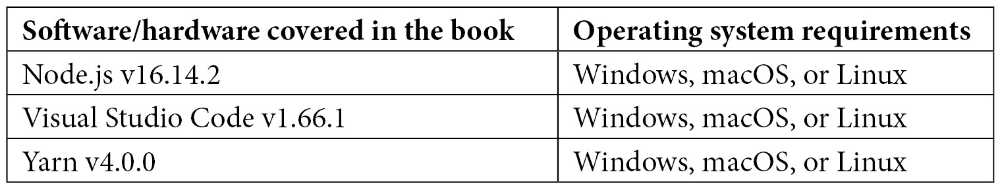

# 前言

UmiJS 是一个可扩展的 JavaScript 框架，用于构建企业级前端应用程序。Umi 使用 React，并基于一个路由系统，允许你创建快速和响应式的应用程序。

在这本书中，我们将构建一个用于客户关系管理（CRM）系统的前端网络应用程序。从你的环境设置开始，我将向你介绍 UmiJS 的主要特性和项目结构。之后，我们将探索 Ant Design，这是一个拥有大量 React 组件库的设计系统，可以快速构建与现代 Umi 深度集成的现代和响应式用户界面。

你还将学习一种基于模型和服务的处理 HTTP 请求和响应的方法，以及在复杂场景中控制应用程序的状态。

在学习如何使用 Umi 之后，你将探索如何通过实施一致的代码风格和使用格式化工具如 Prettier 和 EditorConfig 来提高代码质量。你还将学习如何为前端应用程序设计和实现测试。

最后，你将在 AWS Amplify 上托管你的 CRM 前端应用程序，AWS Amplify 是一个现成的平台，供前端开发者使用多种 AWS 服务构建全栈应用程序。

# 本书面向的对象

这本书是为那些刚开始使用 UmiJS 并构建大型网络应用程序的 React 开发者而写的。我假设你已经了解 React 和设计网络应用程序的基础知识。

# 本书涵盖的内容

*第一章*，*环境设置和 UmiJS 简介*，你将安装所有需要的工具来跟随本书的练习，并学习 UmiJS 的主要特性。

*第二章*，*使用 Ant Design 创建用户界面*，你将探索 Ant Design 系统，并使用其 React 组件库创建界面。

*第三章*，*使用模型、服务和模拟数据*，你将学习一种基于模型和服务的处理请求、管理应用程序状态和通过模拟文件模拟数据的方法。

*第四章*，*错误处理、身份验证和路由保护*，你将在应用程序中实现错误处理、安全控制和授权。

*第五章*，*代码风格和格式化工具*，我们将讨论代码风格并配置 Prettier 和 EditorConfig 以在项目中自动格式化和强制执行一致的代码风格。

*第六章*，*测试前端应用程序*，我们将讨论软件测试，并使用 Puppeteer 为你的应用程序实现一些测试。

*第七章*，“单页应用部署”，是你准备应用程序进行部署并在 AWS Amplify 上托管的地方。

# 要充分利用本书

要完成这些书籍练习，你只需要一台装有现代操作系统的电脑（例如 Windows 10/11、macOS 10.15 或 Ubuntu 20.04）。我将在*第一章*，“环境设置和 UmiJS 简介”中给你安装其他所需软件的说明。



需要指出的是，你需要一个免费的 GitHub 账户来访问代码示例并完成*第七章*，“单页应用部署”。

**如果你使用的是这本书的数字版，我们建议你亲自输入代码或从书的 GitHub 仓库（下一节中有一个链接）获取代码。这样做将帮助你避免与代码复制粘贴相关的任何潜在错误。**

# 下载示例代码文件

你可以从 GitHub 下载本书的示例代码文件[`github.com/PacktPublishing/Enterprise-React-Development-with-UmiJs`](https://github.com/PacktPublishing/Enterprise-React-Development-with-UmiJs)。如果代码有更新，它将在 GitHub 仓库中更新。

我们还有其他来自我们丰富的书籍和视频目录的代码包，可在[`github.com/PacktPublishing/`](https://github.com/PacktPublishing/)找到。查看它们吧！

# 使用的约定

本书使用了多种文本约定。

`文本中的代码`：表示文本中的代码单词、数据库表名、文件夹名、文件名、文件扩展名、路径名、虚拟 URL、用户输入和 Twitter 昵称。以下是一个示例：“在这个例子中，我们使用了`describe`方法为与数学问题相关的两个测试创建了一个组。”

代码块设置如下：

```js
export default {
  'home.recents': 'Recent opportunities',
  'greetings.hello': 'Hello',
  'greetings.welcome': 'welcome',
};
```

当我们希望将你的注意力引向代码块中的特定部分时，相关的行或项目将以粗体显示：

```js
async function login(page: Page) {
  await page.goto('http://localhost:8000');
  await page.waitForNavigation();
  await page.type('#username', 'john@doe.com');
  await page.type('#password', 'user');
  await page.click('#loginbtn');
}
```

任何命令行输入或输出都应如下编写：

```js
yarn add -D puppeteer
```

**粗体**：表示新术语、重要单词或屏幕上看到的单词。例如，菜单或对话框中的单词以**粗体**显示。以下是一个示例：“**机会**页面允许用户浏览并注册新的销售机会。”

小贴士或重要注意事项

看起来像这样。

# 联系我们

我们始终欢迎读者的反馈。

`customercare@packtpub.com`并在邮件主题中提及书名。

**勘误表**：尽管我们已经尽最大努力确保内容的准确性，但错误仍然可能发生。如果你在这本书中发现了错误，我们将非常感激你向我们报告。请访问[www.packtpub.com/support/errata](http://www.packtpub.com/support/errata)并填写表格。

`copyright@packt.com`，并附有材料链接。

**如果您有兴趣成为作者**：如果您在某个领域有专业知识，并且对撰写或参与一本书籍感兴趣，请访问[authors.packtpub.com](http://authors.packtpub.com)。

# 分享您的想法

一旦您阅读了《使用 UmiJS 进行企业级 React 开发》，我们非常期待听到您的想法！请[点击此处直接访问此书的亚马逊评论页面](https://packt.link/r/1803238968)并分享您的反馈。

您的评论对我们和科技社区都非常重要，并将帮助我们确保我们提供高质量的内容。
