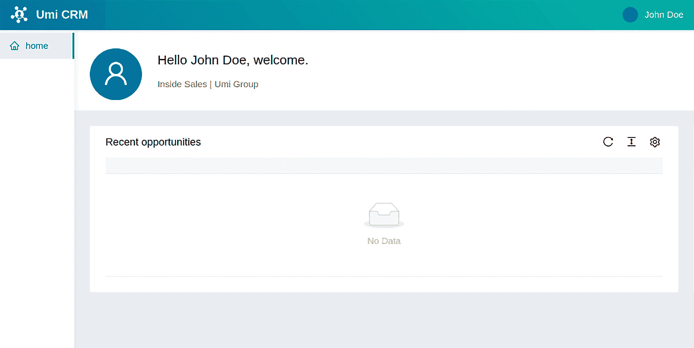
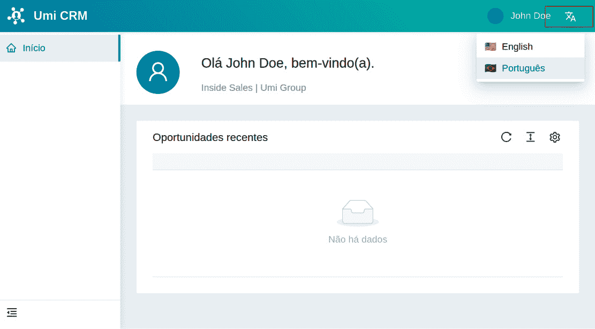
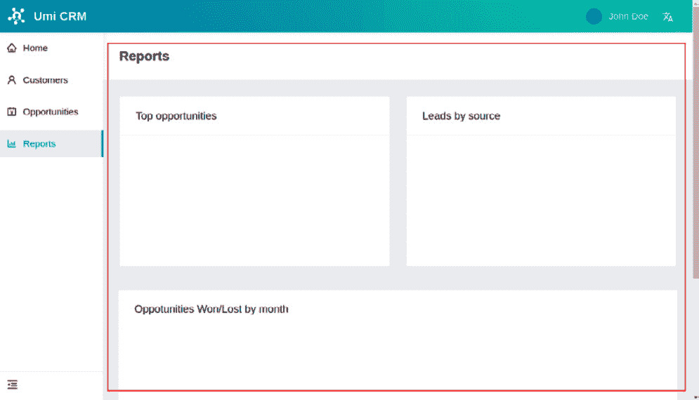

# 第二章：使用 Ant Design 创建用户界面

遵循 `antd` 库的原则，该库提供了一系列 React 组件，您可以使用它们来加速用户界面开发。

在本章中，我们将研究 `antd` 库并使用它创建用户界面。第一部分将向您介绍我们将要开发的项目，一个 **客户关系管理**（CRM）应用程序。然后，我们将配置布局插件和主题。我们将创建主页并配置国际化支持（也称为 **i18n**）。最后，我们将创建 **机会** 页面、**客户** 页面和 **报告** 页面。

在本章中，我们将涵盖以下主要内容：

+   项目和 Ant Design 介绍

+   设置布局和主题

+   创建主页和设置国际化

+   创建机会和客户页面

+   创建 **报告** 页面

到本章结束时，您将学会如何在 `antd` 库中搜索和找到满足您需求的正确组件。您将学会如何配置 `plugin-layout`，自定义应用程序的默认主题，并定义全局样式。您还将了解如何使用 `plugin-locale` 设置国际化支持。

# 技术要求

要完成本章的练习，您只需要一台安装了任何操作系统（我推荐 Ubuntu 20.04 或更高版本）的电脑以及 *第一章** 环境设置和 UmiJS 介绍*（VScode、Node.js 和 Yarn）的软件。

您可以在 GitHub 仓库的 `Chapter02` 文件夹中找到完整的项目，该仓库可在以下链接找到：

[`github.com/PacktPublishing/Enterprise-React-Development-with-UmiJs`](https://github.com/PacktPublishing/Enterprise-React-Development-with-UmiJs)

# 项目和 Ant Design 介绍

本节将向您介绍我们将要开发的项目以及 Ant Design React 库。

为了说明 UmiJS 和 Ant Design 的实际应用，我们将为 CRM 系统开发一个前端应用程序。

CRM 系统是一种商业应用程序，它允许公司接触客户，提供解决方案，并与各种战略联系人建立关系，以向客户销售正确的解决方案并保证他们的满意度。

在我们的示例中，该应用程序有三个主要功能：带有各种报告的仪表板、跟踪机会的注册和客户注册。

我们还将保证我们的应用程序在面对业务需求时易于扩展和修改，拥有清晰的代码风格，并支持国际化。

为了构建我们前端应用程序的接口，我们将使用 Ant Design React 库。让我们更深入地了解 `antd` 库和 Pro 组件。

## Ant Design 组件介绍

Ant Design 库是一个遵循 Ant Design 系统设计原则的 React 组件库。Ant Design 库是用 TypeScript 编写的，提供可预测的静态类型、国际化支持和主题定制。该库还与 UmiJS 深度集成，因此使用 UmiJS 可以轻松定制主题和设置国际化支持。

您可以浏览库并查找组件，请访问[`ant.design/components/overview/`](https://ant.design/components/overview/)。在此文档页面上，您将找到每个库组件的详细描述以及相应的代码示例。

我们还将使用来自**Pro components**的一些组件，这是一个由 Ant Design 派生出的组件集，以提供高级别的抽象，使构建复杂界面的任务更加容易。您可以在[`procomponents.ant.design/en-US/components`](https://procomponents.ant.design/en-US/components)查找 Pro components。

在本节中，您了解了 Ant Design React 库，并介绍了我们将要构建的项目。让我们通过设置默认布局和主题来开始构建界面。

# 设置布局和主题

在本节中，我们将使用`plugin-layout`设置默认布局，并自定义我们的应用程序主题，更改`antd`使用的默认 LESS 变量。为此，请按照以下步骤操作：

1.  我们将使用上一章中创建的项目。将`plugin-layout`配置添加到`config.ts`文件中，如下所示：

    ```js
    layout: {
        navTheme: 'light',
        layout: 'mix',
        contentWidth: 'fluid',
        fixedHeader: false,
        fixSiderbar: true,
        colorWeak: false,
        title: 'Umi CRM',
        locale: true,
        pwa: false,
        logo: 'https://img.icons8.com/ios-filled/50/ffffff/
               customer-insight.png',
        iconfontUrl: '',
    },
    ```

此配置为所有页面添加了页头和菜单，定义了应用程序名称和标志，并在布局组件中启用了`plugin-locale`。

您也可以根据需要更改布局。例如，您可以将菜单设置为在页眉中显示而不是侧菜单，将`layout`属性更改为`top`。

1.  让我们还将更改所有接口和组件使用的主题主色。将此配置添加到`config.ts`文件中：

    ```js
    theme: {
        'primary-color': '#1895bb',
    },
    ```

主题配置更改了 Ant Design 组件使用的默认 LESS 变量值。

重要信息

您可以在[`github.com/ant-design/ant-design/blob/master/components/style/themes/default.less`](https://github.com/ant-design/ant-design/blob/master/components/style/themes/default.less)找到所有默认的 LESS 变量。

1.  接下来，我们需要在`app.tsx`文件中添加一些`plugin-layout`的配置。将以下内容添加到`app.tsx`文件中：

    ```js
    import routes from '../config/routes';
    import { RunTimeLayoutConfig } from 'umi';
    export const layout: RunTimeLayoutConfig = () => {
      return {
        routes,
        rightContentRender: () => <></>,
        onPageChange: () => {},
      };
    };
    ```

使用此配置，我们设置了将在侧菜单上渲染的`plugin-layou`t 路由。

1.  为了正确显示侧菜单中的菜单项，调整路由配置如下：

routes.ts

```js
export default [
  {
    path: '/login',
    component: '@/pages/Login',
    layout: false,
  },
  {
    path: '/',
    name: 'home',
    icon: 'home',
    component: '@/pages/Home',
  },
];
```

我们定义了登录页面和主页的路由。`layout: false`属性将使默认布局不在登录页面上显示。`name`和`icon`属性定义了`Home`页面在侧菜单中的显示方式。

Ant Design 提供了图标，你可以在[`ant.design/components/icon/`](https://ant.design/components/icon/)查找其他图标。

现在让我们通过添加快速菜单、语言选择器并将其样式更改为使用我们的主色调来完成默认布局。

## 向布局头部添加右侧内容

首先，让我们创建两个新的组件：`HeaderMenu`，它将包含用户的头像、用户名和登出菜单项；以及`HeaderOptions`组件，它将包括`HeaderMenu`和`SelectLang`组件。`SelectLang`是 UmiJS 提供的一个组件，可以通过`plugin-locale`在应用程序支持的语言之间切换。

按照以下步骤创建`HeaderMenu`组件：

1.  在`src`文件夹中创建一个名为`components`的新文件夹，并在其中创建一个名为`HeaderMenu`的新文件夹。

1.  在`HeaderMenu`文件夹中，创建两个文件：`index.tsx`和`index.less`。

1.  在`index.tsx`文件中，创建组件如下：

    ```js
    import { Avatar, Dropdown, Menu } from 'antd';
    import styles from './index.less';
    import { LogoutOutlined } from '@ant-design/icons';
    export default function HeaderMenu() {
      const options = (
        <Menu className={styles.menu}>
          <Menu.Item key="center">
            <LogoutOutlined /> Logout
          </Menu.Item>
        </Menu>
      );
      return (
        <Dropdown 
          className={styles.dropdown} 
          overlay={options}>
          <span>
            <Avatar 
              size="small" 
              className={styles.avatar} />
            <span 
              className={`${styles.name} anticon`}>
                John Doe
            </span>
          </span>
        </Dropdown>
      );
    }
    ```

在此组件中，我们使用`antd`库的`Menu`组件来渲染登出菜单项，以及`Dropdown`和`Avatar`组件来渲染用户的头像和用户名。当鼠标悬停在用户名或头像上时，将显示登出选项。

1.  在`index.less`文件中创建`Avatar`和`Dropdown`组件的 CSS 类，如下所示：

    ```js
    .avatar {
      color: white;
      background-color: #1895bb;
      margin: 0px 10px;
    }
    .dropdown {
      display: flex;
      flex-flow: row nowrap;
      cursor: pointer;
      align-items: center;
      float: right;
      height: 48px;
      margin-left: auto;
      overflow: hidden;
    }
    ```

现在按照以下步骤创建`HeaderOptions`组件：

1.  在`components`文件夹中，创建一个名为`HeaderOptions`的新文件夹。在其内部，创建一个名为`index.tsx`的文件。

1.  在`index.tsx`文件中，创建组件如下：

    ```js
    import { Space } from 'antd';
    import { SelectLang } from 'umi';
    import HeaderMenu from '../HeaderMenu';
    export default function HeaderOptions() {
      return (
        <Space>
          <HeaderMenu />
          <SelectLang />
        </Space>
      );
    }
    ```

在此组件中，我们使用`antd`的`Space`组件和最近创建的`HeaderMenu`组件以及来自 UmiJS 的`SelectLang`组件来渲染布局头部选项。

![Figure 2.1 – The language selector (SelectLang component)]

![Figure 2.01_B18503.jpg]

Figure 2.1 – The language selector (SelectLang component)

现在，要将`HeaderOptions`组件添加到布局中，请按照以下步骤操作：

1.  导入`HeaderOptions`组件，将以下行添加到`app.tsx`文件中：

    ```js
    import HeaderOptions from './components/HeaderOptions';
    ```

1.  将`HeaderOptions`组件添加到`rightContentRender 配置`中，如下所示：

    ```js
    export const layout: RunTimeLayoutConfig = () => {
      return {
        routes,
        rightContentRender: () => <HeaderOptions />,
        onPageChange: () => {},
      };
    };
    ```

现在，`HeaderOptions`组件应该如下显示在布局头部：

![Figure 2.2 – Layout right content]

![Figure 2.02_B18503.jpg]

Figure 2.2 – Layout right content

你可能已经注意到语言选择器没有出现。一旦我们向项目中添加语言支持，它就会出现。

为了完成布局的设置，让我们添加主色调。我们可以通过使用`global.less`文件来自定义应用于布局头部的 CSS 类来添加主色调。

UmiJS 将在所有其他样式表之前应用`global.less`文件，因此当你需要自定义某些样式或跨所有界面应用它时，你可以使用此文件。

按照以下步骤自定义应用于布局头部的 CSS 类：

1.  在`src`文件夹下创建一个名为`global.less`的新文件。

1.  将此样式添加到`global.less`文件中：

    ```js
    .ant-pro-global-header-layout-mix {
      background: #1895bb;
      background: linear-gradient(50deg, #1895bb 0%, 
        #14cfbd 100%);
    }
    ```

我们使用主色调添加了背景渐变到 CSS 类中，并将其应用于全局页眉。

提示

您可以通过使用浏览器开发者工具检查页面来找到应用于 HTML 元素的 CSS 类。通常，您需要按*F12*并查找**元素**选项卡。

现在布局页眉应该看起来像这样：


![Figure 2.3 – 应用了主色调的布局页眉

在本节中，我们通过配置`plugin-layout`和自定义`global.less`文件来设置所有页面的默认布局。我们还创建了渲染用户头像、用户名和语言选择器的组件。现在让我们构建主页并设置国际化。

# 创建主页和设置 i18n

在本节中，我们将创建主页并设置应用程序的葡萄牙语和英语国际化。

我们的主页将由两个主要组件组成：`PageContainer`和`ProTable`。当用户登录应用程序时，我们希望他们看到一些信息，例如用户名、角色和最近打开的机会列表。为此，请按照以下步骤操作：

1.  让我们从向`src/pages/Home`文件夹下的`index.tsx`文件添加`PageContainer`组件开始，如下所示：

    ```js
    import styles from './index.less';
    import { PageContainer } from '@ant-design/pro-layout';
    import { UserOutlined } from '@ant-design/icons';
    export default function IndexPage() {
      return (
        <PageContainer
          header={{ title: undefined }}
          style={{ minHeight: '90vh' }}
          content={<></>}
        ></PageContainer>
      );
    }
    ```

默认情况下，`PageContainer`组件将渲染您在`routes.ts`文件中定义的路由名称作为页面标题，但我们将它设置为`undefined`，因为我们不想在这个页面上显示标题。

1.  现在我们将在`PageContainer`的内容中添加一些基本信息。我们希望当用户登录应用程序时，他们能看到问候语，然后是他们的名字、角色和头像，所以请将以下信息添加到`PageContainer`的`content`属性中，如下所示：

    ```js
    content={
    <div className={styles.pageHeaderContent}>
              <div className={styles.avatar}>
                <Avatar
                  alt="avatar"
                  className={styles.avatarComponent}
                  size={{ xs: 64, sm: 64, md: 64, lg: 64, 
                    xl: 80, xxl: 100 }}
                  icon={<UserOutlined />}
                />
             </div>
             <div className={styles.content}>
               <div className={styles.contentTitle}>
                 Hello John Doe, welcome.</div>
               <div>Inside Sales | Umi Group</div>
             </div>
    </div>
    }
    ```

在这里，我们添加了来自`antd`的`Avatar`组件，然后是问候语、用户名和角色。

1.  我们还需要在文件`index.less`中定义样式。将以下样式添加到`src/pages/Home`文件夹下的`index.less`文件中，如下所示：

    ```js
    @import '~antd/es/style/themes/default.less';
    .pageHeaderContent {
      display: flex;
      .avatar {
        flex: 0 1 72px;
        & > span {
          display: block;
          width: 72px;
          height: 72px;
          border-radius: 72px;
        }
        .avatarComponent {
          color: white;
          background-color: @primary-color;
        }
      }
      .content {
        position: relative;
        top: 4px;
        flex: 1 1 auto;
        margin-left: 24px;
        color: @text-color-secondary;
        line-height: 22px;
        .contentTitle {
          margin-bottom: 12px;
          color: @heading-color;
          font-weight: 500;
          font-size: 20px;
          line-height: 28px;
        }
      }
    }
    ```

注意，我们已从`antd`导入了一个名为`default.less`的文件。此文件包含 Ant Design 组件用于定义样式的默认 LESS 变量。我们也在我们的 CSS 类中使用了一些这些变量。

我强烈建议您熟悉这些变量；这将帮助您与 Ant Design 规范保持一致的风格。您可以通过按*Ctrl*并单击其导入路径来访问`default.less`文件，或者您可以在 GitHub 上查看该文件：[`github.com/ant-design/ant-design/blob/master/components/style/themes/default.less`](https://github.com/ant-design/ant-design/blob/master/components/style/themes/default.less)。

我们将在我们的页面上添加的下一个组件是`ProTable`；这是一个抽象了在表格中操作一批数据逻辑的 Pro 组件组件。

1.  要添加组件，我们需要安装其包，因此运行以下命令来完成：

    ```js
    $ yarn add @ant-design/pro-table
    ```

1.  接下来，在 `src/pages/Home` 文件夹下的 `index.tsx` 文件中，在 `PageContainer` 组件内部添加 `ProTable` 组件，如下所示：

    ```js
    <div style={{ width: '100%' }}>
      <ProTable<any>
        headerTitle="Recent opportunities"
        pagination={{ pageSize: 5 }}
        rowKey="id"
        search={false}
      />
    </div>
    ```

到目前为止，您的首页应该看起来像这样：



图 2.4 – 主页界面

现在是时候为我们的应用程序添加对 **国际化**（**i18n**）的支持了。

## 设置国际化

要使用 `plugin-locale` 添加对 i18n 的支持，首先，我们必须将所有要翻译的文本移动到 `src/locales` 文件夹下的多语言文件中。我将使用英语和葡萄牙语构建整个应用程序来演示此功能，但您不必担心这一点；您可以下载在 [`github.com/PacktPublishing/Enterprise-React-Development-with-UmiJs`](https://github.com/PacktPublishing/Enterprise-React-Development-with-UmiJs) 上可用的葡萄牙语文件。按照以下步骤创建我们的语言文件：

1.  在 `src/locales` 文件夹下创建一个名为 `en-US.ts` 的文件，下载 `pt-BR.ts` 文件，并将其放置在相同的文件夹中。

1.  在 `en-US.ts` 文件中按照以下方式输入主页的文本：

    ```js
    export default {
      'home.recents': 'Recent opportunities',
      'greetings.hello': 'Hello',
      'greetings.welcome': 'welcome',
    };
    ```

1.  我们需要使用 `FormattedMessage` 组件更改主页上的文本。在 `src/pages` 文件夹下的 `index.ts` 文件中导入组件，添加以下行：

    ```js
    import { FormattedMessage } from 'umi';
    ```

1.  并且按照以下方式更改组件的文本：

    ```js
    <div className={styles.content}>
         <div className={styles.contentTitle}>
               <FormattedMessage id="greetings.hello" /> 
                 John Doe,{' '}
               <FormattedMessage id="greetings.welcome" />.
          </div>
          <div>Inside Sales | Umi Group</div>
    </div>
    ```

1.  还要按照以下方式更改 `ProTable` 的 `headerTitle` 属性：

    ```js
    headerTitle={<FormattedMessage id="home.recents" />}
    ```

`FormattedMessage` 组件的属性 `id` 必须与 `en-US.ts` 和 `pt-BR.ts` 文件中的相同键匹配。当你选择语言时，组件将渲染相应的文本。

我们需要翻译菜单标题，所以让我们添加要翻译的菜单项文件。按照以下步骤操作：

1.  在 `src/locales` 文件夹下创建一个名为 `en-US` 的新文件夹。在 `en-US` 文件夹下，创建一个名为 `menu.ts` 的新文件。

1.  将要渲染在菜单项中的文本添加到 `menu.ts` 文件中，如下所示：

    ```js
    export default {
      'menu.home': 'Home',
    };
    ```

文本的键需要与 `routes.ts` 文件中的 `name` 属性匹配。`plugin-locale` 将在您在语言之间切换时渲染正确的文本。

1.  按照以下方式将 `menu.ts` 文件导入到 `en-US.ts` 文件中：

    ```js
    import menu from './en-US/menu';
    export default {
      ...menu,
      'home.recents': 'Recent opportunities',
      'greetings.hello': 'Hello',
      'greetings.welcome': 'welcome',
    };
    ```

1.  我们还需要将 `menu.ts` 文件添加到葡萄牙语中，所以在 `src/locales` 文件夹下创建一个名为 `pt-BR` 的新文件夹，从 [`github.com/PacktPublishing/Enterprise-React-Development-with-UmiJs`](https://github.com/PacktPublishing/Enterprise-React-Development-with-UmiJs) 下载可用的 `menu.ts` 文件，并将其放置在 `pt-BR` 文件夹下。

现在您可以使用页面顶部的语言选择器更改应用程序的语言，如下面的截图所示：



图 2.5 – 选择葡萄牙语的主页

在本节中，我们使用 `PageContainer` 和 `ProTable` 组件创建了主页。我们还通过在 `src/locales` 文件夹下创建多语言文件并使用 `FormattedMessage` 组件替换文本为相应的翻译来设置国际化。

现在，您将使用所学知识来创建 **机会** 和 **客户** 页面。

# 创建机会和客户页面

在本节中，我们将构建 **机会** 和 **客户** 页面。

**机会** 页面允许用户浏览和注册新的销售机会。当客户似乎对购买产品或服务感兴趣时，就会发生销售机会。在 **机会** 页面上，我们跟踪所有活动，直到机会被赢得（客户购买产品或服务），或者直到机会丢失（客户购买竞争对手的产品或取消购买）。

**客户** 页面允许用户注册和搜索客户的联系信息。

这两个页面相似；它们使用 `ProTable` 组件列出注册的机会和客户。运行以下命令生成两个页面：

```js
$ yarn umi g page /Customers/index --typescript --less
$ yarn umi g page /Opportunities/index --typescript --less
```

现在，让我们从 **客户** 页面开始。按照以下步骤构建 **客户** 页面界面：

1.  将 `PageContainer` 和 `ProTable` 组件添加到 `src/pages/Customer` 文件夹下的 `index.tsx` 文件中，如下所示：

    ```js
    import { PlusOutlined } from '@ant-design/icons';
    import { Button } from 'antd';
    import ProTable from '@ant-design/pro-table';
    import { FormattedMessage, getLocale } from 'umi';
    import { PageContainer } from '@ant-design/pro-layout';
    export default function Page() {
      return (
        <PageContainer style={{ minHeight: '90vh' }}>
          <ProTable<any>
            rowKey="id"
            headerTitle=
              {<FormattedMessage id="table.customer.title" 
              />}
            search={{ labelWidth: 'auto' }}
            pagination={{ pageSize: 5 }}
            dateFormatter="string"
            locale={getLocale()}
            toolBarRender={() => [
              <Button key="button" icon={<PlusOutlined />} 
                type="primary">
                <FormattedMessage id="table.new" />
              </Button>,
            ]}
          />
        </PageContainer>
      );
    }
    ```

注意，我们使用 `FormattedMessage` 组件在此页面上渲染文本，因此我们需要将这些文本添加到 `src/locales` 文件夹中的多语言文件中。

1.  按照以下方式将 `en-US.ts` 文件中的文本添加：

    ```js
    import menu from './en-US/menu';
    export default {
      ...menu,
      'home.recents': 'Recent opportunities',
      'greetings.hello': 'Hello',
      'greetings.welcome': 'welcome',
      'table.opportunity.title': 'Opportunities',
      'table.customer.title': 'Customers',
    };
    ```

1.  现在，要访问 `routes.ts` 文件，请按照以下方式：

    ```js
    {
        path: '/customers',
        name: 'customers',
        icon: 'user',
        component: '@/pages/Customers',
    },
    ```

1.  将客户菜单项标题添加到 `src/locales/en-US` 文件夹下的 `menu.ts` 文件中，如下所示：

    ```js
    export default {
      'menu.opportunities': 'Opportunities',
      'menu.customers': 'Customers',
    };
    ```

现在，按照之前演示的步骤构建 **机会** 页面：

1.  对于 `ProTable` 的 `headerTitle` 属性，请输入以下内容：

    ```js
    headerTitle={<FormattedMessage id="table.opportunity.title" />}
    ```

1.  定义 **机会** 页面的路由如下：

    ```js
    {
        path: '/opportunities',
        name: 'opportunities',
        icon: 'AccountBook',
        component: '@/pages/Opportunities',
    },
    ```

1.  不要忘记将文本添加到 `en-US.ts` 和 `menu.ts` 文件中。

结果应该看起来像这样：

![图 2.6 – 机会页面布局和菜单项

![img/Figure_2.06_B18503.jpg]

图 2.6 – 机会页面布局和菜单项

在本节中，我们创建了支持国际化的 `ProTable` 组件。接下来，我们将构建 **报告** 页面。

# 创建报告页面

现在，我们将构建 **报告** 页面。用户可以在此页面上获取有用的信息，以深入了解销售生命周期。我们将使用 bizcharts 组件库在此页面上添加三个图表。

bizcharts 库专注于商业场景，致力于创建专业的数据可视化解决方案。它也是一个开源项目，遵循 MIT 许可协议。您可以在 [`bizcharts.taobao.com/`](https://bizcharts.taobao.com/) 了解更多关于 bizcharts 的信息：

1.  首先，运行以下命令来安装 bizcharts 包：

    ```js
    $ yarn add bizcharts
    ```

1.  接下来，运行以下命令以生成**报告**页面：

    ```js
    $ yarn umi g page /Reports/index --typescript --less
    ```

现在，按照以下步骤创建**报告**页面界面：

1.  让我们使用`antd`组件定义页面布局。将以下组件添加到`src/pages/Reports`文件夹下的`index.tsx`文件：

    ```js
    import { PageContainer } from '@ant-design/pro-layout';
    import { Row, Col, Card } from 'antd';
    import { FormattedMessage } from 'umi';
    import {
      Chart,
      Coordinate,
      Axis,
      Legend,
      Interval,
      Tooltip,
      Interaction,
    } from 'bizcharts';
    const colProps = {
      style: { marginBottom: 24 },
      xs: 24,
      sm: 12,
      md: 12,
      lg: 12,
      xl: 12,
    };
    export default function Page() {
      return (
        <PageContainer>
          <Row gutter={24}>
            <Col {...colProps}></Col>
            <Col {...colProps}></Col>
          </Row>
          <Row gutter={24} style={{ padding: 10 }}></Row>
        </PageContainer>
      );
    }
    ```

我们使用两个响应式行定义了布局，第一行有两个响应式列。`colProps`变量设置列在不同断点处如何调整其大小。

1.  现在，让我们添加第一个图表。这个图表将显示由 CRM 分析服务分类的前四个最重要的机会。如下将 bizcharts 中的`Chart`组件添加到第一行的第一列：

    ```js
    <Card title={<FormattedMessage id="chart.top" />}>
      <Chart height={200} data={[]} autoFit>
        <Coordinate transpose />
        <Axis name="name" label={false} />
        <Axis
          name="revenue"
          label={{
            formatter: (text) => `$ ${text}`,
          }}
        />
        <Interval
          type="interval"
          label={["name", (name) => <>{name}</>]}
          tooltip={{
            fields: ["name", "revenue"],
            callback: (name, revenue) => {
              return { name: name, value: `$ ${revenue}` };
            },
          }}
          color={["name", "#3936FE-#14CCBE"]}
          position="name*revenue"
        />
          <Interaction type="element-single-selected" />
      </Chart>
    </Card>
    ```

我们可以使用其子组件配置`Chart`组件。我们使用`Coordinate`组件将图表设置为反转*x*和*y*轴。使用`Axis`组件，我们定义了一个名为`revenue`的新轴。`Interval`组件描述了图表类型和将使用`position`属性填充轴的键。

注意，我们在`data`属性中设置了一个空数组。我们将在未来将想要显示的信息放入`data`属性中。

1.  让我们添加第二个图表。这个图表将显示客户来源及其比例。如下将`Chart`组件添加到第一行的第二列：

    ```js
    <Card title={<FormattedMessage id="chart.leads" />}>
      <Chart
        height={200}
        data={[]}
        scale={{
          percent: {
            formatter: (val: any) => {
              val = val * 100 + "%";
              return val;
            },
          },
        }}
        autoFit
      >
        <Coordinate type="theta" radius={0.95} />
        <Tooltip showTitle={false} />
        <Axis visible={false} />
        <Legend position="right" />
        <Interval
          position="percent"
          adjust="stack"
          color="source"
          style={{
            lineWidth: 1,
            stroke: "#fff",
          }}
        />
        <Interaction type="element-single-selected" />
      </Chart>
    </Card>
    ```

在此图表中，我们将`Coordinate`组件设置为圆柱坐标以生成饼图。使用`Interaction`组件，我们将图表设置为在鼠标悬停或点击时做出反应。

1.  最后一个图表显示了按月获得和失去的机会。如下将`Chart`组件添加到第二行：

    ```js
    <Card
      style={{ width: '100%' }}
      title={<FormattedMessage id="chart.month" />}
    >
      <Chart height={300} padding="auto" data={[]} autoFit>
        <Interval
          adjust={[
            {
              type: 'dodge',
              marginRatio: 0,
            },
          ]}
          color={['name', '#3776E7-#14CCBE']}
          position="month*value"
        />
        <Tooltip shared />
      </Chart>
    </Card>
    ```

1.  要完成`src/locales`文件夹下的`en-US.ts`文件：

    ```js
    'chart.top': 'Top opportunities',
    'chart.leads': 'Leads by source',
    'chart.month': 'Opportunities Won/Lost by month',
    ```

1.  并将以下文本添加到`src/locales/en-US`文件夹下的`menu.ts`文件：

    ```js
    'menu.reports': 'Reports',
    ```

1.  最后，按照以下方式配置`routes.ts`文件：

    ```js
    {
      path: '/reports',
      name: 'reports',
      icon: 'BarChartOutlined',
      component: '@/pages/Reports',
    },
    ```

现在，**报告**页面已完成，应该看起来像这样：



图 2.7 – 报告页面布局

注意，所有图表卡片都是空的，因为我们定义了所有图表`data`属性中的空数组。我们将在下一章生成显示图表所需的数据。

在本节中，我们使用 bizcharts 库创建了**报告**页面。我们在页面上添加了三个图表：一个名为**顶级机会**的柱状图，一个名为**来源线索**的饼图，以及一个名为**按月赢得/失去的机会**的柱状图。

# 摘要

在本章中，你被介绍到我们将要构建的项目，Ant Design React 库和 Pro 组件。你还学习了如何使用 UmiJS 布局插件配置布局，并使用`global.less`文件定义和自定义全局布局。你学习了如何通过更改 Ant Design 组件使用的默认 LESS 变量来自定义应用程序主题。

我们还创建并定义了应用布局右侧内容，以显示用户的姓名、头像和语言选择器。你学习了如何使用 UmiJS 本地化插件来设置国际化，并创建了主页。接下来，我们制作了 `ProTable` 组件。

最后，我们使用 **antd** 库组件来定义布局，并使用 bizcharts 库来渲染三个图表来构建了 **报告** 页面。

在下一章中，我们将生成模拟 API，向后端发送请求，并学习如何使用服务和模型。
