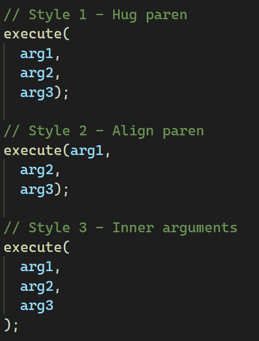

# 第五章：代码风格和格式化工具

除了满足业务需求外，一个专业的前端项目还应具备易于维护和扩展的干净源代码。

在本章中，我们将讨论代码风格和一致性。接下来，您将学习如何使用**Prettier**和**EditorConfig**在拥有多个成员且使用各种**集成开发环境**（**IDEs**）和编辑器的团队中强制执行标准的代码格式。最后，我们将把**ESLint**添加到我们的项目中，并配置它与 Prettier 一起工作以提高代码质量。

在本章中，我们将涵盖以下主要主题：

+   理解代码风格和一致性

+   与 EditorConfig 和 Prettier 协作

+   配置 ESLint 和 Prettier

到本章结束时，您将学会如何配置 Prettier 和 EditorConfig，避免冲突和冗余。您还将学会如何配置 ESLint 来提高代码质量，并使用 Prettier 在同一个项目中格式化代码，避免这两个工具之间的冲突。

# 技术要求

要完成本章的练习，您只需要一台安装了任何操作系统（我推荐 Ubuntu 20.04 或更高版本）的计算机以及*第一章**，环境设置和 UmiJS 简介*（VS Code、Node.js 和 Yarn）的软件。

您可以在 GitHub 仓库中找到完整的项目，该仓库位于[`github.com/PacktPublishing/Enterprise-React-Development-with-UmiJs`](https://github.com/PacktPublishing/Enterprise-React-Development-with-UmiJs)的`Chapter05`文件夹中。

# 理解代码风格和一致性

在本节中，我们将通过一些示例讨论代码风格，这样您就能理解为什么在处理大型企业项目时使用**Prettier**、**EditorConfig**和**ESLint**等工具是至关重要的。

我们将不会讨论 JavaScript 代码约定，但如果您想复习这个主题，我建议您阅读[`developer.mozilla.org/en-US/docs/MDN/Guidelines/Code_guidelines/JavaScript`](https://developer.mozilla.org/en-US/docs/MDN/Guidelines/Code_guidelines/JavaScript)上的*Mozilla 开发者网络 JavaScript 指南*。

每位开发者在决定如何格式化代码时都有自己的偏好。即使遵循特定的语言约定，关于代码格式的某些决定也可能使开发者产生分歧。考虑以下函数调用示例：

```js
function execute(param1, param2, param3) {
    return param1 + param2 + param3;
}
execute(arg1, arg2, arg3);
```

在这里，我们通过传递参数的方式调用函数。在某些情况下，当传递更多参数时，您可能需要分解函数调用，并且您可以通过不同的方式来完成。考虑以下示例：



图 5.1 – 以三种不同的风格分解函数调用

在这里，我们以三种不同的风格分解了相同的函数调用：紧贴最后一个括号、对齐括号和对齐参数。现在想象一下，第一个参数又是一个函数调用；复杂性开始增加。考虑另一个例子：


图 5.2 – 分解函数和内部函数

在这里，我们使用三种不同的代码风格分解了函数和内部函数调用。你可能已经注意到，每种方法都极大地改变了代码风格。随着更多开发者参与代码并使用不同的风格，代码库将变得不整洁、不专业且难以阅读。

一些风格决策也可能使代码更难以理解。考虑以下例子：


图 5.3 – 带括号和不带括号的条件三元运算符

在这里，我们使用了两种不同的风格来使用条件三元运算符：不带括号和带括号包围。在复杂条件下使用括号可以使代码更容易阅读和理解。

当与大型项目和多个团队成员一起工作时，专业的方法是定义一个标准代码风格，每个开发者都必须遵循。代码风格应该被讨论和记录，以便每个开发者都知道如何使用它。然而，这种方法也引入了其他挑战，因为我们需要确保所有开发者都遵循代码风格。可能的结果是你将不得不审查代码以修复代码风格问题，这既浪费时间又浪费金钱，因为它没有为客户带来价值。

为了避免花费时间审查代码只是为了修复代码风格问题，我们可以使用强制代码风格的格式化工具。

你可以使用众多工具来强制 JavaScript 项目的代码风格和一致性。在接下来的章节中，我们将重点关注三个解决前面提到的问题的工具。我们将查看以下三个工具：

+   Prettier，一个可以解析和格式化 JavaScript、LESS 样式表、JSX 组件等格式的格式化工具

+   EditorConfig，一个强制默认代码格式的工具，几乎任何 IDE 都可以遵循

+   ESLint，一个用于格式化、修复代码和查找质量相关问题的工具

在本节中，我们通过查看示例并理解为什么在多个团队成员的大型项目中实施工具和策略来强制一致的代码风格时需要实施工具和策略。

现在，让我们更仔细地看看 Prettier 和 EditorConfig，看看这两个工具如何协同工作来解决代码风格问题。

# 使用 EditorConfig 和 Prettier

在本节中，你将了解**Prettier**和**EditorConfig**如何协同工作以在 IDEs 和开发者的代码中强制执行代码风格，以及如何防止配置这些工具时的冗余。

让我们从学习 EditorConfig 的工作原理开始。

## 与 EditorConfig 一起工作

EditorConfig 由一个格式文件和一组插件组成，确保几乎任何 IDE 或编辑器都能遵循你在输入时定义的代码风格。在某些情况下，你甚至不需要安装任何扩展，因为各种 IDE 和编辑器都自带对 EditorConfig 的原生支持。你可以在[`editorconfig.org/`](https://editorconfig.org/)了解更多关于 EditorConfig 的信息。

让我们以**umi-app**模板中包含的格式文件为例，我们使用它从头开始启动我们的项目：

.editorconfig

```js
root = true
[*]
indent_style = space
indent_size = 2
end_of_line = lf
charset = utf-8
trim_trailing_whitespace = true
insert_final_newline = true
[*.md]
trim_trailing_whitespace = false
[Makefile]
indent_style = tab
```

在我们的项目中，我们使用了以下选项：

+   `root`: 我们使用此选项告诉 EditorConfig 我们处于`root`文件夹中，并且它不需要在任意其他文件夹中搜索`.editorconfig`文件。

+   `[*]`: 我们使用这个通配符模式将以下选项应用于项目中的每个文件。

+   `indent_style`: 我们使用此选项来定义使用空格而不是制表符进行缩进。

+   `indent_size`: 我们使用此选项来定义缩进为两个空格。

+   `end_of_line`: 此选项设置我们想要用于标记行断的控制字符。我们选择**换行符**（**LF**）字符（0x0A）。

默认的控制字符可能因 IDE 或编辑器而异。此外，IDEs 不会渲染这类字符，因此使用此选项确保跨 IDE 的一致性至关重要。

+   `charset`: 我们使用此选项来定义字符集为`utf-8`。

+   `trim_trailing_whitespace`: 我们将此选项设置为`true`以删除新行之前的任何空白字符。

+   `insert_final_newline`: 我们使用此选项来确保所有文件都以新行结束。

+   `[*.md]`: 我们使用这个通配符模式将以下选项应用于`README.md`文件以及其他使用 Markdown 定义的文档。

+   `trim_trailing_whitespace`: 我们将此选项设置为`false`以确保在新行之前存在空白字符。

+   `[Makefile]`: 我们使用这个通配符模式将以下选项应用于项目中存在的任何`Makefile`。

我们通常在`Makefile`中创建命令和逻辑，并使用**make**实用程序来构建和编译应用程序。

你可以在以下链接中了解更多关于这个工具的信息：[`www.gnu.org/software/make/`](https://www.gnu.org/software/make/).

+   `indent_style`: 在这里，我们使用此选项来定义使用制表符进行缩进。

如你所注意到的，我们可以使用 EditorConfig 控制代码风格的每个关键方面，并为我们项目中的每种资源类型自定义格式化。所有这些配置都在 IDEs 和编辑器中工作，以确保代码风格的一致性，无论开发者的偏好如何。

接下来，我们将看到另一个与 EditorConfig 配合得很好的工具 Prettier，以强制执行代码风格和一致性。

## 与 Prettier 一起工作

Prettier 是一个支持众多 JavaScript 框架、样式表扩展、标记语言和配置文件的代码格式化工具。

正如你所知，我们自从*第一章**，环境设置和 UmiJS 简介*以来一直在使用 Prettier。我们配置了 VS Code 在保存和粘贴时使用 Prettier 格式化代码。

在我们的项目中，EditorConfig 和 Prettier 共同承担着强制执行代码格式的责任，但采用的方法不同。当 EditorConfig 覆盖 IDE 或编辑器的代码风格并确保代码在输入时正确格式化时，Prettier 在开发者输入代码后应用标准代码风格，用 Prettier 定义的标准化代码风格替换原有风格。

当使用 Prettier 时，开发者不需要担心遵循特定的代码风格；他们可以专注于定义接口和开发业务规则。Prettier 将使用一致的代码风格格式化代码，并且几乎不再需要团队就代码风格进行辩论。

虽然 Prettier 不需要很多配置，但在 `.prettierrc` 文件中我们可以定义一些选项。让我们更仔细地看看我们项目的配置：

`.prettierrc`

```js
{
  "singleQuote": true,
  "trailingComma": "all",
  "printWidth": 80,
  "overrides": [
    {
      "files": ".prettierrc",
      "options": { "parser": "json" }
    }
  ]
}
```

这些是 `.prettierrc` 文件中定义的选项：

+   `singleQuote`：我们使用这个选项在我们的代码中使用单引号而不是双引号，除非在编写 JSX 文件时，该选项被跳过并使用双引号。

+   `trailingComma`：我们使用这个选项在可能的情况下在我们的代码中打印尾随逗号。

+   `printWidth`：我们使用这个选项来定义 Prettier 在断行之前的最大行长度。

+   `overrides`：这个选项类似于 EditorConfig 中的通配符模式。在这个选项中，我们可以覆盖特定文件的选项。在这里，我们配置了 Prettier 专门为 `.prettierrc` 文件使用 `JSON parser`。

你可以在 `.prettierrc` 文件中设置的选项有限，因为 Prettier 强制执行其标准代码风格。你可以在 Prettier 文档中找到其他选项，网址为 [`prettier.io/docs/en/options.html`](https://prettier.io/docs/en/options.html)。

当在同一个项目中使用 Prettier 和 EditorConfig 时，你需要避免在这两个工具之间设置冗余的选项。一种好的方法是只将相关选项放入 `.editorconfig` 文件中，以覆盖 IDE 和编辑器的代码风格，并确保你不在 `.prettierrc` 文件中重复这些选项。

你可以看到，在我们的项目中，EditorConfig 和 Prettier 的所有配置都不同。

Prettier 将解析 `.editorconfig` 文件以遵循其配置进行代码格式化。由于 IDE 已经根据 EditorConfig 规则格式化了代码，因此 Prettier 可以跳过这些规则并应用自己的代码风格规则。

在本节中，我们学习了如何通过在 `.editorconfig` 文件中定义代码样式规则来配置 EditorConfig，通过在 `.prettierrc` 文件中定义规则来配置 Prettier。我们还学习了如何在使用这些工具时避免冗余。

接下来，我们将向项目中添加 ESLint，这是一个补充 EditorConfig 和 Prettier 以提高代码质量的必要工具。

# 配置 ESLint 和 Prettier

在本节中，我们将配置 **ESLint** 并将 Prettier 与 ESLint 集成以提高代码质量，并防止这两个工具之间的冲突。

ESLint 是一个用于分析、修复和报告可能导致代码中产生错误的代码不一致性和问题的工具。此工具可以通过实现满足项目需求规则的插件来格式化和提高代码质量。您可以在 [`eslint.org/`](https://eslint.org/) 上了解更多关于 ESLint 的信息。

与 Prettier 和 EditorConfig 一样，ESLint 也将样式规则应用于代码。在我们的场景中，我们使用 EditorConfig 来覆盖 IDE 代码样式，使用 Prettier 通过应用其自己的规则来强制执行一致的代码样式，我们将仅使用 ESLint 提供的代码质量规则。我们可以仅使用 ESLint 进行代码质量和格式化，但 Prettier 在代码格式化方面表现卓越，并且可以轻松与 ESLint 集成。

在深入了解将 Prettier 和 ESLint 集成的细节之前，让我们按照以下步骤安装和配置 ESLint：

1.  通过运行以下命令安装 ESLint：

    ```js
    yarn add eslint -D
    ```

1.  接下来，运行以下命令来配置 ESLint：

    ```js
    yarn create @eslint/config
    ```

1.  对于第一个问题，**您希望如何使用 ESLint？**，在终端中选择 **检查语法并查找问题** 选项并按 *Enter* 键：


图 5.4 – ESLint 配置 – 您希望如何使用 ESLint？

1.  对于第二个问题，**您的项目使用什么类型的模块？**，在终端中选择 **JavaScript 模块（import/export）** 选项并按 *Enter* 键：


图 5.5 – ESLint 配置 – 您的项目使用什么类型的模块？

1.  对于第三个问题，**您的项目使用哪个框架？**，在终端中选择 **React** 选项并按 *Enter* 键：


图 5.6 – ESLint 配置 – 您的项目使用哪个框架？

1.  对于第四个问题，**您的项目是否使用 TypeScript？**，选择 **是** 选项并按 *Enter* 键：


图 5.7 – ESLint 配置 – 您的项目是否使用 TypeScript？

1.  对于第五个问题，**您的代码在哪里运行？**，选择 **浏览器** 并按 *Enter* 键：


图 5.8 – ESLint 配置 – 你的代码在哪里运行？

1.  对于第六个问题，**你希望你的配置文件是什么格式？**，选择 **JSON** 并按 *Enter*：


](img/Figure_5.09_B18503.jpg)

图 5.9 – ESLint 配置 – 你希望你的配置文件是什么格式？

1.  对于第七个问题，**你想现在使用 npm 安装它们吗？**，选择 **No** 并按 *Enter*，因为我们将使用 Yarn 而不是 npm：


](img/Figure_5.10_B18503.jpg)


1.  接下来，我们需要运行以下命令来安装所需的依赖项：

    ```js
    yarn add -D eslint-plugin-react@latest @typescript-eslint/eslint-plugin@latest @typescript-eslint/parser@latest
    ```

1.  最后，让我们添加 VS Code 扩展以集成 ESLint。按 *Ctrl + P*，输入以下命令，然后按 *Enter*：

    ```js
    ext install dbaeumer.vscode-eslint
    ```

在遵循前面的步骤之后，我们的项目中应该存在一个名为 `.eslintrc.json` 的新文件，其中包含 ESLint 配置。让我们仔细看看这些配置：

.eslintrc.json

```js
{
    "env": {
        "browser": true,
        "es2021": true
    },
    "extends": [
        "eslint:recommended",
        "plugin:react/recommended",
        "plugin:@typescript-eslint/recommended"
    ],
    "parser": "@typescript-eslint/parser",
    "parserOptions": {
        "ecmaFeatures": {
            "jsx": true
        },
        "ecmaVersion": "latest",
        "sourceType": "module"
    },
    "plugins": [
        "react",
        "@typescript-eslint"
    ],
    "rules": {}
}
```

这些是 `.eslintrc.json` 文件中定义的选项：

+   `env`: 此选项定义全局变量。在这里，ESLint 声明我们在浏览器中工作并使用 ECMAScript 2021。

+   `extends`: 使用此选项，我们可以扩展其他配置文件或插件配置。在这里，ESLint 扩展了其推荐规则、`react` 插件规则和 `typescript-eslint` 插件规则。

+   `parser` 和 `parserOptions`: 使用这些选项，我们可以定义要使用哪个代码解析器以及定义解析器选项。在这里，ESLint 使用 `typescript-eslint` 包将解析器设置为 TypeScript 并启用 JSX 选项。

+   `plugins`: 使用此选项，我们可以设置 ESLint 插件。在这里，ESLint 使用了 `react` 和 `typescript-eslint` 插件。

+   `rules`: 使用此选项，我们可以修改 ESLint 规则以满足我们项目的需求。

我们希望 Prettier 和 EditorConfig 在代码风格上工作，而 ESLint 在代码质量上工作，因此我们需要禁用 ESLint 的格式化规则。这种方法也将防止 Prettier 和 ESLint 之间的冲突。按照以下步骤禁用 ESLint 的格式化规则：

1.  通过运行以下命令安装禁用 ESLint 风格规则的配置：

    ```js
    yarn add -D eslint-config-prettier
    ```

1.  现在，通过运行以下命令安装 Prettier ESLint 插件：

    ```js
    yarn add -D eslint-plugin-prettier
    ```

1.  最后，按照以下方式扩展 Prettier 插件的推荐配置：

    ```js
    "extends": [
      "eslint:recommended",
      "plugin:react/recommended",
      "plugin:@typescript-eslint/recommended",
      "plugin:prettier/recommended"
    ],
    ```

注意，我们将 Prettier 插件的配置作为 `extends` 数组的最后一个元素进行了扩展。对于 ESLint 正确合并共享配置，遵循此顺序很重要。

如果你打开任何页面组件，你可以在 `index.tsx` 文件中看到 ESLint 的作用。让我们打开位于 `/src/pages/Home` 文件夹中的主页组件。


](img/Figure_5.11_B18503.jpg)

图 5.11 – ESLint react-in-jsx-scope 规则

注意到 ESLint 根据我们 ESLint 配置中 `react` 插件的 `jsx-runtime` 配置找到了以下错误：

```js
"extends": [
  "eslint:recommended",
  "plugin:react/recommended",
  "plugin:@typescript-eslint/recommended",
  "plugin:react/jsx-runtime",
  "plugin:prettier/recommended"
],
```

在本节中，我们安装并配置了 ESLint 以确保代码质量。我们还学习了如何通过禁用 ESLint 代码风格规则并防止这两个工具之间的冲突来将 Prettier 与 ESLint 集成。

# 摘要

在本章中，我们讨论了代码风格，并了解到在多个团队成员参与的专业项目中工作时，确保一致的代码风格是至关重要的。

我们学习了如何使用 EditorConfig 在 IDE 和编辑器之间定义一致的代码风格，并保持相同的格式，无论开发者的偏好如何。接下来，我们学习了如何与 Prettier 合作来强制执行代码风格，以及如何在同一项目中与 Prettier 和 EditorConfig 一起工作时避免冗余。

我们还安装并配置了 ESLint，通过分析并报告项目中的代码问题来提高代码质量。我们通过在 ESLint 配置文件中安装并扩展 Prettier 插件配置来禁用了 ESLint 风格规则。最后，我们通过扩展 ESLint React 插件中的相应配置来禁用了 **react-in-jsx-scope** 规则。

在下一章中，我们将讨论代码测试，并学习如何使用 **Jest** 和 **Puppeteer** 库编写测试。
