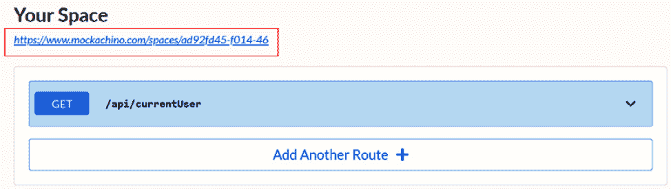
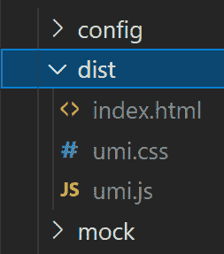
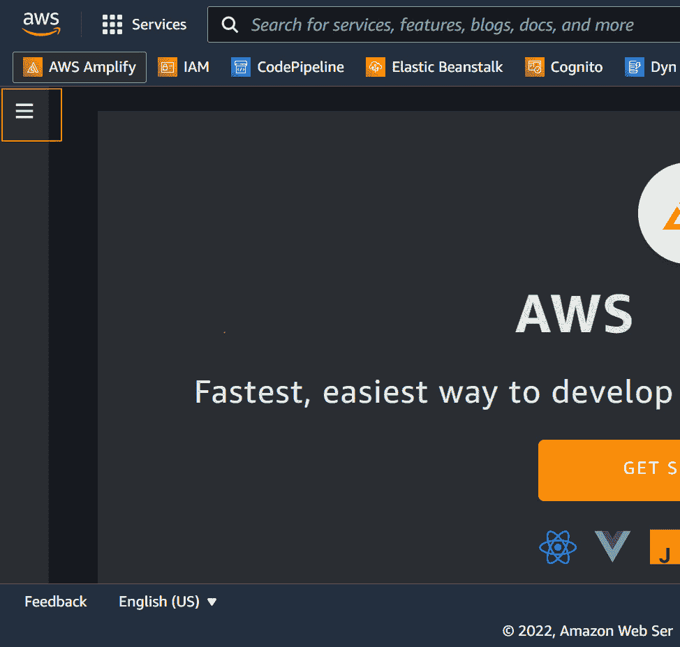
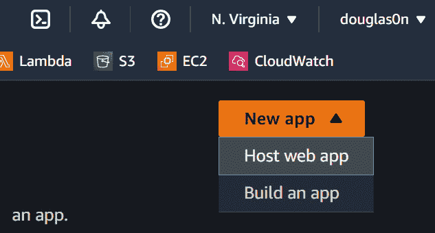
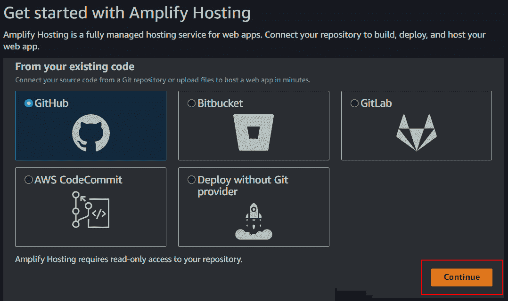
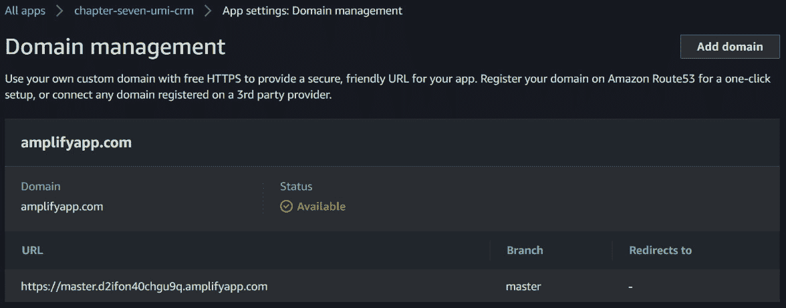

# 第七章：单页应用部署

在上一章中，我们讨论了软件测试以及如何在开发过程中编写测试并应用它来防止错误并提高软件质量。

软件开发生命周期的最后一步是将应用程序部署到在线服务。在本章中，我们将使用开源的 **Mockachino** 服务创建一个简单的模拟服务器作为你的应用程序后端。你将学习如何构建应用程序以及由 Umi 生成的编译源代码文件。你还将学习如何在 **AWS Amplify** 上部署和配置你的应用程序。

本章，我们将涵盖以下主要主题：

+   使用 Mockachino 创建模拟服务器

+   编译应用程序和设置环境变量

+   在 AWS Amplify 上托管应用

到本章结束时，你将学会如何构建应用程序以及由 Umi 生成的编译源代码文件。你还将了解如何快速使用 Mockachino 服务创建模拟服务器。你还将学会如何在 AWS Amplify 上部署和配置单页应用程序。

# 技术要求

要完成本章的练习，你只需要一台安装了任何操作系统（我推荐 Ubuntu 20.04 或更高版本）的电脑以及 *第一章**，环境设置和 UmiJS 简介*（VS Code、Node.js 和 Yarn）中安装的软件。

你可以在 GitHub 仓库中找到完整的项目，该仓库位于 [`github.com/PacktPublishing/Enterprise-React-Development-with-UmiJs`](https://github.com/PacktPublishing/Enterprise-React-Development-with-UmiJs) 的 `Chapter07` 文件夹中。

# 使用 Mockachino 创建模拟服务器

在本节中，我们将使用 Mockachino 创建模拟服务器来模拟应用程序的后端服务。

我们的应用程序只是 CRM 系统的表现层，用户可以可视化并输入数据。在部署之前，我们需要在线后端服务，我们的应用程序可以连接以处理、存储和接收数据。

后端服务是由后端开发者实现的 API 和微服务，用于安全高效地应用业务逻辑并存储诸如机会、活动、客户和用户信息等信息。

由于本书的目的是用 UmiJS 教授 React 开发，我们不会构建后端服务。我们将使用 **Mockachino** 来模拟后端。

Mockachino 是一个创建模拟服务器的简单服务。我们只需要定义一个端点，Mockachino 就会提供空间和秘密链接，以便在需要时访问该空间。

让我们从创建获取用户信息的路由开始。导航到 [`www.mockachino.com/`](https://www.mockachino.com/) 并按照以下步骤操作：

1.  在 `api/currentUser`。

1.  接下来，在 **HTTP 响应体** 字段中，输入以下 JSON 响应：

    ```js
    {
      "company": "Umi Group",
      "name": "Marry Doe",
      "role": {
        "id": 0,
        "title": "Administrator"
      },
      "isLoggedIn": "true",
      "id": "1"
    }
    ```

1.  点击**创建**，Mockachino 将提供一个秘密链接，如图下所示：



图 7.1 – Mockachino 空间秘密链接

通过点击端点路由（**GET /api/currentUser**），您可以编辑端点属性，如路径、HTTP 响应头和响应体。

要创建一个新的路由，请点击`mockachino.md`文件。

为了您的方便，我在本书 GitHub 仓库的`Chapter07`文件夹中创建了一个名为`mockachino.md`的 markdown 文件。在这个文件中，您将找到在接下来的章节中必须创建的所有路由和响应。

在本节中，我们使用 Mockachino 创建了一个模拟服务器来模拟后端服务。接下来，让我们学习如何打包应用程序并设置环境变量。

# 编译应用程序和设置环境变量

在本节中，您将了解 Umi 将生成哪些文件以及如何编译应用程序。我们还将设置一个环境变量来配置发送 HTTP 请求的 URL。

我们需要将我们的组件和依赖项转换和编译成网络浏览器可以解释和渲染的格式，然后再部署应用程序。

运行配置在我们的 package scripts 中的`yarn build`命令。此命令将编译应用程序并将编译后的源代码文件放置在`dist`文件夹中。



图 7.2 – 编译后的源代码文件

您将在`dist`文件夹中找到三个文件：

+   `index.html`：这是包含我们应用程序入口点的 HTML 文档。

+   `umi.css`：这是包含项目中所有由 LESS 文件生成的应用程序样式的压缩样式表。

+   `umi.js`：这是包含执行我们应用程序所需的所有 JavaScript 代码的压缩文件。

现在，我们需要在互联网上的静态服务器上托管这些文件。当用户导航到服务器的公共地址时，浏览器将请求并接收`index.html`文档，这是我们应用程序的入口点。我们将在下一节中将应用程序托管在 Amplify 上。

现在，让我们调整您的应用程序以向 Mockachino 发送请求。

## 配置 API URL 环境变量

如前所述，在生产环境中，我们没有与我们的应用程序一起运行的模拟服务器。我们将向 Mockachino 发送 HTTP 请求，因此我们需要更改`services`文件夹中所有函数的 URL 参数。我们将通过配置环境变量来完成此操作。

Umi 可以在构建过程中读取环境变量，并在我们的应用程序中使用它们的值；我们只需要设置 Umi 的`define`配置选项。

按照以下步骤创建一个环境变量来设置 API URL：

1.  在项目的根目录下创建一个名为`.env`的新文件，并创建一个名为`API_URL`的变量，如下所示：

    ```js
    API_URL=https://www.mockachino.com/secret
    ```

将值替换为 Mockachino 提供的 URL。

1.  将`define`选项添加到`config.ts`文件中的配置，如下所示：

    ```js
    define: {
       API_URL: process.env.API_HOST,
    },
    ```

此配置在项目中定义了`API_URL`变量。

1.  现在，让我们创建一个文件来导出变量并防止 TypeScript 警告。在`config`文件夹中创建一个名为`env.ts`的新文件，并按照以下方式导出变量：

    ```js
    // @ts-nocheck
    export default {
      API_URL: API_URL,
    };
    ```

1.  在`src/services`文件夹中的`user.ts`文件中，按照以下方式导入`env.ts`文件：

    ```js
    import env from '../../config/env';
    ```

1.  接下来，将`API_URL`添加到`request`函数的第一个参数中，如下所示：

    ```js
    return request<User>(`${env.API_URL}/api/currentUser`, {
      method: 'GET',
      headers: { 'Content-Type': 'application/json' },
      params: { context: contextId },
    });
    ```

按照最后两个步骤更改`services`文件夹中所有文件的`request`函数。

在本节中，您学习了如何编译应用程序的源代码文件以及 Umi 在构建过程中生成的文件。我们还创建了一个环境变量，并将请求更改为使用 Mockachino 作为后端。

现在，我们将使用 Amplify 控制台服务在 AWS 上托管我们的应用程序。

# 在 AWS Amplify 上托管应用程序

在本节中，您将学习如何通过使用 Amplify 控制台托管我们的应用程序来在**亚马逊网络服务**（**AWS**）上部署和配置单页应用程序。 

**AWS Amplify**是一套灵活的工具，供网络和移动前端开发者使用，通过 AWS 的各种服务创建和部署应用程序。使用 Amplify，你可以快速构建和部署全栈应用程序，无需研究和学习单个 AWS 服务。

我们将仅使用 Amplify 来托管我们的应用程序，但您可以使用 Amplify 框架和 Amplify Studio 创建后端服务，添加身份验证、人工智能、机器学习等。如果您想了解更多信息，请访问框架的文档页面[`docs.amplify.aws/`](https://docs.amplify.aws/)。

在进行以下步骤之前，您需要将项目推送到您个人 GitHub 账户的新仓库中。

此外，您还需要创建一个免费的 AWS 账户。访问[`aws.amazon.com/free`](https://aws.amazon.com/free)，点击**创建免费账户**，填写所需信息以创建您的账户。

现在，在将代码推送到新仓库并创建您的 AWS 账户后，按照以下步骤在 Amplify 上托管我们的应用程序：

1.  导航到[`console.aws.amazon.com/amplify/home`](http://console.aws.amazon.com/amplify/home)并登录您的 AWS 账户。

1.  点击以下屏幕截图中的高亮菜单，然后点击**所有应用**：



图 7.3 – 左侧菜单

1.  在页面右上角，点击**新建应用**下拉菜单并选择**托管网络应用**：



图 7.4 – 托管网络应用选项

1.  现在，在**从现有代码**部分选择**GitHub**，点击**继续**，并登录您的 GitHub 账户：



图 7.5 – 选择源 Git 提供者

1.  接下来，选择您为我们项目创建的仓库，然后点击 **下一步**：

![Figure_7.6 – 选择 GitHub 仓库

![Figure_7.06_B18503.jpg]

图 7.6 – 选择 GitHub 仓库

1.  在 **步骤 2 配置构建设置** 中，在 **构建和测试设置** 部分中，点击 **编辑**，将第 12 行修改如下，然后点击 **保存**：

    ```js
    baseDirectory: /dist
    ```

此配置将设置 Amplify 在运行自动化管道时查找源代码的位置。

![Figure_7.7 – 配置源代码基本目录

![Figure_7.07_B18503.jpg]

图 7.7 – 配置源代码基本目录

1.  点击 `API_URL`，然后在 **值** 字段中粘贴 Mockachino 的密钥链接：

![Figure_7.8 – 创建环境变量

![Figure_7.08_B18503.jpg]

图 7.8 – 创建环境变量

1.  现在，点击 **下一步**，在下一步中，审查配置并点击 **保存和部署**：

![Figure_7.9 – 审查和部署应用程序

![Figure_7.09_B18503.jpg]

图 7.9 – 审查和部署应用程序

1.  等待管道成功，然后点击公共地址以访问应用程序：

![Figure_7.10 – 应用程序公共地址

![Figure_7.10_B18503.jpg]

图 7.10 – 应用程序公共地址

现在，让我们更仔细地看看更多的 Amplify 设置。

## 了解更多 Amplify 设置

当托管单页应用程序时，有必要配置服务器以仅对带有 `index.html` 页面的请求做出响应；否则，服务器将返回错误，因为其他页面不存在于服务器上。

Amplify 在 `index.html` 文件中提供了一个默认的路由规则。

![Figure_7.11 – 重写和重定向配置

![Figure_7.11_B18503.jpg]

图 7.11 – 重写和重定向配置

Amplify 还在 `amplifyapp` 域上提供公共地址，但您可以通过在左侧菜单中访问 **域名管理** 来轻松添加自定义域名。

域名可以是 AWS Route 53 或其他提供商的托管区域，AWS 还提供免费的 SSL 证书来保护您应用程序的域名。



图 7.12 – Amplify 域名管理

在本节中，您创建了一个免费的 AWS 账户，并通过将 Amplify 与您 GitHub 账户中的仓库连接来在 AWS 上托管您的应用程序。您还学习了如何在 Amplify 控制台中配置重写和重定向以及管理您的自定义域名。

# 摘要

在本章中，我们使用 Mockachino（一个用于快速模拟服务器的开源项目）为我们的应用程序创建了一个模拟服务器。您还学习了 Umi 在构建过程中为浏览器解释和渲染应用程序而生成的文件。您创建了一个环境变量来定义我们的应用程序将用于发送请求的 URL。

你已经学会了如何将你的应用程序推送到个人 GitHub 账户的仓库中，并创建了一个免费的 AWS 账户。接下来，你通过将 AWS Amplify 连接到你的 GitHub 仓库，在 AWS 上托管了你的应用程序。你还学会了如何配置重写和重定向，并在 Amplify 控制台上管理你的自定义域名。

我希望这本书已经帮助你学会了如何使用 UmiJS 结合 Ant Design 来创建强大且专业的 React 应用程序，这些应用程序提供了极佳的用户体验。继续练习和探索这本书中学到的技术。
