# 第一章：Angular 的架构概述和构建简单应用

无论您是新手还是对 AngularJS 或 Angular 都不熟悉。如果您想快速开发具有丰富 UI 和 Angular 组件、模板和服务功能的优秀 Web 应用程序，您需要掌握 Angular，这本书就是为您准备的。

Angular 是一个 JavaScript 框架，使开发人员能够构建 Web 和移动应用程序。使用 Angular 构建的应用程序可以针对任何设备，如手机、平板电脑和台式电脑。Angular 不是 AngularJS 的增量版本。它完全重写了改进的依赖注入、动态加载和更简单的路由，并建议开发人员使用 TypeScript 并利用面向对象编程、静态类型、泛型和 lambda。

在本章中，我们将涵盖以下主题：

+   Angular 架构

+   TypeScript 的基础知识

+   构建一个简单的应用程序

# Angular 架构

在讨论架构之前，让我们看看 Angular 的新功能。Angular 的主要重点是移动设备，因为重要的是要考虑应用程序在手机上的性能和加载时间。许多模块已经从 Angular 核心中解耦，只留下了绝对核心的模块；从 Angular 核心中移除不需要的模块可以提高性能。

Angular 的目标是 ES6，并利用 TypeScript 作为开发脚本语言，可以在编译时对类型进行检查，而不是在运行时。TypeScript 在实例化类时提供了关于类的额外信息，通过为类注释元数据。您也可以使用 ES5 和 Dart 作为开发语言。有一个改进的依赖注入版本，支持子注入器和实例范围。路由器被完全重写，引入了组件路由器。Angular 支持组件指令、装饰器指令和模板指令。$scope 已经完全从 Angular 中移除。

Angular 的架构包括**模块**、**组件**、**模板**、**元数据**、**指令**和**服务**。

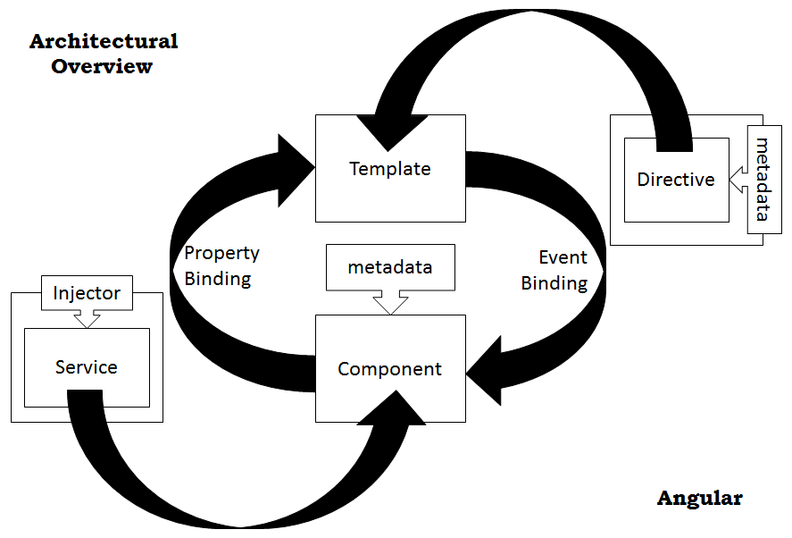

# NgModules

Angular 框架有各种库，这些库被分组为模块，以构建应用程序。Angular 应用程序具有模块化的特性，并通过组装各种模块来构建。模块可能包含组件、服务、函数和/或值。一些模块可能包含其他模块的集合，被称为库模块。

Angular 包，如`core`，`common`，`http`和`router`，它们以`@angular`为前缀，包含许多模块。我们从这些库模块中导入我们的应用程序需要的内容，如下所示：

```ts
import {Http, Response} from @angular/http'; 

```

在这里，我们从库模块`@angular/http`中导入`Http`和`Response`。`@angular/http`指的是 Angular 包中的一个文件夹。可以通过引用模块的文件名将任何定义为导出的模块导入到另一个模块中。

注意：这个导入语句是在 ES2015 中引入的，用于导入从其他模块或脚本导出的对象或函数

但是，我们也可以像我们引用`@angular/http`一样引用文件夹。这可以通过在文件夹中添加一个`index.ts`文件并添加代码来从文件夹中导出模块来实现。这是 Angular 风格指南建议的最佳实践，称为桶技术：

```ts
export * from './http'; 

```

这是在`@angular/http`中找到的`index.ts`中的导出语句。该语句意味着它导出 HTTP 中的所有模块，并且它们可以在我们的应用程序中根据需要导入。

当我们编写一个 Angular 应用程序时，我们首先定义一个`AppComponent`（不一定要使用相同的名称）并导出它。

# 组件

组件是一个具有属性和方法的类，用于在视图中使用。这些暴露给视图的属性和方法使视图能够与组件交互。我们在组件类中编写支持视图的逻辑：

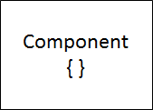

例如，接下来是一个组件类 book，它具有`properties`标题和作者以及一个`getPubName`方法，该方法返回书的名称：

```ts
export class BookComponent { 
  title: string; 
  author: string; 
  constructor() { 
      this.title = 'Learning Angular for .Net Developers'; 
      this.author = 'Rajesh Gunasundaram'; 
  } 
  getPubName() : string { 
    return 'Packt Publishing'; 
  } 
} 

```

注意：在本书的所有示例中，我们将使用 TypeScript。

组件的生命周期由 Angular 根据用户与应用程序的交互来管理。我们还可以添加一个根据组件状态变化触发的`event`方法。这些`event`方法称为生命周期钩子，是可选的。

我们将在第五章中详细了解组件，“实现 Angular 路由和导航”。

# 模板

模板可以被视为根据应用程序的 UI/UX 需求可视化的组件的表示。一个组件将有一个与之关联的模板。模板负责根据用户事件显示和更新数据：

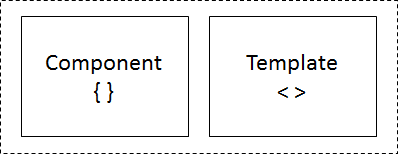

这是一个简单的模板，用于显示书籍的标题和作者：

```ts
<h1>Book Details</h1> 
<p>Title of the Book: {{title}}</p> 
<p>Author Name : {{author}}</p> 

```

在这里，用花括号括起来的标题和作者值将由相关组件实例提供。

我们将在第八章中详细讨论模板及其语法，*模板和数据绑定语法*。

# 元数据

通过使用`@Component`对类进行注释并传递必要的元数据，如`selector`、`template`或`templateUrl`，可以将类转换为组件。只有在向类附加元数据后，Angular 才会将其视为组件：

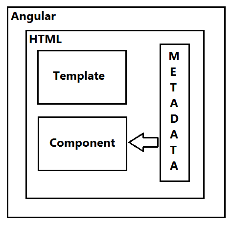

让我们重新访问一下我们之前定义的`BookComponent`类。除非我们对其进行注释，否则 Angular 不会将此类视为组件。TypeScript 利用 ES7 功能，提供了一种用元数据装饰类的方法，如下所示：

```ts
@Component({ 
  selector:    'book-detail', 
  templateUrl: 'app/book.component.html' 
}) 
export class BookComponent { ... } 

```

在这里，我们用`@Component`装饰了`BookComponent`类，并附加了选择器和`templateUrl`的元数据。这意味着，无论在视图中的哪里，Angular 都会看到特殊的`<book-detail/>`标签，并创建一个`BookComponent`实例，并呈现分配给`templateUrl`的视图，即`book.component.html`。

TypeScript 提供的装饰器是一个函数，它接受配置参数，这些参数由 Angular 用于创建组件实例并呈现相关视图。配置参数还可能包含有关指令和提供者的信息，在创建组件时，Angular 将使其可用。

# 数据绑定

数据绑定是开发人员在编写代码时的核心责任之一，用于将数据绑定到用户界面，并根据用户与用户界面的交互更新变化的数据。Angular 减轻了编写大量代码来处理数据绑定的负担：

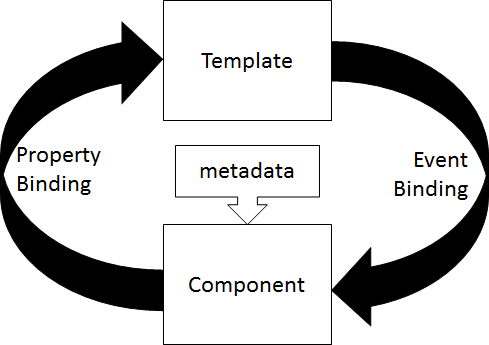

Angular 通过与模板和组件协调来处理数据绑定。模板向 Angular 提供了如何以及绑定什么的指令。在 Angular 中有两种类型的绑定：全局单向数据绑定和双向数据绑定。单向数据绑定处理从组件到 DOM 或从 DOM 到组件的数据绑定。双向数据绑定处理通信的双方，即组件到 DOM 和 DOM 到组件。

```ts
<div>Title: {{book.title}}<br/> 
  Enter Author Name: <input [(ngModel)]="book.author"> 
</div> 

```

在这里，`book.title`用双大括号包裹，处理单向数据绑定。如果组件实例中有书名的值，它将显示在视图中。`book.author`赋给输入元素的`ngModel`属性，处理双向数据绑定。如果组件实例中的作者属性有值，它将被赋给输入元素，如果用户在输入控件中更改了值，更新后的值将在组件实例中可用。

我们将在第八章中详细学习数据绑定，*模板和数据绑定语法*。

# 指令

指令是用于渲染模板的指令或指导方针。一个带有`@Directive`装饰的类附加了元数据，被称为指令。Angular 支持三种类型的指令，即组件指令、结构指令和属性指令：

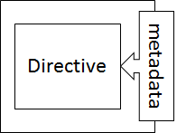

组件是带有模板的指令的一种形式，它被装饰为`@Component`：实际上它是一个带有模板特性的扩展`@Directive`：

```ts
<book-detail></book-detail> 

```

结构指令通过添加、删除和替换 DOM 元素来操作 DOM 元素并改变它们的结构。以下代码片段使用了两个结构指令：

```ts
<ul> 
<li *ngFor="let book of books"> 
    {{book.title}} 
</li> 
</ul> 

```

在这里，`div`元素有一个`*ngFor`指令，它遍历 books 集合对象并替换每本书的标题。

属性指令有助于更新元素的行为或外观。让我们使用属性指令来设置段落的字体大小。以下代码片段显示了一个使用属性指令实现的 HTML 语句：

```ts
<p [myFontsize]>Fontsize is sixteen</p> 

```

我们需要实现一个带有`@Directive`注解的类，以及指令的选择器。这个类应该包含指令行为的指令：

```ts
import { Directive, ElementRef, Input } from '@angular/core'; 
@Directive({ selector: '[myFontsize]' }) 
export class FontsizeDirective { 
    constructor(el: ElementRef) { 
       el.nativeElement.style.fontSize = 16; 
    } 
} 

```

在这里，Angular 将查找带有`[myFontsize]`指令的元素，并将字体大小设置为`16`。

需要将`myFontSize`指令传递给`@NgModule`的 declarations 元数据，如下所示：

```ts
import { NgModule } from '@angular/core'; 
import { BrowserModule } from '@angular/platform-browser'; 
import { AppComponent } from './app.component'; 
import { FontsizeDirective } from './fontsize.directive'; 
@NgModule({ 
  imports: [ BrowserModule ], 
  declarations: [ 
    AppComponent, 
    FontsizeDirective 
  ], 
  bootstrap: [ AppComponent ] 
}) 
export class AppModule { } 

```

我们将在第六章中详细讨论指令，*创建指令和实现变更检测*。

# 服务

服务是用户定义的用于解决问题的类。Angular 建议只在组件中包含特定于模板的代码。组件的责任是丰富 Angular 应用程序中的 UI/UX，并将业务逻辑委托给服务。组件是服务的消费者：


应用程序特定或业务逻辑，如持久化应用程序数据、记录错误和文件存储，应该委托给服务，组件应该消费相应的服务来处理适当的业务或应用程序特定逻辑：


例如，我们可以有一个名为`BookService`的服务，用于插入新书籍，编辑或删除现有书籍，并获取所有可用书籍的列表。

我们将在第十一章中更多地了解服务，*实现 Angular 管道*。

# 依赖注入

当创建类的实例时，为其正常运行提供所需的依赖项称为依赖注入。Angular 提供了依赖注入的现代和改进版本：

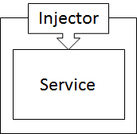

在 Angular 中，注入器维护容器来保存依赖项的实例，并在需要时提供它们。如果依赖项的实例在容器中不可用，则注入器将创建依赖项的实例并提供它：

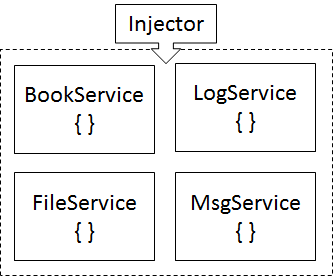

如前所述，组件具有与模板相关的逻辑，并且大多数情况下消费服务以执行业务逻辑。因此，组件依赖于服务。当我们为组件编写代码时，我们创建一个带有服务作为参数的构造函数。这意味着创建组件的实例取决于构造函数中的服务参数。Angular 要求注入器在组件的构造函数参数中提供服务的实例。如果可用，注入器将提供所请求服务的实例；否则，它将创建一个新的实例并提供它：

```ts
export class BookComponent { 
  constructor(private service: BookService) { } 
} 

```

在此代码片段中，`:` 符号来自 TypeScript，并不是 Angular 语法糖。`private` 关键字也来自 TypeScript，并且可以自动将传递的构造函数分配给类实例。类型信息用于推断要注入的类型。`BookComponent` 依赖于 `BookService` 并在构造函数中注入。因此，当创建 `BookComponent` 的实例时，Angular 也会确保 `BookService` 的实例对于 `BookComponent` 实例来说是可用的。

注射器知道要从提供程序创建的依赖项，并在引导应用程序或装饰组件时配置所需的依赖项类型，如下所示：

```ts
@NgModule({ 
  imports: [BrowserModule], 
  declarations: [AppComponent,], 
  providers: [BookService], 
  bootstrap: [ AppComponent ] 
}) 
export class AppModule { } 

```

前面的代码片段将 `BookService` 添加为引导函数的提供程序。注射器将创建 `BookService` 的实例，并在整个应用程序中保持其可用性，以便在请求时注入：

```ts
@Component({ 
  providers:   [BookService] 
}) 
export class BookComponent { ... } 

```

前面的代码片段将 `BookService` 添加为组件的元数据提供程序。当遇到创建 `BookComponent` 实例的请求时，注射器将创建 `BookService` 的实例。

我们将在第十二章中详细讨论依赖注入和分层依赖注入，*实现 Angular 服务*。

# TypeScript 的基础知识

TypeScript 是 JavaScript 的超集，是由 Microsoft 开发的开源语言。用 TypeScript 编写的代码将被编译为 JavaScript，并在运行 `Node.js` 的任何浏览器或服务器上执行。TypeScript 实际上是 JavaScript 的一种类型。TypeScript 有助于提高您在 JavaScript 中编写的代码的质量。如果我们使用外部库，我们需要使用导入库的类型定义文件。类型定义文件提供 JavaScript 工具支持，并通过推断代码结构来启用编译时检查、代码重构和变量重命名支持。TypeScript 正在不断发展，并不断添加与 ES2016 规范和以后对齐的其他功能。

市场上有各种编辑器可以编写 TypeScript 代码，并使用 TypeScript 编译器进行编译。这些编辑器负责将您的 TypeScript 编译为 JavaScript。这里显示了一些流行的编辑器：

+   Visual Studio

+   Visual Studio Code

+   Sublime text

+   Atom

+   Eclipse

+   Emacs

+   WebStorm

+   Vim

您还可以通过在 Node.js 命令行工具中执行以下命令来将 TypeScript 作为`Node.js`包下载到全局：

```ts
npm install -g typescript

```

要将 TypeScript 代码转译为 JavaScript，您可以在命令行工具中执行以下命令：

```ts
tsc mytypescriptcodefile.ts

```

在这里，`tsc`是 TypeScript 编译器，它将 TypeScript 文件转换为 JavaScript 文件。`mytypescriptfile`是您的 TypeScript 代码文件的名称，`.ts`是 TypeScript 文件的扩展名。执行`tsc`命令时，它会生成一个与`.ts`源文件同名的`.js`文件。

在本章中，我们将使用 Visual Studio Code 编辑器进行示例代码演示。让我们看看 TypeScript 的基本特性，并举例说明。

# 基本类型

让我们探索 TypeScript 中一些基本类型以及如何使用它们。基本类型包括原始类型，如数字、字符串、布尔和数组。JavaScript 只在运行时验证类型，但 TypeScript 在编译时验证变量类型，并大大减少了运行时类型转换问题的可能性。

# 数字类型

数字类型表示浮点值。它可以保存十进制、二进制、十六进制和八进制文字等值：

```ts
let decimal: number = 6; 
let hex: number = 0xf00d; 
let binary: number = 0b1010; 
let octal: number = 0o744; 

```

# 布尔类型

布尔类型是一个非常简单的类型，可以保存两个值中的任一个，true 或 false。这种布尔类型用于在变量中维护状态：

```ts
let isSaved: Boolean; 
isSaved = true; 

```

在这里，布尔类型的`isSaved`变量被赋值为 true。

# 字符串

字符串数据类型可以保存一系列字符。声明和初始化字符串变量非常简单，如下所示：

```ts
var authorName: string = "Rajesh Gunasundaram"; 

```

在这里，我们声明了一个名为`authorName`的变量，类型为字符串，并赋值为`Rajesh Gunasundaram`。TypeScript 支持用双引号（"）或单引号（'）括起字符串值。

# 数组

数组数据类型旨在保存特定类型的值的集合。在 TypeScript 中，我们可以以以下两种方式定义数组：

```ts
var even:number[] = [2, 4, 6, 8, 10]; 

```

此语句使用方括号（[]）在数据类型数字后声明了一个数字类型的数组变量，并将其赋值为从 2 到 10 的一系列偶数。定义数组的第二种方式如下：

```ts
var even:Array<number> = [2, 4, 6, 8, 10]; 

```

此语句使用了通用数组类型，它使用 Array 关键字后跟尖括号（<>）来包裹数字数据类型。

# 枚举

枚举数据类型将具有一组命名的值。我们使用枚举器为标识某些值的常量提供用户友好的名称：

```ts
enum Day {Mon, Tue, Wed, Thu, Fri, Sat, Sun}; 
var firstDay: Day = Day.Mon; 

```

这里，我们有`Day`枚举变量，它保存了代表每周每天的一系列值。第二个语句展示了如何访问特定的枚举值，并将其赋值给另一个变量。

# 任意

任意数据类型是一个动态数据类型，可以容纳任何值。如果将字符串变量赋给整数变量，TypeScript 会抛出编译时错误。如果不确定一个变量将要容纳什么值，并且希望在赋值时退出编译器对类型的检查，可以使用任意数据类型：

```ts
var mixedList:any[] = [1, "I am string", false]; 
mixedList [2] = "no you are not"; 

```

这里，我们使用了任意类型的数组，以便它可以容纳任何类型，比如数字、字符串和布尔值。

# Void

Void 实际上什么都不是。它可以用作函数的返回类型，声明这个函数不会返回任何值：

```ts
function alertMessage(): void { 
    alert("This function does not return any value"); 
} 

```

# 类

类是一个可扩展的模板，用于创建具有成员变量以保存对象状态和成员函数以处理对象行为的对象。

JavaScript 只支持基于函数和基于原型的继承来构建可重用的组件。ECMAScript 6 提供了使用类的语法糖来支持面向对象编程。然而，并非所有浏览器都理解 ES6，我们需要转译器，比如 TypeScript，将代码编译成 JavaScript 并针对 ES5，这与所有浏览器和平台兼容：

```ts
class Customer { 
    name: string; 
    constructor(name: string) { 
        this.name = name; 
   } 
    logCustomer() { 
        console.log('customer name is ' + this.name; 
   } 
} 

var customer = new Customer("Rajesh Gunasundaram"); 

```

这个`Customer`类有三个成员：一个 name 属性，一个构造函数和一个`logCustomer`方法。在 customer 类外部的最后一个语句使用`new`关键字创建了一个 customer 类的实例。

# 接口

接口是定义类行为的抽象类型。接口是抽象实现的契约。接口为可以在客户端之间交换的对象提供了类型定义。这使得客户端只能交换符合接口类型定义的对象。否则，我们会得到一个编译时错误。

在 TypeScript 中，接口定义了代码内部和项目外部对象的契约。让我们看一个使用 TypeScript 的例子：

```ts
function addCustomer(customerObj: {name: string}) { 
  console.log(customerObj.name); 
} 

var customer = {id: 101, name: "Rajesh Gunasundaram"}; 
addCustomer(customer); 

```

类型检查器验证了`addCustomer`方法调用并检查了它的参数。`addCustomer`期望一个具有字符串类型的 name 属性的对象。但调用`addCustomer`的客户端传递了一个具有两个参数`id`和`name`的对象。

然而，编译器不会检查`id`属性，因为它不在`addCustomer`方法的参数类型中。对于编译器来说，只要求的属性存在即可。

让我们重写应用`interface`作为参数类型的方法如下：

```ts
interface Customer { 
  name: string; 
} 

function addCustomer(customerObj: Customer) { 
  console.log(customerObj.name); 
} 
var customer = {id: 101, name: "Rajesh Gunasundaram"}; 
addCustomer(customer); 

```

在这里，我们用`Customer`接口声明了`name`参数，并修改了`addCustomer`签名以接受`Customer`接口类型的参数。其余语句与前面的代码片段相同。编译器只检查对象的形状，因为 TypeScript 实现了结构类型系统。它不会检查我们传递的对象是否实现了`Customer`接口。它只查找参数中`string`类型的`name`属性，然后允许它存在。

# 使用接口的可选属性

在某些情况下，我们可能只想为最小的参数传递值。在这种情况下，我们可以将接口中的属性定义为可选属性，如下所示：

```ts
interface Customer { 
  id: number; 
  name: string; 
  bonus?: number; 
} 

function addCustomer(customer: Customer) { 
  if (customer.bonus) { 
    console.log(customer.bonus); 
  } 
} 

addCustomer({id: 101, name: "Rajesh Gunasundaram"}); 

```

在这里，通过在`name`属性末尾添加问号（?），将`bonus`属性定义为可选属性。

# 函数类型接口

我们刚刚看到如何在接口中定义属性。类似地，我们也可以在接口中定义函数类型。我们可以通过给出函数的签名和返回类型来在接口中定义函数类型。请注意，在下面的代码片段中，我们没有添加函数名：

```ts
interface AddCustomerFunc { 
  (firstName: string, lastName: string): string; 
} 

```

现在，我们有了`AddCustomerFunc`。让我们定义一个名为`AddCustomerFunc`的接口变量，并将一个具有相同签名的函数分配给它，如下所示：

```ts
var addCustomer: AddCustomerFunc; 
addCustomer = function(firstName: string, lastName: string) { 
  console.log('Full Name: ' + firstName + ' ' + lastName); 
  return firstName + ' ' + lastName; 
} 

```

函数签名中的参数名称可以变化，但数据类型不能变化。例如，我们可以修改字符串类型的`fn`和`ln`函数参数如下：

```ts
addCustomer = function(fn: string, ln: string) { 
  console.log('Full Name: ' + fn + ' ' + ln); 
} 

```

因此，如果我们在这里改变参数的数据类型或函数的返回类型，编译器将抛出关于参数不匹配或返回类型与`AddCustomerFunc`接口不匹配的错误。

# 数组类型接口

我们还可以为数组类型定义一个接口。我们可以指定索引数组的数据类型和数组项的数据类型如下：

```ts
interface CutomerNameArray { 
  [index: number]: string; 
} 

var customerNameList: CutomerNameArray; 
customerNameList = ["Rajesh", "Gunasundaram"]; 

```

TypeScript 支持两种索引类型：数字和字符串。这种数组类型接口还规定了数组的返回类型应与声明相匹配。

# 类类型接口

类类型接口定义了类的契约。实现接口的类应该满足接口的要求：

```ts
interface CustomerInterface { 
    id: number; 
    firstName: string; 
    lastName: string; 
    addCustomer(firstName: string, lastName: string); 
    getCustomer(id: number): Customer; 
} 

class Customer implements CustomerInterface { 
    id: number; 
    firstName: string; 
    lastName: string; 
    constructor() { } 
    addCustomer(firstName: string, lastName: string) { 
        // code to add customer 
   } 
    getCustomer(id: number): Customer { 
        return this; 
    } 
} 

```

类类型接口只处理类的公共成员。因此，不可能向接口添加私有成员。

# 扩展接口

接口可以被扩展。扩展接口使其共享另一个接口的属性，如下所示：

```ts
interface Manager { 
    hasPower: boolean; 
} 

interface Employee extends Manager { 
    name: string; 
} 

var employee = <Employee>{}; 
employee.name = "Rajesh Gunasundaram"; 
employee.hasPower = true; 

```

在这里，`Employee`接口扩展了`Manager`接口，并与`Employee`接口共享其`hasPower`。

# 混合类型接口

混合类型接口用于当我们希望将对象既用作函数又用作对象时。如果实现了混合类型接口，我们可以像调用函数一样调用对象，或者我们可以将其用作对象并访问其属性。这种类型的接口使您能够将接口用作对象和函数，如下所示：

```ts
interface Customer { 
    (name: string); 
    name: string; 
    deleteCustomer(id: number): void; 
} 

var c: Customer; 
c('Rajesh Gunasundaram'); 
c.name = 'Rajesh Gunasundaram'; 
c.deleteCustomer(101); 

```

# 继承

继承是从另一个类或对象继承行为的概念。它有助于实现代码的重用性，并建立类或对象之间的关系层次结构。此外，继承帮助您转换类似的类。

JavaScript 以 ES5 为目标，不支持类，因此无法实现类继承。但是，我们可以实现原型继承而不是类继承。让我们通过示例来探索 ES5 中的继承。

首先，创建一个名为`Animal`的函数如下：

```ts
var Animal = function() { 

    this.sleep = function() { 
       console.log('sleeping'); 
   } 

    this.eat = function() { 
       console.log('eating'); 
   } 
} 

```

在这里，我们创建了一个名为`Animal`的函数，其中包含两个方法：`sleep`和`eat`。现在，让我们使用原型扩展这个`Animal`函数，如下所示：

```ts
Animal.prototype.bark = function() { 
    console.log('barking'); 
} 

```

现在，我们可以创建一个`Animal`实例，并调用扩展函数`bark`，如下所示：

```ts
var a = new Animal(); 
a.bark(); 

```

我们可以使用`Object.Create`方法克隆父级的原型并创建一个子对象。然后，我们可以通过添加方法来扩展子对象。让我们创建一个名为`Dog`的对象，并从`Animal`继承它：

```ts
var Dog = function() { 
    this.bark = new function() { 
       console.log('barking'); 
   } 
} 

```

现在，让我们克隆`Animal`的原型，并继承`Dog`函数中的所有行为。然后，我们可以使用`Dog`实例调用`Animal`方法，如下所示：

```ts
Dog.prototype = Object.create(animal.prototype); 
var d = new Dog(); 
d.sleep(); 
d.eat(); 

```

# TypeScript 中的继承

我们刚刚看到了如何使用原型在 JavaScript 中实现继承。现在，我们将看到如何在 TypeScript 中实现继承，这基本上是 ES6 继承。

在 TypeScript 中，类似于扩展接口，我们也可以通过继承另一个类来扩展类，如下所示：

```ts
class SimpleCalculator { 
   z: number; 
    constructor() { } 
   addition(x: number, y: number) { 
        this.z = this.x + this.y; 
   } 
    subtraction(x: number, y: number) { 
        this.z = this.x - this.y; 
   } 
} 

class ComplexCalculator extends SimpleCalculator { 
    constructor() { super(); } 
   multiplication(x: number, y: number) { 
        this.z = x * y; 
   } 
    division(x: number, y: number) { 
        this.z = x / y; 
   } 
} 
var calculator = new ComplexCalculator(); 
calculator.addition(10, 20); 
calculator.Substraction(20, 10); 
calculator.multiplication(10, 20); 
calculator.division(20, 10); 

```

在这里，我们可以使用`ComplexCalculator`的实例来访问`SimpleCalculator`的方法，因为它扩展了`SimpleCalculator`。

# 私有和公共修饰符

在 TypeScript 中，类中的所有成员默认都是`public`的。我们必须显式添加`private`关键字来控制成员的可见性，而这个有用的特性在 JavaScript 中是不可用的。

```ts
class SimpleCalculator { 
    private x: number; 
    private y: number; 
    z: number; 
    constructor(x: number, y: number) { 
       this.x = x; 
       this.y = y; 
    } 
    addition() { 
        this.z = this.x + this.y; 
   } 
   subtraction() { 
        this.z = this.x - this.y; 
   } 
} 

class ComplexCalculator { 
    z: number; 
    constructor(private x: number, private y: number) { } 
    multiplication() { 
       this.z = this.x * this.y;  
   } 
    division() { 
        this.z = this.x / this.y; 
   } 
} 

```

请注意，在`SimpleCalculator`类中，我们将`x`和`y`定义为私有属性，这些属性在类外部不可见。在`ComplexCalculator`中，我们使用参数属性定义了`x`和`y`。这些参数属性将使我们能够在一个语句中创建和初始化成员。在这里，`x`和`y`在构造函数中创建和初始化，而不需要在其中编写任何进一步的语句。

# 访问器

我们还可以实现对属性的 getter 和 setter，以控制从客户端访问它们。我们可以在设置属性变量的值之前或获取属性变量的值之前拦截一个过程：

```ts
var updateCustomerNameAllowed = true; 
class Customer { 
    private _name: string; 
    get name: string { 
          return this._name; 
   } 
    set name(newName: string) { 
          if (updateCustomerNameAllowed == true) { 
               this._name = newName; 
          } 
          else { 
               alert("Error: Updating Customer name not allowed!"); 
          } 
   } 
} 

```

在这里，`name`属性的 setter 确保客户名称可以更新。否则，它会显示一个警报消息，说明这是不可能的。

# 静态属性

这些属性不是特定于实例的，并且通过类名而不是使用`this`关键字来访问：

```ts
class Customer { 
     static bonusPercentage = 20; 
     constructor(public salary: number) {  } 

   calculateBonus() { 
          return this.salary * Customer.bonusPercentage/100; 
     } 
} 
var customer = new Customer(10000); 
var bonus = customer.calculateBonus(); 

```

在这里，我们声明了一个名为`bonusPercentage`的静态变量，它在`calculateBonus`方法中使用`Customer`类名进行访问。这个`bonusPercentage`属性不是特定于实例的。

# 模块

JavaScript 是一种强大而动态的语言。使用 JavaScript 进行动态编程时，我们需要结构化和组织代码，以使其易于维护，并且还能够轻松地找到特定功能的代码。我们可以通过应用模块化模式来组织代码。代码可以分成各种模块，并且相关的代码可以放在每个模块中。

TypeScript 通过使用模块关键字更容易实现模块化编程。模块使您能够控制变量的范围、代码的可重用性和封装性。TypeScript 支持两种类型的模块：内部模块和外部模块。

# 命名空间

我们可以使用 namespace 关键字在 TypeScript 中创建命名空间。在命名空间下定义的所有类都将在此命名空间下进行作用域限定，并且不会附加到全局范围：

```ts
namespace Inventory { 
      class Product { 
             constructor (public name: string, public quantity:  
                  number) {   } 
      } 
      // product is accessible 
      var p = new Product('mobile', 101); 
} 

// Product class is not accessible outside namespace 
var p = new Inventory.Product('mobile', 101); 

```

为了使`Product`类在`namespace`之外可用，我们需要在定义`Product`类时添加`export`关键字，如下所示：

```ts
module Inventory { 
      export class Product { 
             constructor (public name: string, public quantity: number) {   } 
      } 
} 

// Product class is now accessible outside namespace 
var p = new Inventory.Product('mobile', 101); 

```

我们还可以通过在引用文件的开头添加引用语句来跨文件共享命名空间，如下所示：

```ts
/// <reference path="Inventory.ts" /> 

```

# 模块

TypeScript 还支持模块，因为我们处理大量外部 JavaScript 库，这种模块化将帮助我们组织我们的代码。使用 import 语句，我们可以导入模块，如下所示：

```ts
Import { inv } from "./Inventory"; 
var p = new inv.Product('mobile', 101); 

```

在这里，我们刚刚导入了先前创建的模块 Inventory，创建了`Product`的一个实例并将其分配给变量`p`。

# 函数

遵循 ES5 规范的 JavaScript 不支持类和模块。但是，我们尝试使用 JavaScript 中的函数式编程来限定变量和模块化。函数是 JavaScript 应用程序的构建块。

尽管 TypeScript 支持类和模块，但函数在定义特定逻辑方面起着关键作用。我们可以在 JavaScript 中定义命名函数和匿名函数，如下所示：

```ts
//Named function 
function multiply(a, b) { 
    return a * b; 
} 

//Anonymous function 
var result = function(a, b) { return a * b; }; 

```

在 TypeScript 中，我们使用函数箭头表示法定义参数的类型和返回类型，这也是 ES6 中支持的，如下所示：

```ts
var multiply:(a: number, b: number) => number = 
          function(a: number, b: number): number { return a * b; }; 

```

# 可选和默认参数

例如，我们有一个带有三个参数的函数，有时我们可能只在函数中传递前两个参数的值。在 TypeScript 中，我们可以使用可选参数来处理这种情况。我们可以将前两个参数定义为正常参数，将第三个参数定义为可选参数，如下面的代码片段所示：

```ts
function CustomerName(firstName: string, lastName: string, middleName?: string) { 
    if (middleName) 
        return firstName + " " + middleName + " " + lastName; 
    else 
        return firstName + " " + lastName; 
} 
//ignored optional parameter middleName 
var customer1 = customerName("Rajesh", "Gunasundaram"); 
//error, supplied too many parameters 
var customer2 = customerName("Scott", "Tiger", "Lion", "King");  
//supplied values for all 
var customer3 = customerName("Scott", "Tiger", "Lion");  

```

在这里，`middleName`是可选参数，当调用`function`时可以忽略它。

现在，让我们看看如何在函数中设置默认参数。如果在函数中没有提供参数的值，我们可以定义它以采用配置的默认值：

```ts
function CustomerName(firstName: string, lastName: string, middleName: 
     string = 'No Middle Name') { 
    if (middleName) 
        return firstName + " " + middleName + " " + lastName; 
    else 
        return firstName + " " + lastName; 
} 

```

在这里，`middleName`是默认参数，如果调用者没有提供值，它将默认为`No Middle Name`。

# 剩余参数

使用剩余参数，您可以将值数组传递给函数。这可以用于您不确定将向函数提供多少值的情况：

```ts
function clientName(firstClient: string, ...restOfClient: string[]) { 
   console.log(firstClient + " " + restOfClient.join(" ")); 
} 
clientName ("Scott", "Steve", "Bill", "Sergey", "Larry"); 

```

在这里，请注意`restOfClient`剩余参数前面带有省略号(...)，它可以保存一个字符串数组。在函数的调用者中，只有提供的第一个参数的值将被赋给`firstClient`参数，其余的值将被赋给`restOfClient`作为数组值。

# 泛型

泛型对于开发可重用的组件非常有用，可以针对任何数据类型进行操作。因此，消费该组件的客户端将决定它应该对哪种类型的数据进行操作。让我们创建一个简单的函数，返回传递给它的任何数据：

```ts
function returnNumberReceived(arg: number): number { 
    return arg; 
} 
unction returnStringReceived(arg: string): string { 
    return arg; 
} 

```

正如你所看到的，我们需要单独的方法来处理每种数据类型。我们可以使用任意数据类型在一个函数中实现它们，如下所示：

```ts
function returnAnythingReceived (arg: any): any { 
    return arg; 
} 

```

这与泛型类似。但是，我们无法控制返回类型。如果我们传递一个数字，我们无法预测函数是否会返回该数字，返回类型可以是任何类型。

泛型提供了一个特殊的`T`类型变量。将这种类型应用于函数，使客户端能够传递他们希望这个函数处理的数据类型：

```ts
function returnWhatReceived<T>(arg: T): T { 
    return arg; 
} 

```

因此，客户端可以按照以下方式调用这个函数来处理各种数据类型：

```ts
var stringOutput = returnWhatReceived<string>("return this");  
// type of output will be 'string' 
var numberOutput = returnWhatReceived<number>(101);  
// type of output will be number 

```

请注意，在函数调用中，要处理的数据类型是通过尖括号（<>）包裹传递的。

# 泛型接口

我们还可以使用`T`类型变量定义泛型接口，如下所示：

```ts
interface GenericFunc<T> { 
    (arg: T): T; 
} 
function func<T>(arg: T): T { 
    return arg; 
} 
var myFunc: GenericFunc<number> = func; 

```

在这里，我们定义了一个泛型接口和`GenericFunc`类型的`myFunc`变量，将数字数据类型传递给`T`类型变量。然后，将这个变量赋值给一个名为`func`的函数。

# 泛型类

与泛型接口类似，我们也可以定义泛型类。我们使用尖括号（<>）定义带有泛型类型的类，如下所示：

```ts
class GenericClass<T> { 
    add: (a: T, b: T) => T; 
}

```

```ts
var myGenericClass = new GenericClass<number>(); 
myGenericClass.add = function(a, b) { return a + b; }; 

```

在这里，通过传递数字作为泛型数据类型来实例化泛型类。因此，add 函数将处理并添加作为参数传递的两个数字类型的变量。

# 装饰器

装饰器使我们能够通过添加行为来扩展类或对象，而无需修改代码。装饰器为类添加额外功能。装饰器可以附加到类、属性、方法、参数和访问器上。在 ECMAScript 2016 中，装饰器被提议用于修改类的行为。装饰器以`@`符号和在运行时调用的函数解析为装饰器名称。

以下代码片段显示了授权函数，并且它可以作为`@authorize`装饰器应用于任何其他类：

```ts
function authorize(target) { 
    // check the authorization of the use to access the "target" 
} 

```

# 类装饰器

类装饰器在类声明之前声明。类装饰器可以观察、修改和替换被其应用于的类的定义，通过应用于该类的构造函数。TypeScript 中`ClassDecorator`的签名如下：

```ts
declare type ClassDecorator = <TFunction extends Function>(target:  
      TFunction) => TFunction | void; 

```

考虑一个`Customer`类；我们希望该类被冻结。其现有属性不应被移除，也不应添加新属性。

我们可以创建一个单独的类，可以接受任何对象并将其冻结。然后我们可以用`@freezed`装饰客户类，以防止向类添加新属性或删除现有属性：

```ts
@freezed 
class Customer { 

  public firstName: string; 
  public lastName: string; 

  constructor(firstName : string, lastName : string) { 
    this.firstName = firstName; 
    this.lastName = lastName; 
  } 
} 

```

前面的类在`firstname`和`lastname`构造函数中接受四个参数。以下是为`@freezed`装饰器编写的函数的代码片段：

```ts
function freezed(target: any) { 
    Object.freeze(target); 
} 

```

在这里，freezed 装饰器接受`target`，即被装饰的`Customer`类，并在执行时将其冻结。

# 方法装饰器

方法装饰器在方法声明之前声明。此装饰器用于修改、观察或替换方法定义，并应用于方法的属性描述符。以下代码片段显示了一个简单的类，其中应用了方法装饰器：

```ts
class Hello { 
    @logging 
    increment(n: number) { 
        return n++; 
   } 
} 

```

`Hello`类具有`increment`方法，该方法递增其参数提供的数字。请注意，`increment`方法使用`@logging`装饰器进行装饰，以记录递增方法的输入和输出。以下是`logging`函数的代码片段：

```ts
function logging(target: Object, key: string, value: any) { 

        value.value = function (...args: any[]) { 
            var result = value.apply(this, args); 
            console.log(JSON.stringify(args)); 
            return result; 
        } 
    }; 
} 

```

方法装饰器函数接受三个参数：`target`，`key`和`value`。`target`保存被装饰的方法；`key`保存被装饰方法的名称；`value`是对象上存在的指定属性的属性描述符。

当调用递增方法时，logging 方法被调用，并将值记录到控制台。

# 访问器装饰器

访问器装饰器在访问器声明之前加上前缀。这些装饰器用于观察、修改或替换访问器定义，并应用于属性描述符。以下代码片段显示了一个简单的类，其中应用了访问器装饰器：

```ts
class Customer { 
  private _firstname: string; 
  private _lastname: string; 

  constructor(firstname: string, lastname: string) { 
        this._firstname = firstname; 
        this._lastname = lastname; 
  } 

  @logging(false) 
  get firstname() { return this._firstname; } 

  @logging(false) 
  get lastname() { return this._lastname; } 
} 

```

在这个类中，我们使用`@logging`装饰器修饰了`firstname`和`lastname`的获取器，并传递了`boolean`来启用或禁用日志记录。以下代码片段显示了`@logging`装饰器的函数：

```ts
function logging(value: boolean) { 
    return function (target: any, propertyKey: string, descriptor: 
                PropertyDescriptor) { 
        descriptor.logging = value; 
    }; 
} 

```

`logging`函数将布尔值设置为日志属性描述符。

# 属性装饰器

属性装饰器是前缀到属性声明的。它们实际上通过添加额外的行为来重新定义被装饰的属性。在 TypeScript 源代码中，`PropertyDecorator`的签名如下：

```ts
declare type PropertyDecorator = (target: Object, propertyKey: string | 
    symbol) => void; 

```

以下是一个类的代码片段，其中应用了属性装饰器：

```ts
class Customer { 
  @hashify 
  public firstname: string; 
  public lastname: string; 

  constructor(firstname : string, lastname : string) { 
    this.firstname = firstname; 
    this.lastname = lastname; 
  } 
} 

```

在这段代码中，`firstname`属性被`@hashify`属性装饰器修饰。现在，我们将看到`@hashify`属性装饰器函数的代码片段：

```ts
function hashify(target: any, key: string) { 
  var _value = this[key]; 

  var getter = function () { 
        return '#' + _value; 
  }; 

  var setter = function (newValue) { 
    _value = newValue; 
  }; 

  if (delete this[key]) { 
    Object.defineProperty(target, key, { 
      get: getter, 
      set: setter, 
      enumerable: true, 
      configurable: true 
    }); 
  } 
} 

```

`_value`保存了被装饰属性的值。获取器和设置器函数都可以访问变量`_value`，在这里我们可以通过添加额外的行为来操纵`_value`。我已经在获取器中连接了#来返回带有哈希标记的`firstname`。然后我们使用`delete`运算符从类原型中删除原始属性。将创建一个带有原始属性名称和额外行为的新属性。

# 参数装饰器

参数装饰器是前缀到参数声明的，并且它们应用于类构造函数或方法声明的函数。`ParameterDecorator`的签名如下：

```ts
declare type ParameterDecorator = (target: Object, propertyKey:  
   string | symbol, parameterIndex: number) => void; 

```

现在，让我们定义`Customer`类，并使用参数装饰器来修饰参数，以使其成为必需参数，并验证值是否已被提供：

```ts
class Customer { 
    constructor() {  } 

    getName(@logging name: string) { 
        return name; 
   } 
} 

```

在这里，名称参数已被`@logging`修饰。参数装饰器隐式接受三个输入，即具有此装饰器的类的`prototype`，具有此装饰器的方法的`name`，以及被装饰的参数的`index`。参数装饰器的`logging`函数实现如下：

```ts
function logging(target: any, key : string, index : number) { 

  console.log(target); 
  console.log(key); 
  console.log(index); 
} 

```

在这里，`target`是具有装饰器的类，`key`是函数名称，`index`包含参数索引。这段代码只是将`target`、`key`和`index`记录到控制台。

# 构建一个简单的应用程序

我假设您已经安装了 Node.js、npm 和 Visual Studio Code，并准备好用它们进行开发。现在让我们通过克隆 Git 存储库并执行以下步骤来创建一个 Angular 应用程序：

1.  打开`Node.Js`命令提示符并执行以下命令：

```ts
 **git clone https://github.com/angular/quickstart my-angular** 

```

使用 Visual Studio Code 打开克隆的`my-angular`应用程序。此命令将克隆 Angular 快速启动存储库，并为您创建一个名为 my-angular 的 Angular 应用程序，其中包含所需的所有样板代码。

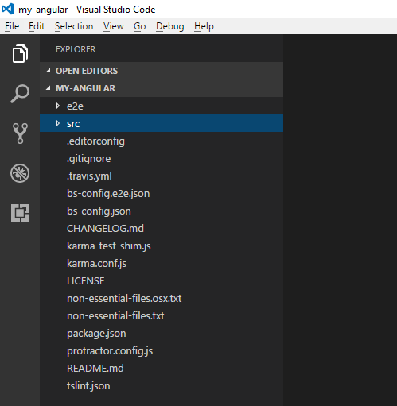my-angular 应用程序的文件夹结构。

文件夹结构和样板代码按照官方样式指南[`angular.io/docs/ts/latest/guide/style-guide.html`](https://angular.io/docs/ts/latest/guide/style-guide.html)进行组织。`src`文件夹包含与应用程序逻辑相关的代码文件，`e2e`文件夹包含与端到端测试相关的文件。现在不要担心应用程序中的其他文件。让我们现在专注于`package.json`。

1.  点击`package.json`文件，它将包含有关元数据和项目依赖项配置的信息。以下是`package.json`文件的内容：

```ts
{   
   "name":"angular-quickstart",   
   "version":"1.0.0",   
   "description":"QuickStart   package.json from the documentation, 
         supplemented with testing support",   
   "scripts":{   
      "build":"tsc   -p src/",   
      "build:watch":"tsc   -p src/ -w",   
      "build:e2e":"tsc   -p e2e/",   
      "serve":"lite-server   -c=bs-config.json",   
      "serve:e2e":"lite-server   -c=bs-config.e2e.json",   
      "prestart":"npm   run build",   
      "start":"concurrently   \"npm run build:watch\" \"npm run 
            serve\"",   
      "pree2e":"npm   run build:e2e",   
      "e2e":"concurrently   \"npm run serve:e2e\" \"npm run 
            protractor\" --kill-others   --success first",   
      "preprotractor":"webdriver-manager   update",   
      "protractor":"protractor   protractor.config.js",   
      "pretest":"npm   run build",   
      "test":"concurrently   \"npm run build:watch\" \"karma start 
           karma.conf.js\"",   
      "pretest:once":"npm   run build",   
      "test:once":"karma   start karma.conf.js --single-run",   
      "lint":"tslint   ./src/**/*.ts -t verbose"   
   },   
   "keywords":[   

   ],   
   "author":"",   
   "license":"MIT",   
   "dependencies":{   
      "@angular/common":"~4.0.0",   
      "@angular/compiler":"~4.0.0",   
      "@angular/core":"~4.0.0",   
      "@angular/forms":"~4.0.0",   
      "@angular/http":"~4.0.0",   
      "@angular/platform-browser":"~4.0.0",   
      "@angular/platform-browser-dynamic":"~4.0.0",   
      "@angular/router":"~4.0.0",   
      "angular-in-memory-web-api":"~0.3.0",   
      "systemjs":"0.19.40",   
      "core-js":"².4.1",   
      "rxjs":"5.0.1",   
      "zone.js":"⁰.8.4"   
   },   
   "devDependencies":{   
      "concurrently":"³.2.0",   
      "lite-server":"².2.2",   
      "typescript":"~2.1.0",   
      "canonical-path":"0.0.2",   
      "tslint":"³.15.1",   
      "lodash":"⁴.16.4",   
      "jasmine-core":"~2.4.1",   
      "karma":"¹.3.0",   
      "karma-chrome-launcher":"².0.0",   
      "karma-cli":"¹.0.1",   
      "karma-jasmine":"¹.0.2",   
      "karma-jasmine-html-reporter":"⁰.2.2",   
      "protractor":"~4.0.14",   
      "rimraf":"².5.4",   
      "@types/node":"⁶.0.46",   
      "@types/jasmine":"2.5.36"   
   },   
   "repository":{   

   }   
}   

```

1.  现在，我们需要在命令窗口中运行`npm install`命令，导航到`application`文件夹中，以安装`package.json`中指定的所需依赖项：

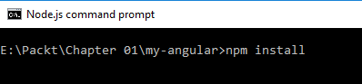执行 npm 命令以安装`package.json`中指定的依赖项。

现在，您将在`node_modules`文件夹下添加所有依赖项，如此屏幕截图所示：

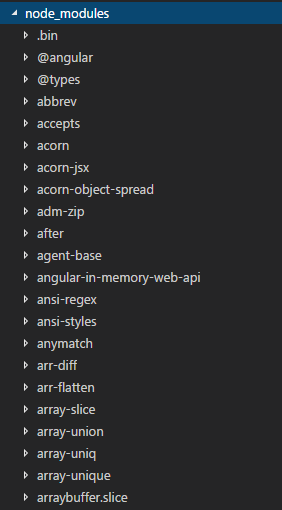`node_modules`文件夹下的依赖项。

1.  现在，让我们运行这个应用程序。要运行它，在命令窗口中执行以下命令：

```ts
          npm start

```

运行此命令将构建应用程序，启动 lite 服务器，并将应用程序托管到其中。

打开任何浏览器，导航到`http://localhost:3000/`；您将看到以下页面显示，这是通过我们的 Angular 应用程序呈现的：

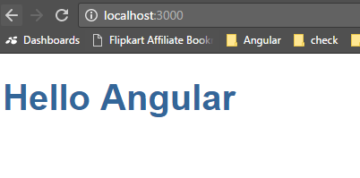在 Visual Studio Code 中激活调试窗口。

现在让我们浏览`index.html`的内容。以下是`index.html`的内容：

```ts
<!DOCTYPE html>
<html>
<head>
<title>Hello Angular 4</title>
<base href="/">
<meta charset="UTF-8">
<meta name="viewport" content="width=device-width,                  initial-scale=1">
<link rel="stylesheet" href="styles.css">
<!-- Polyfill(s) for older browsers -->
<script src="node_modules/core-   
                js/client/shim.min.js">   
      </script>
<script    
         src="node_modules/zone.js/dist/zone.js">   
      </script>
<script    
         src="node_modules/systemjs/dist/system.src.js">   
      </script>
<script src="systemjs.config.js"></script>
<script>
            System.import('main.js').catch(function(err){               
              console.error(err); });
         </script>

```

```ts
</head>
<body>
<my-app>My first Angular 4   app for Packt    
               Publishing...</my-app>
</body>
</html>

```

请注意，脚本是使用`System.js`加载的。`System.js`是在运行时加载模块的模块加载器。

哇！终于，我们的第一个 Angular 应用程序已经启动运行。到目前为止，我们已经看到了如何通过从 GitHub 克隆官方快速启动存储库来创建 Angular 应用程序。我们运行了应用程序，并成功在浏览器中看到了它。

# 总结

哇！这是一个很棒的介绍，不是吗？我们从学习 Angular 的架构开始。我们讨论了 Angular 架构的各种构件。然后我们深入了解了 TypeScript 的基础知识。我们已经看到了一些基本类型和示例。我们还学习了如何编写类，使用接口，并在类中实现它们。我们还学习了继承。

我们已经学习了通过使用模块和命名空间来构建我们的代码。我们还涵盖了一些 TypeScript 的高级主题，如修饰符、访问器、静态属性、泛型和装饰器。

最后，我们使用 Angular 和 TypeScript 创建了一个简单的应用程序。本章为您提供了使用 TypeScript 开发 Angular 应用程序所需的知识，使用了它提供的语法糖。

在下一章中，我们将讨论将 AngularJS 应用迁移到 Angular。
