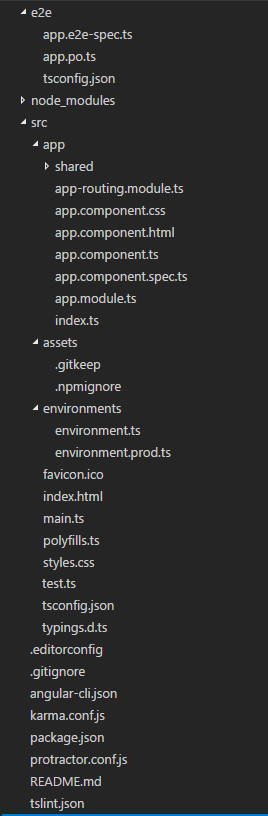
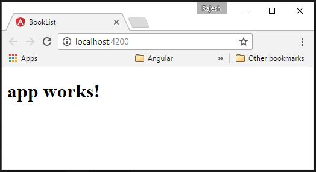
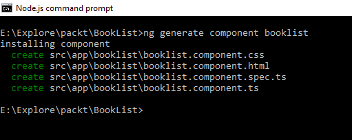
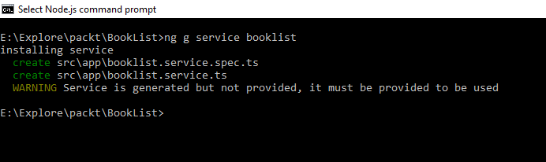
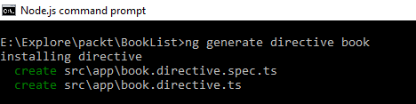
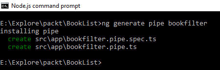

# 第三章：使用 Angular CLI 生成遵循最佳实践的 Angular 应用程序

Angular CLI 是用于 Angular 的命令行界面，它可以帮助您使用遵循所有必要最佳实践的样板代码快速启动应用程序开发。通过在 Angular CLI 中执行命令，您可以为应用程序生成服务、组件、路由和管道。

在本章中，我们将涵盖以下主题：

+   介绍 Angular CLI

+   安装和设置 Angular CLI

+   为新应用程序生成代码

+   生成组件和路由

+   生成服务

+   生成指令和管道

+   创建针对各种环境的构建

+   运行应用程序的测试

+   更新 Angular CLI

# 介绍 Angular CLI

Angular CLI 是一个作为节点包可用的命令行界面。Angular CLI 是与 Angular 一起推出的，它通过为新应用程序生成样板代码并向现有应用程序添加服务、管道、组件和指令等功能，帮助您更快地开发应用程序。Angular CLI 在轻松搭建应用程序方面非常强大和方便。借助 Angular CLI 的帮助，我们可以创建、构建、测试和运行我们的应用程序，这将极大地减轻开发人员的负担。

Angular CLI 在 node 下运行，并依赖于许多包。

# 安装和设置 Angular CLI

要安装 Angular CLI，我们必须在系统中安装最新版本的 node 和 npm。确保所需的包已经安装，并开始全局安装 Angular CLI。最低要求的 npm 版本是 3.x.x，node 版本是 4.x.x。有时，在安装 Angular CLI 时可能会出现错误。在这种情况下，请确保您已安装了最新版本的 node.js。我们可以通过执行以下命令验证 node 的版本：

```ts
node --version

```

我们可以通过执行以下命令检查 npm 的版本：

```ts
npm --version  

```

现在，我们知道了在我们的开发机器上安装的 node 和 npm 的版本。让我们通过执行以下命令全局安装 Angular CLI：

```ts
npm install -g angular-cli 

```

Angular CLI 已安装并可全局在我们的开发机器上使用。

# 为新应用程序生成代码

现在我们已经准备好使用 Angular CLI 了。让我们为一个显示书籍列表的 Angular 应用程序生成样板代码。我们将应用程序的名称命名为`BookList`。在 node.js 命令中执行以下命令：

```ts
ng new BookList

```

此命令将创建一个名为`BookList`的文件夹，并生成样板代码，以便开始使用 Angular 应用程序。以下图显示了生成代码中组织的文件结构：



为了确保生成的代码正常工作，让我们通过执行以下命令来运行应用程序。首先通过执行此语句导航到应用程序文件夹：

```ts
cd BookList

```

然后，执行以下代码来在开发服务器中启动应用程序：

```ts
ng serve

```

现在，让我们浏览到`http://localhost:4200/`，如果生成的代码正确，浏览器将呈现以下页面的默认文本。如果出现错误，请确保防火墙没有阻止端口 4200，并且在生成样板代码时 Angular CLI 没有抛出任何错误：



# 生成组件和路由

组件是功能、视图和样式的逻辑组合，适用于视图和与组件相关的处理这些构件的类。组件负责根据业务逻辑要求呈现视图。

我们可以使用 Angular CLI 生成组件的代码。这个工具在搭建组件时非常方便。让我们通过执行以下语句为我们的应用程序生成一个名为`booklist`的组件。通过执行以下命令导航到 Angular 项目文件夹：

```ts
cd BookList

```

然后，执行以下 Angular CLI 命令来生成组件`Booklist`：

```ts
ng generate component booklist

```

执行上述语句会创建`booklist.component.css`、`booklist.component.html`、`booklist.component.spec.ts`和`booklist.component.ts`，如下图所示：



`booklist.component.ts`文件负责根据业务逻辑需求呈现相关视图。书籍组件生成的代码片段如下：

```ts
import { Component, OnInit } from '@angular/core';   

@Component({   
  selector: 'app-booklist',   
  templateUrl: './booklist.component.html',   
  styleUrls: ['./booklist.component.css']   
})   
export class BooklistComponent implements   OnInit {   

  constructor() { }   

  ngOnInit() {   
  }   

}   

```

请注意，`BooklistComponent`类使用`@Component`指令进行修饰，以及选择器、`templateUrl`和`styleUrls`等元数据。元数据选择器使得 Angular 在遇到`app-booklist`选择器时实例化组件`BooklistComponent`。

Angular CLI 还生成了模板文件`booklist.component.html`，内容如下。Angular 将根据组件中给定的指令解析和呈现此内容：

```ts
<p>   
  booklist works!   
</p>   

```

我们还可以在生成的文件`booklist.component.css`中添加特定于此模板的样式，组件将会应用这些样式，因为元数据`styleUrls`与`booklist.component.css`的路径进行了映射。

生成`booklist.component.spec.ts`以添加测试方法来断言`BooklistComponent`的功能。`booklist.component.spec.ts`的代码片段如下所示：

```ts
/* tslint:disable:no-unused-variable */   

import { TestBed, async } from '@angular/core/testing';   
import { BooklistComponent } from './booklist.component';   

describe('Component: Booklist', () =>   {   
  it('should create an instance', ()   => {   
    let component = new   BooklistComponent();   
    expect(component).toBeTruthy();   
  });   
});   

```

# 路由

路由指示 Angular 导航应用程序。路由使得 Angular 能够仅加载特定路由的视图，而无需重新加载整个页面或应用程序。在撰写本章时，使用 Angular CLI 生成路由被禁用，但将很快启用。

# 生成服务

服务是用户定义的类，用于解决一些目的。Angular 建议在组件中只有特定于模板的代码。组件的责任是丰富 Angular 应用程序中的 UI/UX，并将业务逻辑委托给服务。组件是服务的消费者。

我们已经有了帮助渲染`Booklist`模板的组件。现在，让我们运行一个 CLI 命令来生成一个服务，以提供书籍列表。执行以下命令生成`booklist.services.ts`和`booklist.services.spec.ts`：



生成的`booklist.service.ts`的代码片段如下所示：

```ts
import { Injectable } from '@angular/core';   

@Injectable()   
export class BooklistService {   

  constructor() { }   

}   

```

请注意，`BooklistService`被装饰为`@Injectible`，以便该书单服务将可用于组件。还有一个警告消息，服务已生成但未提供，必须提供才能使用。这意味着要使用`BooklistService`，它需要提供给将要使用它的组件。Angular 中的提供者将在第十三章中详细讨论，*应用依赖注入*。

Angular CLI 还生成了一个文件，用于编写测试方法来断言`BooklistService`，`booklist.service.spec.ts`的代码片段如下所示：

```ts
/* tslint:disable:no-unused-variable */   

import { TestBed, async, inject } from '@angular/core/testing';   
import { BooklistService } from './booklist.service';   

describe('Service: Booklist', () => {   
  beforeEach(() => {   
    TestBed.configureTestingModule({   
      providers: [BooklistService]   
    });   
  });   

  it('should ...',   inject([BooklistService], (service: 
      BooklistService) => {   
           expect(service).toBeTruthy();   
  }));   
});   

```

# 生成指令和管道

一个使用`@Directive`装饰的类来附加元数据被称为指令。它是一个渲染模板的指示或指导方针。

我们已经看到了生成组件和服务。现在，让我们使用 Angular CLI 生成指令和管道。我们将从创建一个名为 book 的指令开始。运行以下命令生成指令：

```ts
ng generate directive book       

```

执行命令的结果如下所示：



执行此命令会分别创建两个文件，即`book.directive.spec.ts`和`book.directive.ts`。以下是`book.directive.ts`的代码片段：

```ts
import { Directive } from '@angular/core';
 @Directive({
    selector: '[appBookish]' 
   }) 
  export class BookishDirective { 
      constructor() { } 
  } 

```

`book.directive.spec.ts`的代码片段如下所示：

```ts
/* tslint:disable:no-unused-variable */ 
import { TestBed, async } from '@angular/core/testing';
import { BookDirective } from './book.directive'; 

describe('Directive: Book', () => {
   it('should create an instance', () => 
     { let directive = new BookDirective();   
        expect(directive).toBeTruthy();
    }); 
  }); 

```

# 管道

管道指示 Angular 在过滤或渲染输入数据时的操作。管道根据管道中给定的逻辑转换输入数据。

现在，让我们通过执行以下语句使用 Angular CLI 生成一个管道：



在这里，我使用 Angular CLI 创建了一个名为`bookfilter`的管道。请注意，它还创建了一个名为`bookfilter.pipe.spec.ts`的测试文件，用于编写测试方法来断言管道。`bookfilter.pipe.ts`的代码片段如下所示：

```ts
import { Pipe, PipeTransform } from '@angular/core'; 
 @Pipe({ 
    name: 'bookfilter'
    }) 
 export class BookfilterPipe implements PipeTransform { 
        transform(value: any, args?: any): any {
    return null; 
  } 
} 

```

为测试文件`bookfilter.pipe.spec.ts`生成的代码片段如下所示：

```ts
/* tslint:disable:no-unused-variable */ 
import { TestBed, async } from '@angular/core/testing'; 
import { BookfilterPipe } from './bookfilter.pipe'; 
  describe('Pipe: Bookfilter', () => { 
   it('create an instance', () => {
         let pipe = new BookfilterPipe(); 
         expect(pipe).toBeTruthy(); 
   }); 
 }); 

```

# 创建针对各种环境的构建

使用 Angular CLI，我们还可以为应用程序创建针对各种环境的构建，例如开发和生产。应用程序将根据环境进行特定配置。例如，应用程序可以配置为在开发或暂存环境中使用暂存 API 的 URL，并在 LIVE 或生产环境中配置 API 的生产 URL。开发人员将手动根据应用程序构建的环境更新 URL 的配置。Angular 可以简化通过针对各种环境创建构建的过程。

在名为`environment.ts`的文件中维护了一个常量变量环境。此文件将帮助根据执行构建命令时传递的参数来覆盖默认值。

要使用生产文件，我们需要执行以下命令：

```ts
 ng build --env=prod 

```

此命令将使用`environment.prod.ts`中的设置。用于识别环境文件的映射在`angular-cli.json`中指定，如下所示：

```ts
"environments": { 
  "source": "environments/environment.ts", 
   "dev": "environments/environment.ts", 
   "prod": "environments/environment.prod.ts" 
  } 

```

# 为您的应用程序运行测试

在将应用程序移至生产环境之前，测试应用程序是必不可少的过程。开发人员可以编写测试来断言应用程序的行为。编写适当的测试将保护应用程序免受偏离要求的影响。

Jasmine 是一个测试框架，它方便编写测试来断言应用程序的行为，并使用 HTML 测试运行器在浏览器中执行测试。Karma 是一个测试运行器，它使开发人员能够在开发阶段同时编写单元测试。一旦构建过程完成，将使用 Karma 执行测试。Protractor 可以用于运行端到端测试，以断言应用程序的工作流程，就像最终用户的体验一样。

以下命令在应用程序中运行测试：

```ts
ng test 

```

端到端测试可以通过在此处运行命令来执行，并且只有在应用程序由命令 ng serve 提供服务时才能成功运行。这个端到端测试是由 Protractor 运行的：

```ts
ng e2e 

```

我不会详细介绍每个生成的文件的内容，因为有章节会详细解释它们。

# 更新 Angular CLI

我们可以在全局包和本地项目中更新 Angular CLI 版本。要全局更新 Angular CLI 包，请运行以下命令：

```ts
npm uninstall -g @angular/cli npm cache clean npm install -g @angular/cli@latest 

```

要在本地项目文件夹中更新 CLI，请运行此命令：

```ts
rm -rf node_modules dist # use rmdir /S/Q node_modules dist in Windows 
  Command Prompt; use rm -r -fo node_modules,dist in Windows PowerShell npm install --save-dev @angular/cli@latest npm install 

```

# 总结

那很顺利和简单，不是吗？Angular CLI 通过为 Angular 应用程序的各种构件生成样板代码，使开发人员的生活更加轻松。您开始学习强大的工具 Angular CLI 以及它如何帮助您使用样板代码启动应用程序。然后，您学会了使用 Angular 命令行界面生成组件、指令、管道、路由和服务。最后，您还了解了如何使用 Angular CLI 构建 Angular 应用程序。在下一章中，我们将讨论如何使用 Angular 组件。
