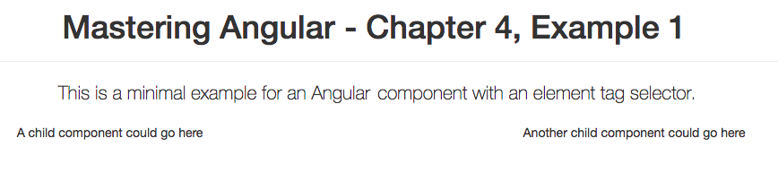
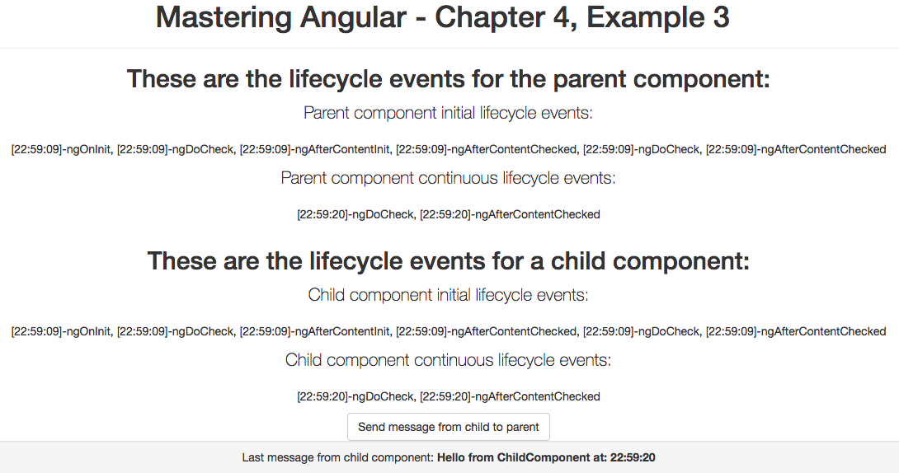

# 第四章：使用组件

在本章中，我们将讨论使用 Angular 组件的不同技术和策略：

+   初始化和配置组件

+   构建组件

+   组件生命周期

+   数据共享和组件间通信

本章假设读者具有 JavaScript 和 TypeScript 编程基础以及网页开发的知识，并熟悉本书中的第一章*，* *Angular 中的架构概述和构建简单应用*的内容。本章中的所有示例都使用 TypeScript，并且也可以在 GitHub 上找到，网址为[`github.com/popalexandruvasile/mastering-angular2/tree/master/Chapter4`](https://github.com/popalexandruvasile/mastering-angular2/tree/master/Chapter4)。

一个成功的开源项目的一个明显标志是出色的文档，Angular 也不例外。我强烈建议阅读来自[`angular.io/`](https://angular.io/)的所有可用文档，并在那里跟随可用的示例。作为一个一般规则，本章中的所有示例都遵循官方文档的格式和约定，我使用了来自[`github.com/angular/quickstart`](https://github.com/angular/quickstart)的 Angular 示例种子的简化版本作为示例。如果你想要尝试或玩自己的 Angular 创作，你可以使用本章代码中`Example1`文件夹的内容作为起点。

# 组件 101

组件是 Angular 应用程序的构建块，任何这样的应用程序在执行之前都需要至少定义一个称为根组件的组件。

# 基本根组件

在 Angular 中，组件被定义为一个具有特定元数据的类，将其与 HTML 模板和类似于 jQuery 的 HTML DOM 选择器相关联：

+   组件模板可以绑定到属于组件类的任何属性或函数

+   组件选择器（类似于 jQuery 选择器）可以针对定义组件插入点的元素标签、属性或样式类进行定位。

在 Angular 应用程序中执行时，组件通常会在特定页面位置呈现 HTML 片段，可以对用户输入做出反应并显示动态数据。

组件元数据表示为 TypeScript 装饰器，并支持本章中示例中将介绍的其他配置。

`TypeScript`装饰器在第一章中有介绍，*Angular 中的架构概述和构建简单应用程序*。它们对于理解组件如何配置至关重要，并且目前已经提议成为 JavaScript 规范（ECMAScript）的一部分。

本章的第一个示例是一个基本组件，也是一个根组件（任何 Angular 应用程序都至少需要一个根组件来初始化其组件树）：

```ts
import { Component } from '@angular/core'; 
@Component({ 
    selector: 'my-app', 
    template: ` 
    <div class="container text-center"> 
      <div class="row"> 
        <div class="col-md-12"> 
          <div class="page-header"> 
            <h1>{{title}}</h1> 
          </div> 
          <p class="lead">{{description}}</p> 
        </div> 
      </div> 
      <div class="row"> 
        <div class="col-md-6"> 
          <p>A child component could go here</p> 
        </div> 
        <div class="col-md-6"> 
          <p>Another child component could go here</p> 
        </div> 
      </div>           
    </div>     
    ` 
}) 
export class AppComponent {  
  title: string; 
  description: string; 
  constructor(){ 
    this.title = 'Mastering Angular - Chapter 4, Example 1'; 
    this.description = 'This is a minimal example for an Angular 2   
    component with an element tag selector.'; 
  } 
} 

```

组件模板依赖于 Bootstrap 前端设计框架（[`getbootstrap.com/`](http://getbootstrap.com/)）进行样式设置，并且绑定到组件类的属性以检索一些显示的文本。它包含模板表达式，用于从组件类的属性中插值数据，例如`{{title}}`。

根组件使用内联模板（模板内容与其组件在同一文件中）和一个元素选择器，该选择器将在`index.html`页面中呈现组件模板，替换高亮文本：

```ts
<!DOCTYPE html> 
<html> 
  <head> 
    <title>Mastering Angular example</title> 
    ... 
  </head> 
  <body> 
    <my-app>Loading...</my-app> 
  </body> 
</html>    

```

要查看示例的实际效果，您可以在本章的源代码中的`Example1`文件夹中运行以下命令行：

```ts
npm run start  

```

您可以在下一个截图中查看呈现的组件：



Angular 应用程序至少需要一个根模块，在`main.ts`文件中，我们正在为我们的示例引导这个模块：

```ts
import { platformBrowserDynamic } from '@angular/platform-browser-dynamic'; 
import { AppModule } from './app.module'; 
platformBrowserDynamic().bootstrapModule(AppModule);  

```

我们使用`app.module.ts`模块文件来定义应用程序的根模块：

```ts
import { NgModule } from '@angular/core'; 
import { BrowserModule } from '@angular/platform-browser'; 
import { AppComponent } from './app.component'; 
@NgModule({ 
  imports:      [ BrowserModule ], 
  declarations: [ AppComponent ], 
  bootstrap:    [ AppComponent ] 
}) 
export class AppModule { } 

```

模块可以使用`imports`属性导入其他模块，并且模块可以在`bootstrap`属性下定义一个或多个根组件。在我们的示例中，每个这样的根组件都将初始化其自己的组件树，该组件树仅包含一个组件。在模块中使用任何组件、指令或管道之前，都需要将其添加到`declarations`属性中。

# 定义子组件

虽然根组件代表 Angular 应用程序的容器，但您还需要其他直接或间接是根组件后代的组件。当呈现根组件时，它还将呈现其所有子组件。

这些子组件可以从其父组件接收数据，也可以发送数据回去。让我们在一个更复杂的示例中看到这些概念的运作，这个示例是在前一个示例的基础上构建的。请注意，在`Example1`中，我们建议子组件可以插入到根组件模板中；这样的一个子组件定义如下：

```ts
import { Component, Input, Output, EventEmitter } from '@angular/core'; 
@Component({ 
    selector: 'div[my-child-comp]', 
    template: ` 
        <p>{{myText}}</p> 
        <button class="btn btn-default" type="button" (click)="onClick()">Send message</button>` 
}) 
export class ChildComponent {  
  private static instanceCount: number = 0; 
  instanceId: number; 
  @Input() myText: string; 
  @Output() onChildMessage = new EventEmitter<string>();   
  constructor(){ 
    ChildComponent.instanceCount += 1; 
    this.instanceId = ChildComponent.instanceCount; 
  } 
  onClick(){ 
    this.onChildMessage.emit(`Hello from ChildComponent with instance  
    id: ${this.instanceId}`); 
  } 
} 

```

第一个突出显示的代码片段显示了组件选择器使用自定义元素属性而不是自定义元素标记。在使用现有的 CSS 样式和 HTML 标记时，往往需要确保你的 Angular 组件与其上下文的外观和感觉自然地集成。这就是属性或 CSS 选择器真正有用的地方。

乍一看，组件类结构看起来与`Example1`中的类似--除了第二个突出显示的代码片段中的两个新装饰器。第一个装饰器是`@Input()`，应该应用于可以从父组件接收数据的任何组件属性。第二个装饰器是`@Output()`，应该应用于可以向父组件发送数据的任何属性。Angular 2 定义了一个`EventEmitter`类，它使用类似 Node.js `EventEmitter`或 jQuery 事件的方法来生成和消费事件。`string`类型的输出事件是在`onClick()`方法中生成的，任何父组件都可以订阅这个事件来从子组件接收数据。

EventEmitter 类扩展了 RxJS Subject 类，而 RxJS Subject 类又是 RxJS Observable 的一种特殊类型，允许多播。关于可观察对象、订阅者和其他响应式编程概念的更多细节可以在第七章 *使用可观察对象进行异步编程*中找到。

我们利用了 TypeScript 中的`static`类属性来生成一个唯一的实例标识符`instanceId`，该标识符在子组件通过`onChildMessage`输出属性发送的消息中使用。我们将使用这条消息来明显地表明每个子组件实例向其订阅者发送一个唯一的消息，这在我们的示例中是`AppComponent`根组件。

```ts
@Component({ 
    selector: 'div.container.my-app', 
    template: ` 
    <div class="container text-center"> 
      <div class="row"><div class="col-md-12"> 
          <div class="page-header"><h1>{{title}}</h1></div> 
          <p class="lead">{{description}}</p> 
      </div></div> 
      <div class="row"> 
        <div class="col-md-6" my-child-comp myText="A child component 
 goes here" (onChildMessage)="onChildMessageReceived($event)"> 
 </div>       
        <div class="col-md-6" my-child-comp 
 [myText]="secondComponentText" 
 (onChildMessage)="onChildMessageReceived($event)"></div>          
        </div> 
      <div class="row"><div class="col-md-12"><div class="well well-
       sm">          
            <p>Last message from child components: <strong> 
               {{lastMessage}}</strong>
            </p> 
           </div></div></div>           
    </div> 
}) 
export class AppComponent {  
  title: string; 
  description: string; 
  secondComponentText: string; 
  lastMessage: string; 
  constructor(){ 
    this.title = 'Mastering Angular - Chapter 4, Example 2'; 
    this.description = 'This is an example for an Angular 2 root   
    component with an element and class selector and a child component 
    with an element attribute selector.'; 
    this.secondComponentText = 'Another child component goes here'; 
  } 

  onChildMessageReceived($event: string) 
  { 
    this.lastMessage = $event; 
  } 
} 

```

突出显示的代码显示了根组件如何引用和绑定`ChildComponent`元素。`onChildMessage`输出属性绑定到`AppComponent`方法，使用与 Angular 2 用于绑定原生 HTML DOM 事件相同的括号表示法；例如，`<button (click)="onClick($event)">`。

输入属性只是为第一个`ChildComponent`实例分配了一个静态值，并通过括号表示法绑定到`AppComponentsecondComponentText`属性。当我们仅分配固定值时，不需要使用括号表示法，Angular 2 在绑定到原生 HTML 元素属性时也会使用它；例如，`<input type="text" [value]="myValue">`。

如果您还不熟悉 Angular 如何绑定到原生 HTML 元素属性和事件，您可以参考第六章，*创建指令和实现变更检测*，以供进一步参考。

对于两个`ChildComponent`实例，我们使用相同的`AppComponentonChildMessageReceived`方法，使用简单的事件处理方法绑定到`onChildMessage`事件，这将在应用程序页面上显示最后一个子组件消息。根组件选择器被更改为使用元素标签和 CSS 类选择器，这种方法导致`index.html`文件结构更简单。

我们必须修改`AppModule`的定义，以确保`ChildComponent`可以被`AppComponent`和同一模块中的任何其他组件引用：

```ts
@NgModule({ 
  imports:      [ BrowserModule ], 
  declarations: [ AppComponent, ChildComponent ], 
  bootstrap:    [ AppComponent ] 
}) 
export class AppModule { } 

```

您可以在本章的代码中的`Example2`文件夹中找到此示例。本文涵盖的概念，如组件属性和事件、组件数据流和组件组合，在构建相对复杂的应用程序方面可以发挥重要作用，我们将在本章中进一步探讨它们。

除了组件，Angular 还有指令的概念，这在 Angular 1 中也可以找到。每个 Angular 组件也是一个指令，我们可以粗略地将指令定义为没有任何模板的组件。`@Component`装饰器接口扩展了`@Directive`装饰器接口，我们将在第六章中更多地讨论指令，*创建指令和实现变更检测*。

# 组件生命周期

Angular 渲染的每个组件都有自己的生命周期：初始化、检查变化和销毁（以及其他事件）。Angular 提供了一个`hook`方法，我们可以在其中插入应用代码以参与组件生命周期。这些方法通过 TypeScript 函数接口提供，可以选择性地由组件类实现，它们如下：

+   `ngOnChanges`：在数据绑定的组件属性在`ngOnInit`之前初始化一次，并且每次数据绑定的组件属性发生变化时都会被调用。它也是指令生命周期的一部分（约定是接口实现函数名加上`ng`前缀，例如`ngOnInit`和`OnInit`）。

+   `ngOnInit`：在第一次`ngOnChanges`之后调用一次，当数据绑定的组件属性和输入属性都被初始化时调用。它也是指令生命周期的一部分。

+   `ngDoCheck`：作为 Angular 变化检测过程的一部分被调用，应用于执行自定义变化检测逻辑。它也是指令生命周期的一部分。

+   `ngAfterContentInit`：在第一次调用`ngDoCheck`之后调用一次，当组件模板完全初始化时调用。

+   `ngAfterContentChecked`：在`ngAfterContentInit`之后和每次`ngDoCheck`调用后都会被调用，用于验证组件内容。

+   `ngAfterViewInit`：在第一次`ngAfterContentChecked`之后调用一次，当所有组件视图及其子视图都被初始化时调用。

+   `ngAfterViewChecked`：在`ngAfterViewInit`之后和每次`ngAfterContentChecked`调用后都会被调用，用于验证所有组件视图及其子视图。

+   `ngOnDestroy`：当组件即将被销毁时调用，应用于清理操作；例如，取消订阅可观察对象和分离事件。

我们将调整我们之前的示例来展示一些这些生命周期`hook`，并且我们将使用一个父组件和一个子组件，它们要么显示要么记录所有它们的生命周期事件到控制台。直到组件完全加载的事件触发将被清晰地显示/记录，如下截图所示：



父组件的代码与子组件的代码非常相似，子组件有一个按钮，可以根据需要向父组件发送消息。当发送消息时，`child`组件和父组件都会响应由 Angular 的变更检测机制生成的生命周期事件。您可以在本章的源代码中的`Example3`文件夹中找到`child.component.ts`文件中的子组件代码。

```ts
import {Component, Input, Output, EventEmitter, OnInit, OnChanges, DoCheck, AfterContentInit, AfterContentChecked, AfterViewInit, AfterViewChecked} from '@angular/core'; 
@Component({ 
  selector: 'div[my-child-comp]', 
  template: ` 
  <h2>These are the lifecycle events for a child component:</h2> 
  <p class="lead">Child component initial lifecycle events:</p> 
  <p>{{initialChildEvents}}</p> 
  <p class="lead">Child component continuous lifecycle events:</p> 
  <p>{{continuousChildEvents}}</p> 
  <button class="btn btn-default" type="button" (click)="onClick()">Send message from child to parent</button>` 
}) 
export class ChildComponent implements OnInit, OnChanges, DoCheck, AfterContentInit, AfterContentChecked, AfterViewInit, AfterViewChecked { 
  initialChildEvents: string[]; 
  continuousChildEvents: string[]; 
  @Output() onChildMessage = new EventEmitter<string>(); 
  private hasInitialLifecycleFinished: boolean = false; 
  private ngAfterViewCheckedEventCount: number = 0; 
  constructor() { 
    this.initialChildEvents = []; 
    this.continuousChildEvents = []; 
  } 
  private logEvent(message: string) { 
        if (!this.hasInitialLifecycleFinished) { 
            this.initialChildEvents.push(message); 
        } else { 
            this.continuousChildEvents.push(message); 
        } 
    } 
  ngOnChanges(): void { 
    this.logEvent(` [${new Date().toLocaleTimeString()}]-ngOnChanges`); 
  } 
  ngOnInit(): void { 
    this.logEvent(` [${new Date().toLocaleTimeString()}]-ngOnInit`); 
  } 
  ngDoCheck(): void { 
    this.logEvent(` [${new Date().toLocaleTimeString()}]-ngDoCheck`); 
  } 
  ngAfterContentInit(): void { 
    this.logEvent(` [${new Date().toLocaleTimeString()}]-
    ngAfterContentInit`); 
  } 
  ngAfterContentChecked(): void { 
    this.logEvent(` [${new Date().toLocaleTimeString()}]-
    ngAfterContentChecked`); 
  } 
  ngAfterViewInit(): void { 
    console.log(`child: [${new Date().toLocaleTimeString()}]-
    ngAfterViewInit`); 
  } 
  ngAfterViewChecked(): void { 
    this.ngAfterViewCheckedEventCount += 1; 
    if (this.ngAfterViewCheckedEventCount === 2) { 
      this.hasInitialLifecycleFinished = true; 
    } 
    console.log(`child: [${new Date().toLocaleTimeString()}]-
    ngAfterViewChecked`); 
  } 
  onClick() { 
    this.onChildMessage.emit(`Hello from ChildComponent at: ${new 
    Date().toLocaleTimeString()}`); 
  } 
} 

```

以`ng`开头的所有方法都是组件生命周期钩子，当触发时，大多数方法都会记录存储在组件中并通过数据绑定显示的事件（请参阅上一个代码清单中的突出显示的代码片段）。生命周期钩子中的两个--`ngAfterViewInit`和`ngAfterViewChecked`--会将事件记录到控制台，而不是将其存储为组件数据，因为在组件生命周期的那一点上组件状态的任何更改都会在 Angular 应用程序中生成异常。例如，让我们将`ngAfterViewInit`方法体更改为以下内容：

```ts
ngAfterViewInit(): void { 
    this.logEvent(` [${new Date().toLocaleTimeString()}]-
    ngAfterViewInit); 
} 

```

如果您查看应用程序页面浏览器控制台，在进行更改后，您应该会看到此错误消息：

表达在检查后已经改变。

在示例的初始运行中，`ngDoCheck`和`ngAfterContentChecked`方法（如果查看浏览器控制台输出，则还有`ngAfterViewChecked`）在任何用户交互之前已经为每个组件触发了两次。此外，每次按下示例按钮时，相同的三种方法都会被触发，每个组件一次。在实践中，除了编写更高级的组件或组件库之外，您可能很少使用这些生命周期钩子，除了`ngOnChanges`，`ngOnInit`和`ngAfterViewInit`。我们将在第六章中重新讨论这些核心生命周期钩子，*创建指令和实现变更检测*，因为它们在表单和其他交互式组件的上下文中非常有用。

# 在组件之间进行通信和共享数据

我们已经使用了最简单的方法来在组件之间通信和共享数据：`Input`和`Output`装饰器。使用`Input`装饰器装饰的属性通过传递数据来初始化组件，而`Output`装饰器可以用于分配事件监听器，以接收组件外部的数据。这种方法可以在本章源代码中的`Example2`文件夹中找到的组件中观察到。

# 从父组件引用子组件

我们可以通过模板引用变量或通过使用`ViewChild`和`ViewChildren`属性装饰器将目标组件注入到父组件中，来绕过声明性绑定到组件属性和事件。在这两种情况下，我们都可以获得对目标组件的引用，并且可以以编程方式分配其属性或调用其方法。为了演示这些功能的实际应用，我们将稍微修改`Example2`中的`ChildComponent`类，并确保`myText`属性具有默认文本设置。这可以在本章源代码中的`Example4`文件夹中找到的`child.component.ts`文件中的突出显示的代码片段中看到。

```ts
... 
export class ChildComponent {  
  private static instanceCount: number = 0;  
  instanceId: number; 
  @Input() myText: string; 
  @Output() onChildMessage = new EventEmitter<string>(); 

  constructor(){ 
    ChildComponent.instanceCount += 1; 
    this.instanceId = ChildComponent.instanceCount; 
    this.myText = 'This is the default child component text.'; 
  } 

  onClick(){ 
    this.onChildMessage.emit(`Hello from ChildComponent with instance 
    id: ${this.instanceId}`); 
  } 
} 

```

然后，我们将更改`app.component.ts`文件，以包括模板引用方法来处理第一个子组件和组件注入方法来处理第二个子组件：

```ts
import { Component, ViewChildren, OnInit, QueryList } from '@angular/core'; 
import { ChildComponent } from './child.component'; 
@Component({ 
    selector: 'div.container.my-app', 
    template: ` 
    <div class="container text-center"> 
      <div class="row"><div class="col-md-12"> 
          <div class="page-header"><h1>{{title}}</h1></div> 
          <p class="lead">{{description}}</p>           
      </div></div> 
      <div class="row"> 
        <div class="col-md-6"> 
          <button class="btn btn-default" type="button" 
 (click)="firstChildComponent.myText='First child component 
 goes here.'">Set first child component text</button> 
          <button class="btn btn-default" type="button" 
 (click)="firstChildComponent.onChildMessage.subscribe(onFirstChildComp
 onentMessageReceived)">Set first child component message 
 output</button> 
         </div>       
         <div class="col-md-6"> 
        <button class="btn btn-default" type="button" 
 (click)="setSecondChildComponentProperties()">Set second 
 child component properties</button> 
         </div>          
         </div>       
      <div class="row"> 
      <div class="col-md-6 well well-sm" my-child-comp 
 #firstChildComponent></div>       
        <div class="col-md-6 well well-sm" my-child-comp 
 id="secondChildComponent"></div>       
      </div> 
      <div class="row"><div class="col-md-12"><div class="well well-
      sm">          
            <p>Last message from child components: <strong>
            {{lastMessage}}</strong></p> 
      </div></div></div>           
    </div>` 
}) 
export class AppComponent {  
  title: string; 
  description: string; 
  lastMessage: string; 
  @ViewChildren(ChildComponent) childComponents: 
  QueryList<ChildComponent>; 
  constructor(){ 
    this.title = 'Mastering Angular - Chapter 4, Example 4'; 
    this.description = 'This is an example for how to reference 
    existing components from a parent component.'; 
    this.lastMessage = 'Waiting for child messages ...'; 
  } 
  onFirstChildComponentMessageReceived($event: string) 
  { 
    alert($event); 
  }   
  setSecondChildComponentProperties(){     
    this.childComponents.last.myText = "The second child component goes 
    here."; 
    this.childComponents.last.onChildMessage.subscribe( (message: 
    string) => {  
      this.lastMessage = message + ' (the message will be reset in 2 
      seconds)'; 
      setTimeout( ()=>{ this.lastMessage = 'Waiting for child messages 
      ...';}, 2000); 
    }); 
  } 
} 

```

首先，第三个突出显示的 HTML 片段中的两个子组件没有任何属性或事件绑定。第一个子组件有一个`#firstChildComponent`属性，它代表一个模板引用变量。

# 模板引用变量

模板引用变量可以在 Angular 模板中针对任何组件、指令或 DOM 元素进行设置，并且将该引用可用于当前模板。在前面示例中的第一个突出显示的 HTML 片段中，我们有两个按钮，它们使用内联 Angular 表达式来设置`myText`属性，并通过`firstChildComponent`模板引用变量绑定到`onChildMessage`事件。运行示例时，如果我们单击“设置第一个子组件文本”按钮，然后单击“设置第一个子组件消息输出”按钮，我们将通过模板引用变量直接操作第一个子组件，就像在之前示例中的第一个突出显示的 HTML 片段中所看到的那样。这种方法适用于初始化和读取组件属性，但在需要绑定到组件事件时，它被证明是繁琐的。

模板引用变量无法在组件类中访问；因此，我们的做法是绑定到第一个子组件事件。然而，在处理表单时，这种类型的变量将非常有用，我们将在第六章中重新讨论它们，*创建指令和实现变更检测*。

# 注入子组件

对于第二个子组件，我们使用了一种基于在`app.component.ts`文件中的属性声明中注入组件的技术：

```ts
@ViewChildren(ChildComponent) childComponents: QueryList<ChildComponent>; 

```

`ViewChildren`装饰器采用了`ChildComponent`类型的选择器，该选择器将从父组件模板中识别和收集所有`ChildComponent`实例，并将其放入`QueryList`类型的专门列表中。这个列表允许迭代子组件实例，我们可以在`AppComponent.setSecondChildComponentProperties()`方法中使用`QueryList.Last()`调用来获取第二个子组件的引用。当运行本章源代码中`Example4`文件夹中找到的代码时，如果单击“设置第二个子组件属性”按钮，前一个代码清单中的第二个 HTML 片段将开始运行。

注入子组件是一种多才多艺的技术，我们可以以更高效的方式从父组件代码中访问引用的组件。

# 使用服务与组件

现在，我们将再次演变`Example2`，并将一些在组件级别定义的代码重构为 Angular 服务。

服务是一个 TypeScript 类，它有一个名为`Injectable`的装饰器，没有任何参数，允许服务成为 Angular 2 中依赖注入（DI）机制的一部分。DI 将确保每个应用程序只创建一个服务实例，并且该实例将被注入到任何声明它为依赖项的类的构造函数声明中。除了特定的装饰器之外，服务通常需要在模块定义中声明为提供者，但也可以在组件、指令或管道定义中声明。在跳转到本节的示例之前，您可以在第十二章中找到有关服务的更多信息，*实现 Angular 服务*。

即使一个服务没有其他依赖，也最好确保它被装饰为可注入的，以防将来有依赖，并简化其在作为依赖项时的使用。

对于我们的示例，我们将在`Example2`代码的基础上构建一个新示例，该示例可以在本章的源代码中的`Example4`文件夹中找到。我们将首先将父组件和`child`组件的大部分逻辑提取到一个新的服务类中：

```ts
import {Injectable,EventEmitter} from '@angular/core'; 
@Injectable() 
export class AppService { 
  private componentDescriptions: string[]; 
  private componentMessages: string[]; 
  public appServiceMessage$ = new EventEmitter <string> (); 
  constructor() { 
    this.componentDescriptions = [ 
      'The first child component goes here', 
      'The second child component goes here' 
    ]; 
    this.componentMessages = []; 
  } 
  getComponentDescription(index: number): string { 
    return this.componentDescriptions[index]; 
  } 
  sendMessage(message: string): void { 
    this.componentMessages.push(message); 
    this.appServiceMessage$.emit(message); 
  } 
  getComponentMessages(): string[] { 
    return this.componentMessages; 
  } 
} 

```

该服务将用于存储`componentDescriptions`数组中由子组件使用的描述，并通过`sendMessage()`方法提供消息处理程序，该方法还将任何处理过的消息存储在`AppService.componentMessages`属性中。`Example2`中`child`组件的`onChildMessage`属性现在移动到`AppService.appServiceMessage$`，并且可以供任何需要它的组件或服务使用。`child`组件的定义现在大大简化了。

```ts
import {Component, Input, Output, EventEmitter, OnInit} from '@angular/core'; 
import {AppService} from './app.service'; 

@Component({ 
  selector: 'div[my-child-comp]', 
  template: ` 
        <p>{{myText}}</p> 
        <button class="btn btn-default" type="button" 
        (click)="onClick()">Send message</button>` 
}) 
export class ChildComponent implements OnInit { 
  @Input() index: number; 
  myText: string; 
  constructor(private appService: AppService) {} 
  ngOnInit() { 
    this.myText = this.appService.getComponentDescription(this.index); 
  } 

  onClick() { 
    if (this.appService.getComponentMessages().length > 3) { 
      this.appService.sendMessage(`There are too many messages ...`); 
      return; 
    } 
    this.appService.sendMessage(`Hello from ChildComponent with index: 
    ${this.index}`); 
  } 
} 

```

`Child`组件的消息现在通过`AppService`的`sendMessage()`方法发送。此外，唯一的`@Input()`属性称为`index`，它存储了用于通过`AppService.getComponentDescription()`方法设置`myText`属性的组件索引。除了`index`属性之外，`ChildComponent`类完全依赖于`AppService`来读取和写入数据。

`AppComponent`类现在几乎没有逻辑，虽然它显示了`AppService`实例提供的所有消息，但它还在`ngOnInit`方法中注册了一个自定义订阅，用于存储最后接收到的消息。`AppService.appServiceMessage$`属性是`EventEmitter`类型，为任何对消费此事件感兴趣的其他 Angular 类提供了一个公共订阅：

```ts
import { Component, OnInit } from '@angular/core'; 
import { AppService } from './app.service'; 
@Component({ 
    selector: 'div.container.my-app', 
    template: `<div class="container text-center"> 
      <div class="row"><div class="col-md-12"> 
          <div class="page-header"><h1>{{title}}</h1></div> 
          <p class="lead">{{description}}</p> 
      </div></div> 
      <div class="row"> 
        <div class="col-md-6 well" my-child-comp index="0"></div>       
        <div class="col-md-6 well" my-child-comp index="1"></div>          
      </div> 
      <div class="row"><div class="col-md-12"><div class="well well-
       sm"> 
            <p><strong>Last message received:</strong> 
             {{lastMessageReceived}}</p> 
            <p><strong>Messages from child components:</strong> 
            {{appService.getComponentMessages()}}</p> 
       </div></div></div>           
    </div>` 
}) 
export class AppComponent implements OnInit {  
  title: string; 
  description: string; 
  lastMessageReceived: string; 
  constructor(private appService: AppService){ 
    this.title = 'Mastering Angular - Chapter 4, Example 4'; 
    this.description = 'This is an example of how to communicate and 
    share data between components via services.';     
  }  
  ngOnInit(){ 
    this.appService.appServiceMessage$.subscribe((message:string) => { 
      this.lastMessageReceived = message; 
    }); 
  } 
} 

```

在这个例子中，我们从一个依赖`@Input()`属性来获取所需数据的`ChildComponent`类开始；我们转而使用一个只需要一个键值来从服务类获取数据的类。编写组件的两种风格并不互斥，使用服务可以进一步支持编写模块化组件。

# 总结

在本章中，我们首先看了一个基本的组件示例，然后探讨了父子组件。对组件生命周期的了解之后，我们举例说明了如何在组件之间进行通信和共享数据。
