# 第五章：实现 Angular 路由和导航

应用程序导航是任何网站或应用程序的核心功能之一。除了定义路由或路径之外，导航还帮助用户到达应用程序页面，探索功能，并且对于 SEO 目的也非常有用。

在本章中，您将学习有关 Angular 路由和导航的所有内容。以下是我们将在路由和导航中学习和实现的功能的详细列表。

您将学习以下路由和导航方面：

+   导入和配置路由器

+   在视图中启用路由出口、`routerLink`、`routerLinkActive`和`base href`

+   自定义组件路由和子路由

+   具有内部子路由的自定义组件路由--同一页面加载

+   演示应用程序的路由和导航

在本章结束时，我们将能够做到以下事情：

+   为应用程序创建`app.routes`并设置所需的模块

+   实现并启用`RouterModule.forRoot`

+   定义路由出口和`routerLink`指令以绑定路由路径

+   启用`RouterLinkActivated`以查找当前活动状态

+   了解路由状态的工作原理

+   了解并实现路由生命周期钩子

+   创建自定义组件路由和子路由

+   为我们的 Web 应用程序实现位置策略

+   创建一个示例应用程序路由和导航

首先，让我们看一下我们将在本章开发的演示应用程序的路由和导航：

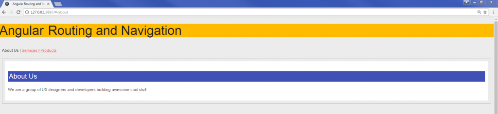

作为演示应用程序的一部分，我们将为“关于我们”、“服务”和“产品”组件开发路由。

服务组件将具有内部子路由。产品组件将使用`ActivatedRoute`来获取路由`params`。我们还将使用 JavaScript 事件`onclick`来实现导航。

# 导入和配置路由器

为了定义和实现导航策略，我们将使用路由器和`RouterModule`。

我们需要更新我们的`app.module.ts`文件以执行以下操作：

+   从 Angular 路由器模块导入`RouterModule`和路由

+   导入应用程序组件

+   定义具有路径和组件详细信息的路由

+   导入`RouterModule.forRoot`（`appRoutes`）

每个路由定义可以具有以下键：

+   `path`：我们希望在浏览器地址栏中显示的 URL。

+   `component`：将保存视图和应用程序逻辑的相应组件。

+   `redirectTo`（可选）：这表示我们希望用户从此路径重定向的 URL。

+   `pathMatch`（可选）：重定向路由需要`pathMatch`--它告诉路由器如何将 URL 与路由的路径匹配。`pathMatch`可以取`full`或`prefix`的值。

现在我们将在我们的`NgModule`中导入和配置路由器。看一下更新的`app.module.ts`文件，其中包含了路由器的完整实现：

```ts
import { NgModule } from '@angular/core';
import { BrowserModule } from '@angular/platform-browser';
import { FormsModule } from '@angular/forms';
import { RouterModule, Routes } from '@angular/router';

import { AppComponent } from './app.component';
import { AboutComponent} from './about.component';
import { ServicesComponent} from './services.component';
import { ProductsComponent } from './products.component';

const appRoutes: Routes = [
 { path: 'about', component: AboutComponent },
 { path: 'services', component: ServicesComponent }, 
 { path: 'products', redirectTo:'/new-products', pathMatch:'full'},
 { path: '**', component: ErrorPageNotFoundComponent }
];

@NgModule({
 imports: [
 BrowserModule,
 FormsModule,
 RouterModule.forRoot(appRoutes)
 ],
 declarations: [
  AppComponent,
  AboutComponent,
  ServicesComponent,
  ProductsComponent,
 ],
 bootstrap: [ AppComponent ]
})
export class AppModule { }  

```

让我们分析上述代码片段：

1.  我们从`@angular/router`导入`Routes`和`RouterModule`。

1.  我们从各自的 Angular 库中导入所需的模块`NgModule`，`BrowserModule`和`FormsModule`。

1.  我们正在导入自定义定义的组件--`About`，`Services`和`Products`。

1.  我们在`appRoutes`中定义了一个常量，其中我们为我们的组件指定了路径。

1.  我们通过`appRoutes`创建我们的路由，并通过传递各种参数为各种 URL 路由链接定义自定义路径。

现在我们已经学会了如何导入和配置我们的`NgModule`来实现路由，在下一节中我们将学习路由器的构建模块。

# 路由器的构建模块

在本节中，您将学习路由器的重要构建模块。重要的构建模块包括`base href`，`Router Outlet`，`routerLink`和`routerLinkActive`。

现在让我们分析路由器库的每个构建模块：

+   `base href`：我们必须在`index.html`页面中设置`base`指令。*这是一个强制性步骤。*没有`base`标签，浏览器可能无法在*深度链接*到应用程序时加载资源（图像、CSS 和脚本）。

在我们的应用程序中，我们需要在`index.html`文件的`<head>`标签中定义`base href`：

```ts
<base href="/“>

```

+   **定义** `router-outlet`：`router-outlet`指令是包含视图加载数据的占位符。在`router-outlet`指令内，组件视图将被加载和显示。将该指令放在`app.component.html`模板中以呈现数据：

```ts
<router-outlet></router-outlet> 

```

+   **使用多个** `router-outlet`：在某些情况下，我们希望将数据加载到不同的视图容器而不是我们的`router-outlet`中。我们可以轻松地向页面添加多个 Router Outlets 并为它们分配名称，以便我们可以在其中呈现相应的数据：

```ts
<router-outlet></router-outlet> <router-outlet  name="content-farm"></router-outlet>

```

要加载视图数据到命名的`router-outlet`中，我们在定义路由时定义键：

```ts
 {   path:  'content', component: ContentFarmComponent, outlet:  'content- farm'
  }

```

+   **创建** `RouterLink`：这表示 URL 或链接地址可以直接从浏览器地址栏中到达。绑定并关联一个链接路径与锚点标签：例如，`/about`或`/products`。

绑定和关联锚点标签的一般语法如下：

```ts
<a [routerLink]="['/about']">About Us</a>
<a [routerLink]="['/products']">Products</a>
<a [routerLink]="['/services']">Services</a>

```

+   `RouterLinkActive` **用于活动状态链接**：`routerLinkActive`用于突出显示当前活动链接。使用`routerLinkActive`，我们可以轻松地突出显示当前活动的链接，以更好地适应我们应用程序的外观和感觉：

```ts
<a [routerLink]="['/about']" routerLinkActive = 
       “active-state">About Us</a>

```

在样式表中，添加我们的自定义样式类`active-state`。

+   **构建动态** `routerLink`：我们可以通过将它们与`routerLink`指令绑定来传递动态值或参数以传递自定义数据。

通常，在大多数应用程序中，我们使用唯一标识符对数据进行分类--例如，`http://hostname/product/10`将被写成如下形式：

```ts
<a [routerLink]="['/product', 10]">Product 10</a>

```

同样的前面的代码可以在我们的模板视图中动态呈现：

```ts
<a [routerLink]="['/product', product.id]">Product 10</a>

```

+   **使用** `routerLink` **指令传递数组和数据集**：我们可以通过`routerLink`传递数据数组。

```ts
 <a [routerLink]="['/contacts', { customerId: 10 }]">Crisis 
    Center</a>

```

# 关于路由器 LocationStrategy

我们需要定义应用程序的 URL 行为。根据应用程序的偏好，我们可以自定义 URL 应该如何呈现。

使用`LocationStrategy`，我们可以定义我们希望应用程序路由系统如何行为。

Angular 通过`LocationStrategy`提供了两种我们可以在应用程序中实现的路由策略。让我们了解一下我们可以在 Angular 应用程序中使用的不同路由策略选项：

+   `PathLocationStrategy`：这是默认的 HTML 样式路由机制。

应用`PathLocationStrategy`是常见的路由策略，它涉及在每次检测到更改时向服务器端发出请求/调用。实现此策略将允许我们创建清晰的 URL，并且也可以轻松地标记 URL。

使用`PathLocationStrategy`的路由示例如下：

```ts
http://hostname/about 

```

+   `HashLocationStrategy`*:* 这是哈希 URL 样式。在大多数现代 Web 应用程序中，我们看到哈希 URL 被使用。这有一个重大优势。

当`#`后的信息发生变化时，客户端不会发出服务器调用或请求；因此服务器调用较少：

```ts
http://hostname/#/about

```

+   在我们的应用程序中定义和设置`LocationStrategy`：在`app.module.ts`文件的`providers`下，我们需要传递`LocationStrategy`并告诉路由器使用`HashLocationStrategy`作为`useClass`。

在`app.module.ts`中，导入并使用`LocationStrategy`并说明我们要使用`HashLocationStategy`，如下所示：

```ts
@NgModule({
  imports: [
  BrowserModule,
  routing
 ],
 declarations: [
  AppComponent
 ],
 bootstrap: [
  AppComponent
 ],
 providers: [
  {provide: LocationStrategy, useClass: HashLocationStrategy }
 ]
})
export class AppModule { }

```

在上述代码中，我们在我们的提供者中注入了`LocationStrategy`，并明确告知 Angular 使用`HashLocationStrategy`。

默认情况下，Angular 路由器实现`PathLocationStrategy`。

# 处理错误状态-通配符路由

我们需要为找不到页面或 404 页面设置错误消息。我们可以使用`ErrorPageNotFoundComponent`组件来显示找不到页面或路由器未知路径的错误消息：

```ts
const appRoutes: Routes = [
 { path: 'about', component: AboutComponent },
 { path: 'services', component: ServicesComponent }, 
 { path: 'old-products', redirectTo:'/new-products', pathMatch:'full'},
 { path: '**', component: ErrorPageNotFoundComponent },
 { path:  'content', component: ContentFarmComponent, outlet:  'content-
    farm'  }
];

```

在这个阶段，有关如何使用路由器的各个方面的所有信息，让我们将它们全部添加到我们的`app.component.ts`文件中：

```ts
import { Component, ViewEncapsulation } from '@angular/core';

@Component({
 selector: 'my-app',
 template: `
 <h2>Angular2 Routing and Navigation</h2>
 <div class="">
 <p>
   <a routerLink="/about" routerLinkActive="active"> About Us</a> |
   <a routerLink="/services" routerLinkActive="active" > Services</a> |
   <a routerLink="/products" routerLinkActive="active"> Products</a>
 </p>
 <div class="app-data">
  <router-outlet></router-outlet>
 </div> 
 </div>`,
  styles: [`
    h4 { background-color:rgb(63,81,181);color:#fff; padding:3px;}
    h2 { background-color:rgb(255, 187, 0);color:#222}
    div {padding: 10px;}
    .app-data {border: 1px solid #b3b3b3;}
    .active {color:#222;text-decoration:none;}
    `
   ],
 encapsulation: ViewEncapsulation.None
})
export class AppComponent {
}

```

让我们分析上述代码并将其分解为关键功能：

+   我们定义了`routerLink`属性，以便在用户点击锚链接时启用导航

+   我们实现了`routerLinkActive`属性以突出显示当前/活动链接，也就是用户点击的链接

+   我们为`<router-outlet>`定义了一个占位符，它将保存来自不同视图的数据--具体取决于点击了哪个链接

现在，当我们启动应用程序时，我们将看到以下结果输出：


太棒了！到目前为止，一切都很好。现在让我们添加路由守卫功能。

在下一节中，我们将学习如何集成路由守卫以在各个组件之间实现受控导航。

# 路由守卫

路由守卫让您控制路由导航的各个阶段。在从一个组件导航到另一个组件时，我们需要确保将要显示的数据对用户是经过授权的，如果不是，则取消导航。

路由守卫可以返回一个`Observable<boolean>`或一个`Promise<boolean>`，路由器将等待 Observable 解析为 true 或 false：

+   如果路由守卫返回 true，它将继续导航并显示视图

+   如果路由守卫返回 false，它将中止/取消导航

有各种路由守卫可以独立使用或组合使用。它们如下：

+   `canActivate`

+   `canActivateChild`

+   `canDeactivate`

+   `Resolve`

+   `canLoad`

守卫函数可以接受参数以做出更好的决定。我们可以传递的参数如下：

+   `component`：我们创建的自定义组件指令：例如`Products`，`Services`等。

+   `route`：`ActivatedRouteSnapshot`是如果守卫通过将要激活的未来路由。

+   `state`：`RouterStateSnapshot`是如果守卫通过将来的路由状态。

+   `canActivate`：这保护组件——将其视为一个类似于著名酒吧外面保镖的消毒函数。确保在激活路由之前满足所有必要的标准。我们需要从路由器导入`canActivate`模块，并在组件类中调用该函数。

以下是用于通用健全性服务`check-credentials.ts`文件的代码片段：

```ts
import { Injectable } from '@angular/core';
import { CanActivate } from '@angular/router';

@Injectable()
export class checkCredentials implements CanActivate {
  canActivate() {
   console.log('checking on user credential - user logged in: Passed');
   return true;
 }
}

```

如果您想要在没有任何验证或业务规则的情况下重定向用户，请使用导航函数而不是`canActivate`。

+   `canActivateChild`：这保护子组件*——*在前一节中，我们创建了组件路由以及子路由？是的，现在我们也要确保保护它们。

+   `canActivateChild`函数类似于`canActivate`，但有一个关键区别，即此函数保护组件的子路由。

以下是在服务中使用`canActivateChild`函数的示例代码：

```ts
import {CanActivateChild} from "@angular/router";

@Injectable()
class checkCredentialsToken implements CanActivateChild {
 canActivateChild() {
 console.log("Checking for child routes inside components");
 return true;
 }
}

```

+   `canDeactivate`：这处理页面中的任何未保存更改*——*当用户尝试从具有未保存更改的页面导航时，我们需要通知用户有待更改，并确认用户是否要保存他们的工作或继续而不保存。

这就是`canDeactivate`的作用。以下是一个实现`canDeactivate`函数的服务的代码片段：

```ts
import { CanDeactivate } from '@angular/router';

@Injectable()
export class checkCredentials {
 canDeactivate() {
 console.log("Check for any unsaved changes or value length etc");
 return true;
 }
}

```

+   `Resolve`：这在路由激活之前执行路由数据检索——`Resolve`允许我们在激活路由和组件之前从服务中预取数据检索。

以下是我们如何使用`Resolve`函数并在激活路由之前从服务获取数据的代码片段：

```ts
import { Injectable } from '@angular/core';
import { Resolve, ActivatedRouteSnapshot } from '@angular/router';
import { UserService } from './shared/services/user.service';

@Injectable()
export class UsersResolve implements Resolve<any> {
  constructor(private service: UserService) {}
   resolve(route: ActivatedRouteSnapshot) {
   return this.service.getUsers();
  }
}

```

+   `canLoad`：这甚至在加载模块之前保护模块*——*使用`canActivate`，我们可以将未经授权的用户重定向到其他着陆页面，但在这些情况下，模块会被加载。

我们可以使用`canLoad`函数避免加载模块。

在下一节中，我们将学习为组件和子组件定义路由。我们将学习创建多级组件层次结构。

# 自定义组件路由和子路由

在之前的章节中，我们已经学习了路由的各种用法；现在是时候将我们的所有知识整合起来，使用所有的路由示例来创建一个样例演示应用程序。我们将创建一个自定义组件，并定义其带有子路由的路由文件。

我们将创建一个名为 Products 的项目列表，其中将包含子产品的链接列表项。点击相应的产品链接，用户将显示产品详情。

应用程序的导航计划如下：

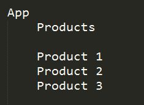

在之前的章节中，我们已经学习了在`NgModule`中定义和创建路由。我们也可以选择在单独的`app.route.ts`文件中定义所有的路由细节。

创建`app.route.ts`文件，并将以下代码片段添加到文件中：

```ts
import { productRoutes } from './products/products.routes';

export const routes: Routes = [
 {
 path: '',
 redirectTo: '/',
 pathMatch: 'full'
 },
 ...aboutRoutes,
 ...servicesRoutes,
 ...productRoutes,
 { path: '**', component: PageNotFoundComponent }
];

export const routing: ModuleWithProviders = RouterModule.forRoot(routes);

```

我们将我们的组件导入到`app.routes.ts`文件中，然后使用`productRoutes`定义路由。

现在，我们要创建我们的`product.routes.ts`文件，其中包含我们产品的路径定义。以下是这样做的代码：

```ts
import { Routes } from '@angular/router';
import { ProductsComponent } from './products.component';
import { ProductsDetailsComponent } from './products-details.component';

export const productRoutes: Routes = [
 { path: 'products', component: ProductsComponent },
 { path: 'products/:id', component: ProductsDetailsComponent } 
];

```

让我们详细分析前述代码：

1.  我们在`products.routes.ts`文件中定义了两个路径。

1.  路径`products`将指向`ProductsComponent`。

1.  路径`products/:id`将被映射到`ProductsDetailsComponent`，对应的路径为`products/10`。

现在，是时候创建我们的组件--`ProductsComponent`和`ProductsDetailsComponent`。

让我们在`products.components.ts`文件中定义`ProductsComponent`类，并添加以下代码：

```ts
import { Component } from '@angular/core';
import { Routes, Router } from '@angular/router';

@Component({
 template: `
 <div class="container">
 <h4>Built with Angular2</h4>
 <p> select country specific website for more details </p>
 <ul>
 <li><a routerLink="10" routerLinkActive="disabled">Product #10</a>
   </li>
 <li><a routerLink="11" routerLinkActive="disabled">Product #11</a>
   </li>
 <li><a routerLink="12" routerLinkActive="disabled">Product #12</a>
   </li>
 </ul>

<button (click)="navigateToServices()">Navigate via Javascript event</button>

<router-outlet></router-outlet>

</div>`,
 styles: ['.container {background-color: #fff;}']
})
export class ProductsComponent {

   constructor(private router: Router) {}

   navigateToServices(){
     this.router.navigate(['/services']);
   }
}

```

让我们详细分析前述代码：

+   我们已经使用`routerLink`指令创建了三个产品链接；点击这些链接将使我们映射到我们在`products.route.ts`文件中创建的路径。

+   我们创建了一个按钮，它具有`navigateToServices`事件，在`ProductsComponent`类中，我们实现了导航到服务页面的方法。

+   我们已经创建了一个`routerLink`来处理每个产品 ID，并且相应的数据将在`<router-outlet>`中加载。

现在，让我们在`products`文件夹下的`products-details.components.ts`中使用以下代码创建`ProductsDetailsComponent`：

```ts
import { Component, OnInit } from '@angular/core';
import { Observable } from 'rxjs/Observable';
import { ROUTER_DIRECTIVES, ActivatedRoute } from '@angular/router';

@Component({
 template: `
 <div class="container">
  <h4>Product Demo Information</h4>
  <p>This is a page navigation for child pages</p>
  showing product with Id: {{selectedId}}
  <p>
  <a routerLink="/products">All products</a>
  </p>
 </div>
 `,
 directives: [ROUTER_DIRECTIVES],
 styles: ['.container {background-color: #fff;}']
})

export class ProductsDetailsComponent implements OnInit {
  private selectedId: number;

  constructor(private route: ActivatedRoute) {}

  ngOnInit() {
   this.sub = this.route.params.subscribe(params => {
   let id = params['id'];
   this.selectedId = id;
   console.log(id);
  });
 }
}

```

以下是前述代码的分析：

+   当用户点击产品链接时，`id`将被映射，并显示相应的产品详情。

+   我们从`@angular/core`库中导入所需的模块`Component`和`OnInit`。

+   我们从`angular/router`库中导入所需的模块`ROUTER_DIRECTIVES`和`ActivatedRoute`

+   我们正在导出`ProductsDetailsComponent`类

+   我们在构造方法中注入了`ActivatedRoute`

+   我们正在定义`ngOnInIt`方法，该方法将在页面加载时调用

+   我们正在使用`ActivatedRoute`服务，它提供了一个`params` `Observable`，我们可以订阅以获取路由参数

+   我们使用`this.route.params.subscribe`来映射在 URL 中传递的参数

+   参数具有所选/点击产品的`id`，我们将其分配给变量`this.selectedId`

到目前为止一切都准备好了吗？太棒了。

现在是时候用新组件和它们的声明更新我们的`app.module.ts`文件了。更新后的`app.module.ts`将如下所示：

```ts
import { NgModule } from "@angular/core";
import { BrowserModule } from "@angular/platform-browser";
import { HashLocationStrategy, LocationStrategy } from "@angular/common";

import { AppComponent } from "./app.component";
import { routing } from "./app.routes";

import { ProductsComponent } from "./products/products.component";
import { ProductsDetailsComponent } from './products/products-
  details.component';

@NgModule({
  imports: [
      BrowserModule,
      routing
    ],
  declarations: [
     AppComponent,
     ProductsComponent,
     ProductsDetailsComponent
    ],
  bootstrap: [
     AppComponent
    ],
  providers: [
     {provide: LocationStrategy, useClass: HashLocationStrategy }
   ]
  })
export class AppModule { }

```

好的。现在，让我们测试一下我们迄今为止制作的应用程序。

以下图片显示了我们的应用在这个阶段应该如何运行：

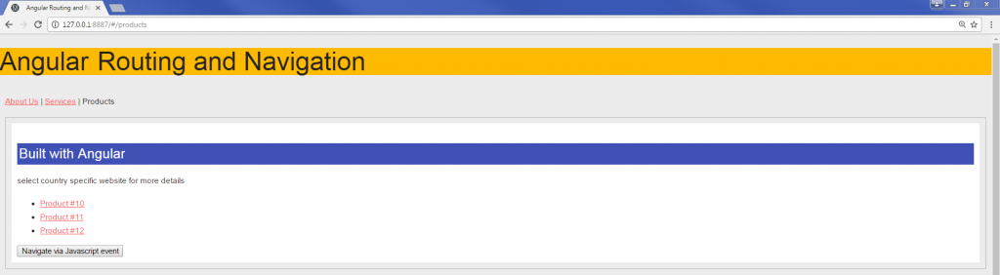

以下图片显示了当用户点击任何特定产品时，应用程序将带用户到相应的产品列表：

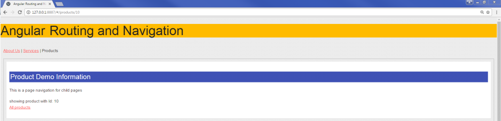

# 具有内部子路由的自定义组件路由

在上面的示例中，当用户点击产品链接时，用户将被导航到新路径。在这个示例中，您将学习如何创建自定义组件和子路由，并在同一路径内显示视图；也就是说，内部子路由。

扩展相同的示例，看一下应用程序的导航计划：

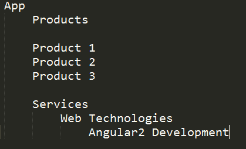

让我们从在`service.routes.ts`文件中定义路由定义开始。请参考以下代码进行路由定义：

```ts
import { Routes } from '@angular/router';

import { ServicesComponent } from './services.component';
import { ServicesChildComponent } from "./services-child.component";
import { ServicesInnerChildComponent } from "./services-inner-
    child.component";

export const servicesRoutes: Routes = [
 {
    path: 'services',
    component: ServicesComponent,
    children: [
       {
         path: '', redirectTo: 'services', pathMatch: 'full'},
         {
           path: 'web-technologies',
           component: ServicesChildComponent,
           children: [
              { path: '', redirectTo: 'web-technologies', pathMatch: 
                'full'},
              { path: 'angular2', component: 
                  ServicesInnerChildComponent}
           ]
         }
     ]
   }
];

```

在上述代码片段中，我们正在创建路径服务，并在同一路径内创建多级子路由，这些子路由都属于同一 URL 层次结构。

组件导航路由定义如下所示：

+   `/services`

+   `/services/web-technologies`

+   `/services/web-technologies/angular2`

现在，让我们为我们的服务创建三个新的组件：

+   `ServicesComponent`

+   `ServicesChildComponent`

+   `ServicesInnerChildComponent`

请注意，在父视图中添加`<router-outlet>`指令是重要的；否则，它会抛出错误。

现在我们需要创建我们的服务组件。对于`ServicesComponent`，创建一个名为`services.component.ts`的新文件，并将以下代码片段添加到其中：

```ts
import { Component } from '@angular/core';

@Component({
 template: `
 <div class="container">
 <h4>Services offered</h4>
 <ul>
 <li><a routerLink="web-technologies" routerLinkActive="active">Web 
     Technologies Services</a></li>
 <li><a routerLink="#" routerLinkActive="disabled">Mobile Apps</a></li>
 <li><a routerLink="#" routerLinkActive="disabled">CRM Apps</a></li>
 <li><a routerLink="#" routerLinkActive="disabled">Enterprise Apps</a> 
  </li>
 </ul>
 </div>
 <router-outlet></router-outlet>
 `,
 styles: ['.container {background-color:#fff;}']
})

export class ServicesComponent {
}

```

接下来是对上述代码的快速说明：

1.  我们在`ServicesComponent`模板中定义了一个无序列表`<ul>`和项目`<li>`。

1.  对于每个列表项，我们附加了`routerLink`属性来链接 URL。

1.  在模板中，我们还添加了`<router-outlet>`--这将允许子组件视图模板放置在父组件视图中。

我们已经创建好了父组件`ServicesComponent`。现在是时候创建内部组件`ServicesChildComponent`了。

让我们创建一个名为`services-child.component.ts`的新文件，并将以下代码片段添加到文件中：

```ts
import {Component} from '@angular/core';

@Component({
 template: `
 <div class="container">
 <h4>Web Technologies</h4>
 <p>This is 1st level Inner Navigation</p>
 <a routerLink="angular2" routerLinkActive="active">Angular2 Services</a>
 </div>
<router-outlet></router-outlet> 
 `,
 styles: ['.container {background-color: #fff;}']
})

export class ServicesChildComponent {}

```

接下来是对上述代码的快速说明：

1.  我们为标题和锚点标签`<a>`定义了`routerLink`和`routerLinkActive`属性。

1.  对于锚点标签，我们附加了`routerLink`和`routerLinkActive`属性。

1.  在模板中，我们还添加了`<router-outlet>`--这将允许内部子组件视图模板放置在子组件视图中。

看一下下面的层次结构图，它描述了组件结构：

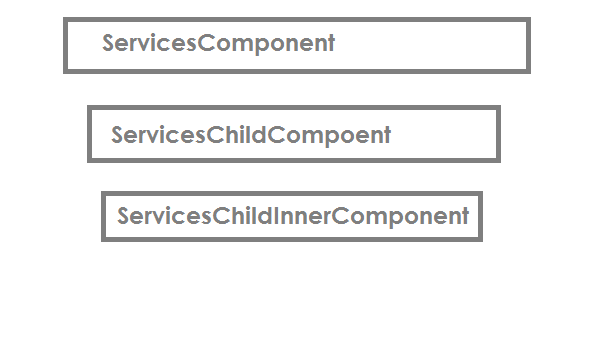

到目前为止，我们已经创建了一个父组件`ServicesComponent`，以及它的子组件`ServicesChildComponent`，它们之间有父子关系的层次结构。

是时候创建第三级组件`ServicesInnerChildComponent`了。创建一个名为`services-child.component.ts`的新文件：

```ts
import {Component} from '@angular/core';

@Component({
 template: `
 <div class="container">
 <h4>Angular Services</h4>
 <p>This is 2nd level Inner Navigation</p>
 <a routerLink="/services" routerLinkActive="active">View All 
    Services</a>
 </div>
 `,
 styles: ['.container {background-color: #fff;}']
})

export class ServicesInnerChildComponent {}

```

好了，现在我们已经定义了所有的组件和子组件以及它们各自的路由定义，是时候看看它们的运行情况了。以下截图展示了服务组件和子组件的导航路由是如何工作的。

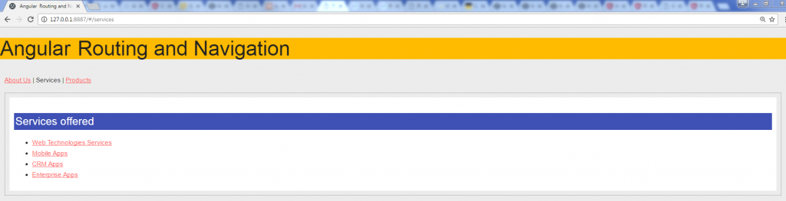

点击 Web Technologies 链接将显示用户子组件数据。

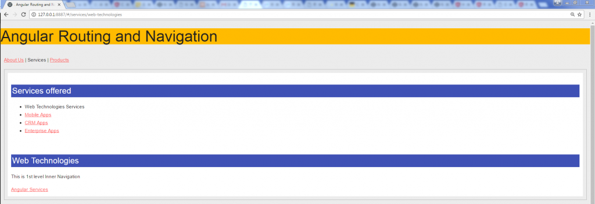

点击 Angular Services 链接将显示用户子组件数据。

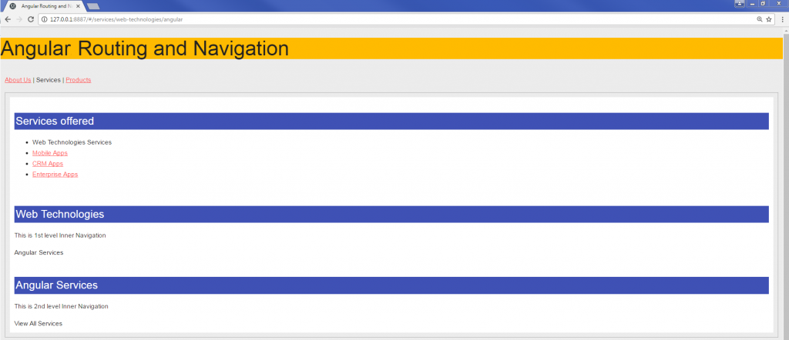

我们的组件分别很好地工作。在下一节中，我们将把它们全部集成到一个单一的工作应用程序中。

# 将所有组件集成在一起

我们已经为各个组件`About`、`Services`和`Products`定义并实现了路由。

在本节中，我们将把它们全部集成到一个单一的`NgModule`中，这样我们就可以将所有路由作为一个单页面应用程序一起工作。

让我们将`About`，`Services`和`Products`组件的所有单独路由添加到我们的`app.routes.ts`中，更新后的`app.route.ts`文件如下：

```ts
import { ModuleWithProviders } from '@angular/core';
import { Routes, RouterModule } from '@angular/router';
import { PageNotFoundComponent } from './not-found.component';

import { AboutComponent } from "./about/about.component";

import { ServicesComponent } from "./services/services.component";
import { ServicesChildComponent } from "./services/services-
  child.component";
import { ServicesInnerChildComponent } from "./services/services-inner-
  child.component";

import { ProductComponent } from "./products/products.component";
import { ProductsDetailsComponent } from './products/products-
  details.component';

import { aboutRoutes } from './about/about.routes';
import { servicesRoutes } from './services/services.routes';
import { productRoutes } from './products/products.routes';

export const routes: Routes = [
 {
   path: '',
   redirectTo: '/',
   pathMatch: 'full'
 },
 ...aboutRoutes,
 ...servicesRoutes,
 ...productRoutes,
 { 
  path: '**', component: PageNotFoundComponent }
];

export const routing: ModuleWithProviders = RouterModule.forRoot(routes);

```

我们已经更新了`app.routes.ts`文件，以包括所有组件以及子组件的路由。

现在是时候更新`NgModule`，导入所有组件以及更新的路由了。

更新后的`app.module.ts`文件如下：

```ts
import { NgModule } from "@angular/core";
import { BrowserModule } from "@angular/platform-browser";
import { HashLocationStrategy, LocationStrategy } from "@angular/common";

import { AppComponent } from "./app.component";
import { routing } from "./app.routes";
import { PageNotFoundComponent } from './not-found.component';

import { AboutComponent } from "./about/about.component";
import { ServicesComponent } from "./services/services.component";
import { ServicesChildComponent } from "./services/services-
  child.component";
import { ServicesInnerChildComponent } from "./services/services-inner-
  child.component";

import { ProductsComponent } from "./products/products.component";
import { ProductsDetailsComponent } from './products/products-
  details.component';

@NgModule({
  imports: [
   BrowserModule,
   routing
    ],
  declarations: [
   AppComponent,
   ProductsComponent,
   ServicesComponent,
   AboutComponent,
   ProductsDetailsComponent,
   PageNotFoundComponent,
   ServicesChildComponent,
   ServicesInnerChildComponent
    ],
  bootstrap: [
   AppComponent
    ],
  providers: [
   {provide: LocationStrategy, useClass: HashLocationStrategy }
   ]
})
export class AppModule { }

```

在上述代码中需要注意的重要事项是：

1.  我们导入了我们迄今为止创建的所有组件，即`About`，`Services`和`Products`。

1.  我们还在导入每个组件的`app.routes.ts`路由。

1.  我们正在注入`LocationStrategy`并明确地将其指定为`useClass HashLocationStrategy`。

我们已经了解了`router`，`routerModule`以及 Angular 提供的用于实现应用程序路由机制的实用工具。我们了解了可以使用的不同类型的`LocationStrategy`来定义 URL 应该如何显示。

我们创建了具有路由路径和子组件路由路径的组件，并且我们也学会了如何使用 JavaScript 事件进行导航。

在接下来的部分，我们将把所有的代码组合在一起，制作我们的演示应用程序。

# 演示应用程序的路由和导航

我们已经在学习 Angular 路由方面走了很长的路。我们已经看到了如何使用路由模块的各种技巧和窍门。现在是时候将我们迄今学到的所有知识整合到一个整洁、干净的应用程序中了。

以下图片显示了我们最终的应用程序文件系统结构：

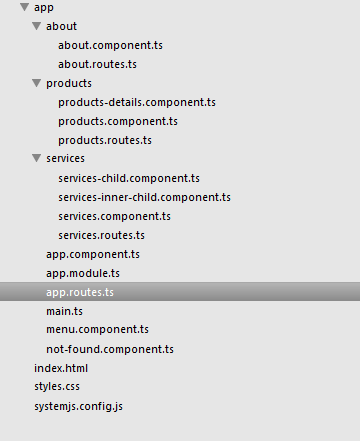

我们将在`app.component.ts`文件中添加主导航菜单和一些基本样式来为我们的应用程序增添活力：

```ts
import { Component, ViewEncapsulation } from '@angular/core';

@Component({
 selector: 'my-app',
 template: `
    <h2>Angular2 Routing and Navigation</h2>
    <div class="">
    <p>
      <a routerLink="/about" routerLinkActive="active">About Us</a>|
      <a routerLink="/services" routerLinkActive="active">Services</a>|
      <a routerLink="/products" routerLinkActive="active">Products</a>
    </p>
    <div class="app-data">
      <router-outlet></router-outlet>
    </div> 
   </div>`,
     styles: [`
       h4 { background-color:rgb(63,81,181);color:#fff; padding:3px;}
       h2 { background-color:rgb(255, 187, 0);color:#222}
       div {padding: 10px;}
       .app-data {border: 1px solid #b3b3b3;}
       .active {color:#222;text-decoration:none;}
      `
     ],
 encapsulation: ViewEncapsulation.None
})

export class AppComponent {
}

```

我们最终的`app.routes.ts`文件代码如下：

```ts
import { ModuleWithProviders } from '@angular/core';
import { Routes, RouterModule } from '@angular/router';
import { PageNotFoundComponent } from './not-found.component';

import { AboutComponent } from "./about/about.component";
import { ServicesComponent } from "./services/services.component";
import { ServicesChildComponent } from "./services/services-
   child.component";
import { ServicesInnerChildComponent } from "./services/services-inner-
   child.component";

import { ProductComponent } from "./products/products.component";
import { ProductsDetailsComponent } from './products/products-
   details.component';

import { aboutRoutes } from './about/about.routes';
import { servicesRoutes } from './services/services.routes';
import { productRoutes } from './products/products.routes';

export const routes: Routes = [
   {
     path: '',
     redirectTo: '/',
     pathMatch: 'full'
   },
   ...aboutRoutes,
   ...servicesRoutes,
   ...productRoutes,
   { path: '**', component: PageNotFoundComponent }
  ];

export const routing: ModuleWithProviders =
           RouterModule.forRoot(routes);

```

我们的`app.module.ts`文件代码如下：

```ts
import { NgModule } from "@angular/core";
import { BrowserModule } from "@angular/platform-browser";
import { HashLocationStrategy, LocationStrategy } from 
     "@angular/common";
import { AppComponent } from "./app.component";
import { routing } from "./app.routes";

import { PageNotFoundComponent } from './not-found.component';
import { AboutComponent } from "./about/about.component";

import { ServicesComponent } from "./services/services.component";
import { ServicesChildComponent } from "./services/services-
   child.component";
import { ServicesInnerChildComponent } from "./services/services-inner-
    child.component";

import { ProductsComponent } from "./products/products.component";
import { ProductsDetailsComponent } from './products/products-
    details.component';

@NgModule({
 imports: [
   BrowserModule,
   routing
   ],
 declarations: [
   AppComponent,
   ProductsComponent,
   ServicesComponent,
   AboutComponent,
   ProductsDetailsComponent,
   PageNotFoundComponent,
   ServicesChildComponent,
   ServicesInnerChildComponent
 ],
 bootstrap: [
    AppComponent
 ],
 providers: [
   { provide: LocationStrategy, useClass: HashLocationStrategy }
 ]
})
export class AppModule { }

```

我们的应用程序已经准备好进行大规模演示了。

在以下的屏幕截图中，我们展示了应用程序的行为。

当我们启动页面时，我们会看到登陆页面。登陆页面的截图如下：

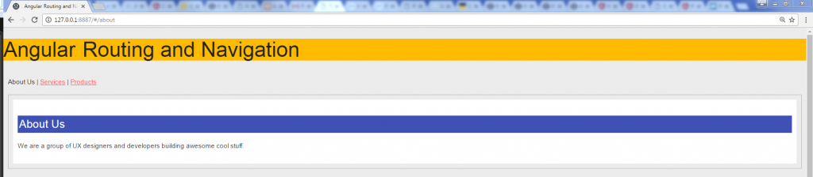登陆页面

现在让我们点击 Services 链接。`routerLink/services`将被激活，并且应该显示以下屏幕：

Services 页面。

好的，现在我们在服务页面。现在，点击子组件，Web 技术服务。应显示以下屏幕截图：

服务子页面--Web 技术。

事情在这里发展得非常顺利。

我们现在已经在子组件--Web 技术服务中，现在我们再点击一级。让我们点击 Angular2 服务。应显示以下屏幕截图：

Web 技术内部子路由--Angular2。

好的，现在点击“产品”链接。应显示以下屏幕截图：

产品页面。

好的，现在我们在产品页面。现在，点击“所有产品”链接，导航到服务页面。

但是，导航是使用 JavaScript 事件而不是`routerLink`发生的。

产品详情页面。

# 总结

Angular 路由是任何 Web 应用程序的核心功能之一。在本章中，我们详细讨论、设计和实现了我们的 Angular 路由。我们还讨论了如何实现和启用`RouterModule.forRoot`。此外，我们定义了 Router Outlet 和`routerLink`指令来绑定路由路径，并启用了`RouterLinkActivated`来查找当前活动状态。

我们重点关注路由状态的工作原理，并了解并实现了路由生命周期钩子。我们概述了如何创建自定义组件路由和子路由，以及如何为我们的 Web 应用程序实现位置策略。最后，我们创建了一个实现路由和导航的示例应用程序。

在下一章中，您将学习如何创建指令并实现变更检测。您还将了解 Angular 提供的不同类型的指令，并创建自定义用户定义的指令。

您将深入学习 Angular 如何处理变更检测以及如何在我们的应用程序中利用变更检测。
