# 第六章：创建指令和实现变更检测

在本章中，我们将学习和理解关于 Angular 指令和变更检测的所有内容。

我们将学习 Angular 提供的不同类型的指令，并创建一些自定义用户定义的指令。我们将深入学习 Angular 如何处理变更检测以及如何在我们的应用程序中利用变更检测。

在本章结束时，您将能够做到以下几点：

+   理解 Angular 指令

+   理解并实现内置组件指令

+   理解并实现内置结构指令

+   理解并实现内置属性指令

+   创建自定义属性指令

+   理解 Angular 中的变更检测工作原理

# Angular 指令

指令允许我们扩展元素的行为。我们可以使用不同类型的指令定义来操纵 HTML 页面的**文档对象模型**（**DOM**）。

Angular 使用`@Directive`元数据来告诉应用程序它们具有的指令类型以及每个指令定义的功能能力。

以下图表显示了不同类型的指令：

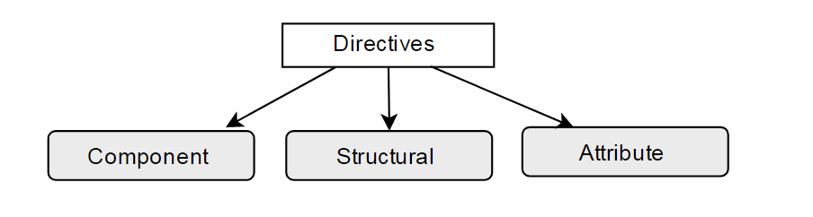

主要有三种类型的 Angular 指令：

+   **组件指令**：我们可以将其定义为用户定义的指令，类似于 Angular 1.x 中的自定义指令

+   **结构指令**：在运行时改变或转换 DOM 元素（一个或多个）的指令

+   **属性指令**：扩展元素的行为或外观

在 Angular 1.x 中，我们有 A（属性）、E（元素）、C（类）、M（匹配注释）指令。

Angular 带有许多内置指令，我们将在前面提到的类别中对其进行分类。

Angular 使用使用`ng`的指令，因此避免在自定义指令中使用`ng`；这可能会导致未知问题。例如，`ng-changeColor`是一个不好的样式实例。

# 组件指令

组件指令是用户定义的指令，用于扩展功能并创建小型可重用功能。

将组件指令视为附加了模板的指令，因为组件指令具有自己的视图或模板定义。

在之前的章节中，我们创建了许多组件。如果您已经掌握了创建组件并在布局中使用它们的艺术，您将已经知道如何创建组件指令。

关于 Angular 组件的快速回顾：组件是可以在整个应用程序中重复使用的小型代码片段。

在以下代码片段中，我们将看到组件的基本语法。创建一个名为`my-template.component.ts`的文件：

```ts
import {Component} from "@angular/core";

@Component({
 selector: 'my-app',
 template: `<h2>{{ title }}</h2>`
})

export class MyTemplateComponent {
 title = 'Learning Angular!!!'
}

```

导入新创建的组件：

```ts
import  {MyTemplate}  from  "./my-app.component"  

```

然后，在我们的`index.html`文件中调用组件指令*：*

```ts
  <my-app>Loading...</my-app>

```

以下是您将看到的最简单和最简单的组件示例；就是这么简单：

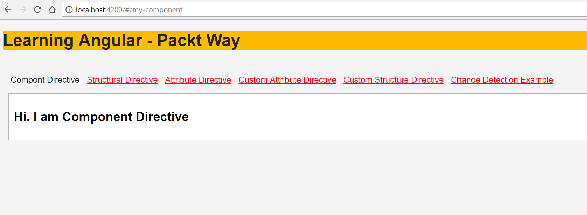

因此，到目前为止我们创建的所有组件都是组件指令。如果您想深入学习更多并创建组件，请参考第四章，使用组件。

# 结构指令

顾名思义，结构指令通过在运行时添加、附加或删除 DOM 元素来改变 DOM 结构。

Angular 结构指令在指令名称之前显示为（*）星号符号。

一些常用的结构指令如下：

+   `ngFor`：重复器指令通常用于循环并显示元素列表。

+   `ngIf`：根据表达式评估的结果显示或隐藏 DOM 元素；结果要么是 true，要么是 false。

+   `ngSwitch`：如果匹配表达式的值与开关表达式的值匹配，则返回。返回的结果可以是任何值；匹配值进行条件检查。

每个元素只允许一个结构指令。

让我们详细了解每个结构指令，并使用它们创建一些示例：

# ngFor 指令

`ngFor`指令将帮助我们迭代项目并在运行时将它们附加到列表中。

我们需要在`StructureDirectiveComponent`类中声明一个数组，然后使用`ngFor`来循环这些值并在模板中显示它们。

列表`<li>`元素会在运行时附加到`<ul>`元素上。

以下是`ngFor`指令用法的组件片段：

```ts
import {Component} from '@angular/core';

@Component({
   selector: 'my-app',
   template: `

   <h4>{{title}}</h4>

   <strong>Using ngFor directive</strong>
   <ul>
<li *ngFor="let language of languages">{{ language.name }}</li>
</ul>
   `
 })
export class StructureDirectiveComponent {
  title = 'Structural Directives';

 public languages = [
  { name: "PHP"},
  { name: "JavaScript"},
  { name: "Ruby"},
  { name: "Java"},
  { name: "HTML5"}
];

}

```

上述组件的输出如下所示：

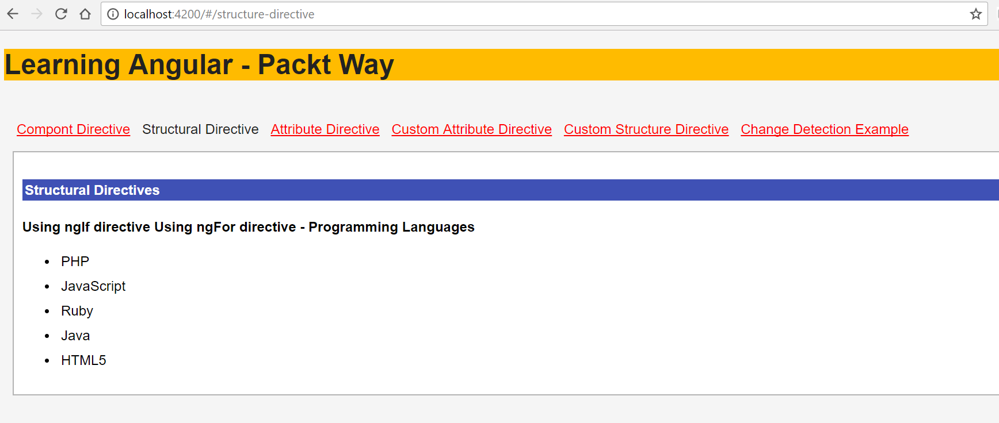

# ngIf 指令

`ngIf`指令帮助我们根据条件评估表达式，非常类似于任何编程语言中的`if`语句。

通用语法如下代码片段所示：

```ts
 <div *ngIf="!isLoggedIn">
   <p>Hello Guest user</p>
 </div>

```

前面的代码片段有一个`*ngIf`条件；如果`isLoggedIn`为`true`，指令将渲染内部的语句；否则，它将跳过并继续。

让我们创建一个示例，同时使用`*ngFor`和`*ngIf`语句，如下所示：

```ts
import {Component} from '@angular/core';

@Component({
  selector: 'my-app',
  template: `
    <h4>{{title}}</h4>
    <strong>Using ngIf directive</strong>
    <div *ngIf="isLoggedIn">
      <p>Hello Packt Author</p>
    </div>

   <div *ngIf="!isLoggedIn">
      <p>Hello Guest user</p>
   </div>

  <strong>Using ngFor directive - Programming Languages </strong>

  <ul>
    <li *ngFor="let language of languages">{{ language.name }}</li>
  </ul>
`
})

export class StructureDirectiveComponent {
 title = 'Structural Directives';
 isLoggedIn= true;

 public languages = [
  { name: "PHP"},
  { name: "JavaScript"},
  { name: "Ruby"},
  { name: "Java"},
  { name: "HTML5"}
];

}

```

让我们详细分析前面的代码片段：

1.  我们在`view`模板中使用了`*ngFor`和`*ngIf`。

1.  在组件类中，我们使用布尔值定义了一个`isLoggedIn`变量。

1.  我们创建了一个团队名称列表的数组，我们将迭代并在视图中显示。

运行应用程序，我们应该看到如下截图所示的输出：

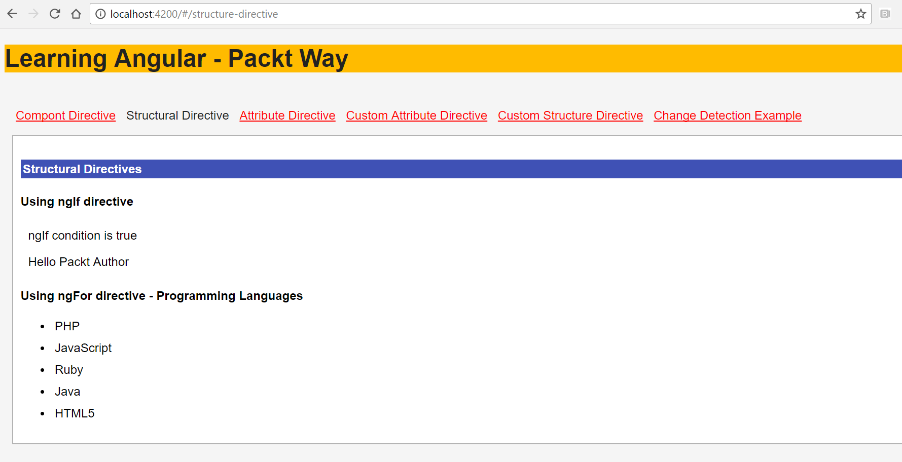

# ngSwitch 指令

当我们需要根据多个值来评估表达式时，我们使用`ngSwitch`。`ngSwitch`的示例如下代码片段所示：

```ts
<div [ngSwitch]="taxRate">
  <p *ngSwitchCase="'state'">State Tax</p>
  <p *ngSwitchCase="'fedral'">Fedral Tax</p>
  <p *ngSwitchCase="'medical'">Medical Tax</p>
  <p *ngSwitchDefault>Default</p>
</div>

```

根据`taxRate`的值，我们的应用程序将决定显示哪个元素。让我们更新我们的示例并添加一个`*ngSwitch`语句。

更新后的示例代码如下所示：

```ts
import {Component} from "@angular/core";
@Component({
    selector: 'structure-directive',
    templateUrl: 'structure-directive.component.html'
})

export class StructureDirectiveComponent {
 title = 'Structural Directives';

 username = "Sridhar Rao";
 taxRate = "state";
 isLoggedIn= true;

 public languages = [
  { name: "PHP"},
  { name: "JavaScript"},
  { name: "Ruby"},
  { name: "Java"},
  { name: "HTML5"}
 ];
}

```

前面代码示例的输出如下：

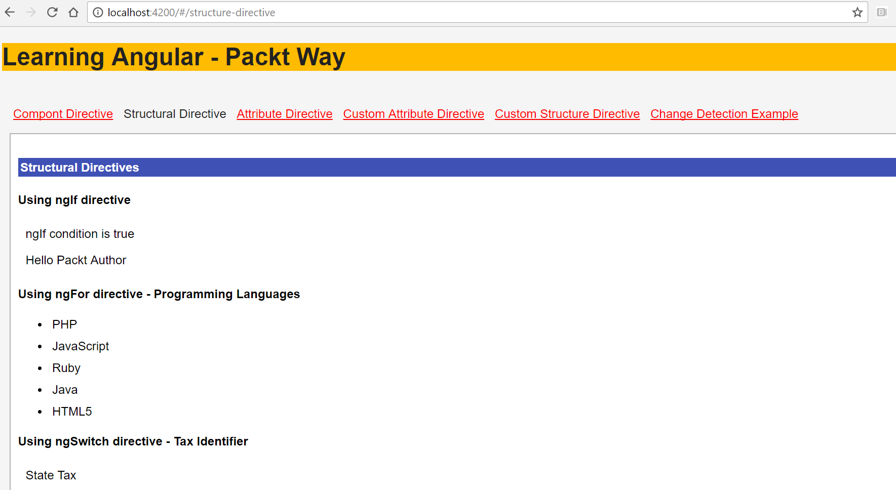

# 属性指令

属性指令扩展了给定元素的行为或外观。属性指令与 HTML 属性非常相似，与元素一起定义。

属性指令可以分为两种类型：

+   内置属性指令

+   自定义或用户定义的属性指令

现在让我们在以下章节中详细查看它们。

# 内置属性指令

如前所述，属性是页面中元素的属性。HTML 元素的属性示例包括 class、style 等。

同样，Angular 提供了几个内置的属性指令。这些指令包括`ngModel`、`ngClass`、`ngStyle`等等。

让我们通过创建一些示例来了解每个属性指令，如下所示：

+   `ngModel`：使用`ngModel`，我们可以实现双向数据绑定。要了解更多关于数据绑定和模板语法的内容，请参考第八章，*模板和数据绑定语法*。

`ngModel`指令写在带有事件绑定`[()]`的括号内。

记得从 Angular 表单中导入表单模块，否则你会收到错误消息。

`ngModel`属性指令的一个示例如下：

```ts
<input [(ngModel)]="username">
<p>Hello {{username}}!</p>

```

+   `ngClass`：当我们想要向 DOM 元素添加或移除任何 CSS 类时，最好使用`ngClass`属性指令。我们可以以不同的方式为`ngClass`分配类名。

我们可以使用`string`、`object`或组件`method`来分配类名

`ngClass`属性指令的一个示例如下：

```ts
//passing string to assign class name
<p [ngClass]="'warning'" >Sample warning message</p>
 //passing array to assign class name
<p [ngClass]="['error', 'success']" > Message </p>

//Passing object to assign class name
<p [ngClass]="{'error': true, 'success': false }"> Message</p>

//Passing component method to assign class name
<p [ngClass]="getClassName('error')"> </p> 

```

记得将 CSS 类名用单引号括起来；否则，你将看不到样式。

记得在`index.html`或你的相应组件中包含样式表。

+   `ngStyle`：当我们想要操纵任何 DOM 元素的一些样式属性时，我们可以使用`ngStyle`。你可以将其与 CSS 世界中的内联样式相关联。

`ngStyle`属性指令的一个示例如下：

```ts
<p [ngStyle]="{ 'font-size': '13px', 'background-color':'#c5e1a5'}" >Sample success message</p>

```

好了，现在我们已经了解了内置属性指令，让我们在一个示例中将它们全部放在一起。

以下是一个使用`ngModel`、`ngClass`和`ngStyle`的代码示例：

```ts
import { Component} from '@angular/core';

@Component({
 selector: 'my-app',
 styleUrls: ['./attribute-directive.component.css'],
 template:`
 <h4>Welcome to Built-In {{title}}</h4>

 <strong>using ngModel</strong>
 <div><label for="username">Enter username</label>
 <input type="text" [(ngModel)]="username" placeholder="enter username" 
    id="username">
 <p>username is: {{username}}</p>
 </div>

<strong>Notification example using ngStyle</strong>
 <p [ngStyle]="{ 'font-size': '13px', 'background-color':'#c5e1a5'}" 
>Sample success message</p>

<strong>Notification example using ngClass</strong>
    <p [ngClass]="'warning'" >Sample warning message</p>
    <p [ngClass]="'error'" >Sample error message</p>
   `
})
export class AttributeDirectiveComponent {
 title = 'Attribute Directive';
 public username="Packt Author";
}

```

查看以下屏幕截图，显示了前面代码示例的输出：

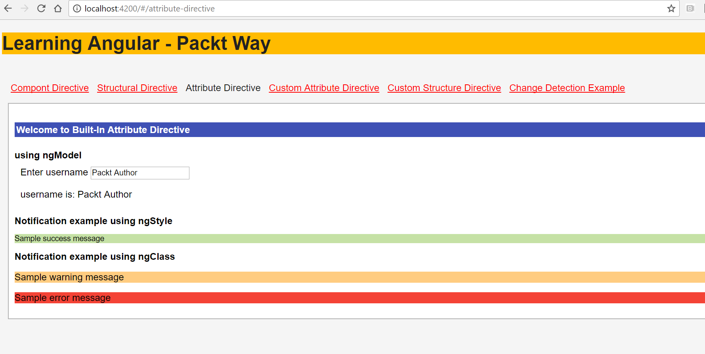

# 创建自定义指令-结构和属性指令

到目前为止，在之前的章节中，我们已经学习并实现了 Angular 提供的内置指令。

通过创建自定义用户定义的指令，Angular 允许我们定义和扩展页面中元素的行为和功能。

要创建自定义指令，我们必须使用`@Directive`装饰器并在类定义中实现逻辑。

我们可以创建自定义组件、结构和属性指令。

任何用户定义的 HTML 标记都是组件属性（例如，`<my-app>`）。在本书的每一章中，我们一直在创建自定义组件。

# Angular CLI-生成指令

我们将使用 Angular CLI 工具为我们的示例生成指令。

导航到项目目录并运行以下`ng`命令：

```ts
ng generate directive highlightDirective

```

我们应该看到以下屏幕截图中显示的输出：

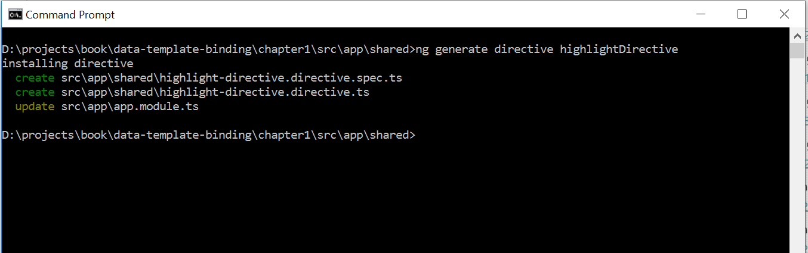

正如你在前面的屏幕截图中看到的，新生成的指令`highlightDirective`已经创建，并且`app.module.ts`文件已经更新。

在继续实现我们的指令之前，让我们快速回顾一下结构和属性指令：

+   结构指令：顾名思义，结构属性影响 HTML 布局的结构，因为它塑造或重塑了 DOM 结构。它可以影响页面中的一个或多个元素。

+   属性指令：定义并扩展页面中元素的外观或行为。

我们学会了使用 Angular CLI 生成自定义指令，现在我们清楚地知道结构指令和属性指令是如何工作的。

现在是时候创建我们自己的自定义指令了。继续阅读。

# 创建自定义属性指令

我们将从创建自定义属性指令开始。我们将继续使用前一节中创建的示例`highlightDirective`。

顾名思义，我们将使用这个指令来突出显示附加到这个属性的元素的更改文本颜色。

现在是时候定义我们的指令`highlightDirective`的功能和行为了。

在`highlight-directive.ts`文件中，添加以下代码行：

```ts
import { Directive, ElementRef } from '@angular/core';

@Directive({
 selector: '[appHighlightDirective]'
})
export class HighlightDirectiveDirective{

 constructor(private elRef: ElementRef) { 
  this.elRef.nativeElement.style.color = 'orange';
 }
} 

```

让我们详细分析前面的代码片段：

1.  我们需要导入 Angular 提供的必要工具来处理指令。

1.  我们将从`@angular/core`中导入`Directive`，`ElementRef`和`AfterViewInit`。

1.  如前所述，我们使用`@Directive`装饰器定义指令，并在元数据选择器中传递名称`appHighlightDirective`。

1.  我们正在导出`appHighlightDirective`类。

1.  如前所述，属性指令特定于一个元素，因此我们需要创建`ElementRef`变量`elRef`的实例，我们将使用它来定位和更新附加到我们自定义指令的元素。

1.  在`constructor`中，我们使用`nativeElement`方法来定位特定的元素，并使用一个值`orange`更新`style`属性`color`。

现在我们已经创建了我们的指令，我们需要将其应用到应用程序组件模板`app.component.html`文件中的元素上：

```ts
<div appHighlightDirective> Custom Directive </div>

```

现在运行应用程序，我们应该看到如下截图所示的输出：

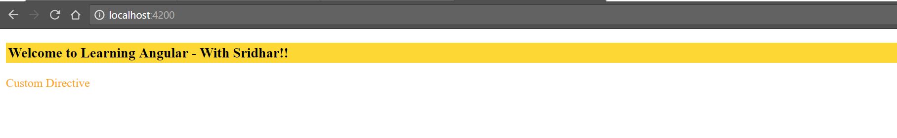

看看创建自定义属性指令是多么简单和容易。

如果你仔细观察，它是一个非常基本的属性，可以改变文本的颜色。现在，如果我们想要动态地传递颜色的值而不是静态地传递呢？

我们必须使我们的属性能够传递值。让我们看看我们需要对我们的指令进行哪些更改，使其成为更合适的候选者。

让我们首先在我们的组件`app.component.html`模板中进行编辑，我们想要使用该属性的地方：

```ts
<div appHighlightDirective highlightColor="green">Custom 
    Directive</div>

```

您会看到，我们现在通过`highlightColor`变量为我们的属性`appHighlightDirective`传递了一个值`green`。

现在更新我们的`highlight-directive.ts`文件，并向其中添加以下代码行：

```ts
import { Directive, ElementRef, Input, AfterViewInit } from '@angular/core';

@Directive({
 selector: '[appHighlightDirective]'
})
export class HighlightDirectiveDirective{

 @Input() highlightColor : string;

 constructor(private elRef: ElementRef) { 
   this.elRef.nativeElement.style.color = 'orange';
 }

 ngAfterViewInit(): void {
   this.elRef.nativeElement.style.color = this.highlightColor;
 }
}

```

让我们看看我们在`highlight-directive.ts`文件中所做的更改：

1.  此外，我们还从`@angular/core`库中导入了`Input`和`AfterViewInit`模块。

1.  我们使用`@Input`装饰器告诉 Angular 我们希望通过定义为`highlightColor`的变量动态传递值。

1.  在`ngAfterViewInit`方法中，我们使用`ElementRef`实例`elRef`创建了元素的对象实例，并使用`nativeElement`方法来更新元素的`style`属性`color`。

1.  文本的`color`将更改为通过元素的`appHighlightDirective`属性的值传递的`highlightColor`。

运行应用程序，我们应该看到以下截图中显示的输出：

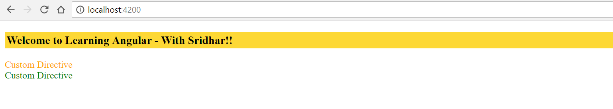

好吧，到目前为止还不错。我们的属性正在变得非常完善。

让我们看看您在实现我们的自定义指令方面取得的进展：

+   我们创建了一个自定义属性指令`highlightDirective`。

+   我们学会了使用`highlightColor`变量将值传递给自定义属性指令

这是很好的东西。但是，如果我们想要将`Javascript`事件（如`mouseover`，`mouseout`，`click`等）绑定到我们的属性呢？

让我们进行必要的更改，以实现与我们的属性附加的事件。为此，我们将需要一张漂亮的图片，并将附加一些事件以及自定义属性指令。

让我们在组件`app.component.html`文件模板中添加一张图片：

```ts


```

关于前面代码片段的重要说明：

1.  我们已将我们的自定义属性组件`appHighlightDirective`添加到元素中。

1.  此外，我们添加了两个属性，`showOpacity`和`hideOpacity`，它们将具有元素的不透明度样式属性。

1.  我们将为这些属性附加`onmouseover`和`onmouseout`事件，并动态更改图像的不透明度。

现在我们已经将图像添加到组件视图模板中，更新后的输出如下截图所示：

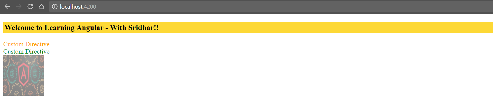

让我们转到自定义指令`highlight-directive.directive.ts`文件：

```ts
import { Directive, ElementRef, Input, HostListener, AfterViewInit } 
  from '@angular/core';

@Directive({
 selector: '[appHighlightDirective]'
})
export class HighlightDirectiveDirective{
 @Input() highlightColor : string;
 @Input() showOpacity : string;
 @Input() hideOpacity : string;

 constructor(private elRef: ElementRef) { 
   this.elRef.nativeElement.style.color = 'orange';
 }
 ngAfterViewInit(): void {
   this.elRef.nativeElement.style.color = this.highlightColor;
 }

@HostListener('mouseover') onmouseover() {
  this.elRef.nativeElement.style.opacity = this.hideOpacity;
 }

@HostListener('mouseout') onmouseout() {
  this.elRef.nativeElement.style.opacity = this.showOpacity;
 }
}

```

让我们分析我们在前面的代码中所做的更新：

1.  我们从`@angular/core`中导入了所需的模块`Directive`、`ElementRef`、`Input`、`HostListener`和`AfterViewInit`。

1.  请注意，为了将事件绑定和实现到元素上，我们特别需要导入`HostListener`。

1.  使用`@HostListener`装饰器，我们将`mouseover`和`mouseout`事件绑定到我们附加自定义属性的元素上。

1.  请注意，当我们使用`this.elRef.nativeElement`时，我们是在引用附加了自定义属性的元素。

1.  当用户将鼠标悬停在元素上时，我们为`this.hideOpacity`变量赋值。

1.  当用户将鼠标移出元素时，我们为`this.showOpacity`变量赋值。

现在运行应用程序，您应该看到以下截图中显示的输出：

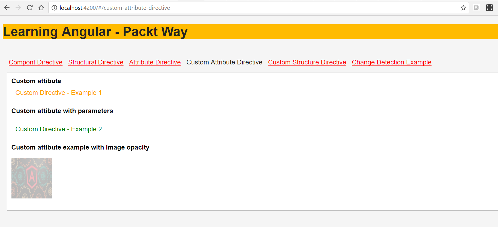

太棒了。现在让我们看看您在实现我们的自定义指令方面取得的进展：

+   我们已经创建了一个自定义属性指令`highlightDirective`

+   我们学会了使用`highlightColor`变量向自定义属性指令传递值

+   我们已经学会了将诸如`mouseover`和`mouseout`这样的事件附加到我们的自定义属性`highlightDirective`上。

在本节中，您已经学会了创建和使用具有属性和方法的自定义属性指令。

在下一节中，您将学习创建自定义结构型指令。

# 创建自定义结构型指令

到目前为止，您已经学习并实现了内置指令--组件、结构型和属性指令。

我们还学会了在*Angular CLI - 生成指令*部分使用 Angular CLI 生成自定义指令。

在上一节中，我们学习并实现了自定义属性指令。在本节中，我们将学习创建结构型指令。

让我们使用 Angular CLI 创建一个新的指令：

```ts
ng generate directive custom-structural

```

您应该看到前面命令的输出，如下截图所示：

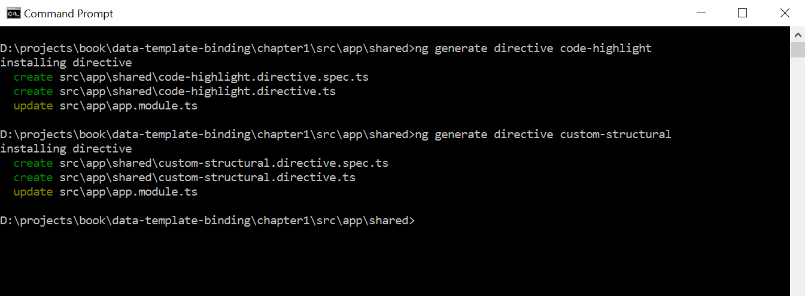

运行前面的`ng`命令，我们应该看到指令已创建，并且`app.module.ts`已更新为新创建的指令。

好了，是时候创建和实现我们的自定义结构型指令了。以下是我们将使用自定义结构型指令构建的用例：

1.  我们将使用我们的结构指令来循环遍历产品列表。

1.  该指令应该只显示`isAvailable`设置为`true`的元素。

首先让我们在`app.component.ts`文件中定义我们的产品 JSON：

```ts
public products = [{
 productName: 'Shoes',
 isAvailable : true
 },
 {
 productName: 'Belts',
 isAvailable : true
 },
 {
 productName: 'Watches',
 isAvailable : false
 }]

```

我们刚刚创建了一个产品的 JSON 列表，其中包含`productName`和`isAvailable`两个键。

还没有超级英雄般的事情，还不是时候！

是时候使用`*ngFor`循环并在`app.component.html`文件中显示产品列表了：

```ts
<ul *ngFor="let product of products">
  <li *appCustomStructural="product">{{product.productName}}</li>
</ul>

```

让我们快速分析前面的代码

1.  我们正在使用内置的结构指令`*ngFor`来循环遍历产品列表，并使用键`product.productName`显示名称。

1.  我们正在定义我们自定义的结构指令`appCustomStructural`，并传递`product`对象进行分析。

1.  由于我们将整个产品对象传递给我们的属性，我们现在可以在`appCustomStructural`中定义我们的自定义逻辑，并根据我们的应用程序需求进行转换。

在我们的指令`custom-structural.directive.ts`文件中进行一些超级英雄般的工作：

```ts
import { Directive, Input, TemplateRef, ViewContainerRef, AfterViewInit 
    } from '@angular/core';

@Directive({
 selector: '[appCustomStructural]'
})
export class CustomStructuralDirective {
 @Input()
 set appCustomStructural(product){
  if(product.isAvailable == true)
  {
    this.viewContainerRef.createEmbeddedView(this.templateRef );
  }
 }

 constructor(
   private templateRef : TemplateRef<any>,
   private viewContainerRef : ViewContainerRef
 ) { }
}

```

让我们详细分析前面的代码：

1.  我们从`@angular/core`中导入所需的模块`Directive`、`Input`、`TemplateRef`、`ViewContainerRef`和`AfterViewInit`。

1.  我们正在为我们的自定义结构指令`appCustomStructural`定义 CSS `selector`。

1.  通过使用`@Input`装饰器，我们明确告诉 Angular 我们的自定义指令将通过`appCustomStructural`获得输入。

1.  在构造函数中，我们注入了`TemplateRef<any>`和`ViewContainerRef`的实例。

1.  使用`TemplateRef<any>`，我们指定这是一个嵌入式模板，可以用于实例化嵌入式视图。

1.  由于结构指令涉及在页面中塑造或重塑 DOM 结构，我们正在注入`ViewContainerRef`。

1.  我们正在检查`product.isAvailable`的值是否等于`true`。

1.  如果`product.isAvailable`的值为 true，则使用`ViewContainerRef`的实例--一个可以附加一个或多个视图的容器，通过使用`createEmbeddedView`方法--我们将元素附加到视图中。

运行应用程序，我们应该看到如下截图所示的输出：

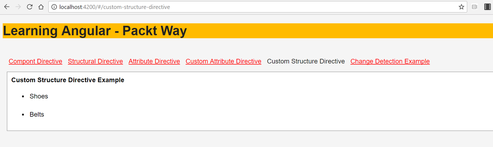

我们只看到鞋子和腰带被显示，因为只有这些产品的`isAvailable`键设置为 true。尝试改变其他产品的值并查看输出显示。

在本节中，我们学习了自定义结构指令。我们学习了 Angular 提供的重要工具--`createEmbeddedView`、`ViewContainerRef` 和 `TemplateRef`。

迄今为止，我们已经学习和实现了自定义指令的一些要点。

我们创建了一个自定义属性指令 `highlightDirective`。我们学会了使用 `highlightColor` 变量向自定义属性指令传递值。我们学会了将事件（如 `mouseover` 和 `mouseout`）附加到我们的自定义属性 `highlightDirective`。

我们已经学会了创建一个自定义结构指令 `appCustomStructural`。我们已经学会了使用 `createEmbeddedView`、`ViewContainerRef` 和 `TemplateRef`。

在下一节中，我们将学习变化检测，这是 Angular 框架内部工作的一个重要方面，我们还将学习如何在我们的应用程序中使用它。

# 在 Angular 中实现变化检测

变化检测是检测模型或组件类中的任何内部状态变化，然后将其反映到视图中的过程，主要是通过操作 DOM。

变化检测是从 Angular 1.x 到 2.x 中最重要的变化之一。

应用程序状态的变化发生在模型到视图或视图到模型之间。为了更好地理解，看一下下面的图表：

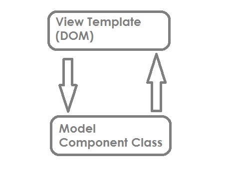

应用程序状态的变化可以以两种方式发生：

+   从模型到视图模板（DOM）

+   从视图（DOM）到模型（组件类）

既然我们知道状态变化发生在模型或 DOM 中，让我们分析一下是什么触发了变化检测。

变化检测是由以下触发的：

+   JavaScript 事件（`click`、`mouseover`、`keyup` 等）

+   `setTimeout()` 和 `setInterval()`

+   异步请求

请注意，前面列出的三种方式都是异步过程。因此可以说，在 Angular 中，每当我们有异步方法/请求时，变化检测就会发生。

在我们深入了解变化检测的更多内容之前--它是如何工作的，如何处理的等等--让我们快速创建一个示例来理解是什么触发了变化检测。

看一下下面的代码片段：

```ts
import { Component} from '@angular/core';
@Component({
  selector: 'my-app',
  template:`
  <h4>Learning Angular {{title}}</h4>

  <button (click)="toggleUser()"> Toggle User </button>
  <div *ngIf="isLoggedIn">
    <b>Hello Packt Author</b>
  </div>

  <div *ngIf="!isLoggedIn">
    <b>Hello Guest user</b>
  </div>
 `
 ]
})
export class AppComponent {
 title = 'Change Detection';
 isLoggedIn = true;
 toggleUser(){
 if (this.isLoggedIn)
   this.isLoggedIn = false
 else
   this.isLoggedIn = true
 }
}

```

上述代码片段可以解释如下：

1.  我们创建了一个按钮，点击事件调用了 `toggleUser` 方法。

1.  在 `toggleUser` 的点击事件中，变量 `isLoggedIn` 的值被设置为 `true` 或 `false`。

1.  根据变量，在视图中`isLoggedIn`的值会更新。如果值为`true`，则显示“Hello Packt Author”，如果值为 false，则显示`Hello Guest user`。

在下一节中，我们将学习 Angular 如何在内部处理变化检测以及 Angular 提供的工具来帮助我们实现更好的变化检测。

# 变化检测 - Angular 和 ZoneJS

ZoneJS 的官方网站描述了该库如下：

Zone 是一个跨异步任务持续存在的执行上下文。

Angular 使用 ZoneJS 来检测变化，然后调用这些事件的监听方法。

Angular 利用 zone 来处理所有内部状态变化和变化检测。Zone 理解异步操作和状态变化的上下文。

Angular 内置了`ngZone`，用于跟踪所有已完成的异步操作，并通过`onTurnDone`事件通知它们。每个组件都有一个变化检测器，它在树形结构中跟踪组件上附加的所有绑定。

我们不再有像在以前版本的 Angular 中的`$scope.apply`或`$digest`。

默认情况下，Angular 变化检测总是会检查值是否发生了变化。变化检测总是从根组件顶部到树形结构中的内部组件执行相同的操作。

这是通过变化检测器对象为所有组件执行的操作。

使用`ngZones`，Angular 应用的性能大大提高了。

# 变化检测策略

默认情况下，Angular 为我们应用中的每个组件定义了一个变化检测策略--这意味着每当模板发生任何变化时，它会遍历到树形结构中的最后一个组件，检查是否有任何变化，并进行必要的更新。

这会带来性能损耗！

因此，Angular 为我们提供了明确定义我们想要为组件实现的变化检测策略的选项。

Angular 提供了一个`ChangeDetectionStrategy`模块，通过它我们可以定义我们想要使用的变化检测策略。

`ChangeDetectionStrategy`有两个不同的值：

+   `Default`

+   `OnPush`

让我们详细分析每个选项，以了解它们的工作原理。

# ChangeDetectionStrategy - 默认

这是 Angular 实现的默认机制--变化由事件触发，变化的传播从视图模板到模型。根据实现的逻辑，DOM 结构会更新。

这里需要注意的一点是，使用这种策略时，每次 Angular 都会遍历所有组件，从根组件到最后一个组件，以检查是否需要更新所有属性。

参考我们在前面部分创建的示例，*在 Angular 中实现变更检测*。我们正在更新属性，Angular 默认使用`Default`值的`ChangeDetectionStrategy`。

# ChangeDetectionStrategy - OnPush

我们使用`OnPush`来提高我们的 Angular 应用程序的性能。我们必须明确指出我们要使用`ChangeDetectionStrategy`的`OnPush`值。

更改由事件触发，更改的传播适用于在`view`模板中呈现的整个对象，而不是每个属性。

当我们使用`OnPush`值时，我们强制 Angular 仅依赖于输入。我们通过`@Input`装饰器传递对象，只有完整的对象及其属性会受到影响，而不会影响任何单个属性的更改。

# ChangeDetectionStrategy - OnPush 的优势

在前面的部分中，您已经学习了使用`default`和`OnPush`选项的 ChangeDetectionStrategy。

使用`OnPush`选项而不是`default`的一些优势包括：

1.  它有助于提高我们的 Angular 应用程序的性能。

1.  Angular 不必遍历整个组件树结构以检测属性的单个更改。

1.  当输入属性不发生变化时，Angular 内部可以跳过嵌套的树结构。

为了更好地理解它，让我们创建一个用例。首先，我们需要使用 Angular CLI `ng`命令创建一个名为`change-detect`的新组件。

组件创建后，您应该看到如下截图所示的输出：

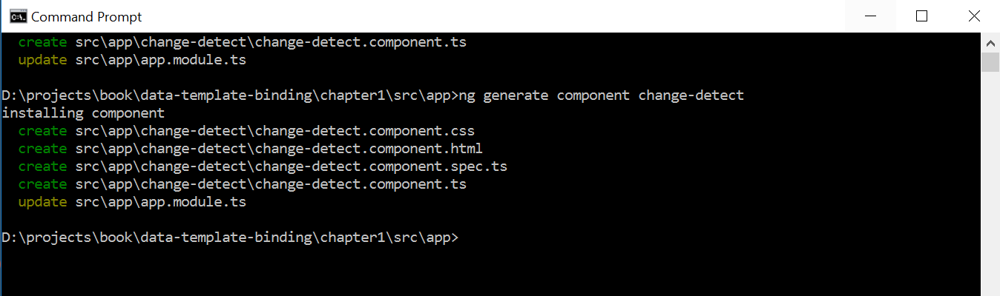

让我们在`user.ts`文件中创建一个`class`用户，并具有`userName`和`userId`属性：

```ts
export class User {
 constructor(
 public userName: string,
 public userId: number) {}
}

```

现在让我们编辑我们生成的`Component`类，并添加以下代码片段：

```ts
import { Component, Input, ChangeDetectionStrategy  } from '@angular/core';
import { User } from '../shared/user';

@Component({
 selector: 'app-change-detect',
 template: `
 <h3>{{ title }}</h3>
 <p>
 <label>User:</label>
 <span>{{user.userName}} {{user.userId}}</span>
</p>`,
 changeDetection: ChangeDetectionStrategy.OnPush,
 styleUrls: ['./change-detect.component.css']
})

export class ChangeDetectComponent{
 title = "Change Detection";
 @Input() user: User;
 constructor() { }
} 

```

让我们详细分析前面的代码：

1.  我们从`@angular/core`库中导入了`Input`、`Component`和`ChangeDetectionStrategy`所需的模块。

1.  我们将新创建的`User`类导入到组件类中。

1.  我们明确指定`changeDetection`的值为`ChangeDetectionStrategy.OnPush`。

1.  我们使用 CSS 的`selector` `app-change-detect`，在那里我们将显示组件的输出。

1.  由于我们告诉 Angular 使用`OnPush`选项，我们需要使用`@Input`并传递在我们的情况下是`User`的对象。

1.  根据模板部分，我们在`view`模板中绑定了用户属性`userName`和`userId`。

很好。到目前为止，我们已经创建了我们的组件，并明确指出，每当检测到变化时，应更新整个对象，即`user`对象，而不仅仅是单个属性。

现在是时候创建方法来测试我们的逻辑了。因此，在`AppComponent`类中，添加以下代码：

```ts
 changeDetectionDefault(): void {
   this.user.userName = 'Packt Publications';
   this.user.userId = 10;
 }

 changeDetectionOnPush(): void {
   this.user = new User('Mike', 10);
 }

```

对于我们的组件，我们已经指定了要使用的`selector`为`app-change-detect`。我们需要在模板`app.component.html`文件中使用该组件。

我们还指定了该组件将以`user`作为输入，因此我们将用户对象传递给该组件。

将以下代码行添加到`app.component.html`模板文件中的`app-change-detect`组件中。

```ts
<button type="button" (click)="changeDetectionDefault()">
  Change Detection: Default
 </button>
 <button type="button" (click)="changeDetectionOnPush()">
 Change Detection: OnPush
 </button>

<app-change-detect [user]="user"></app-change-detect>

```

好了，一切都准备就绪。运行应用程序，您应该看到如下屏幕截图中显示的输出：

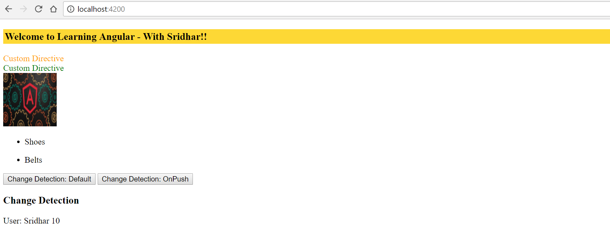

应用程序功能可以总结如下：

1.  `app-change-detect`组件加载到`AppComponent`模板中。

1.  默认值传递给对象在`view`模板中显示。

1.  单击`Change Detection: OnPush`按钮，我们会看到更新后的用户加载到视图中。

1.  当我们点击`Change Detection: Default`时，与我们之前创建的示例不同，我们不会看到任何属性发生变化。这是因为我们明确指出，任何变化检测都应通过对象而不是属性传递，使用`ChangeDetectionStrategy`的`OnPush`选项。

在本节中，我们已经了解了 Angular 提供的变化检测策略。我们已经探讨了如何通过使用`OnPush`选项来改善应用程序的性能，强制 Angular 仅检查作为输入传递的对象而不是单个属性。

更新属性将告诉 Angular 遍历整个应用程序组件树结构，并对性能造成影响。

# 摘要

在本章中，我们学习了指令，以及不同类型的指令，即组件指令、结构指令和属性指令。

我们实现了自定义用户指令，以了解如何扩展指令并更有效地使用它们。

我们简要了解了 ZoneJS，以及区域如何帮助我们处理现代应用程序框架中的“异步”任务。

最后，我们了解了 Angular 如何处理变化检测，以及如何使用变化检测方法来提高整体应用程序性能。

在下一章中，我们将学习使用 Observables 进行异步编程。在本章中，我们将学习如何利用 Observable 和 Promises 在 Angular 中利用异步编程。

此外，我们将学习如何构建一个基本但可扩展的异步 JSON API，用于查询漫威电影宇宙。
