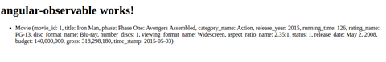
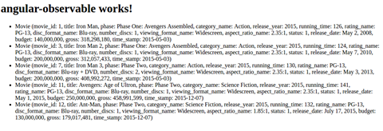

# 使用 Observable 进行异步编程

如果我们仔细想想，没有什么是瞬间的。 实时不是一个事物。 我刚才失去了理智吗？ 现在，你可以按下一个按钮，感觉像是瞬间的，但是，在你内心深处，作为程序员的你知道那不是真的。 信息已经传输，代码已被执行，数据库已被获取，等等。 在这段时间里，无论它是多短还是多长，你都在等待。 更准确地说，你的代码让用户等待。 您宁愿有一个基于异步概念构建的代码库，并且可以在等待时执行其他任务，或者至少警告用户我们正在等待某件事情发生吗？ 这就是这一章的基本思想。 这一章将帮助您理解异步编程的概念，并在 Angular 中使用 Observable 实现相同的功能。

在这一章中，我们将涵盖以下主题：

+   观察者模式

+   异步编程

+   HTTP 客户端

+   订阅可观察对象

+   承诺

# 观察者模式

Observable 模式允许一个称为**subject**的对象跟踪对其状态感兴趣的其他对象，称为**observers**。 当主题状态改变时，它会通知观察者。 其背后的机制非常简单。

# TypeScript 可观察对象

让我们看一下纯 TypeScript 中的以下`Observer`/`Subject`实现（即没有任何 Angular 或任何框架，只有 TypeScript）。

首先，我定义了一个`Observer`接口，任何具体实现都必须实现：

```ts
export interface Observer{ 

   notify(); 
} 

```

这个接口只定义了`notify()`方法。 当其状态改变时，该方法将被主题（即被`Observer`观察的`Object`）调用。

然后，我有一个名为`HumanObserver`的这个接口的实现：

```ts
export class HumanObserver implements Observer{ 

   constructor(private name:string){} 

   notify(){ 

               console.log(this.name, 'Notified'); 
   } 
} 

```

这个实现利用了`typescript`属性构造函数，其中你可以在构造函数内定义你的类的属性。 这种表示法与以下表示法完全等效，而且更短：

```ts
private name: string; 

constructor(name:string){  
      this.name = name; 
} 

```

根据`Observer`接口和`HumanObserver`的定义，我们可以继续进行主题的定义。 我定义了一个管理`observers`的`Subject`类。 这个类有三个方法：`attachObserver`，`detachObserver`和`notifyObservers`：

```ts
export class Subject{ 

   private observers:Observer[] = []; 

   /** 
   * Adding an observer to the list of observers 
   */ 
   attachObserver(observer:Observer):void{ 

               this.observers.push(observer); 
   } 

   /** 
   * Detaching an observer 
   */ 
   detachObserver(observer:Observer):void{
      let index:number = this.observers.indexOf(observer);
      if(index > -1){
          this.observers.splice(index, 1);
        }
      else{
       throw "Unknown observer";
       }
} 

   /** 
   * Notify all the observers in this.observers 
   */ 
   protected notifyObservers(){
   for (var i = 0; i < this.observers.length; ++i) {  
      this.observers[i].notify();
       } 
    } 
} 

```

`attachObserver`方法将新的观察者推送到观察者属性中，而`detachObserver`则将它们移除。

主题实现通常带有附加/分离，订阅/取消订阅或添加/删除前缀。

最后一个方法是`notifyObservers`，它遍历观察者并调用它们的`notify()`方法。 允许我们展示`Observable`机制的最后一个类是`IMDB`，它扩展了`Subject`。 当添加电影时，它将通知观察者：

```ts
export class IMDB extends Subject{ 

   private movies:string[] = []; 

   public addMovie(movie:string){ 

         this.movies.push(movie); 
         this.notifyObservers(); 
   } 
} 

```

要使各个部分相互通信，我们必须：

+   创建一个`Subject`

+   创建一个`Observer`

+   将`Observer`附加到`Subject`

+   通过`addMovie`方法改变`Subject`的状态

更具体地说，这是先前列表的一个实现：

```ts
let imdb:IMDB = new IMDB(); 
let mathieu:HumanObserver = new HumanObserver("Mathieu"); 
imbd.attachObserver(mathieu); 
imbd.addMovie("Jaws"); 

```

为了加快我们的开发流程，我们将安装`ts-node`。这个节点包将把`typescript`文件转换成 JavaScript，并解决这些文件之间的依赖关系。

要快速编译和执行`typescript`应用程序，我推荐使用优秀的`ts-node`包。这个包将转换以下命令：

```ts
$ npm install -g  typescript ts-node
$ ts-node myFile.ts

```

输出是`Mathieu Notified`。我们可以测试将`mathieu`分离并添加另一个电影：

```ts
imdb.detachObserver(mathieu); 
imdb.addMovie("Die Hard"); 

```

输出仍然是`Mathieu Notified`，这发生在我们添加了大白鲨电影之后。第二部电影的添加（也就是《虎胆龙威》）并没有触发控制台打印`Mathieu Notified`，因为它已经分离了。

# 具有参数的 TypeScript Observable

因此，这是观察者模式的一个基本实现。然而，它并不完整，因为`HumanObserver`只知道它观察的主题中出现了一些变化。因此，它必须迭代它所观察到的所有主题，并检查它们的先前状态与当前状态来识别发生了什么变化以及在哪里发生了变化。更好的做法是修改`Observer`的通知，使其包含更多的信息。例如，我们可以添加可选参数，如下：

```ts
export interface Observer{ 

   notify(value?:any, subject?:Subject); 
} 

export class HumanObserver implements Observer{ 

   constructor(private name:string){} 

   notify(value?:any, subject?:Subject){ 

         console.log(this.name, 'received', value, 'from', subject); 
   } 
} 

```

`notify（）`方法现在接受一个可选的值参数，该参数表征了`Subject`对象的新状态。我们还可以接收到`Subject`对象本身的引用。如果观察者观察了许多主题，这是很有用的。在这种情况下，我们需要能够区分它们。

因此，我们必须稍微改变`Subject`和`IMDB`，使它们使用新的`notify`：

```ts
export class Subject{ 

   private observers:Observer[] = []; 

   attachObserver(oberver:Observer):void{ 

         this.obervers.push(oberver); 
   } 

   detachObserver(observer:Observer):void{ 
         let index:number = this.obervers.indexOf(observer); 
         if(index > -1){ 
         this.observers.splice(index, 1); 

         }else{ 

         throw "Unknown observer"; 
         } 
   } 

   protected notifyObservers(value?:any){ 

         for (var i = 0; i < this.obervers.length; ++i) { 

         this.observers[i].notify(value, this); 
         } 
   } 
} 

export class IMDB extends Subject{ 

   private movies:string[] = []; 

   public addMovie(movie:string){ 

         this.movies.push(movie); 
         this.notifyObservers(movie); 
   } 
} 

```

最后，输出如下：

```ts
 Mathieu received Jaws from IMDB { 

  observers: [ HumanObserver { name: 'Mathieu' } ], 
  movies: [ 'Jaws' ] } 

```

这比`Mathieu Notified`更有表现力。

现在，当我们习惯于用于异步编程的`Observer`模式时，我们真正的意思是，我们要求某事，并且在其处理过程中我们不想等待去做任何事情。相反，我们订阅响应事件以在响应到达时得到通知。

在接下来的章节中，我们将使用相同的模式和机制在 Angular2 中。

此观察者实现的代码位于[`bit.ly/mastering-angular2-chap7-part1`](http://bit.ly/mastering-angular2-chap7-part1)。

# 观察 HTTP 响应

在本节中，我们将构建一个返回根据搜索参数返回电影的 JSON API。我们将利用观察者设计模式的力量，而不是简单地等待 HTTP 查询完成，让用户知道我们正在等待，并且如果需要的话，执行其他流程。

首先要做的是：为我们的 IMDB 类似应用程序准备一个数据源。构建和部署一个能够解释 HTTP 查询并相应地发送结果的服务器端应用程序现在相对简单。然而，这超出了本书的范围。相反，我们将获取托管在[`bit.ly/mastering-angular2-marvel`](http://bit.ly/mastering-angular2-marvel)的静态 JSON 文件。该文件包含漫威电影宇宙最新电影的一些信息。它包含一个描述十四部电影的 JSON 对象的 JSON 数组。以下是第一部电影：

```ts
{ 
     "movie_id" : 1, 
     "title" : "Iron Man", 
     "phase" : "Phase One: Avengers Assembled", 
     "category_name" : "Action", 
     "release_year" : 2015, 
     "running_time" : 126, 
     "rating_name" : "PG-13", 
     "disc_format_name" : "Blu-ray", 
     "number_discs" : 1, 
     "viewing_format_name" : "Widescreen", 
     "aspect_ratio_name" : " 2.35:1", 
     "status" : 1, 
     "release_date" : "May 2, 2008", 
     "budget" : "140,000,000", 
     "gross" : "318,298,180", 
     "time_stamp" : "2015-05-03" 
}, 

```

您可以找到类似 IMDB 的应用程序提供的经典信息，例如发行年份、播放时间等。我们的目标是设计一个异步的 JSON API，使这些字段中的每一个都可以搜索。

因为我们要获取一个静态的 JSON 文件（也就是说我们不会插入、更新或删除任何元素），可接受的 API 调用将是以下内容：

```ts
IMDBAPI.fetchOneById(1); 
IMDBAPI.fetchByFields(MovieFields.release_date, 2015); 

```

第一个调用只是获取`movie_id: 1`的电影；第二个调用是一个更通用的调用，在任何字段中都适用。为了防止 API 消费者请求我们电影中不存在的字段，我们使用在`Movie`类内部定义的枚举器限制`field`的值。

现在，这里的重要部分是这些调用的实际返回。事实上，它们将触发一个`Observable`机制，调用方将自己附加到`Observable` HTTP 调用上。然后，当 HTTP 调用完成并根据查询参数过滤结果后，被调用方将通知调用方关于响应。因此，调用方不必等待被调用方（`IMDBAPI`）；它将在请求完成时收到通知。

# 实施

让我们深入了解实现。首先，我们需要使用 Angular CLI 创建一个新的 Angular2 项目：

```ts
    ng new angular-observable
    ng init
    ng serve

```

然后，为了确保一切顺利，您可以浏览到`localhost:4200`并查看是否得到类似以下内容：


接下来，我们需要一个代表电影概念的模型。我们将使用命令行`ng g class models/Movie`生成这个类。然后，我们可以添加一个构造函数，定义`Movie`模型的所有私有字段，以及相同的 getters 和 setters：

```ts
export class Movie { 

   public constructor( 
         private _movie_id:number, 
         private _title: string, 
         private _phase: string, 
         private _category_name: string, 
         private _release_year: number, 
         private _running_time: number, 
         private _rating_name: string, 
         private _disc_format_name: string, 
         private _number_discs: number, 
         private _viewing_format_name: string, 
         private _aspect_ratio_name: string, 
         private _status: string, 
         private _release_date: string, 
         private _budget: number, 
         private _gross: number, 
         private _time_stamp:Date){ 
   } 

   public toString = () : string => { 

         return `Movie (movie_id: ${this._movie_id}, 
         title: ${this._title}, 
         phase: ${this._phase}, 
         category_name: ${this._category_name}, 
         release_year: ${this._release_year}, 
         running_time: ${this._running_time}, 
         rating_name: ${this._rating_name}, 
         disc_format_name: ${this._disc_format_name}, 
          number_discs: ${this._number_discs}, 
         viewing_format_name: ${this._viewing_format_name}, 
         aspect_ratio_name: ${this._aspect_ratio_name}, 
         status: ${this._status}, 
         release_date: ${this._release_date}, 
         budget: ${this._budget}, 
         gross: ${this._gross}, 
         time_stamp: ${this._time_stamp})`; 

   } 
   //GETTER 
   //SETTER 
} 

export enum MovieFields{ 
   movie_id, 
   title, 
   phase, 
   category_name, 
   release_year, 
   running_time, 
   rating_name, 
   disc_format_name, 
   number_discs, 
   viewing_format_name, 
   aspect_ratio_name, 
   status, 
   release_date, 
   budget, 
   gross, 
   time_stamp 
} 

```

在这里，电影 JSON 定义的每个字段都使用 `typescript` 的构造函数属性声明映射到 Movie 类的私有成员中。此外，我们重写了`toString`方法，所以它会打印出每个字段。在`toString`方法中，我们利用了反引号提供的多行字符串。

IMDBAPI.fetchOneById(1);

IMDBAPI.fetchByFields(MovieFields.release_date, 2015);

```ts

Here's `IMDBAPIService` with the `fetchOneById` method:

```

`import { Injectable } from '@angular/core';`

`import { Http }  from '@angular/http';`

`import { Movie, MovieFields } from '../models/movie';`

`import { Observable } from 'rxjs/Rx';`

`import 'rxjs/Rx';`

`@Injectable()`

导出类 IMDBAPIService {

私有 moviesUrl:string = "assets/marvel-cinematic-universe.json";

constructor(private http: Http) { }

/**

* Return an Observable to a Movie matching id

* @param  {number}            id

* @return {Observable<Movie>}

*/

public fetchOneById(id:number):Observable<Movie>{

console.log('fetchOneById', id);

        return this.http.get(this.moviesUrl)

        /**

        * Transforms the result of the http get, which is observable

        * into one observable by item.

        */

    .flatMap(res => res.json().movies)

        /**

        * Filters movies by their movie_id

        */

        .filter((movie:any)=>{

        console.log("filter", movie);

        return (movie.movie_id === id)

        })

        /**

        * Map the JSON movie item to the Movie Model

        */

        .map((movie:any) => {

        console.log("map", movie);

        return new Movie(

            movie.movie_id,

            movie.title,

            movie.phase,

            movie.category_name,

            movie.release_year,

            movie.running_time,

            movie.rating_name,

            movie.disc_format_name,

            movie.number_discs,

            movie.viewing_format_name,

            movie.aspect_ratio_name,

            movie.status,

            movie.release_date,

            movie.budget,

            movie.gross,

            movie.time_stamp

        );

        });

}

}

```ts

# Understanding the implementation

Let's break it down chunk by chunk. First, the declaration of the service is pretty standard:

```

import { Injectable } from '@angular/core';

import { Http }  from '@angular/http';

import { Movie, MovieFields } from '../models/movie';

import { Observable } from 'rxjs/Rx';

import 'rxjs/Rx';

@Injectable()

export class IMDBAPIService {

private moviesUrl:string = "app/marvel-cinematic-universe.json";

constructor(private http: Http) { }

```ts

Services are injectable. Consequently, we need to import and add the `@Injectable` annotation. We also import `Http`, `Movie`, `MovieFields`, `Observable`, and the operators of RxJS. **RxJS** stands for **Reactive Extensions for JavaScript**. It is an API to do `Observer`, iterator, and functional programming. When it comes to asynchronism in Angular2, you rely on RxJS for the most part.

One important thing to note is that we use RxJS 5.0, which is a complete rewrite, based on the same concept as RxJS 4.0.

The `IMDBAPIService` also has a reference to the path of our JSON file and a constructor to receive an injection of the `http` service. On the implementation of the `fetchOneById` method, we can see four distinct operations chained with each other: `get`, `flatMap`, `filter`, and `map`.

*   Get returns an `Observable` onto the body of the `http` request.
*   `flatMap` transforms the get `Observable` by applying a function that you specify to each item emitted by the source `Observable`, where that function returns an `Observable` that itself emits items. `flatMap` then merges the emissions of these resulting observables, emitting these merged results as its sequence. In our case, it means that we will apply the next two operations (that is `filter` and `map`) on all the items received from the `http` get.
*   `filter` checks if the ID of the current movie is the one we are looking for
*   `map` transforms the JSON representation of a movie into the `typescript` representation of a movie (that is the `Movie` class).

This last operation, while counter-intuitive, is mandatory. Indeed, one could think that the JSON representation and the `typescript` representation are identical, as they own the same fields. However, the `typescript` representation, also to its properties, defines functions such as `toString`, the getters, and the setters. Removing the map would return an `Object` instance--containing all the fields of a `Movie` without being one. Also, a typecast will not help you there. Indeed, the `typescript` transpiler will allow you to cast an `Object` into a `Movie`, but it still won't have the methods defined in the `Movie` class, as the concept of static typing disappears when the `typescript` is transpiled in JavaScript. The following would transpile fail at execution time with; `movie.movie_id(25)` TypeError: `movie.movie_id` is not a function at `Object.<anonymous>`.

```

movie:Movie = JSON.parse(`{

            "movie_id" : 1,

            "title" : "Iron Man",

            "phase" : "Phase One: Avengers Assembled",

            "category_name" : "Action",

            "release_year" : 2015,

            "running_time" : 126,

            "rating_name" : "PG-13",

            "disc_format_name" : "Blu-ray",

            "number_discs" : 1,

            "viewing_format_name" : "Widescreen",

            "aspect_ratio_name" : " 2.35:1",

            "status" : 1,

            "release_date" : "May 2, 2008",

            "budget" : "140,000,000",

            "gross" : "318,298,180",

            "time_stamp" : "2015-05-03"

        }`);

Console.log(movie.movie_id(25));

```ts

Now, if we want to use our `IMDB` service, further modifications are required in the code that was generated by the Angular CLI. First, we need to modify `app.module.ts` so it looks like this:

```

import { BrowserModule } from '@angular/platform-browser';

import { NgModule } from '@angular/core';

import { FormsModule } from '@angular/forms';

import { HttpModule } from '@angular/http';

import { IMDBAPIService } from './services/imdbapi.service';

import { AppComponent } from './app.component';

@NgModule({

declarations: [

    AppComponent

],

imports: [

    BrowserModule,

    FormsModule,

    HttpModule

],

providers: [IMDBAPIService],

bootstrap: [AppComponent]

})

export class AppModule { }

```ts

The lines in bold represent what have been added. We import our `IMDBAPIService` and `HTTP_PROVIDERS`. Both providers are declared at the application level, meaning that the instance that will be injected in the component or directive will always be the same.

Then, we modify the `app.component.ts` file that was generated and add the following:

```

import { Component } from '@angular/core';

import { IMDBAPIService } from './services/imdbapi.service';

import { Movie } from './models/movie';

@Component({

selector: 'app-root',

templateUrl: './app.component.html',

styleUrls: ['./app.component.css']

})

export class AngularObservableAppComponent {

title = 'angular-observable works!';

private movies:Movie[] = []; private error:boolean = false; private finished:boolean = false;

constructor(private IMDBAPI:IMDBAPIService){

this.IMDBAPI.fetchOneById(1).subscribe( value => {this.movies.push(value); console.log("Component",

        value)}, error => this.error = true, () => this.finished = true )  }

}

```ts

Once again, the bold lines of code represent the lines that were added in comparison to the generated file. We have added several properties to the `AppComponent`: movies, error, and finished. The first property is an array of Movie that will store the result of our queries, the second and the third flag for error and termination. In the constructor, we have an injection of the `IMDBAPIService`, and we subscribe to the result of the `fetchOneById` method. The `subscribe` method expects three callbacks:

*   `Observer`: Receive the value yielded by the `Observer` method. It is the RxJs equivalent of the `notify()` method we saw earlier in this chapter.
*   `onError` (Optional): Triggered if the `Observer` object yields an error.
*   `onComplete` (Optional): Triggered on completion.

Finally, we can modify the `app.component.html` file to map the movies property of the `AppComponent` array:

```

<h1>

{{title}}

</h1>

<ul>

<li *ngFor="let movie of movies">{{movie}}</li>

</ul>

```ts

The produced output of our code is:



We can see that the first movie item has been correctly inserted into our `ul`/`li` HTML structure. What's really interesting about this code is the order in which things execute. Analyzing the log helps us to grasp the true power of asynchronism in Angular with RxJs. Here's what the console looks like after the execution of our code:

```

fetchOneById 1

:4200/app/services/imdbapi.service.js:30 过滤对象

:4200/app/services/imdbapi.service.js:34 映射对象

:4200/app/angular-observable.component.js:21 组件

电影宽高比名称：" 2.35:1"_ 预算：

"140,000,000"_ 类别名称："动作"_ 光盘格式名称："蓝光-

光盘"总收入："318,298,180"_ 电影 id：1_ 光盘数量：1_ 阶段："第

一个：复仇者联盟成立"_ 评分名称："PG-13"_ 发布日期："5 月 2 日，

2008"_ 发布年份: 2015_ 播放时长: 126_ 状态: 1_ 时间戳:

"2015-05-03"_ 标题："钢铁侠"_ 查看格式名称：

"宽屏"宽高比名称：(...)预算：(...)类别名称：

(...)光盘格式名称：(...)总收入：(...)电影 id：(...)光盘数量：

(...)阶段：(...)评分名称：(...)发布日期：(...)发布年份：

(...)播放时长：(...)状态：(...)时间戳：(...)标题：

(...)ToString：()查看格式名称：(...)__proto__：对象

:4200/app/services/imdbapi.service.js:30 过滤对象

:4200/app/services/imdbapi.service.js:30 过滤对象

:4200/app/services/imdbapi.service.js:30 过滤对象

:4200/app/services/imdbapi.service.js:30 过滤对象

:4200/app/services/imdbapi.service.js:30 过滤对象

:4200/app/services/imdbapi.service.js:30 过滤对象

:4200/app/services/imdbapi.service.js:30 过滤对象

:4200/app/services/imdbapi.service.js:30 过滤对象

:4200/app/services/imdbapi.service.js:30 过滤对象

:4200/app/services/imdbapi.service.js:30 过滤对象

:4200/app/services/imdbapi.service.js:30 过滤对象

:4200/app/services/imdbapi.service.js:30 过滤对象

:4200/app/services/imdbapi.service.js:30 过滤对象

```ts

As you can see, `AngularObservableAppComponent` was notified that a movie matching the query was found before the `filter` function had analyzed all the items. As a reminder, the order to the operations inside the `fetchOneById` by `id` was: `get`, `flatMap`, `filter`, `map`, and we have logging statements in the `filter` and `map` methods. So, here, the filter operation analyzes the first item, which happens to be the one we are looking for `(movie_id===1)` and forwards it to the map operation that transforms it into a `Movie`. This `Movie` is sent right away to `AngularObservableAppComponent`. We clearly see that the received object in the `AngularObservableAppComponent` component is from type movie, as the console gives us our overriding of the `toString` method. Then, the `filter` operation continues with the rest of the items. None of them match; consequently, we do not have any more notifications.

Let's test this further with a second method: `IMDBAPI.fetchByField`:

```

public fetchByField(field:电影字段, value:任意){

console.log('fetchByField', field, value);

返回 this.http.get(this.moviesUrl)

        .flatMap(res => res.json().movies)

        /**

        * 根据它们的字段过滤电影

        */

        .filter((电影:任意)=>{

        console.log("过滤", 电影);

        返回 (电影[电影字段[field]] === value)

        })

        /**

        * 将 JSON 电影项目映射到电影模型

        */

        .map((电影:任意) => {

        console.log("映射", 电影);

        返回新电影(

            电影电影 id,

            电影标题,

            电影阶段,

            电影类别名称,

            电影发布年份,

            电影播放时长,

            电影评分名称,

            电影光盘格式名称,

            电影光盘数量,

            电影查看格式名称，

            电影宽高比名称,

            电影状态,

            电影发布日期,

            电影预算,

            电影总收入,

            电影时间戳

        );

        });

}

```ts

For the `fetchByField` method, we use the same mechanisms as `fetchById`. Unsurprisingly, the operations stay the same: `get`, `flatMap`, `filter`, and `map`. The only change is in the `filter` operation, where we now have to `filter` on a `field` received as parameter `return (movie[MovieFields[field]] === value)`.

This statement can be a bit overwhelming to the TypeScript or JavaScript newcomer. First, the `MovieFields[field]` part is explained by the fact that `enum` will be transpiled into the following JavaScript function:

```

(function (电影字段) {

电影字段[电影字段["电影 id"] = 0] = "电影 id";

电影字段[电影字段["标题"] = 1] = "标题";

电影字段[电影字段["阶段"] = 2] = "阶段";

电影字段[电影字段["类别名称"] = 3] = "类别名称";

电影字段[电影字段["发布年份"] = 4] = "发布年份";

电影字段[电影字段["播放时长"] = 5] = "播放时长";

电影字段[电影字段["评分名称"] = 6] = "评分名称";

电影字段[电影字段["光盘格式名称"] = 7] =

        "光盘格式名称";

电影字段[电影字段["光盘数量"] = 8] = "光盘数量";

电影字段[电影字段["查看格式名称"] = 9] =

        "查看格式名称";

电影字段[电影字段["宽高比名称"] = 10] =

        "aspect_ratio_name";

MovieFields[MovieFields["status"] = 11] = "status";

MovieFields[MovieFields["release_date"] = 12] = "release_date";

MovieFields[MovieFields["budget"] = 13] = "budget";

MovieFields[MovieFields["gross"] = 14] = "gross";

MovieFields[MovieFields["time_stamp"] = 15] = "time_stamp";

})

(exports.MovieFields || (exports.MovieFields = {}));

var MovieFields = exports.MovieFields;

```ts

Consequently, the value of `MovieFields.release_year` is, in fact, `4` and `MovieFields` is a static array. So, `movie[MovieFields[field]]` is interpreted as a `movie["release_year is"]` in our current example.

The next subtlety is that every object in JavaScript is represented as an associative array, where the variable name acts as a key. Therefore, `movie["release_year"]` is equivalent to `movie.release_year`. This allows us to retrieve the value of any property only by knowing its name. Modify the constructor of `AngularObservableAppComponent` to look like the following:

```

constructor(private IMDBAPI:IMDBAPIService){

this.IMDBAPI.fetchByField(MovieFields.release_year, 2015).subscribe(

        value => {this.movies.push(value); console.log("组件",

        value)},

        error => this.error = true,

        () => this.finished = true

)

}

```ts

This will have the impact shown in the following screenshot:



Now we have five matches instead of one. On the analysis of the console, we can see that the notifications still come as soon as a suitable object is found, and not when they have all been filtered:

```

fetchByField 4 2015

imdbapi.service.js:43 过滤对象 {movie_id: 1, title: "钢铁侠",

phase: "第一阶段:  复仇者联盟组装", category_name: "动作",

release_year: 2015...}

imdbapi.service.js:47 映射对象 {movie_id: 1, title: "钢铁侠",

phase: "第一阶段:  复仇者联盟组装", category_name: "动作",

release_year: 2015...}

angular-observable.component.js:22 组件 电影 {_movie_id: 1,

_title: "钢铁侠", _phase: "第一阶段:  复仇者联盟组装",

_category_name: "动作", _release_year: 2015...}

imdbapi.service.js:43 过滤对象 {movie_id: 2, title: "The

难以置信的绿巨人", phase: "第一阶段:  复仇者联盟组装",

category_name: "动作", release_year: 2008...}

imdbapi.service.js:43 过滤对象 {movie_id: 3, title: "钢铁侠 2",

phase: "第一阶段:  复仇者联盟组装", category_name: "动作",

release_year: 2015...}

imdbapi.service.js:47 映射对象 {movie_id: 3, title: "钢铁侠 2",

phase: "第一阶段:  复仇者联盟组装", category_name: "动作",

release_year: 2015...}

angular-observable.component.js:22 组件 电影 {_movie_id: 3,

_title: "钢铁侠 2", _phase: "第一阶段:  复仇者联盟组装",

_category_name: "动作", _release_year: 2015...}

imdbapi.service.js:43 过滤对象 {movie_id: 4, title: "雷神", phase:

"第一阶段:  复仇者联盟组装", category_name: "动作",

release_year: 2011...}

imdbapi.service.js:43 过滤对象 {movie_id: 5, title: "Captain

America", phase: "第一阶段:  复仇者联盟组装", category_name:

"动作", release_year: 2011...}

imdbapi.service.js:43 过滤对象 {movie_id: 6, title: "复仇者联盟,

The", phase: "第一阶段:  复仇者联盟组装", category_name: "科幻

Fiction", release_year: 2012...}

imdbapi.service.js:43 过滤对象 {movie_id: 7, title: "钢铁侠 3",

phase: "第二阶段", category_name: "动作", release_year: 2015...}

imdbapi.service.js:47 映射对象 {movie_id: 7, title: "钢铁侠 3",

phase: "第二阶段", category_name: "动作", release_year: 2015...}

angular-observable.component.js:22 组件 电影 {_movie_id: 7,

_title: "钢铁侠 3", _phase: "第二阶段", _category_name: "动作",

_release_year: 2015...}

imdbapi.service.js:43 过滤对象 {movie_id: 8, title: "雷神: 黑暗世界",

黑暗世界", phase: "第二阶段", category_name: "科幻",

release_year: 2013...}

imdbapi.service.js:43 过滤对象 {movie_id: 9, title: "Captain

发布年份："2015..."}

派两：复仇者联盟"，类别名称："动作"，发布年份："2014..."}

imdbapi.service.js:43 过滤对象{电影 _ID: 10，标题："银河护卫队"

Fiction", _release_year: 2015...}

let imdbSubscription =

imdbapi.service.js:43filter Object {movie_id: 1, title: "Iron Man",

阶段："第一阶段：复仇者联盟"，类别名称："动作"

阶段："第一阶段：复仇者联盟"，类别名称："动作"

imdbSubscription.unsubscribe();

_title: "复仇者联盟：奥创时代"，_phase: "第二阶段"

}

constructor(private IMDBAPI:IMDBAPIService){

imdbapi.service.js:43 过滤对象{电影 _ID: 12，标题："蚁人"

imdbapi.service.js:43 过滤对象{电影 _ID: 11，标题："复仇者联盟

angular-observable.component.js:24 组件电影{_ 电影 ID: 3，

"动作"，发布年份："2014..."}

imdbapi.service.js:43 过滤对象{电影 _ID: 14，标题："奇异博士

_ 标题："钢铁侠"，_ 阶段："第一阶段：复仇者联盟"

阶段："第二阶段"，类别名称："科幻"，发布年份："2015..."

console.log("组件", value)

Age of Ultron"，阶段："第二阶段"，类别名称："科幻"

America: The Winter Soldier", phase: "Phase Two", category_name:

_title: "Ant-Man", _phase: "Phase Two", _category_name: "Science

发布年份："2015..."

"美国队长：内战"，阶段："第三阶段"，类别名称："科学"

category_name: "Action", release_year: 2008...}

发布年份："2014..."}

angular-observable.component.js:22 组件电影{_ 电影 ID: 11，

value => {

```ts

Now, the other strength of this design pattern is the ability to unsubscribe yourself. To do so, you only have to acquire a reference to your subscription and call the `unsubscribe()` method, shown as follows:

```

发布年份："2015..."}

imdbapi.service.js:43 过滤对象{电影 _ID: 2，标题："银河护卫队"

    this.movies.push(value);

    2015..."}

    _ 标题："钢铁侠 2"，_ 阶段："第一阶段：复仇者联盟"

        发布年份："2015..."

        imdbapi.service.js:49 映射对象{电影 _ID: 3，标题："钢铁侠 2"

        发布年份："2015..."

            subscribe(

        imdbapi.service.js:47 映射对象{电影 _ID: 11，标题："复仇者联盟：奥创时代

        阶段："第一阶段：复仇者联盟"，类别名称："动作"

    _ 类别名称："动作"，_ 发布年份："2015..."}

    error => this.error = true,

    angular-observable.component.js:22 组件电影{_ 电影 ID: 12，

Fiction", release_year: 2016...}

```ts

Here, we unsubscribe after the third notification. To add to all this, the `Observable` object will even detect that nobody's observing anymore and will stop whatever it was doing. Indeed, the previous code with `unsubscribe` produces:

```

}

the Galaxy", phase: "Phase Two", category_name: "Science Fiction",

2015..."}

angular-observable.component.js:24 组件电影{_movie_id: 1,

if(this.movies.length > 2){

Strange"，阶段："第二阶段"，类别名称："科幻"

imdbapi.service.js:43 过滤对象{电影 _ID: 3，标题："钢铁侠 2"

阶段："第一阶段：复仇者联盟"，类别名称："动作"

);

_ 类别名称："科幻"，_ 发布年份："2015..."}

},

"神奇的浩克"，阶段："第一阶段：复仇者联盟"

phase: "Phase Two", category_name: "Science Fiction", release_year:

发布年份："2016..."}

imdbapi.service.js:49 映射对象{电影 _ID: 1，标题："钢铁侠"

imdbapi.service.js:47 映射对象{电影 _ID: 12，标题："蚁人"

() => this.finished = true

of Ultron"，阶段："第二阶段"，类别名称："科幻"

this.IMDBAPI.fetchByField(MovieFields.release_year, 2015).

imdbapi.service.js:43 过滤对象{电影 _ID: 13，标题："美国队长

fetchByField 4 2015

_category_name: "动作", _release_year: 2015...}

imdbapi.service.js:43 filter Object {movie_id: 4, title: "雷神", phase:

"第一阶段：复仇者联盟", category_name: "动作",

release_year: 2011...}

imdbapi.service.js:43 filter Object {movie_id: 5, title: "美国队长

America", phase: "第一阶段：复仇者联盟", category_name:

"动作", release_year: 2011...}

imdbapi.service.js:43 filter Object {movie_id: 6, title: "复仇者联盟

The", phase: "第一阶段：复仇者联盟", category_name: "科幻

Fiction", release_year: 2012...}

imdbapi.service.js:43 filter Object {movie_id: 7, title: "钢铁侠 3",

phase: "第二阶段", category_name: "动作", release_year: 2015...}

imdbapi.service.js:49 map Object {movie_id: 7, title: "钢铁侠 3",

phase: "第二阶段", category_name: "动作", release_year: 2015...}

angular-observable.component.js:24 组件 电影 {_movie_id: 7,

_title: "钢铁侠 3", _phase: "第二阶段", _category_name: "动作",

_release_year: 2015...}

```ts

Everything stops after the third notification.

The code for this `Observer` implementation is at [`bit.ly/mastering-angular2-chap7-part2`](http://bit.ly/mastering-angular2-chap7-part2).

# Promises

Promises are another useful asynchronous concept available in Angular. Conceptually, promises implement a totally different pattern. A `Promise` is a value that will be resolved or rejected in the future. Like the `Observer` pattern, they can be used to manage async programming. So, why bother to have two concepts to do the same thing? Well, the verbosity of `Observer` allows one thing that `Promise` does not: unsubscribe. The main difference that may lead to a decision about which one to use is the ability of `Observable` to catch many subsequent asynchronous events, while `Promise` can manage a single asynchronous event. To emphasise the differences between `Observer` and `Promise`, we will take the same example as before, fetching movies from a JSON API.

The `AngularObservableAppComponent` component will make an asynchronous call to the `IMDBAPIService` and, upon the answer, will update the HTML view.

Here's the `fetchOneById` method using `Promise` instead of `Observable`:

```

/** ,

* 返回匹配 id 的电影的 Promise

* @param  {number}            id

* @return {Promise<Movie>}

*/

public fetchOneById(id:number):Promise<Movie>{

console.log('fecthOneById', id);

        return this.http.get(this.moviesUrl)

        /**

        * 转换 http get 的结果，它是 observable

        * 转换成一个 observable

        */

        .flatMap(res => res.json().movies)

        /**

        * 通过它们的 movie_id 来过滤电影

        */

        .filter((movie:any)=>{

        console.log("filter", movie);

        return (movie.movie_id === id)

        })

        .toPromise()

        /**

        * 将 JSON 电影项映射到电影模型

        */

        .then((movie:any) => {

        console.log("map", movie);

        return new Movie(

            movie.movie_id,

            movie.title,

            movie.phase,

            movie.category_name,

            movie.release_year,

            movie.running_time,

            movie.rating_name,

            movie.disc_format_name,

            movie.number_discs,

            movie.viewing_format_name,

            movie.aspect_ratio_name,

            movie.status,

            movie.release_date,

            movie.budget,

            movie.gross,

            movie.time_stamp

        )

        });

}

```ts

As shown by this code, we went from `flatMap`, `filter`, `map` to `flatMap`, `filter`, `toPromise`, and `then`. The new operations, `toPromise` and `then` create a `Promise` object that will contain the result of the `filter` operation and, on completion of the `filter` operation, the `then` operation will be executed. The `then` operation can be thought of as a map; it does the same thing. To use this code, we also have to change the way we call `IMDBAPIService` in `AngularObservableAppComponent`, to the following:

```

this.IMDBAPI.fetchOneById(1).then(

        value => {

            this.movies.push(value);

            console.log("Component", value)

        },

        error => this.error = true

);

```ts

Once again, we can see a `then` operation that will be executed when the promise from `IMDBAPIService.FetchOneById` has completed. The `then` operation accepts two callbacks: `onCompletion` and `onError`. The second callback, `onError`, is optional.

Now, `onCompletion` callback will only be executed once `Promise` has completed, as shown in the console:

```

imdbapi.service.js:30 filter Object {movie_id: 2, title: "复仇者联盟"

狂野的绿巨人", phase: "第一阶段：复仇者联盟",

category_name: "动作", release_year: 2008...}

imdbapi.service.js:30 filter Object {movie_id: 3, title: "钢铁侠 2",

phase: "第一阶段：复仇者联盟", category_name: "动作",

release_year: 2015...}

imdbapi.service.js:30 filter Object {movie_id: 4, title: "雷神", phase:

"第一阶段：复仇者联盟", category_name: "动作",

release_year: 2011...}

imdbapi.service.js:30 filter Object {movie_id: 5, title: "美国队长"

America", phase: "第一阶段：复仇者联盟", category_name:

"动作", release_year: 2011...}

imdbapi.service.js:30 filter Object {movie_id: 6, title: "复仇者联盟

The", phase: "第一阶段：复仇者联盟", category_name: "科幻

Fiction", release_year: 2012...}

imdbapi.service.js:30 filter Object {movie_id: 7, title: "钢铁侠 3",

phase: "第二阶段", category_name: "动作", release_year: 2015...}

imdbapi.service.js:30 filter Object {movie_id: 8, title: "Thor: The

Dark World", phase: "Phase Two", category_name: "Science Fiction",

release_year: 2013...}

imdbapi.service.js:30 filter Object {movie_id: 9, title: "Captain

America: The Winter Soldier", phase: "Phase Two", category_name:

"Action", release_year: 2014...}

imdbapi.service.js:30 filter Object {movie_id: 10, title: "Guardians of

the Galaxy", phase: "Phase Two", category_name: "Science Fiction",

release_year: 2014...}

imdbapi.service.js:30 filter Object {movie_id: 11, title: "Avengers:

Age of Ultron", phase: "Phase Two", category_name: "Science Fiction",

release_year: 2015...}

imdbapi.service.js:30 filter Object {movie_id: 12, title: "Ant-Man",

phase: "Phase Two", category_name: "Science Fiction", release_year:

2015...}

imdbapi.service.js:30 filter Object {movie_id: 13, title: "Captain

America: Civil War", phase: "Phase Three", category_name: "Science

Fiction", release_year: 2016...}

imdbapi.service.js:30 filter Object {movie_id: 14, title: "Doctor

Strange", phase: "Phase Two", category_name: "Science Fiction",

release_year: 2016...}

imdbapi.service.js:35 map Object {movie_id: 1, title: "Iron Man",

phase: "Phase One: Avengers Assembled", category_name: "Action",

release_year: 2015...}

angular-observable.component.js:23 Component Movie {_movie_id: 1,

_title: "Iron Man", _phase: "Phase One: Avengers Assembled",

_category_name: "Action", _release_year: 2015...}

```ts

While the modification of `IMDBAPIService` was minimal for the `fetchOneById` method, we will have to change `fetchByField` more consequently. Indeed, `onComplete` callback will only be executed once, so we need to return an array of `Movie`, and not only one `Movie`. Here's the implementation of the `fetchByField` method:

```

public fetchByField(field:MovieFields, value:any):Promise<Movie[]>{

console.log('fetchByField', field, value);

return this.http.get(this.moviesUrl)

        .map(res => res.json().movies.filter(

        (movie)=>{

            return (movie[MovieFields[field]] === value)

        })

        )

    .toPromise()

        /**

        * Map the JSON movie items to the Movie Model

        */

        .then((jsonMovies:any[]) => {

        console.log("map", jsonMovies);

        let movies:Movie[] = [];

        for (var i = 0; i < jsonMovies.length; i++) {

            movies.push(

                    new Movie(

                    jsonMovies[i].movie_id,

                    jsonMovies[i].title,

                    jsonMovies[i].phase,

                    jsonMovies[i].category_name,

                    jsonMovies[i].release_year,

                    jsonMovies[i].running_time,

                    jsonMovies[i].rating_name,

                    jsonMovies[i].disc_format_name,

                    jsonMovies[i].number_discs,

                    jsonMovies[i].viewing_format_name,

                    jsonMovies[i].aspect_ratio_name,

                    jsonMovies[i].status,

                    jsonMovies[i].release_date,

                    jsonMovies[i].budget,

                    jsonMovies[i].gross,

                    jsonMovies[i].time_stamp

                    )

            )

        }

        return movies;

        });

}

```ts

To implement this, I trade `flatMap` for a classical map as the first operation. In the map, I acquire the reference to the JSON movie array directly and apply the `field` filter. The result is transformed into a promise and processed in the `then` operation. The `then` operation receives an array of JSON movies and transforms it into an array of `Movie`. This produces an array of `Movie` which is returned, as the promised result, to the caller. The call in `AngularObservableAppComponent` is also a bit different, as we now expect an array:

```

this.IMDBAPI.fetchByField(MovieFields.release_year, 2015).then(

        value => {

            this.movies = value;

            console.log("Component", value)

        },

        error => this.error = true

)

```ts

Another way to use `Promise` is through the `fork`/`join` paradigm. Indeed, it is possible to launch many processes (`fork`) and wait for all the promises to complete before sending the aggregated result to the caller (`join`). It is therefore relatively easy to supercharge the `fetchByField` method, as it can run in many fields with logic or.

Here are the three very short methods we need to implement to the logic or:

```

/**

* Private member storing pending promises

*/

private promises:Promise<Movie[]>[] = [];

/**

* Register one promise for field/value. Returns this

* for chaining that is

*

*  byField(Y, X)

* .or(...)

* .fetch()

*

* @param  {MovieFields} field

* @param  {any}         value

* @return {IMDBAPIService}

*/

public byField(field:MovieFields, value:any):IMDBAPIService{

this.promises.push(this.fetchByField(field, value));

return this;

}

/**

* 便于使调用更容易阅读的方便方法，即

*

*  byField(Y, X)

* .or(...)

* .fetch()

*

* instead of

*

*  byField(Y, X)

* .byField(...)

* .fetch()

*

* @param  {MovieFields} field

* @param  {any}         value

* @return {IMDBAPIService}

*/

public or(field:MovieFields, value:any):IMDBAPIService{

return this.byField(field, value);

}

/**

* 加入所有的 promises 并返回聚合结果。

*

* @return {Promise<Movie[]>}

*/

public fetch():Promise<Movie[]>{

return Promise.all(this.promises).then((results:any) => {

        //result is an array of movie arrays. One array per

        //promise. We need to flatten it.

        return [].concat.apply([], results);

});

}

```ts

Here, I provide two convenient methods, `byfield` and/or that take a `MovieField` and a value as an argument and create a new `Promise`. They both return this for chaining. The `fetch` method joins all the `Promise` together and merges their respective results. In `AngularObservableAppComponent`, we can now have the following:

```

this.IMDBAPI.byField(MovieFields.release_year, 2015)

            .or(MovieFields.release_year, 2014)

            .or(MovieFields.phase, "Phase Two")

            .fetch()

            .then(

                    value => {

                    this.movies = value;

                    console.log("Component", value)

                    },

                    error => this.error = true

            );

```

这个非常简单易懂，保持了 Angular 的所有异步能力。

针对 promises 的代码可在此处找到：[`bit.ly/mastering-angular2-chap7-part3`](http://bit.ly/mastering-angular2-chap7-part3)。

# Summary

在这一章节中，我们利用了 Angular 的异步编程，使用了`Observable`和`Promise`。

更具体地，我们学习了如何在`typescript`中实现`Observable`模式，然后利用了 Angular 框架，同时仍然使用`Observable`的特性。

同样，我们看到如何在 Angular 中利用`Promises`，并构建了一个基本但可扩展的用于查询漫威电影宇宙的 JSON API。

在下一章中，我们将在此示例的基础上构建高级表单。实际上，我们将创建添加、删除和更新漫威电影宇宙电影所需的内容。此外，我们还将学习关于 FormBuilder，控制组和自定义验证。
