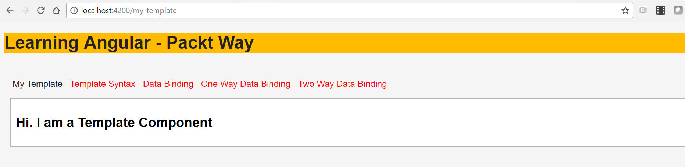
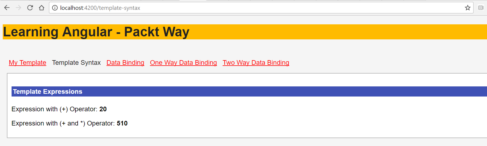
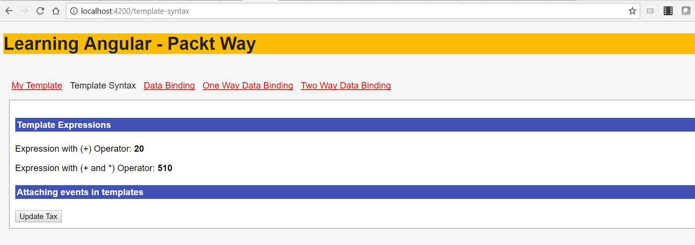
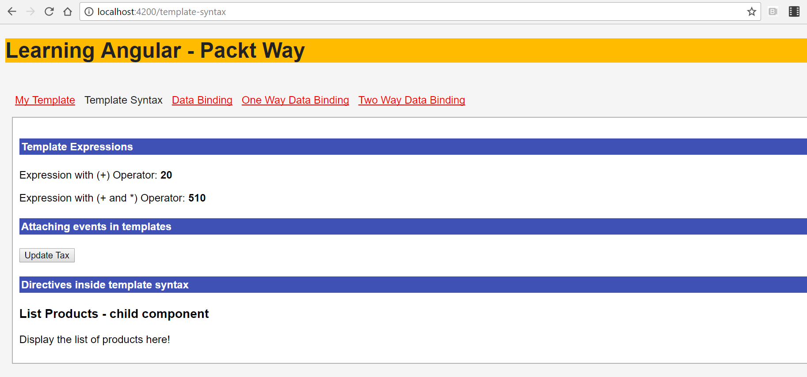
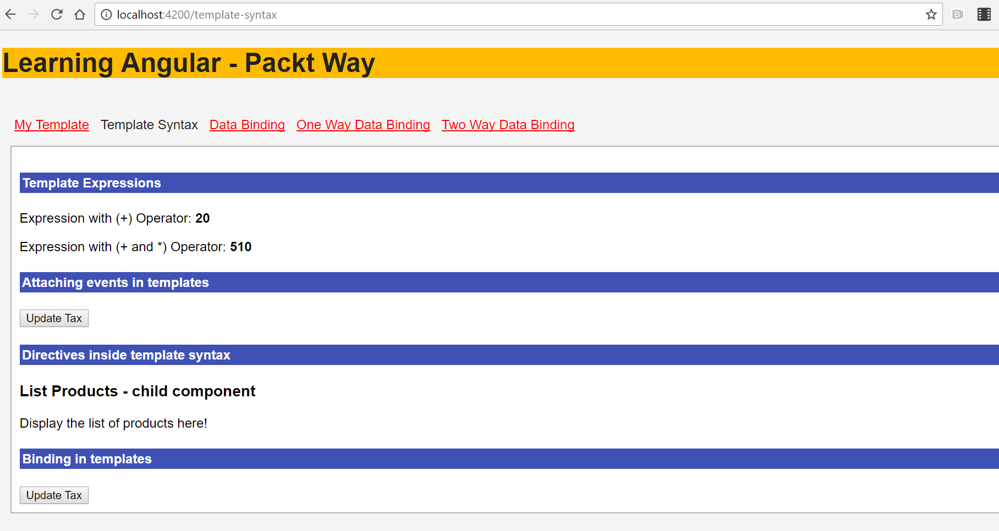
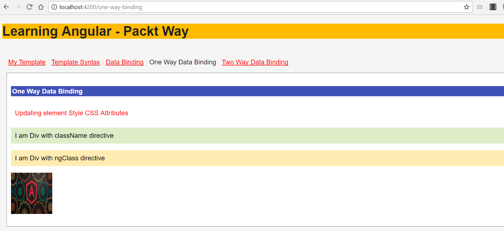
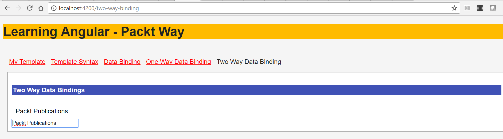

# 第七章：模板和数据绑定语法

在本章中，您将学习 Angular 框架提供的模板语法和数据绑定。模板语法和数据绑定主要关注应用程序的 UI 或视图方面；因此，这是一个非常重要和关键的功能。

在本章中，您将学习有关模板语法和在我们的组件中包含模板的不同方式。您还将学习创建组件，包括子组件，并在视图模板中使用表达式和运算符。您还将专注于如何在模板中附加事件、属性和实现指令。

数据绑定是 Angular 的关键特性之一，它允许我们将数据从源映射到视图目标，反之亦然。您将学习不同的数据绑定方式。

在本章中，您将学习如何在学习过程中创建示例的帮助下，包含视图模板并在模板中定义数据绑定。

您将在本章中学习并实现以下内容：

+   模板语法

+   包含模板语法的各种方式

+   Angular 中的模板表达式

+   数据绑定语法

+   Angular 双向数据绑定

+   模板中的属性绑定

+   在模板中将事件附加到视图

+   模板中的表达式和语句

+   模板中的指令

# 学习模板语法

组件的视图是使用模板定义的，告诉 Angular 如何呈现外观。在模板中，我们定义数据应该如何显示，并使用数据绑定附加事件。

大多数 HTML 标签都可以在 Angular 模板中使用。我们可以使用和定义用户自定义指令。

为组件定义模板的一般语法如下：

```ts
import {Component, View} from "@angular/core";

@Component({
 selector: 'my-app',
 template: `<h2>{{ title }}</h2>`
})

export class MyTemplateComponent {
 title = 'Learning Angular!!!'
}

```

让我们详细分析上述代码片段：

1.  我们定义了一个组件，`MyTemplateComponent`。

1.  我们使用`template`定义了组件视图。

1.  在模板中，我们定义了一个`<h2>`标签。

1.  我们定义了一个`title`变量并赋予了一个值。

1.  使用`{{ }}`插值，我们将变量绑定到模板上。

运行应用程序，您应该看到以下输出：



在下一节中，您将详细了解包含模板的各种方式，以及插值的相关内容。

# 包含模板语法的各种方式

在本节中，您将学习有关在组件视图中包含模板的不同方法。在组件语法中包含模板语法有两种方式：

+   我们可以在`component`装饰器内定义视图模板。使用`template`，我们可以在组件装饰器内联包含模板。

+   我们也可以使用`templateURL`包含模板。使用`templateUrl`，我们将模板元素写在一个单独的文件中，并将模板的路径提供给组件。

`templateURL`是一个更受欢迎的方式，因为它允许我们以逻辑方式分离代码，更有效地组织代码。

# 使用内联模板语法

我们讨论了在组件中以不同方式包含模板。让我们学习如何在组件内定义我们的模板。

在组件装饰器内使用模板的语法如下：

```ts
import {Component, View} from "@angular/core";

@Component({
 selector: 'my-app',
 template: `<h2> {{ title }} </h2>`
})

export class MyTemplate {
 title = 'Learning Angular!!!'
}

```

在前面的代码片段中需要注意的最重要的事情如下：

1.  我们在`@component`装饰器内定义模板。

1.  组件`class`定义和模板在同一个文件中定义。

# 使用 templateURL 来包含一个模板

在前面的代码片段中，我们在同一个文件中创建了模板和组件类。然而，当组件类的复杂性在模板元素和类定义中增加时，将很难维护它。

我们需要分离逻辑类和视图，这样更容易维护和理解。现在，让我们看另一种使用`templateURL`为组件定义视图模板的方式。

使用`templateURL`进行查看的语法如下；让我们创建一个名为`app-template.component.ts`的文件：

```ts
import { Component } from '@angular/core';
import { FormsModule } from '@angular/forms';

@Component({
 selector: 'app-data-binding',
 templateUrl: './data-binding.component.html',
 styleUrls: ['./data-binding.component.css']
})
export class DataBindingComponent {
}

```

如果我们使用上述任何一种方式来使用模板，将不会有视觉上的区别。为 HTML、CSS 和组件类创建单独的文件是有意义的，因为这样可以更好地组织代码，并在代码增加时最终有助于维护代码库。

在下一节中，您将学习 Angular 框架为数据和模板绑定提供的功能。

# 模板中的插值

双大括号`{{ }}`是 Angular 中的插值。它们是一种将大括号之间的文本映射到组件属性的方式。我们已经在整个章节中的各种示例中使用和实现了插值。

在我们将要编写的模板中，值写在双大括号内，如下所示：

```ts
{{ test_value }}

```

让我们快速创建一个简单的例子来理解插值。在`app.component.ts`文件中，让我们定义一个名为`title`的变量：

```ts
import { Component } from '@angular/core';

@Component({
 templateUrl: './app.component.html',
 styleUrls: ['./app.component.css']
})

export class AppComponent {
  constructor() { }
  title = "Data Binding";
}

```

现在，我们需要在模板中显示`title`的值。更新`app.component.html`文件，并添加以下代码行：

```ts
<p> {{ title }} </p>

```

现在，尝试更改类中`title`的值；我们将看到模板中自动反映出更新后的值。这就是插值，这是我们在 Angular 中喜爱的一个关键特性。

现在我们知道如何使用插值，接下来我们将处理如何在模板中添加表达式。

# Angular 中的模板表达式

我们可以在模板中使用表达式；表达式执行并产生一个值。

就像在 JavaScript 中一样，我们可以使用表达式语句，但不能使用赋值、new 和链式操作符。

让我们看一些模板表达式的例子：

```ts
<p> {{ tax+10 }} </p> // Using plus operator

<p> {{( tax*50)-10 }} </p>

```

在前面的代码片段中，我们正在使用变量`tax`进行算术运算。

如果您使用过任何编程语言，很可能会发现本节非常简单。就像在任何其他语言中一样，我们可以使用算术运算符。

让我们快速创建一个示例。更新**`app.component.html`**文件，并添加以下代码：

```ts
<h4>Template Expressions</h4>

<p> Expression with (+) Operator: <strong>{{ tax+ 10 }}</strong></p>

<p> Expression with (+ and *) Operator: <strong>{{ (tax*50) +10 }} 
   </strong></p>

```

在前面的代码片段中，我们在模板中使用了表达式。我们对`tax`变量进行了加法和算术运算。

在更新的`app.component.ts`文件中，添加以下代码片段：

```ts
import { Component } from '@angular/core';

@Component({
 templateUrl: './app.component.html',
 styleUrls: ['./app.component.css']
})

export class AppComponent {
 constructor() { }

 title = "Data Binding";
 tax = 10;
}

```

我们正在创建一个`AppComponent`类并声明两个变量，`title`和`tax`。我们为`title`和`tax`分配了初始值。

运行应用程序，我们应该看到前面代码片段的输出，如下截图所示：



到目前为止，您已经学习了如何在视图中使用模板、插值以及在模板中使用表达式。现在，让我们学习如何在模板中附加事件并实现指令。

# 在模板中将事件附加到视图

在前面的部分中，我们介绍了如何在组件中定义和包含模板以及在模板中使用插值和表达式。

在本节中，您将学习如何将事件附加到模板中的元素。

事件是基于用户操作触发的常规 JavaScript 方法，例如`onclick`和`onmouseover`。方法是一组定义为执行特定任务的语句。

附加事件的一般语法如下：

```ts
<button (click)= function_name()> Update Tax</button>

```

让我们详细分析前面的代码：

1.  我们在模板中创建了一个`button`。

1.  我们正在将`click`事件附加到按钮上。

1.  通过`click`事件，我们绑定了`function_name()`方法。

现在，让我们用上述代码更新我们的`component`文件，并看看它的运行情况。

我们将首先更新我们的`app.component.html`文件，并添加以下代码片段：

```ts
<p> {{ title }} </p>
<p> {{ tax+ 10 }}</p>
<p> {{ (tax*50) +10 }} </p>
<button (click)= updateTax()> Update Tax </button>

```

关于上述代码片段的一些快速注释：

1.  我们在模板中添加了`button`。

1.  我们在`click`事件的按钮上附加了一个名为`updateTax`的事件。

现在，是时候用以下代码更新我们的`app.component.ts`文件了：

```ts
import { Component } from '@angular/core';

@Component({
 templateUrl: './data-binding.component.html',
 styleUrls: ['./data-binding.component.css']
})

export class DataBindingComponent {
 constructor() { }

 title = "Data Binding and Template Syntax";
 tax = 10;

 updateTax() {
  this.tax = 20;
 }
}

```

让我们分析上述代码片段：

1.  我们正在定义和创建一个组件--`AppComponent`。

1.  我们已经定义了两个变量，`title`和`tax`，并为它们分配了一些值。

1.  我们正在定义和创建一个`updateTax`方法，当调用时将更新`tax`变量。

1.  更新后的`tax`值将显示在模板中。

现在，运行应用程序，我们应该看到如下截图所示的输出；点击“更新税收”按钮，您应该看到模板中的数据得到更新：



太棒了！所以，在本节中，您学会了在模板中附加事件，还学会了在组件类中定义方法来更新组件的属性。在下一节中，您将学会在模板中实现指令。

# 在模板中实现指令

我们在学习模板语法方面取得了良好的进展。我们讨论了如何包含模板语法，如何在模板中使用插值，并附加事件。

就像事件一样，我们也可以在模板中实现指令和属性。在本节中，我们将解释如何在模板中实现指令。

看一下以下代码片段：

```ts
<list-products></list-products>

```

上述代码看起来是否类似于在早期版本的 Angular 中定义自定义指令的方式？没错。在 Angular 框架中，自定义指令现在被称为组件。

我们可以根据应用程序的要求创建和定义自定义指令或标签。

目录结构和子组件之间没有关系，但作为一个良好的实践，始终将逻辑上的父子关系组件放在一个目录下；这有助于更好地组织代码。

我们将使用我们在上一节中创建的组件。我们创建了一个组件--`data-binding.component.ts`。现在我们将创建一个新的组件，`list-products`，我们将能够将其绑定到`data-binding`组件。

将以下代码片段添加到`list-products.component.ts`文件中：

```ts
import { Component } from '@angular/core';

@Component({
 selector: 'list-products',
 templateUrl: './list-products.component.html',
 styleUrls: ['./list-products.component.css']
})

export class ListProductsComponent {
 constructor() { }
}

```

让我们分析前面的代码：

1.  我们创建了一个新的组件，即`list-products`组件。

1.  在组件定义中，我们将`selector`命名为`list-products`。

1.  `@Component`装饰器为组件提供了 Angular 元数据。使用 CSS `selector`，我们可以在`list-products`标签内显示模板或视图的输出。

1.  我们可以为`selector`指定任何名称，但确保在父组件中也使用相同的名称进行调用。

现在我们已经告诉 Angular 我们需要将`list-products`组件的输出放在自定义标签`list-products`中，我们需要在父组件模板中放置子组件标签。

我们需要使用选择器标签来在模板`data-binding.component.html`文件中识别`list-products`组件：

```ts
<list-products></list-products>

```

我们已经准备好了。现在运行应用程序，我们应该看到前面的代码和子组件的输出以及`data-binding.component.html`模板视图一起显示出来：



太棒了！所以，你现在学会了如何在模板中包含子组件。任何一个 Angular 应用程序如果没有使用其中任何一个都很少完整。我们将在下一节继续学习和构建更多示例，在那里你将学习如何在模板中使用属性绑定。

# 模板中的绑定

在这一部分，我们将扩展在前一部分创建的示例。我们将介绍如何在模板中使用属性绑定。属性是模板中元素的属性，例如 class、ID 等。

HTML 属性的一般语法如下：

```ts
<button class="myBtn" [disabled]="state=='texas'"  .
  (click)="updateTax()"></button>

```

前面代码片段中需要注意的重点如下：

1.  我们使用`button`标签定义了一个`html`元素。

1.  我们向`button`标签添加了`class`属性。

1.  我们附加了一个`click`事件，调用了一个名为`updateTax`的方法到按钮上。

1.  我们有一个`disabled`属性；如果`state`的值是`texas`，按钮元素将显示在页面上并且将被`disabled`。如果不是，它将显示一个启用的按钮。

使用属性绑定，我们可以动态更改`disabled`的属性值；当组件类中的值更新或更改时，视图也会更新。

让我们更新`app.component.html`文件，并将属性添加到模板中的元素：

```ts
<button (click)= updateTax() [disabled]="state=='texas'"> Update Tax 
  </button>

```

仔细观察，你会发现我们已经添加了`disabled`属性；根据`state`的值，按钮将被启用或禁用。

现在，在`app.component.ts`文件中，让我们定义一个名为`state`的属性变量并为其赋值：

```ts
import { Component } from '@angular/core';

@Component({
 templateUrl: './data-binding.component.html',
 styleUrls: ['./data-binding.component.css']
})
export class DataBindingComponent {

 constructor() { }

 title = "Data Binding and Template Syntax";

 tax = 10;
 state = 'texas';

 updateTax() {
  this.tax = 20;
 }
}

```

在前面的代码中，我们只是定义了一个名为`state`的新变量，并为其赋值。根据`state`的值——分配或更新——按钮将被启用或禁用。

运行应用程序，我们应该看到以下截图中显示的输出：



太棒了！你学会了如何在 Angular 组件中使用模板。

我们讨论了如何编写模板语法，不同的包含模板语法的方式，如何将事件附加到元素，将属性附加到元素，以及如何在模板中实现指令。

在下一节中，您将了解数据绑定——这是 Angular 最重要和最突出的特性之一，也是最常与模板语法一起使用的特性之一。

# Angular 数据绑定

Angular 提供了一种在同一视图和模型之间轻松共享数据的机制。我们可以将一个值关联和赋值给一个类组件，并在视图中使用它。它提供了许多种数据绑定。我们将首先了解各种可用的数据绑定，然后继续创建一些示例。

数据绑定可以分为三个主要类别：

1.  单向数据绑定，即从数据源到视图。

1.  单向数据绑定，即从视图到数据源。

1.  双向数据绑定，即从视图目标到数据源和从数据源到视图。

# 单向数据绑定 - 数据源到视图

在本节中，您将学习从数据源到视图目标的单向数据绑定。在下一节中，您将学习从模板到数据源的单向数据绑定。

在 Angular 中，单向数据绑定指的是从数据源到视图的数据流。换句话说，我们可以说每当值和数据更新时，它们会反映在视图目标中。

单向数据绑定从数据源到视图目标应用于以下 HTML 元素属性：

+   `插值`

+   `属性`

+   `属性`

+   `类`

+   `样式`

现在我们知道了单向数据绑定从数据源到目标应用于哪些属性和元素，让我们学习如何在我们的代码中使用它们。

让我们来看一下从数据源到视图模板的单向数据绑定的一般语法。

```ts
{{ value_to_display }} // Using Interpolation  [attribute] = "expression" // Attribute binding

```

让我们详细分析先前定义的语法：

+   `插值`是在双大括号中写入的值，就像上面的代码中所示的那样。

+   大括号`{{ }}`之间的文本通常是组件属性的名称。Angular 会用相应组件属性的字符串值替换该名称。

+   我们可以通过在方括号`[]`中写入来定义`属性`和`属性`的单向数据绑定。

+   `value_to_display`和`expression`属性是在组件类中定义的。

一些开发人员还喜欢使用规范形式，通过在属性后添加前缀。

```ts
<a bind-href = "value"> Link 1</a>

```

使用`bind`前缀与元素的定义一起，绑定属性或属性。

现在我们知道了写单向数据绑定的语法，是时候为此编写示例了：

```ts
<h4>{{ title }}</h4>

<div [style.color]="colorVal">Updating element Style CSS 
    Attributes</div>
<p>
  <div [className]="'special'" >I am Div with className directive</div>
<p>
  <div [ngClass]="{'specialClass': true, 'specialClass2': true}" >I am 
        Div with ngClass directive</div>
<p>


```

让我们快速分析一下上述代码片段中的一些关键点：

1.  我们正在使用插值--双大括号`{{ }}`中的值--来显示来自数据源到模板的值。属性`title`将在组件模型中设置。

1.  我们通过将值动态绑定到组件类中定义的变量`colorVal`，来定义`style`属性`color`。

1.  我们正在定义`ngClass`属性，并且根据条件，无论是`specialClass`还是`specialClass2`属性中的哪一个被设置为 true，相应的类都将被分配。

1.  我们通过将组件类中的属性`imageUrl`绑定到`src`属性值，动态地提供了图片的`src`属性值。

让我们快速在组件类`one-way.component.ts`文件中定义我们的变量：

```ts
import { Component } from '@angular/core';

@Component({
  selector: 'app-one-way',
  templateUrl: './one-way.component.html',
  styleUrls: ['./one-way.component.css']
})
export class OneWayComponent {
 constructor() { }

 title = 'One way data bindings';

  state = 'california';
  colorVal = 'red';
  specialClass : true;
  imageUrl = '././././assets/images/angular.jpeg';
  tax = 20;
}

```

在上述代码片段中，我们已经定义了我们的`colorVal`、`isStyleVisible`和`imageUrl`变量。

现在，让我们运行上述代码，你应该会看到以下截图中显示的输出：



如果你仔细注意，在所有上述的代码片段中，我们只是单向绑定数据，也就是说，只从数据源到视图目标。

因此，从本质上讲，这是给你的最终用户的只读数据。在下一节中，我们将学习有关从视图模板到数据源的单向数据绑定。

考虑以下的实践练习：尝试创建更多的变量并将它们映射到视图中。

# 单向数据绑定 - 视图模板到数据源

在前面的部分中，我们学习了从数据源到视图模板的单向数据绑定。

在本节中，我们将学习从视图模板到数据源的单向数据绑定。

从视图模板到数据源的单向数据绑定主要用于事件。

创建绑定的一般语法如下：

```ts
(target)="statement"

```

从视图到数据源的绑定主要用于调用方法或捕获事件交互。

下面给出了从视图模板到数据源的单向绑定示例

```ts
<button (click)="updateTax()"></button>

```

我们附加了`click`事件，当按钮被点击时，将调用`updateTax`方法。

我们学习了从数据源到模板以及从视图模板到数据源的单向数据绑定。

在下一节中，您将学习双向数据绑定，显示数据属性以及在对元素的属性进行更改时更新这些属性。

# Angular 双向数据绑定

双向数据绑定必须是 Angular 中最重要的功能之一。双向数据绑定帮助使用`ngModel`指令将输入和输出绑定表达为单个符号。

双向数据绑定是一种机制，可以直接将数据从模型映射到视图，反之亦然。这种机制允许我们在视图和模型之间保持数据同步，即从数据源到视图使用`[]`，从视图到数据源使用`()`。

在 Angular 中，我们使用`ngModel`实现双向数据绑定。

双向数据绑定的一般语法如下：

```ts
<input [(ngModel)]="sample_value" />

```

在上述语法中，请注意以下内容：

+   我们使用`ngModel`写在`[()]`内绑定元素

+   我们为`input`元素关联了双向数据绑定

不要忘记从`@angular/forms`导入`FormsModule`，否则会出错。`ngModel`从领域模型创建一个`FormControl`实例，并将其绑定到表单控件元素。

现在，让我们使用`ngModel`创建一个示例：

```ts
<div> {{sample_value}}</div>

<input [(ngModel)]="sample_value" />

```

我们添加了一个`div`元素，并使用数据绑定，将输入元素的值映射到`ngModel`。使用`ngModel`有助于跟踪控件的值、用户交互和验证状态，并保持视图与模型同步。

现在，当我们开始在类型为文本的`input`元素中输入时，我们看到我们输入的内容被复制到我们的`div`元素中作为`value`：



太棒了！就数据绑定和模板而言，我们在这一章中取得了相当大的进展。凭借我们在整个章节中获得的所有知识，我们可以创建出优雅而强大的应用程序界面。

# 总结

模板语法和数据绑定是 Angular 应用程序的骨架和灵魂。我们介绍了模板：如何以不同的方式包含它们并在视图模板中使用表达式。然后，我们通过将事件和属性附加到模板来遍历模板。

我们探讨了 Angular 应用程序中数据绑定的方面，并专注于如何为模板内的值实现数据绑定。

在数据绑定中，我们深入探讨了它的广泛类别。我们探索了数据绑定的可用方式：单向数据绑定和双向数据绑定。

利用数据绑定和模板结合在一起，我们几乎可以为我们的 Angular 应用程序创建模拟的功能屏幕：这就是数据绑定和模板语法的力量。

所以，继续发挥你的创造力吧！祝你好运。

在下一章中，您将学习有关 Angular 中的高级表单，学习如何使用和掌握响应式表单。我们通过强调您的 html 模型和您的`NgModel`之间的关系来解决响应式表单的响应部分，因此给定表单上的每个更改都会传播到模型
