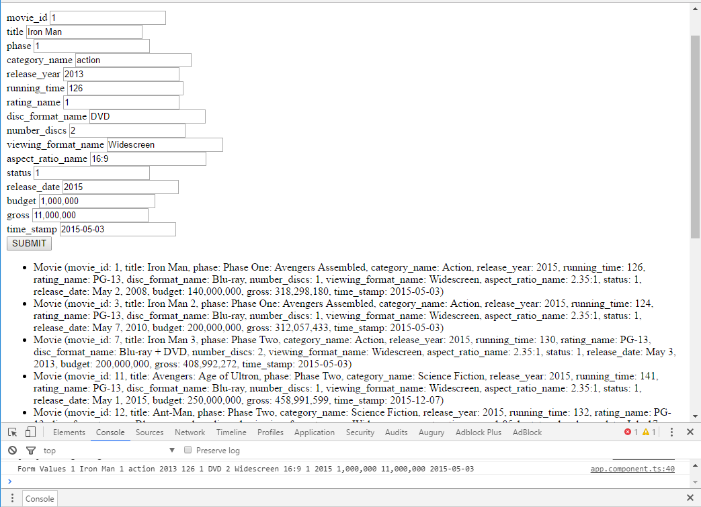
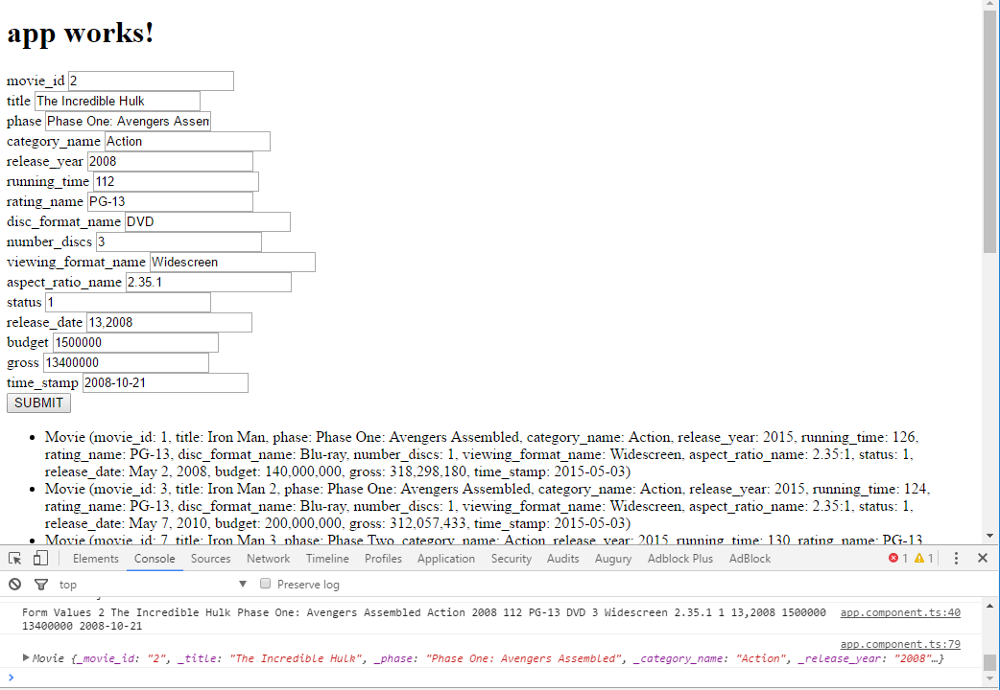
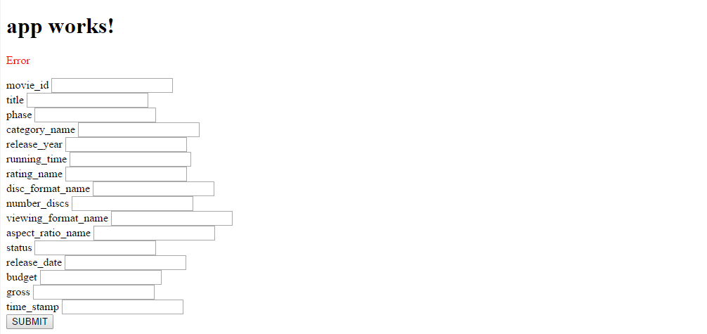
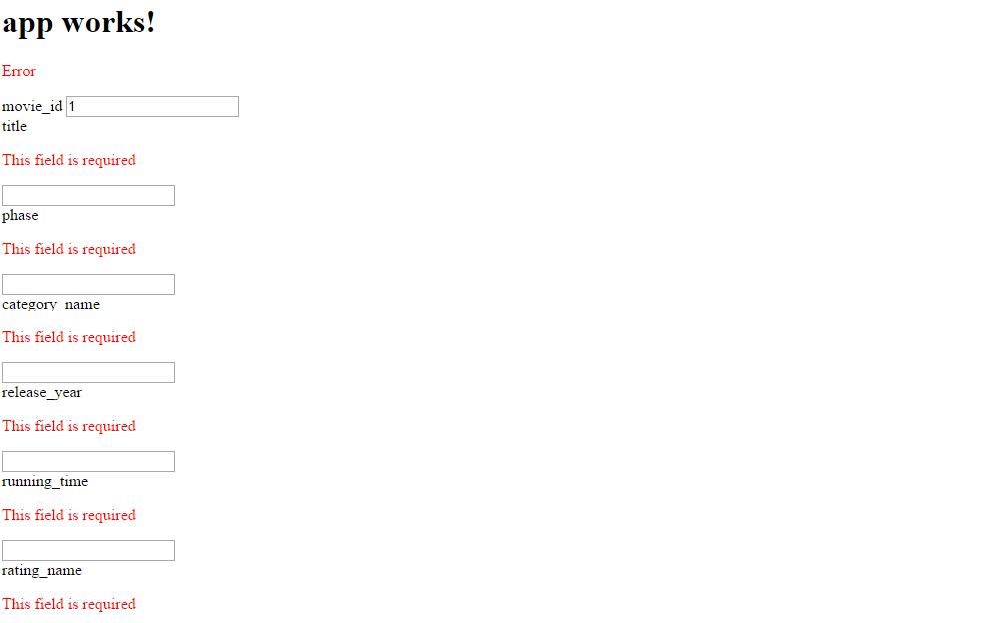

# 第八章：Angular 中的高级表单

在第七章 *异步编程* *使用 Observables*中，我们使用 Observables 构建了一个简单但易于扩展的 JSON API 来查询漫威电影宇宙。在本章中，我们将构建表单，以更加用户友好的方式查询我们的 API。这些表单将帮助我们不仅从漫威电影宇宙中检索电影，还可以添加电影。除了表单本身，我们显然需要在我们的 API 上进行构建，以支持添加和修改电影。

在本章中，我们将详细介绍以下主题：

+   响应式表单

+   控件和控件组

+   表单指令

+   使用 FormBuilder

+   添加验证

+   自定义验证

# 开始

正如本章介绍中所述，我们将在第七章 *异步编程* *使用 Observables*中构建我们的漫威电影宇宙的 JSON API。更准确地说，我们将改进基于 Promise 的版本。为什么使用 Promise 而不是纯观察者？嗯，Promise 是一个非常强大的工具，在我迄今为止看到的大多数 Angular/Typescript 项目中都在使用。因此，多练习一下 Promise 不会有太大的坏处。

您可以在这里找到 Promises 部分的代码[`bit.ly/mastering-angular2-chap7-part3`](http://bit.ly/mastering-angular2-chap7-part3)。

要将此代码克隆到名为`advanced-forms`的新存储库中，请使用以下命令：

```ts
$ git clone --depth one https://github.com/MathieuNls/mastering-
   angular2 advanced-forms
$ cd advanced-forms
$ git filter-branch --prune-empty --subdirectory-filter chap7/angular-
   promise HEAD
$ npm install

```

这些命令将最新版本的 GitHub 存储库中包含本书代码的文件夹命名为`advanced-forms`。然后，我们进入`advanced-forms`文件夹，并清除不在`chap7/angular-promise`子目录中的所有内容。神奇的是，Git 会重写存储库的历史，只保留在`chap7/angular-promise`子目录中的文件。最后，`npm install`将准备好所有我们的依赖项。

因此，您将在名为 advanced-forms 的新项目中实现我们在《第七章》*使用可观察对象进行异步编程*中实现的行为（例如从漫威电影宇宙查询电影）。现在，如果我们使用表单来创建、读取、更新和删除漫威电影宇宙中的电影，并且这些更改不反映在查询部分，那将不会有太多乐趣。提醒一下，我们在《第七章》*使用可观察对象进行异步编程*中构建的查询 API 是一个静态的 JSON 文件作为后端模拟。为了保存来自我们表单的更改，我们将不得不修改 JSON 文件。虽然这是可能的，但这意味着我们将为我们的模拟构建一个全新的功能（即编辑文件）只是为了这个目的。这个新功能在我们继续使用真正的后端时将毫无帮助。因此，我们将使用漫威电影宇宙中的电影的内存引用。

`app.component.ts`文件如下所示：

```ts
import { Component } from '@angular/core';
import { IMDBAPIService } from './services/imdbapi.service';
import { Movie, MovieFields } from './models/movie'; 

@Component({ 
  selector: 'app-root', 
  templateUrl: './app.component.html', 
  styleUrls: ['./app.component.css'] 
}) 
export class AppComponent { 
  title = 'app works!';

  private movies:Movie[] = [];
  private error:boolean = false;
  private finished:boolean = false;

  constructor(private IMDBAPI:IMDBAPIService){

      this.IMDBAPI.fecthOneById(1).then(
        value => {
            this.movies.push(value); 
            console.log("Component", value)
        },
        error => this.error = true
      );

      this.IMDBAPI.fetchByField(MovieFields.release_year, 2015).then(
        value => {
            this.movies = value; 
            console.log("Component", value)
        },
        error => this.error = true
      )

      this.IMDBAPI.byField(MovieFields.release_year, 2015)
        .or(MovieFields.release_year, 2014)
        .or(MovieFields.phase, "Phase Two")
        .fetch()
        .then(
          value => {
              this.movies = value; 
              console.log("Component", value)
          },
          error => this.error = true
        );
     }
} 

```

相关的 HTML 模板如下：

```ts
<h1>
  {{title}}
</h1>

<ul>
    <li *ngFor="let movie of movies">{{movie}}</li> 
</ul> 

```

`IMDBAPIService`与《第七章》*使用可观察对象进行异步编程*中的内容相同，执行`ng start`将得到以下结果：

在《第七章》*使用可观察对象进行异步编程*结束时的状态。

# 响应式表单

在《第八章》*模板和数据绑定语法*中，我们学习了如何在 Angular 中利用数据绑定和模板化。在这里，我们将把这些新概念与表单结合起来。任何有两个小时 HTML 经验的人都知道`<form>`的含义以及如何使用它们。在您掌握了几个小时的 HTML 之后，您就知道如何识别表单中的不同信息，并选择一种方法（即`GET`、`POST`、`PUT`和`DELETE`）将所有内容发送到您选择的后端。

然而，在这个示例中，我们将使用命令式的 TypeScript 代码构建表单，而不是传统的 HTML。你可能会问，为什么？嗯，这样可以让我们在不依赖生成 DOM 的端到端测试的情况下测试我们的表单。使用响应式表单，我们可以像在第十六章中描述的那样，使用经典的单元测试来测试我们的表单。

让我们从为表单构建基础的 HTML 结构开始，旨在向漫威电影宇宙添加一部新电影，如下所示：

```ts
<form [formGroup]="movieForm">
        <label>movie_id</label>
        <input type="text" formControlName="movie_id"><br/>
        <label>title</label>
        <input type="text" formControlName="title"><br/>
        <label>phase</label>
        <input type="text" formControlName="phase"><br/>
        <label>category_name</label>
        <input type="text" formControlName="category_name"><br/>
        <label>release_year</label>
        <input type="text" formControlName="release_year"><br/>
        <label>running_time</label>
        <input type="text" formControlName="running_time"><br/>
        <label>rating_name</label>
        <input type="text" formControlName="rating_name"><br/>
        <label>disc_format_name</label>
        <input type="text" formControlName="disc_format_name"><br/>
        <label>number_discs</label>
        <input type="text" formControlName="number_discs"><br/>
        <label>viewing_format_name</label>
        <input type="text" formControlName="viewing_format_name"><br/>
        <label>aspect_ratio_name</label>
        <input type="text" formControlName="aspect_ratio_name"><br/>
        <label>status</label>
        <input type="text" formControlName="status"><br/>
        <label>release_date</label>
        <input type="text" formControlName="release_date"><br/>
        <label>budget</label>
        <input type="text" formControlName="budget"><br/>
        <label>gross</label>
        <input type="text" formControlName="gross"><br/>
        <label>time_stamp</label>
        <input type="text" formControlName="time_stamp"><br/>
</form> 

```

在上述表单中，我们为`Movie`模型的每个属性都有一个标签-输入对。现在，这个表单中有一些明显不是纯 HTML 的指令。即`[formGroup]="movieForm"`和`formControlName=""`。第一个指令(`[formGroup]="movieForm"`)用于将这个特定表单与`FormGroup`的实例绑定。然后，`formControlName`指的是`FormControl`类的实例，它包括`FormGroup`。换句话说，`movieForm`是由`FormControl`、`FormGroup`和`FormControl`组成的，`@angular/forms`包中都有。因此，我们需要在`app.component.ts`文件中导入这个包：`import { FormGroup, FormControl }` from `@angular/forms`；在更新了`app.component.html`文件后。此外，我们需要导入`ReactiveFormsModule`并将其添加到我们的应用程序模块中。

如果你现在就启动你的应用程序，它会毫无问题地转译。然而，在运行时，它会抱怨，因为`movieForm`表单组在你的组件中还不存在。让我们创建它：

```ts
 private movieForm:FormGroup =  new FormGroup({
    movie_id: new FormControl(),
    title: new FormControl(),
    phase: new FormControl(),
    category_name: new FormControl(),
    release_year: new FormControl(),
    running_time: new FormControl(),
    rating_name: new FormControl(),
    disc_format_name: new FormControl(),
    number_discs: new FormControl(),
    viewing_format_name: new FormControl(),
    aspect_ratio_name: new FormControl(),
    status: new FormControl(),
    release_date: new FormControl(),
    budget: new FormControl(),
    gross: new FormControl(),
    time_stamp: new FormControl()
}); 

```

正如你所看到的，`AppComponent`组件有一个`FormGroup`的私有成员实例。这个`FormGroup`实例由许多`FormControl`实例组成，每个字段都是精确的一个。

此外，每个字段的值可以通过`this.movieForm.value.my_field`来访问。因此，如果我们在表单中添加一个提交按钮：

```ts
<button (click)="submit()" type="submit">SUBMIT</button> 

```

然后，在`AppComponent`组件中对应的`submit()`函数，然后我们可以显示每个字段的值。

```ts
  private submit(){
    console.log(
      "Form Values",
      this.movieForm.value.movie_id,
      this.movieForm.value.title,
      this.movieForm.value.phase,
      this.movieForm.value.category_name,
      this.movieForm.value.release_year,
      this.movieForm.value.running_time,
      this.movieForm.value.rating_name,
      this.movieForm.value.disc_format_name,
      this.movieForm.value.number_discs,
      this.movieForm.value.viewing_format_name,
      this.movieForm.value.aspect_ratio_name,
      this.movieForm.value.status,
      this.movieForm.value.release_date,
      this.movieForm.value.budget,
      this.movieForm.value.gross,
      this.movieForm.value.time_stamp
    );
  } 

```

就是这么简单；我们在 HTML 模板和组件之间建立了通信：

显示相当粗糙的 HTML 表单和提交函数的控制台输出。

然后，我们可以创建`Movie`模型的实例并将其发送到`IMDBAPI`进行持久化。唯一缺少的是一个可用的后端。

```ts
private submit(){
    console.log(
      "Form Values",
      this.movieForm.value.movie_id,
      this.movieForm.value.title,
      this.movieForm.value.phase,
      this.movieForm.value.category_name,
      this.movieForm.value.release_year,
      this.movieForm.value.running_time,
      this.movieForm.value.rating_name,
      this.movieForm.value.disc_format_name,
      this.movieForm.value.number_discs,
      this.movieForm.value.viewing_format_name,
      this.movieForm.value.aspect_ratio_name,
      this.movieForm.value.status,
      this.movieForm.value.release_date,
      this.movieForm.value.budget,
      this.movieForm.value.gross,
      this.movieForm.value.time_stamp
    );

    let movie:Movie = new Movie(
      this.movieForm.value.movie_id,
      this.movieForm.value.title,
      this.movieForm.value.phase,
      this.movieForm.value.category_name,
      this.movieForm.value.release_year,
      this.movieForm.value.running_time,
      this.movieForm.value.rating_name,
      this.movieForm.value.disc_format_name,
      this.movieForm.value.number_discs,
      this.movieForm.value.viewing_format_name,
      this.movieForm.value.aspect_ratio_name,
      this.movieForm.value.status,
      this.movieForm.value.release_date,
      this.movieForm.value.budget,
      this.movieForm.value.gross,
      this.movieForm.value.time_stamp
     );

    console.log(movie);

    //Persist movie

  } 

```

在下面的截图中，我们可以看到显示的 HTML 表单和改进的`submit`函数的控制台输出：



现在很好；我们已经从 HTML 表单中检索到了值，并在应用程序的组件端创建了一个可以移动和持久化的`Movie`对象。这个表单中至少有两个不同的改进之处：

+   表单创建的冗长（`new FormControl()`太多了？）

+   对不同输入的验证

# 使用 FormBuilder

`FormBuilder`是 Angular 的`@angular/forms`包中的可注入辅助类。这个类有助于减少表单创建的冗长，如下面的代码所示：

```ts
this.movieForm = this.formBuilder.group({
   movie_id: '',
   title: '',
   phase: '',
   category_name: '',
   release_year: '',
   running_time: '',
   rating_name: '',
   disc_format_name: '',
   number_discs: '',
   viewing_format_name: '',
   aspect_ratio_name: '',
   status: '',
   release_date: '',
   budget: '',
   gross: '',
   time_stamp: ''
}); 

```

正如你所看到的，使用`FormBuilder`类的`group`方法，`FormGroup`和`FormControl`的声明现在是隐式的。我们只需要有字段名称，后面跟着它的默认值。在这里，所有的默认值都是空白的。

要使用`FormBuilder`类，我们首先必须导入它：

```ts
Import { FormGroup, FormControl, FormBuilder } from '@angular/forms'; 

```

然后我们在`AppComponent`组件的构造函数中注入它：

```ts
 constructor(private IMDBAPI:IMDBAPIService, private formBuilder: FormBuilder) 

```

请注意，我们仍然从第七章注入了`IMDBAPIService`，*使用可观察对象进行异步编程*。

因此，`AppComponent`现在看起来像下面这样：

```ts

import { Component } from '@angular/core';
import { IMDBAPIService } from './services/imdbapi.service';
import { Movie, MovieFields } from './models/movie';

import { FormGroup, FormControl, FormBuilder } from '@angular/forms';

@Component({ 
  selector: 'app-root', 
  templateUrl: './app.component.html', 
  styleUrls: ['./app.component.css'] 
})
export class AppComponent {
  title = 'app works!';

  private movies:Movie[] = [];
  private error:boolean = false;
  private finished:boolean = false;
  private movieForm:FormGroup;

  constructor(private IMDBAPI:IMDBAPIService, private formBuilder: 
     FormBuilder){

      this.movieForm =  this.formBuilder.group({
        movie_id: '',
        title: '',
        phase: '',
        category_name: '',
        release_year: '',
        running_time: '',
        rating_name: '',
        disc_format_name: '',
        number_discs: '',
        viewing_format_name: '',
        aspect_ratio_name: '',
        status: '',
        release_date: '',
        budget: '',
        gross: '',
        time_stamp: ''
      });

      // IMDB queries have been removed for simplicity
    }

    private submit(){
        // submit body has been removed for simplicity
    }    

```

我们解决了我们两个问题中的第一个：表单创建的冗长。在下一节中，我们将解决本章的验证部分，学习如何验证传入的输入。

# 添加验证

处理表单对开发人员来说通常是一种痛苦，因为显然你不能信任用户提供的输入。这要么是因为他们只是没有注意到你在表单中期望的内容，要么是因为他们想要破坏事情。验证来自表单的输入在每种语言中都是痛苦的，无论是服务器端还是客户端。

现在，Angular 团队提出了一种相当简单的方法，通过在表单创建时定义对每个字段的期望来验证输入，使用`Validators`。Angular 包含以下内置的`Validators`，我们可以使用：

+   `required`: 要求非空值

+   `minLength(minLength: number)`: 要求控件值的最小长度为`minLength`

+   `maxLength(maxLength: number)`: 要求控件值的最大长度为`maxLength`

+   `pattern(pattern: string)`: 要求控件值与提供的模式匹配

向我们的表单添加这些内置的`validators`很简单：

```ts

//In AppComponent

import { FormGroup, FormControl, FormBuilder, Validators } from '@angular/forms';

//[...]

constructor(private IMDBAPI:IMDBAPIService, private formBuilder: FormBuilder){

      this.movieForm =  this.formBuilder.group({
        movie_id: ['', Validators.required],
        title: ['', Validators.required],
        phase: ['', Validators.required],
        category_name: ['', Validators.required],
        release_year: ['', Validators.required],
        running_time: ['', Validators.required],
        rating_name: ['', Validators.required],
        disc_format_name: ['', Validators.required],
        number_discs: ['', Validators.required],
        viewing_format_name: ['', Validators.required],
        aspect_ratio_name: ['', Validators.required],
        status: ['', Validators.required],
        release_date: ['', Validators.required],
        budget: ['', Validators.required],
        gross: ['', Validators.required],
        time_stamp: ['', Validators.required]
      });
}

//[...] 

```

除了每个字段的空白默认值之外，我们还添加了必需的`validator`，这是`@angular/forms`包中包含的`Validators`类的静态属性。我们可以使用`FormGroup`的 valid 属性来读取表单的有效性（即，如果所有验证器都通过了）：

```ts
 private submit(){
    console.log(
      "Form Values",
      this.movieForm.value.movie_id,
      this.movieForm.value.title,
      this.movieForm.value.phase,
      this.movieForm.value.category_name,
      this.movieForm.value.release_year,
      this.movieForm.value.running_time,
      this.movieForm.value.rating_name,
      this.movieForm.value.disc_format_name,
      this.movieForm.value.number_discs,
      this.movieForm.value.viewing_format_name,
      this.movieForm.value.aspect_ratio_name,
      this.movieForm.value.status,
      this.movieForm.value.release_date,
      this.movieForm.value.budget,
      this.movieForm.value.gross,
      this.movieForm.value.time_stamp
    );

    if(this.movieForm.valid){
      let movie:Movie = new Movie(
        this.movieForm.value.movie_id,
        this.movieForm.value.title,
        this.movieForm.value.phase,
        this.movieForm.value.category_name,
        this.movieForm.value.release_year,
        this.movieForm.value.running_time,
        this.movieForm.value.rating_name,
        this.movieForm.value.disc_format_name,
        this.movieForm.value.number_discs,
        this.movieForm.value.viewing_format_name,
        this.movieForm.value.aspect_ratio_name,
        this.movieForm.value.status,
        this.movieForm.value.release_date,
        this.movieForm.value.budget,
        this.movieForm.value.gross,
        this.movieForm.value.time_stamp
       );

      console.log(movie);
      //Persist movie
    }else{
      console.error("Form not valid");
    }
} 

```

在`submit`方法的上一个修改中，如果用户没有填写其中一个字段，则`Movie`对象将不会被创建。此外，我们将显示`console.error("表单无效")`；如果我们添加一个条件`<p></p>`块，并附带一些基本的 CSS，我们可以为用户提供一些反馈。

```ts
<p class='error' *ngIf=!movieForm.valid>Error</p> 
/*app.component.css*/
.error{
    color:red;
} 

```

在以下屏幕截图中，我们可以看到显示的 HTML 表单，并对表单的有效性进行了反馈。



我们可以再进一步，为每个字段提供可视化反馈。通过每个子`FormControl`的`valid`属性可以访问每个字段的状态。

```ts
<form [formGroup]="movieForm">

        <p class='error' *ngIf=!movieForm.valid>Error</p>
        <label>movie_id</label>
        <p class='error' *ngIf=!movieForm.controls.movie_id.valid>This 
               field is required</p>
        <input type="text" formControlName="movie_id"><br/>
        <label>title</label>
        <p class='error' *ngIf=!movieForm.controls.title.valid>This 
               field is required</p>
        <input type="text" formControlName="title"><br/>
        <label>phase</label>
        <p class='error' *ngIf=!movieForm.controls.phase.valid>This 
               field is required</p>
        <input type="text" formControlName="phase"><br/>
        <label>category_name</label>
        <p class='error' 
              *ngIf=!movieForm.controls.category_name.valid>This field 
               is required</p>
        <input type="text" formControlName="category_name"><br/>
        <label>release_year</label>
        <p class='error' 
              *ngIf=!movieForm.controls.release_year.valid>This field 
               is required</p>
        <input type="text" formControlName="release_year"><br/>
        <label>running_time</label>
        <p class='error' 
              *ngIf=!movieForm.controls.running_time.valid>This field  
               is required</p>
        <input type="text" formControlName="running_time"><br/>
        <label>rating_name</label>
        <p class='error' 
               *ngIf=!movieForm.controls.rating_name.valid>This field 
                is required</p>
        <input type="text" formControlName="rating_name"><br/>
        <label>disc_format_name</label>
        <p class='error' 
              *ngIf=!movieForm.controls.disc_format_name.valid>This 
               field is required</p>
        <input type="text" formControlName="disc_format_name"><br/>
        <label>number_discs</label>
        <p class='error' 
              *ngIf=!movieForm.controls.number_discs.valid>This field 
              is required</p>
        <input type="text" formControlName="number_discs"><br/>
        <label>viewing_format_name</label>
        <p class='error' 
            *ngIf=!movieForm.controls.viewing_format_name.valid>This 
             field is required</p>
        <input type="text" formControlName="viewing_format_name"><br/>
        <label>aspect_ratio_name</label>
        <p class='error' 
            *ngIf=!movieForm.controls.aspect_ratio_name.valid>This         
             field is required</p>
        <input type="text" formControlName="aspect_ratio_name"><br/>
        <label>status</label>
        <p class='error' *ngIf=!movieForm.controls.status.valid>This 
              field is required</p>
        <input type="text" formControlName="status"><br/>
        <label>release_date</label>
        <p class='error' 
             *ngIf=!movieForm.controls.release_date.valid>This field is 
              required</p>
        <input type="text" formControlName="release_date"><br/>
        <label>budget</label>
        <p class='error' *ngIf=!movieForm.controls.budget.valid>This 
            field is required</p>
        <input type="text" formControlName="budget"><br/>
        <label>gross</label>
        <p class='error' *ngIf=!movieForm.controls.gross.valid>This 
             field is required</p>
        <input type="text" formControlName="gross"><br/>
        <label>time_stamp</label>
        <p class='error' 
           *ngIf=!movieForm.controls.time_stamp.valid>This field is 
            required</p>
        <input type="text" formControlName="time_stamp"><br/>

        <button (click)="submit()" type="submit">SUBMIT</button>
</form> 

```

这产生了以下结果：

显示带有每个字段有效性反馈的 HTML 表单。

正如您所看到的，除了`movid_id`之外的每个表单都显示了“此字段为必填项”错误，因为它们为空。`*ngIf`结构指令监听与关联变量的任何更改，并在字段变得无效/有效时显示/隐藏段落。表单的另一个有用属性是 pristine。它定义了给定字段是否已被用户修改。在我们的情况下，即使没有进行编辑，它也可以用来避免显示错误。

关于`validators`的另一个方便的事情是，它们可以使用`Validators`类的 compose 方法进行组合。在以下示例中，我们将从四个不同的验证器：`Validators.required`、`Validators.minLength`、`Validators.maxLength`和`Validators.pattern`，组合一个`movie_id`字段的验证器。

```ts
this.movieForm =  this.formBuilder.group({
    movie_id: ['',  
       Validators.compose(
       [
          Validators.required,
          Validators.minLength(1), 
          Validators.maxLength(4), 
          Validators.pattern('[0-9]+')
       ]
      )
    ],
    title: ['', Validators.required],
    phase: ['', Validators.required],
    category_name: ['', Validators.required],
    release_year: ['', Validators.required],
    running_time: ['', Validators.required],
    rating_name: ['', Validators.required],
    disc_format_name: ['', Validators.required],
    number_discs: ['', Validators.required],
    viewing_format_name: ['', Validators.required],
    aspect_ratio_name: ['', Validators.required],
    status: ['', Validators.required],
    release_date: ['', Validators.required],
    budget: ['', Validators.required],
    gross: ['', Validators.required],
    time_stamp: ['', Validators.required]
}); 

```

因此，生成的复合验证器将确保`movie_id`是一个介于`1`和`4`位数字之间的数字。以下屏幕截图显示了带有 movide_id 字段反馈的 HTML 表单。该字段有效，因为它由四个数字组成：



# 自定义验证

在前一节中，我们看到了如何使用验证器并将验证器组合在一起以创建更复杂的验证。`Validators.required`、`Validators.minLength`、`Validators.maxLength`和`Validators.pattern`的组合可以涵盖在开发 Angular 应用程序过程中可能出现的许多验证情况。如果有时候您无法使用内置验证器处理验证需求，那么您可以构建自己的验证器。

在本节中，我们将看到如何验证`movie_id`字段包含有效的条目（即一个介于一到四位数之间的数字），并且另一个电影尚未使用该 ID。为此，我们可以创建以下类：

```ts

import { FormControl } from '@angular/forms';

interface ValidationResult {
 [key:string]:boolean;
}

export class MovieIDValidator{
    static idNotTaken(control: FormControl): ValidationResult { 

        let movies = require('./marvel-cinematic-
                universe.json').movies;
        let found:boolean = false;

        for (var i = 0; i < movies.length; ++i) {

            if(control.value == movies[i].movie_id){
                 return { "idNotTaken": true };
            }
        }

       return null;
    }
} 

```

在这里，我们可以看到验证结果实际上是一个简单的`[key:string]:boolean`结构。如果布尔值为 true，则意味着验证器失败（即字段无效）。接下来是`MovieIDValidator`类本身，我们有一个静态方法返回`ValidationResult`，并接受`FormControl`作为参数。在这个方法中，我们从包含漫威电影宇宙的 JSON 文件中提取所有电影。然后，我们遍历所有电影，并检查`movie_id`字段的当前值是否与现有 ID 匹配。如果是，我们返回`{ "idNotTaken": true }`，这意味着`idNotTaken`验证器存在问题。将这个新的自定义验证器与其他四个（即`Validators.required`、`Validators.minLength`、`Validators.maxLength`和`Validators.pattern`）结合起来非常容易：

```ts
import { MovieIDValidator } from './movie-id.validator'

// [...]

this.movieForm =  this.formBuilder.group({
        movie_id: ['',  
          Validators.compose(
            [
             Validators.required,
             Validators.minLength(1), 
             Validators.maxLength(4), 
             Validators.pattern('[0-9]+'),
             MovieIDValidator.idNotTaken
            ]
          )
        ],
        title: ['', Validators.required],
        phase: ['', Validators.required],
        category_name: ['', Validators.required],
        release_year: ['', Validators.required],
        running_time: ['', Validators.required],
        rating_name: ['', Validators.required],
        disc_format_name: ['', Validators.required],
        number_discs: ['', Validators.required],
        viewing_format_name: ['', Validators.required],
        aspect_ratio_name: ['', Validators.required],
        status: ['', Validators.required],
        release_date: ['', Validators.required],
        budget: ['', Validators.required],
        gross: ['', Validators.required],
        time_stamp: ['', Validators.required]
      }); 

```

我们还可以添加一个异步表单验证器，它返回一个 Promise（例如`Promise<ValidationResult>`而不是`ValidationResult`）。当您必须使用远程 API 进行验证时，这非常方便。

```ts
import { FormControl } from '@angular/forms';

interface ValidationResult {
 [key:string]:boolean;
}

export class MovieIDValidator{
    static idNotTaken(control: FormControl): ValidationResult { 

        let movies = require('./marvel-cinematic-
           universe.json').movies;
        let found:boolean = false;

        for (var i = 0; i < movies.length; ++i) {

            if(control.value == movies[i].movie_id){
                 return { "idNotTaken": true };
            }
        }

       return null;
    }

    static idTakenAsync(control: FormControl): 
     Promise<ValidationResult> { 

        let p = new Promise((resolve, reject) => {
         setTimeout(() => {

            let movies = require('./marvel-cinematic-
                universe.json').movies;
            let found:boolean = false;

            for (var i = 0; i < movies.length; ++i) {

                if(control.value == movies[i].movie_id){
                     resolve({ "idNotTaken": true });
                }
            }

            resolve(null);

         }, 1000)
       });

       return p;

    }
} 

```

在这里，我们构建了一个模拟远程 API 调用的 Promise，超时为 1 秒。Promise 的作用与`idNotTaken`相同，我们检查电影的 ID 是否已经被使用。创建 Promise 后，我们将其返回，以便在相关组件中使用。

# 使用 ngModel 进行双向数据绑定

在通过表单创建或更新 Angular 应用程序的模型时，使用`ngModel`进行双向数据绑定非常方便。在前一个应用程序中，我们有以下`submit()`方法：

```ts
private submit(){
  console.log(
    "Form Values",
    this.movieForm.value.movie_id,
    this.movieForm.value.title,
    this.movieForm.value.phase,
    this.movieForm.value.category_name,
    this.movieForm.value.release_year,
    this.movieForm.value.running_time,
    this.movieForm.value.rating_name,
    this.movieForm.value.disc_format_name,
    this.movieForm.value.number_discs,
    this.movieForm.value.viewing_format_name,
    this.movieForm.value.aspect_ratio_name,
    this.movieForm.value.status,
    this.movieForm.value.release_date,
    this.movieForm.value.budget,
    this.movieForm.value.gross,
    this.movieForm.value.time_stamp
  );

  if(this.movieForm.valid){
    let movie:Movie = new Movie(
      this.movieForm.value.movie_id,
      this.movieForm.value.title,
      this.movieForm.value.phase,
      this.movieForm.value.category_name,
      this.movieForm.value.release_year,
      this.movieForm.value.running_time,
      this.movieForm.value.rating_name,
      this.movieForm.value.disc_format_name,
      this.movieForm.value.number_discs,
      this.movieForm.value.viewing_format_name,
      this.movieForm.value.aspect_ratio_name,
      this.movieForm.value.status,
      this.movieForm.value.release_date,
      this.movieForm.value.budget,
      this.movieForm.value.gross,
      this.movieForm.value.time_stamp
    );

    console.log(movie);
   }
  else{
      console.error("Form not valid");
    }
  } 

```

对于经验丰富的人来说，这看起来很笨拙。事实上，我们知道我们会要求用户输入一个新电影。因此，所有字段都将被显示，并且它们的值将用于创建上述电影。使用双向数据绑定，您可以指定每个 HTML 输入与模型属性之间的绑定。在我们的情况下，这是`Movie`对象的一个属性。

```ts
<form [formGroup]="movieForm">

        <p class='error' *ngIf=!movieForm.valid>Error</p>
        <label>movie_id</label>
        <p class='error' *ngIf=!movieForm.controls.movie_id.valid>This 
              field is required</p>
        <input type="text" formControlName="movie_id" 
             [(ngModel)]="movie.movie_id" name="movie_id" ><br/>
        <label>title</label>
        <p class='error' *ngIf=!movieForm.controls.title.valid>This 
             field is required</p>
        <input type="text" formControlName="title" 
            [(ngModel)]="movie.title" name="movie_title"><br/>
        <label>phase</label>
        <p class='error' *ngIf=!movieForm.controls.phase.valid>This 
            field is required</p>
        <input type="text" formControlName="phase" 
            [(ngModel)]="movie.phase" name="movie_phase"><br/>
        <label>category_name</label>
        <p class='error' *ngIf=!movieForm.controls.
            category_name.valid>This field is required</p>
        <input type="text" formControlName="category_name" 
             [(ngModel)]="movie.category_name"  name="movie_cat"><br/>
        <label>release_year</label>
        <p class='error' *ngIf=!movieForm.controls.release_year
              .valid>This field is required</p>
        <input type="text" formControlName="release_year"  
            [(ngModel)]="movie.release_year" name="movie_year"><br/>
        <label>running_time</label>
        <p class='error'*ngIf=!movieForm.controls.
             running_time.valid>This field is required</p>
        <input type="text" formControlName="running_time" 
              [(ngModel)]="movie.running_time" name="movie_time"><br/>
        <label>rating_name</label>
        <p class='error' *ngIf=!movieForm.controls.rating_name.
        valid>This field is required</p>
        <input type="text" formControlName="rating_name" 
             [(ngModel)]="movie.rating_name" name="movie_rating"><br/>
        <label>disc_format_name</label>
        <p class='error' *ngIf=!movieForm.controls.
            disc_format_name.valid>This field is required</p>
        <input type="text" formControlName="disc_format_name" 
           [(ngModel)]="movie.disc_format_name" name="movie_disc"><br/>
        <label>number_discs</label>
        <p class='error' *ngIf=!movieForm.controls.number_discs.valid>
              This field is required</p>
        <input type="text" formControlName="number_discs" 
           [(ngModel)]="movie.number_discs" name="movie_discs_nb"><br/>
        <label>viewing_format_name</label>
        <p class='error' *ngIf=!movieForm.controls.viewing_format_name.
             valid>This field is required</p>
        <input type="text" formControlName="viewing_format_name" 
             [(ngModel)]="movie.viewing_format_name"
             name="movie_format"><br/>
        <label>aspect_ratio_name</label>
        <p class='error' *ngIf=!movieForm.controls.aspect_ratio_name.
                valid>This field is required</p>
        <input type="text" formControlName="aspect_ratio_name"  
           [(ngModel)]="movie.aspect_ratio_name" 
             name="movie_ratio"><br/>
        <label>status</label>
        <p class='error' *ngIf=!movieForm.
           controls.status.valid>This field is required</p>
        <input type="text" formControlName="status" 
            [(ngModel)]="movie.status" name="movie_status"><br/>
        <label>release_date</label>
        <p class='error' *ngIf=!movieForm.controls.release_date.
              valid>This field is required</p>
        <input type="text" formControlName="release_date" 
            [(ngModel)]="movie.release_date" name="movie_release"><br/>
        <label>budget</label>
        <p class='error' *ngIf=!movieForm.controls.budget.valid>This 
               field is required</p>
        <input type="text" formControlName="budget" 
            [(ngModel)]="movie.budget" name="movie_budget"><br/>
        <label>gross</label>
        <p class='error' *ngIf=!movieForm.controls.gross.valid>This 
              field is required</p>
        <input type="text" formControlName="gross" 
              [(ngModel)]="movie.gross" name="movie_gross"><br/>
        <label>time_stamp</label>
        <p class='error' *ngIf=!movieForm.controls.time_stamp.
               valid>This field is required</p>
        <input type="text" formControlName="time_stamp" 
          [(ngModel)]="movie.time_stamp" name="movie_timestamp"><br/>

        <button (click)="submit()" type="submit">SUBMIT</button>
</form> 

```

看一下`[(ngModel)]`指令。在这里，我们使用`[]`单向绑定，使用`()`另一种方式。一种方式是表单的模型，另一种方式是从表单到模型。这意味着对表单所做的任何修改都会影响模型，对模型所做的任何修改都会反映在表单上。

现在，我们的提交方法可以简化为以下内容：

```ts
private submit(){ if(this.movieForm.valid){ 
  console.log(this.movie);

  //persist
}else{
  console.error("Form not valid");
} 
} 

```

要牢记的一点是，即使验证器无效，表单的值也会传递到模型。例如，如果您在`movie_id`字段中输入`ABC`，则`validators`将无效，但`console.log(this.movie.movie_id)`将显示`ABC`。

# 保持整洁（额外学分）

我一直发现表单是干净、整洁、有组织的 HTML 模板的大敌。即使是小型表单，也经过良好的缩进和注释分隔，但在我看来，它们看起来也很凌乱。为了以 Angular 的方式解决这个问题，我们可以创建指令来保持表单输入的有序。以下是我在为`Toolwatch.io`创建表单时使用的示例：

```ts
<toolwatch-input 
      [id]             = "'email'"
      [control]        = "loginForm.controls.email" 
      [errorLabel]     = "'email-required'"
      [submitAttempt]  = "submitAttempt"
      [autoCapitalize] = false
      [autoCorrect]    = false
      [spellCheck]     = false
> 

```

正如您所看到的，该指令接受一个不同的`@Input`参数，控制输入的外观和行为。

以下是相关的组件：

```ts
import { Component, Input, EventEmitter, Output  } from '@angular/core';
import {   
  FormControl
} from '@angular/forms';

@Component({
    templateUrl: './toowatch-input.html',
    pipes: [TranslatePipe],
    selector: 'toolwatch-input',
})
export class ToolwatchInput {

    @Input()
     id             : string;
    @Input()
     control        : FormControl;
    @Input()
     model          : any = null;
    @Input()
     type           : string = "text";
    @Input()
     label          : string;
    @Input()
     errorLabel     : string;
    @Input()
     formControlName: string;
    @Input()
     submitAttempt  : boolean = true;
    @Input()
     autoCapitalize : boolean = true;
    @Input()
     autoCorrect    : boolean = true;
    @Input()
     autoComplete   : boolean = true;
    @Input()
     spellCheck     : boolean = true;

    @Output()
     update         = new EventEmitter();

    constructor() {

    }

    ngAfterViewInit() {

        if(this.control == null || this.id == null){
            throw "[Control] and [id] must be set";
        }

        //initialize other variables to the value of id 
        //if they are null
        let variablesToInitialize = [
            "label", 
            "errorLabel", 
            "formControlName"
        ];

        for (var i = variablesToInitialize.length - 1; i >= 0; i--) {
            if(this[variablesToInitialize[i]] == null){
                this[variablesToInitialize[i]] = this.id;
            }
        }
    }

} 

```

该组件接受以下属性作为输入：

+   `id`：输入的`id`

+   `control`：控制此输入的`FormControl`

+   `model`：绑定的模型字段

+   `type`：输入类型

+   `label`：要显示的标签

+   `errorLabel`：要显示的错误标签

+   `formControlName`：表单控件的名称

+   `submitAttempt`：如果表单已经提交过一次

+   `autoCapitalize`：`autoCapitalize`的 HTML 属性开/关

+   `autoCorrect`：`autoCorrect`的 HTML 属性开/关

+   `autoComplete`：`autoComplete`的 HTML 属性开/关

+   `spellCheck`：`spellCheck`的 HTML 属性开/关

它还使用`id`的值初始化了`label`、`errorLabel`和`formControlName`的值，如果它们没有提供。最后，该组件还有一个名为`update`的`@Output`属性，在`value`更改时会触发事件，因此您可以注册它。

在 HTML 端，我们有类似以下的内容：

```ts
<div  class="group"
  [ngClass]="{ 'has-error' : !control.valid && submitAttempt }"

    >
    <em *ngIf="!control.valid && submitAttempt">
      {{ errorLabel | translate:{value: param} }}
    </em>

    <input #input_field
      [attr.autocapitalize] = "autoCapitalize ? 'on' : 'off'"
      [attr.autocorrect]    = "autoCorrect ? 'on' : 'off'"
      [attr.autocomplete]   = "autoComplete ? 'on' : 'off'"
      [attr.spellcheck]     = "spellCheck ? 'on' : 'off'"
      class                 = "form-control" 
      id                    = "{{id}}" 
      type                  = "{{type}}" 
      [formControl]         = "control" 
      (keyup) = "update.emit(input_field.value)"
    >
    <span class="highlight"></span>
    <span class="bar"></span>
    <label htmlFor="{{id}}">
      {{ label | translate:{value: param} }}
    </label>
</div> 

```

主要优势在于 HTML 和 CSS 类管理被封装起来，我不必每次想要输入时都复制粘贴它们。

# 总结

在本章中，我们学习了如何利用响应式表单的优势。响应式表单可以手动创建，也可以使用`FormBuilder`进行程序化创建。此外，我们强调了响应式表单的响应式部分，强调了 HTML 模型和`ngModel`之间的关系，因此给定表单上的每个更改都会传播到模型上。我们还看到了如何自定义验证并将我们新获得的关于表单的知识嵌入到清晰、可重用的指令中。

在下一章中，我们将学习如何将 Material Design 与 Angular 集成，以创建出色且响应灵敏的应用程序。
