# 第九章：Angular 中的 Material Design

Material Design 是新的、备受炒作的设计风格。它取代了扁平设计成为新的必须使用的设计。Material Design 是由 Google 在 2014 年推出的，它扩展了 Google Now 的卡片图案。以下是 Google Now 卡片的图片：

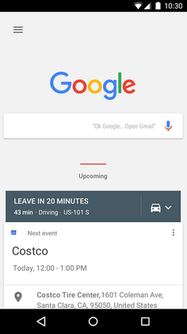

Google Now 卡片。

Material Design 背后的整个理念是建立在基于网格的系统、动画和过渡的响应性基础上，同时增加设计的深度。Material Design 的首席设计师 Matias Duarte 这样说：

“与真实的纸张不同，我们的数字材料可以智能地扩展和重塑。材料具有物理表面和边缘。接缝和阴影提供了关于您可以触摸的内容的含义。”

Material Design 是一套非常精确和完整的规范，可以在这里找到：[`material.google.com/`](https://material.google.com/)。

任何对 CSS3 和 HTML5 有扎实知识的人都可以阅读文档并实现每个组件。然而，这将需要大量的时间和精力。幸运的是，我们不必等那么久。事实上，一组才华横溢的开发人员组成并为 Angular 创建了一个 Material Design 组件。在撰写本文时，这仍处于测试阶段，这意味着一些组件尚未实现或未完全实现。然而，我很少发现自己因为某个组件不存在或不起作用而被困住，以至于不得不改变整个设计。

在本章中，我们将学习如何安装 Material Design 的 Angular 组件，然后使用一些最受欢迎的组件。我们还将看一下材料图标。更详细地说，我们将看到：

+   如何为 Angular 安装 Material Design

+   响应式布局的处理方式

+   材料图标

+   按钮

+   菜单

+   工具栏

+   对话框

+   创建自己的主题

# 安装包

首先，我们需要安装 Angular Material Design 包。使用 Angular CLI 相对简单：

```ts
ng new chap10
cd chap10
npm install --save @angular/material 
npm install --save @angular/animations
npm install --save hammerjs 

```

我们在这里安装了两个包，`@angular/material`和`hammerjs`包。第一个包包括了我们的应用程序中将在下一节中使用的 Material Design 模块。然而，第二个包是触摸移动的 JavaScript 实现。一些 Material Design 组件，如`slider`，依赖于`hammerjs`。

然后，根据`NgModule`规范，我们可以导入`MaterialModule`如下：

```ts
//src/app/app.module.ts

import { MaterialModule } from '@angular/material';
import { BrowserModule } from '@angular/platform-browser';
import { NgModule } from '@angular/core';
import { FormsModule, ReactiveFormsModule } from '@angular/forms';
import { HttpModule } from '@angular/http';

import { AppComponent } from './app.component';

@NgModule({
 declarations: [
   AppComponent
 ],
 imports: [
   BrowserModule,
   FormsModule,
   HttpModule,
   ReactiveFormsModule,
   NgbModule.forRoot(),
   MaterialModule.forRoot()
 ],
 providers: [],
 bootstrap: [AppComponent]
})
export class AppModule { } 

```

接下来，我们需要选择一个主题。主题是将应用于 Angular Material 组件的一组颜色。在一个主题中，您有以下颜色：

+   主要调色板包括在所有屏幕和组件上最广泛使用的颜色

+   强调调色板包括用于浮动操作按钮和交互元素的颜色。

+   警告调色板包括用于传达错误状态的颜色

+   前景调色板包括文本和图标的颜色

+   背景调色板包括用于元素背景的颜色

幸运的是，有默认主题（谷歌在大多数服务中使用的主题），我们可以直接使用。为此，请将以下行添加到您的`/src/styles.css`文件中：

```ts
@import '~@angular/material/core/theming/prebuilt/deeppurple-
     amber.css'; 

```

在这里，我们使用深紫色主题，这是可用的默认主题之一。您可以在这里看到所有默认主题：`node_modules/@angular/material/core/theming/prebuilt`。

此外，就是这样！您可以运行`ng serve`来重新编译您的项目，并确认一切都按计划进行。不出所料，目前没有太多要展示的。这是在运行`ng serve`后拍摄的屏幕截图：

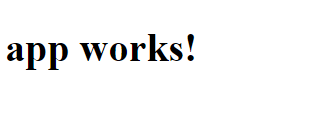应用程序运行正常！

# 响应式布局

Material Designs 的一个重要部分是响应式布局，可以适应任何可能的屏幕尺寸。为了实现这一点，我们使用断点宽度：480、600、840、960、1280、1440 和 1600 dp，如以下表格所定义：[`material.io/guidelines/layout/responsive-ui.html#responsive-ui-breakpoints`](https://material.io/guidelines/layout/responsive-ui.html#responsive-ui-breakpoints)：

| **断点（dp）** | **手机/平板竖屏** | **手机/平板横屏** | **窗口** | **列** | **间距** |
| --- | --- | --- | --- | --- | --- |
| 0 | 小手机 |  | 超小 | 4 | 16 |
| 360 | 中等手机 |  | 超小 | 4 | 16 |
| 400 | 大手机 |  | 超小 | 4 | 16 |
| 480 | 大手机 | 小手机 | 超小 | 4 | 16 |
| 600 | 小平板 | 中等手机 | 小 | 8 | 16/24 |
| 720 | 大平板 | 大手机 | 小 | 8 | 16/24 |
| 840 | 大平板 | 大手机 | 小 | 12 | 16/24 |
| 960 |  | 小平板 | 小 | 12 | 24 |
| 1024 |  | 大平板 | 中等 | 12 | 24 |
| 1280 |  | 大平板 | 中等 | 12 | 24 |
| 1440 |  |  | 大 | 12 | 24 |
| 1600 |  |  | 大 | 12 | 24 |
| 1920 |  |  | 超大 | 12 | 24 |

请注意，本章中我们将使用的所有 Material Design 指令已经实现了这些断点。然而，如果您开始主题化（请参阅本章的最后一节）或实现自定义指令，您必须牢记它们。CSS 断点相当容易定义，但可能是繁琐的工作：

```ts
@media (min-width: 600dp) {
 .class {
   content: 'Whoa.';
 }
} 

```

现在，前表的前四列相当不言自明，我们有 dp 中的断点，手持设备/平板电脑纵向，手持设备/平板电脑横向和窗口。然而，最后两个需要一些解释。列栏指示每个 dp 大小均等分屏幕的列数。

间距是每个列之间的空间。这是一个 12 列网格布局：

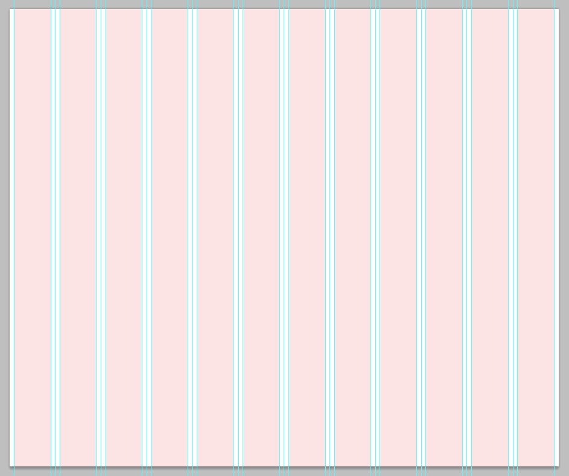列（粉色）和间距（蓝色）。

要使用网格系统，您可以将`md-columns`附加到任何给定标签的类中。例如，`<button class="md-2">`创建一个宽度为两列的按钮。

要查看您的网站在不同尺寸下的效果，您可以使用 Google Chrome 开发者工具（*F12*然后*CTRL* + *Shift* + *M*）或[`material.io/resizer/`](http://material.io/resizer/)。请注意，如果您尝试分析的网站将*X-Frame-Options*设置为*DENY*，[`material.io`](http://material.io)将会静默失败。

# 材料图标

让我们从材料图标开始我们的 Material Design 之旅。材料图标是图标字体，已经创建为在任何分辨率和设备（Web、Android 和 iOS 都得到了官方支持）上工作。

图标传达特殊含义，开发人员倾向于使用相同的图标来传达相同的事物。因此，用户更容易在您的应用程序中找到他们的方式。

有数百个图标可供您使用，每天都会添加新的图标。

以下是一些示例：

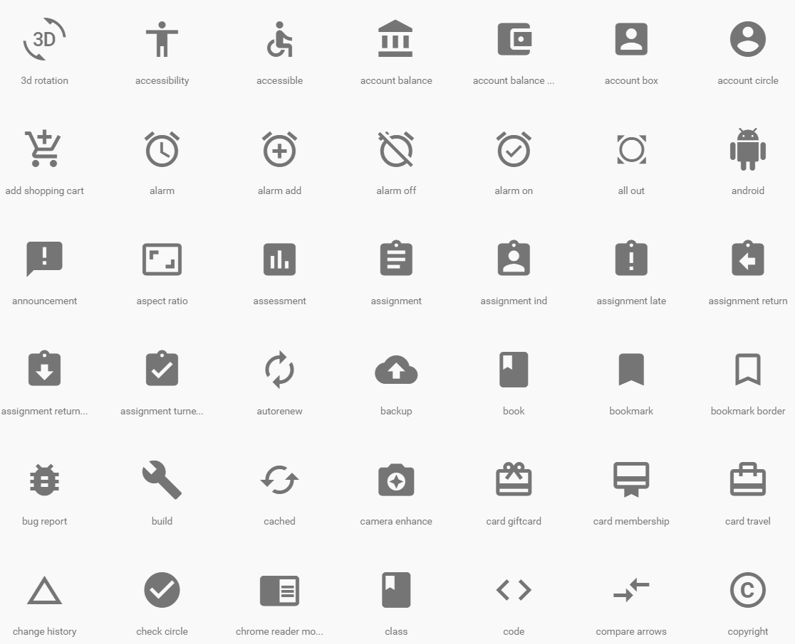折叠图标。

您可以在[`material.io/icons/`](https://material.io/icons/)上看到所有图标。

由于材料图标是 Material Design 的可选部分（也就是说，您可以使用 Material Design 设计应用程序，例如，使用字体 awesome 图标甚至自定义图标），因此还有另一行代码需要添加到您的代码中。在您的`src/index.html`文件中，在`head`部分中添加以下内容：

```ts
<link href="https://fonts.googleapis.com/icon?family=Material+Icons" 
    rel="stylesheet"> 

```

最终的`src/index.html`将如下所示：

```ts
<!doctype html>
<html>
<head>
 <meta charset="utf-8">
 <title>Chap10</title>
 <base href="/">

 <meta name="viewport" content="width=device-width, initial-scale=1">
 <link rel="icon" type="image/x-icon" href="favicon.ico">
 <link href="https://fonts.googleapis.com/icon?family=Material+Icons" 
    rel="stylesheet">
</head>
<body>
 <app-root>Loading...</app-root>
</body>
</html> 

```

现在，为了查看导入是否成功，我们将在自动生成的应用组件中添加一个图标。在 `src/app/app.component.html` 中，添加以下内容 `<i class="material-icons">cast_connected</i>`，使其看起来像这样：

```ts
<h1>
 {{title}}

 <i class="material-icons">cast_connected</i>
</h1> 

```

您的浏览器应该刷新 `http://localhost:4200/` 页面并显示 `cast_connected` 图标：

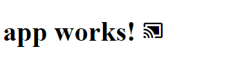Cast connected 图标。

正如您所看到的，使用 Material 图标非常简单。第一步是在[`material.io/icons/`](https://material.io/icons/)上识别您想要使用的一个图标的名称，然后创建一个带有 `class="material-icons"` 属性的 `<i></i>` 标签，最后包含您想要的图标名称。以下是一些例子：

+   `<i class="material-icons">cast_connected</i>`

+   `<i class="material-icons">gamepad</i>`

+   `<i class="material-icons">dock</i>`

+   `<i class="material-icons">mouse</i>`

# 按钮

除了图标之外，与 Material Design 一起使用的最简单的指令之一是按钮指令。我们可以有一个扁平的、凸起的、圆形的按钮，并且有三种不同的预设颜色：primary、accent 和 warn。以下是一个包含模板的组件，尝试一些可能的组合：

```ts

 @Component({
  selector: 'buttons',
  template: `
    <button md-button>FLAT</button>
    <button md-raised-button>RAISED</button> 
    <button md-fab>
        <md-icon>add</md-icon>
    </button>
    <button md-mini-fab>
        <md-icon>add</md-icon>
    </button>
    <button md-raised-button color="primary">PRIMARY</button>
    <button md-raised-button color="accent">ACCENT</button>
    <button md-raised-button color="warn">WARN</button>
  `
 })
 export class ButtonsComponent {
  constructor() { }
 }

```

结果如下所示：

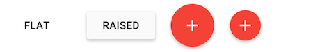

接下来是：

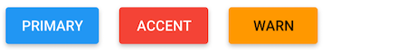

Primary、Accent 和 Warn 颜色要么在您的 `style.scss` 中定义为 SCCS 变量，要么在默认的 Material Design 主题中定义，如果您没有覆盖它们。

# 菜单

在这一部分，我们将对“菜单”指令感兴趣。以下组件创建了一个包含四个元素的菜单。第四个元素被禁用（也就是说，我们无法点击它）：

```ts
@Component({
 selector: 'menu',
 template: `
 <md-menu>
     <button md-menu-item> Refresh </button>
     <button md-menu-item> Settings </button>
     <button md-menu-item> Help </button>
     <button md-menu-item disabled> Sign Out </button>
 </md-menu>
 `
})
export class MenuComponent {
 constructor() { }
} 

```

当菜单关闭时，它看起来是这样的：

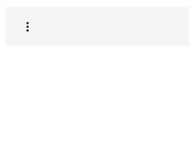菜单关闭。

并且在用户点击后打开的版本显示在以下截图中：

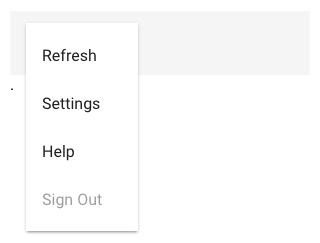菜单已打开。

# 工具栏

Angular Material Design 的工具栏组件应该按以下方式使用：

```ts
<md-toolbar>
 One good looking toolbar
</md-toolbar> 

```

这将产生以下结果：

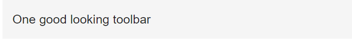基本工具栏。

此外，您可以使用 Angular 的 `[color]="primary" | "accent" | "warn"` 属性。此外，工具栏可以通过使用 `<md-toolbar-row>` 标记包含行。

```ts
<md-toolbar [color]="accent">
  One good looking toolbar
</md-toolbar>
<md-toolbar [color]="warn">
  <span>First Row</span>

  <md-toolbar-row>
    <span>Second Row</span>
  </md-toolbar-row>

  <md-toolbar-row>
    <span>Third Row</span>
  </md-toolbar-row>
</md-toolbar>
<md-toolbar [color]="primary">
  Another good looking toolbar
</md-toolbar> 

```

以下将产生三个不同的工具栏，相互叠放。第二个工具栏将由三行组成。

# 对话框

根据谷歌的定义：<q>对话框通知用户特定任务的信息，可能包含关键信息，需要决策，或涉及多个任务</q>。在 Angular 中使用对话框时，有以下方法：

+   `open(component: ComponentType<T>, config: MdDialogConfig): MdDialogRef<T>`，创建并打开一个新的对话框，供用户进行交互

+   `closeAll()`: 用于关闭对话框的 void

然后，对话框本身可以使用四个不同的指令：

+   `md-dialog-title`将包含对话框的标题，如下所示：`<md-dialog-title>我的对话框标题</md-dialog-title>`。

+   `md-dialog-content`包含对话框的内容。

例如：`<md-dialog-content>我的对话框内容</md-dialog-title>`。

+   `md-dialog-close`要添加到按钮中（`<button md-dialog-close>关闭</button>`）。它使按钮关闭对话框本身。

+   `md-dialog-actions`用于设置对话框的不同操作，即关闭、放弃、同意等。

在下面的示例中，我们首先有一个草稿组件。草稿组件有一个简单的模板，只包含一个按钮。按钮的`click`事件调用`openDialog`方法。对于组件本身的定义，我们有一个接收名为`dialog`的`MdDialog`的构造函数。`openDialog`方法有两个回调--一个用于实际打开对话框，另一个用于在对话框关闭时打印包含在`result:`字符串中的`result`变量：

```ts
@Component({
 selector: 'draft-component',
 template: `
 <button type="button" (click)="openDialog()">Open dialog</button>
 `
})
export class DraftComponent {

 dialogRef: MdDialogRef<DraftDialog>;

 constructor(public dialog: MdDialog) { }

 openDialog() {
   this.dialogRef = this.dialog.open(DraftDialog, {
     disableClose: false
   });

   this.dialogRef.afterClosed().subscribe(result => {
     console.log('result: ' + result);
     this.dialogRef = null;
   });
 }
} 

```

正如您所看到的，`DraftComponent`组件的`dialogRef`属性是通用的。更具体地说，它是`DraftDialog`类的通用实例。让我们来定义它：

```ts
@Component({
 selector: 'draft-dialog',
 template: `
 <md-dialog-content>
   Discard Draft?
 </md-dialog-content>
 <md-dialog-actions>
   <button (click)="dialogRef.close('can
cel')">Cancel</button>
   <button md-dialog-close>Discard</button>
 </md-dialog-actions>
 `
})
export class DraftDialog {
 constructor(public dialogRef: MdDialogRef<DraftDialog>) { }
} 

```

再次强调，这是一个简单的类。在这里，我们可以看到模板包含了四个可能的指令中的三个。的确，我使用了`<md-dialog-content>`来定义要显示的对话框内容，`<md-dialog-actions>`来为对话框的操作按钮提供专用空间，最后，使用`md-dialog-close`来使“放弃”按钮关闭我的对话框。组件本身只有一个构造函数，定义了`public`属性：`MdDialogRef<DraftDialog>`。

使用此对话框的最后一步是在我们的`NgModule`中引用它，就像这样：

```ts
@NgModule({
 declarations: [
   ...,
   DraftDialog
 ],
 entryComponents: [
   ...,
   DraftDialog
 ],
 ...
})
export class AppModule { } 

```

当我们按下按钮时，这是对话框的图像：

草稿对话框。

# 侧边导航抽屉

侧边导航抽屉在移动设备上非常受欢迎。然而，它们开始出现在完整版本的网站中；因此它们在本章中有所涉及。

侧边导航抽屉可以是这样的：

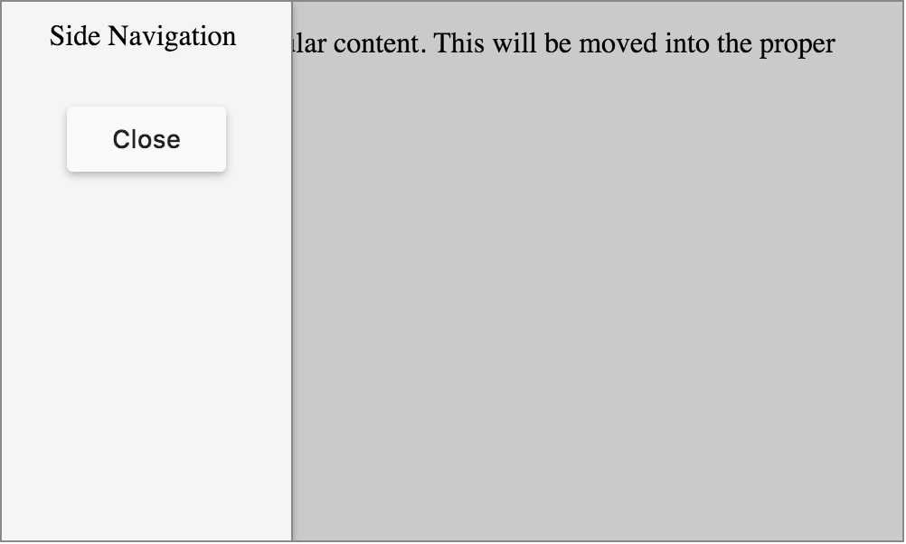侧边导航抽屉。

在左侧的浅灰色中，我们有导航抽屉，在调用时会弹出我们的内容。在较深的灰色中，我们有页面的内容。

使用以下组件，我们可以重现本节开头显示的侧边导航：

```ts
@Component({
 selector: 'sidenav',
 template: `
   <md-sidenav-container>
   <md-sidenav #side (open)="closeButton.focus()">
      Side Navigation.
     <br>
     <button md-button #closeButton      
         (click)="side.close()">Close</button>
   </md-sidenav>

   My regular content. This will be moved into the proper DOM at 
       runtime.
   <button md-button (click)="side.open()">Open side sidenav</button>

 </md-sidenav-container>
 `
})
export class SideNavComponent {
 constructor() { }
} 

```

这里唯一有趣的是模板。让我们来分解一下。首先，我们有封闭的`<md-sidenav-container>`标签，它允许我们为内容定义两个单独的区域。这两个区域分别是`md-sidenav`和我们页面的实际内容。虽然`md-sidenav`标签清楚地定义了内容的`sidenav`部分，但我们页面的其余内容（即实际页面）没有被包含在任何特殊的标签中。页面内容只需在`md-sidenav`定义之外。我们使用`#side`属性引用`md-sidenav`块。作为提醒，向任何 Angular 指令添加`#myName`会给你一个引用，以便在模板的其余部分中访问它。`md-sidenav`有一个打开方法，将焦点放在其内部定义的`#closeButton`上。这个按钮有一个`click`方法，调用`#side`的`close`方法。最后，在页面内容中，我们有一个按钮，当点击时调用`#side.open`。除了这两个方法（`open`和`close`），`md-sidenav`指令还有一个`toggle`方法，用于切换`sidenav`（即`opened = !opened`）。

# 主题化

现在，我们可以描述 Angular Material Design 中每个可用组件。然而，它们有很多，它们的用途都不复杂。在我撰写本章时，以下是支持的指令列表：

+   按钮

+   卡片

+   复选框

+   单选按钮

+   输入

+   侧边栏

+   工具栏

+   列表

+   网格

+   图标

+   进度

+   选项卡

+   滑动

+   滑块

+   菜单

+   工具提示

+   涟漪

+   对话框

+   消息框

在接下来的几个月里，将会添加更多的指令。你可以在这里找到它们：[`github.com/angular/material2`](https://github.com/angular/material2)。

不用说，我们在指令方面已经覆盖了。尽管有如此广泛的可能性，我们可以通过创建自定义主题进一步定制 Angular 的 Material Design。在 Angular Material 中，主题是通过组合多个调色板创建的。特别是，主题包括：

+   主要调色板由在所有屏幕和组件上广泛使用的颜色组成

+   强调调色板由用于浮动操作按钮和交互元素的颜色组成

+   警告调色板由用于传达错误状态的颜色组成

+   前景调色板由用于文本和图标的颜色组成

+   背景调色板由用于元素背景的颜色组成

以下是一个自定义主题的示例：

```ts
//src/styles.scss

@import '~https://fonts.googleapis.com/icon?family=Material+Icons';
@import '~@angular/material/core/theming/all-theme';
// Plus imports for other components in your app.

// Include the base styles for Angular Material core. We include this here so that you only
// have to load a single css file for Angular Material in your app.
@include md-core();

// Define the palettes for your theme using the Material Design 
   palettes available in palette.scss
// (imported above). For each palette, you can optionally specify a 
  default, lighter, and darker
// hue.
  $candy-app-primary: md-palette($md-indigo);
  $candy-app-accent:  md-palette($md-pink, A200, A100, A400);

// The warn palette is optional (defaults to red).
   $candy-app-warn:    md-palette($md-red);

// Create the theme object (a Sass map containing all of the palettes).
  $candy-app-theme: md-light-theme($candy-app-primary, $candy-app-  
   accent, $candy-app-warn);

// Include theme styles for core and each component used in your app.
// Alternatively, you can import and @include the theme mixins for each 
   component
// that you are using.
@include angular-material-theme($candy-app-theme); 

```

因此，我们已经学会了为 Material Design 创建自定义主题。

# 总结

在本章中，我们通过使用 Angular/Material2 模块了解了 Material Design 和响应式设计。我们看到了一些最常用的指令，如`buttons`、`icons`、`dialogs`或`sidenav`。此外，我们还利用了 Angular/Material2 的主题能力来定制 Material Design。

在第十五章中，*将 Bootstrap 与 Angular 应用程序集成*，我们将看到如何通过使用 Bootstrap（由 Twitter 提供）而不是 Material Design（由 Google 提供）来驱动我们的 Angular2 应用程序的设计。
