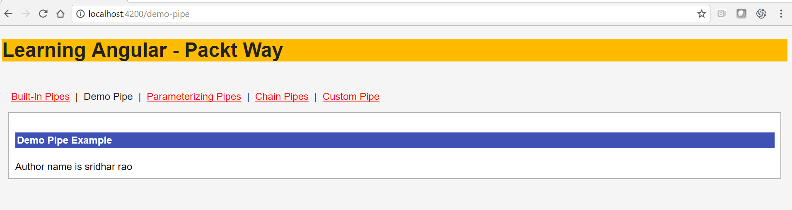
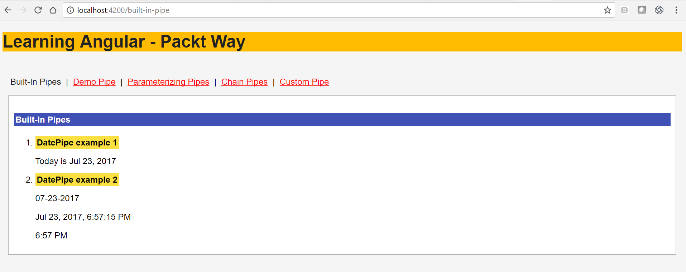
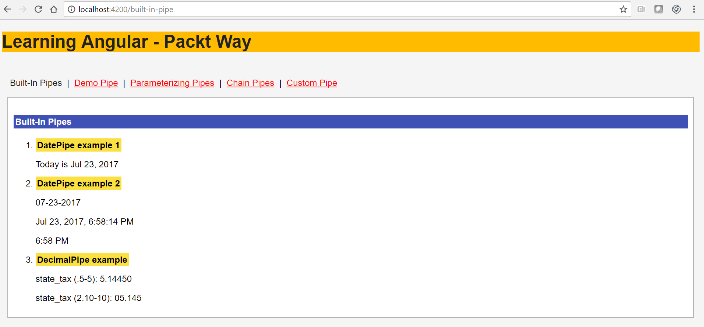
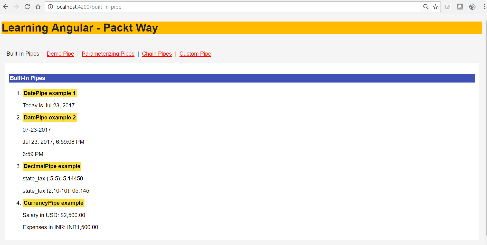
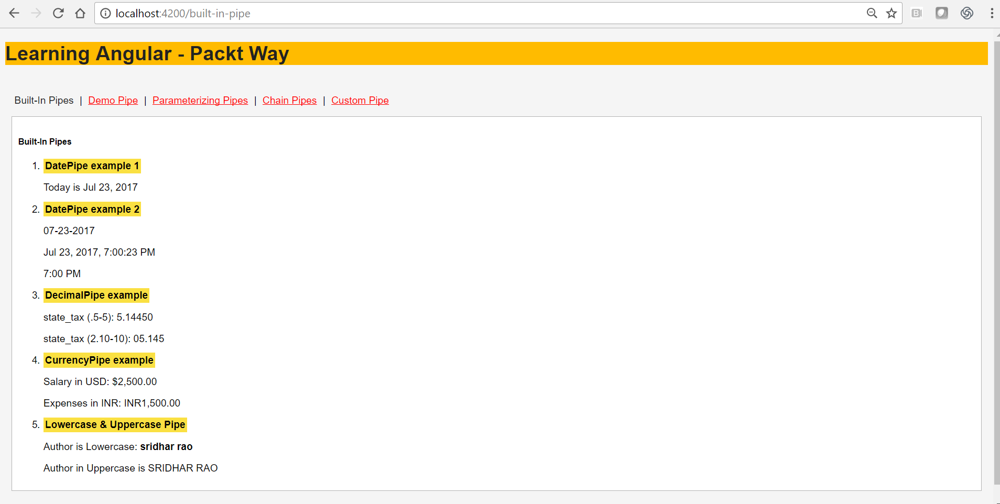
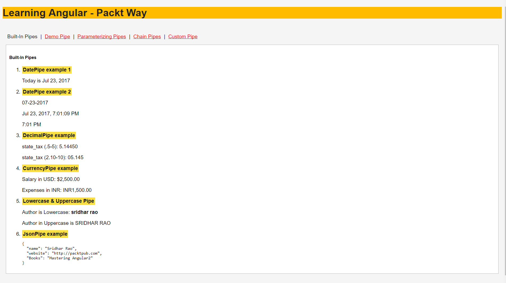
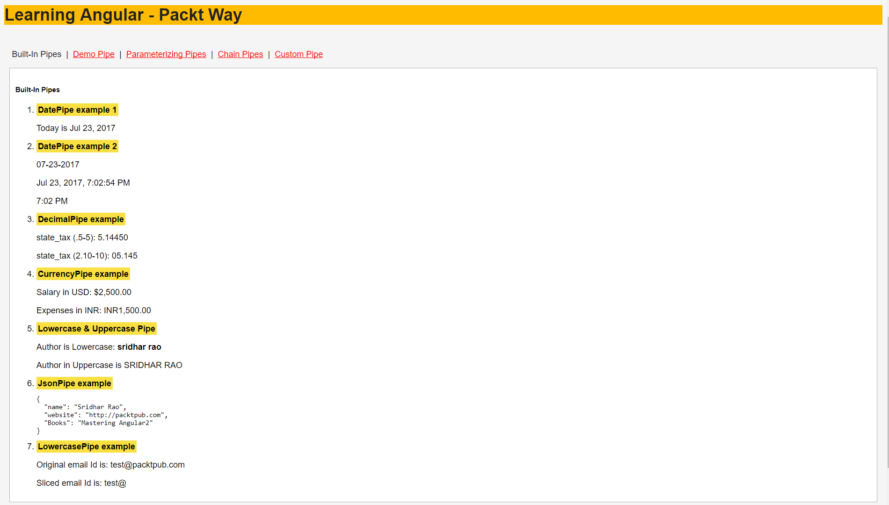
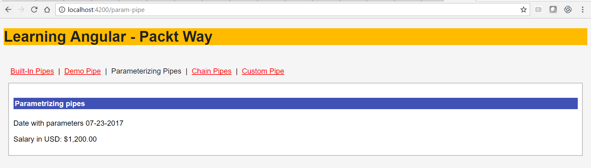
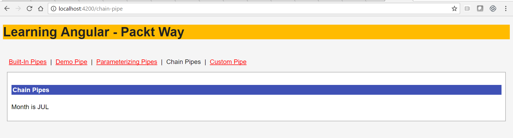
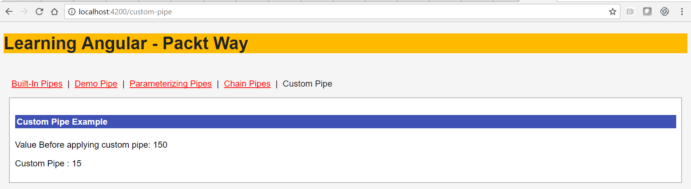

# 第十章：实现 Angular 管道

在本章中，您将学习关于 Angular 管道。将 Angular 管道视为过滤器的现代化版本，包括帮助我们在模板中格式化值的函数。Angular 中的管道基本上是 Angular v1 中过滤器的扩展。我们可以在模板中轻松使用许多有用的内置管道。您将学习内置管道，我们还将创建自定义用户定义的管道。

在本章结束时，您将学习并实现以下内容：

+   介绍 Angular 管道

+   定义和实现管道

+   了解各种内置管道

+   DatePipe

+   DecimalPipe

+   CurrencyPipe

+   LowerCasePipe 和 UpperCasePipe

+   JSON 管道

+   SlicePipe

+   async 管道

+   学习实现自定义用户定义的管道

+   为管道参数化

+   链接管道

+   了解纯管道和不纯管道

# Angular 管道-概述

管道允许我们在模板视图中显示值之前格式化值。例如，在大多数现代应用程序中，我们希望显示诸如今天、明天等术语，而不是系统日期格式，例如 2017 年 4 月 13 日 08:00。让我们看看更多现实世界的场景。

您希望应用程序中的提示文本始终为小写吗？没问题；定义并使用`LowercasePipe`。在天气应用程序中，如果您希望显示月份名称为 MAR 或 APR 而不是其全名，请使用`DatePipe`。

很酷，对吧？你明白了。管道帮助您添加业务规则，因此您可以在模板中实际显示数据之前转换数据。

与 Angular 1.x 过滤器建立联系的一个好方法是通过 Angular 管道，但管道不仅仅是过滤。

我们已经使用了 Angular 路由器来定义路由路径，因此我们在一个页面中拥有所有管道的功能；您可以在相同或不同的应用程序中创建它。随意发挥您的创造力。

在 Angular 1.x 中，我们有过滤器--管道是过滤器的替代品。

在下一节中，您将学习如何定义和使用 Angular 管道。

# 定义管道

管道运算符用管道符号（`|`）定义，后跟管道的名称：

```ts
{{ appvalue  | pipename }}

```

以下是一个简单的`lowercase`管道的示例：

```ts
{{"Sridhar Rao"  |  lowercase}} 

```

在上述代码中，我们使用`lowercase`管道将文本转换为小写。

现在，让我们编写一个使用`lowercase`管道示例的示例`Component`：

```ts
@Component({
 selector: 'demo-pipe',
 template: `
 Author name is {{authorName | lowercase}}
 `
})
export class DemoPipeComponent {
 authorName = 'Sridhar Rao';
}

```

让我们详细分析上述代码：

+   我们定义了一个`DemoPipeComponent`组件类

+   我们创建了一个字符串变量`authorName`，并赋予了值`'Sridhar Rao'`

+   在模板视图中，我们显示了`authorName`；然而，在将其打印到 UI 之前，我们使用了`lowercase`管道进行转换

运行上述代码，您应该看到以下输出：



干得好！在前面的例子中，我们使用了内置管道。在接下来的部分，您将学习更多关于内置管道，并创建一些自定义管道。

请注意，管道运算符仅在模板中起作用，而不在控制器内部。

# 内置管道

Angular 管道是 Angular 1.x 过滤器的现代化版本。Angular 带有许多预定义的内置管道。我们可以直接在视图中使用它们，并在运行时转换数据。

以下是 Angular 内置支持的所有管道的列表：

+   DatePipe

+   DecimalPipe

+   CurrencyPipe

+   LowercasePipe 和 UppercasePipe

+   JSON 管道

+   SlicePipe

+   异步管道

在接下来的部分，让我们实现并学习更多关于各种管道，并看到它们的实际应用。

# DatePipe

DatePipe，顾名思义，允许我们格式化或转换与日期相关的值。DatePipe 也可以根据运行时传递的参数以不同格式转换值。

一般语法如下代码片段所示：

```ts
{{today | date}} // prints today's date and time
{{ today | date:'MM-dd-yyyy' }} //prints only Month days and year
{{ today | date:'medium' }} 
{{ today | date:'shortTime' }} // prints short format

```

让我们详细分析前面的代码片段：

+   如前一节所述，一般语法是变量后跟着一个（`|`）管道运算符，然后是管道运算符的名称

+   我们使用 DatePipe 来转换`today`变量

+   此外，在前面的例子中，您会注意到我们向管道运算符传递了一些参数；我们将在下一节中介绍向管道传递参数

现在，让我们创建一个完整的`DatePipe`组件示例；以下是实现`DatePipe`组件的代码片段：

```ts
import { Component } from '@angular/core';

@Component({
 template: `
 <h5>Built-In Pipes</h5>
 <ol>
 <li>
 <strong class="packtHeading">DatePipe example 1</strong>
 <p>Today is {{today | date}}
 </li>
 <li>
 <strong class="packtHeading">DatePipe example 2</strong>
 <p>{{ today | date:'MM-dd-yyyy' }} 
 <p>{{ today | date:'medium' }}
 <p>{{ today | date:'shortTime' }} 
 </li>
 </ol>
 `,
})
export class PipeComponent {
 today = new Date();
}

```

让我们详细分析前面的代码片段：

1.  我们创建了一个`PipeComponent`组件类。

1.  我们定义了一个`today`变量。

1.  在视图中，我们根据不同的参数将变量的值转换为各种表达式。

现在运行应用程序，我们应该看到以下输出：



您在本节中学习了`DatePipe`。在接下来的部分，您将继续学习和实现其他内置管道，并创建一些自定义用户定义的管道。

# DecimalPipe

在本节中，您将了解另一个内置管道--DecimalPipe。

DecimalPipe 允许我们根据区域规则格式化数字。 DecimalPipe 也可以用于以不同格式转换数字。

一般的语法如下：

```ts
appExpression | number [:digitInfo]

```

在上述代码片段中，我们使用了数字管道，可以选择性地传递参数。

让我们看看如何创建一个实现小数点的`DatePipe`，以下是相同的示例代码：

```ts
import { Component } from '@angular/core';
@Component({
 template: `
  <h5>Built-In Pipes</h5>
 <ol>
<li>
<strong class="packtHeading">DecimalPipe example</strong>
 <p>state_tax (.5-5): {{state_tax | number:'.5-5'}}</p>
 <p>state_tax (2.10-10): {{state_tax | number:'2.3-3'}}</p>
 </li>
 </ol>
 `,
})
export class PipeComponent {
 state_tax: number = 5.1445;
}

```

让我们详细分析上述代码片段：

1.  我们定义了一个组件类，即`PipeComponent`。

1.  我们定义了一个`state_tax`变量。

1.  然后我们在视图中转换了`state_tax`。

1.  第一个管道操作符告诉表达式将小数打印到小数点后五位。

1.  第二个管道操作符告诉表达式将值打印到小数点后三位。

上述管道组件示例的输出如下：



毫无疑问，数字管道是各种应用程序中最有用和常用的管道之一。我们可以转换数字值，特别是处理小数和浮点数。

# CurrencyPipe

对于希望迎合多国地理位置的应用程序，我们需要显示特定国家的代码及其相应的货币值--这就是`CurrencyPipe`派上用场的地方。

`CurrencyPipe`操作符用于在数字值前附加`国家`代码或`货币`符号。

看一下实现`CurrencyPipe`操作符的代码片段：

```ts
{{ value | currency:'USD' }}

Expenses in INR: {{ expenses | currency:'INR' }}

```

让我们详细分析上述代码片段：

1.  第一行代码显示了编写`CurrencyPipe`的一般语法。

1.  第二行显示了货币的语法，我们用它来转换`expenses`的值，并在其后附加了印度货币符号。

现在我们知道如何使用`CurrencyPipe`操作符，让我们组合一个示例来显示多种`货币`和`国家`格式；以下是实现`CurrencyPipe`操作符的完整组件类：

```ts
import { Component } from '@angular/core';

@Component({
 selector: 'currency-pipe',
 template: `
 <h5>CurrencyPipe Example</h5>
 <ol>
 <li>
 <p>Salary in USD: {{ salary | currency:'USD':true }}</p>
 <p>Expenses in INR: {{ expenses | currency:'INR':false }}</p>
 </li>
 </ol>
 `
})
export class CurrencyPipeComponent {
 salary: number = 2500;
 expenses: number = 1500;
}

```

让我们详细分析上述代码：

1.  我们创建了一个组件类`CurrencyPipeComponent`，并声明了几个变量，即`salary`和`expenses`。

1.  在组件模板中，我们通过添加`国家`和`货币`详情来转换变量的显示。

1.  在第一个管道操作符中，我们使用了`'currency: USD'`，这将在变量之前附加（$）美元符号。

1.  在第二个管道操作符中，我们使用了`'currency : 'INR':false'`，这将添加货币代码，`false`将告诉它不要打印符号。

现在，启动应用程序，我们应该看到以下输出：



在本节中，我们讨论并实现了`CurrencyPipe`。在接下来的几节中，我们将继续探索和学习其他内置管道以及更多内容。

# LowerCasePipe 和 UpperCasePipe

LowerCasePipe 和 UpperCasePipe，顾名思义，分别用于将文本转换为小写和大写。

看一下以下代码片段：

```ts
Author is Lowercase {{authorName | lowercase }}
Author in Uppercase is {{authorName | uppercase }}

```

让我们详细分析前面的代码：

1.  第一行代码使用`lowercase`管道将`authorName`的值转换为小写。

1.  第二行代码使用`uppercase`管道将`authorName`的值转换为大写。

现在我们已经看到如何定义小写和大写管道，是时候创建一个完整的组件示例了，该示例实现了管道以显示作者姓名的小写和大写形式。

看一下以下代码片段：

```ts
import { Component } from '@angular/core';

@Component({
 selector: 'textcase-pipe',
 template: `
 <h5>Built-In LowercasPipe and UppercasePipe</h5>
 <ol>
 <li>
 <strong>LowercasePipe example</strong>
 <p>Author in lowercase is {{authorName | lowercase}}
 </li>
 <li>
 <strong>UpperCasePipe example</strong>
 <p>Author in uppercase is {{authorName | uppercase}}
 </li>
 </ol>
 `
})
export class TextCasePipeComponent {
 authorName = "Sridhar Rao";
}

```

让我们详细分析前面的代码：

1.  我们创建了一个组件类，`TextCasePipeComponent`，并定义了一个`authorName`变量。

1.  在组件视图中，我们使用了`lowercase`和`uppercase`管道。

1.  第一个管道将变量的值转换为小写文本。

1.  第二个管道将变量的值转换为大写文本。

运行应用程序，我们应该看到以下输出：



在本节中，您学会了如何使用`lowercase`和`uppercase`管道来转换值。

# JSON Pipe

类似于 Angular 1.x 中的 JSON 过滤器，我们有 JSON 管道，它可以帮助我们将字符串转换为 JSON 格式的字符串。

在小写或大写管道中，我们转换了字符串；使用 JSON 管道，我们可以将字符串转换并显示为 JSON 格式的字符串。

通用的语法如下代码片段所示：

```ts
<pre>{{ myObj | json }}</pre>

```

现在，让我们使用前面的语法并创建一个完整的`Component`示例，其中使用了 JSON Pipe：

```ts
import { Component } from '@angular/core';

@Component({ 
 template: `
 <h5>Author Page</h5>
 <pre>{{ authorObj | json }}</pre>
 `
})
export class JSONPipeComponent {
 authorObj: any; 
 constructor() {
 this.authorObj = {
 name: 'Sridhar Rao',
 website: 'http://packtpub.com',
 Books: 'Mastering Angular2'
 };
 }
}

```

让我们详细分析前面的代码：

1.  我们创建了一个组件类，`JSONPipeComponent`和`authorObj`，并将 JSON 字符串赋给了这个变量。

1.  在组件模板视图中，我们转换并显示了 JSON 字符串。

运行应用程序，我们应该看到以下输出：



JSON 很快就成为了 Web 应用程序之间集成服务和客户端技术的事实标准。因此，每当我们需要将值转换为视图中的 JSON 结构时，JSON 管道都非常方便。

# SlicePipe

SlicePipe 与数组切片 JavaScript 函数非常相似。Slice 管道从字符串中提取两个指定索引之间的字符，并返回新的子字符串。

定义 SlicePipe 的一般语法如下：

```ts
{{email_id | slice:0:4 }}

```

在前面的代码片段中，我们正在对电子邮件地址进行切片，以仅显示变量值`email_id`的前四个字符。

既然我们知道如何使用 SlicePipe，让我们在组件中将其放在一起。

以下是实现 SlicePipe 的完整代码片段：

```ts
import { Component } from '@angular/core';

@Component({
 selector: 'slice-pipe',
 template: `
 <h5>Built-In Slice Pipe</h5>
 <ol>
 <li>
 <strong>Original string</strong>
 <p> Email Id is {{ emailAddress }}
 </li>
 <li>
 <strong>SlicePipe example</strong>
 <p>Sliced Email Id is {{emailAddress | slice : 0: 4}}
 </li>
 </ol>
 `
})
export class SlicePipeComponent {
 emailAddress = "test@packtpub.com";
}

```

让我们详细分析前面的代码片段：

1.  我们创建了一个`SlicePipeComponent`类。

1.  我们定义了一个字符串变量`emailAddress`并为其赋值`test@packtpub.com`。

1.  然后，我们将 SlicePipe 应用于`{{emailAddress | slice : 0: 4}}`变量。

1.  我们从`0`位置开始获取子字符串，并从变量值`emailAddress`中获取`4`个字符。

运行应用程序，我们应该看到以下输出：



SlicePipe 肯定是一个非常有用的内置管道，特别是处理字符串或子字符串。

# 异步管道

异步管道允许我们直接将 promise 或 observable 映射到我们的模板视图中。为了更好地理解异步管道，让我先介绍一下 observable。

Observables 是 Angular 可注入的服务，可用于将数据流式传输到应用程序中的多个部分。在下面的代码片段中，我们使用`async`管道作为一个 promise 来解析返回的作者列表：

```ts
<ul id="author-list">
 <li *ngFor="let author of authors | async" >
 <!-- loop the object here -->
 </li>
</ul>

```

`async`管道现在订阅`Observable`（作者）并检索最后一个值。

让我们看一下如何使用`async`管道作为`Promise`和`Observable`的示例。

在我们的`app.component.ts`文件中添加以下代码行：

```ts
 getAuthorDetails(): Observable<Author[]> {
  return this.http.get(this.url).map((res: Response) => res.json());
 }

 getAuthorList(): Promise<Author[]> {
  return this.http.get(this.url).toPromise().then((res: Response) => 
   res.json());
 }

```

让我们详细分析前面的代码片段：

1.  我们创建了一个`getAuthorDetails`方法，并附加了一个相同的 observable。该方法将返回来自`url`的响应，这是一个 JSON 输出。

1.  在`getAuthorList`方法中，我们绑定了一个需要在通过`http`请求调用的`url`返回的输出中解析或拒绝的 promise。

在本节中，我们已经看到了`async`管道的工作原理。您会发现它与处理服务非常相似。我们可以映射一个 promise 或一个 observable，并将结果映射到模板上。

# 参数化管道

管道也可以带参数。我们可以在管道后面传递参数。参数在管道后用冒号符号（`:`）分隔：

```ts
{{appValue  |  Pipe1: parameter1: parameter2 }}

```

让我们快速构建一个简单的管道示例，看看它的运行情况。以下是带有`MM-dd-yyyy`参数的`DatePipe`的示例：

```ts
{{today | date:'MM-dd-yyyy' }} 

```

另一个带参数的管道示例如下：

```ts
{{salary | currency:'USD':true}}

```

让我们详细分析前面的代码片段：

1.  我们向`CurrencyPipe`传递了 USD 作为参数，这将告诉管道显示货币代码，例如美元的*USD*和欧元的*EUR*。

1.  `true`参数表示显示货币符号（$）。默认情况下，它设置为 false。

让我们通过组件的完整代码来看它们的运行情况：

```ts
import { Component } from '@angular/core';

@Component({
 template: `
 <h5>Parametrizing pipes</h5>

 <p>Date with parameters {{ today | date:'MM-dd-yyyy' }} 
 <p>Salary in USD: {{salary | currency:'USD':true}}</p>
 `,
})
export class ParamPipeComponent {
 today = new Date();
 salary: number = 1200;
}

```

在前面的代码片段中，我们创建了一个`ParamPipeComponent`类，并定义了`today`和`salary`变量。

在`Component`模板视图中，我们为`DatePipe`传递了`date:'MM-dd-yyyy'`参数，为`CurrencyPipe`传递了`currency:'USD' :true`参数。

以下是前面代码的输出：



在前面的示例中，我们传递了自定义参数，如`currency`和`date`格式，给管道，并相应地查看了输出。

在大多数应用用例中，我们需要向管道传递参数，以根据业务逻辑转换值。在本节中，我们重点介绍了通过传递值来对管道进行参数化。

到目前为止，我们一直在使用内置管道并向管道传递参数。

在接下来的章节中，您将学习如何链接管道、创建自定义管道，以及向自定义用户定义的管道传递参数。

# 链式管道

我们可以将多个管道链接在一起。这在我们需要关联多个需要应用的管道，并且最终输出将被所有应用的管道转换的情况下特别有帮助。

工作流或链将被触发，并依次应用管道。链管道语法的示例如下：

```ts
{{today | date | uppercase | slice:0:4}}

```

我们在前面的代码中应用了两个链式管道。首先，`DatePipe`应用于`today`变量，然后立即应用`uppercase`管道。以下是`ChainPipeComponent`的整个代码片段：

```ts
import {Component } from '@angular/core';

@Component({
 template: `
 <h5>Chain Pipes</h5>
 <p>Month is {{today | date | uppercase | slice:0:4}}
 `,
})
export class ChainPipeComponent {
 today = new Date();
}

```

我们使用了 slice 来仅显示月份的前四个字符。以下截图显示了前面组件的输出：



应用链式管道时需要记住的一些关键事项如下：

+   执行顺序是从左到右

+   管道是依次应用的。

在本节中，您了解了如何在我们的应用程序中将多个管道链接在一起。在下一节中，您将详细了解如何创建自己的自定义管道。

# 创建自定义管道

到目前为止，一切都很好。管道确实给我们留下了深刻的印象，但等等，我们还可以用管道做更棒的事情。内置管道，正如您所见，非常有限且少。我们当然需要创建自己的自定义管道，以满足我们应用程序的功能。

在本节中，您将学习如何为我们的应用程序创建自定义管道。

在这个例子中，我们将构建一个管道，它将是一个税收计算器。我们传递产品的价格，并使用管道功能自动计算并显示销售税。神奇，对吧？

要创建自定义管道，我们需要执行以下步骤：

1.  创建一个模板来应用到管道上（在我们的例子中，它是`updateTaxPipe`）。

1.  创建一个管道文件，即`update-tax.pipe.ts`。

1.  每个管道文件都必须从 Angular 核心中导入管道。

1.  定义管道元数据。

1.  创建`Component`类。它应该有`transform`函数，其中包含管道应该执行的业务逻辑。

在下面的代码片段中，我们正在定义一个名为`UpdateTaxPipe`的自定义管道，它将接受一个`percentage`参数，并进行销售税计算并在我们的模板中显示：

```ts
{{ productPrice | UpdateTaxPipe: percentage }}

```

让我们创建我们的`update-tax.pipe.ts`文件：

```ts
import { Pipe, PipeTransform } from '@angular/core';

@Pipe({
 name : "UpdateTaxPipe"
})

export class UpdateTaxPipe implements PipeTransform{
 transform(value:number, taxVal: number):number{
 return (value*taxVal)/100;
 }
}

```

让我们详细分析前面的代码片段：

1.  为了告诉 Angular 这是一个管道，我们应用了`@Pipe`装饰器，它是从核心 Angular 库中导入的。

1.  我们创建了一个自定义管道，名为`UpdateTaxPipe`，使用了`name`管道元数据。

1.  我们创建了一个`transform`方法，这对于管道是必需的，并在方法内定义了我们的业务逻辑和规则。

1.  我们向`transform`方法传递了两个参数，它返回了更新后的值。

无论我们是否包括接口 PipeTransform，Angular 都会寻找并执行`transform`方法。

运行应用程序，我们应该看到如下截图所示的输出：



在本节中，您学习了如何创建自定义管道。创建用户定义的管道非常简单和容易。自定义管道确实帮助我们轻松地集成应用程序的业务逻辑。

尝试创建自定义管道，可以适应一次编写，多次使用逻辑，也可以在许多组件视图中使用；例如，验证电话号码、地址等。

# 纯管道和非纯管道

管道还接受一个名为 Pure 的元数据。管道有两种状态：

+   纯管道

+   非纯管道

# 纯管道

纯管道只有在输入参数的值发生变化时才会执行。它不会记住或追踪任何先前的值或状态。Angular 内置管道都是`pure`管道。

到目前为止我们看到的所有管道示例都是纯管道。

# 非纯管道

无论值或参数是否改变，非纯管道都会在每次变更检测周期中调用。为了使用非纯管道，我们应该将管道修饰符`pure`设置为`false`。

默认情况下，所有管道修饰符的`pure`都设置为`true`。

将管道修饰符的值设置为`pure`将检查管道的输出，无论其值是否改变，都会保持更新管道提供的值。

定义非纯管道与创建任何自定义用户定义管道相同，唯一的区别在于在`@Pipe`修饰符中，我们将通过将值设置为`false`来明确指定管道为非纯的。

以下是通过将管道的值设置为 false 来定义非纯管道的语法：

```ts
import { Pipe, PipeTransform } from '@angular/core';

@Pipe({
  name: 'authorName'
  pure: false
})

```

在本节中，您了解了不同类型的 Angular 管道，即纯管道和非纯管道。只有在输入组件的值发生变化时才会调用纯管道。无论值是否改变，非纯管道都会在每次变更检测时调用。

# 摘要

在本章中，您了解了关于 Angular 管道的一切。Angular 管道在转换视图模板中的数据方面非常有用。Angular 管道是 Angular 1.x 中可用的过滤器的现代化版本。

我们可以在模板中轻松使用许多有用的内置管道操作符。在本章中，您了解了内置管道以及创建自定义用户定义管道。

在处理数字时，我们可以使用`DatePipe`、`DecimalPipe`和`CurrencyPipe`。在专门处理字符串时，我们可以始终使用`SlicePipe`、`LowercasePipe`和`UppercasePipe`。

当我们主要处理服务器端响应或进行异步调用并处理响应时，我们可以使用`JSONPipe`和`asyncPipe`。我们还涵盖了向管道传递参数，并根据应用程序的需要进行定制。

我们探讨了如何创建和实现自定义用户定义的管道，这些管道还可以接受参数，以根据我们应用程序的需求更好地定制它们。

所以继续，用管道转换你的视图。

在下一章中，您将学习如何实现 Angular 服务。您将学习有关服务和工厂的知识，创建 Angular 服务，使用服务从组件中访问数据以及创建异步服务。
