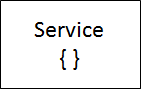
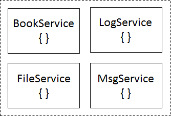

# 第十一章：实现 Angular 服务

服务在任何 Angular 应用程序中都扮演着重要的角色。我们可以通过充分利用 Angular 中的许多内置服务来设计我们自己的 Angular 服务。在本章中，我们将讨论如何做到这一点，以便您了解如何创建和管理 Angular 服务。

在本章中，我们将涵盖以下主题：

+   为什么要使用服务或工厂？

+   创建服务

+   使用服务从组件中访问数据

+   创建异步服务

# 为什么要使用服务或工厂？

我们已经讨论了单向数据绑定、双向数据绑定以及组件之间的数据共享。我们可能已经定义了非常清晰的视图并实现了整洁的组件，但是业务逻辑和数据获取/存储逻辑必须存在于某个地方。构建出色的 Angular 应用程序来自于充分利用内置服务。Angular 框架包括帮助您进行网络、缓存、日志记录、承诺等方面的服务。

编写我们自己的服务或工厂有助于实现代码的可重用性，并使我们能够在应用程序块（如组件、指令等）之间共享特定于应用程序的逻辑。将特定于应用程序的逻辑组织到服务或工厂中会导致更清晰、更明确定义的组件，并帮助您以更易维护的代码组织项目。

在 AngularJS 中，我们为此目的实现服务或工厂。服务是在运行时使用 new 关键字调用的，比如构造函数。以下代码片段显示了服务实现的 AngularJS 代码：

```ts
function MovieService($http) {   
  this.getMovieList = function   getMovieList() {   
    return $http.get('/api/movies');   
  };   
}   
angular.module('moviedb').service('MovieService',   MovieService);   

```

`MovieService`函数可以注入到任何需要从 API 获取电影列表的控制器中。

在 Angular 中，可以使用工厂来实现相同的功能，并具有额外的功能。工厂是处理创建对象的一种设计模式。我们可以从工厂返回新的类、函数或闭包。与服务类似，工厂也可以注入到控制器中。以下代码片段显示了工厂实现的 AngularJS 代码：

```ts
function MovieService($http) {   
  return {   
    getMovieList: function() {   
         return $http.get('/api/movies');   
    }   
  };   
}   
angular.module('moviedb').factory('MovieService',   MovieService);   

```

服务和工厂都可以注入到控制器中，并且可以调用`getMovieList`函数，如下所示：

```ts
function MovieController(MovieService   service) {   
  service.getMovieList().then(function   (response) {   
      // manage response   
    });   
}   
angular.module('moviedb').controller('MovieController',   
        MovieController);   

```

虽然工厂是灵活的，但服务是使迁移到 ES6 更容易的最佳选择。使用服务时，ES5 中的构造函数可以在迁移到 ES6 的过程中顺利替换为 ES6 类。我们可以将`MovieService`服务重写为 ES6 如下：

```ts
class MovieService {
 getMovieList() {
  return $http.get('/api/movies');
 }
}
app.service('MovieService', MovieService);

```

服务是用户定义的类，用于解决特定目的，并可以注入到组件中。Angular 建议在组件中只包含与视图相关的代码，以丰富 Angular 应用程序中的 UI/UX。组件是服务的消费者，它们作为应用程序数据的来源和业务逻辑的库。保持组件清晰并注入服务使我们能够针对模拟服务测试组件：



# 创建一个服务

应用程序特定或业务逻辑函数，如持久化应用程序数据、记录错误、文件存储等，应该委托给服务，组件应该消费相应的服务来处理适当的业务或应用程序特定逻辑：



让我们创建一个简单的名为`BookService`的服务，处理获取源中可用的书籍集合。源可以是从 Web API 服务返回的数据或 JSON 文件。

首先，让我们创建一个`Book`模型来持久化领域对象值。下面显示了`Book`类的代码片段：

```ts
export class Book { 
  id: number; 
  title: string; 
  author: string; 
  publisher: string; 
} 

```

前面的代码片段显示了一个`Book`的 TypeScript 类，其中包括`id`、`title`、`author`和`publisher`等属性。现在让我们创建一个名为`BookService`的服务，处理与`Book`相关的操作：

```ts
import { Injectable } from '@angular/core';
import {Book} from './book';
@Injectable()
export class BookService {
  getBooks() {
  var books: Book[] = [
    { "id": 1, "title": "ASP.NET Web API Security Essentials", author:   
         "Rajesh Gunasundaram", publisher: "Packt Publishing" },
    { "id": 2, "title": "Learning Angular for .Net Developers", author: 
         "Rajesh Gunasundaram", publisher: "Packt Publishing" },
    { "id": 3, "title": "Mastering Angular", author: "Rajesh 
         Gunasundaram", publisher: "Packt Publishing" },
   ];
  return books;
  }
}

```

在这里，我们首先导入了`Book`模型类。然后，我们定义了`BookService`类，其中包含一个`getBooks`方法，返回书籍的集合。

现在我们需要一个组件来注入`BookService`并消费。让我们创建一个`BookListComponent`，通过调用`BookService`的`getBooks`方法来检索书籍列表。以下代码片段显示了`BookListComponent`类：

```ts
import { Component, OnInit } from '@angular/core';
import { Book } from './book';
import { BookService } from './book.service';
@Component({
   selector: 'book-list',
   template: `
   <div *ngFor="let book of books">
   {{book.id}} - {{book.title}}<br/>
   Author: {{book.author}}<br/>
   Publication: {{book.publisher}} 
   </div>
    `,
   providers: [BookService]
  })
 export class BookListComponent implements OnInit {
   books: Array<Book>;
   constructor(private bookService: BookService) { }
   ngOnInit() {   
       this.books = this.bookService.getBooks();
      }
   }

```

在这里，我们首先从`@angular/core`中导入`Component`和`OnInit`，然后导入`Book`模型类和`BookService`类。然后我们用`@Component`属性对`BookListComponent`类进行了注释，以及选择器和模板等元数据信息。`BookListComponent`类定义了一个`Book`数组的`books`变量和一个构造函数，它被注入了`BookService`。请注意，`BookListComponent`实现了`OnInit`生命周期钩子，并且它通过使用注入到构造函数中的`BookService`实例来调用`BookService`类的`getBooks`方法。`getBooks`返回的书籍列表被赋给了`BookListComponent`类的`books`变量。

现在让我们创建一个根组件`AppComponent`。将`BookListComponent`作为指令传递，并将`BookService`作为提供者。以下是`AppComponent`的代码片段：

```ts
import { Component } from '@angular/core';   
import { BookService } from './book.service';   

@Component({   
  selector: 'my-books',   
  template: '   
    <h2>Book Library</h2>   
  <book-list></book-list>   
  '   
})   
export class AppComponent { }   

```

在这里，我们首先从`@angular/core`中导入`Component`，`BookListComponent`和`BookService`。然后我们用`@Component`属性对`AppComponent`进行了注释，以及选择器和模板等元数据。请注意，模板中有一个特殊的 HTML 标签`<book-list/>`。在某个地方，我们需要指示 Angular 初始化`BooklistComponent`并相应地渲染视图。我们还需要告诉 Angular，`AppComponent`是根组件，通过引导它来实现这一点。我们可以通过为我们的 Angular 应用程序创建一个`入口点`来实现这一点。

创建一个名为`AppModule`的类，并用`NgModule`进行注释（`app.module.ts`）。这指示 Angular 模块，这个类是应用程序的`入口点`。这里给出了`AppModule`的代码片段：

```ts
import { NgModule }          from '@angular/core';   
import { BrowserModule }  from '@angular/platform-browser';   
import { AppComponent }   from './app.component';   
import { BookListComponent }  from './book-list.component';   

@NgModule({   
  imports:        [ BrowserModule ],   
  declarations: [ AppComponent,   BooklistComponent ],   
  bootstrap:     [ AppComponent ]   
})   
export class AppModule { }   

```

在这里，我们首先从 Angular 核心中导入`NgModule`。然后我们从 Angular 平台浏览器中导入`BrowserModule`，因为我们的应用程序在 Web 浏览器上运行。然后我们导入应用程序组件，比如`AppComponent`，它是一个引导根组件，以及`BooklistComponent`，导入并添加到声明中。请注意，`AppModule`被装饰为`NgModule`，同时具有元数据，如导入、声明和引导。

现在让我们创建一个`index.html`页面，其中包含以下代码片段：

```ts
<!DOCTYPE html>   
<html>   
  <head>   
    <base href="/">   
    <title>Book   Library</title>   
    <meta charset="UTF-8">   
    <meta name="viewport"   content="width=device-width, initial-
          scale=1">   
  </head>   
  <body>   
    <h1>TodoList Angular app for   Packt Publishing...</h1>

```

```ts
    <my-books>Loading...</my-books>   
  </body>   
</html>   

```

在这里，我们没有引用任何必要的库来自`node_modules`，因为它们将由 Webpack 加载。Webpack 是一个用于捆绑资源并从服务器提供给浏览器的工具。Webpack 是 systemJS 的推荐替代方案。

# 使用服务从组件中访问数据

随着 Angular 应用程序的发展，我们不断引入更多的组件，这些组件将处理应用程序的核心数据。因此，我们可能会写重复的代码来访问数据。然而，我们可以通过引入可重用的数据服务来避免编写冗余的代码。需要数据的组件可以注入数据服务，并且可以用来访问数据。通过这种方式，我们可以重用逻辑，编写更少的代码，并在设计组件时有更多的分离。

我们将使用 Angular 的`HttpModule`，它作为一个`npm`包进行发布。为了在我们的应用程序中使用`HttpModule`，我们需要从`@Angular/http`导入`HttpModule`，并且 HTTP 服务应该被注入到控制器或应用程序服务的构造函数中。

# 实施服务

应用程序可以在组件之间共享数据。考虑一个电影数据库应用程序，其中`Movies`列表或单个`Movie`对象将在组件之间共享。我们需要一个服务来在任何组件请求时提供`Movies`列表或单个`Movie`对象。

首先，让我们使用 Angular CLI 创建一个电影服务。在命令提示符中执行以下命令以生成`movie.service`的样板代码：

```ts
e:\Explore\packt\MovieDB>ng generate   service Movie   
installing service   
  create src\app\movie.service.spec.ts   
  create src\app\movie.service.ts   

e:\Explore\packt\MovieDB>   

```

在这里，Angular CLI 创建了两个文件，即`movie.service.ts`和`movie.service.spec.ts`。生成的`movie.service.ts`的样板代码如下所示：

```ts
import { Injectable } from '@angular/core';   

@Injectable()   
export class MovieService {   

  constructor() { }   

}   

```

请注意，`MovieService`类被装饰为`@Injectable`属性，以便依赖注入来实例化并将此服务注入到任何需要它的组件中。我们通过从 Angular 核心导入它，使这个`Injectable`函数可用。

接下来，我们需要向生成的`MovieService`添加`getMovies`函数。将`getMovies()`函数引入到`MovieService`类中如下：

```ts
import { Injectable } from '@angular/core';   

@Injectable()   
export class MovieService {   

  constructor() { }   
  getMovies(): void {}   
}   

```

请注意，我们现在将返回类型设置为 void，但是当我们进行进一步实现时，我们需要进行更改。

我们需要引入一个领域模型，`Movie`，来表示整个应用程序中的电影。让我们使用 Angular CLI 生成`Movie`类的样板代码如下：

```ts
e:\Explore\packt\MovieDB>ng generate   class Movie   
installing class   
  create src\app\movie.spec.ts   
  create src\app\movie.ts   

e:\Explore\packt\MovieDB>   

```

在这里，这个命令创建了两个文件，分别是`movie.ts`和`movie.spec.ts`。实际上，在领域模式下，我们可能不会编写任何测试方法来断言它，所以你可以安全地删除`movie.spec.ts`。生成的`movie.ts`的代码片段如下所示：

```ts
export class Movie {   
}   

```

让我们添加一些属性来使其代表电影的特征。代码如下所示：

```ts
export class Movie {   

   public constructor(   
         private _movie_id:number,   
         private _title: string,   
         private _phase: string,   
         private _category_name: string,   
         private _release_year: number,   
         private _running_time: number,   
         private _rating_name: string,   
         private _disc_format_name:   string,   
         private _number_discs: number,   
         private _viewing_format_name:   string,   
         private _aspect_ratio_name:   string,   
         private _status: string,   
         private _release_date: string,   
         private _budget: number,   
         private _gross: number,   
         private _time_stamp:Date){   
   }   

   public toString = () : string => {   

         return `Movie (movie_id:   ${this._movie_id},   
         title: ${this._title},   
         phase: ${this._phase},   
         category_name:   ${this._category_name},   
         release_year:   ${this._release_year},   
         running_time: ${this._running_time},   
         rating_name:   ${this._rating_name},   
         disc_format_name:   ${this._disc_format_name},   
          number_discs:   ${this._number_discs},   
         viewing_format_name:   ${this._viewing_format_name},   
         aspect_ratio_name: ${this._aspect_ratio_name},   
         status: ${this._status},   
         release_date:   ${this._release_date},   
         budget: ${this._budget},   
         gross: ${this._gross},   
         time_stamp:   ${this._time_stamp})`;   

   }   
}   

```

我们已经准备好领域模型。现在让我们更新`MovieService`中`getMovies()`函数的返回类型如下：

```ts
getMovies(): Movie[] {   
    let movies: Movie[] = [   
          {   
               "movie_id" : 1,   
               "title" : "Iron   Man",   
               "phase" : "Phase   One: Avengers Assembled",   
               "category_name"   : "Action",   
               "release_year" :   2015,   
               "running_time" :   126,   
               "rating_name" : "PG-13",   
               "disc_format_name"   : "Blu-ray",   
               "number_discs" :   1,   
               "viewing_format_name"   : "Widescreen",   
               "aspect_ratio_name"   : " 2.35:1",   
               "status" : 1,   
               "release_date" :   "May 2, 2008",   
               "budget" : "140,000,000",   
               "gross" : "318,298,180",   
               "time_stamp" : "2015-05-03"   
         },   
          {   
               "movie_id" : 2,   
               "title" : "Spiderman",   
               "phase" : "Phase   One",   
               "category_name"   : "Action",   
               "release_year" :   2014,   
               "running_time" :   126,   
               "rating_name" : "PG-13",   
               "disc_format_name"   : "Blu-ray",   
               "number_discs" :   1,   
               "viewing_format_name"   : "Widescreen",   
               "aspect_ratio_name"   : " 2.35:1",   
               "status" : 1,   
               "release_date" :   "May 2, 2008",   
               "budget" : "140,000,000",   
               "gross" : "318,298,180",   
               "time_stamp" : "2015-05-03"   
         }   
        ];   
        return movies;   
  }   

```

`MovieService`的完整代码片段如下所示：

```ts
import { Injectable } from '@angular/core';   
import { Movie} from './movie';   

@Injectable()   
export class MovieService {   
  getMovies(): Movie[] {   
    let movies: Movie[] = [   
          {   
               "movie_id" : 1,   
               "title" : "Iron   Man",   
               "phase" : "Phase   One: Avengers Assembled",   
               "category_name"   : "Action",   
               "release_year" :   2015,   
               "running_time" :   126,   
               "rating_name" : "PG-13",   
               "disc_format_name"   : "Blu-ray",   
               "number_discs" :   1,   
               "viewing_format_name"   : "Widescreen",   
               "aspect_ratio_name"   : " 2.35:1",   
               "status" : 1,   
               "release_date" :   "May 2, 2008",   
               "budget" : "140,000,000",   
               "gross" : "318,298,180",   
               "time_stamp" : "2015-05-03"   
         },   
          {   
               "movie_id" : 2,   
               "title" : "Spiderman",   
               "phase" : "Phase   One",   
               "category_name"   : "Action",   
               "release_year" :   2014,   
               "running_time" :   126,   
               "rating_name" : "PG-13",   
               "disc_format_name"   : "Blu-ray",   
               "number_discs" :   1,   
               "viewing_format_name"   : "Widescreen",   
               "aspect_ratio_name"   : " 2.35:1",   
               "status" : 1,   
               "release_date" :   "May 2, 2008",   
               "budget" : "140,000,000",   
               "gross" : "318,298,180",   
               "time_stamp" : "2015-05-03"   
         }   
        ];   
        return movies;   
  }   
}   

```

在这里，`getMovies()`函数返回类型为`Movie[]`的电影集合。

# 消费服务

我们已经准备好消费`MovieService`。让我们在一个组件中消费它。使用 Angular CLI，我们将通过执行以下命令来创建一个组件：

```ts
e:\Explore\packt\MovieDB>ng generate   component movie   
installing component   
  create src\app\movie\movie.component.css   
  create   src\app\movie\movie.component.html   
  create   src\app\movie\movie.component.spec.ts   
  create src\app\movie\movie.component.ts   

e:\Explore\packt\MovieDB>   

```

这将创建四个文件，分别是`movie.component.ts`、`movie.component.html`、`movie.component.css`和`movie.component.spec.ts`。`movie.component.ts`文件的代码片段如下所示：

```ts
import { Component, OnInit } from '@angular/core';   

@Component({   
  selector: 'app-movie',   
  templateUrl: './movie.component.html',   
  styleUrls: ['./movie.component.css']   
})   
export class MovieComponent implements   OnInit {   

  constructor() { }   

  ngOnInit() {   
  }   

}   

```

`MovieComponent`被`@Component`装饰器修饰，以及元数据，比如选择器、`templateUrl`和`styleUrls`。`MovieService`将被挂钩在`ngOnInit`方法下。让我们继续修改`MovieComponent`来消费`MovieService`。

首先，我们需要将`MovieService`导入到我们的组件`MovieComponent`中。这个导入语句为`MovieComponent`提供了对`MovieService`的引用。但是要消费`MovieService`，我们需要创建`MovieService`的实例。我们该如何做呢？在标准方式中，我们可以实例化`MovieService`如下：

```ts
let movieService = new MovieService();   

```

在`OnInit`生命周期钩子方法中导入`MovieService`并实例化`MovieService`后的`MovieComponent`的代码片段如下所示：

```ts
import { Component, OnInit } from '@angular/core';   
import { MovieService } from './movie.service';   
import { Movie } from './movie';   

@Component({   
  selector: 'app-movie',   
  templateUrl: './movie.component.html',   
  styleUrls: ['./movie.component.css']   
})   
export class MovieComponent implements   OnInit {   
  movies : Movie[];   

  constructor() { }   

  ngOnInit() {   
    let movieService = new   MovieService();   
    this.movies =   movieService.getMovies();   
  }   

}   

```

在这里，当`OnInit`事件被触发时，`MovieService`被实例化，并且通过调用`getMovies()`函数来检索电影集合。电影列表将被分配给`MovieComponent`的`movies`属性，以便在模板中进一步使用。

# 创建一个异步服务

我们刚刚创建了一个名为`MovieService`的服务，它同步调用`getMovies()`方法来检索电影集合。由于我们正在消费外部来源，比如 Web API，来检索电影集合，我们的应用程序必须等待服务器响应电影列表，因为`getMovies`函数是同步的。

因此，我们需要实现一种异步机制来检索电影集合。通过这种方式，我们可以避免使我们的应用程序等待 Web API 响应电影集合。我们可以通过使用 Promise 来实现这一点。

# 什么是 Promise？

**Promise**是一个真诚的保证，表示将执行某个操作。当服务器响应结果时，它会回调一个函数。我们请求一个异步服务，并使用回调函数执行某些操作，服务会用结果或错误调用我们的回调函数。您可以在第七章中了解更多关于 Promise 的内容，*使用可观察对象进行异步编程*。

# 在服务中使用 Promise

让我们更新`MovieService`中的`getMovies`函数，以返回一个已解决的`Promise`，如下所示：

```ts
getMovies(): Promise<Movie[]> {   
    let movies: Movie[] = [   
          {   
               "movie_id" : 1,   
               "title" : "Iron   Man",   
               "phase" : "Phase   One: Avengers Assembled",   
               "category_name"   : "Action",   
               "release_year" :   2015,   
               "running_time" :   126,   
               "rating_name" : "PG-13",   
               "disc_format_name"   : "Blu-ray",   
               "number_discs" :   1,   
               "viewing_format_name"   : "Widescreen",   
               "aspect_ratio_name"   : " 2.35:1",   
               "status" : 1,   
               "release_date" :   "May 2, 2008",   
               "budget" : "140,000,000",   
               "gross" : "318,298,180",   
               "time_stamp" : "2015-05-03"   
         },   
          {   
               "movie_id" : 2,   
               "title" : "Spiderman",   
               "phase" : "Phase   One",   
               "category_name"   : "Action",   
               "release_year" :   2014,   
               "running_time" :   126,   
               "rating_name" : "PG-13",   
               "disc_format_name"   : "Blu-ray",   
               "number_discs" :   1,   
               "viewing_format_name"   : "Widescreen",   
               "aspect_ratio_name"   : " 2.35:1",   
               "status" : 1,   
               "release_date" :   "May 2, 2008",   
               "budget" : "140,000,000",   
               "gross" : "318,298,180",   
               "time_stamp" : "2015-05-03"   
         }   
        ];   
  return Promise.resolve(movies);   
}   

```

请注意，我们从`getMovies`函数中返回电影集合作为已解决的`Promise`。现在我们需要修改将电影集合分配给`MovieComponent`中的 movies 属性的代码。

`MovieComponent`中的现有代码将`Promise`分配给`movies`属性，而不是电影集合，因为`MovieService`中的`getMovies`现在返回已解决的`Promise`。因此，让我们修改`ngOnInit`事件的代码如下：

```ts
ngOnInit() {   
    let movieService = new   MovieService();   
    movieService.getMovies().then(movies   => this.movies = movies);   
}   

```

我们将我们的回调函数提供给`Promise`的`then`方法，所以`getMovies`中的链式函数`then`有命令将从 Web API 返回的电影集合分配给`MovieComponent`的属性`this.movies`。

在这里，应用程序不会等待`MovieService`返回电影集合。`movies`属性从回调函数中获取分配的电影列表。

# 摘要

很酷！这就是本章的结束。我们了解了在应用程序中实现服务的重要性和优势。我们还学习了如何在组件中使用服务。

然而，直接实例化`MovieService`是一个不好的方法。组件不需要知道如何实例化服务；它们的唯一目的是知道如何使用服务。服务还使组件能够与`MovieServices`的类型和它们的实例化方式紧密耦合。这是不可接受的；组件应尽可能松散耦合。

在下一章中，我们将讨论使用依赖注入将服务注入到组件中，这样我们就可以拥有松散耦合的组件。
