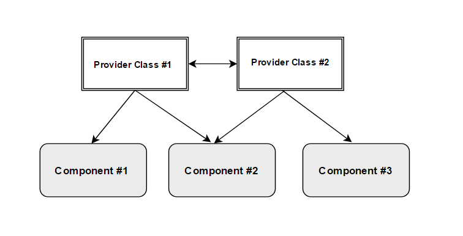
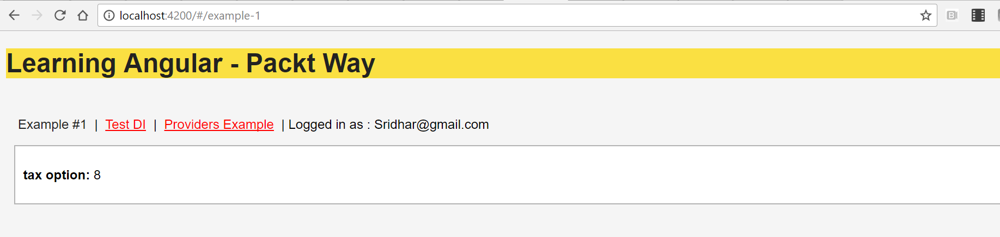
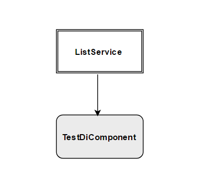
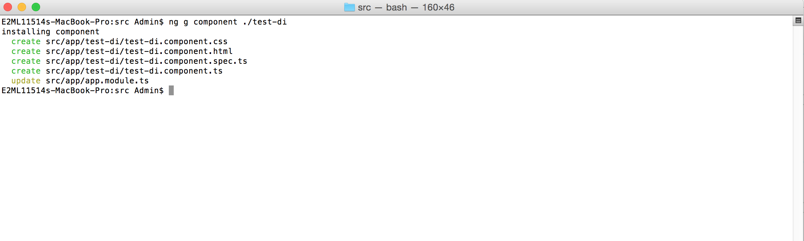
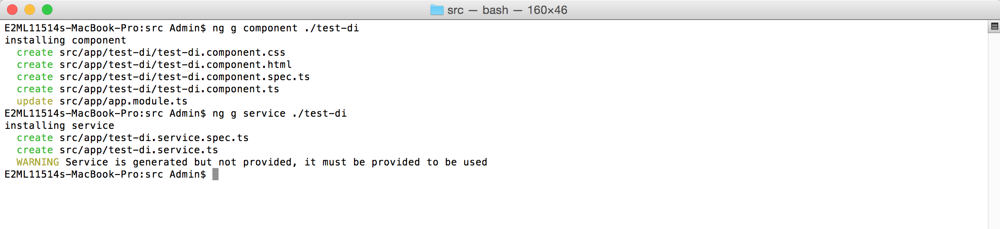
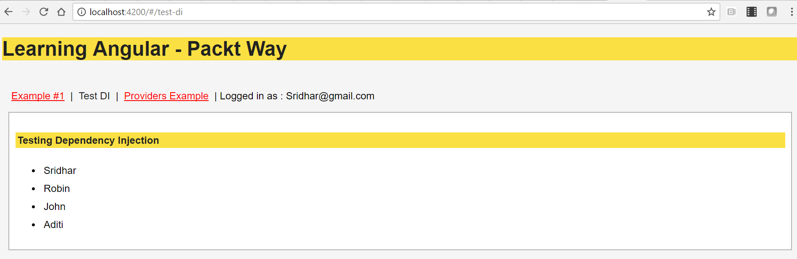
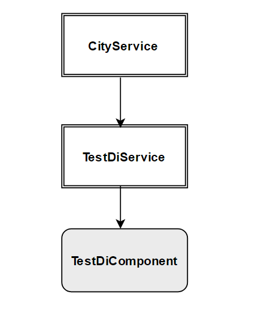
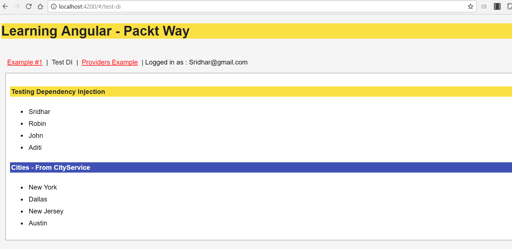
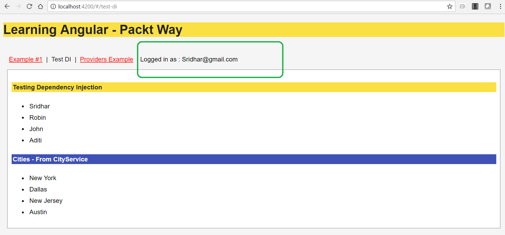

# 第十二章：应用依赖注入

在本章中，您将学习关于 Angular 依赖注入。依赖注入是 Angular 中最引人注目的特性之一；它允许我们创建可注入对象，可以在各种组件之间作为共享资源使用。

在本章中，我们将讨论以下内容：

+   探索依赖注入

+   详细了解提供者类

+   了解分层依赖注入

+   创建可注入对象

+   学习将提供者注入到服务中

+   学习将提供者注入到组件中

+   学习为提供者类解析依赖项

+   使用`@Inject`、`provide`和`useValue`装饰器创建示例

# 没有依赖注入的应用程序

如果没有依赖注入框架，开发人员的生活将非常艰难。看看不使用依赖注入的以下缺点：

+   每次需要传递构造函数参数时，我们都需要编辑类的构造函数定义

+   我们需要创建构造函数，并单独注入每个所需的依赖类

让我们看一个没有依赖注入的应用程序，以了解其中的挑战和不足之处：

```ts
class products {
 available;
 category;

 constructor() {
  this.available = new warehouse();
  this.category = new category();
 }
}

```

让我们分析前面的代码片段以更好地理解：

1.  我们创建了一个名为`products`的`class`。

1.  在`constructor`方法中，我们实例化了依赖类`warehouse`和`category`。

1.  请注意，如果`warehouse`或`category`类的构造函数定义发生更改，我们将需要手动更新所有类的实例。

由于作为开发人员，我们的任务是手动定义所有依赖项，因此前面的代码并不完全可测试和可维护。这就是 Angular 依赖注入的用武之地。

# 依赖注入 - 介绍

**依赖注入**（**DI**）是一种编码模式，其中一个类接收依赖项而不是自己创建它们。一些开发人员和技术狂人也将其称为设计模式。

它被广泛使用，通常被称为 DI。我们将在所有章节中将依赖注入系统称为 DI。

以下是我们绝对需要 DI 的原因：

+   DI 是一种软件设计模式，其中一个类接收其依赖项而不是创建对象本身

+   DI 创建并提供动态所需的对象

+   我们可以将可注入对象视为应用程序的可重用存储库

+   DI 允许远程开发团队独立开发依赖模块。

没有使用 DI，无法完全编写任何 Angular 应用程序。现在，让我们重新审视一下之前没有使用 DI 编写的代码，并使用 Angular DI 编写它：

```ts
class products {

constructor(private _warehouse: warehouse, private _category: category) {

  // use _warehouse and _category now as reference
 }
} 

```

在前面的代码中发生了什么：

1.  我们创建了一个`products`类。

1.  在`constructor`中，我们将依赖类--`warehouse`和`category`--作为参数传递。

1.  我们现在可以在整个类中使用实例`_warehouse`和`_category`。

1.  请注意，我们没有创建依赖类的对象；相反，我们只是通过 DI 系统接收它们。

1.  我们不必担心`warehouse`或`category`所需的依赖关系；这将由 Angular DI 在内部解决。

现在我们知道了什么是 Angular DI，让我们专注于它是如何在我们的 Angular 应用程序中实现和使用的。在学习提供者类和更多内容之前，我们应该了解一些关于 Angular DI 框架的基本知识。

当然，我们将在接下来的几节中详细介绍这些。了解基本概念是很好的：

1.  `@Injectable`：这个装饰器标记一个类可供注入器实例化。

1.  `@Inject`：使用`@Inject`装饰器，我们可以将配置对象注入到任何需要它的构造函数中。

1.  `Provider`：提供者是我们注册需要注入的依赖项的方式。

现在让我们开始学习提供者类。

# 理解提供者类

要在我们的应用程序中开始使用 DI，我们需要了解提供者的概念。组件装饰器中的提供者配置告诉 Angular 需要提供哪些类给组件。

在提供者配置中，DI 接受一个类的数组，即我们要提供给组件的注入标记。我们还可以使用`useClass`指定要为注册的标记实例化的`class`。

快速查看使用提供者配置的语法：

```ts
@Component({
 templateUrl: './calculate-tax.component.html',
 styleUrls: ['./calculate-tax.component.css'],
 providers: [MyTax]
})

```

在前面的代码中，我们告诉 Angular 前面的组件需要由`MyTax`类提供。

以下是使用提供者类的优点：

+   提供者是每个注入器维护的

+   每个`provider`提供一个 Injectable 的单个实例

+   提供者类提供了调用方法的返回值

我们还可以明确提到应该从服务中使用的类。

这是一般的语法：

```ts
@Component({
 templateUrl: './calculate-tax.component.html',
 styleUrls: ['./calculate-tax.component.css'],
 providers: [
    { provide: MyTax, useClass: MyTax }
  ]
})

```

在前面的代码片段中，我们明确告诉 Angular 注入`MyTax`提供者并使用`useClass`配置使用`MyTax`类。

让我们更多地了解提供者类如何注册和使用；让我们看一下以下的图表：



让我们详细分析前面的图表，以了解关键要点：

+   组件共享资源是通过提供者类提供的

+   提供者类可以注册到多个组件中（一个或多个）

+   我们还可以将提供者类注册到其他提供者类中

+   在前面的图表中，`组件＃1`依赖于`提供者类＃1`

+   在前面的图表中，`组件＃2`依赖于`提供者类＃1`和`提供者类＃2`

+   在前面的图表中，`组件＃3`依赖于`提供者类＃2`和`提供者类＃3`

到目前为止，我们了解了 DI 对我们的应用程序有多么关键。DI 确实有助于组织数据，并且是实现独立模块或组件的最合适的设计模式。

这个想法是保持组件独立开发，并在提供者或可注入的地方编写更通用的共享或常用功能。

让我们快速创建一个提供者类的示例，它可以被注入到一个组件中。我们创建一个提供者类--`MyTax.ts`文件--并添加以下代码片段：

```ts
export class MyTax {
 public taxValue: string;
 constructor () {
     }

 getTaxes() {
  this.taxValue=Math.round(Math.random()*100);
  return this.taxValue; 
 }

}

```

让我们详细分析前面的代码片段：

1.  我们创建了一个名为`MyTax`的提供者类。

1.  我们将一个`taxValue`变量定义为数字。

1.  我们创建了一个`getTaxes`方法，它将返回一个随机数。

1.  我们给`taxValue`变量赋值，并通过`getTaxes`方法返回值。

现在，我们需要在我们组件的提供者数组配置中注册这个提供者类，并显示`taxValue`的值。

我们需要创建一个`component`类--`calculate-tax.component.ts`，并添加以下代码行：

```ts
import { Component } from '@angular/core';
import { MyTax } from './my-tax';

@Component({
 template: `<p>tax option: {{ taxName }}</p>`,
 styleUrls: ['./calculate-tax.component.css'],
 providers: [MyTax]
})
export class CalculateTaxComponent{

 public taxName: string;

 constructor( _myTax : MyTax) {
   this.taxName = _myTax.getTaxes();
 }

}

```

让我们详细分析前面的代码：

1.  我们导入了最近创建的提供者类--`MyTax`。

1.  我们创建并定义了`CalculateTax`组件。

1.  我们定义了一个`taxName`变量，并使用数据绑定在模板中映射了这个变量。

1.  在构造函数中，我们在应用程序模块的提供者数组中注册了`MyTax`，Angular DI 将创建提供者类的实例并将其分配给`_myTax`。

1.  使用提供类的实例，我们调用了`getTaxes`方法。

运行应用程序，我们应该看到以下截图中显示的输出：



在本节中，您学习了如何创建提供程序类并在组件中注册它们以供使用。您可以将相同的提供程序类注册到多个组件中；在我们想要共享多个可重用方法的情况下，这无疑是理想的。

在下一节中，您将学习有关分层 DI 的知识--当我们有多个嵌套组件时。

# 理解分层 DI

在前面的部分中，我们介绍了通过提供程序类进行 DI，还介绍了在各个独立组件之间共享提供程序类。在本节中，您将学习如何在分层组件之间使用带有 DI 的提供程序类。

Angular 在内部创建了一个索引树，跟踪所有组件和正在创建的树结构，并维护其依赖矩阵，该矩阵在实时加载以提供所有必要的模块、服务和组件。

分层组件和各种组件之间的 DI 最好的部分是，我们不必担心这些依赖项是如何创建的，或者它们自身内部需要什么依赖项。

# 概述-分层组件和 DI

Angular 内部维护组件的树结构是一个公开的秘密。它还维护依赖项的树索引。

在任何真实的 Angular 应用程序中，我们将使用许多组件和服务。这些组件将具有从根组件到子组件和内部子组件等的树结构。

这在内部形成了一个组件树结构。由于我们的组件也将具有依赖项和可注入项，Angular 将在内部形成一个依赖项树矩阵，以跟踪和解析服务或组件所需的所有依赖项。

以下是您需要了解有关分层 DI 的关键事项：

+   Angular 框架在内部为组件创建了一个分层树结构的 DI

+   提供程序类需要注册到组件中

+   我们可以将提供程序类注册到其他提供程序类中

在下一节中，您将创建可注入的服务，并在组件中使用它们。

# 创建可注入项

我们不必创建 Angular 注入器，它是默认注入的。Angular 在引导过程中创建了一个应用程序范围的注入器。

我们使用`@Injectable`装饰器定义可注入的类，并在类中定义方法。`@Injectable`使得一个类可以被注入器实例化。

以下是创建`@Injectable`服务的示例代码：

```ts
import { Injectable } from '@angular/core';

@Injectable()
 export class ListService {
  getList() { 
   console.log("Demo Injectable Service");
  }
}

```

让我们详细分析代码片段：

1.  我们从 Angular 核心模块中导入了`Injectable`。

1.  我们使用`@Injectable`装饰器告诉 Angular 以下类可以被注入，并且可以被注入器实例化。

1.  我们创建了一个名为`ListService`的类。

1.  我们实现了一个名为`getList`的方法，目前只是在`console.log`中打印一条消息。

# 注册提供者

注入器使用提供者创建依赖项。提供者需要在消费服务或组件中注册。通过注册它们，提供者类允许我们创建独立的可重用功能，可以由各个团队成员使用。

配置和注册提供者类还可以将功能分解为更小的模块，这样更容易维护和修改。我们可以以不同的方式将提供者类注册到服务和组件中。关于注入器，始终要牢记的重要点如下：

+   我们必须在我们的`NgModule`、组件构造函数或指令中创建一个提供者

+   在组件的构造函数中注册服务

我们在前面的部分创建了一个`ListService`服务，它有一个方法，现在可以被注册并在多个组件中使用：



让我们详细分析前面的图表，以了解我们正在构建的用例：

1.  我们将创建一个`@Injectable`服务类`ListService`。

1.  我们将创建一个名为`TestDiComponent`的组件。

1.  我们需要将`ListService`注册到`TestDiComponent`中。

那么，现在让我们立即开始学习如何在`ngModule`中注册提供者。看一下`ngModule`文件：

```ts
import { ListService } from "./shared/list.service";

@NgModule({
 providers: [
 {
  provide: ListService,
  useClass: ListService
 }
 ]
})

```

简而言之，上面的代码通常写成如下形式：

```ts
import { ListService } from "./shared/list.service";

@NgModule({
 providers: [
   ListService
 ]
})

```

让我们详细分析前面的代码片段：

1.  我们已经将`ListService`服务类导入到`ngModule`中。

1.  请注意，我们在提供者中注册了`ListService`。Angular 将在运行时内部解析并创建一个注入器。

1.  在简写表示法中，我们只提到提供者的名称，Angular 将`provide`属性映射到`useClass`的值以进行注册和使用。

在前面的部分中，您学会了如何在`ngModule`的提供者配置数组中注册服务。

在 AppModule 中注册提供者与在组件中注册提供者的主要区别在于服务的可见性。在 AppModule 中注册的服务在整个应用程序中都可用，而在特定组件内注册的服务只在该组件内可用。

# 在组件内注册提供者

现在，您将学习如何在组件中注册提供者并在组件内使用可注入的服务类。

首先，让我们使用 Angular CLI 的`ng`命令快速生成一个组件和服务：

```ts
ng g component ./test-di

```

这将生成组件和所需的文件。命令的输出如下所示：



现在，我们必须在同一文件夹中生成一个 Angular 服务。

```ts
ng g service ./test-di

```

上述命令的输出如下：



我们看到 Angular CLI 生成了一个警告消息，指出服务已生成但未提供。

到目前为止，我们已经分别创建了组件和服务，但现在我们需要在组件中注册提供者，以便我们可以使用该服务。

在继续在组件中注册提供者之前，让我们快速查看一下 CLI 工具生成的服务代码。

这是我们的`test-di.service.ts`文件代码：

```ts
import { Injectable } from '@angular/core';

@Injectable()
 export class TestDiService {
  constructor() { }
}

```

这是由脚手架 Angular CLI 工具生成的默认代码。让我们添加一个我们想在组件内访问的方法：

```ts
import { Injectable } from '@angular/core';

@Injectable()

 export class TestDiService {
  getAuthors() {
  let Authors =[
   {name :"Sridhar"},
   {name: "Robin"},
   {name: "John"},
   {name: "Aditi"}
  ];
  return Authors;
 }
}

```

现在让我们在组件`test-di.component.ts`文件的 providers 数组中注册服务：

```ts
import { Component } from '@angular/core';
import { TestDiService } from './test-di.service';

@Component({
 selector: 'app-test-di',
 templateUrl: './test-di.component.html',
 styleUrls: ['./test-di.component.css'],
 providers: [TestDiService]
})

export class TestDiComponent{
 constructor(private _testDiService: TestDiService) {}
 authors = this._testDiService.getAuthors();
}

```

让我们详细分析上述代码：

1.  我们创建了一个名为`TestDiComponent`的组件。

1.  我们将新创建的服务`TestDiService`导入到组件中。

1.  我们在 providers 中注册了`TestDiService`，告诉 Angular 动态创建服务的实例。

1.  Angular DI 将创建一个我们在`constructor`中传递的`_testDiService`服务类的新`private`实例。

1.  我们使用了`_testDiService`服务的实例，并调用了`getAuthors`方法来获取作者列表。

运行应用程序，我们应该看到如下截图所示的输出：



到目前为止，您已经学会了创建一个`Injectable`服务，将服务注册到组件装饰器内的提供者数组中，并使用服务的实例来调用方法，这很棒。

在本节中，您学会了如何使用相同的一组共享提供者类创建多个组件。

# 带有依赖关系的提供者类

在前面的部分中，我们讨论了将服务注册到组件中，但是如果我们的服务本身需要一些依赖怎么办？在本节中，您将学习并实现解决服务所需依赖的方法。

为了更好地理解带有依赖关系的提供者类，让我们了解以下用例。我们有两个服务——`CityService`和`TestDiService`，以及一个组件——`TestDiComponent`。

让我们可视化这些服务和组件的依赖树：



让我们详细分析前面的图表，以了解我们正在构建的用例：

1.  我们将创建一个`Injectable`服务——`CityService`。

1.  我们将创建一个`Injectable`服务——`TestDiService`。

1.  我们需要将`CityService`注册到`TestDiService`类中。

1.  我们将创建一个`TestDiComponent`。

1.  我们需要将`TestDiService`注册到`TestDiComponent`中。

在本节中，我们将继续使用之前创建的服务`TestDiService`和组件`TestDiComponent`。

现在，我们将创建一个名为`CityService`的额外服务，并将文件保存为`city.service.ts`。

将以下代码片段添加到服务文件中：

```ts
import { Injectable } from '@angular/core';

@Injectable()
export class CityService {

 getCities() {
  let cities =[
  { name :"New York" },
  { name: "Dallas" },
  { name: "New Jersey" },
  { name: "Austin" }
  ];

 return cities;
 }
}

```

让我们分析前面的代码片段：

1.  我们创建并导出了一个名为`CityService`的新服务。

1.  我们实现了一个`getCities`方法，该方法返回一个城市列表。

创建服务后，我们导入文件并在`app.module.ts`文件中将服务注册为提供者：

```ts
import { CityService } from "./test-di/city.service";

@NgModule({
 providers: [
   CityService
 ]
})

```

由于我们在`app.module.ts`文件的 providers 数组中注册了该服务，它现在可以在整个应用程序中使用。

要在`TestDiService`中使用该服务，我们必须导入该服务并在构造函数中创建`CityService`的实例：

```ts
import { Injectable } from '@angular/core';
import { CityService } from './city.service';

@Injectable()
export class TestDiService {

  constructor(private _city: CityService) { }
    getAuthors() { 
      let Authors =[
         {name :"Sridhar"},
         {name: "Robin"},
         {name: "John"},
         {name: "Aditi"}
      ];
     return Authors;
  }
  getCityList() {
    let cities = this._city.getCities();
    return cities;
 }
}

```

在前面的部分提到的示例中，我们使用服务来显示作者列表。

现在，让我们分析前面的代码：

1.  我们创建了一个名为`CityService`的服务，并在`TestDiService`中导入了该类。

1.  我们在构造方法中创建了`CityService`类的一个实例——`_City`。

1.  我们定义了一个方法，即`getAuthors`。

1.  使用 `this` 运算符，我们在 `getCityList` 方法中调用了 `CityService` 类的 `getCities` 方法。

1.  `getCities` 方法返回城市列表。

运行应用程序，您将看到前面代码的输出，如下面的屏幕截图所示：



在本节中，您学习并实现了如何通过使用 `@Injectable` 装饰器注册其他提供者类来解决提供者类的依赖关系。

# 使用 @Inject、provide 和 useValue

让我们快速回顾一下学习 DI 的进展。我们讨论了如何编写提供者类和层次组件的依赖注入，以及如何使用 `@injectable` 装饰器编写可重用的提供者。

在本节中，您将学习如何使用 `@Inject`、`provide` 和 `useValue` 来在不同组件之间共享数据。

要声明一个服务可以在类中被注入，我们需要一个 `@Injectable` 装饰器。该装饰器告诉 Angular 将使用 `@Injectable` 定义的类可用于注入器，以便实例化到其他类、服务或组件中，并且该类应通过 DI 动态解析。我们主要用它们来编写通用服务并创建我们自己的存储库。

正如我们之前提到的，即使服务需要在其中注入依赖项，我们也使用 `@Injectable` 装饰器。我们还可以将服务注册到另一个服务或任何组件中。

每当我们需要注入构造函数参数的类型时，我们将使用 `@inject` 装饰器。

看一下 `app.module.ts` 文件中 `ngModule` 的以下示例代码：

```ts
import { ListService } from "./shared/list.service";

@NgModule({
 providers: [
  {
   provide: ListService,
   useClass: ListService
  }
 ]
})

```

关于前面的代码，有一些要注意的要点：

1.  我们导入了之前创建的服务，即 `ListService`。

1.  现在我们已经导入了服务，我们需要将其添加到 `providers` 列表中。

1.  我们明确说明需要注册服务名 `ListService`。

1.  使用 `useClass`，我们将指示 Angular 实例化并使用 `ListService` 类。

如果我们仔细注意，我们主要处理的是服务/提供者类。但是，如果我们需要注入某些变量，以便我们可以在不同的组件和服务之间共享值呢？

太棒了！这就是我们可以轻松使用 `@Inject` 装饰器并创建一个变量或类名，我们可以在其他组件和服务中重用。

现在看一下`ngModule`文件；我们已经修改它以适应我们想要在各种服务和组件之间共享的变量：

```ts
import { ListService } from "./shared/list.service";

@NgModule({
 providers: [
 {
   provide : 'username',
   useValue: 'Sridhar@gmail.com'
 }
 ]
})

```

让我们分析前面的代码：

1.  在提供者中，我们创建了一个新的条目，对于`provide`，我们应用了一个名称`username`。请记住，无论您在这里提到的名称是什么，我们都需要在其他服务或组件中始终使用它。

1.  我们为`username`变量提供了一个值。

1.  请注意，这个值不会被更改或更新；把它想象成应用程序中的一个常量值。

现在我们已经创建了一个值常量提供者，让我们看看如何在我们的组件中使用它。

在`app.component.ts`中，添加以下代码片段：

```ts
import { Component, Inject } from  '@angular/core';
 @Component({
 selector:  'app-root',
  templateUrl:  './app.component.html',
  styleUrls: ['./app.component.css']
 })  export  class  AppComponent {  title = 'Learning Angular - Packt Way';
  constructor ( @Inject('username') private  username ) {} } 

```

让我们详细分析前面的代码片段：

1.  我们从`@angular/core`中导入了`component`和`Inject`模块。

1.  我们创建了我们的组件，并为组件的 HTML 和样式表定义了相应的 HTML 和 CSS 文件。

1.  在`AppComponent`类中，我们定义了一个`title`变量并为其赋值。

1.  我们创建了一个类的构造函数，并传递了一个`@inject`装饰器来传递我们在`app.module.ts`文件中定义的`username`名称。

1.  现在我们已经在提供者数组配置中注册了`username`变量，我们可以在组件模板中的任何地方使用该变量的值。

太棒了，现在让我们运行这个应用程序；我们应该看到以下截图中显示的输出：



在以下截图中需要注意的一点是，以绿色标记的变量值`'Sridhar@gmail.com'`在模板中被打印出来。

在本节中，您学会了使用`@Inject`装饰器定义和使用常量提供者。

您学会了如何为我们的服务类使用`@Injectable`；我们可以将其注册为提供者，并在其他服务或组件中使用它。

我们可以定义一些常量变量，也可以注入和在不同组件中使用该值。

现在您应该能够创建多个可重用的服务、提供者类，以及常量变量，这些可以用来创建我们的应用程序存储库。

# 总结

在本章中，我们讨论了现在我们所知道的 Angular DI。DI 允许我们将提供者类和可注入对象注入到组件中使用提供者。我们学习并实现了提供者类和分层依赖注入。我们还学会了在`NgModule`中注册提供者，或者直接在组件内部注册提供者。

我们重点关注如何创建和配置注入器，以及如何在组件装饰器中注册服务提供者。

本章解释了提供者类也可以有依赖项，这些依赖项可以在内部再次注入到服务或组件中。在下一章中，您将学习关于 Angular 动画。Angular 动画是一个核心库，通过将动作和过渡应用到应用程序中，提供更好的用户体验。

我们将学习各种过渡和动作，以及如何设计动画；最重要的是，我们将在学习过程中创建一些很酷的东西。
