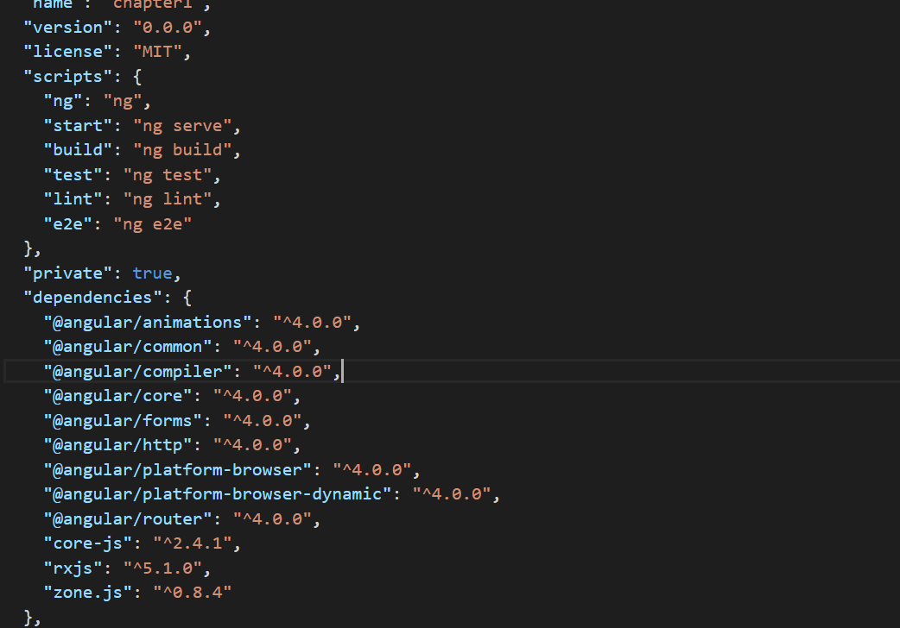
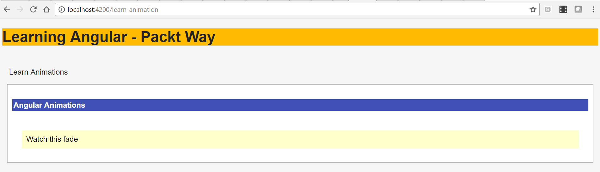
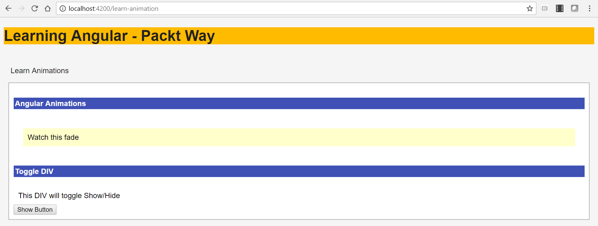
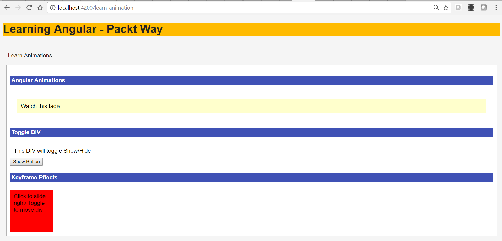
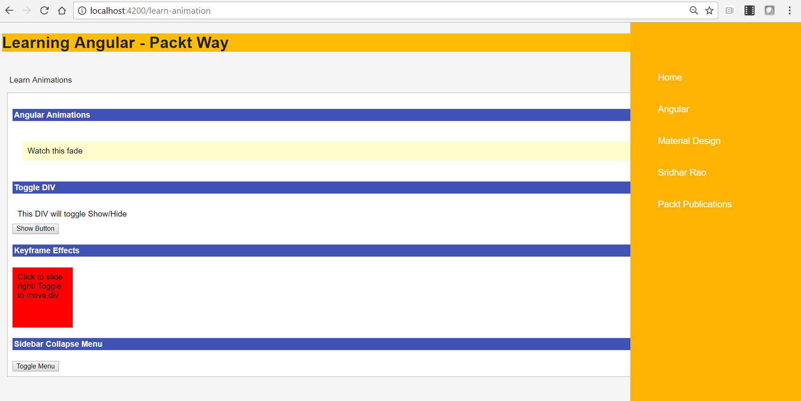
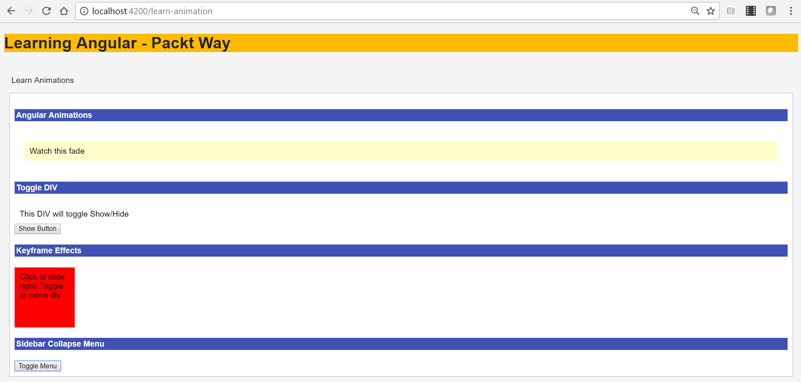

# 第十三章：处理 Angular 动画

在本章中，我们将学习关于 Angular 动画。动画；这个词听起来很有趣和创造性，所以系好安全带；我们将乐在学习 Angular 动画。Web 应用程序中的动作是关键和重要的设计因素之一，也是良好用户体验的主要驱动因素。特别是过渡，它们非常有趣，因为它们使应用程序的元素从一个状态移动到另一个状态。

本章详细介绍以下主题：

+   介绍 Angular 动画

+   Angular 2 中内置的类来支持动画

+   理解和学习如何使用动画模块，`transition`，`states`，`keyframes`等

+   页面过渡动画

+   动画切换/折叠手风琴幻灯片

# 介绍 Angular 动画

Angular 自带了对动画的坚实本地支持，因为运动和过渡是任何应用程序的重要部分。

Angular 具有内置的动画引擎，还支持和扩展了运行在大多数现代浏览器上的 Web 动画 API。

我们必须在项目文件夹中单独安装 Angular 动画。我们将在接下来的部分中创建一些动画示例。

# 安装 Angular 动画库

正如我们之前讨论的，Angular 动画已经被分离出来作为一个单独的库，需要单独安装。

在这一部分，我们将讨论如何获取最新的 Angular 动画版本并安装它；按照以下步骤进行：

1.  获取最新的 Angular 动画库。

您可以使用以下`npm`命令进行安装：

```ts
npm install @angular/animations@latest --save

```

运行上述命令将保存最新版本的 Angular 动画库，并将其添加为`package.json`文件中的依赖项。

1.  验证最新安装的 Angular 动画库。

确保我们已经安装了 Angular 动画库，打开`package.json`文件，应该在依赖列表中有`@animations/animations`的条目。

一旦 Angular 动画库已经被正确导入和安装，`package.json`文件应该看起来像以下的截图：



1.  在`app.module.ts`文件中导入 Angular 动画库。

我们需要在`app.module.ts`文件中导入 Angular 动画库。为了包含该库，我们将使用以下代码片段：

```ts
import { BrowserAnimationsModule } from '@angular/platform-
   browser/animations';

```

1.  在`ngModule`装饰器的导入中包含 Angular 动画库：

```ts
@ngModule({
 imports: [
BrowserModule,
BrowserAnimationsModule
 ],
//other imports
})

```

在前面的代码片段中，我们只是将`BrowserAnimationsModule`导入到我们的`ngModule`中，以便在整个应用程序中使用。

太棒了！现在我们的应用程序中有了 Angular 动画库，我们可以继续像往常一样构建我们的组件，添加动画和效果。

在我们开始编写使用动画的组件示例之前，重要的是花一些时间探索 Angular 动画中所有可用的类，以便我们可以利用它们。

# Angular 动画 - 特定函数

如前所述，Angular 自带了一个独立的动画库，其中有许多内置类和方法来支持各种动画。

让我们了解本节中提供的各种内置类：

+   `trigger`

+   `transition`

+   `state`

+   `style`

+   `animate`

我们将详细学习上述每种方法，但在这之前，让我们快速看一下使用这些方法的一般语法。

编写动画的一般语法示例如下：

```ts

animations : [
 trigger('slideInOut', [
  state('in', style({
      transform: 'translate3d(0, 0, 0)'
    })),
  state('out', style({
      transform: 'translate3d(100%, 0, 0)'
    })),
  transition('in => out', animate('400ms ease-in-out')),
  transition('out => in', animate('400ms ease-in-out'))
 ])
]

```

让我们详细分析前面的代码：

1.  我们正在定义一个名为`slideInOut`的触发器。

1.  我们正在定义两个`states`：`in`和`out`。

1.  对于每个状态，我们都分配了一个样式，即每个相应状态的 CSS `transform`属性。

1.  我们还添加了`transition`来提及`state`和`animation`的细节。

看起来很简单，对吧？是的，当然！

现在我们知道了如何编写动画的语法，让我们深入了解 Angular 动画库中提供的每种方法。

# 触发器

触发器定义了一个将触发动画的名称。触发器名称帮助我们确定基于事件应该触发哪个触发器。

定义触发器的一般语法如下：

```ts
trigger('triggerName', [
  we define states and transitions here
])

```

在前面的代码语法中，我们正在定义以下内容：

1.  通过传递一个必需的参数来定义触发器，即名称和可选参数，其中可以包括`state`和`transition`。

1.  触发器名称；我们定义一个名称来识别触发器。

1.  我们还可以在触发器定义中将我们的状态和转换定义为参数。

# 状态

状态是元素在特定时间点的定义动画属性。

状态是我们应用程序的逻辑状态，例如活动和非活动。我们为状态定义状态名称和相应的样式属性。

定义状态的语法的一般语法如下：

```ts
state('in', style({
 backgroundColor: '#ffffcc'
}))

```

在前面的代码语法中，我们正在定义以下内容：

1.  我们正在定义一个名为`'in'`的`state`，这是我们应用程序中的一个逻辑状态。

1.  在样式中，我们定义了需要应用于元素的状态的`CSS`属性。常规的`CSS`样式属性在这里被定义。

# 过渡

过渡允许元素在不同状态之间平滑移动。在过渡中，我们定义了各种状态（一个或多个）的动画。

状态是过渡的一部分。

编写`transition`的一般语法如下：

```ts
//Duration Example - seconds or milliseconds
transition('in => out', animate('100')) 

// Easing Example: refer http://easings.net
transition('in => out', animate('300ms ease-in'))

// Using Delay in Animation
transition('in => out', animate('10s 50ms'))

```

在前面的代码语法中，我们正在定义以下内容

1.  我们正在定义我们的过渡状态，即从起始状态到结束状态。在我们的语法中，它是从 in 状态到 out 状态。

1.  动画选项如下：

1.  缓动：动画进行的平滑程度

1.  持续时间：动画从开始到结束运行的时间

1.  延迟：延迟控制动画触发和过渡开始之间的时间长度。

通过对如何编写 Angular 动画的概念和语法有着深刻的理解，让我们继续使用前面的所有函数来创建示例。

# 页面过渡动画

在前面的部分中，我们为动画创建了一些状态。在本节中，我们将学习如何使用状态创建过渡。

`transition`是 Angular 动画库中最重要的方法，因为它负责所有效果和状态变化。

让我们创建一个完整页面过渡的示例。我们将创建组件类`learn-animation.component.ts`：

```ts
import { Component } from '@angular/core';
import { state, style, animate, trigger, transition, keyframes} from '@angular/core';

@Component({
 templateUrl: './learn-animation.component.html',
 styleUrls: ['./learn-animation.component.css'],
 animations : [
 trigger('customHover', [
  state('inactive', style({
   transform: 'scale(1)',
    backgroundColor: '#ffffcc'
  })),
  state('active', style({
   transform: 'scale(1.1)',
   backgroundColor: '#c5cae8'
  })),

 transition('inactive => active', animate('100ms ease-in')),
 transition('active => inactive', animate('100ms ease-out'))
 ]),
 ]
})
export class AppComponent {
 title = 'Animation works!';
 constructor() {}

 state: string = 'inactive';
 toggleBackground() {
  this.state = (this.state === 'inactive' ? 'active' : 'inactive');
 }
}

```

让我们详细分析前面的代码，以了解 Angular 动画：

1.  我们正在定义一个名为`customHover`的触发器。

1.  我们正在定义两个`states`：`inactive`和`active`。

1.  对于每个状态，我们都分配了一个样式，即 CSS；对于各自的状态，我们分配了`transform`和`backgroundColor`属性。

1.  我们还添加了过渡来提及状态和动画细节：

1.  `transition`影响状态从`inactive`到`active`的移动。

1.  `transition`影响状态从`active`到`inactive`的移动。

1.  我们正在定义一个`toggleBackground`方法，当调用时，将从`inactive`状态切换到`active`状态，反之亦然。

现在我们已经创建了组件类，在我们的`learn-animation.component.html`模板中调用了`toggleBackground`方法：

```ts
<div>
 <div id="content" [@customHover]='state' 
       (mouseover)="toggleBackground()"  
       (mouseout)="toggleBackground()">Watch this fade</div>
</div>

```

让我们详细分析前面的代码：

1.  在`learn-animation.component.html`中，我们正在定义一个`div`元素。

1.  我们正在将`mouseover`和`mouseout`事件与`toggleBackground`方法进行绑定。

1.  由于我们将触发器定义为`@customHover`，我们将使用它进行属性绑定。在我们放置`[@customHover]`的任何元素上，将应用所定义的动画。

1.  由于我们应用了属性绑定，属性`@customHover`的值将在`active`和`inactive`之间切换。

1.  当我们将鼠标悬停在元素上时，将调用`toggleBackground`方法，并且我们将看到背景颜色随着`transform`属性的变化而改变。

1.  在鼠标移出事件上，再次调用`toggleBackground`方法，并且样式将重置回原始状态。

运行应用程序，我们应该在以下截图中看到输出：



在本节中，我们讨论了如何使用基本的 Angular 动画。在下一节中，我们将探索更多动画示例。

# 另一个示例 - Angular 动画

在前一节中，我们学习了动画的基础知识；在本节中，我们将使用 Angular 动画创建另一个示例。

在这个例子中，我们将创建一个按钮和一个`div`元素。当点击按钮时，`div`元素将滑入页面。很酷，对吧？

让我们开始吧。将以下代码添加到我们在前一节中创建的组件文件`learn-animation.component.ts`中：

```ts
 trigger('animationToggle', [
  transition('show => hide', [
   style({transform: 'translateX(-100%)'}),
   animate(350) ]),
   transition('hide => show', animate('3000ms'))
 ])

```

在前面的代码中，需要注意以下重要事项：

1.  我们正在创建一个带有`animationToggle`的触发器。

1.  我们正在定义两个过渡，即从`show => hide`和`hide => show`。

1.  我们正在向`show => hide`过渡添加样式属性。

1.  我们没有向`hide => show`过渡添加样式属性。

定义过渡样式并不是强制性的，但往往我们需要为具有动画效果的元素定义自定义样式。

运行应用程序，您应该在截图后看到以下应用程序和动画：



在我们的应用程序中，当您点击显示按钮时，`DIV`元素将从右侧滑入页面到左侧。再次点击按钮，它将切换隐藏。

很酷，对吧？是的。Angular 动画使我们能够为元素创建美丽的动画和过渡效果，这将增加用户体验。

我们将构建许多很酷的示例来实现动画。

# 使用关键帧 - 样式序列

到目前为止，我们已经使用各种方法实现了 Angular 动画的示例。

当我们设计/决定元素的运动和转换时，我们需要遍历各种样式以实现平滑的过渡。

使用`keyframes`，我们可以在过渡时定义不同样式的迭代。`keyframes`本质上是为元素定义的一系列样式。

为了更好地理解这一点，让我们看一下以下代码片段：

```ts
transition('frameTest1 => frameTest2', [
 animate(300, keyframes([
 style({opacity: 1, transform: 'rotate(180deg)', offset: 0.3}),
 style({opacity: 1, transform: 'rotate(-90deg)', offset: 0.7}),
 style({opacity: 0, transform: 'rotate(-180deg)', offset: 1.0})
 ]))

```

让我们详细分析前面的代码片段：

1.  我们正在定义从`frameTest1 => frameTest2`的`transition`

1.  我们用`300`毫秒定义了`animate`属性。

1.  我们正在定义`keyframes`，在其中我们定义了三种不同的样式；元素将逐步经历每个`transition`帧。

现在，让我们用下面的代码扩展前面部分创建的示例。

更新后的`learn-animation.component.ts`文件将具有以下代码：

```ts
import { Component } from '@angular/core';
import { state, style, animate, trigger, transition, keyframes} from '@angular/animations';

@Component({
 selector: 'app-learn-animation',
 templateUrl: './learn-animation.component.html',
 styleUrls: ['./learn-animation.component.css'],
 animations: [
 trigger('animationState', [
   state('frameTest1', style({ transform: 'translate3d(0, 0, 0)'  })),
   state('frameTest2', style({ transform:
                 'translate3d(300px, 0, 0)'  })),
   transition('frameTest1 => frameTest2', 
                  animate('300ms ease-in-out')),

   transition('frameTest2 => frameTest1', [
     animate(1000, keyframes([
       style({opacity: 1, transform: 'rotate(180deg)', offset: 0.3}),
       style({opacity: 1, transform: 'rotate(-90deg)', offset: 0.7}),
       style({opacity: 0, transform: 'rotate(-180deg)', offset: 1.0})
     ]))
   ])
  ])
 ]
})
export class LearnAnimationComponent{
 constructor() {}

 public left : string = 'frameTest1';
 public onClick () : void
 {
  this.left = this.left === 'frameTest1' ? 'frameTest2' : 'frameTest1';
 }
}

```

让我们详细分析前面的代码：

1.  我们从 Angular 动画库中导入所需的模块：`state`、`style`、`animate`、`keyframes`和`transition`。这些模块帮助我们在应用程序中创建动画。

1.  我们创建了一个`LearnAnimationComponent`组件。

1.  我们为组件指定了`animations`。

1.  我们定义了一个名为`animationState`的触发器。

1.  对于创建的触发器，我们定义了两个状态--`frameTest1`和`frameTest2`。

1.  我们定义了两个转换：`'frameTest2 => frameTest1'`和`'frameTest2 => frameTest1'`。

1.  对于定义的每个转换，我们已经实现了`keyframes`，也就是与`animate`方法一起使用的一系列样式，以实现平滑的过渡和时间延迟。

1.  在组件类中，我们定义了一个`left`变量。

1.  我们正在定义一个`onClick`方法，切换从`frameTest1`到`frameTest2`的值。

到目前为止，一切顺利。我们已经实现了组件。

现在是时候更新我们的`learn-animation.component.html`并将以下代码片段添加到文件中：

```ts
<h4>Keyframe Effects</h4>

<div class="animateElement" [@animationState]="left"    
  (click)="onClick()">
     Click to slide right/ Toggle to move div
</div>

```

好了，一切准备就绪。现在运行应用程序，您应该看到如屏幕截图所示的输出和下面提到的动画：



当您运行应用程序时，您应该看到以下动画

1.  当您点击`DIV`元素时--它应该向右滑动

1.  再次点击`DIV`元素，元素应该向右移动，`DIV`元素变换--给人一种 DIV 在旋转的感觉。

在本节中，您将学习如何使用`keyframes`并为元素创建一系列样式，以实现更平滑的过渡。

# 动画折叠菜单

在本节中，我们将为我们的应用程序创建一个非常重要的部分，即应用程序的侧边栏菜单。

根据我们迄今为止学到的关于 Angular 动画的知识，在本节中我们将创建一个折叠侧边栏的示例。

让我们更新组件模板`learn-animation.component.html`，并使用以下代码片段更新文件：

```ts
<h4>Collapse Menu</h4>

<button (click)="toggleMenu()" class="menuIcon">Toggle Menu</button>
 <div class="menu" [@toggleMenu]="menuState">
 <ul>
   <li>Home</li>
   <li>Angular</li>
   <li>Material Design</li>
   <li>Sridhar Rao</li>
   <li>Packt Publications</li>
 </ul>
</div>

```

对前面的代码进行分析如下：

1.  我们正在添加一个`<h4>`标题，一个`Collapse`菜单。

1.  我们正在定义一个按钮，并将`click`事件与`toggleMenu`方法关联起来。

1.  我们正在创建一个带有示例列表项`<li>`的无序列表`<ul>`。

现在，我们将向`learn-animation.component.css`文件添加一些基本的 CSS 样式：

```ts
.animateElement{
   background:red;
   height:100px;
   width:100px;
}
.menu {
   background: #FFB300;
   color: #fff;
   position: fixed;
   left: auto;
   top: 0;
   right: 0;
   bottom: 0;
   width: 20%;
   min-width: 250px;
   z-index: 9999;
   font-family: Arial, "Helvetica Neue", Helvetica, sans-serif;
 }

 ul {
   font-size: 18px;
   line-height: 3;
   font-weight: 400;
   padding-top: 50px;
   list-style: none;
 }
 .menuIcon:hover {
   cursor: pointer;
 }

```

到目前为止，我们已经创建了我们的应用程序组件模板`learn-animation.component.html`并为菜单组件`learn-animation.component.css`设置了样式。

现在，我们将创建菜单组件类。

将以下代码添加到`learn-animation.component.ts`文件中：

```ts
import { Component } from '@angular/core';
import { state, style, animate, trigger, transition, keyframes} from '@angular/core';

@Component({
 selector: 'app-learn-animation',
 templateUrl: './learn-animation.component.html',
 styleUrls: ['./learn-animation.component.css'],
 animations: [

  trigger('toggleMenu', [
   state('opened', style({
    transform: 'translate3d(0, 0, 0)'
   })),
   state('closed', style({
    transform: 'translate3d(100%, 0, 0)'
   })),
   transition('opened => closed', animate('400ms ease-in-out')),
   transition('closed => opened', animate('400ms ease-in-out'))
  ])
 ])
 ]
})
export class LearnAnimationComponent{

constructor() {}
 menuState : string = 'opened';
 toggleMenu()
 {
  this.menuState = this.menuState === 'closed' ? 'opened' : 'closed';
 }
}

```

让我们详细分析前面的代码：

1.  我们正在导入所需的 Angular 动画库模块，例如`state`，`style`，`animate`，`trigger`，`transition`和`keyframes`。

1.  在动画中，我们定义了一个触发器：`toggleMenu`。

1.  我们正在创建两种状态：`opened`和`closed`。

1.  对于每个状态，我们正在定义一些带有`transform`的样式属性。

1.  我们现在定义了转换`opened => closed`和`closed => open`，并带有一些动画细节延迟。

1.  我们已经定义了一个`menuState`变量。

1.  在组件类中，我们定义了`toggleMenu`。

1.  在`toggleMenu`方法中，我们正在切换`menuState`变量值为`opened`或`closed`，反之亦然。

现在是演示时间。运行应用程序，您应该看到以下输出：



再次点击 Toggle 菜单按钮，我们应该看到菜单向右滑动，如下截图所示：



在本节中，我们使用 Angular 动画创建了应用程序的侧边栏菜单。

# 总结

在本章中，我们介绍了 Angular 动画。动画对于设计和构建具有平滑过渡和元素效果的美观用户体验至关重要。

我们介绍了如何安装和导入 Angular 动画库，并在库中使用各种模块。

我们讨论了重要的模块，比如`state`、`style`、`animate`、`trigger`、`transition`和`keyframes`。

我们创建并实现了一些使用 Angular 动画的示例。

最后，我们创建了一个带有一些动画效果的网页应用侧边栏菜单。现在，轮到你了！

在下一章中，您将学习如何将 Bootstrap 与 Angular 应用程序集成。Bootstrap 可以说是目前最流行的前端框架，在本章中，您将了解拥有一个 Angular x Bootstrap 应用程序意味着什么。
