# 第十四章：将 Bootstrap 与 Angular 应用程序集成

Bootstrap 可以说是目前最受欢迎的前端框架。你可能会问，Angular 本身不就是一个前端框架吗？是的。那么为什么我需要在同一个应用程序中使用两个前端框架呢？答案是，你不需要。Bootstrap 是由 Twitter 创建和使用的，非常受欢迎。它允许您管理许多事情，比如使用一个名为网格的系统在页面上布置 HTML 组件。我将在接下来的页面中详细解释这个系统，它允许您在不明确使用 CSS 的情况下将网页空间划分为区域。此外，一切都将立即响应。此外，Bootstrap 提供了动态元素，如轮播、进度条、对用户输入的表单反应等。简而言之，Angular 允许您创建应用程序结构并管理数据呈现，而 Bootstrap 处理图形的呈现。

Bootstrap 围绕三个元素展开：

+   `bootstrap.css`

+   `bootstrap.js`

+   `glyphicons`

在这里，`bootstrap.css`包含了允许响应式空间划分的框架，而`bootstrap.js`是一个使您的页面动态化的 JavaScript 框架。

需要注意的是，`bootstrap.js`依赖于 jQuery 库。

最后，`glyphicons`是一个包含使用 Bootstrap 时可能需要的所有图标的字体。

在第十章*,* *Angular 中的 Material Design*中，您将学习如何使用由 Google 官方提供的`Material Design`包来创建管理动态元素、轮播和其他进度条的应用程序（ng2-material）。Bootstrap（由 Twitter 提供）和 Material Design（由 Google 为 Angular 提供）最终都旨在实现同样的目标：在严格呈现页面给用户时简化您的生活。例如，它们都确保跨浏览器兼容性，防止在项目之间重复编写代码，并在代码库中添加一致性。

在我看来，您应该使用哪一个是个人选择，我可以预见未来几个月将会有关于 C#与 Java 或 PC 与 Mac 之类的激烈争论。一方面，如果您已经精通 Bootstrap 并且在各处都在使用它，那么您也可以在这里使用它。另一方面，如果 Bootstrap 不是您的技能范围，您可以利用这个机会学习并选择您喜欢的。

第三个选项将是完全跳过本章，如果您已经选择了 Material Design（由 Google 为 Angular 提供）的方法。我不介意，我保证。本章涵盖的主题有：

+   安装 Bootstrap

+   了解 Bootstrap 的网格系统

+   使用 Bootstrap 指令

# 安装 Bootstrap

话不多说，让我们开始并为 Angular 安装 Bootstrap。

在没有像 Angular 这样的前端框架的标准 Web 应用中使用 Bootstrap 时，您需要使用内容传递网络（CDN）来获取组成 Bootstrap 框架的三个部分（`bootstrap.css`，`bootstrap.js`和`glyphicons`）。即使下载了缩小的文件，这些调用仍然需要时间（例如，三个 HTTP 请求，下载，校验和等）才能完成。对于您的客户来说，使用 Angular，我们可以采用相同的方法，并简单地在`src/index.html`中添加对某些 CDN 的引用，但这将是一个相当大的错误。

首先，如果用户没有缓存资源的副本，那么我们将遭受与标准 Web 应用相同的副作用，因为我们的客户将不得不等待 CDN 提供 Bootstrap 框架，特别是考虑到我们的应用经过 Angular CLI 部署流程进行了缩小并以单个文件提供。其次，我们将无法轻松地在我们的 Angular 组件中控制 Bootstrap 组件。

将 Bootstrap 与我们的 Angular 应用程序集成的更好方法是使用`ng-bootstrap`包。该包允许我们在我们的组件中使用 Angular 指令来管理 Bootstrap。在撰写本文时，这是最全面、维护良好且与 Angular 集成良好的包，允许我们在 Angular 中使用 Bootstrap。

为了探索 Bootstrap，我们将在第七章，*使用可观察对象进行异步编程*和第九章，*Angular 中的高级表单*中使用的 Marvel Cinematic Universe 的 JSON API 基础上构建。

您可以在[`github.com/MathieuNls/mastering-angular2/tree/master/chap9`](https://github.com/MathieuNls/mastering-angular2/tree/master/chap9)找到《第九章》，*Angular 中的高级表单*的代码。

要将此代码克隆到名为`angular-bootstrap`的新存储库中，请使用以下命令：

```ts
$ **git** clone --depth one https://github.com/MathieuNls/mastering-angular    
    angular-bootstrap
$ **cd** angular-bootstrap
$ **git** filter-branch --prune-empty --subdirectory-filter chap9 HEAD

```

这些命令将 GitHub 存储库的最新版本拉到名为`angular-bootstrap`的文件夹中。然后，我们进入`angular-bootstrap`文件夹，并清除不在第九章 *Angular 中的高级表单*目录中的所有内容。

现在让我们安装`ng-bootstrap`包：

```ts
npm install --save @ng-bootstrap/ng-bootstrap

```

现在，在`src/app/app.module.ts`中，导入`import {NgbModule}` from `@ng-bootstrap/ng-bootstrap`包，并将`NgbModule.forRoot()`添加到`AppModule`类的导入列表中。如果您重用了第九章 *Angular 中的高级表单*中的代码，它应该是这样的：

```ts
 import { BrowserModule } from '@angular/platform-browser';
 import { NgModule } from '@angular/core';
 import { FormsModule, ReactiveFormsModule  } from '@angular/forms';
 import { HttpModule } from '@angular/http';
 import { NgbModule } from '@ng-bootstrap/ng-bootstrap

 import { AppComponent } from './app.component';

 @NgModule({
   declarations: [
     AppComponent
   ],
   imports: [
     BrowserModule,
     FormsModule,
     HttpModule,
     ReactiveFormsModule,
     NgbModule.forRoot()
   ],
   providers: [],
   bootstrap: [AppComponent]
 })
 export class AppModule { }

```

这个包允许我们摆脱 jQuery 和`bootstrap.js`的依赖，但不幸的是，它不包括`bootstrap.css`。它包含了我们即将使用的网格系统和组件所需的样式。

前往[`getbootstrap.com/`](http://getbootstrap.com/)，并在`src/index.html`中导入以下显示的链接：

```ts
<!doctype html>
 <html>
 <head>
   <meta charset="utf-8">
   <title>Chap15</title>
   <base href="/">
   <link rel="stylesheet" 
        href="https://maxcdn.bootstrapcdn.com/bootstrap/4.0.0-
        alpha.4/css/bootstrap.min.css" integrity="sha384-
        2hfp1SzUoho7/TsGGGDaFdsuuDL0LX2hnUp6VkX3CUQ2K4K+xjboZdsXyp4oUHZj" 
        crossorigin="anonymous">
   <meta name="viewport" content="width=device-width, initial-scale=1">
   <link rel="icon" type="image/x-icon" href="favicon.ico">
 </head>
 <body>
   <app-root>Loading...</app-root>
 </body>
 </html>

```

通过这些小改变，我们已经可以看到 Bootstrap 正在接管我们的样式。在下面的图片中，左边是我们在第九章 *Angular 中的高级表单*结束时表单的样子。

然而，右边是我们现在表单的样子。正如您所看到的，这里和那里有一些小的不同。例如，`h1`标记，错误字段和输入的样式不同：

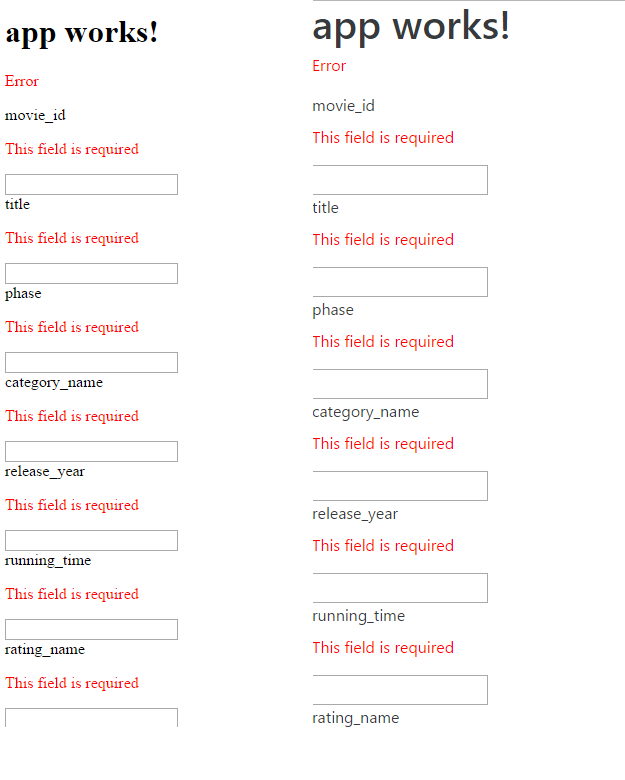Bootstrap 之前和之后。

如果我们使用 Google Chrome 的检查功能，我们可以清楚地看到我们的`h1`标记的应用样式来自 http://maxcdn.bootstrapcdn.com，如下面的屏幕截图所示：

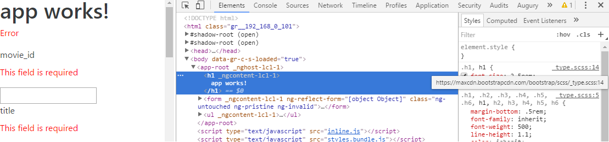Chrome 检查样式。

就是这样：我们完成了 Bootstrap 的初始化。让我们学习如何使用 Angular 指令来使用 Bootstrap。

# 理解网格系统

在本章中，我们更关心学习如何使用不同的 Angular Bootstrap 指令，而不是学习 Sass 混合和其他演示技巧。换句话说，网格系统的高级功能超出了本章的范围。然而，在本节中，我将快速介绍网格系统是什么，以及如何使用它的概述。

如果你以前使用过 Bootstrap，尤其是使用过网格系统，你可以跳过这一部分，直接进入下一部分，在那里我们学习如何使用手风琴指令。

因此，网格系统将我们的演示分成了十二列。列的大小可以是额外小、小、中、大和额外大。列的大小可以通过 CSS 类前缀（分别是`col-xs`、`col-sm`、`col-md`、`col-lg`和`col-xl`）手动设置，并对应不同的屏幕宽度（小于 540 像素、540 像素、720 像素、960 像素和 1140 像素）。

为了了解如何利用网格系统来分隔我们的演示，让我们在`src/app/app.component.html`中的`<h1>{{title}}</h1>`标记后面添加以下内容：

```ts
<div class="container">
   <div class="row">
     <div class="col-md-1">col-md-1</div>
     <div class="col-md-1">col-md-1</div>
     <div class="col-md-1">col-md-1</div>
     <div class="col-md-1">col-md-1</div>
     <div class="col-md-1">col-md-1</div>
     <div class="col-md-1">col-md-1</div>
     <div class="col-md-1">col-md-1</div>
     <div class="col-md-1">col-md-1</div>
     <div class="col-md-1">col-md-1</div>
     <div class="col-md-1">col-md-1</div>
     <div class="col-md-1">col-md-1</div>
     <div class="col-md-1">col-md-1</div>
   </div>
   <div class="row">
     <div class="col-md-8">col-md-8</div>
     <div class="col-md-4">col-md-4</div>
   </div>
   <div class="row">
     <div class="col-md-4">col-md-4</div>
     <div class="col-md-4">col-md-4</div>
     <div class="col-md-4">col-md-4</div>
   </div>
   <div class="row">
     <div class="col-md-6">col-md-6</div>
     <div class="col-md-6">col-md-6</div>
   </div>
 </div>

```

正如你所看到的，这里有几个 CSS 类在起作用。首先，让我们看看容器。这是必需的，它定义了 Bootstrap 网格系统将应用的空间。然后，我们有包含`col-`的行。每行占据屏幕的整个宽度，并被分成列。列的实际宽度取决于你在列类声明的末尾使用的数字（4、8、6 等）。知道行被分成 12 列，我们使用了`col-md`类前缀，我们可以推断出一行的最大尺寸是 720 像素。因此，每列宽 60 像素。在第一行中，我们在我们的声明中使用了`-1`后缀；因此，我们有 60 像素宽的列（即屏幕宽度除以 12）。然而，在第二行，我们使用了`-8`和`-4`后缀。

这意味着我们将有一列的宽度是`a-1`列的 8 倍（480 像素），另一列的宽度是`a-1`列的 4 倍（240 像素）。在第三行，我们使用了三个四列，最后，在第四行，我们有两个六列。

要查看发生了什么，请在`app/app.component.css`中添加以下内容：

```ts
.row > [class^="col-"]{
   padding-top: .75rem;
     padding-bottom: .75rem;
     background-color: rgba(86, 61, 124, 0.15);
     border: 1px solid rgba(86, 61, 124, 0.2);
 }

```

这段 CSS 将为任何`col`类添加背景和边框，无论它们可能具有的前缀或后缀是什么：

网格系统的运行。

正如你在上图中所看到的，空间被很好地按计划划分。现在，这并不是网格系统的真正优势。主要优势在于，如果屏幕宽度变小于 720 像素，列会自动堆叠在彼此上面。

例如，在 iPhone 6 上，其屏幕宽度为 375px，所有列将堆叠在一起，如下截图所示：

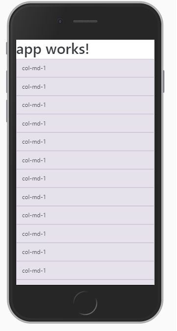iPhone 6 上的网格系统。

这是官方文档中的另一个例子，可以在[`v4-alpha.getbootstrap.com/layout/grid/`](https://v4-alpha.getbootstrap.com/layout/grid/)找到：

```ts
<!-- Stack the columns on mobile by making one full-width and the other half-width -->
 <div class="row">
   <div class="col-xs-12 col-md-8">.col-xs-12 .col-md-8</div>
   <div class="col-xs-6 col-md-4">.col-xs-6 .col-md-4</div>
 </div>

 <!-- Columns start at 50% wide on mobile and bump up to 33.3% wide on desktop -->
 <div class="row">
   <div class="col-xs-6 col-md-4">.col-xs-6 .col-md-4</div>
   <div class="col-xs-6 col-md-4">.col-xs-6 .col-md-4</div>
   <div class="col-xs-6 col-md-4">.col-xs-6 .col-md-4</div>
 </div>

 <!-- Columns are always 50% wide, on mobile and desktop -->
 <div class="row">
   <div class="col-xs-6">.col-xs-6</div>
   <div class="col-xs-6">.col-xs-6</div>
 </div>

```

我不会详细介绍网格系统，但知道你可以在 Packt Library 找到很多关于这个主题的精彩书籍。只需查找以下内容：

+   *精通 Bootstrap 4*

+   *Bootstrap 4 蓝图*

# 使用 Bootstrap 指令

在本节中，我们将学习如何使用一些最常用的 Bootstrap 指令来构建您的应用程序。

# 手风琴

我们将首先概述手风琴指令。手风琴允许您创建一个可以通过单击其各自的标题独立显示的不同内容面板。

我们将使用我们在第九章中制作的表单，*Angular 中的高级表单*，允许用户在漫威电影宇宙中添加电影，以实验手风琴。这里的目标是为表单设置一个面板，为电影的枚举设置另一个面板。

让我们从研究创建 Bootstrap 手风琴所需的最小 HTML 开始，如下所示：

```ts
<ngb-accordion>
   <ngb-panel>
     <template ngbPanelTitle>
       <span>Mastering angular X Bootstrap</span>
     </template>
     <template ngbPanelContent>
       Some deep insights
     </template>
   </ngb-panel>
   <ngb-panel>
     <template ngbPanelTitle>
       <span>Some Title</span>
     </template>
     <template ngbPanelContent>
       Some text
     </template>
   </ngb-panel>
 </ngb-accordion>

```

前面的 HTML 模板将产生以下结果：

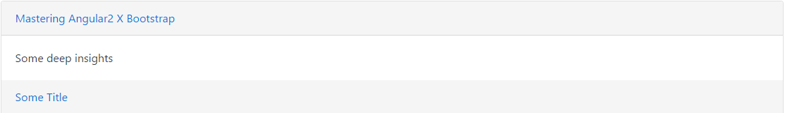一个简单的手风琴。

分析前面的代码片段，我们可以看到以下特点：

+   `ngb-accordion`：这是主要的手风琴指令。它定义了一个包含`ngb-panel`的手风琴。

+   `ngb-panel：` 这代表手风琴的一个面板。可以通过单击面板标题来切换其可见性。`ngb-panel`包含一个可以用于标题或内容的模板。

+   `<template ngbPanelContent>`：这包含给定面板的标题或内容。

+   `<template ngbPanelTitle>：` 这包含标题。

到目前为止，一切都相当简单。现在，它变得强大的地方是当您从您的 TypeScript 组件中管理它时。首先，`ngb-accordion`指令有三个不同的`@Input`属性，我们利用了它们。第一个是`activeIds`，它是`string[]`类型，包含您希望打开的面板的 ID。面板 ID 是从`ngb-panel-0`自动生成的。面板 ID 的格式为`ngb-panel-x`。第二个`@Input`是一个布尔值：`closeOthers`。这允许您指定是否一次只能打开一个面板。最后，使用`string`类型来指定手风琴的类型。在 Bootstrap 中，有四种类型被识别：`success`、`info`、`warning`和`danger`。

除了这三个`@Inputs`之外，`ngb-accordion`指令还提供了一个名为`panelChange`的`@Output`。这个`@Output`会在每次面板的可见性即将被切换时触发。

让我们通过将`app/app.component.html`转换为以下内容来尝试这些`@Input`和`@Output`属性：

```ts
<div class="container">

     <!-- First Row -->
     <div class="row">
         <h1 class="col-md-12">
           {{title}}
         </h1>
     </div>

     <!-- Second Row -->
     <div class="row">

         <!-- Start of the accordion -->
         <ngb-accordion class="col-md-12" 
         <!-- Bind to a variable called activeIds -->
         [activeIds]="activeIds" 
         <!-- Simply use the string 'success' -->
         type="success" 
         <!-- Simply use true -->
         closeOthers="true"
         <!-- Bind to the output -->
         (panelChange)=pannelChanged($event)
         >
           <!-- Firt pannel -->
           <ngb-panel>
             <template ngbPanelTitle>
               <span>Add a Movie</span>
             </template>
             <!-- Form content is here -->
             <template ngbPanelContent>
               <form [formGroup]="movieForm">
                 <!-- Form content omitted for clarity -->
               </form>
             </template>
           </ngb-panel>
           <!-- Second pannel -->
           <ngb-panel>
             <template ngbPanelTitle>
               <span>Movies</span>
             </template>
             <!-- Movie enumeration is here -->
             <template ngbPanelContent>

                 <ul>
                     <li *ngFor="let movie of movies">{{movie}}</li> 
                 </ul>

             </template>
           </ngb-panel>
         </ngb-accordion>

     </div>
 </div>

```

在这里，我们使用了`[activeIds]="activeIds"`、`type="success"`、`closeOthers="true"`和`(panelChange)=pannelChanged($event)`来绑定到我们组件中的一个名为`activeIds`的变量，将表单类型设置为`success`，并将`closeOthers`设置为 true。然后，我们将一个名为`pannelChanged`的方法绑定到`panelChange`输出。在`app.component.ts`中，我们需要添加`activeIds`变量和`pannelChanged`方法如下：

```ts
  private activeIds = ["ngb-panel-1"];

   private pannelChanged(event:{panelId:string, nextState:boolean}){
     console.log(event.nextState, event.panelId);
   }

```

在这里，`private activeIds = ["ngb-panel-1"];`允许我们定义`panel-1`（第二个）应该默认打开，并且`pannelChanged`方法应该接收一个由`panelId:string`和`nextState:boolean`组成的事件负载。我们记录了这两个负载属性。

应用程序现在看起来像下面截图中显示的那样：

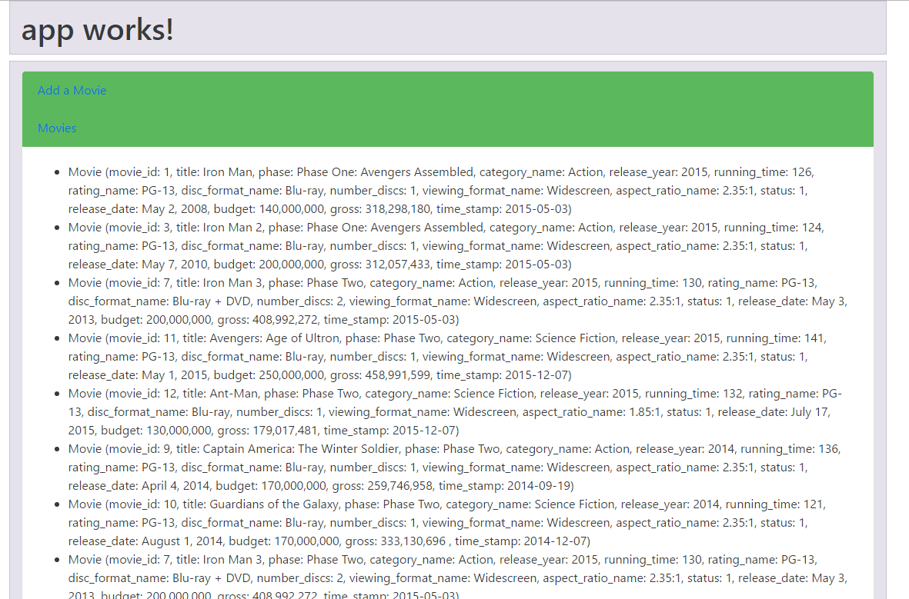一个由 TypeScript 管理的手风琴。

当您切换面板时，控制台会记录以下内容：

```ts
**true** "ngb-panel-0"
**false** "ngb-panel-0"  

```

# 警报

本章中我们将探讨的下一个指令是`ng-alert`。在 Bootstrap 词汇中，警报是以有色`div`形式显示给用户的重要信息。有四种类型的警报：`success`、`info`、`warning`和`danger`。

要创建一个 Bootstrap 警报，最小可行的 HTML 模板如下：

```ts
  <ngb-alert> 
    Something important 
  </ngb-alert> 

```

这段代码的结果如下截图所示：

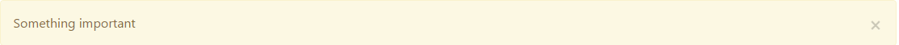一个基本的警报。

与手风琴类似，警报指令提供了一些`@Input`和`@Output`。我们可以使用`@Input`作为`dismissible:boolean`，它管理警报的可解除性，以及`type:string`，它接受`success`、`info`、`warning`和`danger`。

为了使我们的表单更具 Bootstrap 风格，我们可以用警报替换我们的错误消息。目前，在表单中，错误消息看起来像这样：

```ts
<p class='error' *ngIf=!movieForm.controls.movie_id.valid>This field is required</p>

```

现在的目标是有以下内容：

```ts
  <ngb-alert 
   [dismissible]="false" 
   *ngIf=!movieForm.controls.movie_id.valid
   type="danger"
   >
     This field is required
   </ngb-alert>

```

在上述片段中的每个字段，上述代码将产生以下结果：

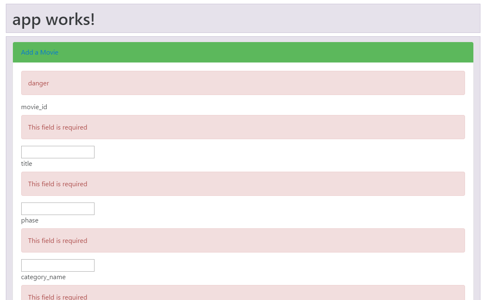危险警报作为表单错误。

# 日期选择器

本章中的下一个指令是日期选择器。无论您使用什么技术，日期总是有些棘手，因为每个供应商都提出了许多格式。此外，日期国际化使事情变得更加困难。

幸运的是，Bootstrap 带有一个足够简单的日期选择器，允许用户在弹出的日历中选择日期。其代码如下所示：

```ts
<div class="input-group">
   <input class="form-control" placeholder="yyyy-mm-dd" 
      ngbDatepicker #dp="ngbDatepicker">
   <div class="input-group-addon" (click)="dp.toggle()" >
     
    </div>
</div>

```

这里发生了很多事情。首先，我们有一个`formControl`输入，其占位符设置为`yyyy-mm-dd`。您定义的占位符很重要，因为它将作为用户选择的数据的强制格式化程序。对于格式化程序的语法，您可以使用日期的每个经典符号（例如，d、D、j、l、N、S、w、z 等）。换句话说，我们输入的日期将自动匹配此模式。然后，我们有`ngbDatepicker #d="ngbDatepicker"`。`ngbDatepicker`定义了我们的输入是一个`ngbDatepicker`，`#dp="ngbDatepicker"`允许我们创建对我们的输入的本地引用。这个名为`dp`的本地引用在以下`div`的`(click)`事件上使用：`(click)="dp.toggle()"`。这个`div`包含了日历的图像。点击它，一个动态的日历将弹出，我们将能够选择一个日期。

这个 HTML 将给我们以下内容：

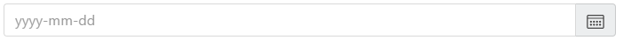日期选择器。

然后，一旦触发了`click`事件，将显示如下内容：

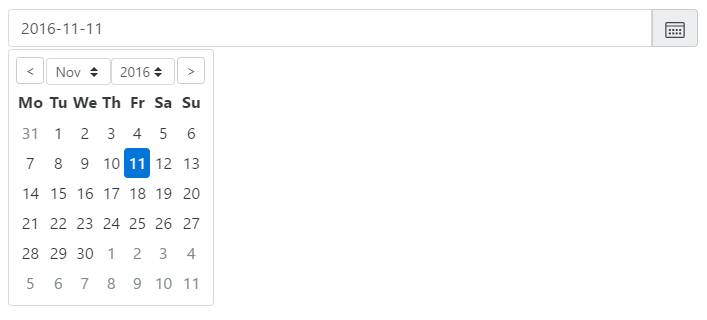日期选择器被点击。

为了改善我们对漫威电影宇宙的管理，我们可以将`release_date`字段更改为日期选择器。目前，`release_date`字段看起来像这样：

```ts
<label>release_date</label>
 <ngb-alert [dismissible]="false" type="danger" 
       *ngIf=!movieForm.controls.release_date.valid>This field is required</ngb-alert>
 <input type="text" formControlName="release_date" [(ngModel)]="movie.release_date"><br/>

```

如果字段无效，我们会有输入和 Bootstrap 警报。Bootstrap 警报默认是活动的（即当字段为空时）。让我们将我们的输入转换为以下内容：

```ts
  <label>release_date</label>
   <ngb-alert [dismissible]="false" type="danger" 
      *ngIf=!movieForm.controls.release_date.valid>This 
      field is required</ngb-alert>
   <div class="input-group">
     <input 
     formControlName="release_date" 
     placeholder="yyyy-mm-dd"  
     ngbDatepicker #dp="ngbDatepicker"
     [(ngModel)]="movie.release_date">
     <div class="input-group-addon" (click)="dp.toggle()" >
       
     </div>
   </div>

```

这里的不同之处在于我们将输入链接到了我们的`formControl`。实际上，在第九章 *Angular 中的高级表单*中，我们定义了表单如下：

```ts
this.movieForm =  this.formBuilder.group({
         movie_id: ['',  
           Validators.compose(
             [
              Validators.required,
              Validators.minLength(1), 
              Validators.maxLength(4), 
              Validators.pattern('[0-9]+'),
              MovieIDValidator.idNotTaken
             ]
           )
         ],
         title: ['', Validators.required],
         phase: ['', Validators.required],
         category_name: ['', Validators.required],
         release_year: ['', Validators.required],
         running_time: ['', Validators.required],
         rating_name: ['', Validators.required],
         disc_format_name: ['', Validators.required],
         number_discs: ['', Validators.required],
         viewing_format_name: ['', Validators.required],
         aspect_ratio_name: ['', Validators.required],
         status: ['', Validators.required],
         release_date: ['', Validators.required],
         budget: ['', Valida tors.required],
         gross: ['', Validators.required],
         time_stamp: ['', Validators.required]
});

```

所以，我们有一个必填的`release_date`字段。HTML 输入定义了与`release_date`字段的双向数据绑定，带有`[(ngModel)]="movie.release_date"`，此外，我们还需要在输入框内添加`formControlName="release_date"`属性。实施后，屏幕上将显示以下内容：

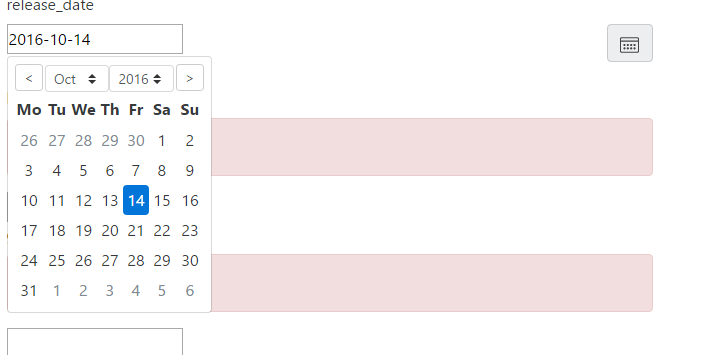MCU 的日期选择器。

# 工具提示

接下来，我们有 tooltip 指令，它允许我们在给定一组元素的左侧、右侧、顶部或底部显示信息性文本。

tooltip 指令是最简单的之一。实际上，你只需要为你希望增强的元素添加两个属性：placement 和`ngbTooltip`。placement 的值可以是 top、bottom、left 或 right，而`ngbTooltip`的值是你希望显示的文本。

让我们修改`movie_id`字段的标签：

```ts
<ngb-alert [dismissible]="false" type="danger" 
   *ngIf=!movieForm.valid>danger</ngb-alert>
<label >movie_id</label>
<ngb-alert [dismissible]="false" type="danger" 
  *ngIf=!movieForm.controls.movie_id.valid>This field 
    is required</ngb-alert>
  <input type="text" formControlName="movie_id" 
     [(ngModel)]="movie.movie_id" name="movie_id" >
   <br/> to 
    <ngb-alert [dismissible]="false" type="danger" 
       *ngIf=!movieForm.valid>danger</ngb-alert>
    <label placement="top" ngbTooltip="Title of
      your movie"> movie_id</label>
    <ngb-alert [dismissible]="false" type="danger" 
       *ngIf=!movieForm.controls.movie_id.valid>This 
    field is required</ngb-alert>
 <input type="text" formControlName="movie_id" 
    [(ngModel)]="movie.movie_id" name="movie_id" ><br/>

```

在这里，我们保持了警报和输入不变。但是，我们在标签中添加了 placement 和`ngbTooltip`属性。结果，当我们悬停在`movie_id`标签上时，电影标题将显示在顶部。如下截图所示：

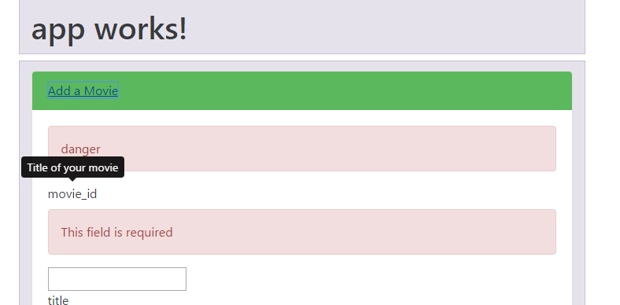movie_id 上的工具提示。

# 进度条

还有一些其他的 Bootstrap 组件可以用来增强我们的表单；然而，太多的组件很快就会成为可用性过度的情况。例如，将进度条集成到我们的表单中将会很棘手。然而，我们可以为我们想要测试的每个新的 Bootstrap 指令添加一个手风琴面板。

让我们为进度条添加一个面板：

```ts
<ngb-panel>
     <template ngbPanelTitle>
         <span>Progress Bar</span>
     </template>

     <template ngbPanelContent>

       <ngb-progressbar type="success" [value]="25"></ngb-progressbar>

    </template>
</ngb-panel>

```

`progressbar`指令是另一个简单的指令。它有两个`@Input`属性：type 和 value。和往常一样，type 可以是`success`、`danger`、`warning`或`info`。value 属性可以绑定到一个 TypeScript 变量，而不是像我做的那样硬编码为 25。

这是结果：

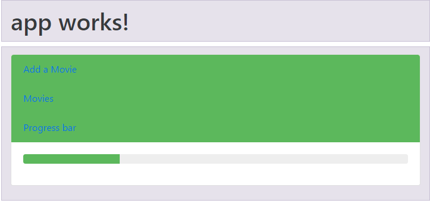movie_id 上的进度条。

# 评分

评分指令也是非常出名的。它允许用户对某物进行评分，或者显示给定的评分。

正如预期的那样，这个指令很容易理解。它有一个评分输入，您可以硬编码（例如，`"rate"=25`），绑定（`[rate]="someVariable"`），或者应用双向数据绑定（`[(rate)]="someVariable"`）。除了评分输入，您还可以使用`[readonly]="read-only"`来使您的评分条不可修改。

默认情况下，评分条由 10 颗星组成。评分值可以从 0 到 10，包括小数。

以下是一个新面板内默认评分条的示例：

```ts
<ngb-panel>
        <template ngbPanelTitle>
           <span>Rating bar</span>
         </template>
         <template ngbPanelContent>

            <ngb-rating rate="5"></ngb-rating>

          </template>
  </ngb-panel>

```

这将产生以下结果：

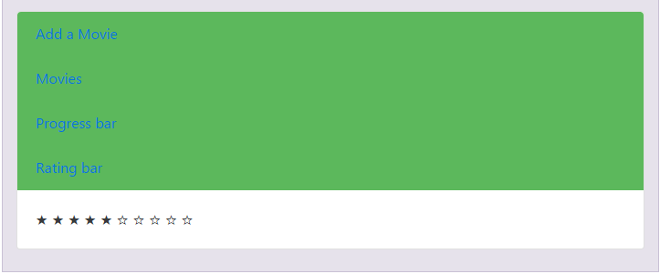评分条。

# 摘要

在本章中，我们看到了一些最受欢迎的 Bootstrap 组件。我们学会了如何使用 ng2-Bootstrap 包提供的原生 Angular 指令来使用它们。然而，我们并没有探索每一个 Bootstrap 组件。您可以查看托管在[`ng-bootstrap.github.io/`](https://ng-bootstrap.github.io/)的官方文档。

在下一章中，您将学习如何使用单元测试来测试您的 Angular 应用程序。
