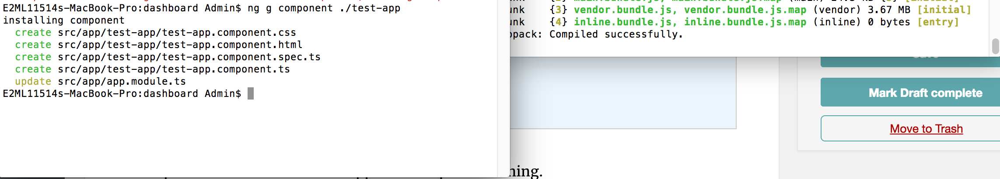
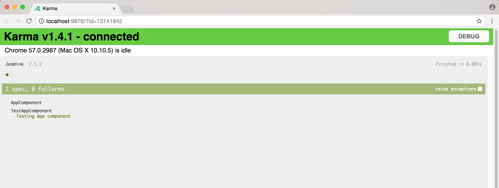
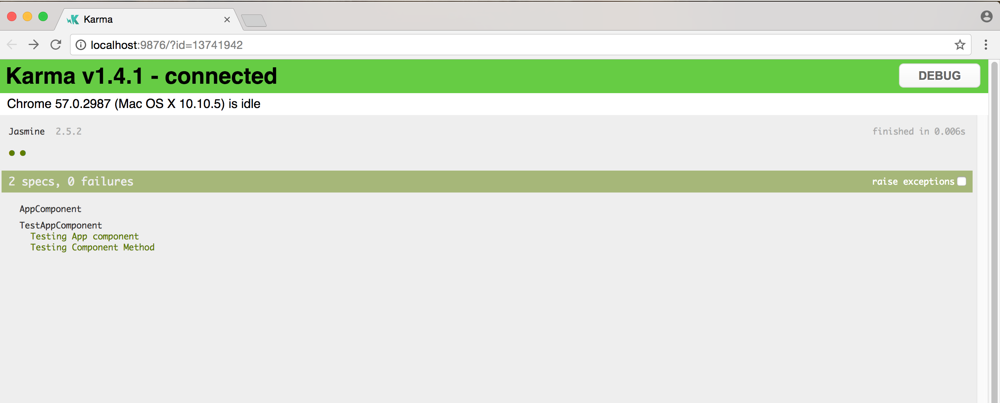
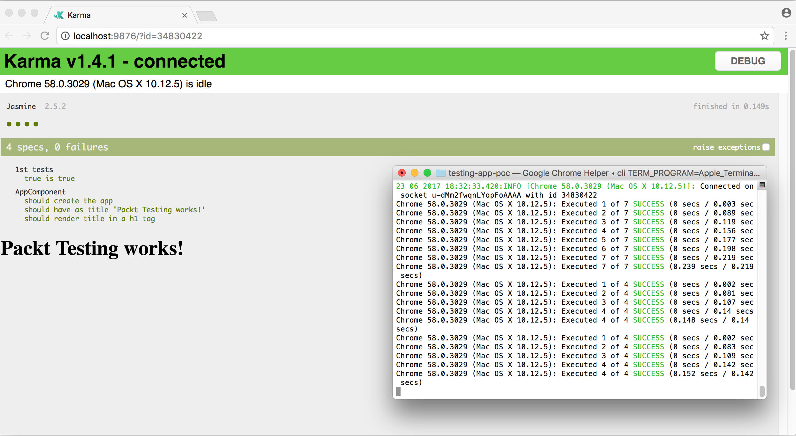
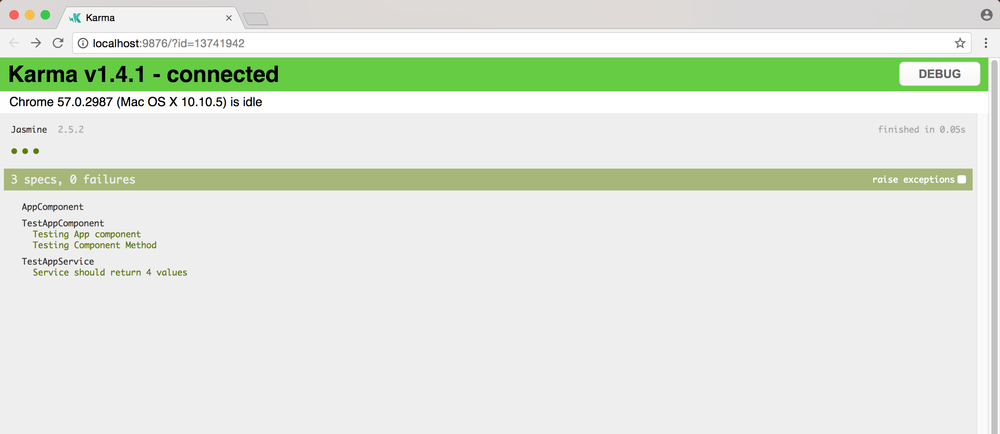
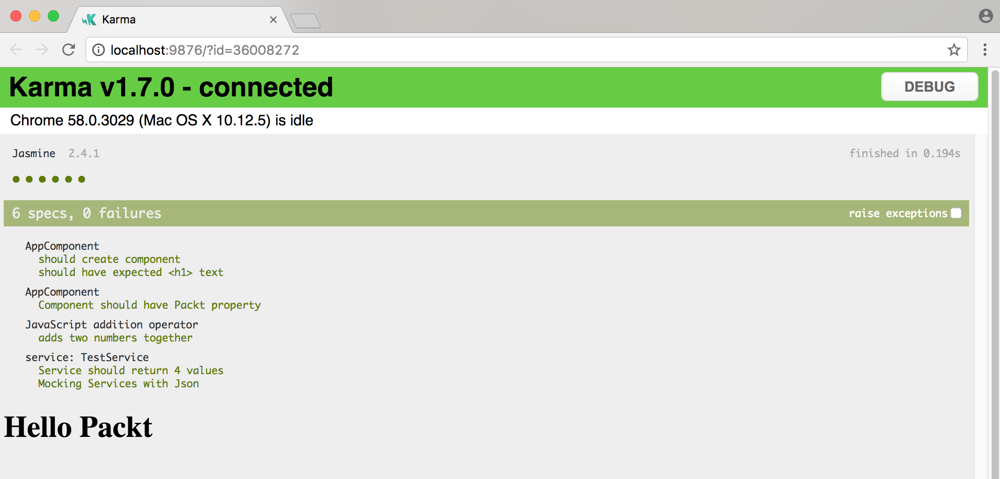
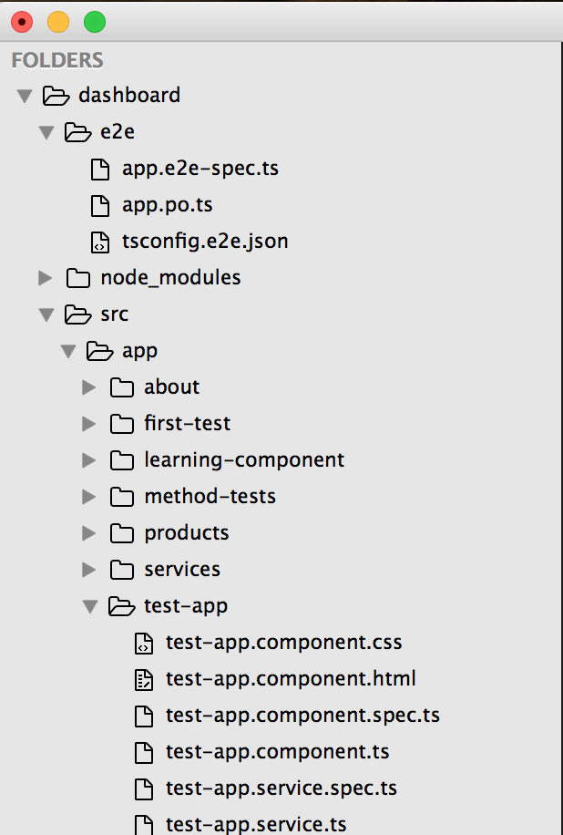
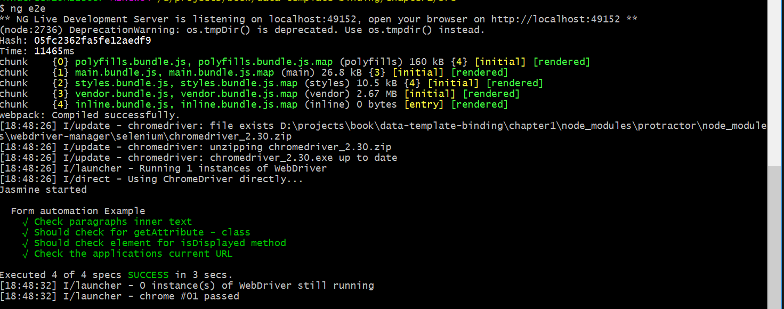
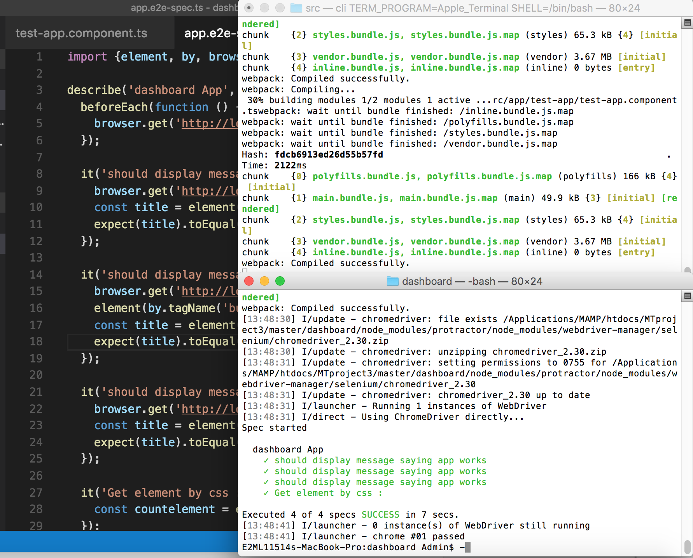

# 第十五章：使用 Jasmine 和 Protractor 框架测试 Angular 应用程序

测试是现代应用程序开发过程中最重要的方面之一。我们甚至有专门的软件开发方法论，主要是基于测试优先的方法。

除了 Angular 提供的测试工具之外，还有一些推荐的框架，如 Jasmine、Karma 和 Protractor，使用这些框架可以轻松创建、维护和编写测试脚本。使用 Jasmine 和 Protractor 编写的测试脚本可以节省时间和精力，并且最重要的是在开发过程中更早地发现缺陷。

在本章中，您将学习如何使用 Jasmine 和 Protractor 测试 Angular 应用程序。在本章中，我们将讨论以下内容：

+   了解测试中的重要概念

+   了解 Angular CLI 用于单元测试特定环境

+   介绍 Jasmine 框架

+   使用 Jasmine 编写测试脚本

+   编写测试脚本来测试 Angular 组件

+   测试 Angular 组件：一个高级示例

+   使用 Jasmine 测试脚本测试 Angular 服务

+   学习 Protractor

+   使用 Protractor 编写 E2E 测试脚本

# 测试中的概念

在我们开始测试我们的 Angular 应用程序之前，重要的是我们快速复习并了解一些在测试中常用的术语：

+   **单元测试**：一个单元测试可以被视为应用程序中最小的可测试部分。

+   **测试用例**：这是一组测试输入、执行条件和期望结果，以实现一个目标。在 Jasmine 框架中，这些被称为规范。

+   **TestBed**：TestBed 是一种通过传递所有必需的数据和对象来以隔离的方式测试特定模块的方法。

+   **测试套件**：这是一组旨在用于端到端测试模块的测试用例集合。

+   **系统测试**：对完整和集成的系统进行的测试，以评估系统功能。

+   **端到端测试**：这是一种测试方法，用于确定应用程序的行为是否符合要求。我们传递数据、必需对象和依赖项，并在模拟实时用例和场景的情况下从头到尾执行。

既然我们知道了前面的术语，让我们学习如何测试 Angular 应用程序。

# 了解并设置 Angular CLI 进行测试

到目前为止，我们已经使用 Angular CLI 来设置我们的项目，创建新组件、服务等。我们现在将讨论如何使用命令行工具来设置和执行测试套件，以测试我们的 Angular 应用程序。

首先，快速回顾如何使用 Angular CLI 快速创建项目：

```ts
npm install -g angular-cli

```

使用上述代码片段，我们安装了 Angular 命令行工具。现在，让我们创建一个名为`test-app`的新目录并进入项目目录：

```ts
ng new test-app
cd test-app

```

现在是时候快速创建一个名为`test-app`的新组件了：

```ts
ng g component ./test-app

```

现在，我们将看到以下输出：



我们应该看到新目录和相应的文件在目录中创建。命令行工具已经创建了与组件相关的四个文件，包括`test-app.component.spec.ts`测试脚本占位符文件。

现在，让我们启动我们的应用程序：

```ts
ng serve

```

此时，我们的应用程序已经启动。现在是时候开始测试我们的 Angular 应用程序了。

# Jasmine 框架介绍

Jasmine 是一个用于测试 JavaScript 代码的行为驱动开发框架。这是官方网站如何解释 Jasmine 的方式：

Jasmine 是一个用于测试 JavaScript 代码的行为驱动开发框架。它不依赖于任何其他 JavaScript 框架。它不需要 DOM。它有一个清晰明了的语法，让您可以轻松编写测试。

Jasmine 测试套件的一般语法如下所示：

```ts
describe("Sample Test Suite", function() {
 it("This is a spec that defines test", function() {
   expect statement // asserts the logic etc
 });
});

```

让我们分析上述代码片段，以了解测试套件语法。已经按照以下步骤进行了操作：

1.  每个 Jasmine 测试套件都将有一个`describe`语句，我们可以给出一个名称。

1.  在测试套件内，我们使用`it`语句创建较小的测试用例；每个测试用例将有两个参数，一个名称和一个函数，其中包含需要测试的应用程序逻辑。

1.  我们使用`expect`语句来验证数据，以确保我们的应用程序和数据按预期工作。

在下一节中，您将详细了解 Jasmine 框架和可用的方法和函数，我们可以在测试脚本中使用。

# Jasmine 框架 - 我们可以使用的全局方法

Jasmine 框架支持并为我们提供了许多预定义的方法来使用和编写我们的测试套件。 Jasmine 对测试环境、对元素进行间谍操作等提供了广泛的支持。请参阅官方网站以获取有关可用方法的完整帮助和文档。

为了编写测试脚本，我们需要对 Jasmine 框架中最常用和频繁使用的一些方法有基本的理解和知识。

# Jasmine 中常用的方法

以下是编写测试套件可用的最常用的 Jasmine 全局方法列表：

| **全局方法** | **描述** |
| --- | --- |
| describe | describe 函数是实现测试套件的代码块 |
| it | 通过调用全局 Jasmine 函数`it`来定义规范，如所述，它接受一个字符串和一个函数 |
| beforeEach | 此方法在调用它的描述中的每个规范之前调用一次 |
| afterEach | 此方法在每个规范后调用一次 |
| beforeAll | 此方法在描述中的所有规范之前调用一次 |
| afterAll | 此方法仅在所有规范调用后调用一次 |
| xdescribe | 这会暂时禁用您不想执行的测试 |
| pending | 未运行的待定规范将被添加到待定结果列表中 |
| xit | 任何使用 xit 声明的规范都会被标记为待定 |
| spyOn | 间谍可以替换任何函数并跟踪对它的调用和所有参数；这在描述或 it 语句内部使用 |
| spyOnProperty | 对间谍的每次调用都会被跟踪并暴露在 calls 属性上 |

有关更多详细信息和完整文档，请参阅 GitHub 上的 Jasmine 框架文档。

# Angular CLI 和 Jasmine 框架-第一个测试

安装 Angular CLI 时，Jasmine 框架会自动与工具一起提供。

在前面的部分中，我们看到了在 Jasmine 中编写测试的一般语法。现在，让我们使用 Jasmine 框架编写一个快速的测试脚本：

```ts
describe('JavaScript addition operator', function () {  it('adds two numbers together', function () {  expect(1 + 2).toEqual(3); }); });

```

以下是关于前面的测试脚本的重要事项：

1.  我们编写一个`describe`语句来描述测试脚本。

1.  然后我们使用`it`语句和相应的方法定义一个测试脚本。

1.  在`expect`语句中，我们断言两个数字，并使用`toEqual`测试两个数字的相加是否等于`3`。

# 使用 Jasmine 测试 Angular 组件

现在是时候使用 Jasmine 框架创建我们的测试套件了。在第一部分“理解和设置用于测试的 Angular CLI”中，我们使用`ng`命令创建了`TestAppComponent`组件和`test-app.component.ts`文件。我们将在本节中继续使用相同的内容。

要开始，请添加以下代码文件的所有内容：

```ts
import { async, ComponentFixture, TestBed } from '@angular/core/testing';

import { TestAppComponent } from './test-app.component';

describe('Testing App Component', () => {
   it('Test learning component', () => {
    let component = new TestAppComponent();
    expect(component).toBeTruthy();
   });
});

```

让我们逐步分析前面的测试套件步骤。在代码块中遵循的步骤如下：

1.  在第一步中，我们从`@angular/core/testing`导入了所有所需的测试模块。

1.  我们导入了新创建的组件`TestAppComponent`。

1.  我们通过编写一个带有名称的`describe`语句`Testing App Component`来创建了一个测试套件。

1.  我们使用`it`和相应的方法`() =>`编写了一个测试脚本。

1.  我们创建了一个`TestAppComponent`类的`component`对象。

1.  然后我们断言返回的值是否为 true。如果将该值强制转换为`boolean`后得到 true，则该值为`toBeTruthy`。

所有编写的测试套件都将以`.spec.ts`扩展名结尾，例如`test-app.component.spec.ts`。

我们目前做得很好！太棒了，现在我们将运行我们的测试套件并查看其输出。

我们仍在使用 Angular CLI 工具；让我们在项目目录中使用`ng`命令运行测试，并在终端中运行以下命令：

```ts
ng test

```

命令行工具将构建整个应用程序，打开一个新的 Chrome 窗口，使用 Karma 测试运行器运行测试，并运行 Jasmine 测试套件。

Karma 测试运行器会生成一个在浏览器中执行所有测试并监视`karma.conf.js`中指定的所有配置的 Web 服务器。我们可以使用测试运行器来运行各种框架，包括 Jasmine 和 Mocha。Web 服务器会收集所有捕获浏览器的结果并显示给开发人员。

我们应该看到如下截图所示的输出：



如果你看到了前面的截图，恭喜你。你已成功执行了测试套件，并注意测试脚本已通过。

恭喜！现在让我们深入研究并为测试组件和服务创建更复杂的测试脚本。

# 使用 Jasmine 测试 Angular 组件

在我们之前的示例中，我们已经看到了编写测试脚本和测试 Angular 组件的基本示例。

在本节中，我们将探讨编写测试 Angular 组件的最佳实践。我们将使用在前一节中创建的相同组件--`TestAppComponent`--并通过添加变量和方法来扩展测试套件。

在`test-app.component.ts`文件中，让我们创建一些变量并将它们映射到视图中：

```ts
import { Component, OnInit } from '@angular/core';

@Component({
 selector: 'app-test-app',
 templateUrl: './test-app.component.html',
 styleUrls: ['./test-app.component.css']
})
export class TestAppComponent implements OnInit {
  public authorName = 'Sridhar';
}

```

让我们分析在我们的`test-app.component.ts`文件中编写的前面的代码：

1.  我们创建了一个组件--`TestAppComponent`。

1.  我们在`templateUrl`和`styleUrls`中映射了相应的 HTML 和 CSS 文件。

1.  我们声明了一个名为`authorName`的公共`变量`，并赋予了值`'Sridhar'`。

现在，让我们转到`test-app.component.spec.ts`。我们将编写我们的测试套件，并定义一个测试用例来验证`authorName`是否与传递的字符串匹配：

```ts
import { async, ComponentFixture, TestBed } from '@angular/core/testing';
import { TestAppComponent } from './test-app.component';

 describe('TestAppComponent', () => {
  it('Testing App component', () => {
   let component = new TestAppComponent();
   expect(component.authorName).toMatch('Sridhar');
  });
});

```

让我们分析在`test-app.component.spec.ts`文件中前面的代码片段。已遵循以下步骤来编写代码块：

1.  我们导入了所有必需的模块`async`、`componentFixture`和`TestBed`来运行测试。

1.  我们通过编写`describe`语句并分配`Testing App Component`名称来创建了一个测试套件。

1.  我们创建了一个测试用例，并创建了`TestAppComponent`类的新实例。

1.  在`expect`语句中，我们断言`authorName`变量是否与字符串匹配。结果将返回 true 或 false。

很好！到目前为止，一切顺利。现在，继续阅读。

是时候将其提升到下一个级别了。我们将向`component`类添加新方法，并在`specs`文件中对它们进行测试。

在`test-app.component.ts`文件中，让我们添加一个变量和一个方法：

```ts
import { Component, OnInit } from '@angular/core';

@Component({
 selector: 'app-test-app',
 templateUrl: './test-app.component.html',
 styleUrls: ['./test-app.component.css']
})
export class TestAppComponent {
 public authorName = 'Sridhar';
 public publisherName = 'Packt'

 public hiPackt() {
 return 'Hello '+ this.publisherName;
 }
}

```

让我们创建`test-app.component.spec.ts`文件，并测试在`component`类中定义的变量和方法。

在`test-app.component.spec.ts`文件中，添加以下代码行：

```ts
it('Testing Component Method', () => {
 let component = new TestAppComponent();
 expect(component.hiPackt()).toBe("Hello Packt");
});

```

让我们详细分析前面的代码片段。已遵守以下步骤：

1.  我们创建了一个测试用例，并创建了`TestAppComponent`类的`component`实例。

1.  在`expect`语句中，我们断言并验证传递的字符串是否与`hiPackt`方法的返回值匹配。

在运行前面的测试脚本之前，让我们也快速看一下另一个测试用例：

```ts
describe('TestAppComponent', () => {  beforeEach(function() {
  this.app = new TestAppComponent();
 });  it('Component should have matching publisher name', function() {
  expect(this.app.publisherName).toBe('Packt');
 }); });

```

让我们分析前面的代码片段：

1.  我们实现了`beforeEach` Jasmine 方法。我们在每个测试脚本之前创建一个`AppComponent`的实例。

1.  我们编写了一个测试脚本，并使用了组件的实例，也就是`this.app`，我们获取了`publisherName`变量的值，并断言`publisherName`变量的值是否与`toBe('Packt')`匹配。

现在，测试应该自动构建，否则调用`ng test`来运行测试。

我们应该看到以下截图：



太棒了！您学会了编写测试脚本来测试我们的 Angular 组件，包括变量和方法。

您学会了使用 Jasmine 框架的一些内置方法，比如`beforeEach`、`expect`、`toBeTruthy`和`toBe`。

在下一节中，我们将继续学习高级技术，并编写更多的测试脚本，以更详细地测试 Angular 组件。

# 测试 Angular 组件-高级

在本节中，我们将更深入地探讨并学习测试 Angular 组件的一些更重要和高级的方面。

如果你注意到，在前面部分的示例中可以注意到以下内容：

1.  我们在每个测试用例中单独创建了对象的实例。

1.  我们必须为每个测试用例单独注入所有的提供者。

相反，如果我们可以在每个测试脚本之前定义组件的实例，那将是很好的。我们可以通过使用`TestBed`来实现这一点--这是 Angular 提供的用于测试的最重要的实用程序之一。

# TestBed

`TestBed`是 Angular 提供的最重要的测试实用程序。它创建了一个 Angular 测试模块--一个`@NgModule`类，我们可以用于测试目的。

由于它创建了一个`@NgModule`，我们可以定义提供者、导入和导出--类似于我们常规的`@NgModule`配置。

我们可以在`async`或`sync`模式下配置`TestBed`。

+   为了异步配置`TestBed`，我们将使用`configureTestingModule`来定义对象的元数据。

+   为了同步配置`TestBed`，我们将根据前面部分的讨论定义组件的对象实例。

现在，让我们看一下以下代码片段：

```ts
beforeEach(() => {  fixture = TestBed.createComponent(AppComponent);
  comp = fixture.componentInstance;
  de = fixture.debugElement.query(By.css('h1'));
 });

```

在前面的代码片段中需要注意的重要事项：

1.  我们定义了`beforeEach`，这意味着这段代码将在每个测试用例运行之前运行。

1.  我们使用`TestBed`创建了一个组件实例。

1.  使用`TestBed`同步方式，我们定义了一个`fixture`变量，它创建了组件`AppComponent`。

1.  使用`componentInstance`，我们创建了一个`comp`变量，它是`AppComponent`的一个测试实例。

1.  使用`debugElement`函数，我们可以在视图中定义和定位特定的元素。

1.  使用`debugElement`，我们可以通过 CSS 元素选择器来定位单个元素。

现在，使用前面的`beforeEach`方法，该方法具有组件实例，我们将创建用于测试 Angular 组件的测试脚本。

# 示例 - 使用变化检测编写测试脚本

在本节中，我们将继续编写一些带有变化的测试脚本单元测试。我们还将实现变化检测和元素跟踪。

让我们开始创建一个简单的`app.component.ts`组件：

```ts
import { Component } from '@angular/core';

@Component({
 selector: 'test-root',
 templateUrl: './app.component.html',
 styleUrls: ['./app.component.css']
})

export class AppComponent {
 title = 'Packt Testing works';
}

```

让我们分析上述代码片段：

1.  我们创建了一个`AppComponent`组件类。

1.  我们声明了一个具有值的`title`变量。

1.  我们将组件的模板和样式文件映射到它们各自的`templateUrl`和`styleUrls`。

在`app.component.html`中，添加以下代码：

```ts
<h1> {{ title }} </h1>

```

在上述代码中，我们正在添加一个`<h1>`标签并映射`title`变量。

现在，是时候创建我们的测试脚本，其中包含多个断言。但在编写测试脚本之前，让我们了解用例：

1.  我们将编写脚本来检查是否创建了`ChangeDetectTestComponent`。

1.  我们将编写断言来检查`title`是否等于`Packt Testing works`。

1.  最后，我们将检查变化检测并验证`h1`标记是否应呈现并包含值`Packt Testing works`。

1.  我们还将利用`querySelector`来定位特定的元素并匹配值。

现在，让我们来看看前面用例的测试脚本：

```ts
import { async, ComponentFixture, TestBed } from '@angular/core/testing';
import { ChangeDetectTestComponent } from './change-detect-test.component';
import { By } from '@angular/platform-browser';
import { DebugElement } from '@angular/core';

describe('ChangeDetectTestComponent', () => {

 let comp:ChangeDetectTestComponent;
   let fixture: ComponentFixture<ChangeDetectTestComponent>;
   let de:DebugElement;
   let el:HTMLElement;

 beforeEach(() => {
    TestBed.configureTestingModule({
      declarations: [ ChangeDetectTestComponent ]
    });
    fixture = TestBed.createComponent(ChangeDetectTestComponent);
    comp = fixture.componentInstance;
    de = fixture.debugElement.query(By.css('h1'));
    el = de.nativeElement;
  });

it('should have as title 'Packt Testing works!'', async(() => {
   const fixture = TestBed.createComponent(ChangeDetectTestComponent);
   const app = fixture.debugElement.componentInstance;
   expect(app.title).toEqual('Packt Testing works');
 }));

it('should render title in a h1 tag', async(() => {
  const fixture = TestBed.createComponent(ChangeDetectTestComponent);
  fixture.detectChanges();
  const compiled = fixture.debugElement.nativeElement;
  expect(compiled.querySelector('h1').textContent).toContain('Packt   
    Testing works');
 }));
});

```

让我们详细分析上述代码片段：

1.  我们从`angular/core/testing`中导入所需的模块，即`TestBed`，`ComponentFixture`和`async`。

1.  我们定义`beforeEach`并初始化变量`fixture`，`comp`和`de`。

1.  在第一个测试脚本中，我们为组件编写了一个简单的期望语句，即`tobeTruthy`。

1.  在第二个测试脚本中，我们通过`TestBed.createComponent`创建了组件的实例。

1.  使用`debugElement`，我们创建了已创建组件的实例，即`app`。

1.  使用`app`组件的实例，我们能够获取组件的`title`并断言`toEqual`。

1.  在最后一个测试脚本中，我们使用`async`方法。我们利用`debugElement`的`nativeElement`方法并定位一个元素--在我们的情况下是`<h1>`，并检查标题是否包含`Packt Testing Works`。

1.  第二个和第三个测试脚本之间的区别在于我们使用了`async`方法，并等待变化被检测--`detectChanges`--在第三个测试脚本中。

运行测试，我们应该看到如下截图所示的输出：



在本节中，您学会了如何使用`beforeEach`为所有测试脚本创建一个组件实例，以及如何使用`nativeElement`来定位任何元素。

我们使用`detectChanges`方法来识别元素中发生的变化。

在接下来的部分，我们将继续学习有关 Jasmine 框架测试 Angular 服务的更多知识。

# 测试 Angular 服务

在本节中，我们将学习有关测试 Angular 服务的知识。

在大多数 Angular 应用程序中，编写服务是一个重要且核心的方面，因为它执行与后端服务的交互；创建和共享组件之间的数据，并且在长期内易于维护。因此，确保我们彻底测试我们的 Angular 服务同样重要。

让我们学习如何编写测试脚本来测试我们的服务。为了测试一个服务，让我们首先使用`ng`命令创建一个服务。

在您的终端中运行以下命令：

```ts
ng g service ./test-app/test-app

```

上述命令将在`test-app`文件夹中生成`test-app.service.ts`和`test-app.service.spec.ts`文件。

服务是可注入的，这意味着我们必须将它们导入到它们各自的组件中，将它们添加到提供者列表中，并在组件构造函数中创建服务的实例。

我们修改`test-app.service.ts`并向其中添加以下代码：

```ts
import { Injectable } from '@angular/core';

@Injectable()
export class TestAppService {

  getAuthorCount() {
    let Authors =[
      {name :"Sridhar"},
      {name: "Robin"},
      {name: "John"},
      {name: "Aditi"}
   ];
  return Object.keys(Authors).length;
 };
}

```

从上述代码片段中注意以下重要事项：

1.  我们从 Angular 核心中导入了`injectable`。

1.  我们定义了`@injectable`元数据，并为我们的服务创建了一个类--`TestAppService`。

1.  我们定义了`getAuthorCount`方法来返回作者的数量。

我们需要将服务类导入并注入到组件中。为了测试上述服务，我们将在`test-app.service.specs.ts`文件中编写我们的测试脚本。

我们编写测试服务的方式与编写测试组件的方式类似。

现在，让我们通过在`test-app.service.spec.ts`文件中添加以下代码来创建测试套件以测试一个服务：

```ts
import { TestBed, inject } from '@angular/core/testing';
import { TestAppService } from './test-app.service';

describe('TestAppService', () => {
 beforeEach(() => {
 TestBed.configureTestingModule({
 providers: [TestAppService]
 });
 });

 it('Service should return 4 values', inject([TestAppService], 
  (service: TestAppService) => {
     let countAuthor = service.getAuthorCount;
     expect(countAuthor).toBe(4);
 }));

});

```

上述代码的分析如下：

1.  我们将所需的模块`TestBed`和`inject`导入到`spec`文件中。

1.  我们将`TestAppService`服务导入`spec`文件。

1.  使用**依赖注入**（**DI**），我们创建了`TestAppService`的`service`实例。

1.  我们创建一个测试用例；我们需要注入服务，调用`getAuthorCount`方法，并断言该值是否等于`4`。

当我们运行测试时，以下截图显示了输出：



在本节中，您学习了使用 Jasmine 测试脚本对 Angular 组件和服务进行单元测试。

我们必须在每个测试用例中使用 DI 来注入服务。

# 测试 Angular 服务-模拟后端服务

在前面的部分，您学习了如何编写测试脚本来测试我们的 Angular 服务。在本节中，我们将编写一个测试脚本，并学习如何在实时项目中模拟后端服务。

以下是我们将为其编写测试脚本的用例：

1.  编写一个测试脚本来测试服务中的方法。

1.  编写一个测试脚本来检查方法的返回值是否包含特定值。

1.  编写一个测试脚本来模拟后端连接使用`mockBackend`，并检查目标 URL 是否正确。

1.  编写一个测试脚本来为请求 URL 设置`mockResponse`。

1.  最后，调用`service`中编写的方法并映射响应，这应该等于`mockResponse`。

让我们创建我们的服务`test.service.ts`文件，并将以下代码添加到其中：

```ts
import { Injectable } from  '@angular/core'; import { Http } from  '@angular/http'; import { Observable } from  'rxjs'; import  'rxjs/add/operator/map'; @Injectable() export  class  TestService {
 constructor (private  http: Http) {}

 getpublications() {
    return ['Packt', 'Packt PDF', 'Packt Video'];
  }

  getproducts() {
    return  this.http.get('someurl1').map((response) =>  response);
  }

 search(term: string): Observable<any> {
   return  this.http.get(
      'someurl'
    ).map((response) =>  response.json());
  }
}

```

在前面的代码片段中需要注意的重要事项如下：

1.  我们将所需的模块导入`spec`文件，即从`Angular/core`导入`injectable`。

1.  我们将所需的模块导入`spec`文件，即从`Angular/http`导入`Http`。

1.  我们将所需的模块导入`spec`文件，即从`Angular/rxjs`导入`Observable`。

1.  我们正在为`TestService`创建组件类。

1.  我们正在使用`@injectable`装饰器，这将允许服务被注入到任何组件或服务中。

1.  在构造函数中，我们注入`HTTP`服务并创建一个 HTTP 实例。

1.  我们正在创建三个方法：`getPublications`，`getProducts`和`search`。

1.  在`getProducts`中，我们正在进行 HTTP 调用，当然，我们使用它来模拟服务器 URL。

1.  我们正在将 HTTP 请求的响应映射到`response`变量。

现在我们的服务准备就绪，我们可以开始编写我们的测试规范文件来测试变量和方法。

在`spec`文件中编写测试脚本之前，让我们创建一个`beforeEach`方法，其中将包含所有的初始化，并在每个测试脚本之前注册提供者：

```ts
  beforeEach(() => {  TestBed.configureTestingModule({
  imports: [ HttpModule ],  providers: [ {  provide:  XHRBackend,
  useClass:  XHRBackend
 }, TestService ]
 }); });

```

就像我们为测试 Angular 组件定义了`beforeEach`方法一样，我们也为服务定义了`beforeEach`方法。在提供者数组配置中，我们正在注册`XHRBackend`类。

由于服务依赖于其他模块并需要提供者，我们需要使用`configureTestingModule`来定义和注册所需的服务。

让我们详细分析前面的代码片段：

1.  我们正在定义一个`beforeEach`方法，它将在每个测试脚本之前执行。

1.  使用`TestBed`，我们正在使用`configuringTestingModule`配置测试模块。

1.  由于`configureTestingModule`中传递的参数类似于传递给`@NgModule`装饰器的元数据，我们可以指定提供者和导入项。

1.  在`imports`中，我们导入`HttpModule`。

1.  我们在提供者列表中配置所需的依赖项--`XHRBackend`和`TestService`。

1.  我们正在注册一个提供者，使用一个注入令牌`XHRBackend`并将提供者设置为`XHRBackend`，这样当我们请求提供者时，DI 系统会返回一个`XHRBackend`实例。

现在我们可以创建`spec`文件`test.service.spec.ts`，并将以下代码添加到文件中：

```ts
import {TestService} from  './test.service'; import { TestBed, inject } from  '@angular/core/testing'; import { MockBackend, MockConnection} from  '@angular/http/testing'; import { HttpModule,XHRBackend, ResponseOptions,Response, RequestMethod } from  '@angular/http'; const  mockResponse = { 'isbn':  "123456",
  'book': {  "id":  10,
  "title":  "Packt Angular"
 } }; const  mockResponseText = 'Hello Packt'; describe('service: TestService', () => {  beforeEach(() => {  TestBed.configureTestingModule({
  imports: [ HttpModule ],  providers: [ {  provide:  XHRBackend,
  useClass: XHRBackend  }, TestService]
 }); });  it('Service should return 4 publication values',    
    inject([TestService, XHRBackend], (service: TestService, 
      XHRBackend: XHRBackend) => {  let  names = service.getpublications();
  expect(names).toContain('Packt');
  expect(names).toContain('Packt PDF');
  expect(names).toContain('Packt Video');
  expect(names.length).toEqual(3);
 }));  it('Mocking Services with Json', inject([TestService, XHRBackend], 
     (service: TestService, XHRBackend: XHRBackend) => {  const  expectedUrl = 'someurl';
 XHRBackend.connections.subscribe(
 (connection: MockConnection) => {  expect(connection.request.method).toBe(RequestMethod.Get);
  expect(connection.request.url).toBe(expectedUrl);
  connection.mockRespond(new  Response(
  new  ResponseOptions({ body:  mockResponse }) )); });  service.getbooks().subscribe(res  => {  expect(res).toEqual(mockResponse);
 }); })); });

```

这是一个很长的代码片段，让我们分解进行分析：

1.  我们将`TestService`服务文件导入到`spec`文件中。

1.  我们从`@angular/core/testing`中导入所需的模块`TestBed`和`inject`。

1.  我们从`@angular/http/testing`中导入模块`MockBackend`和`MockConnection`。

1.  我们从`@angular/http`中导入模块`HttpModule`、`XHRBackend`、`ResponseOptions`、`Response`和`RequestMethod`。

1.  我们定义了一个`mockResponse`变量，其中包含一个临时的`json`对象。

1.  我们还定义了一个`mockResponseText`变量并为其赋值。

1.  我们将使用之前定义的`beforeEach`方法，通过它我们将注册所有的提供者和依赖项。

1.  在第一个测试脚本中，我们将`TestService`实例注册为`service`，将`XHRBackend`实例注册为`XHRBackend`。

1.  我们调用`service.getpublications()`方法，它将返回数组。

1.  在结果名称中，我们断言值应包含作为测试数据传递的字符串。

1.  在第二个测试脚本中，我们使用`mockBackend`创建连接，并使用`subscribe`传递请求的`method`和`url`。

1.  使用`mockRespond`连接，我们将响应值设置为`mockResponse`。

1.  我们还调用`getbooks`方法，映射响应，并断言`toEqual`值为`mockResponse`。

运行测试，我们应该看到以下截图中显示的输出：



如果你看到了前面的截图，那太棒了。

到目前为止，在本节中，你已经学习并探索了 Jasmine 框架及其用于测试 Angular 组件和服务的内置方法。

我们讨论了测试 Angular 组件：测试变量和方法。我们还讨论了如何编写`beforeEach`方法，在每个测试脚本之前执行，并如何创建组件的实例并访问其属性。我们还介绍了如何使用 Jasmine 框架测试 Angular 服务以及测试 Angular 服务及其属性：变量和方法。

对于测试 Angular 服务，你学会了如何创建一个`beforeEach`方法，在每个测试脚本之前执行，并且在每个测试脚本之前创建提供者和依赖项。

你学会了通过模拟服务来测试后端服务。当你独立开发 Angular 服务和组件时，这非常有用。

在下一节中，你将学习如何使用 Protractor 框架进行端到端测试。

# Protractor 框架简介

在前面的部分中，你学习了使用 Jasmine 进行单元测试。在本节中，你将学习如何使用 Protractor 框架进行 Angular 应用程序的端到端测试。

这就是官方网站如何解释 Protractor 的。

Protractor 是一个用于 Angular 和 AngularJS 应用程序的端到端测试框架。Protractor 在真实浏览器中运行测试，与用户交互。

Protractor 框架打包在 Angular CLI 工具中，我们可以在主项目目录中找到创建的`e2e`文件夹：



你将学习为你的 Angular 应用程序编写端到端测试，并将它们保存在`e2e`文件夹下。

记住，最好的做法是为每个功能或页面创建单独的 E2E 脚本。

# Protractor - 快速概述

Protractor 是 Selenium WebDriver 的封装，提供了许多内置的类和方法，我们可以用来编写端到端测试。

Protractor API 主要公开了各种类和方法，主要围绕`Browser`、`Element`、`Locators`和`ExpectedConditions`。

Protractor 支持 Chrome、Firefox、Safari 和 IE 的最新两个主要版本，这意味着我们可以编写测试脚本并在任何/所有可用的主流浏览器上运行它们。

为了编写端到端测试，我们需要定位页面中的元素，读取它们的属性，更新属性，并调用附加到元素的方法，或者发送和验证数据。

我们将讨论 Protractor 框架中提供的各种类和方法，通过这些方法，我们可以编写端到端测试来自动化应用程序功能。

让我们了解一下可用的方法和类，我们可以使用 Protractor 框架。

# Protractor 和 DOM

在本节中，您将学习如何使用 Protractor 与页面中的 DOM 元素进行交互。

Protractor API 支持并公开了用于定位页面中元素的类和方法。我们需要明确说明我们是需要定位特定元素，还是期望返回一组元素。

`element`函数用于在网页上查找 HTML 元素。它返回一个`ElementFinder`对象，可用于与元素交互或获取有关其属性和附加方法的信息。

我们需要动态地在页面中查找、编辑、删除和添加元素及其属性。但是，要实现这些用例，我们需要首先定义并找到目标元素。

我们可以使用以下方法定义目标元素：

+   `element`：此方法将返回单个/特定元素：

```ts
element( by.css ( 'firstName' ) );

```

+   `element.all`：此方法返回一个元素集合：

```ts
element.all(by.css('.parent'))

```

使用上述方法，我们可以定位页面中的任何元素。在下一节中，您将学习可以与`element`或`element.all`方法一起使用的可用方法。

# 一些可用于选择元素的方法

在前面的部分中，我们看到了一系列最常用的方法，用于选择或定位页面中的元素或多个元素。

要使用前面讨论的方法，您需要明确说明您是需要定位特定元素，还是期望返回一组元素。

在本节中，让我们了解一下在测试脚本中定位/选择元素的可用方法和方式。我们可以一次定位一个或多个元素。

我们可以使用几乎所有的属性、属性和自定义指令来定位特定的元素。

让我们看一下在测试脚本中定位元素的一些方法：

+   `by.css`：我们可以传递 CSS 选择器来选择一个或多个元素：

```ts
element( by.css('.firstName' ) );

```

CSS`选择器`是定位和选择元素最常用的方法。

+   `by.model`：我们使用这个来选择或定位使用绑定到元素的`ng-model`名称的元素：

```ts
element( by.model ( 'firstName' ) );

```

请注意，官方文档仍建议使用 CSS 选择器而不是模型。

+   `by.repeater`：我们使用这个方法来选择使用`ng-repeat`指令显示的元素：

```ts
element( by.repeater('user in users').row(0).column('name') );

```

+   `by.id`：我们使用这个方法来使用它的 ID 选择一个元素：

```ts
element( by.id( 'firstName' ) );

```

+   `by.binding`：使用这个来选择与单向或双向 Angular 绑定相关的元素：

```ts
element( by.binding( 'firstName' ) );

```

+   `by.xpath`：使用这个来通过`xpath`遍历选择元素：

```ts
element(by.css('h1')).element(by.xpath('following-
  sibling::div'));

```

+   `first()`、`last()`或特定元素：我们使用这些方法来获取特定位置或索引处的元素：

```ts
 element.all(by.css('.items li')).first();

```

我们了解了一些方法，可以使用它们的属性和信息来定位元素。有关可用方法的完整列表，请参阅 GitHub 上 Protractor 的官方文档。

在下一节中，您将了解可以使用的各种内置方法，以编写测试脚本来自动化应用程序逻辑。

# 探索 Protractor API

在本节中，您将了解 Protractor API 中各种内置类和方法，我们可以用来编写我们的测试脚本。

Protractor API 具有许多预定义的内置属性和方法，用于支持`Browser`、`Element`、`Locators`和`ExpectedConditions`。

它提供了许多内置方法，从点击事件到设置输入表单的数据，从获取文本到获取 URL 详细信息等等，以模拟应用程序页面中的操作和事件。

让我们快速看一下一些可用的内置方法来模拟用户交互：

+   `click`：使用这个方法，我们可以安排一个命令来点击这个元素。该方法用于模拟页面中的任何点击事件：

```ts
element.all( by.id('sendMail') ).click();

```

+   `getTagName`：这会获取元素的标签/节点名称：

```ts
element(by.css('.firstName')).getTagName()

```

+   `sendKeys`：使用这个方法，我们可以安排一个命令在 DOM 元素上输入一个序列：

```ts
element(by.css('#firstName')).sendKeys("sridhar");

```

+   `isDisplayed`：使用此方法，我们可以安排一个命令来测试此元素当前是否显示在页面中：

```ts
element(by.css('#firstPara')).isDisplayed();

```

+   `Wait`：使用此方法，我们可以执行一个命令来等待条件保持或承诺被解决：

```ts
browser.wait(function() {
  return true;
}).then(function () {
  // do some operation
});

```

+   `getWebElement`：使用此方法，我们可以找到由此`ElementFinder`表示的网页元素：

```ts
element(by.id('firstName')).getWebElement();

```

+   `getCurrentUrl`：使用此方法，我们可以检索当前应用程序页面的 URL。此方法与`browser`模块一起使用：

```ts
var curUrl = browser.getCurrentUrl();

```

有关属性和方法的完整列表，请参考 GitHub 上 Protractor 的官方文档。

在本节中，您了解了一些可用于编写测试脚本和在页面中自动化应用程序工作流程的方法。

我们将通过示例学习在以下部分中使用一些内置方法。在下一节中，我们将开始使用 Protractor 编写测试脚本。

# Protractor - 初步

在本节中，让我们开始使用 Protractor 编写测试脚本。我们将利用本章前面看到的方法和元素定位来编写我们的测试脚本。

Protractor 框架测试套件的一般语法如下：

```ts
describe("Sample Test Suite", function() {
 it("This is a spec that defines test", function() {
     // expect statement to assert the logic etc
 });
});

```

分析上述代码片段，您会意识到它与我们为 Jasmine 测试脚本创建的非常相似。太棒了！

为 Jasmine 和 Protractor 编写的测试套件看起来很相似。主要区别在于我们通过`element`和`browser`模块来定位页面中的任何特定 DOM 元素。

现在，在`app.e2e-specs.ts`文件中，我们编写我们的第一个端到端测试脚本；将以下代码片段添加到文件中：

```ts
import {element, by, browser} from 'protractor';

  describe('dashboard App', () => {
   it('should display message saying app works', () => {
    browser.get('/');
    let title = element(by.tagName('h1')).getText();
    expect(title).toEqual('Testing E2E');
   });
});

```

让我们详细分析上述代码片段。已遵循以下步骤：

1.  我们正在从`protractor`库中导入所需的模块`element`，`by`和`browser`到我们的测试脚本中。

1.  使用`describe`语句，我们为我们的端到端测试规范分配一个名称，并为其编写`specDefinitions`。

1.  我们使用`it`语句定义一个测试脚本，并在函数中使用`browser`导航到主页并检查`<H1>`标签和值是否等于`Testing E2E`。

我们已经定义了我们的`e2e`测试脚本；现在让我们使用`ng`命令运行测试，如下所示：

```ts
ng e2e

```

上述命令将运行，调用浏览器，执行`e2e`测试脚本，然后关闭浏览器。

您应该在终端中看到以下结果：

！[](assets/88c5d8ec-f9ec-4a0a-a16e-054e5253330c.png)

如果您看到所有测试脚本都通过了，那么我们所有的 E2E 测试都通过了。恭喜！

该命令需要在项目目录的父目录中运行。

# 使用 Protractor 编写 E2E 测试

在前面的部分中，您学会了如何使用 Protractor 编写您的第一个测试脚本。在本节中，我们将扩展我们的示例，并为其添加更多内容。

让我们来看看我们在示例中将自动化的用例：

1.  我们将检查我们的主页是否具有标题`Testing E2E`。

1.  我们将检查页面上是否显示了具有`firstPara` ID 的元素。

1.  我们将断言具有`firstPara` ID 的元素的`class`属性是否等于`'custom-style'`。

1.  最后，我们读取页面的当前 URL，并检查它是否等于我们在断言中传递的值。

现在让我们为此编写我们的 E2E 规范。在`app.e2e.spec.ts`文件中，添加以下代码行：

```ts
import { browser, by, element } from 'protractor';

describe('Form automation Example', function() {
 it('Check paragraphs inner text', function() {
    browser.get('/first-test');
    var s = element(by.css('#firstPara')).getText();
    expect(s).toEqual('Testing E2E');
  });

 it('Should check for getAttribute - class', function() {
    browser.get('/first-test');
    var frstPa = element(by.id('firstPara'));
    expect(frstPa.getAttribute('class')).toEqual('custom-style');
  });

 it('Should check element for isDisplayed method', function() {
    browser.get('/first-test');
    var ele = element(by.css('#firstPara')).isDisplayed();
    expect(ele).toBeTruthy();
  });

 it('Check the applications current URL', function() {
    var curUrl = browser.getCurrentUrl();
    expect(curUrl).toBe('http://localhost:49152/first-test');
  });

});

```

前面代码的分解和分析如下：

1.  我们从`protractor`导入了所需的模块`element`、`by`和`browser`。

1.  我们编写了一个`describe`语句，创建了一个名为“表单自动化示例”的测试套件。

1.  对于第一个测试脚本，我们告诉`protractor`使用`browser`通过`get`方法导航到`/first-test` URL。

1.  我们获得了具有`id`为`firstPara`的元素及其文本，并检查其值是否等于`Testing E2E`。

1.  在第二个测试脚本中，我们使用`get`方法导航到 URL`/first-test`，并获得具有`id`为`firstPara`的相同元素。

1.  现在使用`getAttribute`方法，我们获取元素的`class`属性，并检查其值是否与`'custom-style'`匹配。

1.  在第三个测试脚本中，我们告诉`protractor`使用`browser`通过`get`方法导航到`/first-test` URL。

1.  使用`isDisplayed`方法，我们检查元素是否在页面上显示。

1.  在第四个测试脚本中，我们告诉`protractor`使用`browser`方法`getCurrentUrl`来获取页面的`currentUrl`。

1.  我们检查`currentUrl`是否与测试脚本中传递的值匹配。

为了运行端到端测试，我们将使用`ng`命令。在项目目录中，运行以下命令：

```ts
ng e2e

```

以下截图显示了一旦所有测试通过后我们将看到的输出：



创建和运行测试是多么简单和容易，对吧？

这是一个很好的开始，我们将继续学习使用高级技术编写更多的测试脚本。

继续前进，编写自动化测试脚本来插入你的逻辑和应用程序。

# 使用 Protractor 编写 E2E 测试-高级

到目前为止，在之前的章节中，我们已经涵盖了使用 Protractor 框架安装、使用和编写测试脚本。我们已经学习并实现了 Protractor API 公开的内置方法和类。

在本节中，我们将介绍编写高级测试脚本，这些脚本将在页面中进行交互，并对元素进行彻底测试。

让我们看一下我们将涵盖的用例：

1.  我们将测试我们的数组数值。

1.  我们将使用`class`属性来定位我们的元素。

1.  我们将检查页面的标题。

1.  我们将模拟附加在按钮上的`click`事件，然后验证另一个元素的文本更改。

让我们开始编写我们的测试脚本。

我们需要首先创建我们的`test-app.component.html`文件。创建文件，并将以下代码添加到文件中：

```ts
<h3 class="packtHeading">Using protractor - E2E Tests</h3>

<input id="sendEmailCopy" type="checkbox"> Send email copy

<!-- paragraph to load the result -->
<p class="afterClick">{{afterClick}}</p>

<!-- button to click -->
<button (click)="sendMail()">Send mail!</button>

```

上述代码片段的分析如下：

1.  我们定义了一个`h3`标题标签，并分配了一个`class`属性，值为`packtHeading`。

1.  我们创建了一个 ID 为`sendEmailCopy`的`input`类型`checkbox`元素。

1.  我们定义了一个带有`class`属性为`afterClick`的段落`p`标签，并绑定了`{{ }}`中的值。

1.  我们定义了一个`button`并附加了一个`click`事件来调用`sendMail`方法。

1.  `sendMail`方法的目的是改变`paragraph`标签内的文本。

现在我们已经定义了模板文件，是时候创建我们的组件文件了。

创建`test-app.component.ts`文件，并将以下代码片段添加到其中：

```ts
import { Component } from '@angular/core';
import { Component } from '@angular/core';
import { FormsModule } from '@angular/forms';

@Component({ 
 selector: 'app-test-app',
 templateUrl: './test-app.component.html',
 styleUrls: ['./test-app.component.css']
})

export class TestAppComponent { 
  constructor() {} 

  public myModel = "Testing E2e";
  public authorName = 'Sridhar';
  public publisherName = 'Packt';
  public afterClick = 'Element is not clicked';

  public hiPackt() {
    return 'Hello ' + this.publisherName;  
  }
  public sendMail() {
   this.afterClick = 'Element is clicked';
  }
}

```

让我们详细分析上述代码片段：

1.  我们从`@angular/core`导入了`Component`和`Oninit`模块。

1.  我们还从`@angular/forms`导入了`FormsModule`。

1.  我们创建了`Component`并将 HTML 和 CSS 文件分别关联到`templateUrl`和`stylesUrl`。

1.  我们定义了`myModel`、`authorName`、`publisherName`和`afterClick`变量。

1.  我们为定义的变量赋值。

1.  我们定义了一个`hiPackt`方法，它将显示`Hello Packt`。

1.  我们定义了一个`sendMail`方法，当调用时将更新`afterClick`变量的值。

到目前为止，一切顺利。跟着我继续；我们很快就要编写出漂亮的测试脚本了。

现在，我们已经定义了模板文件并实现了组件文件；我们非常了解组件的功能。现在是时候开始测试部分了。

让我们创建测试规范`app.e2e.spec.ts`文件，并将以下代码片段添加到其中：

```ts
import {element, by, browser} from 'protractor';

describe('dashboard App', () => {
 beforeEach(function () {
   browser.get('/test-app');
 });

 it('should display message saying app works', () => {
  const title = element(by.tagName('h1')).getText();
  expect(title).toEqual('Learning Angular - Packt Way');
 });

 it('should display message saying app works', () => {
  element(by.tagName('button')).click();
  const title = element(by.css('.afterClick')).getText();
  expect(title).toEqual('Element is not clicked');
 });

 it('Should check is radio button is selected or deselected',  
  function() {
    var mailCopy = element(by.id('sendEmailCopy'));
    expect(mailCopy.isSelected()).toBe(false);
    mailCopy.click();
    expect(mailCopy.isSelected()).toBe(true);
 });

 it('Check the applications current URL', function() {
   var curUrl = browser.getCurrentUrl();
   expect(curUrl).toBe('http://localhost:49152/test-app');
 });

});

```

让我们详细看看我们的测试规范中发生了什么：

1.  我们定义了一个`beforeEach`方法，它将在测试脚本之前执行，并打开浏览器 URL。

1.  现在，我们编写一个测试脚本来测试`h1`标签的`title`值，使用断言`toEqual`。

1.  在第二个测试脚本中，我们使用`tagName`获取`button`元素，并调用`click`方法。

1.  由于方法是`clicked`，段落的值已经更新。

1.  我们将使用`by.css`检索段落元素，并获取其中的段落文本`value`。

1.  我们断言新更新的`value`是否等于`Element is clicked`。

1.  在第三个测试脚本中，我们使用`isSelected`方法检查`input`元素类型`checkbox`是否被选中。

1.  使用`click`方法，我们现在切换`checkbox`并再次检查值。这个测试脚本是为了向您展示如何操作表单元素。

1.  最后，在最后一个测试脚本中，我们使用`getCurrentUrl`获取当前页面的 URL，并检查它是否匹配`/test-app`。

就这样，全部完成了。现在，我们已经有了模板文件，创建了组件，也有了测试规范文件。

现在是展示时间。让我们运行应用程序，我们应该看到以下截图中显示的输出：



在本节中，您学会了使用 Protractor 框架编写测试脚本。我们探索了框架中所有内置的可用方法，供我们在编写脚本时使用。

我们注意到编写的测试脚本与 Jasmine 测试脚本类似。我们还看到了如何使用各种方法（如`by.css`、`by.binding`和`by.id`）来定位特定元素或元素集合。

我们讨论了使用 Protractor 框架进行事件处理和绑定。

# 总结

测试是应用程序开发中最关键和重要的方面之一。在本章中，您学习了如何使用 Angular CLI、Jasmine 和 Protractor 框架。使用 Jasmine 和 Protractor 进行自动化测试可以帮助您节省时间和精力。

您学习了为 Angular 组件和服务编写单元测试脚本，以及如何为工作流自动化测试编写 E2E 测试用例。您详细了解了 Jasmine 框架和 Protractor 框架中内置到函数中的方法和变量。

我们深入研究了针对特定元素的定位，以及一起检索元素集合以读取、更新和编辑属性和数值。继续使用这些出色的测试框架来自动化您的应用程序。

在下一章中，您将学习 Angular 中的设计模式。Typescript 是一种面向对象的编程语言，因此我们可以利用几十年关于面向对象架构的知识。您还将探索一些最有用的面向对象设计模式，并学习如何在 Angular 中应用它们。
