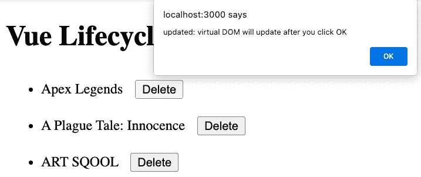
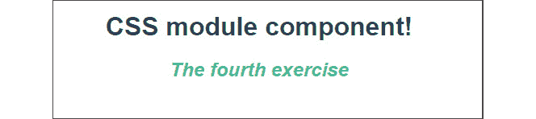

# 第一章：开始你的第一个 Vue 项目

在本章中，你将了解 **Vue.js**（**Vue**）的关键概念和优势，如何使用终端（或命令行）设置项目架构，以及如何根据组件基本原理创建一个具有本地数据的简单 Vue 组件。

本章将涵盖以下主题：

+   理解 Vue 作为框架

+   设置 Vite 驱动的 Vue 应用程序

+   探索 `data` 属性作为本地状态

+   使用 `<script setup>` 编写组件

+   理解 Vue 指令

+   使用 `v-model` 启用双向绑定

+   使用 `v-for` 理解数据迭代

+   探索方法

+   理解组件生命周期钩子

+   样式组件

+   理解 CSS 模块

到本章结束时，你将能够描述 Vue 生命周期钩子和表达式的根本，并使用各种样式方法和 HTML 语法风格来熟练地控制 HTML 模板。

# 技术要求

本章的完整代码可在 GitHub 上找到：[`github.com/PacktPublishing/Frontend-Development-Projects-with-Vue.js-3/tree/v2-edition/Chapter01`](https://github.com/PacktPublishing/Frontend-Development-Projects-with-Vue.js-3/tree/v2-edition/Chapter01)

# 理解 Vue 作为框架

行业中的开发者必须快速解决前端开发问题，同时对现有工作流程或后端架构的影响最小。在许多情况下，开发者往往在项目结束时才关注 UI，这可能是由于资源不足、产品需求不断演变或现有的前端是简单部分的态度。

然而，像苹果和谷歌这样的公司已经证明，深入思考前端设计是打造一个能够激发和吸引用户、带来更高投资回报和更成功业务的产品或平台的关键。

如果你了解 Vue，你可能也遇到过其他前端框架，它们表面上解决的是相同的问题，例如 Ember、Angular 或 React。在表面层面上，它们试图使响应式前端开发更加可靠，并引入使开发更简单的模式。然而，与 Angular 或 React 项目相比，Vue 项目可能会有显著的不同。让我们来调查一下。

## Angular 与 Vue 的比较

Angular 是由谷歌构建的 **模型-视图-视图模型**（**MVVM**）框架，并内置了对 TypeScript 的支持。Angular 生态系统包括 **预编译**（**AoT**）渲染、路由器和 CLI 工具。然而，它未能提供全局状态管理的简化系统；开发者需要学习如何使用 Flux 或采用 NgRx。

Vue 继承了 Angular 的核心稳健性，并通过移除对开发者强制代码风格的限制，提供了更好的开发体验。Vue 还简化了常见的 Angular 模式，如 HTML 指令，并消除了 Angular 的各种项目结构，如可注入的、组件、管道、模块等。从 Vue 3.0 开始，它为 TypeScript 和类型提供了出色的支持，而没有 Angular 强制编码风格的缺点。

在许多情况下，Vue 比 Angular 更灵活、开发者友好、高效，并且设置和学习的直接性更强。

接下来，让我们看看 Vue 和 React 之间的区别。

## React 与 Vue 的比较

首次发布于 2013 年，由 Meta（之前称为 Facebook）支持，React 迅速在开发者社区中获得了人气。React 引入了**JSX 模式**，可以直接用 JavaScript 编写 HTML 语法。有了 JSX，React 增加了新开发者需要学习的 JavaScript 和基于组件的架构的知识量。

React 和 Vue 都采用相同的组件驱动开发方法，允许开发者以模块化的方式构建应用程序。每个组件都包含其功能性和生命周期。Vue 将这些模块化编码的核心概念带给开发者，并提供了灵活性，让他们可以选择使用哪种方法来编写组件：JSX 或传统的风格，其中 HTML、CSS 和 JavaScript 是分离的。

Vue 使用**单文件组件**（**SFC**）方法来利用这种模块化结构到一个文件中，同时保持对开发者的可读性和可理解性。

## 使用 Vue 进行项目的优势

Vue 的学习曲线更平缓，生态系统更活跃。这种平缓的学习曲线有助于降低任何团队在将开发者引入新的 Vue 项目时的开销和成本。

Vue 的一个关键优势是其对新老开发者都易于接近：

+   开发者可以立即使用一个经过良好优化和性能出色的框架来构建可扩展的、动态的前端应用程序。

+   SFC 格式模式提供了一个模块化和灵活的蓝图，为开发者提供了愉快的体验。SFC 允许 Vue 真正地灵活多变。你可以实现基本功能，并逐步将静态站点的部分内容集成到 Vue 中，而不是彻底重写整个网站。

与 Redux 和 NgRx 一样强大，Vuex（以及最近的 Pinia）证明是一个出色的官方全局状态管理工具，它足够灵活，可以满足大多数开发需求。

由于其稳定的性能；定义明确的工具，如 Vue Router、Pinia、Vuex 等；以及一个支持性的社区，开发者可以通过选择 Vue 作为他们的开发栈来节省时间和金钱。

在深入研究 SFC 模式和模板语法之前，本节将探讨 Vue 的基本架构。

## 与 Vue 一起工作

要了解 Vue 架构，我们将首先将 Vue 包导入到我们的编码沙盒中。一种简单的方法是通过官方的 `index.html` 文件导入 Vue 包，并在 HTML 模板的 `<head>` 部分添加一个 `<script>` 标签来加载 Vue CDN，如下面的代码块所示：

```js
<!DOCTYPE html>
<html>
<head>
    <title>Vue.js project with CDN</title>
    <script src="img/vue@3"></script>
</head>
</html>
```

当页面加载时，浏览器也会使用在 `script` 标签中定义的 CDN 加载 Vue 包。一旦完成，您就可以使用 Vue 函数并开始编写 Vue 代码。

但首先，让我们看看 Vue 实例。

## 理解 Vue 实例

通常，每个 Vue 应用程序只包含 *一个* 根 Vue 实例，可以使用 `Vue.createApp` 方法创建：

```js
const vm = Vue.createApp({
  // options
})
```

`Vue` 类构造函数接受一个 `options` 对象，用于配置和组件的行为。我们称这种方法为 Options API，我们可以为所有相应的 Vue 组件使用它。然而，它们都被视为嵌套 Vue 实例，具有它们自己的选项和属性。

注意

`vm` 是一个常用术语，用来指代 `vm`，它帮助您在代码块中跟踪 Vue 实例。

为了让 Vue 引擎渲染应用程序实例，在我们的 `index.html` 文件中，我们使用唯一的类名、ID 或数据属性作为应用程序的主要入口点，在 `<body>` 标签内声明一个 `<div>` 元素：

```js
<body>
  <div id="vue-app"></div>
  <script>
    const vm = Vue.createApp({
    //Options
    })
  </script>
</body>
```

要在浏览器中渲染 Vue 应用程序，我们需要触发 `vm.mount()`，将根组件挂载到具有唯一选择器的目标 HTML 元素上。在这个例子中，它是一个值为 `vue-app` 的 `id`：

```js
<body>
  <div id="vue-app"></div>
  <script>
    const vm = Vue.createApp({
               //Options
               })
    vm.mount('#vue-app')
  </script>
</body>
```

现在，您将 `<div>` 元素绑定到新的 Vue 实例上，其 `id` 为 `vue-app`。

接下来，让我们定义一个值为 `"Start using Vue.js today!"` 的文本，并将其添加为应用程序选项中 `data` 方法返回值的属性：

```js
const vm = Vue.createApp({
  data() {
   return {
    text: 'Start using Vue.js today!'
   }
  }
})
```

在前面的代码示例中，`data` 是一个返回包含组件本地状态（或本地变量）的对象实例的函数。我们将在本章的后续部分进一步讨论这一点。

要将 `text` 的内容渲染到 DOM 中，我们使用 Vue 模板语法，由双大括号 (`{{}}`) 包围的响应式内容表示。在这种情况下，我们使用 `{{ text }}`，如下面的代码所示：

```js
<div id="vue-app">{{ text }}</div>
```

Vue 引擎将替换标签为 `text` 的数据属性和花括号占位符，用字符串 `Start using Vue.js today!` 替换。

上述代码的输出将如下所示：


图 1.1 – 使用本地数据属性显示“今天开始使用 Vue.js！”

在 `<head>` 标签中，我们也可以使用 DOM API 构建一个 Vue 应用程序实例，并将其绑定到我们的目标元素（ID 选择器为 `#vue-app`）：

```js
<head>
  <title>Vue.js CDN</title>
  <script src="img/vue@3"></script>
  <script>
    document.addEventListener('DOMContentLoaded', function
    () {
     Vue.createApp({
       data(){
         return {
           text: "Start using Vue.js today!"
         }
       }
      }).mount('#vue-app')
     })
  </script>
</head>
<body>
 <div id="vue-app">{{text}}</div>
</body>
```

两种方法的输出相同。然而，我们强烈建议 *不要* 使用 `DOMContentLoaded`。

虽然使用 CDN 的工作方式非常便携，但我们建议将包管理器作为 Vue 的安装方法。从 Vue 3 及以上版本开始，Vue 项目使用 Vite（或 Vite.js）来初始化和打包代码。您可以通过此处访问：[`vuejs.org/guide/quick-start.html#creating-a-vue-application`](https://vuejs.org/guide/quick-start.html#creating-a-vue-application)。

使用打包管理工具对于管理其他第三方库和构建用于生产的优化代码包非常有帮助。在下一节中，我们将探讨一个由包控制的示例。

# 设置 Vite 驱动的 Vue 应用程序

Vue 项目结构与许多基于 Node 的现代应用程序类似，包含以下内容：

+   一个 `package.json` 文件

+   在项目根目录下的 `node_modules` 文件夹

+   各种其他配置文件通常位于根目录级别，例如 `vite.config.js` 和 `.eslintrc.js`，因为它们通常会对整个项目产生影响。

以下截图显示了默认 Vue 应用程序的文件夹结构：


图 1.2 – 默认 Vue 应用程序文件夹结构

默认情况下，根目录下有一个 `index.html` 文件，用作加载 Vue 应用的占位符。您可以修改此文件以包含 `header` 和 `footer` 脚本，例如 Google Fonts 或作为您的包一部分之外的第三方 JavaScript 库。

Vue 项目结构遵循一种模式，其中您将大部分源代码管理在 `/src` 目录中。您可以将 Vue 文件细分到各种文件夹中，例如使用 `components` 文件夹来存储可重用的 Vue 组件。默认情况下，Vite 将创建 `assets` 和 `components` 文件夹以进行代码拆分。对于初学者来说，遵循此模式直到您更加熟悉是很好的：


图 1.3 – 默认 Vue 应用程序 src 文件夹结构

`public` 文件夹是一个特殊的目录，包含需要直接传输到输出位置的文件。以下截图显示了该文件夹的外观：


图 1.4 – 默认 Vue 应用程序 public 文件夹

到目前为止，您应该对 Vue 项目结构的样子有了一定的了解。接下来，我们将讨论 Vue 的独特模式——SFC 架构。

## Vue 的 SFC 架构

组件是大多数现代框架的构建块。通常，将代码拆分为特定组件的块可以确保代码可读性，并促进 **不要重复自己**（**DRY**）原则。Vue 的 SFC 模式紧密遵循这种方法。

SFC 架构将外观和行为的责任集中到单个文件中，从而简化了您项目的架构。现在，您可以参考 HTML、CSS 和 JavaScript 逻辑，而无需切换文件。您的默认`.vue`文件结构如下：


图 1.5 – 默认.vue 文件结构

一个一般的好习惯是确保您的`components`文件不包含超过 500 行代码。如果您遇到这种情况，建议将它们拆分成更小的可重用组件。例如，在应用程序的标题中，您可能有一个在其他页面上重复使用的 logo 元素。您将创建一个如`logo.vue`的组件：

```js
// logo.vue
<template>
  
</template>
```

在`header.vue`中，您将`logo`组件导入到`script`部分，然后将其作为`header`组件的嵌套组件包含。您可以通过将其声明为`components`字段的属性来实现这一点：

```js
// header.vue
<script>
    import logo from 'components/logo.vue'
    export default {
        components: {
          logo
        }
    }
</script>
```

在`template`部分，您可以将 logo 用作一个普通的 HTML 元素，如下所示：

```js
<template>
    <header>
      <a href="mywebsite.com">
        <logo />
      </a>
    </header>
</template>
```

输出将是一个带有渲染的 logo 图像的标题 – 当需要时，您可以在任何其他组件中重用`logo`组件。

很快，您将拥有许多这些语义结构化的文件，它们使用可重用语法的小块，您的团队可以在各种应用程序区域中实现。

在下一个练习中，您将练习创建您的第一个 Vue 组件并在另一个组件中显示它。

## 练习 1.01 – 构建您的第一个组件

我们将在 Vue 项目中构建我们的第一个组件`Exercise1.01`，并使用 ES6 模块语法将其导入到`App.vue`组件中使用。

要访问此练习的代码文件，请参阅[`github.com/PacktPublishing/Front-End-Development-Projects-with-Vue.js/tree/v2-edition/Chapter01/Exercise1.01`](https://github.com/PacktPublishing/Front-End-Development-Projects-with-Vue.js/tree/v2-edition/Chapter01/Exercise1.01)。

注意

当您保存新的更改时，您的应用程序将进行热重载，因此您可以立即看到它们。

要开始，执行以下步骤：

1.  使用`npm init vue@3`生成的应用程序作为起点，或者在使用以下命令在代码仓库的根目录中导航到`Chapter01/Exercise1.01`文件夹：

    ```js
    > cd Chapter01/Exercise1.01/
    ```

    ```js
    > yarn
    ```

1.  使用以下命令运行应用程序：

    ```js
    yarn dev
    ```

1.  前往`https://localhost:3000`。

1.  在 VS Code 中打开练习项目（在项目目录中使用`code .`命令）或使用您首选的 IDE。

1.  打开`src/App.vue`文件，删除该文件中的所有内容，并保存。

1.  在您的浏览器中，一切应该是一个空白、干净的状态，以便开始工作。

1.  构成单个文件组件的三个主要组件是`<template>`、`<script>`和`<style>`块。将以下代码块添加为我们 Vue 组件的脚手架：

    ```js
    /** src/App.vue **/
    ```

    ```js
    <template>
    ```

    ```js
    </template>
    ```

    ```js
    <script>
    ```

    ```js
    export default {
    ```

    ```js
    }
    ```

    ```js
    </script>
    ```

    ```js
    <style>
    ```

    ```js
    </style>
    ```

1.  在 `components` 文件夹中创建另一个名为 `Exercise1-01.vue` 的文件，并重复相同的步骤来搭建 Vue 组件：

    ```js
    // src/components/Exercise1-01.vue
    ```

    ```js
    <template>
    ```

    ```js
    </template>
    ```

    ```js
    <script>
    ```

    ```js
    export default {
    ```

    ```js
    }
    ```

    ```js
    </script>
    ```

    ```js
    <style>
    ```

    ```js
    </style>
    ```

1.  在我们的 `Exercise1-01.vue` 组件中，组合一组 `<div>` 标签，其中包含一个 `<h1>` 元素和 `<template>` 标签内的标题：

    ```js
    <template>
    ```

    ```js
      <div>
    ```

    ```js
        <h1>My first component!</h1>
    ```

    ```js
      </div>
    ```

    ```js
    </template>
    ```

1.  在 `<style>` 块内，添加以下样式：

    ```js
    <style>
    ```

    ```js
      h1 {
    ```

    ```js
        font-family: 'Avenir', Helvetica, Arial,
    ```

    ```js
        sans-serif;
    ```

    ```js
        text-align: center;
    ```

    ```js
        color: #2c3e50;
    ```

    ```js
        margin-top: 60px;
    ```

    ```js
      }
    ```

    ```js
    </style>
    ```

1.  使用 ES6 的 `import` 方法将我们的组件导入到 `App.vue` 中，并在 `<script>` 块中的 `components` 对象内定义组件。现在我们可以通过使用其驼峰式或短横线命名法（两者都有效）在 HTML 中引用此组件：

    ```js
    <template>
    ```

    ```js
      <Exercise />
    ```

    ```js
    </template>
    ```

    ```js
    <script>
    ```

    ```js
    import Exercise from './components/Exercise1-01'
    ```

    ```js
    export default {
    ```

    ```js
      components: {
    ```

    ```js
        Exercise,
    ```

    ```js
      }
    ```

    ```js
    }
    ```

    ```js
    </script>
    ```

当你按下 *Ctrl* + *S*（或在 macOS 上按下 *Cmd* + *S*），`https://localhost:3000` 应该重新加载并看起来很棒：


图 1.6 – Exercise 1.01 的 localhost 输出

在这个练习中，我们看到了如何使用模板标签构建 Vue 组件，以及如何使用 Vetur 搭建基本的 Vue 组件。我们还创建了一个新的 Vue 组件，并使用 ES6 语法和 `components` 属性在 `App.vue` 中重用它。

在下一节中，我们将了解如何使用 `data` 属性定义组件的本地状态数据。

# 探索数据属性作为本地状态

在构建 Vue 组件时，最常用到的术语和响应式元素之一是 `data` 属性。这些在 Vue 实例的 `data()` 函数中体现出来：

```js
<script>
    export default {
        data() {
          return {
            color: 'red'
          }
        }
    }
</script>
```

你可以使用 `data()` 函数创建一个本地数据对象，以存储你想要在 Vue 模板中使用的信息。这个本地对象绑定到组件上，我们称之为组件的本地状态数据。当这个本地对象的任何属性更新或更改时，它将在相应的模板中响应式地更新。

一旦我们定义了本地数据，就需要将其绑定到 `template` 部分以在 UI 中显示其值，这被称为 **数据插值**。

**插值**是将不同性质的内容插入到其他内容中的过程。在 Vue 的上下文中，这就是你使用 *mustache* 语法（双大括号）来定义可以注入数据到组件 HTML 模板中的区域的地方。

考虑以下示例：

```js
<template>
  <span> {{ color }}</span>
</template >
<script>
export default {
  data() {
    return {
      color: 'red'
    }
  }
}
</script>
```

`red` 的 `data` 属性绑定到 Vue.js 的响应式数据，并在运行时根据 UI 和其数据之间的状态变化进行更新。

到目前为止，我们应该看看如何以最经典的 Vue 方式定义和绑定本地数据。随着 Vue 3.0 的推出，我们享受了编写和导入组件的更简短、更简单的方法。让我们接下来探索它。

# 使用脚本设置编写组件

从 Vue 3.0 开始，Vue 引入了一个新的语法糖 `setup` 属性用于 `<script>` 标签。这个属性允许你在 SFC 中使用组合式 API（我们将在 *第五章*，*组合式 API*）编写代码，并缩短编写简单组件所需的代码量。

然后，位于 `<script setup>` 标签内的代码块将被编译成一个 `render()` 函数，在部署到浏览器之前，提供更好的运行时性能。

要开始使用此语法，请参考以下示例代码：

```js
// header.vue
<script>
    import logo from 'components/logo.vue'
    export default {
        components: {
          logo
        }
    }
</script>
```

然后，我们将 `<script>` 替换为 `<script setup>`，并删除所有 `export default…` 的代码块。示例代码现在如下所示：

```js
// header.vue
<script setup>
    import logo from 'components/logo.vue'
</script>
```

在 `<template>` 中，我们像往常一样使用 `logo`：

```js
<template>
    <header>
      <a href="mywebsite.com">
        <logo />
      </a>
    </header>
</template>
```

为了定义和使用局部数据，我们可以在该组件中直接声明常规变量作为局部数据，并声明函数作为局部方法。例如，为了声明并渲染局部数据属性 `color`，我们使用以下代码：

```js
<script setup>
const color = 'red';
</script>
<template>
  <div>{{color}}</div>
</template>
```

上述代码输出的结果与上一节中的示例相同——`red`。

如本节开头所述，`<script setup>` 在需要在使用 SFC 内的 Composition API 时最有用。尽管如此，我们仍然可以充分利用其简洁性来简化组件。

注意

从现在开始，我们将结合两种方法，并在可能的情况下使用 `<script setup>`。

在以下练习中，我们将更详细地介绍如何使用插值和数据。

## 练习 1.02 – 带条件的插值

当你想将数据输出到模板或使页面上的元素具有响应性时，通过使用大括号将数据插值到模板中。Vue 可以理解并替换占位符为数据。

要访问此练习的代码文件，请参阅 [`github.com/PacktPublishing/Frontend-Development-Projects-with-Vue.js-3/tree/v2-edition/Chapter01/Exercise1.02`](https://github.com/PacktPublishing/Frontend-Development-Projects-with-Vue.js-3/tree/v2-edition/Chapter01/Exercise1.02)：

1.  使用 `npm init vue@3` 生成的应用程序作为起点，或在代码仓库的根目录中，使用以下命令按顺序导航到 `Chapter01/Exercise1.02` 文件夹：

    ```js
    > cd Chapter01/Exercise1.02/
    ```

    ```js
    > yarn
    ```

1.  使用以下命令运行应用程序：

    ```js
    yarn dev
    ```

1.  在 VS Code 中打开练习项目（在项目目录中使用 `code .` 命令）或使用你喜欢的 IDE。

1.  在 `src/components` 目录中创建一个新的 Vue 组件文件，命名为 `Exercise1-02.vue`。

1.  在 `Exercise1-02.vue` 组件内部，让我们通过添加一个名为 `data()` 的函数，在 `<script setup>` 标签内添加数据，并返回一个名为 `title` 的键，其值为你的标题字符串：

    ```js
    <script>
    ```

    ```js
    export default {
    ```

    ```js
      data() {
    ```

    ```js
        return {
    ```

    ```js
          title: 'My first component!',
    ```

    ```js
        }
    ```

    ```js
      },
    ```

    ```js
    }
    ```

    ```js
    </script>
    ```

1.  通过将 `<h1>` 文本替换为 `{{` `title }}` 的插值表达式来引用 `title`：

    ```js
    <template>
    ```

    ```js
      <div>
    ```

    ```js
        <h1>{{ title }}</h1>
    ```

    ```js
      </div>
    ```

    ```js
    </template>
    ```

当你保存此文档时，数据 `title` 将现在出现在你的 `h1` 标签内。

1.  在 Vue 中，插值将解析大括号内的任何 JavaScript。例如，你可以使用 `toUpperCase()` 方法转换大括号内的文本：

    ```js
    <template>
    ```

    ```js
      <div>
    ```

    ```js
        <h1>{{ title.toUpperCase() }}</h1>
    ```

    ```js
      </div>
    ```

    ```js
    </template>
    ```

1.  访问 [`localhost`](https://localhost):3000`。你应该会看到一个如下截图所示的输出：


图 1.7 – 大写标题的显示

1.  插值也可以处理条件逻辑。在数据对象内部，添加一个布尔键值对，`isUppercase: false`：

    ```js
    <template>
    ```

    ```js
      <div>
    ```

    ```js
        <h1>{{ isUppercase ? title.toUpperCase() : title }}</h1>
    ```

    ```js
      </div>
    ```

    ```js
    </template>
    ```

    ```js
    <script>
    ```

    ```js
    export default {
    ```

    ```js
      data() {
    ```

    ```js
        return {
    ```

    ```js
          title: 'My first component!',
    ```

    ```js
          isUppercase: false,
    ```

    ```js
        }
    ```

    ```js
      },
    ```

    ```js
    }
    ```

    ```js
    </script>
    ```

上述代码将生成以下输出：


图 1.8 – 包含内联条件语句后的 1.02 练习输出

1.  将此条件添加到大括号中，并在保存时，你应该看到标题为句子大小写。通过将 `isUppercase` 改为 `true` 来玩转这个值：

    ```js
    <script>
    ```

    ```js
    export default {
    ```

    ```js
      data() {
    ```

    ```js
        return {
    ```

    ```js
          title: 'My first component!',
    ```

    ```js
          isUppercase: true,
    ```

    ```js
        }
    ```

    ```js
      },
    ```

    ```js
    }
    ```

    ```js
    </script>
    ```

以下截图显示了运行上述代码后生成的最终输出：


图 1.9 – 显示大写标题

1.  现在，让我们将 `<script>` 替换为 `<script setup>`，并将 `data()` 函数内声明的所有本地数据分别移动到其自己的变量名中，例如 `title` 和 `isUpperCase`，如下所示：

    ```js
    <script setup>
    ```

    ```js
    const title ='My first component!';
    ```

    ```js
    const isUppercase = true;
    ```

    ```js
    </script>
    ```

1.  输出应与 *图 1**.9* 中的相同。

在这个练习中，我们能够通过使用布尔变量在插值标签（`{{}}`）内应用内联条件。此功能允许我们在不过度复杂的情况下修改要显示的数据，这在某些用例中可能很有帮助。我们还学会了如何使用 `<script setup>` 编写组件的更简洁版本。

由于我们现在已经熟悉了使用插值来绑定本地数据，我们将继续探讨下一个主题——如何使用 Vue 属性将数据和方法附加到 HTML 元素的事件和属性上。

# 理解 Vue 指令

所有基于 Vue 的指令都以 `v-*` 前缀开始，作为 Vue 特定的属性：

+   `v-text`：`v-text` 指令与插值具有相同的响应性。使用 `{{ }}` 的插值比 `v-text` 指令更高效。然而，你可能遇到这样的情况：你从服务器预先渲染了文本，并希望在 Vue 应用程序加载完成后覆盖它。例如，你可以在等待 Vue 引擎最终用从 `v-text` 接收到的动态值替换它时，预先定义一个静态占位文本，如下面的代码块所示：

    ```js
    <template>
    ```

    ```js
      <div v-text="msg">My placeholder</div>
    ```

    ```js
    </template>
    ```

    ```js
    <script setup>
    ```

    ```js
    const msg = "My message"
    ```

    ```js
    </script>
    ```

+   `v-once`：当使用时，它表示静态内容的起点。Vue 引擎将仅渲染一次具有此属性及其子元素。它还会忽略在初始渲染之后对此组件或元素的任何数据更新。此属性在不需要某些部分具有响应性的场景中非常有用。你可以将 `v-once` 与 `v-text`、插值和任何 Vue 指令结合使用。

+   `V-html`：Vue 将解析传递给此指令的值，并将你的文本数据作为有效的 HTML 代码渲染到目标元素中。我们不建议使用此指令，尤其是在客户端，因为它会影响性能并可能导致潜在的安全漏洞。`script` 标签可以通过此指令嵌入和触发。

+   `v-bind`: 这是 Vue 中最受欢迎的功能之一。你可以使用这个指令来为一个数据变量或表达式启用对 HTML 属性的单向绑定，如下例所示：

    ```js
    <template>
    ```

    ```js
      
    ```

    ```js
    </template>
    ```

    ```js
    <script setup>
    ```

    ```js
    const logo = '../assets/logo.png';
    ```

    ```js
    </script>
    ```

上述代码演示了如何将 `logo` 数据变量绑定到图像的 `src` 属性。现在 `img` 组件从 `logo` 变量获取源值并相应地渲染图像。

你还可以用它将本地数据变量作为 props 传递给另一个组件。一种更简短的方式是使用 `:attr` 语法而不是 `v-bind:attr`。以先前的例子为例。我们可以将模板重写如下：

```js
<template>
  
</template>
```

+   `v-if`: 这是一个强大的指令，你可以用它来有条件地控制组件内部元素的渲染方式。这个指令的操作类似于 `if…else` 和 `if…else if…` 条件。它附带支持指令，如 `v-else`，代表 `else` 的情况，以及 `v-else-if`，代表 `else if` 的情况。例如，我们想在 `count` 为 `2`、`4` 和 `6` 时渲染不同的文本。下面的代码将演示如何做到这一点：

    ```js
    <template>
    ```

    ```js
    <div v-if="count === 2">Two</div>
    ```

    ```js
    <div v-else-if="count === 4">Four</div>
    ```

    ```js
    <div v-else-if="count === 6">Six</div>
    ```

    ```js
    <div v-else>Others</div>
    ```

    ```js
    </template>
    ```

+   `v-show`: 你还可以使用 `v-show` 来控制 HTML 元素的可见状态。与 `v-if` 不同，使用 `v-show` 时，Vue 引擎仍然将元素挂载到 DOM 树上，但使用 `display: none` CSS 样式将其隐藏。在检查时，你仍然可以在 DOM 树中看到隐藏元素的文本内容，但对于最终用户来说，它不可见。此指令不与 `v-else` 或 `v-else-if` 一起使用。如果 `v-show` 的结果为 `true` 布尔值，它将保持 DOM 元素不变。如果解析为 `false`，它将应用 `display: none` 样式到该元素。

+   `v-for`: 我们使用 `v-for` 指令来实现基于数据源进行列表渲染的目标。数据源是一个可迭代的集合，例如 `array` 或 `object`。我们将在本章的单独部分深入探讨这个指令的不同用法。

我们已经介绍了 Vue 中最常用的指令。现在让我们通过以下练习来复习和实验如何使用这些指令。

## 练习 1.03 – 探索基本指令（v-text, v-once, v-html, v-bind, v-if, v-show）

更复杂的组件将使用多个指令来实现预期的效果。在这个练习中，我们将构建一个组件，该组件使用多个指令来绑定、操作并将数据输出到模板视图。

要访问此练习的代码文件，请参阅 [`github.com/PacktPublishing/Frontend-Development-Projects-with-Vue.js-3/tree/v2-edition/Chapter01/Exercise1.03`](https://github.com/PacktPublishing/Frontend-Development-Projects-with-Vue.js-3/tree/v2-edition/Chapter01/Exercise1.03)。

让我们从以下步骤开始练习：

1.  以使用 `npm init vue@3` 生成的应用程序作为起点，或者在每个代码仓库的根目录下，使用以下命令按顺序导航到 `Chapter01/Exercise1.03` 文件夹：

    ```js
    > cd Chapter01/Exercise1.03/
    ```

    ```js
    > yarn
    ```

1.  使用以下命令运行应用程序：

    ```js
    yarn dev
    ```

1.  在 VS Code 中打开练习项目（在项目目录中使用`code .`命令）或您首选的 IDE。

1.  在`src/components`目录下创建一个名为`Exercise1-03.vue`的新 Vue 组件文件。

1.  在`Exercise1-03.vue`内部，编写以下代码以显示`text`内容：

    ```js
    <template>
    ```

    ```js
      <div>
    ```

    ```js
        <h1>{{ text }}</h1>
    ```

    ```js
      </div>
    ```

    ```js
    </template>
    ```

    ```js
    <script setup>
    ```

    ```js
    const text = 'Directive text';
    ```

    ```js
    </script>
    ```

1.  将`{{}}`插值替换为`v-text`属性。输出不应更改：

    ```js
    <template>
    ```

    ```js
      <div>
    ```

    ```js
        <h1 v-text="text">Loading...</h1>
    ```

    ```js
      </div>
    ```

    ```js
    </template>
    ```

*图 1.10*显示了上述代码的输出：


图 1.10 – v-text 和插值方法具有相同的输出

1.  将`v-once`指令添加到同一元素上。这将强制此 DOM 元素只加载`v-text`数据一次：

    ```js
    <template>
    ```

    ```js
      <div>
    ```

    ```js
        <h1 v-once v-text="text">Loading...</h1>
    ```

    ```js
      </div>
    ```

    ```js
    </template>
    ```

1.  在`h1`元素下方，包含一个新的`h2`元素，该元素使用`v-html`属性。添加一个新的本地数据`html`，其中包含一个包含 HTML 格式的字符串，如下面的代码块所示：

    ```js
    <template>
    ```

    ```js
      <div>
    ```

    ```js
        <h1 v-once v-text="text">Loading...</h1>
    ```

    ```js
        <h2 v-html="html" />
    ```

    ```js
      </div>
    ```

    ```js
    </template>
    ```

    ```js
    <script setup>
    ```

    ```js
    const text = 'Directive text';
    ```

    ```js
    const html = 'Stylise</br>HTML in<br/><b>your data</b>'
    ```

    ```js
    </script>
    ```

运行前面的代码将生成以下输出：


图 1.11 – 使用 v-html 从字符串渲染 HTML 元素

1.  添加一个新的本地`link`对象，其中包含诸如 URL、目标、标题和标签索引等信息。在模板中，添加一个新的锚点 HTML 元素，并使用`v-bind`简写语法将该`link`对象绑定到 HTML 元素上 – 例如，`:href="link.url"`：

    ```js
    <template>
    ```

    ```js
      <div>
    ```

    ```js
        <h1 v-once v-text="text">Loading...</h1>
    ```

    ```js
        <h2 v-html="html" />
    ```

    ```js
        <a
    ```

    ```js
          :href="link.url"
    ```

    ```js
          :target="link.target"
    ```

    ```js
          :tabindex="link.tabindex"
    ```

    ```js
          >{{ link.title }}</a>
    ```

    ```js
      </div>
    ```

    ```js
    </template>
    ```

    ```js
    <script setup>
    ```

    ```js
    const text = 'Directive text';
    ```

    ```js
    const html = 'Stylise</br>HTML in<br/><b>your data</b>'
    ```

    ```js
    const link = {
    ```

    ```js
      title: "Go to Google",
    ```

    ```js
      url: https://google.com,
    ```

    ```js
      tabindex: 1,
    ```

    ```js
      target: '_blank',
    ```

    ```js
    };
    ```

    ```js
    </script>
    ```

以下截图显示了输出：


图 1.12 – 将 Vue 实例的响应式数据绑定到任何 HTML 属性时的输出

1.  将`v-if="false"`应用于`h1`元素，将`v-else-if="false"`应用于`h2`，将`v-else`应用于`a`标签，如下所示：

    ```js
    <template>
    ```

    ```js
      <div>
    ```

    ```js
        <h1 v-if="false" v-once v-text="text">Loading...
    ```

    ```js
        </h1>
    ```

    ```js
        <h2 v-html="html" v-else-if="false" />
    ```

    ```js
        <a
    ```

    ```js
          v-else
    ```

    ```js
          :href="link.url"
    ```

    ```js
          :target="link.target"
    ```

    ```js
          :tabindex="link.tabindex"
    ```

    ```js
          >{{ link.title }}</a>
    ```

    ```js
      </div>
    ```

    ```js
    </template>
    ```

由于我们将主要条件语句设置为`false`，你应该只能在页面上看到`<a>`标签。

`v-else`条件将显示以下内容：


图 1.13 – false v-if 语句隐藏整个 HTML 元素从 DOM 中

1.  将模板更改为使用`v-show`而不是`v-if`语句，从`<a>`元素中删除`v-else`，并将`h1`中的`v-show`值更改为`true`：

    ```js
    <template>
    ```

    ```js
      <div>
    ```

    ```js
        <h1 v-show="true" v-once v-text="text">Loading...
    ```

    ```js
        </h1>
    ```

    ```js
        <h2 v-html="html" v-show="false" />
    ```

    ```js
        <a
    ```

    ```js
          :href="link.url"
    ```

    ```js
          :target="link.target"
    ```

    ```js
          :tabindex="link.tabindex"
    ```

    ```js
          >{{ link.title }}</a>
    ```

    ```js
      </div>
    ```

    ```js
    </template>
    ```

上述代码的输出将如下所示：


图 1.14 – 将 v-show 设置为 true 将显示主要指令文本

当你打开浏览器 Devtools 的`Elements`标签页时，你应该能够观察到`h2`的显示状态被设置为`none`，如下所示：


图 1.15 – h2 在 false 条件下具有“display: none”

在这个练习中，我们学习了 Vue 的核心指令，用于控制、绑定、显示和隐藏 HTML 模板元素，而无需在本地状态中添加新的数据对象之外使用任何 JavaScript。

在下一节中，我们将学习如何借助 Vue 的 `v-model` 实现双向绑定。

# 使用 v-model 启用双向绑定

Vue 通过创建一个专门用于监视 Vue 组件内部数据属性的指令来实现双向数据绑定。当目标数据属性在 UI 上被修改时，`v-model` 指令会触发数据更新。此指令通常用于需要同时显示和响应式修改数据的 HTML 表单元素，例如 `input`、`textarea`、单选按钮等。

我们可以通过向目标元素添加 `v-model` 指令并将其绑定到我们希望的数据属性上来启用双向绑定：

```js
<template>
    <input v-model="name" />
</template>
<script>
      export default {
        data() {
          return {
            name: ''
          }
        }
      }
</script>
```

在 *图 1**.16* 中，运行前面代码生成的输出将如下所示：


图 1.16 – v-model 示例的输出

注意

使用 `v-model` 绑定大量数据可能会影响您应用程序的性能。请考虑您的 UI 并将数据拆分到不同的 Vue 组件或视图中。Vue 中的本地状态数据不是不可变的，可以在模板的任何位置重新定义。

在下一个练习中，我们将使用 Vue 的双向数据绑定构建一个组件，并实验双向绑定数据的意义。

## 练习 1.04 – 使用 v-model 进行双向绑定实验

此类数据模型的上下文通常是表单或您期望输入和输出数据的任何地方。到练习结束时，我们应该能够在表单的上下文中使用 `v-model` 属性。

要访问此练习的代码文件，请参阅 [`github.com/PacktPublishing/Frontend-Development-Projects-with-Vue.js-3/tree/v2-edition/Chapter01/Exercise1.04`](https://github.com/PacktPublishing/Frontend-Development-Projects-with-Vue.js-3/tree/v2-edition/Chapter01/Exercise1.04)。

让我们通过以下步骤开始练习：

1.  以使用 `npm init vue@3` 生成的应用程序为起点，或者在代码仓库的根目录下，使用以下命令按顺序导航到 `Chapter01/Exercise 1.04` 文件夹：

    ```js
    > cd Chapter01/Exercise 1.04/
    ```

    ```js
    > yarn
    ```

1.  使用以下命令运行应用程序：

    ```js
    yarn dev
    ```

1.  在您的 VS Code 中打开练习项目（在项目目录中使用 `code .` 命令）或您首选的 IDE。

1.  在 `src/components` 目录下创建一个名为 `Exercise1-04.vue` 的新 Vue 组件文件。

1.  在 `Exercise1-04.vue` 内部，首先在 `template` 区域内创建一个 HTML `label` 并使用 `v-model` 将一个 `input` 元素绑定到 `name` 数据属性：

    ```js
    <div class="form">
    ```

    ```js
       <label>
    ```

    ```js
         Name
    ```

    ```js
         <input type="text" v-model="name" />
    ```

    ```js
       </label>
    ```

    ```js
    </div>
    ```

1.  通过在 `<``script>` 标签中返回一个名为 `name` 的响应式数据属性来完成 `text` 输入的绑定：

    ```js
    <script>
    ```

    ```js
    export default {
    ```

    ```js
      data() {
    ```

    ```js
        return {
    ```

    ```js
          name: '',
    ```

    ```js
        }
    ```

    ```js
      },
    ```

    ```js
    }
    ```

    ```js
    </script>
    ```

1.  接下来，在`template`区域内部使用`v-model`组合一个`label`和与`language`数据属性绑定的可选 HTML`select`：

    ```js
        <div class="form">
    ```

    ```js
          <label>
    ```

    ```js
            Name
    ```

    ```js
            <input type="text" v-model="name" />
    ```

    ```js
          </label>
    ```

    ```js
          <label>
    ```

    ```js
            Preferred JavaScript style
    ```

    ```js
            <select name="language" v-model="language">
    ```

    ```js
              <option value="Javascript">JavaScript
    ```

    ```js
              </option>
    ```

    ```js
              <option value="TypeScript">TypeScript
    ```

    ```js
              </option>
    ```

    ```js
              <option value="CoffeeScript">CoffeeScript
    ```

    ```js
              </option>
    ```

    ```js
              <option value="Dart">Dart</option>
    ```

    ```js
            </select>
    ```

    ```js
          </label>
    ```

    ```js
        </div>
    ```

1.  通过在`<script>`标签中返回一个名为`language`的响应式数据属性来完成`select`输入的绑定：

    ```js
    <script>
    ```

    ```js
    export default {
    ```

    ```js
      data() {
    ```

    ```js
        return {
    ```

    ```js
          name: '',
    ```

    ```js
          language: '',
    ```

    ```js
        }
    ```

    ```js
      },
    ```

    ```js
    }
    ```

    ```js
    </script>
    ```

1.  在`表单`字段下方，使用大括号如`{{` `name }}`在无序列表结构（`<ul>`和`<li>`）中输出名称和语言：

你的代码应该如下所示：

```js
<template>
  <section>
    <div class="form">
      <label>
        Name
        <input type="text" v-model="name" />
      </label>
      <label>
        Preferred JavaScript style
        <select name="language" v-model="language">
          <option value="JavaScript">JavaScript
          </option>
          <option value="TypeScript">TypeScript
          </option>
          <option value="CoffeeScript">CoffeeScript
          </option>
          <option value="Dart">Dart</option>
        </select>
      </label>
    </div>
    <ul class="overview">
      <li><strong>Overview</strong></li>
      <li>Name: {{ name }}</li>
      <li>Preference: {{ language }}</li>
    </ul>
  </section>
</template>
```

1.  在组件底部的`<style>`标签内添加样式：

    ```js
    <style>
    ```

    ```js
    .form {
    ```

    ```js
      display: flex;
    ```

    ```js
      justify-content: space-evenly;
    ```

    ```js
      max-width: 800px;
    ```

    ```js
      padding: 40px 20px;
    ```

    ```js
      border-radius: 10px;
    ```

    ```js
      margin: 0 auto;
    ```

    ```js
      background: #ececec;
    ```

    ```js
     }
    ```

    ```js
     .overview {
    ```

    ```js
      display: flex;
    ```

    ```js
      flex-direction: column;
    ```

    ```js
      justify-content: space-evenly;
    ```

    ```js
      max-width: 300px;
    ```

    ```js
      margin: 40px auto;
    ```

    ```js
      padding: 40px 20px;
    ```

    ```js
      border-radius: 10px;
    ```

    ```js
      border: 1px solid #ececec;
    ```

    ```js
    }
    ```

    ```js
    .overview > li {
    ```

    ```js
      list-style: none;
    ```

    ```js
    }
    ```

    ```js
    .overview > li + li {
    ```

    ```js
      margin-top: 20px;
    ```

    ```js
    }
    ```

    ```js
    </style>
    ```

1.  前往`https://localhost:3000`。你的输出应该如下所示：


图 1.17 – 更新数据后的最终表单显示

当你在表单中更新数据时，它也应该同步更新概览区域。

在这个练习中，我们使用了`v-model`指令将名称和 JavaScript 风格的下拉选择绑定到我们本地状态的数据。当你修改数据时，它将反应性地更新我们输出的 DOM 元素。

接下来，我们将进一步讨论我们的`v-for`指令以及处理 Vue 中迭代数据集合的不同方法。

# 理解 v-for 数据迭代

要在 Vue 中循环 HTML 元素，你直接在目标元素上使用`v-for`循环指令。当 Vue 渲染组件时，它将迭代目标以使用和渲染解析到指令中的数据，这与正常的 JavaScript`for`循环的概念相同。

## 使用 v-for 进行基本迭代

`v-for`的基本语法如下：

```js
v-for="(item, index) in items" :key="index"
```

上述语法示例表明我们正在遍历一个`items`列表。在每次迭代中，我们都可以访问单个`item`及其在列表中的`index`外观。`:key`是一个必需的属性，它作为 Vue 引擎渲染的每个迭代元素的唯一标识符，以便跟踪。

当`key`或`item`内容发生变化时，无论是程序性地还是由于用户交互，Vue 引擎都会触发 UI 上更改项的更新。如果你在一个组件中有多个循环，你应该使用额外的字符或与上下文相关的字符串随机化`key`属性，以避免`key`重复冲突。

这个方向有各种用例。一个直接的用例是执行**匿名循环**，其中你可以定义一个数字，*X*，作为一个符号列表，循环将迭代该*X*次。这在你需要严格控制迭代次数或渲染一些占位内容的情况下非常有用。

在以下示例中，我们看到一个匿名循环，总迭代次数为`2`，我们使用`loop-1`前缀定义`key`：

```js
<template>
<div v-for="n in 2" :key="'loop-1-' + n">
    {{ n }}
</div>
<template>
```

你还可以使用模板字符串（使用```js `` ```反引号）来计算字符串而不使用`+`：

```js
<template>
<div v-for="n in 5" :key="`loop-2-${n}`">
    {{ n }}
</div>
<template>
```

上述两种方法中，代码的输出应该如下所示


图 1.18 – 匿名循环示例输出

现在我们已经介绍了如何使用 `v-for` 处理基本循环，我们将在下一个练习中利用这个功能。

## 练习 1.05 – 使用 v-for 遍历字符串数组

在这个练习中，我们将使用 Vue 的 `v-for` 指令创建一个匿名循环。对于那些以前在 JavaScript 中使用过 `for` 或 `forEach` 循环的人来说，这将很熟悉。

要访问此练习的代码文件，请参阅 [`github.com/PacktPublishing/Frontend-Development-Projects-with-Vue.js-3/tree/v2-edition/Chapter01/Exercise1.05`](https://github.com/PacktPublishing/Frontend-Development-Projects-with-Vue.js-3/tree/v2-edition/Chapter01/Exercise1.05)。

执行以下步骤以完成练习：

1.  使用 `npm init vue@3` 生成的应用程序作为起点，或者在每个代码仓库的根目录中，使用以下命令按顺序导航到 `Chapter01/Exercise1.05` 文件夹：

    ```js
    > cd Chapter01/Exercise1.05/
    ```

    ```js
    > yarn
    ```

1.  使用以下命令运行应用程序：

    ```js
    yarn dev
    ```

1.  在项目目录中使用 `code .` 命令或在您的首选 IDE 中打开练习项目。

1.  在 `src/components` 目录中创建一个名为 `Exercise1-05.vue` 的新 Vue 组件文件。

1.  在 `Exercise1-05.vue` 内部，我们使用一个 `<h1>` 元素来渲染静态标题 `Looping through arrays`，以及一个包含空 `<li>` 标签的 `<ul>` 元素：

    ```js
    <template>
    ```

    ```js
    <h1>Looping through arrays</h1>
    ```

    ```js
    <ul>
    ```

    ```js
      <li></li>
    ```

    ```js
    </ul>
    ```

    ```js
    </template>
    ```

1.  在 `script` 部分，让我们给 `script` 标签添加一个 `setup` 属性。然后，让我们声明一个包含一些字符串的 `interests` 数组，如下所示：

    ```js
    <script setup>
    ```

    ```js
    const interests = ['TV', 'Games', 'Sports']
    ```

    ```js
    </script>
    ```

1.  现在，让我们回到 `template` 部分，并在 `<li>` 标签上添加 `v-for` 指令来遍历 `interests`。对于每次迭代，我们都会从 `interests` 中获取 `(item, index)` 的组合，其中 `item` 输出数组的字符串，而 `index` 是循环索引。我们将 `key` 属性映射到 `index`，并显示 `item` 的值，如下面的代码块所示：

    ```js
    <template>
    ```

    ```js
    <h1>Looping through arrays</h1>
    ```

    ```js
    <ul>
    ```

    ```js
      <li v-for="(item, index) in interests"
    ```

    ```js
         :key="index">{{ item }}</li>
    ```

    ```js
    </ul>
    ```

    ```js
    </template>
    ```

1.  访问 `https://localhost:3000`。以下输出如下：


图 1.19 – 遍历字符串数组的结果

在这个练习中，我们学习了如何遍历特定的字符串数组，输出数组的字符串值或索引。我们还了解到，key 属性需要是唯一的，以避免 DOM 冲突并强制 DOM 正确重新渲染组件。

接下来，让我们尝试遍历一组对象。

## 遍历对象数组

在大多数实际场景中，我们以对象的形式处理数据，尤其是在遍历对象数组时。Vue 通过其指令语法使控制各种数据状态变得容易。就像遍历字符串数组一样，指令语法保持不变：

```js
v-for="(item, index) in items" :key="index"
```

你现在收到的`item`是一个对象，具有各种属性。你可以使用到目前为止所学的内容绑定每个属性以显示其值。例如，假设在`item`中，我们将有`id`、`title`、`description`以及另一个包含一些字符串的数组`characteristics`。我们可以像这样显示每个`item`的`title`和`description`信息：

```js
<template>
  <ul>
    <li v-for="(item, index) in items" :key="item.id">
      <h2>{{ item.title }}</h2>
      <span>{{ item.description }}</span>
    </li>
  </ul>
</template>
```

注意这里我们不使用`index`作为`key`；相反，我们使用`id`作为唯一的标识符。使用`id`或任何其他唯一标识符被认为是一种更安全的方法，在这种情况下我们也不需要将`index`包含在语法中，因为我们没有使用它。

由于`characteristics`是一个数组，我们通过再次使用`v-for`指令来显示其值。你不必使用语法示例中显示的相同名称`item`。相反，你可以根据你想要变量的方式给它一个不同的名称。

在以下示例中，我们为`item.characteristics`数组中的每个元素使用`str`：

```js
<template>
  <ul>
    <li v-for="item in items" :key="item.id">
      <h2>{{ item.title }}</h2>
      <span>{{ item.description }}</span>
      <ul>
          <li v-for="(str, index) in item.characteristics"
           :key="index">
             <span>{{ str }}</span>
          </li>
      </ul>
    </li>
  </ul>
</template>
```

在`script`部分，我们如下定义`items`：

```js
<script setup>
const items = [{
  id: 1,
  title: "Item 1",
  description: "About item 1",
  characteristics: ["Summer", "Winter", "Spring", "Autumn"]
}, {
  id: 2,
  title: 'Item 2",
  description: 'About item 2",
  characteristics: ["North", "West", "East", "South"]
}]
</script>
```

前面的代码将输出如*图 1.20*所示：


图 1.20 – 遍历对象数组后的输出

理解如何使用`v-for`遍历对象集合对于处理数据，特别是外部数据，是基本且有用的。在下一个练习中，你将结合`v-for`和`v-if`来有条件地显示对象列表。

## 练习 1.06 – 使用 v-for 遍历对象数组并在 v-if 条件下使用它们的属性

在这个练习中，我们将控制 Vue 数据数组并遍历其内部的对象。

要访问此练习的代码文件，请参阅[`github.com/PacktPublishing/Frontend-Development-Projects-with-Vue.js-3/tree/v2-edition/Chapter01/Exercise1.06`](https://github.com/PacktPublishing/Frontend-Development-Projects-with-Vue.js-3/tree/v2-edition/Chapter01/Exercise1.06)。

让我们从以下步骤开始练习：

1.  使用`npm init vue@3`生成的应用程序作为起点，或者在代码仓库的根目录下，使用以下命令按顺序导航到`Chapter01/Exercise1.06`文件夹：

    ```js
    > cd Chapter01/Exercise1.06/
    ```

    ```js
    > yarn
    ```

1.  使用以下命令运行应用程序：

    ```js
    yarn dev
    ```

1.  在 VS Code 中打开练习项目（在项目目录中使用`code .`命令）或使用你喜欢的 IDE。

1.  在`src/components`目录中创建一个新的 Vue 组件文件，命名为`Exercise1-06.vue`。

1.  在`Exercise1-06.vue`内部，创建一个数据对象数组`interests`作为本地数据。每个兴趣包含一个`title`字符串和一个字符串数组`favorites`：

    ```js
    <script setup>
    ```

    ```js
    const interests = [
    ```

    ```js
            {
    ```

    ```js
              title: "TV",
    ```

    ```js
              favorites: ["Designated Survivor",
    ```

    ```js
                          "Spongebob"],
    ```

    ```js
            },
    ```

    ```js
            {
    ```

    ```js
              title: "Games",
    ```

    ```js
              favorites: ["CS:GO"],
    ```

    ```js
            },
    ```

    ```js
            {
    ```

    ```js
              title: "Sports",
    ```

    ```js
              favorites: [],
    ```

    ```js
            },
    ```

    ```js
          ];
    ```

    ```js
    </script>
    ```

1.  在`template`中，我们遍历`interests`并显示`interests`数组中每个`item`的`title`：

    ```js
    <template>
    ```

    ```js
      <div>
    ```

    ```js
        <h1>Looping through array of objects</h1>
    ```

    ```js
        <ul>
    ```

    ```js
          <li v-for="(item, n) in interests" :key="n">
    ```

    ```js
            {{ item.title }}
    ```

    ```js
          </li>
    ```

    ```js
        </ul>
    ```

    ```js
      </div>
    ```

    ```js
    </template>
    ```

1.  前往`https://localhost:3000`，前面代码的输出将如下所示：


图 1.21 – 你现在应该在浏览器中看到一个标题列表

1.  让我们创建第二个 `v-for` 循环来遍历每个 `item` 的 `favorites` 列表。注意，我们为嵌套循环使用了不同的名称 – `fav` 和 `m`：

    ```js
    <template>
    ```

    ```js
      <div>
    ```

    ```js
        <h1>Looping through array of objects</h1>
    ```

    ```js
        <ul>
    ```

    ```js
          <li v-for="(item, n) in interests" :key="n">
    ```

    ```js
            {{ item.title }}
    ```

    ```js
            <ol>
    ```

    ```js
              <li v-for="(fav, m) in item.favorites"
    ```

    ```js
                :key="m">
    ```

    ```js
                {{ fav }}</li>
    ```

    ```js
            </ol>
    ```

    ```js
          </li>
    ```

    ```js
        </ul>
    ```

    ```js
      </div>
    ```

    ```js
    </template>
    ```

*图 1.22* 显示了一个通过对象数组进行循环的输出：


图 1.22 – 详细显示你喜欢的嵌套有序列表

1.  当检查 DOM 元素时（按 *Ctrl* + *F12* 或打开 `<ol>` 元素，即使 `favorites` 是一个空数组）：


图 1.23 – 在你的虚拟 DOM 中显示空 DOM 元素

1.  现在，我们需要在应用之后隐藏那个空的 `<ol>` 元素。我们将检查 `favorites` 数组是否为空（`length > 0`），然后显示有序列表 HTML 元素。让我们给 `<ol>` 添加一个 `v-if` 指令，条件为 `item.favorites.length > 0`：

    ```js
    <ol v-if="item.favorites.length > 0">
    ```

    ```js
      <li v-for="(fav, m) in item.favorites" :key="m">
    ```

    ```js
        {{ fav }}
    ```

    ```js
      </li>
    ```

    ```js
    </ol>
    ```

这不会影响你页面的视觉效果，但当你检查浏览器中的 DOM 树时，你会注意到一个在开发模式下允许你理解 `v-if` 语句可能为 `false` 的 HTML 注释。当你为生产构建时，这些 HTML 注释不会在你的 DOM 树中可见：


图 1.24 – 显示生产构建中无 HTML 注释的输出

在这个练习中，我们遍历了复杂对象数组，输出了这些对象的嵌套键，并根据长度条件控制 DOM 元素的视图状态。

接下来，让我们尝试遍历一个键值集合（或对象）。

## 遍历键值集合（对象）

我们通常可以使用 `v-for` 来遍历任何迭代数据集合类型。JavaScript 中的对象是一个键值数据集合，我们可以使用 `v-for` 来遍历其属性。

语法示例类似于之前数组对象和字符串的语法示例，只有一个细微的差别。在这里，我们将命名约定从 `(item, index)` 改为 `(value, key)`，其中 `key` 是对象的属性，`value` 是该 `key` 属性的值。Vue 还暴露了一个额外的参数 – `index` – 以指示该属性在目标对象中的出现索引。因此，现在的语法如下：

```js
v-for="(value, key, index) in obj"
```

这里，`obj` 是我们要遍历的目标对象。

例如，假设我们有一个名为 `course` 的对象，它包含标题、描述和讲师（们）的姓名：

```js
<script setup>
const course = {
  title: 'Frontend development with Vue',
  description: 'Learn the awesome of Vue',
  lecturer: 'Maya and Raymond'
}
</script>
```

在我们的模板中，我们遍历 `course` 的属性，并以 `<index>.<key> : <value>` 格式输出它们的值，如下面的代码块所示：

```js
<template>
  <ul>
    <li v-for="(value, key, index) in course" :key="key">
      {{index}}. {{key}}: {{value}}
    </li>
  </ul>
</template>
```

输出将如图 *图 1.25* 所示：


图 1.25 – 遍历和显示课程属性的值

遍历对象属性也是一种联合开发实践。这与遍历任何键集合类型（如哈希表（根据键映射）、查找字典（它也是一个对象）等）的概念相同。由于数组和对象迭代之间的语法保持一致，这有助于减少重构或数据转换的需求。

接下来，你将练习如何编写基本的对象属性循环。

## 练习 1.07 – 使用 v-for 遍历对象的属性

在这个练习中，我们将控制 Vue 数据对象并遍历其内部的属性。

要访问此练习的代码文件，请参阅 [`github.com/PacktPublishing/Frontend-Development-Projects-with-Vue.js-3/tree/v2-edition/Chapter01/Exercise1.07`](https://github.com/PacktPublishing/Frontend-Development-Projects-with-Vue.js-3/tree/v2-edition/Chapter01/Exercise1.07)。

让我们从以下步骤开始练习：

1.  使用 `npm init vue@3` 生成的应用程序作为起点，或者在代码仓库的根目录下，使用以下命令按顺序导航到 `Chapter01/Exercise1.07` 文件夹：

    ```js
    > cd Chapter01/Exercise1.07/
    ```

    ```js
    > yarn
    ```

1.  使用以下命令运行应用程序：

    ```js
    yarn dev
    ```

1.  在 VS Code 中打开练习项目（在项目目录中使用 `code .` 命令）或你的首选 IDE。

1.  在 `src/components` 目录下创建一个新的 Vue 组件文件，命名为 `Exercise1-07.vue`。

1.  在 `Exercise1-07.vue` 中，让我们在 `<script setup>` 内部为局部数据 `information` 组合如下：

    ```js
    <script setup>
    ```

    ```js
    const information = {
    ```

    ```js
          title: "My list component information",
    ```

    ```js
          subtitle: "Vue JS basics",
    ```

    ```js
          items: ["Looping", "Data", "Methods"],
    ```

    ```js
        }
    ```

    ```js
    </script>
    ```

1.  在 `<template>` 部分，我们将遍历 `information` 并显示其属性的值：

    ```js
    <template>
    ```

    ```js
        <div>
    ```

    ```js
          <div v-for="(value, key) in information"
    ```

    ```js
            :key="key">
    ```

    ```js
            {{key}}: {{ value }}
    ```

    ```js
          </div>
    ```

    ```js
        </div>
    ```

    ```js
    </template>
    ```

1.  访问 `https://localhost:3000`，输出将如下所示：


图 1.26 – 使用 v-for 在信息对象上输出

1.  注意，Vue 以与使用 JavaScript 声明相同的方式渲染值，即字符串数组。为了以更好的格式渲染它，我们使用内置的 JavaScript `toString()` 函数自动将所有元素的值导出到一个以逗号分隔的字符串中：

    ```js
    <template>
    ```

    ```js
        <div>
    ```

    ```js
          <div v-for="(value, key) in information"
    ```

    ```js
            :key="key">
    ```

    ```js
            {{key}}: {{ value.toString() }}
    ```

    ```js
          </div>
    ```

    ```js
        </div>
    ```

    ```js
    </template>
    ```

1.  最终输出将渲染列表如下：


图 1.27 – 使用 v-for 和 toString() 在值上输出

理解迭代（或循环）对于不仅与 Vue 一起工作，而且与 JavaScript 一起工作都是至关重要的。现在我们已经介绍了如何使用 `v-for` 指令处理循环以及 `key` 属性对于正确增强响应性的重要性，我们将探讨如何在组件中使用、编写和触发方法。

# 探索方法

在 Vue 2.0 中，Vue 将组件方法定义在`methods`对象中，作为 Vue 实例的一部分。您将每个组件方法作为常规 JavaScript 函数编写。Vue 方法的作用域限定在您的 Vue 组件中，并且可以在属于该组件的任何地方运行。它还可以访问`this`实例，这表示组件的实例：

```js
<script>
  export default {
    methods: {
        myMethod() { console.log('my first method'); }
    }
  }
</script>
```

从 Vue 3.0 开始，使用`<script setup>`，与本地数据一样，您可以定义一个方法作为常规函数，并且它将以相同的方式工作。因此，我们可以将前面的代码重写如下：

```js
<script setup>
  const myMethod = () => { console.log('my first method'); }
</script>
```

然后，您可以在`template`部分将方法绑定到元素的 HTML 事件上作为其事件监听器。在 Vue 中绑定 HTML 元素的事件时，您会使用`@`符号。例如，`v-on:click`等同于`@click`，如下面的代码块所示：

```js
<template>
    <button id="click-me" v-on:click="myMethod">Click me
    </button>
    <button id="click-me" @click="myMethod">Click me
      shorter</button>
</template>
```

点击两个按钮都会触发相同的`myMethod()`方法并生成相同的结果。

让我们构建一个具有一些方法的自定义组件。

## 练习 1.08 – 触发方法

在这个练习中，我们将构建一个使用 Vue 的 methods API 的组件。考虑这些 Vue 方法如何与您自己的 JavaScript 命名函数类似编写，因为它们的行为非常相似。到练习结束时，我们应该能够使用方法和从 HTML 模板中触发它们。

要访问此练习的代码文件，请参阅[`github.com/PacktPublishing/Frontend-Development-Projects-with-Vue.js-3/tree/v2-edition/Chapter01/Exercise1.08`](https://github.com/PacktPublishing/Frontend-Development-Projects-with-Vue.js-3/tree/v2-edition/Chapter01/Exercise1.08)

我们将构建一个不同元素的列表。对于每个元素，我们将绑定一个`onClick`事件和一个`component`方法，并通过执行以下操作来提醒用户点击的元素的索引：

1.  使用由`npm init vue@3`生成的应用程序作为起点，或者在代码仓库的根目录下，使用以下命令按顺序进入`Chapter01/Exercise1.08`文件夹：

    ```js
    > cd Chapter01/Exercise1.08/
    ```

    ```js
    > yarn
    ```

1.  使用以下命令运行应用程序：

    ```js
    yarn dev
    ```

1.  在 VS Code 中打开练习项目（在项目目录中使用`code .`命令）或您首选的 IDE。

1.  在`src/components`目录中创建一个名为`Exercise1-08.vue`的新 Vue 组件文件。

1.  在`Exercise1-08.vue`的`<script setup>`部分内部，让我们定义一个名为`triggerAlert`的方法，它接收一个索引并显示一个警告，告知用户哪个索引已被点击：

    ```js
    <script setup>
    ```

    ```js
    const triggerAlert = (index) => {
    ```

    ```js
          alert(`${index} has been clicked`)
    ```

    ```js
        }
    ```

    ```js
    </script>
    ```

1.  在`template`部分，在 HTML 列表上设置一个匿名的`v-for`循环，并在列表元素内添加一个`button`元素。将循环设置为迭代`5`次，并显示每个按钮的`index`值作为标签：

    ```js
    <template>
    ```

    ```js
      <div>
    ```

    ```js
        <h1>Triggering Vue Methods</h1>
    ```

    ```js
        <ul>
    ```

    ```js
          <li v-for="index in 5":key="index">
    ```

    ```js
            <button>Trigger {{index}}</button>
    ```

    ```js
          </li>
    ```

    ```js
        </ul>
    ```

    ```js
      </div>
    ```

    ```js
    </template>
    ```

1.  添加`@click`指令，引用`triggerAlert`方法，并将`index`的值作为参数传递：

    ```js
    <template>
    ```

    ```js
      <div>
    ```

    ```js
        <h1>Triggering Vue Methods</h1>
    ```

    ```js
        <ul>
    ```

    ```js
          <li v-for="index in 5" :key="index">
    ```

    ```js
            <button @click="triggerAlert(index)">Trigger
    ```

    ```js
              {{ index }}</a>
    ```

    ```js
          </li>
    ```

    ```js
        </ul>
    ```

    ```js
      </div>
    ```

    ```js
    </template>
    ```

1.  在每个按钮之间添加边距以提高可读性：

    ```js
    <style>
    ```

    ```js
    button {
    ```

    ```js
      margin: 10px;
    ```

    ```js
    }
    ```

    ```js
    </style>
    ```

1.  您的页面应包含一个按钮列表，点击时将触发一个包含您点击的按钮编号的消息的警告，如下所示：


图 1.28 – 输出触发器列表

当触发器被点击时，将显示以下提示：


图 1.29 – 显示包含索引编号的浏览器警告

注意

虽然您可以将事件监听器添加到任何 HTML 元素上，但我们建议将它们应用于原生 HTML 交互元素，如锚标签、表单输入或按钮，以帮助提高浏览器可访问性。

到目前为止，您可以使用 Vue 方法 API 在 HTML 模板中定义和触发方法，并将参数动态地解析到每个方法中。在下一个练习中，我们将探讨如何在 Vue 组件中使用 Vue 方法返回数据。

## 练习 1.09 – 使用 Vue 方法返回数据

通常，在 Web 应用程序中，我们希望元素根据条件是否满足而出现在页面上。例如，如果我们的产品没有库存，我们的页面应显示它已售罄。

那么，让我们弄清楚我们如何根据产品是否有库存来条件性地渲染这些元素。

要访问此练习的代码文件，请参阅[`github.com/PacktPublishing/Front-End-Development-Projects-with-Vue.js/tree/v2-edition/Chapter01/Exercise1.09`](https://github.com/PacktPublishing/Front-End-Development-Projects-with-Vue.js/tree/v2-edition/Chapter01/Exercise1.09)。

我们将构建一个不同元素的列表，并演示向购物车添加不同数量的操作。然后，我们将通过以下方式以货币格式显示更新后的购物车总价值：

1.  以使用 `npm init vue@3` 生成的应用程序为起点，或者在代码仓库的根目录下，使用以下命令按顺序导航到 `Chapter01/Exercise1.09` 文件夹：

    ```js
    > cd Chapter01/Exercise1.09/
    ```

    ```js
    > yarn
    ```

1.  使用以下命令运行应用程序：

    ```js
    yarn dev
    ```

1.  在您的 VS Code 中打开练习项目（在项目目录中使用 `code .` 命令），或使用您首选的 IDE。

1.  在 `src/components` 目录下创建一个名为 `Exercise1-09.vue` 的新 Vue 组件文件。

1.  在 `Exercise1-09.vue` 中，在 `<script>` 部分，我们设置了两个数据对象 `totalItems` 和 `totalCost`，这些对象将在用户点击我们商店的按钮时更新：

    ```js
    <script>
    ```

    ```js
    export default {
    ```

    ```js
      data(){
    ```

    ```js
        return {
    ```

    ```js
          totalCost: 0,
    ```

    ```js
          totalItems: 0
    ```

    ```js
        }
    ```

    ```js
      }
    ```

    ```js
    }
    ```

    ```js
    </script>
    ```

1.  在 `template` 部分，我们相应地显示 `totalItems` 和 `totalCost` 的值：

    ```js
    <template>
    ```

    ```js
     <div>
    ```

    ```js
       <h1>Returning Methods</h1>
    ```

    ```js
       <div>Cart({{ totalItems }}) {{ totalCost }} </div>
    ```

    ```js
     </div>
    ```

    ```js
    </template>
    ```

1.  在 `script` 部分，让我们创建一个 `addToCart` 方法，该方法将根据接收到的数字 `n`，使用 `this.totalCost` 和 `this.totalItems` 更新当前组件的 `totalCost` 和 `totalItems`：

    ```js
    <script>
    ```

    ```js
    export default {
    ```

    ```js
      data() {
    ```

    ```js
        /*…*/
    ```

    ```js
      },
    ```

    ```js
      methods: {
    ```

    ```js
        addToCart(n) {
    ```

    ```js
          this.totalItems = this.totalItems + 1
    ```

    ```js
          this.totalCost = this.totalCost + n
    ```

    ```js
        },
    ```

    ```js
      },
    ```

    ```js
    }
    ```

    ```js
    </script>
    ```

1.  让我们遍历一个随机数量来创建添加到购物车数量的按钮。数量是按钮的索引。然后，我们将`addToCart`方法绑定到每个按钮上，其索引作为函数的输入参数：

    ```js
    <template>
    ```

    ```js
      <div>
    ```

    ```js
        <h1>Returning Methods</h1>
    ```

    ```js
        <div>Cart({{ totalItems }}) {{ totalCost }} </div>
    ```

    ```js
        <ul>
    ```

    ```js
          <li v-for="n in 5" :key="n">
    ```

    ```js
            <button @click="addToCart(n)">Add {{ n }}
    ```

    ```js
              </button>
    ```

    ```js
          </li>
    ```

    ```js
        </ul>
    ```

    ```js
      </div>
    ```

    ```js
    </template>
    ```

1.  将`button`元素添加`10px`的边距以提高可读性：

    ```js
    <style>
    ```

    ```js
    button {
    ```

    ```js
      margin: 10px;
    ```

    ```js
    }
    ```

    ```js
    </style>
    ```

1.  访问`https://localhost:3000`，输出如下：


图 1.30 – 点击任意按钮将演示购物车逻辑

当你点击按钮时，`totalItems`计数器应该增加`1`，但`totalCost`将增加`n`值，这应该演示正常的购物车功能。例如，当点击`添加 2`然后`添加 5`时，输出将如下所示：


图 1.31 – 显示递增 2 和 5 后的返回方法输出

1.  现在，让我们格式化`totalCost`。创建一个名为`formatCurrency`的方法，它接受一个参数。我们将给它添加两位小数和一个`$`符号，然后返回相同的值：

    ```js
    <script>
    ```

    ```js
    export default {
    ```

    ```js
      data() {
    ```

    ```js
        /*…*/
    ```

    ```js
      },
    ```

    ```js
      methods: {
    ```

    ```js
        addToCart(n) { /*…*/},
    ```

    ```js
        formatCurrency(val) {
    ```

    ```js
          return `$${val.toFixed(2)}`
    ```

    ```js
        },
    ```

    ```js
      },
    ```

    ```js
    }
    ```

    ```js
    </script>
    ```

1.  要在模板中使用此方法，将其添加到插值大括号中，并将方法内的值作为参数传递：

    ```js
    <template>
    ```

    ```js
      <div>
    ```

    ```js
        <h1>Returning Methods</h1>
    ```

    ```js
        <div>Cart({{ totalItems }}) {{
    ```

    ```js
          formatCurrency(totalCost) }}
    ```

    ```js
        </div>
    ```

    ```js
        <ul>
    ```

    ```js
          <li v-for="n in 5" :key="n">
    ```

    ```js
            <button @click="addToCart(n)">Add {{
    ```

    ```js
              formatCurrency(n) }}</button>
    ```

    ```js
          </li>
    ```

    ```js
        </ul>
    ```

    ```js
      </div>
    ```

    ```js
    </template>
    ```

以下截图显示了前面代码的输出：


图 1.32 – 所有值现在都是货币格式，同时保留购物车计数器

在这个练习中，我们能够利用 Vue 的方法 API 将参数解析为方法，返回修改后的值，并在一个逼真的场景中使用方法来更新本地数据状态。

在下一节中，我们将探讨组件的一个重要部分——Vue 中的生命周期和可用的组件钩子。

# 理解组件生命周期钩子

Vue 组件的生命周期事件发生在组件的生命周期中，从创建到删除。它们允许我们在组件生命周期的每个阶段添加回调和副作用，当需要时。

Vue 按顺序执行事件，如下所示：

+   `setup`：这个事件在所有其他钩子之前运行，包括`beforeCreate`。由于实例在此点尚未创建，它无法访问此实例。它主要用于使用组合 API，并且与 Vue 对待`script setup`的方式相同。我们将在*第五章*中更详细地讨论此事件，*组合 API*。

+   `beforeCreate`：当你的组件被初始化时运行。`data`尚未变为响应式，DOM 中的事件也没有设置。

+   `created`：你将能够访问响应式数据和事件，但模板和 DOM 尚未挂载或渲染。当你需要尽早在虚拟 DOM 挂载之前请求异步数据时，这个钩子通常很有用。

+   `beforeMount`：这是一个非常不常见的钩子，因为它直接在组件的第一次渲染之前运行，并且不会在**服务器端渲染**中调用。

+   `mounted`：挂载钩子是你将最常使用的钩子之一，因为它们允许你访问 DOM 元素，以便集成非 Vue 库。

+   `beforeUpdate`：这个钩子在组件发生变化后立即运行，在它被重新渲染之前。在渲染之前获取响应式数据的状态是有用的。

+   `updated`：它在`beforeUpdate`钩子之后立即运行，并使用新的数据更改重新渲染你的组件。

+   `beforeUnMount`：这个钩子在组件实例卸载前直接触发。组件在`unmounted`钩子被调用之前仍然可以正常工作，这允许你停止事件监听和数据订阅以避免内存泄漏。注意，在 Vue 2.x 中，此事件被称为`beforeDestroy`。

+   `unmounted`：所有虚拟 DOM 元素和事件监听器都已从你的 Vue 实例中清理。此钩子允许你通知任何需要知道这一点的任何人或任何元素。在 Vue 2.x 中，此事件被称为`destroyed`。

让我们做一个小的练习，学习如何以及何时使用 Vue 的生命周期钩子，以及它们何时触发。

## 练习 1.10 – 使用 Vue 生命周期控制数据

在这个练习中，我们将通过使用 JavaScript 弹窗学习如何以及何时使用 Vue 的生命周期钩子，以及它们何时被触发。到练习结束时，我们将能够理解和使用多个 Vue 生命周期钩子。

要访问此练习的代码文件，请参阅[`github.com/PacktPublishing/Frontend-Development-Projects-with-Vue.js-3/tree/v2-edition/Chapter01/Exercise1.10`](https://github.com/PacktPublishing/Frontend-Development-Projects-with-Vue.js-3/tree/v2-edition/Chapter01/Exercise1.10)。

我们将构建一个不同元素的列表，展示如何向购物车添加不同数量的商品。然后，我们将通过以下方式以货币格式显示更新后的购物车总价值：

1.  使用由`npm init vue@3`生成的应用程序作为起点，或者在代码仓库的根目录下，使用以下命令按顺序导航到`Chapter01/Exercise1.10`文件夹：

    ```js
    > cd Chapter01/Exercise1.10/
    ```

    ```js
    > yarn
    ```

1.  使用以下命令运行应用程序：

    ```js
    yarn dev
    ```

1.  在 VS Code 中打开练习项目（在项目目录中使用`code .`命令）或你的首选 IDE。

1.  在`src/components`目录中创建一个名为`Exercise1-10.vue`的新 Vue 组件文件。

1.  在 `Exercise1-10.vue` 中，我们首先创建一个数据数组，用于在列表元素中迭代，将键设置为 `n`，并在 `<li>` 元素中使用花括号输出 `{{item}}` 值：

    ```js
    <template>
    ```

    ```js
      <div>
    ```

    ```js
        <h1>Vue Lifecycle hooks</h1>
    ```

    ```js
        <ul>
    ```

    ```js
          <li v-for="(item, n) in list" :key="n">
    ```

    ```js
            {{ item }}
    ```

    ```js
          </li>
    ```

    ```js
        </ul>
    ```

    ```js
      </div>
    ```

    ```js
    </template>
    ```

    ```js
    <script>
    ```

    ```js
    export default {
    ```

    ```js
      data() {
    ```

    ```js
        return {
    ```

    ```js
          list: [
    ```

    ```js
            'Apex Legends',
    ```

    ```js
            'A Plague Tale: Innocence',
    ```

    ```js
            'ART SQOOL',
    ```

    ```js
            'Baba Is You',
    ```

    ```js
            'Devil May Cry 5',
    ```

    ```js
            'The Division 2',
    ```

    ```js
            'Hypnospace Outlaw',
    ```

    ```js
            'Katana ZERO',
    ```

    ```js
          ],
    ```

    ```js
        }
    ```

    ```js
      }
    ```

    ```js
    }
    ```

    ```js
    </script>
    ```

1.  在 `data()` 函数之下添加 `beforeCreated()` 和 `created()` 作为属性。在这些钩子内部设置一个警告或控制台日志，以便你可以看到它们何时被触发：

    ```js
    <script>
    ```

    ```js
    export default {
    ```

    ```js
      data(){ /*…*/ },
    ```

    ```js
      beforeCreate() {
    ```

    ```js
        alert('beforeCreate: data is static, thats it')
    ```

    ```js
      },
    ```

    ```js
      created() {
    ```

    ```js
        alert('created: data and events ready, but no
    ```

    ```js
               DOM')
    ```

    ```js
      },
    ```

    ```js
    }
    ```

    ```js
    </script>
    ```

1.  当你刷新浏览器时，你应该在看到页面上的列表加载之前看到这两个警告：


图 1.33 – 首先观察 beforeCreate() 钩子的警告

1.  以下截图显示了 beforeCreate() 钩子之后的 created() 钩子的警告：


图 1.34 – 在 beforeCreate() 钩子之后观察 before() 钩子的警告

1.  以与第 6 步相同的方式定义 `beforeMount()` 和 `mounted()`。在这些钩子内部设置一个警告或控制台日志，以便你可以看到它们何时被触发：

    ```js
    <script>
    ```

    ```js
    export default {
    ```

    ```js
      data() { /*…*/ },
    ```

    ```js
      /*…*/
    ```

    ```js
      beforeMount() {
    ```

    ```js
        alert('beforeMount: $el not ready')
    ```

    ```js
      },
    ```

    ```js
      mounted() {
    ```

    ```js
        alert('mounted: DOM ready to use')
    ```

    ```js
      },
    ```

    ```js
    }
    ```

    ```js
    </script>
    ```

1.  当你刷新浏览器时，你应该在看到页面上的列表加载之前看到这些警告：


图 1.35 – 在 create() 钩子之后观察 beforeMount() 钩子的警告

1.  以下截图显示了 beforeMount() 钩子之后的 mounted() 钩子的警告：


图 1.36 – 在 beforeMount() 钩子之后观察 mounted() 钩子的警告

1.  在你的 `<li>` 元素内部添加一个新的 `button` 元素，该元素渲染 `item` 输出。使用 `@click` 指令将此按钮绑定到名为 `deleteItem` 的方法，并将 `item` 值作为参数传递：

    ```js
    <template>
    ```

    ```js
      <div>
    ```

    ```js
        <h1>Vue Lifecycle hooks</h1>
    ```

    ```js
        <ul>
    ```

    ```js
          <li v-for="(item, n) in list" :key="n">
    ```

    ```js
            {{ item }}
    ```

    ```js
            <button @click="deleteItem(item)">Delete</button>
    ```

    ```js
          </li>
    ```

    ```js
        </ul>
    ```

    ```js
      </div>
    ```

    ```js
    </template>
    ```

1.  在你的 hooks 之上的 methods 对象中添加一个名为 `deleteItem` 的方法，但要在 `data()` 函数之下。在这个函数内部，将 `value` 作为参数传递，并根据这个值从 `list` 数组中过滤出项目。然后，用新的列表替换现有的列表：

    ```js
    <script>
    ```

    ```js
    export default {
    ```

    ```js
      data() { /*…*/ },
    ```

    ```js
      /*…*/
    ```

    ```js
      methods: {
    ```

    ```js
        deleteItem(value) {
    ```

    ```js
          this.list = this.list.filter(item => item !==
    ```

    ```js
            value)
    ```

    ```js
        },
    ```

    ```js
      },
    ```

    ```js
    }
    ```

    ```js
    </script>
    ```

1.  与第 9 步相同，添加 `beforeUpdate()` 和 `updated()` 作为函数，并在它们内部设置一个警告或控制台日志：

    ```js
    <script>
    ```

    ```js
    export default {
    ```

    ```js
        /*...*/
    ```

    ```js
      beforeUpdate() {
    ```

    ```js
        alert('beforeUpdate: we know an update is about to
    ```

    ```js
          happen, and have the data')
    ```

    ```js
      },
    ```

    ```js
      updated() {
    ```

    ```js
        alert('updated: virtual DOM will update after you
    ```

    ```js
          click OK')
    ```

    ```js
      },
    ```

    ```js
    }
    ```

    ```js
    </script>
    ```

当你通过点击 `beforeUpdated` 删除列表项时将触发：


图 1.37 – 点击任何删除按钮后首先调用 BeforeCreated

然后，updated 触发，如下截图所示：



图 1.38 – 当 Vue 引擎在渲染到 DOM 之前更新组件时调用 updated

1.  继续将`beforeUnmount()`和`unmounted()`添加到组件选项中作为函数属性。在这些钩子内部设置一个警告或控制台日志，以便您可以看到它们何时被触发：

    ```js
    <script>
    ```

    ```js
    export default {
    ```

    ```js
      /*...*/
    ```

    ```js
      beforeUnmount() {
    ```

    ```js
        alert('beforeUnmount: about to blow up this
    ```

    ```js
          component')
    ```

    ```js
      },
    ```

    ```js
      unmounted() {
    ```

    ```js
        alert('unmounted: this component has been
    ```

    ```js
          destroyed')
    ```

    ```js
      },
    ```

    ```js
    }
    ```

    ```js
    </script>
    ```

1.  向您的`list`数组添加一个新的字符串 – 例如，`testing` `unmounted hooks`：

    ```js
    <script>
    ```

    ```js
    export default {
    ```

    ```js
      data() {
    ```

    ```js
        return {
    ```

    ```js
          list: [
    ```

    ```js
            'Apex Legends',
    ```

    ```js
            'A Plague Tale: Innocence',
    ```

    ```js
            'ART SQOOL',
    ```

    ```js
            'Baba Is You',
    ```

    ```js
            'Devil May Cry 5',
    ```

    ```js
            'The Division 2',
    ```

    ```js
            'Hypnospace Outlaw',
    ```

    ```js
            'Katana ZERO',
    ```

    ```js
            'testing unmounted hooks',
    ```

    ```js
          ],
    ```

    ```js
        }
    ```

    ```js
      },
    ```

1.  您应该按照以下顺序看到卸载警告：`beforeUnmount` – `beforeCreated` – `created` – `beforeMount` – `unmounted` – `mounted`。这里显示了显示`beforeUnmount`警告的示例输出屏幕：


图 1.39 – 当组件即将卸载时显示警告

注意

`mounted`和`created`生命周期钩子将在每次组件初始化时运行。如果这不是期望的效果，请考虑从父组件或视图中运行一次您想要运行的代码，例如`App.vue`文件。

在这个练习中，我们学习了 Vue 生命周期钩子的概念，它们何时触发以及触发顺序。这将在与触发方法和控制 Vue 组件内的数据结合使用时非常有用。

接下来，我们将讨论如何使用`<style>`部分来样式化我们的 Vue 组件。

# 样式组件

当使用 Vue 组件时，Vite 编译器允许您使用几乎任何前端模板语言风格。在 Vue 模板中启用这些表达性库插件的最简单方法是，在初始化项目时安装它们，或者使用`npm install`（或`yarn add`）安装包。

当在 Vue 组件内部使用`style`标签时，您可以使用`lang`属性指定一个语言，前提是您已安装了该特定语言插件。

例如，如果您选择安装 Stylus 预处理器，首先您需要通过执行以下命令在项目中将`stylus`包作为依赖项安装：

```js
npm add -D stylus
#OR
yarn add -d stylus
```

然后，您可以将`lang="stylus"`属性添加到`style`标签中，开始使用 Stylus：

```js
<style lang="stylus">
ul
  color: #2c3e50;
  > h2
  color: #22cc33;
</style>
```

使用 Vue 的另一个好处是使用`scoped`属性作用域化样式。这是一种创建隔离和组件特定 CSS 样式的有用方法。它还会根据 CSS 规则的具体性覆盖任何其他 CSS 全局规则。

不建议将全局样式作用域化。定义全局样式的常见方法是将这些样式分离到另一个样式表中，并将其导入到您的`App.vue`文件中。

现在，让我们通过以下练习来练习导入 SCSS，这是 CSS 的预处理器插件，并在您的应用程序中使用它，并编写一些作用域化的样式：

## 练习 1.11 – 将 SCSS 导入到作用域组件中

在这个练习中，我们将利用`style`标签向组件添加 SCSS 预处理器样式，并导入外部样式表。

要访问此练习的代码文件，请参阅 [`github.com/PacktPublishing/Frontend-Development-Projects-with-Vue.js-3/tree/v2-edition/Chapter01/Exercise1.11`](https://github.com/PacktPublishing/Frontend-Development-Projects-with-Vue.js-3/tree/v2-edition/Chapter01/Exercise1.11)。

让我们首先执行以下步骤：

1.  使用 `npm init vue@3` 生成的应用程序作为起点，或者在你的代码仓库的根目录中，使用以下命令按顺序导航到 `Chapter01/Exercise1.11` 文件夹：

    ```js
    > cd Chapter01/Exercise1.11/
    ```

    ```js
    > yarn
    ```

1.  使用以下命令运行应用程序：

    ```js
    yarn dev
    ```

1.  在 VS Code 中打开练习项目（在项目目录中使用 `code .` 命令）或使用你偏好的 IDE。

1.  在 `src/components` 目录下创建一个名为 `Exercise1-11.vue` 的新 Vue 组件文件。

1.  在 `Exercise1-11.vue` 内，让我们编写一些可以使用 SCSS 样式的 HTML。让我们继续练习插值方法：

    ```js
    <template>
    ```

    ```js
      <div>
    ```

    ```js
        <h1>{{ title }}</h1>
    ```

    ```js
        <h2>{{ subtitle }}</h2>
    ```

    ```js
        <ul>
    ```

    ```js
          <li>{{ items[0] }}</li>
    ```

    ```js
          <li>{{ items[1] }}</li>
    ```

    ```js
          <li>{{ items[2] }}</li>
    ```

    ```js
        </ul>
    ```

    ```js
      </div>
    ```

    ```js
    </template>
    ```

    ```js
    <script>
    ```

    ```js
    export default {
    ```

    ```js
      data() {
    ```

    ```js
        return {
    ```

    ```js
          title: 'My list component!',
    ```

    ```js
          subtitle: 'Vue JS basics',
    ```

    ```js
          items: ['Item 1', 'Item 2', 'Item 3']
    ```

    ```js
        }
    ```

    ```js
      },
    ```

    ```js
    }
    ```

    ```js
    </script>
    ```

1.  将 `sass` SCSS 包添加为项目依赖项：

    ```js
    npm add -D sass
    ```

1.  将 `lang` 属性添加到 `style` 标签中，并将 `scss` 值添加到 `style` 块中以启用 SCSS 语法：

    ```js
    <style lang="scss"></style>
    ```

1.  在 `src/` 目录下创建一个名为 `styles` 的文件夹。在这个新文件夹内，创建一个名为 `typography.scss` 的文件：

    ```js
    src/styles/typography.scss
    ```

1.  在 `typography.scss` 内，为你在组件中编写的模板添加一些样式，例如定义颜色变量（`green`、`grey` 和 `blue`）以便在不同区域的 CSS 规则中重用，并为 `h1`、`h2` 和列表元素添加一些 CSS 样式：

    ```js
    /* typography.scss */
    ```

    ```js
    $color-green: #4fc08d;
    ```

    ```js
    $color-grey: #2c3e50;
    ```

    ```js
    $color-blue: #003366;
    ```

    ```js
    h1 {
    ```

    ```js
      margin-top: 60px;
    ```

    ```js
      text-align: center;
    ```

    ```js
      color: $color-grey;
    ```

    ```js
      + h2 {
    ```

    ```js
        text-align: center;
    ```

    ```js
        color: $color-green;
    ```

    ```js
      }
    ```

    ```js
    }
    ```

    ```js
    ul {
    ```

    ```js
      display: block;
    ```

    ```js
      margin: 0 auto;
    ```

    ```js
      max-width: 400px;
    ```

    ```js
      padding: 30px;
    ```

    ```js
      border: 1px solid rgba(0,0,0,0.25);
    ```

    ```js
      > li {
    ```

    ```js
        color: $color-grey;
    ```

    ```js
        margin-bottom: 4px;
    ```

    ```js
      }
    ```

    ```js
    }
    ```

在 SCSS 中，你可以使用标准的 CSS 选择器来选择组件中的元素。

`ul > li` 将选择 `<ul>` 元素内的每个 `<li>` 元素进行样式化。同样，使用加号符号（`+`）意味着如果元素满足条件，则放置在第一个元素之后的元素将被样式化。例如，`h1 + h2` 将规定所有在 `h1` 之后的所有 `h2` 元素将以某种方式样式化，但 `h3` 不会。你可以通过以下示例更好地理解这一点：

在 CSS 中，你会这样呈现这段代码：

```js
h1 + h2 {
  /* Add styling */
}
ul > li {
  /* Add styling */
}
```

在 SCSS 中，相同的代码可以表示如下：

```js
h1 {
  + h2 {
      // Add styling
  }
}
ul {
  > li {
      // Add styling
  }
}
```

1.  在你的组件中，通过使用 SCSS 的 `@import` 方法导入这些样式：

    ```js
    <style lang="scss">
    ```

    ```js
    @import '../styles/typography.scss';
    ```

    ```js
    </style>
    ```

这将生成以下输出：


图 1.40 – 保存并重新加载后，你的项目应该已导入样式

1.  将 `scoped` 属性添加到 `<style>` 标签中，以便仅将这些样式应用于此组件实例。使用从导入的样式表中导入的 `$color-blue` 变量：

    ```js
    <style lang="scss" scoped>
    ```

    ```js
    @import '../styles/typography';
    ```

    ```js
    h1 {
    ```

    ```js
      font-size: 50px;
    ```

    ```js
      color: $color-blue; // Use variables from imported stylesheets
    ```

    ```js
    }
    ```

    ```js
    </style>
    ```

上述代码的输出如下：


图 1.41 – 作用域样式的结果

1.  检查 DOM，你将注意到在运行时，作用域已将 `v-data-*` 属性应用于你的 DOM 元素，指定了这些特定规则。

`<head>` 和 `<style>` 标签：


图 1.42 – 虚拟 DOM 如何使用数据属性来分配作用域样式

1.  在`styles`文件夹中创建一个新的样式表`global.scss`，其中只包含对主`body`元素的样式：

    ```js
    /* /src/styles/global.scss */
    ```

    ```js
    body {
    ```

    ```js
        font-family: 'Avenir', Helvetica, Arial,
    ```

    ```js
          sans-serif;
    ```

    ```js
        margin: 0;
    ```

    ```js
    }
    ```

1.  将此样式表导入到你的`App.vue`中：

    ```js
    <style lang="scss">
    ```

    ```js
    @import './styles/global.scss';
    ```

    ```js
    </style>
    ```

我们的应用应该与之前渲染相同；只是所有元素的字体族应更改为 Avenir，并且主`body`不应有任何边距，如下所示：


图 1.43 – 练习 1.03 的正确作用域样式

在这个练习中，我们从一个数组中插值了数据，并学习了 SCSS 的一些基本语法。然后，我们使用`scoped` SCSS 的形式来设计我们的组件，这些`scoped` SCSS 可以存在于`<style>`标签内部，或者从另一个目录导入到我们的项目中。

在下一节中，我们将通过 Vue 3 的特性来实验如何为组件编写动态 CSS。

## 在 Vue 3 中设置状态驱动的动态 CSS

Vue 3.x 引入了一个新的 CSS 函数，`v-bind()`，用于 Vue SFC 的`style`部分。我们使用这个函数在本地数据和 CSS 值之间创建单向链接。

在底层，Vue 引擎使用 CSS 自定义属性（或 CSS 变量）来计算从`v-bind()`接收到的动态样式。对于每个`v-bind()`，它生成一个带哈希的自定义属性（带有`--`前缀）并将其添加到组件的根元素。所有自定义属性都作为行内静态样式添加，并且将在链接的本地数据值更改时更新。

例如，让我们有一个组件，它打印出一个`title`并包含一个本地数据属性，`headingStyles`。`headingStyles`数据对象包含多个字段，如`marginTop`、`textAlign`和`color`，表示相关的 CSS 属性：

```js
<template>
<h1>{{ title }}</h1>
</template>
<script>
export default {
  data() {
    return {
      title: 'Binding with v-bind example',
        headingStyles: {
          marginTop: '10px',
          textAlign: 'center',
          : '#4fc08d',
        }
    }
  }
}
</script>
```

到目前为止，输出没有自定义样式，如下所示：


图 1.44 – 不使用 v-bind()和自定义 CSS 显示标题

现在，我们可以通过应用`v-bind()`将`headingStyles`绑定到`<style>`部分中`h1`的 CSS 样式上：

```js
<style>
h1 {
  margin-top: v-bind(headingStyles.marginTop);
  text-align: v-bind(headingStyles.textAlign);
  color: v-bind(headingStyles.color);
}
</style>
```

现在的输出将启用自定义 CSS：


图 1.45 – 应用 v-bind()和自定义 CSS 的输出

如果你打开**元素**选项卡中的`h1`元素，你会看到它有行内样式，如图*1.47*所示：


图 1.46 – Devtools 检查显示带有哈希自定义属性的行内样式

由于 `v-bind()` 是 Vue 3.x 的功能，它也支持使用 `script setup` 定义的本地变量。您可以使用 `script setup` 标准重新编写代码，输出保持不变。

`v-bind()` 也支持 JavaScript 表达式。要使用 JavaScript 表达式，您需要将它们用引号括起来。例如，我们可以从上一个示例中获取 `headingStyles` 并重新定义 `marginTop` 为一个数字：

```js
headingStyles: {
  marginTop: 10,
  textAlign: 'center',
  color: '#4fc08d',
}
```

在 `<style>` 部分，让我们计算 `h1` 选择器的 `margin-top` 并添加 `5px`，并添加 `px` 后缀：

```js
<style>
h1 {
  margin-top: v-bind('`${headingStyles.marginTop + 5}px`');
  text-align: v-bind(headingStyles.textAlign);
  color: v-bind(headingStyles.color);
}
</style>
```

现在的输出现在具有 `15px` 的上边距，如 *图 1**.48* 所示：


图 1.47 – 为 margin-top 生成的自定义属性为 15px

使用 `v-bind(`) 对于动态和程序化地定义主题非常有用。然而，它只提供了从本地数据到样式的单向绑定，而不是相反。在下一节中，我们将探索使用 CSS 模块的反向绑定方向。

# 理解 CSS 模块

最近在响应式框架领域流行的一种模式是 CSS 模块。前端开发始终面临 CSS 类名冲突、结构不良的 BEM 代码和混乱的 CSS 文件结构的问题。Vue 组件通过模块化和允许您在编译时组合生成特定组件的唯一类名的 CSS 来帮助解决这个问题。

在 Vue 中使用 CSS 模块将 CSS 样式从 `style` 部分导出为 JavaScript 模块，并在模板和逻辑计算中使用这些样式。

要在 Vue 中启用此功能，您需要将 `module` 属性添加到 `style` 块中，并使用 `:class` 和 `$style.<class name>` 语法引用类，如下所示：

```js
<template>
    <div :class="$style.container">CSS modules</div>
</template>
<style module>
.container {
  width: 100px;
  margin: 0 auto;
  background: green;
}
</style>
```

一旦启用了 CSS 模块，Vue 引擎会暴露一个 `$style` 对象，其中包含所有定义的选择器作为对象，用于 `template` 部分的内部使用，以及 `this.$style` 用于组件的 JavaScript 逻辑内部。在上一个示例中，您使用 `$style.container` 将为 `.container` 类选择器定义的 CSS 样式绑定到 `div` 上。

如果您检查了 DOM 树，该类将被命名为类似 `.container_ABC123` 的名称。如果您要创建多个组件，这些组件具有像 `.container` 这样的语义化类名但使用 CSS 模块，您将永远不会再次遇到样式冲突。

现在，让我们练习使用 CSS 模块来对 Vue 组件进行样式设计。

## 练习 1.12 – 使用 CSS 模块对 Vue 组件进行样式设计

要访问此练习的代码文件，请参阅 [`github.com/PacktPublishing/Frontend-Development-Projects-with-Vue.js-3/tree/v2-edition/Chapter01/Exercise1.12`](https://github.com/PacktPublishing/Frontend-Development-Projects-with-Vue.js-3/tree/v2-edition/Chapter01/Exercise1.12)。

让我们从执行以下步骤开始：

1.  使用 `npm init vue@3` 生成的应用程序作为起点，或在代码仓库的根目录下，使用以下命令按顺序导航到 `Chapter01/Exercise1.12` 文件夹：

    ```js
    > cd Chapter01/Exercise1.12/
    ```

    ```js
    > yarn
    ```

1.  使用以下命令运行应用程序：

    ```js
    yarn dev
    ```

1.  在 VS Code 中打开练习项目（在项目目录中使用 `code .` 命令）或您首选的 IDE。

1.  在 `src/components` 目录下创建一个名为 `Exercise1-12.vue` 的新 Vue 组件文件。

1.  在 `Exercise1-12.vue` 中，编写以下代码：

    ```js
    <template>
    ```

    ```js
      <div>
    ```

    ```js
        <h1>{{ title }}</h1>
    ```

    ```js
        <h2>{{ subtitle }}</h2>
    ```

    ```js
      </div>
    ```

    ```js
    </template>
    ```

    ```js
    <script>
    ```

    ```js
    export default {
    ```

    ```js
      data() {
    ```

    ```js
        return {
    ```

    ```js
          title: 'CSS module component!',
    ```

    ```js
          subtitle: 'The fourth exercise',
    ```

    ```js
        }
    ```

    ```js
      },
    ```

    ```js
    }
    ```

    ```js
    </script>
    ```

1.  添加 `<style>` 块，并将 `module` 作为属性而不是 `scoped`：

    ```js
    <style module>
    ```

    ```js
    h1,
    ```

    ```js
    h2 {
    ```

    ```js
      font-family: 'Avenir', Helvetica, Arial, sans-serif;
    ```

    ```js
      text-align: center;
    ```

    ```js
    }
    ```

    ```js
    .title {
    ```

    ```js
      font-family: 'Avenir', Helvetica, Arial, sans-serif;
    ```

    ```js
      color: #2c3e50;
    ```

    ```js
      margin-top: 60px;
    ```

    ```js
    }
    ```

    ```js
    .subtitle {
    ```

    ```js
      color: #4fc08d;
    ```

    ```js
      font-style: italic;
    ```

    ```js
    }
    ```

    ```js
    </style>
    ```

1.  要在模板中使用 CSS 模块，您需要使用 `:class` 语法将它们绑定到 HTML 元素上，这与 `v-bind:class` 指令相同：

    ```js
    <h1 :class="$style.title">{{ title }}</h1>
    ```

    ```js
    <h2 :class="$style.subtitle">{{ subtitle }}</h2>
    ```

保存后，您的项目应该看起来像这样：



图 1.48 – 使用 CSS 模块生成的输出

1.  如果您检查虚拟 DOM，您将看到它如何为绑定元素应用了唯一的类名：


图 1.49 – 生成的 CSS 模块类

在这个练习中，我们看到了如何在 Vue 组件中使用 CSS 模块，以及它与 CSS 命名空间的不同之处。

结合文件拆分和导入 SCSS，使用 CSS 模块是此处作用域组件样式的首选方法。这安全地确保了单个组件样式和业务规则不会相互覆盖，并且不会因组件特定的样式要求而污染全局样式和变量。

可读性很重要。类名也暗示了组件名称，而不是 `v-data` 属性，这在调试大型项目时可能很有用。

在下一节中，您将应用本章学到的知识，通过结合指令、循环、双向数据和 Vue 组件的方法声明，以及作用域 CSS 样式，构建一个动态购物清单应用。

## 活动摘要 1.01 – 使用 Vue 构建动态购物清单应用

要访问此活动的代码文件，请参阅 [`github.com/PacktPublishing/Frontend-Development-Projects-with-Vue.js-3/tree/v2-edition/Chapter01/Activity1.01`](https://github.com/PacktPublishing/Frontend-Development-Projects-with-Vue.js-3/tree/v2-edition/Chapter01/Activity1.01)

本活动旨在利用您迄今为止对 SFC 基本特性的了解，例如表达式、循环、双向绑定和事件处理。

此应用程序应允许用户创建和删除单个列表项，并一键清除整个列表。

以下步骤将帮助您完成活动：

1.  在一个组件中使用绑定到 `v-model` 的输入创建一个交互式表单。

1.  添加一个输入字段，用户可以添加购物清单项目。允许用户通过将方法绑定到 `@keyup.enter` 事件来使用 *Enter* 键添加项目。

1.  用户可以通过删除所有项目或逐个删除它们来清除列表。为了方便起见，你可以使用一个 `delete` 方法，该方法可以将数组位置作为参数传递，或者简单地用空数组 `[]` 覆盖整个购物清单数据属性。

预期结果如下：


图 1.50 – 活动 1.01 的预期输出

# 摘要

在本章中，你学习了如何使用命令提示符和 Vite 创建并运行 Vue 项目。你还学习了如何创建基本的 Vue 组件。在这些 Vue 组件中，你可以构建模板，使用 Vue 的独特指令和 HTML 语法糖来遍历数据或使用条件语句控制 DOM 状态。通过实际例子展示了使用 Vue 方法和生活周期的反应性数据的关键概念，并证明其是有用的。

在下一章中，我们将学习更多高级的反应性数据概念，这些概念将建立在第一章的基础上：使用计算属性和观察者以及从外部源获取异步数据。
