# 第五章：组合式 API

在上一章中，我们学习了如何使用 props、refs 和 slots 在嵌套组件之间建立数据通信。

本章将介绍一种新的可扩展方法，即使用 `setup()` 生命周期钩子编写组件——组合式 API。到本章结束时，您将能够使用 `setup()` 方法结合组合式 API 编写独立的可组合函数（或自定义钩子），以便在多个组件中重用，并构建一个超越经典 Options API 的可扩展组件系统。

本章涵盖了以下主题：

+   使用 `setup()` 生命周期方法创建组件

+   处理数据

+   理解可组合生命周期函数

+   创建您的可组合函数（自定义钩子）

# 技术要求

在本章中，您需要按照*第一章*中*开始您的第一个 Vue 项目*的说明设置一个基本的 Vue 项目。建议创建一个单文件 Vue 组件来练习本章中提到的示例和概念。

您可以在此处找到本章的源代码：[`github.com/PacktPublishing/Frontend-Development-Projects-with-Vue.js-3/tree/v2-edition/Chapter05`](https://github.com/PacktPublishing/Frontend-Development-Projects-with-Vue.js-3/tree/v2-edition/Chapter05)。

# 使用 setup() 生命周期方法创建组件

从 Vue 3.x 版本开始，Vue 团队引入了组合式 API 作为在 `setup()` 生命周期方法内组合 Vue 组件的新方法。如*第一章*中所述，*开始您的第一个 Vue 项目*，`setup()` 是 Vue 引擎在组件生命周期中运行 `beforeCreate()` 钩子之前运行的第一个钩子。在这个时候，Vue 还未定义组件实例或任何组件数据。

这个生命周期方法在组件的初始化和创建之前运行一次，是 Options API 的一部分。Vue 团队将 `setup()` 专门用于与组合式 API 和使用组合式 API 编写的任何自定义钩子（可组合函数）一起工作，作为创建响应式组件的替代方法，除了 Options API 之外。

您可以使用以下语法开始使用 `setup()` 方法：

```js
setup(props, context) {
  // ...
  return {
  //...
  }
}
```

`Setup()` 接受两个参数，如下所示：

+   `props`: 所有响应式属性数据都是从父组件传递给组件的。您需要像往常一样使用 Options API 中的 `props` 字段声明属性。请注意，您不应该解构 `props` 对象，以避免丢失解构字段的响应性。

+   `context`: 这些是组件的所有非响应式字段，例如 `attrs`、`slots`、`emit` 和 `expose`。

`setup()` 返回一个包含组件内部响应/静态数据状态、方法或渲染函数的对象。

没有 Options API 的`setup()`的等效版本是`<script setup>`。Vue 引擎将编译`<script setup>`部分中定义的代码，将其编译成`setup()`内部适当代码块，如下面的示例所示：

```js
<script setup>
const message = 'Hello World'
</script>
```

前面的代码等同于使用`setup()`的以下代码：

```js
<script>
export default {
  setup() {
    const message = 'Hello World'
    return {
      message
    }
  }
}
</script>
```

在前面的两个示例中，我们为我们的组件定义了一个内部数据状态`message`。然后我们可以在`<template>`部分按需显示`message`。

使用`<script setup>`，如果你需要使用`props`参数，你需要从`vue`包中导入`defineProps()`，并在`<script setup>`部分定义 props，如下面的示例所示：

```js
<script setup>
import { defineProps } from 'vue'
const { userName } = defineProps({ userName: string }
</script>
```

在前面的示例中，`userName`现在在模板部分作为组件的数据属性可用。你还可以使用`defineEmits()`对所有组件的自定义事件做类似处理，使用`useSlots()`和`useAttrs()`处理组件的`slots`，以及使用`attrs`在`<script setup>`而不是`setup()`方法时。

接下来，让我们使用`setup()`方法创建我们的第一个组件。

## 练习 5.01 – 使用 setup()创建问候组件

在这个练习中，我们将创建一个组件，使用`setup()`渲染一个预定义的问候消息，然后使用`<script setup>`重写它。

要访问此练习的代码文件，请参阅[`github.com/PacktPublishing/Frontend-Development-Projects-with-Vue.js-3/tree/v2-edition/Chapter05/Exercise5.01`](https://github.com/PacktPublishing/Frontend-Development-Projects-with-Vue.js-3/tree/v2-edition/Chapter05/Exercise5.01)。

按照以下步骤完成此练习：

1.  以`npm init vue@3`生成的应用程序作为起点，或者在你的代码仓库的根目录下，使用以下命令按顺序导航到`Chapter05/Exercise5.01`文件夹：

    ```js
    > cd Chapter05/Exercise5.01/
    ```

    ```js
    > yarn
    ```

1.  在 VS Code 中打开练习项目（在项目目录中使用`code .`命令）或使用你喜欢的 IDE。

1.  在`./src/components`目录下创建一个名为`Greeting.vue`的新文件。

1.  首先，使用空的`template`和`script`标签搭建组件：

    ```js
    <template>
    ```

    ```js
      <div>Empty</div>
    ```

    ```js
    </template>
    ```

    ```js
    <script>
    ```

    ```js
    export default {}
    ```

    ```js
    </script>
    ```

1.  接下来，我们将实现`setup()`方法的逻辑，该方法将返回一个内部数据状态`greeting`，其静态值为`"Hello"`，以及另一个内部数据状态`who`，其静态值为`"John"`：

    ```js
    <script>
    ```

    ```js
    export default {
    ```

    ```js
      setup() {
    ```

    ```js
        const greeting = "Hello";
    ```

    ```js
        const who = "John";
    ```

    ```js
        return { greeting, who }
    ```

    ```js
      }
    ```

    ```js
    }
    ```

    ```js
    </script>
    ```

1.  在`template`部分，让我们显示`greeting`和`who`的值，如下面的代码块所示：

    ```js
    <template>
    ```

    ```js
      <div>{{ greeting }} {{ who }}</div>
    ```

    ```js
    </template>
    ```

1.  使用以下命令运行应用程序：

    ```js
    yarn dev
    ```

1.  当你在浏览器中访问你的应用时，你会看到以下内容：

    ```js
    Hello John
    ```

1.  将`setup`属性添加到你的`<script>`标签中：

    ```js
    <script setup>
    ```

    ```js
    //…
    ```

    ```js
    </script>
    ```

1.  然后，将`script`标签内的内容更改为以下内容：

    ```js
    <script setup>
    ```

    ```js
      const greeting = "Hello";
    ```

    ```js
      const who = "John";
    ```

    ```js
    </script>
    ```

1.  浏览器的输出应该保持不变：

    ```js
    Hello John
    ```

接下来，我们将探讨如何将`setup()`和 Composition API 中的渲染函数`h()`结合起来创建一个组件。

## 使用 setup()和 h()创建组件

在许多需要根据接收到的上下文和属性渲染静态功能性组件或静态组件结构的场景中，使用`h()`和`setup()`可能会有所帮助。`h()`函数的语法如下：

```js
h(Element, props, children)
```

`h()`函数接收以下参数：

+   表示 DOM 元素（例如`'div'`）或 Vue 组件的字符串。

+   需要传递给创建的组件节点的属性，包括原生属性和属性，例如`class`、`style`等，以及事件监听器。此参数是可选的。

+   组件或插槽函数的子元素数组。此参数也是可选的。

与返回包含静态内部数据状态的对象并使用`template`部分不同，`setup()`将返回一个函数，该函数返回由`h()`函数根据接收到的参数创建的组件节点。在以下示例中，我们渲染一个包含蓝色`"Hello World"`消息的`div`元素：

```js
<script>
import { h } from 'vue';
export default {
 setup() {
   const message = 'Hello World'
   return () => h('div', { style: { color: 'blue' } } ,
     message)
 }
}
</script>
```

浏览器将输出如下：


图 5.1 – 蓝色字体的“Hello World”文本

在下一个练习中，我们将练习根据接收到的属性使用`setup()`和`h()`创建静态组件。

## 练习 5.02 – 使用 setup()和 h()函数创建动态问候组件

此练习将创建一个组件，根据接收到的属性渲染预定义的问候消息，使用`setup()`和`h()`。

要访问此练习的代码文件，请参阅[`github.com/PacktPublishing/Frontend-Development-Projects-with-Vue.js-3/tree/v2-edition/Chapter05/Exercise5.02`](https://github.com/PacktPublishing/Frontend-Development-Projects-with-Vue.js-3/tree/v2-edition/Chapter05/Exercise5.02)。

按照以下步骤完成此练习：

1.  使用由`npm init vue@3`生成的应用程序作为起点，或者在使用以下命令的代码仓库根目录中，导航到`Chapter05/Exercise5.02`文件夹：

    ```js
    > cd Chapter05/Exercise5.02/
    ```

    ```js
    > yarn
    ```

1.  在 VS Code 中打开练习项目（在项目目录中使用`code .`命令）或使用你喜欢的 IDE。

1.  在`./src/components`目录下创建一个名为`Greeting.vue`的新文件。

1.  首先使用空的`template`和`script`标签搭建组件：

    ```js
    <template>
    ```

    ```js
      <div>Empty</div>
    ```

    ```js
    </template>
    ```

    ```js
    <script>
    ```

    ```js
    export default {}
    ```

    ```js
    </script>
    ```

1.  接下来，使用`props`字段定义`Greeting`的可接受属性，包括两个字符串属性`greeting`和`who`，如下所示：

    ```js
    export default {
    ```

    ```js
      props: ['greeting', 'who']
    ```

    ```js
    }
    ```

1.  我们从`vue`包中导入`h()`函数，并实现`setup()`以返回一个渲染函数，该函数渲染一个显示`greeting`和`who`的`div`元素，如下所示：

    ```js
    import { h } from "vue";
    ```

    ```js
    export default {
    ```

    ```js
      props: ["greeting", "who"],
    ```

    ```js
      setup(props) {
    ```

    ```js
        return () => h("div", `${props.greeting} ${props.who}`);
    ```

    ```js
      },
    ```

    ```js
    };
    ```

1.  打开`src/App.vue`文件，并将`Greeting`组件从`./src/components/Greeting.vue`导入到`script`部分：

    ```js
    <script setup>
    ```

    ```js
    import Greeting from './components/Greeting.vue'
    ```

    ```js
    </script>
    ```

1.  我们可以在模板中使用`Greeting`：

    ```js
    <template>
    ```

    ```js
      <div id="app">
    ```

    ```js
        <Greeting greeting="Hey" who="JavaScript"/>
    ```

    ```js
      </div>
    ```

    ```js
    </template>
    ```

1.  使用以下命令运行应用程序：

    ```js
    yarn dev
    ```

1.  当你在浏览器中访问你的应用时，你会看到以下内容：

    ```js
    Hey JavaScript
    ```

1.  在`setup()`内部，我们想要检查父组件是否传递了`greeting`或`who`的值：

    ```js
         const hasValue = props.greeting && props.who;
    ```

1.  根据结果，我们将渲染一个`div`元素，如果`greeting`和`who`都有值，则显示完整的信息，否则在红色中显示错误信息 – `"There is not enough information to display"`。

    ```js
    return () =>
    ```

    ```js
      hasValue
    ```

    ```js
        ? h("div", `${props.greeting} ${props.who}`)
    ```

    ```js
        : h(
    ```

    ```js
             "div",
    ```

    ```js
             { style: { color: "red" } },
    ```

    ```js
             "There is not enough information to
    ```

    ```js
               display"
    ```

    ```js
            );
    ```

1.  在父组件（`App.vue`）中，让我们移除`greeting`值：

    ```js
    <template>
    ```

    ```js
    <div id="app">
    ```

    ```js
      <Greeting who= "JavaScript"/>
    ```

    ```js
    </div>
    ```

    ```js
    </template>
    ```

1.  浏览器现在将显示以下信息：


图 5.2 – 当一个 prop 没有值时的错误信息

就这样。你现在已经学会了如何结合`setup()`和`h()`来根据其 props 组合动态组件。接下来，我们将探讨如何使用不同的 Composition API，如`ref()`、`reactive()`和`computed()`，为我们的组件创建响应式数据状态。

注意

从现在起，我们将使用`<script setup>`以提高可读性和代码便捷性。

# 数据处理

在 Options API 中，我们使用`data()`方法来初始化组件的本地状态。默认情况下，从`data()`接收的所有数据属性都是响应式的，这在许多场景中可能是多余的。Vue 引入了`ref()`和`reactive()`函数，允许我们决定哪些本地状态应该是响应式的，哪些不应该。

## 使用`ref()`设置响应式本地状态

`ref()`是一个函数，它接受一个输入参数作为响应式数据的初始值，并返回一个用于创建响应式数据状态的引用对象。我们称这个引用对象为`ref`对象。要开始使用`ref()`，你首先需要从`vue`包中导入它。

例如，我们可以创建一个名为`isLightOn`的响应式数据，其初始值为`false`，如下所示：

```js
import { ref } from 'vue';
const isLightOn = ref(false);
```

在`template`部分，你可以像以前一样访问`isLightOn`的值，如下面的代码块所示：

```js
<template>
  <div>Light status: {{ isLightOn }}</div>
</template>
```

然而，在`setup()`方法的`<script setup>`部分中，如果你想访问`isLightOn`的值，你需要使用`isLightOn.value`而不是直接访问，就像在`template`中那样。在下面的示例中，我们将创建一个组件的方法，`toggle`，该方法将`isLightOn`的值输出到控制台：

```js
const toggle = () => {
console.log(isLightOn.value)
};
```

在`template`部分，让我们添加一个`button`元素，当用户点击时触发此方法：

```js
<button @click="toggle">Toggle</button>
```

当按钮被点击时，控制台输出`isLightOn`的值，其初始值为`false`，如下面的截图所示：

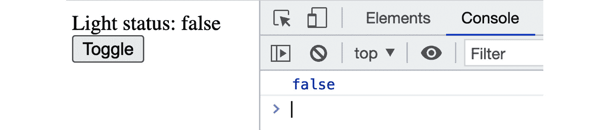

图 5.3 – 灯光状态的控制台输出

注意，在这里，如果你输出`isLightOn`而不是`isLightOn.value`，控制台将输出 Vue 创建的`ref`对象，如下所示：


图 5.4 – `isLightOn`的`ref`对象的控制台输出

`isLightOn`是响应式和可变的，这意味着你可以直接使用`.value`字段设置其值。我们将修改`toggle()`方法来切换`isLightOn`的值。代码将变为以下内容：

```js
const toggle = () => {
  isLightOn.value = !isLightOn.value;
};
```

现在，每当用户点击`isLightOn`时，它将更新其值，Vue 将相应地更新组件，如图所示：


图 5.5 – 点击切换后灯光状态更新为 true

`ref()`通常足以创建任何数据类型的响应式状态，包括原始类型（`boolean`、`number`、`string`等）和对象类型。然而，对于对象类型，使用`ref()`意味着 Vue 将使所需的数据对象及其嵌套属性响应式和可变。例如，我们使用`ref()`声明一个响应式对象`livingRoomLight`，如下面的代码块所示：

```js
const livingRoomLight = ref({
  status: false,
  name: 'Living Room'
})
```

然后，我们添加两个方法，一个用于修改其单个属性`status`，另一个用于用新对象替换整个对象，如下面的代码块所示：

```js
const toggleLight = () => {
  livingRoomLight.value.status =
    !livingRoomLight.value.status
}
const replaceLight = () => {
  livingRoomLight.value = {
    status: false,
    name: 'Kitchen'
  }
}
```

在`template`部分，让我们显示`livingRoomLight`的详细信息，如下所示：

```js
<div>
  <div>Light status: {{ livingRoomLight.status }}</div>
  <div>Light name: {{ livingRoomLight.name }}</div>
  <button @click="toggleLight">Toggle</button>
  <button @click="replaceLight">Replace</button>
</div>
```

当用户点击`lightRoomLight`时，现在它变成了具有不同细节的`Kitchen`灯，如图所示：


图 5.6 – 点击替换后灯光名称更改为 Kitchen

不幸的是，这种使对象及其嵌套属性响应式的机制可能会导致不希望出现的错误和潜在的性能问题，尤其是在具有复杂嵌套属性层次结构的响应式对象中。

在一个场景中，你只想修改整个对象的价值（用新对象替换它），而不修改其嵌套属性，我们建议你使用`shallowRef()`。在一个场景中，你只需要修改对象的嵌套属性（例如数组对象的元素及其字段），你应该使用`reactive()`。我们将在下一节中查看`reactive()`函数。

## 使用`reactive()`设置响应式局部状态

与`ref()`类似，`reactive()`函数返回一个基于传递给它的初始值的响应式对象的引用。与`ref()`不同，`reactive()`只接受对象类型的输入参数，并返回一个可以直接访问其值的引用对象，无需使用`.value`字段。

以下示例展示了我们如何为`BookList`组件定义一个响应式数组`books`和一个响应式对象`newBook`：

```js
<script setup>
import { reactive } from "vue";
const newBook = reactive({
  title: "",
  price: 0,
  currency: "USD",
  description: "",
});
const books = reactive([]);
</script>
```

在`template`中，我们定义一个包含多个`input`字段的`fieldset`元素，每个字段都使用`v-model`绑定到`newBook`数据的一个区域，以及一个`button`元素`Add`，如下所示：

```js
<fieldset :style="{ display: 'flex', flexDirection: 'column'}">
        <label>
            Title:
            <input v-model="newBook.title" />
        </label>
        <label>
            Price:
            <input v-model.number="newBook.price" />
        </label>
        <label>
            Currency:
            <input v-model="newBook.currency" />
        </label>
        <label>
            Description:
            <input v-model="newBook.description" />
        </label>
        <button @click="addBook">Add</button>
    </fieldset>
```

浏览器将显示以下布局：

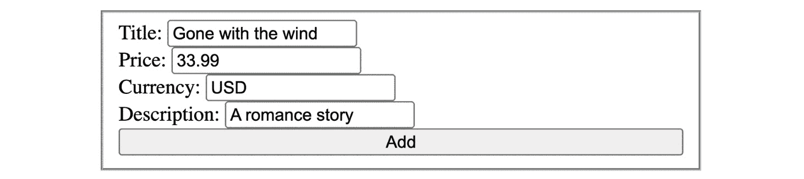

图 5.7 – 在添加之前填写新书的详细信息

我们需要实现 `addBook` 方法，该方法将根据 `newBook` 中的信息将新书添加到 `books` 列表，并清除 `newBook` 的属性，如下所示：

```js
const addBook = () => {
  books.push({
    ...newBook,
  });
  newBook.title = "";
  newBook.price = 0;
  newBook.currency = "USD";
  newBook.description = "";
};
```

注意，在这里，我们不是直接将 `newBook` 推送到 `books`，而是使用扩展字面量 `…` 将其属性克隆到新对象中。`reactive()` 只创建传递给它的原始对象的代理版本。因此，如果您在将其添加到 `books` 列表之前不克隆 `newBook`，则对其属性所做的任何更改都将反映在添加到 `books` 列表中的元素中。

现在，在填写完新书的详细信息后，打开您的浏览器开发者工具，在 `setup` 部分中，如图所示：

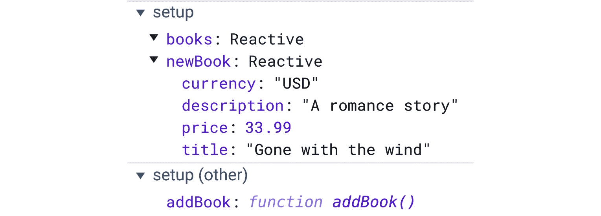

图 5.8 – Vue Devtools 中的组件设置部分

使用 `reactive()` 创建的所有反应性数据都将带有 `Reactive` 文本指示器（对于 `ref()`，它将是 `Ref` 指示器）。一旦您点击更新了新值的 `books` 数组，而 `newBook` 在 Devtools 中重置到其原始值，如图 *图 5.8* 所示：

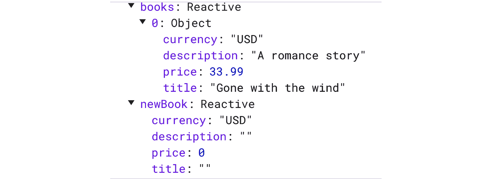

图 5.9 – 添加新书后书籍数组的外观

您还可以使用 `shallowReactive()` 来限制反应机制仅应用于根属性，而不包括其子属性。通过这样做，您可以避免在复杂数据对象中由于太多反应字段而引起的性能问题。

到目前为止，我们已经学习了如何使用 `ref()` 和 `reactive()` 根据其类型和用例定义反应性数据。接下来，我们将应用所学知识，使用这两个函数编写一个反应性组件。

## 练习 5.03 – 使用 ref() 和 reactive() 绑定组件

在此练习中，您将使用 `ref()` 定义博客的搜索框，并使用 `reactive()` 定义不同的反应性博客列表，在其中您可以收藏博客。

要访问此练习的代码，请参阅 [`github.com/PacktPublishing/Frontend-Development-Projects-with-Vue.js-3/tree/v2-edition/Chapter05/Exercise5.03`](https://github.com/PacktPublishing/Frontend-Development-Projects-with-Vue.js-3/tree/v2-edition/Chapter05/Exercise5.03)。

我们将实现一个组件，该组件接收用户的姓氏和名字，并接受多语言输入，并根据接收到的语言数量显示用户的完整姓名，以下是执行以下步骤：

1.  使用由 `npm init vue@3` 生成的应用程序作为起点，或者在使用以下命令进入代码仓库的根目录中的 `Chapter05/Exercise5.03` 文件夹：

    ```js
    > cd Chapter05/Exercise5.03/
    ```

    ```js
    > yarn
    ```

1.  在 VS Code 中打开练习项目（在项目目录中使用 `code .` 命令），或使用您首选的 IDE。

1.  让我们在`./src/components/`文件夹中添加一个名为`BlogGallery.vue`的新 Vue 组件文件。

1.  打开`BlogGallery.vue`，让我们为 Vue 组件创建以下代码块结构：

    ```js
    <template>
    ```

    ```js
    </template>
    ```

    ```js
    <script setup>
    ```

    ```js
    </script>
    ```

1.  在`<script setup>`部分中，我们使用`ref()`定义我们的响应式数据`searchTerm`，用于搜索输入，其初始值为空字符串：

    ```js
    import { ref, reactive } from 'vue';
    ```

    ```js
    const searchTerm = ref('');
    ```

1.  我们将定义我们的响应式博客列表`blogs`，其中每个项目包含`title`、`description`、`author`和`isFavorite`字段，如下所示：

    ```js
    const blogs = reactive([{
    ```

    ```js
        title: 'Vue 3',
    ```

    ```js
        description: 'Vue 3 is awesome',
    ```

    ```js
        author: 'John Doe',
    ```

    ```js
        isFavorite: false
    ```

    ```js
    }, {
    ```

    ```js
        title: 'Vue 2',
    ```

    ```js
        description: 'Vue 2 is awesome',
    ```

    ```js
        author: 'John Doe',
    ```

    ```js
        isFavorite: false
    ```

    ```js
    }, {
    ```

    ```js
        title: 'Pinia state management',
    ```

    ```js
        description: 'Pinia is awesome',
    ```

    ```js
        author: 'Jane Smith',
    ```

    ```js
        isFavorite: false
    ```

    ```js
    }, {
    ```

    ```js
        title: 'Vue Router',
    ```

    ```js
        description: 'Vue Router is awesome',
    ```

    ```js
        author: 'Jane Smith',
    ```

    ```js
        isFavorite: false
    ```

    ```js
    }, {
    ```

    ```js
        title: 'Testing with Playwright',
    ```

    ```js
        description: 'Playwright is awesome',
    ```

    ```js
        author: 'Minnie Mouse',
    ```

    ```js
        isFavorite: false
    ```

    ```js
    }, {
    ```

    ```js
        title: 'Testing with Cypress',
    ```

    ```js
        description: 'Cypress is awesome',
    ```

    ```js
        author: 'Mickey Mouse',
    ```

    ```js
        isFavorite: false
    ```

    ```js
    }]);
    ```

1.  在`<template>`部分，我们将`searchTerm`绑定到一个带有`placeholder`元素`"Search by blog's title"`和`label`元素`What are you searching for?`的输入字段，如下面的代码块所示：

    ```js
    <label>
    ```

    ```js
       What are you searching for?
    ```

    ```js
       <input
    ```

    ```js
          type="text"
    ```

    ```js
          v-model="searchTerm"
    ```

    ```js
          placeholder="Search by blog's title"
    ```

    ```js
       />
    ```

    ```js
    </label>
    ```

1.  然后，我们添加一个`<ul>`元素，使用`v-for`遍历`blogs`，并渲染一个`<li>`元素列表。每个`<li>`元素包含`<article>`，其中包含标题的`<h3>`，作者名称的`<h4>`，描述的`<p>`，以及添加博客到收藏的`<button>`元素：

    ```js
    <ul>
    ```

    ```js
      <li v-for="(blog, index) in blogs" :key="index">
    ```

    ```js
        <article>
    ```

    ```js
            <h3>{{ blog.title }}</h3>
    ```

    ```js
            <h4>{{ blog.author }}</h4>
    ```

    ```js
              <p>{{ blog.description }}</p>
    ```

    ```js
              <button>Add to favorite</button>
    ```

    ```js
        </article>
    ```

    ```js
      </li>
    ```

    ```js
    </ul>
    ```

1.  返回到`<script setup>`部分，我们将添加`toggleFavorite()`方法的实现，该方法接收`index`并切换`blogs[index].isFavorite`的值：

    ```js
    const toggleFavorite = (index) => {
    ```

    ```js
      blogs[index].isFavorite = !blogs[index].isFavorite;
    ```

    ```js
    }
    ```

1.  返回到`<template>`部分。我们将把`toggleFavorite()`方法绑定到创建的`button`元素上，并根据`isFavorite`的状态更改其名称：

    ```js
    <button @click="toggleFavorite(index)">
    ```

    ```js
      {{
    ```

    ```js
         blog.isFavorite ? 'Remove from favorites' : 'Add
    ```

    ```js
           to favorites'
    ```

    ```js
      }}
    ```

    ```js
    </button>
    ```

1.  我们需要根据`searchTerm`过滤博客，因此让我们添加另一个方法来返回一个排序后的列表——`getFilteredBlogs()`——它将根据博客标题生成一个过滤后的博客数组，如下所示：

    ```js
    const getFilteredBlogs = () => {
    ```

    ```js
        return blogs.filter(
    ```

    ```js
          blog => blog.title.toLowerCase().includes(
    ```

    ```js
            searchTerm.value.toLowerCase()
    ```

    ```js
            )
    ```

    ```js
        );
    ```

    ```js
    };
    ```

1.  然后，在`template`部分，将`v-for`迭代中的`blogs`替换为`getFilteredBlogs()`，如下面的代码块所示：

    ```js
    <li v-for="(blog, index) in getFilteredBlogs()" :key="index">
    ```

1.  我们需要添加一些基本的 CSS 样式来使我们的组件更美观，如下所示：

    ```js
    <style scoped>
    ```

    ```js
    label {
    ```

    ```js
        display: flex;
    ```

    ```js
        flex-direction: column;
    ```

    ```js
    }
    ```

    ```js
    li {
    ```

    ```js
        list-style: none;
    ```

    ```js
        gap: 10px;
    ```

    ```js
        width: 200px;
    ```

    ```js
    }
    ```

    ```js
    ul {
    ```

    ```js
        display: flex;
    ```

    ```js
        flex-wrap: wrap;
    ```

    ```js
        gap: 10px;
    ```

    ```js
        padding-inline-start: 0px;
    ```

    ```js
    }
    ```

    ```js
    </style>
    ```

1.  现在，在`App.vue`中，将`BlogGallery`组件导入到`<script setup>`中：

    ```js
    <script setup>
    ```

    ```js
    import BlogGallery from "./components/BlogGallery.vue";
    ```

    ```js
    </script>
    ```

1.  在`template`部分渲染`BlogGallery`：

    ```js
    <template>
    ```

    ```js
      <BlogGallery />
    ```

    ```js
    </template>
    ```

1.  最后，使用以下命令运行应用程序：

    ```js
    yarn dev
    ```

1.  打开浏览器。你会看到显示的列表和一个空值的搜索框，如下面的截图所示：

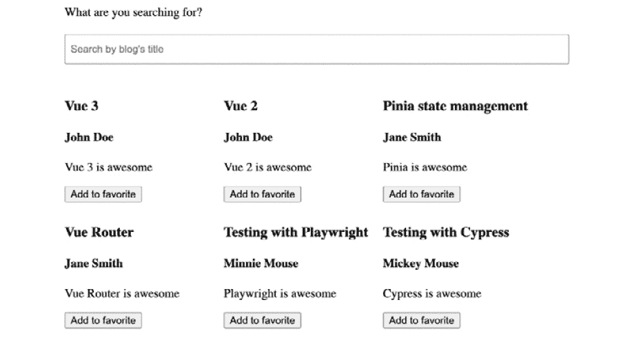

图 5.10 – BlogGallery 在浏览器中的外观

1.  当输入搜索词时，应用程序将相应地显示过滤后的列表，如下面的截图所示：

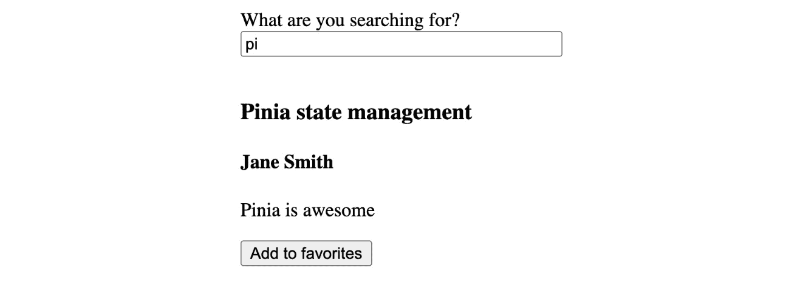

图 5.11 – 根据用户输入仅显示过滤后的博客

通过前面的练习，你已经学会了如何使用`ref()`和`reactive()`为组件定义响应式数据。

理论上，你可以使用 `ref()` 和 `reactive()` 一起从其他响应式数据创建新的响应式数据。然而，我们强烈建议不要这样做，因为 Vue 中包装/解包响应式机制的性能问题。对于这种场景，你应该使用 `computed()` 函数，我们将在下一节中探讨。

## 使用 computed() 从另一个本地状态计算响应式状态

与 Options API 中的 `computed()` 类似，`computed()` 是用于为组件创建基于其他响应式数据的新响应式数据。它接受一个函数作为其第一个参数，该函数返回响应式数据值。它将返回一个只读且缓存的引用对象：

```js
<script setup>
import { computed } from 'vue'
const computedData = computed(() => { //… })
</script>
```

与 `reactive()` 和 `ref()` 返回的引用对象不同，我们无法直接重新分配它们的值。在以下示例中，我们将使用 `computed()` 计算给定 `books` 数组的过滤版本，根据匹配项 `vue`：

```js
import { computed, reactive, ref } from 'vue';
const books = reactive([{
    title: 'Vue 3',
    description: 'Vue 3 is awesome',
}, {
    title: 'Vue 2',
    description: 'Vue 2 is awesome',
}, {
    title: 'Pinia state management',
    description: 'Pinia is awesome',
}, {
    title: 'Vue Router',
    description: 'Vue Router is awesome',
}, {
    title: 'Testing with Playwright',
    description: 'Playwright is awesome',
}, {
    title: 'Testing with Cypress',
    description: 'Cypress is awesome',
}]);
const searchTerm = ref('vue')
const filteredBooks = computed(
    () => books.filter(book => book.title.toLowerCase()
      .includes(searchTerm.value))
);
```

在 `template` 中，我们将使用以下代码显示 `filteredBooks`：

```js
<ul>
        <li v-for="(book, index) in filteredBooks"
          :key="index">
            <article>
                <h3>{{ book.title }}</h3>
                <p>{{ book.description }}</p>
            </article>
        </li>
    </ul>
```

在浏览器中，你将只看到以下图中显示的三本书：

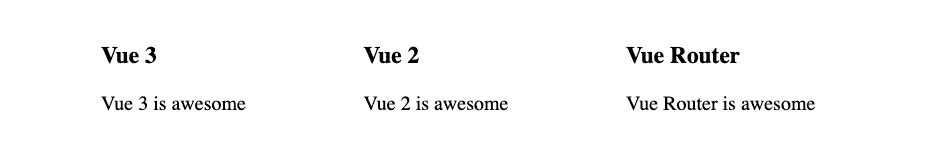

图 5.12 – 根据 vue 术语过滤的书籍列表

无论何时 `books` 列表或用于过滤的搜索词有任何变化，Vue 都会自动更新并缓存计算出的 `filteredBooks` 值以相应地显示。在 `filteredBooks` 显示为 `setup` 部分的一部分，如 *图 5.12* 中所示，带有 `Computed` 文本指示器：


图 5.13 – Vue 选项卡中 filteredBooks 的外观

通常，`computed()` 的工作方式与 Options API 中的 `compute` 属性相同 (*第二章*，*处理数据*)。计算数据是 Vue 的一个有价值的功能，允许开发者创建可重用和可读的代码。你还可以通过将具有设置器和获取器的对象传递给 `computed()` 而不是函数来使计算数据可写。然而，我们不建议这样做，因为这不符合一般的 Vue 实践。

接下来，我们将练习使用 `computed()` 为 Vue 组件实现复杂计算数据。

## 练习 5.04 – 使用 computed() 实现计算数据

在此练习中，你将使用 `computed()` 定义基于现有数据的复杂响应式数据。

要访问此练习的代码，请参阅 [`github.com/PacktPublishing/Frontend-Development-Projects-with-Vue.js-3/tree/v2-edition/Chapter05/Exercise5.04`](https://github.com/PacktPublishing/Frontend-Development-Projects-with-Vue.js-3/tree/v2-edition/Chapter05/Exercise5.04)。

我们将实现一个组件，该组件接收用户的姓氏和名字，并接受多语言输入，通过执行以下步骤相应地显示用户的完整姓名和接收到的语言数量：

1.  以 `npm init vue@3` 生成的应用程序作为起点，或者在代码仓库的根目录下，使用以下命令按顺序导航到 `Chapter05/Exercise5.04` 文件夹：

    ```js
    > cd Chapter05/Exercise5.04/
    ```

    ```js
    > yarn
    ```

1.  在 VS Code 中打开练习项目（在项目目录中使用 `code .` 命令）或您的首选 IDE。

1.  让我们创建一个新的 Vue 组件 `UserInput`，通过将 `UserInput.vue` 文件添加到 `./src/components/` 文件夹中来实现。

1.  打开 `UserInput.vue` 并创建 Vue 组件的代码块结构，如下所示：

    ```js
    <template>
    ```

    ```js
    </template>
    ```

    ```js
    <script>
    ```

    ```js
    export default {
    ```

    ```js
    }
    ```

    ```js
    </script>
    ```

1.  在 `<template>` 中创建一个用于姓氏的 `input` 字段，并使用 `v-model` 将 `firstName` 绑定到该字段：

    ```js
    <input v-model="firstName" placeholder="First name" />
    ```

1.  创建第二个输入字段用于姓氏，并使用 `v-model` 将 `lastName` 数据属性绑定到该字段：

    ```js
    <input v-model="lastName" placeholder="Last name" />
    ```

1.  创建另一个用于语言的输入字段，这次我们将绑定 *Enter 键上键* 事件到名为 `addToLanguageList` 的方法，如下所示：

    ```js
    <input
    ```

    ```js
      placeholder="Add a language"
    ```

    ```js
      @keyup.enter="addToLanguageList" />
    ```

1.  在 `<script setup>` 中，使用 `ref()` 和 `reactive()` 将 `lastName`、`firstName` 和 `languages` 定义为反应式，如下所示：

    ```js
    <script setup>
    ```

    ```js
    import { ref, reactive } from 'vue';
    ```

    ```js
    const firstName = ref('');
    ```

    ```js
    const lastName = ref('');
    ```

    ```js
    const languages = reactive([]);
    ```

    ```js
    </script>
    ```

1.  然后，声明 `addToLanguageList` 方法，该方法接收一个事件并将事件目标值添加到语言列表中，如果它不为空：

    ```js
    const addToLanguageList = (event) => {
    ```

    ```js
      if (!event.target.value) return;
    ```

    ```js
      languages.push(event.target.value);
    ```

    ```js
      event.target.value = '';
    ```

    ```js
    };
    ```

1.  从 `vue` 包中导入 `computed()`：

    ```js
    import { ref, reactive, computed } from 'vue';
    ```

1.  创建一个名为 `fullName` 的计算数据变量：

    ```js
    const fullName = computed(
    ```

    ```js
      ()=> '${firstName.value} ${lastName.value}'
    ```

    ```js
    );
    ```

1.  然后，创建另一个名为 `numberOfLanguages` 的计算变量，如下所示：

    ```js
    const numberOfLanguages = computed(() => languages.length);
    ```

1.  在您的 `input` 字段下方，使用 `h3` 标签输出计算后的数据：

    ```js
    <h3 class="output">{{ fullName }}</h3>
    ```

1.  添加另一个 `<p>` 元素，它将在接收到的语言列表旁边显示语言数量，如下所示：

    ```js
    <p>
    ```

    ```js
      Languages({{ numberOfLanguages }}):
    ```

    ```js
        {{languages.toString()}}
    ```

    ```js
    </p>
    ```

1.  我们还添加了一些基本的局部 CSS 样式，使组件看起来更美观：

    ```js
    <style>
    ```

    ```js
    .container {
    ```

    ```js
      margin: 0 auto;
    ```

    ```js
      padding: 30px;
    ```

    ```js
      max-width: 600px;
    ```

    ```js
    }
    ```

    ```js
    input {
    ```

    ```js
      padding: 10px 6px;
    ```

    ```js
      margin: 20px 10px 10px 0;
    ```

    ```js
    }
    ```

    ```js
    .output {
    ```

    ```js
      font-size: 16px;
    ```

    ```js
    }
    ```

    ```js
    </style>
    ```

1.  最后，使用以下命令运行应用程序：

    ```js
    yarn dev
    ```

1.  在浏览器中访问 `http://localhost:3000` 并为姓氏键入 `Maya`，为名字键入 `Shavin`，并添加几种语言（JavaScript、C++ 等），页面将生成以下输出：

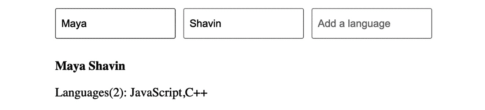

图 5.14 – 计算数据的输出将显示全名和语言列表

这个练习演示了我们可以如何使用 `computed()` 来定义将姓氏和名字等组合成单个输出变量 `fullName` 的反应式数据属性，并可以反应性地计算语言数量，这些可以在组件内部重用。

接下来，我们将学习如何使用 Composition API 中的 `watch()` 函数来定义我们的观察者。

## 使用 `watch()` 和观察者

在 *第二章* *处理数据* 中，我们学习了观察者的相关知识以及如何使用 Options API 中的 `watch` 属性在数据属性上启用观察者。Composition API 引入了具有相同上下文和略微不同语法的 `watch()` 函数，如下所示：

```js
const watcher = watch(source, handler, options)
```

`watch()` 接受三个参数，包括以下内容：

+   `source`是一个要监视的单个目标数据对象或 getter 函数（它返回数据的值），或者是一个目标数组。

+   `handler`是 Vue 在`source`变化时执行的函数。处理函数接收`newValue`和`oldValue`作为其源的下一个值和上一个值。它还接受第三个参数作为其副作用清理方法。Vue 将在调用下一个处理器之前触发这个清理函数——如果有下一个处理器的话。

+   `options`是观察者的附加配置，包括以下内容：

    +   两个`boolean`标志：`deep`（Vue 是否应该监视源嵌套属性）和`immediate`（是否在组件挂载后立即调用处理器）。

    +   将`flush`作为处理器的执行顺序（`pre`、`post`或`sync`）。默认情况下，Vue 在更新之前以`pre`顺序执行处理器。

    +   两个调试回调，`onTrack`和`onTrigger`，用于开发模式。

以下示例演示了如何手动将观察者添加到`searchTerm`：

```js
import { ref, watch } from 'vue';
const searchTerm = ref('');
const searchTermWatcher = watch(
  searchTerm,
  (newValue, oldValue) => console.log(
    `Search term changed from ${oldValue} to ${newValue}`
  )
);
```

Vue 会被动地观察`searchTerm`的变化，并相应地调用`searchTermWatcher`的处理函数。在浏览器控制台中，当你更改输入字段中`searchTerm`的值时，你会看到以下记录：


图 5.15 – 当`searchTerm`的值发生变化时，输出日志

与 Options API 中的`watch`属性不同，`watch()`方法返回一个停止函数，可以在不再需要观察目标数据时停止观察者。此外，在显式希望监视嵌套数据属性的场景中，你可以定义目标源为一个返回特定数据属性的 getter 函数。例如，如果你想监视`book`数据对象的`description`属性，你需要使用以下代码，通过 Options API 中的`watch`属性：

```js
data() {
 return {
  book:{
    title: 'Vue 3',
    description: 'Vue 3 is awesome',
  }
 }
},
watch: {
  'book.description': (newValue, oldValue) => { /*…*/ }
}
```

使用`watch()`，你只需要设置一个返回`book.description`的 getter 即可，如下面的代码块所示：

```js
const book = reactive({
    title: 'Vue 3',
    description: 'Vue 3 is awesome',
})
const bookWatcher = watch(
    () => book.description,
    (newValue, oldValue) => console.log(
      `Book's description changed from ${oldValue} to
        ${newValue}`
    )
);
```

通过指定你想要观察的确切目标数据，Vue 不会在整个数据对象上触发观察者的处理器，从而避免不必要的性能开销。

现在，让我们在下一个练习中练习使用观察者。

## 练习 5.05 – 使用观察者设置新值

在这个练习中，你将使用观察者参数来监视数据属性的变化，然后使用这个观察者通过一个方法来设置变量。

你可以在[`github.com/PacktPublishing/Frontend-Development-Projects-with-Vue.js-3/tree/v2-edition/Chapter05/Exercise5.05`](https://github.com/PacktPublishing/Frontend-Development-Projects-with-Vue.js-3/tree/v2-edition/Chapter05/Exercise5.05)找到这个练习的完整代码。

我们创建一个 Vue 组件，显示商店观察者的折扣前后的价格，并提供一个选项来更新折扣价格，按照以下说明进行：

1.  使用由 `npm init vue@3` 生成的应用程序作为起点，或者在代码仓库的根目录下，使用以下命令按顺序导航到 `Chapter05/Exercise5.05` 文件夹：

    ```js
    > cd Chapter05/Exercise5.05/
    ```

    ```js
    > yarn
    ```

1.  在项目目录中使用 `code .` 命令在 VS Code 中打开练习项目，或使用您首选的 IDE。

1.  让我们通过将 `PizzaItem.vue` 文件添加到 `./src/components/` 文件夹来创建一个新的 Vue 组件 `PizzaItem`。

1.  打开 `PizzaItem.vue` 并为 Vue 组件创建代码块结构，如下所示：

    ```js
    <template>
    ```

    ```js
    </template>
    ```

    ```js
    <script>
    ```

    ```js
    export default {
    ```

    ```js
    }
    ```

    ```js
    </script>
    ```

1.  通过添加 `discount`、`pizza` 和 `newPrice` 对象来设置文档：

    ```js
    import { ref, reactive, watch } from "vue";
    ```

    ```js
    const discount = ref(5);
    ```

    ```js
    const pizza = reactive({
    ```

    ```js
      name: "Pepperoni Pizza",
    ```

    ```js
      price: 10,
    ```

    ```js
    });
    ```

1.  我们想通过从 `vue` 包中导入的 `watch()` 函数监听 `discount` 属性的变化。当 `discount` 发生变化时，我们将手动重新计算 `newPrice` 的值，如下所示：

    ```js
    watch(
    ```

    ```js
     discount,
    ```

    ```js
      (newValue) => {
    ```

    ```js
        newPrice.value = pizza.price - (pizza.price *
    ```

    ```js
          newValue)/ 100;
    ```

    ```js
      },
    ```

    ```js
      {
    ```

    ```js
        immediate: true
    ```

    ```js
      }
    ```

    ```js
    );
    ```

注意，在这里，我们将 `immediate` 设置为 `true`，这样 Vue 就会在组件挂载后立即触发此处理程序，并使用正确的值更新 `newPrice`。

1.  现在，让我们添加一个名为 `updateDiscount` 的组件方法。在方法内部，将 `oldDiscount` 数据属性设置为 `this.discount + 5`：

    ```js
    const updateDiscount = () => {
    ```

    ```js
      discount.value = discount.value + 5;
    ```

    ```js
    };
    ```

1.  在 `template` 部分，我们将显示 `pizza.name`、`discount`、原价以及应用折扣后的新价格，如下所示：

    ```js
    <template>
    ```

    ```js
      <div class="container">
    ```

    ```js
        <h1>{{ pizza.name }}</h1>
    ```

    ```js
        <div class="campaign-wrapper">
    ```

    ```js
          Monday Special: {{ discount }}% off!
    ```

    ```js
          <strike>Was ${{ pizza.price }}</strike>
    ```

    ```js
          <strong> Now at ${{ newPrice }} ONLY</strong>
    ```

    ```js
        </div>
    ```

    ```js
      </div>
    ```

    ```js
    </template>
    ```

1.  然后，使用 `@click` 将 `updateDiscount` 方法绑定到一个 `button` 元素上：

    ```js
    <button @click="updateDiscount" class="decrease-btn">
    ```

    ```js
          Get a discount!
    ```

    ```js
    </button>
    ```

当用户点击前面的按钮时，Vue 将触发 `updateDiscount()` 以增加 `discount` 值，从而调用处理程序以相应地更新 `newPrice` 值。

1.  现在，让我们添加一些 CSS 样式来使其看起来更美观：

    ```js
    <style scoped>
    ```

    ```js
    .container {
    ```

    ```js
      margin: 0 auto;
    ```

    ```js
      padding: 30px;
    ```

    ```js
      max-width: 600px;
    ```

    ```js
      font-family: "Avenir", Helvetica, Arial, sans-serif;
    ```

    ```js
      margin: 0;
    ```

    ```js
    }
    ```

    ```js
    .campaign-wrapper {
    ```

    ```js
      margin: 20px 0;
    ```

    ```js
      display: flex;
    ```

    ```js
      flex-direction: column;
    ```

    ```js
    }
    ```

    ```js
    button {
    ```

    ```js
      display: inline-block;
    ```

    ```js
      border-radius: 10px;
    ```

    ```js
      font-size: 14px;
    ```

    ```js
      color: white;
    ```

    ```js
      padding: 10px 20px;
    ```

    ```js
      text-decoration: none;
    ```

    ```js
      margin-inline-end: 10px;
    ```

    ```js
    }
    ```

    ```js
    .decrease-btn {
    ```

    ```js
      background: rgb(241, 34, 34);
    ```

    ```js
    }
    ```

    ```js
    </style>
    ```

1.  在 `App.vue` 中，将组件导入到 `<setup script>` 并在 `template` 中按如下方式渲染：

    ```js
    <template>
    ```

    ```js
      <PizzaItem />
    ```

    ```js
    </template>
    ```

    ```js
    <script setup>
    ```

    ```js
    import PizzaItem from "./components/PizzaItem.vue";
    ```

    ```js
    </script>
    ```

1.  最后，使用以下命令运行应用程序：

    ```js
    yarn dev
    ```

1.  在浏览器中访问 `http://localhost:3000`，上述命令的输出将如下所示：


图 5.16 – 比萨销售的示例输出

1.  现在，让我们为 `pizza.price` 字段显式添加一个观察器，并执行相同的 `newPrice` 重新计算，如下面的代码块所示：

    ```js
    watch(
    ```

    ```js
      () => pizza.price,
    ```

    ```js
      (newValue) => {
    ```

    ```js
        newPrice.value = newValue - (newValue *
    ```

    ```js
          discount.value) / 100;
    ```

    ```js
      }
    ```

    ```js
    );
    ```

1.  我们还添加了一个名为 `increasePrice()` 的方法，以便在触发时增加比萨的价格：

    ```js
    const increasePrice = () => {
    ```

    ```js
      pizza.price = pizza.price + 5;
    ```

    ```js
    };
    ```

1.  在 `template` 部分，我们添加了另一个按钮，允许用户点击以增加比萨的价格，从而相应地更新新的折扣价格：

    ```js
    <button @click="increasePrice" class="increase-btn">
    ```

    ```js
      Increase the price!
    ```

    ```js
    </button>
    ```

1.  在 `style` 部分，我们还为前面的按钮添加了不同的 `background` 颜色：

    ```js
    .increase-btn {
    ```

    ```js
      background: rgb(34, 100, 241);
    ```

    ```js
    }
    ```

1.  返回主浏览器的屏幕，现在您将看到带有额外按钮的更新布局，如下面的截图所示：

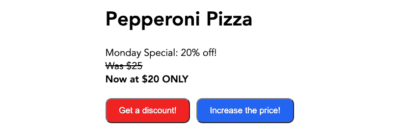

图 5.17 – 具有修改价格选项的比萨销售

1.  当点击 **增加价格！** 按钮时，您将看到价格和折扣价格发生变化，如下面的截图所示：

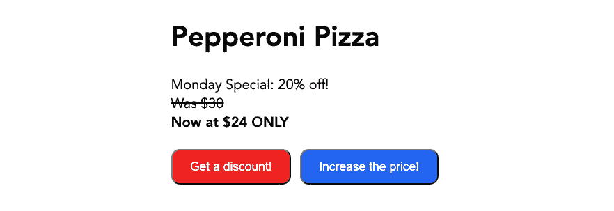

图 5.18 – 点击“增加价格！”按钮后价格发生了变化

在这个练习中，我们探讨了如何在 `<script setup>` 中使用 `watch()` 动态观察和操作数据，当应用更改时。

下一个部分将探讨我们如何使用 Composition API 中的生命周期函数来设置生命周期钩子。

# 理解可组合的生命周期函数

在*第一章*，“*开始* *您的第一个 Vue 项目”，我们学习了组件的生命周期和 Vue 的 Options API 中可用的钩子。在 Composition API 中，这些生命周期钩子现在作为独立的函数提供，并在使用之前需要从 `vue` 包中导入。

通常，Composition API 中的生命周期函数与 Options API 中的类似，前缀为 `on`。例如，Options API 中的 `beforeMount()` 在 Composition API 中是 `onBeforeMount()`，依此类推。

以下是从 Composition API 可用的生命周期函数列表，可在 `setup()` 方法或 `<script setup>` 中使用：

+   `onBeforeMount()`：在组件首次渲染之前

+   `onMounted()`：在将组件渲染并挂载到 DOM 之后

+   `onBeforeUpdate()`：在组件的更新过程开始之后，但在实际渲染更新后的组件之前

+   `onUpdated()`：在渲染更新后的组件之后

+   `onBeforeMount()`：在开始卸载组件的过程之前

+   `onUnmounted()`：在组件实例被销毁之后

由于我们使用 `setup()` 或 `<script setup>` 结合其他 Composition API 来定义组件的数据和内部逻辑，因此不需要 Options API 中的 `created()` 和 `beforeCreate()` 的等效版本。

Composition API 中的所有生命周期方法都将回调函数作为其参数。Vue 将在应用时调用此回调函数。

让我们做一个练习来学习如何在 Vue 组件中使用这些生命周期方法。

## 练习 5.06 – 使用生命周期函数控制数据流

在这个练习中，我们将学习如何以及何时使用 Vue 的生命周期钩子，以及它们是如何通过 JavaScript 提示框触发的。到练习结束时，我们将理解并能使用 Composition API 中的多个生命周期函数。

要访问此练习的代码文件，请参阅[`github.com/PacktPublishing/Frontend-Development-Projects-with-Vue.js-3/tree/v2-edition/Chapter05/Exercise5.06`](https://github.com/PacktPublishing/Frontend-Development-Projects-with-Vue.js-3/tree/v2-edition/Chapter05/Exercise5.06)。

我们将构建一个不同元素的列表，演示如何向购物车添加不同数量的商品。然后，我们将通过以下方式显示更新后的购物车总价值，并以货币格式显示：

1.  使用由 `npm init vue@3` 生成的应用程序作为起点，或者在每个代码仓库的根目录中，使用以下命令按顺序导航到 `Chapter05/Exercise5.06` 文件夹：

    ```js
    > cd Chapter05/Exercise5.06/
    ```

    ```js
    > yarn
    ```

1.  使用以下命令运行应用程序：

    ```js
    yarn dev
    ```

1.  在 VS Code 中打开练习项目（在项目目录中使用 `code .` 命令）或您首选的 IDE。

1.  在 `src/components` 目录下创建一个名为 `Exercise5-06.vue` 的新 Vue 组件文件。

1.  在 `Exercise5-06.vue` 内部，我们将首先创建一个数据数组，用于在 `list` 元素中迭代，将键设置为 `n`，并在 `<li>` 元素中使用花括号输出值，`{{item}}`：

    ```js
    <template>
    ```

    ```js
      <div>
    ```

    ```js
        <h1>Vue Lifecycle hooks</h1>
    ```

    ```js
        <ul>
    ```

    ```js
         <li v-for="(item, n) in list" :key="n">
    ```

    ```js
            {{ item }}
    ```

    ```js
         </li>
    ```

    ```js
        </ul>
    ```

    ```js
      </div>
    ```

    ```js
    </template>
    ```

    ```js
    <script setup>
    ```

    ```js
    import { ref } from "vue";
    ```

    ```js
    const list = ref([
    ```

    ```js
      "Apex Legends",
    ```

    ```js
      "A Plague Tale: Innocence",
    ```

    ```js
      "ART SQOOL",
    ```

    ```js
      "Baba Is You",
    ```

    ```js
      "Devil May Cry 5",
    ```

    ```js
      "The Division 2",
    ```

    ```js
      "Hypnospace Outlaw",
    ```

    ```js
      "Katana ZERO",
    ```

    ```js
    ]);
    ```

1.  从 `vue` 包中导入所有生命周期函数，如下面的代码块所示：

    ```js
    import {
    ```

    ```js
      ref,
    ```

    ```js
      onMounted,
    ```

    ```js
      onBeforeMount,
    ```

    ```js
      onUpdated,
    ```

    ```js
      onBeforeUpdate,
    ```

    ```js
      onUnmounted,
    ```

    ```js
      onBeforeUnmount,
    ```

    ```js
    } from "vue";
    ```

1.  定义 `onBeforeMount()` 和 `onMounted()` 的回调，以触发显示相关消息的弹窗：

    ```js
    onMounted(() => {
    ```

    ```js
      alert("mounted: DOM ready to use");
    ```

    ```js
    });
    ```

    ```js
    onBeforeMount(() => {
    ```

    ```js
      alert("beforeMount: DOM not ready to use");
    ```

    ```js
    });
    ```

1.  当您刷新浏览器时，您也应该在看到页面上的列表加载之前看到这些弹窗：


图 5.19 – 观察到 onBeforeMount() 钩子弹窗

1.  以下截图显示了 `onBeforeMount()` 钩子之后的 `onMounted()` 钩子弹窗：


图 5.20 – 在 onBeforeMount() 钩子之后观察到 onMounted() 钩子弹窗

1.  在您的 `<li>` 元素内添加一个新的 `button` 元素，用于渲染 `item` 输出。使用 `@click` 指令将此按钮绑定到名为 `deleteItem` 的方法，并将 `item` 值作为参数传递：

    ```js
    <template>
    ```

    ```js
      <div>
    ```

    ```js
        <h1>Vue Lifecycle hooks</h1>
    ```

    ```js
        <ul>
    ```

    ```js
          <li v-for="(item, n) in list" :key="n">
    ```

    ```js
            {{ item }}
    ```

    ```js
            <button @click="deleteItem(item)">
    ```

    ```js
              Delete</button>
    ```

    ```js
          </li>
    ```

    ```js
        </ul>
    ```

    ```js
      </div>
    ```

    ```js
    </template>
    ```

1.  在您的钩子之上添加一个名为 `deleteItem` 的方法，将 `value` 作为参数传递，并根据此值从 `list` 数组中过滤出项目。然后，用新的列表替换现有的列表：

    ```js
    const deleteItem = (value) => {
    ```

    ```js
      list.value = list.value.filter((item) => item !==
    ```

    ```js
        value);
    ```

    ```js
    };
    ```

1.  添加 `onBeforeUpdate()` 和 `onUpdated()`，并在其中设置一个弹窗：

    ```js
    onUpdated(() => {
    ```

    ```js
      alert("updated: virtual DOM will update after you
    ```

    ```js
        click OK");
    ```

    ```js
    });
    ```

    ```js
    onBeforeUpdate(() => {
    ```

    ```js
      alert(
    ```

    ```js
        "beforeUpdate: we know an update is about to
    ```

    ```js
          happen, and have the data"
    ```

    ```js
      );
    ```

    ```js
    });
    ```

当您通过点击 `onBeforeUpdated()` 删除列表项时将触发处理程序：

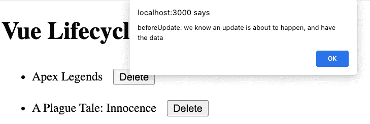

图 5.21 – 点击任何删除按钮后首先调用 onBeforeCreated

然后，`onUpdated` 如以下截图所示被触发：

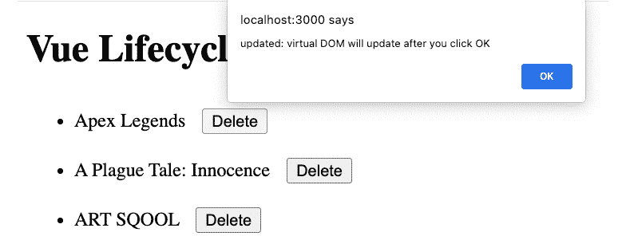


1.  继续向组件选项中添加 `onBeforeUnmount()` 和 `onUnmounted()` 作为函数属性。在这些钩子中设置一个弹窗，以便您可以查看它们何时被触发：

    ```js
    onUnmounted(() => {
    ```

    ```js
      alert("unmounted: this component has been
    ```

    ```js
        destroyed");
    ```

    ```js
    });
    ```

    ```js
    onBeforeUnmount(() => {
    ```

    ```js
      alert("beforeUnmount: about to blow up this
    ```

    ```js
        component");
    ```

    ```js
    });
    ```

1.  在您的 `list` 数组中添加一个新的字符串 – 例如，`testing` `unmounted hooks`：

    ```js
    const list = ref([
    ```

    ```js
      "Apex Legends",
    ```

    ```js
      "A Plague Tale: Innocence",
    ```

    ```js
      "ART SQOOL",
    ```

    ```js
      "Baba Is You",
    ```

    ```js
      "Devil May Cry 5",
    ```

    ```js
      "The Division 2",
    ```

    ```js
      "Hypnospace Outlaw",
    ```

    ```js
      "Katana ZERO",
    ```

    ```js
      'testing unmounted hooks',
    ```

    ```js
    ]);
    ```

1.  您应该按照以下顺序看到卸载弹窗：`onBeforeUnmount` – `onBeforeMount` – `onUnmounted` – `onMounted`。以下图显示了显示 `onBeforeUnmount` 弹窗的示例输出屏幕：

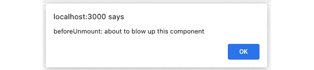

图 5.23 – 当组件即将卸载时显示的警报

接下来，我们将讨论如何使用 Composition API 中的可用方法，并创建我们的自定义可组合组件（或自定义钩子），以动态地控制组件的状态。

# 创建你的可组合组件（自定义钩子）

在许多场景中，我们希望将一些组件的逻辑分组为可重用的代码块，供具有相似功能的其他组件使用。在 Vue 2.x 中，我们使用混入（mixins）来实现这个目标。然而，混入并不是最佳的实际解决方案，并且由于合并和调用重叠的数据和生命周期钩子的顺序，它们可能会创建代码复杂性。

从 Vue 3.0 开始，你可以使用 Composition API 将公共数据逻辑划分为小型和独立的可组合组件，使用它们在不同的组件中创建作用域数据控制，并在有数据时返回创建的数据。可组合组件是一个使用 Composition API 方法并内部执行数据状态管理的常规 JavaScript 函数。

要开始，我们创建一个新的 JavaScript（`.js`）文件，该文件导出一个作为可组合组件使用的函数。在下面的示例中，我们创建了一个 `useMessages` 可组合组件，它返回一个 `messages` 列表和一些相应修改消息的方法：

```js
// src/composables/useMessages.ts
import { ref } from 'vue'
export const useMessages = () => {
  const messages = ref([
   "Apex Legends",
   "A Plague Tale: Innocence",
   "ART SQOOL",
   "Baba Is You",
   "Devil May Cry 5",
   "The Division 2",
   "Hypnospace Outlaw",
   "Katana ZERO",
  ]);
  const deleteMessage = (value) => {
   messages.value = messages.value.filter((item) => item
     !== value);
  };
  const addMessage = (value) => {
   messages.value.push(value)
  }
  return { messages, deleteMessage, addMessage }
}
```

要在组件中使用 `useMessages()`，你可以在组件的 `<script setup>` 部分导入它，并检索相关数据，如下所示：

```js
<script setup>
import { useMessages } from '@/composables/useMyComposable'
const { messages, deleteMessage, addMessage } = useMessages ()
</script>
```

然后，我们可以在组件中使用从可组合组件返回的 `messages`、`deleteMessage` 和 `addMessage` 作为其本地数据和方法的本地数据和方法，如下面的代码块所示：

```js
<template>
  <button @click="addMessage('test message')">
    Add new message
  </button>
  <ul>
    <li v-for="(message, n) in messages" :key="n">
      {{ message }}
      <button @click="deleteMessage(message)">
        Delete</button>
    </li>
  </ul>
</template>
```

由于 `messages`、`deleteMessage` 和 `addMessage` 是在 `useMessages()` 函数内部声明的，每次执行 `useMessages` 都会返回不同的数据实例，从而保持可组合组件定义的响应式数据是隔离的，并且仅与消费它的组件相关。使用可组合组件，组件共享逻辑，而不是数据。你还可以基于另一个可组合组件创建新的可组合组件，而不仅仅是 Composition API。

就这样 – 你已经学会了如何使用 Composition API 创建一个简单的可组合组件。接下来，让我们应用到目前为止关于 Composition API 的知识，创建我们的第一个可组合组件。

## 练习 5.07 – 创建你的第一个可组合组件

在这个练习中，你将创建一个可组合组件，它将从外部 API 获取数据，并返回数据、请求的加载/错误状态以及一个可重用的搜索可组合组件。

你可以在[`github.com/PacktPublishing/Frontend-Development-Projects-with-Vue.js-3/tree/v2-edition/Chapter05/Exercise5.07`](https://github.com/PacktPublishing/Frontend-Development-Projects-with-Vue.js-3/tree/v2-edition/Chapter05/Exercise5.07)找到这个练习的完整代码。

我们将创建一个可组合函数，用于从外部源获取电影，并创建另一个可组合函数，允许你根据以下说明在电影列表中进行搜索：

1.  使用由`npm init vue@3`生成的应用程序作为起点，或者在你的代码仓库的根目录中，使用以下命令按顺序导航到`Chapter05/Exercise5.07`文件夹：

    ```js
    > cd Chapter05/Exercise5.07/
    ```

    ```js
    > yarn
    ```

1.  在 VS Code 中打开练习项目（在项目目录中使用`code .`命令），或使用你偏好的 IDE。

让我们创建一个新的可组合函数`useMovies`，通过将`useMovies.js`添加到`./src/composables`文件夹中。

1.  在`useMovies.js`中，我们将添加以下代码以将可组合函数作为模块导出，以便在其他文件中使用：

    ```js
    import { } from 'vue';
    ```

    ```js
    export const useMovies = () => {
    ```

    ```js
      return {};
    ```

    ```js
    };
    ```

1.  我们使用`ref()`定义可组合函数的响应式数据，例如`movies`、`isLoading`和`error`，并使用适当的初始值：

    ```js
    import { ref } from 'vue';
    ```

    ```js
    export const useMovies = () => {
    ```

    ```js
      const movies = ref([]);
    ```

    ```js
      const isLoading = ref(false);
    ```

    ```js
      const error = ref(null);
    ```

    ```js
      return {};
    ```

    ```js
    };
    ```

1.  然后，我们将导入`onBeforeMount()`方法，并使用`fetch()`方法从`https://swapi/dev/api/films`开始获取电影，如下面的代码块所示：

    ```js
    import { ref, onBeforeMount } from 'vue';
    ```

    ```js
    export const useMovies = () => {
    ```

    ```js
    //…
    ```

    ```js
    const getMovies = async () => {
    ```

    ```js
        try {
    ```

    ```js
          const response = await fetch(
    ```

    ```js
            "https://swapi.dev/api/films");
    ```

    ```js
          if (!response.ok) {
    ```

    ```js
            throw new Error("Failed to fetch movies");
    ```

    ```js
          }
    ```

    ```js
          const data = await response.json();
    ```

    ```js
          movies.value = data.results;
    ```

    ```js
        } catch (err) {
    ```

    ```js
        } finally {}
    ```

    ```js
      };
    ```

    ```js
      onBeforeMount(getMovies);
    ```

    ```js
      //…
    ```

    ```js
    };
    ```

1.  我们还需要重置`isLoading`的值以指示获取状态，并在发生错误时将值分配给`error`：

    ```js
    const getMovies = async () => {
    ```

    ```js
        isLoading.value = true;
    ```

    ```js
        error.value = null;
    ```

    ```js
        try {
    ```

    ```js
          //…
    ```

    ```js
        } catch (err) {
    ```

    ```js
          error.value = err;
    ```

    ```js
        } finally {
    ```

    ```js
          isLoading.value = false;
    ```

    ```js
        }
    ```

    ```js
      };
    ```

1.  我们返回响应式数据，以便其他 Vue 组件可以使用它：

    ```js
    import { ref, onBeforeMount } from 'vue';
    ```

    ```js
    export const useMovies = () => {
    ```

    ```js
    return {
    ```

    ```js
        movies,
    ```

    ```js
        isLoading,
    ```

    ```js
        error,
    ```

    ```js
      };
    ```

    ```js
    };
    ```

1.  接下来，通过在`./src/components/`文件夹中添加名为`Movies.vue`的文件来创建一个新的 Vue 组件，其代码如下：

    ```js
    <template>
    ```

    ```js
    </template>
    ```

    ```js
    <script setup>
    ```

    ```js
    </script>
    ```

1.  在`script`部分，我们将导入`useMovies`并使用其返回的数据——`movies`、`isLoading`和`error`：

    ```js
    <script setup>
    ```

    ```js
    import { useMovies } from '../composables/useMovies.js'
    ```

    ```js
    const { movies, error, isLoading } = useMovies();
    ```

    ```js
    </script>
    ```

1.  在`template`部分，我们将使用`v-if`根据`isLoading`和`error`的状态显示加载状态、错误状态和电影列表：

    ```js
    <template>
    ```

    ```js
      <h1>Movies</h1>
    ```

    ```js
      <div v-if="isLoading">
    ```

    ```js
        <p>Loading...</p>
    ```

    ```js
      </div>
    ```

    ```js
      <div v-else-if="error">
    ```

    ```js
      <p>{{ error }}</p>
    ```

    ```js
      </div>
    ```

    ```js
      <div v-else>
    ```

    ```js
        <ul>
    ```

    ```js
          <li v-for="movie in movies" :key="movie.id">
    ```

    ```js
            <article>
    ```

    ```js
              <h3>{{ movie.title }}</h3>
    ```

    ```js
              <h4>Released on: {{ movie.release_date }}
    ```

    ```js
              </h4>
    ```

    ```js
              <h5>Directed by: {{ movie.director }}</h5>
    ```

    ```js
              <p>{{ movie.opening_crawl }}</p>
    ```

    ```js
            </article>
    ```

    ```js
          </li>
    ```

    ```js
        </ul>
    ```

    ```js
      </div>
    ```

    ```js
    </template>
    ```

1.  导航到浏览器，当组件加载电影时，你会看到以下输出：


图 5.24 – 获取电影时的加载状态

1.  当组件完成获取后，Vue 会自动更新视图以显示电影列表，如下面的图所示：

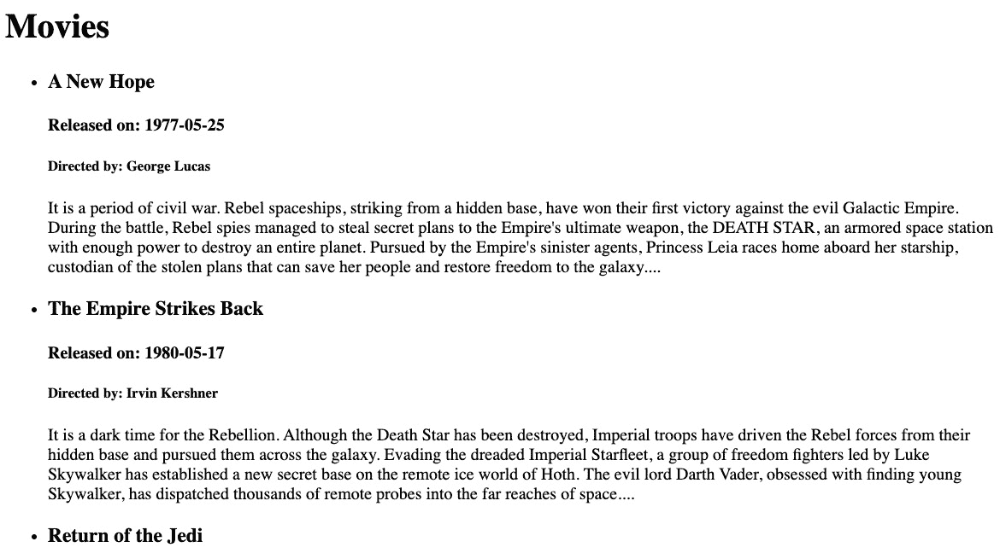

图 5.25 – 获取成功后的电影列表

1.  如果遇到错误，组件将显示错误状态，如下面的示例输出所示：

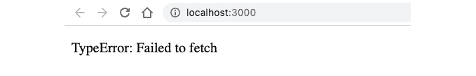

图 5.26 – 获取过程中出现的错误状态

1.  接下来，我们将添加另一个可组合函数，使组件具有搜索功能——`useSearch()`在`./src/composables/useSearch.js`中。

1.  `useSearch()`可组合函数接收一个`items`列表和一个可用于过滤的过滤器列表，默认过滤器为`title`。该可组合函数返回用于存储搜索输入的`searchTerm`以及过滤后的项目数组：

    ```js
    import { ref, computed } from 'vue';
    ```

    ```js
    export const useSearch = (items, filters = ['title']) => {
    ```

    ```js
      const searchTerm = ref('');
    ```

    ```js
      const filteredItems = computed(() => {
    ```

    ```js
        return items.value.filter(item => {
    ```

    ```js
          return filters.some(
    ```

    ```js
            filter => item[filter].toLowerCase().includes(
    ```

    ```js
              searchTerm.value.toLowerCase()
    ```

    ```js
            );
    ```

    ```js
          });
    ```

    ```js
        });
    ```

    ```js
      });
    ```

    ```js
      return {
    ```

    ```js
        searchTerm,
    ```

    ```js
        filteredItems,
    ```

    ```js
      }
    ```

    ```js
    }
    ```

1.  返回到`Movies.vue`。在`script`部分，我们导入`useSearch`并执行它以获取`searchTerm`和过滤后的`filteredMovies`数组，以便在我们的组件中使用：

    ```js
    <script setup>
    ```

    ```js
    import { useMovies } from '../composables/useMovies.js'
    ```

    ```js
    import { useSearch } from '../composables/useSearch.js'
    ```

    ```js
    const { movies, error, isLoading } = useMovies();
    ```

    ```js
    const {
    ```

    ```js
      searchTerm,
    ```

    ```js
      filteredItems: filteredMovies } = useSearch(movies);
    ```

    ```js
    </script>
    ```

1.  在 `template` 部分中，我们添加了一个输入字段，使用 `v-model` 绑定到 `searchTerm`，并用 `filteredMovies` 替换 `v-for` 迭代中的 `movies`：

    ```js
    <div v-else>
    ```

    ```js
      <div>
    ```

    ```js
        <label for="search">Search:</label>
    ```

    ```js
        <input type="text" id="search"
    ```

    ```js
          v-model="searchTerm" />
    ```

    ```js
      </div>
    ```

    ```js
      <ul>
    ```

    ```js
        <li v-for="movie in filteredMovies"
    ```

    ```js
          :key="movie.id">
    ```

    ```js
        <!-- … -->
    ```

    ```js
        </li>
    ```

    ```js
      </ul>
    ```

    ```js
    </div>
    ```

1.  返回浏览器。现在，您可以加载电影列表并按标题搜索电影，如下面的截图所示：

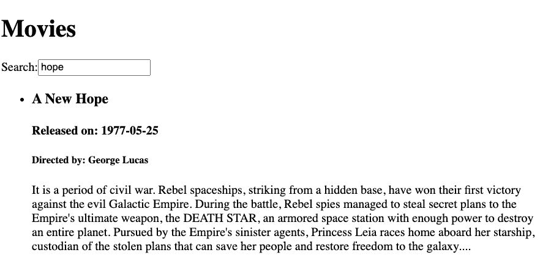

图 5.27 – 包含单词“希望”的电影标题过滤结果

此外，您还可以扩展之前创建的搜索可组合组件，以支持用户从输入选择中获取一个过滤器列表，或者重新格式化接收到的电影字段，使其对您的应用程序更友好。在这个练习中，我们观察了如何在组件中使用 Composition API 创建独立和可重用的逻辑，例如搜索功能。我们还看到可组合组件如何使我们的代码更简洁、更有组织。

## 活动 5.01 – 使用 Composition API 创建 BlogView 组件

要访问此活动的代码文件，请参阅[`github.com/PacktPublishing/Frontend-Development-Projects-with-Vue.js-3/tree/v2-edition/Chapter05/Activity5.01`](https://github.com/PacktPublishing/Frontend-Development-Projects-with-Vue.js-3/tree/v2-edition/Chapter05/Activity5.01)

此活动旨在利用您结合不同 Composition APIs 与组件的 props 和事件以创建一个视图的知识，在该视图中用户可以看到博客列表并添加或删除任何博客项。

此活动将需要使用无头 CMS，Contentful。访问密钥和端点在解决方案中列出。

按照以下步骤完成此活动：

1.  使用 Vite 创建一个新的 Vue 项目。

1.  将 `contentful` 依赖项安装到您的项目中。

1.  创建另一个可组合的组件，`useListAction`，它接收一个 `items` 列表，并返回以下内容：

    +   `addItem`：向给定列表添加新项目

    +   `deleteItem`：根据其 ID 删除项目

1.  创建一个 `useBlogs` 可组合组件，它将从 Contentful 获取 `blogs`，并使用 `useListActions()` 获取获取到的 `blogs` 的操作。

1.  定义 `useBlogs` 以返回 `blogs` 列表、`loading` 状态、`error`（获取状态错误）以及从 `useListActions()` 接收到的 `addItem` 和 `deleteItem` 操作。返回的 `blogs` 应该是一个包含以下字段的博客项数组：`title`、`description`、`heroImage`、`publishDate` 和 `id`（一个短名）。

1.  创建一个 `useSearch` 可组合组件，它接收一个 `items` 列表，并返回以下内容：

    +   `searchTerm`：搜索值。

    +   `filters`：基于用户选择的字段列表进行过滤。默认为 `title`。

    +   `filteredItems`：给定项目的过滤列表。

1.  创建一个`BlogEditor`组件，该组件显示几个用于`title`字段的`input`字段、作者姓名、博客的`id`字段、用于博客内容的`textarea`以及一个用于保存博客的`button`元素。当点击此按钮时，`BlogEditor`会发出一个带有新博客详情作为负载的`addNewItem`事件，并重置字段。

1.  创建一个接收博客列表、`isLoading`标志和`error`对象作为其 props 的`Blogs`组件，并根据`isLoading`和`error`以及每个博客项的详细信息在 UI 中渲染组件的状态。

1.  在`Blogs`组件中，使用`useSearch()`函数处理接收到的`blogs`列表作为 props，并显示一个搜索`input`字段，允许用户根据`title`过滤博客。

1.  将原始列表迭代替换为博客的过滤列表。

1.  我们随后添加包含两个`checkbox`类型`input`字段的`fieldset`，每个字段都与`filters`数组绑定。这两个`input`字段还将分别有对应的`title`和`description`标签。

1.  在博客列表中渲染的每一行博客上添加一个带有**移除**标签的`button`元素。

1.  还定义了一个名为`deleteBlog`的`emit`事件，用于`Blogs`。

1.  在点击带有博客项`id`值作为负载的`deleteBlog`事件。

1.  创建一个渲染`BlogEditor`和`Blogs`的`BlogView`组件。

1.  在`BlogView`中创建一个切换标志`showEditor`，如果为`true`，则显示`BlogEditor`。否则，当点击时，组件将显示`showEditor`值。

1.  `BlogView`将使用`useBlogs()`并将从该 composable 接收到的数据（`blogs`、`isLoading`、`error`和`deleteItem`）作为 props 和事件传递给`Blogs`。您应将`deleteItem`绑定到`Blogs`的`deleteBlog`自定义事件。

1.  `BlogView`也将`useBlogs()`返回的`addItem`方法绑定到`BlogEditor`的`addNewItem`事件。

1.  根据需要为组件添加一些 CSS 样式。

预期结果如下：


图 5.28 – 没有博客显示且用户未点击添加新博客时的输出

当用户点击**添加新博客**时，编辑器将如下显示：

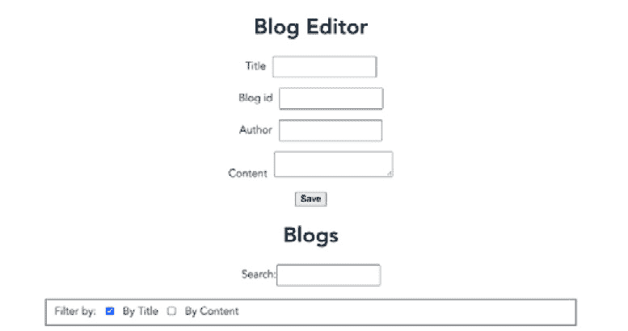

图 5.29 – 博客编辑器操作中

# 摘要

在本章中，我们学习了使用 Composition API 和`setup()`生命周期钩子（或`<script setup>`）作为 Options API 的替代方案来组合组件。我们还学习了如何使用不同的 Composition 函数创建 watchers 和生命周期回调来控制组件的本地状态。

最后，我们学习了如何基于 Composition API 和其他 composables 创建自定义组合函数，使我们的组件在逻辑相似组中更加有组织和易于阅读。

在下一章中，我们将探讨如何使用插件和混入（mixins）来创建全局组件，并组合动态组件。
