# 第十一章：单元测试

在前面的章节中，我们看到了如何构建合理的复杂 Vue.js 应用程序。本章是关于测试它们以维护代码质量和防止缺陷。我们将探讨对 Vue.js 应用程序进行单元测试的方法，以提高我们应用程序的质量和交付速度。

我们还将探讨使用测试来驱动开发，即**测试驱动开发**（**TDD**）。随着我们的进展，我们将了解为什么代码需要测试，以及可以在 Vue.js 应用程序的不同部分采用哪些类型的测试。

本章将涵盖以下主题：

+   理解测试和测试代码的必要性

+   构建你的第一个测试

+   组件测试

+   测试方法

+   测试路由

+   使用 Pinia 测试状态管理

+   快照测试

# 技术要求

对于本章，除了 `git` 命令行界面外，没有其他技术要求，您现在应该已经使用过了。您可以在以下位置找到本章的源代码：[`github.com/PacktPublishing/Frontend-Development-Projects-with-Vue.js-3/tree/v2-edition/Chapter11`](https://github.com/PacktPublishing/Frontend-Development-Projects-with-Vue.js-3/tree/v2-edition/Chapter11)

# 理解测试和测试代码的必要性

**测试**是确保代码按预期执行的关键过程。高质量的生产软件是经验上正确的。这意味着对于开发人员和测试人员发现的列举案例，应用程序的行为符合预期。

这与经过验证的正确的软件形成对比，这是一个非常耗时的工作，通常是学术研究项目的一部分。我们仍然处于这样一个阶段，即正确的软件（经过验证）仍在构建，以展示可以构建哪些类型的系统，同时受到正确性的限制。

测试可以防止引入缺陷，如错误和回归（即当功能停止按预期工作时）。在下一节中，我们将了解各种测试类型。

## 不同类型的测试

测试范围从**端到端测试**（通过操作用户界面）到**集成测试**，最后到**单元测试**。

### 端到端测试

端到端测试测试一切，包括用户界面、底层 HTTP 服务，甚至数据库交互；没有任何东西被模拟。如果您有一个电子商务应用程序，端到端测试实际上可能会使用真实信用卡下订单，或者可能会使用测试信用卡下测试订单。

端到端测试的运行和维护成本很高。它们需要使用通过程序性驱动程序（如 Selenium、WebdriverIO 或 Cypress）控制的完整浏览器。这种类型的测试平台运行成本很高，应用程序代码中的微小变化可能导致端到端测试开始失败。

### 集成测试

集成测试或系统级测试确保一组系统按预期工作。这通常涉及决定测试的系统所在的范围，并允许它运行，通常是对模拟或存根的上游服务和系统进行测试（因此这些服务和系统不在测试范围内）。

由于外部数据访问被存根，可以减少许多问题，如超时和故障（与端到端测试相比）。集成测试套件通常足够快，可以作为持续集成步骤运行，但完整的测试套件通常不会由工程师在本地运行。

### 单元测试

单元测试在开发过程中提供快速反馈方面非常出色。单元测试与 TDD（测试驱动开发）相结合是极限编程实践的一部分。单元测试非常适合测试复杂的逻辑或从预期的输出构建系统。单元测试通常足够快，可以在将代码提交审查和持续集成测试之前运行开发者的代码。

以下图表是对测试金字塔的解释。它可以理解为你应该有大量的低成本、快速的单元测试，合理数量的系统测试，以及仅仅几个端到端 UI 测试：

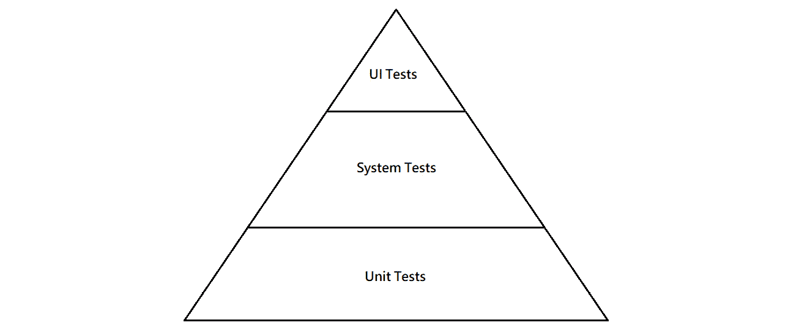

图 11.1 – 测试金字塔图

既然我们已经讨论了为什么我们应该测试应用程序，那么让我们开始编写一些测试。

# 构建你的第一个测试

为了说明在 Vue 3 项目中开始自动化测试有多快、有多简单，我们将首先创建一个简单的测试，使用 Vitest ([`vitest.dev/`](https://vitest.dev/))，这是 Vue 3 的官方推荐测试框架，也是开始时最简单的，因为新应用程序的安装步骤允许你立即选择它。

在下面的图中，你可以看到安装 Vitest 的提示：

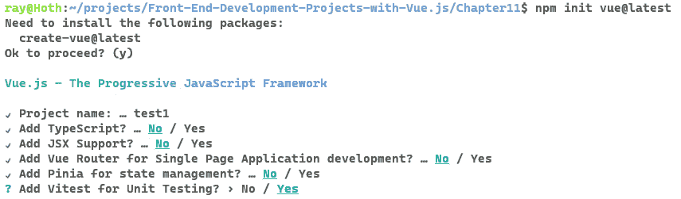

图 11.2 – 创建应用程序并选择是使用 Vitest

应用程序搭建完成后，你将发现它已经在 `components` 目录下创建了一个 `__tests__` 文件夹，并创建了一个测试文件。不过，现在请删除该文件（但不要删除文件夹），并在项目根目录下直接创建一个新的 `__tests__` 文件夹。接下来，创建一个 `App.test.js` 文件。

我们将使用 `shallowMount` 来渲染应用程序并测试它是否显示 `The Vue.js Workshop Blog`。`shallowMount` 进行的是 *浅渲染*，这意味着只有组件的最顶层被渲染；所有子组件都被模拟。

这对于单独测试组件很有用，因为子组件的实现并未运行：

```js
import { describe, it, expect } from 'vitest'
import { shallowMount } from '@vue/test-utils'
import App from '../src/App.vue'
describe('App', () => {
  it('App renders blog title correctly', () => {
    const wrapper = shallowMount(App)
    expect(wrapper.text()).toContain('The Vue.js Workshop
                                      Blog')
  })
})
```

保存此文件，然后在终端（确保你已经运行了 `npm install` 以完成新应用程序的创建），运行 `npm run test:unit`。

当你在安装提示中表明你想要包含 Vitest 时，它将以下脚本添加到 `package.json` 文件中：

```js
    "test:unit": "vitest --environment jsdom"
```

你将获得关于测试运行及其立即失败的报告：

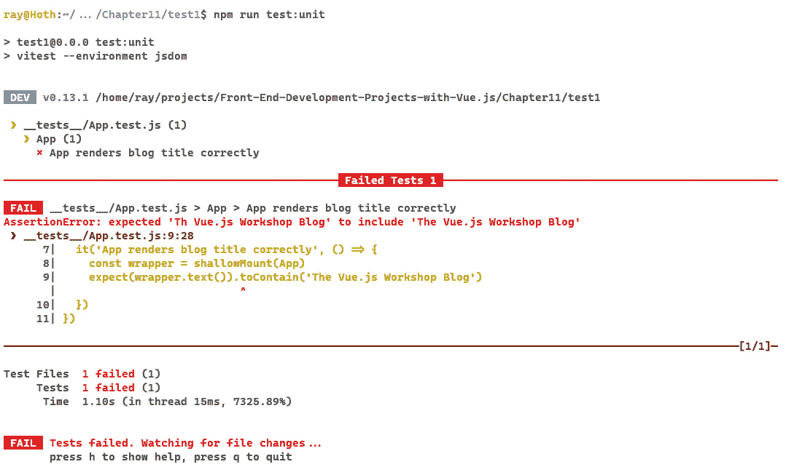

图 11.3 – 单元测试运行失败

要使测试通过，我们可以编辑我们的`App.vue`文件以包含我们想要的标题（注意，我们还删除了默认创建的大部分代码）：

```js
<script setup>
</script>
<template>
  <header>
  <h1>The Vue.js Workshop Blog</h1>
  </header>
</template>
<style>
</style>
```

保存文件后，你会立即看到结果：

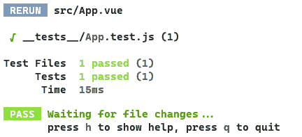

图 11.4 – 测试通过！

你刚刚完成了你的第一个 TDD。这个过程从编写一个失败的测试开始。随后是对测试代码（在这种情况下是`App.vue`组件）的更新，这使得失败的测试通过。

TDD 过程让我们有信心我们的功能已经被正确测试，因为我们可以看到在我们更新驱动我们功能的代码之前，测试是失败的。

在下一节中，我们将展示如何将我们所学应用到 Vue 组件中。

# 测试组件

组件是 Vue.js 应用程序的核心。使用 Vitest 编写单元测试非常简单。拥有测试来锻炼大多数组件可以让你有信心它们按设计运行。理想的组件单元测试运行快速且简单。

我们将继续构建博客应用程序示例。我们现在已经构建了标题，但一个博客通常还需要一个帖子列表来显示。

我们将创建一个`PostList`组件。目前，它将只渲染一个`div`包装器并支持一个`posts`数组属性：

```js
<script setup>
defineProps({
  posts: {
    type: Array,
      default: () => []
  }
})
</script>
<template>
  <div>
  </div>
</template>
```

我们可以在`App`组件中添加一些数据：

```js
<script>
export default {
  data() {
    return {
      posts: [
        {
          title: 'Vue.js for React developers',
            description: 'React has massive popularity here
              are the key benefits of Vue.js over it.',
                tags: ['vue', 'react'],
        },
        {
          title: 'Migrating an AngularJS app to Vue.js',
            description: 'With many breaking changes,
              AngularJS developers have found it easier to
                retrain to Vue.js than Angular 2',
                  tags: ['vue', 'angularjs']
        }
      ]
    }
  }
}
</script>
```

现在我们有一些帖子，我们可以将它们作为绑定属性从`App`组件传递给`PostList`组件：

```js
<script setup>
import PostList from './components/PostList.vue'
</script>
<template>
  <header>
  <h1>The Vue.js Workshop Blog</h1>
  </header>
  <PostList :posts="posts" />
</template>
```

我们的`PostList`组件将渲染每个帖子到一个`PostListItem`组件中，我们将按照以下方式创建它。

`PostListItem`接受两个属性：`title`（它是一个字符串）和`description`（也是一个字符串）。它分别用`h3`标签和`p`标签渲染它们：

```js
<script setup>
defineProps({
  title: {
    type: String
  },
  description: {
    type: String
  }
})
</script>
<template>
  <div>
  <h3>{{ title }}</h3>
  <p>{{ description }}</p>
  </div>
</template>
```

我们现在需要遍历帖子并在`PostList.vue`组件中渲染一个带有相关属性的`PostListItem`组件：

```js
<script setup>
import PostListItem from './PostListItem.vue';
defineProps({
  posts: {
    type: Array,
      default: () => []
  }
})
</script>
<template>
  <div>
    <PostListItem v-for="post in posts"
    :key="post.slug"
    :title="post.title"
    :description="post.description"/>
  </div>
</template>
```

为了测试`PostListItem`组件，我们可以使用一些任意的标题和描述属性进行浅渲染，并检查它们是否被渲染。在`src/__tests__`目录下添加一个名为`PostListItem.test.js`的新文件：

```js
import { describe, it, expect } from 'vitest'
import { shallowMount } from '@vue/test-utils';
import PostListItem from '../components/PostListItem.vue';
describe('PostListItem', () => {
  it('PostListItem renders title and description
  correctly', () => {
    const wrapper = shallowMount(PostListItem, {
      propsData: {
        title: "Blog post title",
        description: "Blog post description"
      }
    })
    expect(wrapper.text()).toMatch("Blog post title")
    expect(wrapper.text()).toMatch("Blog post description")
  })
})
```

这个测试可以通过在命令行中使用`npm run test:unit __tests__/PostListItem.test.js`命令单独运行（如*图 11.5*.5 所示）：


图 11.5 – `PostListItem`测试输出

接下来，我们将看到浅渲染的一个陷阱。在测试`PostList`组件时，我们所能做的就是测试它渲染的`PostListItem`组件的数量。

将此测试保存为`__tests__/PostList.test.js`：

```js
import { describe, it, expect } from 'vitest'
import { shallowMount } from '@vue/test-utils';
import PostList from '../src/components/PostList.vue';
import PostListItem from '../src/components/PostListItem.vue';
describe('PostList', () => {
  it('PostList renders the right number of PostListItem',
  () => {
    const wrapper = shallowMount(PostList, {
      propsData: {
        posts:  [
          {
            title: "Blog post title",
            description: "Blog post description"
          }
        ]
      }
    })
    expect(wrapper.findAllComponents(PostListItem))
      .toHaveLength(1);
  })
})
```

这通过了，但我们测试的是用户不会直接与之交互的内容，即 `PostList` 中渲染的 `PostListItem` 实例的数量，如下面的屏幕截图所示：

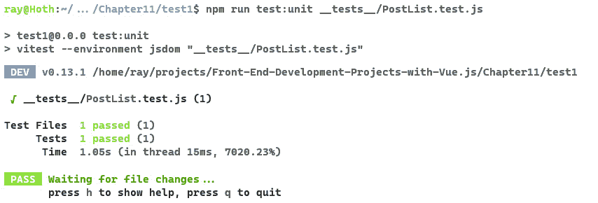

图 11.6 – PostList 测试输出

一个更好的解决方案是使用 `mount` 函数，它渲染完整的组件树，而 `shallowMount` 函数只会渲染正在渲染的组件的子组件。使用 `mount`，我们可以断言标题和描述被渲染到页面上。

这种方法的缺点是我们在测试 `PostList` 组件和 `PostListItem` 组件，因为 `PostList` 组件不会渲染标题或描述；它渲染一组 `PostListItem` 组件，这些组件反过来渲染相关的标题和描述。

代码如下：

```js
import { describe, it, expect } from 'vitest'
import { shallowMount, mount } from '@vue/test-utils';
import PostList from '../src/components/PostList.vue';
import PostListItem from '../src/components/PostListItem.vue';
describe('PostList', () => {
  // Previous test…
  it('PostList renders passed title and description for
  each passed post', () => {
    const wrapper = mount(PostList, {
      propsData: {
        posts:  [
          {
            title: "Title 1",
            description: "Description 1"
          },
          {
            title: "Title 2",
            description: "Description 2"
          }
        ]
      }
    })
    const outputText = wrapper.text()
    expect(outputText).toContain('Title 1')
    expect(outputText).toContain('Description 1')
    expect(outputText).toContain('Title 2')
    expect(outputText).toContain('Description 2')
  })
})
```

如以下 `npm run test:unit` `__tests__/PostList.test.js` 命令的输出所示，新的测试通过：

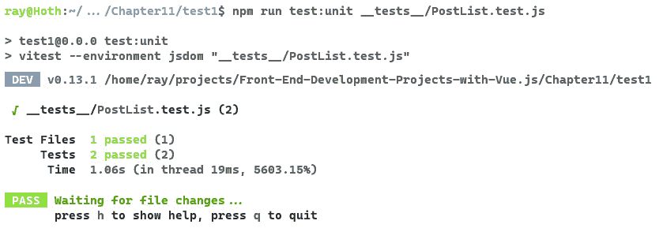

图 11.7 – 对 PostList 进行浅渲染和挂载测试的测试运行

我们已经看到了如何使用 Vitest 和 `vue-test-utils` 为 Vue.js 编写单元测试。这些测试可以经常运行，并且测试运行在几秒内完成，这在我们处理新或现有组件时提供了几乎即时的反馈。

## 练习 11.01：构建和单元测试标签列表组件

在创建 `posts` 的 fixture 时，我们用 `vue`、`angularjs` 和 `react` 填充了标签字段，但没有显示它们。

此练习的完整代码可以在[`github.com/PacktPublishing/Frontend-Development-Projects-with-Vue.js-3/tree/v2-edition/Chapter11/Exercise11.01`](https://github.com/PacktPublishing/Frontend-Development-Projects-with-Vue.js-3/tree/v2-edition/Chapter11/Exercise11.01)找到

要使标签有用，我们将在帖子列表中显示标签：

1.  我们可以开始编写一个单元测试，该测试将解释当将一组标签作为属性传递给 `PostListItem` 组件时，我们期望该组件执行的操作。它期望每个标签都将带有前缀的哈希符号渲染出来。

例如，`react` 标签将显示为 `#react`。在 `__tests__/PostListItem.test.js` 文件中，我们可以添加一个新的测试：

```js
// rest of test and imports
it('PostListItem renders tags with a # prepended to them', () => {
  const wrapper = shallowMount(PostListItem, {
    propsData: {
      tags: ['react', 'vue']
    }
  })
  expect(wrapper.text()).toMatch('#react')
  expect(wrapper.text()).toMatch('#vue')
})
```

当使用 `npm run test:unit __tests__/PostListItem.test.js` 命令运行时，此测试失败，如图 *图 11*.8 所示：

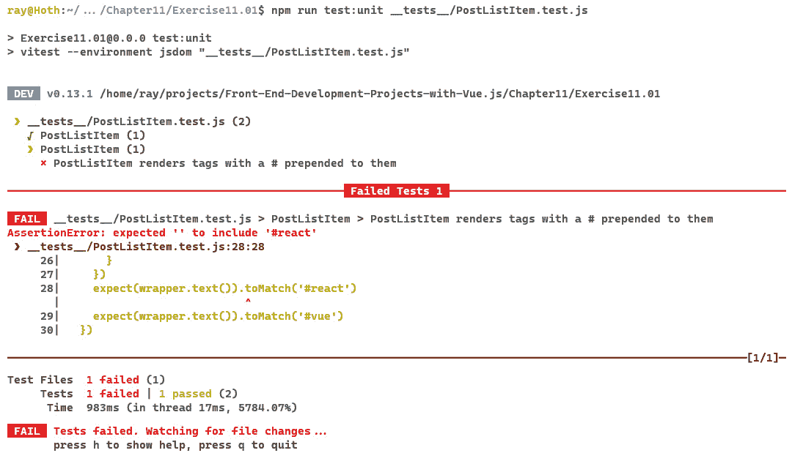

图 11.8 – PostListItem 标签测试失败

1.  接下来，我们应该在 `src/components/PostListItem.vue` 中实现标签列表渲染。我们将添加标签作为 `Array` 类型的属性，并使用 `v-for` 来渲染标签：

    ```js
    <script setup>
    ```

    ```js
    defineProps({
    ```

    ```js
      title: {
    ```

    ```js
        type: String
    ```

    ```js
      },
    ```

    ```js
      description: {
    ```

    ```js
        type: String
    ```

    ```js
      },
    ```

    ```js
      tags: {
    ```

    ```js
        type: Array,
    ```

    ```js
        default: () => []
    ```

    ```js
      }
    ```

    ```js
    })
    ```

    ```js
    </script>
    ```

    ```js
    <template>
    ```

    ```js
      <div>
    ```

    ```js
      <h3>{{ title }}</h3>
    ```

    ```js
      <p>{{ description }}</p>
    ```

    ```js
      <ul>
    ```

    ```js
        <li
    ```

    ```js
        v-for="tag in tags"
    ```

    ```js
        :key="tag">
    ```

    ```js
        #{{ tag }}
    ```

    ```js
        </li>
    ```

    ```js
      </ul>
    ```

    ```js
      </div>
    ```

    ```js
    </template>
    ```

在实现了 `PostListItem` 组件后，单元测试现在应该通过：


图 11.9 – PostListItem 单元测试通过

然而，标签在应用程序中不会显示：

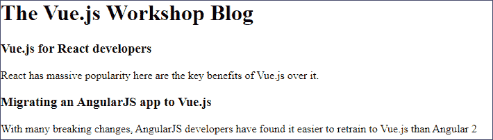

图 11.10 – 尽管实现了正确的 PostListItem 实现，但 PostList 仍然没有显示标签

1.  我们可以编写一个针对 `PostList` 的单元测试，以展示这种行为。本质上，我们将向我们的 `posts` 列表传递一些标签，并运行 `PostListItem.test.js` 文件中已经存在的相同断言。

我们将在 `__tests__/PostList.test.js` 中这样做：

```js
it('PostList renders tags for each post', () => {
  const wrapper = mount(PostList, {
    propsData: {
      posts:  [
              {
                tags: ['react', 'vue']
              },
              {
                tags: ['html', 'angularjs']
              }
              ]
    }
  })
  const outputText = wrapper.text()
  expect(outputText).toContain('#react')
  expect(outputText).toContain('#vue')
  expect(outputText).toContain('#html')
  expect(outputText).toContain('#angularjs')
})
```

根据我们的应用程序输出显示在 *图 11*.11 中，当使用 `npm run test:unit` 命令运行 `__tests__/PostList.test.js` 时，测试失败：

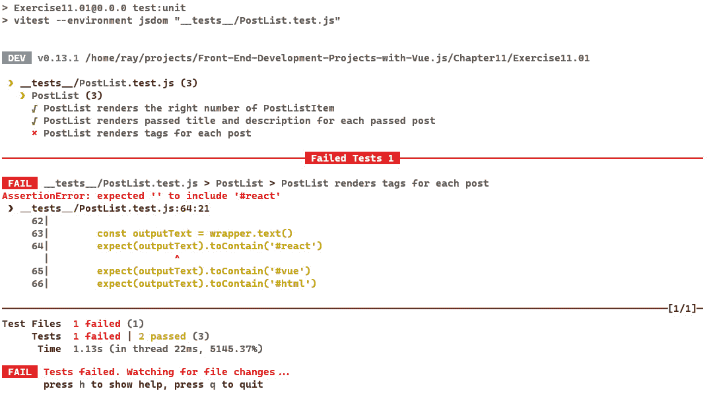

图 11.11 – PostList 标签测试失败

1.  为了修复这个测试，我们可以在 `src/components/PostList.vue` 中找到问题，其中 `PostListItem` 的标签属性未绑定。通过将 `src/components/PostList.vue` 更新为绑定 `tags` 属性，我们可以修复单元测试：

    ```js
    <!-- rest of template -->
    ```

    ```js
    <PostListItem v-for="post in posts"
    ```

    ```js
      :key="post.slug"
    ```

    ```js
      :title="post.title"
    ```

    ```js
      :description="post.description"
    ```

    ```js
      :tags="post.tags"
    ```

    ```js
    />
    ```

失败的单元测试现在通过了，如下面的截图所示。

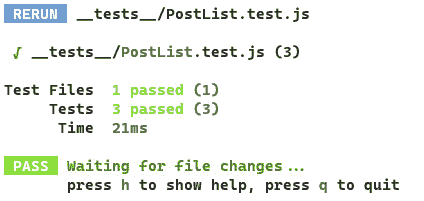

图 11.12 – PostList 标签测试通过

我们已经看到了如何使用浅渲染和组件挂载来测试渲染组件的输出。让我们简要了解这些术语的含义：

+   `1`，这意味着如果子项是组件，它们将仅作为组件标签渲染；它们的模板将不会运行

+   **挂载**：以与在浏览器中渲染相似的方式渲染完整的组件树

接下来，我们将探讨如何测试组件方法。

# 测试组件方法

在 Vue 的上一个版本中，建议对过滤器进行测试，对混入进行测试，但通常避免编写方法的测试，因为它们不是由用户直接调用的。

在 Vue 3 中，过滤器已经弃用，并被 *常规* 方法计算属性所取代。话虽如此，找到适合测试的方法可能需要一些思考。

考虑一个截断其输入为八个字符的 `computed` 属性：

```js
// rest of file…
import { computed } from 'vue';
const props = defineProps({
  title: {
    type: String
  },
  description: {
    type: String
  },
  tags: {
    type: Array,
    default: () => []
  }
})
const truncated = computed(() => {
  return props.description && props.description.slice(0,8)
})
defineExpose({ truncated })
```

在前面的代码示例中，`truncated` 被定义为基于传递给属性的 `description` 值的 `computed` 属性。最后，`defineExpose` 被用来使属性可用于测试。在 `script setup` 中指定的项被认为是 *封闭的*，并且不在组件本身之外可用。通过使用 `defineExpose`，我们就可以编写针对 `truncated` 的测试。

我们可以通过两种方式测试 `computed` 属性的逻辑。首先，较长的字符串应该被截断。其次，较短的字符串应按原样返回。

这里是添加到 `PostListItem.test.js` 的附加测试：

```js
it('truncated properly returns only the first 8 characters', () => {
  const wrapper = shallowMount(PostListItem, {
    propsData: {
      title: "Blog post title",
      description: "Blog post description"
    }
  })
  expect(wrapper.vm.truncated).toMatch('Blog pos')
})
it('truncated properly doesnt change shorter values', () => {
  const wrapper = shallowMount(PostListItem, {
    propsData: {
      title: "Blog post title",
      description: "Test"
    }
  })
  expect(wrapper.vm.truncated).toMatch('Test')
})
```

第一个新测试传入一个长的描述值，并确认截断后的版本更短。注意使用`vm`来访问组件的 Vue 实例，然后是`truncated`计算属性。下一个测试确认如果使用较短的值，截断不会缩短它。

记住，用户实际上不会直接调用`truncated`。作为直接测试计算属性的替代，我们可以确认任何模板使用都正常工作。在这种情况下，使用`wrapper.text()`来返回渲染结果是有意义的。

## 练习 11.02：构建和测试省略号方法

我们已经看到了如何测试任意的`truncated`计算方法；我们现在将实现一个`ellipsis`计算方法并对其进行测试。

本练习的完整代码可以在[`github.com/PacktPublishing/Frontend-Development-Projects-with-Vue.js-3/tree/v2-edition/Chapter11/Exercise11.02`](https://github.com/PacktPublishing/Frontend-Development-Projects-with-Vue.js-3/tree/v2-edition/Chapter11/Exercise11.02)找到。

1.  我们可以从编写一组测试用例开始，用于`ellipsis`计算方法（它将位于`src/components/PostListItem.vue`中）。一个测试应该检查如果传入的值少于 50 个字符，过滤器不会做任何事情；另一个测试应该检查传入的值是否超过 50 个字符，如果是，则截断值为 50 并附加`…`。

我们将在一个`__tests__/ellipsis.test.js`文件中完成这项工作：

```js
// rest of script
describe('ellipsis', () => {
  it('ellipsis should do nothing if value is less
  than 50 characters', () => {
     const wrapper = shallowMount(PostListItem, {
       propsData: {
         title: "Blog post title",
         description: "Test"
       }
     })
     expect(wrapper.vm.truncated).toMatch('Test')
  })
  it('ellipsis should truncate to 50 and append "..."
  when longer than 50 characters', () => {
     const wrapper = shallowMount(PostListItem, {
       propsData: {
         title: "Blog post title",
         description: "Should be more than
         the 50 allowed characters by a small amount"
       }
     })
     expect(wrapper.vm.truncated).toMatch('Should be
       more than the 50 allowed characters by a...')
  })
})
```

1.  我们现在可以在`src/components/PostListItem.vue`中实现`ellipsis`的逻辑。我们将添加一个带有`ellipsis`的`computed`对象，如果传入的值超过 50 个字符，它将使用`String#slice`，否则不做任何事情：

    ```js
    <script setup>
    ```

    ```js
    // rest of script
    ```

    ```js
    const ellipsis = computed(() => {
    ```

    ```js
      return props.description && props.description.length
    ```

    ```js
        > 50 ? `${props.description.slice(0,50)}...` :
    ```

    ```js
          props.description;
    ```

    ```js
    })
    ```

    ```js
    defineExpose({ truncated, ellipsis })
    ```

    ```js
    </script>
    ```

    ```js
    <template>
    ```

    ```js
      <div>
    ```

    ```js
      <h3>{{ title }}</h3>
    ```

    ```js
      <p>{{ ellipsis }}</p>
    ```

    ```js
      <ul>
    ```

    ```js
        <li v-for="tag in tags" :key="tag">
    ```

    ```js
        #{{ tag }}
    ```

    ```js
        </li>
    ```

    ```js
      </ul>
    ```

    ```js
      </div>
    ```

    ```js
    </template>
    ```

如您所见，`ellipsis`计算方法作用于`description`属性，并处理超过 50 个字符的值。测试现在如*图 11**.13*所示通过：

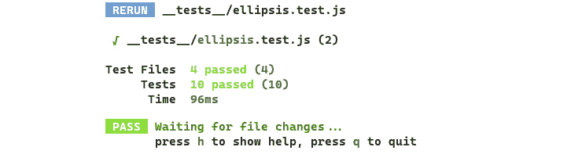

图 11.13 – 省略号测试现在通过

我们已经看到了如何测试 Vue.js 组件的方法和计算属性。

接下来，我们将看到如何处理使用 Vue.js 路由的应用程序。

# 测试 Vue 路由

我们目前有一个渲染我们的博客主页或视图的应用程序。

接下来，我们应该有帖子页面。为此，我们将使用 Vue Router，如前几章所述，并确保我们的路由通过单元测试按设计工作。

Vue Router 是通过`npm`安装的，具体来说，`npm install vue-router@4`，然后在`main.js`文件中进行连接：

```js
import { createApp } from 'vue'
import App from './App.vue'
import router from './router';
createApp(App).use(router).mount('#app')
```

接下来，我们可以在`src/router/index.js`中创建一个文件来定义我们的路由。这将实例化路由并定义我们的初始路径。我们将从一个根路径（`/`）开始，以显示`PostList`组件：

```js
import { createRouter, createWebHistory } from
'vue-router';
import PostList from '@/components/PostList.vue';
const routes = [
  {
    path: '/',
    component: PostList
  }
];
const router = createRouter({
  history: createWebHistory(),
  routes
});
export default router;
```

现在我们已经有了初始路由，我们应该更新 `App.vue` 文件以利用由路由器渲染的组件。我们将渲染 `render-view` 而不是直接使用 `PostList`。然而，`posts` 绑定保持不变：

```js
<!—rest of file… -->
<template>
  <header>
  <h1>The Vue.js Workshop Blog</h1>
  </header>
  <router-view :posts="posts"></router-view>
</template>—-- rest of file... -->
```

现在，`App.vue` 文件中的帖子缺少一些核心数据来渲染 `SinglePost` 组件。我们需要确保有 `slug` 和 `content` 属性，以便在我们的 `SinglePost` 页面上渲染有用的内容：

```js
<script>
export default {
  data() {
    return {
      posts: [
        {
          slug: 'vue-react',
          title: 'Vue.js for React developers',
          description: 'React has massive popularity here
                        are the key benefits of Vue.js over
                        it.',
          content: 'This is the content of the Vue.js for
                    React developers post.',
          tags' ['vue', 'react'],
        },
        {
          slug: 'vue-angularjs',
          title: 'Migrating an AngularJS app to Vue'js',
          description: 'With many breaking changes,
                        AngularJS developers have found it
                        easier to retrain to Vue.js than
                        Angular 2',
          content: 'This is the content of the Vue.js for
                    AngularJS developers post.',
          tags' ['vue', 'angularjs']
        }
      ]
    }
  }
}
</script>
```

现在，我们可以开始工作在 `SinglePost` 组件上。目前，我们只是在模板中添加一些占位符。此外，`SinglePost` 将接收帖子作为 prop，因此我们也可以填写它：

```js
<script setup>
defineProps({
  posts: {
    type: Array,
      default: () => []
  }
})
</script>
<template>
  <div>
  <h2>Post: RENDER ME</h2>
  <p>Placeholder for post.content.</p>
  </div>
</template>
```

接下来，我们在 `router/index.js` 中注册 `SinglePost`，使用 `/:postId` 路径（该路径将在组件的 `this.$route.params.postId` 下可用）：

```js
import { createRouter, createWebHistory } from
'vue-router';
import PostList from '@/components/PostList.vue';
import SinglePost from '@/components/SinglePost.vue';
const routes = [
  {
    path: '/',
    component: PostList
  },
  {
    path: '/:postId',
    component: SinglePost
  }
];
const router = createRouter({
  history: createWebHistory(),
  routes
});
export default router;
```

如果我们切换回实现 `SinglePost` 组件，我们将访问 `postId`，它将映射到 `posts` 数组中的 slug，并且我们也访问到 `posts`，因为它被 `App` 绑定到 `render-view`。

现在，我们可以创建一个计算属性 `post`，它根据 `postId` 查找帖子：

```js
// other imports
import { useRoute } from 'vue-router';
// props code
const route = useRoute();
const post = computed(() => {
  const { postId } = route.params;
  return props.posts.find(p => p.slug === postId);
})
```

从这个计算 `post` 属性中，如果我们有 `post`（我们必须注意不存在的帖子），我们可以提取 `title` 和 `content`。因此，仍然在 `SinglePost` 中，我们可以添加以下计算属性：

```js
const title = computed(() => {
  return post && post.value.title;
})
const content = computed(() => {
  return post && post.value.content;
})
```

然后，我们可以用计算属性的值替换模板中的占位符。因此，我们的模板最终如下所示：

```js
<template>
  <div>
  <h2>Post: {{ title }}</h2>
  <p>{{ content }}</p>
  </div>
</template>
```

现在让我们更新应用程序，以便我们可以链接到单个帖子。在 `PostList.vue` 中，将 slug 作为新的属性传递：

```js
<!-- rest of template -->
<PostListItem v-for="post in posts"
:key="post.slug"
:title="post.title"
:description="post.description"
:tags="post.tags"
:slug="post.slug"
/>
<!-- rest of template -->
```

接下来，在 `PostListItem` 中，我们首先添加一个新的 `slug` 属性：

```js
// rest of the props...
slug: {
  type: String
}
```

然后我们编辑模板以与 `slug` 属性链接：

```js
<template>
  <div>
  <router-link :to="`/${slug}`">
  <h3>{{ title }}</h3>
  </router-link>
  <p>{{ ellipsis }}</p>
  <ul>
    <li v-for="tag in tags" :key="tag">
    #{{ tag }}
    </li>
  </ul>
  </div>
</template>
```

`router-link` 是 Vue Router 特定的链接，这意味着在 `PostList` 页面上，点击帖子列表项时，我们将被带到正确的帖子 URL，如下面的截图所示：

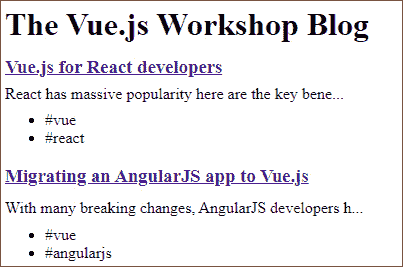

图 11.14 – 浏览器中显示的帖子列表视图

点击标题后，显示正确的帖子：

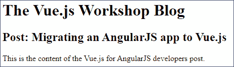

图 11.15 – 在浏览器中显示的单个帖子视图

要测试 `vue-router`，我们需要构建我们的测试来处理路由的异步特性。我们将从测试点击一个帖子是否正确加载单个帖子的信息开始。我们可以通过查找初始页面上的所有博客帖子，并在点击路由时只查找一个特定的帖子来实现这一点：

```js
import { describe, it, expect } from 'vitest';
import { mount, flushPromises } from '@vue/test-utils'
import App from '../src/App.vue';
import router from "@/router";
describe('SinglePost', () => {
  it('Router renders single post page when clicking a post
  title', async () => {
    router.push('/');
    await router.isReady();
    const wrapper = mount(App, {
      global: {
        plugins: [router]
      }
  })
    expect(wrapper.text()).toMatch("Vue.js for React
                                    developers");
    expect(wrapper.text()).toMatch("Migrating an AngularJS
                                    app to Vue.js");
    await wrapper.find('a').trigger('click');
    await flushPromises();
    expect(wrapper.text()).toMatch("Vue.js for React
                                    developers");
    expect(wrapper.text()).not.toMatch("Migrating an
                                        AngularJS app to
                                        Vue.js2");
  })
})
```

在顶部，我们导入 `mount` 和一个新工具 `flushPromises`，我们将在稍后使用。我们还导入了我们的路由。在测试中，我们首先导航到根路径，如前所述，由于路由的异步特性，我们等待它完成。

然后，我们检查两个博客帖子。之后，我们在第一个帖子上触发一个点击事件，等待它完成`flushPromises`，然后检查是否只渲染了我们的第一个帖子。

我们应该检查直接导航到有效的帖子 URL 将产生正确的结果。为了做到这一点，我们将使用`router.replace('/')`清除任何设置的状态，然后使用带有帖子短语的`router.push()`。然后我们将使用类似的断言来确保我们只渲染一个帖子：

```js
  It('Router renders single post page when a slug is set',
  async () => {
    await router.replace('/');
    await router.push('/vue-react');
    const wrapper = mount(App, {
      global: {
        plugins: [router]
      }
  })
    expect(wrapper.text()).toMatch("Vue.js for React
                                    developers");
    expect(wrapper.text()).not.toMatch("Migrating an
                                        AngularJS app to
                                        Vue.js");
  })
```

当使用`npm run test:unit __tests__/SinglePost.test.js`命令运行这两个测试时，它们按预期工作。以下截图显示了所需的输出：

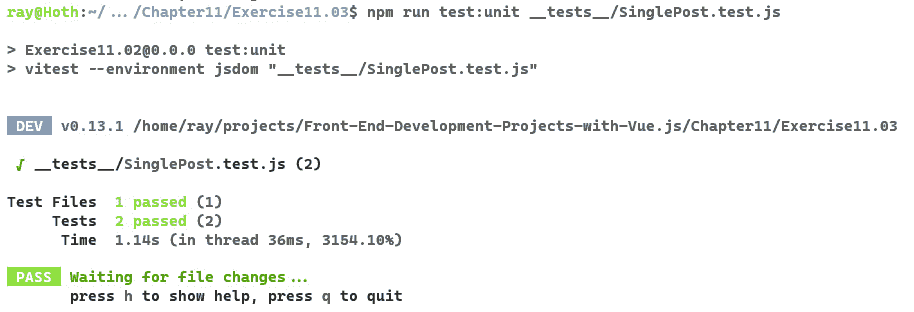

图 11.16 – 单个帖子路由测试通过

现在你已经看到了如何测试你的路由，让我们用一个例子来练习一下。

## 练习 11.03：构建标签页面并测试其路由

就像我们构建单个帖子页面一样，我们现在将构建一个标签页面，它类似于`PostList`组件，除了只显示具有特定标签的帖子，每个帖子都是一个链接到相关单个帖子视图。

你可以在[`github.com/PacktPublishing/Frontend-Development-Projects-with-Vue.js-3/tree/v2-edition/Chapter11/Exercise11.03`](https://github.com/PacktPublishing/Frontend-Development-Projects-with-Vue.js-3/tree/v2-edition/Chapter11/Exercise11.03)找到完整的代码。

1.  我们可以从在`src/components/TagPage.vue`中创建一个新的`TagPage`组件开始。我们知道它将接收`posts`作为属性，并且我们想要渲染一个`PostList`组件：

    ```js
    <script setup>
    ```

    ```js
    import PostList from './PostList.vue';
    ```

    ```js
    defineProps({
    ```

    ```js
      posts: {
    ```

    ```js
        type: Array,
    ```

    ```js
          default: () => []
    ```

    ```js
      }
    ```

    ```js
    })
    ```

    ```js
    </script>
    ```

    ```js
    <template>
    ```

    ```js
      <h3>#INSERT_TAG_NAME</h3>
    ```

    ```js
    </template>
    ```

1.  接下来，我们想在`src/router.js`中将`TagPage`组件连接到路由器。我们将导入它并将其作为`routes`的一部分添加，路径为`/tags/:tagName`：

    ```js
    // other imports
    ```

    ```js
    import TagPage from '@/components/TagPage.vue';
    ```

    ```js
    const routes = [
    ```

    ```js
      // other routes
    ```

    ```js
      {
    ```

    ```js
        path:'/tags/:tagName',
    ```

    ```js
        component: TagPage
    ```

    ```js
      }
    ```

    ```js
    ];
    ```

    ```js
    // router instantiation and export
    ```

1.  在`TagPage.vue`中，我们现在可以使用`tagName`参数并创建一个`tagName`计算属性以及一个基于标签的`tagPosts`计算属性。

    ```js
    import { computed } from 'vue';
    ```

    ```js
    import { useRoute } from 'vue-router';
    ```

    ```js
    const props = defineProps({
    ```

    ```js
      posts: {
    ```

    ```js
        type: Array,
    ```

    ```js
          default: () => []
    ```

    ```js
      }
    ```

    ```js
    })
    ```

    ```js
    const route = useRoute();
    ```

    ```js
    const tagName = computed(() => {
    ```

    ```js
      return route.params.tagName;
    ```

    ```js
    })
    ```

    ```js
    const tagPosts = computed(() => {
    ```

    ```js
      return props.posts.filter(p =>
    ```

    ```js
        p.tags.includes(route.params.tagName));
    ```

    ```js
    })
    ```

1.  现在我们有了对`tagPosts`和`tagName`的访问权限，我们可以替换模板中的占位符。我们将渲染`#{{ tagName }}`并将`tagPosts`绑定到`PostList`的`posts`属性：

    ```js
    <template>
    ```

    ```js
      <h3># {{ tagName }}</h3>
    ```

    ```js
      <PostLists :posts="tagPosts" />
    ```

    ```js
    </template>
    ```

现在，如果我们导航到例如`/tags/angularjs`，页面将显示如下内容：

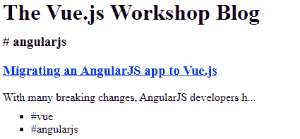

图 11.17 – angularjs 的标签页面

1.  下一步是将`PostListItem`中的标签锚点（`a`）转换为指向`/tags/${tagName}`的`router-link`（在`src/components/PostListItem.vue`中）：

    ```js
      <router-link :to="`/tags/${tag}`"
    ```

    ```js
      v-for="tag in tags" :key="tags">
    ```

    ```js
      #{{ tag }}
    ```

    ```js
      </router-link>
    ```

1.  现在是时候编写一些测试了。我们首先检查在主页上点击`angularjs`标签页面的情况。我们将在`__tests__/TagPage.test.js`中这样编写：

    ```js
    // rest of test...
    ```

    ```js
    describe('TagPage', () => {
    ```

    ```js
      it('Router renders tag page when clicking a tag in
    ```

    ```js
      the post list item', async () => {
    ```

    ```js
        router.push('/');
    ```

    ```js
        await router.isReady();
    ```

    ```js
        const wrapper = mount(App, {
    ```

    ```js
          global: {
    ```

    ```js
          plugins: [router]
    ```

    ```js
          }
    ```

    ```js
        })
    ```

    ```js
        expect(wrapper.text()).toMatch("Vue.js for React
    ```

    ```js
                                        developers");
    ```

    ```js
        expect(wrapper.text()).toMatch("Migrating an
    ```

    ```js
                                        AngularJS app to
    ```

    ```js
                                        Vue.js");
    ```

    ```js
        await wrapper.find('a[href="/tags/angularjs"]')
    ```

    ```js
          .trigger('click');
    ```

    ```js
        await flushPromises();
    ```

    ```js
        expect(wrapper.text()).toMatch("Migrating an
    ```

    ```js
                                        AngularJS app to
    ```

    ```js
                                        Vue.js");
    ```

    ```js
        expect(wrapper.text()).not.toMatch("Vue.js for
    ```

    ```js
                                            React
    ```

    ```js
                                            developers");
    ```

    ```js
      })
    ```

    ```js
    })
    ```

1.  我们还应该测试直接访问标签 URL 是否按预期工作；也就是说，我们看不到不相关的内容：

    ```js
    // rest of test...
    ```

    ```js
      it('Router renders tag page when a URL is set',
    ```

    ```js
      async () => {
    ```

    ```js
        await router.replace('/');
    ```

    ```js
        await router.push('/tags/angularjs');
    ```

    ```js
        const wrapper = mount(App, {
    ```

    ```js
          global: {
    ```

    ```js
          plugins: [router]
    ```

    ```js
          }
    ```

    ```js
        })
    ```

    ```js
        expect(wrapper.text()).toMatch("Migrating an
    ```

    ```js
                                        AngularJS app to
    ```

    ```js
                                        Vue.js");
    ```

    ```js
        expect(wrapper.text()).not.toMatch("Vue.js for
    ```

    ```js
                                            React
    ```

    ```js
                                            developers");
    ```

    ```js
      })
    ```

测试通过，因为应用程序按预期工作。因此，输出将如下所示：

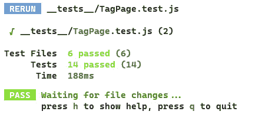

图 11.18 – TagPage 路由测试在命令行上通过

然而，在继续之前，让我们运行所有的单元测试。你会注意到，虽然我们的测试通过了，但现在有各种警告：

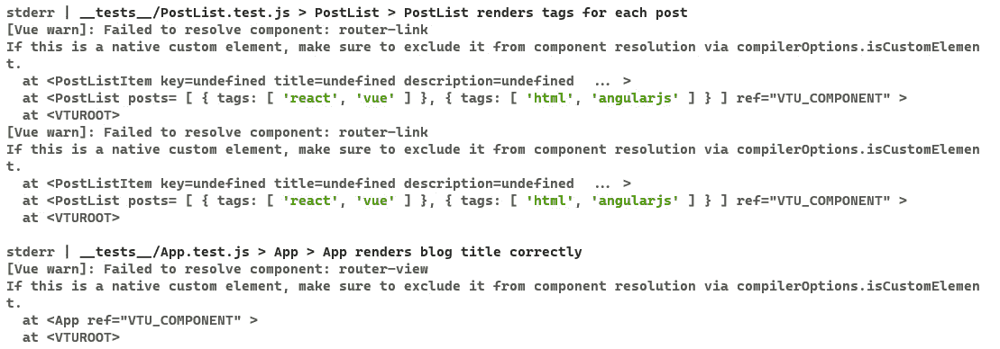

图 11.19 – 关于 router-link 和 router-view 的警告

由于这些警告不会使我们的测试失败，我们应该移除它们。我们有一些处理这个问题的方法。

一种方法是通过简单地模拟，或*伪造*，我们不需要的组件。在这种情况下，我们希望我们的测试忽略我们当时没有测试的路由组件。我们可以通过使用 `mount` 和 `shallowMount` 都支持的一个选项 `stubs` 来解决这个问题。通过使用 `stubs` 选项，我们告诉 Vue 的测试工具*模拟*或创建一组标签的空组件。

我们在新的全局参数中添加此选项，以供 `mount` 或 `shallowMount` 使用。以下是在 `ellipsis.test.js` 中的示例：

```js
const wrapper = shallowMount(PostListItem, {
  propsData: {
    title: "Blog post title",
    description: "Test"
  },
  global: {
    stubs:['router-link'],
  }
})
```

一旦在 `ellipsis.test.js` 中的两个测试中添加，这些警告就会消失。接下来，我们将修复 `App.test.js`：

```js
describe('App', () => {
  it('App renders blog title correctly', () => {
    const wrapper = shallowMount(App, {
      global: {
        stubs:['router-link','router-view'],
      }
    })
    expect(wrapper.text()).toContain('The Vue.js Workshop
                                      Blog')
  })
})
```

注意我们还模拟了 `router-view`。接下来，我们将修复 `PostList.test.js` 和 `PostListItem.test.js`。这两个测试实际上使用了 `router-link`，因此我们无法模拟它们，但我们可以将它们作为插件提供给 `mount` 和 `shallowMount`。在 `PostList.test.js` 中，我们首先导入我们的路由器：

```js
import router from '@/router';
```

然后在三个测试中的每一个中，将路由器作为 `global` 对象中的一个插件传递，例如：

```js
const wrapper = mount(PostList, {
  propsData: {
    posts:  [
    {
      tags: ['react', 'vue']
    },
    {
      tags: ['html', 'angularjs']
    }
    ]
  },
  global: {
    plugins: [ router ]
  }
})
```

接下来，我们可以更新 `PostListItem.test.js`，但在这里我们需要进行另一个更改。之前这个测试使用了 `shallowMount`，但我们需要切换到 `mount` 以确保 `router-link` 正确渲染其输出。以下是包含插件更改和切换到 `mount` 的整个测试：

```js
// rest of test...
describe('PostListItem', () => {
  it('PostListItem renders title and description
  correctly', () => {
    const wrapper = mount(PostListItem, {
      propsData: {
        title: "Blog post title",
        description: "Blog post description"
      },
      global: {
        plugins: [ router ]
      }
    })
    expect(wrapper.text()).toMatch("Blog post title")
    expect(wrapper.text()).toMatch("Blog post description")
  })
  it('PostListItem renders tags with a # prepended to
  them', () => {
    const wrapper = mount(PostListItem, {
      propsData: {
        tags: ['react', 'vue']
      },
      global: {
        plugins: [ router ]
      }
    })
    expect(wrapper.text()).toMatch('#react')
    expect(wrapper.text()).toMatch('#vue')
  })
})
```

到目前为止，我们的警告已经解决。我们已经看到了如何实现和测试一个包含 `vue-router` 的应用程序。在下一节中，我们将详细了解如何测试 Pinia。

# 使用 Pinia 测试状态管理

为了展示如何测试一个依赖于 Pinia（Vue 的官方全局状态管理解决方案）的组件，我们将实现并测试一个通讯订阅横幅。

首先，我们应该创建横幅模板。横幅将包含一个**订阅通讯**的调用操作和一个关闭按钮。

```js
<script setup>
</script>
<template>
  <div>
  <strong>Subscribe to the newsletter</strong>
  <button>Close</button>
  </div>
</template>
<style scoped>
div {
  background-color: #c0c0c0;
  size: 100%;
  padding: 10px;
}
div button {
  float: right;
}
</style>
```

我们可以在 `App.vue` 文件中如下显示 `NewsletterBanner` 组件：

```js
<script setup>
import NewsletterBanner from './components/NewsletterBanner.vue';
</script>
<template>
  <NewsletterBanner />
  <header>
  <h1>The Vue.js Workshop Blog</h1>
  </header>
  <router-view :posts="posts"></router-view>
</template>
<!-- rest of template -->
```

然后，我们将使用 `npm install –save pinia` 命令安装 Pinia。一旦 Pinia 安装完成，我们可以在 `store.js` 文件中初始化我们的商店，如下所示：

```js
import { defineStore } from 'pinia'
export const userPreferencesStore = defineStore({
  id: 'userPreferences',
  state: () => ({
  }),
  getters: {
  },
  actions: {
  }
})
```

我们的 Pinia 商店也已在 `main.js` 文件中注册：

```js
import { createApp } from 'vue'
import { createPinia } from 'pinia'
import App from './App.vue'
import router from './router';
const app = createApp(App);
app.use(router);
app.use(createPinia());
app.mount('#app');
```

为了决定通讯横幅是否应该显示，我们需要在我们的商店中添加一个初始状态：

```js
  state: () => ({
    dismissedSubscriberBanner: false
  }),
```

要关闭横幅，我们需要一个将 `dismissedSubscribeBanner` 设置为 `true` 的动作：

```js
  actions: {
    dismissSubscriberBanner() {
      this.dismissedSubscriberBanner = true;
    }
  }
```

现在，我们可以使用商店状态和 `dismissSubscribeBanner` 动作来决定是否显示横幅（使用 `v-if`）以及是否关闭它（绑定到关闭按钮的点击）：

```js
<script setup>
import { computed } from 'vue';
import { userPreferencesStore } from '@/store.js';
const store = userPreferencesStore();
const showBanner = computed(() => {
  return !store.dismissedSubscriberBanner;
})
</script>
<template>
  <div v-if="showBanner">
  <strong>Subscribe to the newsletter</strong>
  <button @click="store.dismissSubscriberBanner()">
    Close</button>
  </div>
</template>
<!-- rest of template -->
```

在这一点上，横幅在浏览器中的样子如下：

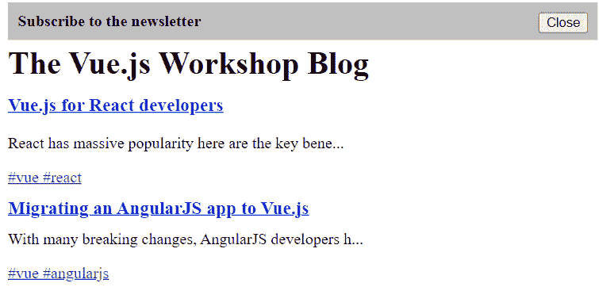

图 11.20 – 浏览器中显示的新闻通讯横幅

在我们编写单元测试之前，查看我们的**现有**测试是否工作可能是个好主意。（而且你可能已经猜到了，这会引出一些东西。）如果你继续运行所有测试，你会看到一系列全新的问题。

在接下来的第一个图中，请注意警告：

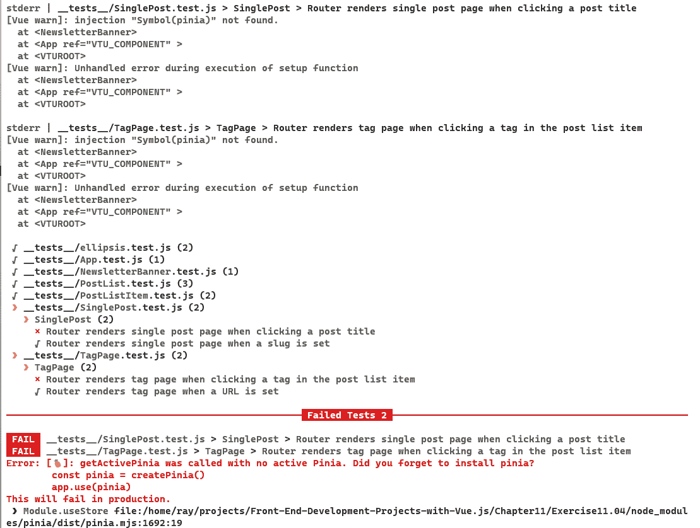

图 11.21 – 与 Pinia 相关的测试失败

如你所见，我们现在有两个测试因为 Pinia 而失败。正如我们看到的 Vue Router 的问题一样，我们需要做一些工作来确保我们的测试不会仅仅因为添加了 Pinia 就抛出错误。首先，我们将通过`npm`安装一些特定的 Pinia 测试工具：

```js
npm install --save @pinia/testing
```

这使我们能够导入一个实用工具来帮助测试 Pinia 存储，同时帮助处理新抛出的错误。在`SinglePost.test.js`中，导入 Pinia 的测试工具：

```js
import { createTestingPinia } from '@pinia/testing'
```

然后，就像我们通过插件传递 Vue Router 一样，我们也将传递一个针对测试的 Pinia 版本：

```js
const wrapper = mount(App, {
  global: {
    plugins: [router,
      createTestingPinia({createSpy:vi.fn})]
  }
})
```

`createSpy`参数用于模拟动作调用并使用`vi.fn`。在我们的单元测试的第一行中，我们可以像这样修改从`vitest`的导入：

```js
import { describe, it, expect, vi } from 'vitest';
```

更新`SinglePost.test.js`中所有包装器的`plugins`属性，并对`TagPage.test.js`重复相同的修复。

下一个检查应该是，如果商店有`dismissedSubscriberBanner: true`，则横幅不应显示。这是通过使用`createTestingPinia`的`initialState`功能来实现的。它允许你根据我们商店的 ID 值定义初始状态值。

```js
it('Newsletter Banner should not display if store is initialised with it dismissed', () => {
  const wrapper = shallowMount(NewsletterBanner, {
    global: {
      plugins: [createTestingPinia({
        initialState: {
          userPreferences: {
            dismissedSubscriberBanner: true
          }
        },
        createSpy:vi.fn
      })]
    }
  })
  expect(wrapper.text()).not.toMatch("Subscribe to the
                                      newsletter");
})
```

我们将要编写的最后一个测试是为了确保点击横幅的**关闭**按钮会触发对商店的操作。我们可以通过检查在点击**关闭**按钮时是否被调用来实现这一点：

```js
  it('Newsletter Banner should hide on "close" button
  click', async () => {
    const wrapper = shallowMount(NewsletterBanner, {
      global: {
        plugins: [createTestingPinia(
          { createSpy:vi.fn })]
      }
    })
    const store = userPreferencesStore();
    await wrapper.find('button').trigger('click');
    expect(store.dismissSubscriberBanner)
      .toHaveBeenCalledTimes(1);
  })
```

当使用`npm run test:unit __tests__/NewsletterBanner.test.js`命令运行测试时，测试将会通过，如下所示：

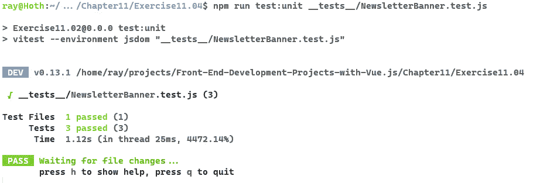

图 11.22 – NewsLetterBanner 的单元测试在命令行上通过

现在你已经有机会使用 Pinia 状态管理和测试了，让我们现在进行一个练习来展示你所学的知识。

## 练习 11.04：构建和测试一个饼干声明横幅

现在，我们将探讨如何使用 Pinia 实现一个饼干声明横幅以及如何对其进行测试。我们将在 Pinia 中存储是否显示饼干横幅（默认为`true`）；当横幅关闭时，它将更新为`false`。

你可以在[`github.com/PacktPublishing/Frontend-Development-Projects-with-Vue.js-3/tree/v2-edition/Chapter11/Exercise11.04`](https://github.com/PacktPublishing/Frontend-Development-Projects-with-Vue.js-3/tree/v2-edition/Chapter11/Exercise11.04)找到完整的代码。

1.  创建一个带有加粗的 `Cookies Disclaimer` 标题的绿色 cookie 横幅，免责声明和 `我同意` 按钮。我们将在 `src/components/CookieBanner.vue` 中创建这个：

    ```js
    <template>
    ```

    ```js
      <div>
    ```

    ```js
      <strong>Cookies Disclaimer</strong>
    ```

    ```js
        We use cookies to improve our experience.
    ```

    ```js
      <button>I agree</button>
    ```

    ```js
      </div>
    ```

    ```js
    </template>
    ```

    ```js
    <style scoped>
    ```

    ```js
    div {
    ```

    ```js
      background-color: green;
    ```

    ```js
      size: 100%;
    ```

    ```js
      padding: 10px;
    ```

    ```js
      margin-top: 50px;
    ```

    ```js
    }
    ```

    ```js
    div button {
    ```

    ```js
      float: right;
    ```

    ```js
    }
    ```

    ```js
    </style>
    ```

1.  接下来，我们需要在 `src/App.vue` 中导入并渲染 `CookieBanner` 以下的内容：

    ```js
    <script setup>
    ```

    ```js
    import NewsletterBanner from './components/NewsletterBanner.vue';
    ```

    ```js
    import CookieBanner from './components/CookieBanner.vue';
    ```

    ```js
    </script>
    ```

    ```js
    <template>
    ```

    ```js
      <NewsletterBanner />
    ```

    ```js
      <header>
    ```

    ```js
      <h1>The Vue.js Workshop Blog</h1>
    ```

    ```js
      </header>
    ```

    ```js
      <router-view :posts="posts"></router-view>
    ```

    ```js
      <CookieBanner />
    ```

    ```js
    </template>
    ```

    ```js
    <!-- rest of template -->
    ```

1.  添加一个状态值来控制是否显示 cookie 横幅。在我们的 Pinia store 中，我们将 `acceptedCookie` 初始化为 `false`：

    ```js
    // rest of Pinia store...
    ```

    ```js
    state: () => ({
    ```

    ```js
      dismissedSubscriberBanner: false,
    ```

    ```js
      acceptedCookie: false
    ```

    ```js
    }),
    ```

    ```js
    // rest of Pinia store...
    ```

1.  我们还需要一个 `acceptCookie` 动作来关闭横幅：

    ```js
    // rest of Pinia store...
    ```

    ```js
    actions: {
    ```

    ```js
      dismissSubscriberBanner() {
    ```

    ```js
        this.dismissedSubscriberBanner = true;
    ```

    ```js
      },
    ```

    ```js
      acceptCookie() {
    ```

    ```js
        this.acceptedCookie = true;
    ```

    ```js
      }
    ```

    ```js
    }
    ```

    ```js
    // rest of Pinia store...
    ```

1.  接下来，我们将暴露 store 状态作为 `acceptedCookie` 计算属性：

    ```js
    <script setup>
    ```

    ```js
    import { computed } from 'vue';
    ```

    ```js
    import { userPreferencesStore } from '@/store.js';
    ```

    ```js
    const store = userPreferencesStore();
    ```

    ```js
    const acceptedCookie = computed(() => {
    ```

    ```js
      return store.acceptedCookie;
    ```

    ```js
    })
    ```

    ```js
    </script>
    ```

1.  如果尚未接受 cookies，我们将使用 `v-if` 显示横幅。当点击 **我同意** 按钮时，将调用 store 动作关闭横幅：

    ```js
    <template>
    ```

    ```js
      <div v-if="!acceptedCookie">
    ```

    ```js
      <strong>Cookies Disclaimer</strong>
    ```

    ```js
        We use cookies to improve our experience.
    ```

    ```js
      <button @click="store.acceptCookie">I agree</button>
    ```

    ```js
      </div>
    ```

    ```js
    </template>
    ```

现在，我们有一个在点击 **我同意** 之前显示的 cookie 横幅，如下面的截图所示：

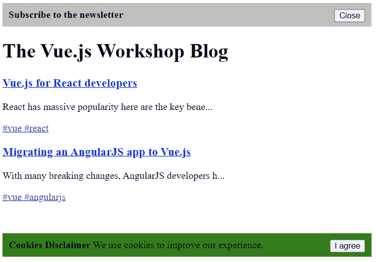

图 11.23 – 浏览器中显示的 Cookie 横幅

1.  我们现在将编写一个测试来检查 `CookieBanner` 默认显示：

    ```js
    import { describe, it, expect, vi } from 'vitest'
    ```

    ```js
    import { shallowMount } from '@vue/test-utils';
    ```

    ```js
    import CookieBanner from '../src/components/CookieBanner.vue';
    ```

    ```js
    import { createTestingPinia } from '@pinia/testing'
    ```

    ```js
    import { userPreferencesStore } from '@/store.js';
    ```

    ```js
    describe('CookieBanner', () => {
    ```

    ```js
      it('Cookie Banner should display if store is
    ```

    ```js
      initialized with it not dismissed', () => {
    ```

    ```js
        const wrapper = shallowMount(CookieBanner, {
    ```

    ```js
          global: {
    ```

    ```js
            plugins:
    ```

    ```js
              [createTestingPinia({createSpy:vi.fn})]
    ```

    ```js
          }
    ```

    ```js
        })
    ```

    ```js
        expect(wrapper.text()).toMatch("Cookies
    ```

    ```js
                                        Disclaimer");
    ```

    ```js
      })
    ```

    ```js
    })
    ```

1.  我们还将编写一个测试来检查 store 中的 `acceptedCookie` 是否为 `true`，如果是，则不会显示 cookie 横幅：

    ```js
    it('Cookie Banner should not display if store is initialised with it dismissed', () => {
    ```

    ```js
      const wrapper = shallowMount(CookieBanner, {
    ```

    ```js
        global: {
    ```

    ```js
          plugins: [createTestingPinia({
    ```

    ```js
            initialState: {
    ```

    ```js
              userPreferences: {
    ```

    ```js
                acceptedCookie: true
    ```

    ```js
              }
    ```

    ```js
            },
    ```

    ```js
            createSpy:vi.fn
    ```

    ```js
          })]
    ```

    ```js
        }
    ```

    ```js
      })
    ```

    ```js
      expect(wrapper.text()).not.toMatch("Cookies
    ```

    ```js
                                          Disclaimer");
    ```

    ```js
    })
    ```

1.  最后，我们想要检查当触发 `acceptCookie` 动作时：

    ```js
    it('Cookie Banner should hide on "I agree" button click', async () => {
    ```

    ```js
      const wrapper = shallowMount(CookieBanner, {
    ```

    ```js
        global: {
    ```

    ```js
          plugins:
    ```

    ```js
            [createTestingPinia({ createSpy:vi.fn })]
    ```

    ```js
        }
    ```

    ```js
      })
    ```

    ```js
        const store = userPreferencesStore();
    ```

    ```js
        await wrapper.find('button').trigger('click');
    ```

    ```js
        expect(store.acceptCookie)
    ```

    ```js
          .toHaveBeenCalledTimes(1);
    ```

    ```js
    })
    ```

当我们使用 `npm run test:unit __tests__/CookieBanner.test.js` 运行时，我们编写的三个测试都通过了，如下所示：

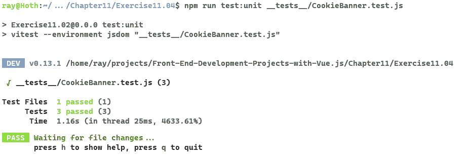

图 11.24 – Cookie 横幅测试通过

我们已经看到了如何测试依赖于 Pinia 进行状态和更新的组件。接下来，我们将探讨快照测试，看看它是如何简化渲染输出的测试的。

# 快照测试

快照测试提供了一种为快速变化的代码片段编写测试的方法，而不需要将断言数据与测试内联。快照的变化反映了输出的变化，这在代码审查中非常有用。

例如，我们可以在 `PostList.test.js` 文件中添加一个快照测试：

```js
  it('PostList renders correctly', () => {
    const wrapper = mount(PostList, {
      propsData: {
        posts: [
               {
                 title: "Title 1",
                 description: "Description 1"
               },
               {
                 title: "Title 2",
                 description: "Description 2"
               }
        ]
      },
      global: {
        plugins: [ router ]
      }
    })
    expect(wrapper.text()).toMatchSnapshot();
  });
```

第一次运行此测试时，将快照文件写入 `__tests__/__snapshots__`：

```js
// Vitest Snapshot v1
exports[`PostList > PostList renders tags for each post 2 1`] = `"Title 1Description 1Title 2Description 2"`;
```

这使得快速看到更改在具体输出方面的含义变得容易。

我们已经看到了如何使用快照测试。接下来，我们将把本章中我们所学到的所有工具结合起来，添加一个新页面。

## 活动 11.01：添加一个简单的按标题搜索页面并包含测试

我们已经构建了一个帖子列表页面、单个帖子视图页面和按标签分类的帖子页面。在博客上重新展示旧内容的一个好方法是通过实现良好的搜索功能。我们将向 `PostList` 页面添加搜索功能：

1.  在新文件 `src/components/SearchForm.vue` 中创建一个带有输入和按钮的搜索表单。

1.  现在，我们将通过导入并在 `src/App.vue` 上渲染表单来使表单显示：

现在我们可以按照以下方式在应用程序中搜索搜索表单：

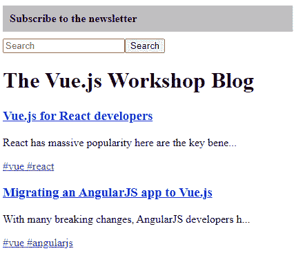

图 11.25 – 带有搜索表单的帖子视图

1.  现在，我们准备为搜索表单添加一个快照测试。在 `__tests__/SearchForm.test.js` 中，我们应该添加 `SearchForm should match` `expected HTML`。

1.  我们希望使用 `v-model` 跟踪搜索表单输入的内容，以双向绑定 `searchTerm` 实例变量和输入内容。

1.  当提交搜索表单时，我们需要更新 URL 以包含正确的参数。这可以通过 `this.$router.push()` 完成。我们将把搜索存储在 `q` 查询参数中。

1.  我们希望反映 `q` 查询参数的状态在搜索表单输入中。我们可以通过从 `this.$route.query` 中读取 `q` 并将其设置为 `SearchForm` 组件状态中 `searchTerm` 数据字段的初始值来实现这一点。

1.  接下来，我们希望过滤传递给主页上 `PostList` 的帖子。我们将使用 `route.query.q` 在一个计算属性中过滤帖子标题。这个新的计算属性将替代 `src/App.vue` 中的帖子。

1.  接下来，我们应该添加一个测试，更改搜索查询参数，并检查应用程序是否显示正确的结果。为此，我们可以导入 `src/App.vue` 和 `@/router.js`，并使用存储和路由渲染应用程序。然后我们可以更新搜索字段的内容。最后，我们可以通过点击测试 ID 为 `Search` 的元素（这是搜索按钮）来提交表单。

注意

这个活动的解决方案可以在 [`github.com/PacktPublishing/Frontend-Development-Projects-with-Vue.js-3/tree/v2-edition/Chapter11/Activity11.01`](https://github.com/PacktPublishing/Frontend-Development-Projects-with-Vue.js-3/tree/v2-edition/Chapter11/Activity11.01) 找到。

# 摘要

在本章中，我们探讨了测试不同类型 Vue.js 应用程序的不同方法。

通常，测试对于实证地展示系统正在工作是有用的。单元测试是构建和维护成本最低的，应该是测试功能的基础。系统测试是测试金字塔的下一级，可以让你有信心大多数功能按预期工作。端到端测试表明整个系统的主要流程是正常工作的。

我们已经看到了如何对组件和方法进行单元测试，以及通过层进行测试，以及以黑盒方式测试组件输出而不是检查组件内部以测试功能。使用 Vitest 测试库，我们测试了利用 Pinia 的高级功能，如路由和应用程序。

最后，我们研究了快照测试，并看到了它如何成为为代码块中模板密集型部分编写测试的有效方法。

在下一章中，我们将探讨可以应用于 Vue.js 应用的端到端测试技术。
