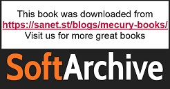

# 前言

# 关于本书

你是否想使用 Vue.js 进行 Web 应用开发，但不知道从何开始？*使用 Vue.js 进行前端开发项目*将帮助你构建开发工具包，并准备好应对现实世界的 Web 项目。你将通过实际示例和活动掌握这个 JavaScript 框架的核心概念。

通过本书中的用例，你将了解如何在 Vue 组件中处理数据，定义组件间的通信接口，以及处理静态和动态路由以控制应用流程。你将掌握 Vue CLI 和 Vue DevTools，并学习如何处理过渡和动画效果以创建引人入胜的用户体验。在关于测试和部署到网络的章节中，你将获得像经验丰富的 Vue 开发者一样工作的技能，并构建其他人可以使用的专业应用。

你将参与现实的项目，这些项目以小规模练习和活动形式呈现，让你以愉快且可行的方式挑战自己。这些迷你项目包括聊天界面、消息应用、购物车和价格计算器、待办事项应用以及用于存储联系信息的个人资料卡生成器。

到本书结束时，你将自信地处理任何 Web 开发项目，并应对现实世界的客户端开发问题。

## 关于作者

*雷蒙德·坎贝尔*是 IBM 的开发者倡导者。他的工作集中在 MobileFirst 平台、Bluemix、混合移动开发、Node.js、HTML5 以及一般性的 Web 标准上。他是一位出版作者，在会议和用户组上就各种主题发表演讲。雷蒙德可以通过他的博客、Twitter 或电子邮件联系。他是许多开发书籍的作者，包括《Apache Cordova 实战》和《客户端数据存储》。

*雨果·迪·弗朗索瓦*是一位与 JavaScript 有着广泛合作的软件工程师。他拥有伦敦大学学院（UCL）数学计算硕士学位。他在像佳能和爱思唯尔这样的公司使用 JavaScript 构建了可扩展且性能卓越的平台。他目前正使用 Node.js、React 和 Kubernetes 解决零售运营空间的问题，同时运营同名网站 Code with Hugo。在工作之外，他是一位国际击剑运动员，在全球范围内进行训练和比赛。

*克利福德·格尼*是一位以解决方案为导向、以结果为目标的初创公司技术负责人。他在沟通设计和广泛参与领导数字化转型计划方面的背景丰富了他使用 Vue JS 设计概念性前端解决方案的能力。克利福德在 Vue JS 墨尔本聚会中发表过演讲，并与志同道合的人合作，提供一流的数字体验平台。

*菲利普·柯克布里奇*拥有超过 5 年的 JavaScript 经验，并驻扎在蒙特利尔。他在 2011 年从一所技术学院毕业，自那时起，他一直在各种角色中与网络技术合作。

*玛雅·沙文*是一位高级前端开发者、演讲者、博主、Storefront UI 核心成员，以及 VueJS 以色列 Meetups 的创始人兼组织者。

## 本书面向对象

本书面向刚开始使用 Vue.js 的开发者，他们希望获得对**单页应用（SPA**）模式的基本理解，并学习如何使用 Vue.js 创建可扩展的企业级应用。如果你已经使用 React 或 Angular，并希望开始学习 Vue.js，这本书也会对你很有帮助。为了理解本书中解释的概念，你必须熟悉基本的 HTML、CSS、JavaScript（如对象、作用域、this 上下文以及值与引用），以及**Node 包管理器（NPM**）。

## 关于章节

*第一章*，*开始你的第一个 Vue 项目*，让你立即创建 Vue 组件。你将学习 Vue.js 的基础知识，以及理解 JavaScript 应用程序中的响应性。

*第二章*，*处理数据*，提供了关于使用计算数据属性、使用监视器观察状态变化以及利用异步 API 等更多组件构建块的信息。

*第三章*，*Vue CLI*，深入探讨了 Vue 的生活质量工具包。你将了解如何使用 Vue CLI 和浏览器开发者工具。

*第四章*，*嵌套组件（模块化）*，探讨了在组件之间传递数据以实现模块化的方法。

*第五章*，*全局组件组合*，深入探讨了在 Vue.js 代码库中共享组件功能的方法。

*第六章*，*路由*，涵盖了 Vue 中使用标准路由和动态路由。你将学习如何在 Vue 中创建具有复杂多页应用的 SPA。

*第七章*，*动画与过渡*，涵盖了 Vue 内置的动画和过渡，以及如何使用外部 JavaScript 库为 Vue 添加动画。我们将在演示应用中创建自定义动画。

*第八章*，*Vue.js 状态管理的现状*，提供了对 Vue.js 状态管理不同方法的视角。

*第九章*，*使用 Vuex – 状态、获取器、动作和突变*，介绍了 Vuex 库，用于 Vue 中的状态管理。

*第十章*，*使用 Vuex – 获取远程数据*，讨论了如何使用 Vuex 和远程 API。

*第十一章*，*使用 Vuex – 组织大型存储*，帮助你组织和管理工作量大的 Vuex 存储。

*第十二章*，*单元测试*，探讨了 Vue.js 应用程序中各个部分的测试，包括组件、过滤器以及混入。

*第十三章*，*端到端测试*，介绍了 Cypress，它用于编写 Vue.js 应用程序的端到端测试。

*第十四章*，“将您的代码部署到 Web 上”，探讨了持续集成/持续部署的现代最佳实践，并考虑了如何将 Vue.js 应用程序部署到多个托管提供商。

## 习惯用法

文本中的代码单词、数据库表名、文件夹名、文件名、文件扩展名、路径名、虚拟 URL、用户输入和 Twitter 昵称如下所示：

“`panic()`函数接受一个空接口。”

您在屏幕上看到的单词，例如在菜单或对话框中，也以相同的格式出现。

代码块设置如下：

```js
<template>
    <div>
        Vue Template Code
    </div>
</template>
```

新术语和重要单词如下所示：“这些行为统称为**方法集**。”

对其他章节和图像的引用如下所示：“*图 2.15*显示了前面代码生成的输出。”

代码片段的关键部分如下突出显示：

```js
      <input
        id="phone"
        type="tel"
        name="phone"
        v-model="phone"
        class="border-2 border-solid border-blue-200 rounded           px-2 py-1"
      />
```

长代码片段将被截断，GitHub 上相应代码文件的名称将放置在截断代码的顶部。整个代码的永久链接将放置在代码片段下方。它应该看起来如下：

```js
Exercise1-12.vue
17 <script>
18 export default {
19   data() {
20     return {
21       list: [
22         'Apex Legends',
23         'A Plague Tale: Innocence',
24         'ART SQOOL',
25         'Baba Is You',
26         'Devil May Cry 5',
27         'The Division 2',
28         'Hypnospace Outlaw',
29         'Katana ZERO',
30       ],
31     }
32   },
33   methods: {
34     deleteItem(value) {
35       this.list = this.list.filter(item => item !== value)
36     },
37   },
38 ...
The complete code for this step is available at https://packt.live/3pJGLvO.
```

## 在开始之前

每一段伟大的旅程都始于一个谦逊的步伐。我们即将开始的 Vue.js 之旅也不例外。在我们能够使用 Vue 做些令人惊叹的事情之前，我们需要准备好一个高效的环境。在接下来的简短章节中，我们将看到如何做到这一点。

## 运行 Node.js 应用程序的最低硬件推荐

为了能够运行书中推荐的全部工具，建议您具备以下条件：

+   1 GHz 或更快的桌面处理器

+   至少 512 MB 的 RAM（更多更好）

+   Windows 32/64 位、macOS 64 位、Linux ARMv7/v8

## 安装 Node.js

为了让 Vue.js 运行，您的计算机上必须安装 Node.js。按照[`nodejs.org/en/download/`](https://nodejs.org/en/download/)上 Windows、macOS 和 Linux 的说明下载最新 LTS 版本。Node.js 安装和使用都是免费的。

## 安装 Git

Node.js 应用程序使用版本控制工具 Git 来安装额外的工具和代码。您可以在[`git-scm.com/book/en/v2/Getting-Started-Installing-Git`](https://git-scm.com/book/en/v2/Getting-Started-Installing-Git)找到 Windows、macOS 和 Linux 的安装说明。Git 安装和使用都是免费的。

## 安装 Yarn

一些练习将使用 Yarn 依赖管理器来安装和运行 Vue.js 应用程序。您可以在[`classic.yarnpkg.com/en/docs/install`](https://classic.yarnpkg.com/en/docs/install)找到 Windows、macOS 和 Linux 的下载和安装 Yarn 的说明。Yarn 安装和使用都是免费的。

## 安装 Vue.js CLI（Vue 命令行界面）

一些练习将要求您使用 Vue.js CLI。您可以在[`cli.vuejs.org/guide/installation.html`](https://cli.vuejs.org/guide/installation.html)找到下载和安装 Vue.js CLI 的说明。

## 安装 Visual Studio Code（编辑器/IDE）

您需要一个用来编写 Vue 源代码的工具。这个工具被称为编辑器或**集成开发环境**（**IDE**）。如果您已经有了喜欢的编辑器，您可以使用它来配合这本书。

如果您还没有编辑器，我们推荐您使用免费的 Visual Studio Code 编辑器。您可以从[`code.visualstudio.com`](https://code.visualstudio.com)下载安装程序：

1.  下载完成后，打开 Visual Studio Code。

1.  从顶部菜单栏选择`视图`。

1.  从选项列表中选择`扩展`。左侧应该会出现一个面板。在顶部是一个搜索输入框。

1.  输入`Vetur`。第一个选项应该是一个名为`Vetur`的扩展，由`Pine Wu`提供。

1.  点击该选项中的`安装`按钮。等待出现一条消息，表明已成功安装。

## 安装代码包

从 GitHub 下载代码文件，请访问[`packt.live/3nOX2xE`](https://packt.live/3nOX2xE)。请参考这些代码文件以获取完整的代码包。

## 联系我们

我们欢迎读者的反馈。

`customercare@packtpub.com`。

**勘误表**：尽管我们已经尽最大努力确保内容的准确性，但错误仍然可能发生。如果您在这本书中发现了错误，我们非常感谢您能向我们报告。请访问[www.packtpub.com/support/errata](http://www.packtpub.com/support/errata)并填写表格。

`copyright@packt.com`，并附上材料的链接。

**如果您有兴趣成为作者**：如果您在某个领域有专业知识，并且您有兴趣撰写或为书籍做出贡献，请访问[authors.packtpub.com](http://authors.packtpub.com)。

## 请留下评论

请在亚马逊上留下详细、公正的评论，告诉我们您的看法。我们非常重视所有反馈——它帮助我们继续制作优质产品并帮助有抱负的开发者提升技能。请抽出几分钟时间留下您的想法——这对我们来说意义重大。

**本书最初是从[sanet.st](https://sanet.st/blogs/mecury-books/)下载的。** 
