# 第一章：1. 开始你的第一个 Vue 项目

概述

在本章中，你将学习 Vue.js 的关键概念以及为什么你应该考虑 Vue.js 作为你的下一个项目。你将学习如何从命令行运行 Vue 项目；描述 Vue.js 项目的架构；使用各种样式和 HTML 语法风格创建 Vue 单文件组件；并且能够熟练地编写 Vue 方法和数据对象以及控制 HTML 模板。

到本章结束时，你将能够描述 Vue 生命周期钩子和表达式的基础知识。

# 简介

行业中的开发者需要快速解决前端开发问题，同时尽量减少对现有工作流程或后端架构的影响。在许多情况下，UI 直到项目结束时才被完全忽视，这可能是由于资源不足、不断变化的产品需求或现有的前端是简单部分的态度。然而，像苹果和谷歌这样的公司已经证明，前端的设计思维对于打造一个能够激发和吸引用户、带来更高投资回报和更成功业务的产品或平台至关重要。

如果你已经发现了 Vue.js，你可能也遇到了其他前端框架，如 Ember、Angular 或 React，它们表面上似乎解决了相同的问题。在表面层面上，它们都试图使响应式前端开发更加可靠，并引入使这更容易做的模式。然而，与 Angular 或 React 项目相比，Vue 项目可能会有一些关键的不同之处。让我们来看看它们。

# Angular 与 Vue 的比较

Angular 是由谷歌构建的**模型-视图-视图模型**（**MVVM**）框架，过去，由于谷歌的支持以及 Angular 从一开始就是为与 TypeScript 一起使用而创建的事实，因此，企业公司通常更倾向于选择 Angular。支持 Angular 的生态系统包括**预编译**（**AoT**）渲染、路由和 CLI 管理，但未能提供简化的全局状态管理系统；开发者需要学习和使用**Flux**或采用**NgRx**。Vue 采用了 Angular 的稳健性和可靠性核心思想，并通过其无差别的开发方法改善了开发体验，通过移除对开发者强制执行的代码风格限制。通过 Vue 的单文件组件系统简化了熟悉的 Angular 模式，如 HTML 指令和依赖注入，以实现模块化，这使开发者受益于无需学习和记住各种结构（注入器、组件、管道、模块等）。Vue 对 TypeScript 和类型支持出色，且没有 Angular 可能具有的强制编码语言和开发风格的缺点。React 和 Vue 都专注于组件驱动开发，这减少了学习新框架所需的时间和精力。

# React 与 Vue 的比较

React 的流行和庞大的开发者社区背后的动力归功于 Facebook 的专职工程师以及它在 2013 年开源发布，当时 Angular 2+还无处可寻。React 的 JSX 模式（一种在 JavaScript 中编写 HTML 和 CSS 的方式）为新手开发者带来了更高的学习曲线，他们不仅需要学习另一种语言，还需要理解基于组件的架构。组件允许开发者以模块化的方式构建应用程序；单个组件描述其自己的功能部分和生命周期，当需要时可以实例化，当不再使用时可以销毁。Vue 将这些模块化编码的核心概念结合起来，使开发者能够使用 JSX 或像传统单文件 Web 应用程序一样编写 HTML、CSS 和 JavaScript 来构建这些组件。Vue 在单文件组件中的关注点分离简化了开发者的模块化结构。

## 使用 Vue 进行项目的优势

Vue 的学习曲线平缓，生态系统活跃。这使任何规模的团队能够受益，因为它不需要大量的开销来教育开发者如何使用 Vue.js 框架。

+   Vue.js 是开发中一个易于学习但难以掌握的模式的另一个例子。Vue 的一个关键优势是其对新老开发者都**易于接近**。

+   开箱即用，开发者可以使用一个**优化良好且性能出色**的框架来构建任何规模的动态前端应用程序。

+   **单文件组件（SFC）**模式提供了一个模块化和灵活的蓝图，简化了开发过程，并为所有级别的开发者提供了**愉快的体验**，为组件混乱带来了秩序。单文件组件使 Vue 真正**多功能**，你可以实现基本功能，并逐步将静态站点的部分内容集成到 Vue 中，而不是彻底改造整个网站。

+   对于熟悉**Redux**和**NgRx**模式的任何开发者来说，官方的全局状态管理支持应该是一种安慰。尽管这些库在正确使用时非常强大，但**Vuex**是创建**健壮的全局状态模式**的绝佳中间方案，这些模式具有灵活性，可以满足大多数开发需求。

对于那些希望快速上手的开发者来说，除非个别用例确实需要，否则不要重新发明轮子，构建自定义的响应式模式。你可以通过使用 Vue 作为框架来节省时间和金钱，因为它已经性能出色，并且官方支持构建端到端应用程序所需的库，包括`vue-router`、Vuex 状态管理、开发工具等。

在本章中，我们将首先介绍 Vue 架构，然后让你熟悉 Vue 独特的 SFC 模式和 HTML 模板语法糖。你将学习如何使用 Vue 特定的模板语法和编码模式，包括 Vue 绑定、指令、生命周期钩子、作用域和局部状态。在 Vue 官方插件生态系统中，我们将主要关注核心 Vue 库。首先，让我们看看 Vue 的项目架构。

## 简单 Vue 应用中的 Vue 实例

开始使用 Vue 的一种最简单的方法是通过`Vue`函数导入 Vue 包。每个 Vue 应用都由一个根 Vue 实例组成，该实例是通过`new Vue`函数创建的。所有创建的相应 Vue 组件也使用相同的语法定义，然而，它们被视为嵌套 Vue 实例，可以包含它们自己的选项和属性：

```js
var vm = new Vue({
  // options
})
```

注意

`vm`是一个常用术语，用来指代`vm`，它可以帮助你在代码块中跟踪你的 Vue 实例。

在这个例子中，我们使用`jsdelivr` CDN 导入 Vue，这将允许你使用 Vue 函数：

```js
<!DOCTYPE html>
<html>
<head>
    <title>Vue.js CDN</title>
    <script src="img/vue.js">
    </script>
</head>
</html>
```

使用类、ID 或数据属性在`<body>`标签中声明一个元素。Vue 因其能够使用简单的模板语法（如双大括号）声明性地将数据渲染到 DOM 中而闻名，例如，`{{ text }}`：

```js
<!DOCTYPE html>
<html>
<head>
    <title>Vue.js CDN</title>
    <script src="img/vue.js">
    </script>
</head>
<body>
    <div>
        <p class="reactive-text">{{ text }}</p>
    </div>
</body>
</html>
```

在`<head>`标签中，我们看到一些在 DOM 加载时触发的原生 JavaScript 代码。它构建了一个与带有`class .reactive-text`的元素绑定的 Vue 组件。标记为`text`的数据属性将替换大括号占位符，并用字符串`Start using Vue.js today!`定义：

```js
<head>
    <title>Vue.js CDN</title>
    <script src="img/vue.js">
    </script>
    <script>
        document.addEventListener('DOMContentLoaded', function () {
            new Vue({
                el: '.reactive-text',
                data: {
                    text: "Start using Vue.js today!"
                }
            })
        })
    </script>
</head>
<body>
    <div>
        <p class="reactive-text">{{ text }}</p>
    </div>
</body>
</html>
```

在前面的脚本中，你将带有`reactive-text`类的`<p>`元素绑定到新的 Vue 实例。因此，现在 Vue 理解了这个 HTML 元素，你可以使用`{{ text }}`语法在`<p>`元素内部输出数据属性`text`。

上述代码的输出将如下所示：

```js
Start using Vue.js today!
```

虽然 CDN 是一种非常便携的方式来开始在你的项目中包含 Vue.js，但使用包管理器是 Vue 推荐的安装方法，因为 Vue 是通过 webpack 编译的，这允许你轻松控制第三方库版本。你可以在这里访问它：[`vuejs.org/v2/guide/installation.html`](https://vuejs.org/v2/guide/installation.html)。接下来，我们将探索 webpack 示例的样子。

# Webpack Vue 应用

Vue 项目结构与许多现代基于 node 的应用类似，这些应用在项目的根目录下包含一个`package.json`文件和一个`node_modules`文件夹。通常，其他配置文件也位于根目录级别，例如`babel.config.js`和`.eslintrc.js`，因为它们通常会对整个项目产生影响。以下截图显示了默认的 Vue 应用文件夹结构：

![图 1.1：默认 Vue 应用文件夹结构]

![img/B15218_01_01.jpg]

图 1.1：默认 Vue 应用程序文件夹结构

Vue 项目结构遵循一种模式，其中大部分源代码都管理在`/src`目录中。你可以将 Vue 文件细分为各种文件夹，例如，使用`components`文件夹来存储可复用的 Vue 组件。默认情况下，Vue 将创建资产和一个`components`文件夹来拆分默认文件。对于初学者来说，遵循这种模式直到你更熟悉以对应用程序有意义的任何方式拆分代码是很好的：


图 1.2：默认 Vue 应用程序 src 文件夹结构

`public`文件夹是一个特殊目录，用于包含需要直接传输到输出位置的文件。以下截图显示了此文件夹的外观：


图 1.3：默认 Vue 应用程序 public 文件夹

默认情况下，`public`文件夹将包含一个`index.html`文件，该文件作为加载 Vue 应用程序的占位符。`index.html`文件可以被修改以包含所需的头部和尾部脚本，例如 Google 字体或作为 webpack 包一部分之外的第三方 JavaScript 库。

## Vue 单页组件

组件是大多数现代框架的构建块。通常将工作拆分成更小的块不仅使代码更容易理解，而且从功能上遵循了**不要重复自己**（**DRY**）的原则。对于 Vue 用户来说，最具独特性的模式之一，也是最有益的模式之一，是**单文件组件**（**SFC**）模式。SFC 将外观和行为的责任集中到一个文件中，通常简化了项目架构，使开发过程更简单，能够在不切换文件的情况下引用 HTML、CSS 和 JavaScript 逻辑。你的默认.vue 文件结构如下：

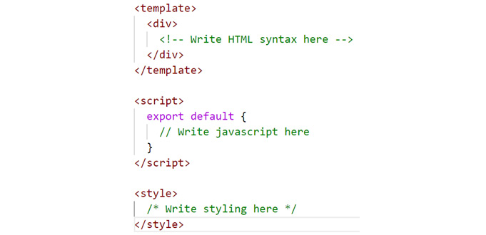

图 1.4：默认.vue 文件结构

许多新 Vue 开发者容易陷入的一个陷阱是编写超过 500 行代码的巨大型 Vue 文件，仅为了 HTML 本身。通常这意味着你可以将这个长组件拆分成一些更小的组件；然而，我们将在未来的章节中介绍文件导入和代码拆分。

例如，在应用程序的头部，你可能有一个需要在不同页面上保持一致的复用 logo 元素。你将创建一个如`logo.vue`的组件：

```js
// logo.vue
<template>
      
</template>
```

你可以将其导入到名为`header.vue`的头部组件中：

```js
// header.vue

<template>
    <header>
      <a href="mywebsite.com"><logo /></a>
    </header>
</template>

<script>
    import logo from 'components/logo.vue'
    export default {
        components: {
          logo
        }
    }
</script>
```

很快，你将拥有大量这些语义化结构的文件，它们使用这些小块的可复用语法，你的团队可以在应用程序的各个区域实现。

在下一节中，我们将了解数据属性。

# 数据属性（Props）

在构建 Vue 组件时，最常用且具有响应性的术语之一是数据属性。这些在 Vue 实例的数据函数中体现出来：

```js
<template>
    <div>{{color}}</div>
</template>
<script>
    export default {
        data() {
          return {
            color: 'red'
          }
        }
    }
</script>
```

您可以使用数据属性来存储您想在 Vue 模板中使用的基本信息。当这个数据属性更新或更改时，它将在相应的模板中响应式地更新。

## 练习 1.01：构建您的第一个组件

在这个练习中，我们将在 Vue 项目内部构建我们的第一个组件。在这种情况下，组件是通过 `yarn` 导入并安装的。这些将在 *前言* 中介绍。到练习结束时，您将能够自信地使用 Vetur 创建新的 Vue 组件并将它们导入到项目中。

要访问此练习的代码文件，请参阅 [`packt.live/35Lhycl`](https://packt.live/35Lhycl)。

1.  打开命令行终端，导航到 `Exercise 1.01` 文件夹，并按顺序运行以下命令：

    ```js
    > cd Exercise1.01/
    > code .
    > yarn
    > yarn serve
    ```

    前往 `https://localhost:8080`。

    注意

    当您保存新的更改时，您的应用程序将进行热重载，因此您可以立即看到它们。

1.  在 `code .` 命令中，进入 `src/App.vue` 目录，并删除该文件中的所有内容并保存。

1.  在您的浏览器中，一切应该是空白的，作为开始工作的清洁画布。

1.  构成一个单文件组件的三个主要组成部分是 `<template>`、`<script>` 和 `<style>` 块。如果您已从 *前言* 中安装了 Vetur 扩展，请输入 `vue` 并按 *Tab* 键选择提示的第一项。这是设置默认代码块的最快方式，如下面的截图所示：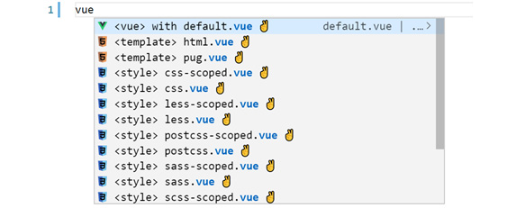

    ```js
    // src/App.vue
    <template>
    </template>
    <script>
    export default {
    }
    </script>
    <style>
    </style>
    ```

1.  在 `components` 文件夹中创建另一个名为 `Exercise1-01.vue` 的文件，并重复相同的步骤，使用 Vetur 搭建 Vue 块：

    ```js
    // src/components/Exercise1-01.vue
    <template>
    </template>
    <script>
    export default {
    }
    </script>
    <style>
    </style>
    ```

1.  在我们的 `Exercise1-01.vue` 组件中，编写一组 `<div>` 标签，并在 `<template>` 标签内包含一个 `<h1>` 元素和标题：

    ```js
    <template>
      <div>
        <h1>My first component!</h1>
      </div>
    </template>
    ```

1.  在 `<style>` 块内添加以下样式：

    ```js
    <template>
      <div>
        <h1>My first component!</h1>
      </div>
    </template>
    <style>
      h1 {
        font-family: 'Avenir', Helvetica, Arial, sans-serif;
        text-align: center;
        color: #2c3e50;
        margin-top: 60px;
      }
    </style>
    ```

1.  使用 ES6 `import` 方法将我们的组件导入到 `App.vue` 中，并在 `<script>` 块中的 `components` 对象内定义组件。现在我们可以通过使用其名称在 `camelCase` 或 `kebab-case`（两者都有效）来在 HTML 中引用此组件：

    ```js
    <template>
      <Exercise />
    </template>
    <script>
    import Exercise from './components/Exercise1-01'
    export default {
      components: {
        Exercise,
      }
    }
    </script>
    ```

    当您点击 `保存` 时，`https://localhost:8080` 应该重新加载并显示以下输出：

    

图 1.6：Exercise 1.01 的本地主机输出

在这个练习中，我们看到了如何使用模板标签构建 Vue 组件，使用 `Vetur` 搭建基本 Vue 组件，输出 HTML，以及使用 ES6 语法将 `Exercise1-01` 组件导入到 `App.vue` 中。

注意

`<template>` 标签内只能有一个根 HTML 元素。复杂组件应该被您选择的包含 HTML 标签包裹。`<div>`、`<article>` 和 `<section>` 都是语义化的 HTML 组件包装器。

# 使用内联插值的数据绑定语法

内联插值是将不同性质的东西插入到其他东西中的过程。在 Vue.js 的上下文中，这就是你将使用*mustache*语法（双花括号）来定义可以注入数据到组件 HTML 模板中的区域的地方。

考虑以下示例：

```js
new Vue({
  data() {
    title: 'Vue.js'
  },
  template: '<span>Framework: {{ title }}</span>'
})
```

数据属性`title`绑定到 Vue.js 响应式数据，并且会根据 UI 及其数据的状态变化实时更新。我们将在下一个练习中更深入地探讨如何使用内联插值以及如何将其绑定到数据属性。

## 练习 1.02：使用条件语句的内联插值

当你想将数据输出到模板中或使页面上的元素具有响应性时，可以通过使用花括号将数据内联到模板中。Vue 可以理解并替换这些占位符为数据。

要访问此练习的代码文件，请参阅[`packt.live/3feLsJ3`](https://packt.live/3feLsJ3)。

1.  打开命令行终端，导航到`Exercise 1.02`文件夹，并按顺序运行以下命令：

    ```js
    > cd Exercise1.02/
    > code .
    > yarn
    > yarn serve
    ```

    访问`https://localhost:8080`。

1.  在`Exercise1-02.vue`组件内部，让我们通过添加一个名为`data()`的函数并在其中返回一个名为`title`的键，其值为你的标题字符串，来在`<script>`标签内添加数据：

    ```js
    <script>
    export default {
      data() {
        return {
          title: 'My first component!',
        }
      },
    }
    </script>
    ```

1.  通过将`<h1>`文本替换为内联值`{{ title }}`来引用数据`title`：

    ```js
    <template>
      <div>
        <h1>{{ title }}</h1>
      </div>
    </template>
    ```

    当你保存此文档时，数据标题现在将出现在你的`h1`标签内。

1.  在 Vue 中，内联将解析花括号内的任何 JavaScript。例如，你可以使用`toUpperCase()`方法在花括号内转换你的文本：

    ```js
    <template>
      <div>
        <h1>{{ title.toUpperCase() }}</h1>
      </div>
    </template>
    ```

    你应该看到以下截图所示的输出：

    ![图 1.7：保存文件——你现在应该有一个大写标题]

    ![图片 B15218_01_07.jpg]

    图 1.7：保存文件——你现在应该有一个大写标题

1.  除了解析 JavaScript 方法外，内联也可以处理条件逻辑。在数据对象内部，添加一个布尔键值对`isUppercase: false`：

    ```js
    <template>
      <div>
        <h1>{{ isUppercase ? title.toUpperCase() : title }}</h1>
      </div>
    </template>
    <script>
    export default {
      data() {
        return {
          title: 'My first component!',
          isUppercase: false,
        }
      },
    }
    </script>
    ```

    上述代码将生成以下输出：

    ![图 1.8：包含内联条件语句的练习 1.02 输出]

    ![图片 B15218_01_08.jpg]

    图 1.8：包含内联条件语句的练习 1.02 输出

1.  将此条件添加到花括号中，当你保存时，你应该看到非大写标题。通过将`isUppercase`更改为`true`来玩转这个值：

    ```js
    <script>
    export default {
      data() {
        return {
          title: 'My first component!',
          isUppercase: true,
        }
      },
    }
    </script>
    ```

    以下截图显示了运行前面代码后生成的最终输出：

    ![图 1.9：最终练习 1.02 输出]

    ![图片 B15218_01_09.jpg]

图 1.9：最终练习 1.02 输出

在这个练习中，我们能够通过使用布尔变量在内联标签（花括号）内使用内联条件来使用内联条件。这允许我们在不过度复杂的条件下修改组件内部显示的数据，这在某些用例中可能很有用。

我们现在将学习如何使用各种方法来设置组件样式。

# 组件样式

当使用 Vue 组件时，webpack 编译器允许你使用你喜欢的几乎所有前端模板语言风格。例如，有几种方法可以组合 CSS，无论是直接还是通过预处理。在 Vue 模板中启用这些表达性语言的最简单方法是在使用 Vue CLI 设置项目之前安装它们。

当你在 Vue 组件中使用 `style` 标签时，如果你已安装适当的 webpack 加载器，你可以指定一个语言。在 `Exercise 1.01` 中，如果你选择安装 SCSS 预处理器，你可以在 `style` 标签中添加 `lang="scss"` 属性以开始使用 SCSS。

例如，如果你选择安装 Stylus 预处理器，你可以在 `style` 标签中添加 `lang="stylus"` 属性以开始使用 Stylus：

```js
<style lang="stylus">
ul 
  color: #2c3e50;
  > h2 
  color: #22cc33;
</style>
```

Vue 作用域是一个方便的方法，可以阻止单个组件从虚拟 DOM 头继承样式。将 `scoped` 属性添加到你的 `style` 标签中，并编写一些特定于组件的样式，这些样式将覆盖全局样式表中的任何其他 CSS 规则。一般规则是不作用域全局样式。定义全局样式的常见方法是将这些样式分离到另一个样式表中，并将其导入到你的 `App.vue` 中。

## 练习 1.03：将 SCSS 导入到作用域组件中

在此练习中，我们将利用 `style` 标签将 SCSS 预处理样式添加到组件中，并导入外部样式表。

要访问此练习的代码文件，请参阅 [`packt.live/3nBBZyl`](https://packt.live/3nBBZyl)。

1.  打开命令行终端，导航到 `Exercise1.03` 文件夹，并按顺序运行以下命令：

    ```js
    > cd Exercise1.03/
    > code .
    > yarn
    > yarn serve
    ```

    前往 `https://localhost:8080`。

1.  在练习文件内部，让我们编写一些可以使用 SCSS 样式的 HTML。让我们继续练习插值方法：

    ```js
    // src/components/Exercise1-03.vue
    <template>
      <div>
        <h1>{{ title }}</h1>
        <h2>{{ subtitle }}</h2>
        <ul>
          <li>{{ items[0] }}</li>
          <li>{{ items[1] }}</li>
          <li>{{ items[2] }}</li>
        </ul>
      </div>
    </template>
    <script>
    export default {
      data() {
        return {
          title: 'My list component!',
          subtitle: 'Vue JS basics',
          items: ['Item 1', 'Item 2', 'Item 3']
        }
      },
    }
    </script>
    ```

1.  将 `lang` 属性添加到 `style` 标签中，并将值设置为 `scss` 以在 `style` 块内启用 SCSS 语法：

    ```js
    <style lang="scss"></style>
    ```

1.  在 `src/` 目录下创建一个名为 `styles` 的文件夹。在这个新文件夹中创建一个名为 `typography.scss` 的文件：

    ```js
    src/styles/typography.scss
    ```

1.  在 `typography.scss` 内部，为你在组件中编写的模板添加一些样式：

    ```js
    /* typography.scss */
    $color-green: #4fc08d;
    $color-grey: #2c3e50;
    $color-blue: #003366;
    h1 {
      margin-top: 60px;
      text-align: center;
      color: $color-grey;
      + h2 {
        text-align: center;
        color: $color-green;
      }
    }
    ul {
      display: block;
      margin: 0 auto;
      max-width: 400px;
      padding: 30px;
      border: 1px solid rgba(0,0,0,0.25);
      > li {
        color: $color-grey;
        margin-bottom: 4px;
      }
    }
    h1 + h2 {
       /* Add styling */
    }
    ul > li {
       /* Add styling */
    }
    ```

    在 SCSS 中，相同的代码可以表示如下：

    ```js
    h1 {
       + h2 {
          // Add styling
       }
    }
    ul {
       > li {
          // Add styling
       }
    }
    ```

1.  在你的组件中，通过使用 SCSS 的 `@import` 方法导入这些样式：

    ```js
    <style lang="scss">
    @import '../styles/typography';
    </style>
    ```

    这将生成以下输出：

    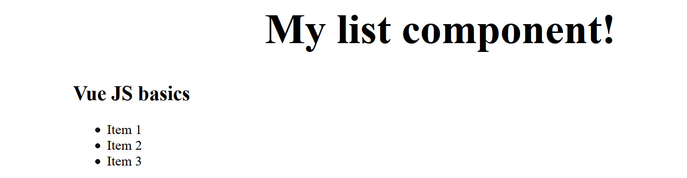

    图 1.10：当你保存并重新加载时，你的项目应该已经导入了样式

1.  将 `scoped` 属性添加到你的 `<style>` 标签中，以便只将这些样式应用于此组件实例。使用从导入的样式表中导入的变量 `$color-blue`：

    ```js
    <style lang="scss" scoped>
    @import '../styles/typography';
    h1 {
      font-size: 50px;
      color: $color-blue; // Use variables from imported stylesheets
    }
    </style>
    ```

    上述代码的输出如下：

    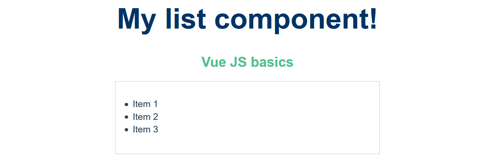

    图 1.11：作用域样式的结果

    检查 DOM，您将注意到在运行时，作用域已将 `v-data-*` 属性应用于您的 DOM 元素，指定了这些特定规则。我们针对组件作用域的 `typography.scss` 引用了一个不在组件作用域内的 HTML 标签。当 Vue 向作用域组件添加数据属性时，如果 `<body>` 标签存在于组件中，它将生成样式。在我们的例子中，它不存在。

    在浏览器开发者工具的 `Elements` 选项卡中展开 `<head>` 和 `<style>` 标签后，将显示以下内容：

    

    图 1.12：观察虚拟 DOM 如何使用数据属性来分配作用域样式

1.  在 `styles` 文件夹中创建一个新的样式表 `global.scss`：

    ```js
    /* /src/styles/global.scss */
    body {
        font-family: 'Avenir', Helvetica, Arial, sans-serif;
        margin: 0;
    }
    ```

1.  将此样式表导入到您的 `App.vue` 中：

    ```js
    <style lang="scss">
    @import './styles/global';
    </style>
    ```

    现在，我们的应用应该恢复正常，具有全局定义的样式和此组件的正确作用域样式，如下所示：

    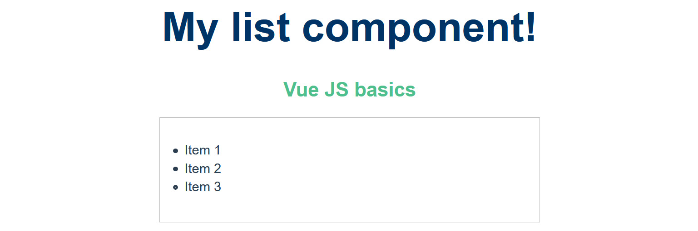

图 1.13：练习 1.03 的正确作用域样式

在这个练习中，我们插值了来自数组的原始数据，然后使用作用域 SCSS 的形式来样式化我们的组件，这些样式可以存在于 `<style>` 标签内部，或者从我们的项目中的另一个目录导入。

# CSS 模块

在响应式框架领域最近流行的一种模式是 CSS 模块。前端开发一直必须面对 CSS 类名冲突、结构不良的 BEM 代码和混乱的 CSS 文件结构等问题。Vue 组件通过模块化并允许您组合 CSS 来帮助解决这个问题，在编译时，将为特定组件生成唯一的类名。您甚至可以在组件之间使用完全相同的类名；然而，它们将通过附加在末尾的随机生成的字符串来唯一标识。

要在 Vue 中启用此功能，您需要将模块属性添加到 `style` 块中，并使用 JavaScript 语法引用类：

```js
<template>
    <div :class="$style.container">CSS modules</div>
</template>
<style lang="scss" module>
.container {
  Width: 100px;
    Margin: 0 auto;
    background: green;
}
</style>
```

在前面的示例中，如果您检查 DOM 树，该类将被命名为类似 `.container_ABC123` 的名称。如果您创建多个具有语义类名如 `.container` 的组件，但使用 CSS 模块，您将永远不会再次遇到样式冲突。

## 练习 1.04：使用 CSS 模块样式化 Vue 组件

在这个练习中，您将利用 CSS 模块来样式化一个 `.vue` 组件。通过在 `:class` 绑定中使用 `$style` 语法，您引用了 Vue 实例的 `this.$style` 作用域。Vue 将根据运行或构建时的组件生成随机类名，确保样式不会与您的项目中的任何其他类冲突。

要访问此练习的代码文件，请参阅 [`packt.live/36PPYdd`](https://packt.live/36PPYdd)。

1.  打开命令行终端，导航到 `Exercise1.04` 文件夹，并按顺序运行以下命令：

    ```js
    > cd Exercise1.04/
    > code .
    > yarn
    > yarn serve
    ```

    前往 `https://localhost:8080`。

1.  在 `Exercise1-04.vue` 内部，编写以下代码：

    ```js
    <template>
      <div>
        <h1>{{ title }}</h1>
        <h2>{{ subtitle }}</h2>
      </div>
    </template>
    <script>
    export default {
      data() {
        return {
          title: 'CSS module component!',
          subtitle: 'The fourth exercise',
        }
      },
    }
    </script>
    ```

1.  添加带有 SCSS 语言的 `<style>` 块，并将 `module` 作为属性而不是 `scoped`：

    ```js
    <style lang="scss" module>
    h1,
    h2 {
      font-family: 'Avenir', Helvetica, Arial, sans-serif;
      text-align: center;
    }
    .title {
      font-family: 'Avenir', Helvetica, Arial, sans-serif;
      color: #2c3e50;
      margin-top: 60px;
    }
    .subtitle {
      color: #4fc08d;
      font-style: italic;
    }
    </style>
    ```

1.  要在模板中使用 CSS 模块，您需要通过使用 `:class` 语法将它们绑定到您的 HTML 元素上，这与 `v-bind:class` 指令相同：

    ```js
    <h1 :class="$style.title">{{ title }}</h1>
    <h2 :class="$style.subtitle">{{ subtitle }}</h2>
    ```

    保存时，您的项目应该看起来像这样：

    

图 1.14：使用 CSS 模块实现的练习 1.04 输出

如果检查虚拟 DOM，您将看到它如何为绑定元素应用了唯一的类名：

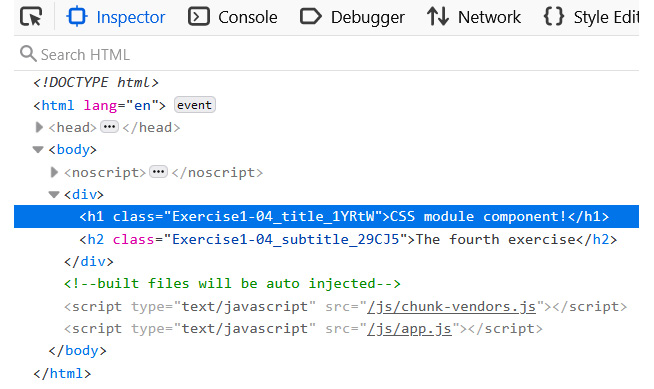

图 1.15：虚拟 DOM 树生成的 CSS 模块类

在这个练习中，我们看到了如何在 Vue 组件中使用 CSS 模块以及它是如何与 CSS 作用域不同的。在下一个练习中，我们将学习如何用 **PUG (HAML)** 编写模板。

注意

结合文件拆分和导入 SCSS，CSS 模块是这里作用域组件样式的首选方法。这安全地确保了单个组件样式和业务规则不会相互覆盖，并且不会因组件特定的样式要求而污染全局样式和变量。可读性很重要。类名也暗示了组件名称，而不是 `v-data` 属性，这在调试大型项目时可能是有益的。

## 练习 1.05：在 PUG (HAML) 中编写组件模板

启用正确的加载器后，您可以使用 HTML 抽象，如 PUG 和 HAML，来模板化您的 Vue 组件，而不是编写 HTML。

要访问此练习的代码文件，请参阅 [`packt.live/2IOrHvN`](https://packt.live/2IOrHvN)。

1.  打开命令行终端，导航到 `Exercise1.05` 文件夹，并按顺序运行以下命令：

    ```js
    > cd Exercise1.05/
    > code .
    > yarn
    ```

    前往 `https://localhost:8080`。

1.  如果 Vue 在命令行中运行，请按 *Ctrl* + *C* 停止实例。然后运行以下命令：

    ```js
    vue add pug
    yarn serve
    ```

1.  在 `Exercise1-05.vue` 内部，编写以下代码，并在 `<template>` 标签上指定 `lang` 属性 `pug`：

    ```js
    <template lang="pug">
      div
        h1(class='title') {{ title }}
    </template>
    <script>
    export default {
      data() {
        return {
          title: 'PUG component!',
        }
      },
    }
    </script>
    <style lang="scss">
    .title {
      font-family: 'Avenir', Helvetica, Arial, sans-serif;
      text-align: center;
      color: #2c3e50;
      margin-top: 60px;
    }
    </style>
    ```

    上述代码将生成以下输出：

    

图 1.16：PUG 练习的输出

在这个练习中，我们看到了如何使用其他 HTML 语言进行模板化，并在 `PUG` 格式中插值数据。在安装 Vue.js `PUG` 插件后，您可以在这些模板标签内使用 `PUG` 编写组件语法，通过添加具有值 `pug` 的 `lang` 属性。

# Vue 指令

Vue 的模板语言允许您将 HTML 代码与 JavaScript 表达式和 Vue 指令进行插值。这种模板模式通常被称为语法糖，因为它不会改变代码本身的工作方式，只是改变了您使用它的方式。语法糖允许您在 HTML 中清晰地定义特定于模板的逻辑，而无需在项目的其他地方抽象此逻辑或直接从 JavaScript 代码中返回大量的 HTML。所有基于 Vue 的指令都以 `v-*` 前缀开头，这表明它是一个 Vue 特定的属性：

+   `v-text`: `v-text` 指令具有与反应性插值相同的特性，除了您在指令内部引用相同的数据片段。插值（花括号）`{{ }}` 比指令 `v-text` 更高效；然而，您可能会发现自己处于这样的情况，即您从服务器预先渲染了文本，并希望在 Vue 应用程序加载后覆盖它。例如，您可以在 DOM 等待 `data` 和 `v-text` 属性最终替换它时预先定义静态占位文本。

+   `v-once`: 作为指令，这是独一无二的，因为它可以与其他指令配对以增强其功能。通过 `v-text` 或插入花括号将数据传递到添加了此属性的 HTML 元素中，将阻止 Vue 实例重新加载元素以新的数据，从而移除元素的反应性。这在您想要使用数据渲染装饰性元素，但又不希望它们在初始渲染后数据更改时更新时非常有用。

+   `v-html`: 这个指令将在绑定到其上的 HTML 元素内的数据字符串中渲染有效的 HTML。与其他指令相比，这个指令的操作更重，因此当其他选项不可用时应限制使用。

    注意

    `<script>` 标签可以在这个指令中运行。仅渲染来自安全或可信来源的内容。

+   `v-bind`: 这个指令是 Vue 中使用最广泛的指令之一。在 Vue 的整个框架中，您将通过这个指令的 `:attr` 快捷方式将响应式数据绑定到 HTML 属性，并使用它将数据传递给 props，而不是使用 `v-bind:attr`。

+   `v-if`: 为了控制模板中 HTML 元素的显示状态，您通常会使用 `v-if` 完全从 DOM 树中移除元素。到目前为止，您已经看到了如何插入条件，例如 `{{ isTrue ? 'Show this': 'Not this' }}`。使用 `v-if` 指令，您可以控制整个 HTML 语法块。`v-else-if` 可以像 `else if` 语句一样使用，并以 `v-else` 结尾，它是传统 JavaScript 中 `else { ... }` 语句的 `catch { ... }` 声明的等价物。

+   `v-show`：您可以通过使用 `v-show` 来控制 HTML 元素的可见状态，它不会从 DOM 树中删除元素，而是应用 `display: none` 样式。`v-if` 和 `v-show` 之间的区别在于 `v-show` 将作为块元素保留在 DOM 树中，但将通过 `css` 隐藏而不是从 DOM 树中删除。您也不能将 `v-show` 与 `v-else` 或 `v-else-if` 连接。

+   `v-for`：将此指令应用于您想要重复或迭代的元素。此指令需要一个额外的属性 `:key`，以便它可以正确地响应式渲染；它可以是简单的唯一数字。

    考虑一个例子，其中我们迭代列表元素五次。每个列表项将渲染其计数（1，2… 5）：

    ```js
    <ul><!-- do not apply v-for to this <ul> element -->
        <li v-for="n in 5" :key="n">{{ n }}</li>
    </ul>
    ```

现在，让我们看看一些基本指令是如何工作的。

## 练习 1.06：基本指令（v-text、v-once、v-html、v-bind、v-if、v-show）

更复杂的组件将使用多个指令来实现所需的输出。在这个练习中，我们将构建一个组件，该组件使用多个指令来绑定、操作并将数据输出到模板视图。

要访问此练习的代码文件，请参阅 [`packt.live/3fdCNqa`](https://packt.live/3fdCNqa)。

1.  打开命令行终端，导航到 `Exercise1.06` 文件夹，并按顺序运行以下命令：

    ```js
    > cd Exercise1.06/
    > code .
    > yarn
    > yarn serve
    ```

    访问 `https://localhost:8080`。

1.  在 `Exercise1-06.vue` 内部编写以下语法。这使用了我们在之前的练习中使用的插值方法，并且到这一点上应该非常熟悉：

    ```js
    <template>
      <div>
        <h1>{{ text }}</h1>
      </div>
    </template>
    <script>
    export default {
      data() {
        return {
          // v-text
          text: 'Directive text',
        }
      },
    }
    </script>
    <style lang="scss" scoped>
    h2 {
      margin: 40px 0 0;
      font-weight: normal;
    }
    </style>
    ```

1.  将插值替换为 `v-text` 属性。您将注意到输出不会改变：

    ```js
    <template>
      <div>
        <h1 v-text="text">Loading...</h1>
      </div>
    </template>
    <script>
    export default {
      data() {
        return {
          // v-text
          text: 'Directive text',
        }
      },
    }
    </script>
    ```

    *图 1.17* 展示了前面代码的输出：

    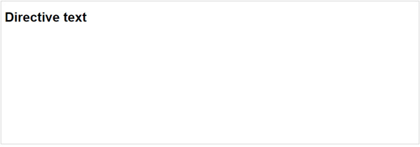

    图 1.17：v-text 指令的输出与插值方法非常相似

1.  在同一元素上添加 `v-once` 指令。这将强制此 DOM 元素在页面存在期间只加载一次 `v-text` 数据：

    ```js
    <template>
      <div>
        <h1 v-once v-text="text">Loading...</h1>
      </div>
    </template>
    <script>
    export default {
      data() {
        return {
          // v-text
          text: 'Directive text',
        }
      },
    }
    </script>
    ...
    ```

1.  在 `h1` 元素下方，包含一个新的 `h2` 元素，该元素使用 `v-html` 属性。添加一个新的数据键 `html`，其中包含如下格式的字符串：

    ```js
    <template>
      <div>
        <h1 v-once v-text="text">Loading...</h1>
        <h2 v-html="html" />
      </div>
    </template>
    <script>
    export default {
      data() {
        return {
          // v-text
          text: 'Directive text',
          // v-html
          html: 'Stylise</br>HTML in<br/><b>your data</b>',
        }
      },
    }
    </script>
    ...
    ```

    运行前面的代码将生成如下输出：

    

    图 1.18：渲染 HTML 元素后的输出

1.  在 `data` 对象中添加一个新的 `link` 对象，其中包含诸如 URL、目标、标题和标签索引等信息。在模板内部，添加一个新的锚点 HTML 元素，并使用冒号语法将 `link data` 对象绑定到 HTML 元素上，例如，`:href="link.url"`：

    ```js
    <template>
      <div>
        <h1 v-once v-text="text">Loading...</h1>
        <h2 v-html="html" />
      </div>
    </template>
    <script>
    export default {
      data() {
        return {
          // v-text
          text: 'Directive text',
          // v-html
          html: 'Stylise</br>HTML in<br/><b>your data</b>',
        }
      },
    }
    </script>
    ...
    ```

    以下截图显示了输出：

    

    图 1.19：将 Vue 实例的响应式数据绑定到任何 HTML 属性的输出

1.  将 `v-if="false"` 应用到 `h1` 元素上，将 `v-else-if="false"` 应用到 `h2` 上，将 `v-else` 应用到 `a` 标签上，如下所示：

    ```js
    <template>
      <div>
        <h1 v-if="false" v-once v-text="text">Loading...</h1>
        <h2 v-else-if="false" v-html="html" />
        <a
          v-else
          :href="link.url"
          :target="link.target"
          :tabindex="link.tabindex"
          v-text="link.title"
        />
      </div>
    </template>
    ```

    你应该只能看到页面中的 `<a>` 标签，因为我们已经将条件语句设置为 `false`。

    `v-else` 条件将显示如下：

    ![图 1.20：v-if 语句将整个 HTML 元素从 DOM 中隐藏]

    ![图片 B15218_01_20.jpg]

    图 1.20：v-if 语句将整个 HTML 元素从 DOM 中隐藏

1.  将模板更改为使用 `v-show` 而不是 `v-if` 语句：

    ```js
    <template>
      <div>
        <h1 v-show="true" v-once v-text="text">Loading...</h1>
        <h2 v-show="false" v-html="html" />
        <a
          :href="link.url"
          :target="link.target"
          :tabindex="link.tabindex"
          v-text="link.title"
        />
      </div>
    </template>
    ```

    上述代码的输出将如下所示：

    ![图 1.21：将 v-show 设置为 true 将显示元素]

    ![图片 B15218_01_21.jpg]

图 1.21：将 v-show 设置为 true 将显示元素

当你打开浏览器开发者工具的 `Elements` 选项卡时，你应该能够观察到 `h2` 的显示状态设置为 `none`，如下所示：

![图 1.22：h2 显示 "display: none" 的 false 条件]

![图片 B15218_01_22.jpg]

图 1.22：在 false 条件下，h2 显示 "display: none"

如果 `v-show` 结果为 `true` 布尔值，它将保持 DOM 元素不变。如果解析为 `false`，它将应用 `display: none` 样式到该元素上。

在这个练习中，我们学习了 Vue 的核心指令，用于控制、绑定、显示和隐藏 HTML 模板元素，而无需在本地状态中添加任何新的数据对象之外的 JavaScript。

在下一节中，我们将学习如何在 Vue 的 `v-model` 的帮助下实现双向绑定。

# 使用 v-model 实现双向绑定

Vue 通过创建一个专门监视 Vue 组件内部数据属性的指令，简化了实现双向数据绑定的方式。当 Vue 监视的绑定数据属性发生变化时，Vue 指令 `v-model` 会做出响应性变化。这个指令通常对需要同时显示数据和修改数据的 HTML 表单元素很有用，例如输入、文本区域、单选按钮等。

通过向要绑定的元素添加 `v-model` 指令并引用数据属性来实现双向绑定：

```js
<template>
    <input v-model="name" />
</template>
<script>
      export default {
        data() {
          return {
            name: ''
          }
        }
      }
</script>
```

*图 1.23* 代表运行上述代码生成的输出：

![图 1.23：v-model 示例的输出]

![图片 B15218_01_23.jpg]

图 1.23：v-model 示例的输出

使用此指令时要小心，因为以这种方式绑定大量数据可能会影响应用程序的性能。考虑你的 UI 并将其拆分为不同的 Vue 组件或视图。Vue 中的本地状态数据不是不可变的，可以在模板的任何地方重新定义。

## 练习 1.07：使用 v-model 实现双向绑定

我们将使用 Vue 的双向数据绑定属性 v-model 来构建一个组件。考虑一下双向绑定数据片段的含义。这种数据模型的应用场景通常是表单，或者你期望既有输入又有输出数据的地方。到练习结束时，我们应该能够在一个表单上下文中使用 v-model 属性。

要访问此练习的代码文件，请参阅[`packt.live/2IILld8`](https://packt.live/2IILld8)。

1.  打开命令行终端，导航到`Exercise1.07`文件夹，并按顺序运行以下命令：

    ```js
    > cd Exercise1.07/
    > code .
    > yarn
    > yarn serve
    ```

    访问`https://localhost:8080`。

1.  首先，在模板区域使用`v-model`组合一个 HTML 标签和输入元素，并将其绑定到`name`数据属性：

    ```js
    <div class="form">
       <label>
         Name
         <input type="text" v-model="name" />
       </label>
    </div>
    ```

1.  通过在`<script>`标签中返回一个名为`name`的响应式数据属性来完成文本输入的绑定：

    ```js
    <script>
    export default {
      data() {
        return {
          name: '',
        }
      },
    }
    </script>
    ```

1.  使用模板区域内的`v-model`组合一个标签和可选择的 HTML 列表，并将其绑定到数据属性`language`：

    ```js
        <div class="form">
          <label>
            Name
            <input type="text" v-model="name" />
          </label>
          <label>
            Preferred javascript style
            <select name="language" v-model="language">
              <option value="Javascript">JavaScript</option>
              <option value="TypeScript">TypeScript</option>
              <option value="CoffeeScript">CoffeeScript</option>
              <option value="Dart">Dart</option>
            </select>
          </label>
        </div>
    ```

1.  通过在`<script>`标签中返回一个名为`language`的响应式数据属性来完成选择输入的绑定：

    ```js
    <script>
    export default {
      data() {
        return {
          name: '',
          language: '',
        }
      },
    }
    </script>
    ```

1.  在表单字段下方，使用花括号（例如，`{{ name }}`）在无序列表结构（`<ul>`和`<li>`）中输出名称和语言：

    ```js
    <template>
      <section>
        <div class="form">
          <label>
            Name
            <input type="text" v-model="name" />
          </label>
          <label>
            Preferred javascript style
            <select name="language" v-model="language">
              <option value="Javascript">JavaScript</option>
              <option value="TypeScript">TypeScript</option>
              <option value="CoffeeScript">CoffeeScript</option>
              <option value="Dart">Dart</option>
            </select>
          </label>
        </div>
        <ul class="overview">
          <li><strong>Overview</strong></li>
          <li>Name: {{ name }}</li>
          <li>Preference: {{ language }}</li>
        </ul>
      </section>
    </template>
    ```

1.  在组件底部的`<style>`标签内添加样式，并将`lang`属性设置为`scss`：

```js
Exercise1-07.vue
37 <style lang="scss">
38 .form {
39   display: flex;
40   justify-content: space-evenly;
41   max-width: 800px;
42   padding: 40px 20px;
43   border-radius: 10px;
44   margin: 0 auto;
45   background: #ececec;
46 }
47
48 .overview {
49   display: flex;
50   flex-direction: column;
51   justify-content: space-evenly;
52   max-width: 300px;
53   margin: 40px auto;
54   padding: 40px 20px;
55   border-radius: 10px;
56   border: 1px solid #ececec;
57
58   > li {
59     list-style: none;
60     + li {
61       margin-top: 20px;
62     }
63   }
64 }
65 </style>
The complete code for this step is available at https://packt.live/36NiNXH.
```

您的输出应该如下所示：

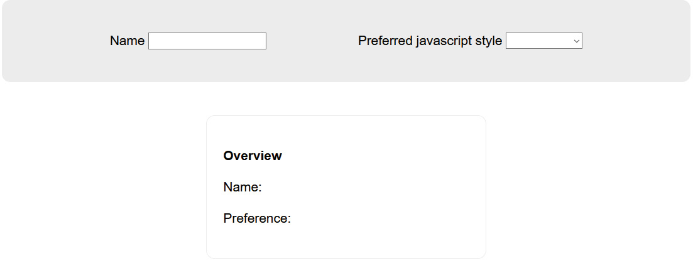

图 1.24：数据更新后的最终表单显示

您的表单应该看起来像这样。当您更新表单中的数据时，它也应该同步更新概览区域。

在这个练习中，我们使用了`v-model`指令来绑定名称和 JavaScript 风格的下拉选择到我们本地状态的数据。当您更改数据时，它将响应式地更新我们输出此绑定数据的 DOM 元素。

# 匿名循环

要在 Vue 中遍历 HTML 元素，您将使用`v-for`循环指令。当 Vue 渲染组件时，它将迭代您添加指令的 HTML 元素，以使用解析到指令中的数据。`:key`。当键或绑定到键的内容发生变化时，Vue 知道它需要重新加载循环内的内容。如果您在一个组件中有多个循环，请使用额外的字符或与上下文相关的字符串随机化键，以避免`:key`重复冲突。

匿名循环的示例如下；请注意，您可以使用引号或反引号（`）来描述字符串：

```js
          <div v-for="n in 2" :key="'loop-1-' + n">
    {{ n }}
</div>
<!-- Backticks -->
<div v-for="n in 5" :key="`loop-2-${n}`">
    {{ n }}
</div>
```

上述代码的输出应该如下所示。


图 1.25：匿名循环示例的输出

理解循环对于不仅使用 Vue，而且一般使用 JavaScript 都是关键。现在我们已经介绍了如何使用`v-for`语法处理循环以及绑定`:key`属性以向循环内容添加响应性的重要性，我们将在下一个练习中利用这个功能。

## 练习 1.08：使用 v-for 遍历字符串数组

在这个练习中，我们将使用 Vue 的`v-for`指令执行匿名循环。这将对那些之前在 JavaScript 中使用过`for`或`foreach`循环的人很熟悉。

要访问此练习的代码文件，请参阅 [`packt.live/390SO1J`](https://packt.live/390SO1J)。

执行以下步骤以完成练习：

1.  打开命令行终端，导航到 `Exercise1.08` 文件夹，并按顺序运行以下命令：

    ```js
    > cd Exercise1.08/
    > code .
    > yarn
    > yarn serve
    ```

    前往 `https://localhost:8080`。

1.  通过在组件中添加 `<h1>` 标题和一个 `<ul>` 元素（其中包含一个 `<li>` 标签，该标签具有 `v-for` 指令，其值为 `n` 为 `5`）来在 `Exercise1-08.vue` 内部编写以下语法：

    ```js
    Exercise1-08.vue
    1 <template>
    2   <div>
    3     <h1>Looping through arrays</h1>
    4     <ul>
    5       <li v-for="n in 5" :key="n">
    6         {{ n }}
    7       </li>
    8     </ul>
    The complete code for this step is available at https://packt.live/3pFAtgB.
    ```

    这将生成以下输出：

    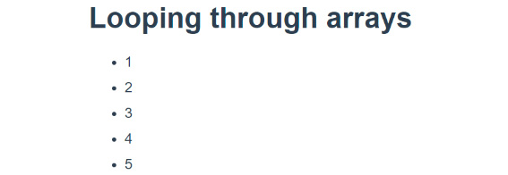

    图 1.26：遍历任意数字也将允许你输出索引

1.  现在让我们遍历一个字符串数组，并使用 `n` 计算数组的迭代次数。在 `data()` 函数中准备一个包含你个人兴趣的数组。通过在 `interests` 数组中查找 (`item, n`)，`item` 输出数组的字符串，而 `n` 是循环索引：

    ```js
    <template>
      <div>
        <h1>Looping through arrays</h1>
        <ul>
          <li v-for="(item, n) in interests" :key="n">
            {{ item }}
          </li>
        </ul>
      </div>
    </template>
    <script>
    export default {
      data() {
        return {
          interests: ['TV', 'Games', 'Sports'],
        }
      },
    }
    </script>
    ```

    运行上述代码将生成以下输出：

    

图 1.27：遍历字符串数组

在这个练习中，我们学习了如何遍历任意数字和特定的字符串数组，输出数组的字符串值或索引。我们还了解到，键属性需要是唯一的，以避免 DOM 冲突并强制 DOM 正确重新渲染组件。

# 遍历对象

当从 API 请求数据时，你通常会遍历包含逻辑和原始内容的对象数组。Vue 通过其指令语法使控制数据的各种状态变得简单。条件指令控制 Vue 中 DOM 元素的显示状态。HTML 语法在你的组件中设置显示规则时提供了清晰的可见性。

## 练习 1.09：使用 v-for 循环遍历对象数组并使用它们的属性进行 v-if 条件

在这个练习中，我们将控制 Vue 数据数组，并遍历其内部的对象。

要访问此练习的代码文件，请参阅 [`packt.live/32YokKa`](https://packt.live/32YokKa)。

1.  打开命令行终端，导航到 `Exercise1.09` 文件夹，并按顺序运行以下命令：

    ```js
    > cd Exercise1.09/
    > code .
    > yarn
    > yarn serve
    ```

    前往 `https://localhost:8080`。

1.  在 `Exercise1-09.vue` 内部编写以下语法，并创建一个包含 `title` 字符串和 `favorite` 字符串数组的对象。我们将像遍历字符串数组一样遍历 `interests` 对象；然而，你需要引用 `interests` 对象内的 `title` 键：

    ```js
    <template>
      <div>
        <h1>Looping through array of objects</h1>
        <ul>
          <li v-for="(item, n) in interests" :key="n">
            {{ item.title }}
          </li>
        </ul>
      </div>
    </template>
    ```

    运行上述代码的输出将如下所示：

    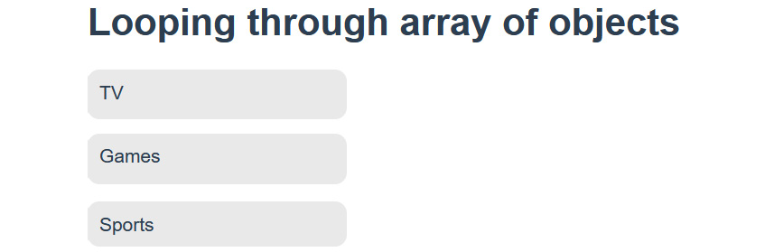

    图 1.28：现在你应该在前端看到一系列标题

1.  让我们创建第二个`v-for`循环来遍历你的收藏列表。注意，我们在嵌套循环中使用不同的键——`fav`和`m`——这是因为你仍然可以在嵌套循环的上下文中使用`item`和`n`的值：

    ```js
    <template>
      <div>
        <h1>Looping through array of objects</h1>
        <ul>
          <li v-for="(item, n) in interests" :key="n">
            {{ item.title }}
            <ol>
              <li v-for="(fav, m) in item.favorite" :key="m">            {{ fav }}</li>
            </ol>
          </li>
        </ul>
      </div>
    </template>
    ```

    *图 1.29* 显示了通过对象数组执行循环的输出：

    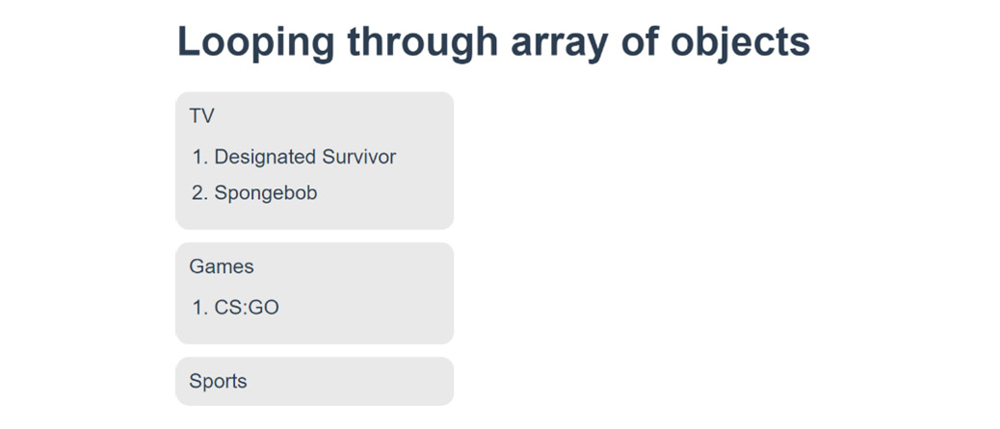

    图 1.29：嵌套有序列表详细说明你的收藏

1.  为了优化 DOM 树，我们可以使用`Exercise 1.09`中的`v-if`条件指令来隐藏不必要的 DOM 元素：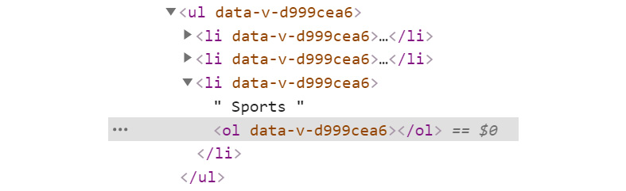

    图 1.30：在虚拟 DOM 中显示空 DOM 元素

1.  我们将检查数组中是否有超过`0`个元素以显示有序列表 HTML 元素。向`<ol>`添加一个`v-if`指令，条件为`item.favorite.length > 0`：

    ```js
    // src/components/Exercise1-09.vue
    <template>
      <div>
        <h1>Looping through array of objects</h1>
        <ul>
          <li v-for="(item, n) in interests" :key="n">
            {{ item.title }}
            <ol v-if="item.favorite.length > 0">
              <li v-for="(fav, m) in item.favorite" :key="m">            {{ fav }}</li>
            </ol>
          </li>
        </ul>
      </div>
    </template>
    ```

    这不会影响你页面的视觉效果，但当你检查浏览器中的虚拟 DOM 树时，你会注意到在开发模式下有一个 HTML 注释，这允许你理解`v-if`语句可能为`false`的位置。当你为生产构建时，这些 HTML 注释不会出现在你的 DOM 中。

    

图 1.31：显示生产构建中没有 HTML 注释的输出

通过在开发模式下使用`v-if`指令，你会看到一个 HTML 注释。这些在产品构建中不会存在。

在这个练习中，我们能够遍历复杂对象的数组，输出这些对象的嵌套键，并根据长度条件控制 DOM 元素的状态。

## Vue 中的方法

Vue 方法是在 Vue 实例内的`methods`对象中定义的，可以像正常的 JavaScript 函数一样编写，其中定义了一段要执行的逻辑。当你使用 JavaScript 函数时，通常你会返回一个值或者简单地执行一个全局操作。编写函数和 Vue 方法的主要区别在于 Vue 方法的作用域限定在你的 Vue 组件内，并且可以在组件内部任何位置运行。由于方法的作用域限定在组件的 Vue 实例内，你可以在 HTML 模板中轻松地通过事件指令引用它们。在 Vue 中绑定 HTML 元素的事件时，你会使用`@`符号；例如，`v-on:click`等同于`@click`。

## 练习 1.10：触发方法

在这个练习中，我们将构建一个使用 Vue 方法 API 的组件。考虑这些 Vue 方法可以像你自己的命名函数一样编写，因为它们的行为非常相似。通过练习的结束，我们应该能够使用方法并在 HTML 模板中触发它们。

要访问此练习的代码文件，请参阅[`packt.live/3kMTWs5`](https://packt.live/3kMTWs5)。

1.  打开命令行终端，导航到 `Exercise1.10` 文件夹，并按顺序运行以下命令：

    ```js
    > cd Exercise1.10/
    > code .
    > yarn
    > yarn serve
    ```

    访问 `https://localhost:8080`。

1.  让我们遍历一个方法触发器，并将它的数字传递给一个方法。在 HTML 列表上设置一个匿名 `v-for` 循环，并在列表元素内部添加一个锚元素。将循环设置为迭代 `5` 次：

    ```js
    <template>
      <div>
        <h1>Triggering Vue Methods</h1>
        <ul>
          <li v-for="n in 5" :key="n">
            <a href="#">Trigger</a>
          </li>
        </ul>
      </div>
    </template>
    ```

1.  添加一个名为 `triggerAlert` 的方法，并使用 `@click` 指令引用它，将 `n` 的值作为参数传递。使用花括号将值 `n` 输出到锚元素中：

    ```js
    <template>
      <div>
        <h1>Triggering Vue Methods</h1>
        <ul>
          <li v-for="n in 5" :key="n">
            <a href="#" @click="triggerAlert(n)">Trigger {{ n }}</a>
          </li>
        </ul>
      </div>
    </template>
    ```

1.  在 `methods` 对象内部，添加一个带有 `n` 参数的 `triggerAlert(n)` 键。在这个方法内部，添加一个 `alert` 函数，它将输出值 `n` 加上一些静态文本：

    ```js
    <script>
    export default {
      methods: {
        triggerAlert(n) {
          alert(`${n} has been clicked`)
        },
      },
    }
    </script>
    ```

1.  在组件底部的 `<style>` 标签内添加样式，并将 `lang` 属性设置为 `scss`：

    ```js
    Exercise1-10.vue
    22 <style lang="scss" scoped>
    23 ul {
    24   padding-left: 0;
    25 }
    26 li {
    27   display: block;
    28   list-style: none;
    29 
    30   + li {
    31     margin-top: 10px;
    32   }
    33 }
    34 
    35 a {
    36   display: inline-block;
    37   background: #4fc08d;
    38   border-radius: 10px;
    39   color: white;
    40   padding: 10px 20px;
    41   text-decoration: none;
    42 }
    43 </style>
    The complete code for this step is available at https://packt.live/374yKZZ.
    ```

1.  您的页面应该包含一个按钮列表，当点击按钮时，会触发一个包含您点击的按钮编号的消息的警告，如下所示：![图 1.32：输出触发器列表]

    ![图片 B15218_01_32.jpg]

![图 1.32：输出触发器列表]

当点击触发器时，会显示以下提示：

![图 1.33：显示包含索引数字的浏览器警告]

![图片 B15218_01_33.jpg]

![图 1.33：显示包含索引数字的浏览器警告]

注意

虽然您可以将事件指令添加到任何 HTML 元素中，但建议将它们应用于原生 HTML 交互元素，如锚标签、表单输入或按钮，以帮助提高浏览器可访问性。

在这个练习中，我们能够利用 Vue 方法 API 定义和从 HTML 模板触发方法，并将参数动态地解析到每个方法中。

## 练习 1.11：使用 Vue 方法返回数据

在这个练习中，我们将学习如何将 Vue 方法作为一个函数在 Vue 实例和模板内部返回数据。

在 web 应用程序中，我们通常希望元素根据条件是否满足而出现在页面上。例如，如果我们的产品缺货，我们的页面应该显示缺货的事实。

因此，让我们弄清楚我们如何根据我们的产品是否有库存来有条件地渲染这些元素。

要访问此练习的代码文件，请参阅 [`packt.live/3pHWCeh`](https://packt.live/3pHWCeh)。

1.  打开命令行终端，导航到 `Exercise1.11` 文件夹，并按顺序运行以下命令：

    ```js
    > cd Exercise1.11/
    > code .
    > yarn
    > yarn serve
    ```

    访问 `https://localhost:8080`。

1.  让我们遍历一个随机金额并触发`addToCart`方法。设置两个数据对象`totalItems`和`totalCost`，当用户点击我们的购物按钮时，这些对象将被更新。接下来，通过指定`this`在 Vue 的`script`块中引用数据对象。例如，在`template`块中，我们将`totalItems`引用为`{{ totalItems }}`，但在`script`块中，我们将它引用为`this.totalItems`。对于方法，使用相同的模式，其中`addToCart`将在另一个方法中引用为`this.addToCart`：

    ```js
    <template>
      <div>
        <h1>Returning Methods</h1>
        <div>Cart({{ totalItems }}) {{ totalCost }} </div>
        <ul>
          <li v-for="n in 5" :key="n">
            <a href="#" @click="addToCart(n)">Add {{ n }}</a>
          </li>
        </ul>
      </div>
    </template>
    <script>
    export default {
      data() {
        return {
          totalItems: 0,
          totalCost: 0,
        }
      },
      methods: {
        addToCart(n) {
          this.totalItems = this.totalItems + 1
          this.totalCost = this.totalCost + n
        },
      },
    }
    </script>
    <style lang="scss" scoped>
    ul {
      padding-left: 0;
    }
    li {
      display: block;
      list-style: none;
      + li {
        margin-top: 10px;
      }
    }
    a {
      display: inline-block;
      background: rgb(235, 50, 50);
      border-radius: 10px;
      color: white;
      padding: 10px 20px;
      text-decoration: none;
    }
    </style>
    ```

    这将生成以下输出：

    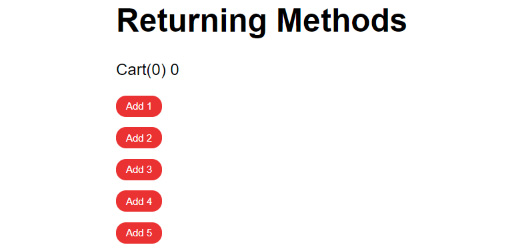

    图 1.34：按下任意按钮将演示购物车逻辑

    当你点击按钮时，项目计数器应该增加`1`，但成本将增加`n`值，这应该展示正常的购物车功能（点击`加 2`，然后`加 5`）：

    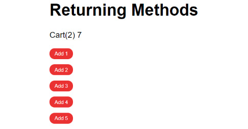

    图 1.35：显示递增后的返回方法的输出

1.  让我们谈谈金钱。我们可以使用方法来执行逻辑操作，根据事件增强或格式化字符串。创建一个名为`formatCurrency`的方法，它接受一个参数。我们将返回相同的值，在它后面加上两位小数和一个`$`符号。要在模板中使用此方法，只需将其添加到插值大括号中，并将方法内的值作为参数传递：

    ```js
    <template>
      <div>
        <h1>Returning Methods</h1>
        <div>Cart({{ totalItems }}) {{ formatCurrency(totalCost) }}      </div>
        <ul>
          <li v-for="n in 5" :key="n">
            <a href="#" @click="addToCart(n)">Add           {{ formatCurrency(n) }}</a>
          </li>
        </ul>
      </div>
    </template>
    <script>
    export default {
      data() {
        return {
          totalItems: 0,
          totalCost: 0,
        }
      },
      methods: {
        addToCart(n) {
          this.totalItems = this.totalItems + 1
          this.totalCost = this.totalCost + n
        },
        formatCurrency(val) {
          return `$${val.toFixed(2)}`
        },
      },
    }
    </script>
    ```

    以下截图显示了前面代码的输出：

    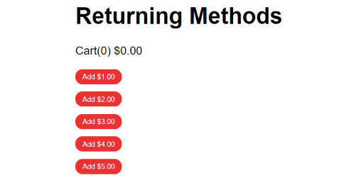

图 1.36：现在所有值都应看起来像货币，同时保留购物车计数器

在这个练习中，我们能够利用 Vue 的方法 API 将参数解析为方法，返回修改后的值，并在一个逼真的场景中使用方法来更新本地数据状态。

# Vue 生命周期钩子

Vue 组件生命周期事件包括以下内容：

+   `beforeCreate`: 当你的组件被初始化时运行。`data`尚未变为响应式，DOM 中的事件也没有设置。

+   `created`: 你将能够访问响应式数据和事件，但模板和 DOM 尚未挂载或渲染。这个钩子通常在从服务器请求异步数据时很好用，因为你很可能希望在虚拟 DOM 挂载之前尽可能早地获取这些信息。

+   `beforeMount`: 这是一个非常不常见的钩子，因为它直接在组件首次渲染之前运行，并且在**服务器端渲染**中不会被调用。

+   `mounted`: 挂载钩子是你将最常使用的钩子之一，因为它们允许你访问你的 DOM 元素，以便集成非 Vue 库。

+   `beforeUpdate`：在组件发生变化后立即运行，在它被重新渲染之前。在渲染之前获取响应式数据的状态很有用。

+   `updated`：在 `beforeUpdate` 钩子之后立即运行，并使用新的数据更改重新渲染你的组件。

+   `beforeDestroy`：在销毁组件实例之前直接触发。组件在 destroyed 钩子被调用之前仍然可以正常工作，这允许你停止事件监听器和数据订阅以避免内存泄漏。

+   `destroyed`：所有虚拟 DOM 元素和事件监听器都已从你的 Vue 实例中清理。此钩子允许你向任何需要知道此操作已完成的人或元素传达这一信息。

## 练习 1.12：使用 Vue 生命周期控制数据

在这个练习中，我们将学习如何以及何时使用 Vue 的生命周期钩子，以及它们通过 JavaScript alerts 触发的情况。到练习结束时，我们将能够理解和使用多个 Vue 生命周期钩子。

要访问此练习的代码文件，请参阅 [`packt.live/36N42nT`](https://packt.live/36N42nT)。

1.  打开命令行终端，导航到 `Exercise1.12` 文件夹，并按顺序运行以下命令：

    ```js
    > cd Exercise1.12/
    > code .
    > yarn
    > yarn serve
    ```

    前往 `https://localhost:8080`。

    注意

    随意将 alert 替换为 `console.log()`。

1.  首先，创建一个数组来在列表元素中迭代，将键设置为 `n`，并在 `<li>` 元素内部使用花括号输出值 `{{item}}`：

    ```js
    <template>
      <div>
        <h1>Vue Lifecycle hooks</h1>
        <ul>
         <li v-for="(item, n) in list" :key="n">
            {{ item }} 
         </li>
        </ul>
      </div>
    </template>
    <script>
    export default {
      data() {
        return {
          list: [
            'Apex Legends',
            'A Plague Tale: Innocence',
            'ART SQOOL',
            'Baba Is You',
            'Devil May Cry 5',
            'The Division 2',
            'Hypnospace Outlaw',
            'Katana ZERO',
          ],
        }
      }
    }
    </script>
    ```

1.  在 data() 函数下方添加 `beforeCreated()` 和 `created()` 作为函数。在这些钩子内部设置一个 alert 或 console log，以便你可以看到它们何时被触发：

    ```js
    <script>
    export default {
       ...
      beforeCreate() {
        alert('beforeCreate: data is static, thats it')
      },
      created() {
        alert('created: data and events ready, but no DOM')
      },
    }
    </script>
    ```

    当你刷新浏览器时，你应该在看到你的列表在页面上加载之前看到这两个 alert：

    ![图 1.37：首先观察 beforeCreate() 钩子 alert]

    ](img/B15218_01_37.jpg)

    图 1.37：首先观察 beforeCreate() 钩子 alert

    以下截图显示了在 beforeCreate() 钩子之后的 created() 钩子 alert：

    ![图 1.38：在 beforeCreate() 钩子之后观察 before() 钩子 alert]

    ](img/B15218_01_38.jpg)

    图 1.38：在 beforeCreate() 钩子之后观察 before() 钩子 alert

1.  在 created() 钩子下方添加 `beforeMount()` 和 `mounted()` 作为函数。在这些钩子内部设置一个 alert 或 console log，以便你可以看到它们何时被触发：

    ```js
    <script>
    export default {
    ...
      beforeMount() {
        alert('beforeMount: $el not ready')
      },
      mounted() {
        alert('mounted: DOM ready to use')
      },
    }
    </script>
    ```

    当你刷新浏览器时，你也应该在看到你的列表在页面上加载之前看到这些 alerts：

    ![图 1.39：在 create() 钩子之后观察 beforeMount() 钩子 alert]

    ](img/B15218_01_39.jpg)

    图 1.39：在 create() 钩子之后观察 beforeMount() 钩子 alert

    以下截图显示了在 beforeMount() 钩子之后的 mounted() 钩子 alert：

    ![图 1.40：观察在 beforeMount() 钩子之后的 mounted() 钩子 alert]

    ](img/B15218_01_40.jpg)

    图 1.40：观察在 beforeMount() 钩子之后的 mounted() 钩子 alert

1.  在您的`<li>`元素内部添加一个新的锚点元素，它位于项目输出旁边。使用`@click`指令将此按钮绑定到名为`deleteItem`的方法，并将`item`值作为参数传递：

    ```js
    <template>
      <div>
        <h1>Vue Lifecycle hooks</h1>
        <ul>
          <li v-for="(item, n) in list" :key="n">
            {{ item }} <a @click="deleteItem(item)">Delete</a>
          </li>
        </ul>
      </div>
    </template>
    ```

1.  在`hooks`下方添加一个名为`deleteItem`的方法到`methods`对象中，但位于`data()`函数下方。在这个函数中，将`value`作为参数传递，并从列表数组中过滤出与值不匹配的项，然后用新列表替换现有列表：

    ```js
    Exercise1-12.vue
    17 <script>
    18 export default {
    19   data() {
    20     return {
    21       list: [
    22         'Apex Legends',
    23         'A Plague Tale: Innocence',
    24         'ART SQOOL',
    25         'Baba Is You',
    26         'Devil May Cry 5',
    27         'The Division 2',
    28         'Hypnospace Outlaw',
    29         'Katana ZERO',
    30       ],
    31     }
    32   },
    33   methods: {
    34     deleteItem(value) {
    35       this.list = this.list.filter(item => item !== value)
    36     },
    37   },
    The complete code for this step is available at https://packt.live/3pJGLvO.
    ```

1.  在组件底部的`<style>`标签内添加样式，并将`lang`属性设置为`scss`：

    ```js
    <style lang="scss" scoped>
    ul {
      padding-left: 0;
    }
    li {
      display: block;
      list-style: none;
      + li {
        margin-top: 10px;
      }
    }
    a {
      display: inline-block;
      background: rgb(235, 50, 50);
      padding: 5px 10px;
      border-radius: 10px;
      font-size: 10px;
      color: white;
      text-transform: uppercase;
      text-decoration: none;
    }
    </style>
    ```

1.  在`mounted()`钩子下方添加`beforeUpdate()`和`updated()`作为函数，并在这些钩子内部设置一个警告或控制台日志，以便您可以查看它们何时被触发：

    ```js
    <script>
    export default {
        ...
      beforeUpdate() {
        alert('beforeUpdate: we know an update is about to       happen, and have the data')
      },
      updated() {
        alert('updated: virtual DOM will update after you click OK')
      },
    }
    </script>
    ```

    当您通过在浏览器中点击删除按钮删除列表项时，您应该看到这些警告。

1.  在`updated()`钩子下方添加`beforeDestroy()`和`destroyed()`作为函数。在这些钩子内部设置一个警告或控制台日志，以便您可以查看它们何时被触发：

    ```js
    <script>
    export default {
       ...
      beforeDestroy() {
        alert('beforeDestroy: about to blow up this component')
      },
      destroyed() {
        alert('destroyed: this component has been destroyed')
      },
    }
    </script>
    ```

1.  向您的`list`数组添加一个新项：

    ```js
    <script>
    export default {
      data() {
        return {
          list: [
            'Apex Legends',
            'A Plague Tale: Innocence',
            'ART SQOOL',
            'Baba Is You',
            'Devil May Cry 5',
            'The Division 2',
            'Hypnospace Outlaw',
            'Katana ZERO',        
          ],
        }
      },
    ```

    在您使用 localhost 运行并保存此更改后，在浏览器中显示更新警告之后，您还应该看到销毁警告。这将生成以下输出：

    ![图 1.41：显示 Vue 生命周期钩子的输出]

    ![图片 B15218_01_41.jpg]

    图 1.41：显示 Vue 生命周期钩子的输出

1.  每个生命周期钩子都会运行警告。尝试删除元素，在列表数组中添加新元素，并刷新页面以查看每个这些钩子何时发生。这将生成以下输出：![图 1.42：在每次触发时显示消息]

    ![图片 B15218_01_42.jpg]

图 1.42：在每次触发时显示消息

每次您在页面上操作某个元素时，都会触发一个警告，演示每个可用的 Vue 生命周期。

注意

`Mounted`和`created`生命周期钩子将在组件每次加载时运行。如果这不是您期望的效果，请考虑在父组件或视图中运行您想要运行的代码一次，例如`App.vue`文件。

在这个练习中，我们学习了 Vue 生命周期钩子是什么以及它们何时触发。这将与触发方法和控制 Vue 组件中的数据相结合非常有用。

## 活动一.01：使用 Vue.js 构建动态购物清单应用程序

在这个活动中，我们将构建一个动态购物清单应用程序，通过使用 SFC 的所有基本功能来测试您对 Vue 的了解，例如表达式、循环、双向绑定和事件处理。

此应用程序应允许用户创建和删除单个列表项，并一键清除整个列表。

以下步骤将帮助您完成活动：

1.  使用绑定到`v-model`的输入在一个组件中构建一个交互式表单。

1.  添加一个输入字段，您可以将购物清单项添加到其中。通过将方法绑定到`@keyup.enter`事件，允许用户使用*Enter*键添加项。

1.  用户可以通过删除所有项目或逐个删除它们来清除列表。为此，你可以使用一个可以传递数组位置作为参数的 `delete` 方法，或者简单地覆盖整个购物清单数据属性，使其成为一个空数组 `[]`。

    预期的结果如下：

    

    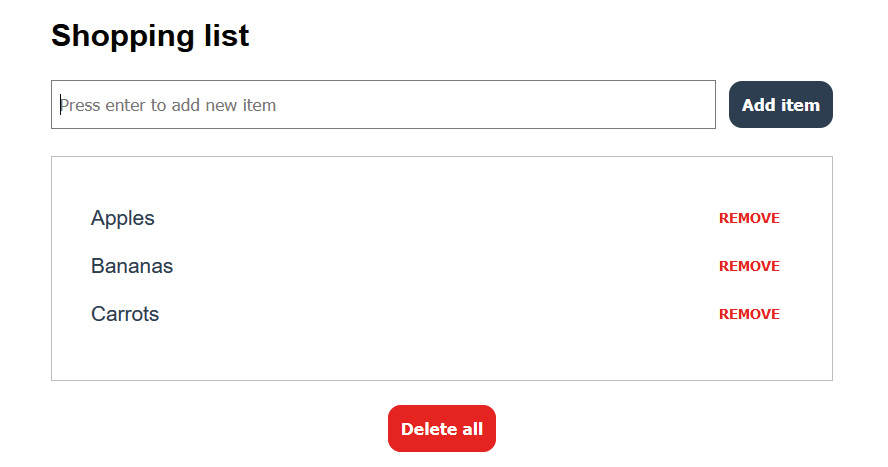

图 1.43：最终输出

注意

本活动的解决方案可以通过这个链接找到。

# 摘要

在本章中，你学习了如何使用命令提示符运行 Vue 项目以及如何创建基本的 Vue 组件。在这些 Vue 组件中，你可以构建模板，使用 Vue 的独特指令和 HTML 语法糖来遍历数据或使用条件语句控制 DOM 状态。通过使用数据属性和 `v-model` 绑定，我们探讨了响应式数据的关键概念，并在利用 Vue.js 方法和生命周期的实际示例中使其变得有用。

在下一章中，我们将学习更多高级的响应式数据概念，这些概念将建立在第一章的基础上：使用计算属性和监听器以及从外部源获取异步数据。
