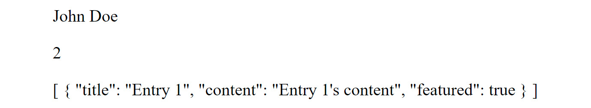
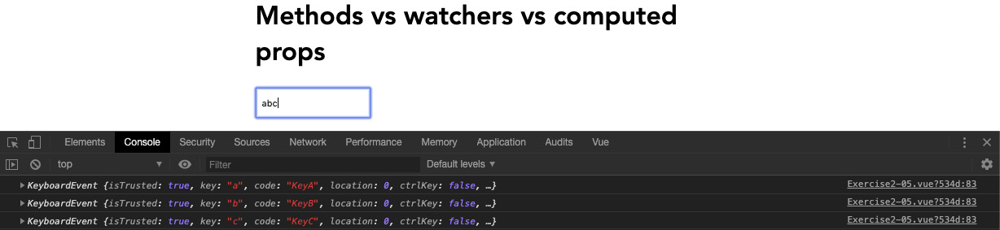
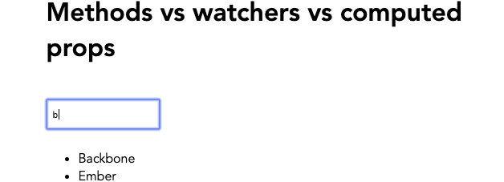
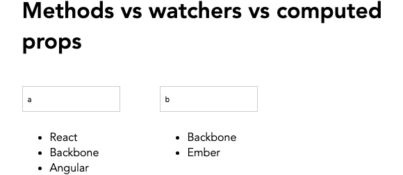
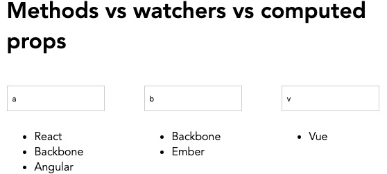
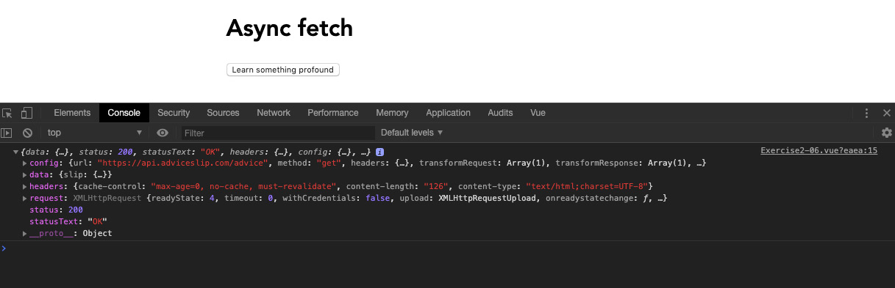
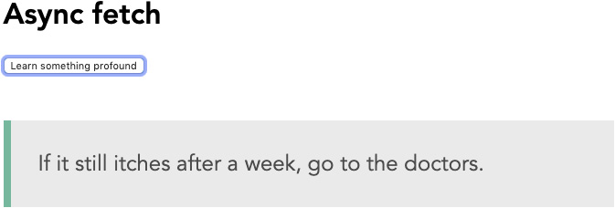
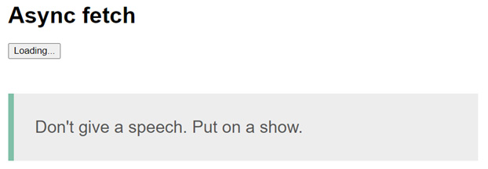

# 第二章：2. 处理数据

概述

在本章中，你将通过介绍更多控制 Vue 组件内部数据的方法来扩展上一章所学的内容。你将学习如何设置高级监视器来观察组件内部的数据变化，并利用 Vue 强大的反应性数据特性，计算数据属性，在模板中简洁地输出所需的数据。你还将能够利用异步方法为 Vue 组件获取数据。

到本章结束时，你将能够监视、管理和操作 Vue.js 组件中的各种数据源。

# 简介

在上一章中，你被介绍了单文件组件的概念和 Vue API，它提供了访问方法、指令和数据属性的方式。基于这些基础，我们将介绍计算属性，它们与数据属性一样，在 UI 中是反应性的，但可以执行强大的计算，并且它们的结果是可缓存的，这提高了你项目的性能。当构建电子商务商店时，你通常希望用户与你的 UI 交互时，反应性地计算定价和购物车项目，这在过去需要在不重新加载页面的情况下使用类似 `jQuery` 的方法来实现。Vue.js 通过引入计算属性，这些计算属性可以立即对前端用户输入做出反应，轻松处理这些常见的前端任务。

让我们从介绍可以即时计算的反应性数据开始，并了解如何调用和操作异步数据。

# 计算属性

计算属性是一种独特的数据类型，当属性中使用的源数据更新时，它们会反应性地更新。它们看起来可能像 Vue 方法，但实际上不是。在 Vue 中，我们可以通过将数据属性定义为计算属性来跟踪数据属性的变化，在这个属性中添加自定义逻辑，并在组件的任何地方使用它来返回一个值。Vue 会缓存计算属性，这使得它们在返回数据方面比数据属性或使用 Vue 方法更高效。

你可能使用计算属性的场景包括但不限于：

+   `total` 数据属性小于 `1`。每当向 `items` 数组添加新的数据时，`total` 的计算属性将更新：

    ```js
    <template>
        <div>{{errorMessage}}</div>
    </template>
    <script>
        export default {
            data() {
                return {
                    items: []
                }
            },
            computed: {
                total() {
                    return this.items.length
                },
                errorMessage() {
                    if (this.total < 1) {
                        return 'The total must be more than zero'
                    } else {
                        return ''
                    }
                }
            }
        }
    </script>
    ```

    这将生成以下输出：

    ```js
    The total must be more than zero
    ```

+   `formalName`，可以在你的组件中使用：

    ```js
    <template>
        <div>{{ formalName }}</div>
    </template>
    <script>
        export default {
            data() {
                return {
                    title: 'Mr.',
                    surname: 'Smith'
                }
            },
            computed: {
                formalName() {
                    return this.title + ' ' + this.surname
                }
            }
        }
    </script>
    ```

    这将生成以下输出：

    ```js
    Mr. Smith
    ```

+   `post`。你将使用简化和语义化的计算属性将信息输出到组件模板中。本例中的计算属性使得识别和使用作者的完整姓名、查看他们发布了多少帖子以及显示他们的特色帖子变得更容易：

    ```js
    <template>
        <div>
            <p>{{ fullName }}</p>
            <p>{{ totalPosts }}</p>
            <p>{{ featuredPosts }}</p>
        </div>
    </template>
    <script>
        export default {
            data() {
                return {
                    post: {
                        fields: {
                            author: {
                                firstName: 'John',
                                lastName: 'Doe'
                            },
                            entries: [{
                                    title: "Entry 1",
                                    content: "Entry 1's content",
                                    featured: true
                                },
                                {
                                    title: "Entry 2",
                                    content: "Entry 2's content",
                                    featured: false
                                }
                           ]
                        }
                    }
                }
            },
            computed: {
                fullName() {
                    // Return string
                    return this.post.fields.author.firstName + ' ' +                  this.post.fields.author.lastName
                },
                totalPosts() {
                    // Return number
                    return this.post.fields.entries.length
                },
                featuredPosts() {
                    // Return string
                    return this.post.fields.entries.filter(entry => {
                        // If featured is true, return the entry title
                        if (entry.featured) {
                            return entry
                        }
                    })
                }
            }
        }
    </script>
    ```

    这将生成以下输出：

    

    

图 2.1：计算名称输出

计算属性对于创建高性能组件的 Vue 开发者来说非常有价值。在下一个练习中，我们将探讨如何在 Vue 组件内部使用它。

## 练习 2.01：将计算数据集成到 Vue 组件中

在这个练习中，你将使用计算属性来帮助你减少在 Vue 模板内部需要编写的代码量，通过简洁地输出基本数据。要访问此练习的代码文件，请参阅 [`packt.live/3n1fQZY`](https://packt.live/3n1fQZY)。

1.  打开命令行终端，导航到 `Exercise 2.01` 文件夹，并按顺序运行以下命令：

    ```js
    > cd Exercise2.01/
    > code .
    > yarn
    > yarn serve
    ```

    前往 `https://localhost:8080`。

1.  创建一个用于第一个名称的输入字段，使用 `v-model` 将数据属性 `firstName` 绑定到该字段：

    ```js
    <input v-model="firstName" placeholder="First name" />
    ```

1.  创建第二个输入字段用于姓氏，并使用 `v-model` 将数据属性 `lastName` 绑定到该字段：

    ```js
    <input v-model="lastName" placeholder="Last name" />
    ```

1.  通过在 `data()` 函数中返回这些新的 `v-model` 数据属性，将它们包含在 Vue 实例中：

    ```js
    data() {
        return {
          firstName: '',
          lastName: '',
        }
      },
    ```

1.  创建一个名为 `fullName` 的计算数据变量：

    ```js
    computed: {
        fullName() {
          return `${this.firstName} ${this.lastName}`
        },
      },
    ```

1.  在你的输入字段下方，使用 `heading` 标签输出计算数据：

    ```js
    <h3 class="output">{{ fullName }}</h3>
    ```

    这将生成以下输出：

    ![图 2.2：计算数据的输出将显示姓名和姓氏]

    ![img/B15218_02_02.jpg]

图 2.2：计算数据的输出将显示姓名和姓氏

在这个练习中，我们看到了如何在计算数据属性内部编写表达式，使用 `v-model` 的数据，并将第一个名称和姓氏合并成一个可以重用的单个输出变量。

# 计算设置器

在上一个练习中，你看到了如何编写可维护和声明式的计算属性，这些属性是可重用和响应式的，并且可以在组件内的任何地方调用。在某些实际情况下，当调用计算属性时，你可能需要调用外部 API 来与该 UI 交互或更改项目中的其他数据。执行此功能的东西被称为设置器。

计算设置器在以下示例中演示：

```js
data() {
  return {
    count: 0
  }
},
computed: {
    myComputedDataProp: {
      // getter
      get() {
        return this.count + 1
      },
      // setter
      set(val) {
        this.count = val - 1
        this.callAnotherApi(this.count)
      },
    },
  },
}
```

默认情况下，计算数据仅是获取器，这意味着它只会输出你的表达式的结果。在此示例中，计算 `myComputedDataProp` 数据属性将在你的 Vue 组件中输出 `1`：

```js
  get() {
    return this.count + 1
  },
```

然后，使用计算属性中的设置器可以让你响应式地监听数据并运行一个回调（设置器），该回调包含从获取器返回的值，这些值可以可选地用于设置器中。

在此示例中，设置器将更新数据属性 `count` 到其新值（在获取器中反映）并调用组件内的一个方法 `callAnotherApi`。在这里，我们传递 `count` 数据属性来模拟将此信息发送到某个有用的地方：

```js
  set(val) {
    this.count = val - 1
    this.callAnotherApi(this.count)
  },
```

在以下练习中，你将了解到如何将计算数据作为获取器和设置器使用。

## 练习 2.02：使用计算设置器

在这个练习中，你将使用计算属性作为设置器和获取器，这两个属性在用户输入触发时都会输出表达式并设置数据。

要访问此练习的代码文件，请参阅[`packt.live/2GwYapA`](https://packt.live/2GwYapA)。

1.  打开命令行终端，导航到`Exercise 2.02`文件夹，并按顺序运行以下命令：

    ```js
    > cd Exercise2.02/
    > code .
    > yarn
    > yarn serve
    ```

    访问`https://localhost:8080`。

1.  创建一个`v-model`值绑定到名为`incrementOne`的计算数据值的输入字段，在 getter 中返回名为`count`的 Vue 数据变量的值，并在 setter 中设置`count`变量：

    ```js
    <template>
      <div class="container">
        <input type="number" v-model="incrementOne" />
        <h3>Get input: {{ incrementOne }}</h3>
      </div>
    </template>
    <script>
    export default {
      data() {
        return {
          count: -1,
        }
      },
      computed: {
        incrementOne: {
          // getter
          get() {
            return this.count + 1
          },
          // setter
          set(val) {
            this.count = val - 1
          },
        },
      },
    }
    </script>
    ```

    上述代码的输出将如下所示：

    

    图 2.3：计算 setter 和 getter 的第一步

1.  接下来，让我们再次使用 setter。我们将把新的`val`参数除以`2`，并将其保存到名为`divideByTwo`的新数据变量中：

    ```js
    <template>
      <div class="container">
        <input type="number" v-model="incrementOne" />
        <h3>Get input: {{ incrementOne }}</h3>
        <h5>Set division: {{ divideByTwo }}</h5>
      </div>
    </template>
    <script>
    export default {
      data() {
        return {
          count: -1,
          divideByTwo: 0,
        }
      },
    ...
    </script>
    ...
    ```

1.  将 setter 更新为除以`val`，并将这个新值绑定到`divideByTwo`变量：

    ```js
          set(val) {
            this.count = val - 1
            this.divideByTwo = val / 2
          },
    ```

    `divideByTwo`值的输出应生成从输入字段中输入的值的输出，如下所示：

    

图 2.4：divideByTwo 值的输出

在这个练习中，我们看到了如何通过将计算变量绑定到`v-model`来使用计算数据在我们的模板中反应性地获取和设置数据。

# 监听器

Vue `oldVal`和`newVal`。这可以帮助你在写入或绑定新值之前比较数据。监听器可以观察对象以及`string`、`number`和`array`类型。当观察对象时，只有当整个对象发生变化时，才会触发处理程序。

在*第一章*，*开始您的第一个 Vue 项目*中，我们介绍了在组件生命周期特定时间运行的生存周期钩子。如果将`immediate`键设置为`true`，则当组件初始化时，将运行此监听器。你可以通过包含键和值`deep: true`（默认为`false`）来监视任何给定对象中的所有键。为了清理你的监听器代码，你可以将处理程序参数分配给定义的 Vue 方法，这对于大型项目来说是最佳实践。

监听器补充了计算数据的用法，因为它们可以被动地观察值，不能像正常 Vue 数据变量那样使用，而计算数据必须始终返回一个值并且可以被查询。请记住，除非你不需要 Vue 的`this`上下文，否则不要使用箭头函数。

以下示例展示了`immediate`和`deep`可选键；如果`myDataProperty`对象中的任何键发生变化，它将触发控制台日志：

```js
watch: {
    myDataProperty: {
        handler: function(newVal, oldVal) {
          console.log('myDataProperty changed:', newVal, oldVal)
        },
        immediate: true,
        deep: true
    },
}
```

现在，让我们在监听器的帮助下设置一些新值。

## 练习 2.03：使用监听器设置新值

在这个练习中，你将使用监听器参数来监视数据属性的变化，然后使用这个监听器通过一个方法设置变量。

要访问此练习的代码文件，请参阅[`packt.live/350ORI4`](https://packt.live/350ORI4)。

1.  打开命令行终端，导航到`Exercise 2.03`文件夹，并按顺序运行以下命令：

    ```js
    > cd Exercise2.03/
    > code .
    > yarn
    > yarn serve
    ```

    前往`https://localhost:8080`。

1.  通过添加一个折扣和带有一些样式的`oldDiscount`数据变量来设置文档：

    ```js
    <template>
      <div class="container">
        <h1>Shop Watcher</h1>
        <div>
          Black Friday sale
          <strike>Was {{ oldDiscount }}%</strike>
          <strong> Now {{ discount }}% OFF</strong>
        </div>
      </div>
    </template>
    <script>
    export default {
      data() {
        return {
          oldDiscount: 0,
          discount: 5,
        }
      },
    }
    </script>
    <style lang="scss" scoped>
    .container {
      margin: 0 auto;
      padding: 30px;
      max-width: 600px;
      font-family: 'Avenir', Helvetica, sans-serif;
      margin: 0;
    }
    a {
      display: inline-block;
      background: rgb(235, 50, 50);
      border-radius: 10px;
      font-size: 14px;
      color: white;
      padding: 10px 20px;
      text-decoration: none;
    }
    </style>
    ```

1.  通过将`discount`属性添加到`watch`对象中，来观察`discount`属性。触发名为`updateDiscount`的方法。在方法内部，将`oldDiscount`数据属性设置为`this.discount + 5`：

    ```js
      watch: {
        discount(newValue, oldValue) {
          this.oldDiscount = oldValue
        },
      },
    ```

1.  包含一个将增加`discount`变量并触发观察者的方法：

    ```js
      methods: {
        updateDiscount() {
          this.discount = this.discount + 5
        },
      },
    ```

    现在添加一个换行符，并添加一个带有绑定到`updateDiscount`方法的`@click`指令的锚点元素：

    ```js
        <br />
        <a href="#" @click="updateDiscount">Increase Discount!</a>
    ```

    前一个命令的输出将如下所示：

    

图 2.5：一个商店观察者页面应该看起来像这样

在这个练习中，我们看到了如何使用观察者来观察和响应式地操作数据，当数据被 Vue 组件中的其他方法更改时。

在下一节中，我们将学习关于深度观察的概念。

# 深度观察概念

当使用 Vue.js 观察数据属性时，你可以有目的地观察对象内的键以进行更改，而不是观察对象本身的更改。这是通过将可选的`deep`属性设置为`true`来完成的：

```js
data() {
  return {
      organization: {
        name: 'ABC',
        employees: [
            'Jack', 'Jill'
        ]
      }
  }
},
watch: {
    organization: {
      handler: function(v) {
        this.sendIntercomData()
      },
      deep: true,
      immediate: true,
    },
  },
```

此示例将观察组织数据对象内部的所有可用键以进行更改，因此如果组织内的`name`属性发生变化，组织观察者将触发。

如果你不需要观察对象内的每个键，可以通过指定为`myObj.value`字符串来仅观察对象内的特定键以进行更改，这可能会更高效。例如，你可能允许用户编辑他们的公司名称，并且只有当该键被修改时，才将数据发送到 API。

在下面的示例中，观察者专门观察了`organization`对象的`name`键。

```js
data() {
  return {
      organization: {
        name: 'ABC',
        employees: [
            'Jack', 'Jill'
        ]
      }
  }
},
watch: {
    'organization.name': {
      handler: function(v) {
        this.sendIntercomData()
      },
      immediate: true,
    },
  },
```

我们看到了深度观察是如何工作的。现在，让我们尝试下一个练习，并观察数据对象的嵌套属性。

## 练习 2.04：观察数据对象的嵌套属性

在这个练习中，你将使用观察者来观察对象内的键，这些键将在用户在 UI 中触发方法时更新。

要访问此练习的代码文件，请参阅[`packt.live/353m59N`](https://packt.live/353m59N)。

1.  打开命令行终端，导航到`Exercise 2.04`文件夹，并按顺序运行以下命令：

    ```js
    > cd Exercise2.04/
    > code .
    > yarn
    > yarn serve
    ```

    前往`https://localhost:8080`。

1.  首先定义一个包含`price`、`label`和`discount`键的`product`对象。将这些值输出到模板中：

    ```js
    <template>
      <div class="container">
        <h1>Deep Watcher</h1>
        <div>
            <h4>{{ product.label }}</h4>
            <h5>${{ product.price }} (${{ discount }} Off)</h5>
        </div>
      </div>
    </template>
    <script>
    export default {
      data() {
        return {
          discount: 0,
          product: {
            price: 25,
            label: 'Blue juice',
          },
        }
      },
    }
    </script>
    <style lang="scss" scoped>
    .container {
      margin: 0 auto;
      padding: 30px;
      max-width: 600px;
      font-family: 'Avenir', Helvetica, sans-serif;
      margin: 0;
    }
    a {
      display: inline-block;
      background: rgb(235, 50, 50);
      border-radius: 10px;
      font-size: 14px;
      color: white;
      padding: 10px 20px;
      text-decoration: none;
    }
    </style>
    ```

1.  设置一个按钮，将修改产品的价格。通过添加一个带有绑定到`updatePrice`方法的`click`事件的按钮元素来实现这一点，该方法递减价格值：

    ```js
    <template>
    ...
        <a href="#" @click="updatePrice">Reduce Price!</a>
    ...
    </template>
    <script>
    ...
      methods: {
        updatePrice() {
          if (this.product.price < 1) return
          this.product.price--
        },
      },
    ...
    </script>
    ```

    当你点击按钮时，它应该像以下屏幕截图所示那样降低价格：

    

    图 2.6：显示蓝汁降价屏幕

1.  是时候观察嵌套观察者了。我们将观察 `product` 对象的 `price`，并增加 `discount` 数据属性：

    ```js
      watch: {
        'product.price'() {
          this.discount++
        },
      },
    ```

    现在，随着你减少 `price`，由于观察者的作用，`discount` 值将会上升：

    ![图 2.7 显示增加的折扣值]

    ![img/B15218_02_07.jpg]

图 2.7 显示增加的折扣值

在这个练习中，我们使用了观察者来观察对象中的键，然后使用或不用观察者解析的可选参数设置新数据。

# 方法与观察者与计算属性的比较

在 Vue.js 工具箱中，我们有方法、观察者和计算属性。你何时应该使用其中一个或另一个？

方法最适合在 `date.now()` 事件发生时做出反应。

在 Vue 中，你会组合一个由 `@click` 标记的动作，并引用一个方法：

```js
<template>
    <button @click="getDate">Click me</button>
</template>
<script>
export default {
    methods: {
        getDate() {
            alert(date.now())
        }
    }
}
</script>
```

计算属性最适合在响应数据更新或为我们在模板中组合复杂表达式时使用。在这种情况下，如果 `animalList` 数据发生变化，`animals` 计算属性也将通过从数组中切片第二个项目并返回新值来更新：

```js
<template>
      <div>{{ animals }}</div>
</template>
<script>
export default {
    data() {
        return {
            animalList: ['dog', 'cat']
        }
    },
    computed: {
          animals() {
              return this.animalList.slice(1)
          }
    }
}
</script>
```

它们的响应性使得计算属性非常适合从现有数据中组合新的数据变量，例如当你引用一个更大、更复杂对象的特定键时，有助于简化模板的可读性。在这个例子中，我们以两种不同的方式输出了作者两次。然而，请注意在 `authorName` 计算属性中，你可以干净地组合条件逻辑，而不会使 HTML 模板膨胀：

```js
<template>
    <div>
        <p id="not-optimal">{{ authors[0].bio.name }}</p>
        <p id="optimal">{{ authorName }}</p>
    </div>
</template>
<script>
export default {
    data() {
       return {
           authors: [
              {
                 bio: {
                    name: 'John',
                    title: 'Dr.',
                 }
              }
           ]
       }
    },
    computed: {
         authorName () {
              return this.authors ? this.authors[0].bio.name :                 'No Name'
         }
    }
}
</script>
```

当你需要监听数据属性的变化或对象中的特定数据属性变化，并执行一个动作时，应该使用数据观察者。由于观察者的独特 `newVal` 和 `oldVal` 参数，你可以观察一个变量直到达到某个值，然后才执行动作：

```js
<template>
    <div>
        <button @click="getNewName()">Click to generate name           </button>
        <p v-if="author">{{ author }}</p>
    </div>
</template>
<script>
    export default {
        data() {
            return {
                data: {},
                author: '',
            }
        },
        watch: {
            data: function(newVal, oldVal) {
                this.author = newVal.first
                alert(`Name changed from ${oldVal.first} to                   ${newVal.first}`)
            }
        },
        methods: {
            async getNewName() {
                await fetch('https://randomuser.me/api/').                  then(response => response.json()).then(data => {
                    this.data = data.results[0].name
                })
            },
        },
    }
</script> 
```

有了这个想法，我们将使用一个方法、计算属性和观察者来构建一个简单的搜索功能，以实现类似的效果并展示每种方法的能力。

## 练习 2.05：使用 Vue 方法、观察者和计算属性处理搜索功能

在这个练习中，你将创建一个组件，允许用户使用 Vue 中的三种不同方法搜索数据数组。到练习结束时，你将能够亲眼看到每种不同方法是如何工作的。

要访问此练习的代码文件，请参阅 [`packt.live/32iDJVe`](https://packt.live/32iDJVe)。

1.  打开命令行终端，导航到 `Exercise 2.05` 文件夹，并按顺序运行以下命令：

    ```js
    > cd Exercise2.05/
    > code .
    > yarn
    > yarn serve
    ```

    前往 `https://localhost:8080`。

1.  在 `data` 对象中，添加一个框架列表数组，分配给 `frameworkList` 值。包括一个空字符串作为输入键和一个空数组作为 `methodFilterList` 键：

    ```js
    <script>
    export default {
      data() {
        return {
          // Shared
          frameworkList: [
            'Vue',
            'React',
            'Backbone',
            'Ember',
            'Knockout',
            'jQuery',
            'Angular',
          ],
          // Method
          input: '',
          methodFilterList: [],
        }
      },
    }
    </script>
    ```

1.  在模板中，包括一个`div`容器、一个`title`和一个`column`容器。在这个`column`容器内部，创建一个绑定到`v-model`输入的输入框，并将输入框上的`keyup`事件绑定到`searchMethod`方法：

    ```js
    <template>
      <div class="container">
        <h1>Methods vs watchers vs computed props</h1>
        <div class="col">
          <input
            type="text"
            placeholder="Search with method"
            v-model="input"
            @keyup="searchMethod"
          />
          <ul>
            <li v-for="(item, i) in methodFilterList" :key="i">          {{ item }}</li>
          </ul>
        </div>
      </div>
    </template>
    <script>
    export default {
      data() {
        return {
          // Shared
          frameworkList: [
            'Vue',
            'React',
            'Backbone',
            'Ember',
            'Knockout',
            'jQuery',
            'Angular',
          ],
          // Method
          input: '',
          methodFilterList: [],
        }
      },
      methods: {
        searchMethod(e) {
         console.log(e)
        },
      },
    }
    </script>
    <style lang="scss" scoped>
    .container {
      margin: 0 auto;
      padding: 30px;
      max-width: 600px;  font-family: 'Avenir', Helvetica, Arial, sans-serif;
    }
    .col {
      width: 33%;
      height: 100%;
      float: left;
    }
    input {
      padding: 10px 6px;
      margin: 20px 10px 10px 0;
    }
    </style>
    ```

    前面代码的输出将如下所示：

    

    图 2.8：控制台应输出关键输入

1.  在我们的`searchMethod`方法中，编写一个过滤表达式，将`methodFilterList`数据属性绑定到基于输入值的过滤`frameworkList`数组。在`created()`生命周期钩子上触发`searchMethod`，以便当组件加载时，有一个列表存在：

    ```js
    <script>
    export default {
      ...
      created() {
        this.searchMethod()
      },
      methods: {
        searchMethod() {
          this.methodFilterList = this.frameworkList.filter(item =>
            item.toLowerCase().includes(this.input.toLowerCase())
          )
        },
      },
    }
    </script>
    ```

    运行前面的代码后，你将能够像*图 2.9*中所示的那样过滤列表：

    

    图 2.9：你现在应该能够使用 Vue 方法过滤列表

1.  让我们使用计算属性来创建一个过滤器。包括一个新的数据属性`input2`，并创建一个名为`computedList`的计算属性，它返回与`searchMethod`相同的过滤器，但不需要绑定到另一个数据属性：

    ```js
    <template>
      <div class="container">

       ...
        <div class="col">
          <input type="text" placeholder="Search with computed"         v-model="input2" />
          <ul>
            <li v-for="(item, i) in computedList" :key="i">          {{ item }}</li>
          </ul>
        </div>
       ...
      </div>
    </template>
    <script>
    export default {
      data() {
        return {
           ...
          // Computed
          input2: '',
          ...

        }
      },
    ...
      computed: {
        computedList() {
          return this.frameworkList.filter(item => {
            return item.toLowerCase().includes(this.input2\.          toLowerCase())
          })
        },
      },
    ...
    }
    </script>
    ```

    现在你可以借助计算属性过滤框架的第二列，如下面的截图所示：

    

    图 2.10：使用计算属性过滤框架的第二列

1.  最后，让我们使用一个观察者来过滤相同的列表。包含一个带有空字符串的`input3`属性和一个带有空数组的`watchFilterList`属性。同时创建一个第三列`div`，其中包含一个绑定到`input3`的`v-model`的输入框，以及输出`watchFilterList`数组的列表：

    ```js
    <template>
      <div class="container">
        …
        <div class="col">
          <input type="text" placeholder="Search with watcher"         v-model="input3" />
          <ul>
            <li v-for="(item, i) in watchFilterList" :key="i">          {{ item }}</li>
          </ul>
        </div>
      </div>
    </template>
    <script>
    export default {
      data() {
        return {
          ...
          // Watcher
          input3: '',
          watchFilterList: [],
        }
      },
     ...
    </script>
    ```

1.  创建一个观察者，它监视`input3`属性的变化，并将`frameworkList`过滤的结果绑定到`watchFilterList`数组。将`input3`的立即键设置为`true`，以便它在组件创建时运行：

    ```js
    <script>
    export default {
    ...
      watch: {
        input3: {
          handler() {
            this.watchFilterList = this.frameworkList.filter(item =>
              item.toLowerCase().includes(this.input3.toLowerCase())
            )
          },
          immediate: true,
        },
      },
    ...
    }
    </script>
    ```

    在观察者的帮助下，你现在应该能够过滤第三列，如下面的截图所示：

    

图 2.11：在第三列使用观察者过滤列表

在这个练习中，我们看到了如何使用方法、计算属性和观察者来实现过滤列表。每个都有自己的优点、缺点和使用场景，具体取决于你想要在应用程序中实现什么。

# 异步方法和数据获取

JavaScript 中的异步函数是通过 `async` 函数语法定义的，并返回一个 `AsyncFunction` 对象。这些函数通过事件循环异步操作，使用隐式的 promise（一个可能在未来返回结果的对象）。Vue.js 使用这种行为允许你在方法中包含 `async` 关键字来声明异步代码块。然后，你可以链式调用 `then()` 和 `catch()` 函数，或者在 Vue 方法中使用 `{}` 语法并返回结果。

`Axios` 是一个流行的 JavaScript 库，允许你使用 Node.js 进行外部数据请求。它具有广泛的浏览器支持，使其在执行 `HTTP` 或 API 请求时成为一个多才多艺的库。我们将在下一个练习中使用这个库。

## 练习 2.06：使用异步方法从 API 获取数据

在这个练习中，你将异步从外部 API 源获取数据，并使用计算属性在前端显示它。

要访问此练习的代码文件，请参阅 [`packt.live/353md9h`](https://packt.live/353md9h)。

1.  打开命令行终端，导航到 `Exercise 2.06` 文件夹，并运行以下命令来安装 `axios`：

    ```js
    > cd Exercise2.06/
    > code .
    > yarn
    > yarn add axios
    > yarn serve
    ```

    访问 `https://localhost:8080`。

1.  让我们从将 `axios` 导入我们的组件并创建一个名为 `getApi()` 的方法开始。使用 `axios` 调用 [`api.adviceslip.com/advice`](https://api.adviceslip.com/advice) 的响应，并使用 `console.log` 输出结果。包括一个按钮，将其 `click` 事件绑定到 `getApi()` 调用：

    ```js
    <template>
      <div class="container">
        <h1>Async fetch</h1>
        <button @click="getApi()">Learn something profound</button>
      </div>
    </template>
    <script>
    import axios from 'axios'
    export default {
      methods: {
        async getApi() {
          return   axios.get('https://api.adviceslip.com/advice').        then((response) => {
            console.log(response)
          })
        },
      },
    }
    </script>

    <style lang="scss" scoped>
    .container {
      margin: 0 auto;
      padding: 30px;
      max-width: 600px;
      font-family: 'Avenir', Helvetica, Arial, sans-serif;
    }
    blockquote {
      position: relative;
      width: 100%;
      margin: 50px auto;
      padding: 1.2em 30px 1.2em 30px;
      background: #ededed;
      border-left: 8px solid #78c0a8;
      font-size: 24px;
      color: #555555;
      line-height: 1.6;
    }
    </style>
    ```

    上述代码的输出将如下所示：

    

    图 2.12：显示控制台中一个非常大的对象的屏幕

1.  我们只对 `response` 对象内部的数据对象感兴趣。将此数据对象分配给一个名为 `response` 的 Vue 数据属性，我们可以重用它：

    ```js
    export default {
      data() {
        return {
          axiosResponse: {},
        }
      },
      methods: {
        async getApi() {
          return axios.get('https://api.adviceslip.com/advice').        then(response => {
            this.axiosResponse = response.data
          })
        },
      },
    }
    ```

1.  使用计算属性输出 `response` 属性对象内部的 `quote`，该计算属性将在 `response` 属性更改时更新。使用三元运算符执行条件语句以检查 `response` 属性是否包含 `slip` 对象，以避免错误：

    ```js
    <template>
      <div class="container">
        <h1>Async fetch</h1>
        <button @click="getApi()">Learn something profound</button>
        <blockquote v-if="quote">{{ quote }}</blockquote>
      </div>
    </template>
    <script>
    import axios from 'axios'
    export default {
      data() {
        return {
          axiosResponse: {},
        }
      },
      computed: {
        quote() {
          return this.axiosResponse && this.axiosResponse.slip
            ? this.axiosResponse.slip.advice
            : null
        },
      },
      methods: {
        async getApi() {
          return axios.get('https://api.adviceslip.com/advice').        then(response => {
            this.axiosResponse = response.data
          })
        },
      },
    }
    </script>
    ```

    *图 2.13* 显示了上述代码生成的输出：

    

    图 2.13：显示模板中引用输出的屏幕

1.  作为最后的润色，包括一个 `loading` 数据属性，以便用户可以看到 UI 是否正在加载。默认将 `loading` 设置为 `false`。在 `getApi` 方法中，将 `loading` 设置为 `true`，然后在 `then()` 链中使用 `setTimeout` 函数在 4 秒后将它设置回 `false`。你可以使用三元运算符在加载状态和默认状态之间切换按钮文本：

    ```js
    <template>
      <div class="container">
        <h1>Async fetch</h1>
        <button @click="getApi()">{{
          loading ? 'Loading...' : 'Learn something profound'
        }}</button>
        <blockquote v-if="quote">{{ quote }}</blockquote>
      </div>
    </template>
    <script>
    import axios from 'axios'
    export default {
      data() {
        return {
          loading: false,
          axiosResponse: {},
        }
      },
      computed: {
        quote() {
          return this.axiosResponse && this.axiosResponse.slip
            ? this.axiosResponse.slip.advice
            : null
        },
      },
      methods: {
        async getApi() {
          this.loading = true
          return axios.get('https://api.adviceslip.com/advice').        then(response => {
            this.axiosResponse = response.data

            setTimeout(() => {
              this.loading = false
            }, 4000);
          })
        },
      },
    }
    </script>
    ```

上述代码的输出将如下所示：



图 2.14：在模板中显示加载按钮状态输出的屏幕

在这个练习中，我们看到了如何从外部源获取数据，将其分配给计算属性，在我们的模板中显示它，并给我们的内容应用加载状态。

## 活动二.01：使用 Contentful API 创建博客列表

在这个活动中，我们将构建一个博客，列出来自 API 源的文章。这将通过使用所有基本的`async`方法从 API 获取远程数据以及使用计算属性来组织深层嵌套的对象结构来测试您对 Vue 的了解。

`Contentful`是一个无头**内容管理系统**（**CMS**），允许您将内容与代码存储库分开管理。您可以使用 API 在所需的任何代码存储库中消费此内容。例如，您可能有一个作为信息主要来源的博客网站，但您的客户想要一个独立页面的不同域名，该页面只拉取最新的特色文章。使用无头 CMS 本质上允许您开发这两个独立的代码库，并使用相同的数据源。

这个活动将使用无头 CMS `Contentful`。访问密钥和端点将在解决方案中列出。

以下步骤将帮助您完成活动：

1.  使用 Vue CLI 创建一个使用`babel`预设的新项目。

1.  将`contentful`依赖项安装到您的项目中。

1.  使用计算属性从 API 响应中输出深层嵌套的数据。

1.  使用`data`属性输出用户的`name`、`职位名称`和`描述`。

1.  使用`SCSS`来设置页面样式。

预期结果是以下内容：


图 2.15：使用 Contentful 博客文章的预期结果

注意

该活动的解决方案可以通过此链接找到。

活动完成后，您应该能够使用`async`方法从 API 源将远程数据拉入您的 Vue 组件。您会发现计算属性是一种将信息分解成更小的可重用数据块的高级方式。

# 摘要

在本章中，您被介绍了 Vue.js 的计算和观察属性，这些属性允许您观察和控制响应式数据。您还看到了如何使用`axios`库异步从 API 获取数据，以及如何使用计算属性将数据扁平化，以便在 Vue 模板中使用。通过构建使用每种方法的搜索功能，演示了使用方法和计算以及观察属性之间的区别。

下一章将介绍 Vue CLI，并展示如何管理并调试使用这些计算属性和事件的 Vue.js 应用程序。
