# 第七章：7. 动画与过渡

概述

本章将介绍如何在 Vue 应用程序中创建过渡和动画效果。在本章中，你将探索 Vue 过渡的基础知识。我们将涵盖单元素过渡、使用过渡组来动画化元素列表，以及使用过渡路由创建全页动画。你还将学习如何创建自己的过渡，以及如何与外部库结合使用以实现各种动画。

到本章结束时，你将准备好为任何 Vue 应用程序实现和处理基本过渡和动画效果。

# 简介

在 *第六章*，*路由* 中，你学习了路由以及如何使用 Vue Router 设置基本的路由导航系统。通过平滑地实现不同路由之间的过渡，或者在用户与应用程序交互时为应用程序提供适当的动画效果，这是达到更高层次的目标。虽然页面之间的平滑过渡提供了更好的用户体验，但如加载或内容渲染方式等动画效果可以保持用户与应用程序的互动。因此，我们接下来的重点是 Vue 中的过渡和动画，以及我们可以如何将这些概念应用到我们的 Vue 应用程序中。

# Vue 过渡

与其他框架不同，Vue.js 为开发者提供了内置支持，用于动画化 Vue.js 应用程序，包括过渡和动画。过渡的实现方式简单直接，开发者可以轻松配置并将其添加到他们的应用程序中。Vue.js 过渡机制支持 CSS 过渡、使用 JavaScript 的程序性操作，甚至可以与第三方动画库（如 GSAP 或 Animate.css）集成。

首先，我们将讨论过渡和动画之间的区别。当组件（或元素）从一个状态移动到另一个状态时，就会发生过渡，例如在按钮上悬停、从一个页面导航到另一个页面、显示弹出模态框等。同时，动画类似于过渡，但并不局限于仅两个状态。了解过渡的基础知识将帮助你开始学习动画。

## 过渡元素

在此示例中，为了为单个组件或元素启用过渡，Vue.js 提供了内置的 `transition` 组件，它将围绕目标元素包裹，如 `./src/components/HelloWorld.vue` 中所示：

```js
<transition name="fade-in">
  <h1>{{ msg }}</h1>
</transition>
```

`transition` 组件为任何目标元素或组件添加了两个过渡状态——`enter` 和 `leave`，包括具有条件渲染（`v-if`）和条件显示（`v-show`）的组件。

此组件接收一个名为 `name` 的属性，它代表过渡的名称——在本例中是 `fade-in`——也是过渡类名的前缀，将在下面讨论。

## 过渡类

Vue.js 实现了基于 CSS 和类的`leave`/`enter`过渡效果，因此过渡将通过一组类选择器应用于目标组件。

这些类选择器都有`v-`前缀，以防在`transition`组件上没有提供`name`属性。还有一些标准类被分为两组。

第一组过渡类是用于`enter`过渡的，当组件首次显示时。以下是一个`enter`过渡类的列表：

`v-enter`（或`<name>-enter`）：这是起始状态，在组件添加或更新之前添加到组件上。这个类将在过渡完成后从结束状态中移除。在`src/components/HelloWorld.vue`的`<style>`部分，我们将`.fade-in-enter`起始状态设置为完全隐藏，使用`opacity: 0`：

```js
<style>
.fade-in-enter {
  opacity: 0;
}
</style>
```

`v-enter-active`（或`<name>-enter-active`）：这个类定义了组件在活动进入过渡时的延迟、持续时间和缓动曲线。它将在组件插入之前添加到组件上，在整个进入阶段应用于组件，并在效果完成后移除。

让我们添加`.fade-in-enter-active`，它将在 3 秒内将透明度状态进行过渡：

```js
.fade-in-enter-active {
  transition: opacity 3s easein;
}
```

`v-enter-to`（或`<name>-enter-to`）：这是进入的最后一个子状态，其中在组件插入后添加效果帧，并在效果完成后移除。在我们的例子中，我们不需要定义任何内容，因为此状态的`opacity`值应该是`1`。

第二组类包括`leave`过渡，当组件被禁用或从视图中移除时触发：

+   `v-leave`（或`<name>-leave`）：这是离开过渡的起始状态。类似于`v-enter-to`，我们不需要为此状态定义样式效果。

+   `v-leave-active`（或`<name>-leave-active`）：这个类在离开阶段应用，其行为类似于`v-enter-active`。由于我们想要实现淡出效果，我们将使用与`fade-in-enter-active`相同的样式：

    ```js
    .fade-in-enter-active, .fade-in-leave-active {
      transition: opacity 3s ease-in;
    }
    ```

+   `v-leave-to`（或`<name>-leave-to`）：这是与`v-enter-to`具有相似行为的结束状态。由于组件将从视图中消失，我们将重用为`enter`阶段的开始阶段定义的样式：

    ```js
    .fade-in-enter, .fade-in-leave-to {
      opacity: 0;
    }
    ```

以下截图是到目前为止描述的所有`transition`状态的总结：

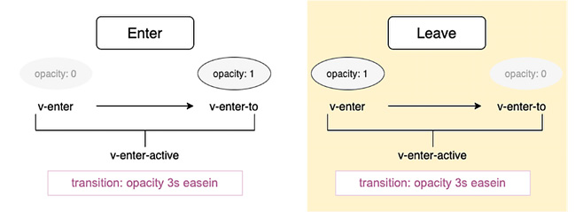

图 7.1：过渡阶段图解

在本节中，我们探讨了进入和离开的三个不同过渡状态，还介绍了使用过渡状态在用户按下按钮时缓慢淡入一些文本的方法。

## 组件的动画

由于动画基本上是过渡的扩展形式（具有超过两个状态），因此它的应用方式与过渡相同，唯一的区别是`v-enter`只会在由 Vue.js 触发的`animationend`事件上被移除。

注意

`animationend`是一个 DOM 事件，当 CSS 动画完成执行时触发，条件是目标元素仍然存在于 DOM 中，并且动画仍然附加到该元素上。

在下一个示例中，在`<template>`部分，我们可以定义一个新的名为`slide`的过渡，使用动画 CSS 效果作为显示 msg 的`h1`元素的包装器。这个过渡提供了从左侧滑到中心在进入时的动画效果，在离开时则相反。

要开始，使用以下命令使用 CLI 生成一个`vue`起始项目：

```js
vue create hello-world
```

接下来，打开项目并进入`src/components/HelloWorld.vue`，然后修改现有的`<h1>{{msg}}</h1>`代码：

```js
<transition name="slide">
  <h1 v-if="show">{{ msg }}</h1>
</transition>
```

在`<style>`中，我们需要为`slide`动画效果定义关键帧：

```js
@keyframes slide {
  0% { transform: translateX(-100px)}
  100% { transform: translateX(0px)}
}
```

相关的过渡类将被分配以下样式：

```js
.slide-enter, .slide-leave-to {
  transform: translateX(-100px);
}
.slide-enter-active {
  animation: slide 5s;
}
.slide-leave-active {
  animation: slide 5s reverse;
}
```

这意味着在进入的起始阶段和离开的结束阶段，文本位置将位于页面指定位置`-100px`处。浏览器将使用滑动关键帧在 5 秒内对元素进行动画处理，并且在离开的活跃状态下，动画将正好与进入活跃阶段的动画相反。

你还想要添加一个显示数据变量。你可以通过修改现有的导出来实现，如下所示：

```js
<script>
export default {
  name: 'HelloWorld',
  data: {
    showHello: true,
  },
  props: {
    msg: String
  }
}
</script>
```

有了这些，我们就实现了我们的动画。接下来是下一个挑战：如果我们想将不同的动画或过渡效果组合到进入和离开状态，或者为这些状态使用外部 CSS 库，该怎么办？让我们看看自定义过渡类。

## 自定义过渡类

在本节中，我们再次从使用 vue create hello-world 创建的默认起始项目开始。我们不是设置过渡名称，让 Vue.js 机制填充所需的类名，而是可以通过以下属性提供自定义类，并替换传统默认值。

对于进入状态，使用以下代码：

+   `enter-class`

+   `enter-active-class`

+   `enter-to-leave`

对于离开状态，使用以下代码：

+   `leave-class`

+   `leave-active-class`

+   `leave-to-class`

我们将从一个基于之前示例的文件开始，但现在我们将对进入状态的活跃阶段使用`swing`动画效果，对离开状态的活跃阶段使用`tada`效果。我们将在`transition`组件中定义`enter-active-class`和`leave-active-class`属性，如下所示：

```js
<transition
      name="slide"
      enter-active-class="swing"
      leave-active-class="tada"
    >
      <h1 v-if="show">{{ msg }}</h1>
    </transition>
```

在`<style>`部分，我们只需要定义`.tada`和`.swing`，无需任何后缀模式：

```js
.tada {
  animation-fill-mode: both;
  animation-name: tada;
  animation-duration: 3s;
}
.swing {
  animation-fill-mode: both;
  transform-origin: top center;
  animation-duration: 2s;
  animation-name: swing;
}
```

然后添加专用的关键帧来设置动画：

```js
@keyframes tada {
  0% {
    transform: scale3d(1, 1, 1);
 }
  10%, 20% {
    transform: scale3d(.8, .9, .8) rotate3d(0, 0, 1, -5deg);
  }
  30%, 50%, 70%, 90% {
    transform: scale3d(1.1, 1.1, 1.1) rotate3d(0, 0, 1, 5deg);
  }
  40%, 60%, 80% {
    transform: scale3d(1.1, 1.1, 1.1) rotate3d(0, 0, 1, -5deg);
  }
  100% {
    transform: scale3d(1, 1, 1);
  }
@keyframes swing {
  20% { transform: rotate(5deg); }
  40% { transform: rotate(-10deg); }
  60% { transform: rotate(5deg); }
  80% { transform: rotate(-10deg); }
  100% { transform: rotate(0deg); }
}
```

你还想要添加一个显示数据变量。你可以通过修改现有的`export`来实现，如下所示：

```js
<script>
export default {
  name: 'HelloWorld',
  data: {
    showHello: true,
  },
  props: {
    msg: String
  }
}
</script>
```

当我们使用`yarn serve`命令运行应用程序时，我们将为进入和离开设置单独的动画。以下截图显示了屏幕现在的样子：


图 7.2：动作上的摆动动画效果

你应该看到欢迎文本在旋转的同时缩小，从*图 7.2*中显示的过渡到以下：

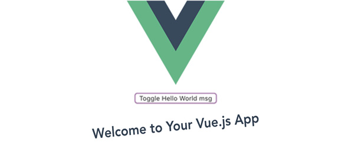


图 7.3：动作上的 tada 动画效果

在本节中，我们探讨了创建自定义过渡效果。作为示例，我们创建了`swing`和`tada`。我们通过在样式表中定义过渡类并为每个效果添加关键帧来实现这一点。这种技术可以用来创建各种自定义过渡效果。在下一节中，我们将探讨 JavaScript 钩子以及它们如何用于更复杂的动画。

# JavaScript 钩子

如我们在上一节所学，我们可以使用自定义过渡类来集成外部第三方 CSS 动画库以实现样式效果。然而，有些外部库不是基于 CSS 的，而是基于 JavaScript 的，例如**Velocity.js**或**GreenSock Animation API**（**GSAP**），这些库需要通过 JavaScript 事件和外部动画处理程序设置钩子。

为了在 Vue 应用程序中使用 Velocity.js 或 GSAP 库，你需要分别使用`npm install`或`yarn add`命令安装它们，如下所示：

+   要安装 Velocity.js，请使用以下命令：

    ```js
    npm install velocity-animate 
    #Or
    yarn add velocity-animate
    ```

+   要安装 GSAP，请使用以下命令：

    ```js
    npm install gsap
    #or
    yarn add gsap
    ```

作为 Vue.js 组件，`transition`组件支持将自定义处理程序绑定到事件列表的 props 上。考虑以下示例：

```js
<transition
  @before-enter="beforeEnter"
  @enter="enter"
  @leave="leave"
>
  <h1 v-if="show">{{ msg }}</h1>
</transition>
```

我们将动画方法程序性地绑定到过渡元素的相关事件上：

+   `beforeEnter`是在组件插入之前的动画状态——类似于 v-enter 阶段。

+   `enter`用于整个进入阶段的动画——类似于 v-enter-active 阶段。

+   `leave`用于整个离开阶段的动画。这类似于 v-leave-active 阶段。

我们需要在`HelloWorld.vue`组件配置的`methods`部分中定义这些事件处理程序：

```js
<script>
export default {
  name: 'HelloWorld',
  props: {
    msg: String
  },
  data() {
    return {
      show: false
    }
  },
  methods: {
    beforeEnter() {
      //...
    },
    enter() {
      //...
    },
    leave() {
      //...
    }
  }
}
</script>
```

在本例中，我们将使用 GSAP 库提供的`TweenMax`和`TimelineMax`功能来创建我们的动画事件，如下所示：

```js
    beforeEnter(el) {
      el.style.opacity = 0;
    },
    enter(el, done) {
      TweenMax.to(el, 2, {
        opacity: 1,
        fontSize: '20px',
        onComplete: done
      })
    },
    leave(el, done) {
      const tl = new TimelineMax({
        onComplete: done
      });

      tl.to(el, {rotation: -270,duration: 1, ease: "elastic"})
        .to(el, {rotation: -360})
        .to(el, {
          rotation: -180,
          opacity: 0
        });
    }
```

对于`TweenMax`和`TimelineMax`，`to()`动画触发方法的语法相当简单：

```js
TimelineMax.to(<element>, <effect properties>, <time position>)
TweenMax.to(<element>, <effect properties>, <time position>)
```

大多数效果属性与 CSS 的语法相似，因此它们不难学习和使用。此外，我们必须将事件发射器接收到的 `done` 回调传递给 `onComplete`，以确保它被触发，并且钩子不会同步调用。另外，请注意，所有事件发射器也传递 `el`，它是当前过渡元素的指针，用于使用。

除了这三个事件之外，我们还可以绑定其他事件，具体取决于动画和过渡的复杂度，例如 `afterEnter`、`enterCancelled`、`beforeLeave`、`afterLeave` 和 `leaveCancelled`。

请注意，如果你仅使用 JavaScript 进行过渡，强烈建议添加 `v-bind:css="false"`（或 `:css="false"`）。这是为了防止 Vue.js 侦测并应用任何相关的 CSS，从而避免意外地发生过渡干扰：

```js
<transition
      @before-enter="beforeEnter"
      @enter="enter"
      @leave="leave"
      :css="false"
    >
      <h1 v-if="show">{{ msg }}</h1>
```

在本节中，我们探讨了如何使用外部 JavaScript 库进行动画。我们使用 GSAP 库实现了一个简单的缓动，利用其 `TweenMax` 和 `TimelineMax` 函数。

现在，让我们学习如何使用动画效果添加新消息。

## 练习 7.01：使用动画效果添加新消息

我们将创建一个消息编辑器，用户可以在其中编写和提交新消息。新消息将立即通过从右向左的滑动动画效果显示。

要访问此练习的代码文件，请参阅 [`packt.live/338ZXJv`](https://packt.live/338ZXJv)：

注意

在开始此练习之前，运行 `vue create` 命令以生成 Vue 入门项目。

1.  首先创建一个名为 `MessageEditor.vue` 的新组件，位于 `/src/components/` 文件夹中。在这个组件中，`<template>` 将包含两个部分，`textarea` 用于编写新消息，并有一个提交按钮，以及 `section` 用于显示新编写的消息：

    ```js
    <template>
      <div>
        <div class="editor--wrapper">
          <textarea ref="textArea" class="editor">
          </textarea>
          <button @click="onSendClick()" class="editor--submit">
          Submit</button>
        </div>
        <section v-if="message" class="message--display">
          <h4>Your saved message: </h4>
          <span>{{message}}</span>
        </section>
      </div>
    </template>
    ```

1.  接下来，将整个消息部分包裹在 `transition` 元素中，为我们的动画做准备。

    ```js
    <transition name="slide-right">
          <section v-if="message" class="message--display">
            <h4>Your saved message: </h4>
            <span>{{message}}</span>
          </section>
        </transition>
    ```

1.  我们需要一个具有更改消息文本方法的 `export` 组件。使用以下代码添加它：

    ```js
    <script>
    export default {
      data() {
        return {
          message: ''
        }
      },
      methods: {
        onSendClick() {
          const message = this.$refs.textArea.value;
          this.message = message;
          this.$refs.textArea.value = '';
        }
      }
    }
    </script>
    ```

1.  接下来，我们将使用以下命令在我们的 `style` 部分使用 `@keyframes` 定义 `slide-right` 动画效果：

    ```js
    <style scoped>
    @keyframes slide-right {
      100% {
        transform: translateX(0)
      }
    }
    </style>
    ```

    这意味着它将具有此效果的元素在水平方向上（在 *X* 轴上）重新定位到原始起始点，（0,0）。

1.  现在，我们将定义两个类，一个用于从左到右滑动（`slide-right`），另一个用于相反方向（`slide-left`）：

    ```js
    .slide-right {
      animation: 1s slide-right 1s forwards;
      transform:translateX(-100%);
      transition: border-top 2s ease;
    }
    .slide-left {
      animation: 1s slide-right 1s reverse;
      transform:translateX(-100%);
    }
    ```

1.  将 `border-top:0` 作为 `slide-right` 过渡的起始点，以便对这一部分的 `border-top` 产生一点效果：

    ```js
    .slide-right-enter {
      border-top: 0;
    }
    ```

1.  接下来，利用我们学到的关于自定义过渡类的知识，将 `enter-active` 绑定到 `slide-right` 类，并将 `leave-active` 类似地绑定到 `slide-left`。这三个属性被添加到在 *步骤 2* 中创建的 `transition` 元素中：

    ```js
    <transition
          name="slide-right"
          enter-active-class="slide-right"
          leave-active-class="slide-left"
        >
    Add CSS stylings using CSS Flexbox to make the editor look nice:
    .editor--wrapper {
      display: flex;
      flex-direction: column;
    }
    .editor {
      align-self: center;
      width: 200px;
    }
    .editor--submit {
      margin: 0.5rem auto;
      width: 50px;
      align-self: center;
    }
    .message--display {
      margin-top: 1rem;
      border-top: 1px solid lightgray;
    }
    ```

1.  使用 `yarn serve` 命令运行应用程序。

    这将生成一个组件，将显示带有滑动动画效果的输入消息，如图 *图 7.4* 所示：

    

图 7.4：消息编辑器文本区域

以下截图显示了消息组件具有从左到右滑动动画效果的外观：

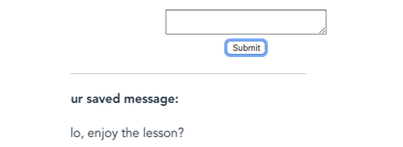

图 7.5：用于显示的消息过渡

从左侧动画进入后，组件应停在居中位置，如图 *图 7.6* 所示：

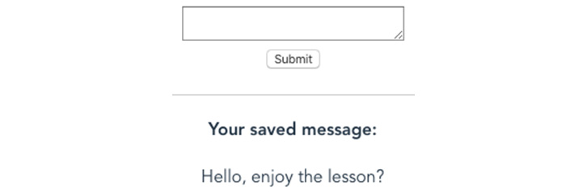

图 7.6：动画后的消息

这个练习帮助您熟悉 CSS 中的某些转换效果，例如 `translateX` 和 `transition`。它还展示了在 Vue 应用程序中添加动画是多么容易。对于同一组中的多个元素，如列表，过渡怎么办？我们将在下一个主题中找到答案。

# 过渡组

到目前为止，我们已经介绍了 Vue 过渡元素的基本知识，适用于简单组件和元素，同时支持自定义 CSS 仅和 JavaScript 仅动画。接下来，我们将探讨如何使用 `v-for` 在一组组件上应用过渡，例如，同时渲染的项目列表。 

Vue.js 为此特定目的提供了另一个组件，即 `transition-group` 组件。

我们现在假设我们有一个显示在源上的消息列表，我们希望为此列表添加一个过渡效果，以便在屏幕上每个项目出现时产生一些效果。在 `./src/components/Messages.vue` 文件中，让我们用 `transition-group` 组件包裹主要容器，并传递我们之前为 `transition` 组件使用的相同属性。它们具有相同的属性类型：

```js
<transition-group name="fade">
  <p v-for="message in messages" :key="message" v-show="show">
    {{message}}
  </p>
</transition-group>
```

我们需要为传递为 `fade` 的过渡效果设置 CSS 样式效果，遵循与过渡类相同的语法规则：

```js
.fade-enter-active, .fade-leave-active {
  transition: all 2s;
}
.fade-enter, .fade-leave-active {
  opacity: 0;
  transform: translateX(30px);
}
```

使用 `yarn serve` 命令运行应用程序后，您的列表项在出现时将具有淡入效果。以下截图显示了您的屏幕应该如何显示：

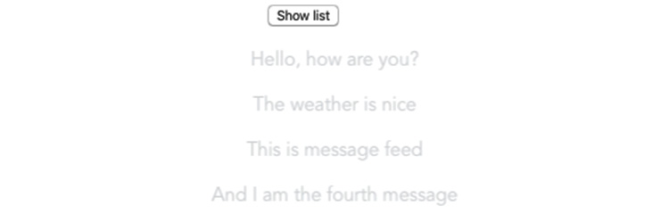

图 7.7：列表项的淡入

注意，与不渲染任何包装容器元素的 `transition` 组件不同，`transition-group` 将渲染一个实际元素，您可以通过使用 `tag` prop 来更改元素标签名。默认使用的元素是 `span`：

```js
<transition-group
  name="fade"
  tag="div"
>
  <p v-for="message in messages" :key="message" v-show="show">
      {{message}}
  </p>
</transition-group>
```

在浏览器中，实际的 HTML 输出将如下所示：

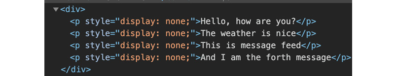

图 7.8：根据标签属性渲染的过渡容器元素

此外，所有过渡类只应用于具有 `v-for` 属性的列表项元素，而不应用于包装器。

最后，你必须为每个列表项设置 `:key` 属性，以便 Vue.js 能够索引并知道要将转换应用到哪个项上。

我们现在将在列表上创建移动效果。

## 在过渡列表时创建移动效果

除了 `transition` 组件中提供的所有类之外，`transition-group` 还有一个类 `v-move`，它允许我们在每个项移动到其位置时添加额外的效果。可以通过 `move-class` 属性手动分配：

```js
.fade-move {
  transition: transform 2s ease-in;
}
```

接下来，我们将探讨在页面或组件的初始渲染上制作动画。

## 在初始渲染时制作动画

通常，项目列表将在第一次初始页面加载时显示，我们的动画将不会工作，因为元素已经在视图中。为了触发动画，我们需要使用不同的转换属性 `appear`，在页面加载后立即强制在初始页面渲染上进行动画：

```js
<transition-group
    appear="true"
    tag="div"
>
    <p v-for="message in messages" :key="message">{{message}}</p>
</transition-group>
```

我们还可以使用 `v-on:after-appear`、`v-on:appear`、`v-on:after-appear` 和 `v-on:appear-cancelled` 设置钩子，或者我们可以使用以下格式创建自定义类：

```js
<transition-group
  appear="true"
  appear-class="fade-enter"
  appear-active-class="fade-enter-active"
  tag="div"
>
  <p v-for="message in messages" :key="message">{{message}}</p>
</transition-group>
```

在渲染时进行动画是一个常用的功能，可以在许多情况下使用，例如像我们在这里所做的那样淡入组件。在下一节中，我们将探讨如何使用动画对消息列表进行排序。

## 练习 7.02：使用动画对消息列表进行排序

在这个简短的练习中，我们将向消息列表添加额外的功能：**排序**。在排序（A-Z 或 Z-A）时，列表将会有翻转动画效果。

要访问此练习的代码文件，请参阅 [`packt.live/35TFs5l`](https://packt.live/35TFs5l)：

注意

在开始此练习之前，运行 `vue create` 命令以生成 Vue 入门项目。

1.  我们将使用之前用于在 `Messages.vue` 组件中渲染消息的相同组件代码。列表将被 `transition-group` 组件包裹，准备进行动画。并且不要忘记设置 `appear="true"`，或者简单地使用 `appear`，以便元素仅在页面加载完成后进行动画：

    ```js
    <transition-group
          appear
          name="flip"
          tag="div"
        >
          <p v-for="message in messages" :key="message"
      class="message--item"
          >{{message}}</p>
        </transition-group>
    ```

1.  使用 `yarn serve` 命令运行应用程序。这将生成以下输出：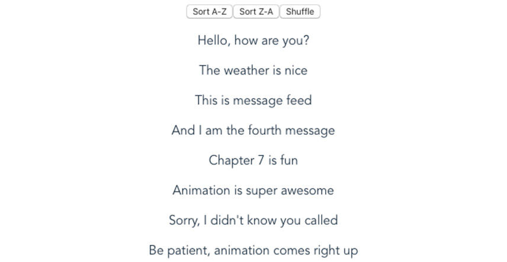

    图 7.9：动画前的消息列表

1.  没有动画，因为我们还没有为 `flip` 定义 CSS 动画样式。让我们来做。在 `src/components/Messages.vue` 的 `<style>` 部分中，我们将添加 `opacity: 0` 并将列表中的每个元素垂直（在 *Y* 轴上）从原始位置移动 `20px`。这应该是元素进入 `flip-enter` 或即将离开转换到 `flip-leave-to` 的初始阶段：

    ```js
    <style scoped>
      .flip-enter, .flip-leave-to {
        opacity: 0;
        transform: translateY(20px);
      }
    </style>
    ```

1.  在相同的`<style>`部分，为每个消息元素（`message-item`类）添加自定义 CSS 样式`transition: all 2s`。这是为了确保元素的过渡效果将在`2`秒内完成所有 CSS 属性的转换：

    ```js
    .message--item {
      transition: all 2s;
    }
    ```

1.  一旦`flip-move`开始工作，我们只需要为`transform`（之前定义为垂直`20px`偏移）添加过渡效果。我们可以完美地看到每个消息的上下移动效果。此外，我们还需要在过渡处于离开阶段中间时添加`position: absolute`：

    ```js
    .flip-leave-active {
      position: absolute;
    }
    .flip-move {
      transition: transform 1s;
    }
    ```

1.  我们接下来将添加三个按钮——允许从 A 到 Z 排序、从 Z 到 A 排序以及随机洗牌：

    ```js
    <button @click="sorting()">Sort A-Z</button>
    <button @click="sorting(true)">Sort Z-A</button>
    <button @click="shuffle()">Shuffle</button>
    ```

1.  我们还需要添加我们的基本组件导出代码以及我们的消息源数据。请随意使用您喜欢的任何内容作为您的消息：

    ```js
    export default {
      data() {
        return {
          messages: [
            'Hello, how are you?',
            'The weather is nice',
            'This is message feed',
            'And I am the fourth message',
            'Chapter 7 is fun',
            'Animation is super awesome',
            'Sorry, I didn't know you called',
            'Be patient, animation comes right up'
          ],
          show: false
        }
      },
    }
    ```

1.  接下来，我们将添加排序和洗牌的逻辑。`methods`部分应该位于上一步创建的组件`export`内部：

    ```js
      methods: {
        sorting(isDescending) {
          this.messages.sort();
          if (isDescending) { this.messages.reverse(); }
        },
        shuffle() {
          this.messages.sort(() => Math.random() - 0.5);
        }
      }
    ```

    点击按钮后的输出将类似于以下内容：

    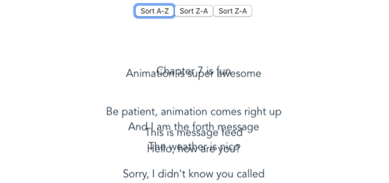

图 7.10：排序动画中的消息列表

在这个练习中，我们学习了如何根据元素顺序的变化，使用`transition-group`动态地为组件列表添加翻转动画效果。接下来，让我们探索如何在页面之间导航时应用过渡效果。

# 过渡路由

通过结合 Vue Router 的`router-element`组件和`transition`组件，我们可以轻松地设置用户在从一个 URL（路由）导航到另一个 URL 时的过渡效果。

为了让您有更深入的理解，我们在以下部分演示了一个基本案例，其中用户从网站的`home`页面重定向到`about`页面。

让我们将`router-element`包裹在`transition`中，并添加`name="zoom"`属性：

```js
<transition
  name="zoom"
  mode="out-in"
>
  <router-view/>
</transition>
```

在这里，我们将使用`mode`属性来指示过渡模式。目前有两种模式可供设置：

+   `in-out`：新元素首先进入，然后当前元素才会从视图中消失。

+   `out-in`：当前元素首先消失，然后新元素才会进入。我们将使用这个模式作为示例，它比上一个模式更常见。

然后，我们只需像往常一样设置带有过渡类的过渡 CSS 效果，任务就完成了。就这么简单：

```js
/**Zoom animation **/
.zoom-enter-active,
.zoom-leave-active {
  animation-duration: 0.3s;
  animation-fill-mode: both;
  animation-name: zoom;
}
.zoom-leave-active {
  animation-direction: reverse;
}
@keyframes zoom {
  from {
    opacity: 0;
    transform: scale3d(0.4, 0.4, 0.4);
  }
 100% {
    opacity: 1;
 }
}
```

在本节中，我们探讨了过渡路由。过渡效果是在路由渲染之间发生的动画，例如从一个页面导航到另一个页面。在下一节中，我们将探讨如何在我们的应用程序中为每个导航的路由创建过渡效果。

## 练习 7.03：为每个导航的路由创建过渡效果

在此练习中，我们将根据 *过渡路由* 部分学到的关于路由元素过渡的知识，为不同的路由创建不同的过渡效果。默认效果将是 `fade`。

要访问此练习的代码文件，请访问 [`packt.live/376DoXo`](https://packt.live/376DoXo)：

注意

在开始此练习之前，运行 `vue create` 命令以生成 Vue 入门项目。

1.  使用 Vue Router 创建一个简单的应用程序，并在 `src/views/` 文件夹中添加一个名为 `Messages.vue` 的路由，为 `messages` 添加一个路由。使用前一个练习中的代码，并在 `App.vue` 中添加一个指向新创建的路由的链接。

1.  接下来，我们在 `App.vue` 中将 `router-view` 元素包裹在 `transition` 组件中：

    ```js
        <transition :name="transition" :mode="mode">
          <router-view/>
        </transition>
    ```

1.  在 `App.vue` 的 `export` 部分中，确保 `data` 函数包含 `transition` 和 `mode` 的值，如下所示：

    ```js
      data() {
        return {
          transition: 'fade',
          mode: 'out-in',
        };
      },
    ```

1.  在 `App.vue` 中使用以下 CSS 添加淡入淡出的样式：

    ```js
    <style>
      .fade-enter, .fade-leave-to {
        opacity: 0;
      }
      .fade-enter-active, .fade-leave-active {
        transition: opacity 1s ease-in;
      }
    </style>
    ```

1.  到目前为止，所有页面都使用 `fade` 效果加载，包括 `/messages`。但我们希望消息页面使用不同的效果——`zoom` 效果。接下来，在同一个 `style` 标签内添加相关的 `zoom` 动画 CSS 代码：

    ```js
    /**Zoom animation */
    .zoom-enter-active,
    .zoom-leave-active {
      animation-duration: 0.5s;
      animation-fill-mode: both;
      animation-name: zoom;
    }
    .zoom-leave-active {
      animation-direction: reverse;
    }
    @keyframes zoom {
     from {
        opacity: 0;
        transform: scale3d(0.4, 0.4, 0.4);
     }
      100% {
        opacity: 1;
      }
    }
    ```

1.  我们现在将使用以下代码帮助添加一些标准的 CSS 样式以应用于应用程序的默认布局：

    ```js
    #app {
      font-family: 'Avenir', Helvetica, Arial, sans-serif;
      -webkit-font-smoothing: antialiased;
      -moz-osx-font-smoothing: grayscale;
      text-align: center;
      color: #2c3e50;
    }
    #nav {
      padding: 30px;
    }
    #nav a {
      font-weight: bold;
      color: #2c3e50;
    }
    #nav a.router-link-exact-active {
      color: #42b983;
    }
    ```

1.  现在我们需要将 `/messages` 路由与这个特定的过渡效果相匹配，同时不影响其他路由。为了做到这一点，我们需要在 `src/router/index.js` 中的此路由配置中添加一个名为 `transition` 的字段：

    ```js
      {
        path: '/messages',
        name: 'messages',
        meta: {
          transition: 'zoom',
        },
        component: () => import(/* webpackChunkName: "about" */       '../views/Messages.vue')
      }
    ```

1.  检查您的 `routes` 对象的代码，以确认它与以下代码相同。在这里，我们将我们应用程序的每个 URL 与一个视图文件相匹配：

    ```js
    const routes = [
      {
        path: '/',
        name: 'home',
        component: Home
      },
      {
        path: '/about',
        name: 'about',
        component: () => import(/* webpackChunkName: "about" */       '../views/About.vue')
      },
      {
        path: '/messages',
        name: 'messages',
        meta: {
          transition: 'zoom',
        },
        component: () => import(/* webpackChunkName: "messages" */       '../views/Messages.vue')
      }
    ]
    ```

1.  这在浏览器中不会显示，因为此过渡声明尚未与 `App.vue` 组件的 `data` 字段绑定，并且需要在视图开始加载之前绑定。为此，我们将利用 *第六章* 中提到的 `$router` 全局变量的 `created` 生命周期钩子和 `beforeEach` 路由钩子。

1.  让我们在 `App.vue` 中添加一个在每次路由更改之前的钩子。我们将检查目标路由（`to`）是否有自定义的 `transition` 效果。如果有，我们将把 `App` 实例中的 `transition` 值映射到它；否则，在继续导航之前，我们将使用回退默认值，如下所示：

    ```js
    created() {
        this.$router.beforeEach((
          to, // The destination route
          from, //The source route
          next //The function to trigger to resolve the hook
        ) => {
          let transition = 'fade';
          if (to.meta && to.meta.transition) {
            transition = to.meta.transition;
          }
          this.transition = transition;
          next();
        })
      }
    ```

1.  使用以下命令运行应用程序：

    ```js
    yarn serve
    ```

1.  现在如果您在浏览器中打开 `localhost:8080` 并导航到 `/messages`，您应该会看到类似于 *图 7.11* 的内容：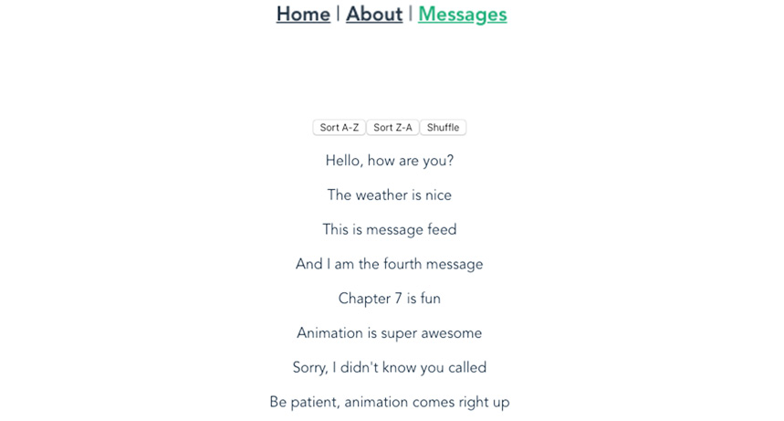

图 7.11：带有缩放效果的导航到 /messages

在导航到其他路由时，我们应该看到 *图 7.12* 中显示的默认过渡效果：


图 7.12：带有淡入效果的导航到 /home

这个练习演示了我们可以如何通过结合正确的钩子和方法，以最少的努力在不同的页面上设置不同的过渡。你可以通过外部库进一步实验，以使你的应用程序动画更加平滑和生动。

# 使用 GSAP 库进行动画

GSAP 是一个专注于使用 JavaScript 进行快速动画的开源脚本库，并提供跨平台的兼容性支持。它支持在广泛的元素类型上动画，例如矢量图形 (SVG)、React 组件、画布等。

GSAP 是灵活的，易于安装，并能适应任何配置，从 CSS 属性或 SVG 属性到将对象渲染到画布上的数值。

核心库是一套不同的工具，分为核心和其他，例如插件、缓动工具和实用工具。

## 安装 GSAP

使用 `npm install` 或 `yarn add` 可以直接安装 GSAP：

```js
yarn add gsap
#or
npm install gsap
```

安装后，你应该会看到一个类似于以下截图的成功输出：

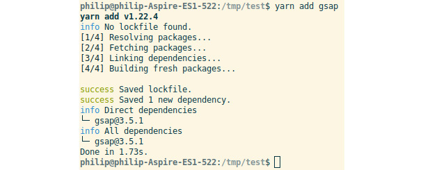

图 7.13：成功安装后的结果

现在我们已经安装了 GSAP，我们将看看 GSAP 中的基本缓动动画。

## 基本缓动动画

**缓动**是由 GSAP 库的创建者定义的一个概念，是一个高性能的设置器，用于执行所有基于用户配置输入的所需动画工作。输入可以是动画的目标对象、一个时间段或任何特定的 CSS 属性。在执行动画时，缓动根据给定的持续时间确定 CSS 属性的值，并相应地应用它们。

以下是一些创建基本缓动动画的基本方法。

**gsap.to()**

最常用的缓动是 `gsap.to()`，它用于创建动画，基于两个主要参数：

+   `#myId`。

+   `透明度：0`，`旋转：90`，或 `字体大小：'20px'`，动画属性如 `持续时间：1`，`延迟：0.2`，或 `缓动："弹性"`，以及事件处理程序属性如 `onComplete` 或 `onUpdate`。

例如，如果我们想在 `HelloWorld.vue` 中动画化 Vue 的标志，我们运行以下代码：

```js
gsap.to(el, {duration: 3, opacity: 1, onComplete: done});
```

或者使用以下方法通过 `x` 属性移动一个对象（与 `transform: translateX()` 相同）：

```js
gsap.to(".green", {duration: 3, x: 500, rotation: 360});
```

**gsap.from() 和 gsap.fromTo**

我们并不总是想为视图中元素定义预期的动画效果。相反，我们定义动画应该从目标元素开始时的默认值。这就是我们使用 `gsap.from()` 的时候。

例如，假设一个盒子的当前 `透明度` 值为 `1`，`缩放` 值为 `1`，`x` 位置为 `0`，我们想要设置一个动画，从位置 `x` 的 `300`，`透明度` 值为 `0`，`缩放` 值为 `0.5` 开始。换句话说，动画将从 `{x: 300, 透明度: 0, 缩放: 0.5}` 开始，到元素当前拥有的任何值：

```js
gsap.from(".red", {duration: 3, x: 300, scale: 0.5, opacity: 0});
```

但在许多情况下，我们需要为动画设置起始值和结束值，因为单侧不够好。为此目的，GSAP 提供了`gsap.fromTo()`，其语法如下：

```js
gsap.fromTo(target, fromValues, toValues)
```

让我们定义一个动画，将一个灰色框从原始值`{ opacity: 0, scale: 0.5, x: 300 }`转换为值`{ opacity: 1, scale: 1, x: 100, rotation: 360}`：

```js
gsap.fromTo(".grey",
    { duration: 3, opacity: 0, scale: 0.5, x: 600 },
    { duration: 3, opacity: 1, scale: 1, x: 200, rotation: 360}
  )
```

为了将所有类似 CSS 的值转换为相应的 CSS 值，GSAP 的核心插件之一是`CSSPlugin`。此插件将自动检测目标是否为 DOM 元素，拦截传递的值，将它们转换为适当的 CSS 值，然后相应地将其作为内联样式应用到元素上。

在下一节中，我们将通过一个使用 GSAP 创建简单缓动的练习进行讲解。

## 练习 7.04：使用 GSAP 进行缓动

本练习的目标是让您熟悉使用外部库，如 GSAP。我们将制作一个简单的动画，但您可以在 Vue 代码的任何地方应用此相同的模式。我们将在挂载时应用动画，但 JavaScript 动画可以根据计时器、随机整数或按钮等输入动态触发。

要访问此练习的代码文件，请访问[`packt.live/3kVO4gm`](https://packt.live/3kVO4gm)：

注意

在开始此练习之前，运行`vue create`命令以生成 Vue 入门项目。

1.  通过运行以下命令创建一个 Vue 项目：

    ```js
    vue create Exercise7.04
    ```

1.  使用`yarn`或`npm`通过以下命令之一安装 GSAP：

    ```js
    yarn add gsap
    # OR
    npm install gsap
    ```

1.  在`src/App.vue`中导入 GSAP：

    ```js
    import gsap from 'gsap'
    ```

1.  在`src/App.vue`中找到现有的`img`标签，并按照以下方式添加`ref="logo"`：

    ```js
    
    ```

1.  在`src/App.vue`中导出的对象中添加一个名为`mounted`的函数，该函数将 logo 定义为变量并添加一个动画，该动画为`10`次旋转，持续`30`秒：

    ```js
      mounted() {
        const { logo } = this.$refs;
        gsap.to(logo, {duration: 30, rotation: 3600});
      }
    ```

1.  接下来，通过在终端运行`yarn serve`来启动应用程序。

1.  打开您的浏览器到`localhost:8080`，您应该看到默认的 Vue 入门页面，但带有旋转的 logo，如下面的截图所示：![图 7.14：使用 GSAP 的简单动画

    ![img/B15218_07_14.jpg]

图 7.14：使用 GSAP 的简单动画

在这个练习中，我们使用 GSAP 在 Vue 中实现了一个简单的旋转动画。接下来，我们将看到如何通过缓动修改动画的外观和感觉。

## 使用缓动修改外观和感觉

缓动很重要，因为它决定了动画的原点与目的地之间的运动风格。它控制缓动过程中的变化率；因此，用户有时间看到效果，无论是平滑、突然、弹跳还是其他过渡效果：

```js
gsap.from(".bubble", 2, {
      scale: 0.2,
      rotation: 16,
      ease: "bounce",
    })
```

此外，GSAP 还提供了额外的内置插件，用于配置额外的缓动效果，例如 power、back、elastic 等。以气泡效果为例；为了使运动在一定范围内平滑，我们使用`Back.easeOut.config()`和`Elastic.easeOut.config()`并传递相关设置：

```js
gsap.to(".bubble", 2, {
      scale: 0.2,
      rotation: 16,
      ease: Back.easeOut.config(1.7),
    })
    gsap.to(".bubble", 4, {
      scale: 1.2,
      rotation: '-=16',
      ease: Elastic.easeOut.config(2.5, 0.5),
    })
```

使用`ease`，我们可以根据设置的样式使相同的动画看起来完全不同。接下来，我们将探讨`stagger`，这是另一个影响动画外观和感觉的选项。

## 使用交错修改外观和感觉

在前面的章节中，我们介绍了如何使用 Vue 过渡来动画化一系列项目。对于对象列表，我们应该考虑交错动画，因为它使得此类目标的动画变得简单，并且每个项目动画之间有适当的延迟。

例如，通过将值分配给`stagger`属性，我们可以在除了延迟持续时间数字（以毫秒为单位）之外创建并应用一些配置选项：

```js
gsap.to('.stagger-box', 2, {
      scale: 0.1,
      y: 60,
      yoyo: true,
      repeat: 1,
      ease: Power1.inOut,
      delay:1,
      stagger: {
        amount: 1.5,
        grid: "auto",
        from: "center"
      }
    })
```

您可以使用`repeat`来定义动画应该重复多少次。负数将使其无限重复。

## 使用时间线

**时间线**是您完全控制的缓动调度，用于定义缓动之间的重叠或间隔。当您需要根据顺序控制一组动画、构建一系列动画、链式动画以进行最终回调或模块化动画代码以实现可重用时，它非常有用。

为了使用时间线，您可以选择使用内置的`gsap.timeline()`方法创建时间线实例，或者从核心库中导入`TimelineMax`或`TimelineLite`并使用一组配置设置实例，如下所示：

```js
import { TimelineMax } from 'gsap';
const tl = new TimelineMax({
  onComplete: done
})
//OR
const tl = gsap.timeline();
```

我们将简要介绍时间线的两个主要用例，**排序**和**链式**。

**排序**

与 GSAP 类似的核心功能，时间线也提供了`to()`、`from()`和`fromTo()`方法。默认情况下，所有动画都可以按顺序排列，有选项强制使用`position`属性来控制事物在哪里或何时进行，这是一个可选参数：

```js
var tl = gsap.timeline({ repeat: -1});
      tl.to("#box-green", {duration: 2, x: 550})
      //1 second after end of timeline (gap)
      tl.to("#box-red", {duration: 2, x: 550, scale: 0.5}, "+=1")
      //0.5 seconds before end of timeline (overlap)
      tl.to("#box-purple", {duration: 2, rotation: 360, x:550,         scale: 1.2, ease: "bounce"}, "-=1")
```

在本节中，我们探讨了使用 GSAP 时间线功能来安排一系列动画，这些动画一个接一个地运行，有些有间隔，有些有重叠。在下一节中，我们将进一步探讨使用链式概念排序动画。

**链式**

与排序类似，链式排列将动画按顺序排列。而不是每次单独调用每个动画的实例方法，它将被放置在链中。在子缓动之间使用的所有特殊值都可以定义，或者在实例中创建为默认值，或者也可以在第一次调用中，获取链中的其他时间线（动画列表）以继承这些值：

```js
var tl = gsap.timeline({ defaults: { duration: 2 }, repeat: -1});
tl.to("#box-green", { x: 550 })
  .to("#box-red", { scale: 0.5, x: 450 })
  .to("#box-purple", { scale: 1.2, ease: "bounce", x: 500 })
```

我们还可以使用`position`拦截每个链式时间线的定时位置，正如之前所描述的：

```js
tl.to("#box-green", { x: 550 })
  .to("#box-red", { scale: 0.5, x: 450 }, "+=1")
  .to("#box-purple", { scale: 1.2, ease: "bounce", x: 500 }, "-=1")
```

GSAP 有非常详细的文档，所以只需访问[`greensock.com/get-started`](https://greensock.com/get-started)并开始动画。

在下一节中，我们将基于我们对 GSAP 的了解来制作一个带有动画过渡的消息查看应用。

## 活动 7.01：使用过渡和 GSAP 构建消息应用

在此活动中，你将使用 CSS 编写自定义过渡，使用过渡组和路由进行更复杂的过渡，并使用第三方过渡库如 GSAP 在应用中进行动画和过渡。你将创建一个简单的消息应用，利用过渡效果：

注意

在开始此练习之前，运行`vue create`命令以生成 Vue 入门项目。

1.  创建一个`Messages`路由（在`src/views/Messages.vue`），用于渲染两个嵌套视图：`Messages`（`src/views/MessageList.vue`）显示消息列表和`MessageEditor`（`src/views/MessageEditor.vue`）包含一个`textarea`和一个用于创建新消息的提交按钮。

1.  创建一个`Message`路由（在`src/views/Message.vue`），用于渲染具有给定 ID 的单条消息视图。

1.  注册所有路由。

1.  在`src/App.vue`文件中为主`router-view`添加一个简单的过渡名称`fade`和`out-in`模式。

1.  通过使用自定义过渡类，将过渡添加到`src/views/Messages.vue`中的嵌套`router-view`。

1.  编写一个动画效果，在进入路由时放大，在离开路由时缩小。

1.  为离开事件编写另一个淡入动画效果。

1.  在`MessageList.vue`的消息列表中添加一个弹入效果的过渡。

1.  使用 GSAP 动画实现弹入效果。

1.  为出现的项目添加移动效果。

1.  当从列表页面导航到编辑页面时，你应该看到内容流滑向左侧，同时编辑器出现，如图*图 7.15*所示：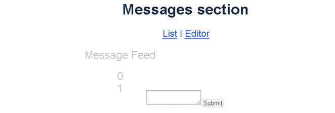

图 7.15：从消息列表视图导航到编辑视图时淡出

当从消息视图导航到编辑视图时，你应该看到文本输入向左滑动，如图*图 7.16*所示：

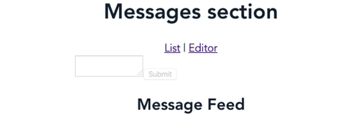

图 7.16：从编辑视图导航到消息列表视图时淡出

接下来，消息列表将以弹跳效果显示，数字旋转，如图*图 7.17*所示：

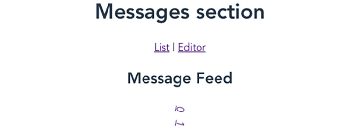

图 7.17：在消息列表视图中显示消息源时的弹跳效果

当点击特定的消息，例如我们的例子中的`0`或`1`，我们的列表将向左滑动，你应该看到消息内容，如图*图 7.18*所示：


图 7.18：单条消息视图

注意

此活动的解决方案可以通过此链接找到。

# 摘要

在本章中，我们探讨了 Vue.js 内置对过渡和动画的支持，包括对单个和多个组件的支持，并看到了如何轻松地设置它们。到这一点，你已经为路由和组件创建了过渡和动画效果，并见证了 Vue.js 过渡的所有基本功能：自定义过渡类、分组过渡和过渡模式。此外，你还了解到了其他领先的第三方动画库，如 GSAP，并看到了如何将它们与你的 Vue 应用程序集成，以便在网页上获得更好的动画效果。

下一章将重点介绍构建生产就绪的 Vue 应用程序的关键主题之一，即状态管理，以及应用程序内部组件如何使用 Vuex（一个状态管理库）相互通信。
