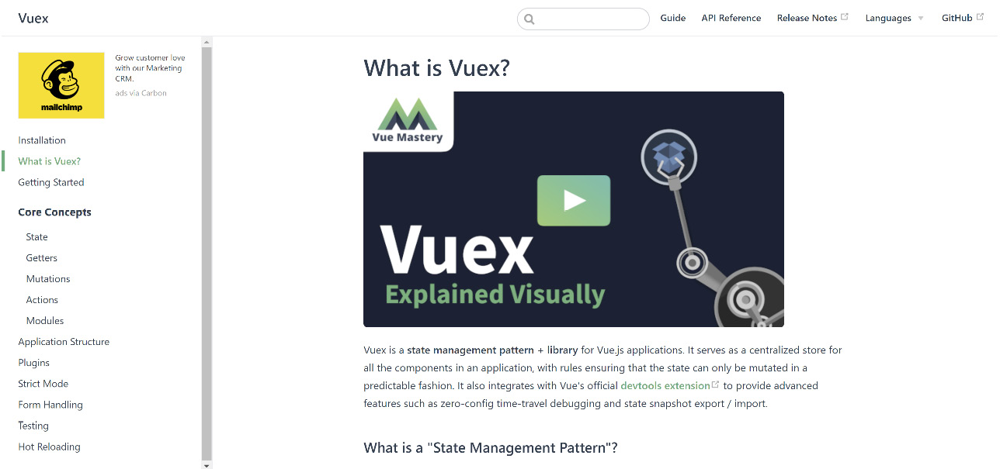
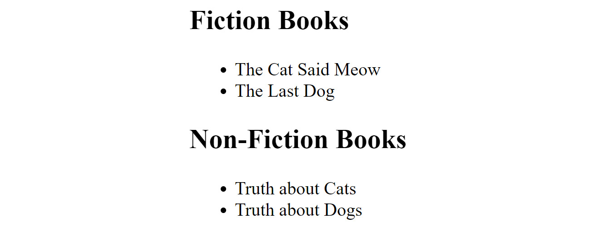
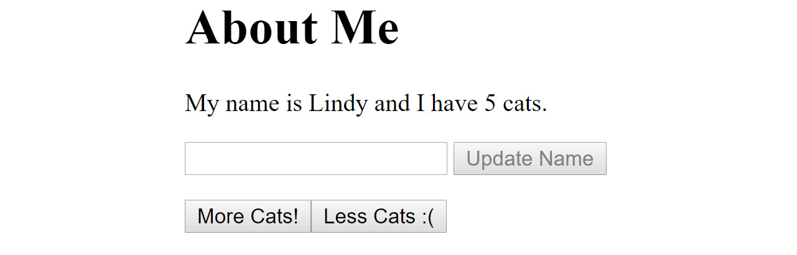

# 第九章：9. 使用 Vuex – 状态、Getters、Actions 和 Mutations

概述

在本章中，你将学习如何使用 Vuex 构建更复杂的 Vue 应用程序。你将了解如何将 Vuex 添加到 Vue 应用程序中，如何使用 Vuex 存储定义状态，然后使用 getter、actions 和 mutations 从存储中读取数据，并在存储中更新数据。到本章结束时，你将看到多个 Vuex 如何改变你的 Vue 应用程序的例子，使它们能够以更可管理的方式变得更加复杂。

# 简介

在上一章中，你学习了如何使用事件总线模式来帮助解决一个重要问题：在复杂且高度嵌套的组件集合之间双向通信事件。事件总线模式提供了一个简单的**发布/订阅**系统，任何组件都可以发出事件，任何组件也可以监听该事件。虽然自己编写解决方案是保持编码技能锐利的好方法，但在这种情况下，使用已经在 Vue 社区中开发、经过充分测试的解决方案会更好——**Vuex** ([`vuex.vuejs.org/`](https://vuex.vuejs.org/))：



图 9.1：Vuex 首页

Vuex 是 Vue 生态系统的一个核心部分，它提供了我们在上一章中构建的内容以及更多。让我们从高层次上了解一下 Vuex 的主要功能。

## 存储

从高层次来看，一个 Vuex 实例或 Vuex 的一次使用被认为是一个**存储**。存储是使用以下子节中描述的一切的最高级容器。

## 状态

Vuex 最重要的方面是它所代表的**状态**或数据。这是所有组件都可以依赖的*单一事实来源*。随着状态的变化，任何使用状态的组件都可以确保其副本始终与状态同步。想象一个允许你编辑博客条目的 Vue 应用程序。存储可以包括博客条目本身以及你正在编辑的当前博客条目的值。当在某个地方编辑博客条目时，任何使用它们的其他地方都会立即更新。

## Getters

虽然 Vue 可以直接从 Vuex 实例读取状态数据，但有时你可能需要为数据本身提供额外的逻辑或抽象。就像 Vue 为虚拟或派生数据提供`computed`属性一样，**getter**为需要在使用前操纵数据的情况提供了对状态的抽象。回到我们之前处理博客条目的例子，想象一个返回按浏览量最高的博客条目的 getter。getter 抽象掉了“热门”博客条目的逻辑，并允许你轻松地在将来更改该逻辑。

## 变更

在 Vuex 中使用状态数据的组件永远不会直接修改该数据。相反，组件可以执行一个**突变**。将其视为组件对 Vuex 执行状态更改的命令。通过使用突变来封装对状态的更改，Vuex 可以确保使用该状态的每个组件都能及时了解更改。

## 行为

**行为**类似于突变，但它们必须用于处理异步更改。异步行为是任何需要不确定时间才能完成的逻辑。最常见的例子是对远程 API 的网络调用。同步调用是那些立即执行并完成的调用。当你看到它们被使用时，这会更有意义，但一般来说，任何异步操作都应该通过行为完成，而同步逻辑可以通过突变完成。一旦完成了所需的异步工作，行为通常会链接到突变。

## 模块

本章将要涵盖 Vuex 的最后一个方面是模块。**模块**只是将更复杂的数据集打包起来，用于更大的应用程序。虽然一个简单的状态可能适合典型应用程序，但一个更大的应用程序可能有一个更复杂的状态，需要通过模块进行更好的组织。在*第十一章*，*与 Vuex 一起工作 – 组织更大的存储库*中，你将看到如何使用模块来更好地组织 Vuex 实例。

# 安装 Vuex

根据你正在构建的 Vue 应用程序类型，使用 Vuex 的主要有两种方法。如果你没有使用 CLI 搭建应用程序，只是通过脚本标签添加 Vue，你可以以相同的方式包含 Vuex。假设你已经将 Vue 和 Vuex 下载到一个名为 `js` 的文件夹中，你会这样加载它们：

```js
<script src="img/vue.js"></script>
<script src="img/vuex.js"></script>
```

你也可以通过**内容分发网络**（**CDNs**）加载 Vue 和 Vuex：

```js
<script src="img/vue"></script>
<script src="img/vuex"></script>
```

注意

确保在 Vue 之后加载 Vuex 非常重要。这样做可以使 Vuex 对你的 Vue 代码可用，而无需任何其他配置。

如果你使用 CLI 创建了应用程序，请记住 CLI 本身将在创建过程中提示你是否要添加 Vuex：

![图 9.2：在应用程序搭建过程中选择 Vuex]

![图片 B15218_09_02.jpg]

图 9.2：在应用程序搭建过程中选择 Vuex

如果你没有这样做，你仍然可以使用 CLI 添加 Vuex：`vue add vuex`。当 Vuex 被添加（或在搭建过程中选择）时，你的 Vue 应用程序将以我们将要讨论的方式进行修改。

首先，添加一个新的文件夹 `store`，其中包含一个文件 `index.js`：

```js
import Vue from 'vue'
import Vuex from 'vuex'
Vue.use(Vuex)
export default new Vuex.Store({
  state: {
  },
  mutations: {
  },
  actions: {
  },
  modules: {
  }
})
```

这是一个空的存储库，为你的状态、突变、行为和模块预留了位置。请注意，这里没有为定义的获取器预留空间，但你绝对可以添加它们。这只是一个新存储库的默认布局，你可以根据需要对其进行修改。

接下来，`main.js` 被修改为加载和安装此存储库：

```js
import Vue from 'vue'
import App from './App.vue'
import store from './store'
Vue.config.productionTip = false
new Vue({
  store,
  render: h => h(App)
}).$mount('#app')
```

再次强调，这是 CLI 使用 Vuex 的方式，如果你更喜欢使用另一种方法（可能是一个不同于`store`的文件夹名），你完全自由这样做。

# 处理状态

在 Vuex store 的最低级别，你会找到 Vuex 实际管理的数据（状态）。所有组件都可以通过特殊的`$store`变量访问状态。虽然这个变量中还有更多内容，但要读取状态，你可以使用`$store.state.someStateValue`。所以，例如：`Hello, my name is {{ $store.state.name }}`会在组件中输出 Vuex store 中的名称值。对于简单的从 store 读取操作，这就足够了。

我们将在以下练习中学习如何显示状态值。

## 练习 9.01：显示状态值

在这个练习中，你将创建一个空的 Vue 应用程序并使用 Vuex。前面的部分描述了如何通过 CLI 完成此操作，如果你跟随着做，你现在应该有一个准备好了。如果没有，请现在创建一个，确保你启用了 Vuex。在这个练习中，我们将在状态中设置一些值并在组件中显示它们。

要访问此练习的代码文件，请参阅[`packt.live/32s4RkN`](https://packt.live/32s4RkN)。

1.  一旦你搭建了应用程序，打开`store/index.js`并修改`state`块以添加三个新值。这里的数据是任意的，可以是 JavaScript 可以处理的所有内容（字符串、数字、数组等等）：

    ```js
    import Vue from 'vue'
    import Vuex from 'vuex'
    Vue.use(Vuex)
    export default new Vuex.Store({
      state: {
        name:"Lindy", 
        favoriteColor: "blue", 
        profession: "librarian"
      },
      mutations: {
      },
      actions: {
      },
      modules: {
      }
    })
    ```

1.  现在我们需要修改组件以显示来自状态的价值。打开`App.vue`并按如下方式修改它：

    ```js
    <template>
      <div id="app">
        <p>
        My name is {{ $store.state.name }} and 
        my favorite color is {{ $store.state.favoriteColor }}. 
        My job is a {{ $store.state.profession }}.
        </p>
        <HelloWorld />
      </div>
    </template>
    <script>
    import HelloWorld from '@/components/HelloWorld';
    export default {
      name: 'app',
      components:{
        HelloWorld
      }
    }
    </script>
    ```

1.  接下来，编辑`HelloWorld.vue`组件以显示来自状态的一个值：

    ```js
    <template>
      <div>
        <p>
          Hi, I'm a component, and I also have access to state! 
          My name is {{ $store.state.name }}.
        </p>
      </div>
    </template>
    <script>
    export default {
      name: 'HelloWorld'
    }
    </script>
    ```

    要查看你的应用程序，请在终端中输入`npm run serve`。当 CLI 完成时，你可以在浏览器中打开显示的 URL 来查看你的应用程序，它应该如下所示：

    ```js
    My name is Lindy and my favorite color is blue. My job is a librarian.
    Hi, I am a component, and I also have access to state! My name is Lindy.
    ```

如你所见，主组件和子组件都可以访问状态并看到相同的值。这不应该令人惊讶，但总是很好确认事情按预期工作。

直接访问状态值虽然简单，但让我们看看更复杂的用法：使用 getter 获取派生值。

# 应用 getter

在上一个练习中，你看到了直接访问状态是多么简单，但有时你可能需要更复杂的对状态视图。为了使这更容易，Vuex 支持一个名为**getter**的功能。

Getter 在 store 中拥有自己的块，你可以定义尽可能多的 getter。每个 getter 都会将状态作为参数传递，这让你可以使用任何你需要来创建你的值。最后，getter 的名称就是它将被暴露的方式。考虑这个简单的例子：

```js
state: {
  name: "Raymond",
  gender: "male",
  job: "Developer Evangelist"
},
getters: {
  bio(state) {
    return `My name is ${state.name}. I'm a ${state.job}`;
  } 
}
```

此 store 定义了三个状态值（`name`、`gender`和`job`），还提供了一个名为`bio`的“虚拟”属性，它返回数据的描述。请注意，getter 只使用了两个状态值，这是完全可以的。

要在组件中引用获取器，你使用 `$store.getters.name`，其中 `name` 是获取器的名称。因此，要访问前面代码中定义的 bio 获取器，你会使用以下：

```js
{{ $store.getters.bio }}
```

除了传递状态外，获取器还通过其第二个参数传递 *其他* 获取器，这允许一个获取器在必要时调用另一个获取器。

在下一个练习中，我们将看到一个如何使用它的示例。

## 练习 9.02：向 Vuex 存储添加获取器

在这个练习中，你将构建一个利用获取器功能的示例。你将为 Vuex 存储添加获取器，并从主 Vue 应用程序中调用它。

要访问此练习的代码文件，请参阅 [`packt.live/36ixlyf`](https://packt.live/36ixlyf)。

1.  搭建一个新的应用程序，记得在设置中使用 Vuex（如果你忘记了，只需使用 `vue add vuex`）。输入 `npm run serve` 以启动应用程序并在浏览器中打开 URL。

1.  打开你的存储文件（`store/index.js`），然后修改它以定义两个状态值和一个获取器，该获取器将返回两者：

    ```js
    import Vue from 'vue'
    import Vuex from 'vuex'
    Vue.use(Vuex)
    export default new Vuex.Store({
      state: {
        firstName: "Lindy",
        lastName: "Roberthon"
      },
      getters: {
        name(state) {
          return `${state.firstName} ${state.lastName}`;
        }
      },
      mutations: {
      },
      actions: {
      },
      modules: {
      }
    })
    ```

1.  现在打开 `App.vue` 并修改它，以便使用 `name` 获取器：

    ```js
    <template>
      <div id="app">
        <p>
        My name is {{ $store.getters.name }}
        </p>
      </div>
    </template>
    ```

    如以下截图所示，这将显示基于获取器中使用的逻辑的完整名称：

    ```js
    My name is Lindy Roberthon
    ```

    虽然相当简单，但希望你能看到获取器在这里实现的力量。目前，我们有一个由姓氏和名字组成的名称概念。这不是非常复杂的逻辑，但通过将其放置在 Vuex 存储中，我们将其定义为我们应用程序中所有组件都可以访问的一个位置。如果这个名称定义发生了变化（例如，姓氏在前，用逗号分隔），你只需修改一次即可完成。

接下来，我们将考虑如何通过附加逻辑增强获取器。

# 带参数的获取器

虽然获取器可以通过 `$store.getters` 属性直接访问，但你可能会遇到需要更多控制获取器工作方式的情况。参数提供了一种自定义获取器工作方式的方法。考虑以下存储：

```js
import Vue from 'vue'
import Vuex from 'vuex'
Vue.use(Vuex)
export default new Vuex.Store({
  state: {
    books:[
      {type:'nonfiction', title:'Truth about Cats', pages: 200},
      {type:'nonfiction', title:'Truth about Dogs', pages: 100},
      {type:'fiction', title:'The Cat Said Meow', pages: 400},
      {type:'fiction', title:'The Last Dog', pages: 600},
    ]
  },
  getters: {
    fiction(state) {
      return state.books.filter(book => book.type === 'fiction');
    },
    nonfiction(state) {
      return state.books.filter(book => book.type ===         'nonfiction');
    }
  },
  mutations: {
  },
  actions: {
  },
  modules: {
  }
})
```

在此存储中只有一个状态值，它是一个书籍数组。每本书都有一个类型（非小说或小说）、标题和页数。为了便于获取一本书而不是另一本书，使用了两个获取器。它们通过小说或非小说书籍进行筛选。

这是在组件中使用它的方法。首先，我们遍历 `fiction` 获取器，然后是 `nonfiction` 获取器：

```js
<h2>Fiction Books</h2>
<ul>
  <li v-for="book in $store.getters.fiction" :key="book.title">
  {{ book.title }}
  </li>
</ul>
<h2>Non-Fiction Books</h2>
<ul>
    <li v-for="book in $store.getters.nonfiction" :key=      "book.title">
    {{ book.title }}
    </li>
</ul>
```

在前面的模板中，使用了两个无序列表来遍历每种类型的书籍。结果如下所示：



图 9.3：通过获取器渲染小说和非小说书籍

好的，到目前为止一切顺利。但如果你想要根据页数获取书籍呢？这并不是一个简单的布尔值或字符串属性，而是一个数字。但是，因为获取器可以接受参数，我们可以创建一个新的获取器，允许我们请求最大页数。（我们可以支持多个参数，所以，如果你想要一个获取器来请求在一定范围内的书籍，你可以支持最小和最大页数。）为了创建一个接受参数的获取器，您的代码本身必须返回一个函数。

这里有一个示例，我们定义了一个返回全名一部分的获取器：

```js
shortName(state) {
  return function(length) {
    return ('${state.firstName} ${state.lastName}').      substring(0, length);
  }
}
```

生成的获取器可以使用 `length` 参数：`{{ $store.getters.shortName(10) }}`。

在下一个练习中，您将构建一个利用带有参数的获取器功能的应用程序。

## 练习 9.03：使用带参数的获取器

您将在下面的练习中测试这个功能。通过向获取器添加参数，您将能够构建更灵活的获取器，这些获取器在不同组件中更有用。在这个练习中，您将创建一个接受一个参数的获取器。

要访问此练习的代码文件，请参阅 [`packt.live/2Ioi2vy`](https://packt.live/2Ioi2vy)。

1.  使用 Vuex 再次搭建一个应用程序，一旦打开，编辑 store 以包括一组书籍和用于虚构、非虚构和页码的获取器。这可以在 `store` 目录中的 `index.js` 找到：

    ```js
    import Vue from 'vue'
    import Vuex from 'vuex'
    Vue.use(Vuex)
    export default new Vuex.Store({
      state: {
        books:[
          {type:'nonfiction', title:'Truth about Cats', pages: 200},
          {type:'nonfiction', title:'Truth about Dogs', pages: 100},
          {type:'fiction', title:'The Cat Said Meow', pages: 400},
          {type:'fiction', title:'The Last Dog', pages: 600},
        ]
      },
      getters: {
        fiction(state) {
          return state.books.filter(book => book.type === 'fiction');
        },
        nonfiction(state) {
          return state.books.filter(book => book.type ===         'nonfiction');
        },
        booksByMaxPages(state) {
          return function(pages) {
            return state.books.filter(book => book.pages <= pages);
          }
        }
      }
    })
    ```

1.  现在编辑 `App.vue` 以使用所有三个获取器——首先是虚构和非虚构获取器，然后是页数不超过 `150` 的书籍：

    ```js
    <template>
      <div id="app">
        <h2>Fiction Books</h2>
        <ul>
          <li v-for="book in $store.getters.fiction" :key=        "book.title">
            {{ book.title }}
          </li>
        </ul>
        <h2>Non-Fiction Books</h2>
        <ul>
          <li v-for="book in $store.getters.nonfiction" :key=        "book.title">
            {{ book.title }}
          </li>
        </ul>
        <h2>Short Books</h2>
        <ul>
          <li v-for="book in $store.getters.booksByMaxPages(150)"         :key="book.title">
            {{ book.title }}
          </li>
        </ul>
      </div>
    </template>
    <script>
    export default {
      name: 'app'
    }
    </script>
    ```

    完成后，您可以通过启动您的 Vue 应用程序（在终端中输入 `npm run serve`）并在浏览器中打开 URL 来查看结果。以下是您应该看到的内容：

    ![图 9.4：参数化获取器的作用

    ![img/B15218_09_04.jpg]

图 9.4：参数化获取器的作用

在这个练习中，我们学习了如何使用更强大的带有参数的获取器。这使得它们更加灵活，更能适应组件可能的需求。现在您已经看到了从 Vuex store 中读取数据的多种方式，是时候看看如何修改状态了。

# 使用突变修改状态

到目前为止，您已经看到了如何从 Vuex store 中读取数据，无论是通过直接访问状态还是通过使用获取器。但为了实际改变 store 的状态，Vuex 支持突变的概念。突变是在您的 store 中定义的方法，用于处理状态的变化。例如，而不是您的组件简单地设置状态中的新值，您的组件将要求 store 执行突变，而 store 本身处理那个逻辑。

这里有一个简单的例子：

```js
state: {
  totalCats: 5,
  name:'Lindy'
},
mutations: {
  newCat(state) {
    state.totalCats++;
  },
  setName(state, name) {
   state.name = name;
  }
}
```

在前面的代码片段中，存储在其状态中有两个值，`totalCats` 和 `name`。存在两个突变以允许你更改这些值。所有突变都传递一个状态对象，它为你提供直接访问以读取和更改值。第一个突变 `newCat` 简单地增加 `totalCats` 的值。第二个突变 `setName` 展示了一个接受参数的突变示例。在这种情况下，你可以使用 `setName` 来更改存储中的名称值。

为了执行一个突变，你的组件将使用 `commit` 方法。例如，如下所示：

```js
$store.commit('newCat');
$store.commit('setName', 'Raymond');
```

如果你将它们作为对象而不是简单值传递，你也可以传递多个值。在下一个练习中，你将有机会练习构建你自己的突变。

## 练习 9.04：使用突变

在这个练习中，你将构建一个使用突变来修改 Vuex 中状态数据的应用程序。搭建一个新的应用程序，一旦准备就绪，打开位于 `store/index.js` 的存储文件。你的存储将基于前面的示例。

要访问此练习的代码文件，请参阅 [`packt.live/3kcARiN`](https://packt.live/3kcARiN)。

1.  定义一个 `totalCats` 状态变量和名称状态值，然后定义三个突变来处理它们——一个突变用于增加猫的数量，一个用于减少它，最后一个用于设置名称：

    ```js
    import Vue from 'vue'
    import Vuex from 'vuex'
    Vue.use(Vuex)
    export default new Vuex.Store({
      state: {
        totalCats:5, 
        name: "Lindy"
      },
      mutations: {
        adoptCat(state) {
          state.totalCats++;
        },
        placeCat(state) {
          if(state.totalCats > 0) state.totalCats--;
        },
        setName(state, name) {
          state.name = name;
        }
      }
    })
    ```

    接下来，你将构建一个简单的界面来与这个存储进行交互。模板需要有一个 UI 来报告名称和猫的数量。你还需要一个文本字段和按钮来处理名称的更新。

1.  打开 `App.vue` 并更新它以包含输出存储中的当前值以及提供一个简单的表单以允许更新：

    ```js
    <template>
      <div id="app">
        <h1>About Me</h1>
        <p>
          My name is {{ $store.state.name }} and 
          I have {{ $store.state.totalCats }} cats.
        </p>
        <p>
          <input v-model="newName">
          <button @click="setName" :disabled="!newName">Update Name         </button>
        </p>
        <Cat/>
      </div>
    </template>
    <script>
    import Cat from './components/Cat.vue'
    export default {
      name: 'app',
      components: {
        Cat
      },
      data() {
        return {
          newName:''
        }
      },
      methods: {
        setName() {
          if(this.newName) {
            this.$store.commit('setName', this.newName);
            this.newName = '';
          }
        }
      }
    }
    </script>
    ```

1.  构建 `Cat` 组件。此组件将具有简单的按钮来执行我们定义的突变，以增加和减少猫的数量：

    ```js
    <template>
      <div>
        <button @click="addCat">More Cats!</button>
        <button @click="removeCat">Less Cats :(</button>
      </div>
    </template>
    <script>
    export default {
      name: 'Cat',
      methods: {
        addCat() {
          this.$store.commit('adoptCat');
        },
       removeCat() {
          this.$store.commit('placeCat');
        }
      }
    }
    </script>
    ```

    完成后，像以前一样使用 `npm run serve` 启动你的应用程序，并在浏览器中打开显示的 URL。你的应用程序应该看起来是这样的：

    ![图 9.5：具有突变支持的 Vue 应用程序]

    

![图 9.5：具有突变支持的 Vue 应用程序]

虽然这是一个简单的练习，但有一些重要的事情需要注意。首先，注意根组件和子组件与存储交互时没有问题。你的组件层次结构可以非常深，而且它只是简单地工作。其次，注意 Vue 应用程序更简单，因为与数据交互的逻辑在存储中。我们处理的两个组件只是显示数据并处理将突变调用传递给存储。如果我们的逻辑需要更新，我们可以在存储中处理，并且一切都会正确更新。

到目前为止，你已经看到了如何以立即、同步的方式实现对存储的更改。现在，你将学习如何处理异步更新。

# 使用动作进行异步状态更改

Vuex 中的操作是处理存储异步逻辑的主要方式。突变必须是同步的，但操作可以选择异步。另一个区别是，操作会得到一个`context`对象，它代表存储本身。这使得操作可以调用突变或直接与状态交互。一般来说，大多数开发者会从他们的操作中调用突变。

这可能听起来有些令人困惑，但一般来说，将操作视为您存储的异步支持。一旦我们看到一个或两个示例，它就会变得有意义。

让我们看看一个示例操作。以下代码片段包含一个突变和一个将使用该突变的异步操作：

```js
  mutations: {
    setBooks(state, books) {
      state.books = books;
    }
  },
  actions: {
    loadBooks(context) {
      fetch('/data/books.json')
      .then(res => res.json())
      .then(res => {
        context.commit('setBooks', res);
      });
    }
  },
```

查看`loadBooks`，您可以看到它执行网络请求，完成后，它调用前面的突变并允许它存储结果数据。

调用一个操作与突变略有不同；而不是使用`commit`调用，您使用`dispatch`：

```js
this.$store.dispatch('loadBooks');
```

与突变一样，操作可以接受参数，这些参数作为第二个参数传递给操作方法。接下来，您将构建一个示例来展示这一点。

## 练习 9.05：使用操作进行异步逻辑

在这个练习中，您将构建一个需要异步逻辑才能完成的操作示例。这类似于许多现实世界场景，其中应用程序所需的数据位于远程 API 上。您将在 Vuex 存储中实现网络调用并处理结果。

对于这个示例，您将在`public`文件夹下的一个名为`data`的子目录中设置一个可用的 JSON 资源。当 Vue 构建您的代码时，它将复制`public`文件夹中的任何内容到应用程序中，使其在运行时可用。该 JSON 文件包含一个包含四本书的数组。每本书都有一个类型、标题和页数。

要访问此练习的代码文件，请参阅[`packt.live/3eE6KQd`](https://packt.live/3eE6KQd)。

1.  虽然不是必需的，但这是 JSON 数据的样子。您可以自由地构建自己的：

    ```js
    [
        {
            "type": "nonfiction",
            "title": "Truth about Cats",
            "pages": 200
        }, 
         {
            "type": "nonfiction",
            "title": "Truth about Dogs",
            "pages": 100
        },
        {
            "type": "fiction",
            "title": "The Cat Said Meow",
            "pages": 400
        },
        {
            "type": "fiction",
            "title": "The Last Dog",
            "pages": 600
        }
    ]
    ```

1.  在一个新的存储（位于`store/index.js`的常规位置），为书籍设置一个空数组，然后定义一个操作，该操作将使用 Fetch API 检索 JSON 内容。（您将在*第十章*，*使用 Vuex - 获取远程数据*中看到更多使用 API 的示例，以及一种更强大的 HTTP 操作方式，即`Axios`库。）当数据被检索后，它应该调用一个突变来存储结果：

    ```js
    import Vue from 'vue'
    import Vuex from 'vuex'
    Vue.use(Vuex)
    export default new Vuex.Store({
      state: {
        books:[]
      },
      mutations: {
        setBooks(state, books) {
          state.books = books;
        }
      },
      actions: {
        loadBooks(context) {
          fetch('/data/books.json')
          .then(res => res.json())
          .then(res => {
            context.commit('setBooks', res);
          });
        }
      }
    })
    ```

1.  为了调用此操作，请在您的组件中添加一个`dispatch`调用以运行操作，然后添加代码来显示书籍：

    ```js
    <template>
      <div id="app">
        Books
        <ul>
          <li v-for="book in $store.state.books" :key="book.title">        {{ book.title }}</li>
        </ul>
      </div>
    </template>
    <script>
    export default {
      name: 'app',
      created() {
        this.$store.dispatch('loadBooks');
      }
    }
    </script>
    ```

    在*图 9.6*中，您可以查看异步操作请求其数据的**结果**：

    

图 9.6：异步加载数据的示例

现在，你已经看到了在 Vuex 存储中处理异步操作的一个例子。请注意，即使你的代码是同步的，你也可以使用操作。如果你不确定数据将来是否将是异步的，这通常是一个好主意。现在让我们看看简化一些 Vuex 语法模板的一个好方法。

# 使用 mapState 和 mapGetters 简化

作为我们将要使用 Vuex 覆盖的最后一个功能之一，让我们看看 `mapState` 和 `mapGetters`。这些实用的工具帮助将状态值和获取器映射到组件的计算属性中。作为一个实际问题，它使你的 HTML 模板更简单。所以，你不必使用 `{{ $store.state.firstName }}`，你可以简单地使用 `{{ firstName }}`。不必使用 `{{ $store.getters.name }}`，你只需使用 `{{ name }}`。

`mapState` 和 `mapGetters` 都可以接受一个要映射的值数组，或者是一个对象，其中每个键代表你希望在组件中使用的名称，值是 Vuex 存储中的 `state value` 或 `getter`。它们都与你的 Vue 应用程序的 `computed` 块一起使用。

在这个第一个例子中，两个状态值和三个获取器仅通过它们的名称进行映射：

```js
mapState(["age", "rank", "serialNumber"]);
mapGetters(["name", "fiction", "nonfiction"]);
```

但如果这些名称可能过于通用，或者可能与现有数据冲突，你可以为它们指定其他名称：

```js
mapState({
    howOld:"age",
    level:"rank",
    sn:"serialNumber"
});
mapGetters({
    ourName:"name", 
    fictionBooks:"fictionBooks",
    nonfictionBooks: "nonfictionBooks"
});
```

为了使用 `mapState` 和 `mapGetters`，你首先需要导入它们：

```js
import { mapState, mapGetters } from 'vuex';
```

使用这两个功能肯定有助于减少你编写与 Vuex 一起工作的代码量。

你将通过以下练习了解如何添加 `mapState` 和 `mapGetters`。

## 练习 9.06：添加 mapState 和 mapGetters

让我们看看一个简单的例子。在 *Exercise 9.02* 中，我们使用获取器创建了一个获取名称值的快捷方式。我们可以通过应用我们刚刚学到的知识来简化这段代码。我们可以使用映射函数来简化我们的代码。

要访问此练习的代码文件，请参阅 [`packt.live/3ldBxpb`](https://packt.live/3ldBxpb)。

1.  创建一个新的 Vue 应用程序并使用 Vuex，然后将存储（位于 `store/index.js`）复制到这个新版本中。你需要姓名和姓氏的状态值，以及一个返回完整姓名的获取器：

    ```js
    import Vue from 'vue'
    import Vuex from 'vuex'
    Vue.use(Vuex)
    export default new Vuex.Store({
      state: {
        firstName: "Lindy",
        lastName: "Roberthon"
      },
      getters: {
        name(state) {
          return `${state.firstName} ${state.lastName}`;
        }
      }
    })
    ```

1.  编辑主组件。你将想要编辑存储中的所有三个值（状态值和获取器），但可以使用 `mapState` 和 `mapGetters` 来简化它：

    ```js
    <template>
      <div id="app">
        <p>
        My name is {{ firstName }} {{ lastName}}, or just {{ name }}.
        </p>
      </div>
    </template>
    <script>
    import { mapGetters } from 'vuex';
    import { mapState } from 'vuex';
    export default {
      name: 'app',
      computed: {
        ...mapState([ "firstName", "lastName" ]),
        ...mapGetters([
          "name"
        ])
      }
    }
    </script>
    ```

    如你所见，通过使用 `mapState` 和 `mapGetters`，我们为应用的模板部分提供了一种使数据稍微简单一些的方法：

    ```js
    My name is Lindy Roberthon, or just Lindy Roberthon.
    ```

完成后，你应该看到与之前完全相同的输出。重要的是，你需要编写的代码量减少了！

在下一节中，我们将简要介绍 `mapMutations` 和 `mapActions`。

# 使用 mapMutations 和 mapActions 简化

我们将要介绍的最终功能与上一个功能非常相似：`mapMutations` 和 `mapActions`。正如你可能猜到的，这两个功能与 `mapState` 和 `mapGetters` 的工作方式非常相似，即它们提供了一种简写方式，可以将您的代码连接到 Vuex 的 mutations 和 actions，而无需编写样板代码。

它们遵循相同的格式，您可以在其中指定一个要映射的项目列表，或者指定一个列表同时提供不同的名称，如下面的示例所示：

```js
mapMutations(["setBooks"]);
mapActions(["loadBooks"]);
```

这些可以在您的 Vue 组件的 `methods` 块中使用：

```js
methods:{
    ...mapMutations(["setBooks"]),
    ...mapActions(["loadBooks"])
}
```

这然后允许您的 Vue 代码调用 `setBooks` 或 `loadBooks` 而无需指定 `store` 对象，或 `dispatch` 和 `commit`。

现在，让我们尝试自己创建一个简单的购物车和价格计算器。

## 活动 9.01：创建简单的购物车和价格计算器

想象一个假设的硬件公司网站，允许员工选择他们需要运送到办公室的产品。这个购物车比典型的电子商务网站简单得多，因为它不需要处理信用卡，甚至不需要询问他们在哪里（IT 知道你在哪里坐！）它仍然需要向您展示一个项目列表，让您选择您想要的数量，并提供一个将向您的部门收取的总价。

在这个活动中，您需要构建一个 Vuex 存储库来表示可用的产品和它们的价格。您将需要多个组件来处理应用程序的不同方面，并正确地与存储数据交互。

**步骤：**

1.  在状态中构建一个存储库并定义一个产品数组和购物车。每个产品都将有 `name` 和 `price` 属性。

1.  定义一个组件来列出每个产品和价格。

1.  修改组件以添加或删除购物车中的一个产品按钮。

1.  定义第二个组件以显示当前购物车（每个产品和数量）。

1.  使用第三个组件来显示购物车总价，并有一个按钮来完成结账。总价是购物车中每个产品的数量乘以产品数量的总和。对于这个活动，`结账` 按钮应该简单地提醒用户结账过程已完成，但不要采取其他步骤。

您最初应该得到以下输出，显示一个空购物车：

![图 9.7：购物车的初始显示]

![图片 B15218_09_07.jpg]

![图 9.7：购物车的初始显示]

当您添加和删除项目时，您将看到购物车和总计实时更新：

![图 9.8：添加了多个数量项目的购物车]

![图片 B15218_09_08.jpg]

![图 9.8：添加了多个数量项目的购物车]

如您所见，当产品被添加时，购物车显示会更新以显示数量值，而 `结账` 部分的总计会准确反映总价。

注意

这个活动的解决方案可以通过这个链接找到。

# 摘要

在本章中，你已经看到了 Vuex 的大多数功能，现在应该对如何从存储中读取和写入有一个概念。你使用了突变（mutations）来进行同步更改，并使用了动作（actions）来进行异步修改。你创建了获取器（getters）来提供基于你状态的虚拟值的访问。你也看到了组件在处理存储时的样子。它们拥有更少的逻辑，并且简单地将这部分工作交给存储。在更大的 Vue 应用程序中，这一点将变得更加重要。你的组件将处理 UI 和 UX，但让存储处理数据层。因此，拥有作为单一事实来源的存储，将大大减轻你的许多“苦力”工作，你将非常感激 Vuex，即使在较小的应用程序中也是如此。

在下一章中，你将学习如何使用 Vuex 存储与远程数据。在现代网络应用中，与远程 API 一起工作是一个常见的需求。将这些 API 集成到 Vuex 中将使你的 Vue 应用程序的其他部分更容易使用远程服务提供的数据。
