# 第十二章：12. 单元测试

概述

在本章中，我们将探讨对 Vue.js 应用程序进行单元测试的方法，以提高我们的质量和交付速度。我们还将探讨使用测试来驱动开发，即 T**est-Driven Development**（**TDD**）。

随着我们继续前进，你将了解为什么代码需要被测试，以及可以在 Vue.js 应用的不同部分采用哪些类型的测试。你将看到如何使用浅渲染和 `vue-test-utils` 对隔离组件及其方法进行单元测试，你还将学习如何测试异步组件代码。在整个章节的过程中，你将熟悉编写针对 **混入** 和 **过滤器** 的有效单元测试的技术。在章节的末尾，你将熟悉包括路由和 Vuex 在内的 Vue.js 应用程序的测试方法，你还将了解如何使用快照测试来验证你的用户界面。

# 简介

在本章中，我们将探讨有效测试 Vue.js 应用程序的目的和方法。

在前面的章节中，我们看到了如何构建合理的复杂 Vue.js 应用程序。本章是关于测试它们以保持代码质量和防止缺陷。

单元测试将使我们能够编写快速且具体的测试，我们可以针对这些测试进行开发，并确保功能不会表现出不受欢迎的行为。我们将了解如何为 Vue.js 应用的不同部分编写单元测试，例如组件、混入、过滤器以及路由。我们将使用 Vue.js 核心团队支持的工具，如 `vue-test-utils`，以及开源社区其他部分支持的工具，如 Vue 测试库和 **Jest 测试框架**。这些不同的工具将用于说明不同的单元测试哲学和方法。

# 我们为什么需要测试代码

测试对于确保代码按预期执行至关重要。

质量生产软件是经验上正确的。这意味着对于开发人员和测试人员发现的列举案例，应用程序的行为符合预期。

这与已被 *证明* 正确的软件形成对比，这是一个非常耗时的工作，通常是学术研究项目的一部分。我们仍然处于这样一个阶段，即 **正确的软件**（已证明）仍在构建，以展示在正确性的约束下可以构建哪些类型的系统。

测试可以防止引入缺陷，如错误和回归（即，当某个功能停止按预期工作时）。在下一节中，我们将了解各种测试类型。

# 理解不同类型的测试

测试范围从端到端测试（通过操作用户界面）到集成测试，最后到单元测试。端到端测试测试一切，包括用户界面、底层 HTTP 服务，甚至数据库交互；没有任何内容被模拟。例如，如果你有一个电子商务应用程序，端到端测试可能会实际使用真实信用卡下订单，或者它可能会使用测试信用卡下测试订单。

端到端测试的运行和维护成本较高。它们需要使用通过程序性驱动程序（如**Selenium**、**WebdriverIO**或**Cypress**）控制的完整浏览器。这种测试平台运行成本较高，应用代码中的微小变化都可能导致端到端测试开始失败。

集成或系统级测试确保一组系统按预期工作。这通常涉及确定**被测试系统**的界限，并允许它运行，通常是对模拟或存根的上游服务和系统进行测试（因此这些服务和系统不在测试范围内）。由于外部数据访问被存根，可以减少许多问题，如超时和故障（与端到端测试相比）。集成测试套件通常足够快，可以作为持续集成步骤运行，但完整的测试套件通常不会由工程师在本地运行。

单元测试在开发过程中提供快速反馈方面非常出色。单元测试与 TDD（测试驱动开发）相结合是极限编程实践的一部分。单元测试擅长测试复杂的逻辑或从预期的输出构建系统。单元测试通常足够快，以至于开发者在将代码提交审查和持续集成测试之前，会先针对它们编写代码。

以下是对测试金字塔的解释。它可以理解为：你应该有大量便宜且快速的单元测试，合理数量的系统测试，以及少数端到端 UI 测试：

![图 12.1：测试金字塔图]

![图 B15218_12_01.jpg]

图 12.1：测试金字塔图

现在我们已经了解了为什么我们应该测试应用程序，让我们开始编写一些测试。

# 你的第一个测试

为了说明在 Vue CLI 项目中开始自动化单元测试有多快、有多简单，我们将首先设置并使用 Jest 和`@vue-test-utils`编写一个单元测试。有一个官方的 Vue CLI 包可以用来生成一个包含使用 Jest 和`vue-test-utils`进行单元测试的设置。以下命令应在已设置 Vue CLI 的项目中运行：

```js
vue add @vue/unit-jest
```

Vue CLI 将 Jest 作为测试运行器，`@vue/test-utils`作为官方的`Vue.js`测试工具，以及`vue-jest`，它是 Jest 中用于处理`.vue`单文件组件文件的处理器。它添加了一个`test:unit`脚本。

默认情况下，它创建一个`tests/unit`文件夹，我们将删除它。相反，我们可以创建一个`__tests__`文件夹，并创建一个`App.test.js`文件，如下所示。

我们将使用 `shallowMount` 来渲染应用程序并测试它是否显示正确的文本。为了本例的目的，我们将使用文本："`The Vue.js Workshop Blog`"。

`shallowMount` 进行**浅渲染**，这意味着只渲染组件的最顶层；所有子组件都是占位符。这对于单独测试组件很有用，因为子组件的实现并未运行：

```js
import { shallowMount } from '@vue/test-utils'
import App from '../src/App.vue'
test('App renders blog title correctly', () => {
  const wrapper = shallowMount(App)
  expect(wrapper.text()).toMatch("The Vue.js Workshop Blog")
})
```

当我们运行 `npm run test:unit` 时，这个测试将失败，因为我们没有在 `App` 组件中包含 `The Vue.js Workshop Blog`：

![图 12.2：在命令行中测试失败的博客标题标题]

![图片 B15218_12_02.jpg]

图 12.2：在命令行中测试失败的博客标题标题

为了让测试通过，我们可以在 `App.vue` 文件中实现我们的博客标题标题：

```js
<template>
  <div id="app" class="p-10">
    <div class="flex flex-col">
      <h2
        class="leading-loose pb-4 flex justify-center m-auto           md:w-1/3 text-xl mb-8 font-bold text-gray-800 border-b"
      >
      The Vue.js Workshop Blog
      </h2>
    </div>
  </div>
</template>
```

现在我们已经得到了正确的标题，`npm run test:unit` 将会通过：

![图 12.3：博客标题测试通过]

![图片 B15218_12_03.jpg]

图 12.3：博客标题测试通过

我们还可以检查它在浏览器中的渲染是否符合预期：

```js
The Vue.js Workshop Blog
```

你刚刚完成了你的第一个 TDD（测试驱动开发）。这个过程从编写一个失败的测试开始。随后是对测试代码（在本例中是 `App.vue` 组件）的更新，这使得失败的测试通过。TDD 过程让我们有信心我们的功能已经得到了适当的测试，因为我们可以看到在更新驱动我们功能的代码之前，测试是失败的。

# 测试组件

组件是 Vue.js 应用程序的核心。使用 `vue-test-utils` 和 Jest 对它们进行单元测试非常简单。对大多数组件进行测试可以让你有信心它们按设计运行。理想的组件单元测试运行速度快且简单。

我们将继续构建博客应用程序示例。我们现在已经构建了标题，但一个博客通常还需要一个帖子列表来显示。

我们将创建一个 `PostList` 组件。目前，它将只渲染一个 `div` 包装器并支持 `posts` `Array` 属性：

```js
<template>
  <div class="flex flex-col w-full">
  </div>
</template>
<script>
export default {
  props: {
    posts: {
      type: Array,
      default: () => []
    }
  }
}
</script>
```

我们可以在 `App` 组件中添加一些数据：

```js
<script>
export default {
  data() {
    return {
      posts: [
        {
          title: 'Vue.js for React developers',
          description: 'React has massive popularity here are the             key benefits of Vue.js over it.',
          tags: ['vue', 'react'],
        },
        {
          title: 'Migrating an AngularJS app to Vue.js',
          description: 'With many breaking changes, AngularJS developers             have found it easier to retrain to Vue.js than Angular 2',
          tags: ['vue', 'angularjs']
        }
      ]
    }
  }
}
</script>
```

现在我们有一些帖子，我们可以将它们作为绑定属性从 `App` 组件传递给 `PostList` 组件：

```js
<template>
  <!-- rest of template -->
        <PostList :posts="posts" />
  <!-- rest of template -->
</template>
<script>
import PostList from './components/PostList.vue'
export default {
  components: {
    PostList
  },
  // rest of component properties
}
```

我们的 `PostList` 组件将在 `PostListItem` 组件中渲染每篇帖子，我们将按以下方式创建它。

`PostListItem` 接受两个属性：`title`（一个字符串）和 `description`（也是一个字符串）。它分别用 `h3` 标签和 `p` 标签渲染它们：

```js
<template>
  <div class="flex flex-col m-auto w-full md:w-3/5 lg:w-2/5 mb-4">
    <h3 class="flex text-md font-semibold text-gray-700">
      {{ title }}</h3>
    <p class="flex leading-relaxed">{{ description }}</p>
  </div>
</template>
<script>
export default {
  props: {
    title: {
      type: String
    },
    description: {
      type: String
    }
  }
}
</script>
```

现在，我们需要遍历帖子并使用 `PostList.vue` 组件渲染带有相关属性的 `PostListItem` 组件：

```js
<template>
  !-- rest of template -->
    <PostListItem
      v-for="post in posts"
      :key="post.slug"
      :title="post.title"
      :description="post.description"
    />
  <!-- rest of template -->
</template>
<script>
import PostListItem from './PostListItem.vue'
export default {
  components: {
    PostListItem,
  },
  // rest of component properties
}
</script>
```

我们现在可以在应用程序中看到标题和帖子列表：

```js
The Vue.js Workshop blog
```

要测试 `PostListItem` 组件，我们可以使用一些任意的 `title` 和 `description` 属性进行浅渲染，并检查它们是否被渲染：

```js
import { shallowMount } from '@vue/test-utils'
import PostListItem from '../src/components/PostListItem.vue'
test('PostListItem renders title and description correctly',   () => {
  const wrapper = shallowMount(PostListItem, {
    propsData: {
      title: 'Blog post title',
      description: 'Blog post description'
    }
  })
  expect(wrapper.text()).toMatch("Blog post title")
  expect(wrapper.text()).toMatch("Blog post description")
})
```

运行 `npm run test:unit __tests__/PostListItem.test.js` 的测试输出如下；组件通过了测试：

![图 12.4：PostListItem 测试输出]

](img/B15218_12_04.jpg)

图 12.4：PostListItem 测试输出

接下来，我们将看到浅渲染的一个陷阱。当测试`PostList`组件时，我们所能做的就是测试它渲染的`PostListItem`组件的数量：

```js
import { shallowMount } from '@vue/test-utils'
import PostList from '../src/components/PostList.vue'
import PostListItem from '../src/components/PostListItem.vue'
test('PostList renders the right number of PostListItem',   () => {
  const wrapper = shallowMount(PostList, {
    propsData: {
      posts: [
        {
          title: "Blog post title",
          description: "Blog post description"
        }
      ]
    }
  })
  expect(wrapper.findAll(PostListItem)).toHaveLength(1)
})
```

这通过了，但我们测试的是用户不会直接与之交互的东西，即`PostList`中渲染的`PostListItem`实例的数量，如下面的截图所示：

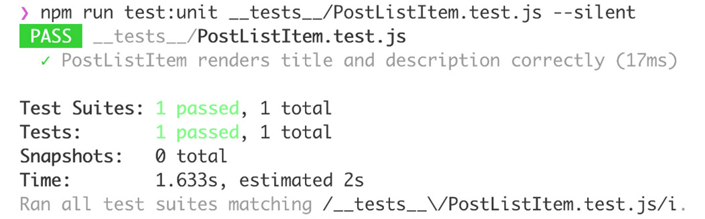

图 12.5：PostList 测试输出

一个更好的解决方案是使用`mount`函数，它渲染完整的组件树，而`shallow`函数只会渲染正在渲染的组件的子组件。使用`mount`，我们可以断言标题和描述被渲染到页面上。

这种方法的缺点是我们同时测试了`PostList`组件和`PostListItem`组件，因为`PostList`组件不渲染标题或描述；它渲染一组`PostListItem`组件，这些组件反过来渲染相关的标题和描述。

代码如下：

```js
import { shallowMount, mount } from '@vue/test-utils'
import PostList from '../src/components/PostList.vue'
// other imports and tests
test('PostList renders passed title and description for each   passed post', () => {
  const wrapper = mount(PostList, {
    propsData: {
      posts: [
        {
          title: 'Title 1',
          description: 'Description 1'
        },
        {
          title: 'Title 2',
          description: 'Description 2'
        }
      ]
    }
  })
  const outputText = wrapper.text()
  expect(outputText).toContain('Title 1')
  expect(outputText).toContain('Description 1')
  expect(outputText).toContain('Title 2')
  expect(outputText).toContain('Description 2')
})
```

新的测试按照以下`npm run test:unit __tests__/PostList.vue`的输出通过：

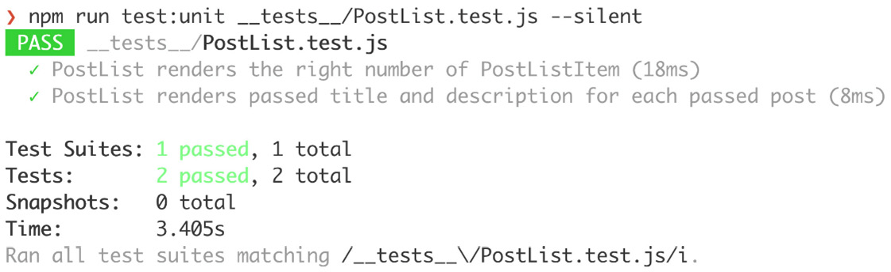

图 12.6：PostList 的浅渲染和挂载测试运行

我们现在已经看到了如何使用 Jest 和`vue-test-utils`为 Vue.js 组件编写单元测试。这些测试可以经常运行，测试运行在几秒内完成，这在我们处理新组件或现有组件时提供了几乎即时的反馈。

## 练习 12.01：构建和单元测试标签列表组件

当创建`posts`的测试用例时，我们用`vue`、`angularjs`和`react`填充了`tags`字段，但没有显示它们。为了使标签有用，我们将在帖子列表中显示标签。

要访问此练习的代码文件，请参阅[`packt.live/2HiTFQ1`](https://packt.live/2HiTFQ1)：

1.  我们可以首先编写一个单元测试，说明当传递一组标签作为 props 给`PostListItem`组件时，我们期望它做什么。它期望每个标签都会有一个前置的井号；例如，`react`标签将显示为`#react`。在`__tests__/PostListItem.test.js`文件中，我们可以添加一个新的`test`：

    ```js
    // rest of tests and imports
    test('PostListItem renders tags with a # prepended to   them', () => {
      const wrapper = shallowMount(PostListItem, {
        propsData: {
          tags: ['react', 'vue']
        }
      })
      expect(wrapper.text()).toMatch('#react')
      expect(wrapper.text()).toMatch('#vue')
    })
    ```

    当使用`npm run test:unit __tests__/PostListItem.test.js`运行此测试时，测试失败：

    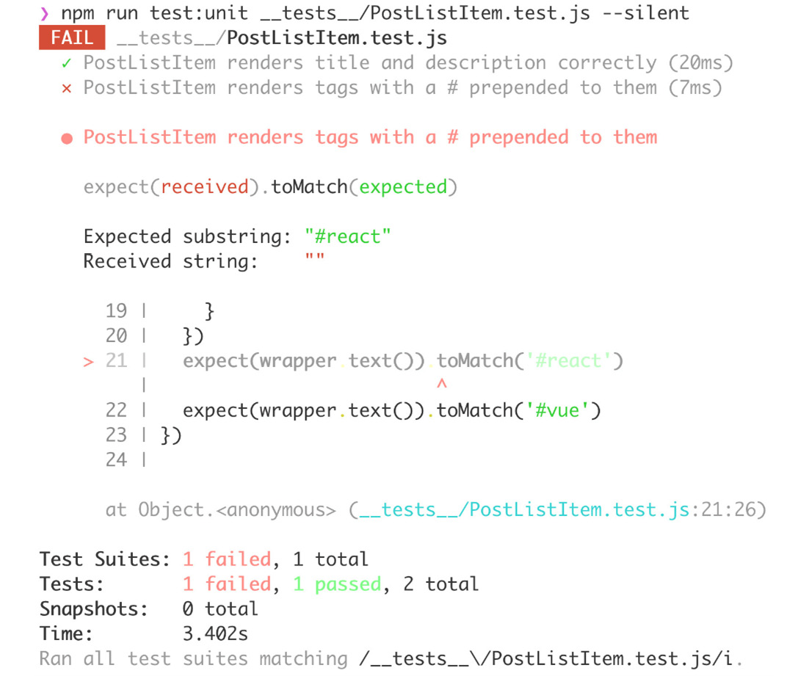

    图 12.7：PostListItem 标签测试失败

1.  接下来，我们应该在`src/components/PostListItem.vue`中实现标签列表渲染。我们将添加标签作为`Array`类型的 props，并使用`v-for`渲染标签：

    ```js
    <template>
        <!-- rest of template -->
        <div class="flex flex-row flex-wrap mt-4">
          <a
            v-for="tag in tags"
            :key="tag"
            class="flex text-xs font-semibold px-2 py-1 mr-2           rounded border border-blue-500 text-blue-500"
          >
            #{{ tag }}
          </a>
        </div>
        <!-- rest of template -->
    </template>
    <script>
    export default {
      props: {
        // rest of props
        tags: {
          type: Array,
          default: () => []
        }
      }
    }
    </script>
    ```

    在实现了`PostListItem`组件之后，单元测试现在应该通过：

    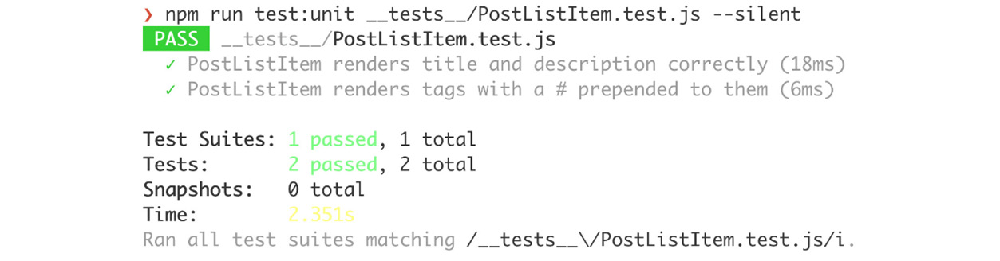

    图 12.8：PostListItem 单元测试通过

    然而，标签在应用程序中没有显示：

    ![图 12.9：显示没有标签的 PostList]

    正确的 PostListItem 实现

    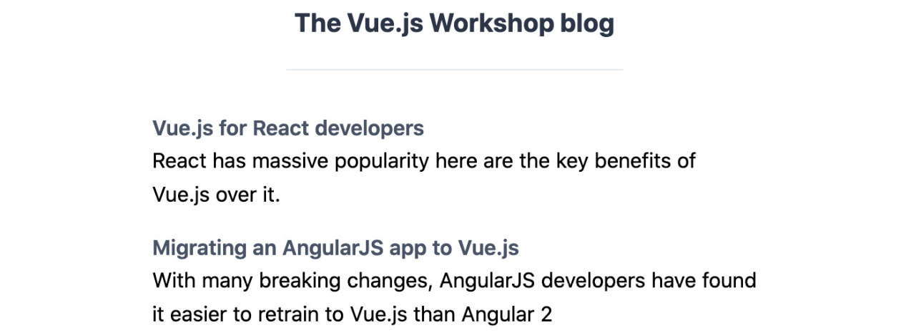

    图 12.9：尽管 PostListItem 实现正确，但 PostList 显示没有标签

1.  我们可以为 `PostList` 编写一个单元测试，以展示这种行为。本质上，我们将向我们的 `posts` 列表中传递一些标签，并运行 `PostListItem.test.js` 文件中已经存在的相同断言。我们将在 `__tests__/PostList.test.js` 中这样做：

    ```js
    // rest of tests and imports
    test('PostList renders tags for each post', () => {
      const wrapper = mount(PostList, {
        propsData: {
          posts: [
            {
              tags: ['react', 'vue']
            },
            {
              tags: ['html', 'angularjs']
            }
          ]
        }
      })
      const outputText = wrapper.text()
      expect(outputText).toContain('#react')
      expect(outputText).toContain('#vue')
      expect(outputText).toContain('#html')
      expect(outputText).toContain('#angularjs')
    })
    ```

    根据我们的应用程序输出，当使用 `npm run test:unit __tests__/PostList.test.js` 运行时，测试失败：

    ![图 12.10：PostList 标签测试失败]

    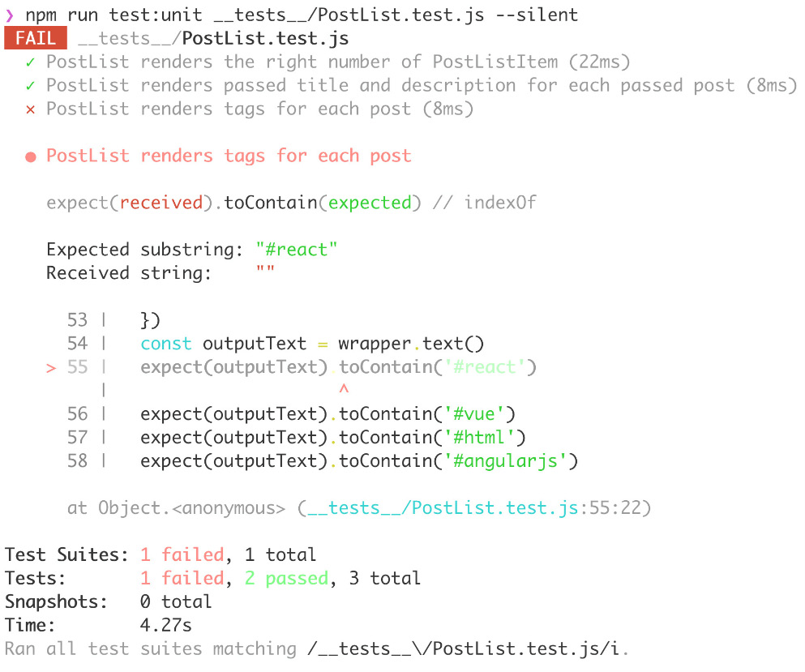

    图 12.10：PostList 标签测试失败

1.  为了修复这个测试，我们可以在 `src/components/PostList.vue` 中找到问题，这里的 `PostListItem` 的 `tags` 属性没有被绑定。通过更新 `src/components/PostList.vue` 来绑定 `tags` 属性，我们可以修复单元测试：

    ```js
    <template>
      <!-- rest of template-->
        <PostListItem
          v-for="post in posts"
          :key="post.slug"
          :title="post.title"
          :description="post.description"
          :tags="post.tags"
        />
      <!-- rest of template -->
    </template>
    ```

    失败的单元测试现在通过了，如下面的截图所示：

    ![图 12.11：PostList 标签测试通过]

    

图 12.11：PostList 标签测试通过

标签也出现在应用程序中，如下面的截图所示：

![图 12.12：带有标签的博客列表渲染]

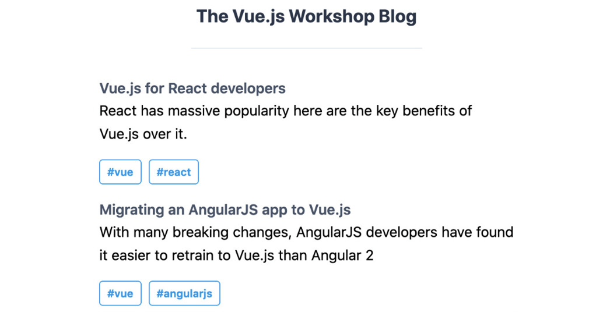

图 12.12：带有标签的博客列表渲染

我们已经看到了如何使用浅渲染和组件挂载来测试渲染的组件输出。让我们简要了解这些术语的含义：

+   **浅渲染**：这将在深度 1 处渲染，这意味着如果子元素是组件，它们将仅作为组件标签渲染；它们的模板将不会运行。

+   **挂载**：这将以与在浏览器中渲染相似的方式渲染整个组件树。

接下来，我们将探讨如何测试组件方法。

# 测试方法、过滤器和方法混合

由于 `click`、`input change`、`focus change` 和 `scroll`）。

例如，一个将输入截断为八个字符的过滤器将实现如下：

```js
<script>
export default {
  filters: {
    truncate(value) {
      return value && value.slice(0, 8)
    }
  }
}
</script>
```

有两种测试它的方法。我们可以直接通过导入组件并在某些输入上调用 `truncate` 来测试它，就像 `truncate.test.js` 文件中那样：

```js
import PostListItem from '../src/components/PostListItem.vue'
test('truncate should take only the first 8 characters', () => {
  expect(
    PostListItem.filters.truncate('longer than 8 characters')
  ).toEqual('longer t')
})
```

另一种方法是检查它在 `PostListItem` 组件中的使用情况：

```js
<template>
  <!-- rest of template -->
    <h3 class="flex text-md font-semibold text-gray-700">
      {{ title | truncate }}
    </h3>
  <!-- rest of template -->
</template>
```

现在，我们可以通过在 `PostListItem.test.js` 文件中将长标题传递给 `PostListItem` 组件来测试 `truncate`，我们在以下测试中这样做：

```js
// imports
test('PostListItem renders title and description correctly',   () => {
  const wrapper = shallowMount(PostListItem, {
    propsData: {
      title: 'Blog post title',
      description: 'Blog post description'
    }
  })
  expect(wrapper.text()).toMatch("Blog post title")
  expect(wrapper.text()).toMatch("Blog post description")
})
// other tests
```

前面的代码将生成以下截图所示的输出：

![图 12.13：PostListItem 测试失败，因为]

标题的内容被截断

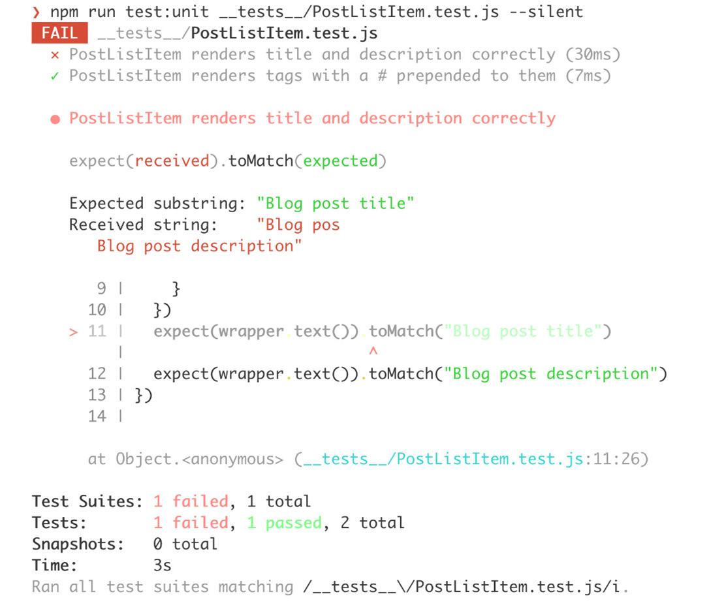

图 12.13：PostListItem 的标题测试失败，因为标题的内容被截断

为了修复这个问题，我们可以更新失败的测试，期望 `Blog pos` 而不是 `Blog post title`。

这两种方法都是测试过滤器的优秀方法。正如我们之前在`filters.truncate()`测试中看到的那样，它直接访问了`truncate`过滤器。较宽松的单元测试是使用传入的属性并验证组件输出的测试。更紧密的单元测试通常意味着测试更简单，但这也意味着有时以与最终用户感知非常不同的方式测试功能。例如，用户永远不会直接调用`filters.truncate()`。

我们已经看到了如何测试一个任意的`truncate`过滤器。现在我们将实现一个`ellipsis`过滤器并对其进行测试。

`ellipsis`过滤器将应用于帖子描述，并将其长度限制为`40`个字符加上`…`。

## 练习 12.02：构建和测试省略号过滤器

我们已经看到了如何测试一个任意的`truncate`过滤器；现在我们将实现一个`ellipsis`过滤器并对其进行测试。

要访问此练习的代码文件，请参阅[`packt.live/2UK9Mcs`](https://packt.live/2UK9Mcs)。

现在让我们看看构建和测试`ellipsis`过滤器的步骤：

1.  我们可以先为`ellipsis`过滤器编写一组测试（该过滤器将位于`src/components/PostListItem.vue`中）。一个测试应该检查如果传入的值少于`50`个字符，过滤器不做任何处理；另一个测试应该检查如果传入的值超过`50`个字符，它将截断到`50`个字符并附加`…`。我们将在`__tests__/ellipsis.test.js`文件中这样做：

    ```js
    import PostListItem from '../src/components/PostListItem.vue'
    test('ellipsis should do nothing if value is less than 50   characters', () => {
      expect(
        PostListItem.filters.ellipsis('Less than 50 characters')
      ).toEqual('Less than 50 characters')
    })
    test('ellipsis should truncate to 50 and append "..." when   longer than 50 characters', () => {
      expect(
        PostListItem.filters.ellipsis(
          'Should be more than the 50 allowed characters by a         small amount'
        )
      ).toEqual('Should be more than the 50 allowed characters by     a...')
    })
    ```

1.  我们现在可以在`src/components/PostListItem.vue`中实现`ellipsis`的逻辑。我们将添加一个带有`ellipsis`的`filters`对象，如果传入的值超过`50`个字符，它将使用`String#slice`，否则不做任何处理：

    ```js
    <script>
    export default {
      // rest of component properties
      filters: {
        ellipsis(value) {
          return value && value.length > 50
            ? `${value.slice(0, 50)}...`
            : value
        }
      }
    }
    </script>
    ```

    在这种情况下，现在测试通过`npm run test:unit __tests__/ellipsis.test.js`，如图*图 12.14*所示：

    ![图 12.14：省略号过滤器单元测试通过]

    ![图片 B15218_12_14.jpg]

    图 12.14：省略号过滤器单元测试通过

1.  现在，我们需要将我们的`ellipsis`过滤器集成到组件中。为了检查这能否工作，我们首先可以在`__tests__/PostListItem.test.js`中编写测试：

    ```js
    // other tests and imports
    test('PostListItem truncates long descriptions', () => {
      const wrapper = shallowMount(PostListItem, {
        propsData: {
          description: 'Very long blog post description that goes         over 50 characters'
        }
      })
      expect(wrapper.text()).toMatch("Very long blog post description     that goes over 50 ...")
    })
    ```

    这个测试失败了，因为我们没有在组件模板中使用过滤器。输出将如下所示：

    ![图 12.15：PostListItem 省略号测试失败]

    ![图片 B15218_12_15.jpg]

    ![图 12.15：PostListItem 省略号测试失败]

1.  为了使测试通过，我们需要将`description`属性通过`src/components/PostListItem.vue`中的`ellipsis`过滤器：

    ```js
    <template>
      <!-- rest of template -->
        <p class="flex leading-relaxed">{{ description | ellipsis }}      </p>
      <!-- rest of template -->
    </template>
    ```

    现在，测试将通过，如下面的截图所示：

    ![图 12.16：PostListItem 省略号测试通过]

    ![图片 B15218_12_16.jpg]

![图 12.16：PostListItem 省略号测试通过]

我们可以在浏览器中的应用程序界面中看到描述被截断，如下所示：

![图 12.17：博客帖子项描述被截断到 50 个字符]

![图片 B15218_12_17.jpg]

图 12.17：博客帖子项描述被截断到 50 个字符

我们已经看到了如何测试 Vue.js 组件的过滤器和其他属性，不仅可以通过直接针对对象进行测试，还可以通过测试它在组件级测试中的功能来测试。

接下来，我们将看到如何处理使用 Vue.js 路由的应用程序。

# 测试 Vue 路由

我们目前有一个渲染我们博客主页或**feed 视图**的应用程序。

接下来，我们应该有帖子页面。为此，我们将使用 Vue Router，如前几章所述，并确保我们的路由通过单元测试按设计工作。

Vue Router 使用`npm`安装，具体来说，`npm install vue-router`，并在`main.js`文件中进行配置：

```js
// other imports
import router from './router'
// other imports and configuration 
new Vue({
  render: h => h(App),
  router,
}).$mount(‹#app›)
```

`router.js`文件使用`Vue.use`将`vue-router`注册到 Vue 中，并实例化一个`VueRouter`实例：

```js
import Vue from 'vue'
import VueRouter from 'vue-router'
Vue.use(VueRouter)
export default new VueRouter({})
```

没有路由的路由器并不很有用。我们将在`router.js`文件中定义根路径（`/`），以显示`PostList`组件，如下所示：

```js
// other imports
import PostList from './components/PostList.vue'
// registering of Vue router
const routes = [
  {
    path: '/',
    component: PostList
  }
]
export default new VueRouter({
  routes
})
```

现在我们已经有了初始路由，我们应该更新`App.vue`文件以利用由路由器渲染的组件。我们将渲染`render-view`而不是直接使用`PostList`。然而，`posts`绑定保持不变：

```js
<template>
  <!-- rest of template -->
      <router-view
        :posts="posts"
      />
  <!-- rest of template -->
</template>
```

现在，`App.vue`文件中的帖子缺少一些核心数据来渲染`SinglePost`组件。我们需要确保有`slug`和`content`属性，以便在我们的`SinglePost`页面上渲染有用的内容：

```js
<script>
export default {
  data() {
    return {
      posts: [
        {
          slug: 'vue-react',
          title: 'Vue.js for React developers',
          description: 'React has massive popularity here are the             key benefits of Vue.js over it.',
          content:
            'React has massive popularity here are the key benefits               of Vue.js over it.
            See the following table, we'll also look at how the is               the content of the post.
            There's more, we can map React concepts to Vue and               vice-versa.',
          tags: ['vue', 'react'],
        },
        {
          slug: 'vue-angularjs',
          title: 'Migrating an AngularJS app to Vue.js',
          description: 'With many breaking changes, AngularJS developers             have found it easier to retrain to Vue.js than Angular 2',
          content:
            'With many breaking changes, AngularJS developers have               found it easier to retrain to Vue.js than Angular 2
            Vue.js keeps the directive-driven templating style while               adding a component model.
            It's performant thanks to a great reactivity engine.',
          tags: ['vue', 'angularjs']
        }
      ]
    }
  }
}
</script>
```

现在，我们可以开始工作在`SinglePost`组件上。目前，我们只是在模板中添加一些占位符。此外，`SinglePost`将接收`posts`作为属性，因此我们也可以填写这个属性：

```js
<template>
  <div class="flex flex-col w-full md:w-1/2 m-auto">
    <h2
      class="font-semibold text-sm mb-4"
    >
      Post: RENDER ME
    </h2>
    <p>Placeholder for post.content</p>
  </div>
</template>
<script>
export default {
  props: {
    posts: {
      type: Array,
      default: () => []
    }
  }
}
</script>
```

接下来，我们将在`router.js`中注册`SinglePost`，使用`/:postId`路径（这将通过`this.$route.params.postId`在组件中可用）：

```js
// other imports
import SinglePost from './components/SinglePost.vue'
// vue router registration
const routes = [
  // other route
  {
    path: '/:postId',
    component: SinglePost
  }
]
// exports and router instantiation
```

如果我们切换回实现`SinglePost`组件，我们将能够访问`postId`，它将映射到`posts`数组中的 slug，并且我们也有`posts`的访问权限，因为它被`App`绑定到`render-view`。现在我们可以创建一个计算属性`post`，它根据`postId`查找帖子：

```js
<script>
export default {
  // other properties
  computed: {
    post() {
      const { postId } = this.$route.params
      return posts.find(p => p.slug === postId)
    }
  }
}
</script>
```

从这个计算后的`post`属性中，我们可以提取`title`和`content`，如果`post`存在的话（我们必须注意那些不存在的帖子）。所以，在`SinglePost`中，我们可以添加以下计算属性：

```js
<script>
export default {
  // other properties
  computed: {
    // other computed properties
    title() {
      return this.post && this.post.title
    },
    content() {
      return this.post && this.post.content
    }
  }
}
</script>
```

然后，我们可以用计算属性的值替换模板中的占位符。因此，我们的模板最终如下所示：

```js
<template>
  <div class="flex flex-col w-full md:w-1/2 m-auto">
    <h2
      class="font-semibold text-sm mb-4"
    >
      Post: {{ title }}
    </h2>
    <p>{{ content }}</p>
  </div>
</template>
```

最后，我们应该在`PostListItem.vue`文件中使整个帖子项成为一个指向正确 slug 的`router-link`：

```js
<template>
  <router-link
    class="flex flex-col m-auto w-full md:w-3/5 lg:w-2/5 mb-4"
    :to="`/${slug}`"
  >
    <!-- rest of the template -->
  </router-link>
</template>
```

`router-link`是 Vue Router 特定的链接，这意味着在`PostList`页面上，点击帖子列表项时，我们将被带到正确的帖子 URL，如下面的截图所示：

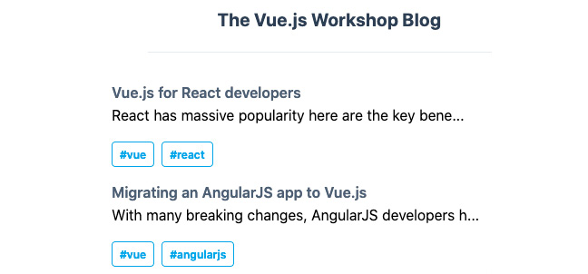

图 12.18：在浏览器中显示的帖子列表视图

我们将被重定向到正确的 URL，即文章的缩略语，这将通过 `slug` 渲染正确的文章，如图 *图 12.19* 所示。

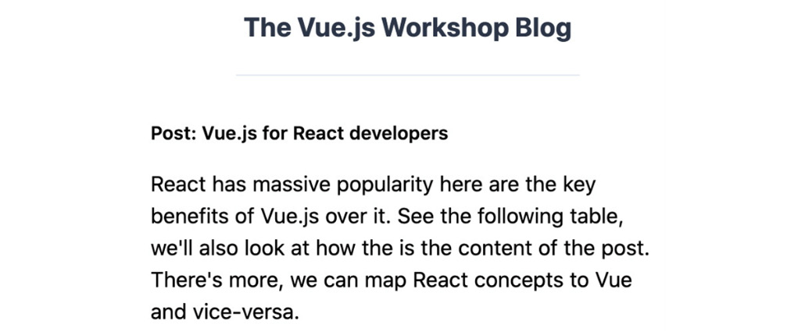

图 12.19：单篇文章视图在浏览器中显示

要测试 `vue-router`，我们将探索一个更适合测试具有路由和 Vuex 存储的应用程序的新库，即 Vue 测试库，该库可在 `npm` 上作为 `@testing-library/vue` 访问。

我们可以使用 `npm install --save-dev @testing-library/vue` 来安装它。

要测试 `SinglePost` 路由和渲染，我们执行以下操作。首先，我们应该能够通过点击 `PostList` 视图中的文章标题来访问 `SinglePost` 视图。为了做到这一点，我们通过检查内容（我们将看到两个带有标题的文章）来确认我们处于主页。然后我们点击一个文章标题并检查主页的内容已消失，文章内容已显示：

```js
import {render, fireEvent} from '@testing-library/vue'
import App from '../src/App.vue'
import router from '../src/router.js'
test('Router renders single post page when clicking a post title',   async () => {
  const {getByText, queryByText} = render(App, { router })
  expect(queryByText('The Vue.js Workshop Blog')).toBeTruthy()
  expect(queryByText('Vue.js for React developers')).toBeTruthy()
  expect(queryByText('Migrating an AngularJS app to Vue.js')).    toBeTruthy()
  await fireEvent.click(getByText('Vue.js for React developers'))
  expect(queryByText('Migrating an AngularJS app to Vue.js')).    toBeFalsy()
  expect(queryByText('Post: Vue.js for React developers')).    toBeTruthy()
  expect(
    queryByText(
      'React has massive popularity here are the key benefits of         Vue.js over it. See the following table, we'll also look at         how the is the content of the post. There's more, we can         map React concepts to Vue and vice-versa.'
    )
  ).toBeTruthy()
})
```

我们应该检查直接导航到有效的文章 URL 将产生正确的结果。为了做到这一点，我们将使用 `router.replace('/')` 来清除任何设置的状态，然后使用 `router.push()` 并带有一个文章缩略语。然后我们将使用前一个代码片段中的断言来验证我们是否在 `SinglePost` 页面，而不是主页：

```js
test('Router renders single post page when a slug is set',   async () => {
  const {queryByText} = render(App, { router })
  await router.replace('/')
  await router.push('/vue-react')
  expect(queryByText('Migrating an AngularJS app to Vue.js')).    toBeFalsy()
  expect(queryByText('Post: Vue.js for React developers')).    toBeTruthy()
  expect(
    queryByText(
      'React has massive popularity here are the key benefits of         Vue.js over it. See the following table, we'll also look at         how the is the content of the post. There's more, we can map         React concepts to Vue and vice-versa.'
    )
  ).toBeTruthy()
})
```

当使用 `npm run test:unit __tests__/SinglePost.test.js` 运行这两个测试时，它们按预期工作。以下截图显示了所需的输出：

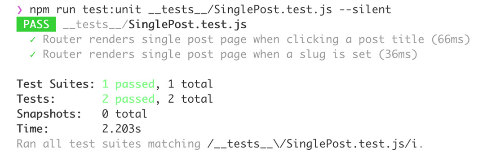

图 12.20：SinglePost 的路由测试通过

我们已经看到了如何使用 Vue.js 测试库来测试一个使用 `vue-router` 的应用程序。

## 练习 12.03：构建标签页面并测试其路由

与我们构建的单篇文章页面类似，我们现在将构建一个标签页面，它与 `PostList` 组件类似，只是只显示具有特定标签的文章，并且每篇文章都是一个链接到相关单篇文章视图的链接。

要访问此练习的代码文件，请参阅 [`packt.live/39cJqZd`](https://packt.live/39cJqZd)：

1.  我们可以从在 `src/components/TagPage.vue` 中创建一个新的 `TagPage` 组件开始。我们知道它将接收 `posts` 作为属性，并且我们希望渲染一个 `PostList` 组件：

    ```js
    <template>
      <div class="flex flex-col md:w-1/2 m-auto">
        <h3
        class="font-semibold text-sm text-center mb-6"
        >
          #INSERT_TAG_NAME
        </h3>
        <PostList :posts="[]" />
      </div>
    </template>
    <script>
    import PostList from './PostList'
    export default {
      components: {
        PostList
      },
      props: {
        posts: {
          type: Array,
          default: () => []
        }
      },
    }
    </script>
    ```

1.  接下来，我们想在 `src/router.js` 中将 `TagPage` 组件连接到路由器。我们将导入它并将其添加到 `routes` 中，路径为 `/tags/:tagName`：

    ```js
    // other imports
    import TagPage from './components/TagPage.vue'
    // Vue router registration
    const routes = [
      // other routes
      {
        path: '/tags/:tagName',
        component: TagPage
      }
    ]
    // router instantiation and export
    ```

1.  我们现在可以在计算属性中使用 `$route.params.tagName` 并创建一个 `tagPosts` 计算属性，该属性通过标签过滤文章：

    ```js
    <script>
    // imports
    export default {
      // rest of component
      computed: {
        tagName() {
          return this.$route.params.tagName
        },
        tagPosts() {
          return this.posts.filter(p => p.tags.includes(this.tagName))
        }
      }
    }
    </script>
    ```

1.  现在我们有了对 `tagPosts` 和 `tagName` 的访问权限，我们可以替换模板中的占位符。我们将渲染 `#{{ tagName }}` 并将 `tagPosts` 绑定到 `PostList` 的 `posts` 属性：

    ```js
    <template>
      <div class="flex flex-col md:w-1/2 m-auto">
        <h3
          class="font-semibold text-sm text-center mb-6"
        >
          #{{ tagName }}
        </h3>
        <PostList :posts="tagPosts" />
      </div>
    </template>
    ```

    现在，如果我们导航到例如 `/tags/angularjs`，页面将显示如下：

    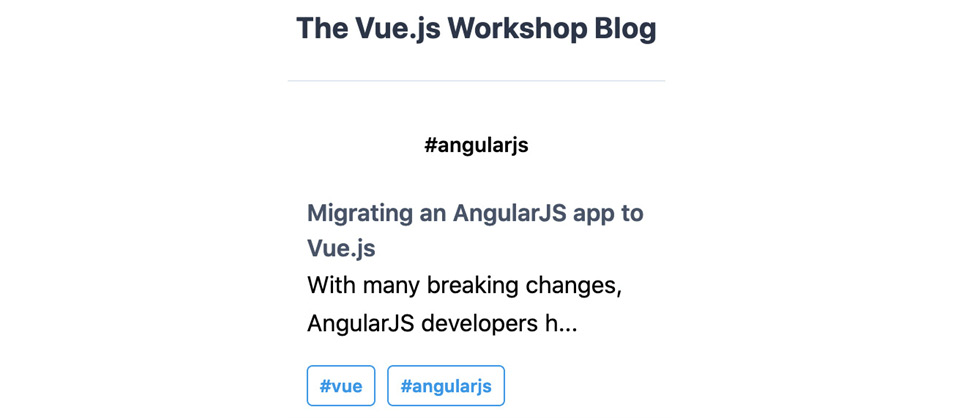

    图 12.21：angularjs 的标签页面

1.  下一步是将`PostListItem`中的标签锚点（`a`）转换为指向`/tags/${tagName}`的`router-link`（在`src/components/PostListItem.vue`中）：

    ```js
    <template>
      <!-- rest of template -->
          <router-link
            :to="`/tags/${tag}`"
            v-for="tag in tags"
            :key="tag"
            class="flex text-xs font-semibold px-2 py-1 mr-2           rounded border border-blue-500 text-blue-500"
          >
            #{{ tag }}
          </router-link>
      <!-- rest of template -->
    </template>
    ```

1.  现在是时候编写一些测试了。我们首先检查在主页上点击`#angularjs`会将我们带到`angularjs`标签页。我们将在`__tests__/TagPage.test.js`中如下编写：

    ```js
    import {render, fireEvent} from '@testing-library/vue'
    import App from '../src/App.vue'
    import router from '../src/router.js'
    test('Router renders tag page when clicking a tag in the post     list item', async () => {
      const {getByText, queryByText} = render(App, { router })
      expect(queryByText('The Vue.js Workshop Blog')).    toBeTruthy()
      expect(queryByText('Vue.js for React developers')).    toBeTruthy()
      expect(queryByText('Migrating an AngularJS app to Vue.js')).    toBeTruthy()
      await fireEvent.click(getByText('#angularjs'))
      expect(queryByText('Migrating an AngularJS app to Vue.js')).    toBeTruthy()
      expect(queryByText('Vue.js for React developers')).toBeFalsy()
      expect(queryByText('React')).toBeFalsy()
    })
    ```

1.  我们还应该测试直接访问标签 URL 是否按预期工作；也就是说，我们看不到不相关的内容：

    ```js
    // import & other tests
    test('Router renders tag page when a URL is set', async () => {
      const {queryByText} = render(App, { router })
      await router.push('/')
      await router.replace('/tags/angularjs')
      expect(queryByText('Migrating an AngularJS app to Vue.js')).    toBeTruthy()
      expect(queryByText('Vue.js for React developers')).    toBeFalsy()
      expect(queryByText('React')).toBeFalsy()
    })
    ```

    测试通过，因为应用程序按预期工作。因此，输出将如下所示：

    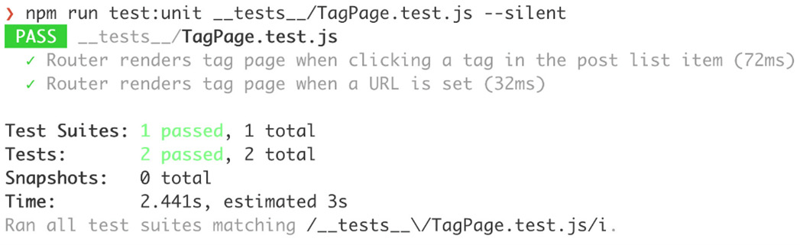

图 12.22：TagPage 路由测试通过命令行

我们已经看到了如何实现和测试一个包含`vue-router`的应用程序。在下一节中，我们将详细了解 Vuex 的测试。

# 测试 Vuex

为了展示如何测试依赖于 Vuex（Vue.js 的官方全局状态管理解决方案）的组件，我们将实现并测试新闻通讯订阅横幅。

首先，我们应该创建横幅模板。横幅将包含一个“订阅新闻通讯”的行动呼吁和一个关闭图标：

```js
<template>
  <div class="text-center py-4 md:px-4">
    <div
      class="py-2 px-4 bg-indigo-800 items-center text-indigo-100
      leading-none md:rounded-full flex md:inline-flex"
      role="alert"
    >
      <span
        class="font-semibold ml-2 md:mr-2 text-left flex-auto"
      >
        Subscribe to the newsletter
      </span>
      <svg
        class="fill-current h-6 w-6 text-indigo-500"
        role="button"
        xmlns="http://www.w3.org/2000/svg"
        viewBox="0 0 20 20"
      >
        <title>Close</title>
        <path
          d="M14.348 14.849a1.2 1.2 0 0 1-1.697 0L10 11.819l-2.651
          3.029a1.2 1.2 0 1 1-1.697-1.697l2.758-3.15-2.759-3.152a1\.            2
          1.2 0 1 1 1.697-1.697L10 8.183l2.651-3.031a1.2 1.2 0 1 1
          1.697 1.697l-2.758 3.152 2.758 3.15a1.2 1.2 0 0 1 0 1\.            698z"
        />
      </svg>
    </div>
  </div>
</template>
```

我们可以在`App.vue`文件中如下显示`NewsletterBanner`组件：

```js
<template>
  <!-- rest of template -->
    <NewsletterBanner />
  <!-- rest of template -->
</template>
<script>
import NewsletterBanner from './components/NewsletterBanner.vue'
export default {
  components: {
    NewsletterBanner
  },
  // other component properties
}
</script>
```

然后，我们将使用`npm install --save vuex`命令安装 Vuex。一旦安装了 Vuex，我们就可以在`store.js`文件中初始化我们的存储，如下所示：

```js
import Vue from 'vue'
import Vuex from 'vuex'
Vue.use(Vuex)
export default new Vuex.Store({
  state: {},
  mutations: {}
})
```

我们的 Vuex 存储也已在`main.js`文件中注册：

```js
// other imports
import store from './store'
// other configuration
new Vue({
  // other vue options
  store
}).$mount('#app')
```

为了决定是否显示新闻通讯横幅，我们需要在我们的存储中添加一个初始状态：

```js
// imports and configuration
export default new Vuex.Store({
  state: {
    dismissedSubscribeBanner: false
  }
})
```

要关闭横幅，我们需要一个突变，该突变将`dismissedSubscribeBanner`设置为`true`：

```js
// imports and configuration
export default new Vuex.Store({
  // other store configuration
  mutations: {
    dismissSubscribeBanner(state) {
      state.dismissedSubscribeBanner = true
    }
  }
})
```

现在，我们可以使用存储状态和`dismissSubscribeBanner`突变来决定是否显示横幅（使用`v-if`）以及是否关闭它（绑定到`close`按钮的点击）：

```js
<template>
  <div v-if="showBanner" class="text-center py-4 md:px-4">
    <!-- rest of template -->
      <svg
        @click="closeBanner()"
        class="fill-current h-6 w-6 text-indigo-500"
        role="button"
        xmlns=http://www.w3.org/2000/svg
        viewBox="0 0 20 20"
      >
    <!-- rest of the template -->
  </div>
</template>
<script>
export default {
  methods: {
    closeBanner() {
      this.$store.commit('dismissSubscribeBanner')
    }
  },
  computed: {
    showBanner() {
      return !this.$store.state.dismissedSubscribeBanner
    }
  }
}
</script>
```

在这一点上，横幅在浏览器中的样子如下：

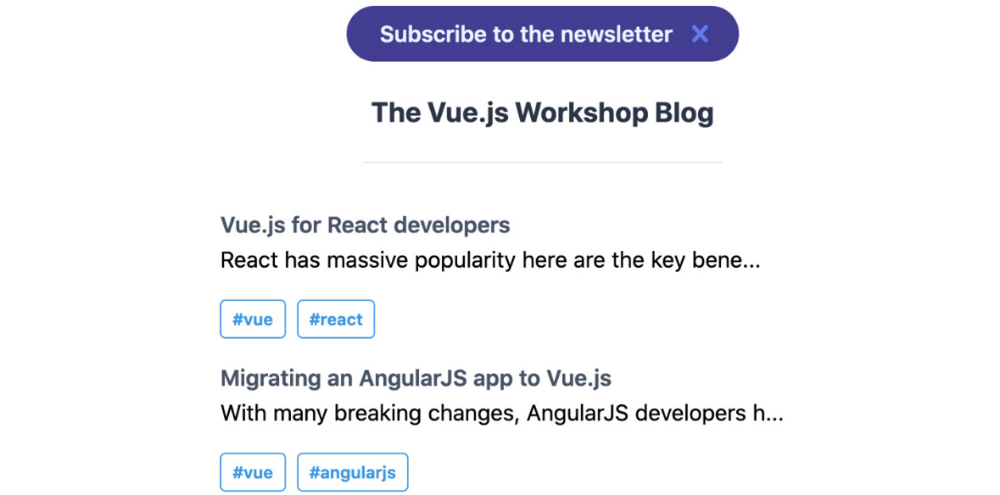

图 12.23：浏览器中显示的新闻通讯横幅

要编写单元测试，我们将使用 Vue 测试库，它提供了一个注入 Vuex 存储的功能。我们需要导入存储和`NewsletterBanner`组件。

我们可以先进行一个合理性检查，即默认情况下，新闻通讯横幅是显示的：

```js
import {render, fireEvent} from '@testing-library/vue'
import NewsletterBanner from '../src/components/  NewsletterBanner.vue'
import store from '../src/store'
test('Newsletter Banner should display if store is initialised   with it not dismissed', () => {
  const {queryByText} = render(NewsletterBanner, { store })
  expect(queryByText('Subscribe to the newsletter')).toBeTruthy()
})
```

下一个检查应该是，如果存储有`dismissedSubscribeBanner: true`，则横幅不应显示：

```js
// imports and other tests
test('Newsletter Banner should not display if store is initialised with   it dismissed', () => {
  const {queryByText} = render(NewsletterBanner, { store: {
    state: {
      dismissedSubscribeBanner: true
    }
  } })
  expect(queryByText('Subscribe to the newsletter')).toBeFalsy()
})
```

我们将要进行的最后一个测试是确保点击横幅的关闭按钮会将突变提交到存储中。我们可以通过将存根作为`dismissSubscribeBanner`突变注入，并检查在点击关闭按钮时是否被调用来实现这一点：

```js
// imports and other tests
test('Newsletter Banner should hide on "close" button click',   async () => {
  const dismissSubscribeBanner = jest.fn()
  const {getByText} = render(NewsletterBanner, {
    store: {
      ...store,
      mutations: {
        dismissSubscribeBanner
      }
    }
  })
  await fireEvent.click(getByText('Close'))
  expect(dismissSubscribeBanner).toHaveBeenCalledTimes(1)
})
```

当使用`npm run test:unit __tests__/NewsletterBanner.test.js`运行时，测试将通过，如下所示：

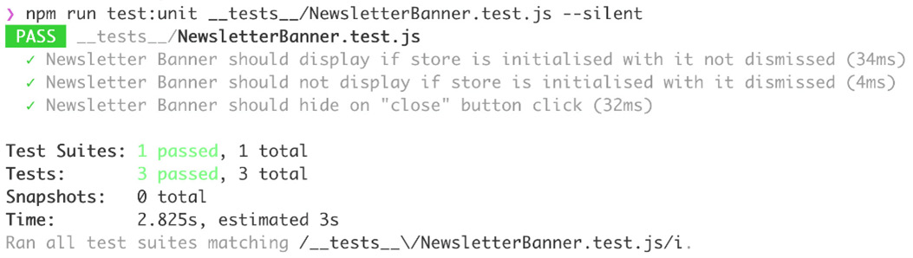

图 12.24：通过命令行执行的 NewsletterBanner 单元测试

我们已经看到了如何使用 Vue.js 测试库来测试由 Vuex 驱动的应用程序功能。

## 练习 12.04：构建和测试 cookie 免责声明横幅（Vuex）

我们现在将探讨如何使用 Vuex 实现 cookie 免责声明横幅，以及如何使用 Vue.js 测试库进行测试。

我们将在 Vuex 中存储 cookie 横幅是否显示（默认为`true`）；当横幅关闭时，我们将将其存储在 Vuex 中。

使用模拟 Vuex 存储来测试此打开/关闭操作。要访问此练习的代码文件，请参阅[`packt.live/36UzksP`](https://packt.live/36UzksP)：

1.  创建一个带有加粗标题`Cookies Disclaimer`、免责声明和`I agree`按钮的绿色 cookie 横幅。我们将在`src/components/CookieBanner.vue`中创建此组件：

    ```js
    <template>
      <div
        class="flex flex-row bg-green-100 border text-center       border-green-400
        text-green-700 mt-8 px-4 md:px-8 py-3 rounded relative"
        role="alert"
      >
        <div class="flex flex-col">
          <strong class="font-bold w-full flex">Cookies Disclaimer
          </strong>
          <span class="block sm:inline">We use cookies to improve your experience</span>
        </div>
        <button
          class="ml-auto align-center bg-transparent         hover:bg-green-500
          text-green-700 font-semibold font-sm hover:text-white         py-2 px-4 border
          border-green-500 hover:border-transparent rounded"
        >
          I agree
        </button>
      </div>
    </template>
    ```

1.  接下来，我们将在`src/App.vue`中导入、注册并渲染`CookieBanner`组件到`router-view`下方：

    ```js
    <template>
      <!-- rest of template -->
          <CookieBanner />
      <!-- rest of template -->
    </template>
    <script>
    // other imports
    import CookieBanner from './components/CookieBanner.vue'
    export default {
      components: {
        // other components
        CookieBanner
      },
      // other component properties
    }
    </script>
    ```

1.  添加一个`state`切片来控制是否显示 cookie 横幅。在我们的 Vuex 存储中，我们将初始化此`acceptedCookie`字段为`false`：

    ```js
    // imports and configuration
    export default new Vuex.Store({
      state: {
        // other state fields
        acceptedCookie: false
      },
      // rest of vuex configuration
    })
    ```

1.  我们还需要一个`acceptCookie`突变来关闭横幅：

    ```js
    // imports and configuration
    export default new Vuex.Store({
      // rest of vuex configuration
      mutations: {
        // other mutations
        acceptCookie(state) {
          state.acceptedCookie = true
        }
      }
    })
    ```

1.  接下来，我们将暴露存储状态作为`acceptedCookie`计算属性。我们将创建一个`acceptCookie`函数，该函数触发`acceptCookie`突变：

    ```js
    export default {
      methods: {
        acceptCookie() {
          this.$store.commit('acceptCookie')
        }
      },
      computed: {
        acceptedCookie() {
          return this.$store.state.acceptedCookie
        }
      }
    }
    </script>
    ```

1.  我们将使用`v-if`在尚未接受 cookie 时显示横幅。当点击`I agree`按钮时，通过切换`acceptCookie`来关闭横幅：

    ```js
    <template>
      <div
        v-if="!acceptedCookie"
        class="flex flex-row bg-green-100 border text-center       border-green-400
        text-green-700 mt-8 px-4 md:px-8 py-3 rounded relative"
        role="alert"
      >
        <!-- rest of template -->
        <button
          @click="acceptCookie()"
          class="ml-auto align-center bg-transparent         hover:bg-green-500
          text-green-700 font-semibold font-sm hover:text-white         py-2 px-4 border
          border-green-500 hover:border-transparent rounded"
        >
          I agree
        </button>
      </div>
    </template>
    ```

    现在我们已经得到了一个 cookie 横幅，直到点击`I agree`才会显示，如下面的截图所示：

    ![图 12.25：浏览器中显示的 cookie 横幅]

    ![img/B15218_12_25.jpg]

    图 12.25：浏览器中显示的 cookie 横幅

1.  现在，我们将编写一个测试来检查`CookieBanner`组件是否默认显示：

    ```js
    import {render, fireEvent} from '@testing-library/vue'
    import CookieBanner from '../src/components/CookieBanner.vue'
    import store from '../src/store'
    test('Cookie Banner should display if store is initialised with   it not dismissed', () => {
      const {queryByText} = render(CookieBanner, { store })
      expect(queryByText('Cookies Disclaimer')).toBeTruthy()
    })
    ```

1.  我们还将编写一个测试来检查如果存储中的`acceptedCookie`为`true`，则 cookie 横幅不会显示：

    ```js
    test('Cookie Banner should not display if store is initialised   with it dismissed', () => {
      const {queryByText} = render(CookieBanner, { store: {
        state: {
          acceptedCookie: true
        }
      } })
      expect(queryByText('Cookies Disclaimer')).toBeFalsy()
    })
    ```

1.  最后，我们希望检查当点击`I agree`按钮时，会触发`acceptCookie`突变：

    ```js
    test('Cookie Banner should hide on "I agree" button click',   async () => {
      const acceptCookie = jest.fn()
      const {getByText} = render(CookieBanner, {
        store: {
          ...store,
          mutations: {
            acceptCookie
          }
        }
      })
      await fireEvent.click(getByText('I agree'))
      expect(acceptCookie).toHaveBeenCalledTimes(1)
    })
    ```

    当我们使用`npm run test:unit __tests__/CookieBanner.test.js`运行我们编写的三个测试时，它们都会通过，如下所示：

    ![图 12.26：cookie 横幅测试通过]

    ![img/B15218_12_26.jpg]

图 12.26：cookie 横幅测试通过

我们已经看到了如何测试依赖于 Vuex 进行状态和更新的组件。

接下来，我们将探讨快照测试，看看它是如何简化渲染输出的测试的。

# 快照测试

**快照测试**提供了一种为快速变化的代码片段编写测试的方法，而不需要将断言数据内联到测试中。它们存储快照。

快照的更改反映了输出的更改，这对于代码审查非常有用。

例如，我们可以在`PostList.test.js`文件中添加一个快照测试：

```js
// imports and tests
test('Post List renders correctly', () => {
  const wrapper = mount(PostList, {
    propsData: {
      posts: [
        {
          title: 'Title 1',
          description: 'Description 1',
          tags: ['react', 'vue']
        },
        {
          title: 'Title 2',
          description: 'Description 2',
          tags: ['html', 'angularjs']
        }
      ]
    }
  })
  expect(wrapper.text()).toMatchSnapshot()
})
```

当我们再次运行此测试文件时，使用`npm run test:unit __tests__/PostList.test.js`，我们将得到以下输出：

![图 12.27：第一次运行快照测试]

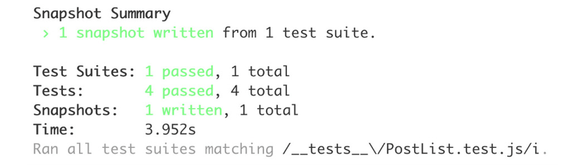

图 12.27：第一次运行快照测试

快照已写入`__tests__/__snapshots__/PostList.test.js.snap`，如下所示：

```js
// Jest Snapshot v1, https://goo.gl/fbAQLP
exports[`Post List renders correctly 1`] = `
"Title 1 Description 1 
      #react

      #vue
    Title 2 Description 2 
      #html

      #angularjs"
`;
```

这使得我们可以快速看到这些更改在具体输出方面的含义。

我们现在已经看到了如何使用快照测试。接下来，我们将把本章学到的所有工具结合起来，添加一个新页面。

## 活动十二.01：通过测试添加一个简单的按标题搜索页面

我们已经构建了一个帖子列表页面、单个帖子视图页面和按标签分类的帖子页面。

在博客上重新展示旧内容的一个好方法是通过实现良好的搜索功能。我们将向`PostList`页面添加搜索功能：

1.  在新文件`src/components/SearchForm.vue`中创建一个带有输入和按钮的搜索表单。

1.  现在，我们将通过导入、注册并在`src/App.vue`中渲染来使表单显示。

    现在，我们可以在应用程序中看到搜索表单，如下所示：

    ![图 12.28：带有搜索表单的帖子列表视图]

    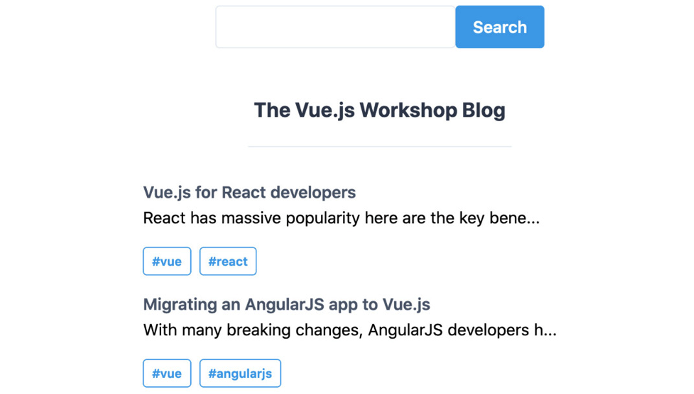

    图 12.28：带有搜索表单的帖子列表视图

1.  我们现在准备好为搜索表单添加一个快照测试。在`__tests__/SearchForm.test.js`中，我们应该添加`SearchForm should match expected HTML`。

1.  我们希望使用`v-model`跟踪搜索表单输入的内容，以双向绑定`searchTerm`实例变量和输入内容。

1.  当提交搜索表单时，我们需要更新 URL 以包含正确的参数。这可以通过`this.$router.push()`来完成。我们将把搜索存储在`q`查询参数中。

1.  我们希望将`q`查询参数的状态反映在搜索表单输入中。我们可以通过从`this.$route.query`中读取`q`并将其设置为`SearchForm`组件状态中`searchTerm`数据字段的初始值来实现这一点。

1.  接下来，我们希望过滤主页上传递给`PostList`的帖子。我们将使用`this.$route.query.q`在一个计算属性中过滤帖子标题。这个新的计算属性将替代`src/App.vue`中的`posts`。

1.  接下来，我们应该添加一个测试，更改搜索查询参数，并检查应用程序是否显示正确的结果。为此，我们可以导入`src/App.vue`、`src/store.js`和`src/router.js`，并使用存储和路由渲染应用程序。然后，我们可以通过使用字段的占位符为`Search`来更新搜索字段的内容。最后，我们可以通过点击`test id`为`Search`（即搜索按钮）的元素来提交表单。

    注意

    这个活动的解决方案可以通过这个链接找到。

# 摘要

在本章中，我们探讨了测试不同类型 Vue.js 应用程序的不同方法。

通常来说，测试对于从经验上证明系统正在正常工作是有用的。单元测试是最容易构建和维护的，应该是测试功能的基础。系统测试是测试金字塔的下一层级，它使你能够对大多数功能按预期工作充满信心。端到端测试表明整个系统的主流程正在正常工作。

我们已经看到了如何对组件、过滤器、组件方法和混入进行单元测试，以及如何通过层进行测试，以及以黑盒方式测试组件输出而不是检查组件内部以测试功能。使用 Vue.js 测试库，我们已经测试了利用 Vuex 的高级功能，如路由和应用程序。

最后，我们探讨了快照测试，并看到了它如何成为为模板密集型代码块编写测试的有效方式。

在下一章中，我们将探讨可以应用于 Vue.js 应用的端到端测试技术。
