# 附录

# 1. 开始你的第一个 Vue 项目

## 活动一.01：使用 Vue.js 构建动态购物清单应用

**解决方案：**

要访问此活动的代码文件，请参阅[`packt.live/35Tkzau`](https://packt.live/35Tkzau)。

1.  通过运行`vue create new-activity-app`命令使用 Vue CLI 创建一个新的 Vue 项目。通过命令提示符手动选择`dart-sass`、`babel`和`eslint`功能。

1.  使用占位符“按 Enter 键添加新项目”创建一个输入字段，并将其`v-model`绑定到名为`input`的数据对象上，同时设置`ref`属性值为`input`。通过使用`@keyup.enter`并引用`addItem`方法，将`Enter`键绑定到`addItem`方法，该方法将在下一步创建：

    ```js
    <template>
      <div class="container">
        <h2>Shopping list</h2>
        <div class="user-input">
          <input
            placeholder="Press enter to add new item"
            v-model="input"
            @keyup.enter="addItem"
            ref="input"
          />
        </div>
      </div>
    </template>
    <script>
    export default {
      data() {
        return {
          input: '',
        }
      },
    }
    </script>
    <style lang="scss">
    @import 'styles/global';
    $color-green: #4fc08d;
    $color-grey: #2c3e50;
    .container {
      max-width: 600px;
      margin: 80px auto;
    }
    // Type
    .h2 {
      font-size: 21px;
    }
    .user-input {
      display: flex;
      align-items: center;
      padding-bottom: 20px;
      input {
        width: 100%;
        padding: 10px 6px;
        margin-right: 10px;
      }
    }
    </style>
    ```

1.  在`addItem`上引入一个绑定点击事件的按钮，并在`methods`对象中包含相应的`addItem()`方法。在`addItem()`方法中，将数据属性`input`的字符串推入`shoppingList`，并添加一个检查以确保`input`属性存在。可选地，为你的按钮添加一些样式：

    ```js
    <template>
      <div class="container">
        <h2>Shopping list</h2>
        <div class="user-input">
          <input
            placeholder="Press enter to add new item"
            v-model="input"
            @keyup.enter="addItem"
            ref="input"
          /><button @click="addItem">Add item</button>
        </div>
      </div>
    </template>
    <script>
    export default {
      data() {
        return {
          input: '',
          shoppingList: [],
        }
      },
      methods: {
        addItem() {
          // Don't allow adding to the list if empty
          if (!this.input) return
          this.shoppingList.push(this.input)
          // Clear the input after adding
          this.input = ''
          // Focus the input element again for quick typing!
          this.$refs.input.focus()
        },
      },
    }
    </script>
    <style lang="scss">
    ...
    // Buttons
    button {
      appearance: none;
      padding: 10px;
      font-weight: bold;
      border-radius: 10px;
      border: none;
      background: $color-grey;
      color: white;
      white-space: nowrap;
      + button {
        margin-left: 10px;
      }
    }
    </style>
    ```

1.  在 DOM 中输出购物清单项。当你点击“添加项目”按钮时，它应该被添加到`shoppingList`并显示：

    ```js
    <template>
      <div class="container">
        ...
        <ul v-if="shoppingList">
          <li v-for="(item, i) in shoppingList" :key="i" class="item"
             ><span>{{ item }}</span>
            </li>
        </ul>
      </div>
    </template>
    <style lang="scss">
    .item {
      display: flex;
      align-items: center;
    }
    ul {
      display: block;
      margin: 0 auto;
      padding: 30px;
      border: 1px solid rgba(0, 0, 0, 0.25);
      > li {
        color: $color-grey;
        margin-bottom: 4px;
      }
    }
    </style>
    ```

    以下截图显示了购物清单：

    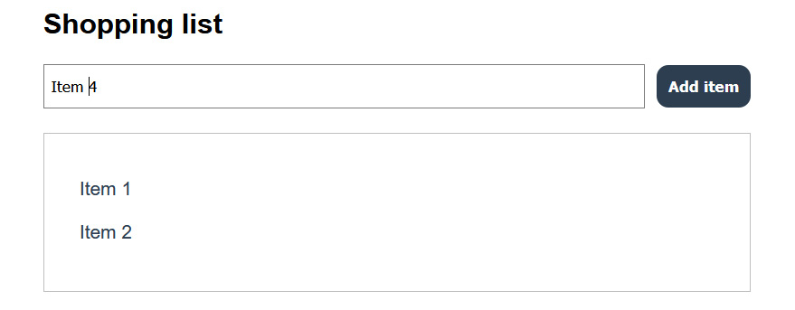

    图 1.44：购物清单应根据用户输入显示

1.  为了满足从列表中删除项目的最后要求，创建一个名为`deleteItem`的新方法，并允许传入一个名为`i`的参数。如果有参数传递到该方法中，过滤出该数组项并更新`shoppingList`属性；如果没有参数传递到该方法中，则用空数组替换数据属性：

    ```js
    ...
    <script>
    export default {
      data() {
        return {
          input: '',
          shoppingList: [],
        }
      },
      methods: {
        addItem() {
          // Don't allow adding to the list if empty
          if (!this.input) return
          this.shoppingList.push(this.input)
          // Clear the input after adding
          this.input = ''
          // Focus the input element again for quick typing!
          this.$refs.input.focus()
        },
        deleteItem(i) {
          this.shoppingList = i
            ? this.shoppingList.filter((item, x) => x !== i)
            : []
        },
      },
    }
    </script>
    ```

1.  创建一个“删除所有”按钮元素，并使用点击事件`@click`将其绑定到`deleteItem`方法：

    ```js
        <button class="button--delete" @click="deleteItem()">      Delete all</button>
    ...
    <style lang="scss">
    ...
    .button--delete {
      display: block;
      margin: 0 auto;
      background: red;
    }
    </style>
    ```

1.  在列表循环中添加一个“删除”按钮，通过传递`v-for`属性`i`来删除单个购物清单项：

    ```js
    <template>
      <div class="container">
        ...
        <ul v-if="shoppingList">
          <li v-for="(item, i) in shoppingList" :key="i" class="item"
            ><span>{{ item }}</span>
            <button class="button--remove" 
              @click="deleteItem(i)">Remove</button>
          </li>
        </ul>
        <br />
        <button class="button--delete" @click="deleteItem()">      Delete all</button>
      </div>
    </template>
    ...
    <style lang="scss">
    ...
    .button--remove {
      background: none;
      color: red;
      text-transform: uppercase;
      font-size: 11px;
      align-self: flex-end;
    }
    </style>
    ```

    *图 1.45* 显示了添加项目之前的购物清单所有详细信息：

    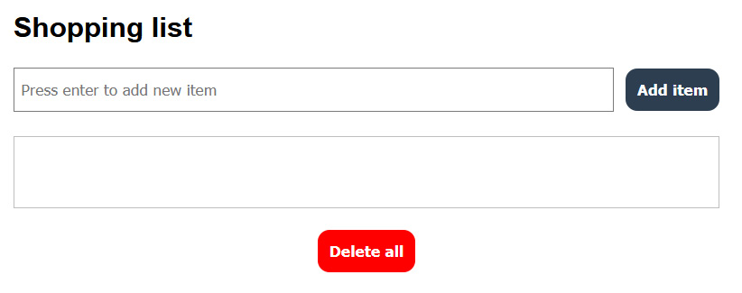

图 1.45：最终输出

以下截图显示了添加项目到购物清单后的输出：

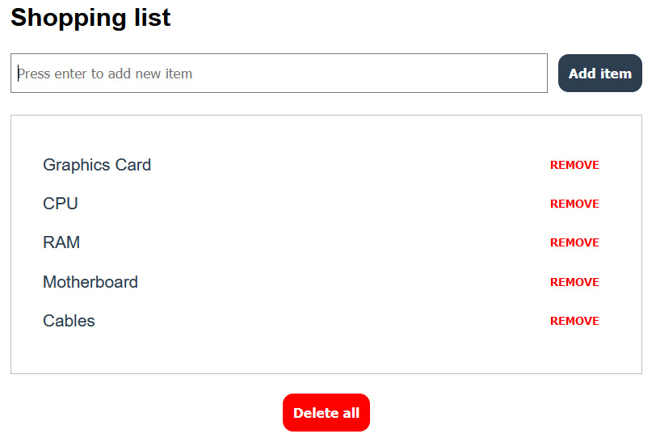

图 1.46：添加项目到购物清单后的最终输出

在这个活动中，你通过使用**SFC**的所有基本功能来测试你的 Vue 知识，例如表达式、循环、双向绑定和事件处理。你构建了一个购物清单应用，允许用户使用 Vue 方法添加和删除单个列表项，或者通过单击一次清除整个列表。

# 2. 数据处理

## 活动二.01：使用 Contentful API 创建博客列表

**解决方案：**

执行以下步骤以完成活动。

注意

要访问此活动的代码文件，请参阅[`packt.live/33ao1f5`](https://packt.live/33ao1f5)。

1.  使用 Vue CLI 的 `vue create activity` 命令创建一个新的 Vue 项目，并选择以下预设：Babel、SCSS 预处理器（您可以选择任一预处理器），以及 prettier 格式化器。

1.  添加 `contentful` 依赖项：

    ```js
    yarn add contentful
    ```

1.  在 `App.vue` 中，移除默认内容并将 `contentful` 导入到组件中：

    ```js
    <template>
      <div id=»app»>
      </div>
    </template>
    <script>
    import { createClient } from 'contentful'
    const client = createClient({
      space: ‹hpr0uushokd4›,
      accessToken: ‹jwEHepvQx-kMtO7_2ldjhE4WMAsiDp3t1xxBT8aDp7U›,
    })
    </script>
    <style lang="scss">
    #app {
      font-family: ‹Avenir›, Helvetica, Arial, sans-serif;
      -webkit-font-smoothing: antialiased;
      -moz-osx-font-smoothing: grayscale;
      text-align: center;
      color: #2c3e50;
      margin: 60px auto 0;
      max-width: 800px;
    }
    </style>
    ```

1.  在创建生命周期中向 `getPeople` 和 `getBlogPosts` 添加 `async` 方法，并将调用响应分别分配给模板中的 `authors` 和 `posts` 数据属性：

    ```js
    <template>
      <div id=»app»>
        <pre>{{ authors }}</pre>
        <pre>{{ posts }}</pre>
      </div>
    </template>
    <script>
    import { createClient } from 'contentful'
    const client = createClient({
      space: ‹hpr0uushokd4›,
      accessToken: ‹jwEHepvQx-kMtO7_2ldjhE4WMAsiDp3t1xxBT8aDp7U›,
    })
    export default {
      name: ‹app›,
      data() {
        return {
          authors: [],
          posts: {},
        }
      },
      async created() {
        this.authors = await this.getPeople()
        this.posts = await this.getBlogPosts()
      },
      methods: {
        async getPeople() {
          const entries = await client.getEntries({ content_type:         'person' })
          return entries.items
        },
        async getBlogPosts() {
          const entries = await client.getEntries({
            content_type: ‹blogPost›,
            order: ‹-fields.publishDate›,
          })
          return entries.items
        },
      },
    }
    </script>
    ```

1.  使用 `posts` 对象遍历文章，并输出 `publishDate`、`title`、`description` 和 `image`：

    ```js

      <div class=»articles»>
          <hr />
          <h2>Articles</h2>
          <section v-if=»posts» class=»articles-list»>
            <article v-for=»(post, i) in posts» :key=»i»>
              

     class=»article-text»>

    <div class="date">{{
                  new Date(post.fields.publishDate).toDateString()
                }}</div>
                <h4>{{ post.fields.title }}</h4>
                <p>{{ post.fields.description }}</p>
              </div>
            </article>
          </section>
        </div>
    ```

1.  向 `articles-list` 添加一些 `scss` 样式：

    ```js
    .articles-list {
      article {
        display: flex;
        text-align: left;
        padding-bottom: 15px;
        .article-text {
          padding: 15px 0;
        }
        .thumbnail {
          margin-right: 30px;
        }
        .date {
          font-size: 12px;
          font-weight: bold;
          text-transform: uppercase;
        }
      }
    }
    ```

1.  使用计算属性输出作者信息：

    ```js
    <template>
       ...

        <div v-if=»name» class=»author»>
          <h2
            >{{ name }} <br />
            <small v-if=»title» >{{ title }}</small></h2
          >
          <p v-if=»bio» >{{ bio }}</p>
        </div>
        ...
    </template>
    ...  
    computed: {
        name() {
          return this.authors[0] && this.authors[0].fields.name
        },
        title() {
          return this.authors[0] && this.authors[0].fields.title
        },
        bio() {
          return this.authors[0] && this.authors[0].fields.shortBio
        },
    },
    ...
    ```

    以下截图显示了作者信息以及他们的博客文章列表：

    ![图 2.16：使用 Contentful 博客文章的预期结果

    ![img/B15218_02_16.jpg]

图 2.16：使用 Contentful 博客文章的预期结果

在此活动中，您使用 Vue SFC 的基本功能构建了一个博客，列出了来自 API 源的文章，使用 `async` 方法从 API 获取远程数据，并使用计算属性组织深层嵌套的对象结构。

# 3. Vue CLI

## 活动 3.01：使用 Vue-UI 和 Vuetify 组件库构建 Vue 应用程序

**解决方案：**

执行以下步骤以完成活动。

注意

要访问此活动的代码文件，请参阅 [`packt.live/35WaCJG`](https://packt.live/35WaCJG)。

1.  打开命令行，运行 `vue create activity-app`。

1.  通过按一次 *向下箭头键* 并按 *Enter* 键选择最后一个选项，`手动选择功能`：

    ```js
    ? Please pick a preset: (Use arrow keys)
      default (babel, eslint)
     > Manually select features
    ```

1.  选择 `Babel`、`CSS 预处理器` 和 `检查器/格式化器`：

    ```js
    ? Check the features needed for your project:
     (*) Babel
     ( ) TypeScript
     ( ) Progressive Web App (PWA) Support
     ( ) Router
     ( ) Vuex
     (*) CSS Pre-processors
    >(*) Linter / Formatter
     ( ) Unit Testing
     ( ) E2E Testing
    ```

1.  选择 `Sass/SCSS (with dart-sass)`：

    ```js
    ? Pick a CSS pre-processor (PostCSS, Autoprefixer and CSS Modules are supported by default): (Use arrow keys)
    > Sass/SCSS (with dart-sass)
      Sass/SCSS (with node-sass)
      Less
      Stylus
    ```

1.  接下来，我们将选择 `Eslint+ Prettier` 来格式化代码：

    ```js
    ? Pick a linter / formatter config: (Use arrow keys)
     ESLint with error prevention only
     ESLint + Airbnb config
     ESLint + Standard config
    > ESLint + Prettier
    ```

1.  然后，我们将选择选项 `保存时检查` 和 `提交时检查和修复` 以选择额外的检查功能并保存它们：

    ```js
    ? Pick additional lint features: (Press <space> to select,  <a> to toggle all, <i> to invert selection)
     >(*) Lint on save
     (*) Lint and fix on commit
    ```

1.  要将配置放在专用文件中，我们将选择 `在专用配置文件中` 选项：

    ```js
    ? Where do you prefer placing config for Babel, PostCSS, ESLint,  etc.? (Use arrow keys)
     > In dedicated config files
     In package.json
    ```

    按 *Enter* 键跳过保存。`npm` 包将自动安装。您应该在终端看到以下输出：

    ```js
    yarn install v1.16.0
    info No lockfile found.
     [1/4] Resolving packages...
    ```

1.  安装完包后，运行 `yarn serve` 命令。然后，转到您的浏览器并导航到 `http://localhost:8080`。您应该看到以下输出：![图 3.43：默认 Vue 项目屏幕

    ![img/B15218_03_43.jpg]

    图 3.43：默认 Vue 项目屏幕

1.  停止 `serve` 任务，并在命令行中运行 `vue ui`。

1.  在 Vue-UI 内，转到项目选择屏幕（位于 `http://localhost:8000/project/select`）。

1.  点击 `导入` 按钮，导航到您新创建的 Vue 项目存储的文件夹。以下截图显示了您的屏幕应该看起来像什么：![图 3.44：Vue-UI 项目管理器

    ![img/B15218_03_44.jpg]

    图 3.44：Vue-UI 项目管理器

1.  点击大绿色的 `导入此文件夹` 按钮。

1.  从 `Projects` 仪表板导航到 `Plugins` 选项卡。

1.  点击 `+ 添加插件` 按钮。你的屏幕应该看起来像下面的截图：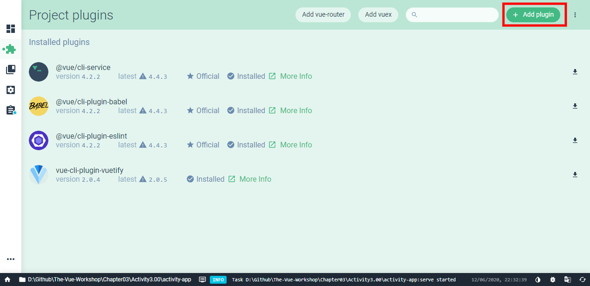

    图 3.45：Vue-UI 插件管理器，你可以在这里添加、删除和修改 Vue 插件

1.  搜索 `vuetify` 并安装 `vue-cli-plugin-vuetify`，然后选择默认配置设置，如图 3.46 所示：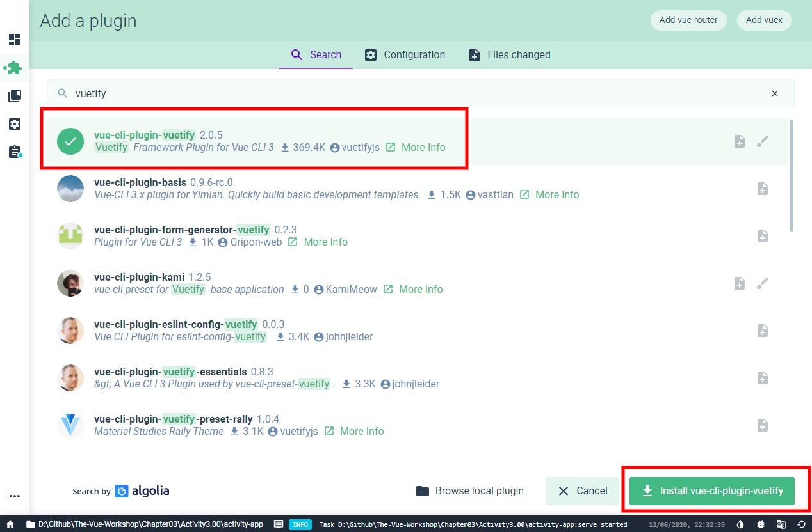

    图 3.46：安装 Vuetify CLI 时 App.vue 的默认配置

1.  导航到 `Tasks` 页面并点击 `Start Tasks`。当应用程序初始化时，点击 `Open App` 按钮。在 localhost URL 上，你应该看到一个如下所示的 Vuetify 风格的页面：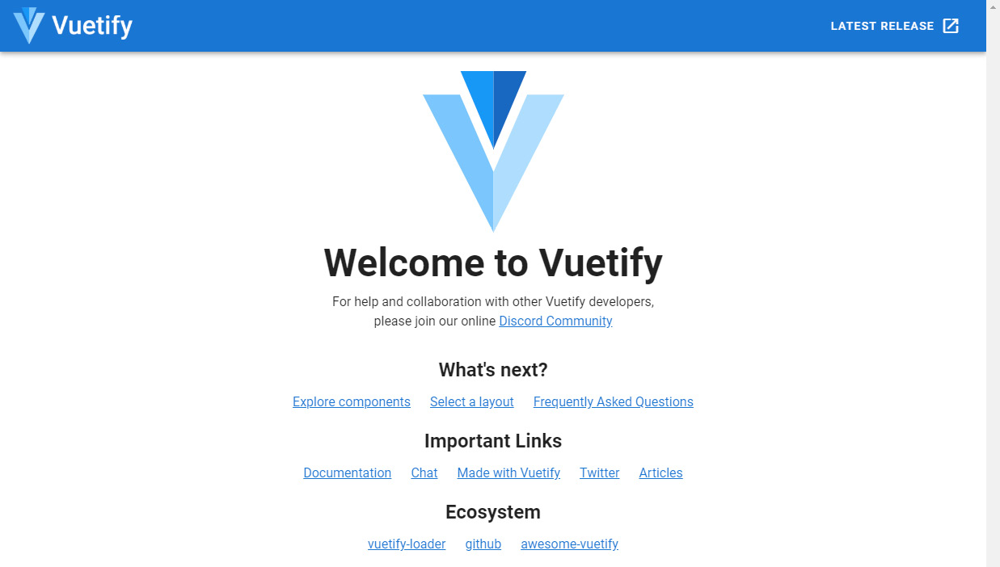

    图 3.47：当 Vuetify CLI 插件安装时你在浏览器中看到的内容

1.  点击 Vuetify 页面布局中的 `Select a layout` 超链接。

1.  从以下截图所示的选项中点击 `Baseline` 主题（或任何其他你感兴趣的主题）的代码链接：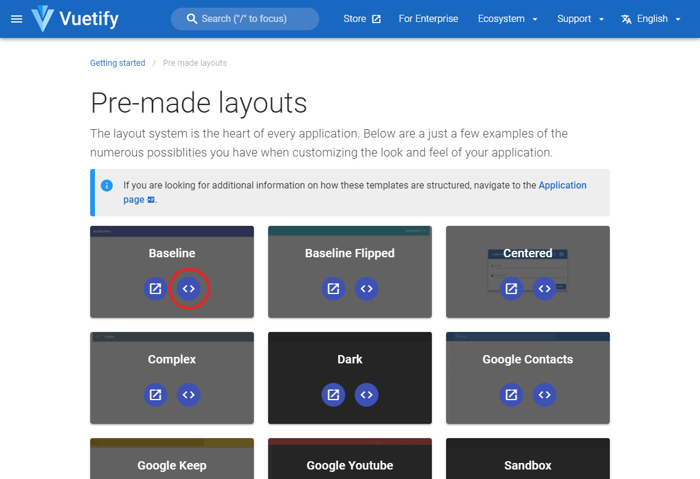

    图 3.48：Vuetify 网站提供了多个预制的布局

1.  从 Vuetify 仓库复制 `baseline.vue` 文件的内容，并用此内容替换你的 `App.vue` 文件内容。你的 `localhost:8080` 应该会重新加载你复制的内容，浏览器应显示如下：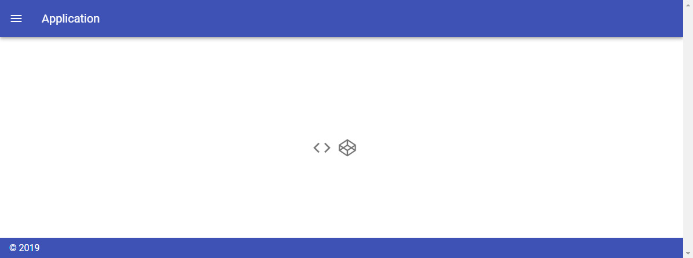

图 3.49：从浏览器中看到的模板最终结果

到此活动结束时，你看到了如何使用 Vue-UI 准备 Vue.js 项目，选择和组织用于企业级 Vue 应用程序生产的宝贵预设。你安装并使用了 `Vuetify` 框架，利用 Vuetify 组件创建了一个布局，然后你可以在浏览器中预览它。

# 4. 嵌套组件（模块化）

## 活动 4.01：具有可重用组件的本地消息视图

**解决方案**：

执行以下步骤以完成活动。

注意

要访问此活动的代码文件，请参阅 [`packt.live/36ZxyH8`](https://packt.live/36ZxyH8)。

首先，我们需要一种方法来捕获用户的消息：

1.  创建一个显示 `textarea` 的 `MessageEditor` 组件：

    ```js
    <template>
      <div>
        <textarea></textarea>
      </div>
    </template>
    ```

1.  使用 `data` 组件方法可以添加一个响应实例属性：

    ```js
    <script>
    export default {
      data() {
        return {
          message: ''
        }
      }
    }
    </script>
    ```

1.  当 `textarea` 发生 `change` 时，我们将状态存储在一个我们已在 `data` 组件方法中设置为 null 的 `message` 响应实例变量中：

    ```js
    <template>
      <!-- rest of the template -->
        <textarea
          @change="onChange($event)"
        >
        </textarea>
    </template>
    <script>
    export default {
      // rest of component properties
      methods: {
        onChange(event) {
          this.message = event.target.value
        }
      }
    }
    </script>
    ```

1.  一个 `Send` 操作应该导致 `textarea` 的最新内容作为 `send` 事件的负载发出：

    ```js
    <template>
      <!-- rest of the template -->
        <button @click="$emit('send', message)">Send</button>
      <!-- rest of the template -->
    </template>
    ```

1.  要显示 `MessageEditor`，我们需要导入它，在 `components` 中注册它，并在 `src/App.vue` 的 `template` 部分引用它：

    ```js
    <template>
      <div id="app">
        <MessageEditor />
      </div>
    </template>
    <script>
    import MessageEditor from './components/MessageEditor.vue'
    export default {
      components: {
        MessageEditor,
      },
    }
    </script>
    ```

1.  要显示消息，我们将使用 `@send` 监听 `send` 事件，并将每个有效负载添加到一个新的 `messages` 数组响应式实例变量中：

    ```js
    <template>
      <!-- rest of template -->
        <MessageEditor @send="onSend($event)" />
      <!-- rest of template -->
    </template>
    <script>
    // rest of script
    export default {
      // other component fields
      data() {
        return { messages: [] }
      },
      methods: {
        onSend(message) {
          this.messages = [...this.messages, message]
        }
      }
    }
    </script>
    ```

1.  `MessageFeed` 支持通过 `messages` 数组作为 `prop` 传递：

    ```js
    <template>
    </template>
    <script>
    export default {
      props: {
        messages: {
          type: Array,
          required: true
        }
      }
    }
    </script>
    ```

1.  我们将使用 `v-for` 来遍历 `messages` 数组：

    ```js
    <template>
        <div>
        <p v-for="(m, i) in messages" :key="i">
          {{ m }}
        </p>
      </div>
    </template>
    ```

1.  要显示我们存储的消息，我们将在 `App` 中渲染 `MessageFeed`，并将 `messages` 应用实例变量绑定为 `MessageFeed` 的 `messages` 属性：

    ```js
    <template>
      <!-- rest of template -->
        <MessageFeed :messages="messages" />
      <!-- rest of template -->
    </template>
    <script>
    // other imports
    import MessageFeed from './components/MessageFeed.vue'
    export default {
      components: {
        // other components,
        MessageFeed
      }
    }
    </script>
    ```

1.  在 `MessageEditor` 中，我们将重构 `send` 按钮点击 `handler`，以便在点击时也将 `this.message` 设置为 `''`：

    ```js
    <template>
      <!-- rest of template -->
        <textarea
          ref="textArea"
          @change="onChange($event)"
        >
        </textarea>
        <button @click="onSendClick()">Send</button>
      <!-- rest of template -->
    </template>
    <script>
    export default {
      // rest of component
      methods: {
        // other methods
        onSendClick() {
          this.$emit('send', this.message)
          this.message = ''
          this.$refs.textArea.value = ''
        }
      }
    }
    </script>
    ```

    预期输出如下：

    ![图 4.34：带有已发送的 Hello World! 和 Hello JavaScript! 的消息应用]

    ![图片 B15218_04_34.jpg]

图 4.34：带有已发送的 Hello World! 和 Hello JavaScript! 的消息应用

通过这样，我们已经学习了如何使用组件、属性、事件和引用来渲染聊天界面。

# 5. 全局组件组合

## 活动 5.01：使用插件和可重用组件构建 Vue.js 应用程序

**解决方案**：

完成此活动的步骤如下：

注意

要访问此活动的代码文件，请参阅 [`packt.live/35UlWpj`](https://packt.live/35UlWpj)。

1.  将 `axios` 安装到项目中：

    ```js
    npm install --save axios
    ```

1.  要将 `axios` 注入为 `this` 组件实例的属性，创建一个 `src/plugins/axios.js` 插件文件，在 `install` 时，这意味着组件实例将有一个 `axios` 属性：

    ```js
    import axios from 'axios'
    export default {
      install(Vue) {
        Vue.prototype.axios = axios
      }
    }
    ```

1.  为了使插件工作，请在 `src/main.js` 中导入并注册它：

    ```js
    // other imports
    import axiosPlugin from './plugins/axios.js'
    Vue.use(axiosPlugin)
    // other initialisation code
    ```

1.  我们还希望将我们的 API 的 `baseUrl` 注入到所有组件中。我们将在 `src/main.js` 文件中创建一个插件来执行此操作：

    ```js
    const BASE_URL = 'https://jsonplaceholder.typicode.com'
    Vue.use({
      install(Vue) {
        Vue.baseUrl = BASE_URL
        Vue.prototype.baseUrl = BASE_URL
      }
    })
    ```

    注意

    熟悉 `axios` 的人知道我们可以将此 URL 注入为 `axios` 的 `baseURL`。

1.  现在，我们需要从 `src/App.vue` 中获取所有 `todos`。在 `mounted` 生命周期方法中做这件事是个好地方：

    ```js
    <script>
    export default {
      async mounted() {
        const { data: todos } = await this.axios.get(      `${this.baseUrl}/todos`)
        this.todos = todos
      }
    }
    </script>
    ```

1.  要显示 `todo` 列表，我们将在 `src/components/TodoList.vue` 中创建一个 `TodoList` 函数式组件。这将接受一个 `todos` 属性，遍历项目，并在 `todo` 作用域插槽中绑定它以延迟渲染我们的 `todo`：

    ```js
    <template functional>
      <ul>
        <li v-for="todo in props.todos" :key="todo.id">
          <slot name="todo" :todo="todo" />
        </li>
      </ul>
    </template>
    ```

1.  我们现在可以使用 `TodoList` 组件来渲染出我们在 `src/App.vue` 中已经获取的 `todos` 属性：

    ```js
    <template>
      <div id="app">
        <TodoList :todos="todos">
          <template #todo="{ todo }">
          {{ todo.title }}
          </template>
        </TodoList>
      </div>
    </template>
    <script>
    import TodoList from './components/TodoList.vue'
    export default {
      components: {
        TodoList
      },
      // other component methods
      data() {
        return { todos: [] }
      }
    }
    </script>
    ```

    这将生成以下输出：

    ![图 5.23：正在加载 Todos 和显示标题]

    ![图片 B15218_05_23.jpg]

    ![图 5.23：正在加载 Todos 和显示标题]

    注意

    该数据集的链接，已作为 JSON API 公开，可在 [`jsonplaceholder.typicode.com/`](https://jsonplaceholder.typicode.com/) 找到。

1.  现在，让我们创建一个 `TodoEntry` 组件，我们将在这里实现大部分关于待办事项的逻辑。对于组件来说，一个好的做法是让 props 非常具体于组件的角色。在这种情况下，我们将处理的 `todo` 对象的属性是 `id`、`title` 和 `completed`，因此这些应该是我们的 `TodoEntry` 组件接收的 props。我们不会将 `TodoEntry` 制作成函数式组件，因为我们还需要一个组件实例来创建 HTTP 请求：

    ```js
    <template>
      <div>
        <label>{{ title }}</label>
        <input
          type="checkbox"
          :checked="completed"
        />
      </div>
    </template>
    <script>
    export default {
      props: {
        id: {
          type: Number,
          required: true
        },
        title: {
          type: String,
          required: true
        },
        completed: {
          type: Boolean,
          default: false
        }
      }
    }
    </script>
    ```

1.  更新 `src/App.vue` 以使其消费 `TodoEntry` 如下（确保绑定 `id`、`title` 和 `completed`）：

    ```js
    <template>
      <div id="app">
        <TodoList :todos="todos">
          <template #todo="{ todo }">
            <TodoEntry
            :id="todo.id"
            :title="todo.title"
            :completed="todo.completed"
          />
        </template>
      </TodoList>
     </div>
    </template>
    <script>
    // other imports
    import TodoEntry from './components/TodoEntry.vue'
    export default {
      components: {
      // other components
        TodoEntry
     },
     // other component methods
    }
    </script>
    ```

    我们将得到以下输出：

    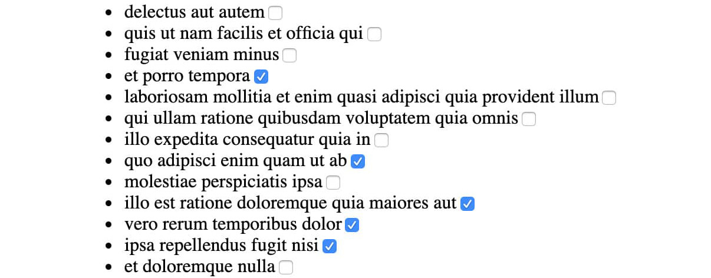

    图 5.24：TodoEntry 渲染从 API 获取的数据

1.  现在，我们需要添加切换 `src/components/TodoEntry.vue` 的功能。我们将监听 `input` 变更事件；在变更时，我们将读取新值，并向 `/todos/{todoId}` 发送一个包含 `completed` 设置为新值的 `PATCH` 请求。我们还将发出一个 Vue.js 中的 `completedChange` 事件，以便 `App` 组件可以更新内存中的数据：

    ```js
    <template>
      <!-- rest of the template -->
        <input       type="checkbox"
          :checked="completed"
          @change="toggleCompletion()"
        />
      <!-- rest of the template -->
    </template>
    <script>
    export default {
      // other component properties
      methods: {
        toggleCompletion() {
          const newCompleted = !this.completed 
          this.$emit('completeChange', newCompleted)
          this.axios.patch(
            `${this.baseUrl}/todos/${this.id}`,
            { completed: newCompleted }
          )
        }
      }
    }
    </script>
    ```

1.  在 `App.vue` 中，当触发 `completeChange` 事件时，我们需要更新相关的 `todo`。由于 `completeChange` 事件不包含我们 `todo` 的 ID，因此在我们设置 `handleCompleteChange` 函数以便它监听 `completeChange` 事件时，我们需要从上下文中读取那个 ID：

    ```js
    <template>
     <!-- rest of template -->
            <TodoEntry
              :id="todo.id"
              :title="todo.title"
              :completed="todo.completed"
              @completeChange="handleCompleteChange(todo.id, $event)"
            />
     <!-- rest of template -->
    </template>
    <script>
    // imports
    export default {
     // other component properties
      methods: {
        handleCompleteChange(id, newCompleted) {
          this.todos = this.todos.map(
            t => t.id === id
             ? { ...t, completed: newCompleted }
             : t
          )
        }
      }
    }
    </script>
    ```

    在这个阶段，我们应该看到以下输出：

    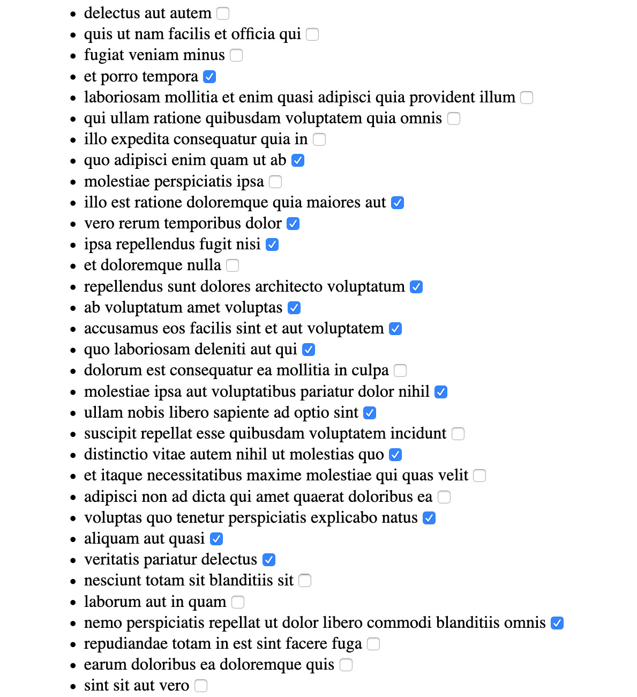

图 5.25：使用 JSON placeholder 数据的待办事项应用

通过这样，我们已经学会了如何使用插件和可重用组件来构建一个消费 `JSONPlaceholder` 数据的 `todo` 应用。

# 6. 路由

## 活动 6.01：创建一个带有动态嵌套路由和布局的消息单页应用

**解决方案：**

完成以下步骤以完成活动：

注意

要访问此活动的代码文件，请参阅 [`packt.live/2ISxml7`](https://packt.live/2ISxml7)。

1.  在 `src/views/` 文件夹中创建一个新的 `MessageEditor.vue` 文件，作为主要组件，用于与用户交互以编写消息。我们使用 `textarea` 作为消息输入字段，并将 `listener` 方法 `onChange` 绑定到 `DOM` 事件 `change` 上，以捕获用户输入的任何消息更改。此外，我们还添加了 `ref` 以保持对渲染的 HTML `textarea` 元素的指针记录，以便在稍后阶段修改我们保存的消息。

    除了这个之外，我们还附加了另一个 `listener` 方法 `onSendClick` 到 `提交按钮` 的 `click` 事件上，以捕获用户发送消息的确认。`onChange` 和 `onSendClick` 的实际逻辑实现显示在 *步骤 3* 中。

1.  `<template>` 部分 应该看起来像以下这样：

    ```js
    <template>
      <div>
        <textarea
          ref="textArea"
          @change="onChange($event)"
        >
        </textarea>
        <button @click="onSendClick()">Submit</button>
      </div>
    </template>
    ```

1.  在 `script` 中，除了之前的代码外，我们还将接收到一个 `list`，用于在提交新消息后更新，并将更新后的列表发送回父组件：

    ```js
    <script>
    export default {
      props: {
        list: Array
      },
      data() {
        return {
          message: ''
        }
      },
      methods: {
        onChange(event) {
          this.message = event.target.value
        },
        onSendClick() {
          if (!this.message) return;
          this.list.push(this.message);
          this.$emit('list:update', this.list);
          this.message = ''
          this.$refs.textArea.value = ''
        }
      },
    }
    </script>
    ```

1.  我们需要在 `./src/router/index.js` 中的路由数组中定义一个父路由作为默认路由，其 `path` 为 `/`，`name` 为 `messages`：

    ```js
    {
        path: '/',
        name: 'messages',
        component: () => import(/* webpackChunkName: "messages" */       '../views/Messages.vue'),
    }
    ```

    然后在 `children` 属性下添加一个新的路由作为嵌套路由，称为 `editor`：

    ```js
    {
        path: '/',
        name: 'messages',
        component: () => import(/* webpackChunkName: "messages" */       '../views/Messages.vue'),
        children: [{
          path: 'editor',
          name: 'editor',
          component: () => import(/* webpackChunkName: "editor" */         '../views/MessageList.vue'),
          props: true,
        }]
    },
    ```

1.  我们创建一个新的视图组件 `MessageList.vue`，使用 `v-for` 将消息列表渲染到 `router-link` 组件中：

    ```js
    <template>
      <div>
        <h2> Message Feed </h2>
        <div v-for="(m, i) in list" :key="i" >
          <router-link :to="`/message/${i}`">
            {{ i }}
            </router-link>
        </div>
    </div>
    </template>
    <script>
    export default {
      props: {
        list: {
          type: Array,
          default: () => []
        }
      }
    }
    </script>
    ```

1.  类似于 *步骤 2*，将 `MessageList.vue` 组件注册到 `messages` 路由的 `children` 路由数组中：

    ```js
    {
        path: '/',
        name: 'messages',
        component: () => import(/* webpackChunkName: "messages" */       '../views/Messages.vue'),
        children: [{
          path: 'list',
          name: 'list',
          component: () => import(/* webpackChunkName: "list" */         '../views/MessageList.vue'),
          props: true,
        }, {
          path: 'editor',
          name: 'editor',
          component: () => import(/* webpackChunkName: "editor" */         '../views/MessageEditor.vue'),
          props: true,
        }]
      },
    ```

1.  现在，我们的 `messages` 视图需要一个 UI。我们使用 `router-link` 定义 `Messages.vue` 视图，以允许在 `editor` 和 `list` 之间进行导航，并使用 `router-view` 组件来渲染嵌套视图：

    ```js
    <template>
      <div>
        <router-link :to="{ name: 'list', params: { list       }}">List</router-link> |
        <router-link :to="{ name: 'editor', params: { list       }}">Editor</router-link>
        <router-view :list.sync="list"/>
      </div>
    </template>
    <script>
    ```

    当然，我们需要从 `props` 接收一个 `messages` 的 `list`：

    ```js
    <script>
    export default {
      props: {
        list: Array
      }
    </script>
    ```

    由于我们没有全局状态或适当的数据库，我们需要在 `./src/router/index.js` 中模拟一个全局消息列表：

    ```js
    const messages = []
    ```

    然后将它作为默认 `props` 传递给 `messages` 路由，如下所示：

    ```js
    {
        path: '/',
        name: 'messages',
        /* ... */ 
        props: {
          list: messages
        },
    }
    ```

1.  为了捕捉用户是否正在离开当前编辑视图，我们将在组件内的 `beforeRouteLeave` 导航守卫上添加一个 Hook，这将允许我们显示警告并根据用户的决定中止或继续。这是在 `MessageEditor.vue` 文件中完成的：

    ```js
    beforeRouteLeave(to, from, next) {
          if (this.$refs.textArea.value !== '') {
            const ans = window.confirm(You have an unsaved message.           Are you sure you want to navigate away?');
            next(!!ans);
          }
          else {
            next();
          }
      }
    ```

1.  创建 `messageLayout.vue` 很简单，包括标题文本、来自 `props` 的 `content` 和一个 `返回按钮`：

    ```js
    <template>
      <div class="message">
        <h2>Message content:</h2>
        <main>
          <slot/>
        </main>
        <button @click="goBack">Back</button>
      </div>
    </template>
    ```

    `goBack` 逻辑应该是简单的：如果有保存的前一个路由，我们就使用 `this.$routes.go(-1)` 在导航栈中后退一步。否则，我们将使用 `this.$router.push({ name: 'message'})` 将 `messages` 导航路由推送到栈中：

    ```js
    <script>
    import MessageLayout from '../layouts/messageLayout.vue';
    export default {
      props: {
        content: {
          type: String,
          default: ''
        },
      },
      methods: {
        goBack() {
          if (this.$route.params.from) {
            this.$router.go(-1)
          }
          else {
            this.$router.push({
              name: 'messages'
            })
          }
        }
      }
    }
    </script>
    ```

    但然后我们仍然需要从跟踪中传递前一个路由，`this.$route.params.from`，应在路由注册时完成。

1.  我们在 `routes` 中添加 `message` 路由配置，并使用 `beforeEnter` 组件守卫将 `from` 前一个导航路由保存并传递到视图的 `params` 中。

    此外，由于它是一个具有 `message/:id` 模式的动态路由，我们需要检索消息内容并将其映射到相关的 prop 上：

    ```js
    {
        path: '/message/:id',
        name: 'message',
        component: () => import(/* webpackChunkName: "message" */       '../views/Message.vue'),
        props:true,
        beforeEnter(to, from, next) {
          if (to.params && to.params.id) {
            const id = to.params.id;

            if (messages && messages.length > 0 && id <           messages.length) {
              to.params.content = messages[id];
              }
          }
          to.params.from = from;
          next()
        },
      }
    ```

1.  最后，为了从 `Message.vue` 和 `Messages.vue` 中拆分 UI 布局，在 `./src/layouts` 文件夹中，我们创建了一个 `default.vue` 布局和一个 `messageLayout.vue` 布局。

    正如我们在本章所学，在 `App.vue` 中，我们将使用根据布局变量渲染的组件包裹 `router-view`。当然，`router-view` 需要一个同步的 `layout` 属性，以便根据当前视图动态更改布局：

    ```js
    <template>
      <div id="app">
        <component :is="layout">
          <router-view :layout.sync="layout"/>
        </component>
      </div>
    </template>
    <script>
    export default {
      data() {
        return {
          layout: () => import(/* webpackChunkName: "defaultLayout"         */ './layouts/default.vue')
        }
      }
    }
    </script>
    ```

1.  在 `default.vue` 中，我们只需为 `messages` 部分添加标题文本和一个 `slot`：

    ```js
    <template>
      <div class="default">
        <h1>Messages section</h1>
        <main>
          <slot/>
        </main>
      </div>
    </template>
    ```

1.  在 `messageLayout.vue` 中，我们将从 `Message.vue` 中提取标题文本和按钮逻辑：

    ```js
    <template>
      <div class="message">
        <h2>Message content:</h2>
        <main>
          <slot/>
        </main>
        <button @click="goBack">Back</button>
      </div>
    </template>
    <script>
    export default {
      methods: {
        goBack() {
          if (this.$route.params.from) {
            this.$router.go(-1)
          }
          else {
            this.$router.push({
              name: 'messages'
            })
          }
        }
      }
    }
    </script>
    ```

    最后一步是确保在组件创建时触发 `update:layout` 事件以更新 `Message.vue` 和 `Messages.vue` 的视图布局：

    ```js
    import MessageLayout from '../layouts/messageLayout.vue';
    export default {
    /*...*/
      created() {
        this.$emit('update:layout', MessageLayout);
      }
    }
    ```

    在 `Messages.vue` 中，这将如下所示：

    ```js
    <script>
    import DefaultLayout from '../layouts/default';
    export default {
      props: {
        list: Array
      },
      created() {
        this.$emit('update:layout', DefaultLayout);
      }
    }
    </script>
    ```

1.  使用以下命令运行应用程序：

    ```js
    yarn serve
    ```

    为了确保您已正确完成步骤，您需要访问每个路由并确保内容渲染与相应的图示一致。首先，确保 `/list` 视图渲染的消息列表如图 6.47 所示：

    

    图 6.47：Messages 应用中的 /list 视图

1.  接下来，确保 `/editor` 视图允许用户发送新消息，如图 6.48 所示：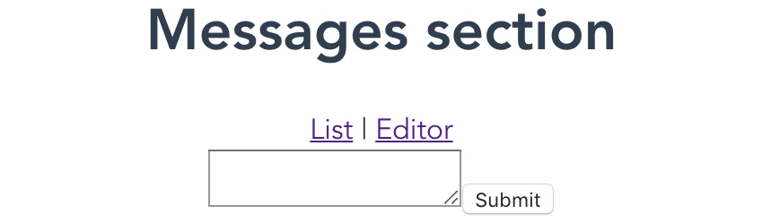

    图 6.48：Messages 应用中的 /editor 视图

1.  接下来，确保通过访问 `/message/0` 路由来确保 `/message/:id` 动态路由正常工作。你应该会看到类似于图 6.49 所示的消息内容：

    图 6.49：Message 应用中的 /message/0 视图

1.  确保当用户正在编写消息时，如果他们尝试在没有保存消息的情况下离开，将触发一个警告，如图 6.50 所示：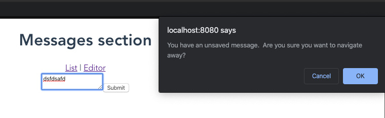

图 6.50：用户尝试在没有保存消息的情况下离开时的 /editor 视图

注意

由于我们没有全局状态管理，我们的 `messages` 数据在刷新时不会保存。我们可以在探索应用程序时使用 `localStorage` 来帮助保存数据。

在此活动中，我们将本章涵盖的几个主题组合在一起，包括设置视图、使用模板和动态路由，以及使用 Hooks 在用户在未保存内容的情况下离开前提示确认警告。这些工具可用于许多常见的 SPA 用例，并将有助于您未来的项目。

# 7. 动画和过渡

## 活动七.01：使用过渡和 GSAP 构建 Messages 应用

**解决方案：**

执行以下步骤以完成活动：

注意

要访问此活动的代码文件，请访问 [`packt.live/399tZ3Y`](https://packt.live/399tZ3Y)。

1.  我们将重用第六章中创建的 *路由* 代码，以便为 `Message` 应用设置所有路由。

    `src/views/MessageEditor.vue` 的 `template` 部分将如下所示：

    ```js
    <template>
      <div>
        <textarea
          ref="textArea"
          @change="onChange($event)"
        >
        </textarea>
        <button @click="onSendClick()">Submit</button>
      </div>
    </template>
    ```

1.  接下来，`src/views/MessageEditor.vue` 的 `script` 部分应包含点击和离开路由的逻辑：

    ```js
    <script>
    export default {
      props: {
        list: Array
      },
      data() {
        return {
          message: ''
        }
      },
      methods: {
        onChange(event) {
          this.message = event.target.value
        },
        onSendClick() {
          if (!this.message) return;
          this.list.push(this.message);
          this.$emit('list:update', this.list);
          this.message = ''
          this.$refs.textArea.value = ''
        }
      },
      beforeRouteLeave(to, from, next) {
          if (this.$refs.textArea.value !== '') {
            const ans = window.confirm('You have unsaved message.           Are you sure to navigate away?');
            next(ans);
          }
          else {
            next();
          }
      }
    }
    </script>
    ```

1.  接下来，我们需要 `MessageList.vue` 的 `template` 代码。代码如下：

    ```js
    <template>
      <div>
        <h2> Message Feed </h2>
        <transition-group
          @appear="enter"
          tag="div"
          move-class="flip"
          :css="false"
        >
          <div v-for="(m, i) in list" :key="m">
            <router-link :to="`/message/${i}`">
              {{ i }}
            </router-link>
          </div>
        </transition-group>
      </div>
    </template>
    ```

1.  接下来，我们需要在 `MessageList.vue` 文件中添加一个 `script` 部分。要添加 `script` 部分，代码如下：

    ```js
    <script>
    import { TimelineMax } from 'gsap';
    export default {
      props: {
        list: {
          type: Array,
          default: () => []
        }
      },
      methods: {
        enter(el, done) {
          const tl = new TimelineMax({
            onComplete: done,
            stagger: 1.2,
            duration: 2,
          });
          tl.fromTo(el, {opacity: 0}, {opacity: 1})
            .to(el, {rotation: -270, duration: 1, ease: "bounce"})
            .to(el, {rotation: -360})
            .to(el, {rotation: -180, opacity: 0})
            .to(el, {rotation: 0, opacity: 1});
        }
      }
    }
    </script>
    ```

1.  我们还将在 `MessageList.vue` 中创建一个 `style` 部分，并使用以下代码定义 `.flip-move` 类：

    ```js
    <style>
    .flip-move {
      transition: transform 1s;
    }
    </style>
    ```

1.  `Message.vue` 应该在 `p` 元素内包含渲染的内容。我们还将定义 `content` 属性并发出更新信号：

    ```js
    <template>
      <div>
        <p>{{content}}</p>
        <router-view/>
      </div>
    </template>
    <script>
    import MessageLayout from '../layouts/messageLayout.vue';
    export default {
      props: {
        content: {
          type: String,
          default: ''
        }
      },
      created() {
        this.$emit('update:layout', MessageLayout);
      }
    }
    </script>
    ```

1.  确保你的 `src/router/index.js` 文件与在 *第六章，路由* 中创建的相同，*创建具有动态嵌套路由和布局的消息 SPA*，该章节可在 [`packt.live/2ISxml7`](https://packt.live/2ISxml7) 找到：

    ```js
    import Vue from 'vue'
    import VueRouter from 'vue-router'
    import Messages from '@/views/Messages.vue'
    Vue.use(VueRouter)
    const messages = []
    export const routes = [
      {
        path: '/',
        name: 'messages',
        component: () => import(/* webpackChunkName: "messages" */       '../views/Messages.vue'),
        props: {
          list: messages
        },
        children: [{
          path: 'list',
          name: 'list',
          component: () => import(/* webpackChunkName: "list" */         '../views/MessageList.vue'),
          props: true,
        }, {
          path: 'editor',
          name: 'editor',
          component: () => import(/* webpackChunkName: "list" */         '../views/MessageEditor.vue'),
          props: true,
        }]
      },
      {
        path: '/message/:id',
        name: 'message',
        component: () => import(/* webpackChunkName: "message" */       '../views/Message.vue'),
        props:true,
        beforeEnter(to, from, next) {
          if (to.params && to.params.id) {
            const id = to.params.id;

            if (messages && messages.length > 0 && id <           messages.length) {
              to.params.content = messages[id];
            }
          }
          to.params.from = from;
          next()
        },
      }
    ]
    const router = new VueRouter({
      mode: 'history',
      base: process.env.BASE_URL,
      routes
    })
    export default router
    ```

1.  现在，我们将使用具有两个属性 `name="fade"` 和 `mode="out-in"` 的 `transition` 组件包裹 `App.vue` 中的 `<template>` 部分的 `router-view`：

    ```js
    <component :is="layout">
          <transition name="fade" mode="out-in">
            <router-view :layout.sync="layout"/>
          </transition>
        </component>
    Create CSS stylings for the related classes, inside App.vue:
    <style>
    .fade-enter-active, .fade-leave-active {
      transition: opacity 2s, transform 3s;
    }
    .fade-enter, .fade-leave-to {
      opacity: 0;
      transform: translateX(-20%);
    }
    </style>
    ```

1.  在 `src/views/Messages.vue` 中，我们将使用 `transition` 组件包裹 `router-view`。这次，我们将使用一个自定义的 `enter-active-class` 过渡类属性，以及 `fade` 名称：

    ```js
    <transition name="fade" enter-active-class="zoom-in">
      <router-view :list.sync="list"/>
    </transition>
    ```

1.  在 `src/views/Messages.vue` 的 `style` 部分中添加 `zoom-in` 和 `fade-enter` 动画效果：

    ```js
    <style>
    .zoom-in {
      animation-duration: 0.3s;
      animation-fill-mode: both;
      animation-name: zoom;
    }
    .fade-enter-active {
      transition: opacity 2s, transform 3s;
    }
    .fade-enter {
      opacity: 0;
      transform: translateX(-20%);
    }
    </style>
    ```

1.  在 `src/views/MessageList.vue` 中，将 `transition-group` 作为消息链接列表的包装器，并使用 JavaScript 钩子进行程序化动画。但我们必须指定在页面初始渲染时的过渡，因为列表应该在出现时进行动画。我们将添加 `appear` 属性并将 `enter` 绑定到 `appear`，以及添加 `move-class` 翻转（将在 `style` 部分稍后创建的动画）：

    ```js
    <transition-group
      appear
      @appear="enter"
      tag="div"
      move-class="flip"
      :css="false"
    >
      <div v-for="(m, i) in list" :key="m">
        <router-link :to="`/message/${i}`">
          {{ i }}
        </router-link>
      </div>
    </transition-group>
    ```

1.  将 GSAP 作为依赖项添加，并在 `src/views/MessageList.vue` 中的 `appear` 过渡事件处理程序（钩子）上实现弹跳进入效果：

    ```js
    <script>
    import { TimelineMax } from 'gsap';
    export default {
      props: {
        list: {
          type: Array,
          default: () => []
        }
      },
      methods: {
        enter(el, done) {
          const tl = new TimelineMax({
            onComplete: done,
            stagger: 1.2,
            duration: 2,
          });
          tl.fromTo(el, {opacity: 0}, {opacity: 1})
            .to(el, {rotation: -270, duration: 1, ease: "bounce"})
            .to(el, {rotation: -360})
            .to(el, {rotation: -180, opacity: 0})
            .to(el, {rotation: 0, opacity: 1});
        }
      }
    }
    </script>
    ```

1.  接下来，我们需要创建我们在 HTML 中定义的 `flip-move` 类。我们将通过添加一个包含我们的新 `flip-move` 类的 `style` 部分来完成此操作：

    ```js
    <style>
    .flip-move {
      transition: transform 1s;
    }
    </style>
    ```

1.  使用 `yarn serve` 命令运行应用程序，你应该在浏览器中的 `localhost:8080` 看到以下内容：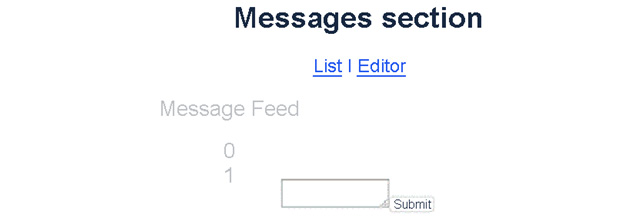

图 7.19：从消息列表视图导航到编辑视图时淡出

现在，你应该在从消息列表视图导航到编辑视图时看到淡出效果，如 *图 7.19* 所示，以及从编辑视图导航到列表视图时的淡出效果，如 *图 7.20* 所示：

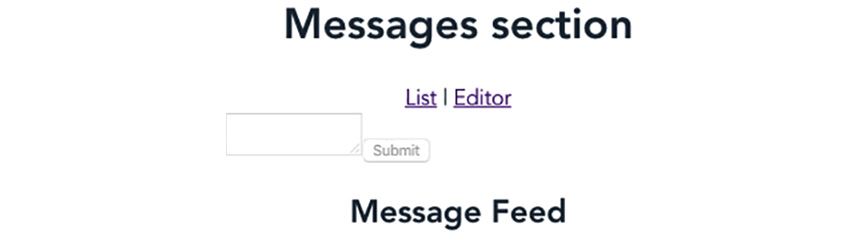

图 7.20：从编辑视图导航到消息列表视图时淡出

当消息在动态中时，你应该看到翻转动作期间的弹跳效果，如 *图 7.21* 所示：


图 7.21：在消息列表视图中显示消息动态时的弹跳效果

最后，当点击列表中的特定消息时，它应该渲染如 *图 7.22* 所示的内容：


图 7.22：单个消息视图

在这个活动中，我们将几个不同的动画组合起来，并与路由结合以创建自定义页面过渡。我们使用了多种不同的动画类型来展示动画可以提供的多种可能性。

# 8. Vue.js 状态管理的状态

## 活动第 8.01 节：将邮箱和电话号码添加到个人资料卡片生成器

**解决方案**：

执行以下步骤以完成活动：

注意

要访问此活动的代码文件，请参阅[`packt.live/3m1swQE`](https://packt.live/3m1swQE)。

1.  我们可以从向`src/components/AppProfileForm`添加一个新的`email`输入字段和标签开始，用于`Email`字段：

    ```js
    <template>
      <!-- rest of template -->
        <div class="flex flex-col mt-2">
          <label class="flex text-gray-800 mb-2" for="email">Email
          </label>
          <input
            id="email"
            type="email"
            name="email"
            class="border-2 border-solid border-blue-200 rounded           px-2 py-1"
          />
        </div>
      <!-- rest of template -->
    </template>
    ```

1.  然后，我们可以在`AppProfileForm`中添加一个新的`phone`输入字段（类型为`tel`）和标签，用于`Phone Number`字段：

    ```js
    <template>
      <!-- rest of template -->
        <div class="flex flex-col mt-2">
          <label class="flex text-gray-800 mb-2" for="phone">Phone         Number</label>
          <input
            id="phone"
            type="tel"
            name="phone"
            class="border-2 border-solid border-blue-200 rounded           px-2 py-1"
          />
        </div>
      <!-- rest of template -->
    </template>
    ```

    新字段如下所示：

    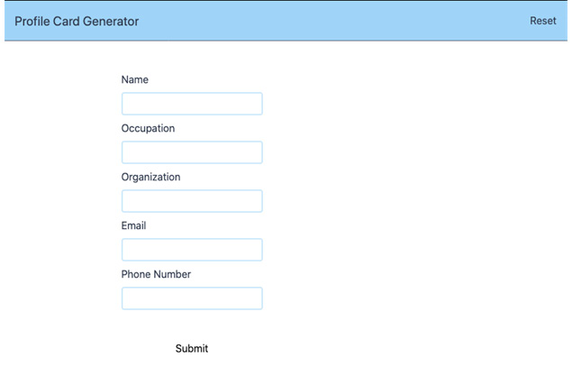

    图 8.35：包含新邮箱和电话号码字段的示例应用

1.  然后，我们可以在`src/store.js`中的初始状态和变异中添加`email`和`phone`字段，以便`organization`在初始化时设置，在`profileUpdate`时设置，并在`profileClear`时重置：

    ```js
    // imports & Vuex setup
    export default new Vuex.Store({
      state: {
        formData: {
          // rest of formData fields
          email: '',
          phone: '',
        }
      },
      mutations: {
        profileUpdate(state, payload) {
          state.formData = {
            // rest of formData fields
            email: payload.email || '',
            phone: payload.phone || '',
          }
        },
        profileClear(state) {
          state.formData = {
            // rest of formData fields
            email: '',
            phone: '',
          }
        }
      }
    })
    ```

1.  我们需要在`src/components/AppProfileForm.vue`组件的本地状态中使用`v-model`跟踪`email`，并在`data()`函数中初始化它：

    ```js
    <template>
      <!-- rest of template -->
        <div class="flex flex-col mt-2">
          <label class="flex text-gray-800 mb-2" for="email">Email
          </label>
          <input
            id="email"
            type="email"
            name="email"
            v-model="email"
            class="border-2 border-solid border-blue-200 rounded           px-2 py-1"
          />
        </div>
      <!-- rest of template -->
    </template>
    <script>
    export default {
      // rest of component
      data() {
        return {
          // other data properties
          email: ''
        }
      }
    }
    </script>
    ```

1.  我们需要在`src/components/AppProfileForm.vue`组件的本地状态中使用`v-model`跟踪`phone`，并在`data()`函数中初始化它：

    ```js
    <template>
      <!-- rest of template -->
        <div class="flex flex-col mt-2">
          <label class="flex text-gray-800 mb-2" for="phone">Phone         Number</label>
          <input
            id="phone"
            type="tel"
            name="phone"
            v-model="phone"
            class="border-2 border-solid border-blue-200 rounded           px-2 py-1"
          />
        </div>
      <!-- rest of template -->
    </template>
    <script>
    export default {
      // rest of component
      data() {
        return {
          // other data properties
          phone: ''
        }
      }
    }
    </script>
    ```

1.  为了让变异的负载包含`email`和`phone`，我们需要将其添加到`$store.commit('profileUpdate')`的负载中。我们还想在组件触发`profileClear`变异时在表单上重置它：

    ```js
    <script>
    export default {
      // rest of component
      methods: {
        submitForm() {
          this.$store.commit('profileUpdate', {
            // rest of payload
            email: this.email,
            phone: this.phone
          })
        },
        resetProfileForm() {
          // other resets
          this.email = ''
          this.phone = ''
        }
      }
    }
    </script>
    ```

1.  为了使`email`显示，我们需要在`src/components/AppProfileDisplay.vue`中使用条件段落（在没有设置邮箱时隐藏`Email`标签）来渲染它：

    ```js
    <template>
      <!-- rest of template -->
        <p class="mt-2" v-if="formData.email">
          Email: {{ formData.email }}
        </p>
      <!-- rest of template -->
    </template>
    ```

1.  为了使`phone`显示，我们需要在`src/components/AppProfileDisplay.vue`中使用条件 span（在没有设置电话时隐藏`Phone Number`标签）来渲染它：

    ```js
    <template>
      <!-- rest of template -->
        <p class="mt-2" v-if="formData.phone">
          Phone Number: {{ formData.phone }}
        </p>
      <!-- rest of template -->
    </template>
    ```

    当表单填写并提交时，应用应如下所示：

    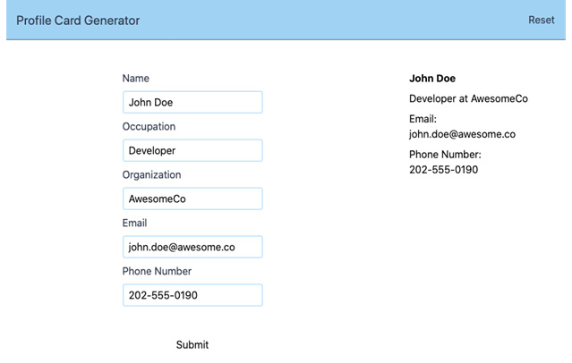

图 8.36：包含邮箱和电话号码字段的示例应用

我们已经看到了如何向 Vuex 管理的应用中添加新字段。接下来，我们将看到如何决定是否将某些内容放入全局或局部状态。

# 9. 使用 Vuex – 状态、获取器、操作和变异

## 活动第 9.01 节：创建简单的购物车和价格计算器

**解决方案**：

执行以下步骤以完成活动：

注意

要访问此活动的代码文件，请参阅[`packt.live/2KpvBvQ`](https://packt.live/2KpvBvQ)。

1.  使用 CLI 创建一个新的具有 Vuex 支持的 Vue 应用。

1.  将产品和空`cart`添加到位于`store/index.js`的存储中。请注意，产品名称和价格是任意的：

    ```js
      state: {
        products: [
          { name: "Widgets", price: 10 },
          { name: "Doodads", price: 8 },
          { name: "Roundtuits", price: 12 },
          { name: "Fluff", price: 4 },
          { name: "Goobers", price: 7 }
        ],
        cart: [
        ]
    ```

1.  创建一个新的 `Products` 组件 (`components/Products.vue`)，它遍历每个产品并包括每个产品的名称和价格。它还将包括添加或从购物车中删除项目的按钮：

    ```js
        <h2>Products</h2>
        <table>
          <thead>
            <tr>
              <th>Name</th>
              <th>Price</th>
              <th>&nbsp;</th>
            </tr>
          </thead>
          <tbody>
            <tr v-for="(product, idx) in products" :key="idx">
              <td>{{ product.name }}</td>
              <td>{{ product.price  }}</td>
              <td>
                <button @click="addToCart(product)">Add to Cart               </button> 
                <button @click="removeFromCart(product)">Remove from               Cart</button>
              </td>
            </tr>
          </tbody>
        </table>
    ```

1.  为了在不添加 `$store` 前缀的情况下使用产品，包括 `mapState` 并在 `Products` 组件的 `computed` 属性中定义其使用：

    ```js
    import { mapState } from 'vuex';
    export default {
      name: 'Products',
      computed: mapState(['products']),
    ```

1.  接下来包括添加和从购物车中删除项目的函数。这只会调用存储中的 mutations：

    ```js
      methods: {
        addToCart(product) {
          this.$store.commit('addToCart', product);
        },
        removeFromCart(product) {
          this.$store.commit('removeFromCart', product);
        }
      }
    ```

1.  在 `store/index.js` 文件中定义您的 mutations 来处理与购物车的工作。当向购物车添加新项目时，您首先需要查看该项目是否之前已添加，如果是，则简单地增加数量。当从购物车中删除项目时，如果数量达到 0，则应完全删除该项目：

    ```js
      mutations: {
        addToCart(state, product) {
          let index = state.cart.findIndex(p => p.name ===         product.name);
          if(index !== -1) {
            state.cart[index].quantity++;
          } else {
            state.cart.push({ name: product.name, quantity: 1});
          }
        },
        removeFromCart(state, product) {
          let index = state.cart.findIndex(p => p.name ===         product.name);
          if(index !== -1) {
            state.cart[index].quantity--;
            if(state.cart[index].quantity === 0) state.cart.splice           (index, 1);
          }
        }
    ```

1.  定义一个 `Cart` 组件 (`components/Cart.vue`)，它遍历购物车并显示每个项目的数量：

    ```js
        <h2>Cart</h2>
        <table>
          <thead>
            <tr>
              <th>Name</th>
              <th>Quantity</th>
            </tr>
          </thead>
          <tbody>
            <tr v-for="(product, idx) in cart" :key="idx">
              <td>{{ product.name }}</td>
              <td>{{ product.quantity  }}</td>
            </tr>
          </tbody>
        </table>
    ```

1.  与前面的组件一样，添加 `mapState` 并将购物车别名为：

    ```js
    import { mapState } from 'vuex';
    export default {
      name: 'Cart',
      computed: mapState(['cart'])
    }
    ```

1.  定义最终的组件 `Checkout` (`components/Checkout.vue`)，并显示一个名为 `cartTotal` 的属性。这将通过在存储中创建的 getter 来定义：

    ```js
    <h2>Checkout</h2>
    Your total is ${{ cartTotal }}.
    ```

1.  在脚本块中映射 getter：

    ```js
    import { mapGetters } from 'vuex';
    export default {
      name: 'Cart',
      computed: mapGetters(['cartTotal']),
    ```

1.  添加一个结账按钮。它应该只在存在总计时显示，并运行名为 `checkout` 的方法：

    ```js
        <button v-show="cartTotal > 0" @click="checkout">Checkout       </button>
    ```

1.  定义 `checkout` 以简单地提醒用户：

    ```js
      methods: {
        checkout() {
            alert('Checkout process!');
        }
      }
    ```

1.  在 Vuex 存储中，定义 `cartTotal` 的 getter。它需要遍历购物车并通过将价格乘以数量来确定总和：

    ```js
      getters: {
        cartTotal(state) {
          return state.cart.reduce((total, item) => {
            let product = state.products.find(p => p.name ===           item.name);
            return total + (product.price * item.quantity);
          }, 0);
        }
      },
    ```

1.  在主 `App.vue` 组件中使用所有三个组件：

    ```js
    <template>
      <div id="app">
        <Products />
        <Cart />
        <Checkout />
      </div>
    </template>
    <script>
    import Products from './components/Products.vue'
    import Cart from './components/Cart.vue'
    import Checkout from './components/Checkout.vue'
    export default {
      name: 'app',
      components: {
        Products, Cart, Checkout
      }
    }
    </script>
    ```

    按照之前的方式启动您的应用程序 (`npm run serve`) 并在浏览器中打开 URL。最初，您应该看到以下输出，显示一个空购物车：

    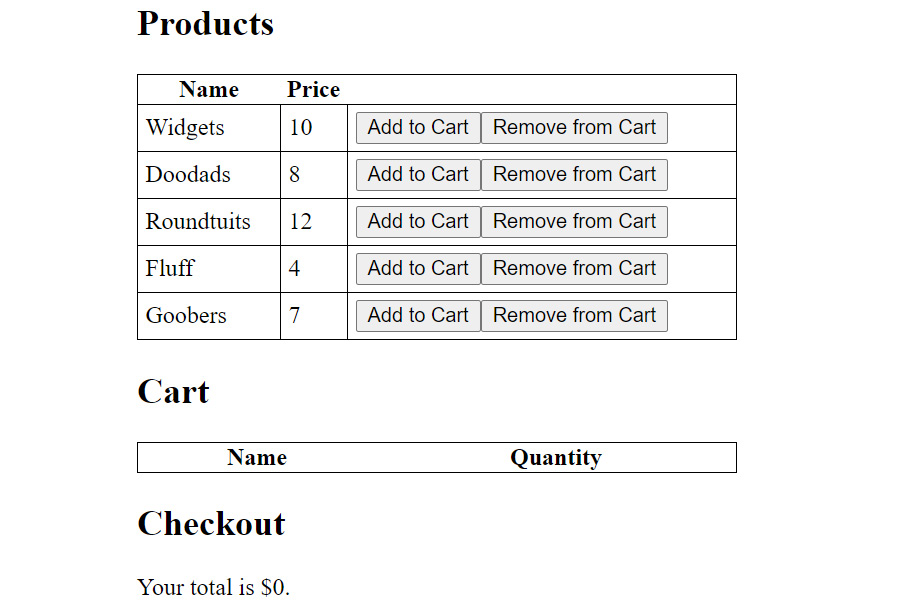

    ](img/B15218_09_09.jpg)

图 9.9：购物车的初始显示

当您添加和删除项目时，您会看到购物车和总计实时更新：

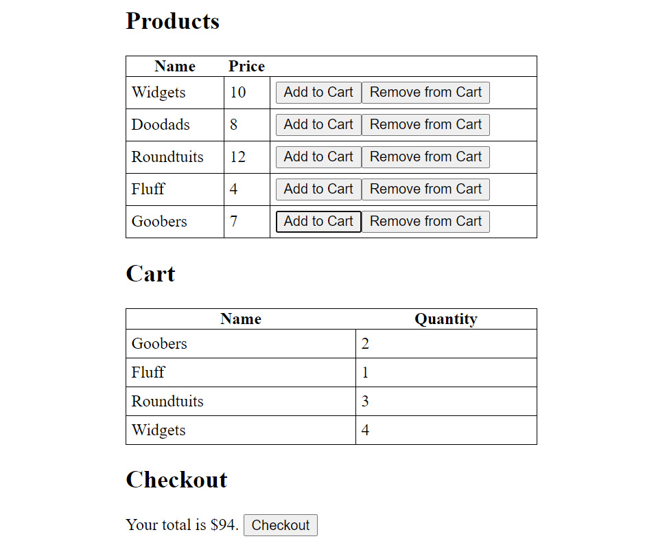

](img/B15218_09_10.jpg)

图 9.10：添加了多个数量项目的购物车

前面的图显示了产品和它们的价格，以及包含多个不同产品数量的购物车和最终的结账金额。您现在已经构建了一个完整的、尽管简单的、由 Vue 和 Vuex 驱动的电子商务购物车产品。

# 10. 使用 Vuex – 获取远程数据

## 活动 10.01：使用 Axios 和 Vuex 进行身份验证

**解决方案：**

执行以下步骤以完成此活动。

注意

要访问此活动的代码文件，请参阅 [`packt.live/3kVox6M`](https://packt.live/3kVox6M)。

1.  使用 CLI 来构建新的应用程序，并确保启用 Vuex 和 Vue Router。完成后，使用 `npm` 安装 `Axios`。现在您已经构建了应用程序的框架，让我们开始构建它。首先，打开 `App.vue`，这是应用程序的核心组件，并修改它，使整个模板成为视图：

    ```js
    <template>
      <div id="app">
        <router-view/>
      </div>
    </template>
    ```

1.  默认情况下，CLI 会生成两个 `views`：`Home` 和 `About`。我们将把 `About` 改成显示猫的视图，但现在打开 `Home.vue` 并添加登录表单。使用按钮运行一个方法来执行（假的）登录：

    ```js
    <template>
      <div>
        <h2>Login</h2>
        <form>
          <div>
            <label for="username">Username: </label>
            <input type="text" id="username" v-model="username"           required>
          </div>
          <div>
            <label for="password">Password: </label>
            <input type="password" id="password" v-model="password"           required>
          </div>
          <div>
            <input type="submit" @click.prevent="login" value=          "Log In">
          </div>
        </form>
      </div>
    </template>
    ```

1.  添加登录表单的 `data` 和登录按钮的 `handler`。这将触发对存储的 dispatch。在成功的登录（它总是会成功）后，使用 `$router.replace` 来导航到下一页。这样做是为了代替 `$router.go`，这样用户就不能通过点击后退按钮返回到登录表单：

    ```js
    <script>
    export default {
      name: 'home',
      data() {
        return {
          username:'',
          password:''
        }
      },
      methods: {
        async login() {
          let response = await this.$store.dispatch('login',
          { username:this.username,
            password:this.password
          });
          if(response) {
            this.$router.replace('cats');
          } else {
            // handle a bad login here..
          }
        }
      }
    }
    </script>
    ```

1.  现在让我们在 `views/Cats.vue` 中构建 `Cats` 组件。这个组件将简单地遍历存储中的猫，并对存储进行调用以加载它们：

    ```js
    <template>
      <div>
        <h2>Cats</h2>
        <ul>
        <li v-for="(cat,idx) in cats" :key="idx">
          {{cat.name}} is {{cat.gender}}
        </li>
        </ul>  
      </div>
    </template>
    <script>
    import { mapState } from 'vuex';
    export default {
      created() {
        this.$store.dispatch('loadCats');
      },
      computed: {
        ...mapState(["cats"])
      }
    }
    </script>
    ```

1.  现在通过编辑 `store/index.js` 来构建 Vuex 存储。首先导入 Vuex 并定义两个端点的常量。记住，我们在这里是*模拟*一个真实的 API，所以端点只是返回静态的 JSON：

    ```js
    import Vue from 'vue'
    import Vuex from 'vuex'
    Vue.use(Vuex)
    import axios from 'axios';
    const LOGIN_URL = 'https://api.jsonbin.io/b/  5debc045bc5ffd04009563cd';
    const CATS_URL = 'https://api.jsonbin.io/b/  5debc16dcb4ac6042075d594';
    ```

1.  存储需要保留两样东西：认证 `token` 和 `cats`。设置 `state` 并为它们定义 `mutations`：

    ```js
    export default new Vuex.Store({
      state: {
        token:'',
        cats:[]
      },
      mutations: {
        setCats(state, cats) {
          state.cats = cats;
        },
        setToken(state, t) {
          state.token = t;
        }
      },
    ```

1.  现在添加 `actions`。登录 `action` 将结果存储为 `token`，而 `cats` `action` 将 `token` 作为 `authorization` 标头传递：

    ```js
      actions: {
        loadCats(context) {
          axios.get(CATS_URL,
            {
              headers: {
                'Authorization': 'bearer '+context.state.token
              }
            })
          .then(res => {
            context.commit('setCats', res.data);
          })
          .catch(error => {
            console.error(error);
          });
        },
        async login(context, credentials) {
          return axios.get(LOGIN_URL, {
            params:{
              username: credentials.username,
              password: credentials.password
            }
          })
          .then(res => {
            context.commit('setToken', res.data.token);
            return true;
          })
          .catch(error => {
            console.error(error);
          });  
        }
      }
    })
    ```

1.  应用程序的最后一部分是路由器，它有一个相当有趣的特点。想想 `cats` 页面。如果用户首先访问该页面会发生什么？没有 `token`，对端点的调用将无法返回有效数据。（再次，在一个*真实*的服务器上是这样。）幸运的是，Vue Router 提供了一种非常简单的方式来处理这种情况——路由守卫。在 `cats` 路由中利用 `beforeEnter` 来处理这个调用。编辑你的 `router/index.js` 文件，使其看起来像以下代码：

    ```js
    import Vue from 'vue'
    import VueRouter from 'vue-router'
    import Home from '../views/Home.vue'
    import store from '../store';
    Vue.use(VueRouter)
    const routes = [
      {
        path: '/',
        name: 'home',
        component: Home
      },
      {
        path: '/cats',
        name: 'cats',
        component: () => import(/* webpackChunkName: "cats" */ '../views/Cats.vue'),
        beforeEnter: (to, from, next) => {
          if(!store.state.token) {
            next('/');
          }
          next();
        }
      }
    ]
    const router = new VueRouter({
      mode: 'history',
      base: process.env.BASE_URL,
      routes
    })
    export default router
    ```

1.  使用 `npm run serve` 启动应用程序，将 URL 复制到浏览器中，你应该会看到以下输出：

图 10.8：初始登录屏幕

登录后，你会看到以下截图所示的数据显示：


图 10.9：登录成功后成功显示数据

在这个活动中，你看到了使用 Vuex 和 `Axios` 时认证系统会是什么样子。虽然后端是假的，但这里使用的代码可以很容易地连接到一个真实的认证系统。

# 11. 使用 Vuex – 组织更大的存储

## 活动 11.01：简化 Vuex 存储

**解决方案：**

执行以下步骤来完成活动。

注意

要访问此活动的初始代码文件，请访问 [`packt.live/3kaqBHH`](https://packt.live/3kaqBHH)。

1.  首先创建一个新文件，`src/store/state.js`，它将存储除了 `cat` 对象之外的所有状态值：

    ```js
    export default {
        name:'Lindy',
        job:'tank',
        favoriteColor:'blue',
        favoriteAnimal:'cat'
    }
    ```

1.  创建一个新文件，`src/store/getters.js`，并将 `desiredPet` 的 getter 移入其中：

    ```js
    export default {
        desiredPet(state) {
            return state.favoriteColor + ' ' + state.favoriteAnimal;
        }
    }
    ```

1.  接下来，创建 `src/store/mutations.js` 并复制与猫名称无关的 `mutations`：

    ```js
    export default {
      setName(state, name) {
        state.name = name;
      },
      setJob(state, job) {
        state.job = job;
      },
      setFavoriteColor(state, color) {
        state.color = color;
      },
      setFavoriteAnimal(state, animal) {
        state.animal = animal;
      }
    }
    ```

1.  更新存储文件 (`src/store/index.js`) 以导入新文件：

    ```js
    import state from './state.js';
    import getters from './getters.js';
    import mutations from './mutations.js';
    ```

1.  编辑现有的 `state`、`mutations` 和 `getters` 块以使用包含的值：

    ```js
    export default new Vuex.Store({
      state,
      getters, 
      mutations, 
    ```

1.  现在将猫相关值移动到存储的 `modules` 块中。创建一个 `state`、`getters` 和 `mutations` 块，并将所有值移动过来，更新它们以引用状态值，而不是 `state.cat`：

    ```js
        cat: {
            state: {
              name:'Cracker',
              gender:'male',
              job:'annoyer'  
            },
            getters: {
              petDescription(state) {
                return state.name + ' is a ' + state.gender + 
                ' ' + state.job +  ' cat.';
              }
            },
            mutations: {
              setCatName(state, name) {
                state.name = name;
              },
              setCatGender(state, gender) {
                state.gender = gender;
            },
              setCatJob(state, job) {
                state.job = job;
              }
            }
        }
    ```

1.  运行应用程序并确认 `App.vue` 组件继续按预期工作。

    您的输出将如下所示：

    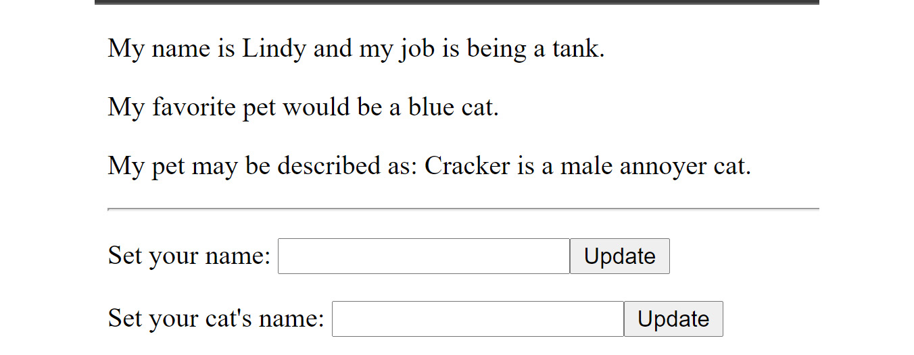

图 11.4：活动的最终输出

现在，Vuex 存储已被修改得更加易于接近、编辑和未来调试。要访问此活动的解决方案，请访问 [`packt.live/3l4Lg0x`](https://packt.live/3l4Lg0x)。

# 12. 单元测试

## 活动 12.01：添加带有测试的简单标题搜索页面

**解决方案：**

执行以下步骤来完成活动：

注意

要访问此活动的代码文件，请参阅 [`packt.live/2UVF28c`](https://packt.live/2UVF28c)。

1.  在 `src/components/SearchForm.vue` 的新文件中创建一个带有输入和按钮的搜索表单：

    ```js
    <template>
      <form class="flex flex-row m-auto mb-10">
        <input
          placholder="Search"
          class="bg-white focus:outline-none focus:shadow-outline         border
          border-gray-300 rounded py-2 px-4 flex
          appearance-none leading-normal"
          type="text"
        />
        <button
          type="submit"
          class="flex bg-blue-500 hover:bg-blue-700
          text-white font-semibold font-sm hover:text-white         py-2 px-4 border
          border-blue-500 hover:border-transparent rounded"
        >
          Search
        </button>
      </form>
    </template>
    ```

1.  现在，我们将通过导入、注册并在 `src/App.vue` 中渲染来使表单显示：

    ```js
    <template>
      <!-- rest of template -->
        <div class="flex flex-col">
          <SearchForm />
          <!-- rest of template -->
        </div>
      <!-- rest of template -->
    </template>
    ```

1.  我们现在准备好为搜索表单添加快照测试。在 `__tests__/SearchForm.test.js` 中，我们应该添加 `SearchForm should match expected HTML`：

    ```js
    import {render} from '@testing-library/vue'
    import SearchForm from '../src/components/SearchForm.vue'
    test('SearchForm should match expected HTML', () => {
      const {html} = render(SearchForm)
      expect(html()).toMatchSnapshot()
    })
    ```

1.  我们希望使用 `v-model` 跟踪搜索表单输入的内容，以双向绑定 `searchTerm` 实例变量和输入内容：

    ```js
    <template>
      <!-- rest of template -->
        <input
          v-model="searchTerm"
          placholder="Search"
          class="bg-white focus:outline-none focus:shadow-outline         border
          border-gray-300 rounded py-2 px-4 flex
          appearance-none leading-normal"
          type="text"
        />
      <!-- rest of template -->
    </template>
    <script>
    export default {
      data() {
        return {
          searchTerm: ''
        }
      }
    }
    </script>
    ```

1.  当提交搜索表单时，我们需要使用 `this.$router.push()` 更新 URL 中的正确参数。这可以通过 `q` 查询参数存储搜索来完成。

    ```js
    <template>
      <form
        @submit="onSubmit()"
        class="flex flex-row m-auto mb-10"
      >
      <!-- rest of template -->
      </form>
    </template>
    <script>
    export default {
      // other properties
      methods: {
        onSubmit() {
          this.$router.push({
            path: '/'
            query: {
              q: this.searchTerm
            }
          })
        }
      }
    }
    </script>
    ```

1.  我们希望将搜索表单中的 `q` 查询参数的状态反映在搜索表单输入中。从 `this.$route.query` 中读取 `q` 并将其设置为 `SearchForm` 组件状态中 `searchTerm` 数据字段的初始值：

    ```js
    <script>
    export default {
      data() {
        return {
          searchTerm: this.$route.query.q || ''
        }
      },
      // other properties
    }
    </script>
    ```

1.  接下来，我们将想要过滤传递给主页上 `PostList` 的帖子。我们将使用 `this.$route.query.q` 在一个计算属性中过滤按标题排序的帖子。这个新的计算属性将随后用于替代 `src/App.vue` 中的 `posts`：

    ```js
    <template>
      <!-- rest of template -->
          <router-view
            :posts="relevantPosts"
          />
      <!-- rest of template -->
    </template>
    <script>
    export default {
      // other properties
      computed: {
        relevantPosts() {
          const { q } = this.$route.query
          if (!q) {
            return this.posts
          }
          return this.posts.filter(
            p => p.title.toLowerCase().includes(q.toLowerCase())
          )
        }
      }
    }
    </script>
    ```

1.  接下来，我们应该添加一个测试，更改搜索查询参数并检查应用程序显示正确的结果。为此，我们可以导入 `src/App.vue`、`src/store.js` 和 `src/router.js`，并使用存储和路由渲染应用程序。然后，我们可以通过使用字段的占位符为 `Search` 来更新搜索字段的内容。最后，我们可以通过点击具有 `test id` 为 `Search` 的元素来提交表单（这是搜索按钮）：

    ```js
    // imports and other tests
    test('SearchForm filter by keyword on submission',   async () => {
      const {getByPlaceholderText, getByText, queryByText} =     render(App, {
        router,
        store
      })
      expect(queryByText('Migrating an AngularJS app to Vue.js')).    toBeTruthy()
      expect(queryByText('Vue.js for React developers')).    toBeTruthy()
      await fireEvent.update(getByPlaceholderText('Search'), 'react')
      await fireEvent.click(getByText('Search'))
      expect(queryByText('Vue.js for React developers')).    toBeTruthy()
      expect(queryByText('Migrating an AngularJS app to Vue.js')).    toBeFalsy()
    })
    ```

    我们现在处于一个通过测试的状态。以下截图显示了这一点：

    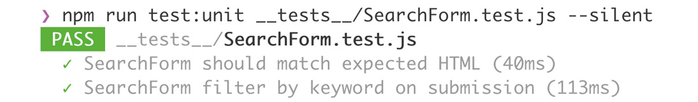

图 12.29：路由测试通过

我们还得到了一个能够按搜索词过滤的应用程序，如下所示：

![图 12.30：搜索“react”过滤与该搜索词相关的帖子]

![img/B15218_12_30.jpg]

图 12.30：搜索“react”过滤与该搜索词相关的帖子

我们已经看到了如何创建和测试具有多个页面、Vuex 和一系列组件的 Vue.js 应用程序。

# 13. 端到端测试

## 活动第 13.01 节：添加设置用户电子邮件和测试的功能

**解决方案：**

执行以下步骤以完成活动：

注意

要访问此活动的代码文件，请参阅[`packt.live/2IZP4To`](https://packt.live/2IZP4To)。

1.  为了跟踪电子邮件，我们将在`data()`中将它设置为一个响应式状态，并在页面上添加一个电子邮件类型输入，它将使用`v-model`与`email`双向绑定。我们还添加了一个标签和相应的标记。请注意，我们将在电子邮件输入上设置一个`data-test-id`属性，设置为`"email-input"`：

    ```js
    <template>
      <div id="app" class="p-10">
        <div class="flex flex-col">
          <!-- rest of template -->
          <div class="flex flex-col mx-auto mb-4">
            <label
              class="flex text-gray-700 text-sm font-bold mb-2"
              for="email"
            >
              Enter your email:
            </label>
            <input
              v-model="email"
              id="email"
              type="email"
              data-test-id="email-input"
              class="flex shadow appearance-none border             rounded py-2 px-3 text-gray-700 leading-tight             focus:outline-none focus:shadow-outline"
              required
            />
          </div>
          <!-- rest of template -->
    </template>
    <script>
    // imports
    export default {
      data() {
        return {
          email: '',
          // other data properties
        }
      },
      // other component properties
    }
    </script>
    ```

1.  我们现在将添加一个`beforeEach`钩子来设置 Cypress 模拟服务器并模拟`GET`评论（列表）请求。评论列表请求应该被别名为`getComments`：

    ```js
    describe('Email input', () => {
      beforeEach(() => {
        cy.server()
        cy.route('GET', '**/comments', []).as('getComments')
      })
    })
    ```

1.  我们将添加第一个测试，检查将文本输入到电子邮件输入框是否正确工作。我们将进入应用程序，输入电子邮件，并检查我们输入的内容现在是否是输入值：

    ```js
    describe('Email input', () => {
      // setup
      it('email input should work', () => {
        cy.visit('/')
        cy.get('[data-test-id="email-input"]')
          .type('hugo@example.tld')
          .should('have.value', 'hugo@example.tld')
      })
    })
    ```

    当使用 Cypress UI 运行时，我们得到以下通过测试：

    ![图 13.24：Cypress 运行“enter-email”测试，带有电子邮件输入测试]

    ![img/B15218_13_24.jpg]

    图 13.24：Cypress 运行“enter-email”测试，带有电子邮件输入测试

1.  `email`属性的存在是添加评论的先决条件，因此当`email`为空时（`!email`），我们将禁用`添加新评论`按钮。我们将绑定到`disabled`属性并根据`email`字段是否填充切换一些类：

    ```js
    <template>
      <div id="app" class="p-10">
        <div class="flex flex-col">
          <!-- rest of template -->
          <button
            @click="showEditor = !showEditor"
            class="flex mx-auto bg-blue-500 hover:bg-blue-700           text-white font-bold py-2 px-4 rounded"
            data-test-id="new-comment-button"
            :disabled="!email"
            :class="{ 'opacity-50 cursor-not-allowed' : !email }"
          >
            Add a New Comment
          </button>
          <!-- rest of template -->
        </div>
      </div>
    </template>
    ```

1.  使用这个新的`当电子邮件为空时禁用添加新评论按钮`功能，我们应该添加一个新的端到端测试。我们将加载页面，并在初始加载时检查`email`输入框为空，并且`新评论`按钮被禁用。然后我们将在电子邮件输入框中输入电子邮件，并检查`新评论`按钮现在*不是*禁用的，这意味着它已被启用：

    ```js
    describe('Email input', () => {
      // setup & other tests
      it('add comment button should be disabled when no email',     () => {
        cy.visit('/')
        cy.get('[data-test-id="email-input"]')
          .should('have.value', '')
        cy.get('[data-test-id="new-comment-button"]')
          .should('be.disabled')
        cy.get('[data-test-id="email-input"]')
          .type('hugo@example.tld')

        cy.get('[data-test-id="new-comment-button"]')
          .should('not.be.disabled')
      })
    })
    ```

    更新后的测试运行输出如下：

    ![图 13.25：Cypress 运行“enter-email”测试，带有禁用的]

    添加评论按钮测试

    ![img/B15218_13_25.jpg]

    图 13.25：Cypress 运行“enter-email”测试，带有禁用的添加评论按钮测试

1.  现在我们有了捕获电子邮件的方法，我们应该在提交新评论的 POST 调用（即提交新评论时）将其传递给后端 API。为了做到这一点，我们应该修改`methods.submitNewComment`中`email`被硬编码为`evan@vuejs.org`的位置：

    ```js
    <script>
    // imports
    export default {
      // other component properties
      methods: {
        submitNewComment() {
          // rest of method
          fetch('https://jsonplaceholder.typicode.com/comments', {
            // other fetch options
            body: JSON.stringify({
              email: this.email,
              body: this.newComment
            })
          }).then(res => res.json())
          // rest of promise chain
        }
      }
    }
    </script>
    ```

1.  现在我们正在使用用户输入的电子邮件，我们应该编写一个端到端测试来检查它是否被发送。我们将模拟 `POST` 请求，将其别名为 `newComment`，并返回一个任意值。然后我们可以访问页面，填写电子邮件输入，打开评论编辑器，填写内容，并提交。然后我们将等待 `newComment` 请求，并断言请求体中的内容和电子邮件与我们完成时相同：

    ```js
    describe('Email input', () => {
      // setup & other tests
      it('when adding comment, it should be created with the     input email', () => {
        cy.route('POST', '**/comments', {
          body: 'My new comment',
          email: 'hugo@example.tld'
        }).as('newComment')
        cy.visit('/')
        cy.get('[data-test-id="email-input"]')
          .type('hugo@example.tld')
        cy.get('[data-test-id="new-comment-button"]')
          .should('not.be.disabled')
          .click()

        cy.get('[data-test-id="new-comment-editor"]')
          .type('My new comment')

        cy.get('[data-test-id="new-comment-submit"]')
          .should('not.be.disabled')
          .click()

        cy.wait('@newComment')
          .its('request.body')
          .should('deep.equal', {
            body: 'My new comment',
            email: 'hugo@example.tld'
          })
      })
    })
    ```

    当使用 Cypress UI 运行时，我们得到以下测试运行输出：

    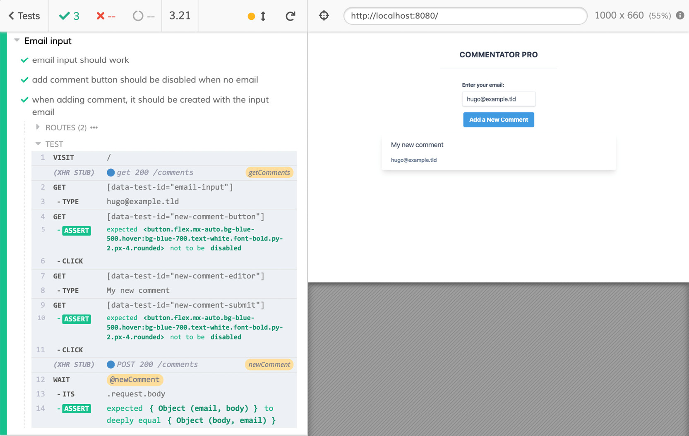

图 13.26：Cypress 运行 "enter-email" 测试，包含电子邮件输入测试

我们现在已经看到了如何有效地使用 Cypress 构建和测试（使用端到端测试）Vue.js 应用程序。

# 14. 将您的代码部署到网络

## 活动 14.01：将 GitLab CI/CD 添加到图书搜索应用程序并部署到 Amazon S3 和 CloudFront

**解决方案**

执行以下步骤以完成活动：

注意

要访问此活动的代码文件，请参阅 [`packt.live/36ZecBT`](https://packt.live/36ZecBT)。

1.  首先，我们希望在本地运行一个生产构建。我们可以使用用于构建所有 Vue CLI 项目的常规命令。我们还想检查相关的资产（JavaScript、CSS 和 HTML）是否正确生成。

    生产构建命令是 `npm run build`，如下截图所示：

    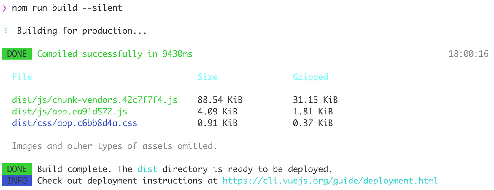

    图 14.65：初始 book-search Vue CLI 项目的 npm run build 输出

    `npm run build` 命令构建一个包含以下内容的 `dist` 目录，如下截图所示。它包含 `CSS`、`JavaScript` 和 `HTML` 资产，以及 `sourcemaps`（`.js.map` 文件）和 `favicon`：

    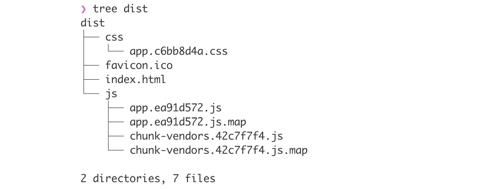

    图 14.66：Vue CLI 生产构建运行后 dist 文件夹的示例内容（使用 tree 命令生成）

1.  为了运行 GitLab CI/CD，我们需要一个 `.gitlab-ci.yml` 文件。我们将在 `.gitlab-ci.yml` 中添加一个作业，在 `build` 阶段运行 Node.js LTS Docker 容器中的包安装和生产构建。我们还将确保缓存生产构建的输出：

    ```js
    build:
      image: node:lts
      stage: build
      script:
        - npm ci
        - npm run build
      cache:
        key: $CI_COMMIT_REF_SLUG
        paths:
          - dist
      artifacts:
        expire_in: 1 week
        paths:
          - dist
    ```

    一旦我们使用 `git add .gitlab-ci.yml` 并提交和推送更改，我们应该看到以下 GitLab CI/CD 管道运行，其中包含运行状态下的 `build` 作业：

    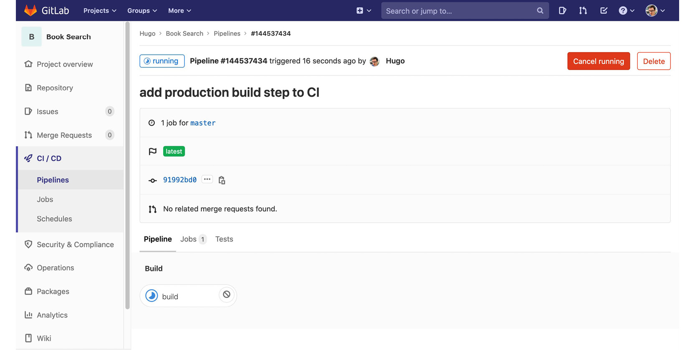

    图 14.67：正在运行的 GitLab CI/CD 管道，构建作业正在运行

    以下截图显示了 GitLab CI/CD 管道，`build` 作业已成功完成：

    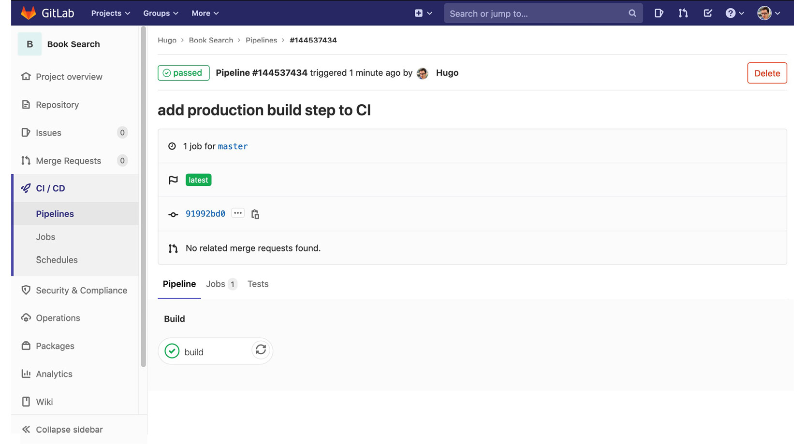

    图 14.68：GitLab CI/CD 管道，构建任务已通过

1.  接下来，我们希望在 GitLab CI/CD 的 `test` 阶段添加一个代码质量任务（通过更新 `.gitlab-ci.yml`）。我们将该任务命名为 `lint`，它将运行依赖项的安装以及通过 Vue CLI 进行代码检查：

    ```js
    # other jobs
    lint:
      image: node:lts
      stage: test
      script:
        - npm ci
        - npm run lint
    ```

    一旦我们使用 `git add .gitlab-ci.yml` 并提交和推送更改，我们应该看到以下 GitLab CI/CD 管道运行，其中包含运行状态下的 `lint` 任务：

    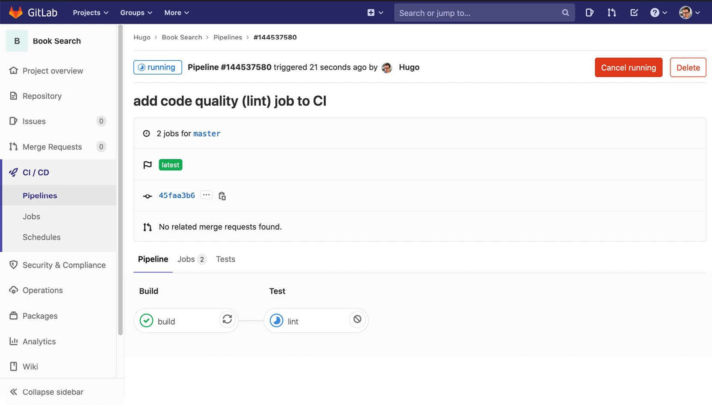

    图 14.69：GitLab CI/CD 管道，lint 任务正在运行

    以下截图显示了 GitLab CI/CD 管道，`lint` 任务成功完成：

    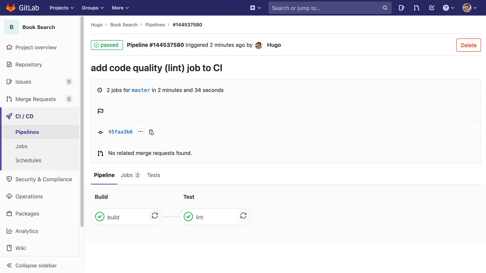

    图 14.70：GitLab CI/CD 管道，lint 任务已通过

1.  为了部署我们的应用程序，我们需要使用 S3 控制台创建一个启用公共访问的 `vue-workshop-book-search` S3 存储桶。

    S3 存储桶创建页面应如图下截图所示：

    

    图 14.71：S3 存储桶创建页面，输入 `vue-workshop-book-search` 作为存储桶名称

    *图 14.72* 显示了 S3 存储桶创建页面，具有公共访问权限和免责声明信息：

    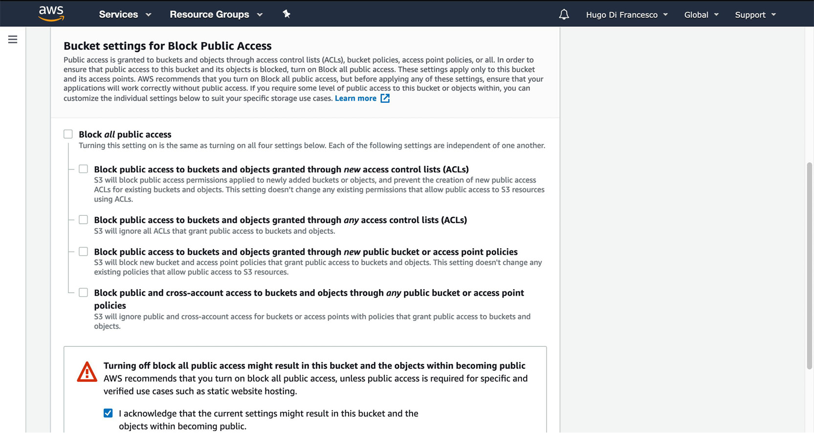

    图 14.72：S3 存储桶创建页面，启用公共访问并接受相关免责声明

1.  要通过网页访问 S3 存储桶内容，我们还需要将其配置为 Web 服务器。我们可以通过 S3 控制台配置 Web 服务器属性。

    应按以下方式配置，将索引和错误页面设置为 `index.html`：

    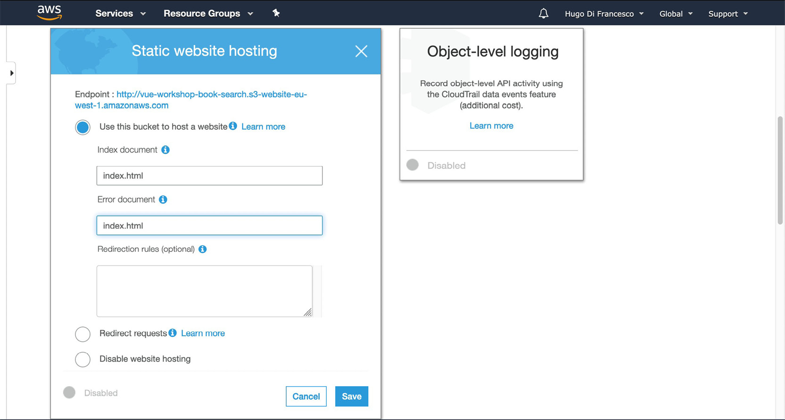

    图 14.73：S3 存储桶属性页面，已启用 Web 服务器并配置了索引和错误页面为 index.html

1.  为了让 GitLab CI/CD 能够在 S3 上创建和更新文件，我们需要将相关的 AWS 密钥添加到我们的 GitLab 仓库 CI/CD 设置中。这些密钥可以在 AWS 管理控制台的 `用户名` 下拉菜单 | `我的安全凭证` | `访问密钥`（访问密钥 ID 和秘密访问密钥）| `创建新访问密钥`（或选择一个密钥进行重用）。以下截图显示了 `CI/CD 设置` 页面：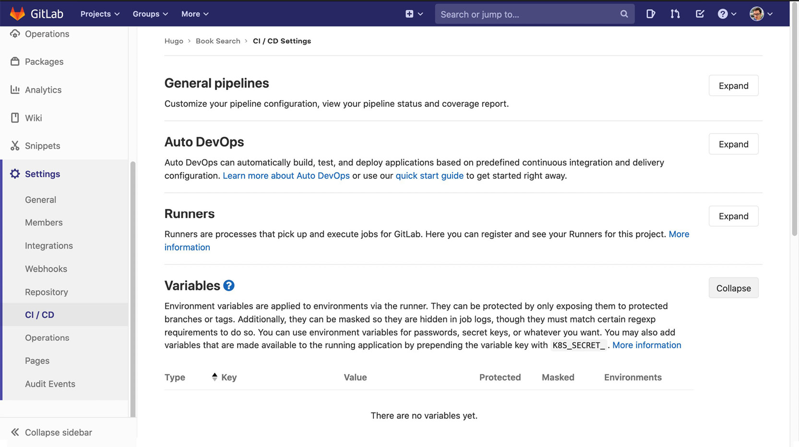

    图 14.74：GitLab CI/CD 设置页面，变量部分已打开

    一旦点击`变量`部分的`展开`按钮，我们添加相关的 AWS 环境变量：`AWS_ACCESS_KEY_ID`、`AWS_DEFAULT_REGION`和`AWS_SECRET_ACCESS_KEY`。然后`变量`部分将如下所示：

    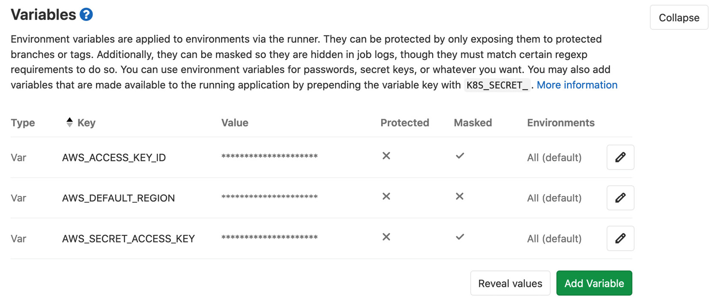

    图 14.75：带有所需 AWS 环境变量（值被屏蔽）的 GitLab CI/CD 设置页面

1.  接下来，我们希望在 GitLab CI/CD 的`deploy`阶段添加一个`deploy`作业（通过更新`.gitlab-ci.yml`）。我们将作业命名为`deploy`；它需要下载`awscli` `pip`包（Python 包管理器），这意味着最有意义的 Docker 镜像就是`python:latest`。`deploy`作业将从缓存中加载构建的生产版本，使用`pip`安装`awscli`，并运行`aws s3 sync <build_directory> s3://<s3-bucket-name> --acl=public-read`：

    ```js
    # other jobs
    deploy:
      image: python:latest
      stage: deploy
      cache:
        key: $CI_COMMIT_REF_SLUG
        paths:
          - dist
      before_script:
        - pip install awscli
      script:
        - aws s3 sync ./dist s3://vue-workshop-book-search       --acl=public-read
    ```

    一旦我们使用`git add .gitlab-ci.yml`提交并推送更改，我们应该看到以下 GitLab CI/CD 管道运行，其中包含运行状态下的`deploy`作业：

    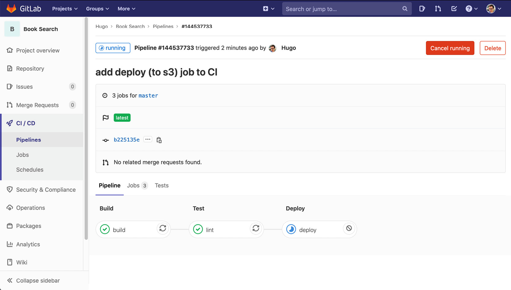

    图 14.76：正在运行的 GitLab CI/CD 管道中的 deploy 作业

    *图 14.77*显示了成功完成的`deploy`作业的 GitLab CI/CD 管道：

    

    图 14.77：通过通过的`deploy`作业的 GitLab CI/CD 管道

    一旦管道完成，我们的应用程序应该可以通过 S3 网络端点访问，如下面的截图所示：

    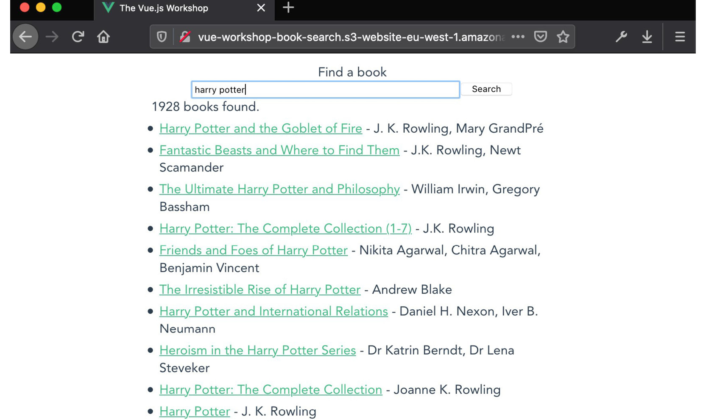

    图 14.78：通过 S3 网络端点 URL 访问的图书搜索

1.  最后，我们将创建一个充当 S3 网络端点 CDN 的 CloudFront 分发。我们希望将`origin`设置为 S3 存储桶网络端点的源，并确保我们已启用`将 HTTP 重定向到 HTTPS`：

1.  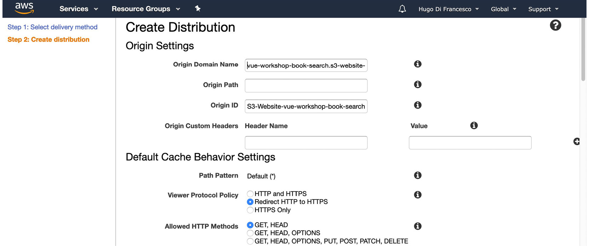

图 14.79：将源域名设置为 S3 存储桶的 CloudFront 分发创建页面

一旦 CloudFront 分发部署完成，我们的应用程序应该可以通过 CloudFront 分发的域名访问，如下面的截图所示：

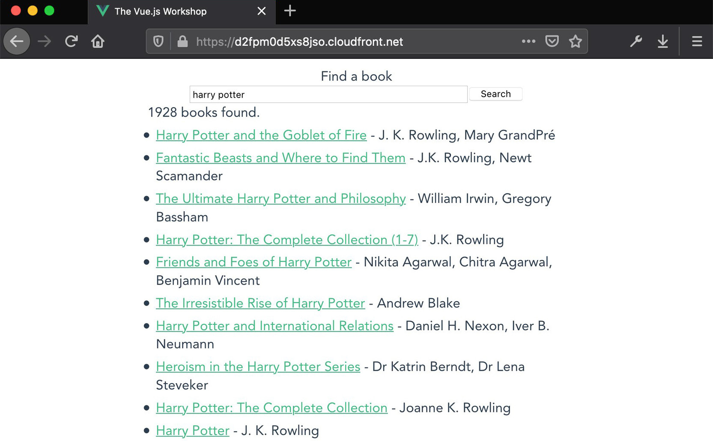

图 14.80：通过 CloudFront 域名访问的图书搜索，显示 harry potter 查询的结果

通过使用 GitLab CI/CD，我们已将 CI/CD 添加到现有的 Vue CLI 项目中。然后我们使用 CloudFront 作为我们的 CDN 将其部署到 S3。
