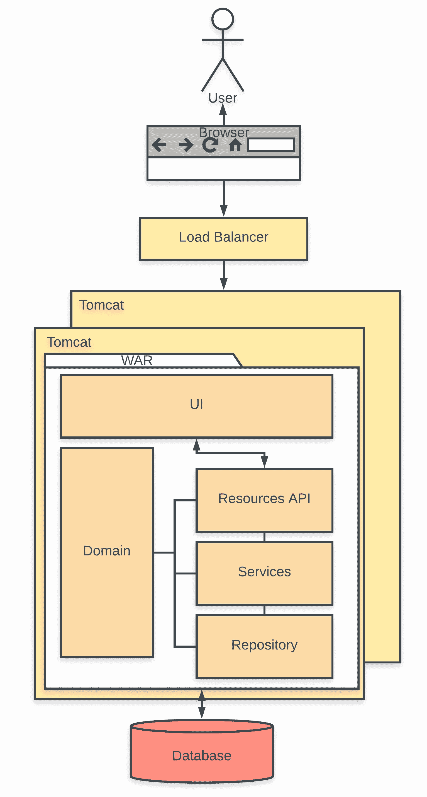
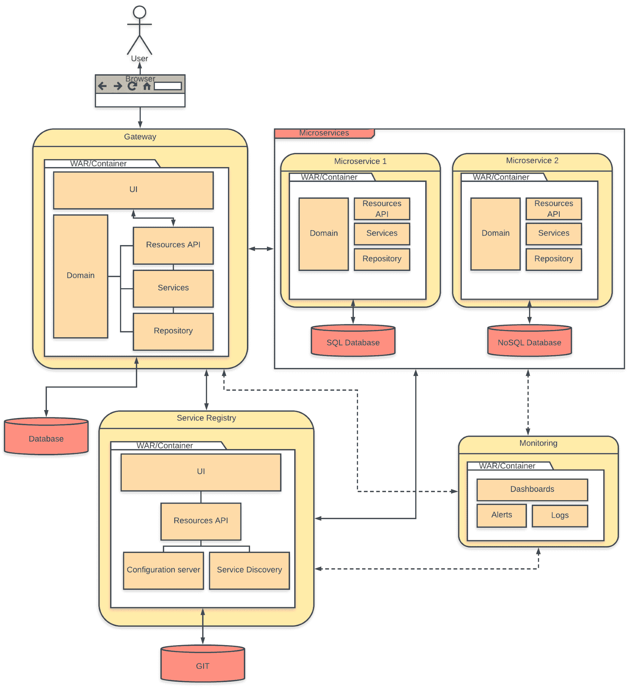

# 第一章：现代 Web 应用开发简介

根据 2017 年 Stack Overflow 开发者调查([`insights.stackoverflow.com/survey/2017#developer-profile-specific-developer-types`](https://insights.stackoverflow.com/survey/2017#developer-profile-specific-developer-types))，*全栈 Web 开发者*是最受欢迎的开发者头衔。软件行业将全栈开发者定义为能够在应用栈的不同领域工作的开发者。术语栈指的是构成应用的不同组件和工具。

在 Web 应用开发方面，技术栈可以大致分为两个领域——**前端**和**后端**技术栈或**客户端**和**服务器端**技术栈。前端通常指的是负责渲染用户界面的部分，而后端则指的是负责业务逻辑、数据库交互、用户认证、服务器配置等部分。全栈 Java Web 应用开发者需要在前端和后端技术方面工作，从编写用户界面的 HTML/JavaScript 到编写业务逻辑的 Java 类文件和数据库操作的 SQL 查询。

随着软件架构的不断演变，全栈 Web 开发者需要掌握的技术范围大大增加。仅仅能够编写 HTML 和 JavaScript 来构建用户界面已经不够了，我们还需要了解客户端框架，如 Angular、React、VueJS 等。仅仅精通企业 Java 和 SQL 也不够，我们还需要了解服务器端框架，如 Spring、Hibernate、Play 等。

在本章中，我们将介绍以下主题：

+   现代全栈 Web 开发

+   Web 架构模式

+   选择合适的模式

# 现代全栈 Web 开发

如果我们要开始讨论全栈开发者的生活，那将足以写成一整本书——所以让我们留到另一天再说。

让我们看看一个全栈 Java Web 应用的用例，看看其中涉及的内容。

让我们以开发一个典型 Java Web 应用的用户管理模块为例。假设你会为所有代码编写单元测试用例，所以我们在这里不会详细说明：

+   你会从设计该功能的架构开始。你会决定要使用的插件和框架、要遵循的模式等。

+   你将根据使用的数据库技术对特征进行领域模型建模。

+   然后，你会创建服务器端代码和数据库查询，以持久化和从数据库中检索数据。

+   数据准备好后，你会实现任何业务逻辑的服务器端代码。

+   然后，你会实现一个 API，可以通过 HTTP 连接提供数据。

+   你将为 API 编写集成测试。

+   现在，由于后端已经准备好了，你将开始用 JavaScript 或类似的技术编写前端代码。

+   你将编写客户端服务以从后端 API 获取数据。

+   你将编写客户端组件以在网页上显示数据。

+   你将根据提供的设计构建页面并对其进行样式设计。

+   你将为网页编写自动化的端到端测试。

+   这还没有完成。一旦你测试了一切在本地都能正常工作，你将创建拉取请求或将代码检查到所使用的版本控制系统中。

+   你将等待持续集成过程来验证一切，并修复任何损坏的部分。

+   一切都绿灯亮起，代码被接受后，通常你将开始将这个功能部署到预发布或验收环境，无论是在本地还是在云服务提供商那里。如果是后者，你还需要熟悉所使用的云技术。你还需要根据需要升级数据库模式，并在需要时编写迁移脚本。

+   一旦功能被接受，你可能会负责以类似的方式将其部署到生产环境中，并在必要时解决出现的问题。在一些团队中，你可能会与其他团队成员交换步骤，这样你就可以部署你的同事开发的功能，同时他们部署你的功能。

+   你可能还需要与你的同事一起确保生产环境正常运行，包括数据库、虚拟机等等。

如你所见，这不是一件容易的任务。责任范围从客户端的样式表更新到在生产云服务中的虚拟机上运行数据库迁移脚本。如果你不够熟悉，这将是一项艰巨的任务，你很快就会迷失在众多框架、技术和设计模式的大海中。

全栈开发不是一件容易的事情。它需要花费大量的时间和精力来保持自己与软件开发多个领域的各种技术和模式同步。以下是一些你可能作为全栈 Java 开发者会遇到的一些常见问题：

+   客户端开发不再仅仅是编写纯 HTML 和 JavaScript 了。它正变得和服务器端开发一样复杂，包括构建工具、转译器、框架和模式。

+   在 JavaScript 的世界里，几乎每周都会出现一个新的框架，如果你是从 Java 背景过来的，这可能会让你感到非常压倒性。

+   容器技术如 Docker 革命性地改变了软件行业，但它们也引入了许多新的学习内容，需要跟踪，例如编排工具、容器管理工具等等。

+   云服务每天都在增长。为了保持同步，你需要熟悉它们的 API 和相关编排工具。

+   近年来，随着 Scala、Groovy、Kotlin 等 JVM 语言的引入，Java 服务器端技术也经历了重大转变，迫使你必须跟上它们的步伐。另一方面，服务器端框架变得越来越功能丰富，因此也变得更加复杂。

最重要的是确保所有这些在需要时能够良好协作的痛苦。这需要大量的配置、一些粘合代码和无数杯咖啡。

**转换器**是源到源的编译器。与传统编译器从源代码编译到二进制代码不同，转换器将一种类型的源代码编译成另一种类型的源代码。TypeScript 和 CoffeeScript 是这方面的优秀例子，它们都编译成 JavaScript。

在这里很容易迷失方向，这就是 JHipster 和 Spring Boot 等技术的用武之地，它们可以帮助我们。我们将在后面的章节中看到详细内容，但简而言之，它们通过提供移动部件之间的连接，让你只需专注于编写业务代码。JHipster 还通过提供部署和管理应用程序到各种云提供商的抽象来帮助。

# Web 架构模式

全栈领域由于目前广泛使用的不同 Web 架构模式而变得更加复杂。今天广泛使用的 Web 应用程序架构模式可以大致分为两种——**单体架构**和**微服务架构**，后者是新兴的架构模式。

让我们详细看看以下内容：

+   单体架构

+   微服务架构

# 单体 Web 架构

单体架构是 Web 应用程序最常用的模式，因为它在开发和部署上的简单性。尽管实际的运动部件会因应用程序而异，但一般模式保持不变。一般来说，单体 Web 应用程序可能执行以下操作：

+   它可以支持不同的客户端，如桌面/移动浏览器和原生桌面/移动应用程序

+   它可以暴露 API 供第三方消费

+   它可以通过 REST/SOAP Web 服务或消息队列与其他应用程序集成

+   它可以处理 HTTP 请求，执行业务逻辑，访问数据库，并且可以与其他系统交换数据

+   它可以在诸如 Tomcat、JBoss 等 Web 应用程序容器上运行

+   它可以通过增加运行其上的机器的功率进行垂直扩展，或者通过在负载均衡器后面添加额外的实例进行水平扩展

**REST**（**表征状态转移**）依赖于无状态的、客户端-服务器、可缓存的通信协议。HTTP 是 REST 最常用的协议。它是一种轻量级架构风格，其中 RESTful HTTP 通信用于在客户端和服务器或两个系统之间传输数据。

**SOAP**（**简单对象访问协议**）是一种使用 HTTP 和 XML 的消息协议。它在 SOAP Web 服务中广泛用于在两个不同的系统之间传输数据。

典型的单体 Web 应用程序架构的例子如下：

让我们想象一个在线酒店预订系统，该系统从客户那里在线接收预订订单，验证房间可用性，验证支付选项，进行预订，并通知酒店。该应用程序由多个层和组件组成，包括客户端应用程序，它构建了一个丰富的用户界面，以及负责管理预订、验证支付、通知客户/酒店等的多其他后端组件。

应用程序将作为单个单体**Web 应用程序存档**（**WAR**）文件部署，在 Web 应用程序容器（如 Tomcat）上运行，并通过在充当负载均衡器的 Apache Web 服务器后面添加多个实例进行水平扩展。请看以下图表：

单体式 Web 应用程序架构的优点如下所述：

+   开发更简单，因为技术栈在所有层都是统一的。

+   测试更简单，因为整个应用程序捆绑在一个单独的包中，这使得运行集成和端到端测试更容易。

+   部署更简单、更快，因为你只需要担心一个包。

+   扩展更简单，因为你可以通过增加负载均衡器后面的实例数量来扩展。

+   维护应用程序需要较小的团队。

+   团队成员共享或多或少相同的技能集。

+   技术栈更简单，大多数情况下更容易学习。

+   初始开发更快，因此使上市时间更快。

+   需要更简单的基础设施。即使是一个简单的应用程序容器或 JVM 也足以运行应用程序。

单体式 Web 应用程序架构的缺点如下所述：

+   组件紧密耦合在一起，导致出现不希望出现的副作用，例如一个组件的更改可能导致另一个组件的回归，等等。

+   随着时间的推移变得复杂和庞大，导致开发周期缓慢。新功能开发将花费更多时间，由于紧密耦合，现有功能的重构将更加困难。

+   任何更改都需要重新部署整个应用程序。

+   由于模块紧密耦合，可靠性较低。服务中的一个小的错误可能会破坏整个应用程序。

+   由于整个应用程序需要迁移，新技术采用困难。大多数情况下，增量迁移是不可能的。因此，许多单体应用程序最终会拥有过时的技术栈。

+   关键服务无法单独扩展，导致资源使用增加，因为整个应用程序都需要扩展。

+   大型单体应用程序将具有较长的启动时间和较高的 CPU 和内存资源使用率。

+   团队之间的相互依赖性将更强，扩展团队将更具挑战性。

# 微服务架构

近年来，微服务架构得到了快速发展，由于其模块化和可扩展性，在 Web 应用开发中越来越受欢迎。微服务架构几乎可以提供我们在早期部分看到的单体架构的所有功能。此外，它还提供了许多更多功能和灵活性，因此通常被认为是复杂应用的更优选择。与单体架构不同，微服务架构很难进行一般化，因为它可能严重依赖于用例和实现。但它们确实有一些共同特征，通常如下：

+   微服务组件是松散耦合的。组件可以独立开发、测试、部署和扩展，而不会干扰其他组件。

+   组件不需要使用相同的技术栈进行开发。这意味着单个组件可以选择自己的技术栈和编程语言。

+   它们经常利用高级功能，如服务发现、断路器、负载均衡等。

+   微服务组件大多是轻量级的，并且执行特定的功能。例如，一个身份验证服务只会关心将用户验证到系统中。

+   通常具有广泛的监控和故障排除设置。

一个微服务 Web 应用架构的例子如下：

让我们想象一个庞大的在线电子商务系统，顾客可以浏览商品类别，维护收藏夹，将商品添加到购物车，下单并跟踪订单等。该系统具有库存管理、客户管理、多种支付方式、订单管理等。应用程序由多个模块和组件组成，包括一个 UI 网关应用程序，它构建了一个丰富的用户界面，并处理用户身份验证和负载均衡，以及负责管理库存、验证支付和管理订单的几个其他后端应用程序。它还具有性能监控和服务的自动故障转移。

应用程序将以多个可执行 WAR 文件的形式部署在云提供商托管的 Docker 容器中。请查看以下图表：

微服务 Web 应用架构的优势如下详细说明：

+   松散耦合的组件导致更好的隔离性，更容易测试和更快地启动。

+   更快的开发周期和更短的市场投放时间。新功能可以更快地构建，现有功能也可以轻松重构。

+   服务可以独立部署，这使得应用程序更可靠，补丁更容易应用。

+   问题，例如某个服务中的一个内存泄漏，将被隔离，因此不会导致整个应用程序崩溃。

+   技术采用更容易，组件可以在增量迁移中独立升级，使得每个组件都有不同的堆栈成为可能。

+   可以建立更复杂和高效的扩展模型。关键服务可以更有效地扩展。基础设施的使用效率更高。

+   单个组件启动更快，这使得并行化和提高整体启动速度成为可能。

+   团队之间的依赖性会减少。最适合敏捷团队。

微服务 Web 应用架构的缺点如下所述：

+   在整体堆栈方面更为复杂，因为不同的组件可能有不同的技术堆栈，迫使团队投入更多时间来跟上它们。

+   由于堆栈中有更多移动部件，执行端到端测试和集成测试变得困难。

+   整个应用程序部署起来更复杂，因为涉及到容器和虚拟化的复杂性。

+   扩展更高效，但设置扩展更复杂，因为它需要高级功能，如服务发现、DNS 路由等。

+   需要一个更大的团队来维护应用程序，因为有更多的组件和更多的技术涉及。

+   团队成员根据他们工作的组件共享不同的技能组合，这使得替换和知识共享更困难。

+   技术堆栈复杂，大多数时候更难学习。

+   初始开发时间会更高，使得上市时间变慢。

+   需要复杂的基础设施。通常将需要容器（Docker）和多个 JVM 或应用容器来运行。

# 选择正确的模式

在启动新项目时，如今选择架构模式总是很困难。有许多因素需要考虑，很容易被围绕不同模式和技术的**炒作**所迷惑（参见**炒作驱动开发**([`blog.daftcode.pl/hype-driven-development-3469fc2e9b22`](https://blog.daftcode.pl/hype-driven-development-3469fc2e9b22)))）。以下是关于何时选择单体 Web 应用架构而不是微服务架构以及相反的一些一般性指南。

# 选择单体架构的时机

以下列表可以作为选择单体架构而不是微服务架构的一般性指南。这不是一个确定的列表，但可以给出何时选择单体架构的思路：

+   当**应用程序****范围**小且定义明确，并且你确信应用程序在功能上不会大幅增长。例如，一个博客、一个简单的在线购物网站、一个简单的 CRUD 应用程序等。

+   当**团队规模**较小时，比如说少于八人（这不是一个硬性限制，而是一个实际限制）。

+   当团队的**平均技能水平**为新手或中级时。

+   当**上市时间**至关重要时。

+   当你不想在**基础设施**、监控等方面花费太多时。

+   当你的**用户基础**相对较小，并且你预计它们不会增长。例如，针对特定用户群体的企业应用。

在大多数实际用例中，单体架构就足够了。继续阅读下一节，了解何时应考虑微服务架构而不是单体架构。

# 选择微服务架构的时机

以下列表可以作为选择微服务架构的一般指南。这不是一个确定的列表，但可以给出何时选择微服务架构而不是单体架构的想法。请注意，与选择单体架构不同，这里的决策更为复杂，可能涉及以下许多点的交叉考虑：

+   当**应用范围**大且定义明确，并且你确信应用在功能上会大幅增长。例如，一个在线电子商务商店、社交媒体服务、面向大量用户的视频流媒体服务、API 提供商等。

+   当**团队规模**较大时，必须有足够的成员来独立有效地开发各个组件。

+   当团队的**平均技能水平**较高，并且团队成员对高级微服务模式有信心。

+   当**上市时间**不是关键。微服务架构在初期需要更多时间来正确实施。

+   当你准备在**基础设施**、监控等方面投入更多，以提高产品质量。

+   当你的**用户基础**庞大，并且你预计它们会增长。例如，面向全球用户的社交媒体应用。

虽然在大多数情况下单体架构就足够了，但在一开始就投资于微服务架构，当应用规模变得巨大时，将带来长期的好处。

关于这些架构模式，你可以参考[`articles.microservices.com/monolithic-vs-microservices-architecture-5c4848858f59`](https://articles.microservices.com/monolithic-vs-microservices-architecture-5c4848858f59)。

# 摘要

到目前为止，我们已经看到了全栈开发是什么，比较了两种最突出的架构模式。我们还学习了单体和微服务架构的优缺点，这有助于我们为手头的用例选择正确的模式。

在下一章中，我们将深入探讨 JHipster 平台，并查看它提供的所有选项。我们还将学习如何安装 JHipster 以及设置我们的工具和开发环境。
