# 第三章：使用 JHipster 构建 Monolithic Web 应用程序

让我们开始行动，使用 JHipster 构建一个生产级别的 Web 应用程序。在我们开始之前，我们需要一个用例。我们将构建一个电子商务 Web 应用程序，该应用程序管理产品、客户及其订单和发票。Web 应用程序将使用 MySQL 数据库进行生产，并将具有 Angular 前端。实际购物网站的 UI 将与后台功能不同，后台功能仅对具有管理员角色的员工可用。在这个练习中，我们只为面向客户的部分构建一个简单的 UI。我们将在本章中讨论其他选项。

在本章中，我们将：

+   查看如何使用 JHipster 创建单体 Web 应用程序

+   了解生成的代码的重要方面

+   查看生成的应用程序的安全方面

+   查看如何运行应用程序和测试

+   查看生成的前端屏幕

+   查看包含的工具，这些工具将简化进一步的开发

本章将需要在整个过程中使用终端（Windows 上的命令提示符）应用程序。您可以在上一章中查看更多关于此的信息。

# 应用程序生成

在我们开始生成应用程序之前，我们需要准备我们的工作空间，因为这个工作空间将贯穿整本书，您将在该工作空间上创建许多 Git 分支。

访问 [`rogerdudler.github.io/git-guide/`](http://rogerdudler.github.io/git-guide/) 以获取 Git 命令的快速参考指南。

# 第 1 步 – 准备工作空间

让我们为工作空间创建一个新的文件夹。创建一个名为 `e-commerce-app` 的文件夹，并在终端中导航到该文件夹：

```js
> mkdir e-commerce-app
> cd e-commerce-app
```

现在，为我们的应用程序创建一个新的文件夹；让我们称它为 `online-store` 并导航到它：

```js
> mkdir online-store
> cd online-store
```

现在，我们已经准备好调用 JHipster。让我们首先确保一切准备就绪，通过运行 `jhipster --version` 命令。它应该打印一个全局安装的 JHipster 版本，否则您需要遵循上一章中的说明来设置它。

总是使用最新版本的工具会更好，因为它们可能包含重要的错误修复。您可以使用命令 `yarn global upgrade generator-jhipster` 任何时间升级 JHipster。

# 第 2 步 – 使用 JHipster 生成代码

通过在终端中运行 `jhipster` 命令初始化 JHipster，这将产生以下输出：

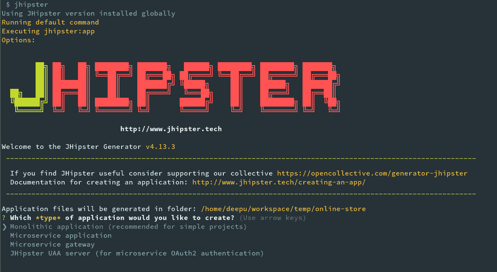

JHipster 将提出一系列问题以获取关于不同选项的输入，这些选项是必需的。第一个问题是关于我们想要的程序类型，我们提供了以下四个选项：

+   **单体应用程序**：正如其名所示，它创建了一个基于 Spring Boot 后端和 SPA 前端的单体 Web 应用程序。

+   **微服务应用程序**：这创建了一个不带任何前端且设计用于与 JHipster 微服务架构一起工作的 Spring Boot 微服务。

+   **微服务网关**：这创建了一个与单体应用非常相似的 Spring Boot 应用，但针对微服务架构进行了额外的配置。它具有 SPA 前端。

+   **JHipster UAA 服务器**：这创建了一个 OAuth2 用户身份验证和授权服务。它不会包含任何前端代码，并设计用于在 JHipster 微服务架构中使用。

我们将为我们的用例选择**单体应用**。我们将在本书的第八章，“微服务服务器端技术简介”中详细讨论其他选项。

运行`jhipster --help`以查看所有可用命令。运行`jhipster <command> --help`以查看特定命令的帮助信息；例如，`jhipster app --help`将显示主应用生成过程的帮助信息。

# 服务器端选项

生成器现在将开始询问我们关于服务器端选项的需求。让我们逐一了解它们：

+   **问题 1**：这个提示要求我们为应用提供一个基本名称，该名称用于创建主类文件名、数据库名等。默认情况下，如果当前目录名不包含任何特殊字符，JHipster 将建议使用当前目录名。让我们将我们的应用命名为`store`。请注意，文件将在你所在的当前目录中创建：


+   **问题 2**：这个提示要求我们选择一个 Java 包名。让我们选择`com.mycompany.store`：

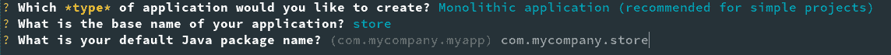

+   **问题 3**。这个提示询问我们是否需要为此实例配置 JHipster 注册表。JHipster 注册表提供了一个服务发现和配置服务器实现，这对于集中式配置管理和应用扩展非常有用。对于这个用例，我们不需要它，所以让我们选择“否”。我们将在本书的第八章，“微服务服务器端技术简介”中了解更多关于 JHipster 注册表的信息：

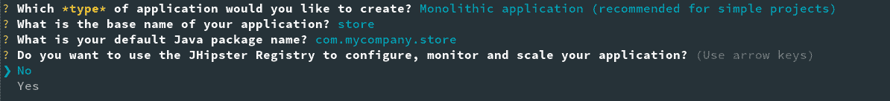

+   **问题 4**：这个提示要求我们选择一个身份验证机制。我们提供了三个选项：

    +   JWT 身份验证

    +   HTTP 会话身份验证

    +   OAuth 2.0/OIDC 身份验证

我们已经在上一章中看到了它们的差异，并且对于我们的用例，让我们选择 JWT 身份验证：

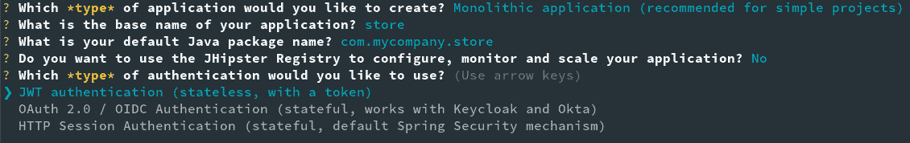

+   **问题 5**：这个提示要求我们选择数据库类型；提供的选项是 SQL、MongoDB、Couchbase 和 Cassandra。我们在上一章中已经了解了不同的数据库选项。对于我们的应用，让我们选择一个 SQL 数据库：

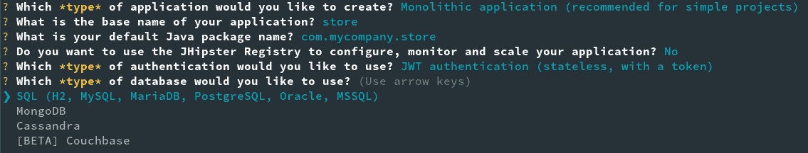

+   **问题 6**：这个提示要求我们选择在生产中想要使用的特定 SQL 数据库；可用的选项是 MySQL、MariaDB、PostgreSQL、Oracle 和 Microsoft SQL Server。让我们在这里选择 MySQL：

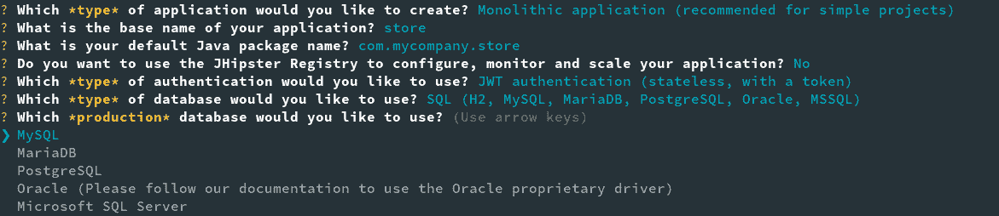

+   **问题 7**：这个提示要求我们在我们选择的 SQL 数据库和 H2 嵌入式数据库之间进行选择，用于开发。H2 嵌入式数据库特别有用，因为它使开发更快且自包含，无需运行 MySQL 实例。因此，让我们在这里选择基于磁盘的 H2 持久性，因为它比运行完整的数据库服务更轻量级且易于开发：

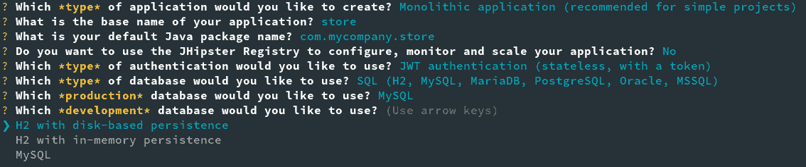

如果您的用例需要在开发中处理持久数据，并且模型不会经常更改，那么您也可以选择 MySQL 进行开发，因为它会提供更快的启动时间。这是因为嵌入式 H2 数据库不需要初始化，但缺点是每次您进行模式更改或重新创建实体时，您都必须手动使用生成的 liquibase diff 更改日志更新数据库，或者手动擦除数据库并重新开始。使用嵌入式 H2 数据库，您可以通过运行 `./gradlew clean` 来擦除它。

+   **问题 8**：这个提示要求我们选择一个 Spring 缓存实现。我们有选择不使用缓存、EHCache、Hazelcast 和 Infinispan 的选项。由于我们在上一章学习了这些内容，让我们在这里选择 Hazelcast：

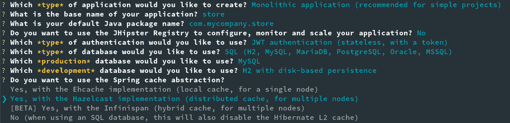

+   **问题 9**。这个提示要求我们选择是否需要为 Hibernate 选择二级缓存。让我们选择是。它将使用我们在上一个问题中选择的相同的缓存实现：

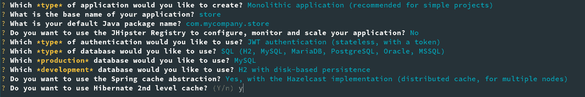

+   **问题 10**：这个提示为我们提供了选择用于项目的构建工具；选项是 Maven 和 Gradle。让我们在这里选择 Gradle，因为它更现代且功能更强大：

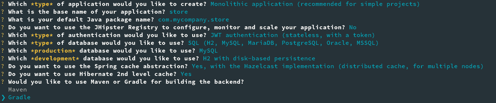

+   **问题 11**：这个提示很有趣，因为它展示了 JHipster 支持的各种附加选项。选项包括：

    +   社交登录：添加使用社交登录提供者（如 Facebook、Twitter 等）进行登录的支持（JHipster 5 中移除了社交登录选项，您需要选择 OAuth 2.0/OIDC 认证以使用 OIDC 提供商提供的社交登录）

    +   Elasticsearch：为生成的实体添加 Elasticsearch 支持

    +   WebSockets：使用 Spring WebSocket、SocketJS 和 Stomp 协议添加 WebSocket 支持

    +   API 首先开发与 swagger-codegen：为 API 首先开发添加 Swagger 代码生成支持

    +   Apache Kafka：添加使用 Kafka 的异步队列支持

让我们保持简单，选择使用 Spring WebSocket 的 WebSockets：

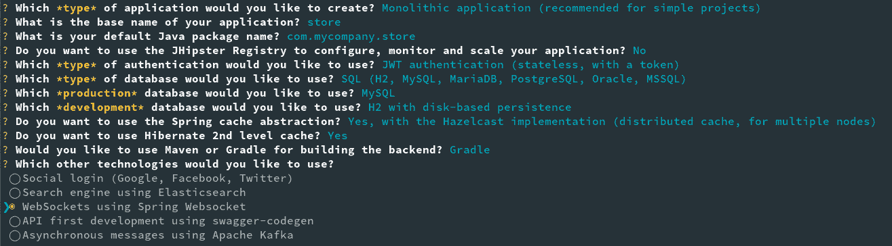

# 客户端选项

现在，生成器将询问我们关于客户端选项的问题，包括我们希望使用的客户端框架：

+   **问题 1**：这个提示要求我们选择一个客户端 MVVM 框架；选项包括 Angular 5 和 React。在这里我们选择 Angular 5：

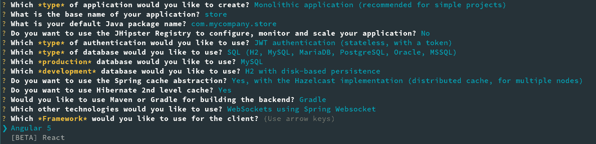

+   **问题 2**。这个提示允许我们为我们的 CSS 启用 SASS 支持，由于 SASS 很棒，让我们通过选择“是”来启用它：

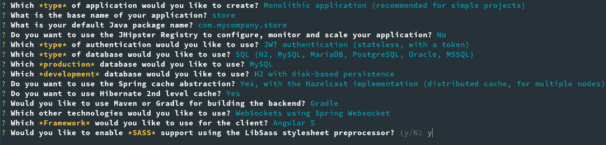

# 国际化选项

现在，我们将有机会启用国际化并选择我们想要的语言：

+   **问题 1**。这个提示允许我们启用 **国际化**（**i18n**）。在这里我们选择“是”：

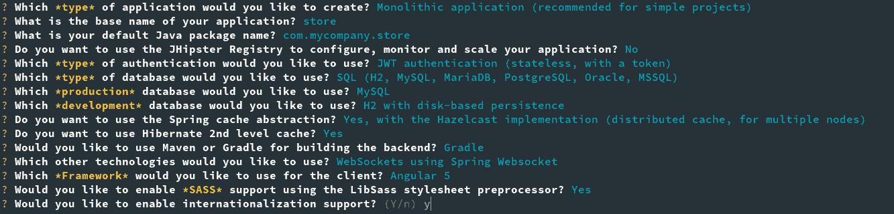

+   **问题 2**：由于我们启用了 i18n，我们将被提供选择主要语言和附加 i18n 语言的选择。在撰写本文时，有 36 种受支持的语言，包括 2 种 **RTL**（**从右到左**）语言。让我们选择英语作为主要语言，简体中文作为附加语言：

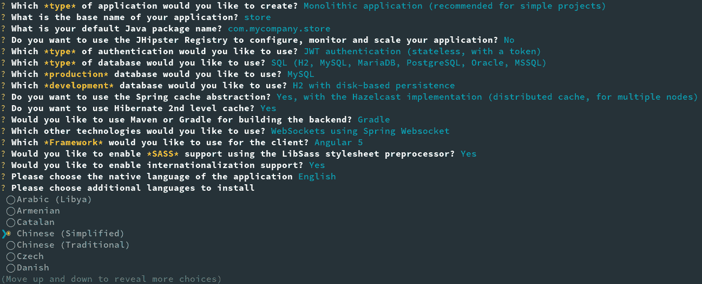

# 测试

现在，我们可以为我们的应用程序选择测试选项。

这个提示允许我们为我们的应用程序选择测试框架，这将为应用程序和实体创建示例测试。选项包括 Gatling、Cucumber 和 Protractor。在这里我们选择 Protractor：

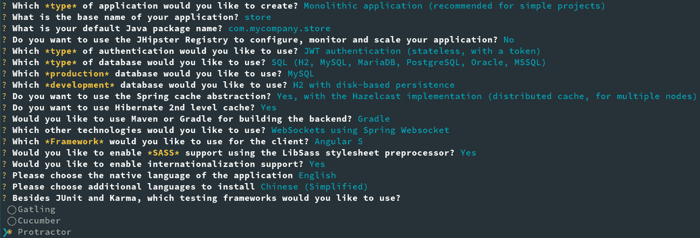

# 模块

这个提示允许我们从 JHipster 市场选择额外的第三方模块（[`www.jhipster.tech/modules/marketplace`](https://www.jhipster.tech/modules/marketplace)）。如果我们想使用 JHipster 直接不支持的功能，这可能很有帮助。我们将在后面的章节中探讨这个问题。现在，让我们选择“否”。不用担心，因为这些模块可以在需要时添加到应用程序中：

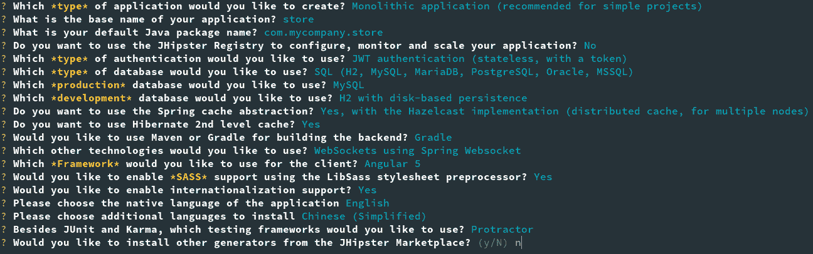

一旦所有问题都回答完毕，代码生成将开始，你将看到如下输出，列出创建的文件，然后运行 yarn 安装以安装所有前端依赖。

如果你不想运行 Yarn 安装和 Webpack 构建步骤，可以在运行 JHipster 时使用 `--skip-install` 标志来跳过这一步骤。只需运行 `jhipster --skip-install`

一旦安装完成，生成器将为客户端触发 webpack 构建，这样当我们启动应用程序时，我们就有了一切准备就绪：

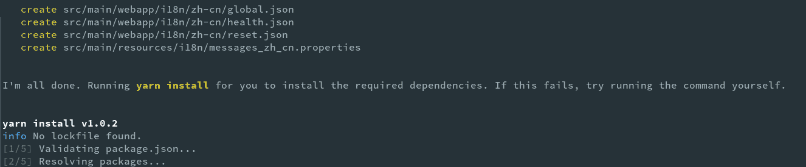

JHipster 将检查你的环境，以查看是否安装了所有必需的依赖项，如 Java8、NodeJS、Git 和 NPM/Yarn。如果没有，它将在代码生成开始之前显示友好的警告消息。

一旦过程完成，你将看到如下成功消息，以及开始应用的说明：

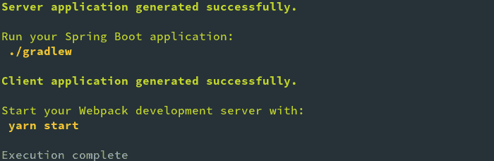

在执行 `jhipster` 命令时，可以传递一些命令行标志。运行 `jhipster app --help` 将列出所有可用的命令行标志。例如，其中一个有趣的标志是 `npm`，它允许您在依赖项管理中使用 NPM 而不是 Yarn。

JHipster 将自动为文件夹初始化 Git 仓库并提交生成的文件。如果您希望亲自执行此步骤，可以在执行 `jhipster --skip-git` 时传递 `skip-git` 标志，然后手动执行以下步骤：

```js
> git init
> git add --all
> git commit -am "generated online store application"
```

如果您愿意，也可以使用像 Sourcetree 或 GitKraken 这样的图形界面工具来与 Git 一起工作。

# 代码遍历

现在我们已经使用 JHipster 生成了应用程序，让我们来看看创建的源代码中的重要部分。让我们在我们的首选 IDE 或编辑器中打开我们的应用程序。

如果您使用 IntelliJ IDEA，您可以在应用程序文件夹的终端中执行 `idea .` 来启动它。否则，您可以使用菜单选项“文件 | 新建 | 从现有源创建项目”将应用程序导入为新 Gradle 项目，在选择 Gradle 之前选择项目文件夹，然后点击“下一步”和“完成”。如果您使用 Eclipse，请打开“文件 | 导入...”对话框，在列表中选择“Gradle 项目”，然后按照说明操作。

# 文件结构

创建的应用程序将具有以下文件结构：

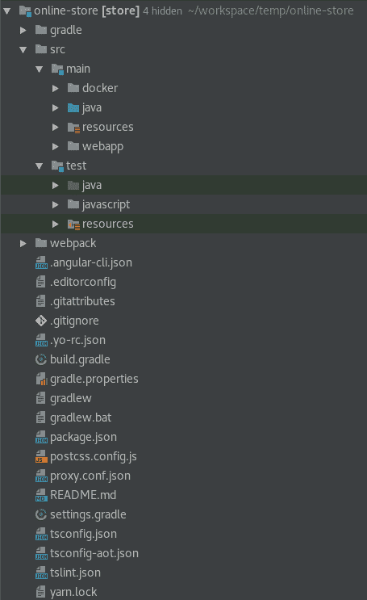

如您所见，根目录相当繁忙，有几个文件夹但很多配置文件。其中最有趣的是：

+   `src`：这是源文件夹，包含主应用程序源和测试源文件。

+   `webpack`：这个文件夹包含所有用于开发、生产和测试的 Webpack 客户端构建配置。

+   `gradle`：这个文件夹包含 Gradle 包装器和额外的 Gradle 构建脚本，这些脚本将由主 Gradle 构建文件（如果选择 Maven，JHipster 也会提供类似的包装器）使用。

+   `build.gradle`：这是我们 Gradle 构建文件，它指定了应用程序的构建生命周期。它还指定了服务器端依赖项。构建使用与其一起定义的 `gradle.properties` 文件中的属性。您还可以找到一个名为 `gradlew`（Windows 上的 `gradlew.bat`）的可执行文件，它允许您使用 Gradle 而无需安装它。

+   `.yo-rc.json`：这是 JHipster 的配置文件。此文件存储了我们在应用程序创建期间选择的选项，并用于应用程序的重生成和升级。

+   `package.json`：这是 NPM 配置文件，它指定了所有客户端依赖项、客户端构建依赖项和任务。

+   `tsconfig.json`：这是 TypeScript 的配置文件。还有一个用于 Angular **AOT**（**提前编译**）的 `tsconfig-aot.json`。

+   `tslint.json`：这是 TypeScript 的 lint 配置文件。

安装并配置你的 IDE 或编辑器中的 Typescript 和 Tslint 插件，以充分利用 Typescript。

现在，让我们看看源文件夹。它有一个主文件夹和一个测试文件夹，分别存储主应用程序源代码和相应的测试源代码。文件夹结构如下：

+   `main`:

    +   `docker`: 存储应用程序的 Dockerfile 以及所选选项的 Docker 配置

    +   `java`: 存储应用程序的主要 Java 源代码

    +   `resources`: 存储 Spring Boot 配置文件、Liquibase 变更日志以及应用程序使用的服务器端 i18n 文件和电子邮件模板等静态资源

    +   `webapp`: 存储 Angular 应用程序源代码和客户端静态内容，如图片、样式表、i18n 文件等

+   `test`:

    +   `java`: 存储服务器端的单元和集成测试源代码

    +   `javascript`: 存储客户端应用程序的 Karma 单元测试规范和 Protractor 端到端规范

    +   `resources`: 存储 Spring 配置文件和用于测试的服务器端 i18n 文件和电子邮件模板等静态资源

# 服务器端源代码

服务器端代码位于`src/main`下的 Java 和资源文件夹中，如前一个截图所示。文件夹结构如下：

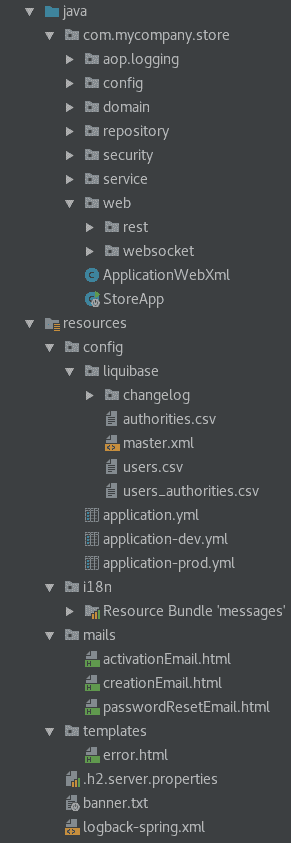

你可能会注意到，在生成的代码中，Spring 组件没有使用传统的`@Autowired`或`@Inject`注解进行依赖注入。这是因为我们使用构造函数注入而不是字段注入，Spring Boot 不需要为构造函数注入显式注解。构造函数注入被认为是一个更好的实践，因为它使我们能够编写更好的单元测试并避免设计问题，而字段注入则更为优雅，但容易使类变得单一。构造函数注入是 Spring 团队推荐的最佳实践。构造函数注入也使得单元测试组件变得更加容易。

# Java 源代码

Java 源代码的重要部分是：

+   `StoreApp.java`: 这是应用程序的主要入口类。由于这是一个 Spring Boot 应用程序，主类是可执行的，你可以通过在 IDE 中运行这个类来启动应用程序。让我们看看这个类：

    +   该类被大量 Spring JavaConfig 注解标注：

```js
@ComponentScan
@EnableAutoConfiguration(exclude = {MetricFilterAutoConfiguration.class, MetricRepositoryAutoConfiguration.class})
@EnableConfigurationProperties({LiquibaseProperties.class, ApplicationProperties.class})
```

+   +   第一个，`@ComponentScan`，告诉 Spring 应用程序扫描源文件并自动检测 Spring 组件（服务、仓库、资源、定义 Spring bean 的配置类等）。

    +   第二个是`@EnableAutoConfiguration`，它告诉 Spring Boot 尝试猜测并自动配置应用程序可能需要的 bean，这些 bean 基于类路径上找到的类和我们所提供的配置。排除设置特别告诉 Spring Boot 不要自动配置指定的 bean。

    +   第三个是`@EnableConfigurationProperties`，它通过属性文件帮助为应用程序注册额外的配置。

+   +   类的主方法启动 Spring Boot 应用程序并运行它：

```js
public static void main(String[] args) throws UnknownHostException {
    SpringApplication app = new SpringApplication(StoreApp.class);
    DefaultProfileUtil.addDefaultProfile(app);
    Environment env = app.run(args).getEnvironment();
    ...
}
```

+   `config`：这个包包含数据库、缓存、WebSocket 等 Spring bean 配置。这是我们配置应用程序各种选项的地方。其中一些重要的配置是：

    +   `CacheConfiguration.java`：这个类配置应用程序的 Hibernate 二级缓存。由于我们选择了 Hazelcast 作为缓存提供者，这个类以相同的方式配置。

    +   `DatabaseConfiguration.java`：这个类配置应用程序的数据库，并启用事务管理、JPA 审计和 JPA 存储库。它还配置 Liquibase 来管理数据库迁移和 H2 数据库用于开发。

    +   `SecurityConfiguration.java`：这是应用程序的一个重要部分，因为它配置了应用程序的安全性。让我们看看类中的重要部分：

        +   这些注解启用了 Web 安全和方法级安全，这样我们就可以在单个方法上使用`@Secured`和`@Pre/PostAuthorize`注解：

```js
@EnableWebSecurity
@EnableGlobalMethodSecurity(prePostEnabled = true, securedEnabled = true)
```

+   +   +   以下配置告诉应用程序忽略 Spring 安全配置中的静态内容和某些 API：

```js
@Override
public void configure(WebSecurity web) throws Exception {
    web.ignoring()
        .antMatchers(HttpMethod.OPTIONS, "/**")
        .antMatchers("/app/**/*.{js,html}")
        .antMatchers("/i18n/**")
        .antMatchers("/content/**")
        .antMatchers("/swagger-ui/index.html")
        .antMatchers("/api/register")
        .antMatchers("/api/activate")
        .antMatchers("/api/account/reset-
         password/init")
        .antMatchers("/api/account/reset-
         password/finish")
        .antMatchers("/test/**")
        .antMatchers("/h2-console/**");
}
```

+   +   +   以下配置告诉 Spring 安全哪些端点是所有用户允许访问的，哪些端点需要认证，以及哪些端点需要特定的角色（在这个例子中是`ADMIN`）：

```js
@Override
protected void configure(HttpSecurity http) throws Exception {
    http
        ...
    .and()
        .authorizeRequests()
        .antMatchers("/api/register").permitAll()
        ...
        .antMatchers("/api/**").authenticated()
        .antMatchers("/websocket/tracker")
            .hasAuthority(AuthoritiesConstants.ADMIN)
        .antMatchers("/websocket/**").permitAll()
        .antMatchers("/management/health").permitAll()
        .antMatchers("/management/**")
            .hasAuthority(AuthoritiesConstants.ADMIN)
        .antMatchers("/v2/api-docs/**").permitAll()
        .antMatchers("/swagger-resources/configuration/ui").permitAll()
        .antMatchers("/swagger-ui/index.html")
            .hasAuthority(AuthoritiesConstants.ADMIN)
    .and()
        .apply(securityConfigurerAdapter());
}
```

+   +   `WebConfigurer.java`：这是我们设置 HTTP 缓存头、MIME 映射、静态资产位置和**CORS**（**跨源资源共享**）的地方。

JHipster 提供了开箱即用的 CORS 支持：

+   可以使用`jhipster.cors`属性配置 CORS，如 JHipster 通用应用程序属性中定义的（[`www.jhipster.tech/common-application-properties/`](http://www.jhipster.tech/common-application-properties/))。

+   在`dev`模式下，它默认启用单体和网关。对于微服务，它默认禁用，因为您应该通过网关访问它们。

+   在`prod`模式下，出于安全原因，它默认禁用单体和微服务。

+   `domain`：应用程序的域模型类在这个包中。这些是简单的 POJO，它们通过 JPA 注解映射到 Hibernate 实体。当选择 Elasticsearch 选项时，它们也充当文档对象。让我们看看`User.java`类：

    +   一个实体类由以下注解特征。`@Entity`注解将类标记为 JPA 实体。`@Table`注解将实体映射到数据库表。`@Cache`注解启用实体的二级缓存，并指定了缓存策略：

```js
@Entity
@Table(name = "jhi_user")
@Cache(usage = CacheConcurrencyStrategy.NONSTRICT_READ_WRITE)
```

+   这些类在字段级别使用了各种注解。`@Id` 标记实体的主键。`@Column` 在没有提供覆盖时，通过相同的名称将字段映射到数据库表列。`@NotNull`、`@Pattern` 和 `@Size` 是用于验证的注解。`@JsonIgnore` 由 Jackson 用于在将对象转换为 JSON 时忽略字段，这些 JSON 将在 REST API 请求中返回。这对于与 Hibernate 一起使用尤其有用，因为它避免了关系之间的循环引用，这会创建大量的 SQL 数据库请求并失败：

```js
@Id
@GeneratedValue(strategy = GenerationType.IDENTITY)
private Long id;

@NotNull
@Pattern(regexp = Constants.LOGIN_REGEX)
@Size(min = 1, max = 50)
@Column(length = 50, unique = true, nullable = false)
private String login;

@JsonIgnore
@NotNull
@Size(min = 60, max = 60)
@Column(name = "password_hash",length = 60)
private String password;
```

+   +   数据库表之间的关系也使用 JPA 注解映射到实体。例如，它映射了用户与用户权限之间的多对多关系。它还指定了一个用于映射的连接表：

```js
@JsonIgnore
@ManyToMany
@JoinTable(
    name = "jhi_user_authority",
    joinColumns = {@JoinColumn(name = "user_id", referencedColumnName = "id")},
    inverseJoinColumns = {@JoinColumn(name = "authority_name", referencedColumnName = "name")})
@Cache(usage = CacheConcurrencyStrategy.NONSTRICT_READ_WRITE)
@BatchSize(size = 20)
private Set<Authority> authorities = new HashSet<>();
```

+   `repository`：此包包含实体的 Spring Data 存储库。这些通常是接口定义，由 Spring Data 自动实现。这消除了我们为数据访问层编写任何样板实现的需求。让我们看看 `UserRepository.java` 的示例：

```js
@Repository
public interface UserRepository extends JpaRepository<User, Long> {

    Optional<User> findOneByActivationKey(String activationKey);

    List<User> findAllByActivatedIsFalseAndCreatedDateBefore(Instant 
    dateTime);

    Optional<User> findOneByResetKey(String resetKey);

    Optional<User> findOneByEmailIgnoreCase(String email);
    ...
}
```

+   +   `@Repository` 注解将此标记为 Spring 数据存储库组件。

    +   接口扩展了 `JpaRepository`，这使得它可以继承所有默认的 CRUD 操作，如 `findOne`、`findAll`、`save`、`count` 和 `delete`。

    +   自定义方法按照 Spring 数据命名约定编写为简单的方法定义，以便方法名称指定要生成的查询。例如，`findOneByEmailIgnoreCase` 生成一个等价的查询 `SELECT * FROM user WHERE LOWER(email) = LOWER(:email)`。

+   `security`：此包包含与 Spring 安全相关的组件和实用工具，由于我们选择了 JWT 作为我们的认证机制，它还包含与 JWT 相关的类，例如 `TokenProvider`、`JWTFilter` 和 `JWTConfigurer`。

+   `service`：此包包含服务层，包括 Spring 服务豆、DTO、Mapstruct DTO 映射器和服务实用工具。

+   `web`：此包包含网络资源类、视图模型类和实用工具类。

    +   `rest`：此包包含用于 REST API 的 Spring 资源类。它还包含视图模型对象和实用工具。让我们看看 `UserResource.java`：

        +   资源类被标记为 Spring 的 `@RestController` 和 `@RequestMapping("/api")` 注解。后者指定了控制器的基 URL 路径，以便所有 `<applicationContext>/api/*` 请求都转发到这个类。

        +   根据其目的，请求方法被注解，例如，下面的代码将 `createUser` 方法标记为 `PostMapping` 用于 `"/users"`，这意味着所有发送到 `<applicationContext>/api/users` 的 POST 请求都将由该方法处理。`@Timed` 注解用于测量方法的性能。`@Secured` 注解限制了方法访问到指定的角色：

```js
@PostMapping("/users")
@Timed
@Secured(AuthoritiesConstants.ADMIN)
public ResponseEntity createUser(@Valid @RequestBody ManagedUserVM managedUserVM) throws URISyntaxException {
    ...
}
```

+   +   `WebSocket`: 此包包含 WebSocket 控制器和视图模型。

JHipster 在服务器端使用 **DTO**（**数据传输对象**）和 **VM**（**视图模型**）。DTO 用于在服务层和资源层之间传输数据。它们 **打破** Hibernate 事务，并避免由资源层触发的进一步延迟加载。VM 仅用于在 Web 前端显示数据，并不与服务层交互。

# 资源

资源的重要部分是：

+   `config`: 此处存放应用程序属性 YAML 文件和 Liquibase 变更日志。`application.yml` 文件包含可配置的 Spring Boot、JHipster 和应用程序特定属性，而 `application.(dev|prod).yml` 文件包含在特定开发或生产配置活动时应应用的属性。测试配置位于 `src/test/resource/application.yml`。

+   `i18n`: 此处存放服务器端的 i18n 资源文件。

+   `mails`: 此处存放电子邮件的 Thymeleaf 模板。

+   `templates`: 此处存放客户端的 Thymeleaf 模板。

# 客户端源代码

客户端源代码位于我们之前看到的 `src/main/webapp` 文件夹下。结构如下：

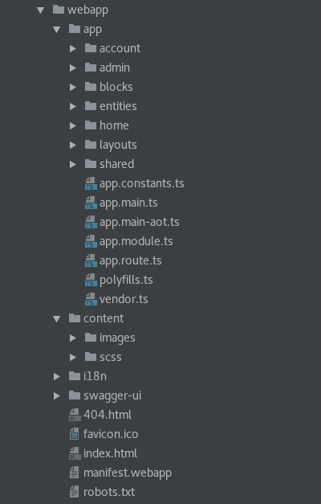

其中最值得注意的是：

+   `app`: 此文件夹包含 Angular 应用程序的 TypeScript 源代码，按功能组织，每个功能一个文件夹：

    +   `app.main.ts`: 这是 Angular 应用的主文件。它启动 Angular 应用程序。注意，它使用 `platformBrowserDynamic`，这使得应用程序能够在浏览器中使用 **JIT**（**即时**）编译。这对于开发来说非常理想：

```js
platformBrowserDynamic().bootstrapModule(StoreAppModule)
.then((success) => console.log(`Application started`))
.catch((err) => console.error(err)); 
```

+   `app.module.ts`: 这是 Angular 应用程序的主模块。它声明应用程序级别的组件和提供者，并导入其他模块以供应用程序使用。它还启动主应用程序组件：

```js
@NgModule({
    imports: [
        BrowserModule,
        ...
        StoreEntityModule,
        // jhipster-needle-angular-add-module JHipster 
         will add new module here
    ],
    declarations: [
        JhiMainComponent,
        ...
        FooterComponent
    ],
    providers: [
        ProfileService,
        ...
        UserRouteAccessService
    ],
    bootstrap: [ JhiMainComponent ]
})
export class StoreAppModule {}
```

+   `account`: 此模块包含与账户相关的功能，如激活、密码、密码重置、注册和设置。每个典型组件包括 `component.html`、`component.ts`、`route.ts` 和 `service.ts` 文件。

+   `admin`: 此模块包含与管理员相关的功能，如审计、配置、文档、健康、日志、指标、跟踪器和用户管理。每个典型组件包括 `component.html`、`component.ts`、`route.ts` 和 `service.ts` 文件。

    +   `blocks`: 此文件夹包含应用程序使用的 HTTP 拦截器和其它配置。

    +   `entities`: 这是创建实体模块的地方。

    +   `home`: 首页模块。

    +   `layouts`: 此文件夹包含布局组件，如导航栏、页脚、错误页面等。

    +   `shared`: 此模块包含所有共享服务（认证、跟踪器、用户）、组件（登录、警报）、实体模型以及应用程序所需的实用工具。

+   `content`: 此文件夹包含静态内容，如图片、CSS 和 SASS 文件。

+   `i18n`: 这里的 i18n JSON 文件存放位置。每种语言都有一个文件夹，其中包含按模块组织的众多 JSON 文件。

+   `swagger-ui`: 这个文件夹包含开发中用于 API 文档的 Swagger UI 客户端。

+   `index.html`: 这是 Web 应用程序的索引文件。它包含用于加载 Angular 应用程序主组件的非常少的代码。这是一个单页 Angular 应用程序。您还会在这个文件上找到一些注释掉的实用代码，如 Google 分析脚本和服务工作者脚本。如果需要，可以启用这些代码：

```js
<!doctype html>
<html class="no-js" lang="en" dir="ltr">
<head>
    ...
</head>
<body>
    ...
    <jhi-main></jhi-main>
    <noscript>
        <h1>You must enable javascript to view this page.</h1>
    </noscript>
    ...
</body>
</html>
```

要使用服务工作者启用 PWA 模式，只需在`src/main/webapp/index.html`中取消注释相应的代码以注册服务工作者。JHipster 使用 workbox ([`developers.google.com/web/tools/workbox/`](https://developers.google.com/web/tools/workbox/))，它创建相应的服务工作者并动态生成`sw.js`。

# 启动应用程序

现在，让我们启动应用程序并查看输出。运行应用程序有多种方式：

+   通过在终端/命令行中使用 Spring Boot Gradle 任务

+   通过从 IDE 中执行主 Java 类`src/main/java/com/mycompany/store/StoreApp.java`

+   通过使用`java -jar`命令执行打包的应用程序文件

让我们使用 Gradle 任务启动应用程序。如果您想在 IDE 中直接运行应用程序，只需打开前面提到的主应用程序文件`StoreApp.java`，右键单击，并选择运行`StoreApp`。

要通过 Gradle 启动应用程序，请打开终端/命令行并导航到应用程序文件夹。然后，按照以下方式执行 Gradle 命令（如果您在 Windows 上，请执行`gradlew.bat`）。这将触发默认任务`bootRun`：

```js
> cd online-store
> ./gradlew
```

执行`./gradlew`相当于执行`./gradlew bootRun -Pdev`。对于客户端，在第一次启动服务器之前需要运行 webpack 构建，否则您将看到一个空白页面。此任务在应用程序生成期间自动运行，但如果由于某些原因失败，可以通过运行`yarn run webpack:build`手动触发。也可以通过 Gradle 命令直接触发，通过运行`./gradlew webpackBuildDev bootRun -Pdev`。

Gradle 将开始下载包装器和依赖项，经过一段时间（几秒到几分钟不等，取决于网络速度）后，您应该会看到类似于以下截图的控制台输出：

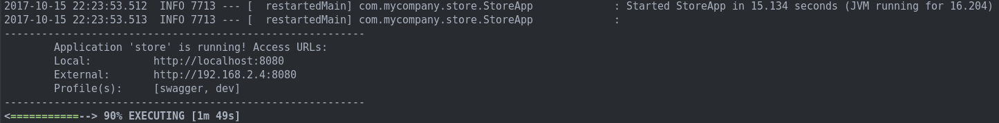

应用程序已成功启动，并可在`http://localhost:8080`上访问。打开您喜欢的浏览器并导航到该 URL。

注意，由于过程持续运行，前面的构建将保持在 90%。

# 应用程序模块

让我们看看开箱即用的不同模块。模块可以分为：

+   首页和登录

+   账户

+   管理员

# 首页和登录模块

一旦您打开 URL，您将在主页上看到一位酷炫的潮人正在喝咖啡，如下所示：

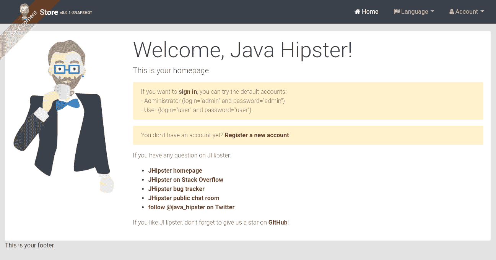

这是主页。让我们使用默认凭据登录应用程序。

1.  点击页面上的*登录*链接，或*账户 | 登录*。您将看到以下登录屏幕。输入默认凭据——用户名—`admin`，密码—`admin`，然后点击*登录*：


登录后，您将在导航栏中看到所有已验证的菜单项的认证主页：

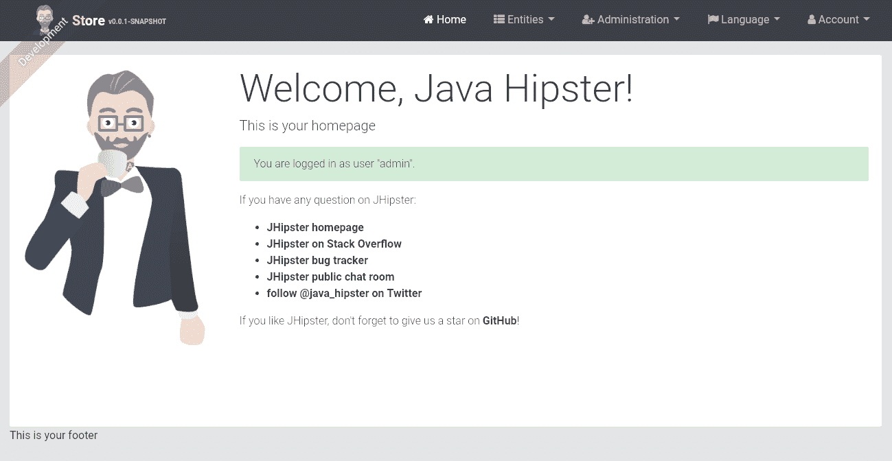

1.  由于我们启用了国际化，我们得到了一个语言菜单。让我们尝试切换到另一种语言。点击语言菜单并选择下一个可用的语言：

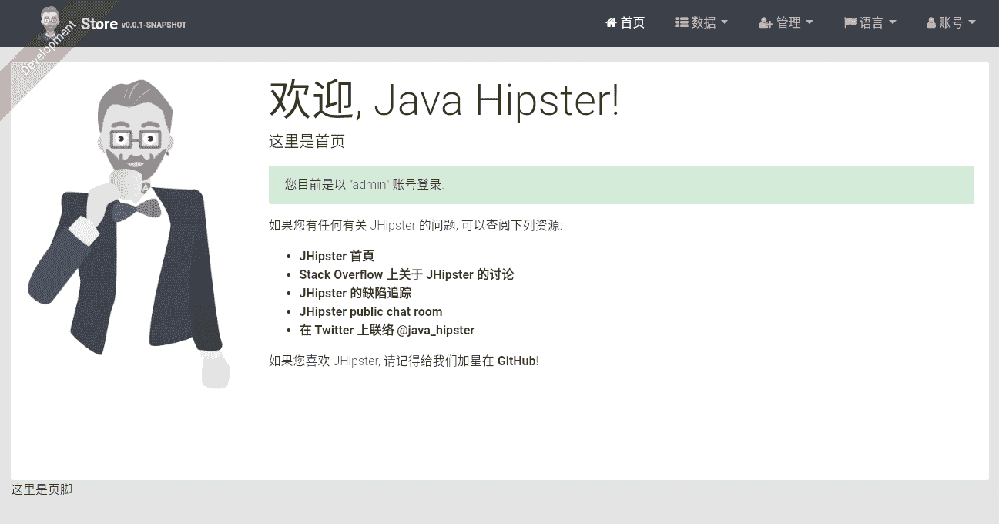

# 账户模块

现在，让我们看看开箱即用的账户模块。在账户菜单下，您将看到一个退出选项和以下模块：

+   设置

+   密码

+   注册

# 设置

此模块允许您更改用户设置，如姓名、电子邮件和语言：

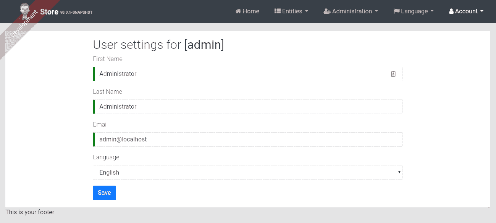

# 密码

此模块允许您更改当前用户的密码。还有一个带有电子邮件验证的默认忘记密码流程：

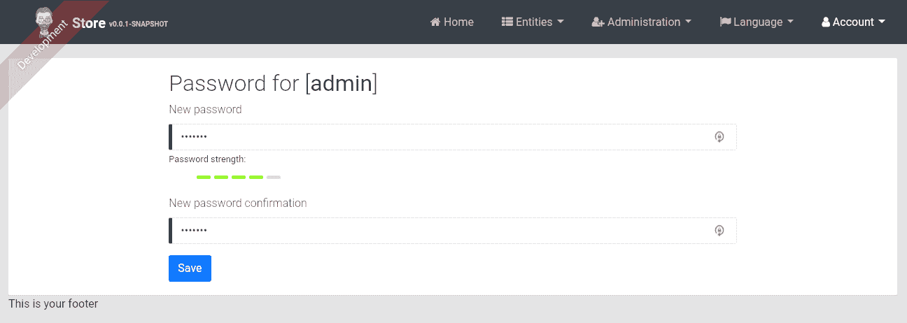

要使用电子邮件功能，您必须在应用程序属性中配置 SMTP 服务器。我们将在后面的章节中探讨这一点。

# 注册

此模块仅在您未登录时可用。这允许您作为新用户注册应用程序。这将触发一个带有激活邮件和验证的用户激活流程。当选择 OAuth2 作为您的身份验证时，此模块将不可用：

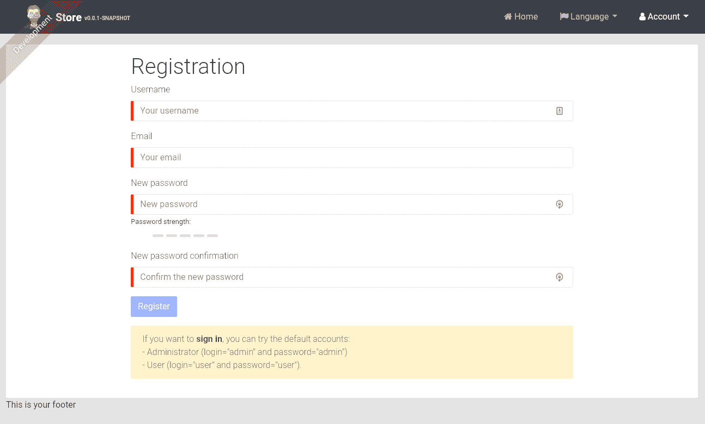

# 管理员模块

现在，让我们看看生成的管理员模块屏幕。这些对于应用程序的开发和监控非常有用。在管理员菜单下，您将找到以下模块：

+   用户管理

+   指标

+   健康

+   配置

+   审计

+   日志

+   API

# 用户管理

此模块为您提供了 CRUD 功能来管理用户。默认情况下，结果会分页。默认情况下，使用注册模块注册的用户将处于非激活状态，除非他们完成注册过程：

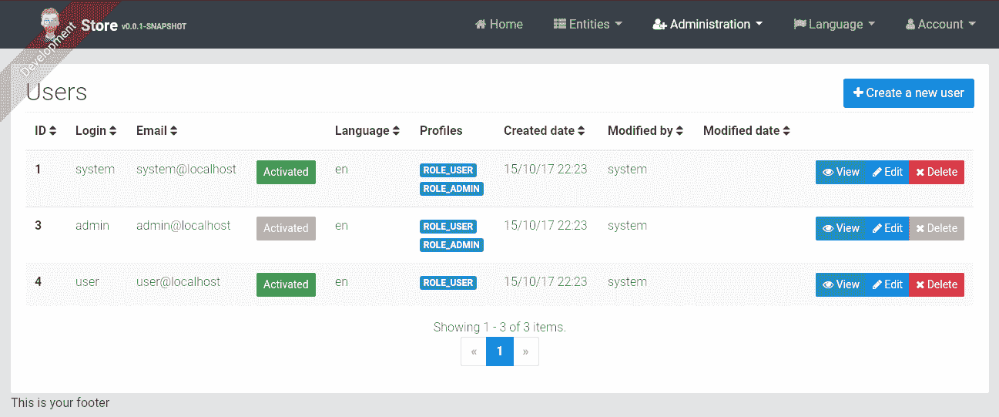

# 指标

此模块可视化由 Spring Boot actuator 和 Dropwizard 指标提供的数据。这对于监控应用程序性能非常有用，因为它提供了方法级别的性能信息，以及 JVM、HTTP、数据库和缓存指标。靠近线程的图标将允许您查看线程转储：

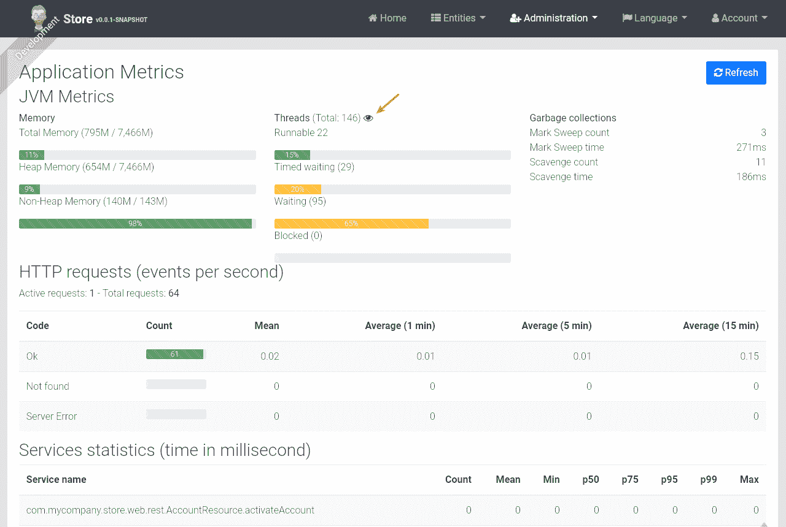

# 健康

此模块提供了数据库和其他信息（如磁盘空间）等应用程序组件的健康状态：

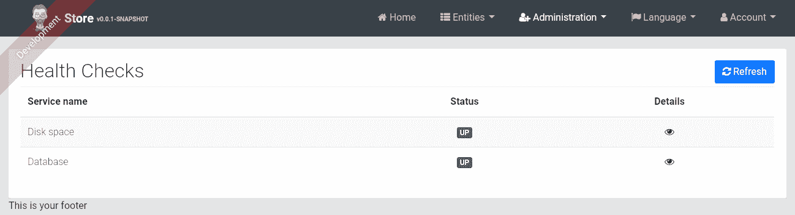

# 配置

此模块有助于可视化当前生效的应用程序配置。这对于解决配置问题非常有用：

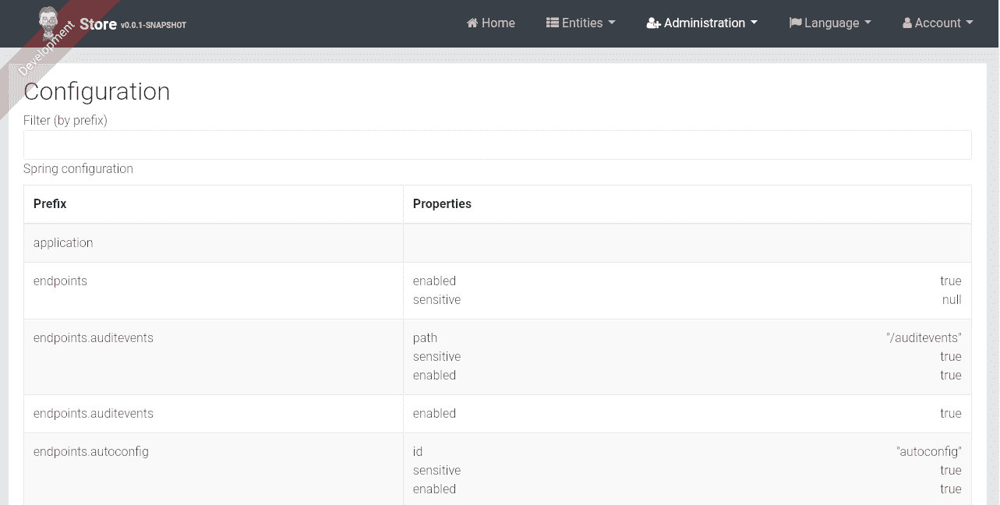

# 审计

此模块列出了自 JHipster 为 Spring 安全性启用审计以来所有的用户身份验证审计日志，因此所有安全事件都被捕获。有一个特殊的 Spring 数据仓库，它将审计事件写入数据库。这对于安全方面非常有用：

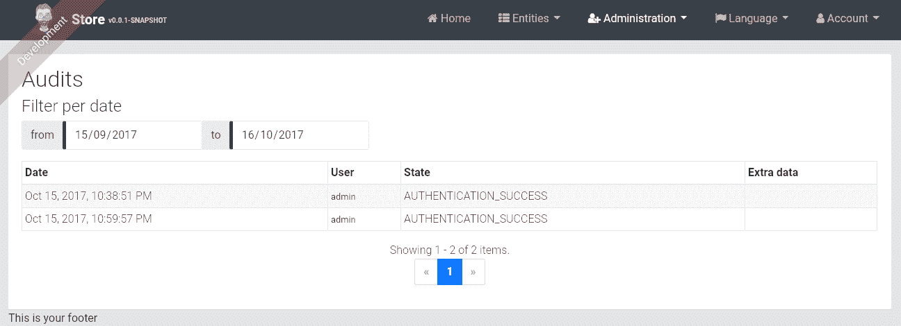

# 日志

此模块有助于在运行时查看和更新应用程序日志级别。这对于解决故障非常有用：

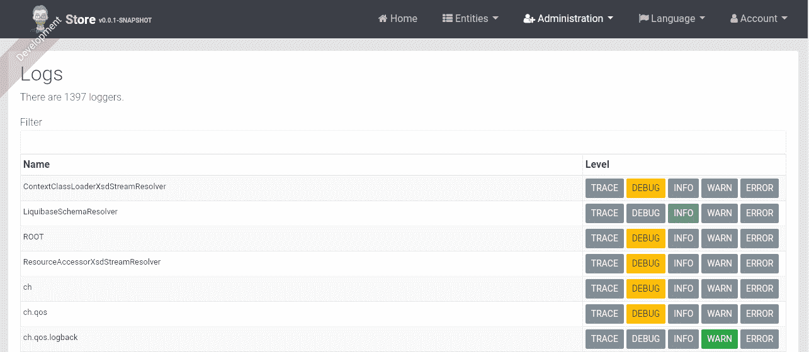

# API

此模块提供了应用程序 REST API 的 Swagger API 文档。它还提供了一个用于端点的“试一试”编辑器：

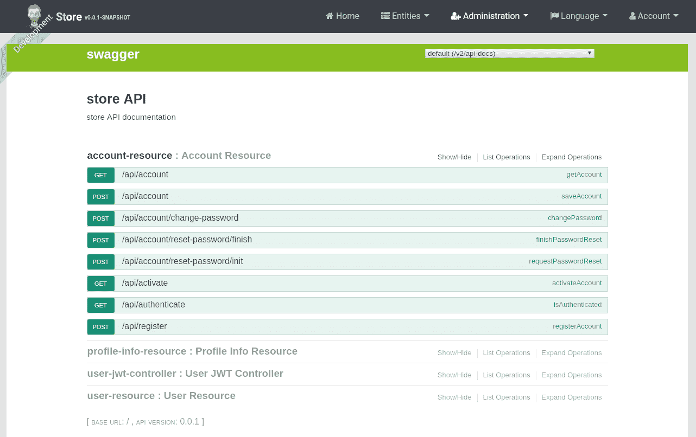

# 运行生成的测试

良好的软件开发永远不能没有良好的测试。JHipster 默认生成相当多的自动化测试，并且还有选择更多测试的选项。让我们运行生成的服务器端和客户端测试，以确保一切按预期工作。

首先，打开一个终端/命令行，导航到项目文件夹。

# 服务器端测试

服务器端集成测试和单元测试位于 `src/test/java` 文件夹中。

这些可以直接从 IDE 中运行，通过选择一个包或单个测试并运行它，或者通过命令行运行 Gradle 的 `test` 任务。让我们使用命令行来运行它。在一个新的终端中，导航到应用程序源文件夹，并执行以下命令。它应该以一个成功消息结束，如下所示：

```js
> ./gradlew test
...
BUILD SUCCESSFUL in 45s
8 actionable tasks: 6 executed, 2 up-to-date
```

# 客户端测试

客户端单元测试和端到端测试位于 `src/test/javascript` 文件夹下。

这些测试可以使用提供的 npm 脚本或提供的 Gradle 任务来运行。

您可以通过运行 `./gradlew tasks` 来查看所有可用的 Gradle 任务。

让我们使用 npm 脚本来运行它们。首先，让我们运行 Karma 单元测试。在终端中执行以下代码。如果您更喜欢使用 `npm` 而不是 `yarn`，也可以这样做：

```js
> yarn test
```

最终应该产生类似的输出：

```js
PhantomJS 2.1.1 (Linux 0.0.0): Executed 56 of 56 SUCCESS (1.672 secs / 1.528 secs)
=============================== Coverage summary ===============================
Statements : 69.25% ( 903/1304 )
Branches : 40.43% ( 112/277 )
Functions : 48.89% ( 154/315 )
Lines : 67.72% ( 795/1174 )
================================================================================
Done in 37.25s.
```

现在，让我们使用 npm 脚本来运行 Protractor 端到端测试。为了运行 `e2e` 测试，我们需要确保服务器正在运行。如果您已经关闭了我们之前启动的服务器，请确保通过在终端中运行 `./gradlew` 再次启动它。现在，打开一个新的终端并导航到应用程序文件夹，并执行以下命令：

```js
> yarn e2e
```

这将启动 protractor 测试，它将在新的 Chrome 浏览器实例中执行测试。完成后，您应该在控制台看到以下类似的内容：

```js
Started
..........
10 specs, 0 failures
Finished in 11.776 seconds

[00:02:57] I/launcher - 0 instance(s) of WebDriver still running
[00:02:57] I/launcher - chrome #01 passed
```

# 摘要

在本章中，我们学习了如何使用 JHipster 创建单体 Web 应用程序。我们还详细探讨了创建的源代码的重要方面，并了解了如何运行创建的应用程序和自动测试。我们还浏览了创建的模块，并观察了它们在实际中的应用。在下一章中，我们将了解如何利用 JHipster 对我们的业务用例进行建模并为它们生成实体。我们还将学习关于**JHipster 领域语言**（**JDL**）的内容。
