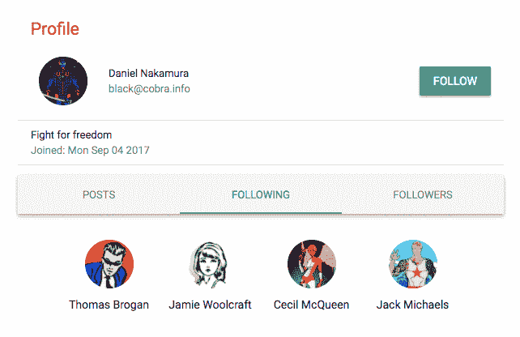

# 第七章：将骨架扩展成社交媒体应用

社交媒体现在是网络的一个基本组成部分，我们构建的许多以用户为中心的 Web 应用最终都需要一个社交组件来推动用户参与。

对于我们的第一个真实世界 MERN 应用，我们将修改我们在 第三章，*使用 MongoDB、Express 和 Node 构建后端*，和 第四章，*添加 React 前端以完成 MERN*，中开发的 MERN 骨架应用，在本章中构建一个简单的社交媒体应用。在这个过程中，你将学习如何扩展 MERN 栈技术的集成并添加新功能以扩展你自己的全栈 Web 应用。

在本章中，我们将讨论以下主题：

+   介绍 MERN 社交

+   更新用户资料

+   在 MERN 社交中关注用户

+   发布带照片的消息

+   在帖子中实现交互

# 介绍 MERN 社交

MERN 社交是一个具有基本功能的社交媒体应用，灵感来源于现有的社交媒体平台，如 Facebook 和 Twitter。此应用的主要目的是展示如何使用 MERN 栈技术实现允许用户相互连接或关注的特性，并在共享内容上进行交互。在本章构建 MERN 社交的过程中，我们将讨论以下具有社交媒体特色的特性实现：

+   包含描述和照片的用户资料

+   用户相互关注

+   谁应该关注建议

+   发布带照片的消息

+   展示关注用户发布的新闻源

+   按用户列出帖子

+   点赞帖子

+   在帖子上发表评论

你可以根据需要进一步扩展这些实现，以实现更复杂的功能。MERN 社交主页如下所示：


完整的 MERN 社交应用代码可在 GitHub 上找到，网址为 [`github.com/PacktPublishing/Full-Stack-React-Projects-Second-Edition/tree/master/Chapter05/mern-social`](https://github.com/PacktPublishing/Full-Stack-React-Projects-Second-Edition/tree/master/Chapter05/mern-social)。你可以克隆此代码，并在浏览本章其余部分的代码解释时运行应用。

MERN 社交应用所需的视图将通过扩展和修改 MERN 骨架应用中现有的 React 组件来开发。以下组件树显示了构成 MERN 社交前端的所有自定义 React 组件，同时也暴露了我们将在本章其余部分构建视图所使用的组合结构：


除了更新现有组件外，我们还将添加新的自定义组件来组合视图，包括一个新闻源视图，用户可以在其中创建新的帖子，也可以浏览他们关注的 MERN Social 上所有人的所有帖子。在下一节中，我们将首先更新用户资料，以展示如何上传个人照片并为平台上的每个用户添加简短的个人简介。

# 更新用户资料

现有的骨架应用程序仅支持用户名、电子邮件和密码。但在 MERN Social 中，我们将允许用户在注册后编辑个人资料时添加关于自己的描述，以及上传个人照片，如下面的截图所示：


为了实现此功能更新，我们需要修改用户后端和前端。在以下章节中，我们将学习如何更新后端中的用户模型和用户更新 API，然后是前端中的用户资料和用户资料编辑表单视图，以在 MERN Social 中为用户添加简短描述和个人照片。

# 添加关于描述

为了存储用户在`about`字段中输入的简短描述，我们需要在`server/models/user.model.js`中的用户模型中添加一个`about`字段：

```js
about: {
    type: String,
    trim: true
  }
```

然后，为了从用户那里获取描述作为输入，我们需要在`EditProfile`表单中添加一个多行`TextField`，并像处理用户名输入一样处理值变化。

`mern-social/client/user/EditProfile.js`:

```js
  <TextField
     id="multiline-flexible"
     label="About"
     multiline
     rows="2"
     value={values.about}
     onChange={handleChange('about')}
  />
```

最后，为了在用户资料页面上显示添加到`about`字段的描述文本，我们可以将其添加到现有的个人资料视图中。

`mern-social/client/user/Profile.js`:

```js
<ListItem> <ListItemText primary={this.state.user.about}/> </ListItem>
```

通过对 MERN 骨架代码中用户功能的此修改，用户现在可以添加和更新关于自己的描述，并在个人资料中显示。接下来，我们将添加上传照片的功能，以完成用户资料的完善。

# 上传个人照片

允许用户上传个人照片将需要我们存储上传的图像文件，并在请求时检索它以在视图中加载。在考虑不同的文件存储选项时，有多种实现此上传功能的方法：

+   **服务器文件系统**：将文件上传和保存到服务器文件系统，并将 URL 存储在 MongoDB 中。

+   **外部文件存储**：将文件保存到外部存储，例如 Amazon S3，并将 URL 存储在 MongoDB 中。

+   **存储为 MongoDB 中的数据**：将小于 16 MB 大小的文件作为 Buffer 类型的数据存储在 MongoDB 中。

对于 MERN Social，我们将假设用户上传的图片文件大小较小，并演示如何存储这些文件以实现个人照片上传功能。在第八章“扩展订单和支付的市场”，我们将讨论如何使用 GridFS 在 MongoDB 中存储更大的文件。

为了实现此照片上传功能，在以下章节中，我们将执行以下操作：

+   更新用户模型以存储照片。

+   集成更新的前端视图以从客户端上传照片。

+   修改后端中的用户更新控制器以处理上传的图片。

# 更新用户模型以在 MongoDB 中存储照片

为了直接在数据库中存储上传的个人资料照片，我们将更新用户模型以添加一个`photo`字段，该字段以`Buffer`类型的数据存储文件，并包含文件的`contentType`。

`mern-social/server/models/user.model.js`:

```js
photo: {
    data: Buffer,
    contentType: String
}
```

用户从客户端上传的图像文件将被转换为二进制数据并存储在 MongoDB 中用户集合的文档的`photo`字段中。接下来，我们将看看如何从前端上传文件。

# 从编辑表单上传照片

当用户编辑个人资料时，他们将能够从本地文件上传图像文件。为了实现这种交互，我们将更新`client/user/EditProfile.js`中的`EditProfile`组件，添加上传照片选项，并将用户选择的文件附加到提交给服务器的表单数据中。我们将在以下章节中讨论这一点。

# 使用 Material-UI 的文件输入

我们将利用 HTML5 文件输入类型让用户从本地文件中选择一个图像。当用户选择一个文件时，文件输入会在改变事件中返回文件名。我们将按照以下方式将文件输入元素添加到编辑个人资料表单中：

`mern-social/client/user/EditProfile.js`:

```js
<input accept="image/*" type="file"
       onChange={handleChange('photo')} 
       style={{display:'none'}} 
       id="icon-button-file" />
```

为了将此`input`元素与 Material-UI 组件集成，我们应用`display:none`来隐藏视图中的`input`元素，然后在标签内添加一个 Material-UI 按钮用于此文件输入。这样，视图显示的是 Material-UI 按钮而不是 HTML5 文件输入元素。标签的添加方式如下：

`mern-social/client/user/EditProfile.js`:

```js
<label htmlFor="icon-button-file">
   <Button variant="contained" color="default" component="span">
      Upload <FileUpload/>
   </Button>
</label>
```

当按钮的`component`属性设置为`span`时，`Button`组件在`label`元素内渲染为一个`span`元素。点击`Upload`的`span`或`label`会被具有相同 ID 的文件输入注册，因此文件选择对话框被打开。一旦用户选择了一个文件，我们就可以在`handleChange(...)`的调用中将它设置为状态，并在视图中显示其名称，如下面的代码所示。

`mern-social/client/user/EditProfile.js`:

```js
<span className={classes.filename}>
    {values.photo ? values.photo.name : ''}
</span>
```

这样，用户将看到他们试图上传的文件名作为个人资料照片。在选择上传的文件后，接下来我们必须将此文件附加到请求中并发送到服务器，以更新数据库中的用户信息。

# 附加文件提交的表单

使用表单上传文件到服务器需要多部分表单提交。这与我们在之前的 fetch 实现中发送的字符串化对象形成对比。我们将修改`EditProfile`组件，使其使用`FormData` API 以`multipart/form-data`类型所需的格式存储表单数据。

您可以在[developer.mozilla.org/en-US/docs/Web/API/FormData](https://developer.mozilla.org/en-US/docs/Web/API/FormData)了解更多关于 FormData API 的信息。

首先，我们将更新输入`handleChange`函数，以便我们可以存储文本字段和文件输入的输入值，如下面的代码所示。

`mern-social/client/user/EditProfile.js`:

```js
const handleChange = name => event => {
  const value = name === 'photo'
 ? event.target.files[0]
 : event.target.value
  setValues({...values, [name]: value })
}
```

然后，在表单提交时，我们需要初始化`FormData`并附加已更新的字段值，如下所示。

`mern-social/client/user/EditProfile.js`:

```js
const clickSubmit = () => {
    let userData = new FormData()
    values.name && userData.append('name', values.name)
    values.email && userData.append('email', values.email)
    values.passoword && userData.append('passoword', values.passoword)
    values.about && userData.append('about', values.about)
    values.photo && userData.append('photo', values.photo)
    ...
}
```

在将所有字段和值附加到它之后，使用 fetch API 调用发送`userData`以更新用户，如下面的代码所示。

`mern-social/client/user/EditProfile.js`:

```js
update({
      userId: match.params.userId
    }, {
      t: jwt.token
    }, userData).then((data) => {
      if (data && data.error) {
        setValues({...values, error: data.error})
      } else {
        setValues({...values, 'redirectToProfile': true})
      }
})
```

由于发送到服务器的数据的内容类型不再是`'application/json'`，我们还需要修改`api-user.js`中的`update` fetch 方法，以从`fetch`调用中的头中删除`Content-Type`，如下所示。

`mern-social/client/user/api-user.js`:

```js
const update = async (params, credentials, user) => {
  try {
    let response = await fetch('/api/users/' + params.userId, {
      method: 'PUT',
      headers: {
        'Accept': 'application/json',
        'Authorization': 'Bearer ' + credentials.t
      },
      body: user
    })
    return await response.json()
  } catch(err) {
    console.log(err)
  }}
```

现在，如果用户在编辑个人资料时选择上传个人照片，服务器将接收到一个带有附件的请求，其中包含其他字段值。接下来，我们需要修改服务器端代码以能够处理此请求。

# 处理包含文件上传的请求

在服务器上，为了处理可能包含文件的更新 API 请求，我们将使用`formidable` Node 模块。从命令行运行以下命令以安装`formidable`：

```js
yarn add formidable
```

`formidable`将允许服务器读取`multipart`表单数据，并让我们访问字段和文件（如果有）。如果有文件，`formidable`将暂时将其存储在文件系统中。我们将使用`fs`模块从文件系统读取它，这将检索文件类型和数据，并将其存储在用户模型的`photo`字段中。`formidable`代码将放在`user.controller.js`中的`update`控制器中，如下所示。

`mern-social/server/controllers/user.controller.js`:

```js
import formidable from 'formidable'
import fs from 'fs'
const update = async (req, res) => {
  let form = new formidable.IncomingForm()
  form.keepExtensions = true
  form.parse(req, async (err, fields, files) => {
    if (err) {
      return res.status(400).json({
        error: "Photo could not be uploaded"
      })
    }
    let user = req.profile
    user = extend(user, fields)
    user.updated = Date.now()
    if(files.photo){
 user.photo.data = fs.readFileSync(files.photo.path)
 user.photo.contentType = files.photo.type
 }
    try {
      await user.save()
      user.hashed_password = undefined
      user.salt = undefined
      res.json(user)
    } catch (err) {
      return res.status(400).json({
        error: errorHandler.getErrorMessage(err)
      })
    }
  })
}
```

这将把上传的文件作为数据存储在数据库中。接下来，我们将设置文件检索，以便我们可以在前端视图中访问和显示用户上传的照片。

# 检索个人照片

要检索数据库中存储的图片并在视图中显示，最简单的方法是设置一个路由，该路由将获取数据并将其作为图像文件返回给请求客户端。在本节中，我们将学习如何设置此路由以公开照片 URL，以及如何使用此 URL 在前端视图中显示照片。

# 个人照片 URL

我们将为每个用户在数据库中存储的照片设置一个路由，并添加另一个路由，如果指定的用户没有上传个人照片，它将获取默认照片。这些路由将如下定义。

`mern-social/server/routes/user.routes.js`:

```js
router.route('/api/users/photo/:userId')
  .get(userCtrl.photo, userCtrl.defaultPhoto)
router.route('/api/users/defaultphoto')
  .get(userCtrl.defaultPhoto)
```

我们将在`photo`控制器方法中查找照片，如果找到，将在照片路由的请求响应中发送它；否则，我们将调用`next()`以返回默认照片，如下面的代码所示。

`mern-social/server/controllers/user.controller.js`:

```js
const photo = (req, res, next) => {
  if(req.profile.photo.data){
    res.set("Content-Type", req.profile.photo.contentType)
    return res.send(req.profile.photo.data)
  }
  next()
}
```

默认照片是从服务器的文件系统中检索并发送的，如下所示。

`mern-social/server/controllers/user.controller.js`:

```js
import profileImage from './../../client/assets/images/profile-pic.png'
const defaultPhoto = (req, res) => {
  return res.sendFile(process.cwd()+profileImage)
}
```

我们可以使用这里定义的路由来在视图中显示照片，如下一节所述。

# 在视图中显示照片

通过设置用于检索照片的 URL 路由，我们可以在`img`元素的`src`属性中简单地使用这些路由来加载视图中的照片。例如，在`Profile`组件中，我们使用状态中的`values`中的用户 ID 来构造照片 URL，如下面的代码所示。

`mern-social/client/user/Profile.js`:

```js
const photoUrl = values.user._id
      ? `/api/users/photo/${values.user._id}?${new Date().getTime()}`
      : '/api/users/defaultphoto'
```

为了确保在照片更新后`img`元素在`Profile`视图中重新加载，我们必须向照片 URL 添加一个时间值以绕过浏览器默认的图像缓存行为。

然后，我们可以将`photoUrl`设置为 Material-UI 的`Avatar`组件，该组件在视图中渲染链接的图像：

```js
  <Avatar src={photoUrl}/>
```

MERN Social 中更新的用户个人资料现在可以显示用户上传的个人照片和`about`描述，如下面的截图所示：


我们已成功更新了 MERN 骨架应用程序代码，允许用户上传个人照片并在他们的个人资料中添加简短的简介。在下一节中，我们将进一步更新并实现允许用户相互关注的社交媒体风格功能。

# MERN Social 中的关注用户

在 MERN Social 中，用户将能够相互关注。每个用户将有一个关注者列表和一个他们关注的列表。用户还可以查看他们可以关注的用户列表；换句话说，就是他们在 MERN Social 中尚未关注的用户。在以下章节中，我们将学习如何更新全栈代码以实现这些功能。

# 关注和取消关注

为了跟踪哪个用户在关注哪些其他用户，我们将为每个用户维护两个列表。当一个用户关注或取消关注另一个用户时，我们将更新一个用户的`following`列表和另一个用户的`followers`列表。首先，我们将更新后端以存储和更新这些列表，然后修改前端视图以允许用户执行关注和取消关注操作。

# 更新用户模型

要在数据库中存储`following`和`followers`的列表，我们需要更新用户模型，添加两个用户引用数组，如下面的代码所示。

`mern-social/server/models/user.model.js`:

```js
following: [{type: mongoose.Schema.ObjectId, ref: 'User'}],
followers: [{type: mongoose.Schema.ObjectId, ref: 'User'}]
```

这些引用将指向被给定用户关注或正在关注该用户的集合中的用户。接下来，我们将更新用户控制器以确保在客户端请求的响应中返回这些列表中引用的用户详情。

# 更新`userByID`控制器方法

当从后端检索单个用户时，我们希望`user`对象包括`following`和`followers`数组中引用的用户的名字和 ID。为了检索这些详情，我们需要更新`userByID`控制器方法，使其填充返回的用户对象，如下面高亮显示的代码所示。

`mern-social/server/controllers/user.controller.js`:

```js
const userByID = async (req, res, next, id) => {
  try {
    let user = await User.findById(id)
    .populate('following', '_id name')
 .populate('followers', '_id name')
    .exec()
    if (!user)
      return res.status('400').json({
        error: "User not found"
      })
    req.profile = user
    next()
  } catch (err) {
    return res.status('400').json({
      error: "Could not retrieve user"
    })
  }
}
```

我们使用 Mongoose 的`populate`方法来指定从查询返回的用户对象应包含`following`和`followers`列表中引用的用户的名字和 ID。这样，当我们通过读取 API 调用获取用户时，我们将获得`followers`和`following`列表中用户引用的名字和 ID。

在更新用户模型后，我们准备好添加 API 端点，以更新这些列表，要么添加要么从列表中删除用户，如下一节所述。

# 添加关注和取消关注的 API

当用户从视图中关注或取消关注另一个用户时，数据库中这两个用户的记录将根据`follow`或`unfollow`请求进行更新。

在`user.routes.js`中设置`follow`和`unfollow`路由如下。

`mern-social/server/routes/user.routes.js`:

```js
router.route('/api/users/follow')
  .put(authCtrl.requireSignin, 
       userCtrl.addFollowing, 
       userCtrl.addFollower)
router.route('/api/users/unfollow')
  .put(authCtrl.requireSignin, 
       userCtrl.removeFollowing, 
       userCtrl.removeFollower)
```

用户控制器中的`addFollowing`控制器方法将通过将关注用户的引用推入数组来更新当前用户的`following`数组，如下面的代码所示。

`mern-social/server/controllers/user.controller.js`:

```js
const addFollowing = async (req, res, next) => {
  try{
    await User.findByIdAndUpdate(req.body.userId, 
                   {$push: {following: req.body.followId}}) 
    next()
  }catch(err){
    return res.status(400).json({
      error: errorHandler.getErrorMessage(err)
    })
  }
}
```

在成功更新`following`数组后，调用`next()`，随后执行`addFollower`方法，将当前用户的引用添加到被关注用户的`followers`数组中。`addFollower`方法定义如下。

`mern-social/server/controllers/user.controller.js`:

```js
const addFollower = async (req, res) => {
  try{
    let result = await User.findByIdAndUpdate(req.body.followId, 
                            {$push: {followers: req.body.userId}}, 
                            {new: true})
                            .populate('following', '_id name')
                            .populate('followers', '_id name')
                            .exec()
      result.hashed_password = undefined
      result.salt = undefined
      res.json(result)
    }catch(err) {
      return res.status(400).json({
        error: errorHandler.getErrorMessage(err)
      })
    } 
}
```

对于取消关注，实现方式类似。`removeFollowing`和`removeFollower`控制器方法通过使用`$pull`而不是`$push`来移除用户引用来更新相应的`'following'`和`'followers'`数组。`removeFollowing`和`removeFollower`将如下所示。

`mern-social/server/controllers/user.controller.js`:

```js
const removeFollowing = async (req, res, next) => {
  try{
    await User.findByIdAndUpdate(req.body.userId, 
                   {$pull: {following: req.body.unfollowId}}) 
    next()
  }catch(err) {
    return res.status(400).json({
      error: errorHandler.getErrorMessage(err)
    })
  }
}
const removeFollower = async (req, res) => {
  try{
    let result = await User.findByIdAndUpdate(req.body.unfollowId, 
                                {$pull: {followers: req.body.userId}}, 
                                {new: true})
                            .populate('following', '_id name')
                            .populate('followers', '_id name')
                            .exec() 
    result.hashed_password = undefined
    result.salt = undefined
    res.json(result)
  }catch(err){
      return res.status(400).json({
        error: errorHandler.getErrorMessage(err)
      })
  }
}
```

服务器端的用户后端已准备好关注和取消关注功能。接下来，我们将更新前端以利用这些新的后端 API 并完成此功能。

# 在视图中访问关注和取消关注的 API

为了在视图中访问这些 API 调用，我们将更新`api-user.js`以包含`follow`和`unfollow`获取方法。`follow`和`unfollow`方法将类似，调用相应的路由，使用当前用户的 ID 和凭据，以及被关注或取消关注的用户的 ID。`follow`方法如下。

`mern-social/client/user/api-user.js`:

```js
const follow = async (params, credentials, followId) => {
  try {
    let response = await fetch('/api/users/follow/', {
      method: 'PUT',
      headers: {
        'Accept': 'application/json',
        'Content-Type': 'application/json',
        'Authorization': 'Bearer ' + credentials.t
      },
      body: JSON.stringify({userId:params.userId, followId: followId})
    })
    return await response.json()
  } catch(err) {
    console.log(err)
  }
}
```

`unfollow`获取方法类似；它接受取消关注的用户 ID 并调用`unfollow` API，如下面的代码所示。

`mern-social/client/user/api-user.js`:

```js
const unfollow = async (params, credentials, unfollowId) => {
  try {
    let response = await fetch('/api/users/unfollow/', {
      method: 'PUT',
      headers: {
        'Accept': 'application/json',
        'Content-Type': 'application/json',
        'Authorization': 'Bearer ' + credentials.t
      },
      body: JSON.stringify({userId:params.userId, unfollowId: unfollowId})
    })
    return await response.json()
  } catch(err) {
    console.log(err)
  }
}
```

实现了 API 获取代码后，我们可以使用这两种方法在视图中集成后端更新，如下一节所述，这将允许用户在应用程序中关注或取消关注另一个用户。

# 关注和取消关注按钮

允许用户关注或取消关注另一个用户的按钮将根据当前用户是否已经关注了该用户而条件性地显示，如下面的截图所示：


在以下章节中，我们将把这个按钮添加到一个独立的 React 组件中，将其与现有的用户资料视图集成，并连接到关注和取消关注的获取方法。

# FollowProfileButton 组件

我们将创建一个名为`FollowProfileButton`的单独组件，该组件将被添加到`Profile`组件中。这个组件将根据当前用户是否已经是资料中用户的关注者来显示`Follow`或`Unfollow`按钮。`FollowProfileButton`组件如下所示。

`mern-social/client/user/FollowProfileButton.js`:

```js
export default function FollowProfileButton (props) {
 const followClick = () => {
 props.onButtonClick(follow)
 }
 const unfollowClick = () => {
 props.onButtonClick(unfollow)
 }
  return (<div>
    { props.following
       ? (<Button variant="contained" color="secondary" 
                  onClick={unfollowClick}>Unfollow</Button>)
       : (<Button variant="contained" color="primary" 
                  onClick={followClick}>Follow</Button>)
   }
   </div>)
}
FollowProfileButton.propTypes = {
 following: PropTypes.bool.isRequired,
 onButtonClick: PropTypes.func.isRequired
}
```

当`FollowProfileButton`添加到资料中时，`following`值将由`Profile`组件确定并发送，作为属性传递给`FollowProfileButton`，同时传递一个点击处理函数，该函数作为参数调用特定的`follow`或`unfollow`获取 API。生成的资料视图将如下所示：


为了将这个`FollowProfileButton`组件与资料视图集成，我们需要更新现有的`Profile`组件，如以下所述。

# 更新资料组件

在`Profile`视图中，`FollowProfileButton`应该只在用户查看其他用户的资料时显示，因此我们需要修改查看资料时显示`Edit`和`Delete`按钮的条件，如下所示：

```js
{auth.isAuthenticated().user && 
      auth.isAuthenticated().user._id == values.user._id 
    ? (edit and delete buttons) 
    : (follow button)
}
```

在`Profile`组件中，在`useEffect`中成功获取用户数据后，我们将检查已登录用户是否已经在关注资料中的用户，并将`following`值设置为相应的状态，如下面的代码所示。

`mern-social/client/user/Profile.js`:

```js
let following = checkFollow(data)
setValues({...values, user: data, following: following}) 
```

为了确定在 `following` 中设置的值，`checkFollow` 方法将检查已登录用户是否存在于获取的用户 `followers` 列表中，如果找到则返回 `match`；如果没有找到匹配项，则返回 `undefined`。`checkFollow` 方法定义如下。

`mern-social/client/user/Profile.js`:

```js
const checkFollow = (user) => {
    const match = user.followers.some((follower)=> {
      return follower._id == jwt.user._id
    })
    return match
}
```

`Profile` 组件还将定义 `FollowProfileButton` 的点击处理程序，以便在关注或取消关注操作完成后更新 `Profile` 的状态，如下面的代码所示。

`mern-social/client/user/Profile.js`:

```js
  const clickFollowButton = (callApi) => {
    callApi({
      userId: jwt.user._id
    }, {
      t: jwt.token
    }, values.user._id).then((data) => {
      if (data.error) {
        setValues({...values, error: data.error})
      } else {
        setValues({...values, user: data, following: !values.following})
      }
    })
  }
```

点击处理程序定义接受获取 API 调用作为参数，并将其作为属性传递给 `FollowProfileButton`，当它添加到 `Profile` 视图中时，还传递 `following` 值，如下所示。

`mern-social/client/user/Profile.js`:

```js
<FollowProfileButton following={this.state.following} onButtonClick={this.clickFollowButton}/>
```

这将加载 `FollowProfileButton` 到个人资料视图中，考虑到所有必要的条件，并为当前用户提供在 MERN 社交应用程序中关注或取消关注其他用户的选项。接下来，我们将扩展此功能，允许用户在用户个人资料视图中查看关注者或粉丝列表。

# 列出关注者和粉丝

为了让用户在 MERN 社交平台上轻松访问他们关注的用户和他们被关注的用户，我们将将这些列表添加到他们的个人资料视图中。在每个用户的个人资料中，我们将添加一个包含他们的粉丝和关注者的列表，如下面的截图所示：



在 `following` 和 `followers` 列表中引用的用户详细信息已经在加载个人资料时使用 `read` API 获取的用户对象中。为了渲染这些独立的粉丝和关注者列表，我们将创建一个新的组件，称为 `FollowGrid`。

# 创建 FollowGrid 组件

`FollowGrid` 组件将接受一个用户列表作为属性，显示用户的头像和名字，并将它们链接到每个用户的个人资料。我们可以将此组件添加到 `Profile` 视图中以显示 `关注者` 或 `粉丝`。`FollowGrid` 组件的定义如下。

`mern-social/client/user/FollowGrid.js`:

```js
export default function FollowGrid (props) {
  const classes = useStyles()
    return (<div className={classes.root}>
      <GridList cellHeight={160} className={classes.gridList} cols={4}>
        {props.people.map((person, i) => {
           return <GridListTile style={{'height':120}} key={i}>
              <Link to={"/user/" + person._id}>
                <Avatar src={'/api/users/photo/'+person._id} 
                        className={classes.bigAvatar}/>
                <Typography className={classes.tileText}>
                   {person.name}
                </Typography>
              </Link>
            </GridListTile>
        })}
      </GridList>
    </div>)
}

FollowGrid.propTypes = {
  people: PropTypes.array.isRequired
}

```

要将 `FollowGrid` 组件添加到 `Profile` 视图中，我们可以将其放置在视图中所需的位置，并将 `followers` 或 `followings` 列表作为 `people` 属性传递：

```js
<FollowGrid people={props.user.followers}/>
<FollowGrid people={props.user.following}/>
```

如前所述，在 MERN 社交平台中，我们选择在“个人资料”组件的标签页中显示 `FollowGrid` 组件。我们使用 Material-UI 标签组件创建了一个单独的 `ProfileTabs` 组件，并将其添加到 `Profile` 组件中。这个 `ProfileTabs` 组件包含两个 `FollowGrid` 组件，其中包含关注者和粉丝列表，以及一个显示用户发布的帖子的 `PostList` 组件。

在本章后面将讨论 `PostList` 组件。在下一节中，我们将添加一个功能，允许用户发现平台上他们尚未关注的其他用户。

# 寻找关注的人

“谁值得关注”功能将向登录用户显示 MERN Social 中他们尚未关注的用户列表，从而给他们提供关注他们或查看他们个人资料的选择，如下截图所示：


为了实现这个功能，我们需要添加一个后端 API，该 API 返回当前登录用户未关注的用户列表，然后通过添加一个加载并显示此用户列表的组件来更新前端。

# 获取未关注用户

我们将在服务器上实现一个新的 API 来查询数据库并获取当前用户未关注的用户列表。此路由将按如下定义。

`mern-social/server/routes/user.routes.js`:

```js
router.route('/api/users/findpeople/:userId')
   .get(authCtrl.requireSignin, userCtrl.findPeople)
```

在 `findPeople` 控制器方法中，我们将查询数据库中的 User 集合以找到不在当前用户 `following` 列表中的用户。

`mern-social/server/controllers/user.controller.js`:

```js
const findPeople = async (req, res) => {
  let following = req.profile.following
  following.push(req.profile._id)
  try {
    let users = await User.find({ _id:{ $nin : following }})
                          .select('name')
    res.json(users)
  }catch(err){
    return res.status(400).json({
      error: errorHandler.getErrorMessage(err)
    })
  }
}
```

此查询将返回一个数组，包含当前用户未关注的用户。为了在前端使用此用户列表，我们将更新 `api-user.js` 文件并添加对该 API 的获取。`findPeople` 获取方法定义如下。

`mern-social/client/user/api-user.js`:

```js
const findPeople = async (params, credentials, signal) => {
  try {
    let response = await fetch('/api/users/findpeople/' + params.userId, {
      method: 'GET',
      signal: signal,
      headers: {
        'Accept': 'application/json',
        'Content-Type': 'application/json',
        'Authorization': 'Bearer ' + credentials.t
      }
    }) 
    return await response.json()
  } catch(err) {
    console.log(err)
  }
}
```

我们可以在组件中使用这个 `findPeople` 获取方法来显示用户列表。在下一节中，我们将创建 FindPeople 组件来完成这个目的。

# FindPeople 组件

为了显示“谁值得关注”功能，我们将创建一个名为 `FindPeople` 的组件，该组件可以被添加到任何视图或独立渲染。在这个组件中，我们将通过在 `useEffect` 中调用 `findPeople` 方法来获取未关注的用户。如下代码所示。

`mern-social/client/user/FindPeople.js`:

```js
 useEffect(() => {
    const abortController = new AbortController()
    const signal = abortController.signal

    findPeople({
      userId: jwt.user._id
    }, {
      t: jwt.token
    }, signal).then((data) => {
      if (data && data.error) {
        console.log(data.error)
      } else {
        setValues({...values, users:data})
      }
    })
    return function cleanup(){
      abortController.abort()
    }
 }, [])
```

获取的用户列表将被迭代并在 Material-UI `List` 组件中渲染，每个列表项包含用户的头像、姓名、到个人主页的链接以及一个 `Follow` 按钮，如下代码所示。

`mern-social/client/user/FindPeople.js`:

```js
<List>
     {values.users.map((item, i) => {
         return <span key={i}>
            <ListItem>
               <ListItemAvatar className={classes.avatar}>
                  <Avatar src={'/api/users/photo/'+item._id}/>
               </ListItemAvatar>
               <ListItemText primary={item.name}/>
               <ListItemSecondaryAction className={classes.follow}>
                  <Link to={"/user/" + item._id}>
                    <IconButton variant="contained" color="secondary" 
                                className={classes.viewButton}>
                      <ViewIcon/>
                    </IconButton>
                  </Link>
                  <Button aria-label="Follow" variant="contained" 
                          color="primary" 
                          onClick={()=> {clickFollow(item, i)}}>
                      Follow
                  </Button>
               </ListItemSecondaryAction>
            </ListItem>
          </span>
        })
      }
</List>
```

点击 `Follow` 按钮将调用关注 API 并通过剪切掉新关注的用户来更新要关注的用户列表。`clickFollow` 方法如下实现此行为。

`mern-social/client/user/FindPeople.js`:

```js
const clickFollow = (user, index) => {
  follow({
    userId: jwt.user._id
  }, {
    t: jwt.token
  }, user._id).then((data) => {
    if (data.error) {
      console.log(data.error)
    } else {
      let toFollow = values.users
      toFollow.splice(index, 1)
      setValues({...values, users: toFollow, open: true, 
                            followMessage: `Following ${user.name}!`})
    }
  })
}
```

我们还将添加一个 Material-UI `Snackbar` 组件，当用户成功关注新用户时，它会临时打开以告知用户他们开始关注这位新用户。`Snackbar` 将按如下方式添加到视图代码中。

`mern-social/client/user/FindPeople.js`:

```js
<Snackbar
   anchorOrigin={{
        vertical: 'bottom',
        horizontal: 'right',
     }}
   open={values.open}
   onClose={handleRequestClose}
   autoHideDuration={6000}
   message={<span className={classes.snack}>{values.followMessage}</span>}
/>
```

如下截图所示，`Snackbar` 将在页面右下角显示包含被关注用户名的 `message`，并在设置的时间后自动隐藏：


MERN Social 用户现在可以相互关注，查看每个用户的关注者和被关注者列表，还可以看到他们可以关注的人的列表。在 MERN Social 中关注另一个用户的主要目的是查看和互动他们的共享帖子。在下一节中，我们将查看帖子功能的实现。

# 在 MERN Social 上发布

MERN Social 中的帖子功能将允许用户在 MERN Social 应用程序平台上分享内容，并通过评论或点赞帖子与他人互动，如下面的截图所示：


对于这个功能，我们将实现一个包含帖子后端和前端的完整全栈切片。帖子后端将包括一个新的 Mongoose 模型，用于结构化要存储在数据库中的帖子数据，而帖子 CRUD API 端点将允许前端与数据库中的帖子集合进行交互。帖子前端将包括与帖子相关的 React 组件，允许用户查看帖子、添加新帖子、与帖子互动以及删除自己的帖子。在接下来的章节中，我们将定义帖子模式中帖子数据的结构，然后根据我们正在实现的特定帖子相关功能，逐步添加帖子后端 API 和前端组件。

# Mongoose 的帖子模式模型

为了定义存储每个帖子详细信息的结构，并将每个帖子作为文档存储在 MongoDB 的集合中，我们将在 `server/models/post.model.js` 中定义帖子模式的 Mongoose 模型。帖子模式将存储帖子的文本内容、照片、发布帖子的用户引用、创建时间、用户对帖子的点赞以及用户对帖子的评论。该模式将按照以下字段存储这些详细信息，每个字段都按照相应的代码定义。

+   **帖子文本**：`text` 将是一个必填字段，需要在创建新帖子时从视图中提供：

```js
text: {
  type: String,
  required: 'Text is required'
}
```

+   **帖子照片**：`photo` 将在帖子创建时从用户的本地文件上传并存储在 MongoDB 中，类似于用户个人资料照片上传功能。每个帖子中的照片是可选的：

```js
photo: {
  data: Buffer,
  contentType: String
}
```

+   **帖子作者**：创建帖子需要用户先登录，这样我们就可以在 `postedBy` 字段中存储发布帖子的用户引用：

```js
postedBy: {type: mongoose.Schema.ObjectId, ref: 'User'}
```

+   **创建时间**：`created` 时间将在数据库中创建帖子时自动生成：

```js
created: { type: Date, default: Date.now }
```

+   **点赞**：对特定帖子点赞的用户引用将存储在 `likes` 数组中：

```js
likes: [{type: mongoose.Schema.ObjectId, ref: 'User'}]
```

+   **评论**：每个帖子的评论将包含文本内容、创建时间以及评论用户的引用。每个帖子将有一个包含 `comments` 的数组：

```js
comments: [{
    text: String,
    created: { type: Date, default: Date.now },
    postedBy: { type: mongoose.Schema.ObjectId, ref: 'User'}
  }]
```

这个模式定义将使我们能够在 MERN Social 中实现所有与帖子相关的功能。接下来，我们将从新闻源功能开始讨论，了解如何编写前端 React 组件。

# 新闻源组件

在 MERN Social 上，每个用户将看到他们关注的用户分享的帖子，以及他们自己分享的帖子，所有这些帖子都汇总在新闻源视图中。在进一步探讨 MERN Social 中帖子相关功能的实现之前，我们将查看这个新闻源视图的组成，以展示如何设计嵌套 UI 组件并共享状态的基本示例。`Newsfeed` 组件将包含两个主要的子组件——一个新帖子表单和来自关注用户的帖子列表，如下面的截图所示：


`Newsfeed` 组件的基本结构如下，其中包含 `NewPost` 组件和 `PostList` 组件。

`mern-social/client/post/Newsfeed.js`:

```js
<Card>
   <Typography type="title"> Newsfeed </Typography>
   <Divider/>
   <NewPost addUpdate={addPost}/>
   <Divider/>
   <PostList removeUpdate={removePost} posts={posts}/>
</Card>
```

作为父组件，`Newsfeed` 将控制在子组件中渲染的帖子数据的状态。当在子组件中修改帖子数据时，例如在 `NewPost` 组件中添加新帖子或在 `PostList` 组件中删除帖子，它将提供一种方法来更新组件间的帖子状态。

在这里具体来说，在 `Newsfeed` 组件中，我们最初调用服务器以获取当前登录用户关注的用户的帖子列表。然后我们将这个帖子列表设置到状态中，以便在 `PostList` 组件中渲染。`Newsfeed` 组件为 `NewPost` 和 `PostList` 提供了 `addPost` 和 `removePost` 函数，这些函数将在创建新帖子或删除现有帖子时使用，以更新 `Newsfeed` 状态中的帖子列表，并最终在 `PostList` 中反映出来。

在 `Newsfeed` 组件中定义的 `addPost` 函数将获取在 `NewPost` 组件中创建的新帖子，并将其添加到状态中的帖子中。`addPost` 函数将如下所示。

`mern-social/client/post/Newsfeed.js`:

```js
const addPost = (post) => {
    const updatedPosts = [...posts]
    updatedPosts.unshift(post)
    setPosts(updatedPosts)
}
```

在 `Newsfeed` 组件中定义的 `removePost` 函数将从 `PostList` 中的 `Post` 组件中获取已删除的帖子，并将其从状态中的帖子中删除。`removePost` 函数将如下所示。

`mern-social/client/post/Newsfeed.js`:

```js
const removePost = (post) => {
    const updatedPosts = [...posts]
    const index = updatedPosts.indexOf(post)
    updatedPosts.splice(index, 1)
    setPosts(updatedPosts)
}
```

通过这种方式在 `Newsfeed` 的状态中更新帖子，`PostList` 将将更改后的帖子列表渲染给观众。这种从父组件到子组件以及返回的状态更新机制将应用于其他功能，例如帖子中的评论更新以及当在 `Profile` 组件中为单个用户渲染 `PostList` 时。

要开始完整实现 `Newsfeed`，我们需要能够从服务器获取帖子列表并在 `PostList` 中显示它。在下一节中，我们将为前端创建这个 `PostList` 组件，并将 PostList API 端点添加到后端。

# 列出帖子

在 MERN 社交中，我们在 `Newsfeed` 和每个用户的个人资料中列出帖子。我们将创建一个通用的 `PostList` 组件，该组件可以渲染提供的任何帖子列表，我们可以在 `Newsfeed` 和 `Profile` 组件中使用它。`PostList` 组件定义如下。

`mern-social/client/post/PostList.js`:

```js
export default function PostList (props) {
    return (
      <div style={{marginTop: '24px'}}>
        {props.posts.map((item, i) => {
            return <Post post={item} key={i} 
                         onRemove={props.removeUpdate}/>
          })
        }
      </div>
    )
}
PostList.propTypes = {
  posts: PropTypes.array.isRequired,
  removeUpdate: PropTypes.func.isRequired
}
```

`PostList` 组件将遍历从 `Newsfeed` 或 `Profile` 传递给它的作为 props 的帖子列表，并将每个帖子的数据传递给一个将渲染帖子详细信息的 `Post` 组件。`PostList` 还会将从父组件发送的 `removeUpdate` 函数传递给 `Post` 组件，以便在删除单个帖子时更新状态。接下来，我们将在从后端获取相关帖子后完成新闻源视图中的帖子列表。

# 在新闻源中列出帖子

我们将在服务器上设置一个 API，该 API 查询 Post 集合并返回一个列表，其中包含指定用户关注的用户的帖子。然后，为了填充新闻源视图，这些帖子将通过调用此 API 在前端检索，并在 `Newsfeed` 中的 `PostList` 中显示。

# 帖子新闻源 API

要实现针对新闻源的特定 API，我们需要添加一个路由端点，该端点将接收新闻源帖子请求并相应地响应用户端请求。

在后端，我们需要定义一个路由路径，该路径将接收检索特定用户新闻源帖子的请求，如下所示。

`server/routes/post.routes.js`

```js
router.route('/api/posts/feed/:userId')
  .get(authCtrl.requireSignin, postCtrl.listNewsFeed)
```

我们在这个路由中使用 `:userID` 参数来指定当前登录的用户。我们将利用 `userByID` 控制器方法在 `user.controller` 中获取用户详细信息，就像我们之前所做的那样，并将这些信息附加到在 `listNewsFeed` 帖子控制器方法中访问的请求对象中。将以下内容添加到 `mern-social/server/routes/post.routes.js`:

```js
router.param('userId', userCtrl.userByID)
```

`post.routes.js` 文件将与 `user.routes.js` 文件非常相似。为了在 Express 应用程序中加载这些新路由，我们需要在 `express.js` 中挂载帖子路由，就像我们为 auth 和用户路由所做的那样。帖子相关路由的挂载方式如下。

`mern-social/server/express.js`:

```js
app.use('/', postRoutes)
```

`post.controller.js` 中的 `listNewsFeed` 控制器方法将查询数据库中的 Post 集合以获取匹配的帖子。`listNewsFeed` 控制器方法定义如下。

`mern-social/server/controllers/post.controller.js`:

```js
const listNewsFeed = async (req, res) => {
  let following = req.profile.following
  following.push(req.profile._id)
  try {
    let posts = await Post.find({postedBy:{ $in : req.profile.following }})
                          .populate('comments.postedBy', '_id name')
                          .populate('postedBy', '_id name')
                          .sort('-created')
                          .exec()
    res.json(posts)
  } catch(err) {
    return res.status(400).json({
      error: errorHandler.getErrorMessage(err)
    })
  }
}
```

在对 Post 集合的查询中，我们找到所有具有 `postedBy` 用户引用与当前用户的关注者和当前用户匹配的帖子。返回的帖子将按 `created` 时间戳排序，最新的帖子排在第一位。每个帖子还将包含创建帖子的用户和评论帖子的用户的 `id` 和 `name`。接下来，我们将在前端 `Newsfeed` 组件中获取此 API 并渲染列表详情。

# 在视图中获取新闻源帖子

我们将在前端使用新闻源 API 来获取相关帖子并在新闻源视图中显示这些帖子。首先，我们将添加一个获取方法来向 API 发送请求，如下面的代码所示。

`client/post/api-post.js`:

```js
const listNewsFeed = async (params, credentials, signal) => {
  try {
    let response = await fetch('/api/posts/feed/'+ params.userId, {
      method: 'GET',
      signal: signal,
      headers: {
        'Accept': 'application/json',
        'Content-Type': 'application/json',
        'Authorization': 'Bearer ' + credentials.t
      }
    }) 
    return await response.json()
  } catch(err) {
    console.log(err)
  }
}
```

这是将加载在 `PostList` 中渲染的帖子的一种获取方法，`PostList` 被添加为 `Newsfeed` 组件的子组件。因此，这个获取操作需要在 `Newsfeed` 组件的 `useEffect` 钩子中调用，如下面的代码所示。

`mern-social/client/post/Newsfeed.js`:

```js
  useEffect(() => {
    const abortController = new AbortController()
    const signal = abortController.signal

    listNewsFeed({
      userId: jwt.user._id
    }, {
      t: jwt.token
    }, signal).then((data) => {
      if (data.error) {
        console.log(data.error)
      } else {
        setPosts(data)
      }
    })
    return function cleanup(){
      abortController.abort()
    }

  }, [])
```

这将从后端检索帖子列表并将其设置到 `Newsfeed` 组件的状态中，以最初加载在 `PostList` 组件中渲染的帖子，如下面的截图所示：


在本章后面将讨论如何渲染列表中的单个帖子细节。在下一节中，我们将为 `Profile` 组件渲染相同的 `PostList` 并显示特定用户分享的帖子。

# 在个人资料中列出用户帖子

获取特定用户创建的帖子列表并在 `Profile` 中显示的实现将与我们在上一节中讨论的关于在新闻源中列出帖子的实现类似。首先，我们将在服务器上设置一个 API，该 API 查询帖子集合并返回特定用户的帖子到 `Profile` 视图。

# 用户帖子 API

为了检索特定用户分享的帖子，我们需要添加一个路由端点来接收对这些帖子的请求并相应地响应请求客户端。

在后端，我们将定义另一个与帖子相关的路由，该路由将接收查询以返回特定用户的帖子，如下所示。

`mern-social/server/routes/post.routes.js`:

```js
router.route('/api/posts/by/:userId')
    .get(authCtrl.requireSignin, postCtrl.listByUser)
```

`post.controller.js` 中的 `listByUser` 控制器方法将查询帖子集合以找到在 `postedBy` 字段中与路由中指定的 `userId` 参数匹配的引用。`listByUser` 控制器方法将如下所示。

`mern-social/server/controllers/post.controller.js`:

```js
const listByUser = async (req, res) => {
  try {
    let posts = await Post.find({postedBy: req.profile._id})
                          .populate('comments.postedBy', '_id name')
                          .populate('postedBy', '_id name')
                          .sort('-created')
                          .exec()
    res.json(posts)
  } catch(err) {
    return res.status(400).json({
      error: errorHandler.getErrorMessage(err)
    })
  }
}
```

这个查询将返回由特定用户创建的帖子列表。我们需要从前端调用这个 API，我们将在下一节中这样做。

# 在视图中获取用户帖子

我们将在前端使用 `list-posts-by-user` API 来获取相关帖子并在个人资料视图中显示这些帖子。为了使用此 API，我们将在前端添加一个获取方法，如下所示。

`mern-social/client/post/api-post.js`:

```js
const listByUser = async (req, res) => {
  try {
    let posts = await Post.find({postedBy: req.profile._id})
                          .populate('comments.postedBy', '_id name')
                          .populate('postedBy', '_id name')
                          .sort('-created')
                          .exec()
    res.json(posts)
  } catch(err) {
    return res.status(400).json({
      error: errorHandler.getErrorMessage(err)
    })
  }
}
```

这个 `fetch` 方法将加载 `PostList` 所需的帖子，`PostList` 被添加到 `Profile` 视图中。我们将更新 `Profile` 组件，使其定义一个 `loadPosts` 方法，该方法调用 `listByUser` 获取方法。`loadPosts` 方法将如下所示。

`mern-social/client/user/Profile.js`:

```js
const loadPosts = (user) => {
  listByUser({
    userId: user
  }, {
    t: jwt.token
  }).then((data) => {
    if (data.error) {
      console.log(data.error)
    } else {
      setPosts(data)
    }
    })
}
```

在 `Profile` 组件中，`loadPosts` 方法将在从服务器在 `useEffect()` 钩子函数中获取用户详情之后，使用正在加载的用户 ID 被调用。为特定用户加载的帖子被设置到状态中，并在添加到 `Profile` 组件的 `PostList` 组件中渲染。`Profile` 组件还提供了一个类似于 `Newsfeed` 组件的 `removePost` 函数，作为属性传递给 `PostList` 组件，以便在帖子被删除时更新帖子列表。`Profile` 组件中的结果 `PostList` 将渲染成如下截图所示：


列出在 MERN Social 上已分享的帖子的功能现在已经完成。但在测试这些功能之前，我们需要实现允许用户创建新帖子的功能。我们将在下一节中这样做。

# 创建新帖子

创建新帖子功能将允许已登录用户发布消息，并且可以选择通过从本地文件上传来添加图片到帖子中。为了实现这个功能，在接下来的章节中，我们将向后端添加一个创建帖子 API 端点，允许上传图像文件，并且在前端添加一个 `NewPost` 组件，该组件将利用此端点让用户创建新帖子。

# 创建帖子 API

在服务器上，我们将定义一个 API 来在数据库中创建帖子，首先在 `mern-social/server/routes/post.routes.js` 中声明一个接受 POST 请求的路由 `/api/posts/new/:userId`：

```js
router.route('/api/posts/new/:userId')
  .post(authCtrl.requireSignin, postCtrl.create)
```

`post.controller.js` 中的 `create` 方法将使用 `formidable` 模块来访问字段和图像文件（如果有），就像我们为用户个人资料图片更新所做的那样。`create` 控制器方法将如下所示。

`mern-social/server/controllers/post.controller.js`:

```js
const create = (req, res, next) => {
  let form = new formidable.IncomingForm()
  form.keepExtensions = true
  form.parse(req, async (err, fields, files) => {
    if (err) {
      return res.status(400).json({
        error: "Image could not be uploaded"
      })
    }
    let post = new Post(fields)
    post.postedBy= req.profile
    if(files.photo){
      post.photo.data = fs.readFileSync(files.photo.path)
      post.photo.contentType = files.photo.type
    }
    try {
      let result = await post.save()
      res.json(result)
    } catch (err) {
      return res.status(400).json({
        error: errorHandler.getErrorMessage(err)
      })
    }
  })
}
```

与个人资料图片上传类似，与新帖子一起上传的图片将以二进制格式存储在 `Post` 文档中。我们需要添加一个路由来检索并返回此图片到前端，我们将在下一步中这样做。

# 检索帖子的图片

为了检索上传的图片，我们还将设置一个 `photo` 路由端点，在请求时，将返回与特定帖子关联的图片。图片 URL 路由将与其他与帖子相关的路由一起定义，如下所示。

`mern-social/server/routes/post.routes.js`:

```js
router.route('/api/posts/photo/:postId').get(postCtrl.photo)
```

`photo` 控制器将返回存储在 MongoDB 中的 `photo` 数据，以图像文件的形式。这定义如下。

`mern-social/server/controllers/post.controller.js`:

```js
const photo = (req, res, next) => {
    res.set("Content-Type", req.post.photo.contentType)
    return res.send(req.post.photo.data)
}
```

由于图片路由使用 `:postID` 参数，我们将设置一个 `postByID` 控制器方法来通过其 ID 获取特定帖子，然后再将其返回给图片请求。我们将在 `post.routes.js` 中添加 `param` 调用，如下所示代码所示。

`mern-social/server/routes/post.routes.js`:

```js
  router.param('postId', postCtrl.postByID)
```

`postByID`将与`userByID`方法类似，并将从数据库检索到的帖子附加到请求对象中，以便可以通过`next`方法访问。`postByID`方法定义如下。

`mern-social/server/controllers/post.controller.js`:

```js
const postByID = async (req, res, next, id) => {
  try{
    let post = await Post.findById(id)
                         .populate('postedBy', '_id name')
                         .exec()
    if (!post)
      return res.status('400').json({
        error: "Post not found"
      })
    req.post = post
    next()
  }catch(err){
    return res.status('400').json({
      error: "Could not retrieve use post"
    })
  }
}
```

在此实现中，附加的帖子数据还将包含`postedBy`用户引用的 ID 和名称，因为我们调用了`populate()`。在下一节中，我们将在前端添加一个 fetch 方法来访问此 API 端点。

# 在视图中获取创建帖子 API

我们将通过添加一个`create`方法来更新`api-post.js`，以便对创建 API 进行`fetch`调用。`create` fetch 方法将如下所示。

`mern-social/client/post/api-post.js`:

```js
const create = async (params, credentials, post) => {
  try {
    let response = await fetch('/api/posts/new/'+ params.userId, {
      method: 'POST',
      headers: {
        'Accept': 'application/json',
        'Authorization': 'Bearer ' + credentials.t
      },
      body: post
    })
    return await response.json()
  } catch(err) {
    console.log(err)
  }
}
```

此方法与用户`edit` fetch 方法类似，将使用`FormData`对象发送多部分表单提交，该对象将包含文本字段和图像文件。最后，我们准备好将此创建新帖子的功能集成到后端，与允许用户编写帖子并将其提交到后端的客户端组件。

# 创建 NewPost 组件

我们在`Newsfeed`组件中添加的`NewPost`组件将允许用户编写包含文本消息和可选图像的新帖子，如下面的截图所示：


`NewPost`组件将是一个标准表单，包含 Material-UI 的`TextField`和一个文件上传按钮，如`EditProfile`中实现的那样，它将值设置在`FormData`对象中，以便在提交帖子时传递给`create` fetch 方法的调用。帖子提交将调用以下`clickPost`方法。

`mern-social/client/post/NewPost.js`:

```js
const clickPost = () => {
    let postData = new FormData()
    postData.append('text', values.text)
    postData.append('photo', values.photo)
    create({
      userId: jwt.user._id
    }, {
      t: jwt.token
    }, postData).then((data) => {
      if (data.error) {
        setValues({...values, error: data.error})
      } else {
        setValues({...values, text:'', photo: ''})
        props.addUpdate(data)
      }
    })
}
```

如前所述，`NewPost`组件被添加为`Newsfeed`的子组件，并作为属性传递了`addUpdate`方法。在成功创建帖子后，表单视图将被清空，并执行`addUpdate`，以便将新帖子更新到`Newsfeed`中的帖子列表。在下一节中，我们将添加`Post`组件，以便显示每个帖子和其详细信息。

# Post 组件

每个帖子中的帖子详情将在`Post`组件中渲染，该组件将从`PostList`组件接收帖子数据作为 props，以及`onRemove`属性，如果删除帖子则需要应用。在以下章节中，我们将查看 Post 接口的不同部分以及如何实现每个部分。

# 布局

`Post`组件的布局将包含一个显示发布者详情的标题，帖子的内容，一个包含点赞和评论计数的操作栏，以及一个评论部分，如下面的截图所示：


接下来，我们将探讨此 Post 组件的标题、内容、操作和评论部分的实现细节。

# 标题

标题将包含有关发布用户的信息，如姓名、头像和链接到用户个人资料，以及帖子创建的日期。在标题部分显示这些详情的代码将如下所示。

`mern-social/client/post/Post.js`:

```js
<CardHeader
   avatar={
      <Avatar src={'/api/users/photo/'+props.post.postedBy._id}/>
   }
   action={ props.post.postedBy._id === auth.isAuthenticated().user._id &&
              <IconButton onClick={deletePost}>
                <DeleteIcon />
              </IconButton>
          }
   title={<Link to={"/user/" + props.post.postedBy._id}>{props.post.postedBy.name}</Link>}
   subheader={(new Date(props.post.created)).toDateString()}
   className={classes.cardHeader}
/>
```

如果已登录用户正在查看自己的帖子，标题还将条件性地显示一个`delete`按钮。这个标题部分将位于主要内容部分之上，我们将在下一节讨论。

# 内容

内容部分将显示帖子的文本和图片（如果帖子包含图片）。在内容部分显示这些详情的代码将如下所示。

`mern-social/client/post/Post.js`:

```js
<CardContent className={classes.cardContent}>
  <Typography component="p" className={classes.text}> 
    {props.post.text} 
  </Typography>
  {props.post.photo && 
    (<div className={classes.photo}>
       
    </div>)
  }
</CardContent>
```

如果给定的帖子包含照片，将通过在`img`标签的`src`属性中添加照片 API 来加载图片。紧随此内容部分之后是行动部分。

# 行动

行动部分将包含一个交互式的“点赞”选项，显示帖子的总点赞数，以及一个评论图标，显示帖子的总评论数。显示这些行动的代码将如下所示。

`mern-social/client/post/Post.js`:

```js
<CardActions>
   { values.like
       ? <IconButton onClick={clickLike} className={classes.button} 
                     aria-label="Like" color="secondary">
            <FavoriteIcon />
         </IconButton>
       : <IconButton onClick={clickLike} className={classes.button} 
                     aria-label="Unlike" color="secondary">
            <FavoriteBorderIcon />
         </IconButton> } <span>{values.likes}</span>
         <IconButton className={classes.button} 
                     aria-label="Comment" color="secondary">
            <CommentIcon/>
         </IconButton> <span>{values.comments.length}</span>
</CardActions>
```

我们将在本章后面讨论“点赞”按钮的实现。每个帖子的点赞详情是通过接收在 props 中的`post`对象检索的。

在`Post`组件中，最后一部分将显示在给定帖子上的评论。我们将在下一节讨论这个问题。

# 评论

评论部分将包含`Comments`组件中的所有与评论相关的元素，并将获取`props`，如`postId`和`comments`数据，以及一个更新状态的方法，该方法可以在`Comments`组件中添加或删除评论时调用。

评论部分将通过以下代码在视图中渲染。

`mern-social/client/post/Post.js`:

```js
<Comments postId={props.post._id} 
         comments={values.comments} 
          updateComments={updateComments}/>
```

这个`Comments`组件的实现将在本章后面详细说明。这四个部分构成了我们在`Post`组件中实现的单个帖子视图，该组件在`PostList`组件中渲染。每个帖子的标题还显示了创建者的`删除`按钮。我们将在下一节实现这个删除帖子功能。

# 删除帖子

如果已登录用户和特定帖子的`postedBy`用户相同，则`delete`按钮才会可见。为了从数据库中删除帖子，我们将在后端设置一个删除帖子 API，该 API 在前端也将有一个在点击`delete`时应用的方法。删除帖子 API 端点的路由将如下所示。

`mern-social/server/routes/post.routes.js`:

```js
router.route('/api/posts/:postId')
      .delete(authCtrl.requireSignin, 
                postCtrl.isPoster, 
                  postCtrl.remove)
```

删除路由将在调用帖子上的`remove`之前检查授权，确保认证用户和`postedBy`用户是同一用户。以下代码中实现的`isPoster`方法在执行`next`方法之前检查已登录用户是否是帖子的原始创建者。

`mern-social/server/controllers/post.controller.js`:

```js
const isPoster = (req, res, next) => {
  let isPoster = req.post && req.auth &&
  req.post.postedBy._id == req.auth._id
  if(!isPoster){
    return res.status('403').json({
      error: "User is not authorized"
    })
  }
  next()
}
```

删除 API 的其余实现（包括 `remove` 控制器方法和前端 fetch 方法）与其他 API 实现相同。这里的重要区别在于，在删除帖子功能中，当删除成功时，会调用 `Post` 组件中的 `onRemove` 更新方法。`onRemove` 方法作为 prop 从 `Newsfeed` 或 `Profile` 发送，以在删除成功时更新状态中的帖子列表。

当在帖子中点击 `delete` 按钮时，将调用定义在 `Post` 组件中的以下 `deletePost` 方法。

`mern-social/client/post/Post.js`:

```js
const deletePost = () => { 
    remove({
      postId: props.post._id
    }, {
      t: jwt.token
    }).then((data) => {
      if (data.error) {
        console.log(data.error)
      } else {
        props.onRemove(props.post)
      }
    })
}
```

此方法向删除帖子 API 发起 fetch 调用，并在成功后，通过执行从父组件接收的 `onRemove` 方法来更新状态中的帖子列表。

这部分完成了后端和前端中 Post CRUD 特性的实现。然而，我们还没有完成允许 MERN Social 用户与这些帖子互动的功能。在下一节中，我们将添加点赞帖子以及评论帖子的功能。

# 与帖子互动

任何社交媒体平台的核心功能都是用户能够与共享内容互动。对于在 MERN Social 应用程序中创建的帖子，我们将添加点赞和为单个帖子留下评论的选项。

要完成此功能的实现，首先，我们必须修改后端，以便我们可以添加更新现有帖子详情（包括点赞该帖子的用户详情和评论详情）的 API 端点。

然后，在前端，我们必须修改 UI，以便用户可以在帖子上点赞和留下评论。

# 点赞

`Post` 组件动作栏部分的点赞选项将允许用户点赞或取消点赞帖子，并显示帖子的总点赞数。为了记录“点赞”，我们必须设置点赞和取消点赞 API，以便在用户与渲染在每个帖子中的动作栏交互时在视图中调用。

# 点赞 API

点赞 API 将是一个 PUT 请求，它将更新 `Post` 文档中的 `likes` 数组。请求将在定义如下 `api/posts/like` 路由处接收。

`mern-social/server/routes/post.routes.js`:

```js
  router.route('/api/posts/like')
    .put(authCtrl.requireSignin, postCtrl.like)
```

在 `like` 控制器方法中，请求体中接收到的帖子 ID 将用于查找特定的 `Post` 文档，并通过将当前用户的 ID 推送到 `likes` 数组来更新它，如下面的代码所示。

`mern-social/server/controllers/post.controller.js`:

```js
const like = async (req, res) => {
  try {
    let result = await Post.findByIdAndUpdate(req.body.postId, 
                                {$push: {likes: req.body.userId}}, 
                                {new: true})
    res.json(result)
  } catch(err) {
      return res.status(400).json({
        error: errorHandler.getErrorMessage(err)
      })
  }
}
```

要使用此 API，将在 `api-post.js` 中添加一个名为 `like` 的 fetch 方法，该方法将在用户点击 `like` 按钮时使用。`like` fetch 的定义如下。

`mern-social/client/post/api-post.js`:

```js
const like = async (params, credentials, postId) => {
  try {
    let response = await fetch('/api/posts/like/', {
      method: 'PUT',
      headers: {
        'Accept': 'application/json',
        'Content-Type': 'application/json',
        'Authorization': 'Bearer ' + credentials.t
      },
      body: JSON.stringify({userId:params.userId, postId: postId})
    })
    return await response.json()
  } catch(err) {
    console.log(err)
  }
}
```

类似地，在下一节中，我们还将实现一个取消点赞 API 端点，以便用户可以取消之前点赞的帖子。

# 取消点赞 API

`unlike` API 将类似于`like` API 实现，有自己的路由。这将被声明如下。

`mern-social/server/routes/post.routes.js`:

```js
  router.route('/api/posts/unlike')
    .put(authCtrl.requireSignin, postCtrl.unlike)
```

控制器中的`unlike`方法将通过其 ID 查找帖子，并通过使用`$pull`而不是`$push`来移除当前用户的 ID 来更新`likes`数组。`unlike`控制器方法将如下所示。

`mern-social/server/controllers/post.controller.js`:

```js
const unlike = async (req, res) => {
  try {
    let result = await Post.findByIdAndUpdate(req.body.postId, 
                                {$pull: {likes: req.body.userId}}, 
                                {new: true})
    res.json(result)
  } catch(err) {
    return res.status(400).json({
      error: errorHandler.getErrorMessage(err)
    })
  }
}
```

`unlike` API 也将有一个相应的 fetch 方法，类似于`api-post.js`中的`like`方法。

这些 API 将在用户与视图中的点赞按钮交互时被调用。但是，首先需要确定点赞按钮是否应该允许点赞或取消点赞操作。我们将在下一节中探讨这个问题。

# 检查帖子是否被点赞和统计点赞数

当`Post`组件被渲染时，我们需要检查当前登录的用户是否已经点赞了这篇帖子，以便显示适当的`like`选项。下面的`checkLike`方法检查当前登录的用户是否在帖子的`likes`数组中被引用。

`mern-social/client/post/Post.js`:

```js
const checkLike = (likes) => {
  let match = likes.indexOf(jwt.user._id) !== -1
  return match
}
```

这个`checkLike`函数可以在设置`like`状态变量的初始值时被调用，该变量跟踪当前用户是否喜欢了给定的帖子。以下截图显示了帖子没有被点赞和当前用户点赞时的点赞按钮的渲染方式：


使用`checkLike`方法在状态中设置的`like`值可以用来渲染心形轮廓按钮或完整的心形按钮。如果用户没有点赞帖子，将渲染心形轮廓按钮；点击它将调用`like` API，显示完整的心形按钮，并增加`likes`计数。完整的心形按钮将表示当前用户已经点赞了这篇帖子；点击这个按钮将调用`unlike` API，渲染心形轮廓按钮，并减少`likes`计数。

当`Post`组件挂载并接收到属性时，`likes`计数也会通过将`likes`值设置为状态的`props.post.likes.length`来初始化，如下面的代码所示。

`mern-social/client/post/Post.js`:

```js
 const [values, setValues] = useState({
    like: checkLike(props.post.likes),
    likes: props.post.likes.length,
    comments: props.post.comments
  })
```

当发生“点赞”或“取消点赞”操作时，与点赞相关的值会再次更新，并且更新后的帖子数据会从 API 调用中返回。接下来，我们将看看如何处理点赞按钮上的点击。

# 处理点赞点击

为了处理`like`和`unlike`按钮的点击，我们将设置一个`clickLike`方法，该方法将根据是“点赞”还是“取消点赞”操作调用适当的 fetch 方法，然后更新帖子的`like`和`likes`计数的状态。这个`clickLike`方法将定义如下。

`mern-social/client/post/Post.js`:

```js
  const clickLike = () => {
    let callApi = values.like ? unlike : like
    const jwt = auth.isAuthenticated()
    callApi({
      userId: jwt.user._id
    }, {
      t: jwt.token
    }, props.post._id).then((data) => {
      if (data.error) {
        console.log(data.error)
      } else {
        setValues({...values, like: !values.like, 
 likes: data.likes.length})
      }
    })
  }
```

在点击时将调用哪个点赞或取消点赞 API 端点取决于状态中`like`变量的值。一旦成功调用所选 API 端点，状态中的值将更新，以便它们可以在视图中反映出来。

这完成了点赞功能的实现，包括与前端集成的后端 API，以实现对特定帖子的点赞和取消点赞。接下来，我们将添加评论功能，以完成我们为 MERN Social 设定的社交媒体应用程序功能。

# 评论

每个帖子中的评论部分将允许已登录用户添加评论、查看评论列表以及删除自己的评论。对评论列表的任何更改，如新增或删除，都将更新评论以及`Post`组件动作栏部分的评论计数。以下截图显示了结果评论部分：


要实现一个功能性的评论部分，我们将更新后端以包含相应的评论和取消评论 API 端点，并创建此`Comments`组件以便与后端更新集成。

# 添加评论

当用户添加评论时，数据库中的`Post`文档将使用新的评论进行更新。首先，我们需要实现一个 API，该 API 从客户端接收评论详情并更新`Post`文档。然后，我们需要在前端创建 UI，使我们能够编写新的评论并将其提交到后端 API。

# 评论 API

要实现添加评论 API，我们将设置如下`PUT`路由来更新帖子。

`mern-social/server/routes/post.routes.js`:

```js
router.route('/api/posts/comment')
    .put(authCtrl.requireSignin, postCtrl.comment)
```

在以下代码中定义的`comment`控制器方法将根据其 ID 找到要更新的相关帖子，并将请求体中接收到的评论对象推送到帖子的`comments`数组中。

`mern-social/server/controllers/post.controller.js`:

```js
const comment = async (req, res) => {
  let comment = req.body.comment
  comment.postedBy = req.body.userId
  try {
    let result = await Post.findByIdAndUpdate(req.body.postId, 
                                   {$push: {comments: comment}}, 
                                   {new: true})
                            .populate('comments.postedBy', '_id name')
                            .populate('postedBy', '_id name')
                            .exec()
    res.json(result)
  } catch(err) {
    return res.status(400).json({
      error: errorHandler.getErrorMessage(err)
    })
  }
}
```

在响应中，将发送回更新后的帖子对象，其中包含在帖子和评论中填充的`postedBy`用户的详细信息。

要在视图中使用此 API，我们将在`api-post.js`中设置一个获取方法，该方法接受当前用户的 ID、帖子 ID 和视图中的`comment`对象，并将其与添加评论请求一起发送。评论获取方法如下所示。

`mern-social/client/post/api-post.js`:

```js
const comment = async (params, credentials, postId, comment) => {
  try {
    let response = await fetch('/api/posts/comment/', {
      method: 'PUT',
      headers: {
        'Accept': 'application/json',
        'Content-Type': 'application/json',
        'Authorization': 'Bearer ' + credentials.t
      },
      body: JSON.stringify({userId:params.userId, postId: postId, 
                            comment: comment})
    })
    return await response.json()
  } catch(err) {
    console.log(err)
  }
}
```

我们可以在用户提交新评论时在 UI 中使用此获取方法，正如下一节所讨论的。

# 在视图中编写内容

`Comments`组件中的“添加评论”部分将允许已登录用户输入评论文本：


这将包含显示用户照片的头像和一个文本字段，当用户按下*Enter*键时将添加评论。此添加评论部分将以以下代码在视图中渲染。

`mern-social/client/post/Comments.js`:

```js
<CardHeader
    avatar={
            <Avatar className={classes.smallAvatar} 
               src=  {'/api/users/photo/'
                  +auth.isAuthenticated().user._id}/>
           }
    title={ <TextField
                onKeyDown={addComment}
                multiline
                value={text}
                onChange={handleChange}
                placeholder="Write something ..."
                className={classes.commentField}
                margin="normal"
                />
          }
              className={classes.cardHeader}
/>
```

文本将在值更改时存储在状态中，在 `onKeyDown` 事件中，如果按下 *Enter* 键，`addComment` 方法将调用 `comment` fetch 方法。*Enter* 键对应于 `keyCode` 13，如下面的代码所示。

`mern-social/client/post/Comments.js`:

```js
const addComment = (event) => {
    if(event.keyCode == 13 && event.target.value){
      event.preventDefault()
      comment({
        userId: jwt.user._id
      }, {
        t: jwt.token
      }, props.postId, {text: text}).then((data) => {
        if (data.error) {
          console.log(data.error)
        } else {
          setText('')
          props.updateComments(data.comments)
        }
      })
    }
}
```

`Comments` 组件从 `Post` 组件接收 `updateComments` 方法（如前文所述）作为属性。这将在新评论添加时执行，以更新评论列表和 Post 视图中的评论计数。`Comments` 中列出所有评论的部分将在下一节中添加。

# 列出评论

`Comments` 组件从 `Post` 组件接收特定帖子的评论列表作为属性。然后，它遍历单个评论以渲染评论者的细节和评论内容。此视图的实现代码如下。

`mern-social/client/post/Comments.js`:

```js
{ props.comments.map((item, i) => {
            return <CardHeader
                      avatar={
                        <Avatar className={classes.smallAvatar} 
                          src={'/api/users/photo/'+item.postedBy._id}/>
                      }
                      title={commentBody(item)}
                      className={classes.cardHeader}
                      key={i}/>
            })
}
```

`commentBody` 渲染内容，包括评论者的名字（链接到其个人资料）、评论文本和评论创建日期。`commentBody` 定义如下。

`mern-social/client/post/Comments.js`:

```js
const commentBody = item => {
      return (
        <p className={classes.commentText}>
          <Link to={"/user/" + item.postedBy._id}>
              {item.postedBy.name} </Link><br/>
          {item.text}
          <span className={classes.commentDate}>
            { (new Date(item.created)).toDateString()} |
            { auth.isAuthenticated().user._id === item.postedBy._id &&
              <Icon onClick={deleteComment(item)} 
                    className={classes.commentDelete}>delete</Icon> }
          </span>
        </p>
      )
}
```

如果评论的 `postedBy` 引用与当前登录用户匹配，`commentBody` 将为该评论渲染一个删除选项。我们将在下一节中查看此评论删除选项的实现。

# 删除评论

点击评论中的删除按钮将通过从相应帖子的 `comments` 数组中删除评论来更新数据库中的帖子。删除按钮可以在以下屏幕截图所示的评论下方看到：


要实现此删除评论功能，我们需要在后端添加一个 `uncomment` API，然后在前端使用它。

# 不评论 API

我们将在以下 PUT 路由中实现 `uncomment` API。

`mern-social/server/routes/post.routes.js`:

```js
router.route('/api/posts/uncomment')
    .put(authCtrl.requireSignin, postCtrl.uncomment)
```

`uncomment` 控制器方法将通过 ID 查找相关帖子，并从帖子的 `comments` 数组中拉取具有被删除评论 ID 的评论，如下面的代码所示。

`mern-social/server/controllers/post.controller.js`:

```js
const uncomment = async (req, res) => {
  let comment = req.body.comment
  try{
    let result = await Post.findByIdAndUpdate(req.body.postId, 
                                  {$pull: {comments: {_id: comment._id}}},  
                                  {new: true})
                          .populate('comments.postedBy', '_id name')
                          .populate('postedBy', '_id name')
                          .exec()
    res.json(result)
  } catch(err) {
    return res.status(400).json({
      error: errorHandler.getErrorMessage(err)
    })
  }
}
```

响应中将返回更新后的帖子，类似于评论 API。

要在视图中使用此 API，我们还需要在 `api-post.js` 中设置一个 fetch 方法，类似于 `addComment` fetch 方法，它接受当前用户的 ID、帖子 ID 和要随 `uncomment` 请求一起发送的已删除 `comment` 对象。接下来，我们将学习如何在点击删除按钮时使用此 fetch 方法。

# 从视图中删除评论

当评论者点击评论的删除按钮时，`Comments` 组件将调用 `deleteComment` 方法来获取 `uncomment` API 并更新评论，以及评论计数，当评论成功从服务器移除时。`deleteComment` 方法定义如下。

`mern-social/client/post/Comments.js`:

```js
const deleteComment = comment => event => {
    uncomment({
      userId: jwt.user._id
    }, {
      t: jwt.token
    }, props.postId, comment).then((data) => {
      if (data.error) {
        console.log(data.error)
      } else {
        props.updateComments(data.comments)
      }
    })
  }
```

在成功从后端移除评论后，从 `Post` 组件的 props 中发送的 `updateComments` 方法将被调用。这将更新 `Post` 组件的状态以更新视图。这将在下一节中讨论。

# 评论计数更新

`updateComments` 方法，它将允许在添加或删除评论时更新 `comments` 和评论计数，定义在 `Post` 组件中，并作为 prop 传递给 `Comments` 组件。`updateComments` 方法将如下所示：

`mern-social/client/post/Post.js`:

```js
const updateComments = (comments) => {
    setValues({...values, comments: comments})
}
```

此方法接受更新的评论列表作为参数，并更新包含在视图中渲染的评论列表的状态。`Post` 组件中的评论初始状态是在组件挂载并接收帖子数据作为 props 时设置的。这里设置的评论作为 props 发送到 `Comments` 组件，并用于在帖子布局的动作栏中渲染点赞动作旁边的评论计数，如下所示。

`mern-social/client/post/Post.js`:

```js
<IconButton aria-label="Comment" color="secondary">
  <CommentIcon/>
</IconButton> <span>{values.comments.length}</span>
```

`Post` 组件中的评论计数与在 `Comments` 组件中渲染和更新的评论之间的关系，简单展示了如何在 React 中通过嵌套组件之间共享数据变化来创建动态和交互式的用户界面。

MERN 社交应用现在包含了我们之前为该应用定义的功能集。用户可以使用照片和描述更新他们的个人资料，在应用中相互关注，并创建带有照片和文本的帖子，以及点赞和评论帖子。这里展示的实现可以被调整和进一步扩展，以添加更多功能，以便利用与 MERN 栈一起工作的揭示机制。

# 摘要

本章中我们开发的 MERN 社交应用展示了如何将 MERN 栈技术结合使用，以构建一个功能齐全且功能正常的具有社交媒体功能的完整 Web 应用程序。

我们首先更新了骨架应用中的用户功能，允许任何在 MERN 社交上有账户的人添加关于自己的描述，以及从本地文件上传个人照片。在上传个人照片的实现中，我们探讨了如何从客户端上传多部分表单数据，然后在服务器上接收它，直接将文件数据存储在 MongoDB 数据库中，然后能够检索它以供查看。

接下来，我们进一步更新了用户功能，允许用户在 MERN 社交平台上相互关注。在用户模型中，我们增加了维护用户引用数组的能力，以表示每个用户的关注者和被关注者列表。扩展这一能力，我们在视图中加入了关注和取消关注选项，并显示了关注者、被关注者以及尚未关注的用户列表。

然后，我们增加了允许用户发布内容并通过点赞或评论与内容互动的功能。在后台，我们设置了帖子模型和相应的 API，这些 API 能够存储可能包含或不包含图片的帖子内容，以及维护任何用户对帖子产生的点赞和评论记录。

最后，在实现发布、点赞和评论功能的视图时，我们探讨了如何使用组件组合以及如何在组件之间共享变化的状态值来创建复杂和交互式的视图。

通过完成这个 MERN 社交应用程序的实现，我们学习了如何扩展和修改基本应用程序代码，使其根据我们所需的功能发展成为完整的网络应用程序。您可以将类似的策略应用于将基本应用程序扩展为任何您选择的现实世界应用程序。

在下一章中，我们将进一步扩展 MERN 堆栈中的这些功能，并在开发在线教室应用程序时通过扩展基本应用程序来解锁新的可能性。
