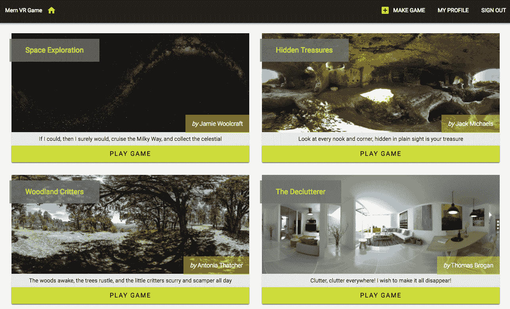
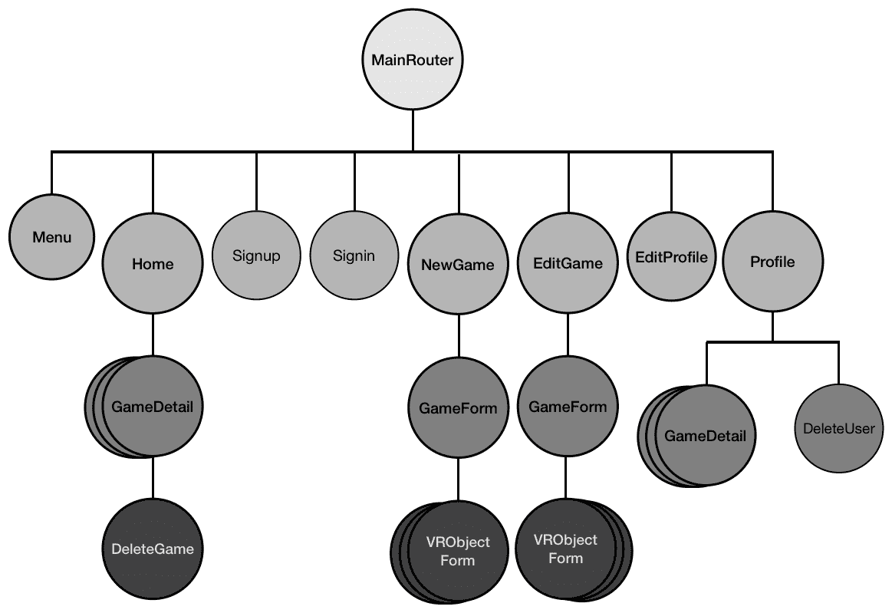
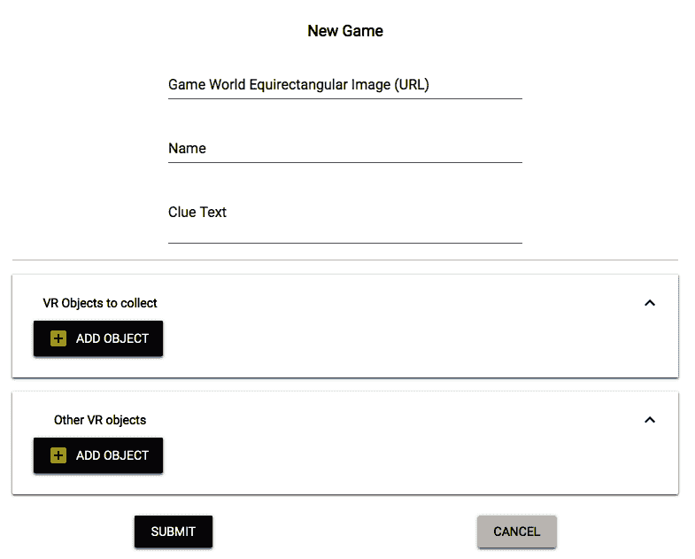
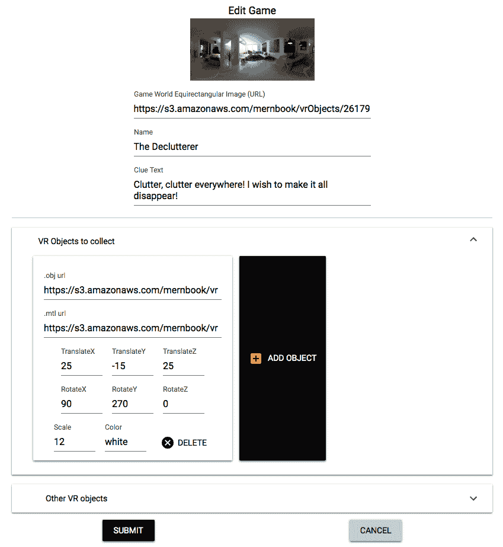
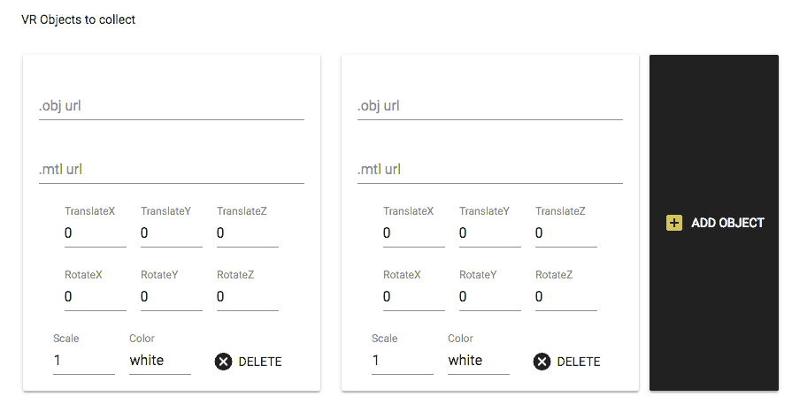
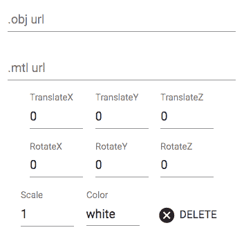
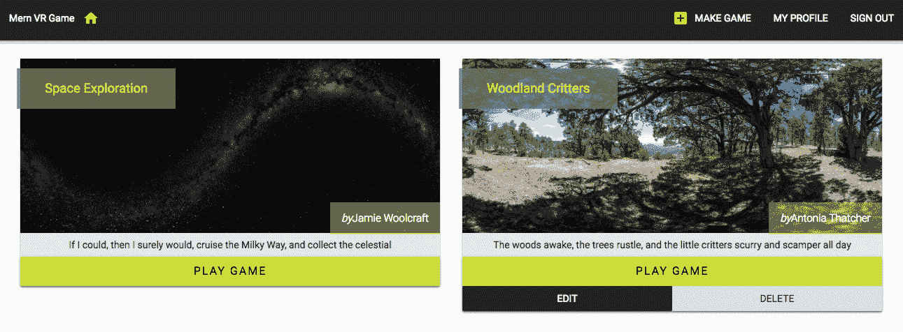
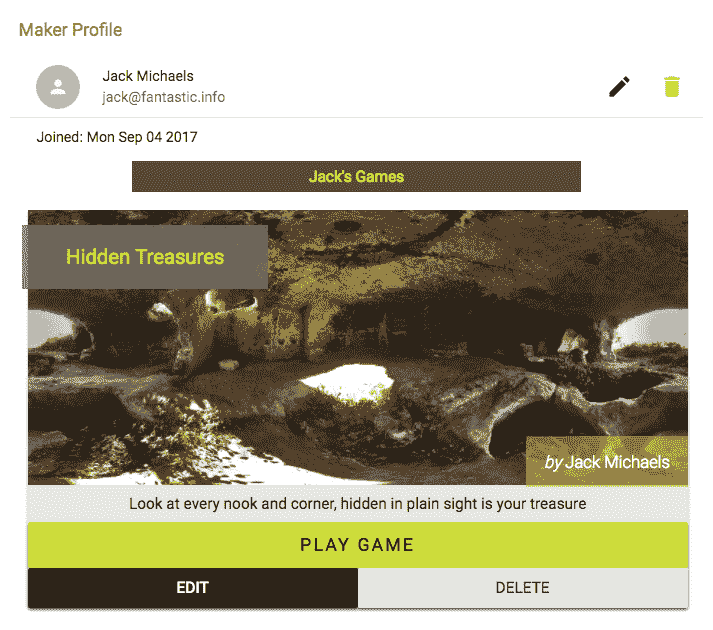

# 第十八章：使用 MERN 使 VR 游戏动态化

在本章中，我们将扩展 **MongoDB**、**Express.js**、**React.js**、**和 Node.js**（**MERN**）骨架应用程序以构建 MERN VR Game 应用程序，并使用它将上一章开发的静态 React 360 游戏转换为动态游戏。我们将通过用从数据库直接获取的游戏详情替换示例游戏数据来实现这一点。我们将使用 MERN 栈技术在后端实现游戏模型和 **创建、读取、更新和删除**（**CRUD**）**应用程序编程接口**（**APIs**），这将允许存储和检索游戏，以及前端视图，这将允许用户在浏览器中创建自己的游戏，同时还可以玩平台上任何游戏。我们将更新并将使用 React 360 开发的游戏集成到使用 MERN 技术开发的游戏平台中。完成这些实现和集成后，您将能够设计和构建具有动态 VR 功能的全栈 Web 应用程序。

为了使 MERN VR Game 成为完整且动态的游戏应用程序，我们将实现以下功能：

+   用于在 MongoDB 中存储游戏详情的游戏模型模式

+   游戏 CRUD 操作的 API

+   用于创建、编辑、列出和删除游戏的 React 视图

+   使用 API 更新 React 360 游戏以获取数据

+   使用动态游戏数据加载 VR 游戏

# 介绍动态 MERN VR Game 应用程序

在本章中，我们将使用 MERN-stack 技术开发 MERN VR Game 应用程序。在这个平台上，注册用户可以通过提供游戏世界的等距图像以及放置在游戏世界中的每个对象的变换属性值来创建和修改自己的游戏。任何访问应用程序的访客都可以浏览所有由制作者添加的游戏，并玩任何游戏，以找到和收集与每个游戏线索或描述相关的游戏世界中的 3D 对象。当注册用户登录应用程序时，他们将看到一个包含所有游戏列表的主页，以及创建自己游戏的选项，如下面的截图所示：



完整的 MERN VR Game 应用程序的代码可在 GitHub 上找到，网址为 [`github.com/PacktPublishing/Full-Stack-React-Projects-Second-Edition/tree/master/Chapter14/mern-vrgame`](https://github.com/PacktPublishing/Full-Stack-React-Projects-Second-Edition/tree/master/Chapter14/mern-vrgame)。您可以在阅读本章其余部分的代码解释时克隆此代码并运行应用程序。

MERN VR Game 应用程序所需的视图将通过扩展和修改 MERN 骨架应用程序中现有的 React 组件来开发。以下截图所示的组件树显示了本章开发的 MERN VR Game 前端的所有自定义 React 组件：



我们将添加与创建、编辑和列出 VR 游戏相关的新的 React 组件，并且随着我们在本章的其余部分构建 MERN VR 游戏应用程序的功能，我们还将修改现有的组件，如`Profile`、`Menu`和`Home`组件。在这个游戏平台的核心功能依赖于存储每个游戏特定细节的能力。在下一节中，我们将通过定义存储每个游戏详细信息的游戏模型来开始实现 MERN VR 游戏应用程序。

# 定义游戏模型

为了在平台上存储每场比赛的详细信息，我们将实现一个 Mongoose 模型来定义一个游戏模型，其实现方式将与之前章节中介绍的其他 Mongoose 模型实现类似，例如在第六章，*构建基于 Web 的课堂应用程序*中定义的课程模型。在第十三章，*开发基于 Web 的 VR 游戏*中，*游戏数据结构*部分详细说明了实现游戏玩法中定义的寻宝功能所需的每个游戏的详细信息。

我们将根据这些关于游戏、其 VR 物体以及游戏制作者的具体细节来设计游戏模式。在以下章节中，我们将讨论游戏模式的细节，存储游戏中将作为一部分的单独 VR 物体的子模式，以及确保在游戏中放置的最小 VR 物体数量的验证检查。

# 探索游戏模式

游戏模式，它定义了游戏数据结构，将指定存储每个游戏详细信息的字段。这些详细信息将包括游戏名称；游戏世界图像文件、文本描述或线索的链接；包含游戏中 3D 物体详细信息的数组；表示游戏创建或更新的时间戳；以及创建游戏的用户的引用。游戏模型的模式将在`server/models/game.model.js`中定义，以下列表中给出了定义这些游戏字段的代码，并附有说明：

+   **游戏名称**：`name`字段将存储游戏的标题。它被声明为`String`类型，并且是一个必填字段：

```js
  name: {
    type: String,
    trim: true,
    required: 'Name is required'
  },
```

+   **世界图像 URL**：`world`字段将包含指向构成游戏 3D 世界的等经圆图像的 URL。它被声明为`String`类型，并且是一个必填字段：

```js
  world: {
    type: String, trim: true,
    required: 'World image is required'
  },
```

+   **线索文本**：`clue`字段将存储`String`类型的文本，以描述游戏或提供完成游戏的线索：

```js
  clue: {
    type: String,
    trim: true
  },
```

+   **可收集和其他 VR 对象**：`answerObjects` 字段将是一个包含要添加到游戏中的可收集 VR 对象详细信息的数组，而 `wrongObjects` 字段将是一个包含游戏中不能收集的 VR 对象的数组。这些数组中的对象将在下一节中讨论的单独 VR 对象模式中定义：

```js
answerObjects: [VRObjectSchema],
wrongObjects: [VRObjectSchema],
```

+   **创建时间和更新时间**：`created` 和 `updated` 字段为 `Date` 类型，`created` 在添加新游戏时生成，`updated` 在修改任何游戏详细信息时更改：

```js
updated: Date,
created: {
    type: Date,
    default: Date.now
},
```

+   **游戏制作者**：`maker` 字段将是创建游戏的用户的引用：

```js
maker: {type: mongoose.Schema.ObjectId, ref: 'User'}
```

在游戏模式定义中添加的这些字段将捕获平台上每个游戏的详细信息，并允许我们在 MERN VR 游戏应用程序中实现游戏相关功能。在游戏模式中的 `answerObjects` 和 `wrongObjects` 数组中存储的 VR 对象将包含放置在游戏世界中的每个 VR 对象的详细信息。在下一节中，我们将探讨定义每个 VR 对象存储详细信息的模式。

# 指定 VR 对象模式

游戏模式中已定义的 `answerObjects` 和 `wrongObjects` 字段都将包含 VR 对象文档的数组。这些文档将代表游戏中的 VR 对象。我们将为这些文档单独定义 VR 对象 Mongoose 模式，其中包含用于存储 **对象**（**OBJ**）文件和 **材质模板库**（**MTL**）文件 URL 的字段，以及 React 360 变换值、每个 VR 对象的缩放值和颜色值。

VR 对象的模式也将定义在 `server/models/game.model.js` 中，定义这些字段的代码如下列表所示，并附有说明：

+   **OBJ 和 MTL 文件 URL**：`objUrl` 和 `mtlUrl` 字段将存储表示 3D 对象数据的 OBJ 和 MTL 文件的链接。这些字段为 `String` 类型，是存储 VR 对象的必需字段：

```js
  objUrl: {
    type: String, trim: true,
    required: 'OBJ file is required'
  },
  mtlUrl: {
    type: String, trim: true,
    required: 'MTL file is required'
  },
```

+   **平移变换值**：`translateX`、`translateY` 和 `translateZ` 字段将包含 VR 对象在 3D 空间中的位置值。这些字段为 `Number` 类型，每个字段的默认值均为 `0`：

```js
translateX: {type: Number, default: 0},
translateY: {type: Number, default: 0},
translateZ: {type: Number, default: 0},
```

+   **旋转变换值**：`rotateX`、`rotateY` 和 `rotateZ` 字段将包含 VR 对象在 3D 空间中的方向值。这些字段为 `Number` 类型，每个字段的默认值均为 `0`：

```js
rotateX: {type: Number, default: 0},
rotateY: {type: Number, default: 0},
rotateZ: {type: Number, default: 0},
```

+   **缩放**：`scale` 字段将表示 VR 对象的相对大小外观。此字段为 `Number` 类型，默认值为 `1`：

```js
scale: {type: Number, default: 1},
```

+   **颜色**：如果 MTL 文件中没有提供，`color` 字段将指定对象的默认颜色。此字段为 `String` 类型，默认值为 `white`：

```js
color: {type: String, default: 'white'}
```

VR 对象模式中的这些字段代表要添加到游戏世界中的 VR 对象。当新的游戏文档保存到数据库时，`answerObjects`和`wrongObjects`数组将填充符合此模式定义的`VRObject`文档。当用户使用定义的游戏和 VR 对象模式创建新游戏时，我们希望确保用户至少在每个游戏数据数组中添加一个 VR 对象。在下一节中，我们将探讨如何将此验证检查添加到游戏模型中。

# 在游戏模式中验证数组长度

在定义游戏模型的游戏模式中，我们有两个数组用于向游戏中添加 VR 对象。当游戏在游戏集合中保存时，这些在游戏文档中的`answerObjects`和`wrongObjects`数组必须每个数组至少包含一个 VR 对象。为了将最小数组长度验证添加到游戏模式中，我们将向使用 Mongoose 定义的`GameSchema`中的`answerObjects`和`wrongObjects`路径添加以下自定义验证检查。

我们将使用`validate`为`answerObjects`字段添加数组长度验证，如下面的代码所示：

`mern-vrgame/server/models/game.model.js`:

```js
GameSchema.path('answerObjects').validate(function(v) {
  if (v.length == 0) {
    this.invalidate('answerObjects',
   'Must add alteast one VR object to collect')
  }
}, null) 
```

在此验证检查中，如果发现数组长度为`0`，我们将抛出一个验证错误消息，指出在将游戏文档保存到数据库之前，至少必须向数组中添加一个对象。

相同的验证代码也添加到`wrongObjects`字段，如下面的代码所示：

`mern-vrgame/server/models/game.model.js`:

```js
GameSchema.path('wrongObjects').validate(function(v) {
  if (v.length == 0) {
    this.invalidate('wrongObjects', 
    'Must add alteast one other VR object') 
  }
}, null) 
```

这些检查会在每次要将游戏保存到数据库时运行，并有助于确保游戏至少包含两个 VR 对象，包括一个可收集的对象和一个不可收集的对象。用于定义游戏模型的这些模式定义和验证将允许维护应用程序的游戏数据库。为了允许用户访问游戏集合，无论是制作自己的游戏还是检索他人的游戏，我们需要在后端实现相应的 CRUD API。在下一节中，我们将实现这些 CRUD API，这将使用户能够从应用程序中创建、读取、列出、更新和删除游戏。

# 实现游戏 CRUD API

为了构建一个允许制作、管理和访问 VR 游戏的游戏平台，我们需要扩展后端以接受允许在数据库中操作游戏数据的请求。为了使这些功能成为可能，MERN VR Game 应用程序的后端将公开一组 CRUD API，用于在数据库中创建、编辑、读取、列出和删除游戏，这些 API 可以在应用程序的前端使用 `fetch` 调用中使用，包括在 React 360 游戏实现中。在接下来的章节中，我们将在后端实现这些 CRUD API 端点，以及将在前端部署以使用这些 API 的相应 `fetch` 方法。

# 创建一个新的游戏

已登录应用程序的用户将能够通过创建游戏 API 端点在数据库中创建新游戏。对于在后端实现此 API，我们首先在 `/api/games/by/:userId` 上声明一个 `POST` 路由，如下所示：

`mern-vrgame/server/routes/game.routes.js`:

```js
router.route('/api/games/by/:userId')
    .post(authCtrl.requireSignin, gameCtrl.create)
```

向此路由发送 `POST` 请求将处理 `:userId` 参数，验证当前用户是否已登录，然后使用请求中传递的游戏数据创建一个新游戏。

包含此路由声明的 `game.routes.js` 文件将与 `user.routes` 文件非常相似，为了在 Express 应用中加载这些新路由，我们需要在 `express.js` 中挂载游戏路由，就像我们为认证和用户路由所做的那样。可以通过添加以下代码行将游戏路由挂载到 Express 应用中：

`mern-vrgame/server/express.js`

```js
app.use('/', gameRoutes)
```

这将使声明的游戏路由在服务器运行时能够接收请求。

在接收到创建游戏 API 的请求后，为了处理 `:userId` 参数并从数据库检索相关用户，我们将利用用户控制器中的 `userByID` 方法。我们还将添加以下代码到游戏路由中，以便用户在 `request` 对象中可用：

`mern-vrgame/server/routes/game.routes.js`:

```js
router.param('userId', userCtrl.userByID)
```

在接收到包含游戏数据的 `POST` 请求并验证用户身份验证后，将调用 `create` 控制器方法，将新游戏添加到数据库中。此 `create` 控制器方法定义如下所示：

`mern-vrgame/server/controllers/game.controller.js`

```js
const create = async (req, res, next) => {
  const game = new Game(req.body)
  game.maker = req.profile
  try{
    let result = await game.save()
    res.status(200).json(result)
  } catch (err) {
    return res.status(400).json({
    error: errorHandler.getErrorMessage(err)
    })
  }
}
```

在此 `create` 方法中，根据游戏模型和客户端请求体中传递的数据创建一个新的游戏文档。然后，在用户引用设置为游戏制作者后，将此文档保存到游戏集合中。

在前端，我们将在 `api-game.js` 中添加一个相应的 `fetch` 方法，通过传递从已登录用户收集的表单数据向创建游戏 API 发送 `POST` 请求。此 `fetch` 方法定义如下所示：

`mern-vrgame/client/game/api-game.js`

```js
const create = async (params, credentials, game) => {
  try {
    let response = await fetch('/api/games/by/'+ params.userId, {
      method: 'POST',
      headers: {
        'Accept': 'application/json',
        'Content-Type': 'application/json',
        'Authorization': 'Bearer ' + credentials.t
      },
      body: JSON.stringify(game)
    })
    return await response.json()
  } catch(err) { 
    console.log(err)
  }
}
```

这个 `fetch` 方法将在前端使用，并提供创建游戏 API 所需的用户凭证以进行 `POST` 请求。`fetch` 方法的响应将告诉用户游戏是否成功创建。

这个创建游戏 API 端点是准备好的，可以在一个表单视图中使用，它可以收集用户的新游戏详情，因此可以将新游戏添加到数据库中。在下一节中，我们将实现一个 API 端点，该端点将检索已添加到数据库中的游戏。

# 列出所有游戏

在 MERN VR Game 应用程序中，将可以使用后端中的列表游戏 API 从数据库中检索 Game 集合中的所有游戏列表。我们将通过向游戏路由添加一个 `GET` 路由来实现这个 API 端点，如下面的代码所示：

`mern-vrgame/server/routes/game.routes.js`:

```js
router.route('/api/games')
    .get(gameCtrl.list)
```

对 `/api/games` 的 `GET` 请求将执行 `list` 控制器方法，该方法将查询数据库中的 Game 集合，以在客户端响应中返回所有游戏。

这个 `list` 控制器方法将定义如下：

`mern-vrgame/server/controllers/game.controller.js`:

```js
const list = async (req, res) => {
  try {
    let games = await Game.find({}).populate('maker', '_id name').sort('-created').exec()
    res.json(games)
  } catch (err) {
    return res.status(400).json({
    error: errorHandler.getErrorMessage(err)
    })
  }
}
```

在此方法中，查询 Game 集合检索到的结果将按创建日期排序，最新游戏排在前面。列表中的每个游戏也将填充创建它的用户的名字和 ID。排序后的游戏列表将作为响应返回给请求客户端。

在前端，要使用此列表 API 获取游戏，我们将在 `api-game.js` 中设置相应的 `fetch` 方法，如下面的代码所示：

`mern-vrgame/client/game/api-game.js`:

```js
const list = async (signal) => {
  try {
    let response = await fetch('/api/games', {
      method: 'GET',
      signal: signal
    })
    return await response.json()
  } catch(err) { 
    console.log(err)
  }
}
```

这个 `fetch` 方法可以在任何前端界面中使用，以调用列表游戏 API。`fetch` 将向 API 发出 `GET` 请求，并在响应中接收游戏列表，这可以在界面中渲染。在下一节中，我们将实现另一个仅返回特定用户制作的游戏的列表 API。

# 按制作者列出游戏

在 MERN VR Game 应用程序中，还可以检索由特定用户制作的游戏列表。为了实现这一点，我们将在后端添加另一个 API 端点，该端点接受在 `/api/games/by/:userId` 路由上的 `GET` 请求。此路由将与其他游戏路由一起声明，如下面的代码所示：

`mern-vrgame/server/routes/game.routes.js`:

```js
router.route('/api/games/by/:userId')
    .get(gameCtrl.listByMaker)
```

在此路由收到的 `GET` 请求将调用 `listByMaker` 控制器方法，该方法将查询数据库中的 Game 集合以获取匹配的游戏。`listByMaker` 控制器方法将定义如下：

`mern-vrgame/server/controllers/game.controller.js`:

```js
const listByMaker = async (req, res) => {
  try {
    let games = await Game.find({maker:
      req.profile._id}).populate('maker', '_id name')
    res.json(games)
  } catch (err) {
    return res.status(400).json({
     error: errorHandler.getErrorMessage(err)
    })
  }
}
```

在此方法中对游戏集合的查询中，我们找到所有 `maker` 字段与 `userId` 路由参数中指定的用户匹配的游戏。检索到的游戏将包含制造商的名称和 ID，并将作为响应返回给请求客户端。

在前端，为了通过制造商 API 使用此列表获取特定用户的游戏，我们将在 `api-game.js` 中添加相应的 `fetch` 方法，如下所示：

`mern-vrgame/client/game/api-game.js`:

```js
const listByMaker = async (params, signal) => {
  try {
    let response = await fetch('/api/games/by/'+params.userId, {
      method: 'GET',
      signal: signal,
    })
    return await response.json()
  } catch(err) { 
    console.log(err)
  }
}
```

此 `fetch` 方法可以在前端界面中使用用户 ID 调用由制造商 API 列出的游戏。`fetch` 方法将对 API 发出 `GET` 请求并接收由 URL 中指定的用户创建的游戏列表。在下一节中，我们将实现一个类似的 `GET` API 来检索单个游戏的详细信息。

# 加载游戏

在 MERN VR Game 应用程序的后端，我们将公开一个 API，该 API 将检索游戏集合中指定 ID 的单个游戏的详细信息。为了实现这一点，我们可以添加一个 `GET` API，该 API 查询 `Game` 集合并返回响应中的相应游戏文档。我们将开始实现此 API 以通过声明接受在 `'/api/game/:gameId'` 处的 `GET` 请求的路由来获取单个游戏，如下所示：

`mern-vrgame/server/routes/game.routes.js`:

```js
router.route('/api/game/:gameId')
    .get(gameCtrl.read)
```

当接收到此路由的请求时，路由 URL 中的 `:gameId` 参数将首先被处理以从数据库中检索单个游戏。因此，我们还将以下内容添加到游戏路由中：

```js
router.param('gameId', gameCtrl.gameByID)
```

路由中存在 `:gameId` 参数将触发 `gameByID` 控制器方法，该方法与 `userByID` 控制器方法类似。它将从数据库中检索游戏并将其附加到 `request` 对象中，以便在 `next` 方法中使用。此 `gameByID` 控制器方法定义如下所示：

`mern-vrgame/server/controllers/game.controller.js`:

```js
const gameByID = async (req, res, next, id) => {
  try { 
    let game = await Game.findById(id).populate('maker', '_id name').exec()
    if (!game)
      return res.status('400').json({
        error: "Game not found"
      })
    req.game = game
    next()
  } catch (err) {
    return res.status('400').json({
      error: "Could not retrieve game"
    })
  }
}
```

从数据库查询到的游戏还将包含制造商的名称和 ID 详细信息，如 `populate()` 方法中指定的。在此情况下，`next` 方法——即 `read` 控制器方法——简单地返回检索到的游戏作为对客户端的响应。此 `read` 控制器方法定义如下：

`mern-vrgame/server/controllers/game.controller.js`:

```js
const read = (req, res) => {
  return res.json(req.game)
}
```

此读取单个游戏详细信息的 API 将用于在 React 360 游戏世界的实现中加载游戏。我们可以在前端代码中使用 `fetch` 方法调用此 API，根据其 ID 检索单个游戏的详细信息。可以定义一个相应的 `fetch` 方法来调用此游戏 API，如下所示：

`mern-vrgame/client/game/api-game.js`:

```js
const read = async (params) => {
  try {
    let response = await fetch('/api/game/' + params.gameId, {
      method: 'GET'
    })
    return await response.json()
  } catch(err) { 
    console.log(err)
  }
}
```

此 `read` 方法将获取 `params` 中的游戏 ID 并使用 `fetch` 方法向 API 发出 `GET` 请求。

此用于加载单个游戏的 API 将被用于 React 视图获取游戏详情以及 React 360 游戏视图，该视图将在 MERN VR 游戏应用中渲染游戏界面。在下节中，我们将实现允许制作者更新他们在平台上已创建的游戏的 API。

# 编辑游戏

已登录的授权用户以及特定游戏的制作者将能够编辑该游戏在数据库中的详细信息。为了启用此功能，我们将在后端实现一个编辑游戏的 API。我们将添加一个`PUT`路由，允许授权用户编辑他们自己的其中一个游戏。该路由声明如下：

`mern-vrgame/server/routes/game.routes.js`:

```js
router.route('/api/games/:gameId')
    .put(authCtrl.requireSignin, gameCtrl.isMaker, gameCtrl.update)
```

对`'/api/games/:gameId'`的`PUT`请求将首先执行`gameByID`控制器方法以检索特定游戏的详细信息。`requireSignin`认证控制器方法也将被调用以确保当前用户已登录。然后，`isMaker`控制器方法将确定当前用户是否是此特定游戏的制作者，最后运行游戏`update`控制器方法以在数据库中修改游戏。

`isMaker`控制器方法确保已登录的用户实际上是正在编辑的游戏的制作者，并且它定义如下所示：

`mern-vrgame/server/controllers/game.controller.js`:

```js
const isMaker = (req, res, next) => {
  let isMaker = req.game && req.auth && req.game.maker._id == req.auth._id
  if(!isMaker){
    return res.status('403').json({
      error: "User is not authorized"
    })
  }
  next()
}
```

如果`isMaker`条件不满足，这意味着当前登录的用户不是正在编辑的游戏的制作者，并且响应中返回授权错误。但如果条件满足，则调用`next`方法。在这种情况下，`update`控制器方法是`next`方法，它将更改保存到数据库中的游戏。此更新方法定义如下所示：

`mern-vrgame/server/controllers/game.controller.js`:

```js
const update = async (req, res) => {
  try {
  let game = req.game
  game = extend(game, req.body)
  game.updated = Date.now()
  await game.save()
    res.json(game)
  } catch (err) {
    return res.status(400).json({
      error: errorHandler.getErrorMessage(err)
    })
  }
}
```

此`update`方法将接受现有的游戏详情和请求体中接收到的表单数据以合并更改，并将更新后的游戏保存到数据库中的 Game 集合。

此编辑游戏 API 可以通过前端视图使用一个`fetch`方法调用，该方法将更改作为表单数据发送到后端，并随请求一起发送用户凭据。相应的`fetch`方法定义如下所示：

`mern-vrgame/client/game/api-game.js`:

```js
const update = async (params, credentials, game) => {
  try {
    let response = await fetch('/api/games/' + params.gameId, {
      method: 'PUT',
      headers: {
        'Accept': 'application/json',
        'Content-Type': 'application/json',
        'Authorization': 'Bearer ' + credentials.t
      },
      body: JSON.stringify(game)
    })
    return await response.json()
  } catch(err) { 
    console.log(err)
  }
}
```

此方法向编辑游戏 API 发出`PUT`请求，在请求体中提供游戏的更改，在请求头中提供当前用户的凭据，并在路由 URL 中提供要编辑的游戏的 ID。此方法可以在前端使用，它渲染一个表单，允许用户更新游戏详情。在下节中，我们将在后端实现另一个 API，允许授权用户删除他们在平台上创建的游戏。

# 删除游戏

经过认证和授权的用户将能够删除他们在应用程序中创建的任何游戏。为了启用此功能，我们将在后端实现一个删除游戏的 API。我们将首先添加一个`DELETE`路由，允许授权的制作者删除他们自己的游戏，如下面的代码所示：

`mern-vrgame/server/routes/game.routes.js`:

```js
router.route('/api/games/:gameId')
    .delete(authCtrl.requireSignin, gameCtrl.isMaker, gameCtrl.remove)
```

在服务器上接收到`api/games/:gameId`的`DELETE`请求后，控制器方法执行的流程将与编辑游戏 API 类似，最终调用的是`remove`控制器方法而不是`update`。

当接收到`/api/games/:gameId`的`DELETE`请求，并且已经验证当前用户是给定游戏的原始制作者时，`remove`控制器方法会从数据库中删除指定的游戏。`remove`控制器方法定义如下所示：

`mern-vrgame/server/controllers/game.controller.js`:

```js
const remove = async (req, res) => {
  try {
    let game = req.game
    let deletedGame = await game.remove()
    res.json(deletedGame)
  } catch (err) {
    return res.status(400).json({
      error: errorHandler.getErrorMessage(err)
    })
  }
}
```

这个`remove`方法会永久地从数据库中的游戏集合中删除指定的游戏。

为了从前端使用此 API，我们将在`api-game.js`中添加相应的`remove`方法，以向删除游戏 API 发送 fetch 请求。此`fetch`方法定义如下：

`mern-vrgame/client/game/api-game.js`:

```js
const remove = async (params, credentials) => {
  try {
    let response = await fetch('/api/games/' + params.gameId, {
      method: 'DELETE',
      headers: {
        'Accept': 'application/json',
        'Content-Type': 'application/json',
        'Authorization': 'Bearer ' + credentials.t
      }
    })
    return await response.json()
  } catch(err) { 
    console.log(err)
  }
}
```

此方法使用`fetch`向删除游戏 API 发送`DELETE`请求。它接受`params`中的游戏 ID 以及后端 API 端点需要的用户凭据，以检查当前用户是否是指定游戏的授权制作者。如果请求成功并且相应的游戏已从数据库中删除，则响应中返回成功消息。

在后端这些游戏 CRUD API 功能实现后，我们准备实现前端，该前端将使用这些 API 允许用户创建新游戏、列出游戏、修改现有游戏以及在 React 360 游戏视图中加载单个游戏。我们可以在下一节开始构建这个前端，从创建和编辑应用程序中游戏的 React 视图开始。

# 添加创建和编辑游戏的表单

在 MERN VR 游戏应用程序上注册的用户将能够创建新游戏并从应用程序的视图中修改这些游戏。为了实现这些视图，我们将添加 React 组件，允许用户为每个游戏组合和修改游戏详情以及 VR 对象详情。由于创建新游戏和编辑现有游戏的表单将具有类似的表单字段来组合游戏详情和 VR 对象详情，我们将创建可重用的组件，这些组件可以用于创建和编辑目的。在以下章节中，我们将讨论创建新游戏和编辑现有游戏的表单视图，以及在这些视图中实现通用表单组件。

# 创建新游戏

当任何用户登录到应用程序时，他们将被提供创建自己的 VR 游戏的选择。他们将在菜单中看到一个“创建游戏”链接，该链接将引导他们到一个表单，他们可以在其中填写游戏详情以在平台上创建新游戏。在接下来的部分中，我们将更新前端代码以在菜单上添加此链接并实现`NewGame`组件，该组件将包含创建新游戏的表单。

# 更新菜单

我们将更新应用程序中的导航菜单以添加“创建游戏”按钮，该按钮将根据用户是否已登录而条件显示，并将用户重定向到包含创建新游戏表单的视图。`创建游戏`按钮将显示在菜单中，如下面的截图所示：


要将此按钮添加到`Menu`组件，我们将使用一个`Link`组件，其中包含指向`NewGame`组件的表单的路由。为了使其条件渲染，我们将将其放置在先前的截图所示的“我的个人资料”链接之前，在仅当用户已认证时渲染的章节中。按钮代码将按以下代码所示添加：

`mern-vrgame/client/core/Menu.js`:

```js
<Link to="/game/new">
   <Button style={isActive(history, "/game/new")}>
       <AddBoxIcon color="secondary"/> Make Game
   </Button>
</Link>
```

这将向已登录用户显示“创建游戏”选项，他们可以点击它以重定向到包含在平台上创建新游戏表单视图的`/game/new`路由。在下一节中，我们将查看将渲染此表单的组件。

# 新游戏组件

我们将在`NewGame`React 组件中实现创建新游戏的表单视图。此表单视图将允许用户填写单个游戏的字段。`NewGame`组件将渲染与游戏详情相对应的这些表单元素，包括 VR 对象详情，如下面的截图所示：



`NewGame`组件将使用`GameForm`组件，该组件将包含所有渲染的表单字段，以组成这个新游戏表单。`GameForm`组件将是一个可重用组件，我们将在创建和编辑表单中使用它。

当添加到`NewGame`组件时，它将一个`onSubmit`方法作为属性，以及任何服务器返回的错误消息，如下面的代码所示：

`mern-vrgame/client/game/NewGame.js`:

```js
<GameForm onSubmit={clickSubmit} errorMsg={error}/>
```

传递给`onSubmit`属性的函数将在用户提交表单时执行。在这种情况下传递的`clickSubmit`方法是在`NewGame`组件中定义的。它使用`api-game.js`中的创建游戏`fetch`方法向创建游戏 API 发送带有游戏表单数据和用户详情的`POST`请求。

此`clickSubmit`方法定义如下所示：

`mern-vrgame/client/game/NewGame.js`:

```js
  const clickSubmit = game => event => {
    const jwt = auth.isAuthenticated()
    create({
      userId: jwt.user._id
    }, {
      t: jwt.token
    }, game).then((data) => {
      if (data.error) {
        setError(data.error)
      } else {
        setError('')
        setRedirect(true)
      }
    })
  }
```

如果用户在表单中输入游戏详情时出错，当在表单提交时调用此`clickSubmit`方法时，后端会发送错误消息。如果没有错误并且游戏在数据库中成功创建，用户将被重定向到另一个视图。

为了在指定的 URL 加载此`NewGame`组件并且仅对认证用户，我们将在`MainRouter`中添加一个`PrivateRoute`，如下面的代码所示：

`mern-vrgame/client/MainRouter.js`:

```js
<PrivateRoute path="/game/new" component={NewGame}/>
```

这将使得当认证用户访问时，`NewGame`组件将在浏览器的`/game/new`路径上加载。在下一节中，我们将看到类似的实现，用于从数据库中编辑现有游戏并渲染相同的表单。

# 编辑游戏

用户将能够使用与创建新游戏表单类似的表单编辑他们在平台上创建的游戏。我们将在`EditGame`组件中实现此编辑游戏视图，该组件将渲染预填充现有游戏详情的游戏表单字段。我们将在下一节中查看此`EditGame`组件的实现。

# The EditGame component

正如`NewGame`组件中一样，`EditGame`组件也将使用`GameForm`组件来渲染表单元素。但在这个表单中，字段将加载要编辑的游戏的当前值，并且用户将能够更新这些值，如下面的截图所示：



在此`EditGame`组件的情况下，`GameForm`将接受给定的游戏 ID 作为属性，以便它可以获取游戏详情，除了`onSubmit`方法和可能的服务器生成的错误消息。`GameForm`组件将带有这些属性添加到`EditGame`组件中，如下所示：

`mern-vrgame/client/game/EditGame.js`:

```js
<GameForm gameId={params.gameId} onSubmit={clickSubmit} errorMsg={error}/>
```

编辑表单的`clickSubmit`方法将使用`api-game.js`中的更新游戏`fetch`方法向编辑游戏 API 发送带有表单数据和用户详情的`PUT`请求。此编辑表单提交的`clickSubmit`方法将定义如下面的代码所示：

`mern-vrgame/client/game/EditGame.js`:

```js

  const clickSubmit = game => event => {
    const jwt = auth.isAuthenticated()
    update({
      gameId: match.params.gameId
    }, {
      t: jwt.token
    }, game).then((data) => {
      if (data.error) {
        setError(data.error)
      } else {
        setError('')
        setRedirect(true)
      }
    })
  }
```

如果用户在表单中修改游戏详情时出错，当在表单提交时调用此`clickSubmit`方法时，后端会发送错误消息。如果没有错误并且游戏在数据库中成功更新，用户将被重定向到另一个视图。

为了在指定的 URL 加载此`EditGame`组件并且仅对认证用户，我们将在`MainRouter`中添加一个`PrivateRoute`，如下面的代码所示：

`mern-vrgame/client/MainRouter.js`:

```js
<PrivateRoute path="/game/edit/:gameId" component={EditGame}/>
```

当认证用户访问时，`EditGame` 组件将在浏览器中的 `/game/edit/:gameId` 路径上加载。这个 `EditGame` 组件和 `NewGame` 组件都使用 `GameForm` 组件来渲染允许用户添加游戏详情的表单元素。在下一节中，我们将讨论这个可重用的 `GameForm` 组件的实现。

# 实现 GameForm 组件

`GameForm` 组件在 `NewGame` 和 `EditGame` 组件中都被使用，它包含了允许用户输入单个游戏的游戏详情和 VR 对象详情的元素。它可能从一个空白的游戏对象开始，或者加载一个现有的游戏。为了开始实现这个组件，我们首先在组件状态中初始化一个空白的游戏对象，如下面的代码所示：

`mern-vrgame/client/game/GameForm.js`:

```js
const [game, setGame] = useState({ name: '', 
                                   clue: '', 
                                   world: '', 
                                   answerObjects: [], 
                                   wrongObjects: []
                                 })
```

如果 `GameForm` 组件从父组件（例如从 `EditGame` 组件）接收到 `gameId` 属性——那么它将使用加载游戏 API 来检索游戏的详情并将其设置到状态中，以便在表单视图中渲染。我们将在下面的代码中调用这个 API，如下所示：

`mern-vrgame/client/game/GameForm.js`:

```js
  useEffect(() => {
    if(props.gameId){
      const abortController = new AbortController()
      const signal = abortController.signal

      read({gameId: props.gameId}, signal).then((data) => {
        if (data.error) {
          setReadError(data.error)
        } else {
          setGame(data)
        }
      })
      return function cleanup(){
        abortController.abort()
      }
    }
  }, [])
```

在 `useEffect` 钩子中，我们首先检查从父组件接收到的属性中是否包含 `gameId` 属性，然后使用该值来调用加载游戏 API。如果 API 调用返回错误，我们将错误设置到状态中；否则，我们将检索到的游戏设置到状态中。通过这段代码，我们将根据初始值初始化游戏详情，以便在表单视图中使用。

`GameForm` 组件中的表单视图部分基本上有两个部分：一部分用于输入简单的游戏详情（如名称、世界图像链接和线索文本），另一部分允许用户将可变数量的 VR 对象添加到答案对象数组或错误对象数组中。在接下来的几节中，我们将查看这两个部分的实现，它们将构成游戏详情表单视图。

# 输入简单的游戏详情

在创建或编辑游戏时，用户首先会看到游戏简单详情的表单元素，例如名称、世界图像 URL 和线索文本。这个包含简单游戏详情的表单部分将主要是使用 Material-UI `TextField` 组件添加的文本输入元素，并通过 `onChange` 处理器传递一个更改处理方法。我们将在 `GameForm` 组件中构建这个部分，该组件在 `mern-vrgame/client/game/GameForm.js` 中实现，如下所示的相关代码：

+   **表单标题**：表单标题将根据是否将现有的游戏 ID 作为属性从父组件传递给 `GameForm` 来决定，如下面的代码所示：

```js
<Typography type="headline" component="h2">
    {props.gameId? 'Edit': 'New'} Game
</Typography>
```

+   **游戏世界图像输入**：我们将在表单最顶部的`img`元素中渲染背景图像 URL，以向用户显示他们添加的游戏世界图像 URL。图像 URL 输入将在渲染的图像下方的`TextField`组件中获取，如下面的代码所示：

```js

<TextField id="world" label="Game World Equirectangular Image (URL)" 
           value={game.world} onChange={handleChange('world')}/>
```

+   **游戏名称**：游戏名称将被添加到默认的`text`类型的单个`TextField`中，如下面的代码所示：

```js
<TextField id="name" label="Name" value={game.name} onChange={handleChange('name')}/>
```

+   **线索文本**：线索文本将被添加到一个多行`TextField`组件中，如下面的代码所示：

```js
<TextField id="multiline-flexible" label="Clue Text" multiline rows="2" 
           value={game.clue} onChange={handleChange('clue')}/>
```

在添加到`GameForm`组件的这些表单元素中，输入字段也接受一个`onChange`处理函数，该函数被定义为`handleChange`。这个`handleChange`方法会在用户更改输入元素中的值时更新状态中的游戏值。`handleChange`方法定义如下：

`mern-vrgame/client/game/GameForm.js`:

```js
const handleChange = name => event => {
    const newGame = {...game}
    newGame[name] = event.target.value
    setGame(newGame)
}
```

在这个方法中，根据被更改的具体字段值，我们更新状态中游戏对象的相应属性。这捕捉了用户输入的值作为他们 VR 游戏的简单细节。表单还将提供定义将作为游戏一部分的 VR 对象数组的选项。在下一节中，我们将查看允许用户操作 VR 对象数组的表单实现。

# 修改 VR 对象数组

用户将能够为每个游戏定义两个不同数组中的动态数量的 VR 对象。为了允许用户修改他们希望添加到 VR 游戏中的`answerObjects`和`wrongObjects`数组，`GameForm`将遍历每个数组，并为每个对象渲染一个 VR 对象表单组件。这样，它将使从`GameForm`组件中添加、删除和修改 VR 对象成为可能，如下面的截图所示：



在以下几节中，我们将在`GameForm`组件中添加这些数组操作功能。我们首先将渲染 VR 对象数组中的每个项目，并包含添加新项目或从数组中删除现有项目的选项。然后，由于数组中的每个项目本质上都是一个输入 VR 对象细节的表单，我们还将讨论如何处理在`GameForm`组件中每个项目内进行的输入更改。

# 迭代和渲染对象详情表单

我们将添加上一节中看到的表单界面，使用 Material-UI `ExpansionPanel`组件来创建给定游戏中每种 VR 对象数组类型的可修改的 VR 对象列表。

在嵌套的`ExpansionPanelDetails`组件内部，我们将遍历`answerObjects`数组或`wrongObjects`数组，为每个 VR 对象渲染一个`VRObjectForm`组件，如下面的代码所示：

`mern-vrgame/client/game/GameForm.js`:

```js
<ExpansionPanel>
    <ExpansionPanelSummary expandIcon={<ExpandMoreIcon />}>
        <Typography>VR Objects to collect</Typography>
    </ExpansionPanelSummary>
    <ExpansionPanelDetails> {
        game.answerObjects.map((item, i) => {
 return <div key={i}>
 <VRObjectForm index={i} type={'answerObjects'}
              handleUpdate={handleObjectChange} 
                vrObject={item} 
                  removeObject={removeObject}/>
 </div>
 })
      }
    ...
    </ExpansionPanelDetails>
</ExpansionPanel>
```

为了渲染数组中的每个对象，我们使用`VRObjectForm`组件。我们将在本章的后面部分查看`VRObjectForm`组件的具体实现。在添加`VRObjectForm`到这段代码时，我们传递单个`vrObject`项目作为属性，以及数组中的当前`index`、数组的类型，以及两个方法，用于在`GameForm`中通过更改详细信息或从`VRObjectForm`组件内部删除对象来修改数组详细信息时更新状态。这将渲染一个表单，用于在`GameForm`组件中与游戏关联的数组中的每个 VR 对象。在下一节中，我们将看到包括将这些数组中添加新对象选项的实现。 

# 向数组中添加新对象

对于游戏表单中渲染的每个数组，我们将添加一个按钮，允许用户将新的 VR 对象推送到给定的数组。添加对象的此按钮将渲染一个新的`VRObjectForm`组件以获取新 VR 对象的详细信息。我们将在迭代代码之后将此按钮添加到`ExpansionPanelDetails`组件中，如下所示：

`mern-vrgame/client/game/GameForm.js`:

```js
<ExpansionPanelDetails>
...
 <Button color="primary" variant="contained" 
 onClick={addObject('answerObjects')}>
 <AddBoxIcon color="secondary"/> 
 Add Object
 </Button>
</ExpansionPanelDetails>
```

此添加对象按钮将渲染在每个 VR 对象表单列表的末尾。当点击时，它将通过调用`addObject`方法添加一个新的空白 VR 对象表单。此`addObject`方法将如下定义：

`mern-vrgame/client/game/GameForm.js`:

```js
  const addObject = name => event => {
    const newGame = {...game}
    newGame[name].push({})
    setGame(newGame)
  }
```

`addObject`方法传递了数组类型，因此我们知道用户想要将新对象添加到哪个数组。在此方法中，我们只需将一个空对象添加到正在迭代的数组中，这样就会在它的位置渲染一个空表单，用户可以填写以输入新对象的详细信息。在下一节中，我们将看到如何让用户从 VR 对象表单列表中删除这些项目之一。

# 从数组中删除对象

VR 对象表单列表中渲染的每个项目也可以由用户删除。显示项目的`VRObjectForm`组件将包含一个删除选项，这将从给定的数组中删除对象。

为了实现此删除按钮的删除项功能，我们将一个`removeObject`方法作为属性传递给从父组件`GameForm`组件的`VRObjectForm`组件。此方法将允许在用户在特定的`VRObjectForm`上点击 DELETE 时，更新父组件的状态中的数组。此`removeObject`方法将按照以下代码所示定义：

`mern-vrgame/client/game/GameForm.js`:

```js
  const removeObject = (type, index) => event => {
    const newGame = {...game}
    newGame[type].splice(index, 1)
    setGame(newGame)
  }
```

在此方法中，将根据指定的 `index` 从具有指定 `type` 的数组中切片，移除对应于点击项的 VR 对象。当在状态中设置时，此更新后的对象数组将在游戏中反映出来，删除的 VR 对象将从表单视图中移除。在下一节中，我们将探讨当用户在 VR 对象表单中更新值时如何处理 VR 对象详情的更改，该表单是根据 VR 对象数组中的项渲染的。

# 处理对象详情更改

当用户在相应的 VR 对象表单中的任何字段更改输入值时，游戏中的任何 VR 对象的详情都将被更新。为了注册此更新，包含 VR 对象表单的 `GameForm` 将 `handleObjectChange` 方法传递给 `VRObjectForm` 组件，该组件将渲染 VR 对象表单。此 `handleObjectChange` 方法将定义如下：

`mern-vrgame/client/game/GameForm.js`:

```js
const handleObjectChange = (index, type, name, val) => {
    var newGame = {...game}
    newGame[type][index][name] = val
    setGame(newGame)
}
```

这个 `handleObjectChange` 方法将在 `VRObjectFrom` 组件中使用，以捕获更改后的输入值并更新给定 `type` 的数组中指定 `index` 的 VR 对象的相应字段，因此它反映在 `GameForm` 中的游戏对象状态中。

`GameForm` 组件用于渲染修改游戏详情的表单元素，包括 VR 对象列表。使用此表单，用户可以在列表中添加、修改和删除 VR 对象。列表以 VR 对象表单的形式渲染每个项，用户可以使用它来组合对象的详情。在下一节中，我们将实现渲染游戏中每个 VR 对象的 VR 对象表单的 React 组件。

# VRObjectForm 组件

我们将实现 `VRObjectForm` 组件以渲染用于修改单个 VR 对象详情的输入字段，这些字段被添加到 `GameForm` 组件中的 `answerObjects` 和 `wrongObjects` 数组中。`VRObjectForm` 组件将渲染一个表单，如下面的截图所示：



要开始实现包含 VR 对象表单的 `VRObjectForm` 组件，我们将在组件的状态中使用 `useState` 钩子初始化 VR 对象的空白详情，如下面的代码所示：

`mern-vrgame/client/game/VRObjectForm.js`:

```js
  const [values, setValues] = useState({
    objUrl: '',
    mtlUrl: '',
    translateX: 0,
    translateY: 0,
    translateZ: 0,
    rotateX: 0,
    rotateY: 0,
    rotateZ: 0,
    scale: 1,
    color:'white'
  }) 
```

这些详情对应于存储 VR 对象定义的架构。当 `VRObjectForm` 组件被添加到 `GameForm` 组件时，它可能接收一个空的 VR 对象或一个填充了详情的 VR 对象，具体取决于是否正在渲染空表单或具有现有对象详情的表单。如果传递了现有的 VR 对象作为 prop，我们将使用 `useEffect` 钩子将此对象的详情设置在组件状态中，如下面的代码所示：

`mern-vrgame/client/game/VRObjectForm.js`:

```js
  useEffect(() => {
    if(props.vrObject && Object.keys(props.vrObject).length != 0){
      const vrObject = props.vrObject
      setValues({...values,
        objUrl: vrObject.objUrl,
        mtlUrl: vrObject.mtlUrl,
        translateX: Number(vrObject.translateX),
        translateY: Number(vrObject.translateY),
        translateZ: Number(vrObject.translateZ),
        rotateX: Number(vrObject.rotateX),
        rotateY: Number(vrObject.rotateY),
        rotateZ: Number(vrObject.rotateZ),
        scale: Number(vrObject.scale),
        color:vrObject.color
      })
    }
  }, [])
```

在此`useEffect`钩子中，如果通过 prop 传入的`vrObject`值不是一个空对象，我们将设置接收到的 VR 对象的详细信息到状态中。这些值将用于组成 VR 对象表单的输入字段。我们将使用 Material-UI `TextField`组件在`VRObjectForm`视图的视图中添加与 VR 对象详情对应的输入字段，如下面的代码和以下列表所示：

+   **3D 对象文件输入**：每个 VR 对象的 OBJ 和 MTL 文件链接将通过`TextField`组件以文本输入的形式收集，如下面的代码所示：

```js
<TextField label=".obj url" value={values.objUrl}
    onChange={handleChange('objUrl')} />
<TextField label=".mtl url" value={values.mtlUrl}
    onChange={handleChange('mtlUrl')} />
```

+   **翻译值输入**：VR 对象在 x、y 和 z 轴上的翻译值将通过`number`类型的`TextField`组件输入，如下面的代码所示：

```js
<TextField type="number" value={values.translateX}
    label="TranslateX" onChange={handleChange('translateX')} />
<TextField type="number" value={values.translateY}
    label="TranslateY" onChange={handleChange( 'translateY')} />
<TextField type="number" value={values.translateZ}
    label="TranslateZ" onChange={handleChange('translateZ')} />
```

+   **旋转值输入**：VR 对象围绕 x、y 和 z 轴的旋转值将通过`number`类型的`TextField`组件输入，如下面的代码所示：

```js
<TextField type="number" value={values.rotateX}
    label="RotateX" onChange={handleChange('rotateX')} />
<TextField type="number" value={values.rotateY}
    label="RotateY" onChange={handleChange('rotateY')} />
<TextField type="number" value={values.rotateZ}
    label="RotateZ" onChange={handleChange('rotateZ')} />
```

+   **缩放值输入**：VR 对象的缩放值将通过`TextField`组件的`number`类型输入，如下面的代码所示：

```js
<TextField type="number" value={values.scale} 
    label="Scale" onChange={handleChange('scale')} />
```

+   **对象颜色输入**：VR 对象的颜色值将通过`text`类型的`TextField`组件输入，如下面的代码所示：

```js
<TextField value={values.color} label="Color"
    onChange={handleChange('color')} />
```

这些输入字段将允许用户在游戏中设置 VR 对象的详细信息。当用户在这些输入字段中更改任何 VR 对象详细信息时，将调用`handleChange`方法。此`handleChange`方法将定义如下所示，代码如下：

`mern-vrgame/client/game/VRObjectForm.js`:

```js
const handleChange = name => event => {
    setValues({...values, [name]: event.target.value})
    props.handleUpdate(props.index, props.type, name, event.target.value)
}
```

此`handleChange`方法将更新`VRObjectForm`组件状态中的相应值，并使用从`GameForm`作为 prop 传递的`handleUpdate`方法来更新`GameForm`状态中的 VR 对象，以特定对象详情的更改值。

`VRObjectForm`还将包含一个 DELETE 按钮，该按钮将执行在`GameForm`中作为 prop 接收的`removeObject`方法，这将允许从游戏列表中移除指定的对象。此删除按钮将按以下代码添加到视图中：

`mern-vrgame/client/game/VRObjectForm.js`:

```js
<Button onClick={props.removeObject(props.type, props.index)}>
    <Icon style={{marginRight: '5px'}}>cancel</Icon> Delete
</Button>
```

`removeObject`方法将接受对象数组类型和数组索引位置值，以从`GameForm`组件的状态中的相关 VR 对象数组中移除指定的对象。

通过这些实现，创建和编辑游戏的表单已经就绪，包括不同大小的 VR 对象输入表单。我们使用了可重用组件来组合创建和编辑游戏所需的形式元素，并添加了修改游戏中 VR 对象数组的 capability。任何注册用户都可以使用这些表单在 MERN VR 游戏应用程序中添加和编辑游戏详情。在下文中，我们将讨论实现视图，该视图将在平台上渲染不同的游戏列表。

# 添加游戏列表视图

访问 MERN VR 游戏的访客将从主页和单个用户个人资料中渲染的列表访问应用程序中的游戏。主页将列出应用程序上的所有游戏，特定制作者的游戏将列在其用户个人资料页面上。这些列表视图将通过使用后端 API 列出游戏来迭代游戏数据，并在可重用的 React 组件中渲染每个游戏的详细信息。

在以下章节中，我们将讨论使用可重用组件渲染列表中所有游戏以及仅由特定制作者的游戏的实现。

# 渲染游戏列表

我们将在应用程序的主页上渲染平台上可用的所有游戏。为了实现此功能，`Home` 组件将首先使用列表游戏 API 从数据库中的游戏集合中获取所有游戏的列表。我们将在 `Home` 组件中的 `useEffect` 钩子中实现这一点，如下所示：

`mern-vrgame/client/core/Home.js`:

```js

  useEffect(() => {
    const abortController = new AbortController()
    const signal = abortController.signal

    list(signal).then((data) => {
      if (data.error) {
        console.log(data.error)
      } else {
        setGames(data)
      }
    })
    return function cleanup(){
      abortController.abort()
    }
  }, [])
```

在此 `useEffect` 钩子中从服务器检索到的游戏列表将设置到状态中，并遍历以渲染列表中的每个游戏的 `GameDetail` 组件，如下所示：

`mern-vrgame/client/core/Home.js`:

```js
{games.map((game, i) => {
     return <GameDetail key={i} game={game} updateGames={updateGames}/>
})}
```

`GameDetail` 组件将被实现为一个可重用的组件，用于渲染单个游戏的详细信息。它将传递游戏细节和 `updateGames` 方法。`updateGames` 方法将允许在列表上的任何游戏被制作者删除时更新 `Home` 组件中的游戏列表。`updateGames` 方法定义如下所示：

`mern-vrgame/client/core/Home.js`:

```js
const updateGames = (game) => {
    const updatedGames = [...games]
    const index = updatedGames.indexOf(game)
    updatedGames.splice(index, 1)
    setGames(updatedGames)
}
```

`updateGames` 方法将通过从游戏数组中切割指定的游戏来更新 `Home` 组件中渲染的游戏列表。当用户使用 `GameDetail` 组件中条件渲染的 `EDIT` 和 `DELETE` 选项删除他们的游戏时，将调用此方法，如下图中所示的应用程序主页上的游戏列表截图：



我们可以在用户个人资料页面上渲染类似的列表视图，仅显示相应用户制作的游戏，如下图中所示：



与 `Home` 组件中的实现步骤类似，在这个 `Profile` 组件中，我们可以通过调用相关的制作者列表游戏 API，在 `useEffect` 钩子中获取给定用户的游戏列表。在状态中设置检索到的游戏列表后，我们可以遍历它，在 `GameDetail` 组件中渲染每个游戏，正如之前讨论的那样，用于在主页上渲染所有游戏。在下文中，我们将讨论此 `GameDetail` 组件的实现，该组件将渲染单个游戏的详细信息。

# 游戏详情组件

我们将在应用程序中的任何游戏列表视图中实现`GameDetail`组件以渲染单个游戏。这个`GameDetail`组件接受游戏对象作为属性，并渲染游戏的详细信息，包括一个链接到 VR 游戏视图的“玩游戏”按钮，如下面的截图所示：


如果当前用户是游戏的制作者，此组件将条件性地渲染“编辑”和“删除”按钮。

在`GameDetail`组件的视图代码中，我们首先添加游戏详情——如名称、世界图像、线索文本和制作者名称——以使用户对游戏有一个概述。我们将使用 Material-UI 组件将这些详情组合成界面，如下面的代码所示：

`mern-vrgame/client/game/GameDetail.js`:

```js
<Typography type="headline" component="h2">
     {props.game.name}
</Typography>
<CardMedia image={props.game.world} 
           title={props.game.name}/>
<Typography type="subheading" component="h4">
     <em>by</em>
     {props.game.maker.name}
</Typography>
<CardContent>
     <Typography type="body1" component="p">
          {props.game.clue}
     </Typography>
</CardContent>
```

此代码将渲染传入属性的游戏世界图像、游戏名称、制作者名称和线索文本。

在`GameDetail`组件中渲染的“玩游戏”按钮将简单地是一个包裹在 HTML 链接元素中的按钮，该链接指向打开 React 360 生成的`index.html`文件的路径（服务器上此路径的实现将在*玩 VR 游戏*部分讨论）。这个“玩游戏”链接添加到`GameDetail`组件中，如下所示：

`mern-vrgame/client/game/GameDetail.js`:

```js
<a href={"/game/play?id=" + props.game._id} target='_self'>
    <Button variant="contained" color="secondary" 
        className={classes.button}>
    Play Game
    </Button>
</a>
```

游戏视图的路径使用游戏 ID 作为查询参数。我们在链接上设置了`target='_self'`，这样 React Router 就会跳过转到下一个状态，让浏览器处理这个链接。这样做将允许浏览器在点击链接时直接向服务器发送请求，并渲染服务器对此请求发送的`index.html`文件，使用户能够立即开始玩渲染的 VR 游戏。

在`GameDetail`组件的最后部分，我们将条件性地显示“编辑”和“删除”选项，仅当当前登录的用户也是渲染的游戏的制作者时。我们将使用以下代码添加这些选项：

`mern-vrgame/client/game/GameDetail.js`:

```js
{auth.isAuthenticated().user 
    && auth.isAuthenticated().user._id == props.game.maker._id && 
    (<div>
       <Link to={"/game/edit/" + props.game._id}>
          <Button variant="raised" color="primary" 
         className={classes.editbutton}>
              Edit
          </Button>
       </Link>
       <DeleteGame game={props.game} 
                   removeGame={props.updateGames}/>
    </div>)}
```

在确保当前用户确实认证后，我们检查已登录用户的用户 ID 是否与游戏中的制作者 ID 匹配。然后，相应地，我们渲染链接到编辑表单视图的“编辑”按钮，以及带有`DeleteGame`组件的“删除”选项。

这个`DeleteGame`组件的实现与第七章中讨论的`DeleteShop`组件类似，*使用在线市场锻炼 MERN 技能*。不同于商店，`DeleteGame`组件将接受要删除的游戏和从父组件接收的`updateGames`函数定义作为属性。在集成此实现后，游戏的制作者将能够从平台上删除游戏。

访问 MERN VR 游戏应用的用户可以浏览在这些视图中渲染的游戏列表，并通过点击相应的`GameDetail`组件中渲染的“播放游戏”链接来选择播放游戏。在下一节中，我们将看到如何更新服务器以处理播放游戏的请求。

# 播放 VR 游戏

MERN VR 游戏应用的用户将能够打开并播放应用内的任何 VR 游戏。为了实现这一点，我们将在服务器上添加一个 API，该 API 渲染由 React 360 生成的`index.html`文件，如前一章所述，第十三章，*开发基于 Web 的 VR 游戏*。此后端 API 将在以下路径接收一个`GET`请求：

```js
/game/play?id=<game ID>
```

此路径将一个`游戏 ID`值作为查询参数。此 URL 中的`游戏 ID`将在本章后面详细说明的 React 360 代码中使用，用于通过加载游戏 API 获取游戏详情。在下一节中，我们将查看实现后端 API 的过程，该 API 将处理用户点击“播放游戏”按钮时开始的`GET`请求。

# 实现渲染 VR 游戏视图的 API

为了实现将在浏览器中渲染 VR 游戏的 API，我们将在后端添加一个路由，该路由将接收一个`GET`请求并打开 React 360 的`index.html`页面。

此路由将在`game.routes.js`中声明，与其他游戏路由一起，如下所示：

`mern-vrgame/server/routes/game.routes.js`:

```js
router.route('/game/play')
  .get(gameCtrl.playGame)
```

在此路由接收到的`GET`请求将执行`playGame`控制器方法，该方法将返回响应请求的`index.html`页面。`playGame`控制器方法将定义如下代码：

`mern-vrgame/server/controllers/game.controller.js`:

```js
const playGame = (req, res) => {
  res.sendFile(process.cwd()+'/server/vr/index.html')
}
```

`playGame`控制器方法将简单地发送放置在`/server/vr/`文件夹中的`index.html`页面给请求客户端。

在浏览器中，这将渲染 React 360 游戏代码，该代码需要使用加载游戏 API 从数据库中获取游戏详情，并渲染游戏世界，以及用户可以与之交互的 VR 对象。在下一节中，我们将看到我们之前用 React 360 构建的游戏视图需要如何更新以动态加载这些游戏详情。

# 更新 React 360 中的游戏代码

在 MERN 应用中设置好游戏后端后，我们可以更新我们在第十三章，*开发基于 Web 的 VR 游戏*中开发的 React 360 项目代码，使其能够直接从数据库中的游戏集合中渲染游戏。

我们将使用在打开 React 360 应用程序的链接中的游戏 ID 来获取游戏详情，使用 React 360 代码内的加载游戏 API。然后，我们将检索到的游戏数据设置为状态，以便游戏从数据库加载详情，而不是我们在 第十三章，“开发基于 Web 的 VR 游戏” 中使用的静态示例数据。一旦代码更新，我们再次捆绑它，并将编译的文件放置在 MERN 应用程序中，然后尝试集成，如以下几节所述。

# 从链接中获取游戏 ID

为了根据用户在 MERN VR 游戏应用程序中选择要玩的游戏渲染 VR 游戏，我们需要从加载 VR 游戏视图的链接中检索相应的游戏 ID。在 React 360 项目文件夹的 `index.js` 文件中，我们将更新 `componentDidMount` 方法，首先从传入的 URL 中检索游戏 ID，然后对加载游戏 API 进行获取调用，如下面的代码所示：

`/MERNVR/index.js`:

```js
componentDidMount = () => {
    let gameId = Location.search.split('?id=')[1]
    read({
          gameId: gameId
      }).then((data) => {
        if (data.error) {
          this.setState({error: data.error});
        } else {
          this.setState({
            vrObjects: data.answerObjects.concat(data.wrongObjects),
            game: data
          });
          Environment.setBackgroundImage(
            {uri: data.world}
          )
        }
    })
}
```

`Location.search` 允许我们访问加载 `index.html` 的传入 URL 中的查询字符串。检索到的查询字符串被 `split` 以从 URL 中附加的 `id` 查询参数中获取 `gameId` 值。我们使用这个 `gameId` 值从后端的加载游戏 API 获取游戏详情，并将其设置为游戏和 `vrObjects` 的状态值。为了能够在 React 360 项目中使用加载游戏 API，我们将在项目中定义一个相应的 `fetch` 方法，如下一节所述。

# 使用加载游戏 API 获取游戏数据

我们希望在 React 360 代码内部获取游戏数据。在 React 360 项目文件夹中，我们将添加一个 `api-game.js` 文件，该文件将包含一个 `read` 获取方法，该方法使用提供的游戏 ID 调用服务器上的加载游戏 API。这个 `fetch` 方法将定义如下：

`/MERNVR/api-game.js`:

```js
const read = (params) => {
  return fetch('/api/game/' + params.gameId, {
    method: 'GET'
  }).then((response) => {
    return response.json() 
  }).catch((err) => console.log(err)) 
}
export {
  read
} 
```

这个 `fetch` 方法接收 `params` 中的游戏 ID 并对数据库中的相应游戏进行 API 调用。它用于 React 360 入口组件的 `componentDidMount` 中，该组件定义在 `index.js` 文件中，用于检索游戏详情，如前所述。

此更新后的 React 360 代码可在 GitHub 仓库的 `dynamic-game-second-edition` 分支上找到，网址为 [github.com/shamahoque/MERNVR/tree/dynamic-game-second-edition](https://github.com/shamahoque/MERNVR/tree/dynamic-game-second-edition)。

在更新 React 360 代码并能够根据传入 URL 中指定的游戏 ID 获取和渲染游戏详情后，我们可以将此更新代码捆绑并集成到 MERN VR 游戏应用程序中，如下一节所述。

# 捆绑和集成更新后的代码

当 React 360 代码更新为从服务器动态获取和渲染游戏详细信息时，我们可以使用提供的捆绑脚本来捆绑此代码，并将新编译的文件放置在 MERN VR 游戏项目目录的`dist`文件夹中。

要从命令行捆绑 React 360 代码，请转到 React 360 `MERNVR`项目文件夹并运行以下代码：

```js
yarn bundle
```

这将在`build/`文件夹中生成带有更新后的 React 360 代码的`client.bundle.js`和`index.bundle.js`捆绑文件。这些文件，连同`index.html`文件和`static_assets`文件夹，需要添加到 MERN VR 游戏应用程序代码中，正如在第十三章[4f633dd6-f392-490d-b3a6-eb5430b58ec8.xhtml]“开发基于 Web 的 VR 游戏”中讨论的那样，以集成最新的 VR 游戏代码。

完成此集成后，如果我们运行 MERN VR 游戏应用程序并点击任何游戏中的 PLAY GAME 链接，它应该会打开游戏视图，在 VR 场景中渲染特定游戏的详细信息，并允许与 VR 对象进行交互，如游戏玩法中指定的。

# 摘要

在本章中，我们将 MERN 堆栈技术的功能与 React 360 集成，以开发一个用于 Web 的动态 VR 游戏应用程序。

我们扩展了 MERN 骨架应用程序，构建了一个可工作的后端，用于存储 VR 游戏详细信息，并允许我们通过 API 调用来操作这些详细信息。我们添加了 React 视图，让用户可以修改游戏并浏览游戏，有选项在由服务器直接渲染的指定路由上启动和玩 VR 游戏。

最后，我们通过从传入的 URL 中检索查询参数并使用 fetch 通过游戏 API 检索数据，更新了 React 360 项目代码，以便在 MERN 应用程序和 VR 游戏视图中传递数据。

将 React 360 代码与 MERN 堆栈应用程序集成产生了功能齐全且动态的基于 Web 的 VR 游戏应用程序，展示了如何使用和扩展 MERN 堆栈技术来创建独特的用户体验。您可以将这里揭示的能力应用于构建自己的 VR 增强全栈 Web 应用程序。

在下一章中，我们将回顾本书中构建的全栈 MERN 应用程序，讨论不仅遵循的最佳实践，还有改进和进一步发展的空间。
