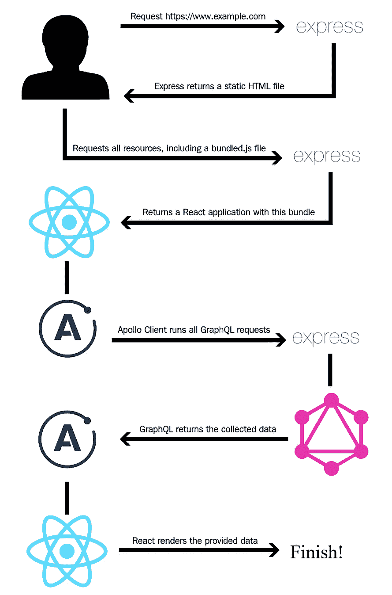
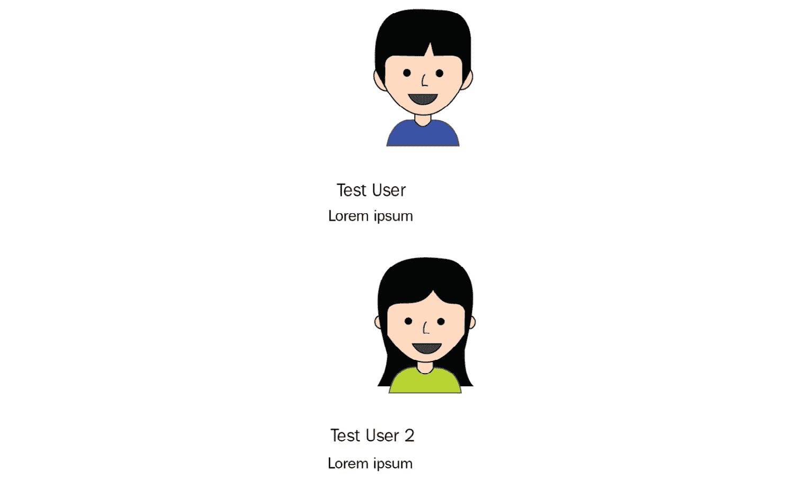
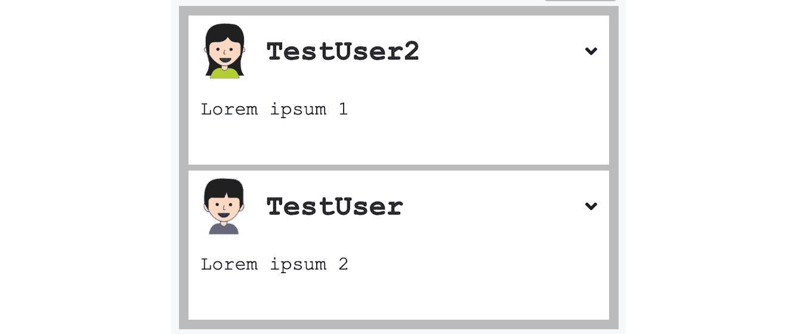
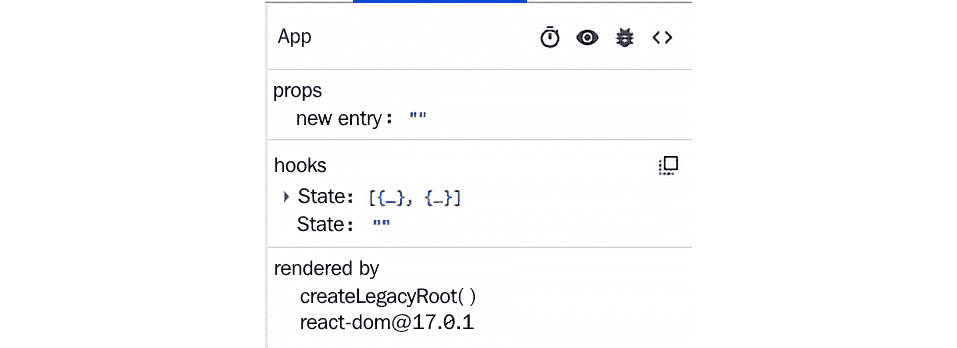

# 第一章：准备你的开发环境

在本书中，我们将构建一个简化版的 Facebook，称为**Graphbook**。我们将允许用户注册和登录，以阅读和撰写帖子并与朋友聊天，类似于我们在常见的社交网络上所能做的。

在开发应用程序时，做好充分的准备始终是一个要求。然而，在我们开始之前，我们需要将我们的栈组合起来。在本章中，我们将探讨我们的技术是否与我们的开发过程很好地配合，在开始之前我们需要什么，以及哪些工具可以帮助我们在构建软件时。

本章通过介绍核心概念、完整流程和准备一个可工作的 React 设置，解释了我们应用程序的架构。

本章涵盖了以下主题：

+   架构和技术

+   仔细思考如何构建栈的架构

+   构建 React 和 GraphQL 栈

+   安装和配置 Node.js

+   使用 webpack、Babel 和其他要求设置 React 开发环境

+   使用 Chrome DevTools 和 React Developer Tools 调试 React 应用程序

# 技术要求

本章的源代码可在以下 GitHub 仓库中找到：[`github.com/PacktPublishing/Full-Stack-Web-Development-with-GraphQL-and-React-Second-Edition/tree/main/Chapter01`](https://github.com/PacktPublishing/Full-Stack-Web-Development-with-GraphQL-and-React-Second-Edition/tree/main/Chapter01)。

# 理解应用程序架构

自从 2015 年首次发布以来，GraphQL 已经成为了标准 SOAP 和 REST API 的新替代品。GraphQL 是一个规范，就像 SOAP 和 REST 一样，你可以遵循它来构建你的应用程序和数据流。它之所以创新，是因为它允许你查询实体的特定字段，例如用户和帖子。这种功能使其非常适合同时针对多个平台。移动应用可能不需要在桌面计算机浏览器中显示的所有数据。你发送的查询由一个类似于 JSON 的对象组成，该对象定义了你的平台需要哪些信息。例如，一个针对`post`的查询可能看起来像这样：

```js
post {
  id
  text
  user {
    user_id
    name
  } 
}
```

GraphQL 根据你的查询对象中指定的正确实体和数据解决问题。GraphQL 中的每个字段都代表一个解析到值的函数。这些函数被称为**解析函数**。返回值可以是相应的数据库值，例如用户的姓名，也可以是一个日期，该日期在返回之前由你的服务器格式化。

GraphQL 完全与数据库无关，可以在任何编程语言中实现。为了跳过实现 GraphQL 库的步骤，我们将使用 Apollo，这是一个 Node.js 生态系统的 GraphQL 服务器。多亏了 Apollo 背后的团队，这使得它非常模块化。Apollo 与许多常见的 Node.js 框架一起工作，例如 Hapi、Koa 和 Express.js。

我们将使用 Express.js 作为我们的基础，因为它在 Node.js 和 GraphQL 社区中被广泛使用。GraphQL 可以与多个数据库系统和分布式系统一起使用，为所有服务提供一个简单的 API。它允许开发者统一现有系统并处理客户端应用程序的数据获取。

如何将你的数据库、外部系统和其他服务组合成一个服务器后端取决于你。在这本书中，我们将使用 Sequelize 通过 MySQL 服务器作为我们的数据存储。SQL 是最知名且最常用的数据库查询语言，而通过 Sequelize，我们有一个现代客户端库，用于我们的 Node.js 服务器连接到我们的 SQL 服务器。

HTTP 是访问 GraphQL API 的标准协议。它也适用于 Apollo 服务器。然而，GraphQL 并不固定于一种网络协议。我们之前提到的所有内容都是后端的重要部分。

当我们到达我们的**Graphbook**应用程序的前端时，我们将主要使用 React。React 是由 Facebook 发布的一个 JavaScript UI 框架，它引入了许多现在常用于在网络上以及原生环境中构建界面的技术。

使用 React 带来了一系列显著的优势。在构建 React 应用程序时，你总是将代码拆分成许多组件，以提高它们的效率和可重用性。当然，你可以在不使用 React 的情况下这样做，但 React 使这变得非常容易。此外，React 教你如何以响应式的方式更新应用程序状态以及 UI。你永远不会分别更新 UI 和数据。

React 通过使用虚拟 DOM，将虚拟 DOM 和实际 DOM 进行比较并相应地更新，从而使得重新渲染非常高效。只有当虚拟 DOM 和实际 DOM 之间存在差异时，React 才会应用这些更改。这种逻辑阻止了浏览器重新计算布局、**层叠样式表**（**CSS**）以及其他影响应用程序整体性能的计算。

在整本书中，我们将使用 Apollo 客户端库。它自然地与 React 和我们的 Apollo 服务器集成。

如果我们将所有这些放在一起，结果就是由 Node.js、Express.js、Apollo、SQL、Sequelize 和 React 组成的主堆栈。

## 基本设置

使应用程序工作的基本设置是逻辑请求流程，如下所示：



图 1.1 – 逻辑请求流程

这里是如何工作的逻辑请求流程：

1.  客户端请求我们的网站。

1.  Express.js 服务器处理这些请求并服务一个静态 HTML 文件。

1.  客户端根据这个 HTML 文件下载所有必要的文件，这些文件还包括一个捆绑的 JavaScript 文件。

1.  这个捆绑的 JavaScript 文件是我们的 React 应用程序。在执行完这个文件中的所有 JavaScript 代码后，所有必要的 Ajax 别名 GraphQL 请求都会发送到我们的 Apollo 服务器。

1.  Express.js 接收请求并将它们传递给我们的 Apollo 端点。

1.  Apollo 从所有可用的系统中查询所有请求的数据，例如我们的 SQL 服务器或第三方服务，合并数据，并以 JSON 格式发送回来。

1.  React 可以将 JSON 数据渲染为 HTML。

这个工作流程是使应用程序工作的基本设置。在某些情况下，为我们的客户端提供服务器端渲染是有意义的。服务器需要在返回 HTML 给客户端之前自己渲染并发送所有的 `XMLHttpRequests`。如果服务器在初始加载时发送请求，用户将节省一次或多次往返。我们将在本书的后面部分关注这个主题，但这就是应用程序架构的精髓。考虑到这一点，让我们动手设置我们的开发环境。

# 安装和配置 Node.js

准备我们的项目的第一步是安装 Node.js。有两种方法可以做到这一点：

+   一种选项是安装 **Node 版本管理器**（**NVM**）。使用 NVM 的好处是您可以在几乎所有的 UNIX 基础系统（如 Linux 和 macOS）上轻松地并行运行多个 Node.js 版本，它为您处理安装过程。在这本书中，我们不需要在不同版本的 Node.js 之间切换的选项。

+   另一个选项是如果您使用 Linux，可以通过您发行版的包管理器安装 Node.js。官方的 PKG 文件适用于 Mac，而 MSI 文件适用于 Windows。我们将在这本书中使用常规的 Linux 包管理器，因为它是最简单的方法。

    注意

    您可以在以下链接找到 Node.js 的 **下载** 部分：[`nodejs.org/en/download/`](https://nodejs.org/en/download/).

我们将在这里使用第二个选项。它涵盖了常规的服务器配置，并且易于理解。我会尽量简短，并跳过所有其他选项，例如针对 Windows 的 Chocolatey 和针对 Mac 的 Brew，这些选项非常特定于那些操作系统。

我假设您使用基于 Debian 的系统，以便于使用这本书。它具有正常的 APT 包管理器和用于轻松安装 Node.js 和 MySQL 的仓库。如果您不是使用基于 Debian 的系统，您可以在 [`nodejs.org/en/download/package-manager/`](https://nodejs.org/en/download/package-manager/) 查找安装 Node.js 的匹配命令。

我们的项目将是新的，这样我们就可以使用 Node.js 14，这是当前的 LTS 版本：

1.  首先，让我们通过运行以下命令添加我们的包管理器的正确仓库：

    ```js
    curl -fsSL https://deb.nodesource.com/setup_14.x | sudo bash -
    ```

1.  接下来，我们必须使用以下命令安装 Node.js 和用于原生模块的构建工具：

    ```js
    apt-get install -y nodejs build-essential
    ```

1.  最后，让我们打开一个终端并验证安装是否成功：

    ```js
    node --version
    ```

    注意

    通过包管理器安装 Node.js 将自动安装 npm。

太好了！你现在可以运行 Node.js 的服务器端 JavaScript，并使用 npm 为你的项目安装 Node.js 模块。

我们项目所依赖的所有依赖项都可在[`npmjs.com`](https://npmjs.com)找到，并可以使用 npm 或 Yarn 进行安装。我们将依赖 npm，因为它比 Yarn 更广泛地被使用。所以，让我们继续，并开始使用 npm 来设置我们的项目和其依赖项。

# 设置 React

我们项目的开发环境已经准备好了。在本节中，我们将安装和配置 React，这是本章的主要内容。让我们首先为我们的项目创建一个新的目录：

```js
mkdir ~/graphbook
cd ~/graphbook
```

我们的项目将使用 Node.js 和许多 npm 包。我们将创建一个`package.json`文件来安装和管理我们项目的所有依赖项。它存储有关项目的信息，如版本号、名称、依赖项等。

只需运行`npm init`来创建一个空的`package.json`文件：

```js
npm init
```

npm 会询问一些问题，例如询问包名，实际上就是项目名。输入`Graphbook`以在生成的`package.json`文件中插入你的应用程序名称。

我更喜欢从版本号 0.0.1 开始，因为 npm 提供的默认版本号 1.0.0 对我来说代表的是第一个稳定版本。然而，关于你在这里使用哪个版本，这是你的选择。

你可以通过按*Enter*键来跳过所有其他问题，以保存 npm 的默认值。其中大部分都不相关，因为它们只是提供信息，如描述或仓库链接。我们将在本书的工作过程中填写其他字段，如脚本。你可以在下面的屏幕截图中看到一个命令行的示例：

安装了两个 npm 包到我们的项目文件夹下的`node_modules`。

由于我们提供了`--save`选项并添加了这些包的最新版本号，npm 自动编辑了我们的`package.json`文件。

你可能想知道为什么我们安装了两个包，尽管我们只需要 React。`react`包只提供 React 特定的方法。所有 React Hooks，如`componentDidMount`、`useState`，甚至 React 的组件类，都来自这个包。你需要这个包来编写任何 React 应用程序。

在大多数情况下，你甚至不会注意到你已经使用了`react-dom`。这个包提供了将浏览器实际 DOM 连接到你的 React 应用程序的所有功能。通常，你使用`ReactDOM.render`在 HTML 的特定位置渲染你的应用程序，并且只在你代码中渲染一次。我们将在本书的后面部分介绍如何渲染 React。

还有一个名为`ReactDOM.findDOMNode`的函数，它为你提供了对 DOMNode 的直接访问，但我强烈建议不要使用这个函数，因为 DOMNodes 上的任何更改在 React 本身中都是不可用的。我从未需要使用这个函数，所以如果可能的话，尽量避免使用它。现在，我们的 npm 项目已经设置好，两个主要依赖项也已经安装，我们需要准备一个环境来打包我们将要编写的所有 JavaScript 文件。我们将在下一节中关注这一点。

## 准备和配置 webpack

当我们的浏览器访问我们的应用程序时，它会请求一个`index.html`文件。它指定了运行我们的应用程序所需的所有文件。我们需要创建这个`index.html`文件，并将其作为我们应用程序的入口点：

1.  为我们的`index.html`文件创建一个单独的目录：

    ```js
    mkdir public
    cd public
    touch index.html
    ```

1.  然后，将以下内容保存到`index.html`中：

    ```js
    <!DOCTYPE html>
    <html lang="en">
      <head>
        <meta charset="UTF-8">
        <meta name="viewport" content="width=device-width, 
           initial-scale=1.0">
        <meta http-equiv="X-UA-Compatible" content="ie=edge">
        <title>Graphbook</title>
      </head>
      <body>
        <div id="root"></div>
      </body>
    </html>
    ```

如你所见，这里没有加载任何 JavaScript。只有一个带有`root` ID 的`div`标签。这个`div`标签是`ReactDOM`将我们的应用程序渲染到的 DOMNode。

那么，我们如何使用这个`index.html`文件来启动 React 呢？

为了实现这一点，我们需要使用一个网络应用程序打包器，它将准备和打包我们所有的应用程序资源。所有必需的 JavaScript 文件和`node_modules`都被打包和压缩；SASS 和 SCSS 预处理器被转换为 CSS，并且也被合并和压缩。

有几个应用程序打包器包可用，包括 webpack、Parcel 和 Gulp。对于我们的用例，我们将使用 webpack。它是最常见的模块打包器，并且有一个庞大的社区。为了打包我们的 JavaScript 代码，我们需要安装 webpack 及其所有依赖项，如下所示：

```js
npm install --save-dev @babel/core babel-loader @babel/preset-env @babel/preset-react clean-webpack-plugin css-loader file-loader html-webpack-plugin style-loader url-loader webpack webpack-cli webpack-dev-server
```

此命令将所有开发工具添加到`package.json`文件中的`devDependencies`。我们需要这些工具来打包我们的应用程序。它们仅在开发环境中安装，并在生产中跳过。

如果你还不知道，设置 webpack 可能有点麻烦。许多选项可能会相互干扰，并在你打包应用程序时导致问题。现在，让我们在项目的根目录中创建一个`webpack.client.config.js`文件。

输入以下代码：

```js
const path = require('path');
const HtmlWebpackPlugin = require('html-webpack-plugin');
const { CleanWebpackPlugin } = require('clean-webpack-plugin');
const buildDirectory = 'dist';
const outputDirectory = buildDirectory + '/client';
module.exports = {
  mode: 'development',
  entry: './src/client/index.js',
  output: {
    path: path.join(__dirname, outputDirectory),
    filename: 'bundle.js'
  },
  module: {
    rules: [
      {
        test: /\.js$/,
        exclude: /node_modules/,
        use: {
          loader: 'babel-loader'
        }
      },
      {
        test: /\.css$/,
        use: ['style-loader', 'css-loader']
      }
    ]
  }, 
  devServer: {
    port: 3000,
    open: true
  },
  plugins: [
    new CleanWebpackPlugin({
      cleanOnceBeforeBuildPatterns: [path.join(__dirname, 
      buildDirectory)]
    }),
    new HtmlWebpackPlugin({
      template: './public/index.html'
    })
  ]
};
```

webpack 配置文件只是一个普通的 JavaScript 文件，你可以在这里 require `node_modules`和自定义 JavaScript 文件。这和 Node.js 内部的任何地方都一样。让我们快速浏览一下这个配置的所有主要属性。理解这些将使未来的自定义 webpack 配置变得容易得多。所有重要点都在这里解释：

+   `HtmlWebpackPlugin`：这会自动生成一个包含所有 webpack 打包的 HTML 文件。我们传递之前创建的`index.html`作为模板。

+   `CleanWebpackPlugin`：这会清空所有提供的目录以清理旧的构建文件。`cleanOnceBeforeBuildPatterns`属性指定了一个在构建过程开始之前被清理的文件夹数组。

+   `entry` 字段告诉 webpack 我们应用程序的起点在哪里。这个文件需要我们创建。

+   `output` 对象指定了我们的包是如何命名的以及它应该保存的位置。对我们来说，这是 `dist/client/bundle.js`。

+   在 `module.rules` 中，我们将我们的文件扩展名与正确的加载器匹配。所有 JavaScript 文件（除了位于 `node_modules` 中的文件）都由 `babel-loader` 转译，以便我们可以在代码中使用 ES6 特性。我们的 CSS 由 `style-loader` 和 `css-loader` 处理。还有许多其他用于 JavaScript、CSS 和其他文件扩展名的加载器可用。

+   webpack 的 `devServer` 功能使我们能够直接运行 React 代码。这包括在浏览器中无需重新运行构建或刷新浏览器标签页的情况下热重载代码。

    注意

    如果您需要 webpack 配置的更详细概述，请查看官方文档：[`webpack.js.org/concepts/`](https://webpack.js.org/concepts/)。

考虑到这一点，让我们继续前进。我们在 webpack 配置中缺少 `src/client/index.js` 文件，所以让我们创建它，如下所示：

```js
mkdir -p src/client
cd src/client
touch index.js
```

您可以暂时留空这个文件。它可以在没有内容的情况下由 webpack 打包。我们将在本章的后面更改它。

为了启动我们的开发 webpack 服务器，我们将在 `package.json` 中添加一个命令，我们可以使用 `npm` 来运行。

将以下行添加到 `package.json` 中的 `scripts` 对象：

```js
"client": "webpack serve --devtool inline-source-map --hot --config webpack.client.config.js"
```

现在，在您的控制台中执行 `npm run client` 并观察新浏览器窗口的打开。我们正在使用新创建的配置文件运行 `webpack serve`。

当然，浏览器仍然是空的，但如果你用 Chrome DevTools 检查 HTML，你会看到我们已经有了一个 `bundle.js` 文件，并且我们的 `index.html` 文件被用作模板。

有了这些，我们已经学会了如何将空的 `index.js` 文件包含在包中并服务于浏览器。接下来，我们将在模板 `index.html` 文件中渲染第一个 React 组件。

## 渲染第一个 React 组件

对于 React 来说，有许多最佳实践。其背后的核心哲学是在可能的情况下将我们的代码拆分为单独的组件。我们将在 *第五章*，*可重用 React 组件和 React Hooks* 中更详细地介绍这种方法。

我们的 `index.js` 文件是前端代码的主要起点，这就是它应该保持的样子。不要在这个文件中包含任何业务逻辑。相反，尽量保持它尽可能干净和精简。

`index.js` 文件应包含以下代码：

```js
import React from 'react';
import ReactDOM from 'react-dom';
import App from './App';
ReactDOM.render(<App/>, document.getElementById('root'));
```

*ECMAScript 2015* 的发布引入了 `import` 功能。我们可以使用它来加载我们的 `npm` 包——`react` 和 `react-dom`——以及我们的第一个自定义 React 组件，我们必须现在编写它。

当然，我们需要涵盖传统的 `Hello World` 程序。

在您的 `index.js` 文件旁边创建 `App.js` 文件，并确保它包含以下内容：

```js
import React from 'react';
const App = () => {
    return (
        <div>Hello World!</div>
    )
}
export default App
```

在这里，我们导出了一个名为 `App` 的单个无状态函数，然后由 `index.js` 文件导入。正如我们之前解释的，我们现在正在积极地在 `index.js` 文件中使用 `ReactDOM.render`。

`ReactDOM.render` 的第一个参数是我们想要渲染的组件或函数，这是显示 `DOMNode` 的导出函数，它应该在那里渲染。我们通过一个简单的 `document.getElementById` JavaScript 接收 `DOMNode`。

当我们创建 `index.html` 文件时，我们定义了我们的根元素。保存 `App.js` 文件后，webpack 将尝试重新构建一切。然而，它不应该能够做到这一点。webpack 在打包我们的 `index.js` 文件时将遇到问题，因为我们使用 `ReactDOM.render` 方法中的 `<App />` 标签语法，它没有被转换为正常的 JavaScript 函数。

我们配置了 webpack 来加载 Babel 以处理我们的 JavaScript 文件，但没有告诉 Babel 要转换什么以及不要转换什么。

让我们在根目录中创建一个 `.babelrc` 文件，其中包含以下内容：

```js
{
  "presets": ["@babel/env","@babel/react"]
}
```

注意

你可能需要重新启动服务器，因为当文件被修改时，`.babelrc` 文件不会被重新加载。几分钟后，你应该能在浏览器中看到标准的 **Hello World!** 消息。

在这里，我们告诉 Babel 使用 `@babel/preset-env` 和 `@babel/preset-react`，这些预设与 webpack 一起安装。这些预设允许 Babel 转换特定的语法，例如 JSX。我们可以使用这些预设来创建所有浏览器都能理解的正常 JavaScript，并且 webpack 可以打包。

## 从 React 状态渲染数组

`Hello World!` 是每本好编程书的必备，但当我们使用 React 时，我们追求的并不是这个。

一个像 Facebook 或 Graphbook 这样的社交网络，我们现在正在编写，需要一个新闻源和发布新闻的输入。让我们来实现这个功能。

由于这是本书的第一章，我们将在 `App.js` 中完成这个任务。

由于我们还没有设置 GraphQL API，我们应该在这里使用一些假数据。我们可以在以后用真实数据替换它。

在导出为 `default` 的 `App` 函数上方定义一个新变量，如下所示：

```js
const initialPosts = [
    {
        id: 2,
        text: 'Lorem ipsum',
        user: {
        avatar: '/uploads/avatar1.png',
        username: 'Test User'
        }
    },
    {
        id: 1,
        text: 'Lorem ipsum',
        user: {
        avatar: '/uploads/avatar2.png',
        username: 'Test User 2'
        }
    }
];
```

我们将使用 React 渲染这两个假帖子。为了准备这个，将 `App.js` 文件的第一个行更改为以下内容：

```js
import React, { useState } from 'react';
```

这确保了 React 的 `useState` 函数被导入并且可以被我们的无状态函数访问。

将你的 `App` 函数当前内容替换为以下代码：

```js
const [posts, setPosts] = useState(initialPosts);
return (
  <div className="container">
    <div className="feed">
      { initialPosts.map((post, i) => 
        <div key={post.id} className="post">
          <div className="header">
            
            <h2>{post.user.username}</h2>
          </div>
          <p className="content">
            {post.text}
          </p>
        </div>
      )}
    </div>
  </div>
)
```

在这里，我们通过 React 的 `useState` 函数在函数内部初始化了一个 `posts` 数组。这允许我们拥有一个状态，而无需编写真正的 React 类；相反，它只依赖于原始函数。`useState` 函数期望一个参数，即状态变量的初始值。在这种情况下，这是常量 `initialPosts` 数组。这返回 `posts` 状态变量和一个 `setPosts` 函数，你可以使用它来更新本地状态。

然后，我们使用`map`函数遍历`posts`数组，这再次执行了内部回调函数，逐个传递数组项作为参数。第二个参数简单地称为`i`，代表我们正在处理的数组元素的索引。`map`函数返回的所有内容随后都由 React 渲染。

我们只是通过将每个帖子的数据放入 ES6 花括号中返回 HTML。这些花括号告诉 React 将它们内部的代码解释和评估为 JavaScript。

如前述代码所示，我们依赖于`useState`函数返回的帖子。这种数据流非常方便，因为我们可以在应用程序的任何位置更新状态，帖子将重新渲染。重要的是，这只能通过使用`setPosts`函数并将更新的数组传递给它来实现。在这种情况下，React 会注意到状态的改变并重新渲染函数。

前面的方法更简洁，我推荐这种方法以提高可读性。保存时，你应该能够看到渲染的帖子。它们应该看起来像这样：

![图 1.3 – 未加样式演示帖子]



图 1.3 – 未加样式演示帖子

我在这里使用的图片是免费可用的。如果路径与`posts`数组中的字符串匹配，你可以使用任何其他材料。这些图片可以在本书的官方 GitHub 仓库中找到。

## 使用 webpack 的 CSS

前面的图中的帖子尚未设计。我已经为返回的 HTML 组件添加了 CSS 类。

而不是使用 CSS 使我们的帖子看起来更好，另一种方法是使用 CSS-in-JS，例如使用 styled components 这样的包，这是一个 React 包。其他替代方案包括 Glamorous 和 Radium。使用这样的库有无数的理由和反对的理由。使用那些其他工具，你无法有效地使用 SASS、SCSS 或 LESS。我需要与其他人合作，例如屏幕和图形设计师，他们可以提供和使用 CSS，但不会编写样式组件。总是有一个原型或现有的 CSS 可以使用，那么我为什么要花时间将这转换为样式组件 CSS，而我可以继续使用标准 CSS 呢？

在这里没有正确或错误的选择；你可以自由地以任何你喜欢的任何方式实现样式。然而，在这本书中，我们将继续使用传统的 CSS。

在我们的`webpack.client.config.js`文件中，我们已经指定了一个 CSS 规则，如下面的代码片段所示：

```js
{
  test: /\.css$/,
  use: ['style-loader', 'css-loader'],
},
```

`style-loader`将你的打包 CSS 直接注入到 DOM 中。`css-loader`将解析 CSS 代码中的所有`import`或`url`出现。

在`/assets/css`目录下创建一个`style.css`文件，并填写以下内容：

```js
body {
  background-color: #f6f7f9;
  margin: 0;
  font-family: 'Courier New', Courier, monospace
}
p {
  margin-bottom: 0;
}
.container {
  max-width: 500px;
  margin: 70px auto 0 auto;
}
.feed {
  background-color: #bbb;
  padding: 3px;
  margin-top: 20px;
}
.post {
  background-color: #fff;
  margin: 5px;
}
.post .header {
  height: 60px;
}
.post .header > * {
  display: inline-block;
  vertical-align: middle;
}
.post .header img {
  width: 50px;
  height: 50px;
  margin: 5px;
}
.post .header h2 {
  color: #333;
  font-size: 24px;
  margin: 0 0 0 5px;
}
.post p.content {
  margin: 5px;
  padding: 5px;
  min-height: 50px;
}
```

刷新浏览器将留下你之前相同的旧 HTML。

这个问题发生是因为 webpack 是一个模块打包器，它对 CSS 一无所知；它只知道 JavaScript。我们必须在我们的代码中某个地方导入 CSS 文件。

我们可以使用 webpack 和我们的 CSS 规则，而不是使用`index.html`并添加一个`head`标签，将 CSS 直接加载到`App.js`中。这个解决方案非常方便，因为我们的应用程序中所有需要的 CSS 都会被压缩和捆绑。Webpack 自动化了这个过程。

在你的`App.js`文件中，在 React `import`语句之后添加以下内容：

```js
import '../../assets/css/style.css';
```

webpack 神奇地重建我们的包并刷新我们的浏览器标签。

这样，你就已经通过 React 渲染了假数据，并用 webpack 捆绑的 CSS 进行了样式化。它应该看起来像这样：



图 1.4 – 样式化演示帖子

输出看起来已经很好了。

## React 的事件处理和状态更新

对于这个项目，有一个简单的`textarea`会很好，我们可以点击一个按钮，然后添加一个新的帖子到我们在`App`函数中编写的静态`posts`数组中。

在包含`feed`类的`div`标签上方添加以下代码：

```js
<div className="postForm">
  <form onSubmit={handleSubmit}>                      
    <textarea value={postContent} onChange={(e) => 
      setPostContent(e.target.value)}
      placeholder="Write your custom post!"/>
    <input type="submit" value="Submit" />
  </form>
</div>
```

你可以在 React 中无任何问题地使用表单。React 可以通过给表单一个`onSubmit`属性来拦截请求的提交事件，这将是一个处理逻辑的函数。

我们将`postContent`变量传递给`textarea`的`value`属性，以获得所谓的**受控输入**。

使用`useState`函数创建一个空字符串变量来保存`textarea`的值：

```js
const [postContent, setPostContent] = useState('');
```

`postContent`变量已经被用于我们的新`textarea`，因为我们已经在`value`属性中指定了它。此外，我们在帖子表单中直接实现了`setPostContent`函数。这用于`onChange`属性或任何在`textarea`内部输入时被调用的任何事件。`setPostContent`函数接收`e.target.value`变量，这是`textarea`值的 DOM 访问器，然后存储在 React 函数的状态中。

再次查看你的浏览器。表单在那里，但它看起来并不漂亮，所以添加以下 CSS：

```js
form {
  padding-bottom: 20px;
}
form textarea {
  width: calc(100% - 20px);
  padding: 10px;
  border-color: #bbb;
}
form [type=submit] {
  border: none;
  background-color: #6ca6fd;
  color: #fff;
  padding: 10px;
  border-radius: 5px;
  font-size: 14px;
  float: right;
}
```

最后一步是实现我们的表单的`handleSubmit`函数。直接在状态变量和`return`语句之后添加它：

```js
const handleSubmit = (event) => {
    event.preventDefault();
    const newPost = {
        id: posts.length + 1,
        text: postContent,
        user: {
            avatar: '/uploads/avatar1.png',
            username: 'Fake User'
        }
    };
    setPosts([newPost, ...posts]);
    setPostContent('');
};
```

之前的代码看起来比实际要复杂，但我将快速解释它。

我们需要运行`event.preventDefault`来阻止浏览器实际尝试提交表单并重新加载页面。大多数来自 jQuery 或其他 JavaScript 框架的人都会知道这一点。

接下来，我们将新帖子保存在`newPost`变量中，我们希望将其添加到我们的 feed 中。

我们在这里伪造了一些数据来模拟真实世界的应用。对于我们的测试用例，新的帖子 ID 是我们状态变量中的帖子数加一。React 希望我们给 ReactDOM 中的每个子元素一个唯一的 ID。通过计算`posts.length`中的帖子数，我们模拟了真实后端为我们帖子提供唯一 ID 的行为。

我们新帖子的文本来自`postContent`状态变量。

此外，我们目前还没有一个用户系统，我们的 GraphQL 服务器可以使用它来给我们提供最新的帖子，包括匹配的用户和他们的头像。我们可以通过为所有创建的新帖子创建一个静态用户对象来模拟这一点。

最后，我们再次更新了状态。我们通过使用 `setPosts` 函数并传递一个由新帖子以及当前 `posts` 数组通过解构赋值合并而成的数组来做到这一点。之后，我们通过将空字符串传递给 `setPostContent` 函数来清空 `textarea`。

现在，继续使用你的工作 React 表单。别忘了，你创建的所有帖子都不会持久化，因为它们只保存在浏览器的本地内存中，并没有保存到数据库中。因此，刷新会删除你的帖子。

## 使用 React Helmet 控制文档头

在开发 web 应用程序时，你必须控制你的文档头。你可能想根据你展示的内容更改标题或描述。

React Helmet 是一个优秀的包，它提供了这些功能，包括动态覆盖多个头信息和服务器端渲染。让我们看看我们如何做到这一点：

1.  使用以下命令安装 React Helmet：

    ```js
    head tags inside your template. This has the advantage that, before React has been rendered, there is always the default document head. For our case, you can directly apply a title and description in App.js.
    ```

1.  在文件顶部导入 `react-helmet`：

    ```js
    import { Helmet } from 'react-helmet';
    ```

1.  在 `postForm div` 上面直接添加 `Helmet`：

    ```js
    <Helmet>
      <title>Graphbook - Feed</title>
      <meta name="description" content="Newsfeed of all
        your friends on Graphbook" />
    </Helmet>
    ```

如果你刷新浏览器并仔细观察浏览器标签栏上的标题，你会看到它从 `Graphbook` 变为 `Graphbook - Feed`。这种行为发生是因为我们在 `index.html` 中已经定义了一个标题。当 React 完成渲染后，新的文档头就会应用。

## 使用 webpack 进行生产构建

我们 React 设置的最后一步是进行生产构建。到目前为止，我们只使用了 `webpack-dev-server`，但这自然包括一个未优化的开发构建。此外，webpack 会自动启动一个 web 服务器。在下一章中，我们将介绍 Express.js 作为我们的 web 服务器，这样我们就不需要 webpack 来启动它了。

生产版本的包会合并所有 JavaScript 文件，但也会将所有 CSS 文件合并成两个单独的文件。这些文件可以直接在浏览器中使用。为了打包 CSS 文件，我们将依赖于另一个 webpack 插件，称为 `MiniCss`：

```js
npm install --save-dev mini-css-extract-plugin
```

我们不想更改当前的 `webpack.client.config.js` 文件，因为它是为开发工作制作的。将以下命令添加到你的 `package.json` 文件的 `scripts` 对象中：

```js
"client:build": "webpack --config webpack.client.build.config.js"
```

此命令使用单独的生产 webpack 配置文件运行 webpack。让我们创建这个文件。首先，克隆原始的 `webpack.client.config.js` 文件，并将其重命名为 `webpack.client.build.config.js`。

在新文件中更改以下内容：

1.  `mode` 需要设置为 `production`，而不是 `development`。

1.  需要引入 `MiniCss` 插件：

    ```js
    const MiniCssExtractPlugin = require('mini-css-extract-plugin');
    ```

1.  替换当前的 CSS 规则：

    ```js
    {
      test: /\.css$/,
      use: [{ loader: MiniCssExtractPlugin.loader,
        options: {
          publicPath: '../'
        }
     }, 'css-loader'],
    },
    ```

    我们不再使用`style-loader`；相反，我们使用`MiniCss`插件。该插件遍历完整的 CSS 代码，将其合并到一个单独的文件中，并从我们并行生成的`bundle.js`文件中删除`import`语句。

1.  最后，将插件添加到配置文件底部的插件中：

    ```js
    new MiniCssExtractPlugin({
      filename: 'bundle.css',
    })
    ```

1.  删除整个`devServer`属性。

当您运行新的配置时，它不会启动服务器或浏览器窗口；它只会创建生产 JavaScript 和 CSS 包，并将它们包含在我们的`index.html`文件中。根据我们的`webpack.client.build.config.js`文件，这三个文件将被保存到`dist/client`文件夹中。

您可以通过执行`npm run client:build`来运行此命令。

如果您查看`dist/client`文件夹，您将看到三个文件。您可以在浏览器中打开`index.html`文件。遗憾的是，图片已损坏，因为图片 URL 不再正确。我们必须暂时接受这一点，因为当我们的后端工作正常时，它将自动修复。

这样，我们就完成了 React 的基本设置。

# 有用的开发工具

当您使用 React 时，您想知道为什么您的应用程序以这种方式渲染。您需要知道组件接收了哪些属性以及它们当前的状态看起来如何。由于这些信息在 DOM 或 Chrome DevTools 的任何其他地方都没有显示，您需要一个单独的插件。

幸运的是，Facebook 已经为您解决了这个问题。访问[`chrome.google.com/webstore/detail/react-developer-tools/fmkadmapgofadopljbjfkapdkoienihi`](https://chrome.google.com/webstore/detail/react-developer-tools/fmkadmapgofadopljbjfkapdkoienihi)并安装 React Developer Tools。此插件允许您检查 React 应用程序和组件。当您再次打开 Chrome DevTools 时，您将在行尾看到两个新的标签页 - 一个称为**Components**，另一个称为**Profiler**：

![Figure 1.5 – React developer tools]

![Figure_1.5_B17337.jpg]

Figure 1.5 – React developer tools

您只能在开发模式下运行 React 应用程序时才能看到这些标签页。如果 React 应用程序正在运行或以生产模式打包，这些扩展将不起作用。

注意

如果您看不到这个标签页，您可能需要完全重新启动 Chrome。您还可以在 Firefox 上找到 React Developer Tools。

第一个标签页允许您查看、搜索和编辑您的 ReactDOM 的所有组件。

左侧面板看起来与 Chrome DevTools 中的常规 DOM 树（Elements）非常相似，但您将看到所有组件都在树中，而不是显示 HTML 标记。ReactDOM 将此树渲染成真实的 HTML，如下所示：

![Figure 1.6 – React component tree]

![Figure_1.6_B17337.jpg]

Figure 1.6 – React component tree

Graphbook 当前版本的第一个组件应该是`<App />`。

通过点击一个组件，你的右侧面板将显示其属性、状态和上下文。你可以尝试使用 `App` 组件，这是唯一的真实 React 组件：



图 1.7 – React 组件状态

`App` 函数是我们应用程序的第一个组件。这就是为什么它没有接收任何属性。子组件可以从父组件接收属性；没有父组件，就没有属性。

现在，测试 `App` 函数并尝试操作状态。你会看到状态的改变会重新渲染你的 ReactDOM 并更新 HTML。你可以编辑 `postContent` 变量，它会在 `textarea` 内插入新文本。正如你将看到的，所有的事件都会被抛出，并且你的处理器会运行。更新状态总是触发重新渲染，所以尽量减少状态更新，以尽可能少地使用计算资源。

# 摘要

在本章中，我们设置了一个可工作的 React 环境。这对于我们的前端来说是一个很好的起点，因为我们可以使用这个设置编写和构建静态网页。

下一章将主要关注我们的后端设置。我们将配置 Express.js 以接受我们的第一个请求并将所有 GraphQL 查询传递给 Apollo。此外，你还将学习如何使用 Postman 测试你的 API。
