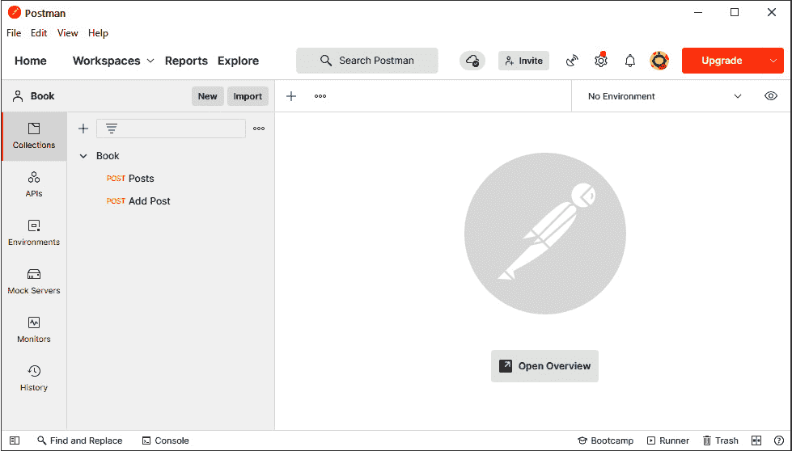
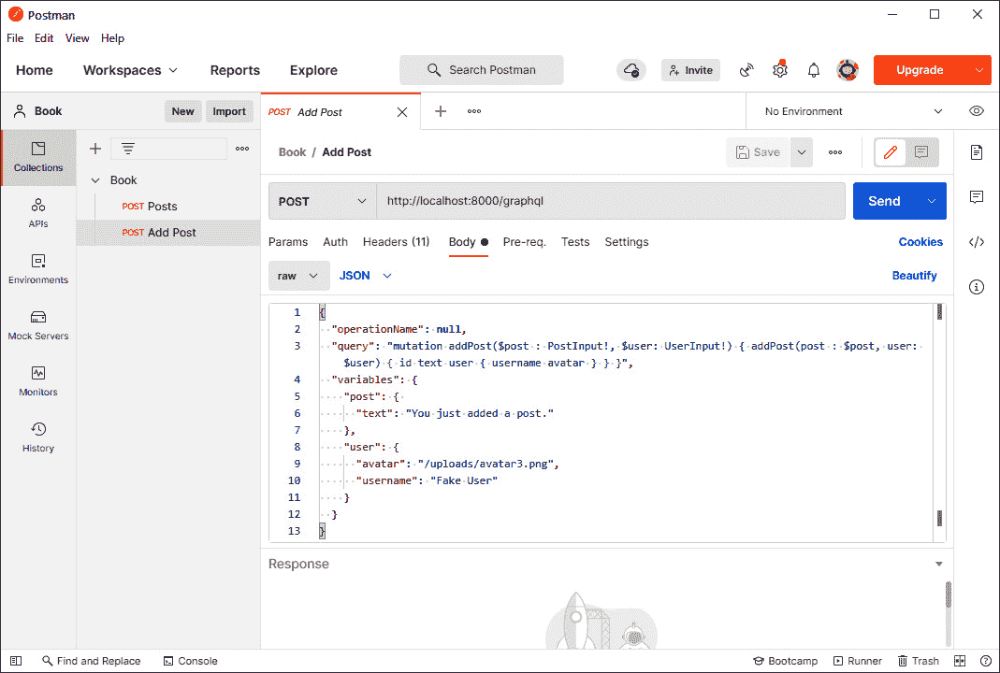
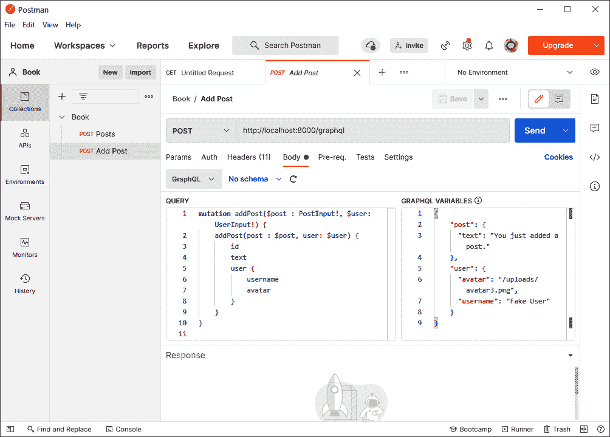

# 第二章：使用 Express.js 设置 GraphQL

我们的前端基本设置和原型现在已完成。现在，我们需要启动我们的 GraphQL 服务器，以便开始实现后端。我们将使用 Apollo 和 Express.js 来构建后端的基础。

本章将解释 Express.js 的安装过程以及我们的 GraphQL 端点的配置。我们将快速浏览 Express.js 的所有基本功能以及我们后端的调试工具。

本章涵盖了以下主题：

+   Express.js 的安装和说明

+   Express.js 中的路由

+   Express.js 中的中间件

+   将 Apollo 服务器绑定到 GraphQL 端点

+   发送我们的第一个 GraphQL 请求

+   后端调试和日志记录

# 技术要求

本章的源代码可在以下 GitHub 仓库中找到：

[`github.com/PacktPublishing/Full-Stack-Web-Development-with-GraphQL-and-React-Second-Edition/tree/main/Chapter02`](https://github.com/PacktPublishing/Full-Stack-Web-Development-with-GraphQL-and-React-Second-Edition/tree/main/Chapter02)

# 开始使用 Node.js 和 Express.js

本书的主要目标之一是设置一个 GraphQL API，然后由我们的 React 前端消费。为了接受网络请求——特别是 GraphQL 请求——我们将设置一个 Node.js 网络服务器。

在 Node.js 网络服务器领域，最显著的竞争对手是 Express.js、Koa 和 Hapi。在这本书中，我们将使用 Express.js。大多数关于 Apollo 的教程和文章都依赖于它。

Express.js 也是目前最常用的 Node.js 网络服务器，它将自己描述为一个 Node.js 网络框架，提供了构建 Web 应用程序所需的所有主要功能。

安装 Express.js 很简单。我们可以像上一章一样使用`npm`：

```js
npm install --save express
```

此命令将 Express.js 的最新版本添加到`package.json`中。

在上一章中，我们直接在`src/client`文件夹中创建了所有 JavaScript 文件。现在，让我们为我们的服务器端代码创建一个单独的文件夹。这种分离给我们一个整洁的目录结构。我们可以使用以下命令创建此文件夹：

```js
mkdir src/server
```

现在，我们可以继续配置 Express.js。

## 设置 Express.js

和往常一样，我们需要一个包含所有主要组件的根文件，以便将它们组合成一个真实的应用程序。

在`server`文件夹中创建一个`index.js`文件。此文件是后端的起点。以下是我们的操作方法：

1.  首先，我们必须从`node_modules`导入`express`，这是我们刚刚安装的：

    ```js
    import express from 'express';
    ```

    我们可以在这里使用`import`，因为我们的后端将被 Babel 转换。我们还将计划在*第九章*中设置 webpack 用于服务器端代码，*实现服务器端渲染*。

1.  接下来，我们必须使用`express`命令初始化服务器。结果存储在`app`变量中。我们后端所做的所有操作都是通过此对象执行的：

    ```js
    const app = express();
    ```

1.  然后，我们必须指定接受请求的路由。在这个简单的介绍中，我们使用`app.get`方法接受所有匹配任何路径的 HTTP `GET`请求。其他 HTTP 方法可以用`app.post`和`app.put`捕获：

    ```js
    app.get('*', (req, res) => res.send('Hello World!'));
    app.listen(8000, () => console.log('Listening on port 8000!'));
    ```

要匹配所有路径，你可以使用星号，它在编程领域中通常代表`任何`，正如我们在前面的`app.get`行中所做的那样。

所有`app.METHOD`函数的第一个参数是要匹配的路径。从这里，你可以提供无限数量的回调函数，它们将依次执行。我们将在*使用 Express.js 进行路由*部分中稍后查看此功能。

回调函数总是将客户端请求作为第一个参数接收，将响应作为第二个参数，这是服务器将要发送的。我们的第一个回调将使用`send`响应方法。

`send`函数仅仅发送 HTTP 响应。它将 HTTP 体设置为指定的内容。因此，在我们的例子中，体显示为`Hello World!`，而`send`函数则负责所有必要的标准 HTTP 头，例如`Content-Length`。

最后一步是告诉 Express.js 服务器应该在哪个端口上监听请求。在我们的代码中，我们使用`app.listen`的第一个参数`8000`。你可以将`8000`替换为你想要监听的任何端口或 URL。当 HTTP 服务器绑定到该端口并且可以接受请求时，将执行回调。

这是我们可以为 Express.js 设置的 simplest 配置。

## 在开发中运行 Express.js

为了启动我们的服务器，我们必须在我们的`package.json`文件中添加一个新的脚本。

让我们在`package.json`文件的`scripts`属性中添加以下行：

```js
"server": "nodemon --exec babel-node --watch src/server src/server/index.js"
```

正如你所见，我们正在使用一个名为`nodemon`的命令。我们首先需要安装它：

```js
npm install --save nodemon
```

`nodemon`是一个运行 Node.js 应用程序的优秀工具。当源代码发生变化时，它可以重新启动你的服务器。

例如，为了使前面的命令生效，请按照以下步骤操作：

1.  首先，我们必须安装`@babel/node`包，因为我们正在使用 Babel 通过`--exec babel-node`选项转译后端代码。这允许我们使用`import`语句：

    ```js
    npm install --save-dev @babel/node
    ```

1.  当使用`nodemon`跟踪路径或文件时，提供`--watch`选项将永久跟踪该文件或文件夹上的更改，并重新加载服务器以表示应用程序的最新状态。最后一个参数指的是实际文件，它是后端启动执行的起点。

1.  启动服务器：

    ```js
    npm run server
    ```

现在，当你打开浏览器并输入`http://localhost:8000`时，你将看到来自我们的 Express.js 回调函数的文本**Hello World!**。

*第三章*，*连接到数据库*，详细介绍了 Express.js 的路由工作原理。

# Express.js 中的路由

理解路由对于扩展我们的后端代码至关重要。在本节中，我们将通过一些简单的路由示例进行实践。

通常，路由处理应用程序如何以及在哪里响应特定的端点和方法。

在 Express.js 中，一个路径可以响应不同的 HTTP 方法，并且可以有多个处理函数。这些处理函数按照它们在代码中指定的顺序依次执行。路径可以是简单的字符串，也可以是复杂的正则表达式或模式。

当你使用多个处理函数时——无论是作为数组提供还是作为多个参数——确保将`next`传递给每个回调函数。当你调用`next`时，你将执行权从当前回调函数传递给行中的下一个函数。这些函数也可以是中间件。我们将在下一节中介绍这一点。

这里有一个简单的例子。用当前的`app.get`行替换它：

```js
app.get('/', function (req, res, next) {
  console.log('first function');
  next();
}, function (req, res) {
  console.log('second function');
  res.send('Hello World!');
});
```

当你刷新浏览器时，查看终端中的服务器日志；你会看到`first function`和`second function`都被打印出来。如果你移除`next`的执行并尝试重新加载浏览器标签页，请求将超时，只有`first function`会被打印出来。这个问题发生是因为没有调用`res.send`、`res.end`或任何替代方法。当不运行`next`时，第二个处理函数永远不会执行。

如我们之前提到的，**Hello World!**消息很好，但不是我们能得到的最好的。在开发中，运行两个独立的服务器——一个用于前端，一个用于后端——是完全可行的。

## 提供我们的生产构建

我们可以通过 Express.js 提供我们的前端生产构建。这种方法对于开发目的来说不是很好，但对于测试构建过程和查看我们的实时应用程序将如何表现是有用的。

再次，用以下代码替换之前的路由示例：

```js
import path from 'path';
const root = path.join(__dirname, '../../');
app.use('/', express.static(path.join(root, 'dist/client')));
app.use('/uploads', express.static(path.join(root, 
  'uploads')));
app.get('/', (req, res) => {
  res.sendFile(path.join(root, '/dist/client/index.html'));
});
```

`path`模块提供了许多用于处理目录结构的函数。

我们使用全局的`__dirname`变量来获取我们的项目根目录。该变量包含当前文件的路径。使用`path.join`与`../../`和`__dirname`一起，我们可以得到我们项目的真实根目录。

Express.js 提供了`use`函数，当给定的路径匹配时，它会运行一系列命令。当不指定路径执行此函数时，它会对每个请求执行。

我们使用这个特性通过`express.static`来提供我们的静态文件（头像图像），包括`bundle.js`和`bundle.css`，这些文件是通过`npm run client:build`创建的。

在我们的情况下，首先，我们使用`express.static`跟随`'/'`。这样做的结果是，`dist`目录中的所有文件和文件夹都以`'/'`开头提供服务。`app.use`的第一个参数中的其他路径，例如`'/example'`，会导致我们的`bundle.js`文件能够在`'/example/bundle.js'`下被下载。

例如，所有头像图像都在`'/uploads/'`下提供服务。

现在，我们已经准备好让客户端下载所有必要的文件。我们客户端的初始路由是 `'/'`，如 `app.get` 所指定。对这个路径的响应是 `index.html`。我们运行 `res.sendFile` 和返回此文件的文件路径——这就是我们在这里要做的全部。

一定要先执行 `npm run client:build`。否则，你将收到一个错误消息，指出这些文件未找到。此外，当运行 `npm run client` 时，`dist` 文件夹将被删除，因此你必须重新运行构建过程。

现在刷新浏览器将显示来自 *第一章*，*准备你的开发环境* 的 *后* 文件和表单。

下一节将重点介绍 Express.js 中间件函数的强大功能。

# 使用 Express.js 中间件

Express.js 提供了编写高效后端的方法，无需重复代码。

每个中间件函数都会接收到一个请求、一个响应和 `next`。它需要运行 `next` 来将控制权传递给下一个处理函数。否则，你将收到一个超时。中间件允许我们预先或后处理请求或响应对象，执行自定义代码，等等。之前，我们已经介绍了 Express.js 中处理请求的简单示例。

Express.js 可以针对同一路径和 HTTP 方法拥有多个路由。中间件可以决定哪个函数应该被执行。

以下代码是一个简单的示例，展示了通常可以用 Express.js 完成的事情。你可以通过替换当前的 `app.get` 路由来测试它。

1.  根路径 `'/'` 用于捕获任何请求：

    ```js
    app.get('/', function (req, res, next) {
    ```

1.  在这里，我们将使用 `Math.random` 在 1 和 10 之间随机生成一个数字：

    ```js
    var random = Math.random() * (10 -1) + 1;
    ```

1.  如果数字大于 `5`，我们将运行 `next('route')` 函数跳转到下一个具有相同路径的 `app.get`：

    ```js
    if (random > 5) next('route')
    ```

    这个路由将记录 `'second'`。

1.  如果数字小于 `0.5`，我们将不带任何参数执行 `next` 函数，并转到下一个处理函数。这个处理函数将记录 `'first'`：

    ```js
      else next()
    }, function (req, res, next) {
      res.send('first');
    })
    app.get('/', function (req, res, next) {
      res.send('second');
    })
    ```

你不需要复制此代码，因为这只是一个解释示例。当涉及到特殊处理，如管理员用户和错误处理时，这个功能可能会很有用。

## 安装重要的中间件

对于我们的应用程序，我们已经在 Express.js 中使用了一个内置的中间件：`express.static`。在这本书中，我们将继续安装其他中间件：

```js
npm install --save compression cors helmet
```

现在，在服务器的 `index.js` 文件中添加新包的 `import` 语句，以便在文件中提供所有依赖项：

```js
import helmet from 'helmet';
import cors from 'cors';
import compress from 'compression';
```

让我们看看这些包的功能以及我们如何使用它们。

## Express Helmet

Helmet 是一个工具，允许你设置各种 HTTP 头来保护你的应用程序。

我们可以在服务器的 `index.js` 文件中如下启用 Express.js Helmet 中间件。在 `app` 变量下方直接添加以下代码片段：

```js
app.use(helmet());
app.use(helmet.contentSecurityPolicy({
  directives: {
    defaultSrc: ["'self'"],
    scriptSrc: ["'self'", "'unsafe-inline'"],
    styleSrc: ["'self'", "'unsafe-inline'"],
    imgSrc: ["'self'", "data:", "*.amazonaws.com"]
  }
}));
app.use(helmet.referrerPolicy({ policy: 'same-origin' }));
```

我们在这里同时做了很多事情。在前面的代码中，我们仅通过在第一行使用`helmet()`函数，就添加了一些`X-Powered-By` HTTP 头信息，以及一些其他有用的东西。

注意

你可以在[`github.com/helmetjs/helmet`](https://github.com/helmetjs/helmet)查找默认参数以及 Helmet 的其他功能。在实现安全功能时，始终保持警觉，并尽你所能验证你的攻击防护方法。

此外，为了确保没有人可以注入恶意代码，我们使用了`Content-Security-Policy` HTTP 头信息，简称 CSP。这个头信息阻止攻击者从外部 URL 加载资源。

如你所见，我们还指定了`imgSrc`字段，这告诉我们的客户端只有来自这些 URL 的图片应该被加载，包括**亚马逊网络服务**（**AWS**）。我们将在*第七章*“处理图片上传”中学习如何将其上传。

你可以在[`helmetjs.github.io/docs/csp/`](https://helmetjs.github.io/docs/csp/)了解更多关于 CSP 以及它如何使你的平台更安全的信息。

最后的增强是设置`Referrer` HTTP 头信息，但仅在向同一主机发出请求时。例如，当我们从域名 A 转到域名 B 时，我们不包含引用者，即用户来自的 URL。这个增强阻止了任何内部路由或请求暴露给互联网。

在你的 Express 路由器中非常高地初始化 Helmet 非常重要，这样所有响应都会受到影响。

## 使用 Express.js 进行压缩

启用 Express.js 的压缩可以为你和你的用户节省带宽，而且这很容易做到。以下代码也必须添加到服务器的`index.js`文件中：

```js
app.use(compress());
```

这个中间件压缩了所有通过它的响应。请记住，在你的路由顺序中将其添加得非常高，以便所有请求都受到影响。

注意

无论何时你都有这样的中间件或多个匹配相同路径的路由，你都需要检查初始化顺序。除非你运行`next`命令，否则只有第一个匹配的路由会被执行。之后定义的所有路由将不会被执行。

## Express.js 中的 CORS

我们希望我们的 GraphQL API 可以从任何网站、应用或系统中访问。一个不错的想法可能是构建一个应用或向其他公司或开发者提供 API，以便他们可以使用它。当你通过 Ajax 使用 API 时，主要问题是 API 需要发送正确的`Access-Control-Allow-Origin`头信息。

例如，如果你构建了 API，在`https://api.example.com`下进行宣传，并且尝试在不设置正确头信息的情况下从`https://example.com`访问它，那么它将不会工作。API 需要在`Access-Control-Allow-Origin`头信息中至少设置`example.com`以允许此域名访问其资源。这看起来有点繁琐，但它使你的 API 能够接受跨站请求，这一点你应该始终注意。

允许 `index.js` 文件：

```js
app.use(cors());
```

此命令一次性处理了我们通常在跨源请求中遇到的所有问题。它仅仅在 `Access-Control-Allow-Origin` 中设置了一个带有 `*` 的通配符，允许来自任何地方的任何人使用您的 API，至少在最初是这样。您始终可以通过提供 API 密钥或仅允许已登录用户访问来保护您的 API。启用 CORS 只允许请求网站接收响应。

此外，该命令还实现了整个应用程序的 `OPTIONS` 路由。

每次我们使用 `CORS` 时，都会进行 `OPTIONS` 方法或请求。这个动作被称为 `OPTIONS` 预检，实际的 `POST` 等方法根本不会被浏览器执行。

我们的应用程序现在已准备好适当地服务所有路由并响应正确的头信息。

现在，让我们设置一个 GraphQL 服务器。

# 结合 Express.js 和 Apollo

首先，我们需要安装 Apollo 和 GraphQL 依赖项：

```js
npm install --save apollo-server-express graphql @graphql-tools/schema 
```

Apollo 提供了一个特定于 Express.js 的包，该包将其自身集成到 web 服务器中。还有一个没有 Express.js 的独立版本。Apollo 允许您使用可用的 Express.js 中间件。在某些情况下，您可能需要为不实现 GraphQL 或无法理解 JSON 响应的专有客户端提供非 GraphQL 路由。仍然有一些原因要提供一些回退到 GraphQL。在这些情况下，您可以依赖 Express.js，因为您已经在使用它了。

为服务创建一个单独的文件夹。一个服务可以是 GraphQL 或其他路由：

```js
mkdir src/server/services/
mkdir src/server/services/graphql
```

在 `graphql` 文件夹中创建一个 `index.js` 文件，作为我们 GraphQL 服务的起点。它必须处理初始化的多项任务。让我们逐个过一遍它们，并将它们添加到 `index.js` 文件中：

1.  首先，我们必须导入 `apollo-server-express` 和 `@graphql-tools/schema` 包：

    ```js
    import { ApolloServer } from 'apollo-server-express';
    import { makeExecutableSchema } from '@graphql-tools/schema';
    ```

1.  接下来，我们必须将 GraphQL 模式与 `resolver` 函数结合。我们必须从单独的文件中导入相应的模式和解析函数。GraphQL 模式是 API 的表示——即客户端可以请求或运行的数据和函数。解析函数是模式的实现。两者都需要匹配。您不能返回不在模式中的字段或运行突变：

    ```js
    import Resolvers from './resolvers';
    import Schema from './schema';
    ```

1.  `@graphql-tools/schema` 包中的 `makeExecutableSchema` 函数将 GraphQL 模式和解析函数合并，解析我们将要写入的数据。当您定义一个不在模式中的查询或突变时，`makeExecutableSchema` 函数会抛出一个错误。生成的模式由我们的 GraphQL 服务器执行，解析数据或运行我们请求的突变：

    ```js
    const executableSchema = makeExecutableSchema({
      typeDefs: Schema,
      resolvers: Resolvers
    });
    ```

1.  我们将其作为 `schema` 参数传递给 Apollo 服务器。`context` 属性包含 Express.js 的 `request` 对象。在我们的解析函数中，如果我们需要，可以访问请求：

    ```js
    const server = new ApolloServer({
      schema: executableSchema,
      context: ({ req }) => req
    });
    ```

1.  此 `index.js` 文件导出初始化的服务器对象，该对象处理所有 GraphQL 请求：

    ```js
    export default server;
    ```

现在我们正在导出 Apollo Server，它需要在其他地方导入。我发现，在服务层有一个 `index.js` 文件很方便，这样我们只有在添加新服务时才依赖于这个文件。

在 `services` 文件夹中创建一个 `index.js` 文件，并输入以下代码：

```js
import graphql from './graphql';
export default {
  graphql,
};
```

上述代码需要从 `graphql` 文件夹中的 `index.js` 文件中导入，并将所有服务重新导出到一个大的对象中。如果我们需要，我们还可以在这里定义更多服务。

为了使我们的 GraphQL 服务器对客户端公开可用，我们将 Apollo Server 绑定到 `/graphql` 路径。

将 `index.js` 文件导入到 `server/index.js` 文件中，如下所示：

```js
import services from './services';
```

`services` 对象只包含 `graphql` 的索引。现在，我们必须使用以下代码将 GraphQL 服务器绑定到 Express.js 网络服务器：

```js
const serviceNames = Object.keys(services);
for (let i = 0; i < serviceNames.length; i += 1) {
  const name = serviceNames[i];
  if (name === 'graphql') {
    (async () => {
      await services[name].start();
      services[name].applyMiddleware({ app });
    })();
  } else {
    app.use('/${name}', services[name]);
  }
}
```

为了方便，我们遍历 `services` 对象的所有索引，并使用索引作为服务将被绑定的路由的名称。对于 `services` 对象中的 `example` 索引，路径将是 `/example`。对于一个典型的服务，例如 REST 接口，我们依赖于 Express.js 的标准 `app.use` 方法。

由于 Apollo Server 有其特殊性，当将其绑定到 Express.js 时，我们需要运行由初始化的 Apollo Server 提供的 `applyMiddleware` 函数，并避免使用 Express.js 的 `app.use` 函数。Apollo 会自动将自己绑定到 `/graphql` 路径，因为这是默认选项。如果您希望它从自定义路由响应，也可以包含一个 `path` 参数。

Apollo Server 要求我们在应用中间件之前运行 `start` 命令。由于这是一个异步函数，我们将整个代码块包裹在一个包装的 `async` 函数中，以便我们可以使用 `await` 语句。

现在还缺少两件事：模式和解析器。一旦我们完成这些，我们将执行一些测试 GraphQL 请求。模式是我们待办事项列表中的下一个任务。

## 编写您的第一个 GraphQL 模式

让我们从在 `graphql` 文件夹内创建一个 `schema.js` 文件开始。您也可以将多个较小的模式缝合成一个较大的模式。这样做会更干净，当您的应用程序、类型和字段增长时，这会更有意义。对于这本书，一个文件就足够了，我们可以将以下代码插入到 `schema.js` 文件中：

```js
const typeDefinitions = '
  type Post {
    id: Int
    text: String
  }
  type RootQuery {
    posts: [Post]
  }
  schema {
    query: RootQuery
  }
';
export default [typeDefinitions];
```

上述代码代表了一个基本的模式，它至少能够从 *第一章*，*准备您的开发环境*，排除用户，提供伪造的帖子数组。

首先，我们必须定义一个新的类型，称为 `Post`。`Post` 类型有一个 `id` 为 `Int` 和一个 `text` 值为 `String`。

对于我们的 GraphQL 服务器，我们需要一个名为`RootQuery`的类型。`RootQuery`类型封装了客户端可以运行的所有查询。它可以是从请求所有帖子到所有用户，仅一个用户的帖子等等。你可以将其与你在常见 REST API 中找到的所有`GET`请求进行比较。路径将是`/posts`、`/users`和`/users/ID/posts`，以表示 GraphQL API 作为 REST API。当使用 GraphQL 时，我们只有一个路由，并且我们以类似 JSON 的对象发送查询。

我们将要执行的第一个查询将返回所有我们拥有的帖子数组。

如果我们查询所有帖子并希望返回每个用户及其对应的帖子，这将是一个子查询，它不会在我们的`RootQuery`类型中表示，而是在`Post`类型本身中。你稍后会看到这是如何实现的。

在类似 JSON 的模式末尾，我们将`RootQuery`添加到`schema`属性中。此类型是 Apollo Server 的起点。

然后，我们将向模式添加 mutation 键，我们将实现一个`RootMutation`类型。它将服务于用户可以运行的所有操作。突变与 REST API 的`POST`、`UPDATE`、`PATCH`和`DELETE`请求相当。

在文件末尾，我们将模式作为一个数组导出。如果我们想的话，我们可以将其他模式推送到这个数组中合并它们。

这里缺少的最后一件事情是我们解析器的实现。

## 实现 GraphQL 解析器

现在模式已经准备好了，我们需要匹配的解析器函数。

在`graphql`文件夹中创建一个`resolvers.js`文件，如下所示：

```js
const resolvers = {
  RootQuery: {
    posts(root, args, context) {
      return []; 
    }, 
  }, 
}; 
export default resolvers;
```

`resolvers`对象持有所有类型作为属性。在这里，我们设置了`RootQuery`，以与我们在模式中相同的方式持有`posts`查询。`resolvers`对象必须等于模式，但必须是递归合并的。如果你想查询子字段，例如帖子的用户，你必须通过包含`user`函数的`Post`对象扩展`resolvers`对象，放在`RootQuery`旁边。

如果我们发送查询所有帖子的请求，`posts`函数将被执行。在那里，你可以做任何你想做的事情，但你需要返回与模式匹配的东西。所以，如果你有一个`posts`数组作为`RootQuery`的响应类型，你不能返回不同的东西，比如只返回一个帖子对象而不是数组。在这种情况下，你会收到一个错误。

此外，GraphQL 检查每个属性的 数据类型。如果`id`被定义为`Int`，你不能返回一个常规的 MongoDB `id`，因为这些 ID 是`String`类型。GraphQL 也会抛出一个错误。

注意

如果值类型匹配，GraphQL 会为你解析或转换特定的数据类型。例如，一个值为`2.1`的`string`可以无问题地解析为`Float`。另一方面，一个空字符串不能转换为`Float`，并且会抛出一个错误。直接拥有正确的数据类型会更好，因为这可以节省你转换，并防止出现不希望的问题。

为了证明一切正常工作，我们将通过向我们的服务器执行实际的 GraphQL 请求来继续。我们的 `posts` 查询将返回一个空数组，这是 GraphQL 的正确响应。我们稍后会回到 `resolver` 函数。你应该能够重新启动服务器，这样我们就可以发送一个演示请求。

## 发送 GraphQL 查询

我们可以使用任何 HTTP 客户端来测试这个查询，例如 Postman、Insomnia 或你习惯使用的任何客户端。下一节将介绍 HTTP 客户端。如果你想要自己发送以下查询，那么你可以阅读下一节，然后回到这里。

当你将以下 JSON 作为 `POST` 请求发送到 `http://localhost:8000/graphql` 时，你可以测试我们的新函数：

```js
{
  "operationName": null,
  "query": "{ 
    posts { 
      id
      text 
    }
  }", 
  "variables": {} 
}
```

`operationName` 字段不是运行查询所必需的，但它对于日志记录非常有用。

`query` 对象是我们想要执行的查询的类似 JSON 的表示。在这个例子中，我们运行 `RootQuery` 帖子并请求每个帖子的 `id` 和 `text` 字段。我们不需要指定 `RootQuery`，因为它是我们 GraphQL API 的最高层。

`variables` 属性可以存储我们想要通过它来过滤帖子的用户 ID 等参数。如果你想要使用变量，它们也需要通过它们的名称在查询中定义。

对于不习惯使用 Postman 等工具的开发者，还有一个选项可以在单独的浏览器标签页中打开 `/graphql` 端点。你将看到一个专为轻松发送查询而制作的 GraphQLi 实例。在这里，你可以插入 `query` 属性的内容，然后点击播放按钮。由于我们设置了 Helmet 来保护我们的应用程序，我们需要在开发中将其停用。否则，GraphQLi 实例将无法工作。只需将完整的 Helmet 初始化用以下花括号中的 `if` 语句包裹在 `server/index.js` 文件中：

```js
if(process.env.NODE_ENV === 'production')
```

这个简短的条件只在开发环境中激活 Helmet。现在，你可以使用 GraphQLi 或任何 HTTP 客户端发送请求。

当与前面的主体结合时，`POST` 请求的响应应该如下所示：

```js
{
  "data": { 
    "posts": [] 
  } 
}
```

这里，我们收到了预期的空帖子数组。

进一步来说，我们想要以我们客户端中静态编写的假数据作为响应，使其看起来像是来自我们的后端。从上面的 `App.js` 中复制 `initialPosts` 数组到 `resolvers` 对象上方，但将其重命名为 `posts`。我们可以用这个填充的 `posts` 数组来响应 GraphQL 请求。

将 GraphQL resolvers 中的 `posts` 函数内容替换为以下内容：

```js
return posts;
```

你可以重新运行 `POST` 请求并接收两个假帖子。响应不包括我们假数据中的用户对象，因此我们必须在我们的模式中的 `post` 类型上定义一个用户属性来解决这个问题。

## 在 GraphQL 模式中使用多个类型

让我们创建一个 `User` 类型并将其与我们的帖子一起使用。首先，将其添加到模式中：

```js
type User {
  avatar: String
  username: String
}
```

现在我们有了 `User` 类型，我们需要在 `Post` 类型中使用它。按照以下方式将其添加到 `Post` 类型中：

```js
user: User
```

`user`字段允许我们在我们的帖子中有一个子对象，以及帖子的作者信息。

我们用来测试这个功能的扩展查询看起来是这样的：

```js
"query":"{
  posts {
    id
    text
    user {
      avatar
      username
    }
  }
}"
```

你不能仅仅指定用户作为查询的属性。相反，你需要提供一个字段的子选择。当你有多个 GraphQL 类型嵌套在一起时，这是必需的。然后，你需要选择结果应包含的字段。

执行更新后的查询会给我们假数据，这些数据我们已经在我们的前端代码中有了；只是`posts`数组原样。

我们在查询数据方面已经取得了良好的进展，但我们还希望能够添加和更改数据。

## 编写你的第一个 GraphQL 突变

我们的客户端已经提供的一项服务是暂时向假数据中添加新帖子。我们可以在后端通过使用 GraphQL 突变来实现这一点。

从架构开始，我们需要添加突变，以及输入类型，如下所示：

```js
input PostInput {
  text: String!
}
input UserInput {
  username: String!
  avatar: String!
}
type RootMutation {
  addPost (
    post: PostInput!
    user: UserInput!
  ): Post
}
```

GraphQL 输入不外乎是类型。突变可以在请求内部使用它们作为参数。它们可能看起来很奇怪，因为我们的当前输出类型看起来几乎相同。然而，在`PostInput`上有一个`id`属性，例如，这是不正确的，因为后端选择 ID，客户端无法提供它。因此，为输入和输出类型保留单独的对象是有意义的。

接收我们两个新必需输入类型`PostInput`和`UserInput`的`addPost`函数是一个新功能。这些函数被称为突变，因为它们会改变应用程序的当前状态。对此突变的响应是一个普通的`Post`对象。当使用`addPost`突变创建新帖子时，我们将直接从后端获取创建的帖子作为响应。

架构中的感叹号告诉 GraphQL 该字段是一个必需的参数。

`RootMutation`类型对应于`RootQuery`类型，是一个包含所有 GraphQL 突变的对象。

最后一步是启用 Apollo Server 的架构中的突变，通过将`RootMutation`类型应用到`schema`对象：

```js
schema {
  query: RootQuery
  mutation: RootMutation
}
```

注意

通常，客户端不会在突变中发送用户。这是因为用户在添加帖子之前先进行认证，通过这种方式，我们已经知道哪个用户发起了 Apollo 请求。然而，我们暂时忽略这一点，稍后在*第六章*中实现认证，*使用 Apollo 和 React 进行认证*。

现在，需要在我们名为`resolvers.js`的文件中实现`addPost`解析器函数。

将以下`RootMutation`对象添加到`resolvers.js`中的`RootQuery`：

```js
RootMutation: {
  addPost(root, { post, user }, context) {
    const postObject = { 
      ...post,
      user,
      id: posts.length + 1,
    };
    posts.push(postObject);
    return postObject;
  },
},
```

此解析器从突变参数中提取`post`和`user`对象，这些参数作为函数的第二个参数传入。然后，我们构建`postObject`变量。我们希望通过解构`post`输入并添加`user`对象来将我们的`posts`数组作为属性添加。`id`字段只是`posts`数组的长度加一。

现在，`postObject`变量看起来就像`posts`数组中的`post`。我们的实现与前端已经做的相同。我们的`addPost`函数的返回值是`postObject`。为了使其工作，您需要将`posts`数组的初始化从`const`更改为`let`。否则，数组将是静态的，不可更改。

您可以通过您喜欢的 HTTP 客户端运行此突变，如下所示：

```js
{
  "operationName": null,
  "query": "mutation addPost($post : PostInput!, 
    $user: UserInput!) {
    addPost(post : $post, user: $user) { 
      id
      text
      user {
        username
        avatar
      }
    }
  }",
  "variables": {
    "post": { 
      "text": "You just added a post."
    },
    "user": {
      "avatar": "/uploads/avatar3.png",
      "username": "Fake User"
    }
  }
}
```

首先，我们将单词`mutation`和实际要运行的函数名——在这个例子中是`addPost`——包括在`query`属性内的响应字段选择，传递给用于帖子数据的常规数据查询。

其次，我们使用`variables`属性来发送我们想要插入后端的数据。我们需要将它们作为参数包含在`query`字符串中。我们可以在`operation`字符串中定义这两个参数，使用美元符号和期待的数据类型。带有美元符号的变量随后会被映射到我们希望在后端触发的实际操作。

当我们发送这个突变时，请求将包含一个`data`对象，包括一个`addPost`字段。`addPost`字段包含我们随请求发送的帖子。

如果您再次查询帖子，您将看到现在有三个帖子。太好了——它成功了！

就像我们的客户端一样，这只是一个临时的，直到我们重启服务器。我们将在*第三章*“连接到数据库”中介绍如何在 SQL 数据库中持久化数据。

接下来，我们将介绍您调试后端的各种方法。

# 后端调试和日志记录

调试有两个非常重要的事情。首先，我们需要为后端实现日志记录，以防我们收到用户的错误，其次，我们需要查看 Postman 来有效地调试 GraphQL API。

那么，让我们开始记录日志。

## Node.js 中的日志记录

Node.js 中最受欢迎的日志包叫做`winston`。按照以下步骤安装和配置`winston`：

1.  使用`npm`安装`winston`：

    ```js
    npm install --save winston
    ```

1.  接下来，为后端的所有辅助函数创建一个新的文件夹：

    ```js
    mkdir src/server/helpers
    ```

1.  然后，在新的文件夹中插入一个`logger.js`文件，内容如下：

    ```js
    import winston from 'winston';
    let transports = [
      new winston.transports.File({
        filename: 'error.log',
        level: 'error',
      }),
      new winston.transports.File({
        filename: 'combined.log',
        level: 'verbose',
      }),
    ];
    if (process.env.NODE_ENV !== 'production') {
      transports.push(new winston.transports.Console());
    }
    const logger = winston.createLogger({
      level: 'info',
      format: winston.format.json(),
      transports,
    });
    export default logger;
    ```

此文件可以在我们想要记录日志的任何地方导入。

在前面的代码中，我们为`winston`定义了标准的`transports`。传输不过是`winston`如何将不同的日志类型分开并保存到不同的文件中。

第一个`transport`生成一个`error.log`文件，其中只保存真实错误。

第二个传输是一个组合日志，我们将保存所有其他日志消息，例如警告或信息日志。

如果我们在开发环境中运行服务器，我们现在就是这样做的，我们必须添加第三个传输。同时，我们将在服务器开发期间直接将所有消息记录到控制台。

大多数习惯于 JavaScript 开发的人都知道`console.log`的困难。通过直接使用`winston`，我们可以在终端中看到所有消息，但我们也无需从`console.log`中清理代码，只要我们记录的内容有意义即可。

为了测试这一点，我们可以在唯一的变异中尝试`winston`记录器。

在`resolvers.js`文件顶部添加以下代码：

```js
import logger from '../../helpers/logger';
```

现在，我们可以在`return`语句之前添加以下内容来扩展`addPost`函数：

```js
logger.log({ level: 'info', message: 'Post was created' });
```

当您现在发送变异时，您将看到消息被记录到控制台。

此外，如果您查看项目的根目录，您将看到`error.log`和`combined.log`文件。`combined.log`文件应包含来自控制台的操作日志。

现在我们能够记录服务器上的所有操作，我们应该探索 Postman，以便我们可以舒适地发送请求。

## 使用 Postman 进行调试

**Postman**是现有最广泛使用的 HTTP 客户端之一。它不仅提供了原始 HTTP 客户端功能，还提供了团队和集合，并允许您同步在 Postman 中保存的所有请求。

您可以通过从[`www.postman.com/downloads/`](https://www.postman.com/downloads/)下载适当的文件来安装 Postman。

注意

许多其他 HTTP 客户端工具对调试您的应用程序很有用。您可以使用您选择的工具。我使用的其他一些优秀客户端包括 Insomnia、SoapUI 和 Stoplight，但还有很多。在我看来，本书我们将使用 Postman，因为它是最受欢迎的。

安装完成后，它应该看起来像这样：



图 2.1 – 安装 Book 集合后的 Postman 屏幕

如您所见，我已在左侧面板中创建了一个名为**Book**的集合。这个集合包括我们的两个请求：一个请求所有帖子，一个添加新帖子。

例如，以下截图显示了在 Postman 中**添加帖子**变异的外观：



图 2.2 – Postman 中的添加帖子变异

URL 是`localhost`，包括预期的端口`8000`。

请求体看起来与之前我们看到的基本相同。请确保在`raw`格式旁边选择`Content-Type`为`application/json`。

注意

在我的情况下，我需要将查询内联编写，因为 Postman 无法处理 JSON 中的多行文本。如果您的情况不是这样，请忽略它。

由于 Postman 的新版本发布，现在也有选择 GraphQL 而不是 JSON 的选项。如果您这样做，您可以在多行中编写 GraphQL 代码，并在单独的窗口中编写变量。结果应该看起来像这样：



图 2.3 – 选择 GraphQL 的 Postman

如果你添加了一个新的请求，你可以使用 *Ctrl* + *S* 快捷键来保存它。你需要选择一个集合和一个名称来保存。使用 Postman（至少在使用 GraphQL API 时）的一个主要缺点是我们只使用 `POST`。如果能有一种方式来表明我们在做什么那就太好了——例如，一个查询或一个变更。一旦我们实现了它，我们就会学习如何在 Postman 中使用授权。

Postman 还拥有其他一些出色的功能，例如自动化测试、监控和模拟假服务器。

在本书的后面部分，为所有请求配置 Postman 将变得更加复杂。在这种情况下，我喜欢使用 Apollo Client 开发者工具，它们完美地集成到前端并利用 Chrome 开发者工具。Apollo Client 开发者工具的伟大之处在于，它们使用我们在前端代码中配置的 Apollo Client，这意味着它们重用了我们嵌入到前端中的认证。

# 摘要

在本章中，我们使用 Express.js 设置了我们的 Node.js 服务器，并将 Apollo Server 绑定到响应 GraphQL 端点的请求。我们可以处理查询，返回假数据，并通过 GraphQL 变更来修改数据。

此外，我们可以在我们的 Node.js 服务器中记录每个进程。使用 Postman 调试应用程序会导致经过良好测试的 API，这可以在我们前端后续使用。

在下一章中，我们将学习如何在 SQL 服务器中持久化数据。我们还将实现 GraphQL 类型的模型，并涵盖数据库迁移。我们需要用 Sequelize 通过查询替换我们当前的 `resolver` 函数。

有很多工作要做，所以请继续阅读以获取更多信息！
