# 第十二章：使用 CircleCI 和 AWS 进行持续部署

在最后两章中，我们通过 Mocha 测试准备我们的应用程序。我们已经构建了一个适用于生产环境的应用程序。

我们现在将生成一个准备就绪的生产构建版本，以便部署。我们已经到达了可以设置 **Amazon Elastic Container Service** （**Amazon ECS**）并实现通过持续部署工作流程构建和部署 Docker 镜像的阶段。

持续部署的过程将有助于保持生产环境中的更改较小。保持应用程序中的更改持续且小，将使问题可追踪和可修复，而一次性发布一组多个功能将留下错误的位置供调查，因为仅通过一个发布就会有许多事情发生变化。

本章涵盖了以下主题：

+   生产就绪的打包

+   什么是 Docker？

+   配置 Docker

+   设置 AWS RDS（即 **AWS 关系数据库服务**）作为生产数据库

+   什么是持续集成/持续部署？

+   设置 CircleCI 的持续部署

+   将我们的应用程序部署到 **Amazon Elastic Container Registry** （**Amazon ELB**）和 ECS，使用 AWS **应用程序负载均衡器** （**ALB**）

# 技术要求

本章的源代码可在以下 GitHub 仓库中找到：

[`github.com/PacktPublishing/Full-Stack-Web-Development-with-GraphQL-and-React-2nd-Edition/tree/main/Chapter12`](https://github.com/PacktPublishing/Full-Stack-Web-Development-with-GraphQL-and-React-2nd-Edition/tree/main/Chapter12)

# 准备最终的生产构建

我们已经走了很长的路才到达这里。现在是时候审视我们当前如何运行我们的应用程序以及我们应该如何为生产环境做准备的时候了。

目前，我们在开发环境中使用我们的应用程序，同时对其进行工作。它没有针对性能或低带宽使用进行高度优化。我们在代码中包含开发功能，以便我们可以正确地调试它。

在实际生产环境中使用时，我们应该只包含用户所需的内容。当将 `NODE_ENV` 变量设置为 `production` 时，我们将移除大部分不必要的开发机制。

通过打包我们的服务器端代码，我们将消除不必要的加载时间并提高性能。为了打包我们的后端代码，我们将设置一个新的 webpack 配置文件。请按照以下说明操作：

1.  安装以下两个依赖项：

    ```js
    npm install --save-dev webpack-node-externals @babel/plugin-transform-runtime
    ```

    这些包执行以下操作：

    +   `webpack-node-externals` 包在您使用 webpack 打包应用程序时提供了排除特定模块的选项。它减少了最终的包大小。

    +   `@babel/plugin-transform-runtime` 包是一个小的插件，它使我们能够重用 Babel 的辅助方法，这些方法通常会被插入到每个处理的文件中。它减少了最终的包大小。

1.  在其他 webpack 文件旁边创建一个`webpack.server.build.config.js`文件，内容如下：

    ```js
    const path = require('path');
    const nodeExternals = require('webpack-node-externals');
    const buildDirectory = 'dist/server';
    module.exports = {
      mode: 'production',
      entry: [
        './src/server/index.js'
      ],
      output: {
        path: path.join(__dirname, buildDirectory),
        filename: 'bundle.js',
        publicPath: '/server'
      },
      module: {
        rules: [{
          test: /\.js$/,
          use: {
            loader: 'babel-loader',
            options: {
              plugins: ["@babel/plugin-transform-runtime"]
            }
          },
        }],
      },
      node: {
        __dirname: false,
        __filename: false,
      },
      target: 'node',
      externals: [nodeExternals()],
      plugins: [],
    };
    ```

    上述配置文件非常简单，并不复杂。让我们看看我们用来配置 webpack 的设置：

    +   我们在顶部加载了新的`webpack-node-externals`包。

    +   我们保存包的`build`目录位于`dist`文件夹内，一个特殊的`server`文件夹中。

    +   `mode`字段设置为`'production'`。

    +   webpack 的`entry`点是服务器的根`index.js`文件。

    +   `output`属性包含打包我们的代码的标准字段，并将它保存在通过`buildDirectory`变量指定的文件夹内。

    +   我们在`module`属性中使用之前安装的`@babel/plugin-transform-runtime`插件来减少我们的包文件大小。

    +   在`node`属性内部，你可以设置 Node.js 特定的配置选项。`__dirname`字段告诉 webpack 全局的`__dirname`变量使用默认设置，并且没有被 webpack 自定义。对于`__filename`属性也是如此。

    +   `target`字段接受多个环境，其中生成的包应该在这些环境中工作。在我们的案例中，我们将其设置为`'node'`，因为我们想在 Node.js 中运行我们的后端。

    +   `externals`属性给我们提供了排除特定依赖项从我们的包中的可能性。通过使用`webpack-node-externals`包，我们防止了所有`node_modules`包被包含在我们的包中。

1.  为了使用我们新的构建配置文件，我们在`package.json`文件的`scripts`字段中添加了两个新的命令。因为我们试图生成一个可以公开的最终生产构建，我们必须并行构建我们的客户端代码。将以下两行添加到`package.json`文件的`scripts`字段：

    ```js
    "build": "npm run client:build && npm run server:build",
    "server:build": "webpack --config webpack.server.build.config.js"
    ```

    `build`命令使用`&&`语法来链式执行两个`npm run`命令。它首先执行客户端代码的构建过程，然后打包整个服务器端代码。结果是我们在`dist`文件夹中有一个包含`client`文件夹和`server`文件夹的完整文件夹。两者都可以动态导入组件。

1.  为了使用新的生产代码启动我们的服务器，我们将在`scripts`字段中添加一个额外的命令。旧的`npm run server`命令会启动未打包的服务器端代码，这不是我们想要的。将以下行插入到`package.json`文件中：

    ```js
    "server:production": "node dist/server/bundle.js"
    ```

    上述命令简单地从`dist/server`文件夹执行`bundle.js`文件，使用普通的`node`命令启动我们的后端。

    现在，你应该可以通过运行`npm run build`来生成你的最终构建。然而，在开始作为测试启动生产服务器之前，请确保你已经正确设置了所有数据库的环境变量，例如`JWT_SECRET`。然后，你可以执行`npm run server:production`命令来启动后端。

1.  我们需要以反映相同生产条件的方式运行测试，因为只有这样我们才能验证所有在实时环境中启用的功能都能正确工作。为了确保这一点，我们需要改变执行测试的方式。编辑`package.json`文件中的`test`命令以反映此更改，如下所示：

    ```js
    "test": "npm run build && mocha --exit test/ --require babel-hook --require @babel/polyfill --recursive",
    ```

    现在，你应该能够使用生成的生产包测试你的应用程序。

在下一节中，我们将介绍如何使用 Docker 捆绑整个应用程序。

# 设置 Docker

发布应用程序是一个关键步骤，需要大量的工作和细心。在发布新版本时，许多事情可能会出错。我们已经确保在应用程序上线之前可以对其进行测试。

将我们的本地文件转换成生产就绪包的实际操作，然后将其上传到服务器，这是最繁重的工作。常规应用程序通常依赖于预先配置了应用程序运行所需所有包的服务器。例如，在查看标准的 PHP 设置时，大多数人会租用一个预先配置的服务器。这意味着 PHP 运行时，包括所有扩展，如 MySQL PHP 库，都是通过操作系统的内置包管理器安装的。这个程序不仅适用于 PHP，也适用于几乎所有其他编程语言。这可能适用于一般的网站或不太复杂的应用程序，但对于专业软件开发或部署，这个过程可能会导致以下问题：

+   配置必须由了解应用程序和服务器本身需求的人来完成。

+   第二个服务器需要相同的配置才能允许我们的应用程序运行。在执行此配置时，我们必须确保所有服务器都是标准化的，并且彼此一致。

+   当运行时环境更新时，所有服务器都必须重新配置，无论是由于应用程序需要，还是由于其他原因，如安全更新。在这种情况下，必须再次进行测试。

+   在同一服务器环境中运行的多个应用程序可能需要不同的包版本，或者可能相互干扰。

+   部署过程必须由具备所需知识的人执行。

+   在服务器上直接启动应用程序会使其暴露于服务器上运行的所有服务。由于它们在相同的环境中运行，其他进程可能会接管你的完整应用程序。

+   此外，应用程序的使用并不限于服务器资源的指定最大值。

许多人试图通过引入新的容器化和部署工作流程来避免这些后果。

## 什么是 Docker？

最重要的软件之一被称为 Docker。它于 2013 年发布，其功能是通过提供自己的运行时环境来在容器内隔离应用程序，而不需要访问服务器本身。

容器的目的是将应用程序从服务器的操作系统隔离出来。

标准虚拟机也可以通过为应用程序运行一个客户操作系统来完成这项任务。在虚拟机内部，所有包和运行时都可以安装，以便为您的应用程序做准备。当然，这种解决方案伴随着显著的开销，因为我们正在运行一个仅用于我们应用程序的第二个操作系统。当涉及许多服务或多个应用程序时，这种方案是不可扩展的。

另一方面，Docker 容器的工作方式完全不同。应用程序本身及其所有依赖项都从操作系统的资源中获取一个部分。所有进程都在这些资源内部由主机系统隔离。

任何支持容器运行时环境（即 Docker）的服务器都可以运行您的 docker 化应用程序。好处在于实际的操作系统被抽象化了。您的操作系统将会非常精简，因为除了内核和 Docker 之外，不需要其他任何东西。

使用 Docker，开发者可以指定容器镜像的组成方式。他们可以直接在他们的基础设施上测试和部署这些镜像。

为了看到 Docker 提供的过程和优势，我们将构建一个包含我们的应用程序及其运行所需的所有依赖项的容器镜像。

## 安装 Docker

与任何虚拟化软件一样，Docker 必须通过操作系统的常规包管理器进行安装。

我将假设您正在使用基于 Debian 的系统。如果不是这种情况，请前往 [`docs.docker.com/install/overview/`](https://docs.docker.com/install/overview/) 获取您系统的正确说明。

按照以下说明继续操作，以启动并运行 Docker：

1.  按照以下步骤更新您的系统包管理器：

    ```js
    sudo apt-get update
    ```

1.  我们可以按照以下步骤在我们的系统上安装 Docker 包：

    ```js
    sudo apt-get install docker
    ```

    如果您正在运行已安装 snap 的 Ubuntu 版本，您还可以使用以下命令：

    ```js
    sudo snap install docker
    ```

这就是要在您的系统上获取一个可工作的 Docker 复制品所需的所有内容。

接下来，您将通过构建您的第一个 Docker 容器镜像来学习如何使用 Docker。

## Docker 化您的应用程序

许多公司已经采用 Docker 并替换了他们的旧基础设施设置，从而在很大程度上减少了系统管理。然而，在将应用程序直接部署到生产之前，还有一些工作要做。

一个主要任务是将您的应用程序 docker 化。术语 **dockerize** 意味着您需要负责将应用程序包裹在一个有效的 Docker 容器内。

有许多服务提供商将 Docker 与 CI 或持续部署连接起来，因为它们可以很好地协同工作。在本章的最后部分，你将了解什么是持续部署以及如何实现它。我们将依赖这样的服务提供商。它将为我们提供持续部署过程的自动工作流程。让我们首先开始将我们的应用程序 docker 化。

### 编写你的第一个 Dockerfile

生成应用程序 Docker 镜像的传统方法是，在项目的根目录下创建一个 `Dockerfile`。但 `Dockerfile` 是做什么用的？

`Dockerfile` 是一系列通过 Docker **命令行界面**（**CLI**）运行的命令。此类文件中的典型工作流程如下：

1.  `Dockerfile` 从一个基础镜像开始，使用 `FROM` 命令导入。这个基础镜像可能包括运行时环境，如 Node.js，或者你的项目可以利用的其他东西。容器镜像从 Docker Hub 下载，Docker Hub 是一个中心容器注册表，你可以在 [`hub.docker.com/`](https://hub.docker.com/) 找到它。也有从自定义注册表中下载镜像的选项。

1.  Docker 提供了许多命令来与镜像和应用程序代码进行交互。这些命令可以在 [`docs.docker.com/engine/reference/builder/`](https://docs.docker.com/engine/reference/builder/) 中查找。

1.  在镜像配置完成并且所有构建步骤完成后，你需要提供一个命令，当你的应用程序的 Docker 容器启动时将执行该命令。

1.  构建步骤的结果将是一个新的 Docker 镜像（见 *图 12.1*）。该镜像保存在生成它的机器上。

1.  可选地，你现在可以将你的新镜像发布到注册表中，其他应用程序或用户可以拉取你的镜像。你也可以将它们作为私有镜像或私有注册表上传。

我们将首先生成一个简单的 Docker 镜像。首先，在你的项目根目录下创建 `Dockerfile`。文件名没有写任何文件扩展名。

第一项任务是找到一个匹配的基础镜像，我们可以用它来构建我们的项目。我们选择基础镜像的标准是依赖项和运行时环境。由于我们主要使用了 Node.js，没有依赖任何其他需要在 Docker 容器中覆盖的服务端包，我们只需要找到一个提供 Node.js 的基础镜像。目前，我们将忽略数据库，稍后我们将在后续步骤中再次关注它。

Docker Hub 是官方的容器镜像注册表，提供许多最小化镜像。只需在我们的新 `Dockerfile` 中插入以下行，位于我们项目的根目录下：

```js
FROM node:14
```

正如我们之前提到的，我们使用`FROM`命令下载基础镜像。正如前面镜像的名称所表明的，它包含 Node.js 版本 14。您还可以使用许多其他版本。除了不同的版本之外，您还可以找到不同的风味（例如，基于 Alpine Linux 的 Node.js 镜像）。查看镜像的`README`以了解可用的选项，请访问[`hub.docker.com/_/node/`](https://hub.docker.com/_/node/)。

重要提示

我建议您阅读`Dockerfile`的参考文档。那里解释了许多高级命令和场景，这将帮助您自定义 Docker 工作流程。只需访问[`docs.docker.com/engine/reference/builder/`](https://docs.docker.com/engine/reference/builder/)即可。

在 Docker 运行了`FROM`命令之后，您将直接在这个基础镜像中工作，并且所有后续命令都将在这个环境中运行。您可以访问底层操作系统提供的所有功能。当然，这些功能受您选择的镜像限制。只有以`FROM`命令开始的`Dockerfile`才是有效的。

我们`Dockerfile`的下一步是创建一个新的文件夹，应用程序将存储并在此运行。将以下行添加到`Dockerfile`中：

```js
WORKDIR /usr/src/app
```

`WORKDIR`命令将目录更改为指定的路径。您输入的路径位于镜像的文件系统中，不会影响您的计算机文件系统。从那时起，`RUN`、`CMD`、`ENTRYPOINT`、`COPY`和`ADD`Docker 命令将在新的工作目录中执行。此外，如果该文件夹不存在，`WORKDIR`命令将创建一个新的文件夹。

接下来，我们需要将我们的应用程序代码放入新文件夹中。到目前为止，我们只确保加载了基础镜像。我们正在生成的镜像还没有包含我们的应用程序。Docker 提供了一个命令将我们的代码移动到最终镜像中。

在我们的`Dockerfile`的第三行中添加以下代码：

```js
COPY . .
```

`COPY`命令接受两个参数。第一个参数是源，可以是文件或文件夹。第二个参数是镜像文件系统中的目标路径。您可以使用正则表达式的一个子集来过滤复制的文件或文件夹。

在 Docker 执行了前面的命令之后，当前目录中所有存在的文件内容都将被复制到`/usr/src/app`路径。在这个例子中，当前目录是我们的项目文件夹的根目录。现在所有文件都自动包含在最终的 Docker 镜像中。您可以通过所有 Docker 命令以及 shell 提供的命令与这些文件进行交互。

一个重要的任务是安装我们应用程序所依赖的所有`npm`包。当运行`COPY`命令时，例如在前面代码中，所有文件和文件夹都会被传输，包括`node_modules`文件夹。然而，这可能会在尝试运行应用程序时导致问题。许多`npm`包在安装时会进行编译，或者它们会在不同的操作系统之间进行区分。我们必须确保我们使用的包是干净的，并且在我们希望它们工作的环境中工作。为了实现这一点，我们必须做两件事，如下所示：

1.  在项目文件夹的根目录中创建一个`.dockerignore`文件，位于`Dockerfile`旁边，并输入以下内容：

    ```js
    node_modules
    ```

    `.dockerignore`文件类似于`.gitignore`文件，它排除特殊文件或文件夹不被 Git 跟踪。Docker 在将所有文件发送到 Docker 守护进程之前读取`.dockerignore`文件。如果它能够读取有效的`.dockerignore`文件，则所有指定的文件和文件夹都将被排除。前面的两行排除了整个`node_modules`文件夹。

1.  在 Docker 内部安装`npm`包。将以下代码行添加到`Dockerfile`中：

    ```js
    RUN command executes npm install inside of the current working directory. The related package.json file and node_modules folder are stored in the filesystem of the Docker image. Those files are directly committed and are included in the final image. Docker's RUN command sends the command that we pass as the first parameter into Bash and executes it. To avoid the problems of spaces in the shell commands, or other syntax problems, you can pass the command as an array of strings, which will be transformed by Docker into valid Bash syntax. Through RUN, you can interact with other system-level tools (such as apt-get or curl).Now that all files and dependencies are in the correct filesystem, we can start Graphbook from our new Docker image. Before doing so, there are two things that we need to do – we have to allow for external access to the container via the IP and define what the container should do when it has started.
    ```

1.  Graphbook 默认使用端口`8000`，在此端口下它监听传入的请求，无论是 GraphQL 还是普通 Web 请求。当运行 Docker 容器时，它会获得自己的网络，包括 IP 和端口。我们必须确保端口`8000`对公众可用，而不仅仅是容器内部。在`Dockerfile`的末尾插入以下行，以便从容器外部访问端口：

    ```js
    EXPOSE 8000
    ```

    你必须理解`EXPOSE`命令不会将容器内部的端口`8000`映射到我们的工作机的匹配端口。通过编写`EXPOSE`命令，你给使用该镜像的开发者提供了将端口`8000`发布到运行容器的真实机器上的任何端口的选项。映射是在启动容器时完成的，而不是在构建镜像时。在本章的后面部分，我们将探讨如何将端口`8000`映射到你的本地机器上的端口。

1.  最后，我们必须告诉 Docker 容器启动后应该做什么。在我们的例子中，我们希望启动我们的后端（包括 SSR）。由于这是一个简单的示例，我们将启动开发服务器。

    添加`Dockerfile`的最后一行，如下所示：

    ```js
    CMD [ "npm", "run", "server" ]
    ```

    `CMD`命令定义了我们的容器启动的方式以及要运行的命令。我们使用 Docker 的`exec`选项传递字符串数组。`Dockerfile`只能有一个`CMD`命令。使用`CMD`时，`exec`格式不会运行 Bash 或 shell 命令。

    容器执行`package.json`文件中的`server`脚本，该脚本已被复制到 Docker 镜像中。

到目前为止，一切都已经完成并准备好生成基本的 Docker 镜像。接下来，我们将继续进行获取并运行容器。

## 构建和运行 Docker 容器

`Dockerfile` 和 `.dockerignore` 文件已准备就绪。Docker 为我们提供了生成真实镜像的工具，我们可以运行或与他人共享这个镜像。仅仅拥有一个`Dockerfile`并不能使应用程序实现 Docker 化。

确保在`/server/config/index.js`文件中指定的后端数据库凭据对开发有效，因为它们被静态保存在那里。此外，MySQL 主机必须允许容器内部的远程连接。

在您的本地机器上构建 Docker 镜像，请执行以下命令：

```js
docker build -t sgrebe/graphbook .
```

此命令要求您已安装 Docker CLI 和守护进程。

我们使用的第一个选项是`-t`，后面跟着一个字符串（在我们的例子中，是`sgrebe/graphbook`）。构建完成的镜像将被保存在用户名`sgrebe`和应用程序名`graphbook`下。这段文本也被称为`tag`。`docker build`命令的唯一必需参数是构建上下文，即 Docker 用于容器的文件集。我们通过在命令末尾添加点来指定当前目录作为构建上下文。此外，`build`操作期望`Dockerfile`位于此文件夹内。如果您想从其他地方获取文件，可以使用`--file`选项指定。

重要提示

如果`docker build`命令失败，可能是因为缺少一些环境变量。它们通常包括 Docker 守护进程的 IP 和端口。要查找它们，请执行`docker-machine env`命令，并设置命令返回的环境变量。

当命令完成镜像生成后，它应该在本地上可用。为了证明这一点，您可以通过运行以下命令使用 Docker CLI：

```js
docker images
```

Docker 的输出应该如下所示：

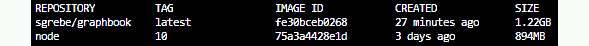

图 12.1 – Docker 镜像

您应该看到两个容器；第一个是`sgrebe/graphbook`容器镜像，或者您使用的任何标签名称。第二个应该是`node`镜像，这是我们用作自定义 Docker 镜像的基础。自定义镜像的大小应该大得多，因为我们安装了所有的`npm`包。

现在，我们应该能够使用这个新镜像启动我们的 Docker 容器。以下命令将启动您的 Docker 容器：

```js
docker run -p 8000:8000 -d --env-file .env sgrebe/graphbook
```

`docker run`命令也只有一个必需参数，即用于启动容器的镜像。在我们的例子中，这是`sgrebe/graphbook`，或者您指定的任何标签名称。尽管如此，我们定义了一些可选参数，我们需要它们来使我们的应用程序正常工作。您可以在以下内容中找到每个参数的解释：

+   我们将`-p`选项设置为`8000:8000`。该参数用于将实际主机操作系统的端口映射到 Docker 容器内的特定端口。第一个端口是主机机的端口，第二个端口是容器的端口。此选项使我们能够访问暴露的端口`8000`，应用程序在我们的本地机器的`http://localhost:8000`下运行。

+   `--env-file`参数是必需的，用于将环境变量传递到容器中。这些变量可以用来传递`NODE_ENV`或`JWT_SECRET`变量，例如，这些变量是我们整个应用程序所必需的。我们将在下一秒创建此文件。

+   您也可以使用`-e`选项逐个传递环境变量。然而，提供文件要容易得多。

+   `-d`选项将容器设置为`docker run`命令提供了许多更多选项。它允许进行各种高级设置。官方文档的链接是[`docs.docker.com/engine/reference/run/#general-form`](https://docs.docker.com/engine/reference/run/#general-form)。

让我们在项目的根目录中创建`.env`文件。插入以下内容，将所有占位符替换为每个环境变量的正确值：

```js
NODE_ENV=development
JWT_SECRET=YOUR_JWT_SECRET
AWS_ACCESS_KEY_ID=YOUR_AWS_KEY_ID
AWS_SECRET_ACCESS_KEY=YOUR_AWS_SECRET_ACCESS_KEY
```

`.env`文件是一个简单的键值列表，您可以在其中指定每行一个变量，我们的应用程序可以从其环境变量中访问这些变量。

在任何阶段都绝对不要将此文件提交到公共领域。请直接将此文件添加到`.gitignore`文件中。

如果您已填写此文件，您将能够使用我之前向您展示的命令启动 Docker 容器。现在容器以分离模式运行，您将遇到一个问题，即您无法确定 Graphbook 是否已经开始监听。因此，Docker 还提供了一个命令来测试这一点，如下所示：

```js
docker ps
```

`docker ps`命令为您提供了一个所有正在运行的容器的列表。您应该在那里找到 Graphbook 容器。输出应如下所示：

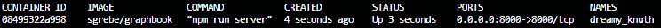

12.2 – Docker 运行容器

重要提示

与 Docker 提供的所有命令一样，`docker ps`命令为我们提供了许多选项来自定义和过滤输出。请在官方文档中了解它提供的所有功能，链接为[`docs.docker.com/engine/reference/commandline/ps/`](https://docs.docker.com/engine/reference/commandline/ps/)。

我们运行的容器正在使用我们指定的数据库。您应该能够通过访问`http://localhost:8000`来像以前一样使用 Graphbook。

如果您查看前面的图示，您将看到所有正在运行的容器都有自己的 ID。这个 ID 可以在各种情况下用来与容器交互。

在开发中，能够访问我们的应用程序生成的命令行输出是有意义的。当以分离模式运行容器时，你必须使用 Docker CLI 来查看输出，使用以下命令。将命令末尾的 ID 替换为你容器 ID：

```js
docker logs 08499322a998
```

`docker logs` 命令将显示我们的应用程序或容器最近做出的所有输出。将前面的 ID 替换为 `docker ps` 命令提供的 ID。如果你想在使用 Graphbook 时实时查看日志，可以添加 `--follow` 选项。

由于我们以分离模式运行容器，你将无法像以前那样仅使用 *Ctrl* + *C* 来停止它。相反，你必须再次使用 Docker CLI。

要再次停止容器，请运行以下命令：

```js
docker stop 08499322a998
```

要最终将其删除，请运行以下命令：

```js
docker rm 08499322a998
```

`docker rm` 命令会停止并从系统中删除容器。对容器内部文件系统所做的任何更改都将丢失。如果你再次启动镜像，将创建一个新的容器，拥有一个干净的文件系统。

当你频繁地使用 Docker 进行工作和开发时，你可能会生成许多镜像来测试和验证你应用程序的部署。这些镜像在你的本地机器上占用大量空间。要删除镜像，你可以执行以下命令：

```js
docker rmi fe30bceb0268
```

ID 可以从 `docker images` 命令中获取，该命令的输出你可以看到本节第一张图片。只有当镜像未被用于运行中的容器时，你才能删除它。

我们已经取得了很大的进展。我们已经成功地将我们的应用程序容器化。然而，它仍在开发模式下运行，所以还有很多事情要做。

## 多阶段 Docker 生产构建

我们当前创建的 Docker 镜像，是从 `Dockerfile` 生成的，已经很有用了。我们希望我们的应用程序能够在生产模式下进行转译并运行，因为许多内容在开发模式下运行时并未针对公众进行优化。

显然，在生成 Docker 镜像时，我们必须运行后端和前端的构建脚本。

到目前为止，我们已经将所有 `npm` 包和所有文件及文件夹安装到我们的项目容器镜像中。这对于开发来说是可以的，因为这个镜像尚未发布或部署到生产环境中。当你的应用程序上线时，你希望你的镜像尽可能瘦小和高效。为了实现这一点，我们将使用所谓的**多阶段构建**。

在 Docker 实现允许多阶段构建的功能之前，你必须依赖诸如使用 shell 命令仅保留容器镜像中实际需要的文件等技巧。我们面临的问题是，我们从项目文件夹中复制了所有用于构建实际分发代码的文件。然而，这些文件在生产 Docker 容器中并不需要。

让我们看看在现实中这看起来如何。你可以备份或删除我们之前编写的第一个 `Dockerfile`，因为我们现在将从一个空白文件开始。新文件仍然需要被命名为 `Dockerfile`。所有接下来的代码行都将直接写入这个空白的 `Dockerfile`。按照以下说明来运行多阶段生产构建：

1.  我们的新文件再次以 `FROM` 命令开始。我们将有多个 `FROM` 语句，因为我们正在准备一个多阶段构建。第一个应该看起来如下：

    ```js
    FROM node:14 AS build
    ```

    我们在这里引入第一个构建阶段。和之前一样，我们使用的是 14 版本的 `node` 镜像。此外，我们添加了 `AS build` 后缀，这告诉 Docker，这个阶段以及我们在其中所做的所有操作，将来都可以通过名称 `build` 访问。每次新的 `FROM` 命令都会启动一个新的阶段。

1.  接下来，我们初始化工作目录，就像我们在第一个 `Dockerfile` 中做的那样，如下所示：

    ```js
    WORKDIR /usr/src/app
    ```

1.  只复制我们真正需要的文件是至关重要的。如果你能减少需要处理的文件数量，这将极大地提高性能：

    ```js
    COPY .babelrc ./
    COPY package*.json ./
    COPY webpack.server.build.config.js ./
    COPY webpack.client.build.config.js ./
    COPY src src
    COPY assets assets
    COPY public public
    ```

    我们复制 `.babelrc`、`package.json`、`package-lock.json` 和 webpack 文件，这些文件是我们应用程序所需的。它们包括我们生成前端和后端生产构建所需的所有信息。此外，我们还复制了 `src`、`public` 和 `assets` 文件夹，因为它们包含了将被转换和捆绑的代码和 CSS。

1.  就像在我们的第一个 `Dockerfile` 中一样，我们必须安装所有的 `npm` 包；否则，我们的应用程序将无法工作。我们通过以下代码行来完成这项工作：

    ```js
    RUN npm install
    ```

1.  在所有包安装成功后，我们可以开始构建过程。我们在本章的第一部分添加了 `build` 脚本。将以下行添加到执行脚本的命令中，该脚本将在 Docker 镜像中生成生产捆绑包：

    ```js
    RUN npm run build
    ```

    以下命令将为我们生成一个 `dist` 文件夹，其中将存储可运行的代码（包括 CSS）。在创建完包含所有捆绑包的 `dist` 文件夹后，我们将不再需要最初复制到当前构建阶段的多数文件。

1.  为了得到一个只包含 `dist` 文件夹和运行应用程序所需的文件的干净 Docker 镜像，我们将引入一个新的构建阶段来生成最终镜像。新的阶段通过第二个 `FROM` 语句开始，如下所示：

    ```js
    FROM node:14
    ```

    我们在这个构建步骤中构建最终镜像；因此，它不需要自己的名称。

1.  再次强调，我们需要为第二个阶段指定工作目录，因为路径不会从第一个构建阶段复制过来：

    ```js
    WORKDIR /usr/src/app
    ```

1.  在继续之前，我们需要确保应用程序可以访问所有环境变量。为此，将以下行添加到 `Dockerfile` 中：

    ```js
    ENV NODE_ENV production
    ENV JWT_SECRET JWT_SECRET
    ENV username YOUR_USERNAME
    ENV password YOUR_PASSWORD
    ENV database YOUR_DATABASE
    ENV host YOUR_HOST
    ENV AWS_ACCESS_KEY_ID AWS_ACCESS_KEY_ID
    ENV AWS_SECRET_ACCESS_KEY AWS_SECRET_ACCESS_KEY
    ```

    我们使用 Docker 的 `ENV` 命令在构建镜像时填充环境变量。

1.  由于我们已经给第一个构建阶段起了一个名字，我们可以通过这个名字访问这个阶段的文件系统。要复制第一个阶段的文件，我们可以在 `COPY` 语句中添加一个参数。将以下命令添加到 `Dockerfile` 中：

    ```js
    COPY --from=build /usr/src/app/package.json package.json
    COPY --from=build /usr/src/app/dist dist
    COPY start.sh start.sh
    COPY src/server src/server
    ```

    正如你应该在前面的代码中看到的那样，我们正在复制 `package.json` 文件和 `dist` 文件夹。然而，我们不是从原始项目文件夹中复制文件，而是直接从第一个构建阶段获取这些文件。为此，我们使用 `--from` 选项，后面跟着我们想要访问的阶段名称；因此，我们输入名称 `build`。`package.json` 文件是必需的，因为它包含了所有依赖项和 `scripts` 字段，该字段包含了如何在生产中运行应用程序的信息。`dist` 文件夹当然是我们的打包应用程序。

    此外，我们复制了一个我们将创建的 `start.sh` 文件和服务器文件夹，因为在那里我们有所有的数据库迁移。

1.  注意，我们只复制 `package.json` 文件和 `dist` 文件夹。我们的 `npm` 依赖项不包括在 `dist` 文件夹中的应用程序构建中。因此，我们还需要在第二个构建阶段安装 `npm` 包：

    ```js
    npm packages that are really required; npm offers the only parameter, which lets you install only the production packages, as an example. It will exclude all devDependecies of your package.json file. This is really great for keeping your image size low.Then, there are three `npm` packages that are technically not a dependency, which is defined in our `package.json` file, because they are not required to get our application running. Still, they are needed to get our database migrations applied. Add the following `RUN` command to the `Dockerfile`:

    ```

    `mysql2` 包。我们将利用它们在 Docker 容器启动时应用迁移。还有其他方法可以手动触发它们，而不是在 Docker 容器启动时，但这将适用于我们的设置。

    ```js

    ```

1.  在这里需要做的最后两件事是公开容器的端口并执行 `CMD` 命令，这将允许容器启动时运行 `package.json` 文件中的命令：

    ```js
    EXPOSE 8000
    CMD [ "sh", "start.sh" ]
    ```

1.  最后，我们需要在项目的根目录下创建一个 `start.sh` 文件，内容如下：

    ```js
    sequelize db:migrate --migrations-path src/server/migrations --config src/server/config/index.js --env production
    npm run server:production
    ```

    在 `start.sh` 文件中，我们有两行。第一行运行所有数据库迁移。最后一行基于生成的生产包启动服务器。

现在，你可以再次执行 `docker build` 命令并尝试启动容器。唯一的问题是——在生产环境中运行时，数据库凭据是从环境变量中读取的。由于数据库的生产设置不能在我们的本地机器上，它需要存在于真实的服务器上的某个地方。我们也可以通过 Docker 完成这个任务，但这将涉及一个非常高级的 Docker 配置。我们需要将 MySQL 数据保存在单独的存储中，因为 Docker 默认不会持久化任何类型的数据。

个人来说，我喜欢依赖云主机，它为我处理数据库设置。这不仅对整体设置有很大帮助，还提高了我们应用程序的可扩展性。下一节将介绍 Amazon RDS 以及如何为我们的应用程序配置它。你可以使用你喜欢的任何数据库基础设施。

# Amazon RDS

AWS 提供 Amazon **RDS**，这是一个只需点击几下即可轻松设置关系型数据库的工具。简而言之，我将解释如何使用 RDS 创建您的第一个数据库，之后我们将探讨如何正确插入环境变量，以便与应用程序建立数据库连接。

第一步是登录到 AWS 管理控制台，就像我们在*第七章*中做的那样，*处理图像上传*。您可以通过点击`RDS`来找到该服务。

在导航到**RDS**后，您将看到仪表板，如下面的截图所示：


图 12.3 – AWS RDS

按照以下说明设置 RDS 数据库：

1.  通过点击**创建数据库**按钮初始化一个新的数据库。您将看到一个新屏幕，您应该选择我们新数据库的引擎以及如何创建它，如下面的截图所示：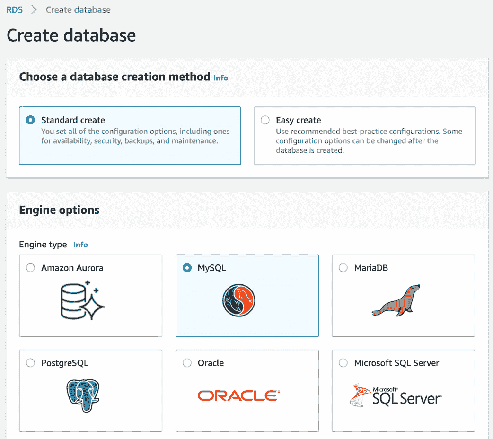

    图 12.4 – AWS RDS 引擎选择

    我建议您在此处选择**MySQL**。您还应该能够选择**Amazon Aurora**或**MariaDB**，因为它们也与 MySQL 兼容；对于这本书，我选择了 MySQL。此外，请继续使用标准创建方法。通过向下滚动继续操作。

1.  您需要指定数据库的使用场景。生产选项仅推荐用于实时应用程序，因为这将包括更高的成本。选择免费层，如下面的截图所示：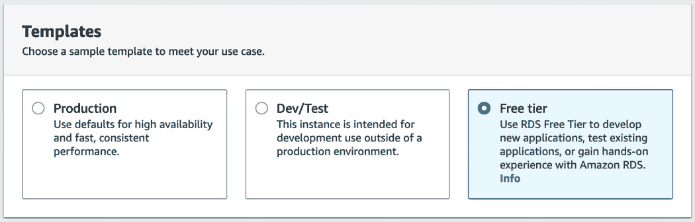

    图 12.5 – AWS RDS 模板选择

1.  继续向下滚动。接下来，您需要填写数据库凭据，以便在稍后进行后端认证。填写如下所示的详细信息：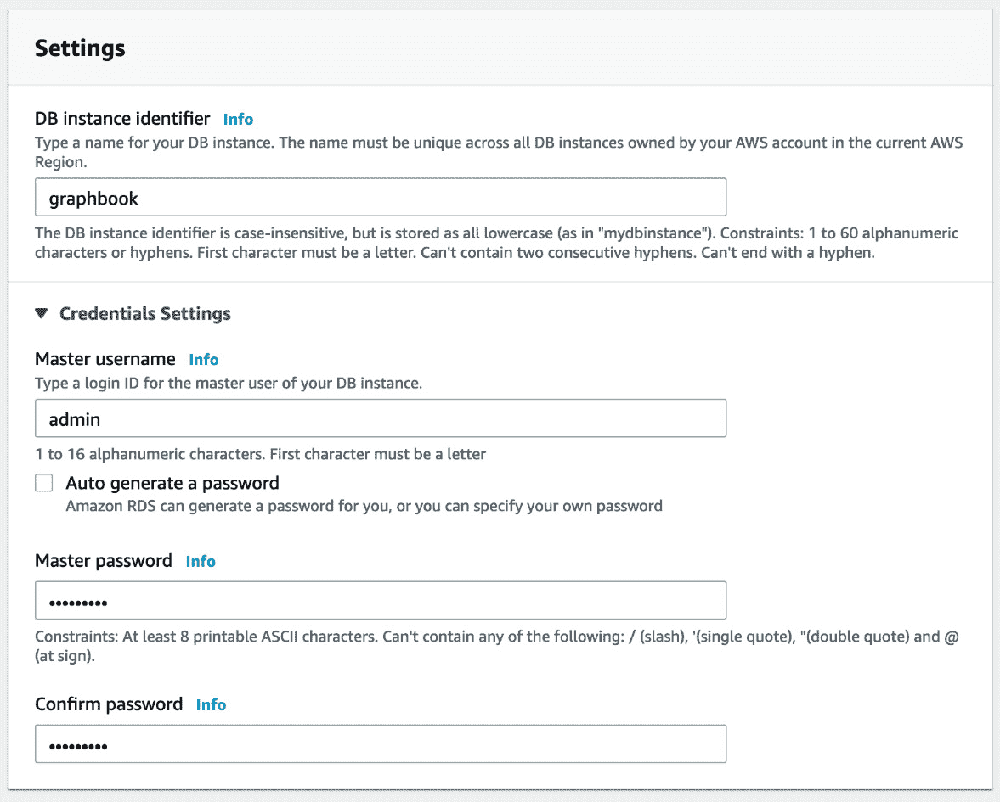

    图 12.6 – AWS RDS 数据库凭据

1.  接下来，您需要选择 AWS 实例，从而确定数据库的计算能力。选择**db.t2.micro**，它是免费的，并且目前对我们的用例来说已经足够。它应该看起来像以下这样：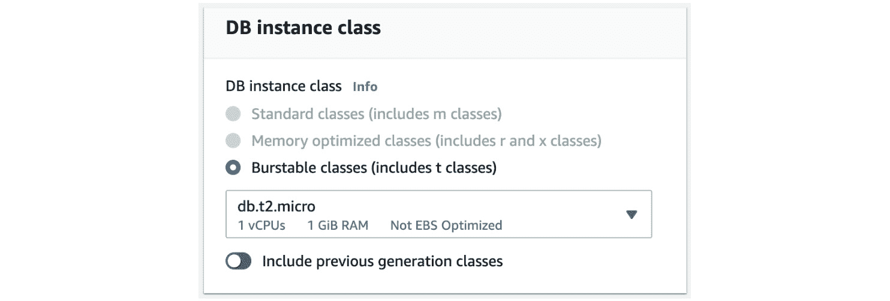

    图 12.7 – AWS RDS 实例类型

1.  现在将要求您设置连接设置。您必须选择**公共访问**，并确保**是**被勾选的。这并不会将您的数据库与公众共享，但如果您在 AWS 安全组中选择它们，则可以从其他 IP 和其他 EC2 实例访问。此外，您还需要创建一个新的子网组，并给出一个新的安全组名称：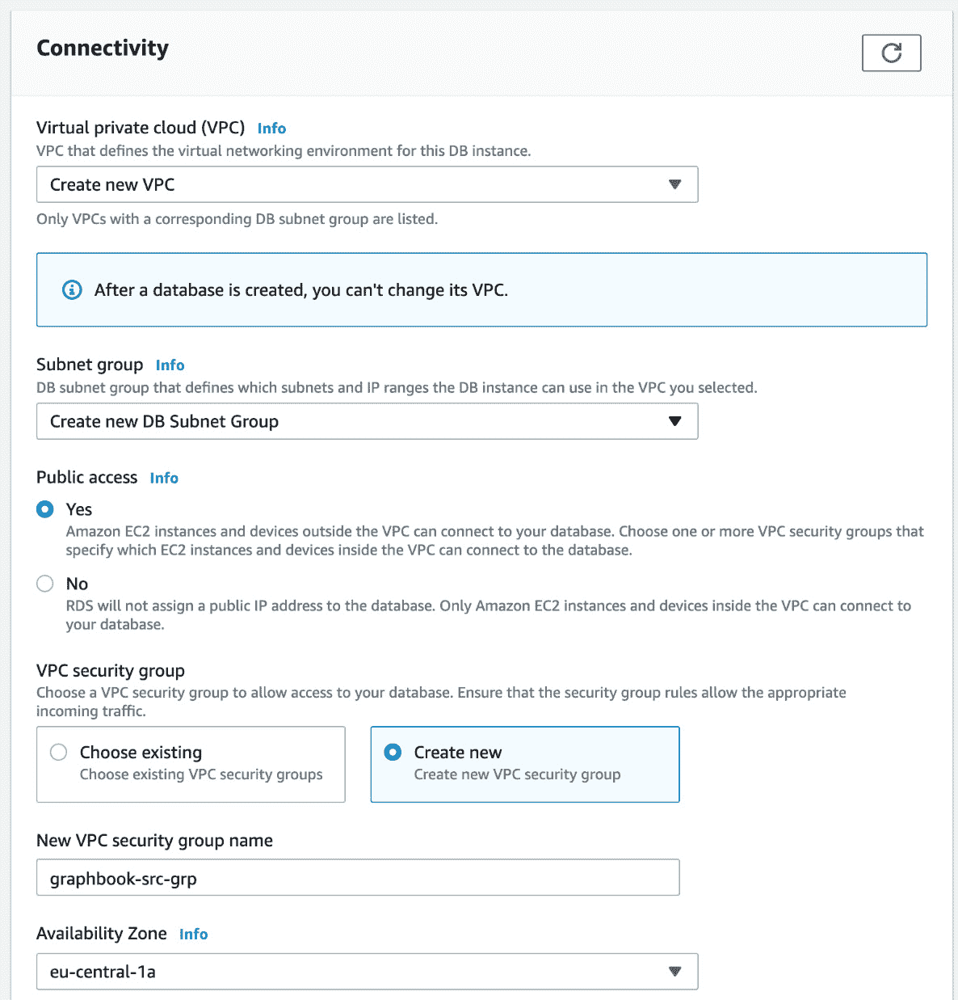

    图 12.8 – AWS RDS 网络设置

1.  在**附加配置**部分，我们需要提供一个初始数据库名称，这样在设置完成后，RDS 内部将创建一个数据库：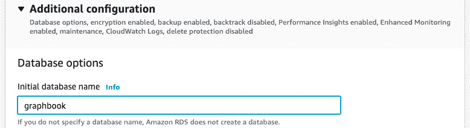

    

1.  通过点击屏幕底部的 **创建数据库**，完成您第一个 AWS RDS 数据库的设置过程。

您现在应该被重定向到所有数据库的列表。

点击已创建的新数据库实例。如果您向下滚动，您将看到安全组列表。点击具有 **CIDR/IP - 入站** 类型的组：

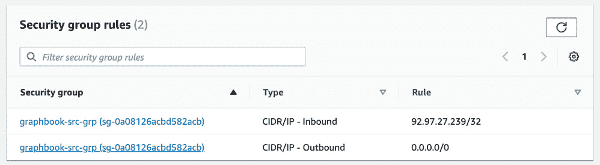


图 12.10 – AWS 安全组规则

如果您点击第一条规则，您将能够插入允许访问数据库的 IP。如果您插入 `0.0.0.0` IP，它将允许任何远程 IP 访问数据库。这不是推荐用于生产使用的数据库设置，但它使得在开发环境中使用多个环境进行测试变得更容易。

您为数据库指定的凭据必须包含在 `.env` 文件中，以便运行我们的 Docker 容器，如下所示：

```js
username=YOUR_USERNAME
password=YOUR_PASSWORD
database=YOUR_DATABASE
host=YOUR_HOST
```

`host` URL 可以从 Amazon RDS 实例仪表板中获取。它应该看起来像 `INSTANCE_NAME.xxxxxxxxxx.eu-central-1.rds.amazonaws.com`。

现在，您应该能够再次运行 Docker 镜像的构建，而不会出现任何问题。数据库已经设置好并可用。

接下来，我们将探讨如何通过持续集成自动化生成 Docker 镜像的过程。

# 配置持续集成

许多人（尤其是开发者）可能听说过 **持续集成**（**CI**）或 **持续部署**（**CD**）。然而，其中大多数人无法解释它们的含义以及这两个术语之间的区别。那么，CI 和 CD 在现实中究竟是什么？

当谈到发布您的应用程序时，可能看起来很容易将一些文件上传到服务器，然后通过在 shell 中执行一个简单的命令，通过 SSH 启动应用程序。

这种方法可能是一些开发者或更新不频繁的小型应用的解决方案。然而，对于大多数场景来说，这并不是一个好的方法。单词 *持续* 代表了所有更改或更新都是持续不断地进行测试、集成，甚至发布的。这将是一项大量工作，如果我们继续使用简单的文件上传并采取手动方法，这将非常困难。自动化这个工作流程使得在任何时候更新您的应用程序变得方便。

CI 是一种开发实践，其中所有开发人员每天至少将他们的代码提交到中央项目仓库一次，以便将他们的更改带到主代码流中。集成后的代码将通过自动测试用例进行验证。这将避免在特定时间尝试上线时出现的问题。

CD 更进一步；它基于 CI 的主要原则。每次应用程序成功构建和测试后，更改将直接发布给客户。这正是我们打算实施的。

我们的自动化流程将基于 **CircleCI**。它是一个提供 CI 和 CD 平台的三方服务，具有大量功能。

要注册 CircleCI，请访问 [`circleci.com/signup/`](https://circleci.com/signup/)。

您需要一个 Bitbucket 或 GitHub 账户才能注册。这也将是您的应用程序仓库的来源，我们可以从这里开始使用 CI 或 CD。

要使您的项目通过 CircleCI 启动并运行，您需要在左侧面板中点击 **项目** 按钮，或者如果您还没有设置任何项目，您将被重定向到那里。注册后，您应该在 CircleCI 内看到您所有的仓库。

通过在项目的右侧点击 **设置项目** 来选择您想要通过 CircleCI 处理的项目。然后，您将面对以下屏幕：

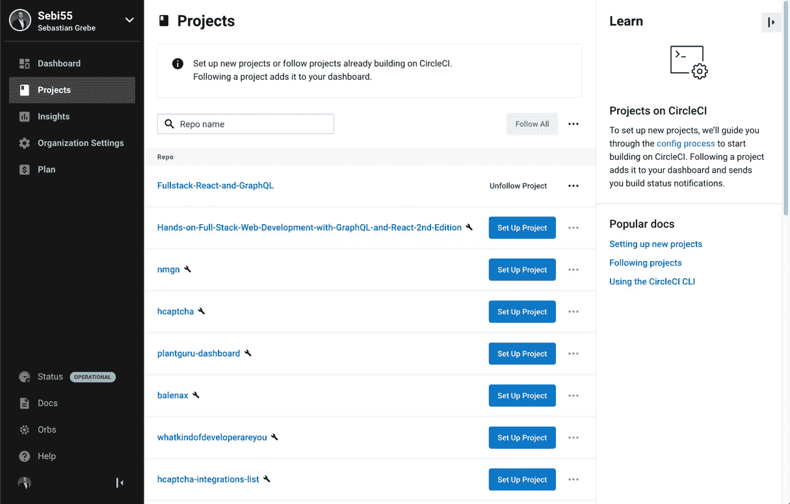

图 12.11 – CircleCI 项目

问题在于您没有相应地配置您的仓库或应用程序。您需要创建一个名为 `.circleci` 的文件夹，并在其中创建一个名为 `config.yml` 的文件，该文件告诉 CircleCI 当有新的提交推送到仓库时应该做什么。CircleCI 将会要求您自己设置，或者它会为您设置。我建议选择我们自行设置，因为这本书将引导您完成这些步骤。

接下来，将 **示例配置** 设置为 **Node**。最后一步将是推送一个包含匹配 CircleCI 配置的新提交。

我们将创建一个简单的 CircleCI 配置，以便我们可以测试一切是否正常工作。最终的配置将在稍后的步骤中完成，那时我们已经配置了 Amazon ECS，它将成为我们应用程序的主机。

因此，在我们的项目根目录下创建一个 `.circleci` 文件夹，并在该新文件夹内创建一个 `config.yml` 文件。`.yml` 文件扩展名表示 `.yml` 文件需要正确的缩进。否则，它们将不是有效的文件，并且无法被 CircleCI 理解。

将以下代码插入到 `config.yml` 文件中：

```js
version: 2.1
jobs:
  build:
    docker:
      - image: circleci/node:14
    steps:
      - checkout
      - run:
          command: echo "This is working"
```

让我们快速浏览一下文件中的所有步骤，如下所示：

1.  文件以 `version` 规范开始。我们使用版本 2.1，因为这是 CircleCI 的当前版本。

1.  然后，我们将有一个 `作业` 列表，这些作业将并行执行。因为我们只想做一件事，所以我们只能看到正在运行的 `build` 作业。稍后，我们将在这里添加整个 Docker 构建和发布功能。

1.  每个作业都会收到一个执行器类型，该类型需要是 `machine`、`docker` 或 `macos`。我们使用 `docker` 类型，因为我们可以依赖 CircleCI 的许多预构建镜像。镜像在单独的 `image` 属性中指定。在那里，我指定了版本 14 的 `node`，因为我们需要在 CI 工作流程中使用 Node.js。

1.  然后，每个作业都会接收到几个步骤，这些步骤会在将每个提交推送到 Git 仓库时执行。

1.  第一步是`checkout`命令，它克隆我们仓库的当前版本，以便我们可以在后续步骤中使用它。

1.  最后，为了测试一切是否正常工作，我们使用`run`步骤。它允许我们在 CircleCI 启动的`node:14` Docker 镜像中直接执行命令。你想要执行的每个命令都必须以`command`为前缀。

此配置文件的结果应该是我们已拉取应用程序的当前 master 分支，并在最后打印了文本`This is working`。为了测试 CircleCI 设置，将此文件提交并推送到你的 GitHub 或 Bitbucket 仓库。

CircleCI 应该会自动通知你，它已经开始为我们仓库的新**CI**作业。你可以在 CircleCI 左侧面板的**作业**按钮中找到作业。最新的作业应该位于列表顶部。点击作业以查看详细信息。它们应该如下所示：

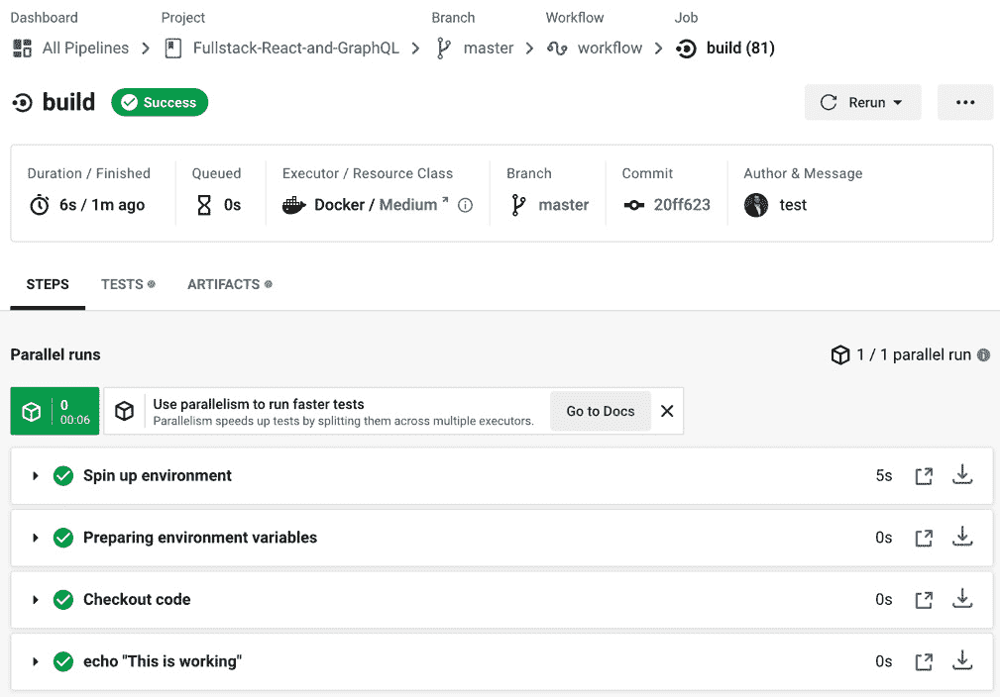

图 12.12 – CircleCI 流水线

在前面的屏幕截图中，每个步骤都在窗口底部的单独一行中表示。你可以展开每一行，以查看在执行当前行中显示的特定命令时打印的日志。前面的屏幕截图显示作业已成功完成。

现在我们已经配置了 CircleCI 在每次推送时处理我们的仓库，我们必须看看如何在构建完成后直接托管和部署我们的应用程序。

# 将应用程序部署到 Amazon ECS

CircleCI 每次我们推送新的提交时都会执行我们的构建步骤。现在，我们想要构建我们的 Docker 镜像并将其自动部署到一台将为我们应用程序提供服务的机器上。

我们的数据库和上传的图像已经在 AWS 上托管，因此我们也可以使用 AWS 来托管我们的应用程序。正确设置 AWS 是一个重要的任务，并且需要大量的时间。我们将使用 Amazon ECS 来运行我们的 Docker 镜像。然而，正确设置网络、安全和容器注册表过于复杂，无法在单章中解释。我建议你参加课程或阅读单独的书籍，以了解和学习 AWS 的高级设置以及获得生产就绪托管所需的配置。现在，我们将使用 ECS 来获取容器，包括数据库连接，使其运行。

在直接前往 Amazon ECS 并创建你的集群之前，我们需要准备两个服务 - 一个是 AWS **ALB**，代表**应用程序负载均衡器**，另一个是 Amazon ECR。如果你设置了一个 ECS 集群，将有一个或多个相同服务或任务的实例运行。这些任务需要接收流量，但如果发布新版本，它们也应该在继续服务流量的同时与新的任务交换。这对于 AWS ALB 来说是个好工作，因为它可以在实例之间分割流量，并在任务交换时处理动态端口映射。

登录 AWS 管理控制台，搜索 EC2 服务，然后点击它。然后，按照以下说明操作：

1.  在左侧面板向下滚动，直到你看到**负载均衡**部分，如图中所示：

    图 12.13 – AWS 负载均衡部分

1.  点击**负载均衡器**，你会看到一个空列表。现在我们需要在左上角点击**创建负载均衡器**。在下一页，选择**应用程序负载均衡器**。

1.  我们需要为我们的负载均衡器指定一个名称和方案。我们将选择**面向互联网**的选项，因为这样我们可以从 AWS 外部访问它：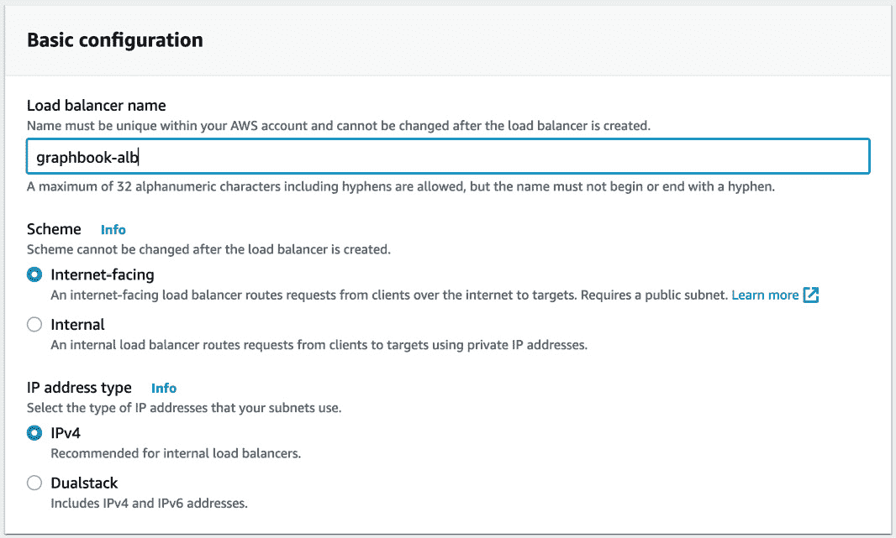

    图 12.14 – AWS ALB 配置

    重要提示

    通常情况下，你不会将负载均衡器公开，而是会在你的应用程序前面添加另一个**内容分发网络**（**CDN**）、缓存和防火墙来保护它免受**分布式拒绝服务**（**DDoS**）攻击或不必要的负载。AWS 上的服务，如 Route53 和 CloudFront，可以很好地协同工作来完成这项任务，但它们超出了本书的范围。

1.  在下一步中，我们需要选择一个 VPC，它将把附加资源带入一个私有网络。数据库中应该有一个现有的 VPC 可供选择。请选择它并选择可用区域，如图中所示：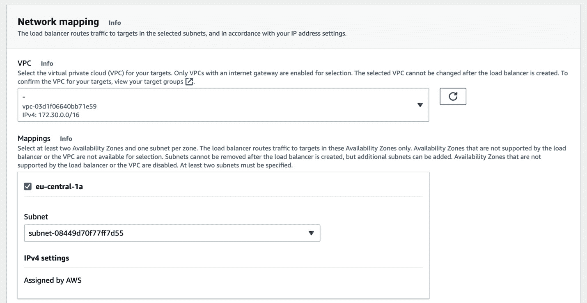

    图 12.15 – AWS ALB 网络设置

1.  接下来，你需要选择与 AWS RDS 数据库一起创建的安全组，如图中所示：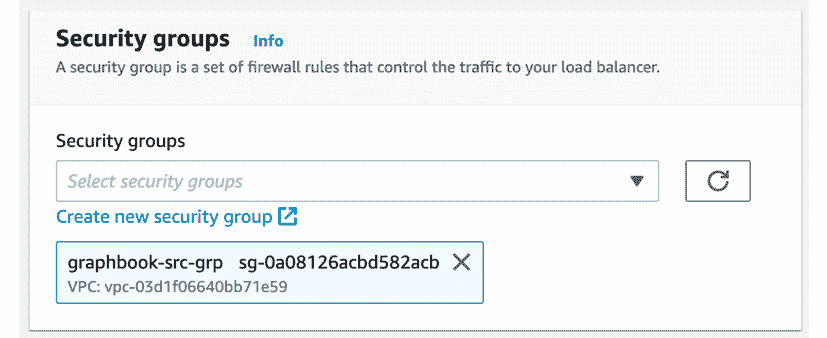

    图 12.16 – AWS ALB 安全组

1.  如果你继续向下滚动，你会看到你需要指定负载均衡器的路由，即负载或流量需要去哪里，这取决于你需要定义的一些规则。为此，我们需要定义一个目标组。在选择输入下方应该有一个链接，上面写着**创建****目标组**，如图中所示：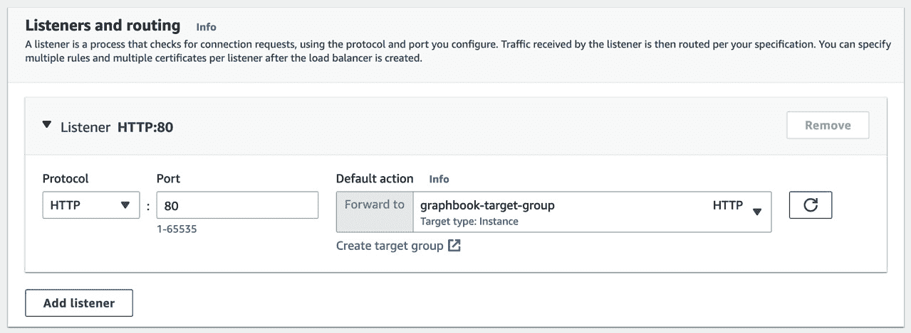

    图 12.17 – AWS ALB 路由

    如果你已创建并选择了目标组，它应该看起来像前面的图示，所以让我们来做这件事。

1.  在新标签页或窗口中打开链接；如前所述，你应该看到以下屏幕：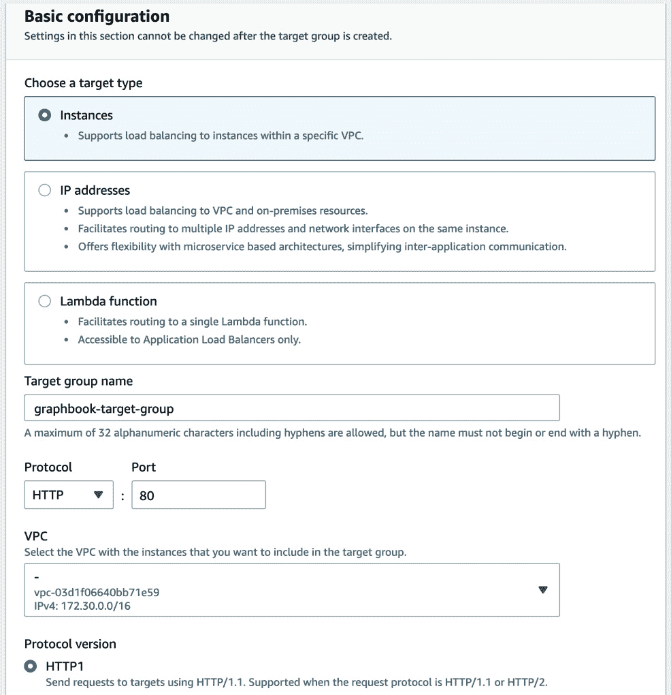

    图 12.18 – AWS 目标组创建

1.  选择**实例**，这意味着在一个 VPC 中不同实例之间的负载均衡。为目标组命名，并选择与之前相同的 VPC。

1.  之后，你可以点击**下一步**按钮。你将看到以下屏幕：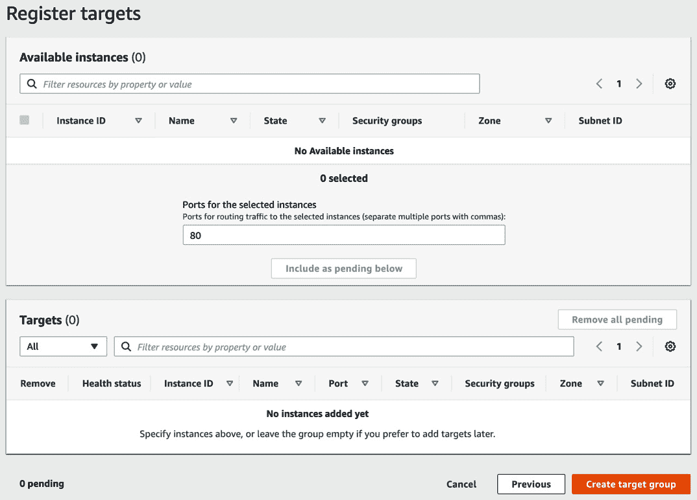

    图 12.19 – AWS 目标组目标

    此屏幕通常显示所有将包含在您的目标组中的实例。因为我们还没有创建 ECS 集群，所以这是空的。您可以通过点击**创建目标组**按钮继续。

1.  返回向导设置 AWS ALB。在目标组选择旁边的**刷新**按钮处点击并选择目标组。

1.  在屏幕底部点击**创建负载均衡器**按钮。

最后，您应该已经到达向导的末尾，并看到一个摘要，如下面的截图所示：

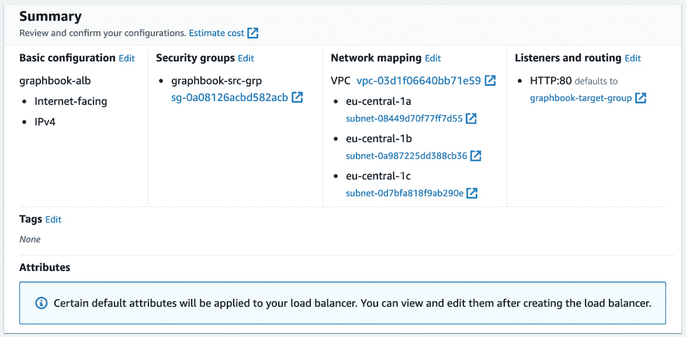

图 12.20 – AWS ALB 创建摘要

下一步我们需要准备的是 Amazon ECR 存储库。Amazon ECR 不过是 Docker Hub 或其他任何 Docker 注册中心的替代品。在 Docker 注册中心中，您可以推送为您的应用程序构建的 Docker 镜像。这是我们 ECS 集群运行的基础。

要设置您的 ECR 存储库，在顶部栏中搜索`ECR`并点击相应的服务。您应该会看到以下屏幕：

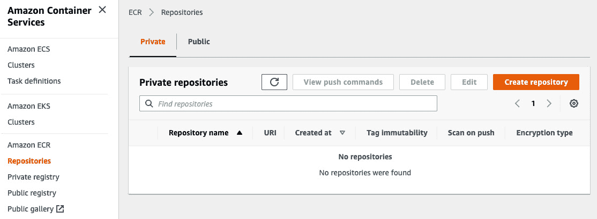

图 12.21 – Amazon ECR 概述

要设置您的 Amazon ECR 存储库，请按照以下步骤操作：

1.  在右侧点击**创建存储库**按钮进入创建向导。

1.  接下来，您需要为您的存储库提供一个名称，如下面的截图所示：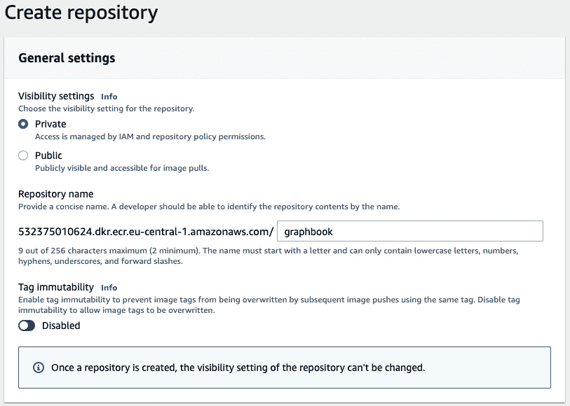

    图 12.22 – Amazon ECR 设置

    我们将我们的注册库设置为私有，因为外部没有人应该能够访问它。如果您需要将其设置为对所有人公开，您可以更改此设置。

1.  点击**创建存储库**来设置它。现在您将看到以下更新表：

    图 12.23 – Amazon ECR 存储库已创建

1.  之后，您将需要`URI`，它显示在注册名称旁边。

现在我们已经准备好开始设置 ECS 集群。要找到 ECS，只需前往顶部服务栏并搜索`ECS`。如果您点击此服务并进入**集群**部分，它将显示所有正在运行的 ECS 集群。它应该看起来像以下这样：

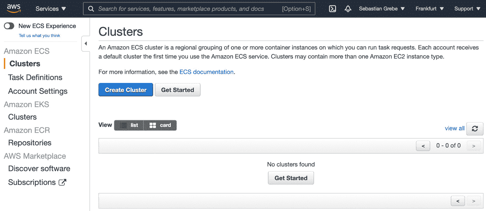

图 12.24 – Amazon ECS 集群

配置 ECS 的过程非常复杂，本书将遵循最基础的配置。按照以下说明来使其工作：

1.  点击**创建集群**按钮（见*图 12.24*）开始。

1.  在下一屏，您将被询问想要使用哪种类型的实例。我们将使用以下截图所示的 EC2 Linux 实例：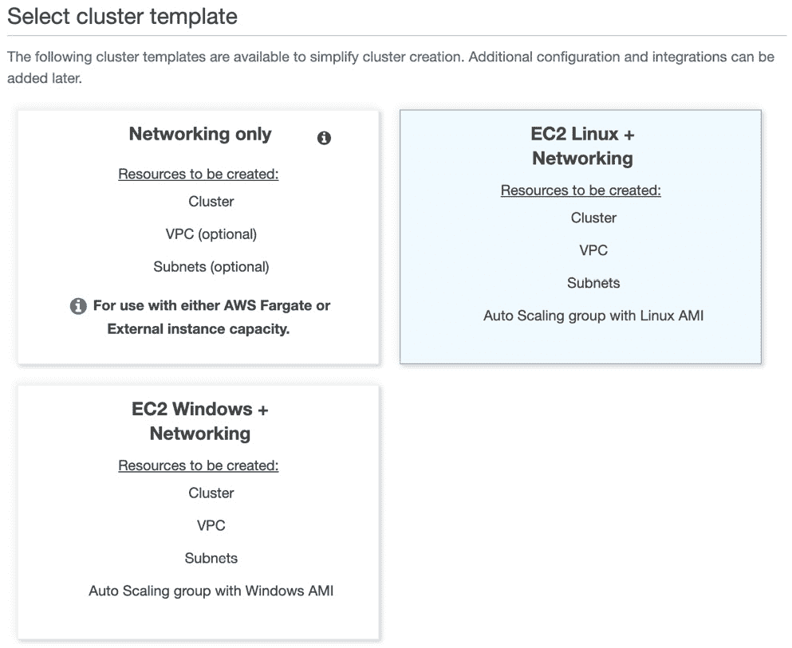

    图 12.25 – Amazon ECS 集群模板

1.  点击**下一步**进入集群的配置向导。

1.  您将被要求输入集群名称。默认配置是合适的，除非您需要更改。唯一需要更改的选项是实例类型。我建议选择`t2.micro`，因为它并不昂贵，这对于开发来说是个不错的选择。**实例数量**选项指定了我们希望有多少个并行运行的 EC2 实例。对于开发，通常一个就足够了，但如果您需要扩展，您需要增加这个数量：![Figure 12.26 – Amazon ECS 集群配置

    ![Figure_12.26_B17337.jpg]

    Figure 12.26 – Amazon ECS 集群配置

1.  滚动以提供一些额外的网络配置。由于我们在配置负载均衡器时选择了三个子网，我们现在也应该选择这三个子网：![Figure 12.27 – Amazon ECS 集群网络设置

    ![Figure_12.27_B17337.jpg]

    Figure 12.27 – Amazon ECS 集群网络设置

1.  在选择子网后，您需要选择我们也用于 ALB 配置的安全组：![Figure 12.28 – Amazon ECS 安全设置

    ![Figure_12.28_B17337.jpg]

    Figure 12.28 – Amazon ECS 安全设置

1.  点击**创建集群**，AWS 将开始启动所有进程。这可能需要一些时间。

1.  一旦 AWS 配置完成，您可以点击**查看集群**按钮，这将带您进入详细的集群页面。

我们已经定义了 AWS 正在运行一个基于一个 EC2 实例的 ECS 集群。我们之前没有做的一件事是定义这个集群做什么。为此，我们需要转到左侧面板上的**任务定义**。然后，按照以下说明操作：

1.  点击**创建新任务定义**按钮。

1.  选择**EC2**类型以使您的任务与这种类型的集群兼容。

1.  给您的任务定义命名并指定**ecsTaskExecutionRole**角色。它应该看起来像以下截图：![Figure 12.29 – Amazon ECS 任务定义

    ![Figure_12.29_B17337.jpg]

    Figure 12.29 – Amazon ECS 任务定义

1.  滚动并给您的任务指定一个大小，这意味着它将需要的内存大小和 CPU 大小来处理其任务。它应该看起来像以下截图：![Figure 12.30 – Amazon ECS 任务定义大小

    ![Figure_12.30_B17337.jpg]

    Figure 12.30 – Amazon ECS 任务定义大小

    此设置需要与您的集群拥有的资源相匹配。

1.  现在，暂时点击`:latest`。因为我们还没有发布任何镜像，所以它现在不会工作，但我们会稍后修复这个问题。

1.  滚动到`8000`，因为这是我们用于 Graphbook 的默认端口。`0`将被您的负载均衡器自动分配。AWS ALB 将动态地将一个空闲端口映射到容器端口。我们不需要关心它将是哪个端口。

1.  在环境部分，我们需要添加所有我们的应用程序启动所需的环境变量。以下截图显示的变量应该足以使您的容器运行：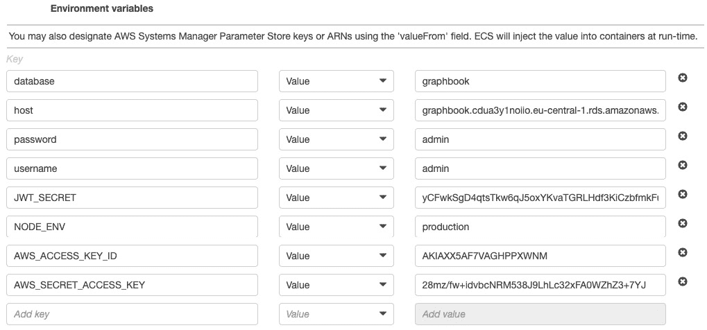

    图 12.32 – Amazon ECS 任务定义容器环境变量

1.  唯一有用的设置是在**存储和日志**部分下。我建议激活 CloudWatch Logs，这样您就可以看到您应用程序的所有日志。它应该看起来像下面的截图：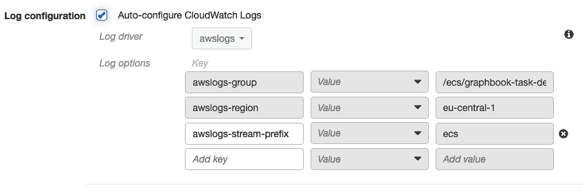

    图 12.33 – Amazon ECS 任务定义容器日志

1.  启用此选项后，您可以在对话框底部点击**添加**按钮。

这些都是您需要完成的重要事项。还有许多更详细的配置您可以进行。对我们来说，它们不是使我们的应用程序运行所必需的，也不在本书的范围之内。

容器定义表应该看起来像下面的截图：

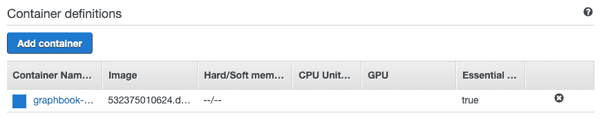

图 12.34 – Amazon ECS 任务定义容器定义

我们刚才所做的是最基本的 ECS 设置。在我们刚刚设置的所有服务中，我们使用了最简单的配置，但我们没有查看大量的高级设置和配置。

现在，您可以在 ECS 任务定义向导的最后点击**创建**按钮。在 AWS 成功创建任务定义后，返回 ECS 的**主集群**屏幕。您将看到此集群概览：

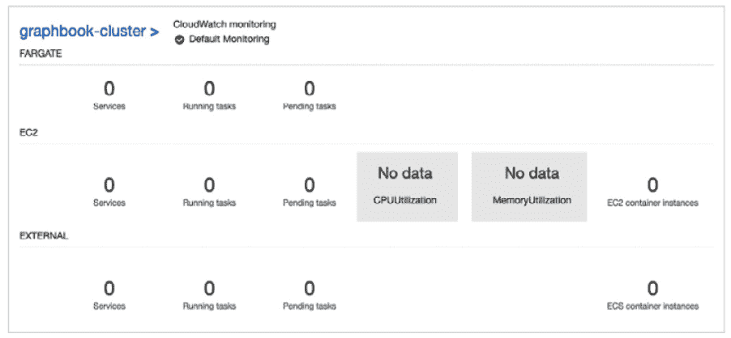

图 12.35 – Amazon ECS 集群概览

这只是表明，仍然，您的集群内部没有任何东西在运行。要解决这个问题，请点击左上角的集群名称。

实际问题是，没有创建使用刚刚配置的任务定义的服务，如下面的截图所示：

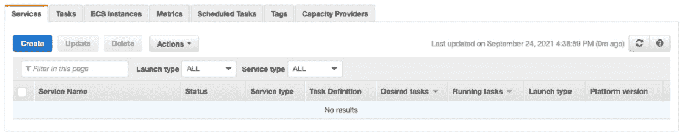

图 12.36 – Amazon ECS 集群服务

点击表格上方的**创建**按钮。

然后，您需要提供以下数据：

1.  对于**启动类型**，您需要选择**EC2**，与之前的步骤相同。

1.  然后，您需要选择任务定义家族，它应该与您之前创建的任务定义名称相匹配。

1.  此外，您还需要选择我们目前正在查看的集群。

1.  您需要为您的服务提供一个服务名称，例如`graphbook-service`。

1.  对于 `1` 是可以的。这意味着在同一时间此服务中只运行一个任务。这也受到健康百分比的限制。`100` 的最小健康百分比意味着至少应该有一个正确运行的服务在运行，而 `200` 的最大百分比意味着只允许运行最多两个健康的任务。这种限制对于您更新服务为新应用程序版本的情况是必要的。在这种情况下，将同时运行两个版本，它们将进行交换。所以，目前我们有 `200` 的健康百分比。

这就是您需要提供的信息。其余的设置可以保留为默认设置。结果应类似于以下屏幕截图：


图 12.37 – Amazon ECS 服务配置

您现在可以点击屏幕底部的**下一步**按钮继续。

下一个屏幕非常重要，因为这需要我们的 AWS ALB 设置。

您需要选择**应用程序负载均衡器**选项，然后选择我们之前创建的 ALB。设置应与以下屏幕截图中的配置相匹配：

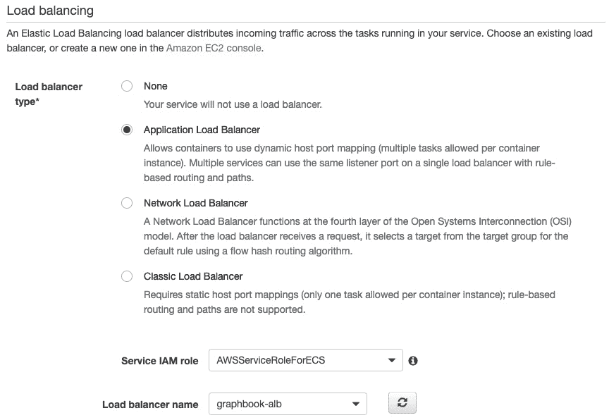

图 12.38 – Amazon ECS 服务负载均衡

此设置将利用我们的 ALB 并对在此服务任务中运行的容器进行动态端口映射。

如果我们向下滚动，我们需要提供有关 ALB 如何映射到容器的详细信息。现在，您应该看到以下信息：

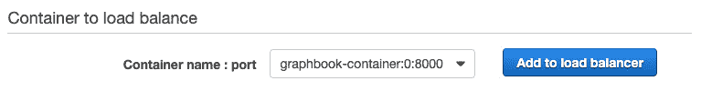

图 12.39 – Amazon ECS 服务负载均衡映射

您需要点击**添加到负载均衡器**按钮。好事是您只需选择我们之前创建的目标组。选择它后，您应该看到以下屏幕：

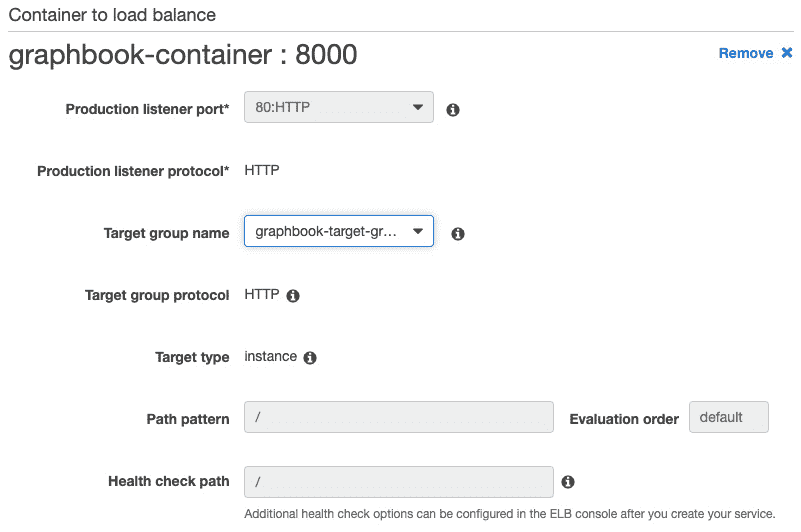

图 12.40 – Amazon ECS 负载均衡目标组配置

您现在可以点击屏幕底部的**下一步**按钮，然后在下一个屏幕中，当询问自动扩展时（我们不需要），您应该能够在摘要屏幕底部点击**创建服务**选项。

AWS 将尝试现在创建服务并启动任务。问题是到目前为止我们没有推送任何 Docker 镜像。由于这个原因，ECS 服务将无法正确启动任何任务。

那么，让我们来解决这个问题。

## 设置 CircleCI 与 Amazon ECR 和 ECS

我们将再次从空白的 CircleCI 配置开始；因此，清空旧的 `config.yml` 文件。

我们之前没有做的一件重要事情是在我们的管道中设置自动化测试。否则，我们的提交将触发自动化管道，并仅部署未经测试的代码，这可能会引起我们想要避免的生产问题。

那么，让我们先这样做。按照以下步骤操作：

1.  将以下行插入到我们的`config.yml`文件中，如下所示：

    ```js
    version: 2.1
    jobs:
      test:
        docker:
          - image: circleci/node:14
            auth:
              username: $DOCKERHUB_USERNAME
              password: $DOCKERHUB_PASSWORD
            environment:
              host: localhost
              username: admin
              password: passw0rd
              database: graphbook
              JWT_SECRET: 1234
    ```

    此配置创建了一个`test`作业并拉取了一个 Docker 镜像。这个 Docker 镜像是从 CircleCI 的 Node.js 镜像，我们将在这个镜像中运行应用程序以进行测试。同时，我们传递了凭证以实际拉取镜像，但也传递了一些默认环境变量，我们将在下一步中使用它们。

1.  将另一张图片添加到`test`作业中：

    ```js
          - image: circleci/mysql:8.0.4
            command: [--default-authentication-
                      plugin=mysql_native_password]
            auth:
              username: $DOCKERHUB_USERNAME
              password: $DOCKERHUB_PASSWORD
            environment:
              MYSQL_ROOT_PASSWORD: passw0rd
              MYSQL_DATABASE: graphbook
              MYSQL_USER: admin
              MYSQL_PASSWORD: passw0rd
    ```

    这个镜像是为 MySQL 数据库准备的，我们可以对其运行迁移和测试脚本。每次管道运行时，它都会从头开始创建。您可以看到，我们同样提供了相同的环境变量。这将使用这些凭证设置 MySQL 数据库，并且 Node.js 容器将在环境变量中拥有这些凭证。

1.  如前所述步骤所示，我们正在使用类似`$DOCKERHUB_USERNAME`这样的语法将 CircleCI 设置中的变量注入到我们的管道中。这样，我们就不需要反复重复它们，而且它们也不会被提交到我们的代码中。根据以下截图设置环境变量：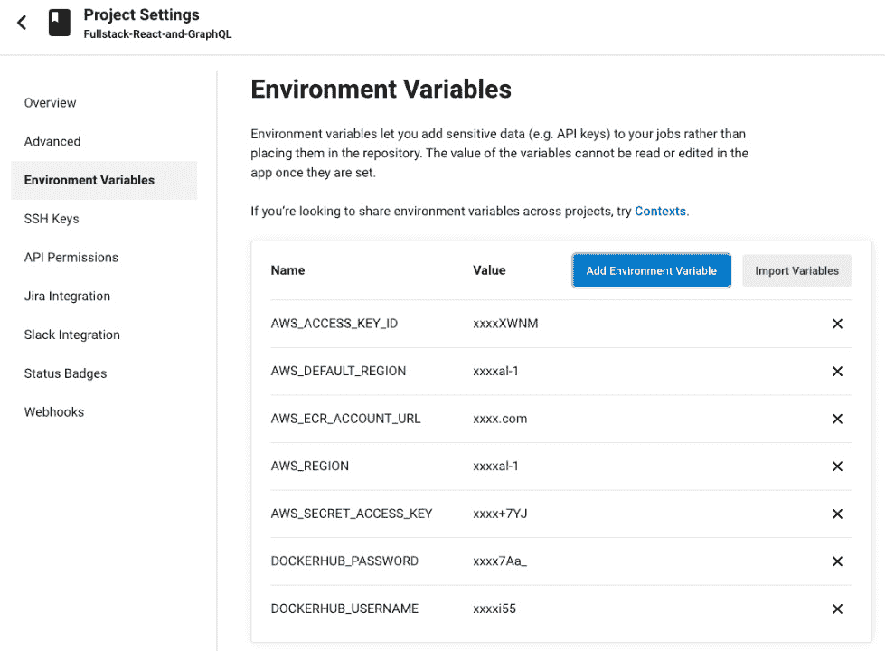

    图 12.41 – CircleCI 项目环境变量

1.  现在，我们需要添加实际运行测试的功能。我们将在 CircleCI 能够理解的`steps`属性内部这样做。只需在之前添加的`jobs`部分下方添加以下代码：

    ```js
        steps:
          - checkout
          - run: npm install
    ```

    测试作业的流程相当简单。首先，我们检出我们的代码，然后安装应用程序所需的所有依赖项。

1.  然后，我们还需要使用与`Dockerfile`中相同的 Sequelize 包来运行数据库迁移。添加以下代码来完成此操作：

    ```js
          - run:
              name: "Install Sequelize"
              command: sudo npm install -g mysql2 
                       sequelize sequelize-cli
    ```

1.  然后，我们需要等待数据库镜像启动。如果我们不这样做，在执行下一步时，如果数据库尚未运行，命令将失败。添加以下代码等待我们的数据库启动：

    ```js
          - run:
              name: Waiting for MySQL to be ready
              command: |
                for i in 'seq 1 10';
                  do
                    nc -z 127.0.0.1 3306 && echo Success 
                      && exit 0
                    echo -n .
                    sleep 1
                  done
                  echo Failed waiting for MySQL && exit 1
    ```

1.  数据库启动后，我们可以对`test`数据库运行数据库迁移。添加以下代码来运行它们：

    ```js
          - run:
              name: "Run migrations for test DB"
              command: sequelize db:migrate 
                --migrations-path src/server/migrations 
                --config src/server/config/index.js 
                --env production
    ```

1.  现在，我们终于可以针对新创建的数据库运行测试了。只需使用以下代码即可使其工作：

    ```js
          - run:
              name: "Run tests"
              command: npm run test
              environment:
                NODE_ENV: production
    ```

    如果其中一个测试失败，整个管道将失败。这确保了只有工作的应用程序代码被发布到公共领域。

1.  要使我们的自动化测试运行，最后一步是设置 CircleCI 工作流程。您可以复制以下代码以使其运行：

    ```js
    workflows:
      build-and-deploy:
        jobs:
          - test
    ```

您可以将此新配置文件提交并推送到您的 Git 仓库，CircleCI 应自动处理它并为您创建一个新的作业。

生成的作业应如下所示：

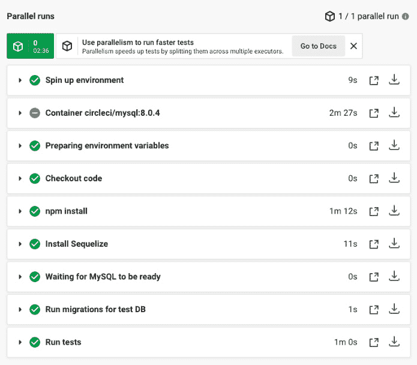

图 12.42 – CircleCI 测试管道

接下来，我们需要构建 Docker 镜像并将其推送到我们的注册表。多亏了 CircleCI，这个过程相当简单。

在版本规范下面的 `config.yml` 文件中添加此配置：

```js
orbs:
  aws-ecr: circleci/aws-ecr@7.2.0
```

CircleCI orbs 是一组可以共享或使用而不需要自己编写所有步骤的包配置。我们刚刚添加的这个 orbs 可以构建并推送 Docker 镜像到 Amazon ECR，这是我们之前章节中设置的。

重要提示

您可以在官方 CircleCI orbs 网站上找到所有可用的 CircleCI orbs 及其文档：[`circleci.com/developer/orbs`](https://circleci.com/developer/orbs)。

要利用此 orbs，请添加一个工作流程步骤，如下面的截图所示：

```js
- aws-ecr/build-and-push-image:
  repo: "graphbook"
  tag: "${CIRCLE_SHA1}"
  requires:
    - test
```

上述配置将构建并推送您的 Docker 镜像到由 `repo` 属性指定的 Amazon ECR，它还将等待 `test` 步骤，因为我们已在 `requires` 属性中提到这一点。

如果您提交并推送此配置，您将在 CircleCI 管道中看到单独的 ECR 步骤。如果该步骤完成，您将能够在 ECR 存储库中找到新的 Docker 镜像。

现在唯一缺少的是在 Amazon ECS 中使用此 Docker 镜像。如果您记得，我们在 Amazon ECS 任务定义中指定了 Docker 镜像。但是，在每次管道运行后手动更新这是不可行的。为了自动化此过程，请在 CircleCI 配置的顶部添加一个额外的 orbs：

```js
aws-ecs: circleci/aws-ecs@02.2.1
```

如果我们想要更新并推送新的任务定义到我们的服务，CircleCI 也为我们提供了支持。要利用此 orbs，请将以下代码作为最后一个工作流程步骤添加：

```js
  - aws-ecs/deploy-service-update:
    requires:
      - aws-ecr/build-and-push-image
      - test
    family: "graphbook-task-definition"
    cluster-name: "graphbook-cluster"
    service-name: "graphbook-service"
    container-image-name-updates: "container=
      graphbook-container,tag=${CIRCLE_SHA1}"
```

此步骤等待测试和 ECR 作业完成。之后，它将在 Amazon ECS 上创建一个具有给定 `family` 名称的新任务定义修订版。然后，它将更新给定集群中具有给定名称的服务。

提交并推送新的配置文件，您将看到以下具有三个正在运行作业的管道：

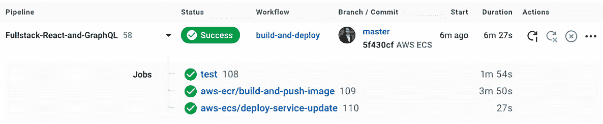

图 12.43 – CircleCI CD 管道

Amazon ECS 将需要一些时间来替换当前正在运行的任务，但在此之后，您应用程序的新版本将开始运行。

然而，问题是我们现在如何访问 Graphbook。为此，我们可以进入我们的 AWS ALB，进入 **负载均衡器** 部分，并点击我们的 ALB。它将显示以下信息：

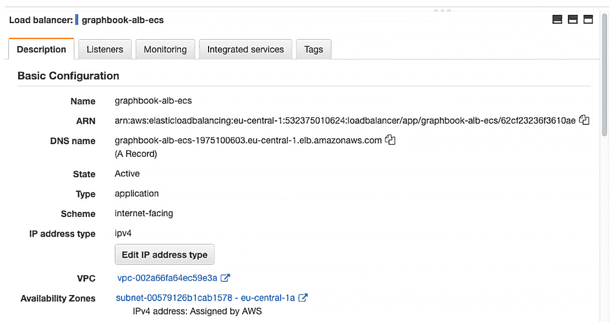

图 12.44 – AWS ALB DNS 名称

在给定的 DNS 名称下，我们可以访问负载均衡器，并通过它访问我们的应用程序。

如前所述，这并不推荐，但完整的 AWS 设置超出了本书的范围。您应该能够通过该链接访问 Graphbook。

这就是你需要做的全部。它将使用我们的测试套件测试应用程序代码，构建并推送一个新的 Docker 镜像，最后更新任务定义和 ECS 服务，用新的任务定义替换旧的任务。

# 摘要

在本章中，你学习了如何使用普通的`Dockerfile`和分阶段构建将你的应用程序 docker 化。

此外，我已经向你展示了如何使用 CircleCI 和 AWS 设置一个典型的 CD 工作流程。你可以在继续使用你的 Docker 镜像的同时，用更复杂的设置替换部署过程。

阅读完本章后，你已经从开发一个完整的应用程序到将其部署到生产环境中的所有内容都学到了。你的应用程序现在应该已经在 Amazon ECS 上运行了。

到目前为止，你已经学到了所有重要的东西，包括使用 Webpack 设置 React，开发本地设置，服务器端渲染，以及如何使用 GraphQL 将所有这些事情结合起来。你也能够通过 CD 频繁地发布更改。展望未来，我们仍然可以改进一些事情——例如，我们应用程序的可扩展性或包拆分，这些内容超出了本书的范围，但有许多资源可以帮助你在这些领域取得进步。

我希望你喜欢这本书，并祝愿你一切顺利！
