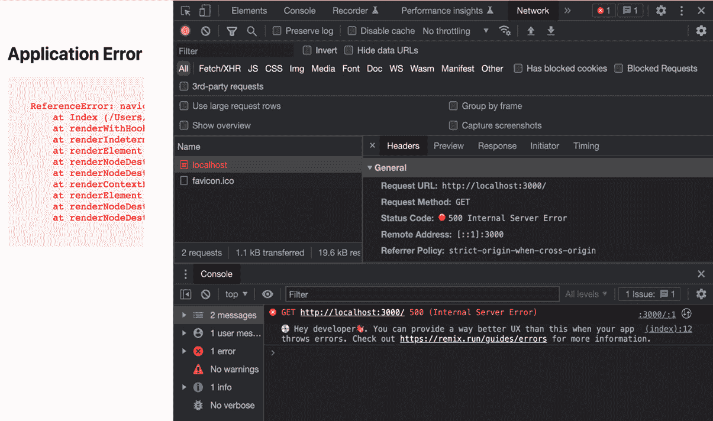

# 第二章：创建新的 Remix 应用程序

开始使用一个新的框架意味着熟悉其原语、约定和杠杆。本书使用一个从零开始构建的演示应用程序。每一章都专注于 Remix 全栈 Web 开发的一个特定主题。在本章中，我们将探索 Remix 的 `create-remix` CLI 脚本的广度，介绍 Remix 的文件和文件夹结构，并熟悉 Remix 的运行时。

本章涵盖了以下主题：

+   创建一个“Hello World!” Remix 应用程序

+   理解 Remix 的文件和文件夹结构

+   探索客户端和服务器环境

+   Remix 应用程序的故障排除

首先，我们将通过使用 `create-remix` CLI 脚本设置一个新的 Remix 项目。然后，章节将向您介绍 Remix 的文件夹结构。我们将调查每个文件并了解其功能。接下来，我们将讨论 Remix 的两个环境：客户端和服务器。您将学习如何在 Remix 中管理客户端和服务器代码。最后，我们将介绍一个故障排除指南，帮助我们调试 Remix 应用程序。

到本章结束时，您将了解如何创建 Remix 项目，并熟悉 Remix 的文件和文件夹结构。您还将了解更多关于 Remix 的客户端和服务器环境以及如何故障排除 Remix 应用程序的信息。

# 技术要求

要完成本章，您需要一个可以运行 Node.js 的计算机。所有常见的操作系统都足够使用。请在您的机器上安装 Node.js 和 `npm`。推荐使用 VS Code 等编辑器。

您可以从这里下载 Node.js 和 `npm`：[`nodejs.org/en/download/`](https://nodejs.org/en/download/)。

本章的解决方案可以在以下位置找到：[`github.com/PacktPublishing/Full-Stack-Web-Development-with-Remix/tree/main/02-creating-a-new-remix-app`](https://github.com/PacktPublishing/Full-Stack-Web-Development-with-Remix/tree/main/02-creating-a-new-remix-app)。请在查看最终代码之前先阅读这一章。

# 创建一个“Hello World!” Remix 应用程序

本节将指导您使用 `create-remix` CLI 脚本创建一个新的 Remix 应用程序。该脚本由 Remix 团队维护，用于启动新的 Remix 项目：

1.  打开一个新的终端窗口并运行以下命令：

    ```js
    npx create-remix@2
    ```

    我们使用 `npx` 来执行 `create-remix` 脚本。`npm` 代表 `create-remix` v2。本书中的示例基于 Remix v2。通过在包名后添加 `@2` 后缀，我们确保我们的第一个演示应用程序安装的是 Remix v2 应用程序。

    对于本书外的项目，我们建议使用以下命令来使用 Remix 的最新稳定版本：

    ```js
    npx create-remix@latest
    ```

1.  如果 `npx` 要求您安装 `create-remix`，请输入 `y` 以回答“是”。

1.  安装 `create-remix` 脚本后，系统会提示我们提供一个有效的 Remix 项目位置：

    ```js
    Where should we create your new project? ./my-remix-app
    ```

    在你的机器上选择一个安装位置或使用 CLI 工具提供的默认安装位置。

    按下 *Enter* 后，脚本会告诉我们它选择了基本模板，也称为 **Remix App Server**。如果没有指定其他模板，脚本默认使用基本模板。我们将在下一节中了解更多关于模板的内容。

1.  脚本提示我们初始化一个新的 Git 仓库。选择 **是**：

    ```js
    Initialize a new git repository? npm install:

    ```

    使用 npm 安装依赖项？npm install 已完成。接下来，使用终端导航到新创建的项目文件夹：

    ```js
    cd ./my-remix-app
    ```

    恭喜你初始化了你的第一个 Remix 项目！让我们启动本地开发服务器。

    ```js

    ```

1.  以下命令启动我们的 Remix 应用程序本地运行：

    ```js
    npm run dev
    > dev> remix dev 💿  remix dev info  building... info  built (204ms)Remix App Server started at http://localhost:3000 (http://10.0.0.173:3000)
    ```

    请注意 Remix 构建的速度有多快。在 204 毫秒内构建完成——这就是 esbuild 的力量。确切的毫秒数会根据你的系统而变化，但令人惊讶的是，我们可以在毫秒级别讨论构建时间！

1.  在你的浏览器中打开指定的 URL：`http://localhost:3000`。它应该渲染一个简单的 HTML 页面。

    恭喜你在本地运行了你的第一个 Remix 应用程序！然而，如果没有在屏幕上打印“Hello World”，那就不是一个“Hello World”项目。

1.  使用你选择的编辑器打开 Remix 项目。在编辑器中，打开位于 `app/routes` 的 `_index.tsx` 文件。你会找到一个导出 React 组件的文件。删除现有的 JSX 代码，并用以下代码替换：

    ```js
    export default function Index() {  return (    <h1>Hello World!</h1>  );}
    ```

    注意，Remix 默认使用 TypeScript。如果你之前没有使用过 TypeScript，请不要担心。我们只有少数几个地方需要直接处理 TypeScript。大多数情况下，我们可以享受类型推断和自动完成，而无需自己编写类型。

1.  保存文件更改。现在，你的浏览器标签应该会自动重新加载并显示更新后的 HTML：**Hello World!**

`create-remix` CLI 脚本使得创建新的 Remix 应用程序变得简单。在本节中，我们使用默认模板初始化了一个简单的 Remix 应用程序，并在屏幕上渲染了 **Hello World!**。接下来，让我们检查初始化的文件夹结构。我们将检查每个文件并研究其功能。

# 理解 Remix 的文件和文件夹结构

Remix 承担了编译器、路由器和运行时的责任。它为应用程序提供了基础和框架。因此，它为应用程序提出了一个骨架文件夹结构。一些文件作为入口点，你可以将其连接到应用程序中。其他文件可以用来配置 Remix。让我们回顾一下我们的初始化 Remix 应用程序。

存在哪些文件和文件夹取决于创建过程中的所选配置选项。然而，大多数文件都是所有设置的组成部分。选择基本 Remix App Server 模板会产生以下文件和文件夹结构：

```js
my-remix-app├── .eslintrc.js
├── .gitignore
├── README.md
├── app
│   ├── entry.client.tsx
│   ├── entry.server.tsx
│   ├── root.tsx
│   └── routes
│       └── _index.tsx
├── package.json
├── public
│   └── favicon.ico
├── remix.config.js
├── remix.env.d.ts
└── tsconfig.json
```

让我们看看每个文件和文件夹。Remix 随带一个 `.eslintrc` 文件，该文件配置 ESLint 以扩展 Remix 的 ESLint 扩展。你可以根据你的代码检查和格式化偏好调整或删除此文件。

当初始化一个新的 Git 仓库时，Remix 也会创建一个 `.gitignore` 文件。该文件被设置为忽略 Remix 的构建工件、临时文件，例如 `.cache` 文件夹，以及其他常见的被忽略的文件和文件夹。你可以根据你应用程序的需求更新此文件。

每个新创建的项目都附带一个 `README.md` 文件。该文件包含有关如何运行和部署你的应用程序的重要信息。文档根据所选模板而有所不同。确保在启动新的 Remix 应用程序时阅读 `README.md` 文件。

接下来，让我们继续看 `package.json` 文件。如果你之前已经与基于 Node.js 的项目合作过，你应该熟悉其内容。Remix 的 `package.json` 文件包含你预期的所有部分：

+   `scripts`

+   `dependencies`

+   `devDependencies`

`scripts` 部分包含一组脚本来在本地运行你的 Remix 应用程序、构建你的应用程序以及在生产中运行你的应用程序。通常，这些脚本的名称为 `dev`、`build` 和 `start`。你的应用程序可能根据所选模板包含额外的脚本。

抽时间调查 `dependencies` 和 `devDependencies` 部分。你可能会注意到 Remix 被分割成几个包。一些是依赖项，而其他是 `dev` 依赖项。一个值得强调的依赖项是正在使用的适配器。

我们在上一章中学到，Remix 可以在任何可以执行 JavaScript 的地方运行。Remix 的服务器端 HTTP 请求处理器使用适配器在不同的 JavaScript 运行时和服务器环境中运行。每个 Remix 应用程序使用一个位于 Remix 和网络服务器之间的适配器。

基本模板使用 `@remix-run/serve` 包在 Node.js 服务器环境中运行。该包实现了 Remix 应用服务器，一个生产就绪的 Express.js 服务器。与其他模板相比，Remix 应用服务器不暴露 Node.js 服务器设置。非常适合开始使用。

接下来，让我们看看 `public` 文件夹。`public` 文件夹包含在互联网上公开的静态文件和资产。目前，该文件夹包含一个 `favicon.ico` 文件。

在本地运行应用程序 (`npm run dev`) 之后，文件夹应进一步包含一个 `build` 文件夹。该文件夹是包含你的捆绑应用程序代码的两个 `build` 文件夹之一。要构建你的应用程序，定位你的终端并运行 `npm run build`。这将根据你最新的代码更改生成两个用于生产的捆绑包。

Remix 包含一个客户端和一个服务器应用程序。在编写你的 Remix 应用程序时，你需要为两个不同的环境、运行时和应用编写代码。客户端应用程序代码被打包到 `public/build` 文件夹中。这些文件通过互联网公开，并且可以从浏览器中获取。

如果你查看 `public/build` 文件夹，你会注意到每个 JavaScript 模块文件名都以哈希结尾。这个哈希被称为文件的指纹。不能有两个文件名相同但内容不同的文件。这简化了缓存。由于文件的新版本意味着生成了一个新文件，因此我们可以永久缓存每个文件，而无需处理缓存失效问题。如果你的应用程序的新版本中模块的内容发生了变化，那么它将有一个不同的唯一文件名，并且将被重新加载。

在 `public/build` 文件夹中，你还可以找到清单文件（`manifest-*.js`）。Remix 编译一个资产清单，用于路由请求和定位资产。由于清单必须由客户端访问，它也是 `public/build` 包的一部分。

让我们来看看 `remix.config.js` 文件。这个 JavaScript 文件导出一个 `AppConfig` 配置对象。这个文件可以用来配置 Remix、启用未来标志和覆盖 Remix 的默认行为。通常，你不需要修改这个文件。然而，由于其内容可能取决于你选择的模板和适配器，因此在切换模板或适配器时可能相关。我们将在本书的后面部分学习如何切换适配器。

接下来，让我们检查 `remix.env.d.ts` 文件。这个文件包含 TypeScript 编译器的信息。该文件包含三斜杠指令，声明了应用程序所依赖的包。这些声明告诉 TypeScript 你的应用程序依赖于 Remix 的包。

最后，是 `tsconfig.json` 文件——或者如果你选择了一个没有 TypeScript 的模板，则是 `jsconfig.json` 文件。这些配置文件包含 TypeScript 编译器的配置选项，并用于打包和编译你的 Remix 应用程序。

现在我们已经访问了所有顶级文件和文件夹，让我们来看看 `app` 文件夹。这是 Remix 应用程序所在的地方，也是我们编写应用程序代码的地方。Remix 会用一系列启动文件填充这个文件夹。`entry.server.tsx` 和 `entry.client.tsx` 文件分别作为客户端和服务器框架的入口点。

`entry.client.ts` 文件包含作为客户端入口点的代码。其职责是使 React 保持活性，从而在客户端初始化类似 SPA 的体验。Remix 提供了入口文件，以便您根据您的用例进行适配。该文件可以作为一个很好的地方来放置任何在客户端应用程序首次加载时只需执行一次的代码。您也可以删除该文件，在这种情况下，Remix 将回退到默认实现。

`entry.server.tsx` 文件将其默认导出为 `handleRequest` 函数。`handleRequest` 函数在传入的请求上被调用，并生成 HTTP 响应。`handleRequest` 的一般流程如下：`handleRequest` 使用请求对象和一些附加参数被调用。该函数在服务器端渲染 React。渲染的标记被返回，并包装在一个新的 `Response` 对象中，然后返回给适配器代码，适配器代码将响应传递给服务器以向客户端提供服务。

让我们来看看 `root.tsx` 文件和 `routes` 文件夹。Remix 使用基于文件的路由解决方案。`routes` 文件夹中的每个文件都被视为路由树中的嵌套路由模块。文件夹的文件和文件夹层次结构映射到路由层次结构。每个文档/UI 路由都必须导出一个 React 组件。

`root.tsx` 文件包含根文档路由模块。因此，它也将其默认导出为一个 React 组件：

```js
export default function App() {  return (
    <html lang="en">
      <head>
        <meta charSet="utf-8" />
        <meta name="viewport" content="width=device-width,initial-          scale=1" />
        <Meta />
        <Links />
      </head>
      <body>
        <Outlet />
        <ScrollRestoration />
        <Scripts />
        <LiveReload />
      </body>
    </html>
  );
}
```

注意，Remix 管理整个 HTML 文档，包括 `<html />` 标签和 React 中的 `<head />` 标签。这使我们能够完全控制 HTML 文档的结构。使用 Remix，您可以有条件地渲染元标签，更改 `lang` 属性，或有条件地添加和删除客户端 JavaScript (`<Scripts />`)。

`root.tsx` 文件中的路由组件渲染了 Remix 的几个内置组件：

+   `Meta`

+   `Links`

+   `Outlet`

+   `ScrollRestoration`

+   `Scripts`

+   `LiveReload`

`Meta` 组件将定义在 `meta` 导出中的元标签添加到 HTML 文档中。同样，`Links` 组件将定义在 `links` 导出中的链接添加到 HTML 文档中。您将在 *第九章* 中了解更多关于 `Meta` 和 `Links` 组件的信息，*资源和* *元数据管理*。

与您可能预期的 `{children}` 不同，Remix 提供了一个 `Outlet` 组件来指定渲染子路由的位置。您将在 *第四章* 中了解更多关于 `Outlet` 组件和子路由嵌套的信息，*Remix 中的* *路由*。

`ScrollRestoration` 组件管理所有客户端导航的滚动位置。SPA 避免完整的页面重新加载，而是使用 JavaScript 在客户端渲染新的页面。`ScrollRestoration` 组件用于模拟浏览器的默认行为，并在使用浏览器的后退和前进按钮时恢复滚动位置。

`Scripts` 组件可能是 Remix 提供的最迷人的组件之一。该组件将捆绑的 Remix 应用程序的所有脚本标签添加到 HTML 文档中。通过移除 `Scripts` 组件，我们可以从 Remix 应用程序中移除所有客户端 JavaScript。

`LiveReload` 组件在开发过程中触发页面重新加载，每当开发服务器检测到任何文件更改时。`LiveReload` 是 Remix 开发服务器设置的一部分，在生产环境中不使用。

注意，Remix 通过公开其内置组件何时以及如何渲染来提供对其内部工作的控制。例如，如果我们对开发过程中的实时重新加载不感兴趣，我们只需移除 `LiveReload` 组件。如果我们想在没有客户端 JavaScript 的情况下开发静态页面，我们可以移除 `Scripts` 组件。

`routes` 文件夹包含您的 Remix 应用程序的所有其他路由。到目前为止，它只包含一个 `_index` 路由。`_index` 路由是其父路由的默认子路由，并共享相同的 URL。当前 `_index` 路由映射到 `/` 路径名。我们将在 *第四章*，*Remix 中的路由* 中了解所有关于路由的内容。

那是相当多的文件！Remix 充当您的编译器、路由器和运行时。因此，Remix 必须了解您的编译器配置和代码的位置。此外，作为您的运行时，它还必须了解所有您的路由模块。由于 Remix 不是一个服务器，它必须将这些入口点暴露给服务器环境。大多数时候，您不需要触摸这些入口点和配置文件。然而，如果您需要，可以轻松地更改这些文件的内容并将应用程序逻辑钩入这些位置。

现在，我们已经了解了 Remix 的文件夹结构，并调查了 Remix 的配置和项目文件，我们将进一步了解您的 Remix 应用程序的两种环境。

# 探索客户端和服务器环境

在本节中，您将了解每个 Remix 应用程序的两种环境：客户端和服务器。首先，我们将了解代码在运行时是如何执行的。接下来，您将了解在哪里编写您的客户端和服务器代码，以及如何帮助 Remix 的编译器识别哪些属于客户端捆绑包，哪些属于服务器捆绑包。

## 您的 Remix 应用程序的两个捆绑包

Remix 应用程序服务器不公开其服务器设置，但大多数其他模板都这样做。在本节中，我们将使用 Express.js 模板来回顾 Remix 如何与 Web 服务器交互。

按照以下步骤启动 Express.js Remix 应用程序：

1.  在终端中运行以下 `create-remix` 命令：

    ```js
    --template flag points to a folder on GitHub.com, using the following pattern: :username/:repository/:path-to-folder. You can learn more about the different --template options by calling npx create-remix@latest --help.
    ```

1.  为此 Remix 应用程序选择一个新的文件夹位置，并按照上一节中练习的提示进行操作。

1.  回顾新的 Remix 应用程序。将`package.json`文件与上一节中的 Remix App Server 的`package.json`文件进行比较。`dependencies`和`scripts`部分有何不同？

1.  接下来，打开`server.js`文件。该文件包含设置新 Express.js 应用程序的代码。让我们一起来审查这段代码，并讨论最重要的方面。

    注意，`createRequestHandler`是从 Remix 的 Express.js 适配器（`@remix-run/express`）导入的。

    接下来，Remix 应用程序的服务器构建是动态导入的：

    ```js
    const BUILD_PATH = path.resolve("build/index.js");const initialBuild = await reimportServer();
    const app = express();
    Anything put into the `/public` folder is accessible over the internet. All other requests to the web server are then forwarded to Remix’s HTTP handler:

    ```

    `app.all("*", process.env.NODE_ENV === "development" ? createDevRequestHandler() : createRequestHandler(initialBuild));`

    ```js

    The `createRequestHandler` function acts as an `handleRequest`) found in `entry.server.tsx`. The wrapper function handles requests according to the underlying server environment and translates incoming requests into a format understood by Remix. The wrapper function also translates Remix’s `Response` into instructions understood by the server environment.Finally, we start the Express.js application by calling `app.listen`. All incoming requests are mapped from our Express.js app to Remix.
    ```

注意，服务器环境被通知了 Remix 应用程序的客户端和服务器包。客户端包通过互联网暴露。服务器包传递给 Remix 适配器，并在传入的请求上调用。

Remix 是一个 HTTP 请求处理器

Remix 不是一个 Web 服务器，而是一个在服务器环境中运行的 HTTP 请求处理器。Remix 使用适配器与底层服务器进行通信。

Remix 的适配器代码在服务器环境中使用。适配器将来自服务器环境的请求传递给我们的 Remix 应用程序，并使用服务器环境的原语来管理我们的 HTTP 处理器的响应。根据所选模板和部署目标，服务器代码会有所不同。

使用 Remix，我们对`server.js`文件拥有完全的控制权。如果需要，我们可以将钩子插入到服务器代码中并添加额外的逻辑。例如，我们可以在我们的 Express.js 应用程序中添加一个 WebSocket 服务器，并让它与我们的 Remix 应用程序并行运行。Remix 的架构为我们应用程序的运行时提供了完全的控制权。

接下来，让我们在`app`文件夹内编写一些应用程序代码。

## 客户端和服务器代码

使用 Remix，你可以充分利用整个 Web 平台。在本节中，我们将学习如何在 Remix 中编写客户端和服务器代码。

在本章的早期部分，我们在第一个 Remix 应用程序的首页上打印了**Hello World!**。我们使用了以下代码在屏幕上渲染一个 React 组件：

```js
export default function Index() {  return (
    <h1>Hello World!</h1>
  );
}
```

让我们调查 Remix 的客户端和服务器运行时：

1.  在编辑器中打开你的`Hello World!` Remix 应用程序，并在`app/_index.tsx`中的`function`组件里添加一个`console.log`语句：

    ```js
    export default function Index() {console.log is executed anytime our React component renders.
    ```

1.  在本地启动 Remix 应用程序。在你的终端窗口中，在项目根目录下执行`npm run dev`。你能猜到`console.log`语句会被运行多少次吗？

1.  在新浏览器标签页中打开应用程序。

1.  接下来，回顾你执行`npm run dev`命令的终端。你将看到终端中打印了“Another hello to the world!”。

    ```js
    Remix App Server started at http://localhost:3000 (http://10.0.0.37:3000)Another hello to the world!GET / 200 - - 66.536 ms
    ```

    终端连接到我们的服务器端环境。在浏览器标签中访问网页会创建一个针对网络服务器的 `GET` 请求。`GET / 200` – 对 `/` 路径的 `GET` 请求以状态码 `200` 响应。

    首先，请求被底层服务器环境接收。网络服务器调用 Remix 的适配器回调，适配器将请求转发到 Remix 的 `handleRequest` 函数。然后 Remix 在服务器上渲染 React 应用程序。当我们的 `Index` React 组件执行时，`console.log` 语句被调用，将语句打印到终端。最终，`console.log` 在服务器上只执行了一次。但这就是全部吗？

1.  导航到你的浏览器窗口，并在显示 Remix 应用的标签中打开开发者工具。在开发者工具中，导航到 `entry.client.ts` 文件。在这里，Remix 重新激活你的 React 应用程序。React 在客户端重新渲染并再次渲染 `Index` 组件。因此，`console.log` 语句在服务器上执行一次，然后在客户端也执行一次。

你的 Remix 应用程序的 React 代码在服务器和客户端上运行。然而，有些代码应该只运行在服务器或客户端上。例如，`entry.client.tsx` 模块应该只运行在客户端，而 `entry.server.tsx` 模块应该始终只在服务器上执行。

同样重要的是，没有任何服务器端代码会进入客户端包。客户端包中的代码在互联网上暴露。想想你的 API 令牌和其他可能存在于你的后端逻辑中的秘密。此外，浏览器和服务器环境不同。Node.js API 在客户端不可用，而浏览器的全局 `window` 对象在 Node.js 中不可用。服务器端代码在客户端执行时可能会抛出错误，反之亦然。

Remix 是你的编译器，将你的代码打包成服务器和客户端包。但我们如何告诉 Remix 为服务器打包什么，为客户端打包什么？大多数时候，Remix 可以自己找出答案。Remix 使用“摇树”来过滤你的代码，并试图推断哪些代码属于哪个包。然而，你也可以明确地告诉编译器——以及正在你项目上工作的开发者——代码应该只在两个环境中的一个中执行。

Remix 提供了一种约定来标记文件为纯服务器端或客户端模块。在文件名末尾添加 `.client.` 或 `.server.` 告诉 Remix 的编译器分别避免将这些文件包含在服务器或客户端包中。例如，你可以将你的数据库设置文件命名为 `db.server.ts` 以明确排除它从客户端包中。同样，你可以将导入客户端库的文件命名为 `libs.client.ts` 以明确避免在服务器上导入这些包。

你可能已经注意到，入口文件（`entry.server` 和 `entry.client`）都遵循这个约定。你可以随意在两个入口文件中添加 `console.log` 语句，并识别每个语句的执行位置——终端窗口或浏览器 **控制台** 选项卡。

注意，一些文件不能声明为服务器或客户端文件。例如，`/routes` 文件夹中的路由模块不能声明为客户端或服务器文件，因为它们可能包含客户端和服务器代码。

在本节中，你了解了更多关于通过你的 Remix 应用程序进行 `GET` 请求的代码流程。你了解到 Remix 在服务器上接收 `GET` 请求并在客户端和服务器上渲染你的 React 应用程序。你的 Remix 应用程序中的一些代码在两个环境中运行，而其他代码则应该只在其中一个环境中运行。

Remix 在客户端和服务器上运行。学习如何在两个环境中进行故障排除至关重要。在下一节中，你将了解更多关于如何解释 Remix 应用程序中的错误消息以及在哪里获得帮助。

# 故障排除 Remix 应用

在本节中，你将了解更多关于调试 Remix 应用程序的知识。首先，我们将为你提供一个在开发 Remix 时处理问题的通用流程。接下来，我们将记录如何最好地搜索答案并从社区中获得帮助。

## 一个 Remix 故障排除过程

Remix 不是一个服务器，而是在一个网络服务器和底层服务器运行时环境之上运行。Remix 作为 HTTP 请求处理器，编排你的路由，在运行时执行你的代码，并作为你的编译器。可能会有很多问题发生。这就是为什么在 Remix 中练习调试过程很重要。

在最后一节中，我们了解了 Remix 的两个环境，客户端和服务器。Remix 在服务器上运行，然后在浏览器中执行逻辑。因此，在调试你的 Remix 应用程序时，我们必须调查客户端和服务器环境。让我们分解 `Hello World!` 应用程序：

1.  将以下有问题的代码添加到你的 `Hello World!` 应用程序中的 `app/routes/_index.tsx` 文件：

    ```js
    export default function Index() {navigator interface to access user agent information. Our goal is to greet the user based on their user agent.
    ```

1.  如果应用程序尚未运行，请运行 `npm run dev` 来启动应用程序。

1.  在新浏览器窗口中访问 Remix 应用或刷新现有窗口。不幸的是，你会注意到应用程序抛出一个错误。页面应该显示标题 **应用程序错误**。哎呀！让我们开始调试。

### 1. 信任错误消息

如果出现问题，你应该首先检查运行 Remix 的本地终端。你应该能够在终端中看到以下错误消息：

```js
ReferenceError: navigator is not defined
```

你可能需要滚动一下才能找到堆栈跟踪上面的相关行。此外，错误消息也应该在浏览器标签页中显示。当出现问题时，Remix 会显示一个回退错误页面。页面上的错误消息比终端上的更易读，但考虑终端是故障排除的真相来源。在这种情况下，两个错误都是匹配的。看起来 `navigator` 对象未定义。

### 2. 定位到该行

让我们更详细地调查终端中的错误消息。我们可以利用堆栈跟踪来了解哪个文件抛出了错误，并沿着函数调用堆栈向下跟踪堆栈跟踪。你应该能够看到 `app/routes/_index.tsx` 文件抛出了错误。看起来这是一个应用程序错误，而不是 Remix 或依赖项的错误，因为是我们自己的代码出了问题。

### 3. 构建时间或运行时

接下来，注意错误仅在我们从网络服务器请求页面后发生。由于 `npm run dev` 成功而没有抛出任何错误，这是一个运行时问题，而不是构建时问题。服务器启动时也没有抛出错误。这表明错误发生在请求处理器中，而不是在服务器启动代码中。

### 4. 控制台和网络标签页

让我们在浏览器窗口中打开开发者工具。点击 **控制台** 标签以查看任何记录的客户端错误。以下错误应该显示出来：

```js
GET http://localhost:3000/ 500 (Internal Server Error)
```

一个 `GET` 请求因内部服务器错误而失败。我们进一步调查，通过导航到 **网络** 标签，如下所示：



图 2.1 – 介绍网络标签页

**500**。在 **响应** 标签页（*图 2.1* 中未显示），我们可以进一步看到 Remix 返回了一个 HTML 文档 – 我们在屏幕上看到的 **应用程序错误** 文档。

发生了什么？网络服务器尝试处理 `GET` 请求，但抛出了 `ReferenceError`。错误被 Remix 捕获。Remix 向浏览器返回了一个错误响应文档。Remix 使用状态码 `500` – 内部服务器错误的状态码 – 来告诉我们和浏览器，响应是一个错误响应。

### 5. 关闭并重新启动

如果我们到目前为止无法识别错误，清理可能影响我们本地开发服务器的任何临时文件是一个好主意。如果开发服务器仍在运行，请停止它。然后运行以下命令来清理所有临时的 `build` 艺术品：

```js
rm -rf build public/build .cache
```

这将删除所有临时文件和文件夹。接下来，在终端中执行 `npm run dev` 来重新启动开发服务器。这将触发新的构建，并导致本地环境清理。错误仍然存在吗？在我们的情况下，它确实存在，但我们能够验证错误不是由于构建损坏造成的。

### 6. 在 Google 上搜索这个问题

对于这个问题，你会使用什么 Google 搜索查询？也许看看是否能在 Google 上找到这个问题。我可能会使用以下搜索之一：

+   `Navigator undefined` `服务器渲染的 React`

+   `服务器抛出` `navigator undefined`

+   `Remix 在服务器上抛出 navigator not defined`

问题是 `window` 元素和其他浏览器全局变量在 Node.js 中不存在。由于我们尝试在服务器上执行 React 组件，它抛出 `ReferenceError` – 这不是 Remix 的问题，但在服务器上渲染 React 代码时的一个常见陷阱。问题解决！

这种错误的快速修复方法是使用 `useEffect` 调用包裹对浏览器 API 的引用：

```js
import { useEffect, useState } from "react";export default function Index() {
  const [userAgent, setUserAgent] = useState('the World');
  useEffect(() => {
    setUserAgent(navigator.userAgent);
  }, []);
  console.log(`Another hello to ${userAgent}!`);
  return (
    <h1>Hello to {userAgent}!</h1>
  );
}
```

`useEffect` 仅在初始渲染后运行。由于我们在服务器上只渲染一次，我们知道 `useEffect` 只在客户端执行，永远不会在服务器上执行。我们可以在 `useEffect` 中安全地调用浏览器 API。

你能想到这种方法的任何缺点吗？重新加载你的应用程序并查看终端。它记录了 `Another hello to the world!`。在服务器上，我们没有访问 `navigator` 对象的权限，而是使用 React 状态的默认值。我们只在客户端重新渲染适当的问候消息。

如果 JavaScript 加载失败或被禁用怎么办？如果请求是由不运行 JavaScript 的网络爬虫发起的怎么办？在慢速互联网连接上，布局可能会闪烁，用户可能会先看到服务器值，然后在 JavaScript 加载后更新一次。这不是一个好的用户体验。

Remix 提供了在服务器上处理用户数据的实用工具 – 完全不需要使用 `useEffect`。大多数时候，我们可以避免客户端-服务器状态不匹配。目前，我们可以满意地认为我们解决了问题，并学会了如何在 Remix 中调查错误。我们可以将描述的故障排除过程总结如下：

1.  在终端中查找并阅读错误消息。

1.  定位产生错误的文件。

1.  理解这是构建时错误还是运行时错误。

1.  检查浏览器开发者工具以获取更多上下文。

1.  删除所有构建工件并重试。

1.  在 Google 上搜索问题。

接下来，我们将专注于 *第 6 步*。成功的调试需要练习和经验。通常，你只需要使用 Google。在下一节中，我们将记录在处理 Remix 时如何找到答案。

## 寻找答案

成功的调试需要练习。一旦你遇到一次或两次问题，你将更快地找出根本原因。在此之前，在网上寻找解决方案是良好的实践。在本节中，你将学习如何在处理 Remix 时获得帮助。

按照上一节中概述的故障排除过程进行操作。收集尽可能多的信息非常重要。一旦你开始制定你的问题或疑问，你会发现彻底的调查可能已经提供了答案。至少它将帮助你确定在线搜索的正确关键词。

我们在开发过程中遇到的大多数问题都与 Remix 无关。大多数错误发生是因为在服务器上渲染 React、意外在客户端运行服务器代码，或者因为 node 包的问题。在这些情况下，Stack Overflow、GitHub 和其他地方可能包含我们寻求的答案。

如果不是这样，那么我只能鼓励你加入 Remix Discord 服务器([`discord.com/invite/xwx7mMzVkA`](https://discord.com/invite/xwx7mMzVkA))。Remix 社区非常支持。

在提问之前，请确保使用 Discord 的搜索功能查看问题是否已经被提出并解答。这样可以节省每个人的时间。通过遵循故障排除过程，你应该能够提供足够多的上下文，以帮助社区调试你的代码。提供代码片段（或者更好的是，一个代码沙盒或公共仓库）也将大大提高社区帮助你解决问题的可能性。Remix 社区非常棒，Discord 是一个寻求帮助的好地方。

如果你遇到 Remix 原语或约定的相关问题，请参考 Remix 文档。以下页面汇总了常见的问题：[`remix.run/docs/en/2/guides/gotchas`](https://remix.run/docs/en/2/guides/gotchas)。这些问题更难调试。提前了解它们可以节省你昂贵的调试时间。

在本节中，你学习了如何在处理 Remix 时解决问题。你通过一个示例错误并应用提出的调试过程来揭示根本原因。你还进一步学习了如何在线搜索答案以及在哪里提问。

# 摘要

在本章中，我们创建了我们的第一个 Remix 应用程序。我们使用 Remix 的`create-remix` CLI 脚本来启动一个带有基本模板的 Remix 应用程序，以及使用 Remix 的 Express.js 模板。

通过遵循本章，你学习了如何使用`npm run dev`和`npm run build`在本地构建和运行 Remix 应用程序。更重要的是，你了解了如何找到所有可用的脚本（`package.json`）以及运行特定模板的附加信息（`README.md`）。

我们回顾了 Remix 的文件和文件夹结构。阅读本章后，你了解了客户端和服务器入口点：`entry.client.tsx`和`entry.server.tsx`。

我们也花了一些时间调查了`root.tsx`文件。`root.tsx`文件作为路由树的根。Remix 利用 React 渲染完整的 HTML 文档，包括头部、打包的脚本、链接和元标签。这提供了对屏幕上渲染内容的完全控制。

我们更改了 `_index` 路由的代码，并在屏幕上渲染了 `Hello World!`。接下来，我们研究了 Remix 的两个环境：客户端和服务器。您了解到 Remix 在浏览器和 Web 服务器上运行。Remix 将应用程序代码编译成客户端和服务器构建。Web 服务器在运行时将客户端代码作为静态文件暴露，同时调用服务器包来处理传入的请求。

Remix 使用适配器在不同的 Web 服务器和服务器运行时上运行。适配器管理我们的 Remix 应用与底层服务器代码之间的通信。

最后，我们通过解决一个示例错误来练习了 Remix 应用的故障排除。您学习了如何通过查看服务器的终端和浏览器中的 **控制台** 选项卡来调查错误。您还练习了在线搜索问题，并发现可以向 Remix 社区寻求帮助的地方。

在下一章中，您将了解有关不同模板、部署目标、适配器和 Remix 栈的更多信息。我们将比较不同的服务器运行时和部署环境，以便您为您的 Remix 应用选择正确的选项。您还将被介绍到 `Bee-Rich`，这是本书的演示应用程序。准备好按照本书的章节从头到尾构建一个 Remix 应用程序吧！

# 进一步阅读

您不需要使用 `create-remix` 来引导新的 Remix 项目。您也可以通过安装 Remix 的依赖项并自行设置文件和文件夹结构从头开始。如果您对这个方法感兴趣，请遵循 Remix 文档中的 5 分钟教程：[`remix.run/docs/en/2/start/quickstart`](https://remix.run/docs/en/2/start/quickstart)。

我们向您介绍了 Remix 应用服务器。您可以在以下链接中了解更多关于 Remix 基本模板的信息：[`remix.run/docs/en/2/other-api/serve`](https://remix.run/docs/en/2/other-api/serve)。

如本章前面所述，请参考 Remix 的自身故障排除指南以获得常见问题的帮助：[`remix.run/docs/en/2/guides/gotchas`](https://remix.run/docs/en/2/guides/gotchas)。
