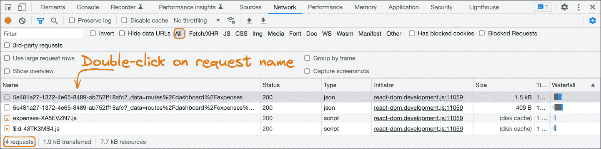
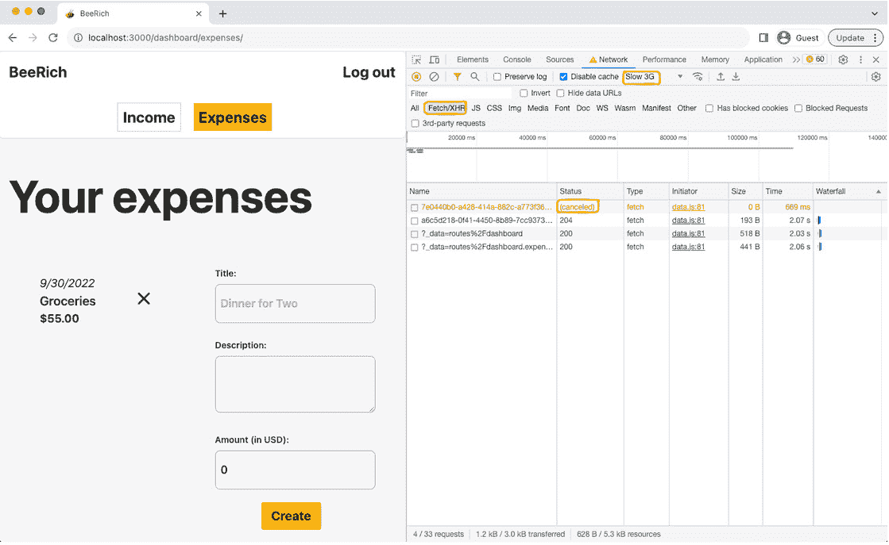

# 第六章：提升用户体验

Remix 使我们能够以渐进增强为前提构建应用程序。在 Remix 中，通过进行增量更改来提升用户体验。这允许我们遵循一个简单的步骤过程来构建我们的应用程序。

在*第五章*“获取和变更数据”中，我们向 BeeRich 应用程序添加了数据加载和变更。在构建创建费用表单时，我们首先实现了无需 JavaScript 的 UI，然后使用 JavaScript 增强了浏览器的默认行为。通过这样做，我们逐步提升了体验。

在本章中，我们将涵盖以下主题：

+   理解渐进增强

+   预取数据

+   与动作数据一起工作

+   处理并发变更

首先，我们将正式说明渐进增强在 Remix 中的工作方式。之后，我们将关注高级数据加载和变更主题，包括如何预取加载器数据和资源。接下来，我们将学习如何访问动作数据以显示变更反馈。最后，我们将学习如何在 Remix 中支持并发变更。

阅读本章后，您将了解以渐进增强为前提工作的好处。您还将学习如何预取数据、处理动作数据以及同时处理多个表单提交。 

# 技术要求

在开始本章之前，请遵循 GitHub 上本章文件夹中的`README.md`文件中的说明。您可以在以下位置找到本章的代码：[`github.com/PacktPublishing/Full-Stack-Web-Development-with-Remix/tree/main/06-enhancing-the-user-experience`](https://github.com/PacktPublishing/Full-Stack-Web-Development-with-Remix/tree/main/06-enhancing-the-user-experience)。

# 理解渐进增强

在本节中，我们将深入了解渐进增强背后的动机，并介绍以渐进增强为前提的最佳实践。

渐进增强是一种设计理念，旨在为旧设备和浏览器上的用户提供一个基本用户体验。以渐进增强为前提构建就像设计移动端优先；你从一个适用于小屏幕的最小 UI 开始，然后逐步发展。

一个较少使用的术语是**优雅降级**。优雅降级描述了一个类似的概念：在支持旧版浏览器和设备的同时，努力提供最佳的用户体验。渐进增强是从下往上工作，而优雅降级则是从上往下工作。

## Remix 中的渐进增强

Remix 通过利用网络标准使我们能够构建高度动态的用户体验。默认情况下，Remix 无需 JavaScript 即可工作。当考虑到渐进增强时，我们可以向上提升体验，但仍然在 JavaScript 仍在加载、加载失败或被禁用时保持其可访问性和可用性。

在*第四章* *Remix 中的路由*中，我们学习了 Remix 的`Link`和`NavLink`组件。这些组件在 JavaScript 的帮助下增强了浏览器的默认行为。如果没有 JavaScript，Remix 的`Link`和`NavLink`组件仍然会渲染一个浏览器可以与之交互的锚点标签。

如果 JavaScript 可用，`Link`和`NavLink`将执行客户端导航并从服务器获取 fetch 加载器和资源数据，而无需重新请求完整的 HTML 文档。客户端导航旨在通过避免重复下载整个 HTML 文档来减少响应时间。

Remix 还支持数据变更的渐进增强。当使用 Remix 的`Form`组件时，我们再次让 Remix 增强体验。如果 JavaScript 可用，Remix 将阻止浏览器默认行为并启动对指定操作的 fetch 请求。然而，如果没有 JavaScript，我们仍然渲染一个浏览器可以与之交互的表单元素。Remix 能够回退到原生表单提交。

Remix 提供了创建高度动态但渐进增强体验的工具。当考虑到渐进增强时，第一步是使其在没有 JavaScript 的情况下工作。

## 使其在没有 JavaScript 的情况下工作

在没有 JavaScript 的情况下使其工作使我们能够保持简单并利用浏览器的默认行为。

有几个原因可能导致客户端上没有 JavaScript 可用：

+   当用户与页面交互时，JavaScript 仍在加载，或 React 仍在激活。这通常发生在较慢的网络连接上。

+   由于网络错误，JavaScript 加载失败。

+   由于包中的错误，JavaScript 未能被解释、执行或激活。

+   用户已在浏览器中禁用了 JavaScript。

+   用户的环境不支持 JavaScript。

当我们的应用程序在没有 JavaScript 的情况下工作时，我们可能能够触及更慢的网络或远离我们的服务器位置的用户。我们还可以更好地服务依赖于浏览器默认行为的辅助技术。

在没有 JavaScript 的情况下启动也确保了我们的应用程序逻辑尽可能在服务器上运行，从而减少了我们的客户端包大小并使我们的客户端应用程序保持简单。

有几种方法可以在 Remix 应用程序中禁用 JavaScript 以模拟此类环境。一方面，我们可以在浏览器开发者工具中禁用 JavaScript。或者，我们可以在编辑器中打开`app/root.tsx`文件并移除`Scripts`组件：

```js
<body>  <Outlet />
  <ScrollRestoration />
  <Scripts />
  <LiveReload />
</body>
```

移除`Scripts`组件将从服务器端渲染的 HTML 文档中移除所有脚本标签。通过禁用 JavaScript 或未加载任何 JavaScript，我们被迫将逻辑从客户端移动到我们的服务器端`actions`和`loader`函数。考虑到渐进增强，以减少基准用户体验的客户端代码复杂性是一种很好的方法。一旦实现了基准体验，我们就可以添加客户端 JavaScript。

## 在改进之前先使其变得更糟

一旦在没有 JavaScript 的情况下使其工作，我们就可以考虑使用 JavaScript 进一步增强体验。需要注意的是，启用 JavaScript 将使体验变得更差，而不是更好。默认情况下，浏览器通过在浏览器窗口的标题标签中显示加载旋转器来指示页面加载。完整页面刷新也会重置客户端状态，如表单输入，并使用最新的服务器数据重新验证 UI。通过防止浏览器默认行为，我们摆脱了这些功能。

如果我们跳过在转换或提交期间刷新客户端状态、重置表单和显示加载指示，用户体验将受到影响。因此，我们需要使用 JavaScript 将这些功能重新添加回来，当我们阻止浏览器执行其默认操作时。

我们已经在*第四章*，*Remix 中的路由*中添加了自定义加载指示。然而，无论何时我们向应用程序添加新的表单，我们都应该调查体验并查看是否需要额外的挂起指示。

## 在慢速网络上进行测试

在慢速网络上进行测试是检查应用程序用户体验的好方法。特别是在测试挂起状态时特别有帮助。以创建费用表单为例；你可能没有注意到当应用程序在你的本地机器上运行时，缺少加载指示。

浏览器的开发者工具提供了一个切换选项，可以限制你的连接到预设或自定义带宽。将限制设置为**慢速 3G**允许你在开发快速 Wi-Fi 时无法实现的方式测试你的应用程序。

让我们在慢速 3G 连接上测试 BeeRich：

1.  通过在项目的根目录中执行`npm run dev`来运行 BeeRich。

1.  确保 JavaScript 已启用，以防之前已禁用。

1.  在你的浏览器中打开应用程序。

1.  打开开发者工具并导航到**网络**标签页。

1.  查找限制功能并选择**慢速 3G**。

1.  在你的浏览器窗口中打开费用表单（`http://localhost:3000/dashboard/expense/`）。

1.  填写表单并点击**提交**。

    注意，**提交**按钮保持活动状态，可以再次点击。用户并不完全清楚表单目前正在提交。

1.  在你的编辑器中打开`dashboard.expenses._index.tsx`路由模块。

1.  更新路由组件，使其使用`useNavigation`钩子来推导我们应用程序的当前转换状态：

    ```js
    import { formAction property. We only want to show the pending UI for this form if this form is being submitted.
    ```

1.  使用限制的网络连接测试新的挂起 UI。

注意我们如何通过修改**提交**按钮来增强用户体验。在慢速连接上提交创建费用表单可能需要几秒钟时间。现在，我们有一个清晰的加载指示。

渐进增强是关于使应用程序尽可能多地对用户可访问。考虑到渐进增强，确保基本用户体验足够简单，可以在较旧的浏览器和设备上使用。

结果表明，以渐进增强为前提构建可以创建一个更简单的心理模型来构建出色的用户界面。首先，我们创建没有 JavaScript 的基本实现。一旦基本实现工作正常，我们就专注于使用 JavaScript 增强体验。我们通过限制网络来测试应用程序。这迫使我们构建一个具有弹性的用户体验，可以上下扩展。Remix 通过提供原语和约定来支持我们，使我们能够进行增量更改以增强体验，直到我们满意。

我们才刚刚开始！Remix 可以扩展到高度动态的体验。接下来，我们将学习如何使用 Remix 预取数据以减少页面转换时间。

# 预取数据

在本节中，我们将学习如何在 Remix 中预取资产和 loader 数据，以及如何利用预取来加快转换时间。

Remix 在构建时将`routes`文件夹编译成一个路由层次结构。层次结构信息存储在`public`文件夹中的一个资产清单中。这个资产清单由 Remix 的前端和后端应用程序共同使用。

由于 Remix 可以访问客户端的资产清单，Remix 预先知道在转换到路由时需要调用哪些`loader`函数。这允许 Remix 在转换之前预取 loader 数据（和路由资产）。

在 Remix 中启用预取与设置我们想要预取数据的链接上的属性一样简单：

1.  在您的编辑器中打开`/app/routes/dashboard.tsx`文件。

1.  将`prefetch`属性添加到**收入**和**费用**导航链接中：

    ```js
    <ul className="mt-10 w-full flex flex-row gap-5">  <li className="ml-auto">    <NavLink      to={firstInvoice ? `/dashboard/income/${firstInvoice.id}`         : '/dashboard/income'}      prefetch property of Remix’s Link and NavLink components can be set to one of the following four values:*   `none`*   `render`*   `intent`*   `viewport`By default, `prefetch` is set to `none`, which means data and assets won’t be prefetched for this link. If `prefetch` is set to `render`, then the loader data and assets for the link are fetched once this link is rendered on the page. If `prefetch` is set to `viewport`, then Remix starts prefetching once the link is within the user’s viewport on the screen. If `prefetch` is set to `intent`, then Remix starts prefetching once the user focuses or hovers over the link; that is, the user shows an intent to use the link. For now, we will set `prefetch` to `intent`.
    ```

1.  在您的浏览器窗口中访问收入概览页面([`localhost:3000/dashboard/income`](http://localhost:3000/dashboard/income))。

1.  打开您的开发者工具的**网络**标签页。

1.  清除请求列表并筛选**所有**请求。

1.  现在，将鼠标悬停在导航中的**费用**链接上。

1.  检查**网络**标签页。现在，它应该列出四个预取请求，如图 *图 6**.1* 所示：



图 6.1 – 检查预取请求

从收入路由跳转到 `/dashboard/expenses/$id` 的转换与以下路由模块匹配：

+   `dashboard.tsx`

+   `dashboard.expenses.tsx`

+   `dashboard.expenses.$id.tsx`

`dashboard.tsx` 路由模块已经在页面上激活，无需重新加载。Remix 只为其他两个路由模块加载资产和加载器数据。我们可以在 **图 6**.1 中看到四个预取请求。有两个是 JSON 内容类型的请求，用于获取所需的加载器数据，还有两个请求用于获取两个新路由模块的代码分割 JavaScript 包。

1.  通过在 **网络** 选项卡中点击它们来检查请求。这应该会打开一个请求详情视图。检查嵌套的 **预览** 和 **响应** 选项卡。JSON 响应包含两个路由模块的加载器数据。

预取数据是可选的。使用预取，我们可以拉一个杠杆来减少请求时间，但如果用户不访问链接，则可能会引入获取不必要数据的风险。

在渲染时预取是最激进的策略，而在意图上预取则是基于用户在页面上的操作。

Remix 提供了杠杆

预取是我们可以拉的杠杆。使用预取通过增加在网络中下载不必要数据的风险来减少响应时间。Remix 通过提供杠杆允许我们根据我们的用例和需求优化我们的应用程序。

现在我们已经了解了预取，让我们更深入地了解突变。

# 处理操作数据

`loader` 和 `action` 函数包含我们 Remix 应用程序的大部分业务逻辑。这是我们获取、过滤和更新数据的地方。这两个函数都必须返回一个 `Response` 对象。您已经了解了 `redirect` 和 `json` 辅助函数，它们让我们可以创建特定的 `Response` 对象，并且您已经练习了处理加载器数据。在本节中，我们将学习如何处理操作数据。为此，我们将更新费用详情视图并实现编辑费用表单：

1.  在您的编辑器中打开 `dashboard.expenses.$id.tsx` 路由模块。

1.  从 `dashboard.expenses._index.tsx` 中获取当前代码。您能修改代码以编辑现有的费用吗？试试看！

    本章的最终代码可在 GitHub 的 `/bee-rich/solution` 文件夹中找到。随着我们继续前进，我们将帮助您将您的工作与这个最终解决方案对齐。

1.  确保使用加载器数据中的 `expense` 对象更新表单的 `action` 属性：

    ```js
    <Form method="POST" action={`/dashboard/expenses/${expense.id}`}
    ```

1.  如果您还没有，更新 `isSubmitting` 常量的 `formAction` 检查：

    ```js
    const navigation = useNavigation();const isSubmitting = navigation.state !== 'idle' && navigation.formAction === `/dashboard/expenses/${expense.id}`;
    ```

    我们再次使用 `useNavigation` 钩子来计算是否应该将挂起的指示添加到表单中。请注意，同样地，我们确保提交的表单操作与该表单的 `action` 属性匹配。

1.  接下来，更新路由组件的表单字段：

    ```js
    <Input label="Title:" type="text" name="title" defaultValue property to set the form’s initial values. Compare this to setting the value property, which also requires us to register onChange event handlers and work with React states. Since we use Remix’s Form component, we don’t need to keep track of the input field value changes, which greatly simplifies our client-side code.Note that we added `name` and `value` properties to the `action` function. We use the `intent` value on the server to know which action to execute.
    ```

1.  接下来，向 `Form` 组件添加 React 的 `key` 属性，以确保 React 在我们切换到不同的费用详情页面时每次都重建表单的内容：

    ```js
    <Form method="POST" action={`/dashboard/expenses/${expense.id}`} defaultValue value of the input fields when loading a new expense details page.To better understand this, remove the `key` property and navigate between different expenses. You will see that the form does not update with the new expense data if we don’t tell React that each form is unique based on the expense identifier.
    ```

1.  将以下 `action` 函数添加到路由模块中：

    ```js
    import type { $id route parameter to decide which expense to update. Furthermore, we throw an error if the route parameter is not defined.We utilize the value on the `action` function.As you can see, we will add a deletion action in the next section. For now, let’s focus on the update functionality.
    ```

1.  将缺少的 `updateExpense` 函数添加到路由模块文件中：

    ```js
    async function updateExpense(formData: FormData, id: string): Promise<Response> {  const title = formData.get('title');  const description = formData.get('description');  const amount = formData.get('amount');  if (typeof title !== 'string' || typeof description !== 'string' || typeof amount !== 'string') {    throw Error('something went wrong');  }  const amountNumber = Number.parseFloat(amount);  if (Number.isNaN(amountNumber)) {    throw Error('something went wrong');  }  await db.expense.update({    where: { id },    data: { title, description, amount: amountNumber },  });  action function. Like in loader functions, we can return JSON data in action functions. This is useful when communicating error or success states to the user after the mutation.In this case, we return a success state after successfully updating the expense.
    ```

1.  导入 `useActionData` 钩子：

    ```js
    import { useActionData in the route module’s component to access the return data of action:

    ```

    typeof 操作符。请注意，与加载器数据不同，操作数据可以是未定义的。

    ```js

    ```

1.  使用操作数据在 **提交** 按钮下方显示成功消息：

    ```js
    <Button type="submit" name="intent" value="update" disabled={isSubmitting} isPrimary>  {isSubmitting ? 'Save...' : 'Save'}</Button>action data is present and the success property is true, we will show the user a Changes saved! message.
    ```

1.  运行应用程序并测试更新的支出表单！

太棒了！就这样，我们可以利用 `action` 数据来传达成功的突变。确保您在 `income` 路由上实现相同的功能。尝试在不看说明的情况下适应收入路由模块。这将帮助您更好地理解本章的要点。如果您遇到困难，请回顾本章的说明。您还可以在 GitHub 上找到本章的解决方案代码。

仅在相同的路由模块中使用 `useActionData`

注意，表单提交会导航到 `action` 函数的位置。`useLoaderData` 只能访问同一路由加载器的加载数据。同样，`useActionData` 必须在提交表单的 `action` 函数的路由模块中使用。

Remix 还提供了高级数据突变工具。接下来，我们将添加删除支出的功能，并学习如何在 Remix 中处理并发突变。

# 处理并发突变

到目前为止，我们已经创建了支出创建和编辑表单。这两个表单都在各自的页面上独立存在。本节将教您如何同时管理多个表单提交。让我们首先为支出概览列表中的每个项添加删除表单。

## 将表单添加到列表中

本节的目标是为支出概览列表中的每个列表项添加删除表单。点击项应删除相关的支出。让我们开始：

1.  如果还没有，请遵循 GitHub 上本章 `README.md` 文件中的说明：[`github.com/PacktPublishing/Full-Stack-Web-Development-with-Remix/blob/main/06-enhancing-the-user-experience/bee-rich/README.md`](https://github.com/PacktPublishing/Full-Stack-Web-Development-with-Remix/blob/main/06-enhancing-the-user-experience/bee-rich/README.md)。

    `README.md` 文件包括如何更新本章 `ListLinkItem` 组件的说明。

1.  接下来，打开 `dashboard.expenses.$id.tsx` 路由模块。

1.  在路由模块中添加一个 `deleteExpense` 函数：

    ```js
    async function deleteExpense(request: Request, id: string): Promise<Response> {  const referer = action URL (request.url) contains the id parameter of the expense that should be deleted. However, that may not be the expense that’s currently displayed in the details route module. We use the referer header to derive the route from which the form was submitted. The goal is to keep the user on the current route unless the current route is the details page of the expense that is being deleted. This ensures that deletion does not navigate the user away from the current page unless the current expense is deleted.
    ```

1.  在 `action` 函数中调用新创建的 `deleteExpense` 函数：

    ```js
    if (intent === 'delete') {  ListLinkItem component in /app/components/links.tsx.The updated `ListLinkItem` component renders a delete (`deleteProps` property is provided. The `name` and `value` properties to specify the type of `action` function to perform.
    ```

1.  接下来，在您的编辑器中打开 `dashboard.expenses.tsx` 文件，并将 `deleteProps` 属性传递给 `ListLinkItem` 组件：

    ```js
    <ListLinkItem  key={expense.id}  to={`/dashboard/expenses/${expense.id}`}useParams from Remix inside the dashboard.expenses.tsx route module:

    ```

    导入 `{ Outlet, useLoaderData, useNavigation, useParams }` 从 `@remix-run/react`；

    ```js

    The `useParams` hook can be used to access route parameters on the client. We use this hook to calculate the `isActive` property of the `ListLinkItem` component.
    ```

1.  在路由模块组件中使用 `useParams` 钩子访问支出详情页的 `id` 路由参数：

    ```js
    const { id } = useParams();
    ```

1.  将 `isActive` 属性添加到 `ListLinkItem` 组件：

    ```js
    <ListLinkItem  key={expense.id}  to={`/dashboard/expenses/${expense.id}`}  ListLinkItem component used the NavLink component’s isActive parameter from the className property to update the styling. The new implementation requires custom logic as the ListLinkItem component now renders more than just a NavLink. We use the useParam hook to access the current id parameter and then derive whether the href attribute of ListLinkItem points to the currently displayed expense.
    ```

1.  让我们尝试一下我们的实现。在本地运行应用程序，访问费用概览页面，并通过点击`action`函数来删除费用对象。该函数处理提交并将用户重定向回当前页面或费用概览页面。在突变之后，Remix 重新获取加载器数据，这触发了重新渲染。费用对象从费用列表中消失。

太好了！费用列表中的每个列表项现在都包含一个用于删除费用的表单。接下来，让我们在删除时指示待处理状态。

## 支持多个待处理状态

我们已经知道我们可以使用`useNavigation`钩子来访问全局导航对象。导航对象的状态属性指示我们应用程序的当前转换状态。让我们使用`useNavigation`钩子来指示删除表单的待处理删除：

1.  在`/app/components/links.tsx`中导入`useNavigation`：

    ```js
    import { Form, Link as RemixLink, NavLink as RemixNavLink, ListLinkItem function body:

    ```

    const navigation = useNavigation();

    ```js

    ```

1.  推断表单当前是否正在提交或加载：

    ```js
    const isSubmitting =  navigation.state !== 'idle' &&  navigation.formAction === deleteProps?.action &&  navigation.formData?.get('intent') === 'delete';
    ```

    注意，我们在这里采取了额外的安全措施。我们检查当前是否有页面导航正在进行，以及`formAction`是否与该表单的`action`函数匹配。最后，我们还要确保表单的`intent`值与该表单提交按钮的`intent`值匹配。这确保了只有当此删除按钮被点击时，我们才显示待处理状态。

1.  最后，使用`isSubmitting`禁用**提交**按钮，并条件性地指示待处理提交状态：

    ```js
    <button  type="submit"  aria-label={deleteProps.ariaLabel}  name="intent"  value="delete"  isSubmitting is true. Based on our previous experience with the navigation object, this should suffice. Let’s test it out and see it in action.
    ```

1.  在开发模式下运行应用程序，并在浏览器窗口中打开[`localhost:3000/dashboard/expenses`](http://localhost:3000/dashboard/expenses)。

1.  打开浏览器开发者工具的**网络**标签页，并将限速设置为**慢 3G**。这有助于我们更长时间地体验待处理的 UI。同时，确保通过**Fetch/XHR**请求进行筛选。

1.  尝试一次性删除多个费用，看看你是否发现了任何问题。

    你可能会注意到当前实现中存在一个缺陷：删除费用似乎会取消所有其他正在进行的删除操作。

你能解释为什么是这样吗？Remix 的导航对象捕获了我们应用程序的全局导航状态。一次只能有一个页面导航。如果用户提交第二个表单，那么 Remix 将取消第一个导航，如*图 6**.2*所示。导航对象被更新，反映了第二个表单的提交：



图 6.2 – 取消 fetch 请求

注意，删除操作并未被取消；我们只是失去了待处理指示。在客户端，Remix 取消当前提交并相应地更新导航对象。然而，删除费用的 fetch 请求仍然到达服务器，并且操作被执行。Remix 还确保只有在每个提交都已执行之后，才重新验证加载器数据，以避免在最新提交比之前的提交更快完成时出现过时数据。

Remix 跟踪所有正在进行的提交，但只处理最后的导航

请记住，Remix 旨在模拟浏览器的默认行为。只能有一个页面导航。在并发表单提交中，最后一个用户操作决定最终的页面导航。在后台，Remix 会跟踪所有正在进行的提交以管理加载器数据重新验证。

让我们修复丢失的挂起指示。我们希望为每个当前挂起的删除显示挂起 UI。幸运的是，Remix 为我们提供了另一种声明表单的方法。Remix 的 `useFetcher` 钩子可以声明具有独立提交状态的 `Form` 组件：

1.  在 `/app/components/links.tsx` 中导入 `useFetcher`，替换 `useNavigation` 和 `Form` 的导入：

    ```js
    import { Link as RemixLink, NavLink as RemixNavLink, useNavigation hook declaration in the ListLinkItem component with a call to useFetcher:

    ```

    const fetcher = useFetcher();

    ```js

    ```

1.  接下来，更新 `isSubmitting` 常量的分配：

    ```js
    const isSubmitting = fetcher.state !== 'idle';
    ```

    从 `useFetcher` 返回的 fetcher 对象具有独立的提交生命周期和导航状态。状态不受应用程序中其他提交或加载活动的影响。

    注意，`useFetcher` 表单提交仍然会在修改后触发所有活动的 `loader` 函数重新加载。这会将全局导航状态设置为 `loading`。然而，`useFetcher` 表单提交不会将全局导航对象的状态设置为 `submitting`。

1.  将 `Form` 替换为 `fetcher.Form`:

    ```js
    useFetcher object provides several different ways to fetch and mutate data. It offers a load function to fetch data from a loader outside the app’s navigation lifecycle. It also offers a submit function to call an action function programmatically. Finally, useFetcher also provides a Form component.There are plenty of use cases for `useFetcher`. Here, we use the hook to create isolated forms for every item in a list.Since `useFetcher` is a hook, we must follow React’s rules for hooks. When working with a list and `useFetcher`, we must declare a new `useFetcher` object for each list element. This ensures that each item has its own navigation state. Usually, this is done by creating a list item component where each list item manages its `useFetcher` object. Conveniently, we are already doing this with the `ListLinkItem` component.
    ```

1.  现在，使用费用创建表单创建一些费用。

1.  打开开发者工具并导航到 **网络** 选项卡。

1.  调整到 **慢速 3G**。

1.  过滤 **Fetch/XHR** 请求。

1.  现在，点击删除 (`useFetcher`。

使用 `useFetcher` 无需页面导航即可加载数据和修改数据

通过 `Form` 组件进行数据修改会将用户导航到 `action` 函数的位置。这是浏览器表单提交的默认行为。

`useFetcher` 钩子允许我们在不触发页面导航的情况下加载数据和修改数据；如果 JavaScript 已加载，`useFetcher` 具有独立的导航状态，不会触发页面导航。

有一个需要注意的事项是，`useFetcher` 仍然尊重来自 `action` 函数的重定向响应。此外，如果 JavaScript 不可用，`useFetcher.Form` 将回退到原生表单元素的默认行为。

`useFetcher` 有许多用例。你可以在 Remix 文档中了解更多关于 `useFetcher` 的信息：[`remix.run/docs/en/2/hooks/use-fetcher`](https://remix.run/docs/en/2/hooks/use-fetcher)。

接下来，练习你所学的知识，并使用更新的 `ListLinkItem` 组件处理 `income` 路由。这将帮助你学习本节新引入的概念。

太棒了！我们在本章中覆盖了很多内容。

请注意，我们目前正面临用户体验问题。如果你在一个费用详情页面（`dashboard/expenses/$id`）上，并且一次性快速删除所有费用，你可能会结束在一个找不到页面上。我们将在下一章中一起解决这个问题，*第七章*，*Remix 中的错误处理*。

# 摘要

在本章中，我们学习了渐进式增强。渐进式增强是一种设计理念，旨在为较旧设备和浏览器上的用户提供基本用户体验。

你了解到 Remix 的原语在有和没有 JavaScript 的情况下都能工作。这使我们能够渐进式地增强体验，并使我们的应用程序对更多用户可访问。通过考虑渐进式增强来构建，我们确保尽可能多的设备和浏览器都能获得简单但健壮的体验。一旦我们确保了基本体验，我们就可以使用 JavaScript 来增强体验。

接下来，你了解到 Remix 可以向上和向下扩展。我们可以从简单开始，甚至禁用 JavaScript，但通过进行增量更改，我们可以创建具有并发突变、数据重新验证和预取的高度动态体验。

Remix 提供了优化我们所需重要体验的杠杆。我们可以通过将`prefetch`属性设置为`render`、`viewport`、`intent`或`none`来决定我们希望多积极地预取数据。你进一步了解了动作数据，这些数据可以在突变后用来传达错误或成功状态。

最后，你学习了 Remix 如何管理并发表单提交。你知道只能有一个活动的页面导航。Remix 取消所有挂起的导航，并相应地更新全局导航对象。

如果我们想要管理并发挂起的指示和隔离的动作数据，那么我们可以使用 Remix 的`useFetcher`钩子。这可以用来程序化地提交表单，同时也提供了一个`useFetcher.Form`组件，如果 JavaScript 可用，则不会触发页面导航。

`useFetcher`钩子特别有用，允许同时提交多个表单，同时并行传达每个表单的挂起状态。这通常发生在渲染表单列表时，正如我们在 BeeRich 中的费用概览列表中看到的那样。

在下一章中，我们将专注于处理错误，并了解我们如何使用 Remix 在出现问题时提供良好的用户体验。

# 进一步阅读

Remix 团队创建了一个名为 Remix Singles 的精彩视频系列，深入探讨了如何在 Remix 中处理数据。我建议你观看整个系列。特别是对于本章，该系列有一个关于使用`useFetcher`进行并发突变的视频，你可以在这里找到：[`www.youtube.com/watch?v=vTzNpiOk668&list=PLXoynULbYuEDG2wBFSZ66b85EIspy3fy6`](https://www.youtube.com/watch?v=vTzNpiOk668&list=PLXoynULbYuEDG2wBFSZ66b85EIspy3fy6)。

Remix 文档包括一个关于渐进式增强的页面：[`remix.run/docs/en/2/discussion/progressive-enhancement`](https://remix.run/docs/en/2/discussion/progressive-enhancement)。

你还可以在 MDN Web 文档中了解更多关于渐进增强的内容：[`developer.mozilla.org/en-US/docs/Glossary/Progressive_Enhancement`](https://developer.mozilla.org/en-US/docs/Glossary/Progressive_Enhancement)。

你可以在 Remix 文档中找到更多关于 `useFetcher` 钩子的信息：[`remix.run/docs/en/2/hooks/use-fetcher`](https://remix.run/docs/en/2/hooks/use-fetcher)。
