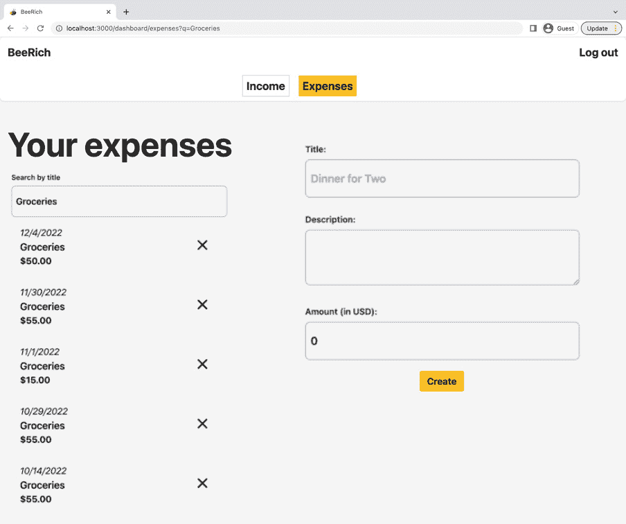
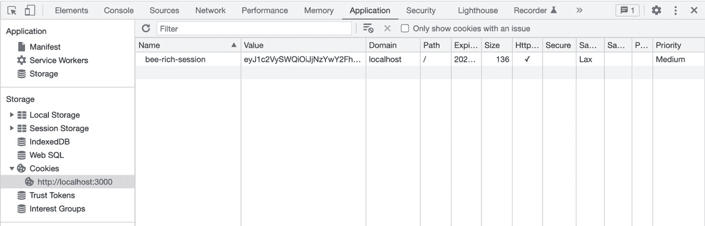

# 第八章：会话管理

会话管理描述了在不同用户交互和请求-响应往返中保留数据的过程。会话管理对于在网络上提供个性化体验至关重要。在本章中，我们将使用 Remix 的原语来管理应用程序状态和用户会话数据。本章涵盖了以下主题：

+   使用搜索参数

+   使用 cookies 创建用户会话

+   验证用户数据的访问权限

首先，我们将使用 Remix 的原语将应用程序状态与 URL 搜索参数关联起来。然后，我们将利用 HTTP cookies 来持久化用户会话数据。最后，我们将使用会话 cookie 在 `loader` 和 `action` 函数中验证用户身份。

在阅读本章之后，您将了解如何在 Remix 中使用搜索参数来控制应用程序状态。您还将知道如何使用 Remix 的 `useSubmit` 钩子程序来程序化地提交表单。您将进一步练习使用 Remix 的会话 cookie 辅助工具，并学习如何在 Remix 中实现登录、注册和注销功能。最后，您将了解如何在服务器上验证用户身份，以及如何在您的应用程序中全局访问加载器数据。

# 技术要求

您可以在此处找到本章的代码：[`github.com/PacktPublishing/Full-Stack-Web-Development-with-Remix/blob/main/08-session-management/`](https://github.com/PacktPublishing/Full-Stack-Web-Development-with-Remix/blob/main/08-session-management/)。

在开始本章之前，请遵循 GitHub 上本章 `bee-rich` 文件夹中的 `README.md` 文件中的说明。此 `README` 文件指导您将 `User` 模型添加到 BeeRich 应用程序的数据库模式中。它还帮助您初始化一个包含一些有用辅助函数的 `session.server.ts` 文件。请注意，遵循 `README` 指南将暂时中断创建和编辑费用和收入表单操作。我们将在本章中更新代码。在此期间，请使用种子数据来填充数据库以进行测试。

# 使用搜索参数

URL 存储有关用户当前位置的信息。我们已利用动态路由参数来处理费用和发票标识符。同样，我们可以使用 URL 搜索参数来存储额外的应用程序状态。

URL 是持久化仅涉及一个或几个页面的状态的完美位置。在本节中，我们将使用 URL 搜索参数在 BeeRich 的费用概览页上创建一个搜索过滤器。

你知道吗？Google 使用搜索参数来实现搜索查询？打开[google.com](http://google.com)，并使用搜索输入字段开始一个新的 Google 搜索。按下*Enter*后，Google 会带你到搜索结果页面。如果你检查 URL，你会看到 Google 使用一个名为`q`（可能是查询的简称）的搜索参数来存储你的搜索查询：[`www.google.com/search?q=Using+search+params+in+Remix.run`](https://www.google.com/search?q=Using+search+params+in+Remix.run)。

搜索参数是添加到路径名之后、问号(`?`)之后的 URL 中的键值对，并通过`&`符号附加。搜索参数允许我们在 URL 路径之外存储额外的可选应用程序状态。

让我们在 BeeRich 中构建一个类似于 Google 搜索的体验，通过搜索过滤器过滤支出列表。

## 在`loader`函数中读取搜索参数

支出列表在`dashboard.expenses.tsx`路由模块中获取并渲染。现在，我们希望允许用户通过搜索输入字段来过滤列表。

我们可以将工作分为两个步骤：

+   更新数据库查询，使其通过搜索查询进行过滤。

+   提供用户界面，以便他们可以输入搜索查询。

首先，让我们更新`loader`函数。目标是更新`loader`函数，使其只获取通过请求 URL 提供的查询字符串匹配的支出：

1.  在你的编辑器中打开`dashboard.expenses.tsx`路由模块，检查模块的`loader`函数。

1.  首先，将`request`参数添加到`loader`函数的参数中：

    ```js
    import type { URL object and get the q search parameter:

    ```

    `export async function loader({ request }: LoaderFunctionArgs) {  q - 查询的简称。你可以在 MDN Web 文档中找到更多关于 URL 接口的信息：https://developer.mozilla.org/en-US/docs/Web/API/URL。

    ```js

    ```

1.  更新数据库查询，使其只返回标题包含搜索字符串的支出：

    ```js
    const expenses = await db.expense.findMany({  orderBy: {    createdAt: 'desc',  },  where: {    title: {      contains: searchString ? searchString : '',    },  },});
    ```

    如果 URL 不包含查询字符串，我们针对空字符串进行搜索，这将匹配所有支出。在这种情况下，`loader`函数的行为与之前相同。

1.  通过在终端中执行`npm run dev`来以开发模式运行 BeeRich，并导航到支出概览页面([`localhost:3000/dashboard/expenses`](http://localhost:3000/dashboard/expenses))。

    由于我们没有在 URL 中包含查询字符串，我们仍然返回完整的支出列表。

1.  接下来，通过添加查询字符串（例如[`localhost:3000/dashboard/expenses?q=Groceries`](http://localhost:3000/dashboard/expenses?q=Groceries)）更新 URL 栏中的 URL，并刷新页面。现在应该显示一个过滤后的支出列表。

太好了！现在`loader`函数在存在`q`搜索参数时处理它，并返回一个过滤后的支出列表。接下来，让我们添加一个搜索输入字段，让用户可以搜索特定的支出。

## 通过表单提交更新搜索参数

接下来，我们将为用户提供一个搜索输入字段：

1.  可选地，禁用 JavaScript 以确保基本实现可以在没有客户端 JavaScript 的情况下工作。

    您可以在浏览器开发者工具中禁用 JavaScript 或通过从 `root.tsx` 中移除 `Script` 组件来实现。

1.  从 `@remix-run/react` 中导入 Remix 的 `Form` 组件：

    ```js
    import { useNavigation, Outlet, useLoaderData, useParams, Input component:

    ```

    import { Input } from '~/components/forms';

    ```js

    ```

1.  接下来，使用 `Form` 和 `Input` 组件在 **所有支出** 屏幕阅读器标题和无序列表支出之间实现一个搜索输入字段：

    ```js
    <h2 className="sr-only">All expenses</h2><Form q search parameter. For this, we set the form method to GET to perform an HTTP GET request.Conveniently, by default, a form submission appends the form data as search parameters to the request URL. We add the `name` attribute to the input field as only named input fields are part of the submission.We still have one problem to solve: since the search form is rendered on a layout parent route, it is visible on several pages. By default, the form submits and navigates to `/dashboard/expenses`. However, we would like the user to remain on their current page.Since we are not targeting a specific `action` function, we can point the form action to the current URL path. This ensures that a form submission does not redirect users away from their current page.
    ```

1.  从 Remix 中导入 `useLocation` 钩子以访问当前 URL 路径：

    ```js
    import { Form, Outlet, useLoaderData, useLocation, useNavigation, useParams } from '@remix-run/react';
    ```

1.  在路由组件的功能体中访问位置：

    ```js
    const location = useLocation();
    ```

1.  使用当前位置的路径动态设置表单的动作：

    ```js
    <Form method="GET" action={location.pathname}>
    ```

    提交现在会创建一个对当前页面的 GET 请求，并带有更新后的搜索参数以过滤支出列表。

1.  通过输入搜索查询并按 *Enter* 键提交表单来尝试新的搜索输入字段。

1.  注意，在每次完整页面重新加载后，搜索输入字段都是空的，即使设置了 `q` 搜索参数。

1.  从 Remix 中导入 `useSearchParams` 钩子：

    ```js
    import { Form, Outlet, useLoaderData, useLocation, useNavigation, useParams, q search parameter in the route component:

    ```

    const [searchParams] = useSearchParams();const searchQuery = searchParams.get('q') || '';

    ```js

    Note that the `searchParams` object implements the web's `URLSearchParams` interface that we also use in the `loader` function when accessing the URL's `searchParams`.
    ```

1.  将 `searchQuery` 值用作输入字段的 `defaultValue` 属性：

    ```js
    <Input name="q" type="search" label="Search by title" searchQuery by default, even during server-side rendering:
    ```



图 8.1 – 过滤支出列表的截图

太棒了！在输入搜索查询后按 *Enter* 键会提交表单并更新 URL，使其包含搜索查询。然后 `loader` 函数返回更新后的过滤支出列表。注意，我们没有使用任何 React 状态来实现此功能，并且始终如一，搜索功能在没有 JavaScript 的情况下也能工作。

将 UI 映射到 URL

搜索参数相较于 React 状态的优势在于它们可以通过读取请求 URL 在服务器上访问。搜索参数在完整页面重新加载时保持不变，并且与浏览器的后退和前进按钮一起工作。此外，搜索参数创建的 URL 变体可以被 CDNs 和浏览器缓存。

为收入概览路由实现相同的行为。更新 `dashboard.income.tsx` 路由模块的 `loader` 函数并实现搜索表单以查询发票。一旦更新了收入路由，我们就可以通过自定义 JavaScript 来增强体验。

## 程序化提交表单

目前，用户需要按 *Enter* 键来触发新的搜索。让我们添加一个防抖搜索，当用户更改输入字段中的值时自动提交表单：

1.  首先，从 Remix 中导入 `useSubmit`：

    ```js
    import {  Form,  Outlet,  useLoaderData,  useLocation,  useNavigation,  useParams,  useSearchParams,  useSubmit hook lets us submit forms programmatically. You might remember that useFetcher also offers a submit function. Both useSubmit and useFetcher().submit allow us to submit forms programmatically.Fetcher submissions behave like `fetch` requests and do not trigger global transitions in Remix. They don’t affect the global `useNavigation` state or initiate page navigations. The `useSubmit` hook mimics Remix’s `Form` behavior.In our case, we use Remix’s `Form` component for the search and want to retrigger the `/dashboard/expenses` route module’s `loader` function so that the loader data updates. For such cases, we want to use the `useSubmit` hook.
    ```

1.  在路由模块的组件体中，通过调用 `useSubmit` 创建一个新的提交函数：

    ```js
      const submit = useSubmit();
    ```

1.  将以下更改事件处理程序添加到搜索输入：

    ```js
    Replace code example with just this line:onChange={(e) => submit(e.target.form)}
    ```

    在更改时，我们通过 `submit` 函数程序化地提交表单。我们将 `submit` 传递 HTML 表单元素，从事件的目标对象中访问它。

1.  尝试当前实现，并在搜索输入字段中输入一些内容。

    你可能会注意到，我们目前为每个更改事件提交一个新的表单。这并不高效。相反，我们应该延迟提交，直到用户完成输入。这种延迟函数调用的方法称为防抖。

1.  将`Input`替换为`SearchInput`：

    ```js
    import { SearchInput component adds debouncing with a 500-millisecond delay. Refer to the implementation in /app/components/forms.tsx.
    ```

1.  现在，更新 JSX 以渲染`SearchInput`组件而不是`Input`组件：

    ```js
    <SearchInput component uses Remix's useSubmit hook to programmatically submit the form that it is embedded in after a timeout once the user finishes typing.
    ```

1.  由于提交现在是在`SearchInput`组件内部处理的，因此请从`dashboard.expenses.tsx`路由模块中移除`useSubmit`钩子。

你现在知道了在 Remix 中提交数据的三种方式：`Form`组件、`useFetcher`钩子和`useSubmit`钩子。这引发了一个问题：何时最好使用哪种实用工具。

何时使用 Remix 数据获取原语

使用`Form`组件处理页面上的主要交互。`Form`组件是实现 Remix 中表单交互的最直接方式。对于所有简单用例，请坚持使用`Form`组件。

当你想以编程方式提交`Form`组件（例如，在更改时）时，请使用`useSubmit`钩子。你可以将`useSubmit`添加到`Form`实现中，以逐步增强体验。

记住，一次只能有一个活动导航。使用`useFetcher`钩子实现应支持并发提交的表单列表或辅助用户交互。辅助交互通常不旨在触发页面导航，并且应该有权访问隔离的导航状态和操作数据。每当你想以编程方式触发`useFetcher`钩子的`Form`组件时，可以使用`useFetcher.load`和`useFetcher.submit`。

在本节中，你学习了如何使用 URL 处理应用程序状态。你还了解到，可以通过将表单方法设置为`"GET"`来执行 GET 请求。最后，你练习了如何使用`useSubmit`以编程方式提交表单。

确保更新收入路由以练习本节学到的内容。一旦完成，我们就可以开始调查如何使用 cookie 处理用户会话。

# 使用 cookie 创建用户会话

会话在多个请求中维护用户与 Web 应用程序交互的状态。会话跟踪诸如用户认证凭据、购物车内容、颜色方案偏好以及其他特定于用户的数据。在本节中，我们将使用 Remix 的会话 cookie 助手在 BeeRich 中创建登录和注册流程。

管理会话的一种方式是通过 cookie。cookie 包含小数据块，并附加到文档和 fetch 请求中，这使得它们成为处理用户会话、个性化跟踪的绝佳方式。此外，cookie 可以被加密，以安全地携带用户凭据，而无需客户端访问。

Cookie 是 HTTP 协议的一部分，它使得在无状态的 HTTP 协议中持久化信息成为可能。与用户可见的 URL 搜索参数不同，cookie 数据可以被加密，并且只能在服务器上访问。搜索参数非常适合存储与应用程序状态相关但不特定于用户的会话。Cookie 是用于用户身份验证和存储少量私有会话数据的理想选择。

一个网络服务器可以通过在 HTTP 响应中设置 **Set-Cookie** 标头来将 cookie 添加到当前会话中。一旦设置了 cookie，浏览器就会根据在 cookie 设置期间指定的生命周期，使用 **Cookie** 标头将 cookie 附加到所有后续请求中。

Remix 提供了两种不同的抽象来处理 cookie：

1.  `createCookie` 用于读取和写入 cookie

1.  `createCookieSessionStorage` 用于实现使用 cookie 的会话存储

在本章中，我们将使用 Remix 的 `createCookieSessionStorage` 函数，因为我们的目标是实现用户会话进行身份验证和授权。我们将在 *第十五章* *高级会话管理* 中查看 `createCookie` 辅助函数，以持久化访客跟踪数据。

## 使用 Remix 的会话辅助函数

让我们在 BeeRich 中实现注册和登录页面：

1.  首先，遵循本章节文件夹中 GitHub 上的 `README.md` 文件来为 BeeRich 准备本节。

1.  在您按照 `README.md` 文件中的设置指南完成设置后，打开编辑器中的 `modules/session/session.server.ts` 文件。

1.  接下来，从 Remix 中导入 `createCookieSessionStorage` 和 `redirect` 辅助函数：

    ```js
    import { createCookieSessionStorage helper function builds on top of Remix’s cookie helpers to store session data in a cookie.Refer to the Remix documentation for alternative session helpers. For example, `createMemorySessionStorage` manages session data in the server’s memory; `createSessionStorage` is more generic and allows us to retrieve session data from a custom storage implementation while storing only the session identifier in a cookie.
    ```

1.  现在，在已经存在的 `registerUser` 和 `loginUser` 函数下方添加以下代码：

    ```js
    const sessionSecret = process.env.createCookieSessionStorage helper function to create a session storage object. The object contains three functions to help us manage the lifecycle of our user sessions.The `createCookieSessionStorage` function expects a cookie configuration object to set the session cookie’s lifetime (`maxAge`), its access rules (`secure`, `sameSite`, `path`, and `httpOnly`), and signing secrets (`secrets`). You can refer to the Remix documentation for more information about the configuration options.We set the cookie to expire after 30 days, meaning it will be automatically deleted after that period. By setting `httpOnly` to `true`, we ensure that the cookie cannot be read by the client, enhancing security. We also use secrets to sign the cookie, adding an extra layer of verification.
    ```

1.  在项目根目录中的 `.env` 文件中打开并添加一个 `SESSION_SECRET` 环境变量：

    ```js
    SESSION_SECRET="[A secret string]"
    ```

    HTTP cookie 签名涉及使用只有服务器知道的秘密密钥对 cookie 添加加密签名。当客户端在未来的请求中发送此已签名的 cookie 时，服务器使用秘密密钥来验证 cookie 是否被篡改。这增加了额外的安全层。

    我们在启动服务器环境时读取环境变量。确保您重启开发服务器，以防它目前正在运行，以确保新的环境变量被拾取。

1.  最后，将以下辅助函数添加到 `session.server.ts` 文件中：

    ```js
    export async function createUserSession(user: User, headers = new Headers()) {  const session = await createUserSession to initiate the session cookie after successful registration or login.`createUserSession` expects a user object and an optional `headers` parameter. The function then calls `getSession` to create a new session object for the current user. We add `userId` to the session object and use `commitSession` to parse the object into a cookie value. We set the cookie to the `Headers` object.Note that cookies can only store a small amount of data (a few KB). Hence, we only store `userId`. When storing more data, it might make sense to store the session data in a database and only store a session identifier in the session cookie (for example, using the `createSessionStorage` helper).
    ```

现在我们能够创建新的用户会话了，让我们实现一个注册流程来注册新用户。

## 添加用户注册流程

在本节中，我们将应用到目前为止所学的内容来实现注册表单和相关 `action` 函数。在阅读解决方案之前，我鼓励您自己尝试一下。首先，更新注册路由模块组件。然后，添加一个 `action` 函数并解析表单数据。

现在，让我们一步一步地实现：

1.  打开`_layout.signup.tsx`路由模块并更新路由模块组件：

    ```js
    import { useNavigation } from '@remix-run/react';import { Button } from '~/components/buttons';import { Card } from '~/components/containers';import { Form, Input } from '~/components/forms';import { H1 } from '~/components/headings';export default function Component() {  const navigation = useNavigation();  const isSubmitting = navigation.state !== 'idle' &&    navigation.formAction === '/signup';  return (    <Card>      <Form method="POST" action="/signup">        <H1>Sign Up</H1>        <Input label="Name:" name="name" required />        <Input label="Email:" name="email" type="email" required          />        <Input label="Password:" name="password" type="password"          required />        <Button disabled={isSubmitting} type="submit" isPrimary>          {isSubmitting ? 'Signing you up...' : 'Sign up!'}        </Button>      </Form>    </Card>  );}
    ```

    注意，我们使用了一些可重用的组件来添加我们的自定义样式。另外，注意我们设置了表单方法为 POST。注册流程会修改数据，不能是 GET 请求。最后，我们再次利用`useNavigation`钩子来在表单提交时添加挂起指示器。

1.  接下来，添加一个`action`函数来处理注册表单提交：

    ```js
    import type { ActionFunctionArgs } from '@remix-run/node';import { json, redirect } from '@remix-run/node';import { createUserSession, registerUser } from '~/modules/session/session.server';export async function action({ request }: ActionFunctionArgs) {  string. Once the data has been validated, we call the `registerUser` function to create a new user object or throw an error if the user already exists in the database. If the creation is successful, we call `createUserSession` to add the session cookie to the response headers. Otherwise, we return an error response.On success, we redirect the user to the dashboard. On error, we return the error message as action data. Next, let's display the error message to the users.
    ```

1.  从 Remix 导入`useActionData`：

    ```js
    import { useActionData, useNavigation } from '@remix-run/react';
    ```

1.  在路由组件中访问错误消息操作数据：

    ```js
    const actionData = useActionData<typeof action>();
    ```

1.  导入我们的样式内联错误组件：

    ```js
    import { InlineError } from '~/components/texts';
    ```

1.  在提交按钮下方渲染`InlineError`组件以显示任何错误消息：

    ```js
    <InlineError aria-live="assertive">{npm run dev and visiting the /signup page.After form submission, you should be redirected to the dashboard. Great! But what if we want to log out? For now, we can clear the cookie using the developer tools.
    ```

1.  在你的浏览器窗口中打开开发者工具并导航到**应用程序**标签页：



图 8.2 – 开发者工具的应用程序标签页

在`httpOnly`标志下。

右键点击 cookie 并选择**删除**。

这允许我们在实现登出流程之前对注册表单进行更多操作。 

1.  再次尝试使用注册流程中使用的电子邮件地址进行注册。你现在应该看到一个内联错误。太棒了！

    随意花更多时间在这一部分，并通过`action`函数和`session.server.ts`文件中的代码流来调查代码。使用`debugger`或`console.log`语句来检查注册过程中发生的情况。

一旦你对添加的代码感到满意，使用开发者工具删除 cookie。这将使我们能够实现和测试登录流程。

## 添加用户登录流程

将注册流程的路由模块组件复制并粘贴，看看你是否可以更新它使其适用于登录页面。也许你可以尝试对`action`函数做同样的操作。

一旦你尝试过它，让我们一起来查看实现过程：

1.  将以下代码添加到更新`_layout.login.tsx`路由组件：

    ```js
    import { useActionData, useNavigation } from '@remix-run/react';import { Button } from '~/components/buttons';import { Card } from '~/components/containers';import { Form, Input } from '~/components/forms';import { H1 } from '~/components/headings';import { InlineError } from '~/components/texts';export default function Component() {  const navigation = useNavigation();  const isSubmitting = navigation.state !== 'idle' &&    navigation.formAction === '/login';  const actionData = useActionData<typeof action>();  return (    <Card>      <Form method="POST" action="/login">        <H1>Log In</H1>        <Input label="Email:" name="email" type="email" required          />        <Input label="Password:" name="password" type="password"          required />        <Button disabled={isSubmitting} type="submit" isPrimary>          {isSubmitting ? 'Logging you in...' : 'Log in!'}        </Button>        <InlineError aria-live="assertive">{actionData?.error &&          actionData.error}</InlineError>      </Form>    </Card>  );}
    ```

    登录和注册表单几乎相同；只是输入字段的数目不同。

1.  接下来，添加`action`函数来处理登录表单提交：

    ```js
    import type { ActionFunctionArgs } from '@remix-run/node';import { json, redirect } from '@remix-run/node';import { createUserSession, loginUser } from '~/modules/session/session.server';export async function action({ request }: ActionFunctionArgs) {  loginUser helper function. If the user can be found in the database and the password matches, we create the session cookie and add it to the response. Otherwise, we use the error message to return a JSON response.
    ```

1.  使用你在注册流程中使用的电子邮件地址尝试登录流程。你现在应该能够注册并登录到 BeeRich。

到目前为止，我们已经利用会话辅助函数在成功注册或登录后创建用户会话。通过检查开发者工具，我们确保浏览器注册了 cookie。接下来，我们将添加一个登出流程来删除会话 cookie。

## 登出时删除会话

删除会话 cookie 非常简单。在`session.server.ts`中，我们可以访问三个会话生命周期方法：`getSession`、`commitSession`和`destroySession`。按照以下步骤操作：

1.  让我们在`session.server.ts`中添加一个辅助函数来从传入的请求中获取当前用户会话：

    ```js
    function getUserSession(request: Request) {  return getUserSession function is a helper that we will utilize to access the current session object from the cookie header of a request.Remix’s `getSession` function parses the cookie header and returns a session object we can use to access the stored data. Once we have the session object, we can read from it or destroy it using the `destroySession` life cycle method.
    ```

1.  在`session.server.ts`中添加一个登出函数：

    ```js
    export async function logout(logout function parses the current session object from the incoming request and then redirects the user to the login page. The returned response uses the _layout.logout.tsx route module and add the following code:

    ```

    `import type { ActionFunctionArgs } from '@remix-run/node';import { redirect } from '@remix-run/node';import { logout } from '~/modules/session/session.server';export function action({ request }: ActionFunctionArgs) {  action function that executes the logout function. This removes the session cookie and redirects the user to login. The logout route module also has a loader function to redirect all traffic to login. This is convenient if a user accidentally navigates to the logout page.Remember that Remix refetches all loader data from all active `loader` functions after an `action` function executes. Since `logout` mutates the server state (the user session), we use an `action` function and not a `loader` function to implement `logout`. After logging out, we want to remove all user-specific data from the page by revalidating all loader data.Note that the logout route module does not export a route component. Thus, it is not a document but a resource route.`

    ```js

    ```

1.  打开`dashboard.tsx`路由模块，找到导航栏中的当前注销链接：

    ```js
    <RemixLink to="/404">Log out</RemixLink>
    ```

    目前，注销按钮是一个占位符链接到一个不存在的页面。

1.  从 Remix 导入`Form`并替换代码以创建一个提交 POST 请求到注销路由的表单：

    ```js
    <Form method="POST" action="/logout">  <button type="submit">Log out</button></Form>
    ```

    点击**注销**链接会提交一个表单到注销动作函数，将用户重定向到登录并移除当前用户会话 cookie。就这样，我们在 BeeRich 中成功实现了注销流程。

在本节中，我们练习了使用 Remix 的会话 cookie 助手创建和删除会话 cookie。接下来，我们将从会话 cookie 中读取以验证用户，并从我们的`loader`函数中返回特定于用户的数据。

# 验证对用户数据的访问

我们可以在`loader`和`action`函数中访问 cookie，因为 cookie 被附加到每个发送到 Web 服务器的 HTTP 请求中。这使得 cookie 成为管理会话的绝佳工具。在本节中，我们将从会话 cookie 中读取以验证用户并查询特定于用户的数据。

## 在服务器上访问 cookie 数据

一旦我们将 cookie 附加到响应中，我们就可以在随后的每个对服务器的请求中访问 cookie 数据。这使我们能够构建个性化的基于会话的用户体验。让我们添加一些助手函数来简化这项任务：

1.  将以下代码添加到`session.server.ts`文件中：

    ```js
    export async function getUserId(request: Request) {  createUserSession to write userId to the session cookie. The `getUserId` function expects a `Request` object and returns `userId` from the session cookie if it’s present, or null otherwise. We use `getUserSession` to get the current session object from the cookie header of the `Request` object.We also add a `getUser` function that uses the `getUserId` function under the hood and returns the user object from the database. To avoid exposing the user’s password hash, we ensure not to query the password field from the database.Let’s see how we can use `getUserId` to check whether a user is logged in.
    ```

1.  将以下`loader`函数添加到登录和注册路由模块中：

    ```js
    import type { LoaderFunctionArgs } from '@remix-run/node';import { redirect } from '@remix-run/node';import { userId exists, then we can be sure that the user has already been authenticated. In this case, we redirect to the dashboard. Otherwise, we show the login or signup page.Note that we return an empty object for our base case in the `loader` function. This is because a `loader` function cannot return `undefined`.
    ```

在本节中，我们实现了`getUserId`和`getUser`助手函数。我们使用`getUserId`来检查用户是否已登录。接下来，我们将使用`getUser`来获取当前登录用户的用户对象（如果有的话）。

## 在客户端处理用户数据

在本节中，我们将使用`getUser`来处理当前登录用户的用户对象：

1.  首先，在 root.tsx 中导入`LoaderFunctionArgs`和`getUser`。

    ```js
    import type { LinksFunction, loader export to root.tsx, querying and returning the current user object:

    ```

    `export async function loader({ request }: LoaderFunctionArgs) {  getUser` 返回一个不带密码属性的用户对象。这很重要，因为我们把用户对象转发到客户端。我们不得向客户端应用程序泄露用户或应用程序的秘密。我们现在可以使用 `useLoaderData` 在 `root.tsx` 中访问用户对象。然而，我们可能希望在整个应用程序中都能访问用户对象。让我们看看我们如何使用 Remix 来实现这一点。

    ```js

    ```

1.  在 `app/modules/session` 中创建一个 `session.ts` 文件。

    我们计划创建一个小的 React 钩子来访问 React 应用程序中的根 `loader` 用户数据。由于我们还想在客户端的 React 应用程序中访问该钩子，因此我们不应将钩子放在 `session.server.ts` 文件中，因为它只包含在服务器包中。

1.  将以下 `useUser` 钩子添加到 `session.ts`：

    ```js
    import type { User } from '@prisma/client';import { useRouteLoaderData hook to access the root loader data user object. We also import the type of the root loader function for type inference. We further deserialize the user object to match the User type from @prisma/client without the password property.Note that Remix assigns every route module a unique identifier. The ID of the root route module is "root". We must pass `useRouteLoaderData` the ID of the route module of which we want to access the loader data. Remix's route module IDs match the route file name relative to the app folder. You can find more information in the Remix documentation: [`remix.run/docs/en/2/hooks/use-route-loader-data`](https://remix.run/docs/en/2/hooks/use-route-loader-data).We can now call `useUser` throughout our Remix application to access the current user object. You can use the same pattern for any global application state.Let’s try out the hook in action!
    ```

1.  在 `_layout.tsx` 路由组件中使用 `useUser` 钩子：

    ```js
    const user = useUser();
    ```

1.  在导航的无序列表中，将当前的 **登录** 和 **注册** 列表项替换为以下代码：

    ```js
    {user ? (  <li className="ml-auto">    <NavLink to="/dashboard" prefetch="intent">      Dashboard    </NavLink>  </li>) : (  <>    <li className="ml-auto">      <NavLink to="/login" prefetch="intent">        Log in      </NavLink>    </li>    <li>      <NavLink to="/signup" prefetch="intent">        Sign up      </NavLink>    </li>  </>)}
    ```

    如果没有用户登录或用户已登录，我们现在将条件性地渲染 **登录** 和 **注册** 链接，如果用户已登录，则显示 **仪表板** 链接。

注意，`useUser` 返回的用户对象也可以是 `null`。如果存在会话，我们尝试查询用户对象，否则返回 `null`。然而，有时我们必须确保用户已登录。我们将在下一节中查看如何强制执行身份验证。

## 在服务器上强制执行身份验证

BeeRich 的仪表板路由仅适用于已登录用户。你能想到一种强制检查是否存在会话 cookie 的方法吗？

让我们实现一些身份验证逻辑，如果不存在用户会话，则将用户重定向到登录页面：

1.  在 `session.server.tsx` 中创建另一个辅助函数：

    ```js
    export async function requireUserId(request: Request) {  const session = await getUserSession(request);  const userId = session.get('userId');requireUserId looks similar to getUserId, but this time, we throw a redirect Response if no user session was found.Note that throwing a redirect `Response` does not trigger the `ErrorBoundary` component. Redirects are a special case where we leave the current route module and navigate to another one instead. The final `Response` of a redirect is the document response of the redirected route module.
    ```

1.  接下来，将以下行添加到所有 `loader` 和 `action` 函数的顶部，在仪表板路由模块中：

    ```js
    await requireUserId(request);
    ```

    `requireUserId` 调用确保如果用户未进行身份验证，则将用户重定向到登录页面。

    由于 `loader` 函数并行运行，而 `action` 函数通过互联网公开 API 端点，我们必须将身份验证检查添加到每个需要身份验证的 `loader` 和 `action` 函数中。

    我们还必须确保我们只检索与当前 `userId` 相关的数据。用户不应能够查看其他用户的费用和发票。让我们进一步更新我们的 `loader` 和 `action` 函数。

1.  打开 `dashboard.tsx` 路由模块并更新 `loader` 函数，以便要求用户会话并使用 `userId` 查询特定于用户的费用和收入对象：

    ```js
    import type { userId, we ensure that a session cookie is present. If no session cookie is present, requireUserId will throw redirect to the login route.We also filter our database queries for user-specific content. We now query for the last expense and invoice objects created by the logged-in user.
    ```

1.  打开 `dashboard.expenses.tsx` 路由模块并更新 `loader` 函数，以便检查现有的用户会话：

    ```js
    import { userId to only filter for user-specific data.
    ```

1.  打开 `dashboard.expenses._index.tsx` 路由模块并更新 `action` 函数：

    ```js
    import { requireUserId } from '~/modules/session/session.server';export async function action({ request }: ActionFunctionArgs) {  userId parameter that was retrieved from the session cookie.
    ```

1.  打开 `dashboard.expenses.$id.tsx` 路由模块并更新 `loader` 函数：

    ```js
    export async function loader({ userId cookie value. This ensures that a user can’t visit different expense detail pages and view the content of other users.
    ```

1.  更新 `dashboard.expenses.$id.tsx` 中的 `deleteExpense` 处理函数：

    ```js
    async function deleteExpense(request: Request, id: string, id and userId. This ensures that a user can only ever delete an expense that was also created by that user.
    ```

1.  更新 `dashboard.expenses.$id.tsx` 中的 `updateExpense` 处理函数：

    ```js
    async function updateExpense(formData: FormData, id: string, action function in dashboard.expenses.$id.tsx:

    ```

    导出异步函数 action({ params, request }: ActionFunctionArgs) {  requireUserId to enforce an existing user session. Then, we pass userId to the deleteExpense and updateExpense handler functions.That was quite a bit of code to go through, but by making some minor changes here and there, we have fully authenticated our application’s HTTP endpoints and ensured that only authenticated users can visit our dashboard pages.

    ```js

    ```

1.  现在是玩 BeeRich 的好时机。看看你是否可以在不先登录的情况下访问任何仪表板路由。

    尝试通过在几个标签页中操作来破解 BeeRich。在第一个标签页中打开费用创建表单，并在第二个标签页中注销。你还能成功创建新的费用吗？注意 cookies 在不同标签页之间的附加和更新情况。

保护 loader 和 action 函数

Remix 的 `loader` 函数并行运行以提高执行速度。然而，它们的并发性也决定了我们必须保护每个 `loader` 函数。`loader` 和 `action` 函数都可以通过互联网访问，必须像 API 端点一样处理和保护。

我们仍然需要更新收入路由。这将是一个很好的实践，以确保你理解如何验证 `loader` 和 `action` 函数。花些时间仔细检查收入路由中的每个 `loader` 和 `action` 函数，以练习你在本章中学到的内容。

在本节中，你学习了如何在 Remix 中从会话 cookie 中访问状态，以及如何使用会话 cookie 在 `loader` 和 `action` 函数中验证用户。

# 摘要

在本章中，你学习了 Remix 中的会话和状态管理。首先，你学习了如何使用 URL 搜索参数通过 Remix 的 `Form` 组件和 `useSearchParams` 钩子来持久化应用程序状态。URL 经常是我们处理应用程序状态所需的一切。

你还练习了使用 `useSubmit` 以编程方式提交表单，并更多地了解了 Remix 的不同突变工具。我们得出结论，我们使用 `Form` 组件和 `useSubmit` 钩子来处理页面上的主要操作；`useFetcher` 用于支持具有隔离提交状态的并发提交。

接下来，你了解到 cookies 是 HTTP 协议的一部分，可以用于在页面转换之间持久化状态。Cookies 是会话管理的一个很好的工具。Remix 提供了用于处理 cookies 和会话的辅助函数。Remix 的会话原语允许我们使用不同的策略来管理会话，例如在内存、文件、数据库或 cookies 中存储会话数据。

我们利用 Remix 的原语在 BeeRich 中实现了一个包含登录、注册和注销功能的身份验证流程。你学习了如何验证用户并使用会话 cookie 查询特定用户的内容。

在注册和登录过程中，我们创建和获取用户对象，并将`userId`写入 Remix 的会话对象。然后，使用`loader`和`action`函数将该对象序列化为字符串，并添加到 HTTP 响应的 cookie 中，以验证用户会话和查询特定用户的数据。

你还学习了如何在你的应用程序中全局访问加载器数据，使用 Remix 的`useRouteLoaderData`钩子。你练习了创建一个小的自定义钩子，以抽象从根`loader`访问用户对象。

在阅读本章之后，你将理解`action`函数是独立的端点，而`loader`函数是并行运行的。最终，我们必须在每个受限的`loader`和`action`函数中验证用户，以防止未经授权的访问。

在下一章中，你将学习如何在 Remix 中处理静态资源和文件。

# 进一步阅读

有关 URL 搜索参数和`URLSearchParams`接口的更多信息，请参阅 MDN Web Docs：[`developer.mozilla.org/en-US/docs/Web/API/URLSearchParams`](https://developer.mozilla.org/en-US/docs/Web/API/URLSearchParams)。

如果你想了解更多关于 HTTP cookie 的信息，请参考 MDN Web Docs：[`developer.mozilla.org/en-US/docs/Web/HTTP/Cookies`](https://developer.mozilla.org/en-US/docs/Web/HTTP/Cookies)或`Headers`接口：[`developer.mozilla.org/en-US/docs/Web/API/Headers`](https://developer.mozilla.org/en-US/docs/Web/API/Headers)。

通过阅读 MDN Web Docs 来刷新你对 HTML 表单的知识：[`developer.mozilla.org/en-US/docs/Web/HTML/Element/form`](https://developer.mozilla.org/en-US/docs/Web/HTML/Element/form)。

Remix 为处理会话提供了几个原语。你可以在 Remix 文档中找到更多信息：[`remix.run/docs/en/2/utils/sessions`](https://remix.run/docs/en/2/utils/sessions)。

Remix 还提供了用于处理 cookie 的底层原语：[`remix.run/docs/en/2/utils/cookies`](https://remix.run/docs/en/2/utils/cookies)。
