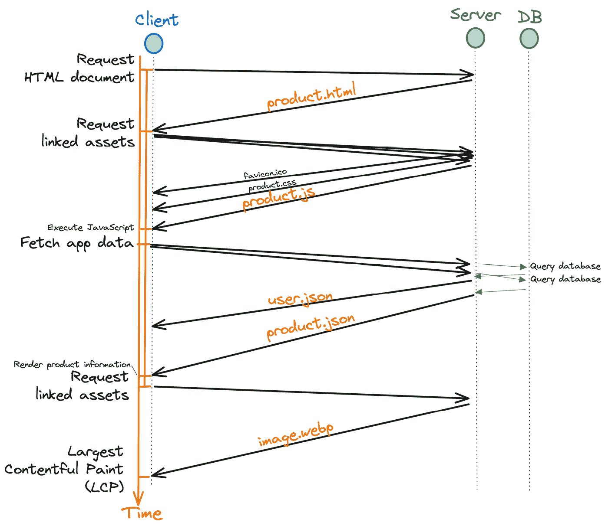
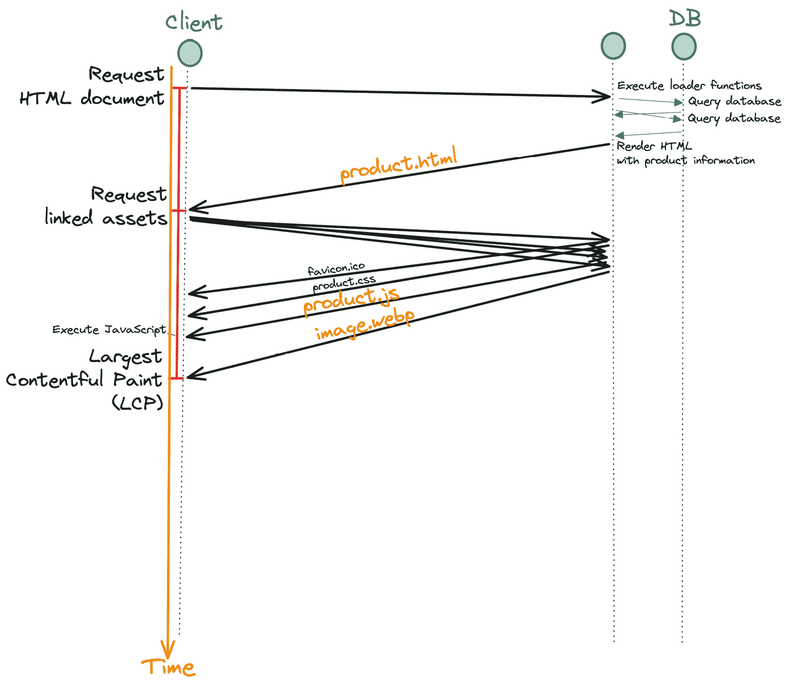

# 第十三章：延迟加载器数据

在服务器上执行数据加载可以加快初始页面加载时间并提高核心 Web 性能指标，如 **最大内容渲染**（**LCP**）。然而，如果请求特别慢，服务器端数据获取也可能成为瓶颈。对于这种情况，Remix 提供了一种替代的数据获取方法。

在本章中，我们将使用 Remix 的 `defer` 函数，并学习如何利用 HTTP 和 React 流式传输、React `Suspense` 以及 Remix 的 `Await` 组件来延迟慢速加载器数据请求。本章分为两个部分：

+   向客户端流式传输数据

+   延迟加载器数据

首先，我们将讨论服务器端数据获取的权衡，并回顾使用 Remix 的 `defer` 函数的要求。接下来，我们将在 BeeRich 中使用 Remix 的 `defer` 函数，并练习使用 React `Suspense` 和 Remix 的 `Await` 组件。

在阅读本章之后，您将了解如何使用 `defer` 来提高您的 Remix 应用程序的性能。您还将学习与 HTTP 和 React 流式传输一起工作的要求。最后，您将理解延迟加载器数据的权衡，并知道何时在 Remix 中使用 `defer`。

# 技术要求

在我们开始本章之前，我们需要更新一些代码。请在继续之前遵循 GitHub 上的本章文件夹中 `README.md` 文件中的步骤。您可以在以下位置找到本章的代码：[`github.com/PacktPublishing/Full-Stack-Web-Development-with-Remix/tree/main/13-deferring-loader-data`](https://github.com/PacktPublishing/Full-Stack-Web-Development-with-Remix/tree/main/13-deferring-loader-data)。

# 向客户端流式传输数据

存在几种不同的数据获取策略。我们可以使用客户端 `fetch` 请求在客户端启动数据获取，或者执行服务器端数据获取以利用服务器端渲染。我们甚至可以在构建时获取数据以用于静态站点生成。在本节中，我们将讨论服务器端数据获取的权衡，并回顾 HTTP 流式传输的要求。

## 促使服务器端数据获取和流式传输

Remix 推崇使用 `loader` 函数在每个路由上从服务器获取数据，而不是在组件级别获取数据。在初始页面加载期间，`loader` 函数在 React 在服务器上渲染之前被调用。这保证了加载器数据可用于服务器端渲染步骤，消除了客户端数据获取逻辑和加载状态的需求。

在客户端初始化数据获取时，我们首先需要加载 HTML 文档，然后等待 JavaScript 包下载并执行，之后才能执行所需的获取请求。这导致在 LCP 最终确定之前，需要进行三次客户端到服务器的往返。相比之下，我们可以通过服务器端数据获取和渲染，在客户端到服务器的单次往返后绘制 LCP。减少客户端到服务器的往返次数几乎总是会导致更快的响应时间和改进的核心 Web Vitals。

让我们通过一个示例来了解服务器端数据获取如何提高初始页面加载的 LCP。假设我们维护一个电子商务网页，展示产品的图片和一些关于产品的附加信息，如产品名称和价格。

首先，让我们假设我们只操作客户端 SPA。当用户访问我们的网页时会发生什么？



图 13.1 – 客户端数据获取瀑布图

如*图 13.1*所示，以下请求是从浏览器执行的：

+   浏览器请求 HTML 文档。

+   浏览器请求文档中引用的脚本和其他资源。

+   React 应用正在运行并获取产品信息。浏览器执行获取请求。

+   React 应用使用获取的数据重新渲染，浏览器请求 HTML 中链接的资产，如产品图片。下载的资产用于绘制 LCP。

我们执行了四个后续请求来显示产品图片并最终确定 LCP，每个请求都增加了请求瀑布并延迟了 LCP。

现在，让我们假设我们使用 Remix 来渲染产品页面。需要多少个客户端请求才能最终确定 LCP？



图 13.2 – 服务器端数据获取瀑布图

如*图 13.2*所示，以下请求是从浏览器执行的：

+   浏览器请求 HTML 文档。接收到的文档已经包含了产品信息和图像 HTML 元素。

+   浏览器请求产品图片以及其他链接资源。下载的资源用于绘制 LCP。

使用服务器端数据获取，我们只需要两个客户端到服务器的往返来渲染产品页面。这是一个显著的改进。

发生了什么变化？Remix 通过将数据获取移动到服务器来简化请求瀑布。这样，图像和其他资源可以与 JavaScript 包并行加载。

不幸的是，当在`loader`函数中执行特别慢的请求时，这种模型可能不起作用。由于我们在服务器端渲染我们的 React 应用之前等待所有`loader`函数完成，慢速请求可能成为我们应用的瓶颈并减慢初始页面加载。在这种情况下，我们可能需要寻找替代方法。

一种可能的解决方案是在从服务器下载初始页面之后从客户端获取慢速请求。然而，这会导致前面概述的请求瀑布效应——进一步延迟慢速数据响应。幸运的是，Remix 提供了一套简单的原语来延迟获取承诺，并改为将响应流式传输到客户端。

流允许我们在完整响应尚未最终确定的情况下向客户端发送字节。React 提供了将服务器端渲染的内容流式传输到客户端的实用工具。React 将在等待其他部分的同时开始向客户端发送渲染内容的片段。使用 `Suspense`，React 可以挂起组件子树直到承诺解决。Remix 通过使用 `defer` 函数和 `Await` 组件构建在 React `Suspense` 之上，以延迟特定的 loader 数据请求。

Remix 的 `loader` 函数在路由级别获取数据以避免网络瀑布效应。如果一个请求特别慢，有成为瓶颈的危险，我们可以拉另一个杠杆来延迟该请求。这是通过 HTTP 流和 Web 流 API 实现的。在下一节中，我们将讨论使用 Remix 利用 HTTP 流的要求。

## 理解 HTTP 流的要求

由于 Remix 的 `defer` 函数使用 HTTP 和 React 流，我们只能在支持 HTTP 流式响应的服务器环境中使用它。在本节中，我们将讨论 HTTP 流和 `defer` 的要求。

在 *第三章*，*部署目标、适配器和堆栈*，我们学习了 Remix 如何利用适配器在不同的 JavaScript 运行时和服务器环境中运行。某些环境，例如传统的无服务器环境，可能不支持流式响应。在评估托管提供商和运行时时要记住这一点。

幸运的是，越来越多的环境支持 HTTP 流，并且默认情况下，Remix 已配置为使用 React 流。即使不使用 `defer`，这也是一件好事，因为它可以加快初始文档请求的速度。使用 HTTP 流，客户端可以在不需要等待完整响应最终确定的情况下开始接收响应的部分。

要确定你的 Remix 项目是否已配置为使用 React 流，你可以检查 Remix 项目中的 `app/entry.server.tsx` 文件。搜索 `renderToPipeableStream` 函数。如果正在使用，你可以确信 React 流已配置。否则，你可以遵循 Remix 的 `defer` 指南来设置 React 流：[`remix.run/docs/en/2/guides/streaming`](https://remix.run/docs/en/2/guides/streaming)（如果你的运行时和托管环境支持的话）。

如果您找不到 `app/entry.server.tsx` 文件，可能是因为您正在使用 Remix 的默认实现，并且需要通过执行 `npx remix reveal` 命令来揭示它。您可以在 *第二章* “创建新的 Remix 项目” 或 Remix 文档中了解更多关于 `entry.server.tsx` 文件的信息：[`remix.run/docs/en/2/file-conventions/entry.server`](https://remix.run/docs/en/2/file-conventions/entry.server)。

现在您已经了解了 Remix 如何使用 HTTP 和 React 流，让我们在 BeeRich 中尝试一下。在下一节中，我们将练习使用 Remix 的 `defer` 函数。

# 延迟加载器数据

并非所有有效载荷对用户来说都同等重要。某些数据可能只出现在页面下方，并且对用户来说不是立即可见的。其他信息可能不是页面的主要内容，但会减慢初始页面加载速度。例如，我们可能希望尽可能快地显示电子商务网站的产品信息。然而，我们可能对延迟加载评论部分以加快初始页面加载时间持开放态度。为此，Remix 提供了 `defer` 和 `Await` 原语。在本节中，我们将利用 Remix 的原语与 React `Suspense` 在 BeeRich 中延迟特定的加载器数据。

如果您还没有查看，请查阅 GitHub 上的此章节的 `README.md` 文件：[`github.com/PacktPublishing/Full-Stack-Web-Development-with-Remix/tree/main/13-deferring-loader-data/bee-rich/README.md`](https://github.com/PacktPublishing/Full-Stack-Web-Development-with-Remix/tree/main/13-deferring-loader-data/bee-rich/README.md)。此文件将指导您设置新的费用和发票变更日志。现在，让我们允许用户查看他们费用和发票的所有变更的完整历史记录：

1.  让我们从在 `dashboard.expenses.$id._index.tsx` 路由模块的 `loader` 函数中获取变更日志数据开始：

    ```js
    const userId = await requireUserId(request);const { id } = params;if (!id) throw Error('id route parameter must be defined');const expense = await db.expense.findUnique({ where: { id_userId: { id, userId } } });if (!expense) throw new Response('Not found', { status: 404 });expenseLogs array.Note that the current implementation blocks the expense logs query until the expense has been fetched. This increases the initial page load time as we introduce a subsequent database query, something we will fix later.
    ```

1.  接下来，创建一个 `ExpenseLogs` 组件：

    ```js
    ExpenseLog type from Prisma for the component’s prop type. We wrap it with SerializeFrom as loader data is fetched from the server and serialized as JSON while sent over the network.
    ```

1.  更新路由模块组件中的 `useLoaderData` 调用以访问 `expenseLog` 数组：

    ```js
    const H3 component:

    ```

    导入 `{ H2, ExpenseLogs }` 组件位于编辑费用表单下方：

    ```js
    <section className="my-5 w-full m-auto lg:max-w-3xl flex flex-col items-center justify-center gap-5">  <H3>Expense History</H3>  localhost to test it out. Execute npm run dev and open an expense details page in a browser window.The new change history is great, but also not the most important aspect of the page. We render the history below the expense and invoice details on the nested detail routes. Most likely, the information will be rendered below the page’s fold.
    ```

    ```js

    ```

1.  为了避免延迟初始页面加载，使用 Remix 的 `defer` 函数：

    ```js
    import { json helper in the loader function with a defer call:

    ```

    `return defer` 在调用具有解析数据时表现得就像 json 一样。魔法只有在我们将未解析的 Promise 延迟时才开始发生。

    ```js

    ```

1.  在 `expenseLog.findMany` 调用之前删除 `await` 关键字：

    ```js
    const expenseLogs = Promise to defer changes the behavior of the loader function. The function now returns without awaiting the expenseLog query, and defer will make sure to stream the data to the client once resolved.
    ```

1.  注意，我们在查询的末尾也链式调用了 `then` 调用。这是一个技巧，将 `PrismaPromise`（由 `findMany` 返回）映射到实际的 `Promise` 对象，因为 Remix 的 `defer` 函数需要 `Promise` 实例。

1.  嘭！我们破坏了页面，因为 `expenseLogs` 现在是 `Promise` 类型。我们需要更新我们的 React 代码，使其能够与延迟加载的数据一起工作。首先，从 React 中导入 `Suspense` 和从 Remix 中导入 `Await`：

    ```js
    import {  ExpenseLogs component with Suspense and Await:

    ```

    <expenseLogs 请求。为了通知 Remix 我们正在等待哪个承诺，我们必须将 expenseLogs 加载器数据传递给 Await。我们还可以向 Await 传递一个错误元素组件，以防承诺被拒绝。我们将回调函数作为`Await`的子组件传递。一旦承诺解决，`Await`将使用解决的数据调用回调。这确保了`ExpenseLogs`组件可以访问解决的`expenseLogs`数据。或者，我们可以在子组件中使用 Remix 的`useDeferredValue`钩子来访问解决的数据。

    ```js

    ```

1.  在本地运行 BeeRich 并注意初始页面加载不包括`expenseLogs`数据。

    注意，你可能需要延迟`expenseLogs`查询以获得更好的可见性。否则，在本地主机上延迟加载可能太快而无法捕捉。

1.  更新`loader`函数中`expenseLogs`查询的`then`语句：

    ```js
      const expenseLogs = db.expenseLog    .findMany({      orderBy: { createdAt: 'desc' },      where: { expenseId: id, userId },    })    .then((expense) => setTimeout.
    ```

1.  现在，检查 UI 中的延迟数据加载和`expenseLogs`数据。相反，渲染了 suspense 回退字符串。一旦`expenseLogs`承诺解决，页面将使用`expenseLogs`数据重新渲染。

    注意，`defer`在 UI 中引入了一个待处理状态。重要的是要理解这会影响用户体验。引入加载旋转器应被视为延迟加载器数据的权衡。一旦数据解决，我们可能会引入布局变化，这会影响 SEO，因为网络爬虫现在可以解析回退 UI。

1.  接下来，优化`loader`函数中的调用顺序。将费用日志查询移动到费用查询之上：

    ```js
    const userId = await requireUserId(request);const { id } = params;if (!id) throw Error('id route parameter must be defined');// Start expense logs query first before we await the expense querysetTimeout call. Make sure you throttle the network and re-add the setTimeout call if necessary to better investigate the experience.
    ```

从这个例子中，我们可以总结出 Remix 为我们提供了一种按请求延迟加载器数据的方法。我们可以在`loader`函数中为每个请求决定是否要等待或延迟。

记住，我们在添加`Await`和`Suspense`之前破坏了页面。在`loader`函数中返回带有`defer`的承诺之前，首先将`Await`和`Suspense`组件添加到页面中是一种良好的实践。这将帮助你在实现`Await`和`Suspense`时避免错误。

通过将相同的更改应用到收入路由来练习使用`defer`。复制粘贴并将`ExpenseLogs`组件适应到`dashboard.income.$id._index.tsx`路由模块中。利用该组件并实现本章中练习的相同`defer`、`Suspense`和`Await`流程。使用`setTimeout`来测试用户体验。

如果你想更多练习，添加`defer`和乐观 UI，如果你需要更多指导。

Remix 提供了杠杆

Remix 提供了杠杆，使我们能够根据我们的应用需求优化用户体验。在考虑`defer`时，重要的是要记住，延迟数据加载也可能通过添加待处理 UI 和引入加载旋转器来降低用户体验。 

在本节中，您练习了使用 Remix 的`defer`和`Await`原语进行操作。您现在知道如何使用延迟响应数据流来优化缓慢或次要数据请求，但您也意识到`defer`是一个通过引入挂起 UI 来影响用户体验的杠杆。

# 摘要

在本章中，您了解到 Remix 支持不同的数据获取策略。在从缓慢的端点获取数据时，可以通过延迟加载数据来利用 Remix 解决 Remix 应用的性能瓶颈。Remix 的`defer`函数检测加载数据中的未解决承诺，并在解决后将其流式传输到客户端。React `Suspense`和 Remix 的`Await`组件用于在 React 中管理延迟加载数据。

您还了解到使用`defer`需要回退 UI 来传达加载状态。现在您理解了使用`defer`会带来影响用户体验的权衡。一方面，延迟加载数据可以加快初始文档请求。另一方面，使用`defer`会创建加载 UI，这会导致不同的用户体验。

阅读本章后，您了解到 Remix 使用 React 流来加速文档请求。然而，React 和 HTTP 流并不支持所有服务器运行时和环境。最终，并非所有 Remix 适配器都支持 React 流。由于 Remix 的`defer`函数利用了 React `Suspense`和 React 流，因此只有当 React 流被支持并设置时，延迟加载数据才有效。

最后，您通过在 BeeRich 中实现支出变更日志来练习了延迟加载数据。

在下一章中，我们将扩展变更日志实现，并添加使用**服务器发送事件**（**SSE**）的实时数据响应。

# 进一步阅读

您可以通过 MDN Web Docs 了解有关 Streams API 的更多信息：[`developer.mozilla.org/en-US/docs/Web/API/Streams_API`](https://developer.mozilla.org/en-US/docs/Web/API/Streams_API).

Remix 文档包括关于流式传输和`defer`的指南：[`remix.run/docs/en/2/guides/streaming`](https://remix.run/docs/en/2/guides/streaming).

`defer`函数的文档可以在以下位置找到：[`remix.run/docs/en/2/utils/defer`](https://remix.run/docs/en/2/utils/defer).

在本章中，我们讨论了核心网页关键指标。您可以在以下链接中了解更多关于核心网页关键指标的信息，例如 LCP：[`web.dev/vitals/`](https://web.dev/vitals/).
