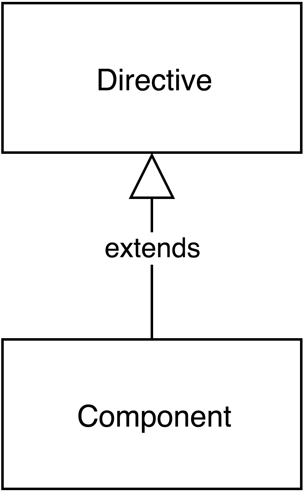
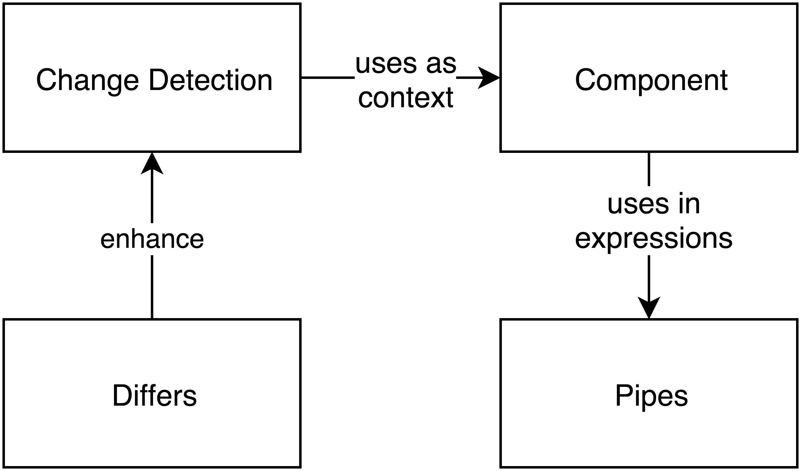
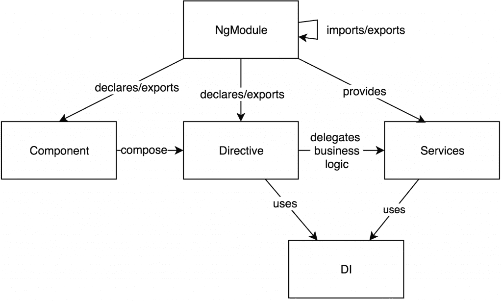
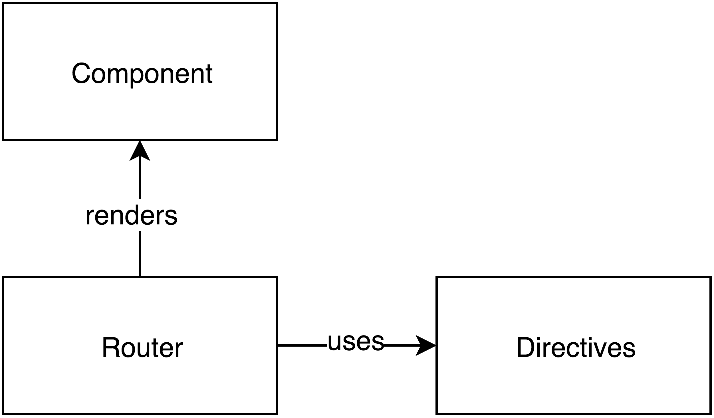
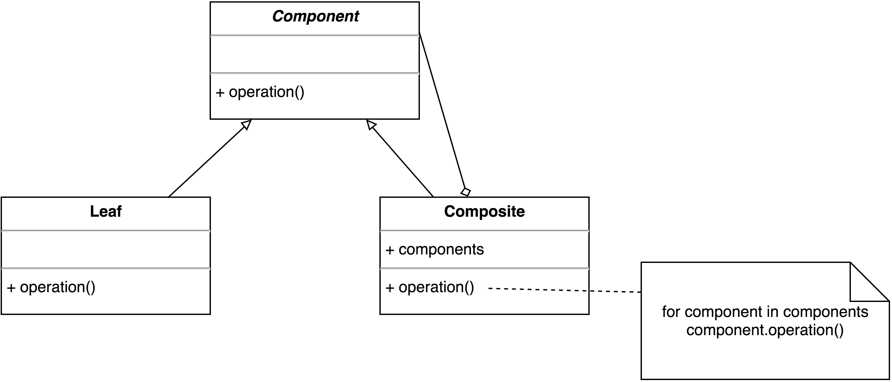
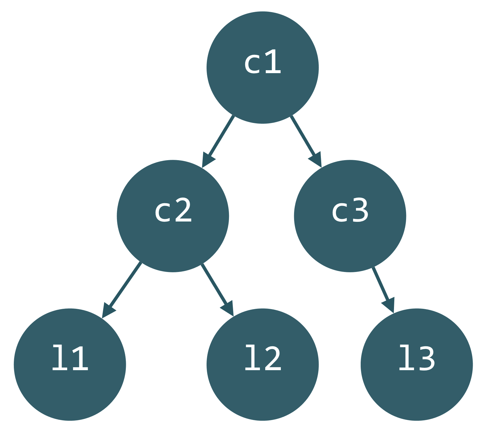

# 第二章。Angular 应用程序的构建块

在上一章中，我们探讨了新 Angular 背后的设计决策的驱动因素。我们描述了导致开发全新框架的主要原因；Angular 利用最新的 Web 标准，同时吸取过去的教训。尽管我们熟悉主要驱动因素，但我们还没有描述 Angular 的核心概念。框架的最后一个主要版本与 AngularJS 采取了不同的路径，并在用于开发单页应用程序的基本构建块中引入了许多变化。

本章的使命是描述框架的核心，并对其主要概念进行简要介绍。在接下来的几页中，我们还将概述如何将这些概念组合起来，以帮助我们为 Web 应用程序构建专业的用户界面。随后的章节将概述我们将在本书的后续部分更详细地学习的内容。

在本章中，我们将探讨以下主题：

+   框架的概念概述，展示了不同概念之间的关系。

+   我们如何将用户界面构建为组件的组合。

+   在 Angular 的新版本中，指令采取了什么路径，以及它们的接口与框架的前一个主要版本相比发生了怎样的变化。

+   强制分离关注点的原因，这导致了指令分解为两个不同的概念。为了更好地理解它们，我们将演示它们定义的基本语法。

+   改进的变化检测概述，以及它如何涉及指令提供的上下文。

+   区域是什么，以及它们如何使我们的日常开发过程变得更简单。

+   管道是什么，以及它们与 AngularJS 过滤器的关系。

+   介绍 Angular 中全新的**依赖注入（DI**）机制及其与服务的关联。

# Angular 的概念概述

在我们深入研究 Angular 的不同部分之前，让我们先了解一个概念性的概述，看看所有这些是如何结合在一起的。让我们看一下以下图表：



图 1

*图 1* 到 *图 4* 展示了 Angular 的主要概念及其之间的联系。这些图表的主要目的是说明使用 Angular 构建单页应用程序的核心模块及其关系。

**组件**是我们将使用来创建 Angular 应用程序用户界面的主要构建块。**组件**是**指令**的直接后继者，而**指令**是用于将行为附加到 DOM 的原始形式。组件通过提供进一步的功能（如模板）来扩展**指令**，该模板可以用于渲染指令的组合。在视图的模板内部可以存在不同的表达式。



图 2

上述图表从概念上说明了 Angular 的**变更检测**机制。它执行脏检查，评估特定 UI 组件上下文中的注册表达式。由于作用域的概念已经从 Angular 中移除，因此表达式的执行上下文是与它们关联的组件控制器的实例。

可以使用**Differs**增强**变更检测**机制；这就是为什么这两个元素在图表中存在直接关系的原因。

**管道**是 Angular 的另一个组件。我们可以将管道视为 AngularJS 中的过滤器。管道可以与组件一起使用。我们可以在任何组件的上下文中定义的表达式中包含它们。



图 3

现在我们来看看前面的图表。**指令**和**组件**将业务逻辑委托给**服务**。这强制执行更好的关注点分离、可维护性和代码重用性。**指令**通过框架的 DI 机制接收声明为依赖关系的特定服务的实例引用，并将与业务相关的逻辑执行委托给它们。**指令**和**组件**都可以使用**DI**机制，不仅用于注入服务，还可以注入 DOM 元素和/或其他**组件**或**指令**。

**模块**（也称为**NgModules**）是一个核心概念，它将构建块组合成单独的、逻辑上相关的组。NgModules 与 AngularJS 模块非常相似，但在此基础上增加了更多的语义。请注意，NgModules 与我们第三章中描述的 ES2015 模块不同，*TypeScript 快速入门*。Angular 模块是一个框架特性，而 ES2015 模块是一个语言结构。

NgModules 有以下职责：

+   提供 Angular 模板编译器的上下文。

+   提供一种封装级别，其中我们可以拥有仅限于给定模块边界内使用的组件或指令。

+   在 NgModules 中，我们可以配置框架的 DI 机制的提供者。



图 4

最后，新的路由器用于定义我们应用程序中的路由。由于**指令**不拥有模板，只有**组件**可以被路由器渲染，代表我们应用程序中的不同视图。路由器还使用一组预定义的指令，允许我们在不同的视图和它们应该渲染的容器之间定义超链接。

现在，我们将更仔细地研究这些概念，看看它们是如何一起工作来构建 Angular 应用程序的，以及它们是如何从它们的 AngularJS 前辈中演变而来的。

# 更改指令

AngularJS 在开发单页应用程序的过程中引入了指令的概念。指令的目的是封装与 DOM 相关的逻辑，并允许我们通过组合它们来构建用户界面。这样，我们能够扩展 HTML 的语法和语义。最初，像大多数创新概念一样，指令受到了争议性的看法，因为它们使我们倾向于在不使用 `data-` 前缀的自定义元素或属性时编写无效的 HTML。然而，随着时间的推移，这个概念逐渐被接受，并证明它将长期存在。

AngularJS 中指令实现的另一个缺点是我们可以使用它们的不同方式。这需要理解属性值，这些值可以是字面量、表达式、回调或微语法。这使得工具基本上变得不可能。

Angular 的最新版本保留了指令的概念，但从中吸取了 AngularJS 的最佳部分，并添加了一些新的想法和语法。Angular 指令的主要目的是通过扩展到在 ES2015 类中定义的自定义逻辑来将行为附加到 DOM 上。我们可以将这些类视为与指令关联的控制器，并将它们的构造函数视为与 AngularJS 指令的链接函数类似。然而，新的指令具有有限的配置性。它们不允许将模板与它们关联，这使得大多数已知用于定义指令的属性变得不必要。API 的简单性并不限制指令的行为，但只强制执行更严格的关注点分离。为了补充这个更简单的 API，Angular 2 引入了一个更丰富的界面来定义 UI 元素，称为组件。组件通过允许它们拥有模板，通过 **组件元数据** 扩展了指令的功能。我们将在本书的后面进一步探讨组件。

用于 Angular 指令的语法涉及 ES2016 装饰器。我们可以使用 TypeScript、ES2015，甚至 **ECMAScript** **5** （**ES5**）来通过稍微多一点的输入实现相同的结果。此代码定义了一个简单的指令，使用 TypeScript 编写：

```js
@Directive({ selector: '[tooltip]' })
export class Tooltip { 
  @Input() tooltip: string; 
  private overlay: Overlay;

  constructor(private el: ElementRef, manager: OverlayManager) { 
    this.overlay = manager.get(); 
  }

  @HostListener('mouseenter') onMouseEnter() { 
    this.overlay.open(this.el.nativeElement, this.tooltip); 
  }

  @HostListener('mouseleave') onMouseLeave() { 
    this.overlay.close(); 
  } 
} 

```

指令可以用以下标记在我们的模板中使用：

```js
<div tooltip="42">Tell me the answer!</div> 

```

一旦用户将鼠标悬停在标签上，**告诉我答案！**，Angular 将会调用在指令定义中由 `@HostListener` 装饰器定义的方法。最终，覆盖管理器的 `open` 方法将被执行。

### 注意

由于我们可以在单个元素上使用多个指令，最佳实践建议我们应该使用一个属性作为选择器。

定义此指令的 ECMAScript 5 语法如下：

```js
var Tooltip = ng.core.Directive({ 
  selector: '[tooltip]', 
  inputs: ['tooltip'], 
  host: { 
    '(mouseenter)': 'onMouseEnter()', 
    '(mouseleave)': 'onMouseLeave()' 
  } 
}) 
.Class({ 
  constructor: [ng.core.ElementRef, Overlay, function (tooltip, el, manager) { 
    this.el = el; 
    this.overlay = manager.get(); 
  }], 
  onMouseEnter() { 
    this.overlay.open(this.el.nativeElement, this.tooltip); 
  }, 
  onMouseLeave() { 
    this.overlay.close(); 
  } 
}); 

```

上述 ES5 语法展示了 Angular 提供的内部 JavaScript DSL，以便我们能够在现代浏览器尚未支持的语法下编写我们的代码。

我们可以总结说，Angular 通过保持将行为附加到 DOM 的想法来保留了指令的概念。与 AngularJS 的核心区别在于新的语法，以及通过引入组件带来的关注点分离的进一步分离。在第四章，*开始使用 Angular 组件和指令*中，我们将进一步探讨指令的 API。我们还将比较使用 ES2016 和 ES5 定义的指令定义语法。现在，让我们看看 Angular 组件的巨大变化。

# 了解 Angular 组件

**模型-视图-控制器**（**MVC**）是一种最初为用户界面实现引入的微架构模式。作为 Angular 开发者，我们每天都在使用这种模式的多种变体，最常见的是**模型-视图-视图模型**（**MVVM**）。在 MVC 中，我们有模型，它封装了应用程序的业务逻辑，以及视图，它负责渲染用户界面、接受用户输入并将用户交互逻辑委托给控制器。视图被表示为组件的组合，这正式称为**组合设计模式**。

让我们看一下以下的结构图，它展示了组合设计模式：



图 5

这里，我们有三个类：

+   一个名为 `Component` 的抽象类。

+   两个具体的类，称为 `Leaf` 和 `Composite`。`Leaf` 类是我们即将构建的组件树中的简单终端组件。

`Component` 类定义了一个名为 `operation` 的抽象操作。`Leaf` 和 `Composite` 都继承自 `Component` 类。然而，`Composite` 类还拥有对其的引用。我们可以更进一步，允许 `Composite` 拥有一个 `Component` 实例的引用列表，如图中所示。`Composite` 内部的组件列表可以持有对不同的 `Composite` 或 `Leaf` 实例，或扩展 `Component` 类或其任何后继类的其他类的实例的引用。我们可以在 `Composite` 的 `operation` 方法实现中调用单个 `Component` 实例的 `operation` 方法的不同行为。这是因为对象面向编程语言中实现多态所使用的后期绑定机制。

## 组件应用

理论就到这里！让我们根据前面图中展示的类层次结构构建一个组件树。这样，我们将展示如何利用组合模式通过简化的语法构建用户界面。我们将在第四章，*开始使用 Angular 组件和指令*的上下文中查看一个类似的例子：

```js
Composite c1 = new Composite(); 
Composite c2 = new Composite(); 
Composite c3 = new Composite(); 

c1.components.push(c2); 
c1.components.push(c3); 

Leaf l1 = new Leaf(); 
Leaf l2 = new Leaf(); 
Leaf l3 = new Leaf(); 

c2.components.push(l1); 
c2.components.push(l2); 

c3.components.push(l3); 

```

上述伪代码创建了三个 `Composite` 类的实例和三个 `Leaf` 类的实例。`c1` 实例在组件列表中持有对 `c2` 和 `c3` 的引用。`c2` 实例持有对 `l1` 和 `l2` 的引用，而 `c3` 持有对 `l3` 的引用：



图 6

上述图示是我们片段中构建的组件树的图形表示。这是现代 JavaScript 框架中视图类似的一个简化版本。然而，它说明了我们可以如何组合指令和组件的基础。例如，在 Angular 的上下文中，我们可以将指令视为 `Leaf` 类的实例（因为它们不拥有视图，因此不能组合其他指令和组件），而组件则是 `Composite` 类的实例。

如果我们更抽象地考虑 AngularJS 的用户界面，我们可以注意到我们使用了相当类似的方法。我们视图的模板将不同的指令组合在一起，以便向我们的应用程序的最终用户提供一个完全功能化的用户界面。

## Angular 中的组件

Angular 通过引入称为组件的新构建块采取了这种方法。组件扩展了我们之前章节中描述的指令概念，并提供了更广泛的功能。以下是一个基本的 "Hello world" 组件的定义：

```js
@Component({ 
  selector: 'hello-world', 
  template: '<h1>Hello, {{target}}!</h1>' 
}) 
class HelloWorld { 
  target: string; 
  constructor() { 
    this.target = 'world'; 
  } 
} 

```

我们可以通过在视图中插入以下标记来使用它：

```js
<hello-world></hello-world> 

```

### 注意

根据最佳实践，我们应该为组件使用类型为元素的选择器，因为我们可能每个 DOM 元素只有一个组件。

Angular 使用 DSL 提供的替代 ES5 语法如下：

```js
var HelloWorld = ng.core 
  .Component({ 
    selector: 'hello-world', 
    template: '<h1>Hello, {{target}}!</h1>' 
  }) 
  .Class({ 
    constructor: function () { 
      this.target = 'world'; 
    } 
  }); 

```

我们将在本书的后面部分更详细地探讨前面的语法。现在让我们简要描述该组件提供的功能。一旦 Angular 应用程序启动，它将查看 DOM 树中的所有元素并处理它们。当它找到一个名为 `hello-world` 的元素时，它将调用与其定义相关的逻辑，这意味着组件的模板将被渲染，花括号之间的表达式将被评估。这将导致以下标记 `<h1>Hello, world!</h1>`。

因此，总结一下，Angular 核心团队将 AngularJS 中的指令分离成两个不同的部分——组件和指令。指令提供了一种简单的方法来将行为附加到 DOM 元素上，而无需定义视图。Angular 中的组件提供了一个强大且易于学习的 API，这使得定义我们应用程序的用户界面变得更加容易。Angular 组件允许我们像 AngularJS 指令一样做同样惊人的事情，但需要更少的输入和更少的学习内容。组件通过添加视图来扩展 Angular 指令的概念。我们可以将 Angular 组件和指令之间的关系视为与我们在 *图 5* 中看到的 "Composite" 和 "Leaf" 之间的关系相同。

从概念上讲，我们可以将指令和组件之间的关系表示为继承。第四章，*开始使用 Angular 组件和指令*，将这两个概念描述得更加详细。

# Angular 模块

在 AngularJS 中，我们有模块的概念。那里的模块负责将相关功能分组并在引导过程中内部注册。不幸的是，它们没有提供诸如封装和懒加载等特性。

Angular 将 NgModules 作为框架第五个候选版本的组成部分引入。新模块的主要目的是为 Angular 编译器提供一个上下文，并实现良好的封装级别。例如，如果我们使用 NgModules 构建库，我们可以有一些内部使用但不是作为公共接口一部分的声明。让我们看看以下例子：

```js
import {NgModule} from '@angular/core';
import {CommonModule} from '@angular/common';
import {TabComponent} from './tab.component';
import {TabItemComponent} from './tab-item.component';

@NgModule({
  imports: [CommonModule],
  declarations: [TabComponent, TabItemComponent],
  exports: [TabComponent]
})
class TabModule { }
```

如果你对前面例子中的 TypeScript 语法不熟悉，请不要担心；我们将在下一章深入探讨这门语言。

在前面的代码片段中，使用 `@NgModule` 装饰器，我们声明了 `TabModule`。请注意，在 `declarations` 列表中，我们包括了 `TabComponent` 和 `TabItemComponent`，但在 `exports` 列表中，我们只有 `TabComponent`。这样，我们可以为我们的库实现一定程度的封装。模块的使用者只能使用 `TabComponent`，因此我们不必担心 `TabItemComponent` API 的向后兼容性，因为它只能在我们模块的内部访问，在我们的模块边界内。最后，通过设置传递给 `@NgModule` 的对象字面量的 `imports` 属性，我们可以列出我们想要在当前模块内部使用的模块。这样，我们将能够利用它们声明的所有 `exports` 和 `providers`（我们将在第五章依赖注入中讨论提供者），*Angular 中的依赖注入*。

## 引导 Angular 应用

与 AngularJS 类似，在我们应用渲染之前，它需要经过引导过程。在新的 Angular 中，我们可以根据所使用的平台（例如，Web、NativeScript、启用 JiT 或 AoT 编译等）以不同的方式引导应用。让我们来看一个简单的例子，了解我们如何引导一个 Web 应用，以便更好地理解新 Angular 模块在过程中的使用方法：

```js
import {NgModule} from '@angular/core';
import {platformBrowserDynamic} from '@angular/platform-browser-dynamic';
import {BrowserModule} from '@angular/platform-browser';

import {AppComponent} from './app.component';

@NgModule({
  imports: [BrowserModule],
  bootstrap: [AppComponent],
  declarations: [AppComponent],
})
export class AppModule {}

platformBrowserDynamic().bootstrapModule(AppModule);
```

在前面的例子中，`@NgModule` 装饰器中，我们声明了 `AppComponent` 并导入了 `BrowserModule`。请注意，这次，我们为 `bootstrap` 属性提供了值，明确声明我们希望使用 `AppComponent` 来引导我们的应用。

在文件的最后一行，我们调用`platformBrowserDynamic`方法返回的对象的`bootstrapModule`方法，其中包含参数`AppModule`。

总结一下，Angular 中的模块扮演着重要的角色——它们不仅逻辑上组织了我们应用程序的构建块，还提供了一种我们可以实现封装的方法。最后但同样重要的是，NgModules 在应用程序的引导过程中被大量使用。

# 管道

在商业应用程序中，我们经常需要具有相同数据的不同视觉表示。例如，如果我们有数字 100,000，并且想将其格式化为货币，我们很可能不想显示为纯数据；更有可能的是，我们希望显示为$100,000。

在 AngularJS 中，格式化数据的责任被分配给了过滤器。另一个数据格式化需求示例是当我们使用项目集合时。例如，如果我们有一个项目列表，我们可能希望根据谓词（一个布尔函数）对其进行过滤；在一个数字列表中，我们可能只想显示素数。AngularJS 有一个名为`filter`的过滤器，允许我们这样做。然而，名称的重复经常导致混淆。这也是核心团队将过滤器组件重命名为**管道**的另一个原因。

新名称背后的动机是管道和过滤器所使用的语法：

```js
{{expression | decimal | currency}} 

```

在前面的示例中，我们将管道`decimal`和`currency`应用于`expression`返回的值。大括号之间的整个表达式看起来像 Unix 管道语法。

## 定义管道

定义管道的语法类似于用于定义模块、指令和组件的语法。为了创建一个新的管道，我们可以使用 ES2015 装饰器`@Pipe`。它允许我们向类添加元数据，将其声明为管道。我们所需做的只是为管道提供一个名称并定义数据格式化逻辑。还有一个替代的 ES5 语法，如果我们想跳过转译过程，可以使用它。

在运行时，一旦 Angular 表达式解释器发现给定的表达式包含对管道的调用，它将从中检索出分配在组件内的管道集合，并使用适当的参数调用它。

以下示例说明了我们如何定义一个简单的名为`lowercase1`的管道，该管道将作为参数传递给它的字符串转换为小写表示：

```js
@Pipe({ name: 'lowercase1' }) 
class LowerCasePipe1 implements PipeTransform { 
  transform(value: string): string { 
    if (!value) return value; 
    if (typeof value !== 'string') { 
      throw new Error('Invalid pipe value', value); 
    } 
    return value.toLowerCase(); 
  } 
} 

```

为了保持一致性，让我们展示定义管道的 ECMAScript 5 语法：

```js
var LowercasePipe1 = ng.core 
  .Pipe({ 
    name: 'lowercase1' 
  }) 
  .Class({ 
    constructor: function () {}, 
    transform: function (value) { 
      if (!value) return value; 
      if (typeof value === 'string') { 
        throw new Error('Invalid pipe value', value); 
      } 
      return value.toLowerCase(); 
    } 
  }); 

```

使用 TypeScript 语法，我们实现`PipeTransform`接口并定义其中声明的`transform`方法。然而，在 ECMAScript 5 中，我们没有对接口的支持，但我们需要实现`transform`方法以定义一个有效的 Angular 管道。我们将在下一章解释 TypeScript 接口。

现在，让我们演示如何在组件内部使用`lowercase1`管道：

```js
@Component({ 
  selector: 'app', 
  template: '<h1>{{"SAMPLE" | lowercase1}}</h1>' 
}) 
class App {} 

@NgModule({
  declarations: [App, LowerCasePipe1],
  bootstrap: [App],
  imports: [BrowserModule]
})
class AppModule {}

platformBrowserDynamic().bootstrapModule(AppModule);
```

此外，此处的替代 ECMAScript 5 语法如下：

```js
var App = ng.core.Component({ 
  selector: 'app', 
  template: '<h1>{{"SAMPLE" | lowercase1}}</h1>' 
}) 
.Class({ 
  constructor: function () {} 
}); 

var AppModule = ng.core.NgModule({
  declarations: [App, LowerCasePipe1],
  bootstrap: [App],
  imports: [BrowserModule]
})
.Class({
  constructor: function {}
});

ng.platformBrowserDynamic
 .platformBrowserDynamic()
 .bootstrapModule(AppModule);

```

我们可以使用以下标记使用 `App` 组件：

```js
   <app></app> 

```

我们将在屏幕上看到的将是 `h1` 元素内的文本样本。请注意，我们在 `@NgModule` 装饰器的 `declarations` 属性中包含了 `LowerCasePipe1` 的引用。

通过将数据格式化逻辑作为一个单独的组件，Angular 保持了一直以来可以看到的强关注点分离。我们将在 第七章 *解释管道和与 RESTful 服务通信* 中看看我们如何为我们的应用程序定义有状态和无状态的管道。

# 改进变更检测

如我们之前看到的，MVC 中的视图根据从模型接收到的变更事件来更新自己。许多 **Model View Whatever** (**MVW**) 框架采取了这种方法，并在其变更检测机制的核心中嵌入观察者模式。

## 经典的变更检测

让我们看看一个简单的例子，它没有使用任何框架。假设我们有一个名为 `User` 的模型，它有一个名为 `name` 的属性：

```js
class User extends EventEmitter { 
  private name: string;

  setName(name: string) { 
    this.name = name; 
    this.emit('change');
  }

  getName(): string { 
    return this.name;
  } 
} 

```

前面的代码片段再次使用了 TypeScript。如果你对语法不熟悉，不要担心，我们将在下一章介绍这门语言。

`user` 类扩展了 `EventEmitter` 类。这为发出和订阅事件提供了原语。

现在，让我们定义一个视图，该视图显示 `User` 类实例的 `name`，它作为参数传递给其 `constructor`：

```js
class View { 
  constructor(user: User, el: Element /* a DOM element */) { 
    el.innerHTML = user.getName();
  } 
} 

```

我们可以通过以下方式初始化 `view` 元素：

```js
let user = new User(); 
user.setName('foo'); 
let view = new View(user, document.getElementById('label')); 

```

最终结果，用户将看到一个包含内容 **foo** 的标签。然而，用户的更改不会在视图中反映出来。为了在用户 `name` 发生更改时更新视图，我们需要订阅 `change` 事件，然后更新 DOM 元素的内容。我们需要以下方式更新 `View` 定义：

```js
class View { 
  constructor(user:User, el:any /* a DOM element */) { 
    el.innerHTML = user.getName(); 
    user.on('change', () => { 
      el.innerHTML = user.getName();
    }); 
  } 
} 

```

这就是大多数框架在 AngularJS 时代之前如何实现变更检测的方式。

## AngularJS 的变更检测

大多数初学者都对 AngularJS 中的数据绑定机制着迷。基本的 "Hello world" 示例看起来像这样：

```js
function MainCtrl($scope) { 
  $scope.label = 'Hello world!'; 
}
```

```js
<body ng-app ng-controller="MainCtrl"> 
  {{label}} 
</body> 

```

如果你运行这个程序，**Hello world!** 就会神奇地出现在屏幕上。然而，这并不是唯一令人印象深刻的事情！如果我们添加一个文本输入并将其绑定到作用域的 `label` 属性，每次更改都会反映在插值指令显示的内容中：

```js
<body ng-controller="MainCtrl"> 
  <input ng-model="label"> 
  {{label}} 
</body> 

```

这有多么酷！这是 AngularJS 的主要卖点之一——实现数据绑定的极端简单性。我们在标记中添加了一些属性，插值指令，将 `label` 属性添加到一个神秘的对象 `$scope` 中，这个对象神奇地传递给我们定义的自定义函数，然后一切就简单地工作了！

经验更丰富的 Angular 开发者对幕后实际发生的事情有更好的理解。在前面的例子中，在指令内部，Angular 添加了与相同表达式`label`相关联的不同行为的观察者——`ng-model`和`ng-bind`（在我们的例子中，是插值指令`{{}}`）。这些观察者与经典 MVC 模式中的观察者相当相似。在特定事件（在我们的例子中，是文本输入内容的变化）发生时，AngularJS 会遍历所有这样的观察者，在给定作用域的上下文中评估与它们相关联的表达式，并存储它们的结果。这个循环被称为**消化循环**。

在前面的例子中，在作用域的上下文中评估表达式`label`将返回文本，**Hello world!**。在每次迭代中，AngularJS 会将当前评估结果与上一个结果进行比较，并在值不同的情况下调用相关回调。例如，插值指令添加的回调会将元素的 内容设置为表达式评估的新结果。这是一个两个指令观察者回调之间依赖性的例子。由`ng-model`添加的观察者回调修改了与插值指令添加的观察者相关联的表达式的结果。

这种方法有其自身的缺点。我们说过，消化循环将在某些特定事件上被调用，但如果我们使用`setTimeout`，并在回调函数中（作为第一个参数传递），改变我们正在监视的作用域附加的属性，这些事件会发生在框架之外；例如，如果我们使用`setTimeout`，并在回调函数中（作为第一个参数传递），改变我们正在监视的作用域附加的属性，AngularJS 将不会意识到这种变化，并且不会调用消化循环，因此我们需要显式地使用`$scope.$apply`来做这件事。但是，如果框架知道浏览器中发生的所有异步事件，例如用户事件、`XMLHttpRequest`事件、与`WebSocket`相关的事件以及其他事件，会怎样呢？在这种情况下，Angular 将能够拦截事件处理，并可以在不强迫我们这样做的情况下调用消化循环！

### 在`zone.js`

在 Angular 的新版本中，这种情况正是如此。这个功能是通过使用`zone.js`来实现的。

在 2014 年的 ng-conf 上，Brian Ford 做了一次关于 zones 的演讲。Brian 将 zones 描述为浏览器 API 的元猴子补丁。Zone.js 是由 Angular 团队开发的一个库，它在 JavaScript 中实现了 zones。它们代表一个执行上下文，允许我们拦截异步浏览器调用。基本上，使用 zones，我们能够在给定的`XMLHttpRequest`完成或当我们收到新的`WebSocket`事件时调用一段逻辑。Angular 通过拦截异步浏览器事件并在正确的时间调用消化循环来利用`zone.js`。这完全消除了使用 Angular 的开发者显式调用消化循环的需要。

### 简化的数据流

跨观察者依赖关系可能会在我们的应用程序中创建复杂的数据流，难以追踪。这可能导致不可预测的行为和难以发现的错误。尽管 Angular 将脏检查作为一种实现变更检测的方式，但它强制执行单向数据流。这是通过不允许不同观察者之间的依赖关系来实现的，这允许仅运行一次消化循环。这种策略显著提高了我们应用程序的性能，并降低了数据流的复杂性。Angular 还对内存效率和消化循环的性能进行了改进。有关 Angular 的变更检测及其实现的不同策略的更多详细信息，请参阅第四章，*开始使用 Angular 组件和指令*。

## 提升 AngularJS 的变更检测

现在，让我们退一步，再次思考框架的变更检测机制。

我们说过，在消化循环内部，Angular 评估注册的表达式，并将评估的值与循环前一次迭代中与相同表达式关联的值进行比较。

用于比较的最优算法可能取决于从表达式评估返回的值的类型。例如，如果我们得到一个可变的项目列表，我们需要遍历整个集合，逐个比较集合中的项目，以验证是否有变化。然而，如果我们有一个不可变列表，我们只需通过比较引用来执行检查，就可以以恒定的复杂度进行检查。这是因为不可变数据结构的实例不能改变。而不是应用一个旨在修改这些实例的操作，我们将得到一个应用了修改的新引用。

在 AngularJS 中，我们可以使用几种方法添加观察者。其中两种是`$watch(exp, fn, deep)`和`$watchCollection(exp, fn)`。这些方法让我们在一定程度上控制变更检测将如何执行相等性检查。例如，使用`$watch`添加观察者并将`false`值作为第三个参数传递，将使 AngularJS 执行引用检查（即使用`===`比较当前值和前一个值）。然而，如果我们传递一个真值（任何`true`值），检查将是深层次的（即使用`angular.equals`）。这样，根据表达式值的预期类型，我们可以以最合适的方式添加监听器，以便让框架使用最优化算法执行相等性检查。此 API 有两个限制：

+   它不允许你在运行时选择最合适的相等性检查算法。

+   它不允许你将变更检测扩展到第三方特定的数据结构。

Angular 核心团队将这项责任分配给了 differs，使他们能够根据我们在应用程序中使用的数据扩展并优化更改检测机制。Angular 定义了两个基本类，我们可以扩展它们来定义自定义算法：

+   `KeyValueDiffer`：这允许我们对基于键值的数据结构进行高级的 diffing 操作。

+   `IterableDiffer`：这允许我们对类似列表的数据结构进行高级的 diffing 操作。

Angular 允许我们通过扩展自定义算法来完全控制更改检测机制，这在框架的先前版本中是不可能的。我们将在第四章入门 Angular 组件和指令中进一步探讨更改检测以及我们如何配置它。

# 服务

服务是 Angular 为定义我们应用程序的业务逻辑提供的构建块。在 AngularJS 中，我们有三种不同的方法来定义服务：

```js
// The Factory method 
module.factory('ServiceName', function (dep1, dep2, ...) { 
  return { 
    // public API 
  }; 
}); 

// The Service method 
module.service('ServiceName', function (dep1, dep2, ...) { 
  // public API 
  this.publicProp = val; 
}); 

// The Provider method 
module.provider('ServiceName', function () { 
  return { 
    $get: function (dep1, dep2, ...) { 
      return { 
        // public API 
      }; 
    } 
  }; 
}); 

```

虽然前两种语法变体提供了类似的功能，但它们在注册服务实例化的方式上有所不同。第三种语法允许在配置时间进一步配置注册提供者。

对于 AngularJS 初学者来说，有三种不同的方法来定义服务确实很令人困惑。让我们思考一下，是什么促使引入这些方法来注册服务。为什么我们不能简单地使用 Angular 不会意识到的 JavaScript 构造函数、对象字面量或 ES2015 类呢？我们可以像这样将我们的业务逻辑封装在一个自定义 JavaScript 构造函数中：

```js
function UserTransactions(id) { 
  this.userId = id; 
}

UserTransactions.prototype.makeTransaction = function (amount) { 
  // method logic 
}; 

module.controller('MainCtrl', function () { 
  this.submitClick = function () { 
    new UserTransactions(this.userId).makeTransaction(this.amount); 
  }; 
}); 

```

这段代码完全有效。然而，它没有充分利用 AngularJS 提供的一个关键特性：DI 机制。`MainCtrl` 函数使用构造函数 `UserTransaction`，该函数在其主体中可见。前述代码有两个主要缺陷：

+   我们与服务实例化所使用的逻辑耦合在一起。

+   代码不可测试。为了模拟 `UserTransactions`，我们需要对其进行猴子补丁。

AngularJS 如何处理这两件事？当需要某个服务时，通过框架的 DI 机制，AngularJS 解析其所有依赖项，并通过传递给一个封装其创建逻辑的工厂函数来实例化它。工厂函数作为 `factory` 和 `service` 方法的第二个参数传递。`provider` 方法允许在较低级别上定义服务；那里的工厂方法是 `$get` 属性下的一个。

就像 AngularJS 一样，Angular 的新版本也容忍这种关注点的分离，因此核心团队保留了服务。与 AngularJS 相比，框架的最后一个主要版本通过允许我们使用纯 ES2015 类或 ES5 构造函数来定义它们的接口，提供了一个更简单的接口。我们无法逃避这样一个事实，即我们需要明确声明应可注入的服务，并 somehow 指定它们的实例化指令。与 AngularJS 相比，现在框架使用 ES2016 装饰器的语法来实现这一目的，而不是我们从 AngularJS 中熟悉的方法。这允许我们将应用程序中的服务定义为简单的 ES2015 类，并使用装饰器来配置 DI：

```js
import {Injectable} from '@angular/core'; 

@Injectable() 
class HttpService { 
  constructor() { /* ... */ } 
} 

@Injectable() 
class User { 
  constructor(private service: HttpService) {}

  save() { 
    return this.service.post('/users') 
      .then(res => { 
        this.id = res.id; 
        return this; 
      }); 
  } 
} 

```

这是替代的 ECMAScript 5 语法：

```js
var HttpService = ng.core.Class({ 
  constructor: function () {} 
}); 
var User = ng.core.Class({ 
  constructor: [HttpService, function (service) { 
    this.service = service; 
  }], 
  save: function () { 
    return this.service.post('/users') 
      .then(function (res) { 
        this.id = res.id; 
        return this; 
      }); 
  } 
}); 

```

服务与前面章节中描述的组件和指令相关。为了开发高度一致和可重用的 UI 组件，我们需要将所有与业务相关的逻辑移动到我们的服务内部。此外，为了开发可测试的组件，我们需要利用 DI 机制来解决它们的所有依赖项。

与 AngularJS 中的服务相比，它们依赖项的解决和内部表示方式存在一个核心差异。AngularJS 使用字符串来标识不同的服务和用于其实例化的相关工厂。另一方面，现在 Angular 使用键。通常，键是不同服务的类型。在实例化方面的另一个核心差异是注入器的分层结构，它们封装了具有不同可见性的不同依赖项提供者。

在框架的最后两个主要版本中，服务之间的另一个区别是简化的语法。尽管 Angular 的新版本使用 ES2015 类来定义我们的业务逻辑，但我们也可以使用 ECMAScript 5 的`constructor`函数，或者使用框架提供的 DSL。Angular 最新版本的依赖注入（DI）具有完全不同的语法，并通过提供一种一致的方式来注入依赖项，从而改善了行为。前一个示例中使用的语法是 ES2016 装饰器，在第五章，*Angular 中的依赖注入*中，我们将探讨另一种语法，它使用 ECMAScript 5。你还可以在第五章，*Angular 中的依赖注入*中找到对 Angular 服务和 DI 的更详细解释。

# 新的 router

在传统的 Web 应用程序中，所有页面更改都与整个页面重新加载相关联，这会获取所有引用的资源和数据，并将整个页面渲染到屏幕上。然而，Web 应用程序的需求随着时间的推移而发展。

我们用 Angular 构建的单页应用程序（**SPAs**）模拟桌面用户体验。这通常涉及按需加载应用程序所需的资源和数据，并且在初始页面加载后没有全页刷新。在 SPAs 中，不同的页面或视图通常由不同的模板表示，这些模板异步加载并在屏幕上的特定位置渲染。稍后，当包含所有所需资源的模板加载并且路由更改时，与所选页面关联的逻辑被调用，并用数据填充模板。如果用户在我们的 SPA 中加载给定页面后按下刷新按钮，则在视图刷新完成后，需要重新渲染相同的页面。这涉及到类似的行为：找到请求的视图，获取所有引用资源的所需模板，并调用与该视图关联的逻辑。

需要获取的模板以及页面成功刷新后应调用的逻辑，取决于用户在按下刷新按钮之前选中的视图。框架通过解析包含当前选中页面标识符的页面 URL 来确定这一点，该标识符以分层结构表示。

所有与导航、更改 URL、加载适当的模板以及在视图加载时调用特定逻辑相关的责任都分配给了路由器组件。这些是一些相当具有挑战性的任务，并且支持不同导航 API 以实现跨浏览器兼容性，使得在现代 SPAs 中实现路由成为一个非平凡问题。

AngularJS 在其核心中引入了路由器，后来将其外部化为 `ngRoute` 模块。它允许通过为每个页面提供一个模板以及当页面被选中时需要调用的逻辑，以声明式的方式定义我们 SPA 中的不同视图。然而，路由器的功能有限。它不支持基本功能，例如嵌套视图路由。这就是为什么大多数开发者更愿意使用社区开发的 `ui-router` 的一个原因。AngularJS 的路由器和 `ui-router` 的路由定义都包含一个路由配置对象，该对象定义了一个与页面关联的模板和一个控制器。

如前几节所述，Angular 改变了它为开发 SPAs 提供的构建块。Angular 移除了浮动控制器，而是将视图表示为组件的组合。这需要开发一个全新的路由器，它赋予这些新概念能力。

AngularJS 路由器和新的 Angular 路由器之间的核心区别如下：

+   新的 路由器是基于组件的，`ngRoute` 不是。新的 Angular 路由器将组件与单个路由或模块关联，这在懒加载路由的情况下适用。

+   现在支持嵌套视图。

## Angular 路由定义语法

让我们简要了解一下 Angular 路由器在应用中定义路由所使用的新语法：

```js
import {Component, NgModule} from '@angular/core';
import {BrowserModule} from '@angular/platform-browser';
import {RouterModule, Routes} from '@angular/router';

import {HomeComponent} from './home/home.component';
import {AboutComponent} from './about/about.component';
import {AppComponent} from './app.component';

const routes: Routes = [
  { path: 'home', component: HomeComponent },
  { path: 'about', component: AboutComponent }
];

@NgModule({ 
  imports: [BrowserModule, RouterModule.forRoot(routes)],
  declarations: [AppComponent, HomeComponent, AboutComponent],
  bootstrap: [AppComponent]
})
export class AppModule {} 

```

由于第六章*使用 Angular 路由器和表单*和第七章*解释管道和与 RESTful 服务通信*专门介绍了新路由器，所以我们这里不会过多深入，但让我们提及前面代码片段中的主要点。

路由器位于`@angular/router`。由于`AppModule`是我们应用的根模块，我们使用`RouterModule`的`forRoot`方法来导入路由器导出的所有所需指令和服务。

传递给`RouterModule.forRoot`装饰器的参数显示了我们在应用中如何定义路由。我们使用一个对象数组，它定义了路由与其相关组件之间的映射。

# 摘要

在本章中，我们快速概述了 Angular 提供的用于开发单页应用（SPAs）的主要构建块。我们指出了与 AngularJS 核心概念的主要区别。

虽然我们可以使用 ES2015，甚至 ES5 来构建 Angular 应用，但谷歌的建议是利用用于框架开发的语言-TypeScript。这样我们就可以使用诸如预编译等高级功能，这些功能我们将在第八章*工具和开发体验*中描述。

在下一章中，我们将探讨 TypeScript 以及我们如何在下一个应用中开始使用它。我们还将解释如何通过环境类型定义利用用纯 JavaScript 编写的 JavaScript 库和框架中的静态类型。
