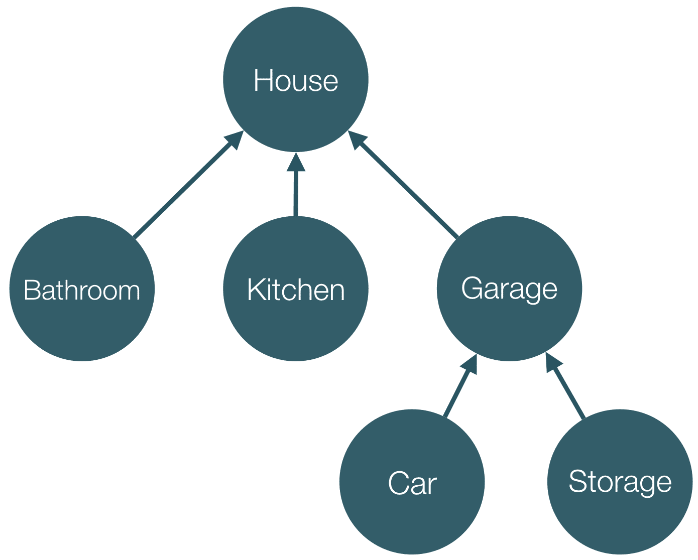

# 第五章。Angular 中的依赖注入

在本章中，我们将解释如何利用框架的**依赖注入**（**DI**）机制及其所有各种功能。

我们将探讨以下主题：

+   配置和创建注入器。

+   使用注入器实例化对象。

+   将依赖项注入到指令和组件中——这样，我们就能重用服务中定义的业务逻辑，并将其与 UI 逻辑连接起来。

+   为 ES5 代码添加注解，以获得与使用 TypeScript 语法时相同的结果。

# 为什么我需要 DI？

假设我们有一个依赖于`Engine`和`Transmission`类的`Car`类。我们如何实现这个系统？让我们看看：

```js
class Engine {...} 

class Transmission {...}

class Car { 
  engine; 
  transmission;

  constructor() { 
    this.engine = new Engine(); 
    this.transmission = new Transmission(); 
  } 
} 

```

在前面的示例中，我们在`Car`类的构造函数内部创建了其依赖项。虽然看起来很简单，但它远非灵活。每次我们创建`Car`类的实例时，在其构造函数中，都会创建相同`Engine`和`Transmission`类的实例。这可能会因为以下原因而成为问题：

+   由于我们无法独立于`engine`和`transmission`依赖项测试`Car`类，因此`Car`类变得难以测试。

+   我们将`Car`类与其依赖项的实例化逻辑耦合起来。

# Angular 中的 DI

另一种处理方式是利用 DI 模式。我们已经在 AngularJS 中熟悉它了；让我们演示一下如何在 Angular 的上下文中使用 DI 重构前面的代码：

```js
class Engine {...} 
class Transmission {...} 

@Injectable() 
class Car { 
  engine; 
  transmission;

  constructor(engine: Engine, transmission: Transmission) { 
    this.engine = engine; 
    this.transmission = transmission; 
  } 
} 

```

在前面的代码片段中，我们只是在`Car`类的定义上方添加了`@Injectable`类装饰器，并为构造函数的参数提供了类型注解。

## DI 的好处

还有一个步骤，我们将在下一节中探讨。在此之前，让我们看看这种方法的优点：

+   我们可以轻松地传递`Car`类依赖项的不同版本，用于测试环境或实例化不同的`Car`车型。

+   我们没有与依赖项实例化的逻辑耦合。

`Car`类只负责实现其自身的领域特定逻辑，而不是与额外的功能耦合，例如其依赖项的管理。我们的代码也更加声明式和易于阅读。

现在，我们已经意识到 DI 的一些好处，让我们看看为了使代码工作所缺少的部分。

# 配置注入器

在我们的 Angular 应用程序中，通过框架的 DI 机制实例化个体依赖项所使用的原始类型被称为**注入器**。注入器包含一组**提供者**，这些提供者封装了与**令牌**关联的已注册依赖项的实例化逻辑。我们可以将令牌视为注入器内注册的不同提供者的标识符。

让我们看看以下代码片段，它位于 `ch5/ts/injector-basics/injector.ts`：

```js
import 'reflect-metadata';
import {
  ReflectiveInjector,
  Inject,
  Injectable,
  OpaqueToken
} from '@angular/core';

const BUFFER_SIZE = new OpaqueToken('buffer-size');

class Buffer {
  constructor(@Inject(BUFFER_SIZE) private size: Number) {
    console.log(this.size);
  }
}

@Injectable()
class Socket {
  constructor(private buffer: Buffer) {}
}

let injector = ReflectiveInjector.resolveAndCreate([
  { provide: BUFFER_SIZE, useValue: 42 },
  Buffer,
  Socket
]);

injector.get(Socket);

```

你可以使用以下命令运行文件：

```js
$ cd app
$ ts-node ch5/ts/injector-basics/injector.ts

```

如果你还没有安装 `ts-node`，请参阅 第三章，*TypeScript 快速入门*，其中解释了如何进行操作，以便在您的计算机上运行。

然后，我们导入 `ReflectiveInjector`、`Injectable`、`Inject`、`OpaqueToken` 和 `provide`。

注入器代表一个用于不同依赖项实例化的抽象 **容器**；`ReflectiveInjector` 是一个具体类，它实现了这个抽象。使用声明的规则，将对象字面量作为 `resolveAndCreate` 的第一个参数传递，以及 TypeScript 编译器生成的元数据，`ReflectiveInjector` 就知道如何创建不同的依赖项。

在前面的代码片段中，我们最初定义了 `BUFFER_SIZE` 常量，并将其设置为 `new OpaqueToken('buffer-size')` 的值。我们可以将 `BUFFER_SIZE` 的值视为一个在应用程序中不能重复的唯一值（`OpaqueToken` 是 ES2015 中 `Symbol` 类的替代品，因为在编写这本书的时候，TypeScript 还不支持它）。

我们定义了两个类：`Buffer` 和 `Socket`。`Buffer` 类有一个只接受一个名为 `size` 的依赖项的构造函数，其类型为 `Number`。为了在依赖项解析过程中添加额外的元数据，我们使用 `@Inject` 参数装饰器。这个装饰器接受一个标识符（也称为 **标记**）作为我们想要注入的依赖项。通常，它是依赖项的类型（即类的引用），但在某些情况下，它可以是不同类型的值。例如，在我们的情况下，我们使用了 `OpaqueToken` 类的实例。

## 基于生成元数据的依赖解析

现在，让我们看看 `Socket` 类。我们用 `@Injectable` 装饰器来装饰它。这个装饰器应该被任何接受依赖并通过 Angular 的依赖注入机制注入的类使用。

`@Injectable` 装饰器强制 TypeScript 编译器为给定类接受的依赖类型生成额外的元数据。这意味着，如果我们省略 `@Injectable` 装饰器，Angular 的依赖注入机制将不会意识到它需要解析的依赖项关联的标记。

如果在类上没有使用任何装饰器，TypeScript 不会生成任何元数据，这主要是出于性能考虑。想象一下，如果为每个接受依赖的单独类生成这样的元数据——在这种情况下，输出将会因为额外的未使用类型元数据而变得臃肿。

使用 `@Injectable` 的一个替代方案是使用 `@Inject` 装饰器显式声明依赖项的标记。看看下面的例子：

```js
class Socket {
  constructor(@Inject(Buffer) private buffer: Buffer) {}
}

```

这意味着前面的代码与之前提到的使用`@Injectable`的代码具有等效的语义。唯一的区别是，与使用`@Injectable`的情况相比，Angular 将明确（直接从`@Inject`装饰器添加的元数据）获取依赖项的类型（即与之关联的令牌），而在使用`@Injectable`的情况下，它将查看编译器生成的元数据。

## 实例化注入器

现在，让我们创建一个注入器的实例，以便使用它来实例化已注册的令牌：

```js
let injector = ReflectiveInjector.resolveAndCreate([ 
  { provide: BUFFER_SIZE, useValue: 42 }, 
  Buffer, 
  Socket 
]); 

```

我们使用`ReflectiveInjector`的静态方法`resolveAndCreate`创建其实例。这是一个接受提供者数组作为参数并返回一个新的`ReflectiveInjector`的工厂方法。

`resolve`意味着提供者将经历一个解决过程，这包括一些内部处理（展平多个嵌套数组并将单个提供者转换为数组）。随后，注入器可以根据提供者封装的规则实例化我们已注册提供者的任何依赖项。

在我们的情况下，通过提供者的声明，我们明确告诉 Angular 的 DI 机制，当需要`BUFFER_SIZE`令牌时，使用值`42`。其他两个提供者是隐式的。Angular 将在所有依赖项都解决后，通过使用`new`运算符调用提供的类来实例化它们。

我们在`Buffer`类的构造函数中请求`BUFFER_SIZE`值：

```js
class Buffer { 
  constructor(@Inject(BUFFER_SIZE) private size: Number) { 
    console.log(this.size); 
  } 
} 

```

在前面的示例中，我们使用了`@Inject`参数装饰器。它暗示了 DI 机制，即`Buffer`类构造函数的第一个参数应该使用与注入器传递的`BUFFER_SIZE`令牌关联的提供者进行实例化。

## 引入前向引用

Angular 引入了**前向引用**的概念。这是由于以下原因所必需的：

+   ES2015 类不是提升的。

+   允许在依赖提供者声明之后解决声明的依赖项。

在本节中，我们将解释前向引用解决的问题以及我们可以如何利用它们。

现在，假设我们以相反的顺序定义了`Buffer`和`Socket`类：

```js
// ch5/ts/injector-basics/forward-ref.ts 

@Injectable() 
class Socket { 
  constructor(private buffer: Buffer) {...} 
} 

// undefined 
console.log(Buffer); 

class Buffer { 
  constructor(@Inject(BUFFER_SIZE) private size: Number) {...} 
} 

// [Function: Buffer] 
console.log(Buffer); 

```

在这里，我们具有与上一个示例中完全相同的依赖项，但在这个情况下，`Socket`类的定义先于`Buffer`类的定义。请注意，`Buffer`标识符的值将在 JavaScript 虚拟机评估`Buffer`类的声明之前等于`undefined`。然而，`Socket`接受的依赖项类型的元数据将被生成并放置在`Socket`类定义之后。这意味着，在解释生成的 JavaScript 代码期间，`Buffer`标识符的值将等于`undefined`——也就是说，作为一个依赖项的类型（或在 Angular 的 DI 机制中，其 token），框架将获得一个无效的值。

运行前面的代码片段将导致以下形式的运行时错误：

****错误：无法解析`Socket(undefined)`的所有参数。请确保它们都具有有效的类型或注解。****

解决此问题的最佳方式是通过交换定义的正确顺序。另一种我们可以采取的方法是利用 Angular 提供的解决方案——前向引用：

```js
... 
import {forwardRef} from '@angular/core'; 
...

@Injectable() 
class Socket { 
  constructor(@Inject(forwardRef(() => Buffer)) 
    private buffer: Buffer) {} 
}

class Buffer {...} 

```

前面的代码片段展示了我们如何利用前向引用的优势。我们只需要使用带有`forwardRef`函数调用结果的`@Inject`参数装饰器即可。`forwardRef`函数是一个高阶函数，它接受一个单一参数——另一个负责返回需要注入的依赖项（或更精确地说，其提供者）所关联的标记（token）的函数。这样，框架提供了一种延迟解析依赖项（token）类型的过程的方法。

依赖项的标记将在第一次需要实例化`Socket`时解析，这与默认行为不同，在默认行为中，标记在给定类的声明时就需要。

## 配置提供者

现在，让我们看看一个与之前使用的示例类似，但具有不同注入器配置的例子：

```js
let injector = ReflectiveInjector.resolveAndCreate([ 
  { provide: BUFFER_SIZE, useValue: 42 }, 
  { provide: Buffer, useClass: Buffer }, 
  { provide: Socket, useClass: Socket } 
]); 

```

在这种情况下，在提供者内部，我们明确声明我们希望使用`Buffer`类来构建具有与`Buffer`类引用相等的 token 的依赖项。我们对与`Socket`token 关联的依赖项做完全相同的事情；但这次，我们提供了`Socket`类。这就是 Angular 在省略显式提供者声明并仅传递类引用时将如何操作。

明确声明用于创建同一类实例的类可能看起来毫无价值，并且鉴于我们迄今为止看到的示例，这将是完全正确的。然而，在某些情况下，我们可能希望为与给定类 token 关联的依赖项实例化提供不同的类。

例如，假设我们有一个名为`UserService`的服务中使用的`Http`服务：

```js
class Http {...} 

@Injectable() 
class UserService { 
  constructor(private http: Http) {} 
} 

let injector = ReflectiveInjector.resolveAndCreate([ 
  UserService, 
  Http 
]); 

```

`UserService` 服务使用 `Http` 与 RESTful 服务进行通信。我们可以使用 `injector.get(UserService)` 来实例化 `UserService`。这样，由注入器的 `get` 方法调用的 `UserService` 的构造函数将接受一个 `Http` 服务实例作为参数。然而，如果我们想测试 `UserService`，我们实际上并不需要向 RESTful 服务发起 HTTP 请求。在单元测试的情况下，我们可以提供一个模拟实现，它只会模拟这些 HTTP 请求。为了将不同类的实例注入到 `UserService` 服务中，我们可以更改注入器的配置如下：

```js
class DummyHttp {...} 

// ... 

let injector = ReflectiveInjector.resolveAndCreate([ 
  UserService, 
  { provide: Http, useClass: DummyHttp } 
]); 

```

现在，当我们实例化 `UserService` 时，它的构造函数将接收一个 `DummyHttp` 服务实例的引用。此代码位于 `ch5/ts/configuring-providers/dummy-http.ts`。

### 使用现有提供者

另一种进行的方式是使用提供者配置对象的 `useExisting` 属性：

```js
// ch5/ts/configuring-providers/existing.ts 
let injector = ReflectiveInjector.resolveAndCreate([ 
  DummyService, 
  { provide: Http, useExisting: DummyService }, 
  UserService 
]); 

```

在前面的代码片段中，我们注册了三个令牌：`DummyService`、`UserService` 和 `Http`。我们声明我们希望将 `Http` 令牌绑定到现有的 `DummyService` 令牌。这意味着当请求 `Http` 服务时，注入器将找到作为 `useExisting` 属性值的令牌的提供者，并实例化它或获取与之关联的值。我们可以将 `useExisting` 视为为给定令牌创建一个别名：

```js
let dummyHttp = { 
  get() {}, 
  post() {} 
}; 
let injector = ReflectiveInjector.resolveAndCreate([ 
  { provide: DummyService, useValue: dummyHttp }, 
  { provide: Http, useExisting: DummyService }, 
  UserService 
]); 
console.assert(injector.get(UserService).http === dummyHttp); 

```

前面的代码片段将为 `Http` 令牌创建一个 `DummyHttp` 令牌的别名。这意味着一旦请求 `Http` 令牌，调用将被转发到与 `DummyHttp` 令牌关联的提供者，它将被解析为 `dummyHttp` 的值。

# 定义用于实例化服务的工厂

现在，假设我们想要创建一个复杂对象，例如，代表传输层安全性（**TLS**）连接的对象。此类对象的一些属性包括套接字、一组加密协议和证书。在这个问题的背景下，我们迄今为止所查看的 Angular 的依赖注入（DI）机制的功能可能看起来有些有限。

例如，我们可能需要配置 `TLSConnection` 类的一些属性，而不将其实例化过程与所有配置细节耦合（选择合适的加密算法，打开我们将通过它建立安全连接的 TCP 套接字等）。

在这种情况下，我们可以利用提供者配置对象的 `useFactory` 属性：

```js
let injector = ReflectiveInjector.resolveAndCreate([ 
  { 
    provide: TLSConnection, 
    useFactory: (socket: Socket, certificate: Certificate, crypto: Crypto) 
      =>  { 
        let connection = new TLSConnection(); 
        connection.certificate = certificate; 
        connection.socket = socket; 
        connection.crypto = crypto; 
        socket.open(); 
        return connection; 
      }, 
      deps: [Socket, Certificate, Crypto] 
  }, 
  { BUFFER_SIZE, useValue: 42 }, 
  Buffer, 
  Socket, 
  Certificate, 
  Crypto 
]); 

```

上述代码片段一开始可能看起来有些复杂，但让我们一步一步地来看。我们可以从我们已经熟悉的部分开始：

```js
let injector = ReflectiveInjector.resolveAndCreate([ 
  ... 
  { BUFFER_SIZE, useValue: 42 }, 
  Buffer, 
  Socket, 
  Certificate, 
  Crypto 
]); 

```

初始时，我们注册了多个提供者：`Buffer`、`Socket`、`Certificate`和`Crypto`。就像前面的例子一样，我们也注册了`BUFFER_SIZE`令牌并将其与值`42`关联。这意味着我们已经可以创建`Buffer`、`Socket`、`Certificate`和`Crypto`类型的对象，如下所示：

```js
// buffer with size 42 
console.log(injector.get(Buffer)); 
// socket with buffer with size 42 
console.log(injector.get(Socket)); 

```

我们可以通过以下方式创建和配置`TLSConnection`对象的一个实例：

```js
let connection = new TLSConnection();
connection.certificate = certificate;
connection.socket = socket;
connection.crypto = crypto;
socket.open();
return connection;

```

现在，如果我们注册一个具有`TLSConnection`令牌作为依赖项的提供者，我们将阻止 Angular 的依赖注入机制处理依赖项解析过程。为了解决这个问题，我们可以使用提供者配置对象的`useFactory`属性。这样，我们可以指定一个函数，在其中我们可以手动创建与提供者令牌关联的对象的实例。我们可以使用`useFactory`属性与`deps`属性一起使用，以指定要传递给工厂的依赖项：

```js
{
  provide: TLSConnection,
  useFactory: (socket: Socket, certificate: Certificate, crypto: Crypto) =>  { 
    // ... 
  }, 
  deps: [Socket, Certificate, Crypto] 
}

```

在前面的代码片段中，我们定义了用于`TLSConnection`实例化的工厂函数。作为依赖项，我们声明了`Socket`、`Certificate`和`Crypto`。这些依赖项由 Angular 的依赖注入机制解析并注入到工厂函数中。您可以查看整个实现并在`ch5/ts/configuring-providers/factory.ts`中尝试它。

# 子注入器和可见性

在本节中，我们将探讨如何构建注入器的层次结构。这是 Angular 2 框架中引入的一个全新的概念。每个注入器可以有一个或没有父注入器，每个父注入器可以有零个或多个子注入器。与 AngularJS 中所有注册的提供者都存储在扁平结构中不同，在 Angular 2 及以后的版本中，它们被存储在树中。扁平结构更为有限；例如，它不支持令牌的命名空间；我们无法为相同的令牌声明不同的提供者，这在某些情况下可能是必需的。到目前为止，我们已经查看了一个没有子注入器或父注入器的注入器示例。现在，让我们构建一个注入器的层次结构。

为了更好地理解注入器的这种层次结构，让我们看一下以下图表：



图 1

在这里，我们看到一个树，每个节点都是一个注入器，这些注入器中的每一个都保留对其父注入器的引用。注入器**房屋**有三个子注入器：**浴室**、**厨房**和**车库**。

**车库**有两个子注入器：**汽车**和**储藏室**。我们可以将这些注入器视为内部注册有提供者的容器。

假设我们想要获取与令牌 **Tire** 关联的提供者的值。如果我们使用注入器 **Car**，这意味着 Angular 的 DI 机制将尝试在 **Car** 及其所有父级 **Garage** 和 **House** 中找到与该令牌关联的提供者，直到找到为止。

## 构建注入器层次结构

为了更好地理解段落，让我们看看这个简单的例子：

```js
// ch5/ts/parent-child/simple-example.ts

class Http {} 

@Injectable() 
class UserService { 
  constructor(public http: Http) {} 
} 

let parentInjector = ReflectiveInjector.resolveAndCreate([ 
  Http
]);

let childInjector = parentInjector.resolveAndCreateChild([ 
  UserService
]);

// UserService { http: Http {} }
console.log(childInjector.get(UserService)); 
// true 
console.log(childInjector.get(Http) === parentInjector.get(Http)); 

```

省略了导入，因为它们对于解释代码不是必要的。我们有两个服务，`Http` 和 `UserService`，其中 `UserService` 依赖于 `Http` 服务。

初始时，我们使用 `ReflectiveInjector` 类的 `resolveAndCreate` 静态方法创建一个注入器。我们向这个注入器传递一个隐式提供者，该提供者稍后将解析为一个具有 `Http` 令牌的提供者。使用 `resolveAndCreateChild`，我们解析传递的提供者并实例化一个注入器，该注入器指向 `parentInjector`（因此，我们得到与之前图中 **Garage** 和 **House** 之间的相同关系）。

现在，使用 `childInjector.get(UserService)`，我们能够获取与 `UserService` 令牌关联的值。同样，使用 `childInjector.get(Http)` 和 `parentInjector.get(Http)`，我们获取与 `Http` 令牌关联的相同值。这意味着 `childInjector` 向其父级请求与请求的令牌关联的值。

然而，如果我们尝试使用 `parentInjector.get(UserService)`，我们将无法获取与令牌关联的值，因为它的提供者已在 `childInjector` 中注册。

## 配置依赖项

既然我们已经熟悉了注入器的层次结构，让我们看看我们如何从其中的适当注入器获取依赖项。

### 使用 @Self 装饰器

现在，假设我们有以下配置：

```js
abstract class Channel {}

class Http extends Channel {}

class WebSocket extends Channel {} 

@Injectable() 
class UserService { 
  constructor(public channel: Channel) {} 
} 

let parentInjector = ReflectiveInjector.resolveAndCreate([ 
  { provide: Channel, useClass: Http } 
]);

let childInjector = parentInjector.resolveAndCreateChild([ 
  { provide: Channel, useClass: WebSocket }, 
  UserService 
]); 

```

我们可以使用以下方式实例化 `UserService` 令牌：

```js
childInjector.get(UserService); 

```

在 `UserService` 中，我们可以声明我们想要从当前注入器（即 `childInjector`）使用 `@Self` 装饰器获取 `Channel` 依赖项：

```js
@Injectable() 
class UserService { 
  constructor(@Self() public channel: Channel) {} 
} 

```

虽然这将是 `UserService` 实例化期间的默认行为，但使用 `@Self`，我们可以更加明确。假设我们更改 `childInjector` 的配置如下：

```js
let parentInjector = ReflectiveInjector.resolveAndCreate([ 
  { provide: Channel, useClass: Http } 
]);

let childInjector = parentInjector.resolveAndCreateChild([ 
  UserService 
]); 

```

如果我们在 `UserService` 构造函数中保留 `@Self` 装饰器，并尝试使用 `childInjector` 实例化 `UserService`，我们将因为缺少 `Channel` 提供者而得到一个运行时错误。

### 跳过自身注入器

在某些情况下，我们可能想要使用父注入器中注册的提供者，而不是当前注入器中注册的提供者。我们可以通过利用 `@SkipSelf` 装饰器来实现这种行为。例如，假设我们有以下 `Context` 类的定义：

```js
class Context { 
  constructor(public parentContext: Context) {} 
} 

```

`Context` 类的每个实例都有一个父级。现在，让我们构建一个包含两个注入器的层次结构，这将允许我们创建一个具有父上下文的上下文：

```js
let parentInjector = ReflectiveInjector.resolveAndCreate([ 
  { provide: Context, useValue: new Context(null) } 
]);

let childInjector = parentInjector.resolveAndCreateChild([ 
  Context 
]); 

```

由于根上下文没有父上下文，我们将其提供者的值设置为`new Context(null)`。

如果我们想实例化子上下文，我们可以使用：

```js
childInjector.get(Context); 

```

对于子实例的创建，`Context`将由在`childInjector`中注册的提供者使用。然而，作为一个依赖项，它接受一个`Context`类的实例对象。这样的类存在于同一个注入器中，这意味着 Angular 将尝试实例化它，但它有一个`Context`类型的依赖项。这个过程将导致一个无限循环，这将导致运行时错误。

为了防止这种情况发生，我们可以按以下方式更改`Context`的定义：

```js
class Context { 
  constructor(@SkipSelf() public parentContext: Context) {} 
} 

```

我们引入的唯一更改是添加了参数装饰器`@SkipSelf`。

### 具有可选依赖项

Angular 2 引入了`@Optional`装饰器，它允许我们处理没有与它们关联的注册提供者的依赖项。假设一个提供者的依赖项在任何负责其实例化的目标注入器中都不可用。如果我们使用`@Optional`装饰器，在依赖提供者的实例化过程中，缺失的依赖项的值将被传递为`null`。

现在，让我们看一下以下示例：

```js
abstract class SortingAlgorithm { 
  abstract sort(collection: BaseCollection): BaseCollection; 
} 

@Injectable() 
class Collection extends BaseCollection { 
  private sort: SortingAlgorithm;

  constructor(sort: SortingAlgorithm) { 
    super(); 
    this.sort = sort || this.getDefaultSort(); 
  } 
} 

let injector = ReflectiveInjector.resolveAndCreate([ 
  Collection 
]); 

```

在这种情况下，我们定义了一个名为`SortingAlgorithm`的抽象类和一个名为`Collection`的类，它接受一个扩展`SortingAlgorithm`的具体类实例作为依赖项。在`Collection`构造函数中，我们将`sort`实例属性设置为传递的`SortingAlgorithm`类型依赖项或默认排序算法实现。

我们在配置的注入器中没有为`SortingAlgorithm`令牌定义任何提供者。因此，如果我们想使用`injector.get(Collection)`获取`Collection`类的实例，我们将得到一个运行时错误。这意味着如果我们想通过框架的 DI 机制获取`Collection`类的实例，我们必须为`SortingAlgorithm`令牌注册一个提供者，尽管我们可能希望回退到由`getDefaultSort`方法返回的默认排序算法。

Angular 通过`@Optional`装饰器提供了这个问题的解决方案。这就是我们如何使用它来解决这个问题：

```js
// ch5/ts/decorators/optional.ts

@Injectable() 
class Collection extends BaseCollection { 
  private sort: SortingAlgorithm;

  constructor(@Optional() sort: SortingAlgorithm) { 
    super(); 
    this.sort = sort || this.getDefaultSort(); 
  } 
} 

```

在前面的代码片段中，我们将`sort`依赖项声明为可选的，这意味着如果 Angular 找不到任何提供者来处理其令牌，它将传递`null`值。

### 使用多提供者

多提供者（Multiproviders）是 Angular 在版本 2 中引入的另一个新概念。它们允许我们将多个提供者与同一个令牌（token）关联起来。如果我们正在开发一个带有一些默认服务实现的第三方库，但希望用户能够用自定义实现来扩展它，这将非常有用。它们还专门用于在 Angular 表单模块中声明对单个控件的多重验证。我们将在第六章*使用 Angular 路由和表单*和第七章*解释管道和与 RESTful 服务通信*中解释这个模块。

另一个多提供者（multiproviders）的适用用例是 Angular 在其 Web Workers 实现中用于事件管理。他们为事件管理插件创建了多提供者。每个提供者返回不同的策略，支持不同的事件集（触摸事件、键盘事件等）。一旦发生特定事件，他们可以选择处理该事件的适当插件。

让我们看看一个示例，它说明了多提供者（multiproviders）的典型用法：

```js
// ch5/ts/configuring-providers/multi-providers.ts 
const VALIDATOR = new OpaqueToken('validator'); 

interface EmployeeValidator { 
  (person: Employee): string; 
} 

class Employee {...} 

let injector = ReflectiveInjector.resolveAndCreate([ 
  {
    provide: VALIDATOR, 
    multi: true, 
    useValue: (person: Employee) => { 
      if (!person.name) { 
        return 'The name is required'; 
      } 
    } 
  },
  {
    provide: VALIDATOR, 
    multi: true, 
    useValue: (person: Employee) => { 
      if (!person.name || person.name.length < 1) { 
        return 'The name should be more than 1 symbol long'; 
      } 
    } 
  },
  Employee 
]); 

```

在前面的代码片段中，我们声明了一个名为`VALIDATOR`的常量，并将其值设置为`OpaqueToken`的新实例。我们还创建了一个注入器，在其中注册了三个提供者——其中两个提供基于不同标准的函数，这些函数用于验证`Employee`类的实例。这些函数的类型是`EmployeeValidator`。

为了声明我们希望注入器将所有注册的验证器传递给`Employee`类的构造函数，我们需要使用以下构造函数定义：

```js
class Employee { 
  name: string;

  constructor(@Inject(VALIDATOR) private validators: EmployeeValidator[]) {}

  validate() { 
    return this.validators 
      .map(v => v(this)) 
      .filter(value => !!value); 
  } 
} 

```

在示例中，我们声明了一个名为`Employee`的类，它接受一个依赖项：一个`EmployeeValidator`数组。在`validate`方法中，我们对当前类的实例应用单个验证器，并过滤结果以仅获取返回错误消息的验证器。

注意，构造函数参数`validators`的类型是`EmployeeValidator[]`。由于我们不能使用“对象数组”作为提供者的令牌，因为它在 JavaScript 中不是一个有效的值，也不能用作令牌，因此我们需要使用`@Inject`参数装饰器。

## 使用 DI（依赖注入）与组件和指令

在第四章*开始使用 Angular 组件和指令*中，当我们开发我们的第一个 Angular 指令时，我们看到了如何利用 DI 机制将服务注入到我们的 UI 相关组件（即指令和组件）中。

让我们快速回顾一下之前所做的工作，但这次是从 DI（依赖注入）的角度来看：

```js
// ch4/ts/tooltip/app.ts

// ... 
@Directive(...) 
export class Tooltip { 
  @Input() saTooltip: string; 

  constructor(private el: ElementRef, private overlay: Overlay) { 
    this.overlay.attach(el.nativeElement); 
  } 
  // ... 
}

@Component({ 
  // ... 
  providers: [Overlay]
}) 
class App {} 

```

由于与我们的当前焦点无直接关系，因此省略了早期实现中的大部分代码。

注意，`Tooltip` 的构造函数接受两个依赖项：

+   `ElementRef` 类的一个实例。

+   `Overlay` 类的一个实例。

依赖项的类型是与它们的提供者关联的令牌，以及从提供者获得的相应值，这些值将通过 Angular 的依赖注入机制进行注入。

虽然 `Tooltip` 类的依赖项声明看起来与我们在前面的章节中做的完全一样，但既没有显式的配置，也没有注入器的实例化。在这种情况下，Angular 内部创建并配置了所谓的 **元素注入器**。我们稍后会稍作解释，但在那之前，让我们看看我们如何使用 NgModules 配置 DI 机制。

## 使用 NgModules 配置 DI

我们已经在 第二章、*Angular 应用程序的构建块* 和 第四章、*开始使用 Angular 组件和指令* 中讨论了 NgModules。我们提到它们帮助我们将应用程序划分为逻辑部分；我们还讨论了如何使用 NgModules 的导入和导出。在本节中，我们将简要概述我们如何使用它们来配置应用程序的提供者。

基于 Angular 在给定 NgModule 中声明的提供者，Angular 将实例化一个注入器。这个注入器将管理我们传递给 `@NgModule` 装饰器的对象字面量中 `providers` 属性列出的所有提供者：

```js
class Markdown {...}

@Component(...)
class MarkdownPanel {...}

@Component(...)
class App {...}

@NgModule({
  declarations: [App, MarkdownPanel],
  providers: [Markdown],
  imports: [BrowserModule],
  bootstrap: [App],
})
class AppModule {}

platformBrowserDynamic().bootstrapModule(AppModule);
```

在前面的例子中，我们为 `Markdown` 服务声明了一个单独的提供者。因为它将可用于在 `declarations` 数组中列出的所有组件和指令，因为顶级组件使用的注入器将获得通过 NgModule 配置的注入器作为其父注入器。

现在，假设我们的模块导入另一个模块，该模块有提供者的声明：

```js
// ch4/ts/directives-ngmodules/app.ts
// ...
@NgModule({
  declarations: [Button],
  exports: [Button],
  providers: [Markdown],
})
class ButtonModule {}

//...

@NgModule({
  declarations: [App, MarkdownPanel],
  imports: [BrowserModule, ButtonModule],
  bootstrap: [App],
})
class AppModule {}

platformBrowserDynamic().bootstrapModule(AppModule);
```

在这个例子中，我们有两个模块——我们之前看到的 `AppModule` 和 `ButtonModule`。在 `AppModule` 导入 `ButtonModule` 的片段中，这意味着 `ButtonModule` 的所有导出都将作为 `AppModule` 中的声明可用。除此之外，`ButtonModule` 中声明的提供者将与 `AppModule` 的提供者合并。基于所有这些提供者，Angular 将实例化一个注入器，并将其设置为启动组件 `App` 使用的注入器的父注入器。

现在，让我们讨论每个组件和指令关联的元素注入器。

## 介绍元素注入器

在幕后，Angular 将为所有指令和组件创建注入器，并将一组默认的提供者添加到它们中。这些被称为**元素注入器**，是框架自己处理的事情。与组件关联的注入器称为**宿主注入器**。每个元素注入器中的一个提供者与`ElementRef`令牌相关联；它将返回指令的主元素引用。然而，`Overlay`类的提供者在哪里声明呢？让我们看看顶级组件的实现：

```js
@Component({ 
  // ... 
  providers: [Overlay]
})
class App {} 

```

我们通过在`@Component`装饰器内部声明`providers`属性来配置`App`组件的元素注入器。在这个阶段，注册的提供者将由指令或与相应元素注入器关联的组件以及组件的整个组件子树可见，除非它们在层次结构中的某个地方被覆盖。

### 声明元素注入器的提供者

将所有提供者的声明放在同一个地方可能相当不方便。例如，想象一下我们正在开发一个大型应用程序，该应用程序有数百个组件依赖于数千个服务。在这种情况下，在根组件中配置所有提供者不是一个实际的解决方案。当两个或多个提供者与同一个令牌相关联时，将发生名称冲突。配置将非常大，并且很难追踪不同的依赖项需要注入的位置。

正如我们提到的，Angular 的`@Directive`（以及`@Component`）装饰器允许我们使用`providers`属性引入特定于指令的提供者。以下是我们可以如何接近这个问题的方法：

```js
@Directive({ 
  selector: '[saTooltip]', 
  providers: [{ provide: Overlay, useClass: OverlayMock }] 
}) 
export class Tooltip { 
 @Input() saTooltip: string; 

  constructor(private el: ElementRef, private overlay: Overlay) { 
    this.overlay.attach(el.nativeElement); 
  } 
  // ... 
} 

// ... 

platformBrowserDynamic().bootstrapModule(AppModule);

```

上述示例覆盖了`Tooltip`指令声明中的`Overlay`令牌的提供者。这样，Angular 在提示框实例化期间将注入`OverlayMock`实例而不是`Overlay`。

### 使用组件探索依赖注入

由于组件通常是具有视图的指令，因此我们迄今为止所看到的所有关于 DI 机制如何与指令一起工作的内容也适用于组件。然而，由于组件提供的额外功能，我们允许对它们的提供者有更多的控制。

正如我们所说的，与每个组件关联的注入器将被标记为**宿主注入器**。有一个名为`@Host`的参数装饰器，它允许我们从任何注入器中检索给定的依赖项，直到它达到最近的宿主注入器。这意味着，在指令中使用`@Host`装饰器，我们可以声明我们想要从当前注入器或任何父注入器中检索给定的依赖项，直到我们达到最近父组件的注入器。

添加到`@Component`装饰器中的`viewProviders`属性负责实现更多的控制。

### viewProviders 与 providers 的比较

让我们看看一个名为 `MarkdownPanel` 的组件的例子。这个组件将以下这种方式使用：

```js
<markdown-panel> 
  <panel-title># Title</pane-title> 
  <panel-content> 
# Content of the panel 
* First point 
* Second point 
  </panel-content> 
</markdown-panel> 

```

面板每个部分的内文将是从 markdown 转换为 HTML。我们可以将此功能委托给一个名为 `Markdown` 的服务：

```js
import * as markdown from 'markdown';

class Markdown { 
  toHTML(md) { 
    return markdown.toHTML(md); 
  } 
} 

```

`Markdown` 服务将 `markdown` 模块包装起来，以便通过 DI 机制进行注入。

现在让我们实现 `MarkdownPanel`。

在下面的代码片段中，我们可以找到组件实现的所有重要细节：

```js
// ch5/ts/directives/app.ts 
@Component({ 
  selector: 'markdown-panel', 
  viewProviders: [Markdown], 
  styles: [...], 
  template: ` 
    <div class="panel"> 
      <div class="panel-title"> 
        <ng-content select="panel-title"></ng-content> 
      </div> 
      <div class="panel-content"> 
        <ng-content select="panel-content"></ng-content> 
      </div> 
    </div>` 
}) 
class MarkdownPanel { 
  constructor(private el: ElementRef, private md: Markdown) {}

  ngAfterContentInit() { 
    let el = this.el.nativeElement; 
    let title = el.querySelector('panel-title'); 
    let content = el.querySelector('panel-content'); 
    title.innerHTML = this.md.toHTML(title.innerHTML); 
    content.innerHTML = this.md.toHTML(content.innerHTML); 
  } 
} 

```

在 `@Component` 装饰器中，我们使用 `markdown-panel` 选择器并设置 `viewProviders` 属性。在这种情况下，只有一个视图提供者：为 `Markdown` 服务提供的那个。通过设置此属性，我们声明其中声明的所有提供者都将从组件本身及其所有 **视图子组件** 中可访问。

现在，假设我们有一个名为 `MarkdownButton` 的组件，并且我们想以下这种方式将其添加到我们的模板中：

```js
<markdown-panel> 
  <panel-title>### Small title</panel-title> 
  <panel-content> 
    Some code 
  </panel-content> 
  <markdown-button>*Click to toggle*</markdown-button> 
</markdown-panel> 

```

下面的 `panel-content` 元素中使用的 `MarkdownButton` 无法访问 `Markdown` 服务；然而，如果我们在这个组件的模板中使用按钮，它将是可访问的：

```js
@Component({ 
  selector: 'markdown-panel', 
  viewProviders: [Markdown], 
  styles: [...], 
  template: ` 
    <div class="panel"> 
      <markdown-button>*Click to toggle*</markdown-button> 
      <div class="panel-title"> 
        <ng-content select="panel-title"></ng-content> 
      </div> 
      <div class="panel-content"> 
        <ng-content select="panel-content"></ng-content> 
      </div> 
    </div>` 
}) 

```

如果我们需要提供者在所有内容和视图子组件中可见，我们只需将属性 `viewProviders` 的名称更改为 `providers`。

你可以在 `ch5/ts/directives/app.ts` 目录下的示例目录中找到这个例子。

### 注意

注意，对于任何组件或指令，我们可以使用传递给 `@Component` 或 `@Directive` 装饰器的对象字面量的 `providers` 属性覆盖在 NgModule 中声明的现有提供者。如果我们只想为给定组件的视图子组件覆盖特定提供者，我们可以使用 `viewProviders`。

## 使用 ES5 的 Angular DI

我们已经熟练地使用 TypeScript 的 Angular DI！正如我们所知，我们不仅限于 TypeScript 来开发 Angular 应用程序；我们还可以使用 ES5、ES2015 和 ES2016（以及 Dart，但这本书的范围之外）。

到目前为止，我们已经在它们的构造函数中使用标准的 TypeScript 类型注解声明了不同类的依赖关系。所有这些类都应该用 `@Injectable` 装饰器进行装饰。不幸的是，Angular 支持的其他一些语言缺少这些功能中的几个。在下面的表中，我们可以看到 ES5 不支持类型注解、类和装饰器：

|  | **ES5** | **ES2015** | **ES2016** |
| --- | --- | --- | --- |
| **类** | No | Yes | Yes |
| **装饰器** | No | No | Yes (no parameter decorators) |
| **类型注解** | No | No | No |

我们如何利用这些语言的 DI 机制？Angular 提供了一个内部 JavaScript **领域特定语言**（**DSL**），它允许我们利用框架的全部功能，使用 ES5。

现在，让我们将我们在上一节中查看的`MarkdownPanel`示例从 TypeScript 转换为 ES5。首先，让我们从`Markdown`服务开始：

```js
// ch5/es5/simple-example/app.js

var Markdown = ng.core.Class({ 
  constructor: function () {},
  toHTML: function (md) {
    return markdown.toHTML(md); 
  } 
}); 

```

我们定义了一个名为`Markdown`的变量，并将其值设置为通过调用`ng.core.Class`返回的结果。这个结构允许我们使用 ES5 来模拟 ES2015 类。`ng.core.Class`方法的参数是一个对象字面量，它必须包含一个`constructor`函数的定义。因此，`ng.core.Class`将返回一个具有对象字面量中`constructor`体部的 JavaScript 构造函数。所有在传递参数的边界内定义的其他方法都将添加到该函数的原型中。

一个问题得到了解决：我们现在可以模拟 ES5 中的类；还有两个问题待解决！

现在，让我们看看我们如何定义`MarkdownPanel`组件：

```js
// ch5/es5/simple-example/app.js 

var MarkdownPanel = ng.core.Component({ 
  selector: 'markdown-panel', 
  viewProviders: [Markdown], 
  styles: [...], 
  template: '...' 
}) 
.Class({ 
  constructor: [Markdown, ng.core.ElementRef, function (md, el) { 
    this.md = md; 
    this.el = el; 
  }], 
  ngAfterContentInit: function () { 
    ... 
  } 
}); 

```

从第四章，*开始使用 Angular 组件和指令*，我们已经熟悉了用于定义组件的 ES5 语法。现在，让我们看看`MarkdownPanel`的构造函数，以检查我们如何声明组件和类的一般依赖项。

从前面的代码片段中，我们应该注意到这次构造函数的值不是一个函数，而是一个数组。这可能会让你想起 AngularJS，在那里我们能够通过列出它们的名称来声明给定服务的依赖项：

```js
Module.service('UserMapper', 
  ['User', '$http', function (User, $http) { 
    // ... 
  }]); 

```

虽然新语法看起来相似，但它带来了一些改进。例如，我们不再局限于使用字符串作为依赖项的令牌。

现在，假设我们想要将`Markdown`服务作为一个可选依赖项。在这种情况下，我们可以通过传递一个装饰器数组来解决这个问题：

```js
... 
.Class({ 
  constructor: [[ng.core.Optional(), Markdown], 
    ng.core.ElementRef, function (md, el) { 
      this.md = md; 
      this.el = el; 
    }], 
  ngAfterContentInit: function () { 
    ... 
  } 
}); 
... 

```

通过嵌套数组，我们可以应用一系列装饰器：`[[ng.core.Optional(), ng.core.Self(), Markdown], ...]`。在这个例子中，`@Optional`和`@Self`装饰器将按指定顺序将相关元数据添加到类中。

### 注意

尽管使用 ES5 可以使我们的构建更简单，并允许我们跳过中间步骤的转译，这可能很有吸引力，但谷歌的建议是利用 TypeScript 的静态类型。这样，我们拥有更清晰的语法，通过更少的输入获得更好的语义，并为我们提供强大的工具，包括直接的 AoT 编译过程（我们将在本书的最后一章探讨 Angular 的 AoT）。

# 摘要

在本章中，我们介绍了 Angular 的依赖注入（DI）机制。我们通过在框架的上下文中介绍 DI，简要讨论了在我们的项目中使用 DI 的优点。我们旅程的第二步是如何实例化和配置注入器；我们还解释了注入器的层次结构和已注册提供者的可见性。为了强制实现更好的关注点分离，我们提到了如何在我们的指令和组件中注入携带我们应用业务逻辑的服务。我们最后探讨的是如何使用 ES5 语法与 DI 机制结合使用。

在下一章中，我们将介绍框架的新路由机制。我们将解释如何配置基于组件的路由器并为我们应用添加多个视图。我们还将探讨另一个重要主题——新的表单模块。通过构建一个简单的应用，我们将演示如何创建和管理表单。
