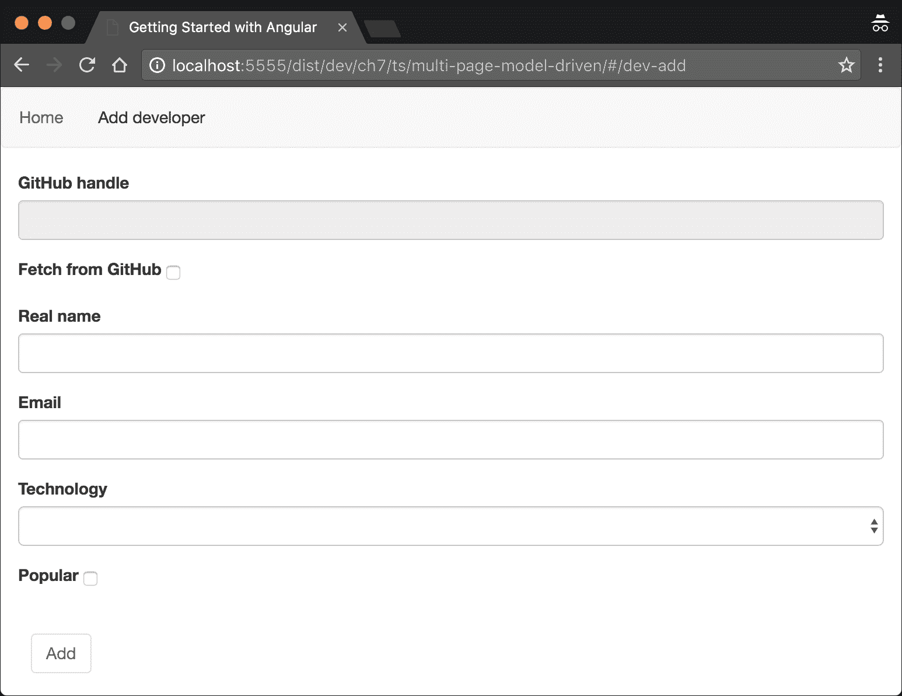
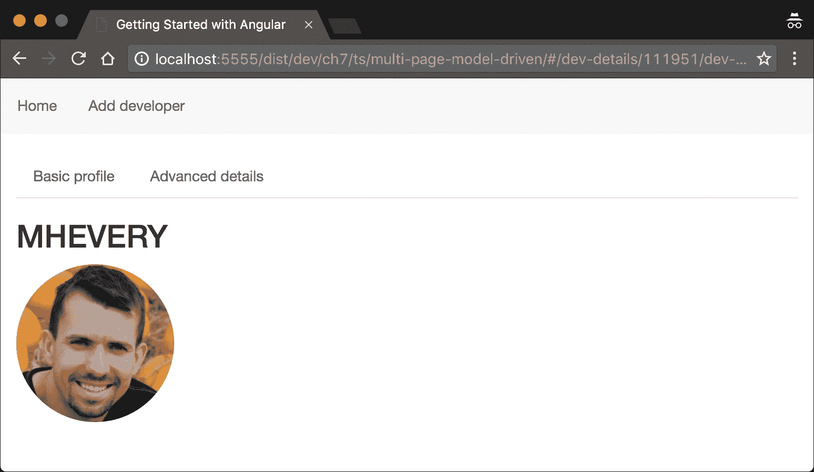
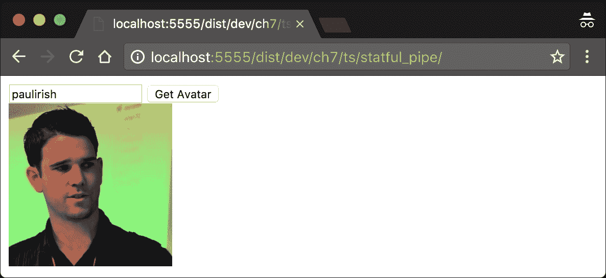

# 第七章. 解释管道和与 RESTful 服务通信

在上一章中，我们介绍了框架的一些非常强大的功能。然而，我们可以更深入地了解 Angular 表单模块和路由的功能。在接下来的几节中，我们将解释我们如何：

+   开发模型驱动表单。

+   定义参数化路由。

+   定义子路由。

+   使用 HTTP 模块与 RESTful API 进行通信。

+   使用自定义管道转换数据。

我们将在扩展“Coders 仓库”应用程序功能的过程中探索所有这些概念。在前一章的开始，我们提到我们将允许从 GitHub 导入开发者。然而，在我们实现此功能之前，让我们扩展表单的功能。

# 在 Angular 中开发模型驱动表单

这些将是完成“Coders 仓库”的最后几步。您可以在`ch6/ts/step-1/`（或根据您之前的工作`ch6/ts/step-2`）提供的代码基础上构建，以扩展应用程序的功能，我们将介绍的新概念。完整的示例位于`ch7/ts/multi-page-model-driven`。

这是我们本节结束时将要实现的结果：



图 1

在前面的屏幕截图中，有两种形式：

+   一个包含以下控件以从 GitHub 导入现有用户的形式：

    +   GitHub 处理器的输入。

    +   一个复选框，指出我们是否想从 GitHub 导入开发者或手动输入。

+   一个用于手动输入新用户的形式。

第二个表单看起来与我们上章离开时完全一样。然而，这次，它的定义看起来略有不同：

```js
<form class="form col-md-4" [formGroup]="addDevForm" [hidden]="submitted">
  <!-- TODO --> 
</form> 

```

注意，这次我们没有`submit`处理程序或`#f="ngForm"`属性。相反，我们将`[formGroup]`属性绑定到组件控制器中定义的`addDevForm`。使用此属性，我们可以绑定到称为`FormGroup`的东西。正如其名称所示，`FormGroup`类由一组与它们关联的验证规则一起组合的控件列表组成。

我们需要在用于导入开发者的表单中使用类似的声明。然而，这次，我们将提供不同的`[formGroup]`属性值，因为我们将在组件控制器中定义不同的表单组。将以下片段放置在我们之前引入的表单上方：

```js
<form class="form col-md-4" [formGroup]="importDevForm" [hidden]="submitted">
<!-- TODO --> 
</form> 

```

现在，让我们在组件控制器中声明`importDevForm`和`addDevForm`属性：

```js
import {FormGroup} from '@angular/forms';

@Component(...) 
export class AddDeveloper { 
  importDevForm: FormGroup; 
  addDevForm: FormGroup; 
  ... 
  constructor(private developers: DeveloperCollection, 
    fb: FormBuilder) {...} 
  addDeveloper() {...} 
} 

```

初始时，我们从`@angular/forms`模块导入`FormGroup`类，稍后，在控制器中声明所需的属性。请注意，我们有一个额外的`AddDeveloper`构造函数参数，称为`fb`，它是`FormBuilder`类型。

`FormBuilder`提供了一个可编程 API，用于定义`FormGroup`，我们可以将验证行为附加到组中的每个控件。让我们使用`FormBuilder`实例初始化`importDevForm`和`addDevForm`属性：

```js
... 
constructor(private developers: DeveloperCollection, 
  fb: FormBuilder) { 
  this.importDevForm = fb.group({
    githubHandle: ['', Validators.required],
    fetchFromGitHub: [false]
  });
  this.addDevForm = fb.group({
    realName: ['', Validators.required],
    email: ['', validateEmail],
    technology: ['', Validators.required],
    popular: [false]
  });
} 
... 

```

`FormBuilder`实例有一个名为`group`的方法，它允许我们定义给定表单中各个控件的属性，例如默认值和验证器。

根据前面的代码片段，`importDevForm`有两个字段：`githubHandle`和`fetchFromGitHub`。我们声明`githubHandle`控制器的值是必需的，并将控制器`fetchFromGitHub`的默认值设置为`false`。

在第二个表单`addDevForm`中，我们声明了四个控件。对于默认值为空字符串的`realName`控件，我们使用`Validators.requred`来引入验证行为（这正是我们对`githubHandle`控件所做的那样）。作为电子邮件输入的验证器，我们将使用`validateEmail`函数，并将控件初始值设置为空字符串。用于验证的`validateEmail`函数是我们上一章中定义的：

```js
function validateEmail(emailControl) { 
  if (!emailControl.value || 
     /^[a-zA-Z0-9_.+-]+@[a-zA-Z0-9-]+\.[a-zA-Z0-9-.]+$/.test(emailControl.value)) { 
    return null; 
  } else { 
    return { 'invalidEmail': true }; 
  } 
} 

```

我们在这里定义的最后两个控件是`technology`控件，它需要一个值并且其初始值为空字符串，以及`popular`控件，其初始值设置为`false`。

## 使用控件验证器的组合

我们查看了一下如何将单个验证器应用于表单控件。使用模型驱动方法，我们以与上一章中使用模板驱动表单并添加`required`属性相同的方式应用了`Validators.required`验证器。然而，在某些应用程序中，领域可能需要更复杂的验证逻辑。例如，如果我们想将`required`和`validateEmail`验证器都应用于电子邮件控件，我们应该做以下操作：

```js
this.addDevForm = fb.group({ 
  ... 
  email: ['', Validators.compose([ 
    Validators.required, 
    validateEmail] 
  )], 
  ... 
}); 

```

`Validators`对象的`compose`方法接受一个验证器数组作为参数，并返回一个新的验证器。新验证器的行为将是作为参数传递的各个验证器中定义的逻辑的组合，并且它们将按照在数组中引入的顺序应用。

传递给`FormBuilder`的`group`方法的对象字面量中的属性名应与我们在模板中设置的输入的`formControlName`属性值相匹配。这是`importDevForm`的完整模板：

```js
<form class="form col-md-4" [formGroup]="importDevForm" [hidden]="submitted">
  <div class="form-group">
  <label class="control-label" for="githubHandleInput">GitHub handle</label>
  <div>
    <input id="githubHandleInput" class="form-control"
           type="text" formControlName="githubHandle">
    <control-errors control="githubHandle"
      [errors]="{
        'required': 'The GitHub handle is required'
      }"></control-errors>
   </div>
  </div>
  <div class="form-group">
    <label class="control-label" for="fetchFromGitHubCheckbox">
      Fetch from GitHub
    </label>
    <input class="checkbox-inline" id="fetchFromGitHubCheckbox"
      type="checkbox" formControlName="fetchFromGitHub">
  </div>
</form>

```

在前面的模板中，我们可以注意到，一旦 `submitted` 标志的值为 `true`，表单将隐藏给用户。在第一个输入元素旁边，我们将 `formControlName` 属性的值设置为 `githubHandle`。`formControlName` 属性将模板中现有的表单输入与在 `FormGroup` 中声明的输入关联起来，对应于包含 HTML 输入的表单元素。这意味着我们传递给 `FormBuilder` 的 `group` 方法的对象字面量中与控件定义关联的键必须与模板中设置 `formControlName` 的相应控件名称匹配。

现在，我们想要实现以下行为：

+   当 **从 GitHub 获取** 复选框被勾选时，禁用输入新开发者的表单，并启用从 GitHub 导入开发者的表单。

+   当当前活动（或启用）的表单无效时，禁用提交按钮。

我们将探讨如何使用 Angular 的响应式表单（也称为模型驱动表单）API 实现此功能。

在 `AddDeveloper` 类内部，添加以下方法定义：

```js
...
export class AddDeveloper {
  //...
  ngOnInit() {
    this.toggleControls(this.importDevForm.controls['fetchFromGitHub'].value);
    this.subscription = this.importDevForm.controls['fetchFromGitHub']
      .valueChanges.subscribe(this.toggleControls.bind(this));
  }

  ngOnDestroy() {
    this.subscription.unsubscribe();
  }

  private toggleControls(importEnabled: boolean) {
    const addDevControls = this.addDevForm.controls;
    if (importEnabled) {
      this.importDevForm.controls['githubHandle'].enable();
      Object.keys(addDevControls).forEach((c: string) =>
        addDevControls[c].disable());
    } else {
      this.importDevForm.controls['githubHandle'].disable();
      Object.keys(addDevControls).forEach((c: string) =>
        addDevControls[c].enable());
    }
  }
}
...
```

注意，在 `ngOnInit` 中，我们通过获取 `importDevForm` 中 `controls` 的 `fetchFromGitHub` 属性来引用表示复选框的 `AbstractControl`。我们可以通过传递一个回调给其 `subscribe` 方法来订阅复选框的 `valueChange` 事件。每次复选框的值改变时，我们传递给 `subscribe` 的回调将被调用。

之后，我们通过传递一个回调给其 `subscribe` 方法来订阅复选框的 `valueChange` 事件。每次复选框的值改变时，我们传递给 `subscribe` 的回调将被调用。

之后，在 `ngOnDestroy` 中，我们取消订阅 `valueChange` 订阅，以防止我们的代码出现内存泄漏。

最后，最有趣的事情发生在 `toggleControls` 方法中。我们向这个方法传递一个标志，用来指示我们是否想要启用 `importDevForm`。如果我们想要启用这个表单，我们只需要调用 `githubHandle` 控件的 `enable` 方法，并禁用 `addDevForm` 中的所有控件。我们可以通过遍历控件名称（即 `addDevForm` 的 `controls` 属性的键）来禁用 `addDevForm` 中的所有控件，获取每个名称对应的控件实例，并调用其 `disable` 方法。如果 `importEnabled` 标志的值为 `false`，我们将执行完全相反的操作，通过调用 `addDevForm` 中的控件的 `enable` 方法和 `importDevForm` 中控件的 `disable` 方法。

# 探索 Angular 的 HTTP 模块

现在，在我们已经开发了两个表单——用于导入现有开发者和添加新开发者之后，是时候在组件的控制器中实现它们背后的逻辑了。

为了这个目的，我们需要与 GitHub API 进行通信。虽然我们可以直接从组件的控制器中这样做，但通过这种方式解决问题，我们将组件与 GitHub 的 RESTful API 相耦合。为了更好地分离关注点，我们可以将用于与 GitHub 通信的逻辑提取到一个单独的服务中，称为 `GitHubGateway`。打开名为 `github_gateway.ts` 的文件，并输入以下内容：

```js
import {Injectable} from '@angular/core'; 
import {Http} from '@angular/http'; 

@Injectable() 
export class GitHubGateway { 
  constructor(private http: Http) {}

  getUser(username: string) { 
    return this.http 
      .get(`https://api.github.com/users/${username}`); 
  } 
} 

```

初始时，我们从 `@angular/http` 模块导入 `Http` 类。所有与 HTTP 相关的功能都被外部化，并且位于 Angular 的核心之外。由于 `GitHubGateway` 接受一个依赖项，该依赖项需要通过框架的 DI 机制进行注入，因此我们将它装饰为 `@Injectable`。

我们使用的 GitHub API 的唯一功能是用于获取用户的功能，因此我们定义了一个名为 `getUser` 的单个方法。它接受开发者的 GitHub 处理符作为参数。

### 注意

注意，如果你每天向 GitHub 的 API 发起超过 60 次请求，你可能会遇到错误 **GitHub API Rate limit exceeded**。这是由于没有 GitHub API 令牌的请求速率限制。有关更多信息，请访问 [`github.com/blog/1509-personal-api-tokens`](https://github.com/blog/1509-personal-api-tokens)。

在 `getUser` 方法内部，我们使用在 `constructor` 中接收到的 `Http` 服务实例。`Http` 服务的 API 尽可能接近 HTML5 fetch API。然而，有一些差异。其中最显著的一个是，在撰写本文时，`Http` 实例的所有方法都返回 `Observables` 而不是 `Promises`。

`Http` 服务实例具有以下 API：

+   `request(url: string | Request, options: RequestOptionsArgs)`: 这将向指定的 URL 发起一个请求。请求可以使用 `RequestOptionsArgs` 进行配置，如下所示：

```js
      http.request('http://example.com/', { 
        method: 'get', 
        search: 'foo=bar', 
        headers: new Headers({ 
          'X-Custom-Header': 'Hello'
        }) 
      }); 

```

+   `get(url: string, options?: RequestOptionsArgs)`: 这将向指定的 URL 发起一个 get 请求。请求头和其他选项可以使用第二个参数进行配置。

+   `post(url: string, options?: RequestOptionsArgs)`: 这将向指定的 URL 发起一个 post 请求。请求体、头和其他选项可以使用第二个参数进行配置。

+   `put(url: string, options?: RequestOptionsArgs)`: 这将向指定的 URL 发起一个 put 请求。请求头和其他选项可以使用第二个参数进行配置。

+   `patch(url: string, options?: RequestOptionsArgs)`: 这将向指定的 URL 发起一个 patch 请求。请求头和其他选项可以使用第二个参数进行配置。

+   `delete(url: string, options?: RequestOptionsArgs)`: 这将向指定的 URL 发起一个 delete 请求。请求头和其他选项可以使用第二个参数进行配置。

+   `head(url: string, options?: RequestOptionsArgs)`: 这将向指定的 URL 发送一个头部请求。请求头和其他选项可以使用第二个参数进行配置。

## 使用 Angular 的 HTTP 模块

现在，让我们实现从 GitHub 导入现有开发者的逻辑。首先，我们需要在我们的 `AppModule` 中导入 `HttpModule`：

```js
import {HttpModule} from '@angular/http';
...

@NgModule({
  imports: [..., HttpModule],
  declarations: [...],
  providers: [...],
  bootstrap: [...]
})
class AppModule {}
...
```

然后，打开 `ch6/ts/step-2/add_developer.ts` 文件并输入以下导入：

```js
import {Response} from '@angular/http'; 
import {GitHubGateway} from './github_gateway'; 

```

将 `GitHubGateway` 添加到 `AddDeveloper` 组件提供者列表中：

```js
@Component({ 
  ... 
  providers: [GitHubGateway] 
}) 
class AddDeveloper {...} 

```

作为下一步，我们必须在类的构造函数中包含以下参数：

```js
constructor(private githubAPI: GitHubGateway, 
  private developers: DeveloperCollection, 
  fb: FormBuilder) { 
  //... 
} 

```

这样，`AddDeveloper` 类的实例将会有一个名为 `githubAPI` 的私有属性。

剩下的工作就是实现 `addDeveloper` 方法，并允许用户使用 `GitHubGateway` 实例导入现有的开发者。

当用户按下 **添加** 按钮时，我们需要检查是否需要导入现有的 GitHub 用户或添加新的开发者。为此，我们可以使用 `fetchFromGitHub` 控件的值：

```js
if (this.importDevForm.controls['fetchFromGitHub'].value) { 
  // Import developer 
} else { 
  // Add new developer 
} 

```

如果它有一个真值，那么我们可以调用 `githubAPI` 属性的 `getUser` 方法，并将 `githubHandle` 控件的值作为参数传递：

```js
this.githubAPI.getUser(model.githubHandle) 

```

在 `GitHubGateway` 实例的 `getUser` 方法中，我们将调用委托给 `Http` 服务器的 `get` 方法，该方法返回一个可观察对象。为了获取可观察对象将要推送的结果，我们需要传递一个回调给它的 `subscribe` 方法：

```js
this.githubAPI.getUser(model.githubHandle) 
  .map((r: Response) => r.json()) 
  .subscribe((res: any) => { 
    // "res" contains the response of the GitHub's API  
  }); 

```

在前面的代码片段中，我们首先建立了 HTTP `get` 请求。之后，我们获取相应的可观察对象，在一般情况下，它将发出一系列值（在这种情况下，只有一个——请求的响应）并将它们映射到它们的 JSON 表示形式。如果请求失败，或者响应体不是一个有效的 JSON 字符串，那么我们将得到一个错误。

### 注意

注意，为了减少 Angular 的包大小，谷歌团队在框架中只包含了 RxJS 的核心。为了使用 `map` 和 `catch` 方法，你需要在 `add_developer.ts` 文件中添加以下导入：`import 'rxjs/add/operator/map';` `import 'rxjs/add/operator/catch';`

现在，让我们实现传递给 `subscribe` 方法的回调函数体：

```js
let dev = new Developer(); 
dev.githubHandle = res.login; 
dev.email = res.email; 
dev.popular = res.followers >= 1000; 
dev.realName = res.name; 
dev.id = res.id; 
dev.avatarUrl = res.avatar_url; 
this.developers.addDeveloper(dev); 
this.successMessage = `Developer ${dev.githubHandle} successfully imported from GitHub`; 

```

在前面的示例中，我们设置了新 `Developer` 实例的属性。在这里，我们建立了 GitHub API 返回的对象与我们在应用程序中开发者表示之间的映射。我们认为如果一个开发者拥有超过 1,000 个关注者，那么他就是受欢迎的。

`addDeveloper` 方法的整个实现可以在 `ch7/ts/multi-page-model-driven/add_developer.ts` 文件中找到。

### 注意

为了处理失败的请求，我们可以使用可观察实例的 `catch` 方法：`this.githubAPI.getUser(model.githubHandle)` `.catch((error, source, caught) => {` `console.log(error)` `return error;` `});`

# 定义参数化视图

作为下一步，让我们为每个开发者分配一个专门的页面。在这个页面上，我们将能够详细查看他们的资料。一旦用户点击应用程序主页上的任何开发者的名字，他们应该被重定向到一个显示所选开发者详细资料的页面。最终结果将如下所示：



图 2

为了做到这一点，我们需要将开发者的标识符传递给显示开发者详细资料的组件。打开`app.ts`，并添加以下导入：

```js
import {DeveloperDetails} from './developer_details'; 

```

我们还没有开发`DeveloperDetails`组件，所以如果你运行应用程序，你会得到一个错误。我们将在下一段定义该组件，但在那之前，让我们修改`app.ts`中路由的定义：

```js
const routingModule = RouterModule.forRoot([
  ...
  {
    component: DeveloperDetails,
    path: 'dev-details/:id',
    children: devDetailsRoutes
  }
]);

```

我们添加了一个带有`dev-details/:id`路径的单个路由，并将其与`DeveloperDetails`组件关联。

注意，在`path`属性中，我们声明该路由有一个名为`id`的单个参数，并将`children`属性设置为`devDetailsRoutes`。`devDetailsRoutes`包含嵌套路由，这些路由应该在`DeveloperDetails`组件中的`router-outlet`内渲染。

现在，让我们将当前开发者的`id`作为参数传递给`routerLink`指令。在你的工作目录中打开`home.html`，并将显示开发者`realName`属性的表格单元格替换为以下内容：

```js
<td> 
  <a [routerLink]="['/dev-details', dev.id, 'dev-basic-info']"> 
    {{dev.realName}} 
  </a> 
</td> 

```

`routerLink`指令的值是一个包含以下三个元素的数组：

+   `'/dev-details'`：显示根路由的字符串。

+   `dev.id`：我们想要查看其详细信息的开发者的 ID。

+   `'dev-basic-info'`：显示嵌套路由中应该渲染哪个组件的路由路径。

# 定义嵌套路由

现在，让我们跳转到`DeveloperDetails`的定义。在你的工作目录中，创建一个名为`developer_details.ts`的文件，并输入以下内容：

```js
import {Component} from '@angular/core';
import {ActivatedRoute} from '@angular/router';
import {Developer} from './developer';
import {DeveloperCollection} from './developer_collection';
import {DeveloperBasicInfo} from './developer_basic_info';
import {DeveloperAdvancedInfo} from './developer_advanced_info';

import 'rxjs/add/operator/take';

@Component({
  selector: 'dev-details',
  template: `...`,
})
export class DeveloperDetails {
  public dev: Developer;

  constructor(private route: ActivatedRoute,
    private developers: DeveloperCollection) {}

  ngOnInit() {
    this.route.params.take(1)
     .subscribe((params: any) => {
       this.dev = this.developers.getUserById(parseInt(params['id']));
    });
  }
}

export const devDetailsRoutes = [...];

```

### 小贴士

为了简化起见，为了避免在本书的示例中引入复杂的目录/文件结构，我们在单个文件中有几个组件和路由声明。请记住，根据最佳实践，单个声明应该放置在单独的文件中。有关更多信息，请访问[`angular.io/styleguide`](https://angular.io/styleguide)。

在前面的代码片段中，我们定义了一个名为`DeveloperDetails`的控制器组件。注意，在控制器的构造函数中，通过 Angular 的依赖注入机制，我们注入了一个与`ActivatedRoute`令牌关联的参数。注入的参数为我们提供了访问当前路由可见参数的能力。在`ngOnInit`中，我们采用命令式方法，订阅路由`params`属性值的变化，获取第一组参数，并将`dev`属性赋值为调用`this.developers.getUserById`的结果，该结果以所选开发者的标识符作为参数。

### 小贴士

注意，更声明性和响应式的方法是利用 RxJS 提供的高阶函数，这样我们就能通过类似以下代码的方式访问所选的开发者：

`...` `get dev$() {` `return this.route.params.map((params: any) =>` `    this.developers.getUserById(parseInt(params['id'])));` `}` `...`

之后，我们可以使用 Angular 的异步管道绑定到调用结果，我们将在本章稍后解释。

由于我们从`routeParams.params['id']`获取的参数是一个字符串，我们需要将其解析为数字，以便获取与给定路由关联的开发者。

现在，让我们定义子路由，这些路由将在`DeveloperDetails`的模板中渲染：

```js
export const devDetailsRoutes = [
  { path: '', redirectTo: 'dev-basic-info', pathMatch: 'full' },
  { component: DeveloperBasicInfo, path: 'dev-basic-info' },
  { component: DeveloperAdvancedInfo, path: 'dev-details-advanced' }
];

```

在前面的代码中，对我们来说没有新的内容。路由定义遵循我们已熟悉的完全相同的规则。

现在，让我们向组件的模板中添加与单个嵌套路由关联的链接：

```js
@Component({
 selector: 'dev-details',
 template: `
   <section class="col-md-4">
   <ul class="nav nav-tabs">
     <li><a [routerLink]="['./dev-basic-info']">Basic profile</a></li>
     <li><a [routerLink]="['./dev-details-advanced']">Advanced details</a></li>
   </ul>
   <router-outlet></router-outlet>
   </section>
 `
})
export class DeveloperDetails {...}

```

在模板中，我们声明了两个相对于当前路径的链接。第一个链接指向`dev-basic-info`，这是在`devDetailsRoutes`中定义的第一个路由的路径，第二个链接指向`dev-details-advanced`。

由于与两个路由关联的组件实现相当相似，让我们只看看`DeveloperBasicInfo`。作为练习，你可以开发第二个组件或查看其实现，位置在`ch7/ts/multi-page-model-driven/developer_advanced_info.ts`：

```js
import {Component, Inject, forwardRef, Host} from '@angular/core';
import {DeveloperDetails} from './developer_details';
import {Developer} from './developer';

@Component({
  selector: 'dev-details-basic',
  styles: [`
    .avatar {
      border-radius: 150px;
    }`
  ],
  template: `
    <h2>{{dev.githubHandle | uppercase}}</h2>
    
    
 `
})
export class DeveloperBasicInfo {
  dev: Developer;

  constructor(@Inject(forwardRef(() => DeveloperDetails))
     @Host() parent: DeveloperDetails) {
   this.dev = parent.dev;
  }
}

```

在前面的代码片段中，我们使用`@Inject`参数装饰器注入父组件。在`@Inject`内部，我们使用`forwardRef`，因为我们有`developer_basic_info`和`developer_details`包（在`developer_basic_info`中导入`developer_details`，在`developer_details`中导入`developer_basic_info`）之间的循环依赖。

我们需要一个指向父组件实例的引用，以便获取与所选路由对应的当前开发者的实例。

# 使用管道转换数据

现在是时候看看 Angular 为我们开发应用程序提供的最后一个构建块了——管道，这是我们尚未详细讨论的。

就像 AngularJS 中的过滤器一样，管道旨在封装所有的数据转换逻辑。让我们看看我们刚刚开发的应用程序的首页模板：

```js
... 
<td [ngSwitch]="dev.popular"> 
  <span *ngSwitchCase="true">Yes</span> 
  <span *ngSwitchCase="false">Not yet</span> 
</td> 
... 

```

在前面的代码片段中，根据 `popular` 属性的值，我们使用 `NgSwitch` 和 `NgSwitchCase` 指令显示不同的数据。虽然这可行，但它是多余的。

## 开发无状态管道

让我们开发一个管道，将 `popular` 属性的值进行转换，并用它来代替 `NgSwitch` 和 `NgSwitchCase`。这个管道将接受三个参数：一个需要转换的值，一个当值为真时应该显示的字符串，以及一个在值为假时应该显示的字符串。

使用 Angular 自定义管道，我们可以将模板简化为以下形式：

```js
<td>{{dev.popular | boolean: 'Yes': 'No'}}</td> 

```

我们甚至可以使用表情符号，如下所示：

`<td>{{dev.popular | boolean: '': ''}}</td>`

我们将管道应用于值的方式与在 AngularJS 中做的方式相同。传递给管道的参数应该由冒号（`:`）符号分隔。

为了开发 Angular 管道，我们需要以下导入：

```js
import {Pipe, PipeTransform} from '@angular/core'; 

```

`Pipe` 装饰器可以用来为实现数据转换逻辑的类添加元数据。`PipeTransform` 是一个接口，它有一个名为 `transform` 的单方法：

```js
import {Pipe, PipeTransform} from '@angular/core'; 

@Pipe({ name: 'boolean' })
export class BooleanPipe implements PipeTransform {
  transform(flag: boolean, trueValue: any, falseValue: any): string {
    return flag ? trueValue : falseValue;
  }
}

```

前面的代码片段是 `BooleanPipe` 的整个实现。我们传递给 `@Pipe` 装饰器的 `name` 决定了我们在模板中如何引用它。

在能够使用 `BooleanPipe` 之前，我们需要将其添加到 `AppModule` 的声明列表中：

```js
@NgModule({
  ...
  declarations: [..., BooleanPipe, ...],
  ...
})
class AppModule {}

```

## 使用 Angular 内置管道

Angular 提供以下内置管道集：

+   `CurrencyPipe`：这个管道用于格式化货币数据。它接受的参数是货币类型的缩写（即 `"EUR"`、`"USD"` 等）。它可以按以下方式使用：

```js
      {{ currencyValue | currency: 'USD' }} <!-- USD42 --> 

```

+   `DatePipe`：这个管道用于日期的转换。它可以按以下方式使用：

```js
      {{ dateValue | date: 'shortTime'  }} <!-- 12:00 AM --> 

```

+   `DecimalPipe`：这个管道用于十进制数字的转换。它接受的参数形式如下：`"{minIntegerDigits}.{minFractionDigits}-{maxFractionDigits}"`。它可以按以下方式使用：

```js
      {{ 42.1618 | number: '3.1-2' }} <!-- 042.16 --> 

```

+   `JsonPipe`：这个管道将 JavaScript 对象转换为 JSON 字符串。它可以按以下方式使用：

```js
      {{ { foo: 42 } | json }} <!-- { "foo": 42 } --> 

```

+   `LowerCasePipe`：这个管道将字符串转换为小写。它可以按以下方式使用：

```js
      {{ FOO | lowercase }} <!-- foo --> 

```

+   `UpperCasePipe`：这个管道将字符串转换为大写。它可以按以下方式使用：

```js
      {{ 'foo' | uppercase }} <!-- FOO --> 

```

+   `PercentPipe`：这个管道将数字转换为百分比。它可以按以下方式使用：

```js
      {{ 42 | percent: '2.1-2' }}  <!-- 4,200.0% --> 

```

+   `SlicePipe`：这个管道返回一个数组的切片。它接受切片的起始和结束索引。它可以按以下方式使用：

```js
      {{ [1, 2, 3] | slice: 1: 2 }} <!-- 2 --> 

```

+   `AsyncPipe`：这是一个 `stateful` 管道，它接受一个可观察对象或一个承诺；我们将在本章末尾探讨它。

## 开发有状态的管道

所提到的所有管道中有一个共同点——每次我们将它们应用于相同的值并传递相同的参数集时，它们都会返回完全相同的结果。这样的管道，具有引用透明性属性，被称为 **纯管道**。

`@Pipe` 装饰器接受一个 `{ name: string, pure?: boolean }` 类型的对象字面量，其中 `pure` 属性的默认值是 `true`。这意味着，当我们定义任何给定的管道时，我们可以声明它是有状态的还是无状态的。纯属性很重要，因为如果管道是无状态的（即，在应用相同的值和相同的参数集时返回相同的结果），则可以优化变更检测。

现在，让我们构建一个有状态的管道。我们的管道将向 JSON API 发起 HTTP `get` 请求。为此，我们将使用 `@angular/http` 模块。

### 注意

注意，在管道中包含业务逻辑不被视为最佳实践。这种类型的逻辑应该提取到服务中。这里的例子仅用于学习目的。

在这种情况下，管道需要根据请求的状态（即，它是挂起还是完成）保持不同的状态。我们将以下方式使用管道：

```js
{{ "http://example.com/user.json" | fetchJson | json }} 

```

这样，我们就在 URL 上应用了 `fetchJson` 管道。一旦我们有了响应体，我们就可以在它上面应用 `json` 管道。这个例子还展示了我们如何使用 Angular 连接管道。

与无状态管道类似，为了开发有状态的管道，我们必须用 `@Pipe` 装饰实现管道逻辑的类，并实现 `PipeTransform` 接口。这次，由于 HTTP 请求功能，我们还需要从 `@angular/http` 模块导入 `Http` 和 `Response` 类：

```js
import {Pipe, PipeTransform} from '@angular/core'; 
import {Http, Response} from '@angular/http'; 
import 'rxjs/add/operator/toPromise'; 

```

每次当我们将 `fetchJson` 管道应用于具有不同值的参数时，我们都需要发起一个新的 HTTP `get` 请求。这意味着，作为管道的状态，我们需要至少保留远程服务的响应值和最后一个 URL：

```js
@Pipe({ 
  name: 'fetchJson', 
  pure: false 
}) 
export class FetchJsonPipe implements PipeTransform { 
  private data: any; 
  private prevUrl: string = null; 
  constructor(private http: Http) {} 
  transform(url: string): any {...} 
} 

```

我们需要实现的唯一逻辑部分是 `transform` 方法：

```js
... 
transform(url: string): any { 
  if (this.prevUrl !== url) { 
    this.http.get(url).toPromise(Promise) 
      .then((data: Response) => data.json()) 
      .then(result => this.data = result); 
    this.prevUrl = url; 
  } 
  return this.data || {}; 
} 
... 

```

在其中，我们首先比较作为参数传递的 URL 与我们已有的 URL（默认值为 `null`）。如果它们不同，我们将使用传递给 `constructor` 函数的 `Http` 类的本地实例发起一个新的 HTTP `get` 请求。一旦请求完成，我们将响应解析为 JSON 并将 `data` 属性设置为结果。

现在，让我们假设管道已经启动了一个 `Http` `get` 请求，并且在它完成之前，变更检测机制再次调用管道。在这种情况下，我们将比较 `prevUrl` 属性与 `url` 参数。如果它们相同，我们不会执行新的 `http` 请求，并将立即返回 `data` 属性的值。如果 `prevUrl` 的值与 `url` 不同，我们将启动一个新的请求。

## 使用有状态的管道

现在，让我们使用我们开发的管道。我们将要实现的程序提供了一个文本输入和一个带有标签 **获取头像** 的按钮给用户。一旦用户在文本输入中输入一个值并按下按钮，GitHub 用户的头像将出现在文本输入下方，如下面的截图所示：



图 3

现在，让我们开发一个示例组件，它将允许我们输入 GitHub 用户的昵称：

```js
// ch7/ts/statful_pipe/app.ts 

@Component({ 
  selector: 'app',
  template: ` 
    <input type="text" #input> 
    <button (click)="setUsername(input.value)">Get Avatar</button> 
  ` 
}) 
class App { 
  username: string; 
  setUsername(user: string) { 
    this.username = user; 
  } 
} 

```

剩下的唯一事情就是显示用户的 GitHub 头像。我们可以通过修改前面组件的以下 `img` 声明来实现这一点：

```js
 

```

初始时，我们将 GitHub 昵称追加到用于从 API 获取用户的基 URL。稍后，我们将对其应用 `fetchJson` 过滤器，并从返回的结果中获取 `avatar_url` 属性。

## 使用 Angular 的 AsyncPipe

Angular 的 `AsyncPipe` `transform` 方法接受一个可观察对象或一个承诺作为参数。一旦参数推送一个值（即承诺已解决或可观察对象的 `subscribe` 回调被调用），`AsyncPipe` 将将其作为结果返回。让我们看看以下示例：

```js
// ch7/ts/async-pipe/app.ts 

@Component({ 
  selector: 'greeting', 
  template: 'Hello {{ greetingPromise | async }}' 
}) 
class Greeting { 
  greetingPromise = new Promise<string>(resolve => this.resolve = resolve); 
  resolve: Function;

  constructor() { 
    setTimeout(_ => { 
      this.resolve('Foobar!'); 
    }, 3000); 
  } 
} 

```

在这里，我们定义了一个 Angular 组件，它有两个属性，即 `greetingPromise` 类型为 `Promise<string>` 和 `resolve` 类型为 `Function`。我们使用一个新的 `Promise<string>` 实例初始化了 `greetingPromise` 属性，并将 `resolve` 属性的 `resolve` 回调设置为 `promise` 的值。

在类的构造函数中，我们开始一个 3,000 毫秒的定时器，并在其回调中解决承诺。一旦承诺被解决，表达式 `{{ greetingPromise | async }}` 的值将被评估为字符串 `Foobar!`。用户最终将在屏幕上看到的最终结果是文本 **"Hello Foobar!"**。

当我们将 `async` 管道与 `Http` 请求或与推送一系列值的可观察对象结合使用时，它非常强大。

### 使用 AsyncPipe 和可观察对象

我们已经从前面的章节中熟悉了可观察的概念。我们可以这样说，一个可观察的对象允许我们订阅一系列值的发射，例如：

```js
let observer = Observable.create(observer => { 
  setInterval(() => { 
    observer.next(new Date().getTime()); 
  }, 1000); 
}); 
observer.subscribe(date => console.log(date)); 

```

一旦我们订阅了可观察对象，它将开始每秒发射一个值，这些值将被打印在控制台上。让我们将这个片段与组件定义结合起来，实现一个简单的计时器：

```js
// ch7/ts/async-pipe/app.ts

@Component({  selector: 'timer' }) 
class Timer { 
  username: string; 
  timer: Observable<number>;

  constructor() { 
    let counter = 0; 
    this.timer = new Observable<number>(observer => { 
      setInterval(() => { 
        observer.next(new Date().getTime()); 
      }, 1000); 
    }); 
  } 
} 

```

为了能够使用计时器组件，我们只需添加其模板。我们可以在模板中使用`async`管道直接订阅可观察对象：

```js
{{ timer | async | date: "medium" }} 

```

这样，我们每秒都会接收到由可观察对象发出的新值，而`date`管道将把它转换成可读的形式。

# 摘要

在本章中，我们深入研究了 Angular 的表单模块，通过开发一个模型驱动（响应式）表单并将其与 HTTP 模块结合使用。我们查看了一些基于组件的新路由器的先进功能，并了解了我们如何使用和开发自定义的有状态和无状态管道。

下一章将专门介绍我们如何通过利用模块 Universal 提供的服务器端渲染功能，使我们的 Angular 应用程序对搜索引擎优化（SEO）友好。我们还将探讨一些其他工具，如 angular-cli，这些工具可以让我们作为开发者的体验变得更好。最后，我们将解释在 Angular 的上下文中，什么是即时编译（Ahead-of-Time compilation），以及为什么我们应该在我们的应用程序中利用它。
