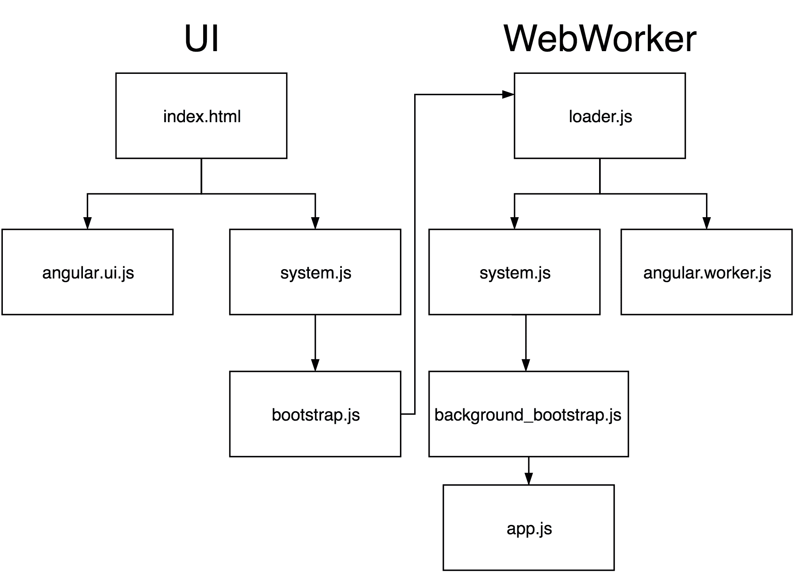
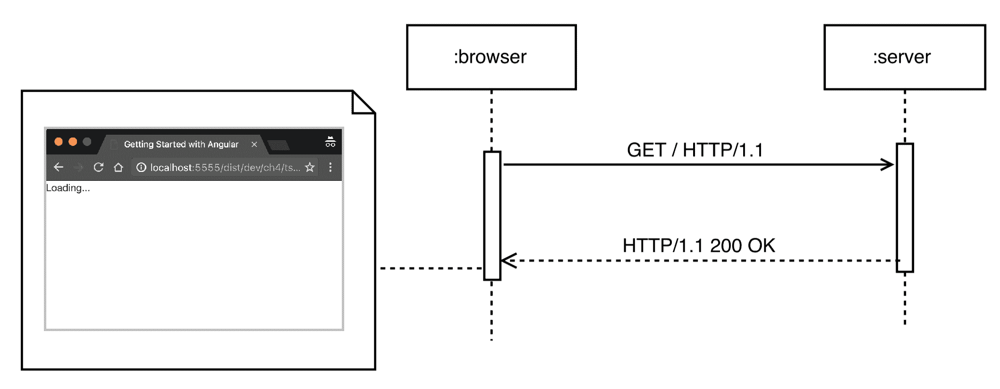
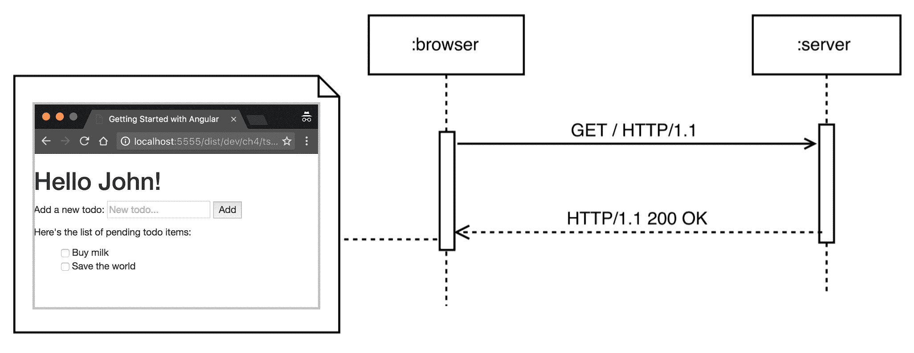

# 第八章. 工具和开发经验

我们已经熟悉了 Angular 的所有核心概念。我们知道如何开发基于组件的用户界面，利用框架提供的所有构建块——指令、组件、依赖注入、管道、表单以及全新的路由器。

在最后一步，我们将探讨当我们想要从头开始构建**单页应用程序**（SPA）时应该从哪里开始。本章描述了以下内容：

+   使用 Web Workers 来提高性能敏感型应用程序。

+   使用服务器端渲染构建 SEO 友好的应用程序。

+   尽快地启动项目。

+   提升我们的开发者体验。

+   什么是**即时编译**（AoT）以及如何使用它。

那么，让我们开始吧！

# 在 Web Worker 中运行应用程序

当谈论前端 Web 开发中的性能时，我们可能指的是网络、计算或渲染性能。在本节中，我们将专注于渲染和计算性能，它们非常紧密相关。

首先，让我们将 Web 应用程序与视频文件以及浏览器与视频播放器之间的平行关系进行比较。在浏览器中运行的 Web 应用程序与在视频播放器中播放的视频文件之间最大的区别是，网页需要动态生成，而视频已经被录制、编码和分发。然而，在这两种情况下，应用程序的用户都会看到一系列的帧；核心区别在于这些帧是如何生成的。在视频处理的世界中，当我们播放视频时，我们已经记录了它；视频解码器的责任是根据压缩算法提取单个帧。相比之下，在 Web 上，JavaScript、HTML 和 CSS 负责生成随后由浏览器渲染引擎渲染的帧。

在浏览器环境中，我们可以将每一帧视为给定时刻网页的快照。不同的帧快速渲染，一个接一个；因此，从理论上讲，应用程序的最终用户应该看到它们平滑地结合在一起，就像在视频播放器中播放的视频一样。

在 Web 上，我们试图达到 60 fps（每秒帧数），这意味着每一帧大约有 16 毫秒的时间来在屏幕上进行计算和渲染。这个持续时间包括浏览器进行布局和页面渲染（浏览器的内部计算）所需的时间，以及我们的 JavaScript 执行所需的时间。

最后，我们的 JavaScript 执行时间少于 16 毫秒（由于浏览器的内部计算），如果它不能在这个时间段内完成，帧率将减半。由于 JavaScript 是一种单线程语言，所有的计算都需要在主 UI 线程中发生，这可能导致由于帧率下降而导致的非常差的用户体验。

HTML5 引入了一个名为**Web Workers**的 API，它允许客户端代码在多个线程中执行。为了简化，标准不允许各个线程之间共享内存，而是允许通过消息传递进行通信。Web Workers 和主 UI 线程之间交换的消息必须是字符串，这通常需要 JSON 字符串的序列化和反序列化。

由于各个工作者之间以及工作者和主 UI 线程之间缺乏共享内存，这带来了一些限制，以下是一些例子：

+   禁止工作者线程访问 DOM。

+   全局变量不能在各个计算单元（即工作者线程和主 UI 线程以及反之亦然）之间共享。

## Web Workers 和 Angular

由于 Angular 的平台无关设计，核心团队决定利用这个 API；在 2015 年夏天，Google 将 Web Workers 支持嵌入到框架中。这个特性允许大多数 Angular 应用程序在单独的线程上运行，使得主 UI 线程只负责渲染。这比在单个线程中运行整个应用程序更容易实现 60fps 的目标。

Web Workers 的支持默认是禁用的。当启用它时，我们需要记住一些事情——在一个为 Web Worker 准备的应用程序中，组件不会在主 UI 线程中运行，这不允许我们直接操作 DOM。在这种情况下，我们需要使用 Angular 提供的更高层次的抽象 API 来建立数据绑定或操作元素的属性。

## 在 Web Worker 中启动应用程序

让我们在第四章中开发的待办事项应用程序*开始使用 Angular 组件和指令*在 Web Worker 中运行。您可以在`ch8/ts/todo_webworkers/`找到我们将要探索的示例。

### 注意

注意，Web Worker 模块尚未最终确定，因此其 API 可能在 Angular 的未来版本中发生变化。另一方面，其概念理念和架构已经足够成熟，所以很可能不会有任何根本性的差异。

首先，让我们讨论我们需要做出的更改。查看`ch4/ts/inputs-outputs/app.ts`。注意，在`app.ts`内部，我们包含了来自`@angular/platform-browser-dynamic`模块的`platformBrowserDynamic`函数。这是我们首先需要修改的内容。在后台进程中运行的应用程序的引导过程是不同的。

在重构我们的代码之前，让我们看一下一个说明典型 Angular 应用程序在 Web Workers 中运行时引导过程的图示：



图 1

该图分为两部分：**UI**和**WebWorker**。**UI**展示了在主 UI 线程初始化期间执行的操作；图示的**WebWorker**部分展示了应用程序如何在后台线程中进行引导。现在，让我们一步一步地解释引导过程。

首先，用户打开`index.html`页面，这会触发以下两个文件的下载：

+   Angular 用于在 Web Worker 中运行的应用程序的 UI 包。

+   `system.js`包（我们在第三章中讨论了全局对象`System`，*TypeScript 快速入门*。我们可以将`system.js`包视为模块加载器的 polyfill）。

使用`system.js`，我们下载用于初始化在主 UI 线程运行的应用程序部分的脚本（`bootstrap.js`）。此脚本在 Web Worker 中启动`loader.js`。这是在后台线程中运行的第一个脚本。一旦启动了工作线程，`loader.js`将下载`system.js`和 Angular 的包，这些包旨在在后台线程中运行。第一次请求通常会命中缓存，因为`system.js`已经被主线程请求。使用模块加载器，我们下载负责引导后台应用程序的脚本`background_bootstrap.js`，它最终将在 Web Worker 中启动我们的应用程序功能。

从现在起，我们构建的整个应用程序将在 Web Worker 中运行，并与主 UI 线程交换消息以响应用户事件和渲染指令。

现在我们已经了解了使用工作线程时初始化期间的基本事件流，让我们重构我们的待办事项应用程序以利用它们。

## 将应用程序迁移到 Web Worker

让我们展示如何使应用程序与 Web Workers 兼容。这样，我们可以在计算密集型应用程序中减少帧率下降，因为我们将释放主 UI 线程，让它只负责渲染。

在`index.html`内部，我们需要添加以下脚本：

```js
  <!-- ch8/ts/todo_webworkers/index.html --> 
  ... 
  <script src="img/system.src.js"> 
  </script> 
  <script src="img/Reflect.js"></script> 
  <script src="img/zone.js"> 
  </script> 
  <!- 
    Contains some basic SystemJS configuration in order to 
    allow us to load Angular 
  --> 
  <script src="img/config.js"></script> 
  <script> 
  System.import('./bootstrap.js') 
    .catch(function () { 
      console.log('Report this error to https://github.com/mgechev/getting-started-with-angular/issues', e); 
    }); 
  </script> 
  ... 

```

在前面的代码片段中，我们包含了 `system.js`、`zone.js` 和 `reflect-metadata` 的引用。`zone.js` 是 Angular 独家使用的 zones 的 polyfill，我们在本书中之前提到过。`reflect-metadata` 包含了 Metadata Reflection API 的另一个 polyfill，在撰写本文时，该 API 在浏览器中尚不可用。

对于下一步，我们将显式导入 `bootstrap.js` 文件，该文件包含用于在 Web Worker 中启动 `loader.js` 脚本的逻辑。

让我们探索 `bootstrap.ts`，这是编译后的 `bootstrap.js` 的原始 TypeScript 版本：

```js
// ch8/ts/todo_webworkers/bootstrap.ts 

//main entry point
import {bootstrapWorkerUi} from '@angular/platform-webworker';

bootstrapWorkerUi('loader.js');

```

我们将 `'loader.js'` 传递给 `bootstrapWorkerUi` 的调用。这样，Angular 就知道 `loader.js` 将在后台线程中运行。该脚本位于应用程序的根目录。

现在，我们可以转向 *在 Web Worker 中启动应用程序* 部分所示的图表的右侧。`loader.ts`（`loader.js` 的原始 TypeScript 版本）中的逻辑非常简单：

```js
// ch8/ts/todo_webworkers/loader.ts

importScripts('/node_modules/systemjs/dist/system.src.js', 
      '/node_modules/reflect-metadata/Reflect.js', 
      '/node_modules/zone.js/dist/zone.js', 
      './config.js'); 

System.import('./background_app.js') 
.then(() => console.log('The application has started successfully'), 
  error => console.error('error loading background', error)); 

```

作为第一步，我们导入 `SystemJS`、`ReflectMetadata` polyfills、`zone.js` 以及 `SystemJS` 的配置。由于此脚本已经在 Web Workers 中运行，我们拥有 `importScripts` 函数，它允许我们同步加载列出的文件。作为最后一步，使用 `System`，我们导入包含我们应用程序的脚本。

现在，让我们探索如何在 Web Worker 内部启动应用程序：

```js
// ch8/ts/todo_webworkers/background_app.ts

import {platformWorkerAppDynamic} 
  from '@angular/platform-webworker-dynamic';

// Logic for the application... 

platformWorkerAppDynamic().bootstrapModule(AppModule)
  .catch(err => console.error(err));

```

前面的过程与我们过去在主 UI 线程中启动 Angular 应用程序时所做的操作非常相似。我们导入 `platformWorkerAppDynamic` 函数，并使用应用程序的根模块作为其第一个参数来调用它。

## 使应用程序与 Web Workers 兼容

正如我们所说，在 Web Worker 上下文中运行的代码无法访问 DOM。让我们看看我们需要做出哪些更改来解决这个问题。

这是 `InputBox` 组件的原始实现：

```js
// ch4/ts/inputs-outputs/app.ts

@Component({ 
  selector: 'input-box', 
  template: ` 
    <input #todoInput [placeholder]="inputPlaceholder"> 
    <button (click)="emitText(todoInput.value); 
      todoInput.value = '';"> 
      {{buttonLabel}} 
    </button> 
  ` 
}) 
class InputBox { 
  @Input() inputPlaceholder: string; 
  @Input() buttonLabel: string; 
  @Output() inputText = new EventEmitter<string>();

  emitText(text: string) { 
    this.inputText.emit(text); 
  } 
} 

```

注意，在模板内部，我们通过标识符 `todoInput` 引用输入元素，并使用引用在表达式集中作为点击事件的处理器。由于我们在模板中直接访问 DOM 元素，这段代码将无法在 Web Worker 中运行。为了解决这个问题，我们需要重构代码片段，使其使用 Angular 数据绑定而不是直接触摸任何元素。我们可以使用输入来处理单方向绑定，或者使用 `NgModel` 来实现双向数据绑定，这会稍微消耗更多的计算资源。

让我们使用 `NgModel`：

```js
// ch8/ts/todo_webworkers/background_app.ts 
import {NgModel} from '@angular/common'; 

@Component({ 
  selector: 'input-box', 
  template: ` 
    <input [placeholder]="inputPlaceholder" [(ngModel)]="input"> 
    <button (click)="emitText()"> 
      {{buttonLabel}} 
    </button> 
  ` 
}) 
class InputBox { 
  @Input() inputPlaceholder: string; 
  @Input() buttonLabel: string; 
  @Output() inputText = new EventEmitter<string>(); 
  input: string;

  emitText() { 
    this.inputText.emit(this.input); 
    this.input = ''; 
  } 
} 

```

在这个版本的 `InputBox` 组件中，我们在输入元素和 `InputBox` 组件的 `input` 属性之间创建了一个双向数据绑定。一旦用户点击按钮，`emitText` 方法将被调用，这将触发由 `inputText` `EventEmitter` 发射的新事件。为了重置输入元素的值，我们利用 Angular 的双向数据绑定机制，将 `input` 属性的值设置为空字符串；这将自动更新 UI。

### 注意

将整个逻辑从组件的模板移动到它们的控制器中，带来了许多好处，例如提高了可测试性、可维护性、代码重用性和清晰度。

上述代码与 Web Worker 环境兼容，因为 `NgModel` 指令基于一个不直接操作 DOM 的抽象。相反，它将这项责任委托给另一个名为 `Renderer` 的抽象，当在 Web Worker 中运行时，它与主 UI 线程异步交换消息。

回顾一下，我们可以这样说，在 Web Workers 的上下文中运行应用程序时，我们需要牢记以下两点：

+   我们需要使用不同的引导过程。

+   我们不应该直接访问 DOM。

违反第二点的典型场景如下：

+   通过选择一个元素并直接使用浏览器的原生 API 或第三方库来操作它，改变页面的 DOM。

+   通过 `ElementRef` 注入的本地元素访问。

+   在模板中创建一个元素的引用，并将其作为参数传递给方法。

+   直接操作模板中引用的元素。

在所有这些场景中，我们都需要使用 Angular 提供的高级 API。如果我们根据这种做法构建我们的应用程序，我们不仅能从中受益于能够在 Web Workers 中运行它们，还能在想要在不同平台间使用它们时，增加代码的重用性。

记住这一点并遵循最佳实践，也将使我们能够利用服务器端渲染的优势。

# 单页应用程序的初始加载

在本节中，我们将探讨服务器端渲染是什么，为什么我们需要在我们的应用程序中使用它，以及我们如何使用 Angular 来实现它。

为了我们的目的，我们将解释当用户打开一个使用 Angular 实现的单页应用程序时，典型的事件流。首先，我们将追踪服务器端渲染禁用时的事件，然后我们将看到如何通过启用此功能来从中受益。我们的示例将在 HTTP 1.1 的上下文中进行说明：



图 2

*图 2* 显示了浏览器在加载典型单页应用程序时的第一个请求以及相应的服务器响应。客户端最初将看到的是 HTML 页面的内容，没有任何渲染的组件。

假设我们将我们在 第四章 中构建的待办事项应用程序 *使用 Angular 组件和指令入门* 部署到一个具有 `example.com` 域名的 Web 服务器上。

当用户导航到 `https://example.com/` 时，浏览器将打开一个新的 HTTP GET 请求，获取根资源（`/`）。当服务器收到请求时，它将响应一个 HTML 文件，在我们的例子中，它看起来可能像这样：

```js
<!DOCTYPE html> 
<html lang="en"> 
<head> 
  <title>...</title> 
  <link rel="stylesheet" href="bootstrap.min.css"> 
</head> 
<body> 
  <app>Loading...</app> 
  <script src="img/es6-shim.min.js"></script> 
  <script src="img/Reflect.js"></script> 
  <script src="img/system.src.js"></script> 
  <script src="img/angular-polyfills.js"></script> 
  <script src="img/Rx.min.js"></script> 
  <script src="img/angular.js"></script> 
  <script src="img/router.js"></script> 
  <script src="img/http.min.js"></script> 
  <script>...</script> 
</body> 
</html> 

```

浏览器将接收这些内容作为响应的主体。当标记渲染到屏幕上时，用户将看到的只是 **加载中...** 标签。

在下一步中，浏览器将找到 HTML 文件外部资源中的所有引用，例如样式和脚本，并开始下载它们。在我们的例子中，其中一些是 `bootstrap.css`、`es6-shim.min.js`、`Reflect.js`、`system.src.js` 和 `angular-polyfills.js`。

一旦所有引用的资源都可用，用户仍然不会看到任何显著的视觉进度（除非下载的 CSS 文件中的样式应用到页面上）。这不会改变，直到 JavaScript 虚拟机处理完与应用程序实现相关的所有引用脚本。此时，Angular 将根据当前 URL 和配置知道需要渲染哪个组件。

如果与页面关联的组件定义在我们主应用程序包之外的一个单独的文件中，框架需要下载它以及它的整个依赖图。

如果我们使用即时编译（JiT compilation），在组件的模板和样式被外部化时，Angular 需要下载它们才能渲染请求的页面。在此之后，框架将能够编译与目标组件关联的模板并渲染页面。

在这种情况下，有两个主要的陷阱：

+   在大型应用程序和/或网络连接不佳的情况下，用户体验将会很差。

+   搜索引擎在索引由 JavaScript 生成的动态内容方面并不擅长；这意味着我们的 SPA 的 SEO 将会受到影响。

在过去，我们通过不同的解决方案解决了使用 AngularJS 构建的应用程序中的 SEO 问题，例如使用无头浏览器渲染请求的页面，将其缓存到磁盘上，然后提供给搜索引擎。然而，有一个更优雅的解决方案。

## 服务器端渲染的 SPA 的初始加载

几年前，像*Rendr*、*Derby*、*Meteor*等库引入了**同构**JavaScript 应用程序的概念，后来将其更名为**通用**。本质上，通用应用程序可以在客户端和服务器上运行。这种可移植性只有在 SPA 和浏览器 API 之间耦合度低的情况下才可能实现。这种范式最大的好处是应用程序可以在服务器上渲染并发送到客户端。

通用应用程序不是框架特定的；我们可以在任何可以在浏览器环境之外运行的环境中利用它们。从概念上讲，服务器端渲染的实践在平台和库之间非常相似；只有其实施细节可能不同。例如，实现服务器端渲染的 Angular Universal 模块支持 node.js 以及 ASP.NET。



图 3

*图 3* 展示了服务器对初始浏览器 GET 请求的响应。这次，与加载 SPA 的典型场景不同，浏览器将接收到渲染页面的 HTML。

让我们跟踪启用服务器端渲染功能的应用程序中的事件流。在这种情况下，一旦服务器接收到浏览器发出的 HTTP GET 请求，它将在 node.js 环境中运行 SPA。所有的 DOM 调用都将被重定向到服务器端 DOM 实现并在使用平台的上下文中执行。同样，所有使用 Angular HTTP 模块的 AJAX 调用都将由模块的服务器端实现处理。这样，应用程序在浏览器或服务器上下文中运行时不会有任何区别。

一旦 SPA 的渲染版本可用，它可以被序列化为 HTML 并发送到浏览器。这次，在应用程序初始化期间，用户将立即看到他们请求的页面，而不是**加载中...**标签。

注意，此时，客户端将拥有应用程序的渲染版本，但所有引用的外部资源，如脚本和样式，仍然需要可用。这意味着，最初，外部文件中声明的所有 CSS 样式都不会应用，并且应用程序不会响应用户相关的交互，如鼠标和键盘事件。

### 注意

注意，如果脚本在服务器端渲染的页面上内联，应用程序将响应用户事件。然而，通常认为内联大量 JavaScript 是一种不良做法，因为它会极大地增加页面大小并阻止脚本缓存；这两者都会影响网络性能。

当 JavaScript 虚拟机处理页面相关的 JavaScript 时，我们的 SPA 将准备好使用。

## 使用 Angular 进行服务器端渲染

在 2015 年的前半段，帕特里克·斯塔普尔顿和杰夫·惠普利宣布他们已经开始开发模块**Universal**。Universal 是一个库，允许我们使用 Angular 构建通用（也称为同构）JavaScript 应用程序；换句话说，它提供了服务器端渲染支持。

使用 Angular Universal 并在服务器上渲染的应用程序，在请求页面的所有 JavaScript 被处理之前，不会响应用户交互。这是我们之前提到的一个缺点，适用于所有服务器端渲染的应用程序。为了处理这个问题，帕特里克和杰夫引入了**preboot.js**，这是一个轻量级的库，它将被内联在服务器渲染的页面上，并在初始客户端请求之后可用。

Preboot.js 在应用程序完全初始化之前对收到的客户端事件有几种管理策略；它们如下：

+   记录和回放事件。

+   立即对事件做出响应。

+   在页面重新渲染时保持专注。

+   缓存客户端重新渲染以实现更平滑的过渡。

+   如果用户点击按钮，则冻结页面直到引导程序完成。

在撰写本书时，通用模块仍在积极开发中。您可以使用 Angular 通用启动器尝试它，链接为[`github.com/angular/universal-starter`](https://github.com/angular/universal-starter)。

# 提升我们的开发体验

我们作为开发者的经验可以通过提高生产力或在工作项目上工作时让我们更有趣来增强。这可以通过我们每天使用的所有工具、IDE、文本编辑器等来实现。在本节中，我们将简要介绍一些流行的 IDE 和文本编辑器，它们利用 Angular 提供的可静态分析的语法。我们还将提到 Angular 团队开发的语言服务。

## 文本编辑器和 IDE

如我们在本书开头所说，核心团队在 Angular 中投入了大量精力来增强工具支持。首先，该框架是用 TypeScript 构建的，这自然允许我们在开发过程中使用静态类型。以下是一些具有出色 TypeScript 支持的文本编辑器和 IDE：

+   **IntelliJ Idea**：由 JetBrains 提供的一个通用 IDE。

+   **WebStorm**：由 JetBrains 专门为 Web 开发定制的 IDE。

+   **VSCode**：由微软开发的一个基于 TypeScript 的跨平台文本编辑器。

+   **Sublime Text**：一个跨平台文本编辑器。

+   **Atom**：一个基于 Electron 的跨平台文本编辑器，用 JavaScript 编写。

最近，JetBrains 宣布在 IntelliJ Idea 和 WebStorm 中提供高级 Angular 支持，支持组件和绑定的自动完成。

尽管在撰写本书时，并非所有提到的 IDE 和文本编辑器都具有 Angular 特定功能，但该框架旨在提供工具。它允许我们对应用程序的代码库进行高级静态代码分析，以便在不久的将来开发复杂的重构和生产率工具。

## Angular 语言服务

利用 Angular 的可分析性，Google 为该框架开发了一个 **语言服务**。我们可以将此服务视为一个服务器，它索引我们的项目并提供基于客户端请求的自动完成建议、模板中的类型检查。此客户端可以是我们的文本编辑器或 IDE 的插件。

语言服务可以跟踪您文本编辑器中当前聚焦的组件的上下文，并提供上下文特定的建议。例如，它可以基于组件树中给定部分的可用指令集提供指令选择器的自动完成建议。

语言服务的最好之处在于它不与任何特定的文本编辑器或 IDE 绑定，这意味着，通过一个轻量级的插件，它可以在任何开发环境中重用。

## 使用 angular-cli 启动项目

在 2015 年的 AngularConnect 大会上，Angular 团队成员 Brad Green 和 Igor Minar 宣布了 `angular-cli`——一个 **CLI**（**命令行界面**）工具，旨在简化 Angular 应用程序的启动和管理。对于那些使用过 Ruby on Rails 的人来说，CLI 工具背后的理念可能很熟悉。该工具的基本目的是允许快速设置新项目和构建新的指令、组件、管道和服务。

在撰写本文时，该工具基于 webpack，处于开发初期阶段，因此我们只演示其基本用法。

## 使用 angular-cli

为了安装 CLI 工具，请在您的终端运行以下命令：

```js
$ npm install -g angular-cli

```

在此之后，`ng` 命令将出现在您的系统中作为全局可执行命令。要创建一个新的 Angular 项目，请使用以下命令：

```js
# May take a while, depending on your Internet connection 
$ ng new angular-cli-project 
$ cd angular-cli-project 
$ ng serve

```

以下命令将执行以下操作：

+   创建一个新的 Angular 项目并安装其所有的 node.js 依赖。

+   进入您项目的目录。

+   启动一个开发 Web 服务器，这将允许您在 Web 浏览器中打开您刚刚创建的应用程序。

为了进一步了解，请查看位于 [`github.com/angular/angular-cli`](https://github.com/angular/angular-cli) 的项目仓库。

# Angular 快速入门

如果您不想与 CLI 工具绑定，社区已经开发了大量的入门项目，这些项目可以为您的下一个 Angular 项目提供一个很好的起点。

## Angular Seed

如果您喜欢静态类型，您可以尝试 **angular-seed** 项目。该项目托管在 GitHub 上，地址为 [`github.com/mgechev/angular-seed`](https://github.com/mgechev/angular-seed)。

Angular Seed 提供以下关键特性：

+   易于扩展、模块化和静态类型构建系统。

+   支持 AoT 编译。

+   支持在单个种子实例中运行多个具有共享代码库的 Angular 应用程序。

+   生产环境和开发环境的构建。

+   使用 Jasmine 和 Karma 的示例单元测试。

+   使用 Protractor 进行端到端测试。

+   带有 LiveReload 的开发服务器。

+   使用 codelyzer 进行静态代码分析，这将在一定程度上验证您的项目是否遵循 Angular 风格指南。

+   遵循应用程序和文件组织的最佳实践。

+   TypeScript 相关类型定义的管理器。

+   为开发和生产环境提供完整的 Docker 支持。

书中提供的代码基于此种子项目。

对于`angular-seed`，您需要安装 node.js、npm 和 git，并运行以下命令列表：

```js
$ git clone --depth 1 https://github.com/mgechev/angular-seed.git 
$ cd angular-seed 
$ npm install 
$ npm start

```

在运行上述命令之后，您的浏览器将自动打开种子项目的首页。当您的项目中的任何文件发生变化时，应用程序将自动重新构建，并且您的浏览器将被刷新。

默认情况下，生产构建会生成一个包含应用程序和所有引用库的压缩版本的单一包。Angular Seed 也支持 AoT 编译和可扩展的构建系统。

## Angular 2 Webpack 启动器

如果您更喜欢 Webpack，可以使用*angular2-webpack-starter*。这是一个由*AngularClass*开发的启动项目，托管在 GitHub 上。您可以在[`github.com/AngularClass/angular2-webpack-starter`](https://github.com/AngularClass/angular2-webpack-starter)找到它。

此启动器提供了以下功能：

+   Angular 文件和应用程序组织的最佳实践。

+   使用 Webpack 构建系统即可快速上手，适用于 TypeScript。

+   使用 Jasmine 和 Karma 测试 Angular 代码。

+   使用 Istanbul 和 Karma 进行覆盖率分析。

+   使用 Protractor 进行端到端 Angular 代码测试。

+   使用 Typings 的类型管理器。

为了尝试它，您需要安装 node.js、npm 和 git，并运行以下命令：

```js
$ git clone --depth 1 https://github.com/angularclass/angular2-webpack-starter.git 
$ cd angular2-webpack-starter 
$ npm install 
$ npm start

```

# Angular 中的 AoT 编译

在本节中，我们将简要解释在 Angular 的上下文中 AoT 编译是什么，以及它可能对我们项目产生的影响，而不深入技术细节。

在 Angular 中，其关键焦点是它极其快速的变更检测机制。在探索执行变更检测的不同选项后，Angular 团队发现，AngularJS 中使用的变更检测机制可以通过**代码生成**进行显著改进。结果是，执行变更检测和渲染的代码，并且在此基础上对 JavaScript 虚拟机进行了非常好的优化，其运行速度比传统的（也称为动态的）变更检测机制快得多。

## 代码生成的工作原理

Angular 代码生成器也被称为 Angular 编译器。它所做的就是将 Angular 组件的模板编译成 JavaScript 或 TypeScript（取决于使用情况）。当我们把模板编译成 TypeScript 时，我们允许 TypeScript 编译器执行类型检查，不仅在我们的组件、指令、服务和管道的命令式逻辑中，而且在组件的模板中！在模板中执行类型检查有助于我们在应用程序中找到更多潜在的问题。

除了为模板生成代码之外，Angular 编译器还会为我们的应用程序中的注入器生成代码。这进一步提高了依赖注入机制的效率。

基于对模板中绑定的静态分析，生成的模板代码执行最有效的变更检测和最优化更新 DOM 树的操作，这取决于变化值。除此之外，生成的代码还利用了 JavaScript 虚拟机的内联缓存机制，从而带来额外的性能提升。

### 注意

想要了解更多关于内联缓存的信息，请查看位于 [`mrale.ph/blog/2012/06/03/explaining-js-vms-in-js-inline-caches.html`](http://mrale.ph/blog/2012/06/03/explaining-js-vms-in-js-inline-caches.html) 的文章《在 JavaScript 中解释 JavaScript 虚拟机 - 内联缓存》。

代码生成可以是运行时执行，称为 **即时编译**（**JiT**）或构建时执行，称为 **提前编译**（**AoT**）。由于 JiT 编译涉及在运行时评估代码，因此建议在 `eval` 不可用的严格 **CSP**（**内容安全策略**）环境中使用 AoT。

## 介绍 AoT 编译

从 AoT（Ahead-of-Time）编译中，我们可以获得一些改进。首先，如果我们将 Angular 应用程序作为构建过程的一部分进行编译，我们就不需要在运行时进行编译。这有两个影响。首先，我们避免了使用 JiT（Just-in-Time）时遇到的运行时性能损失。这样，AoT 提供了更快的应用程序初始渲染速度，因为 Angular 在初始化期间需要做的工作更少。

此外，由于我们不再需要在运行时执行编译，我们可以将整个 `@angular/compiler` 模块从最终的应用程序包中删除，从而减小包的大小。

最后，我们可以通过 **tree-shaking** 来执行更有效的死代码消除。Tree-shaking 意味着删除未使用的导出，这是 ES2015 模块的静态性质的一个优点。当依赖于 JiT 编译时，我们可以在模板内部通过选择器引用不同的组件。然而，模板是类似 HTML 的格式，现代的压缩器（如 uglifyjs、Google Closure Compiler 等）无法理解。这意味着它们不能消除所有未使用的导出（例如，未使用的组件），因为它们不确定模板中确切使用了什么。

### 注意

如果你感兴趣，可以查看关于 Angular 的 AoT 编译的文章 *Angular 中的即时编译* [`goo.gl/eXieJl`](https://goo.gl/eXieJl)。

## AoT 编译的限制

请记住，Angular 编译器需要类型元数据才能执行编译过程。这意味着如果你不使用 TypeScript，你将无法执行 AoT 编译。

AoT 编译是在运行时没有收集任何数据的情况下进行的。这意味着在某些情况下，如果你的代码在 JiT 下可以工作，但在 AoT 下由于动态结构（这些结构在构建时无法解析）可能无法工作。

### 注意

对于更详细的信息，请查看这个存储库[`goo.gl/F7cV1s`](https://goo.gl/F7cV1s)。

最后，模板生成的代码本身不是组件控制器的一部分。这意味着我们不能绑定到非公共字段，因为在编译过程中，TypeScript 会抛出一个错误。

## 如何使用 Angular 的 AoT 编译

Angular 的 AoT 编译已经在最受欢迎的启动器和 CLI 中得到支持。

在撰写本文时，Angular CLI 默认不执行 AoT 编译。你可以使用 `--aot` 标志来启用它：

```js
$ ng build --prod --aot

```

当 Angular 2.0.0-rc.5 发布时，Angular Seed 引入了 AoT 编译。有了这个种子，你可以通过执行以下操作来利用它带来的所有好处：

```js
$ npm run build.prod.aot

```

通过运行上述命令，你将获得一个优化良好的应用程序生产构建。

### 注意

由于网络工具频繁变化，我们没有深入探讨 Angular Seed 或 Angular CLI 如何生成生产构建的细节。如果你对底层发生的事情感兴趣，可以查看这篇文章[`goo.gl/kAiJUJ`](https://goo.gl/kAiJUJ)。

# 摘要

我们通过介绍 Angular 重写的背后原因开始了我们的旅程，随后是一个概念概述，它给了我们关于框架提供的构建块的一般想法。在下一步，我们进行了一次 TypeScript 速成课程，为我们准备第四章，*Angular 组件和指令入门*，在那里我们深入探讨了 Angular 的指令、组件和变更检测。

在第五章，*Angular 中的依赖注入*中，我们解释了依赖注入机制，并看到了它与组件层次结构的关系。在接下来的章节中，我们看到了如何构建表单和管道，并利用 Angular 的路由器。

通过完成本章，我们完成了对框架的探索之旅。在撰写本文时，Angular 核心的设计决策和背后的理念已经稳固并最终确定。尽管框架仍然非常新，但在过去的几个月里，其生态系统已经达到了一个水平，我们可以开发出生产就绪、高性能、SEO 友好的应用程序，并且在此基础上，通过静态类型和 IDE 支持拥有出色的开发体验。
