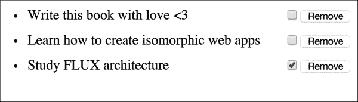
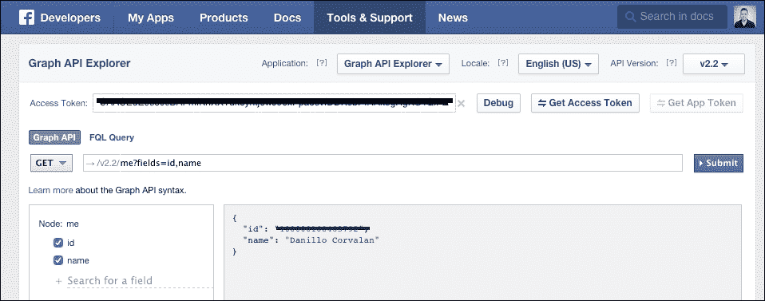
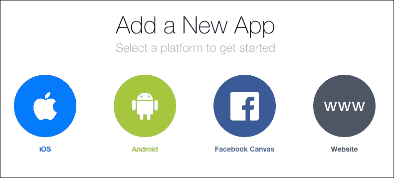
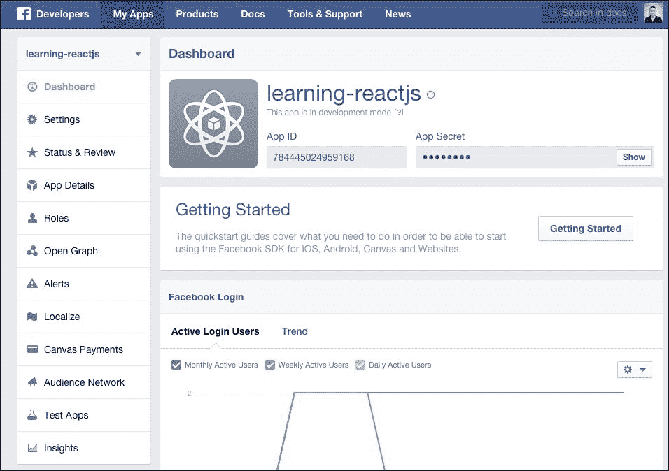
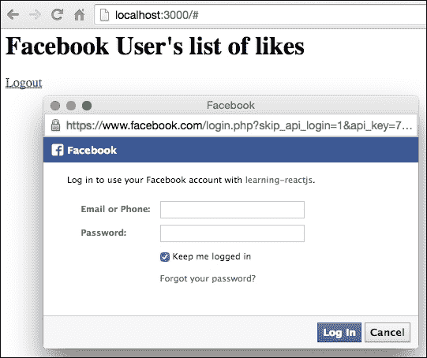
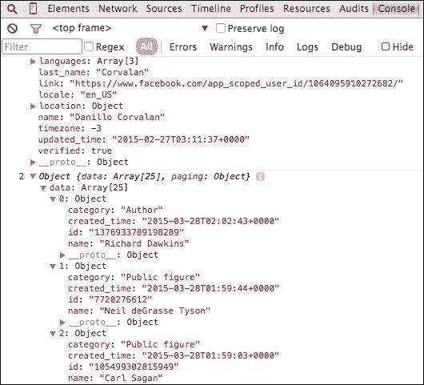
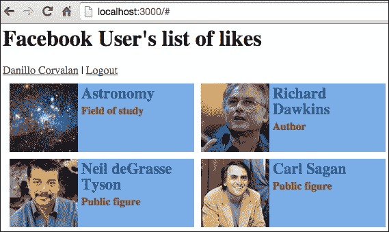

# 第三章. 使用属性

在本章中，我们将探讨如何使用 ReactJS 属性。我们还将学习如何将 ReactJS 与外部 API（Facebook Open-Graph API）集成，并在一组组件中渲染传入的数据。本章将涵盖以下内容：

+   组件属性

+   组件的数据流

+   配置和消费 Facebook Open-Graph API

+   创建 ReactJS 组件并从 API 列出数据

# 组件属性

在第二章中，*探索 JSX 和 ReactJS 结构*，我们讨论了很多关于 ReactJS 属性的内容，并在我们的示例中使用了它们，但到目前为止，我们只是像使用 HTML 属性一样使用它们。它们的作用远不止于此。通常，我们会使用它们在组件树中传递数据，以定义视图；传递来自父组件的配置属性；传递用户输入的回调，以及需要在外部触发的 UI/自定义事件等。

ReactJS 组件的属性一旦在 DOM 中渲染，就不能更改。

属性定义了组件的声明式接口。例如，在一个渲染名称属性的 `h1` 元素中，一旦渲染，你无法更改此名称，除非你创建另一个组件实例并在 DOM 的同一位置重新渲染，以替换旧的渲染组件。

```js
var GreetingsComponent = React.createClass({
  render: function() {
    return (
      <h1>Hello {this.props.name}!</h1>
    );
  }
});

React.render(<GreetingsComponent name="Readers" />, document.body);
// instead of rendering on the body rendering in a specific id ('app)
React.render(<GreetingsComponent name="Folks" />, document.getElemenById('app'));

```

这是因为 ReactJS 代表了组件在任何时间点的状态，而不仅仅是初始化时。考虑以下示例：

```js
var CustomInput = React.createClass({
  render: function() {
    return (
      <input type="text" value={this.props.text} />
    );
  }
});

React.render(<CustomInput text="Learning ReactJS" />, document.body);
```

正在渲染的输入文本被视为受控组件，因为它即使在尝试键入时也不会更改值。如果我们没有指定 `value` 属性，则被视为非受控组件。受控组件通过 ReactJS 数据流和组件周期来更新其数据。然而，如果你没有指定值属性，值属性将不由 ReactJS 控制，并且存在于 ReactJS 数据流之外。从表单输入或其他组件更改值的正确方法是设置它们的 `state`，这将在下一章中更详细地描述。

## 属性的数据流

ReactJS 的一个基本原理和最佳实践是通过属性将数据传递给嵌套组件。这样，子组件只需负责渲染它们必须渲染的内容，并将任务传递给更进一步的组件，从而确保关注点的分离。这也用于配置嵌套组件，以便层次结构顶部的组件可以通过传递属性来指定子组件应具有的特定方面。这还常见于在父节点上定义函数并将它们作为回调传递给子节点，以便在子组件需要时触发，从而提高组件的可重用性和可测试性。

让我们通过一个小示例来模拟一个静态待办事项列表。列表被拆分成小的组件，这些组件只渲染必要的部分并将属性传递给子组件，从而定义整个视图的功能。这就是最终将要渲染的内容：



我们将把我们的视图拆分成更小的组件，并从最内层的组件开始。在我们开始之前，让我们更详细地讨论每个组件及其在视图中的作用：

+   `TaskList` – 这个组件代表一个列表（`ul` 元素），它接受一个要渲染的任务数组。它遍历任务数组，创建一个 `TaskItem` 组件。除了通过属性传递任务详情以在 `TaskItem` 组件中渲染外，它还传递了一些函数回调，目前这些回调将只是模拟一些操作以简化演示。

+   `TaskItem` – 这个组件代表一个单独的任务（`li` 元素），它渲染任务名称、一个表示任务是否完成的输入复选框以及一个删除任务的按钮。同样，输入和按钮将只记录一些文本以简化演示。

    `TaskItem` 组件应该看起来像这样：

    ```js
    var TaskItem = React.createClass({
      render: function() {
        var task = this.props.task;

        return (
          <li>
            <span>{task.name}</span>
            <div>
              <input type="checkbox"

                   if (task.completed) {checked = "checked";} else { checked =  "";}
                onChange={this.props.markTaskComplete

              <button onClick={this.props.removeTask}>Remove</button>
            </div>
          </li>
        );
      }
    });
    ```

    `TaskList` 组件应该如下所示：

    ```js
    var TaskList = React.createClass({
      markTaskCompleted: function (task) {
        console.log('task ' + task.name + ' has been completed!');
      },

      removeTask: function (task) {
        console.log('task ' + task.name + ' has been removed!');
      },

      render: function() {
    /*The map() method creates a new array with the results of calling a provided     function on every element in this array. Here this.props.tasks will create a new array, with the callback as task. (source  HYPERLINK "https://developer.mozilla.org/en-US/docs/Web/JavaScript/Reference/Global_Objects/Array/map"https://developer.mozilla.org/en-US/docs/Web/JavaScript/Reference/Global_Objects/Array/map HYPERLINK "").  */
        var taskItems = this.props.tasks.map(function (task) {
          return <TaskItem task={task}
                           markTaskCompleted={this.markTaskCompleted}
                           removeTask={this.removeTask} />;
        }.bind(this));
    /*The bind() method creates a new function that, when called, has its this keyword set to the provided value, with a given sequence of arguments (if any) this (source  HYPERLINK "https://developer.mozilla.org/en-
    US/docs/Web/JavaScript/Reference/Global_Objects/Function/bind"https://developer.mozilla.org/en-US/docs/Web/JavaScript/Reference/Global_Objects/Function/bind). .bind is used in this case to simply more arguments and esnsure a parent chind relationship, which is not new to ReactJS but a concenpt of core Javascript. */
        return (
          <ul>
            {taskItems}
          </ul>
        );
      }
    });
    ```

任务列表有更多的功能和代码。它负责渲染任务列表并处理其上的操作。这是 ReactJS 中一个非常常见的模式，即在单一位置维护你的模型对象的控制权，当然，如果它有责任这样做的话。在更复杂的场景中，你会有一些“控制器”或“容器”（ReactJS 社区喜欢这样称呼它们），每个容器都有自己的任务并封装它们负责的内容。因此，所有的容器都有自己的责任，不会相互干扰。

在我们的静态任务列表示例中，只有一个缺失的部分，那就是在 HTML 元素中渲染组件：

```js
var tasks = [
  { name: 'Write this book with love <3', completed: false },
  { name: 'Learn isomorphic web apps', completed: false },
  { name: 'Study FLUX architecture', completed: true },
];

React.render(<TaskList tasks={tasks} />, document.body);
```

我们向列表传递了一些静态任务来解释属性的工作原理以及一些使用它们的实践。我们认为像待办事项、任务或 hello-world 这样的简单示例并不能代表我们每天面对的真实世界问题；尽管它们对于开始学习工具功能来说很棒，但当尝试制作更合理的示例时，例如具有异步操作、处理外部 API、身份验证等，它们就失败了。因此，以下主题将涵盖如何使用 Facebook API（也称为 Open-Graph API）设置我们的真实场景应用程序，包括 Facebook 登录以及登录用户喜欢的列表。

# 配置 Facebook Open-Graph API

在接下来的章节中，我们将学习更多关于 Facebook Open-Graph API 的知识，并对其进行配置，以便我们可以开始编写代码来构建我们出色的应用程序。

## 它是什么以及如何配置

**Facebook Open-Graph API** 是一个用于获取、编辑和添加常见 Facebook 资源的服务。您可以在自己的应用程序中使用的一些功能包括：登录；请求特定于用户的资源权限，如管理事件、在朋友墙上发布，等等。它有一系列您可以使用并集成到应用程序中的功能。第三方应用程序使用的主要功能之一当然是登录集成。您可以用它作为一个登录平台，例如，如果您不想或没有时间构建一个。

### 小贴士

API 文档可在 [`developers.facebook.com/`](https://developers.facebook.com/) 查找，建议您查看。

如果您想测试一些对他们的 API 的请求，而不必从头开始开发应用程序，您可以使用一个非常有用的工具，称为 *Graph API Explorer*。它通常用于在开发之前测试端点或只是检查返回的 JSON 结果。Graph API Explorer 可在顶部导航栏的 **工具 & 支持** 菜单项中找到。这个工具看起来是这样的：



Facebook Open-Graph API 上大多数可用的资源都需要授权。只有少数资源可以在不提供 **访问令牌** 的情况下使用。访问令牌是一种票据，您的应用程序使用它代表用户行事，因此您可以获取或提交数据。基本上，您向 Facebook 请求一些用户的权限；Facebook 打开一个弹出窗口，要求用户登录并显示您的应用程序请求的权限；一旦用户允许，Facebook 将通过生成的访问令牌将用户信息/对象发送回您的页面。从那时起，您就可以访问应用程序需要的其他 Open-Graph API 资源。您只需在您发出的每个后续请求中提供此令牌即可。这是 *OAuth* 授权标准的工作方式，但本书不会详细介绍 OAuth，因为它不是本书的目的。

### 注意

您可以在 [`oauth.net/2/`](http://oauth.net/2/) 找到有关 *OAuth* 的更多详细信息。

在 Graph API Explorer 中，您可以通过点击 **获取访问令牌** 按钮来获取访问令牌。这将打开一个弹出窗口，其中包含您的操作可以使用的一组权限。一旦您选择了所需的权限，Graph API Explorer 将显示一个弹出窗口，要求您确认请求的权限。这个过程生成一个新的访问令牌，允许您对这些受限制的资源进行请求操作。尝试检查 `user_likes` 权限，并通过 `/me/likes` 端点请求您的用户喜欢的列表：


您可能会在 **提交** 按钮下方的框中看到 JSON 结果。

这在 Graph API Explorer 中工作得非常好，但这只是为了测试目的。为了使其工作，我们必须在 Facebook 开发者网站上创建一个应用程序（APP-ID）。这遵循 OAuth 标准规范，并允许登录到你的应用程序的用户在授予访问权限之前了解更多关于你的应用程序的信息。为了在 Facebook 上创建一个应用程序并获得这个 APP-ID，请转到页面顶部的“我的应用”菜单；那里将有一个创建新应用的选项。


在撰写这本书的时候，Facebook Open-Graph API 推荐使用的版本是 v.2.2。

## 在 Facebook 开发者网站上创建应用 ID

当你点击前面图片中显示的“添加新应用”按钮时，Facebook 会询问你需要哪种类型的应用。



选择“网站”选项，这表示我们的应用将在一个独立的网页上运行，周围没有 Facebook 内容。之后，给它起一个花哨的、原创的、不可预测的名字，就像我这样做：`learning-reactjs`。完成之后，你将被重定向到应用详情和配置页面，看起来可能像这样：



哈哈！我们的应用 ID 已经准备好了；现在我们可以用它来向 Facebook Open-Graph API 发起请求调用。

### 注意

有一个重要的事情需要注意，即某些权限在生产前需要 Facebook 进行进一步分析。由于我们只是用它来获取我们自己的用户数据，所以没问题。如果你尝试用不同的用户登录，将不可能成功，因为`user_likes`权限要求你的应用程序提交给分析，而这需要花费很多时间，并且只有在你想将应用程序投入生产时才应该这样做。

## Open-Graph JavaScript SDK

Facebook Open-Graph API 为常见的编程语言提供了 SDK，以简化使用其资源的过程。JavaScript SDK 可以在[`developers.facebook.com/docs/javascript`](https://developers.facebook.com/docs/javascript)找到。他们的文档([`developers.facebook.com/docs/javascript/quickstart/v2.5`](https://developers.facebook.com/docs/javascript/quickstart/v2.5))非常全面，他们还提供了登录、处理多个请求等教程。如果你考虑学习使用 JavaScript SDK 的高级课程来学习 Open-Graph API，那么在之后查看它是有价值的。

只为了回顾一下我们即将要做的事情：我们将创建一个简单的 HTML 页面，该页面将加载 Facebook JavaScript SDK。之后，我们将登录到 Facebook，请求我们的登录用户喜欢的列表，并通过属性将其传递给我们将要创建的 ReactJS 组件。

Facebook JavaScript SDK 需要在后台加载，页面加载完成后不需要等待时间（异步）。为了做到这一点，我们需要创建一个`script` HTML 元素，将其`src`（源）属性指向 SDK 脚本，并将其最终插入 DOM 中。幸运的是，SDK 页面有一个现成的示例可以使用，你只需要替换其中的`APP-ID`属性。我们将使用他们的示例。脚本看起来是这样的：

```js
<script>
  window.fbAsyncInit = function() {
    FB.init({
      appId      : '784445024959168',
      xfbml      : true,
      version    : 'v2.2'
    });
  };

  (function(d, s, id){
     var js, fjs = d.getElementsByTagName(s)[0];
     if (d.getElementById(id)) {return;}
     js = d.createElement(s); js.id = id;

     js.src = "//connect.facebook.net/en_US/sdk/debug.js";
     fjs.parentNode.insertBefore(js, fjs);
   }(document, 'script', 'facebook-jssdk'));
</script>
```

### 注意

`window.fbAsyncInit`是一个初始化函数，包含你的 Facebook `appId`和其他详细信息。

一旦异步初始化完成，如果找到相关元素，JavaScript（js）就会连接到`//connect.facebook.net/en_US/sdk/debug.js`。

我们需要将`appId`参数更改为`t Facebook-app-id`。

因此，让我们开始创建一个位于单独文件夹中的`index.html`文件来组织这些内容。页面将如下所示：

```js
<html>
  <head>
    <title>Rahh</title>
    <script src="img/react-0.12.2.js"></script>
    <script src="img/JSXTransformer-0.12.2.js"></script>
  </head>
  <body>

    <h1>Facebook User's list of likes</h1>
    <a onClick='logout()' href='#'>Logout</a>
    <div id="main"></div>

    <script>
      window.fbAsyncInit = function() {
        FB.init({
          appId      : '784445024959168',
          xfbml      : true,
          version    : 'v2.2'
        });

        checkLoginStatusAndLoadUserLikes();
      };

      (function(d, s, id){
         var js, fjs = d.getElementsByTagName(s)[0];
         if (d.getElementById(id)) {return;}
         js = d.createElement(s); js.id = id;
         //js.src = "//connect.facebook.net/en_US/sdk.js";
         js.src = "//connect.facebook.net/en_US/sdk/debug.js";
         fjs.parentNode.insertBefore(js, fjs);
       }(document, 'script', 'facebook-jssdk'));
    </script>

    <script type="text/jsx" src="img/index.jsx"></script>
  </body>
</html>
```

我们正在注释`js.src`行，并使用一个调试 JavaScript 文件进行复制。这有助于查找错误和调试你的脚本。

### 注意

**内容分发网络**或**内容分发网络**（**CDN**）是一个全球分布式的代理网络。来源：https://en.wikipedia.org/wiki/Server_(computing)

服务器部署在多个数据中心。来源：[`en.wikipedia.org/wiki/Data_center`](https://en.wikipedia.org/wiki/Data_center)

CDN 的目标是以高可用性和高性能向最终用户提供服务。来源 [`en.wikipedia.org/wiki/Content_delivery_network`](https://en.wikipedia.org/wiki/Content_delivery_network)

首先，我们需要引用 ReactJS 依赖项，我们将引用 CDN 版本以使其更容易演示和学习目的。在引用依赖项之后，我们创建一些 HTML 元素，一个标题，一个用于从 Facebook 注销的锚点，以及一个`div`，它将成为要渲染的 ReactJS 组件的宿主。稍后，我们将按照之前解释的方式配置 Facebook Open-Graph JavaScript SDK，但增加一个额外的命令`checkLoginStatusAndLoadUserLikes();`，这个命令将在稍后解释。最后，我们将引用包含使一切发生的魔法的`index.jsx`文件。

我们将`checkLoginStatusAndLoadUserLikes`调用放在了`fbAsyncInit`函数中，因为 Open-Graph SDK JavaScript 会在加载后触发该函数，所以这里是调用 Open-Graph API 调用的正确位置。继续我们的开发，在`index.jsx`文件内部，让我们实现`logout`和`checkLoginStatusAndLoadUserLikes`函数，并测试一下以查看 Facebook 集成是否工作。

`logout`函数应该像这样简单：

```js
function logout() {
  FB.logout();
}
```

这将仅将用户从 Facebook 上注销，需要他再次登录。由于我们将保持简单，为了学习目的，我们不会处理用户在发生这些事件时注销和登录来管理点赞列表的情况。因此，让我们实现我们的 `checkLoginStatusAndLoadUserLikes` 函数：

```js
function checkLoginStatusAndLoadUserLikes() {
  FB.login(function(response) {
    console.log('We are live!!');
  });
}
```

这段代码也非常简单明了。Open-Graph JavaScript SDK 所做的每个调用都将异步执行，因此我们必须提供一个函数回调，该回调将在向 Facebook API 发出请求并返回响应时触发。在这段代码中，我们将在登录到应用后登录到控制台。这个过程将调用 Facebook 登录弹出窗口：



尝试一下！加载屏幕，一旦登录，点击注销锚点并重新加载页面，从您的浏览器中查看控制台，查看我们打印的日志。以下图像显示了登录弹出窗口。

### 注意

为了使其在 `localhost:3000` 上工作，您需要在代码文件夹内运行 Python 的 `SimpleHTTPServer` 命令，即 `python -m SimpleHTTPServer`。有关此命令和其他运行您应用的方法的更多详细信息，请参阅第一章, *使用 ReactJS 入门*。

您也可以使用以下命令实现：

```js
npm -g install httpster

```

httpster：这是一个简单的 http 服务器，用于运行静态内容。在 Chrome 浏览器中，`index.html` 文件有时会因为 X-origin 错误而无法渲染。因此，从您的应用程序目录运行此 web 服务器将更容易测试您的应用程序。只需从您的应用程序的 `root` 目录运行 httpster 命令。

默认情况下，服务器在端口 `3333` 上运行，因此浏览器中的 `localhost:3333` 应该显示您应用的 `index.html` 页面。

既然我们的集成工作已经完成，让我们获取已登录用户的点赞列表。将您的 `checkLoginStatusAndLoadUserLikes` 函数修改如下：

```js
function checkLoginStatusAndLoadUserLikes() {
  FB.getLoginStatus(function(response) {
    if (response.status === 'connected') {
      loadUserAndLikes();
    } else {
      loginAndLoadUserLikes();
    }
  });
}
```

第一步是检查用户已经登录的位置。调用 `FB.getLoginStatus` 函数可以做到这一点。在回调函数内部，传递的参数代表来自 API 的响应。此响应包含有关用户登录状态的信息。这将是一个非常常见的参数，因为其他 API 调用也会将响应对象返回到您的回调函数。表示用户已授权应用并成功登录的状态是 `connected`。如果用户已经登录，我们只需调用 `loadUserAndLikes` 函数，但如果未连接，则调用另一个函数来登录，然后调用 API 加载用户的点赞列表。

函数 `loginAndLoadUserLikes` 应该如下所示：

```js
function loginAndLoadUserLikes() {
  FB.login(function(response) {
    loadUserAndLikes();
  }, {scope: 'user_likes'});
}
```

登录功能已移动到这个方法。一旦登录操作完成，我们就调用 `loadUserAndLikes`。注意，我们现在在登录函数调用末尾传递一个对象 `{scope: 'user_likes'}`；这个对象代表 Facebook 上的作用域/权限，这是我们的应用程序所要求的。在下面的示例中，在第一个函数调用（`loadUserAndLikes`）中，返回了登录用户的 `userResponse`。然后 API 列出了该登录用户的全部点赞。

函数 `loadUserAndLikes` 应该如下所示：

```js
function loadUserAndLikes() {
  FB.api('/me', function(userResponse) {
    console.log(1, userResponse);
    FB.api('/me/likes', function(likesResponse) {
      console.log(2, likesResponse);
    });
  });
}
```

您可以在 JSX 文件中包含尽可能多的 JavaScript 代码。它不是一种只理解其自身语法的特定类型的文件，它只是将您使用 JSX 特定语法标记的地方转换过来。

注意，我们正在对 API 进行两次请求：第一个请求将获取用户详情，另一个请求将获取用户的点赞列表。我们在实现我们的 ReactJS 组件以渲染它之前，将它们记录到控制台以进行测试。这是我用户的输出：



到目前为止，我们已经探讨了 Facebook Open-Graph API 及其配置方法。你可能想知道这与学习 ReactJS 有什么关系？我只能说，根据我的经验，大多数人在教授一个新的库或框架时，所提供的示例都依赖于 **待办事项** 应用程序、同步操作，并且当它们使用外部资源时。这并不适用于常见的集成任务，如登录。这种集成让我们更好地了解当我们将更现实的场景放入其中并尽可能使其简单时，所教授的事物是如何工作的。完成这个示例后，我们将了解如何将 ReactJS 与您自己的私有 API 集成，例如。

# 在 ReactJS 组件中渲染数据

我们现在有了要传递给我们要创建的 ReactJS 组件的数据。首先，让我们从 `UserDetails` 组件开始。这个组件将显示一个带有登录用户名的链接以及该用户的 Facebook 页面链接。首先，从 `index.html` 文件中移除我们的旧登录锚点，因为这个功能现在不再需要了。我们的登出功能将移动到我们的 ReactJS 组件中。我们还会在主 `div` 上方创建另一个 `div`，命名为 `user`；这个新元素将包含 `UserDetails` 组件。`index.html` 中的更改应该如下所示：

```js
<h1>Facebook User's list of likes</h1>
<div id="user"></div>
<div id="main"></div>
```

您可以在 `index.jsx` 文件的底部创建 `UserDetails` ReactJS 组件：

```js
var UserDetails = React.createClass({
    handleLogout: function () {
    FB.logout(function () {
      alert("You're logged out, refresh the page in order to login again.");
    });
  }
  render: function () {
    return (
      <section id="user-details">
        <a href={this.props.userDetails.link} target="__blank">
          {this.props.userDetails.name}
        </a>
        {' | '}
        <a href="#" onClick={this.handleLogout}>Logout</a>
      </section>
    )
  },
});
```

现在，我们需要将 `loadUserAndLikes` 函数修改为调用 `React.render` 方法，将其指向用户 HTML 的 `div` 元素：

```js
function loadUserAndLikes () {
  FB.api('/me', function (userResponse) {
    React.render(<UserDetails userDetails={userResponse} />, document.getElementById('user'));

    FB.api('/me/likes', function (likesResponse) {
      console.log(2, likesResponse);
    });
  });
}
```

如你所见，`UserDetails` ReactJS 组件非常简单和基本；它就像一个模板，只是渲染传递给它的数据。不要对此感到失望，因为我们将在接下来的章节中给它添加更多功能，例如，在用户注销时渲染登录按钮，而不是要求刷新页面，隐藏列表，在等待 SDK 响应时显示加载 `gif` 图像。所有这些功能都需要我们处理状态，这将在下一章中介绍。

你可以通过刷新页面、点击注销按钮，然后再次刷新页面来测试它。一旦你在 Facebook 上登录，用户详情应该显示在浏览器中，位于我们页面标题下方。

我们现在需要渲染用户的点赞列表，并将丑陋的 `console.log(2, likesResponse);` 命令替换为 ReactJS 渲染函数。首先，让我们在 `index.jsx` 文件的底部创建我们的 `UserLikesList` 组件：

```js
var UserLikesList = React.createClass({
  render: function() {
    var items = this.props.list.map(function (likeObject) {
      return <UserLikeItem data={likeObject} />;
    });

    return (
      <ul id="user-likes-list">
        {items}
      </ul>
    );
  }
});
```

我们创建了一个名为 `items` 的 `UserLikeItem` 组件数组，并在列表 `<ul>` 元素内部渲染它们。`UserLikeItem` 组件应该看起来像这样：

```js
var UserLikeItem = React.createClass({
  render: function() {
    var data = this.props.data;

    return (
      <li>
        

        <h1>{data.name} <small>{data.category}</small></h1>
      </li>
    );
  }
});
```

我们将属性数据放在一个单独的变量中，以避免在组件标记中存在长名称。请注意，我们还在显示来自点赞的 Facebook 资源的照片；因此，我们还需要在我们的 API 调用中请求这一点，并通过传递这个点赞列表来渲染我们的组件：

```js
function loadUserAndLikes () {
  FB.api('/me', function (userResponse) {
    React.render(<UserDetails userDetails={userResponse} />, document.getElementById('user'));

 var fields = { fields: 'category,name,picture.type(normal)' };
 FB.api('/me/likes', fields, function (likesResponse) {
 React.render(<UserLikesList list={likesResponse.data} />, document.getElementById('main'));
 });
  });
}
```

我们已经将 `loadUserAndLikes` 函数更改为请求 API 也带来点赞的 Facebook 资源的照片。默认情况下，它被省略在响应中。

尝试一下，看看你是否能在页面上显示你的点赞列表。它可能看起来非常奇怪，因为我们还没有创建任何样式。在 `index.html` 页面中创建一个样式元素来为我们的列表添加样式：一个非常基本的样式，但只是为了使我们的示例看起来更令人愉悦：

```js
<style>
  #user-likes-list {
    list-style: none;
    padding: 5px;
    margin: 0;
  }
  #user-likes-list li {
    display: inline-block;
    width: 270px;
    margin: 5px;
    background-color: rgb(122, 174, 233);
    height: 100px;
    overflow: hidden;
  }
  #user-likes-list img {
    display: inline-block;
    vertical-align: top;
    width: 100px;
  }
  #user-likes-list h1 {
    font-size: 1.4em;
    display: inline-block;
    width: 160px;
    vertical-align: top;
    margin-left: 5px;
    color: rgb(20, 90, 169);
    margin: 5px 0 0 5px;
  }
  #user-likes-list small {
    font-size: 0.7em;
    display: block;
    color: rgb(145, 50, 0);
    margin-top: 5px;
  }
</style>
```



好吧，可能没有样式看起来不太好。无论如何，你总是可以向设计师寻求帮助！

ReactJS 属性使你的组件可配置和可更改。正如你所见，创建 ReactJS 组件并在你的页面上渲染它们非常简单，即使在现有的页面上也是如此。你不需要让整个应用支持框架或从头开始创建一个。你只需定义你的组件是什么，将它们视为一个集合，避免创建难以维护的大组件，并在页面的某个位置渲染它们。通过智能地处理有状态的组件，它的功能得到了增强，这是我们学习 ReactJS 的下一步。

# 摘要

在本章中，我们学习了如何向 ReactJS 组件传递属性，并根据这些组件渲染 UI。我们还学习了如何创建父组件与其子组件进行通信。我们看到了如何配置 Facebook Open-Graph API，如何使用登录功能将其与 ReactJS 集成，以及如何将 API 请求调用的响应渲染成一系列较小的 ReactJS 组件。

在下一章中，我们将深入探讨有状态组件，并了解如何根据用户的输入或任何其他需要状态改变以及 UI 自动表示该状态的原因来创建可变的 ReactJS 组件。
