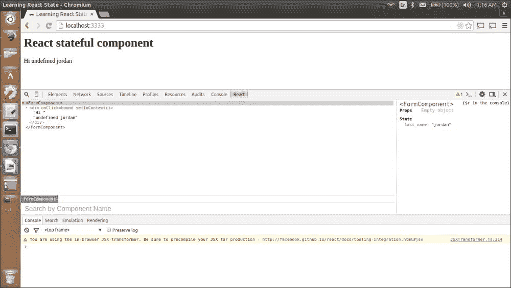
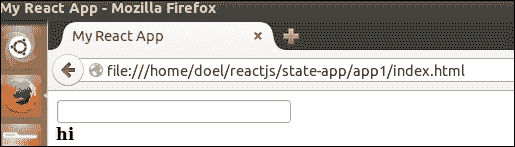
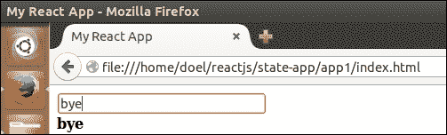
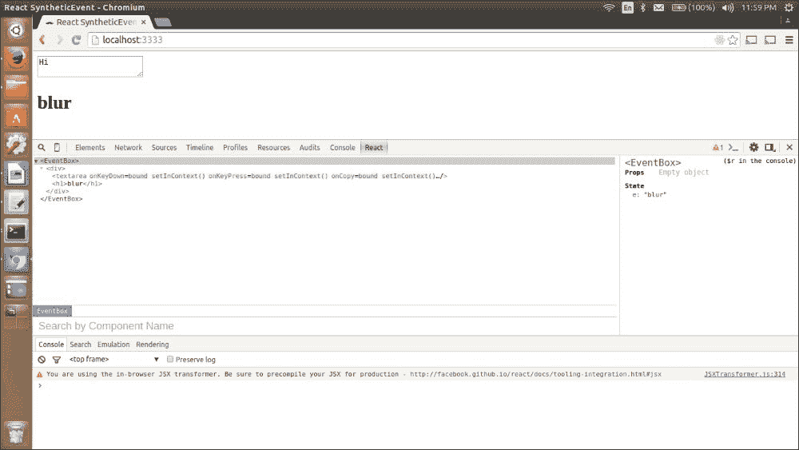
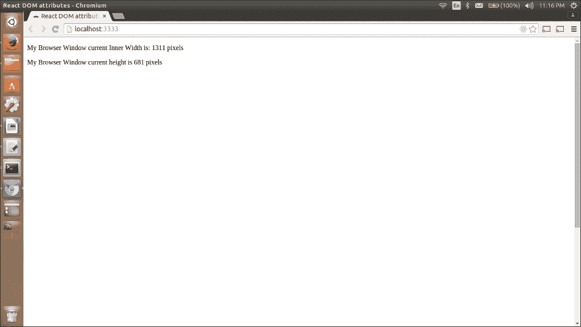
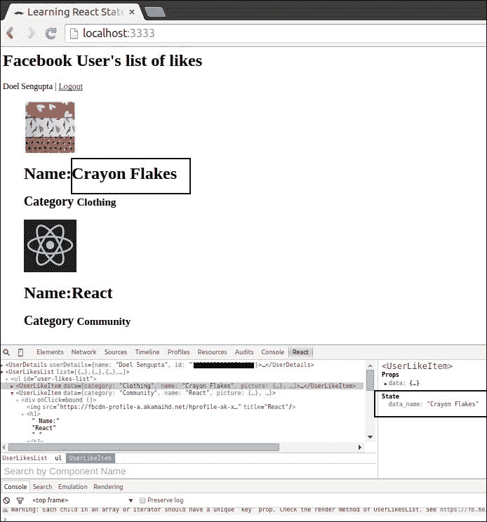
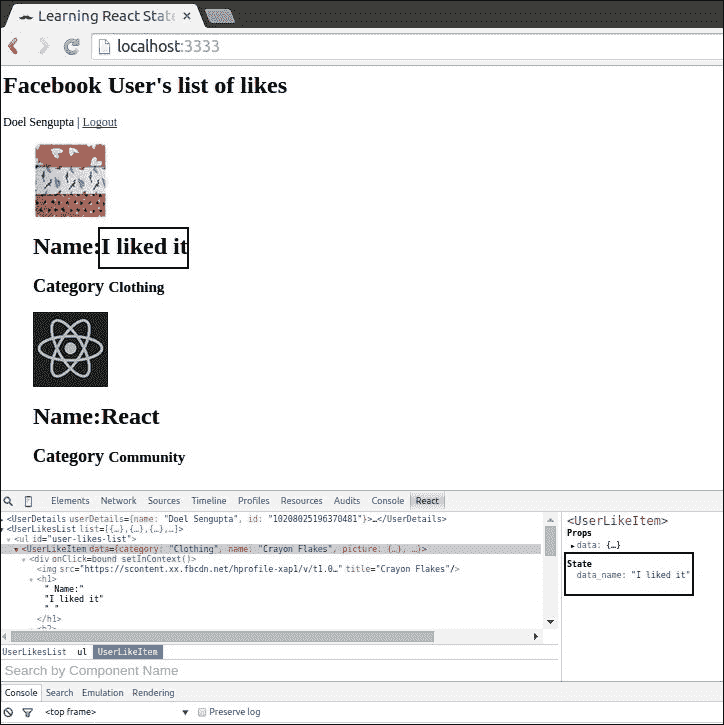

# 第四章. 状态组件和事件

在本章中，我们将详细探讨 React 状态和事件。本章将涵盖具有状态的组件、它们之间的通信实践以及如何响应用户输入/事件，以便使 UI 反映这种状态。我们将开发一个网页，我们可以从中更新我们喜欢的 Facebook 页面的名称。这也涵盖了状态如何通过使用虚拟 DOM 提高性能来改变你的 React UI。

本章将涵盖以下内容：

+   React 状态

+   事件生态系统

# ReactJS 中属性与状态的区别

让我们简要地看一下 React 中 props 和 states 之间的区别。

**属性**是在创建 React 组件时声明的，而 **状态**是在组件定义内声明的。因此，在组件初始化阶段声明 props。

+   在大多数情况下，React 组件以 props 的形式接收数据。在其他情况下，当你需要接收用户输入以进行服务器请求时，使用状态。

+   `(this.props)` 用于访问从父组件传递的参数，而 `(this.state)` 用于管理动态数据。状态应被视为私有数据。

# 探索状态属性

在上一章中，我们探讨了 React 属性（**props**）。正如组件可以有属性一样，它们也可以有 **states**。状态主要设置在那些需要改变的组件中，例如如果组件在未来需要更新或替换。因此，对于整个组件来说，拥有状态不是强制性的。

组件可以是无状态的或状态化的：

+   **无状态组件**是那些只有 props 的组件，但没有定义状态。因此，这些组件在其组件生命周期内这些 prop 值将不会发生变化。静态数据的唯一来源应通过 props 呈现给组件实例。因此，对于 React 组件来说，props 是不可变数据。

+   **状态化组件**：无状态组件是指那些被声明为没有状态且返回相同标记的函数的 React 组件。正如其名所示，状态化组件是那些声明了 props 和 states 的组件。通常，这种数据更改通信是通过状态更改 `[setState(data, callback)]` 来完成的。然后更新后的状态将在 UI 中渲染。在交互式应用程序 `[表单提交等]` 中，数据不断变化时，需要这样的状态化组件。否则，对于非交互式应用程序，建议拥有较少的状态化组件，因为它们会增加应用程序的复杂性和冗余。

## 初始化状态

组件状态的初始化是通过 `getInitialState()` 方法完成的，它返回一个对象：

```js
object getInitialState()
```

`getInitialState()` 方法在组件挂载之前被调用一次。返回值将用作 `this.state` 的初始值。

### 注意

对于所有以下示例，我们在 `index.html` 文件中有相同的内容。因此，我们可以使用相同的 `index.html` 文件，并且只需根据讨论的主题更改相应的 JavaScript 文件的内容。

我们可以创建一个如下所示的 React 有状态组件：

```js
var FormComponent = React.createClass({
  getInitialState:function(){
    return {
      name: 'Doel',
      id: 1
    };
    },
  render : function() {
    return <div>
      My name is {this.state.name}
      and my id is {this.state.id}.
    </div>;
  }
});
React.renderComponent(
  <FormComponent />,
  document.body
);
```

### 注意

`getInitialState()` 方法在第一次渲染周期中用值（name: `Doel`，id: `1`）初始化组件。这些值在状态值更改之前保持不变，并且可以通过运行 `{this.state.<VALUE>}` 来收集。

## 设置状态

在 React 中，数据更改通常是通过调用方法 `setState(data, callback)` 来实现的，该方法与 `this.state` 的数据一起重新渲染组件。如果你提供了一个可选的回调参数，React 将在执行此方法时调用它，尽管通常不需要，因为 React 会保持 UI 更新。

状态是在组件内部设置的。

以下代码展示了如何更新/设置状态：

```js
var InterfaceComponent = React.createClass({
  getInitialState : function() {
    return {
      name : "doel"
    };
  },
  handleClick : function() {
    this.setState({
      name : "doel sengupta"
    });
  },
  render : function() {
    return <div onClick={this.handleClick}>
      hello {this.state.name}, your name is successfully updated!
    </div>;
  }
});
React.renderComponent(
  <InterfaceComponent />,
  document.body
);
```

这是我们的操作：

+   状态中的更改值仅在组件挂载后才会反映出来。

+   组件的挂载发生在它被传递给 `React.render(<Component />)` 时。

+   我们的事件处理器 `onClick` 调用 `handleClick()` 函数，该函数内部调用 `this.state()`。因此，当 `onClick` 事件在名称 `doel` 上初始化时，它将值从 `doel` 更改为 `doel sengupta`。

在 React 文档([`facebook.github.io/react/docs/interactivity-and-dynamic-uis.html`](http://facebook.github.io/react/docs/interactivity-and-dynamic-uis.html))中，Facebook 建议：

+   有许多无状态组件用于渲染数据，以及一个作为父组件的有状态组件，它通过属性将状态传递给无状态子组件。

+   从本质上讲，有状态组件的功能是包含交互逻辑，而无状态组件渲染数据。

+   组件的状态包含由组件的事件处理器操作的数据。

+   你应该在 `this.state` 中保持最小数据，并在 `render` 方法中执行所有计算。这减少了冗余或计算值的存储，并确保对 React 的计算能力有更高的可靠性。

+   React 组件应该在 `render()` 方法中基于底层属性和状态构建

+   应该将属性基本上用作真相的来源。任何可以通过用户的输入或其他方式更改的数据，都应该存储在状态中。

## 替换状态

```js
index.html:
```

```js
<!DOCTYPE html>
<html>
<head>
<script src="img/react.min.js"></script>
<script src="img/JSXTransformer.js"></script>
    <script src="img/jquery.min.js"></script>
  <script src="img/react-dom.js"></script>
  <meta charset="utf-8">
  <title>My React App</title>
</head>
<body>
  <div id="myApp"></div>
    <script type="text/jsx", src="img/replace_state.js"></script>
</body>
</html>
```

这是 `replace_state.js` 的代码：

```js
//calling replaceSet() method 
var FormComponent = React.createClass({
  getInitialState : function() {
    return {
      first_name : "michael",
      last_name : "jackson"
    };
  },
  handleClick : function() {
    this.replaceState({
      last_name : "jordan"
    });
  },
  render : function() {
    return <div onClick={this.handleClick}>
      Hi {this.first_name + " " + this.state.last_name }
    </div>;
  }
});
```

### 注意

当需要清除现有值并添加新值时，使用 `replaceState()` 方法。

这是应用首次运行时的样子：


初始页面加载时的应用截图

页面最初加载后，`first_name`属性的值是`michael`，但当`onClick`函数被调用时，值变为`undefined`。当调用`replaceState()`时，具有`first_name`和`last_name`属性的组件状态被替换为只有`last_name`。以下截图说明了这一点：



在调用 replaceState()后重新渲染组件

## 使用交互表单的 React 状态示例

```js
index.html:
```

```js
<!DOCTYPE html>
<html>
<head>
<script src="img/react.min.js"></script>
<script src="img/JSXTransformer.js"></script>
    <script src="img/jquery.min.js"></script>
  <script src="img/react-dom.js"></script>
  <meta charset="utf-8">
  <title>My React App</title>
</head>
<body>
  <div id="myApp"></div>
    <script type="text/jsx", src="img/react_state.js"></script>
</body>
</html>
```

```js
react_state.js file:
```

```js
/* declaration of React component1 with initial values and the changed value to be set in  the update function.
*/
var Component1 =
React.createClass({
  getInitialState:function(){
    return {
      name: 'hi',
      id: 1
    };
  },
  update: function(e){
    this.setState({name: e.target.value});
  },
  render:function(){
    return (
      <div>
/* The render method returns the Component2 with props name and the value to be called on update method*/
 < Component2 name={this.state.name} update={this.update} />
      </div>
      );

  }
});
/* Declaration of Component2 which calls the update function when onChange method is called. */
var Component2 = React.createClass({
  render:function(){
    return (
      <div>
 <input type="text" onChange={this.props.update} />
 <br />
 <b>{this.props.name}</b>
      </div>
      );

  }
});
ReactDOM.render(< Component1 name="this is the text property"  />, document.getElementById('myApp'));
```

当我们首次运行代码时，我们看到：



用户交互表单

在文本框中输入后，下面的值会自动更改，如下所示：



使用 this.setState()更新的表单数据

现在，让我们更深入地了解事件在 React 生态系统中的流动方式。

# 事件

React 使用`SyntheticEvent`，这是一个围绕浏览器原生事件的跨浏览器包装器。因此，react 应用程序中的所有事件处理程序都将传递`SyntheticEvent`的实例。React 的事件生态系统具有与浏览器原生事件相同的接口，其优势在于它在所有浏览器中工作方式相同，并提供`stopPropagation`()和`preventDefault`()。

如果 React 作为 NPM 模块安装，那么这些与`SyntheticEvent`相关的文件可以在您的应用程序中的以下位置找到：`app/node_modules/react/lib`。

所有这些事件都符合 W3C 标准。主要事件流程如下：

+   分发事件：`@param {object} dispatchConfig`

+   标识事件目标的标记：`@param {object} dispatchMarker`

+   原生事件：`@param {object} nativeEvent`

React 使用此事件委托的方式是通过监听具有监听器的节点。根据特定节点上的事件处理程序，React 的合成事件系统实现了自己的冒泡。

合成事件系统中的一些事件名称如下。有关注册事件的完整列表，请参阅 Facebook 文档。

## 表单事件

+   表单事件的事件名称：

    +   `onChange`, `onInput`, `onSubmit`

    ### 注意

    有关`onChange`事件的更多信息，请参阅表单([`facebook.github.io/react/docs/forms.html`](https://facebook.github.io/react/docs/forms.html))。

## 鼠标事件

+   鼠标事件的事件名称：

    +   `onClick`, `onContextMenu`, `onDoubleClick`, `onDrag`, `onDragEnd`, `onDragEnter`, `onDragExit`

    +   `onDragLeave`, `onDragOver`, `onDragStart`, `onDrop`, `onMouseDown`, `onMouseEnter`, `onMouseLeave`

    +   `onMouseMove`, `onMouseOut,` `onMouseOver`, `onMouseUp`

让我们看看`SyntheticEvent`系统在 React 组件上调用的一些不同事件的示例。

在 JavaScript 文件中，我们有以下代码片段：

```js
/* React component EventBox is decalred which shows the different functions it fires in response of diffenrent Synthetic events.*/
var EventBox = React.createClass({

  getInitialState:function(){
    return {e: 'On initial page load'}
  },

  update: function(e){
    this.setState({e: e.type})
  },

  render:function(){
    return (
      <div>
        <textarea
/*Following are the various events (on the left hand side ). In response of all these events then the update function is called. */
 onKeyDown={this.update}
 onKeyPress={this.update}
 onCopy={this.update}
 onFocus={this.update}
 onBlur={this.update}
 onDoubleClick={this.update}
/>
        <h1>{this.state.e}</h1>
      </div>
    );});
```

以下代码在浏览器中显示一个文本框。当我们输入框中时，相应的事件类型会打印出来。由于我们使用 `event.type` 更新状态，因此当我们在框中输入时，相应的事件会显示在下面。

```js
ReactDOM.render(<EventBox />, document.getElementById('myTextarea'));
```



用户交互表单

## nativeEvent

```js
index.js file:
```

```js
/* React component MyBrowserDimension, with nativeEvent attribute which is needed for manipulating the underlying browser events(window.innerWidth, window.innerHeight). */
var MyBrowserDimension = React.createClass({
getInitialState:function(){
    return {
      width: window.innerWidth,
      height: window.innerHeight
    };
  },

  update: function(){
    this.setState({
     height: window.innerHeight,
     width: window.innerWidth
    });
  },

//componentDidMount is called after the component is mounted and //has a DOM presentation. This is often a place where we will //attach generic DOM events.

  componentDidMount:function(){
    window.addEventListener('resize', this.update );
    window.addEventListener('resize', this.update );
  },

  componentWillUnmount:function(){
    window.removeEventListener('resize', this.update );
    window.removeEventListener('resize', this.update );
  },

  render:function(){
    return <div>
      <p>My Browser Window current Inner Width is: {this.state.width} pixels</p>
      <p>My Browser Window current height is {this.state.height} pixels</p>
    </div>;
  }
});

ReactDOM.render(<MyBrowserDimension />, document.getElementById('myApp'));
```

这里是相应 HTML 页面的源代码：

```js
<!DOCTYPE html>
<html>
<head>
<script src="img/react.js"></script>
<script src="img/react-dom.js"></script>
<script src="img/JSXTransformer.js"></script>
  <meta charset="utf-8">
  <title>React DOM attributes</title>
</head>
<body>
<div id="myApp"></div>
    <script type="text/jsx", src="img/index.js"></script>
</html>
```

从以下屏幕截图可以看出，当我们调整浏览器窗口大小时，宽度和高度值会改变。第一张图片显示了浏览器的完整大小 [1311/681]。



显示浏览器原生属性的 App

前一个应用程序代码的第二张图片显示，在调整浏览器窗口大小后，像素值变为 497/219。


原生 DOM 属性随浏览器窗口变化而变化

### 注意

根据 Facebook 开发者团队 ([`facebook.github.io/react/tips/dom-event-listeners.html`](http://facebook.github.io/react/tips/dom-event-listeners.html))：

> *"在 React 应用中声明的回调事件都绑定到 React 组件上。这些事件回调与原始元素无关。通过自动绑定，这些方法会自动绑定到当前元素。"*

此外，每个 `SyntheticEvent` 对象都有以下属性：

+   `boolean bubbles`: 所有事件处理程序都在事件冒泡阶段触发；可以是 `true`/`false`

+   `boolean cancelable`: 合成事件对象是否可以被取消（true/false）

+   `DOMEventTarget currentTarget`: 根据 W3C 建议，`currentTarget` 事件属性返回触发事件的元素

这在捕获和冒泡期间特别有用。

`currentTarget` 属性始终指向触发事件的元素，而不是 `target` 属性，后者返回触发事件的元素。

+   `boolean defaultPrevented`: 是否可以默认阻止 `SyntheticEvent` 对象（true/false）

+   `number eventPhase`: `eventPhase` 事件属性返回一个数字，表示当前正在评估的事件流的哪个阶段（见：[`developer.mozilla.org/en-US/docs/Web/API/Event/eventPhase`](https://developer.mozilla.org/en-US/docs/Web/API/Event/eventPhase)）

    数字由四个常量表示：

    `0` – `NONE`。

    `1` – `CAPTURING_PHASE`: 事件流处于捕获阶段。

    `2` – `AT_TARGET`: 事件流处于目标阶段，即正在事件目标处评估。

    `3` – `BUBBLING_PHASE`: 事件流处于冒泡阶段。

+   `boolean isTrusted`: 根据 JS 建议，在 Chrome、Firefox 和 Opera 中，如果事件是由用户触发的，则认为是可信的（返回 true），如果是由脚本触发的，则不可信（返回 false）。

+   `DOMEvent nativeEvent`: `nativeEvent` 是一种 `DOMEvent`。

+   `void preventDefault()`: 如果事件可取消，`preventDefault()`方法将取消事件（取消方法的默认操作），但它不会防止事件通过 DOM 进一步传播。React 中`preventDefault()`的返回类型为 void。

+   `void stopPropagation()`: 调用`stopPropagation`以防止事件冒泡到其父元素，从而防止任何父事件处理器被调用。

+   `boolean isDefaultPrevented()`: `isDefaultPrevented`用于检查是否调用了`preventDefault()`方法（true）或未调用（false）。

+   `boolean isPropagationStopped()`: `isPropagationStopped`用于检查是否调用了`stopPropagation()`方法（true）或未调用（false）。

+   `DOMEventTarget target`: 它用于识别声明的`SyntheticEvent`对象的目标，返回触发事件的元素。返回类型为`DOMEventTarget`。

+   `number timeStamp`: 这用于识别声明的`SyntheticEvent`对象的时间戳。返回类型为数字。

+   `string type`: 这用于识别声明的`SyntheticEvent`对象类型。返回类型为字符串。

### 注意

注意：从 v0.14 版本开始，从事件处理器返回 false 将不再停止事件传播。相反，应根据需要手动触发`e.stopPropagation()`或`e.preventDefault()`。

## 事件池

**池**是一个存储事件/对象的地方，以便在稍后阶段，在垃圾回收后可以重用。在 React 生态系统中，回调函数中接收的事件对象（`SyntheticEvent`）被池化。如前所述，在事件回调函数被调用后，`SyntheticEvent`将被放回池中，属性为空，从而减轻垃圾回收器的压力。以下是在 Facebook 文档中提到的关于事件池的一些关键要点。

React 中的`SyntheticEvent`系统是池化的。

> *"这意味着`SyntheticEvent`对象将被重用。"*
> 
> *在事件回调函数被调用后，所有属性都将被置为 null。*
> 
> *这是出于性能考虑。*
> 
> *我们无法以异步方式访问事件。*
> 
> *为了以异步方式访问事件属性，我们应该在事件上调用`event.persist()`，这将移除合成事件从池中，并允许用户代码保留对事件的引用。*

## 支持的事件

React 标准化事件，以确保在不同浏览器中具有一致的属性。

根据 Facebook 文档([`facebook.github.io/react/docs/events.html`](http://facebook.github.io/react/docs/events.html))

> *"React 生态系统中的合成事件的事件处理器在冒泡阶段的事件触发。"*

现在我们已经了解了 React 组件中的状态以及事件处理是如何发生的，让我们看看我们如何在上一章中构建的应用中使用这些功能。

到目前为止，我们已经能够使用 Graph-API 和 Facebook 登录到我们的应用程序中显示用户的点赞。基于其 props，每个组件都渲染了自己一次。Props 是不可变的：它们是从父组件传递的，并且由父组件拥有。现在，我们将在 React 组件所在的特定`div`的任何部分更新喜欢组件的`onClick`名称。

以下示例的`index.html`代码片段是：

```js
<html>
  <head>
    <title>Learning React State</title>
    <script src="img/react-0.13.3.js"></script>
    <script src="img/JSXTransformer-0.13.3.js"></script>
  </head>
  <body>
    <h1>Facebook User's list of likes</h1>
    <div id="user"></div>
    <div id="main"></div>
    <a onClick='logout()' href='#'>Logout</a>
    <script>
      window.fbAsyncInit = function() {
        FB.init({
          appId      : '1512084142440038',
          xfbml      : true,
          version    : 'v2.2'
        });

        checkLoginStatusAndLoadUserLikes();
      };

      (function(d, s, id){
         var js, fjs = d.getElementsByTagName(s)[0];
         if (d.getElementById(id)) {return;}
         js = d.createElement(s); js.id = id;
         js.src = "//connect.facebook.net/en_US/sdk/debug.js";
         fjs.parentNode.insertBefore(js, fjs);
       }(document, 'script', 'facebook-jssdk'));
    </script>

    <script type="text/jsx" src="img/index.js"></script>
  </body>
</html>
```

以下代码位于`js`文件中：

```js
// The following code block explains in order to login to user's Facebook //account and call the function internally( loginAndLoadUserLikes) if //successfully connected.
function checkLoginStatusAndLoadUserLikes() {
  FB.getLoginStatus(function(response) {
    if (response.status === 'connected') {
      loadUserAndLikes();
    } else {
      loginAndLoadUserLikes();
    }
  });
}

function loginAndLoadUserLikes() {
  FB.login(function(response) {
    loadUserAndLikes();
  }, {scope: 'user_likes'});
}

//Once logged in, this method should load the details of the specific user.
var UserDetails = React.createClass({
  render: function () {
    return (
      <section id="user-details">
        <a href={this.props.userDetails.link} target="__blank">
          {this.props.userDetails.name}
        </a>
        {' | '}
        <a href="#" onClick={this.handleLogout}>Logout</a>
      </section>
    )
  },

//Specified user should be able to logout from the respective account  
handleLogout: function () {
    FB.logout(function () {
      alert("You're logged out, refresh the page in order to login again.");
    });
  }
});

//Once logged in, this method should load the likes pages of the specific user.
function loadUserAndLikes () {
  FB.api('/me', function (userResponse) {
    React.render(<UserDetails userDetails={userResponse} />, document.getElementById('user'));

    var fields = { fields: 'category,name,picture.type(normal)' };
    FB.api('/me/likes', fields, function (likesResponse) {
      React.render(<UserLikesList list={likesResponse.data} />, document.getElementById('main'));
    });
  });
}

//Once logged in, this method should list the liked pages of the specific user.
var UserLikesList = React.createClass({
  render: function() {
    var items = this.props.list.map(function (likeObject) {
      return <UserLikeItem data={likeObject} />;
    });

    return (
      <ul id="user-likes-list">
        {items}
      </ul>
    );
  }
});
var UserLikeItem = React.createClass({
 getInitialState: function() {
 return {data_name: this.props.data.name};
 },
 handleClick: function(){
 this.setState({
 data_name: 'I liked it'})
 },

 render: function() {
 var props_data = this.props.data;

 return (
 <div onClick={this.handleClick}>
 
 <h1> {this.state.data_name}  <small>{props_data.category}</small></h1>
 </div>
    );
  }
});
```

突出的部分显示了我们所做的更改，以保存状态。

+   `getInitialState()`：通过从 props 数据初始化喜欢数据名称的值来声明。`getInitialState()`在组件的生命周期中恰好执行一次，并设置组件的初始状态。

*可变状态*（可以改变的状态）的原因如下：

+   在组件（`UserLikedItem`）中引入了**可变状态**。为了实现交互，可以通过调用`this.setState()`来更改`this.state`，并且它是私有的。当状态更新时，组件（`UserLikedItem`）会重新渲染自己。

+   `render()`方法是由 Facebook 开发团队编写的，以声明性方式作为`this.props`和`this.state`的函数。它们确保框架保证 UI 始终与输入保持一致。

+   这是一个完美的例子，说明了在 React 生态系统中组件之间数据是如何流动的。属性（数据）从 React 组件`UserLikesList`传递到另一个组件，`UserLikedItem`。



应用程序从 Facebook 获取用户的喜欢页面

React 使用驼峰命名约定将事件处理器附加到组件上。我们将`onClick`处理器附加到`div`元素上，这样当用户点击图像的任何部分、图像名称或类别时，它都会变为**我喜欢它**。



React this.setState()替换喜欢项目的名称

# 摘要

根据 Facebook 的 Reconciliation 文档([`facebook.github.io/react/docs/reconciliation.html`](https://facebook.github.io/react/docs/reconciliation.html))

> *"React 的关键设计决策是使 API 看起来在每次更新时都会重新渲染整个应用程序。"*

因此，每当在对象上调用`setState()`方法时，该特定节点就会被标记。在事件循环结束时，所有在调用`setState()`方法的节点都会重新渲染。

React 之所以快速，是因为它从不直接与 DOM 交谈。它维护实际 DOM 的内存表示。每当调用`render()`方法时，它返回实际 DOM 的映射。React 可以检测（使用差异算法）映射的 DOM 与内存表示之间的变化。然后重新渲染更改并相应地更新 UI。

React 中的事件生态系统是通过一个完整的合成事件系统（`SyntheticEvent()`）实现的。由于所有事件都一致地冒泡，因此实现了跨浏览器的效率。

在本章中，我们探讨了 React 中的有状态组件以及合成事件系统在 React 应用程序中的处理方式。在 React 组件中，状态用于那些可变属性。在下一章中，我们将探讨组件的生命周期以及这些生命周期方法如何与各种事件以及整个 DOM 交互。
