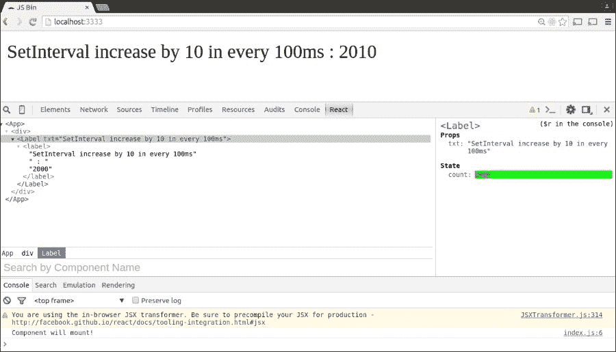
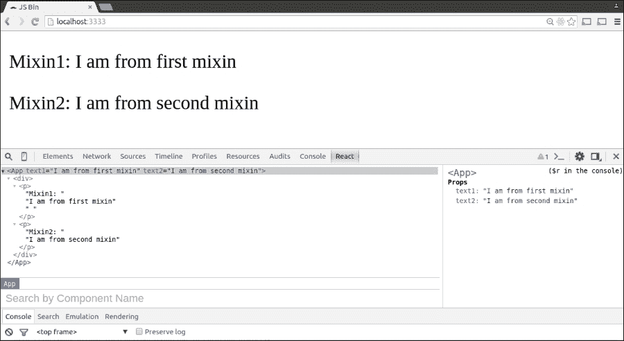
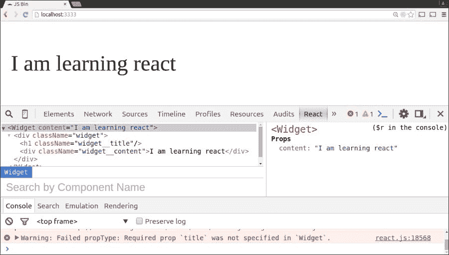
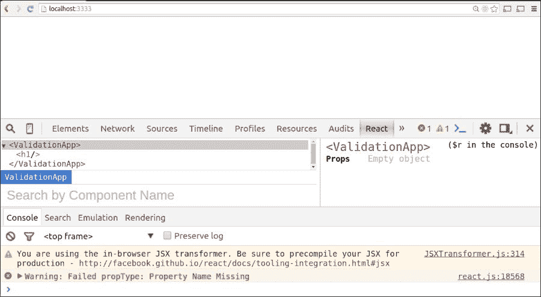
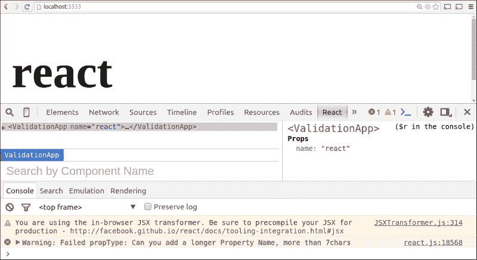

# 第七章：使你的组件可重用

到目前为止，我们已经深入探讨了 React 组件的生命周期、属性、状态以及与 React 0.1.13 和未来版本相关的 ECMAScript。在本章中，我们还将看到如何在 React 应用程序中编写可重用的组件/代码。React 中的这些可重用组件被称为混合。此外，我们将探讨如何验证 React 组件的属性。

本章将涵盖以下主题：

+   理解混合

+   ECMA6 中的高阶组件（因为混合在 ECMA6 中不受支持）

+   React 应用程序中的不同类型的验证

+   React 组件和应用程序架构的结构

# 理解混合

混合（可重用组件）通常是那些在多个地方使用的 React 组件，因此可以重用。通常，设计元素，如按钮、布局组件、表单字段或任何使用超过一次的代码逻辑/计算，都被提取到名为混合的代码中。因此，混合通过作为助手来帮助我们向现有的 React 组件中添加一些额外的功能。

### 注意

与前几章一样，index.html 的内容保持不变。只有相应的 js（包含 React 组件）的内容发生变化。

## 通过示例探索混合

在此示例中，我们为 window 全局对象设置了每 100 毫秒的间隔：

index.html 的内容：

```js
<!DOCTYPE html>
            <html>
<head>
<script src="img/react.min.js"></script>
<script src="img/JSXTransformer.js"></script>
  <script src="img/react-dom.js"></script>

<meta charset="utf-8">
  <title>JS Bin</title>
</head>
<body>
  <div id="myReactContainer">
        <script type="text/jsx", src="img/index.js"></script>
  </div>
</body>
</html>
```

index.js 的内容：

```js
//Defining the Mixin
 . var ReactMixin = {
 . getInitialState:function(){
 .    return {count:0};
 .  },

// componentWillMount, a  lifecycle method, is added as a part of the Mixin.
 . componentWillMount:function(){
    console.log('Component will mount!');
  },
  increaseCountBy10: function(){
    this.setState({count: this.state.count+10})
 }
  }

//This method displays text to display
     var App = React.createClass({
  render:function(){
   return (
     <div>
     <Label txt="SetInterval increase by 10 in every 100ms" />
        </div>
     )
  }
  });

// React component (<Label />), called from the <App /> component.
  var Label = React.createClass({

// Mixins are called using the keyword Mixin, followed by the Mixin name within an array.
  mixins:[ReactMixin],
  componentWillMount:function(){

    //setting the interval to 100ms
       interval = setInterval(this.increaseCountBy10,100);
  },

//The function is called for the second time to update the interval every 100ms
  componentWillUnMount:function(){
  clearInterval(this.interval);
  },
  render:function(){
   return <label>{this.props.txt} : {this.state.count}</label>
  }
 });

ReactDOM.render(<App />, document.getElementById('myReactContainer'));
```

### 注意

从应用程序的根目录运行 httpserver：

```js
doel@doel-Vostro-3500:~/reactjs/ch7_mixins_validationProps/app1_mixin$ httpster
Starting HTTPster v1.0.1 on port 3333 from /home/doel/reactjs/ch7_mixins_validationProps/app1_mixin

```

在打开`localhost:3333`时，以下是对此代码的输出：



使用生命周期方法的混合的应用程序截图

执行代码的解释：

混合（Mixin）不过是一个可以被 React 组件后来重用的 JavaScript 对象。我们首先定义混合（Mixin）。

`componentWillMount`是一个生命周期方法，它作为混合的一部分被添加。稍后，当混合从 React 组件中调用时，可以在网页的开发者工具部分底部看到`console.log`的日志，以展示**Component Will Mount**。

我们添加了一个典型的 React 组件（`<App />`），它调用了`<Label />`组件。它是一个渲染函数，用于显示标签上呈现的文本。App 组件可以有多个 React 组件，这些组件将内部调用不同的 React 组件。

在下一个示例中，我们将看到这样的例子。

React 组件`(<Label />)`是从`<App />`组件中调用的。它使用了 React 混合（ReactMixin）。

行内混合：[ReactMixin]，React 中的混合（Mixins）是通过关键字 Mixin 后跟混合名称（在本例中为 ReactMixin），在数组内调用。我们可以定义多个混合，作为 JavaScript 对象。所有这些独立的混合都可以从单个 React 组件（每个混合代表数组中的一个单独元素）中调用。

我们将在本章后面探索这样一个例子，其中包含多个混合。

然后我们添加`setInterval()`函数

+   `setInterval()`方法是 JavaScript 中的 window 函数。

+   它被声明为`window.setInterval(function, milliseconds)`。

+   尽管这是一个基于 window 对象的方法，但不需要在 window 对象上调用`setInterval()`方法，例如在之前提到的代码中。它可以不带 window 前缀调用。

+   第一个参数是执行的功能（`this.increaseCountBy10`）。

+   第二个参数是每个函数执行之间的时间间隔，`this.increaseCountBy10`。在这种情况下，间隔设置为`100ms`。

在之前提到的代码中，生命周期方法（`componentWillMount`）被第二次调用。第一次调用是在 Mixins 体内，它记录了日志中的`Component Will Mount`。

第二次调用是在 React 组件（`<Label />`）内部。由于第二次调用，`setInterval()`方法将值从`0`（最初将计数设置为`0`）增加到`10`，每次增加间隔为`100`毫秒。

### 注意

查看 Facebook 文档[`facebook.github.io/react/docs/reusable-components.html`](https://facebook.github.io/react/docs/reusable-components.html)：

"Mixins 的一个优点是，如果一个组件正在使用多个 Mixins，并且几个 Mixins 定义了相同的生命周期方法（即几个 Mixins 想在组件销毁时进行一些清理），所有生命周期方法都将得到保证被调用。Mixins 上定义的方法按照 Mixins 列出的顺序运行，然后是组件上的方法调用。"

在下一节中，我们将看到 Mixins 的另一个示例：

```js
Calling Multiple Mixins from a single React Component
```

现在，我们将看到另一个示例，其中多个 Mixins 将从单个 React 组件中调用。以下代码被声明：

首先，我们将声明两个 react Mixins：

```js
var ReactMixin1= {

     getDefaultProps: function () {

        return {text1: "I am from first Mixin"};

    }

};

var ReactMixin2 = {

      getDefaultProps: function () {

        return {text2: "I am from second Mixin"};

    }

};
```

在代码的第二部分，我们将从 react 组件`<App />`中调用两个 React Mixins：

```js
var App = React.createClass({

  Mixins:[ReactMixin, ReactMixin2],

  render: function () {

    return (

    <div>

        <p>Mixin1: {this.props.text1} </p>

        <p>Mixin2: {this.props.text2}</p>

    </div>

    );

  }

});

ReactDOM.render(<App />, document.getElementById('myReactContainer'));
\\
```

直接从应用程序根目录执行 httpster 命令，就像之前一样，以查看两个 Mixins 的输出：



使用多个 Mixins 的应用程序截图

注意以下内容：

+   在 Mixins 中相同的属性名，例如，**text**，在这种情况下，将引发错误

+   不同 Mixins 中的相同方法名将引发错误

+   相同的生命周期方法可以在 Mixins 和 React 组件内部调用。这些生命周期方法的执行顺序是 Mixins，然后是 React 组件。

+   如果在多个 Mixins 中调用相同生命周期方法，则执行顺序是 Mixins 在数组中调用的顺序（从低到高索引）。

## Mixins 中的高阶组件

在 ReactJS 中使用 ES6，Mixins 不再被支持。取而代之的是，他们引入了高阶组件。

这些高阶组件在 Relay 框架中被广泛使用，Relay 是由 Facebook 发布的一个完整的基于 React 的框架。高阶组件封装了子 UI 组件。因此，当这些组件被调用时，它们会首先执行其查询，从而渲染子 UI 组件。当查询传递时，数据会从子组件以 props 的形式传递给高阶组件。

# 验证

**验证** 是任何处理用户输入的应用程序的一个基本组成部分。在 ReactJS 中，库提供了一些验证，使得开发者能够验证接收到的数据。

在 React 应用程序中，数据大多以属性（props）的形式接收。各种验证器从 `React.PropTypes` 中导出。如果发生验证错误，它将出现在 JavaScript 控制台中。由于性能原因，只有开发模式下才会因为验证检查而发生此类错误。

查看 Facebook ReactJS 开发团队文档 [`facebook.github.io/react/docs/reusable-components.html#prop-validation`](https://facebook.github.io/react/docs/reusable-components.html#prop-validation)。以下是一些验证器的示例：

```js
React.createClass({
  propTypes: {
    // You can declare that a prop is a specific JS primitive. By default, these
    // are all optional.
    optionalArray: React.PropTypes.array,
    optionalBool: React.PropTypes.bool,
    optionalFunc: React.PropTypes.func,
    optionalNumber: React.PropTypes.number,
    optionalObject: React.PropTypes.object,
    optionalString: React.PropTypes.string,

    // Anything that can be rendered: numbers, strings, elements or an array
    // (or fragment) containing these types.
    optionalNode: React.PropTypes.node,

    // A React element.
    optionalElement: React.PropTypes.element,

    // You can also declare that a prop is an instance of a class. This uses
    // JS's instanceof operator.
    optionalMessage: React.PropTypes.instanceOf(Message),

    // You can ensure that your prop is limited to specific values by treating
    // it as an enum.
    optionalEnum: React.PropTypes.oneOf(['News', 'Photos']),

    // An object that could be one of many types
    optionalUnion: React.PropTypes.oneOfType([
      React.PropTypes.string,
      React.PropTypes.number,
      React.PropTypes.instanceOf(Message)
    ]),

    // An array of a certain type
    optionalArrayOf: React.PropTypes.arrayOf(React.PropTypes.number),

    // An object with property values of a certain type
    optionalObjectOf: React.PropTypes.objectOf(React.PropTypes.number),

    // An object taking on a particular shape
    optionalObjectWithShape: React.PropTypes.shape({
      color: React.PropTypes.string,
      fontSize: React.PropTypes.number
    }),

    // You can chain any of the above with `isRequired` to make sure a warning
    // is shown if the prop isn't provided.
    requiredFunc: React.PropTypes.func.isRequired,

    // A value of any data type
    requiredAny: React.PropTypes.any.isRequired,

    // You can also specify a custom validator. It should return an Error
    // object if the validation fails. Don't `console.warn` or throw, as this
    // won't work inside `oneOfType`.
    customProp: function(props, propName, componentName) {
      if (!/matchme/.test(props[propName])) {
        return new Error('Validation failed!');
      }
    }
  },
  /* ... */
});
```

## 使用 isRequired 验证器的示例

`index.html` 页面。使用不同的 JS 页面来检查使用的不同版本的验证：

```js
<!DOCTYPE html>
<html>
<head>
<script src="img/react.js"></script>
<script src="img/JSXTransformer.js"></script>
  <script src="img/react-dom.js"></script>
  <script type="text/jsx", src="img/index4.js"></script>

<meta charset="utf-8">
  <title>JS Bin</title>
</head>
<body>
  <div id="myReactContainer">
        <script type="text/jsx", src="img/index.js"></script>
  </div>
</body>
</html>
```

如验证器名称所示，`isRequired` 验证器确保 React 组件的属性始终存在。否则，它将在 JS 控制台中抛出错误。`React.PropTypes.{foo}` 属性是 JavaScript 函数，它们内部检查一个 prop 是否有效。当 prop 有效时，它将返回 `null`，但当 prop 无效时，它将返回一个错误。在 第四章 中，我们深入探讨了 ES6。在下一个示例中，我们将使用 ES6 语法：

```js
"use strict"

class App extends React.Component {

  render () {

    return (

      <div className="app">

        <h1 ref="title" className="app__title"></h1>

        <div ref="content" className="widget__content">{this.props.content}</div>

      </div>

    )

  }

}

App.propTypes = {

  title: React.PropTypes.string.isRequired,

  content: React.PropTypes.node.isRequired

}

ReactDOM.render(<App content="I am learning react"/>,document.getElementById('myReactContainer'));
```

### 注意

在你的应用根目录下运行 httpster，以便在浏览器中的 `localhost:3333` 看到输出。

输出将如下所示：



应用程序截图——React 组件 prop 中的 isRequired 验证

从 ES6 视角来看，关于之前提到的代码的一些要点：

`use strict` 已经被用来选择性地启用 JavaScript 的一个受限版本。我们使用它是因为我们用 let 代替了 var。`use strict` 允许将组件置于一个 `strict` 运行环境中，并阻止某些操作被执行，同时抛出更多的异常。

let 声明变量，其作用域限制在使用的块、语句或表达式中。

详细信息请查看 [`developer.mozilla.org/en-US/docs/Web/JavaScript/Reference/`](https://developer.mozilla.org/en-US/docs/Web/JavaScript/Reference/)。

## 使用自定义验证器的示例

以下是在使用自定义验证时通常使用的模板：

```js
error = propTypespropName; 
```

让我们通过一个自己的例子来演示，使用自定义错误消息，并使用这些验证之一，看看它在 JavaScript 控制台中的验证情况：

```js
var ValidationApp = React.createClass({

  propTypes: {

    name: function(props, propName,componentName){

      if(!(propName in props))  {

        throw new Error("Property Name Missing ")

      }
  },

  render:function(){
    return <h1>{this.props.name}</h1>
  }
});
 ReactDOM.render(<ValidationApp />, document.getElementById('myReactContainer')); //missing prop name
```

### 注意

从你的应用程序根目录运行 httpster，以便在你的浏览器中的 `localhost:3333` 看到输出

以下代码的输出显示在本截图：



应用程序截图——React 组件属性中的自定义验证

我们可以在属性（名称）中添加更多的验证，如下所示：

```js
var ValidationApp = React.createClass({

  propTypes: {

    name: function(props, propName,componentName){

      if(!(propName in props))  {

        throw new Error("Property Name Missing ")

      }

 if(props[propName].length < 7) {

 throw new Error("Can you add a longer Property Name, more than 7chars")

 }

 }

  },

  render:function(){

    return <h1>{this.props.name}</h1>

  }

});

// ReactDOM.render(<ValidationApp />, document.getElementById('myReactContainer')); //missing prop name

ReactDOM.render(<ValidationApp name="react" />, document.getElementById('myReactContainer')); //prop length should be more than 7 chars

```

### 注意

从你的应用程序根目录运行 httpster，以便在你的浏览器中的 `localhost:3333` 看到输出

以下代码的输出如下所示：



应用程序截图——React 组件属性中的验证

因此，如果我们传递的名称属性超过七个字符，那么在预期的 JS 控制台中将不会有错误。

# 组件的结构

现在我们已经对 ReactJS 进行了相当多的探索，你心中可能会有关于如何架构一个 React 组件或更广泛地说是一个 React 应用程序的问题。还没有设定任何基本规则，这在基于 ReactJS 编写应用程序时是理想的。然而，如果我们深入研究 Facebook 文档团队提供的教程，超链接 [`facebook.github.io/react/docs/tutorial.html`](https://facebook.github.io/react/docs/tutorial.html)，我们将能够理解他们在编写这样的应用程序时所使用的底层方式。

让我们先探索一下组件通常是如何结构的：

1.  组件 `declaredData` 是在需要时从服务器获取的 [如果需要]。

1.  组件的 `propTypes` 已声明 [用于验证]。

1.  组件生命周期方法 [`componentWillMount`、`componentDidMount`、`componentDidUpdate`、`componentWillUnmount` 等等] 已定义。

1.  在每个生命周期方法中，这些方法的功能要么是声明的，要么是从另一个为特定任务明确定义的 JS 函数内部调用的。需要记住的是，之前提到的生命周期方法不是在应用程序中同时或任何情况下都必须使用。

1.  必须存在于任何 React 组件中的渲染方法。因此，任何基于 React 的应用程序的结构方式因应用而异。尽管没有最佳方式，但像任何其他应用程序一样，建议将代码分块以遵循关注点分离。我们应该将 React 视图、组件和数据分开。一个组件目录可以根据需要调用其他子组件，从而提高代码的可读性和可测试性。

由于 React 是一个开源的 JavaScript 库，因此有各种开源网站和开发者每天都在为此库工作，以增强和调整库，以满足需求。

对于一个使用 ReactJS 库的应用程序，通常根据其功能将视图（React 视图）分开（例如，主页、管理页面和产品目录）。在每个视图的子文件夹中，你可以添加 test.js 文件，或者你可以将所有与测试相关的文件放在同一个 tests 文件夹下。如果你需要一些应该跨其他组件共享的 react 视图，你可以将这些相关文件放在 shared/lib 文件夹下。

# 摘要

在本章中，我们探讨了如何在 ReactJS 中开发可重用组件（在 ES6 实现之前，使用 Mixins）。我们还了解了高阶组件，这些组件在 ReactJS 的后续版本（从 0.13 版开始）中被使用，支持 ES6 但不支持 Mixins。验证是任何应用程序的一个基本组成部分，尤其是那些使用用户输入（即表单输入）的应用程序。我们探讨了 ReactJS 如何处理验证，以及我们如何使用自定义验证。我们还概述了 react 组件的结构。在下一章中，我们将处理 React 应用程序的测试。
