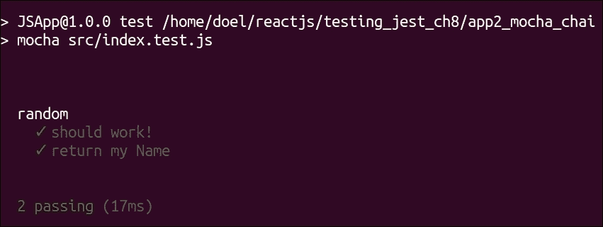
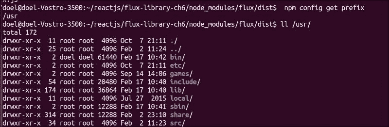
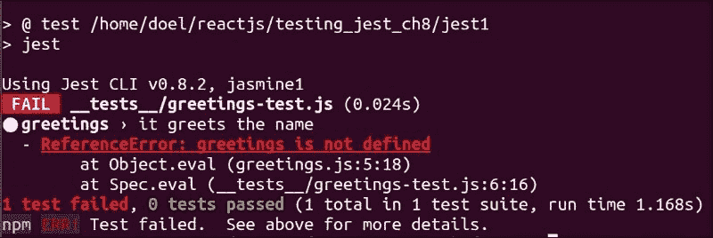
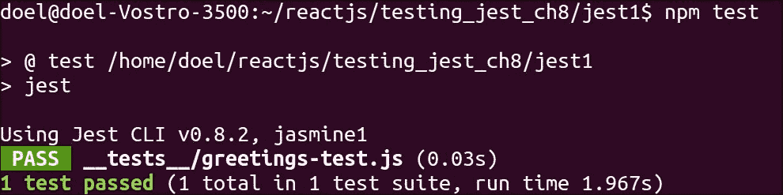
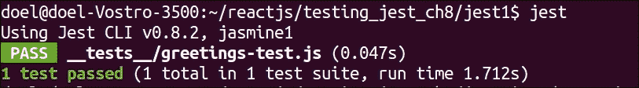
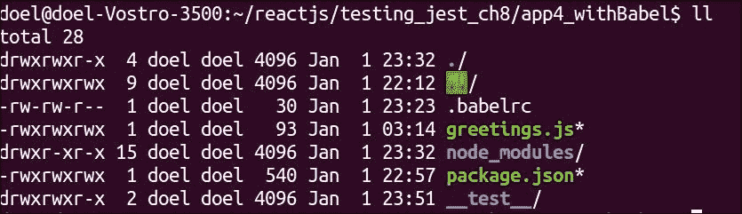
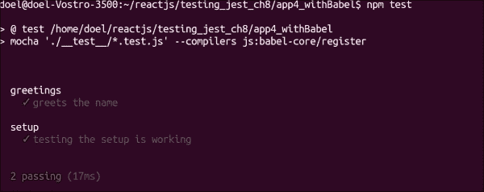
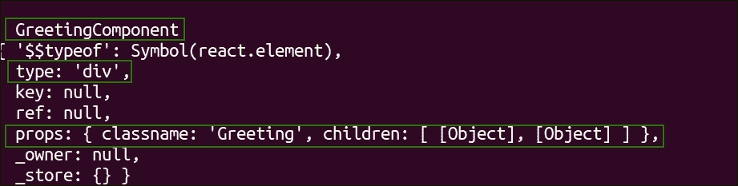
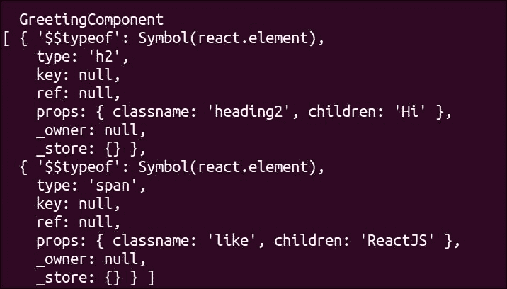

# 第八章. 测试 React 组件

到目前为止，我们已经探讨了 React 的组件生命周期、属性、状态、验证以及与 React 0.1.13 和未来版本相关的 ECMAScript。在本章中，我们将探讨 JavaScript 和 ReactJS 相关内容的测试。首先，我们将通过不同的 JavaScript 测试框架来整体了解测试，以及如何运行测试，然后测试使用 ReactJS 库构建的视图。

本章将涵盖以下内容：

+   使用 Chai 和 Mocha 在 JavaScript 中进行测试

+   使用 ReactTestUtils 测试 React 组件

+   探索 Jest

+   使用 Expect、Mocha 和浅渲染测试基于 React 的应用

在测试 JavaScript 时，你可以混合匹配各种方法。让我们简要概述一下各种事物，如框架、断言库和测试工具。这里给出的列表并不全面，详细涵盖所有这些内容超出了本书的范围。

**Mocha**和**Jasmine**是测试框架。它们可以与各种测试断言库一起使用，如下所示：

+   `should.js`是一个断言库。它是框架无关的，并且从 IE9 及以上版本工作。有关库的详细信息，请参阅[`www.npmjs.com/package/should`](https://www.npmjs.com/package/should)。

+   `chaijs`也是一个断言库，其中我们添加插件。它也适用于测试框架。有关库的详细信息，请在线查阅[`chaijs.com/karma`](http://chaijs.com/karma)。它是一个 JavaScript 测试工具，可以测试浏览器中的 JavaScript 代码。它是框架无关的（可以用于运行 Mocha、Jasmine、Qunit 等）。详细信息请参阅[`www.npmjs.com/package/karma`](https://www.npmjs.com/package/karma)。

应当记住，karma 既不是像 Jasmine 或 Mocha 这样的 JavaScript 框架，也不是像`chaijs`或`should.js`这样的断言库。因此，我们应该根据需要使用断言库和框架，以及 karma 一起启动 HTTP 服务器，以便我们可以在浏览器中测试 JS 代码。

**Jest**也是 Jasmine 框架上的一个框架。Facebook 开发者团队建议使用 Jest 来测试基于 React 的应用。根据 Jest 网站([`facebook.github.io/jest/`](https://facebook.github.io/jest/))，以下是使用 Jest 而不是 vanilla jasmine 进行测试的一些优点：

+   Jest 在 Jasmine 之上提供了多个层级

+   它会自动搜索并找到要执行的测试

+   在你运行测试时，它会为你模拟依赖

+   它并行运行测试，因此可以更快地完成执行

+   它允许你同步测试异步代码

+   它允许你通过 jsdom 的模拟 DOM 实现，在命令行上运行测试

# 使用 Chai 和 Mocha 在 JavaScript 中进行测试

如前所述，为了编写 React 代码的测试用例，我们将安装一些测试库来运行测试和编写断言。让我们了解 Chai 断言库和 Mocha 测试框架的设置。我们需要使用 `npm` 安装这些库。

在终端输入：

```js
npm i -D mocha chai

```

### 注意

`install` 简称：`i`

`devDependencies` 简称：`D`（该包仅在开发环境中安装）

在通过之前提到的命令安装了 Chai 和 Mocha 库之后，它们可以在 `node_modules` 目录下找到。

我们需要在 `package.json` 文件中添加 Mocha 和 Chai 的条目。

**package.json 代码**

```js
{
  "name": "JSApp",
  "version": "1.0.0",
  "description": "Get random numbers",
  "main": "index.js",
 "scripts": {
 "test": "mocha test.js"
 },
 "devDependencies": {
 "chai": "3.2.0",
 "mocha": "2.2.5"
 }
}
```

根据 [`docs.nodejitsu.com/articles/getting-started/npm/what-is-the-file-package-json`](https://docs.nodejitsu.com/articles/getting-started/npm/what-is-the-file-package-json)

所有 `npm` 包都包含一个名为 `package.json` 的文件。此文件通常位于项目根目录。此文件包含与项目相关的所有元数据。`package.json` 文件用于向 `npm` 提供信息，从而使其能够识别项目以及有效地处理项目的依赖项。

+   `name`：这表示应用程序的名称。

+   `version`：这是应用程序的版本。

+   `description`：这是应用程序的一般描述。

+   `main`：这是主 JavaScript 文件，它可能内部调用其他 JS 文件。在这个例子中，是 `index.js` 文件。

+   `scripts`：这是在调用 `npm start` 时要执行的脚本。它应该执行测试（mocha `test.js` 文件）。

+   `devDependencies`：这些是在与 `package.json` 相同的目录中安装的包，除非传递了 `–production` 标志。除非传递了 `–dev` 选项，否则这些包不会安装在任何其他目录。

添加一个 `test.js` 文件。为了检查设置是否正常工作，我们添加了一个简单的单个测试断言。

```js
Test.js file code
var expect = require('chai').expect
, name = 'my Name';

var random = require('./index');

describe('random', function() {
  it('should work!', function() {
    expect(false).to.be.false;
  });

  it ('return my Name', function() {
        expect(name).to.be.a('string');
        expect(name).to.equal('my Name');
        expect(name).to.have.length(7);
        })
});
```

### 注意

`assertions` 是从 Chai 调用的。

`describe` 是从 Mocha 框架中调用来描述测试的。

现在我们运行测试，从应用程序的根目录在终端中，如下所示：

```js
npm test

```



使用 Mocha 和 Chai 设置的控制台截图

# 使用 ReactTestUtils 进行测试

ReactTestUtils 用于测试基于 React 的组件。它可以模拟 ReactJS 支持的所有基于 JavaScript 的事件。文档可以在 Facebook 开发者网站上找到（[`facebook.github.io/react/docs/test-utils.html`](https://facebook.github.io/react/docs/test-utils.html)）。

以下是对模拟函数的代码：

```js
Simulate.{eventName}(
  DOMElement element,
  [object eventData]
)
```

## 安装 React 和 JSX

如前所述，在安装 Chai 和 mocha 时，我们在此安装 React 和 JSX 特定的测试工具（ReactTestUtils），以便简化我们的任务。让我们借助一些基于 React 的组件并刺激它们来测试行为和功能。

以下是一个此类代码的示例。

我们需要在终端使用以下代码通过`npm`安装`jest`包：

```js
sudo npm install jest-cli –save-dev

```

在需要安装 node 包的机器/服务器上，需要 sudo/root 访问权限。这特别需要，因为 node 安装的目录。我们可以使用以下命令检查已安装的目录：

```js
npm config get prefix

```

根据这里的截图，它安装在`/usr`目录中，权限设置为 root。因此，我们需要使用`sudo`选项安装`npm`包。



`/usr`目录文件所有者/权限的控制台截图。

另一种方法是设置`/usr`目录的权限为用户，该用户可以拥有和修改目录中的文件：

```js
sudo chown -R $(whoami) $(npm config get prefix)/{lib/node_modules,bin,share}

```

让我们尝试采用**测试驱动开发**（**TDD**）的方法，即我们将创建一个失败的测试用例，然后根据实际代码来通过测试。

创建一个 JS 文件，该文件将用`hi`问候任何名字：

```js
// greeting.js

module.exports = greetings;
```

现在，让我们在名为`__test__`的目录中创建一个`test`文件：

```js
// __tests__/greeting-test.js

 jest.dontMock('../greetings');

//executed when the test runs
 describe('greetings', function() {
 it('greets the name', function() {
 var greet = require('../greetings');
 expect(greet("react")).toBe("hi react");
 });
 });
```

让我们回顾一下之前提到的代码中的 jest 属性：

+   `jest.dontMock`在这里被明确提及，因为 jest 默认会模拟一切。因此，为了测试实际代码而不进行模拟，我们需要要求 jest 不要模拟需要测试的代码（`greetings.js`）。

+   `describe('greetings', function())`每个 describe 块是测试套件，当运行测试时（`npm test`/`jest`）将被执行。一个 describe 块可以有多个测试用例。

+   `it('greets the name', function()`, 在 describe 块内阻塞实际的测试规格/用例。

为了在`_test__`目录中执行测试，我们需要有一个包含以下条目的`package.json`文件：

### 注意

在下一章中，我们将更详细地介绍打包。

下面是`package.json`文件的代码：

```js
{
  "dependencies": {
    "react": "~0.14.0",
    "react-dom": "~0.14.0"
  },
  "devDependencies": {
    "jest-cli": "⁰.8.2",
    "react-addons-test-utils": "~0.14.0"
  },
  "scripts": {
    "test": "jest"
  },
  "jest": {
    "unmockedModulePathPatterns": [
      "<rootDir>/node_modules/react",
      "<rootDir>/node_modules/react-dom",
      "<rootDir>/node_modules/react-addons-test-utils",
      "<rootDir>/node_modules/fbjs"
    ]
  }
}
```

让我们对`package.json`中的这段代码进行快速回顾。

一切准备就绪后，我们可以在终端使用以下命令运行测试：

```js
npm test

```

输出如下所示：



使用 jest 的 TDD 控制台截图，显示失败测试。

现在，让我们添加代码，以便用名字问候名字，并且测试通过：

```js
// greeting.js

function greetings(name) {
  return "hi "+name;
}
module.exports = greetings;
```

现在，当我们执行测试时，我们将看到一个通过测试用例：



使用 npm test 的 TDD 控制台截图，显示通过测试。

执行测试的另一种方法是安装`jest`并通过终端调用 jest 来执行它们：

```js
sudo npm install -g jest-cli

```

输出如下所示：



使用 jest 的 TDD 控制台截图，显示通过测试。

因此，我们可以看到使用`npm test`/`jest`中的任何一个命令，我们都会得到相同的输出。

# 下面是使用 Mocha、expect、ReactTestUtils 和 Babel 的 jest 测试套件的典型示例。

让我们看看`package.json`的典型示例，它使用以下内容：

+   Mocha 作为测试框架

+   Expect 作为一个断言库

+   ReactTestUtils 用于测试基于 React 的 JavaScript 组件

+   Babel 作为转编译器，将 ES6 代码转换为当前兼容（ES5）的 JavaScript 代码。

`package.json`文件的示例：

```js
"scripts": {
 "test": "mocha './src/**/*.test.js' --compilers js:babel-core/register",
  },
  "devDependencies": {
 "babel-core": "6.1.4",
 "babel-loader": "6.1.0",
 "babel-preset-es2015": "6.1.4",
 "babel-preset-react": "6.1.4",
 "babel-preset-stage-2": "6.1.2",
    "mocha": "2.3.3",
    "react-addons-test-utils": "0.14.3",
  }
}
```

如前例所示，在脚本对象中，我们保留测试文件，并且所有测试文件都遵循以`.test.js`扩展名结尾的约定。测试文件可以使用任何扩展名。对于从 ES6 代码编译到浏览器兼容的 JS 代码，脚本中添加了`–compiler`标签。

安装以下所有包，如`package.json`中所述：

```js
npm install babel-loader babel-preset-es2015 babel-preset-react babel-preset-stage-2 react-addons-test-utilsBabel being the transpiler, we need to add the following entry to enable the import (reserver keyword) in the following .babelrc file:

```

```js
{
    "presets": ["es2015"]
}
```

这里是转译器的定义。来源 [`en.wikipedia.org/wiki/Source-to-source_compiler`](https://en.wikipedia.org/wiki/Source-to-source_compiler)

> *"源到源编译器、转编译器或转译器是一种编译器，它接受用一种编程语言编写的程序源代码作为输入，并生成另一种编程语言的等效源代码。"*

`.babelrc`文件包含所有 Babel API 选项。以下是与测试套件设置相关的应用程序文件结构截图。详细信息可以在 Babel 文档中找到，网址为[`babeljs.io/docs/usage/babelrc/`](https://babeljs.io/docs/usage/babelrc/)。



展示典型 JS 应用程序目录结构的截图，包括 __test__、node_modules、package.json 和.babelrc

使用与之前相同的`greetings.js`文件，但在`greetings.test.js`和`index.test.js`文件中使用新的 ES6 语法进行测试，让我们测试测试套件。

**代码 __test__/greetings.test.js（使用 ES6 语法）**

```js
import expect from 'expect';
describe('greetings', () => {
   it('greets the name', () => {
     var greet = require('../greetings');
     expect(greet("react")).toBe("hi react");
   });
});
```

**代码 __test__/index.test.js（使用 ES6 语法）**

```js
import expect from 'expect';
  describe('setup',() => {
    it('testing the setup is working', () => {
      expect(true).toEqual(true);
   });
      });
```



展示使用 ES6 语法、mocha 和 babel 进行测试的截图

使用 ES6 语法和 mocha 测试框架、expect 断言库执行此测试文件，并在经过 Babel 转译后产生了与之前相同的结果。

# 使用浅渲染进行测试

**浅渲染**是在测试 React 组件时使用的一种方法，其中组件是“单层深”。这样的浅渲染测试组件具有关于返回内容的`render`方法的事实。这些组件没有附加子组件，并且不需要 DOM。

因此，在测试使用浅渲染方法时，应记住，任何具有 DOM 更改的父组件或任何已更改的子组件的更改可能需要重写测试。

让我们通过一些代码来探索这个问题。在以下示例中，我们将创建一个 React 组件（`GreetingComponent`），其中`render`方法将返回一个包含两个子元素（`h2`和`span`元素）的`div`。

`greeting.js`的代码：

```js
// greeting.js

import React from 'react';

const { div, h2, span} = React.DOM;

export default React.createClass({

  displayName: 'GreetingComponent',

  render(){

    return(

    div({classname: 'Greeting'},

      h2({classname: "heading2"}, "Hi"),

      span({classname: "like"},"ReactJs")

    )

    );

  }

});
```

让我们使用浅渲染方法为这个 React 代码编写测试。

**__test__/greeting.test.js 的代码**

```js
// Importing the necessary libraries and JavaScript code to be tested
import expect from 'expect';
import React from 'react';
import TestUtils from 'react-addons-test-utils';
import GreetingComponent from '../greetings.js';
describe('GreetingComponent', () => {
  it('should greet with the name', () => {

// Creating a shallow rendered object and stored within  renderer
    const renderer = TestUtils.createRenderer();

/*creating the react element (GreetingComponent, declared in the greeting.js code). This might be comparable to the "place" where the component to be tested is rendered. This component can respond to events and update itself
*/
    renderer.render(React.createElement(GreetingComponent));
/* method is called on the renderer (TestUtils.createRenderer()) and stored within output. We can inspect this output in the console */
    const output = renderer.getRenderOutput();
    console.log(output);
    expect(output.type).toBe('div');
```

输出值将在控制台中打印。基于此，我们可以看到相关 react 组件的不同层次和值。以下是从`console.log`输出的内容（输出）



展示在控制台中渲染输出()方法的截图。

让我们深入一层，检查以下值：`const output = renderer.getRenderOutput().props.children`。

因此，我们可以看到`GreetingComponent` React `div`元素的确切两个子元素及其类型和值：



展示在控制台中渲染输出()方法的子元素的截图。

根据输出，我们可以测试`div`元素的子元素（`h2`和`span`）如下：

```js
Code of __test__/greeting.test.js
import React from 'react';
import TestUtils from 'react-addons-test-utils';
import GreetingComponent from '../greetings.js';

describe('GreetingComponent', () => {

  it('should greet with the greeting Hi', () => {

    const renderer = TestUtils.createRenderer();
    renderer.render(React.createElement(GreetingComponent));
    const output = renderer.getRenderOutput();
    console.log(output);
    expect(output.type).toBe('div');

 expect(output.props.children[0].type).toBe('h2');
 expect(output.props.children[0].props.classname).toBe('heading2');
 expect(output.props.children[0].props.children).toBe('Hi');

  });

  it('should return the like as ReactJs', () => {

    const renderer = TestUtils.createRenderer();

    renderer.render(React.createElement(GreetingComponent));

    const output = renderer.getRenderOutput();

    console.log(output);

 expect(output.type).toBe('div');

 expect(output.props.children[1].type).toBe('span');

 expect(output.props.children[1].props.classname).toBe('like');

 expect(output.props.children[1].props.children).toBe('ReactJs');

  });

});
```

我们可以看到两个`it`块之间有若干行共同的代码。因此，我们可以将这些共同代码分离出来，并如以下所示进行重构：

```js
// __tests__/sum-test.js

//jest.dontMock('../greetings.js');

import expect from 'expect';
import React from 'react';
import TestUtils from 'react-addons-test-utils';
import GreetingComponent from '../greetings.js';

describe('GreetingComponent', () => {
  describe('Common code', () => {
    const renderer = TestUtils.createRenderer();
    renderer.render(React.createElement(GreetingComponent));
    const output = renderer.getRenderOutput();
//    console.log(renderer);
    console.log("From Common Code");
    console.log(output);

  it('should greet with the greeting Hi', () => {
//    console.log(renderer);
    console.log("h2 component");
    console.log(output);
    expect(output.props.children[0].type).toBe('h2');
  expect(output.props.children[0].props.classname).toBe('heading2');
    expect(output.props.children[0].props.children).toBe('Hi');
  });

  it('should return the like as ReactJs', () => {
//    console.log(renderer);
    console.log("span component");
    console.log(output);

    expect(output.props.children[1].type).toBe('span');

    expect(output.props.children[1].props.classname).toBe('like');

    expect(output.props.children[1].props.children).toBe('ReactJs');

  });

});

});
```

在执行代码时，我们可以使用以下命令在文件中获取输出：

```js
npm test > test_output.txt

```

以下是在`test_output.txt`文件中的输出。您可以播放并检查 React 元素的各个不同属性。每个属性的解释超出了本书的范围。但我们可以看到，所有 React 组件不过是 JavaScript 对象。


# 摘要

我们看到了如何在基于 React 的应用程序中测试不同的组件以及 JavaScript 本身。为了测试 JavaScript 代码，我们使用了 chai 和 expect 作为断言库，jasmine 和 jest 作为测试框架。为了测试 React 应用程序，我们使用了 ReactTestUtils 和浅渲染。在下一章中，你将学习关于 React 应用程序的部署过程。我们将更深入地探讨`package.json`，这是我们本章中提到的。
