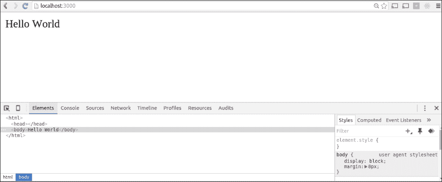
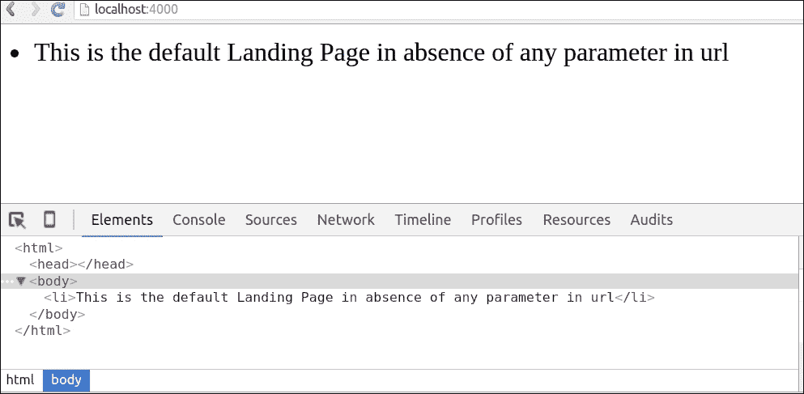
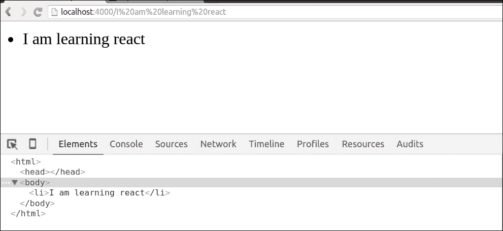
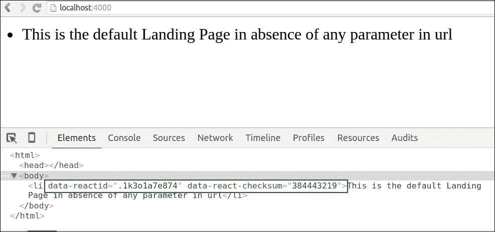

# 第十章。接下来是什么

到目前为止，我们已经从零开始构建基于 React 的 JavaScript 应用程序，将其与 Facebook Graph API 集成，深入探讨组件的各个阶段，生命周期，验证，测试和部署应用程序的所有主题。有了这些，我们已经到达了这本书的结尾，但让我们探索 React 世界的一些高级主题。

在本章中，我们将简要探讨以下主题，因为在一章中不可能详细涵盖所有内容：

+   React 中的 Ajax

+   React Router

+   服务器端渲染

+   同构应用程序

+   热重载

+   Redux React

+   Relay 和 GraphQL

+   React Native

# React 中的 Ajax

就像在任何其他应用程序中一样，在基于 React 的应用程序中，可以使用 Ajax 异步获取数据。根据 Facebook 关于使用 Ajax 从服务器加载数据的文档([`facebook.github.io/react/tips/initial-ajax.html`](https://facebook.github.io/react/tips/initial-ajax.html))，你需要记住以下提到的关键点：

+   在你的 HTML 中包含 jQuery 库：

    ```js
    <script src="img/"></script>
    ```

    由于没有单独的 Ajax 库可以从 jQuery 中引用，因此在 React 应用程序中使用 Ajax 时，必须使用整个 jQuery，这会导致下载 jQuery 的压缩版本，从而大大减少加载时间。

    在`componentDidMount`的生命周期阶段加载数据。此方法在客户端的生命周期中只发生一次，并且在这个阶段可以访问任何子组件。建议在此阶段执行任何外部 js 库或使用 Ajax 加载数据。

+   `isMounted`方法用于检查组件是否已挂载在 DOM 中。尽管这个方法在`setState()`之前与 Ajax 一起使用，但在使用 ES6 语法（使用`React.component`）时，这个方法将被弃用，并且可能在未来的 React 版本中完全删除。请参阅[`facebook.github.io/react/docs/component-api.html`](https://facebook.github.io/react/docs/component-api.html)。

下面是`index.html`的代码：

```js
<!DOCTYPE html>
<html>
<head>
<script src="img/react.min.js"></script>
<script src="img/JSXTransformer.js"></script>
  <script src="img/react-dom.js"></script>
<script src="img/"></script>
<meta charset="utf-8">
  <title>JS Bin</title>
</head>
<body>
  <div id="app">
        <script type="text/jsx", src="img/index.js"></script>
  </div>
</body>
</html>
```

以下为`index.js`的代码：

```js
var GithubUser = React.createClass({
  getInitialState: function() {
    return {
      username: '',
      user_url: '' 
    };
  },

 componentDidMount: function() {
 $.get(this.props.source, function(result) {
 console.log(result);
 var user = result;
 if (this.isMounted()) {
 this.setState({
 username: user.login,
 user_url: user.html_url
 });
 }
 }.bind(this));
 },

  render: function() {
    return (
      <div>
        {this.state.username}'s last gist is
        <a href={this.state.user_url}>here</a>.
      </div>
    );
  }
});

ReactDOM.render(
  <User source="https://api.github.com/users/doel" />,
  document.getElementById('app')
);
```


使用 Ajax 的 React ([`facebook.github.io/react/tips/initial-ajax.html`](https://facebook.github.io/react/tips/initial-ajax.html))

# React Router

React Router 是基于 React 库的库，它有助于轻松快速地路由具有多个页面的应用程序。尽管在没有 React-router 的情况下可能构建这样的应用程序流程，但随着应用程序的增长，拥有许多页面，识别页面之间的父子关系变得繁琐。这就是 React-router 发挥作用的地方，它确定了如何构建嵌套 UI。

来源：

+   [`github.com/reactjs/react-router`](https://github.com/reactjs/react-router)

+   [`www.npmjs.com/package/react-router`](https://www.npmjs.com/package/react-router)

# 服务器端渲染

ReactJS 的服务器端渲染是通过 JavaScript（NodeJS 或 io.js）完成的。这种方法实际上在服务器端预先渲染 React 组件的初始状态。因此，它有助于快速渲染网页，因为用户可以在客户端的 JavaScript 完成加载之前看到网页。

然而，这种渲染方式不适用于那些需要从服务器向客户端传输大量数据的应用程序，这可能会减慢页面加载速度。在这种情况下，我们可以使用分页或分块批量加载数据，这样不会减慢页面加载速度，但可以在特定的时间间隔内从服务器端获取。

React API 的以下两种方法提供了服务器端渲染的骨干（[`facebook.github.io/react/docs/top-level-api.html`](https://facebook.github.io/react/docs/top-level-api.html)）。

## ReactDOMServer

`react-dom/server` 包允许您在服务器上渲染您的组件。

`ReactDOMServer.renderToString` 方法返回一个字符串。它生成两个额外的 DOM 属性—`data-React-id` 和 `data-React-checksum`—这些属性由 ReactJS 库内部使用。

此方法将 `ReactElement` 的元素渲染到视图的初始 HTML 中，并返回一个 HTML 字符串。

应仅在服务器端渲染和服务器端使用。

在初始页面加载期间，从服务器向客户端发送此方法会导致页面加载速度更快，并启用针对 **搜索引擎优化**（**SEO**）的网页抓取。

当 `ReactDOM.render()` 被调用到任何先前节点时，React 将在这些节点上附加事件处理器，从而加快页面加载速度。

语法是：

```js
string renderToString(ReactElement element)
```

`ReactDOMServer.renderToStaticMarkup` 方法与 `renderToString` 类似。

它主要用于生成静态页面。

语法是：

```js
string renderToStaticMarkup(ReactElement element)
```

为了说明 ReactJS 服务器端渲染的示例，我们可以在服务器端使用 `express`（NodeJS 应用程序的简约型网络框架）。

+   `npm update`

+   `npm install express`

+   `npm init`：这将生成一个 `package.json` 文件

将稍后提到的内容添加到 `index.js` 文件中，以使用 express 在端口 `3000` 上启动一个简单的网络应用程序。相同的示例可以在 `node_modules/express` 目录的 readme 文件中找到：

```js
var express = require('express');
//....Initialise the app variable requiring the express.
var app = express();

/* Denotes the basic routing by the express server.  */
app.get('/', function (request, response) {

  response.send('Hello World');

})

//  The following code will make the app listen in your localhost, i port 3000
app.listen(3000);
```

我们首先声明应用程序为 express 的一个实例。

我们使用 express 服务器来表示基本路由。在这个例子中，express 实例（app）正在使用 `GET` HTTP 方法。因此，当 `app.get` 调用默认路径（`/`）或服务器上的任何路径时，第三个参数作为 HANDLER，应该当路由匹配时向客户端（浏览器）发送响应 `Hello World`。

应用程序在端口 `3000` 上运行。您可以根据需要运行应用程序在任何端口上。

使用 node 命令在 express 文件上执行应用程序：`

```js
node index.js

```

使用 express，我们现在可以看到 ReactJS 服务器端渲染的示例：

+   在您的应用程序目录中，执行以下命令来下载 express：

    ```js
    npm install react express

    ```

+   从 `express.js` 文件中，我们将调用 React 组件

这是创建 `ReactComponent` 的代码，不使用 JSX：

`ReactComponent.js` 文件：

```js
var React = require('react')

var ReactComponent = React.createClass({

  render:function(){

 return React.createElement('li', null, this.props.argument)

  }

});

module.exports = ReactComponent;
```

在终端中从您的应用程序根目录运行以下命令 `node index.js` 来启动 express 后，我们将在浏览器中的 `localhost:3000` 看到以下截图。



Express JS 简单应用程序

这里是对之前提到的代码的解释。

`createElement` 是 React 的主要类型，它有四个属性（`types`、`properties`、`keys`、`ref`）。之前提到的突出显示的代码意味着它将创建一个类型为列表（`li`）的 React 元素，它没有任何属性，但将从 React 渲染组件的属性（其键名为`argument`）传递值。

根据 Facebook 文档（[`facebook.github.io/react/docs/top-level-api.html`](https://facebook.github.io/react/docs/top-level-api.html)）中的 React API，关于 `renderToStaticMarkup` 的突出显示代码。

```js
string renderToStaticMarkup(ReactElement element),
```

> *"类似于 `renderToString`，但这个不会创建 React 内部使用的额外 DOM 属性，如 `data-react-id`。如果您想将 React 用作简单的静态页面生成器，移除这些额外属性可以节省大量字节。"*

`renderToString` 将 `ReactElement` 渲染为其初始 HTML。这应该在服务器上使用。React 将返回一个 HTML 字符串。您可以使用此方法在服务器上生成 HTML，并在初始请求中发送标记，以加快页面加载速度，并允许搜索引擎为了 SEO 目的抓取您的页面。

如果您在已经具有此服务器端渲染标记的节点上调用 `ReactDOM.render()`，React 将保留它，并且只附加事件处理器，这样您就可以拥有非常快速的首次加载体验。

`express.js` 文件的代码如下：

```js
var express = require('express');

var React = require('react');

var ReactComponent = React.createFactory(require('./ReactComponent'));

var app = express();

function landingPage(request, response){

  var argument = request.params.argument || 'This is the default Landing Page in absence of any parameter in url';

  var reactComponent = ReactComponent({argument:argument});

 response.send(React.renderToStaticMarkup(reactComponent));

}

app.get('', landingPage);

app.get('/:argument', landingPage)

app.listen(4000)
```

在终端中从您的应用程序根目录运行以下命令 `node index.js` 来启动 express 后，我们将在浏览器中的 `localhost:4000` 看到以下截图。



这是应用程序的截图，显示了 React 服务器端渲染的默认页面。正如我们所见，应用程序监听的端口是 `4000`。

在动态路由的情况下，这是 React 服务器端渲染的截图，显示了其他页面。



如前所述，如果我们使用 `renderToString` 而不是 `renderToStaticMarkup`，我们可以在 React 组件中看到两个属性，例如 `data-react-id` 和 `data-react-checksum`。

`data-react-id`：是 ReactJS 库用来在 DOM 中特定识别其组件的自定义数据属性。它可以在客户端或服务器端存在，而服务器端存在的 ID 以点开头，后面跟一些字母和数字，客户端侧的 ID 仅是数字。

以下示例显示了早期的方法`rederToString()`：

```js
function landingPage(request, response){

  var argument = request.params.argument || 'This is the default Landing Page in absence of any parameter in url';

  var reactComponent = ReactComponent({argument:argument});

 response.send(React.renderToString(reactComponent));

}
```

重新运行 express 并应用上述更改，将在浏览器中的`localhost:4000`渲染以下内容，如以下截图所示。



应用程序的截图，使用服务器端渲染的 React，采用`renderToString`方法。

总结来说，我们可以看到 React-router 是一个能够在服务器端和客户端（浏览器）运行的库。为了使用服务器端渲染，我们使用`renderToString()`方法和路由。在请求-响应周期中，服务器端的 React-router 与请求的路由匹配，并使用 React 库的`renderToString()`方法将正确的路由从服务器渲染到客户端（浏览器）。

# 同构应用程序

**同构 JavaScript 应用程序**是指 JavaScript 同时在服务器和客户端使用的情况。因此，相同的 React 组件可以在客户端以及服务器端使用。构建此类应用程序的一些优点包括：

+   当需要时，根据应用程序状态在服务器端渲染视图。

    +   服务器将以与客户端相同的方式渲染应用程序，以增加一致性。

+   如果浏览器中的 JavaScript 无法正常工作，应用程序仍然可以工作，因为服务器端也存在相同的 JavaScript。您需要将操作发送到服务器以获得相同的结果。

# 热重载

**热重载**是 JavaScript 世界中的一个术语，用来指代浏览器中的实时更改，而无需刷新浏览器。在 React 生态系统中，React Hot Loader 被广泛用于相同的目的。

React Hot Loader 是一个针对 Webpack 的插件，它可以在浏览器中实现即时和实时的更改，而不会丢失状态。在编辑 React 组件和函数时，这些更改可以可见，就像 React 的`LiveReload`一样。

作者（Dan Abramov）在这里讨论了 React Hot Loader 第一版本的局限性[`medium.com/@dan_abramov/the-death-of-react-hot-loader-765fa791d7c4#.fc78lady9`](https://medium.com/@dan_abramov/the-death-of-react-hot-loader-765fa791d7c4#.fc78lady9)。项目的详细信息可以在[`gaearon.github.io/react-hot-loader/`](https://gaearon.github.io/react-hot-loader/)找到。

# Redux React

**Redux** 是由 Dan Abramov 设计的 JavaScript 库，它帮助 JavaScript 应用程序的状态容器化。随着应用程序的增长，由于模型和视图之间需要双向状态可更新性的要求，复杂性也随之增加。Redux 的出现是为了解决这种扭曲的复杂状态变更和异步问题。因此，它将自己定义为尝试使状态变更可预测。

它可以与 React 或任何其他视图库一起使用。在使用 Redux 时需要记住的一些关键点如下：

+   JavaScript 应用程序的状态完全存储在同一个对象树中的单个存储中。因此，即使应用程序增长，调试也更容易。由于整个应用程序状态都在一个地方，开发阶段也更快。状态是只读的；状态中只有获取器，没有设置器，因为你无法写入这个存储。

+   对状态的任何更改都只能通过发出一个*动作*来完成。动作不过是一个描述发生变化的对象。这些动作对象可以被记录、序列化、存储，并在以后重新播放以进行调试。除了这些动作之外，没有任何视图或网络回调可以更改状态。这种限制使得状态变更可预测，无需寻找任何瞬时的隐藏变化。

+   Redux 的第三个组件是*reducers*。Reducers 告诉动作如何改变状态树。Reducers 实际上就是具有前一个状态和动作的函数。因此，reducers 充当状态存储的设置器，因为它们正在设置新状态。任何要执行的改变都不是在实际的状态对象上，而是在状态对象的副本（新状态对象）上。在简单应用程序中可以使用单个根 reducer，而当任务数量增加时，可以委托给多个子 reducers（通过传递额外的数据）。

来源：

+   [`redux.js.org/docs/basics/UsageWithReact.html`](http://redux.js.org/docs/basics/UsageWithReact.html)

# Relay 和 GraphQL

**Relay** 是 ReactJS 中的一个用于**声明式数据获取**的框架，它解决了在基于 React 的应用程序中更新数据以及确切更新位置的问题。使用 GraphQL，Relay 框架解耦了要获取的数据与如何获取数据之间的关系。

GraphQL 就像是一种查询语言，用于查询一个图，尽管它通常不是一个像饼图、x 轴、y 轴或维恩图所表示的图。

+   它用于从关系图中查询，其中每个节点以及它们之间的关系都表示为边。

+   为了从基于关系图的一个子集中获取数据，GraphQL 非常有用。

+   与在表示状态传输（REST）中不同，在 REST 中，数据是根据服务器端点使用资源从服务器获取的，而在 GraphQL 中，数据是根据客户端的要求从服务器获取的。

+   因此，数据被解耦，所有数据都在单个网络请求中一次性从服务器获取。

+   数据可以轻松地存储和检索缓存，这导致性能更快。

+   任何写操作都被称为变异。GraphQL 存储在磁盘上的数据变化与返回给开发者的数据之间不是一对一的关系。最好的方法是使用一个查询，它是缓存数据和可能发生变化的数据的交集。

为了深入了解 Relay 框架，请参阅[`facebook.github.io/relay/docs/thinking-in-relay.html#content`](https://facebook.github.io/relay/docs/thinking-in-relay.html#content)。

# React Native

如其名所示，**React Native**用于在 iOS 和 Android 平台使用 JavaScript 和 ReactJS 构建原生应用程序。以下是 React Native 的一些关键特性，这些特性受到 Facebook 开发团队的青睐（[`facebook.github.io/react-native/`](https://facebook.github.io/react-native/)），用于原生平台：

+   它使用 React 组件的对应物具有外观和感觉的一致性

+   您可以使用 Chrome 开发者工具开发应用程序并在模拟器中运行

+   应用程序和原生平台之间的所有代码都有异步执行

+   React Native 无缝处理触摸事件、polyfills、StyleSheet 抽象、设计常见的 UI 布局

+   它被广泛用于扩展原生代码，创建 iOS 和 Android 模块和视图，并且可以轻松地稍后重用

+   React Native 的声明性、异步性和响应性特性对于 iOS 开发非常有用

# 参考文献

注意，这里的列表远非详尽无遗，有大量的优秀文章、博客文章和每天新涌现的更多内容。

这里有一些需要关注的网站：

+   [React 博客](https://facebook.github.io/react/blog/)

+   [egghead.io](https://egghead.io)

+   [代码漫画](https://code-cartoons.com/)

以下是一些社交媒体上的社区：

+   [ReactJS 新闻](https://twitter.com/ReactJSNews)

+   [reactjs](https://twitter.com/reactjs)

+   [dan_abramov](https://twitter.com/dan_abramov)

# 摘要

ReactJS 是一个充满活力的 JS 社区。JavaScript 生态系统每天都在发生许多变化和进步。保持我们自己的更新是一个庞大而必要的任务。我们可以通过在社交平台上关注他们、问答论坛、他们的网站、参加会议以及最后但同样重要的是，始终保持我们的实践来密切跟踪 JS 世界的最新动态。

对于任何评论、建议或讨论，请随时通过`@doelsengupta`，`@singhalmanu`联系我们。
