# 第四章：使用样式和布局

到目前为止，你可能觉得应用程序缺少一定的吸引力。任何应用程序的成功在很大程度上取决于用户界面的外观。就像 React Native 从 Web 上的 React 中借鉴一样，样式也是如此。在本章中，你将学习 React Native 如何使用 React CSS 样式化和布局组件。

我们将涵盖以下主题：

+   什么是 React CSS？

+   创建样式表

+   扩展`SimpleButton`以包含自定义样式

+   Flexbox 布局简介

+   样式化`NavigationBar`

+   样式化`NoteScreen`

# React CSS

如果你有任何为浏览器编写 CSS 的经验，那么你将感到 React Native 中的样式很舒适。尽管如此，Facebook 在 JavaScript 中开发了一个 CSS 子集版本，而不是浏览器中层叠样式的实现。这种方法的优点是设计师可以充分利用 JavaScript 中的功能，如变量和条件，这是 CSS 原生不支持的功能。

## 样式表

样式表是 React Native 使用对象表示法声明样式的抽象。组件可以使用任何样式，所以如果你发现你无法获得正确的外观，请参考该组件在 React Native 文档中的样式部分。

在插入样式时，通常只包括特定组件所需的样式。这类似于 JSX 如何将 JavaScript 逻辑和标记合并到一个组件中；我们也将定义我们的样式在同一文件中。

要创建样式表，请使用`Stylesheet.create({..})`方法，传入一个对象的对象：

```js
var styles = StyleSheet.create({
  myStyle: {
    backgroundColor: '#EEEEEE'
    color: 'black'
  }
});
```

这看起来与 CSS 类似，但它使用逗号而不是分号。

使用`style`属性在组件上声明样式为*内联*：

```js
// Using StyleSheet
<Component style={styles.myStyle} />
// Object
<Component style={{color: 'white'}} />
```

也可以将普通的 JavaScript 对象传递给`style`属性。这通常不推荐，因为样式表确保每个样式是不可变的，并且在整个生命周期中只创建一次。

## 样式化`SimpleButton`组件

让我们进一步扩展我们的`SimpleButton`组件，使其能够接受按钮背景和文本的自定义样式。在`render`方法中，让我们从`props`中设置`View`和`Text`组件的`style`属性：

```js
export default class SimpleButton extends React.Component {
  render () {
    return (
      <TouchableOpacity onPress={this.props.onPress}>
        <View style={this.props.style}>
          <Text style={this.props.textStyle}>{this.props.customText || 'Simple Button'}
          </Text>
        </View>
      </TouchableOpacity>
    );
  }
}

SimpleButton.propTypes = {
    onPress: React.PropTypes.func.isRequired,
    customText: React.PropTypes.string,
    style: View.propTypes.style,
    textStyle: Text.propTypes.style
};
```

### 小贴士

**重新审视 PropTypes**

为了验证，将`View`或`Text`样式传递到你的组件中时，使用`View.propTypes.style`和`Text.propTypes.style`。

在`HomeScreen`上，我们将对`simpleButton`组件进行样式设计，以便在没有笔记时吸引用户的注意力到`NoteScreen`。我们将首先将其添加到`StyleSheet`中，并定义一些文本样式：

```js
var styles = StyleSheet.create({
  ...

  simpleButtonText: {
    color: 'white',
    fontWeight: 'bold',
    fontSize: 16
  }
});
```

在这里，我们希望按钮上的文本是粗体的，颜色为白色，大小为 16。为了样式化按钮，我们需要向`StyleSheet`中添加另一个名为`simpleButton`的对象，并定义一个背景颜色；`simpleButton`的代码如下：

```js
var styles = StyleSheet.create({
  ...

  simpleButton: {
    backgroundColor: '#5B29C1',
  },
  simpleButtonText: {
    color: 'white',
    fontWeight: 'bold',
    fontSize: 16
  }
});
```

让我们看看上一个命令的输出：


它目前还不够吸引人；让我们添加一些填充，以便用户更容易按下按钮：

```js
paddingHorizontal: 20,
paddingVertical: 15,
```

### 注意

`paddingVertical`是`paddingTop`和`paddingBottom`的简写。`paddingHorizontal`是`paddingLeft`和`paddingRight`的简写。

React CSS 没有简写概念，例如`border: 1px solid #000`。相反，每个项目都是单独声明的：

```js
borderColor: '#48209A',
borderWidth: 1,
borderRadius: 4,
```

要添加阴影，我们定义每个属性类似于边框：

```js
shadowColor: 'darkgrey',
    shadowOffset: {
        width: 1,
        height: 1
    },
    shadowOpacity: 0.8,
    shadowRadius: 1,
```

注意阴影偏移需要具有`width`和`height`属性的对象。由于我们处理的是 JavaScript 对象，这种表示法是完全可以接受的。现在，我们将`SimpleButton`组件包含在我们的`HomeScreen`渲染方法中：

```js
...
import SimpleButton from './SimpleButton';

export default class HomeScreen extends React.Component {
  render () {
    return (
      <View style={styles.container}>
        <Text style={styles.noNotesText}>You haven't created any notes!</Text>

        <SimpleButton
          onPress={() => this.props.navigator.push({
            name: 'createNote'
          })}
          customText="Create Note"
          style={styles.simpleButton}
          textStyle={styles.simpleButtonText}
        />
      </View>
    );
  }
}

var styles = StyleSheet.create({
  container: {
    flex: 1,
    justifyContent: 'center',
    alignItems: 'center',
  },
  noNotesText: {
    color: '#48209A',
    marginBottom: 10
  },
  simpleButton: {
    backgroundColor: '#5B29C1',
    borderColor: '#48209A',
    borderWidth: 1,
    borderRadius: 4,
    paddingHorizontal: 20,
    paddingVertical: 15,
    shadowColor: 'darkgrey',
    shadowOffset: {
        width: 1,
        height: 1
    },
    shadowOpacity: 0.8,
    shadowRadius: 1,
  },
  simpleButtonText: {
    color: 'white',
    fontWeight: 'bold',
    fontSize: 16
  }
});
```

更新`ReactNotes`在`index.ios.js`和`index.android.js`中的`renderScene`函数，通过`props`将导航器传递给`HomeScreen`：

```js
class ReactNotes extends React.Component {
  renderScene (route, navigator) {
    switch (route.name) {
      case 'home':
        return (
          <HomeScreen navigator={navigator} />
        );
      case 'createNote':
        return (
          <NoteScreen />
        );
    }
  }

  ...

}
```

让我们看看前面命令的输出：

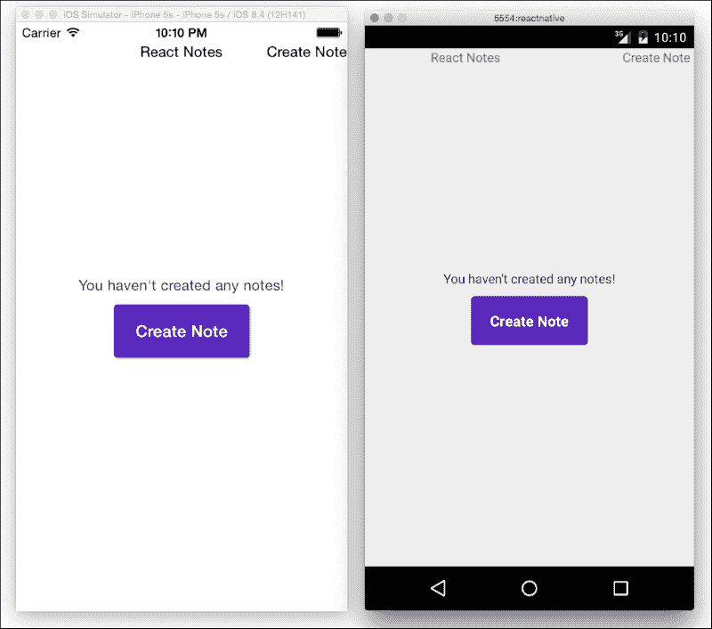

对于一个典型的调用操作按钮来说，这已经很不错了。如果你在模拟器中重新加载并按下按钮，它仍然会因为`TouchableOpacity`的反馈而渐变。有关 React CSS 的更多信息或要贡献，请访问开源 CSS 布局仓库[`github.com/facebook/css-layout`](https://github.com/facebook/css-layout)。

# 布局和 Flexbox

由于 Flexbox 是 React Native 布局的基础，我们将深入探讨它。如果你已经熟悉 Flexbox 的复杂性，请随意跳转到*样式化 NavigationBar 组件*部分。在那里，我们将更多地关注我们在上一章中制作的组件的样式。

## Flex 容器

Flex 容器是描述子元素或 Flex 项目布局的父元素。容器的`flexDirection`属性指定了`main-axis`；项目渲染的主要方向。与`main-axis`垂直的线称为`cross-axis`。容器上的不同 flex 属性会影响项目在每个轴上的对齐方式。`flexDirection`属性有两个可能的值；`row`用于水平布局（从左到右）和`column`用于垂直布局（从上到下）。以下图显示了`flexDirection`：`row`项目从左到右对齐：

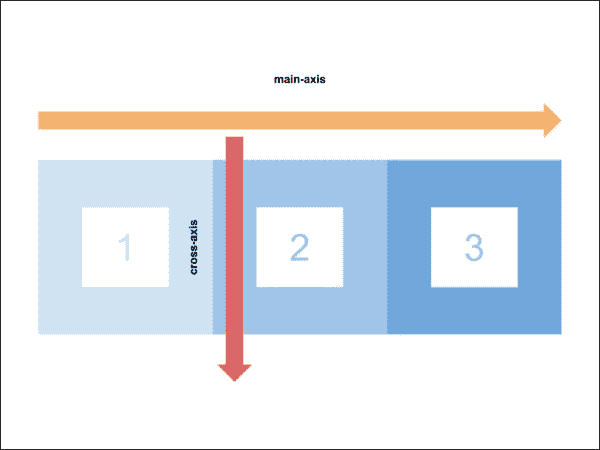

下一图显示了当设置为`flexDirection`：`column`时从上到下排列的项目：

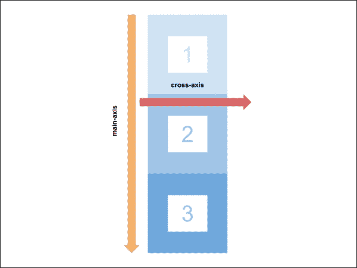

我们可以使用`justifyContent`帮助在容器中沿着已建立的`main-axis`移动项目。以下图显示了`main-axis`上的不同选项：

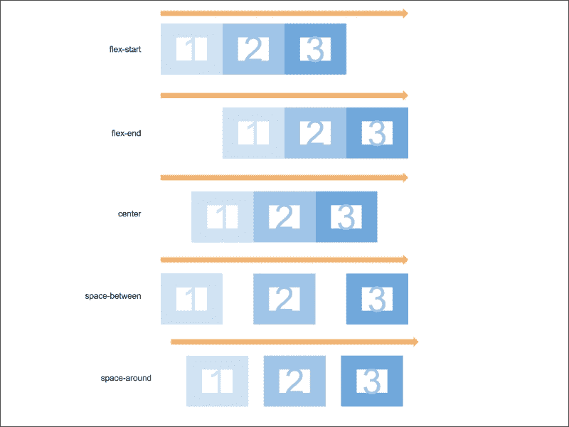

### 注意

注意到`space-between`不包括左和右边缘的空白，而`space-around`则包括，但宽度是项目之间空白宽度的一半。

要沿`cross-axis`移动项目，我们使用`alignItems`:

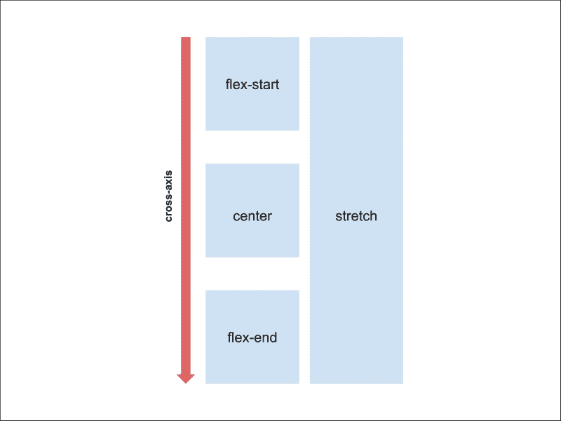

项目包装也是可能的，但默认情况下是禁用的。容器内的所有项目都将尝试沿`main-axis`排列。如果项目太多或太拥挤，你可以应用`flexWrap`。容器将计算是否需要将项目放置在新的一行或列上。

### 弹性项目

默认情况下，`flex`项目将只有其内部内容的宽度。`flex`属性决定了项目应占用的剩余空间量。可用空间根据每个项目的`flex`值比例进行划分：

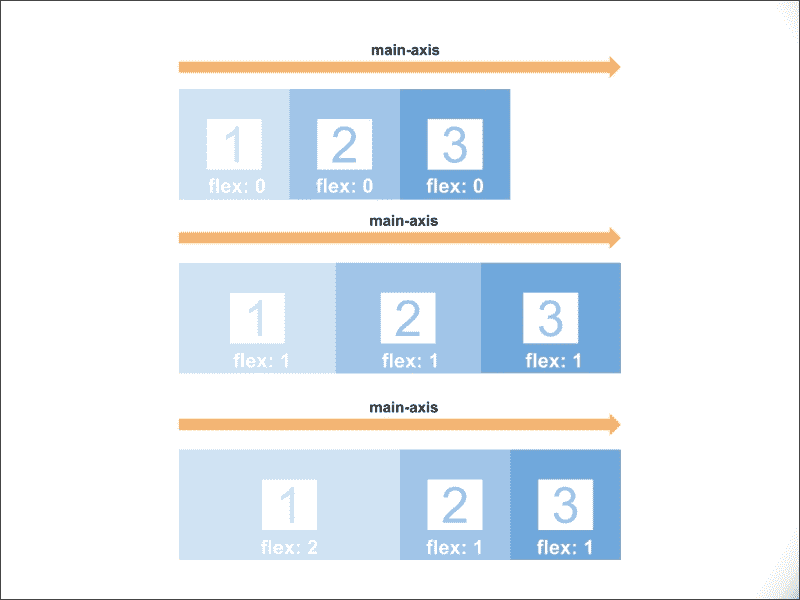

注意第二行的项目都是相同宽度，因为它们的`flex`值是`1`。第三行中`flex`值为`2`的项目比其他项目多占两倍的空间。

与`alignItems`类似，一个`flex`项目可以使用`alignSelf`沿`cross-axis`对齐自己。

### 水平和垂直居中

让我们快速看一下 Flexbox 如何使布局更简单。CSS 中最大的挑战之一是水平和垂直居中的元素（花五分钟尝试用常规 CSS 完成这个任务）。我们将首先创建我们的`Center`组件，并定义一个包含三个`flex`项目的`flex`容器：

```js
class Center extends React.Component {
    render () {
        return (
            <View style={styles.container}>
                <View style={[styles.item, styles.one]}>
                    <Text style={styles.itemText}>1</Text>
                </View>
                <View style={[styles.item, styles.two]}>
                    <Text style={styles.itemText}>2</Text>
                </View>
                <View style={[styles.item, styles.three]}>
                    <Text style={styles.itemText}>3</Text>
                </View>
            </View>
        );
    }
}
```

初始化一个新的`StyleSheet`并为项目定义一些简单的样式：

```js
var styles = StyleSheet.create({
  item: {
    backgroundColor: '#EEE',
    padding: 25
  },
  one: {
    backgroundColor: 'red'
  },
  two: {
    backgroundColor: 'green'
  },
  three: {
    backgroundColor: 'blue'
  },
  itemText: {
    color: 'white',
    fontSize: 40,
  }
});
```

现在，我们想要通过`justifyContent`和`alignItems`来控制项目沿`main-axis`和`cross-axis`的对齐位置。创建一个容器样式，并将`justifyContent`和`alignItems`设置为`center`:

```js
var styles = StyleSheet.create({
  container: {
    flexDirection: 'row',
    alignItems: 'center',
    justifyContent: 'center'
  },

  ...
});
```

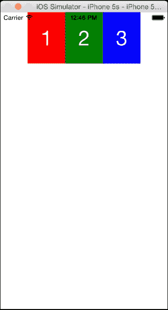

这似乎没有指定`behaviour`。项目沿`main-axis`的中心对齐，但没有沿`cross-axis`对齐。让我们在容器周围添加一个边框来可视化它：

```js
var styles = StyleSheet.create({
  container: {
    borderWidth: 10,
    borderColor: 'purple',
    flexDirection: 'row',
    alignItems: 'center',
    justifyContent: 'center'
  },

  ...
});
```

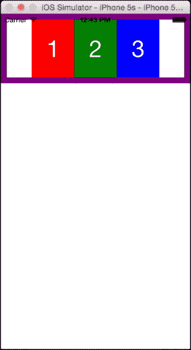

现在我们可以看到容器的长度并没有覆盖整个屏幕。由于根`View`容器中的默认`flexDirection`是`column`，内容将只覆盖内容的高度。幸运的是，我们现在知道如何填充剩余空间。给我们的容器添加`flex 1`将使其在垂直方向上覆盖屏幕长度，这给我们以下结果：

```js
var styles = StyleSheet.create({
  container: {
    borderWidth: 10,
    borderColor: 'purple',
    flex: 1,
    flexDirection: 'row',
    alignItems: 'center',
    justifyContent: 'center'
  },

  ...
});
```

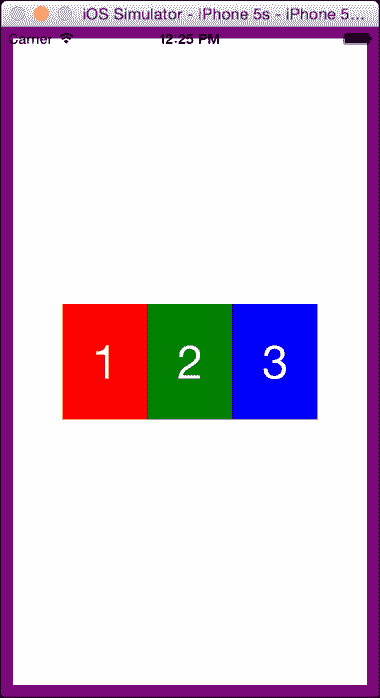

这就完成了我们对 Flexbox 布局的概述！有关支持的 Flexbox 属性的完整列表，请查看 React Native 文档[`facebook.github.io/react-native/docs/flexbox.html#content`](https://facebook.github.io/react-native/docs/flexbox.html#content)。

### 绝对定位

此外，React Native 还提供了将屏幕上的项目定位的选项。这通过定义`top`、`left`、`right`和`bottom`属性与浏览器中的方式相同。我们建议你在求助于绝对定位之前，尝试使用 Flexbox 创建你的布局。

# 设计 NavigationBar 组件

是时候给我们的`NavigationBar`添加 iOS 和 Android 的样式处理了。两者之间只有细微的差别，除了字体大小和填充的渲染方式。我们将首先为`NavigationBar`添加背景颜色和底部边框。将以下内容添加到`index.ios.js`和`index.android.js`中的`StyleSheet`，并定义`navbar`样式：

```js
var styles = StyleSheet.create({
    navContainer: {
      flex: 1
    },
    navBar: {
      backgroundColor: '#5B29C1',
      borderBottomColor: '#48209A',
      borderBottomWidth: 1
    }
});
```

接下来，使用样式属性更新`Navigator.NavigatorBar`：

```js
class ReactNotes extends React.Component {
  ...
  render () {
    return (
      <Navigator
        initialRoute={{name: 'home'}}
        renderScene={this.renderScene}
        navigationBar={
          <Navigator.NavigationBar
            routeMapper={NavigationBarRouteMapper}
            style={styles.navBar}
          />
        }
      />
    );
  }
}
```

最后要更新的是我们的`navbar`标题和`SimpleButton`样式。我们希望文本在垂直方向上居中，同时给屏幕的左右两侧按钮一些填充：

```js
var styles = StyleSheet.create({
    navBar: {
      backgroundColor: '#5B29C1',
      borderBottomColor: '#48209A',
      borderBottomWidth: 1
    },
    navBarTitleText: {
      color: 'white',
      fontSize: 16,
      fontWeight: '500',
      marginVertical: 9  // iOS
   // marginVertical: 16 // Android
    },
    navBarLeftButton: {
      paddingLeft: 10
    },
    navBarRightButton: {
      paddingRight: 10
    },
    navBarButtonText: {
      color: '#EEE',
      fontSize: 16,
      marginVertical: 10 // iOS
   // marginVertical: 16 // Android
    }
});
```

### 注意

正如我们之前提到的，iOS 的`marginVertical`与 Android 版本不同，以产生相同的视觉效果。

最后，更新`NavigationBarRouteMapper`以包含标题和按钮的样式：

```js
var NavigationBarRouteMapper = {
  LeftButton: function(route, navigator, index, navState) {
    switch (route.name) {
      case 'createNote':
        return (
          <SimpleButton
            onPress={() => navigator.pop()}
            customText='Back'
            style={styles.navBarLeftButton}
            textStyle={styles.navBarButtonText}
           />
        );
      default:
        return null;
    }
  },
  RightButton: function(route, navigator, index, navState) {
    switch (route.name) {
      case 'home':
        return (
          <SimpleButton
            onPress={() => {
              navigator.push({
                name: 'createNote'
              });
            }}
            customText='Create Note'
            style={styles.navBarRightButton}
            textStyle={styles.navBarButtonText}
          />
        );
      default:
         return null;
    }
  },

  Title: function(route, navigator, index, navState) {
    switch (route.name) {
      case 'home':
        return (
          <Text style={styles.navBarTitleText}>React Notes</Text>
        );
      case 'createNote':
        return (
          <Text style={styles.navBarTitleText}>Create Note</Text>
        );
    }
  }
};
```

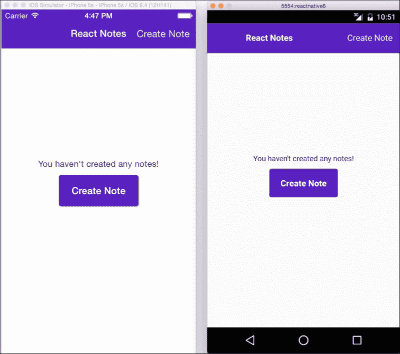

请注意，我们更改了 iOS 版本的状态栏文本颜色为白色。React Native 提供了一个 API 来与 iOS 中的状态栏交互。在我们的`index.ios.js`中，我们可以在`ReactNotes`构造函数中将它切换为白色：

```js
class ReactNotes extends React.Component {
  constructor (props) {
    super(props);
    StatusBarIOS.setStyle('light-content');
  }
  ...
}
```

`StatusBarIOS`的文档可以在 React Native 文档中找到，链接为[`facebook.github.io/react-native/docs/statusbarios.html`](https://facebook.github.io/react-native/docs/statusbarios.html)。

## 更改 Android Material 主题

我们 Android 应用程序的状态栏和导航栏颜色看起来是纯黑色。目前，React Native 没有提供从 JavaScript 中样式化这些元素的支持系统，就像 iOS 上的`StatusBarIOS` API 所提供的那样。我们仍然可以使用 Android 5.0 及以上版本中可用的 Material Theme（位于`ReactNotes/android/app/src/6main/res/values/styles.xml`），来应用我们想要的颜色。将`styles.xml`的内容更改为以下内容：

```js
<resources>
    <!-- Base application theme. -->
    <style name="AppTheme" parent="Theme.AppCompat.Light.NoActionBar">
        <item name="android:colorPrimaryDark">#48209A</item>
        <item name="android:navigationBarColor">#48209A</item>
    </style>
</resources>
```

`colorPrimaryDark`指的是状态栏的颜色，而`navigationBarColor`是底部导航容器的颜色。当你重新启动应用程序时，你应该能够看到状态栏和导航栏正确着色。

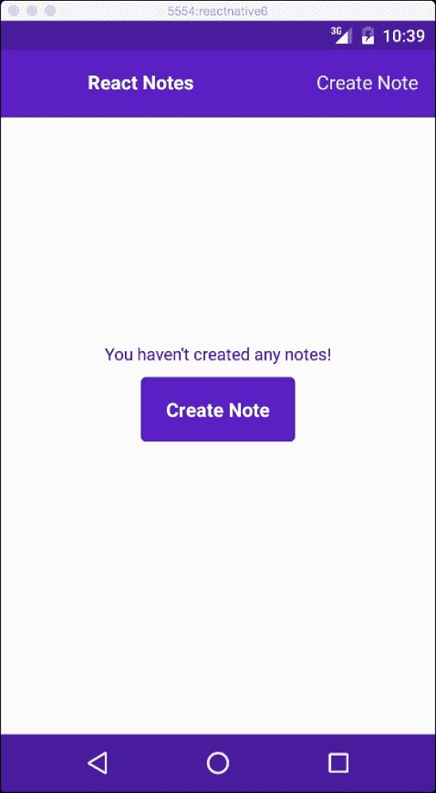

想要了解更多关于使用 Material 主题的信息，请参考 Android 开发者文档中的[`developer.android.com/training/material/theme.html`](https://developer.android.com/training/material/theme.html)。

# 设计 NoteScreen

我们的 `NoteScreen` 有两个没有任何样式的 `TextInput`。到目前为止，很难看到每个输入在屏幕上的位置。在 iOS 和 Android 上，通常会在每个输入下添加下划线。为了实现这一点，我们将 `TextInput` 包裹在 `View` 中，并对其应用 `borderBottom`：

```js
var styles = StyleSheet.create({
  ...

  inputContainer: {
    borderBottomColor: '#9E7CE3',
    borderBottomWidth: 1,
    flexDirection: 'row',
    marginBottom: 10
  }
});

Apply the inputContainer style to Views:
export default class NoteScreen extends React.Component {
  render () {
    return (
      <View style={styles.container}>
        <View style={styles.inputContainer}>
          <TextInput
            autoFocus={true}
            autoCapitalize="sentences"
            placeholder="Untitled"
            style={styles.title}

            onEndEditing={(text) => {this.refs.body.focus()}}
          />
        </View>
        <View style={styles.inputContainer}>
          <TextInput
            ref="body"
            multiline={true}
            placeholder="Start typing"
            style={styles.body}

            textAlignVertical="top"
            underlineColorAndroid="transparent"
          />
        </View>
      </View>
    );
  }
}
```

现有的标题和正文样式定义了每个 `TextInput` 的高度。由于每个输入都将共享 `flex` 属性和文本大小，我们可以定义一个共享样式：

```js
var styles = StyleSheet.create({
  ...
  textInput: {
    flex: 1,
    fontSize: 16,
  },

});
```

然后，在输入样式中，我们可以传递一个数组来包含这两种样式：

```js
class NoteScreen extends React.Component {
  render () {
    return (
      <View style={styles.container}>
        <View style={styles.inputContainer}>
          <TextInput
            autoFocus={true}
            autoCapitalize="sentences"
            placeholder="Untitled"
            style={[styles.textInput, styles.title]}
            onEndEditing={(text) => {this.refs.body.focus()}}
          />
        </View>
        <View style={styles.inputContainer}>
          <TextInput
            ref="body"
            multiline={true}
            placeholder="Start typing"
            style={[styles.textInput, styles.body]}
          />
        </View>
      </View>
    );
  }
}
```

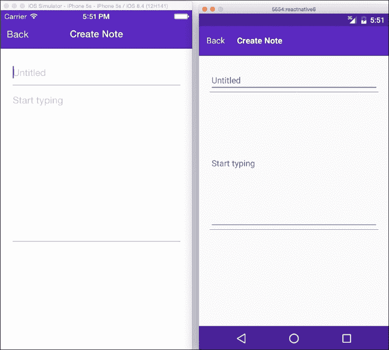

在 Android 上这看起来还不正确。Android 上的 `TextInput` 有一个默认的下划线，并且它们在多行输入中垂直居中文本。有两个仅适用于 Android 的属性可以添加以匹配 iOS 应用程序的外观。在每个 `TextInput` 上设置 `underlineColorAndroid` 为 `transparent`，并在正文中将 `textAlignVertical` 设置为 `TextInput`：

```js
export default class NoteScreen extends React.Component {
  render () {
    return (
      <View style={styles.container}>
        <View style={styles.inputContainer}>
          <TextInput
            autoFocus={true}
            autoCapitalize="sentences"
            placeholder="Untitled"
            style={[styles.textInput, styles.title]}
            onEndEditing={(text) => {this.refs.body.focus()}}
            underlineColorAndroid="transparent"
          />
        </View>
        <View style={styles.inputContainer}>
          <TextInput
            ref="body"
            multiline={true}
            placeholder="Start typing"
            style={[styles.textInput, styles.body]}
            textAlignVertical="top"
            underlineColorAndroid="transparent"
          />
        </View>
      </View>
    );
  }
}
```

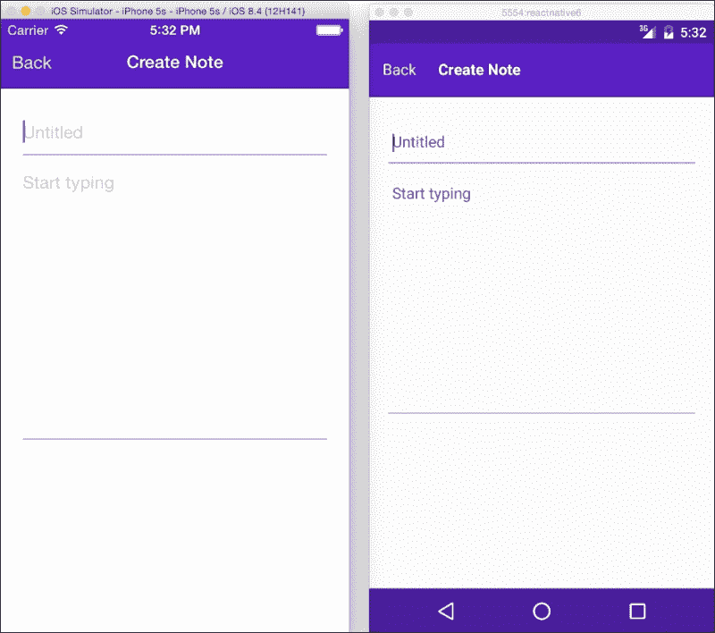

使用这种方法，我们可以在两个设备上获得相同的外观！这完成了我们在上一章中创建的组件的样式设计。从现在开始，每当我们向我们的应用程序添加新组件时，我们就会立即进行样式设计。

# 摘要

React Native 中的样式与浏览器中 CSS 的工作方式非常相似。在本章中，你学习了如何创建和管理样式表并将它们添加到你的组件中。如果你在布局方面感到沮丧，请将 Flexbox 部分作为指南。确保回顾你的 `main-axis` 和 `cross-axis` 的定义位置，以及 `flex` 项目沿着它们对齐的位置。在继续下一章之前，你可以自由地回到我们的组件中并尝试任何样式。
